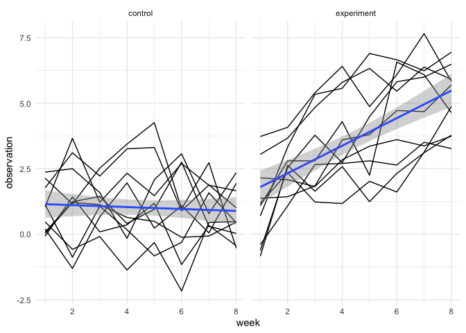
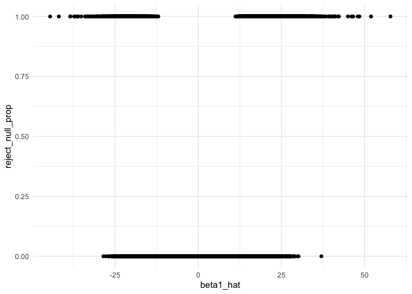
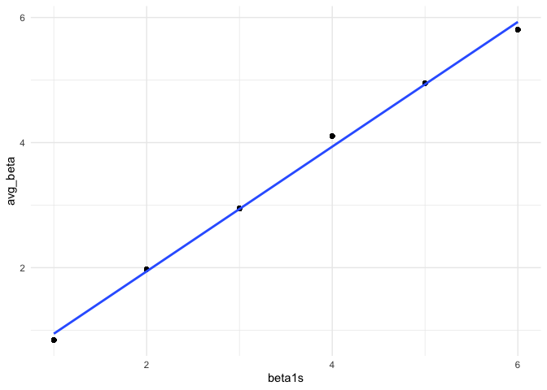
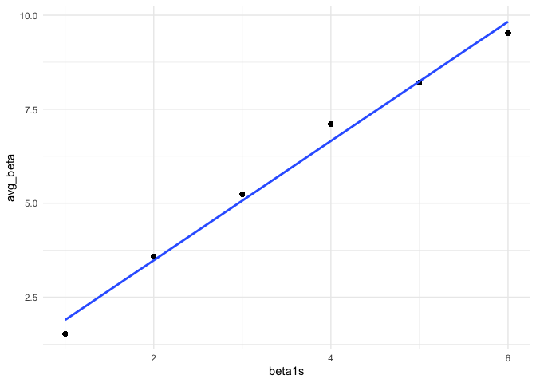

p8105\_hw5\_to2345
================

# Problem 1

For numeric variables, you should fill in missing values with the mean
of non-missing values For character variables, you should fill in
missing values with “virginica”

``` r
fill_na = function(x) {
  output = vector(length = length(x))
  for (i in 1:length(x)) {
    if (is.numeric(x[i])) {
      mean_i = mean(x[!is.na(x)])
      if (!is.na(x[i])) {
        output[i] = x[i]
      } else {
        output[i] = mean_i
      }
    } else if (is.character(x[i])) {
      if (!is.na(x[i])) {
        output[i] = x[i]
      } else {
        output[i] = "virginica"
      }
    }
  }
  output
}

iris_filled = map(iris_with_missing, fill_na) %>%
  as.data.frame()
```

# Problem 2

``` r
filenames = list.files("data")

study_data = 
  tibble(
    filenames = list.files("data"),
    path = str_c("./data/", filenames)
  ) %>% 
  mutate(
    data = map(path, read_csv)
  ) %>% 
  unnest() %>% 
  select(-path) %>% 
  pivot_longer(
    week_1:week_8,
    names_to = "week",
    values_to = "obs"
  ) %>% 
  mutate(
    arm = substr(filenames, 1, 3),
    arm = recode(arm, "con" = "control",
                      "exp" = "experiment"),
    subject_id = substr(filenames, 5, 6),
    subject_id = as.numeric(subject_id),
    week = substr(week, 6, 7),
    week = as.numeric(week)
  ) %>% 
  select(-filenames)
```

Here is the spaghetti plot showing observations on each subject over
time

``` r
study_data %>% 
  ggplot(
    aes(
      x = week,
      y = obs,
      group = subject_id
    )
  ) +
  geom_line() + 
  stat_smooth(
    aes(group = 1),
    method = "lm"
    ) +
  facet_grid(. ~arm) +
  theme_minimal() +
  ylab("observation")
```

<!-- -->

Comment: From the spaghetti plot, we can clearly see that the weekly
observation for the experiment group increases as time increases;
however, the observed data on the control arm did not show improvement
in the outcome and slight decrease is observed.

# Problem 3

``` r
sim_regression = function (n = 30, beta0 = 2, beta1 = 0, sigma = 50){
  
  sim_data = tibble(
    xi1 = rnorm(n, 0, 1),
    yi = beta0 + beta1*xi1 + rnorm(n, 0, sigma)
)
  
  ls_fit = lm(yi ~ xi1, data = sim_data)
  
  tibble(
    beta1_hat = broom::tidy(ls_fit)$estimate[2],
    p_value = broom::tidy(ls_fit)$p.value[2],
    alpha = 0.5
  )
}

rerun(10000, sim_regression()) %>% 
  bind_rows
```

    ## # A tibble: 10,000 x 3
    ##    beta1_hat  p_value alpha
    ##        <dbl>    <dbl> <dbl>
    ##  1     14.3  0.207      0.5
    ##  2      8.70 0.182      0.5
    ##  3      4.26 0.606      0.5
    ##  4     21.4  0.000149   0.5
    ##  5     -8.42 0.471      0.5
    ##  6    -10.6  0.219      0.5
    ##  7    -13.9  0.192      0.5
    ##  8      2.34 0.769      0.5
    ##  9      4.07 0.670      0.5
    ## 10     17.0  0.134      0.5
    ## # … with 9,990 more rows

``` r
sim_results = 
  tibble(beta1s = c(1,2,3,4,5,6)) %>% 
  mutate(
    output_list = map(.x = beta1s, ~rerun(10000, sim_regression(beta1 = .x))),
    estimate_dfs = map(output_list, bind_rows)
  ) %>% 
  select(-output_list) %>% 
  unnest(estimate_dfs) %>% 
  mutate(
    reject_null = ifelse(p_value < alpha, 1, 0)
  )
```

``` r
sim_results %>% 
  group_by(beta1_hat) %>% 
  mutate(
    obs = n(),
    reject_null_prop = sum(p_value < 0.05)/obs) %>% 
  ungroup() %>% 
  ggplot(
    aes(
      x = beta1_hat,
      y = reject_null_prop
    )
  ) +
  geom_point()+
  theme_minimal()
```

<!-- -->

From the plot we can see that it appears to have a positive association
between the proportion of times the null was rejected (the power of the
test) and the effect size.

<!-- -->

This plot whos the average estimate of beta 1 on the y axis and the true
value of beta 1 on the x axis. From the graph we can see a positve
relationship between the true value of beta1 and the average estimate of
the slope.

<!-- -->

The plot above shows the average estimate of beta1 only in samples for
which the null was rejected on the y axis and the true value of beta1 on
the x axis. From the compariso nof two plots, we can see that the sample
average of beta1s across tests for which the null is rejected does not
equal to the true value of beta1. Instead, it is higher than the true
value of beta1. The reason is that, among the trials where the null is
rejected, we excludes the rows where the estimated beta1 approximates 0,
therefore, the sample average of beta1s across tests for which the null
is rejected will be higher than that across all trials.
