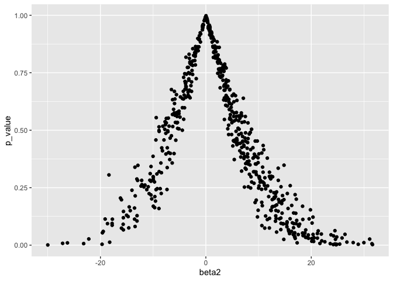

p8105\_hw5\_to2345
================

# Problem 1

For numeric variables, you should fill in missing values with the mean
of non-missing values For character variables, you should fill in
missing values with “virginica”

``` r
fill_na = function(x) {
  output = vector(length = length(x))
  for (i in 1:length(x)) {
    if (is.numeric(x[i])) {
      mean_i = mean(x[!is.na(x)])
      if (!is.na(x[i])) {
        output[i] = x[i]
      } else {
        output[i] = mean_i
      }
    } else if (is.character(x[i])) {
      if (!is.na(x[i])) {
        output[i] = x[i]
      } else {
        output[i] = "virginica"
      }
    }
  }
  output
}

iris_filled = map(iris_with_missing, fill_na) %>%
  as.data.frame()
```

# Problem 2

``` r
filenames = list.files("data")

study_data = 
  tibble(
    filenames = list.files("data"),
    path = str_c("./data/", filenames)
  ) %>% 
  mutate(
    data = map(path, read_csv)
  ) %>% 
  unnest() %>% 
  select(-path) %>% 
  pivot_longer(
    week_1:week_8,
    names_to = "week",
    values_to = "obs"
  ) %>% 
  mutate(
    arm = substr(filenames, 1, 3),
    arm = recode(arm, "con" = "control",
                      "exp" = "experiment"),
    subject_id = substr(filenames, 5, 6),
    subject_id = as.numeric(subject_id),
    week = substr(week, 6, 7),
    week = as.numeric(week)
  ) %>% 
  select(-filenames)
```

Here is the spaghetti plot showing observations on each subject over
time

``` r
study_data %>% 
  ggplot(
    aes(
      x = week,
      y = obs,
      group = subject_id
    )
  ) +
  geom_line() + 
  stat_smooth(
    aes(group = 1),
    method = "lm"
    ) +
  facet_grid(. ~arm) +
  theme_minimal() +
  ylab("observation")
```

<!-- -->

Comment: From the spaghetti plot, we can clearly see that the weekly
observation for the experiment group increases as time increases;
however, the observed data on the control arm did not show improvement
in the outcome and slight decrease is observed.

# Problem 3

``` r
sim_regression = function (n = 30, beta0 = 2, beta1 = 0, sigma = 50){
  
  sim_data = tibble(
    xi1 = rnorm(n, 0, 1),
    yi = beta0 + beta1*xi1 + rnorm(n, 0, sigma)
)
  
  ls_fit = lm(yi ~ xi1, data = sim_data)
  
  tibble(
    beta2 = broom::tidy(ls_fit)$estimate[2],
    p_value = broom::tidy(ls_fit)$p.value[2],
    alpha = 0.5
  )
}

rerun(10000, sim_regression())
```

    ## [[1]]
    ## # A tibble: 1 x 3
    ##   beta2 p_value alpha
    ##   <dbl>   <dbl> <dbl>
    ## 1  14.3   0.207   0.5
    ## 
    ## [[2]]
    ## # A tibble: 1 x 3
    ##   beta2 p_value alpha
    ##   <dbl>   <dbl> <dbl>
    ## 1  8.70   0.182   0.5
    ## 
    ## [[3]]
    ## # A tibble: 1 x 3
    ##   beta2 p_value alpha
    ##   <dbl>   <dbl> <dbl>
    ## 1  4.26   0.606   0.5
    ## 
    ## [[4]]
    ## # A tibble: 1 x 3
    ##   beta2  p_value alpha
    ##   <dbl>    <dbl> <dbl>
    ## 1  21.4 0.000149   0.5
    ## 
    ## [[5]]
    ## # A tibble: 1 x 3
    ##   beta2 p_value alpha
    ##   <dbl>   <dbl> <dbl>
    ## 1 -8.42   0.471   0.5
    ## 
    ## [[6]]
    ## # A tibble: 1 x 3
    ##   beta2 p_value alpha
    ##   <dbl>   <dbl> <dbl>
    ## 1 -10.6   0.219   0.5
    ## 
    ## [[7]]
    ## # A tibble: 1 x 3
    ##   beta2 p_value alpha
    ##   <dbl>   <dbl> <dbl>
    ## 1 -13.9   0.192   0.5
    ## 
    ## [[8]]
    ## # A tibble: 1 x 3
    ##   beta2 p_value alpha
    ##   <dbl>   <dbl> <dbl>
    ## 1  2.34   0.769   0.5
    ## 
    ## [[9]]
    ## # A tibble: 1 x 3
    ##   beta2 p_value alpha
    ##   <dbl>   <dbl> <dbl>
    ## 1  4.07   0.670   0.5
    ## 
    ## [[10]]
    ## # A tibble: 1 x 3
    ##   beta2 p_value alpha
    ##   <dbl>   <dbl> <dbl>
    ## 1  17.0   0.134   0.5
    ## 
    ## [[11]]
    ## # A tibble: 1 x 3
    ##   beta2 p_value alpha
    ##   <dbl>   <dbl> <dbl>
    ## 1 -3.87   0.606   0.5
    ## 
    ## [[12]]
    ## # A tibble: 1 x 3
    ##   beta2 p_value alpha
    ##   <dbl>   <dbl> <dbl>
    ## 1  8.03   0.348   0.5
    ## 
    ## [[13]]
    ## # A tibble: 1 x 3
    ##   beta2 p_value alpha
    ##   <dbl>   <dbl> <dbl>
    ## 1 -3.96   0.683   0.5
    ## 
    ## [[14]]
    ## # A tibble: 1 x 3
    ##   beta2 p_value alpha
    ##   <dbl>   <dbl> <dbl>
    ## 1  12.1   0.199   0.5
    ## 
    ## [[15]]
    ## # A tibble: 1 x 3
    ##   beta2 p_value alpha
    ##   <dbl>   <dbl> <dbl>
    ## 1 -4.55   0.568   0.5
    ## 
    ## [[16]]
    ## # A tibble: 1 x 3
    ##    beta2 p_value alpha
    ##    <dbl>   <dbl> <dbl>
    ## 1 -0.908   0.895   0.5
    ## 
    ## [[17]]
    ## # A tibble: 1 x 3
    ##   beta2 p_value alpha
    ##   <dbl>   <dbl> <dbl>
    ## 1 -6.11   0.490   0.5
    ## 
    ## [[18]]
    ## # A tibble: 1 x 3
    ##    beta2 p_value alpha
    ##    <dbl>   <dbl> <dbl>
    ## 1 -0.168   0.987   0.5
    ## 
    ## [[19]]
    ## # A tibble: 1 x 3
    ##   beta2 p_value alpha
    ##   <dbl>   <dbl> <dbl>
    ## 1  3.26   0.706   0.5
    ## 
    ## [[20]]
    ## # A tibble: 1 x 3
    ##   beta2 p_value alpha
    ##   <dbl>   <dbl> <dbl>
    ## 1 -10.6   0.281   0.5
    ## 
    ## [[21]]
    ## # A tibble: 1 x 3
    ##   beta2 p_value alpha
    ##   <dbl>   <dbl> <dbl>
    ## 1 -13.6  0.0777   0.5
    ## 
    ## [[22]]
    ## # A tibble: 1 x 3
    ##   beta2 p_value alpha
    ##   <dbl>   <dbl> <dbl>
    ## 1  2.58   0.747   0.5
    ## 
    ## [[23]]
    ## # A tibble: 1 x 3
    ##   beta2 p_value alpha
    ##   <dbl>   <dbl> <dbl>
    ## 1  6.83   0.429   0.5
    ## 
    ## [[24]]
    ## # A tibble: 1 x 3
    ##   beta2 p_value alpha
    ##   <dbl>   <dbl> <dbl>
    ## 1 -1.03   0.922   0.5
    ## 
    ## [[25]]
    ## # A tibble: 1 x 3
    ##   beta2 p_value alpha
    ##   <dbl>   <dbl> <dbl>
    ## 1 -8.97   0.219   0.5
    ## 
    ## [[26]]
    ## # A tibble: 1 x 3
    ##   beta2 p_value alpha
    ##   <dbl>   <dbl> <dbl>
    ## 1  16.9  0.0840   0.5
    ## 
    ## [[27]]
    ## # A tibble: 1 x 3
    ##   beta2 p_value alpha
    ##   <dbl>   <dbl> <dbl>
    ## 1  6.83   0.366   0.5
    ## 
    ## [[28]]
    ## # A tibble: 1 x 3
    ##   beta2 p_value alpha
    ##   <dbl>   <dbl> <dbl>
    ## 1  3.35   0.702   0.5
    ## 
    ## [[29]]
    ## # A tibble: 1 x 3
    ##   beta2 p_value alpha
    ##   <dbl>   <dbl> <dbl>
    ## 1  5.79   0.650   0.5
    ## 
    ## [[30]]
    ## # A tibble: 1 x 3
    ##   beta2 p_value alpha
    ##   <dbl>   <dbl> <dbl>
    ## 1 0.608   0.961   0.5
    ## 
    ## [[31]]
    ## # A tibble: 1 x 3
    ##   beta2 p_value alpha
    ##   <dbl>   <dbl> <dbl>
    ## 1 -7.16   0.415   0.5
    ## 
    ## [[32]]
    ## # A tibble: 1 x 3
    ##   beta2 p_value alpha
    ##   <dbl>   <dbl> <dbl>
    ## 1  14.6   0.152   0.5
    ## 
    ## [[33]]
    ## # A tibble: 1 x 3
    ##   beta2 p_value alpha
    ##   <dbl>   <dbl> <dbl>
    ## 1  10.5   0.235   0.5
    ## 
    ## [[34]]
    ## # A tibble: 1 x 3
    ##   beta2 p_value alpha
    ##   <dbl>   <dbl> <dbl>
    ## 1  9.94   0.473   0.5
    ## 
    ## [[35]]
    ## # A tibble: 1 x 3
    ##   beta2 p_value alpha
    ##   <dbl>   <dbl> <dbl>
    ## 1 -7.85   0.337   0.5
    ## 
    ## [[36]]
    ## # A tibble: 1 x 3
    ##   beta2 p_value alpha
    ##   <dbl>   <dbl> <dbl>
    ## 1 -5.67   0.393   0.5
    ## 
    ## [[37]]
    ## # A tibble: 1 x 3
    ##   beta2 p_value alpha
    ##   <dbl>   <dbl> <dbl>
    ## 1  4.39   0.589   0.5
    ## 
    ## [[38]]
    ## # A tibble: 1 x 3
    ##   beta2 p_value alpha
    ##   <dbl>   <dbl> <dbl>
    ## 1  2.35   0.842   0.5
    ## 
    ## [[39]]
    ## # A tibble: 1 x 3
    ##    beta2 p_value alpha
    ##    <dbl>   <dbl> <dbl>
    ## 1 -0.638   0.969   0.5
    ## 
    ## [[40]]
    ## # A tibble: 1 x 3
    ##   beta2 p_value alpha
    ##   <dbl>   <dbl> <dbl>
    ## 1  28.0  0.0209   0.5
    ## 
    ## [[41]]
    ## # A tibble: 1 x 3
    ##   beta2 p_value alpha
    ##   <dbl>   <dbl> <dbl>
    ## 1 -5.38   0.451   0.5
    ## 
    ## [[42]]
    ## # A tibble: 1 x 3
    ##   beta2 p_value alpha
    ##   <dbl>   <dbl> <dbl>
    ## 1 -3.61   0.738   0.5
    ## 
    ## [[43]]
    ## # A tibble: 1 x 3
    ##   beta2 p_value alpha
    ##   <dbl>   <dbl> <dbl>
    ## 1 -5.69   0.666   0.5
    ## 
    ## [[44]]
    ## # A tibble: 1 x 3
    ##   beta2 p_value alpha
    ##   <dbl>   <dbl> <dbl>
    ## 1  20.3  0.0944   0.5
    ## 
    ## [[45]]
    ## # A tibble: 1 x 3
    ##   beta2 p_value alpha
    ##   <dbl>   <dbl> <dbl>
    ## 1  9.39   0.360   0.5
    ## 
    ## [[46]]
    ## # A tibble: 1 x 3
    ##   beta2 p_value alpha
    ##   <dbl>   <dbl> <dbl>
    ## 1 -4.63   0.570   0.5
    ## 
    ## [[47]]
    ## # A tibble: 1 x 3
    ##   beta2 p_value alpha
    ##   <dbl>   <dbl> <dbl>
    ## 1  10.9   0.309   0.5
    ## 
    ## [[48]]
    ## # A tibble: 1 x 3
    ##   beta2 p_value alpha
    ##   <dbl>   <dbl> <dbl>
    ## 1  8.29   0.506   0.5
    ## 
    ## [[49]]
    ## # A tibble: 1 x 3
    ##    beta2 p_value alpha
    ##    <dbl>   <dbl> <dbl>
    ## 1 -0.477   0.953   0.5
    ## 
    ## [[50]]
    ## # A tibble: 1 x 3
    ##   beta2 p_value alpha
    ##   <dbl>   <dbl> <dbl>
    ## 1  8.56   0.451   0.5
    ## 
    ## [[51]]
    ## # A tibble: 1 x 3
    ##   beta2 p_value alpha
    ##   <dbl>   <dbl> <dbl>
    ## 1 -11.9   0.249   0.5
    ## 
    ## [[52]]
    ## # A tibble: 1 x 3
    ##   beta2 p_value alpha
    ##   <dbl>   <dbl> <dbl>
    ## 1  1.60   0.840   0.5
    ## 
    ## [[53]]
    ## # A tibble: 1 x 3
    ##   beta2 p_value alpha
    ##   <dbl>   <dbl> <dbl>
    ## 1 -11.2   0.257   0.5
    ## 
    ## [[54]]
    ## # A tibble: 1 x 3
    ##   beta2 p_value alpha
    ##   <dbl>   <dbl> <dbl>
    ## 1 -5.58   0.424   0.5
    ## 
    ## [[55]]
    ## # A tibble: 1 x 3
    ##   beta2 p_value alpha
    ##   <dbl>   <dbl> <dbl>
    ## 1  9.29   0.246   0.5
    ## 
    ## [[56]]
    ## # A tibble: 1 x 3
    ##   beta2 p_value alpha
    ##   <dbl>   <dbl> <dbl>
    ## 1 -2.70   0.734   0.5
    ## 
    ## [[57]]
    ## # A tibble: 1 x 3
    ##   beta2 p_value alpha
    ##   <dbl>   <dbl> <dbl>
    ## 1  2.50   0.768   0.5
    ## 
    ## [[58]]
    ## # A tibble: 1 x 3
    ##    beta2 p_value alpha
    ##    <dbl>   <dbl> <dbl>
    ## 1 -0.565   0.945   0.5
    ## 
    ## [[59]]
    ## # A tibble: 1 x 3
    ##   beta2 p_value alpha
    ##   <dbl>   <dbl> <dbl>
    ## 1  6.94   0.494   0.5
    ## 
    ## [[60]]
    ## # A tibble: 1 x 3
    ##   beta2 p_value alpha
    ##   <dbl>   <dbl> <dbl>
    ## 1  15.2   0.132   0.5
    ## 
    ## [[61]]
    ## # A tibble: 1 x 3
    ##   beta2 p_value alpha
    ##   <dbl>   <dbl> <dbl>
    ## 1 -1.06   0.907   0.5
    ## 
    ## [[62]]
    ## # A tibble: 1 x 3
    ##   beta2 p_value alpha
    ##   <dbl>   <dbl> <dbl>
    ## 1 -8.62   0.243   0.5
    ## 
    ## [[63]]
    ## # A tibble: 1 x 3
    ##   beta2 p_value alpha
    ##   <dbl>   <dbl> <dbl>
    ## 1 -4.51   0.549   0.5
    ## 
    ## [[64]]
    ## # A tibble: 1 x 3
    ##    beta2 p_value alpha
    ##    <dbl>   <dbl> <dbl>
    ## 1 -0.315   0.966   0.5
    ## 
    ## [[65]]
    ## # A tibble: 1 x 3
    ##   beta2 p_value alpha
    ##   <dbl>   <dbl> <dbl>
    ## 1 -4.20   0.642   0.5
    ## 
    ## [[66]]
    ## # A tibble: 1 x 3
    ##   beta2 p_value alpha
    ##   <dbl>   <dbl> <dbl>
    ## 1  2.44   0.826   0.5
    ## 
    ## [[67]]
    ## # A tibble: 1 x 3
    ##   beta2 p_value alpha
    ##   <dbl>   <dbl> <dbl>
    ## 1  1.16   0.938   0.5
    ## 
    ## [[68]]
    ## # A tibble: 1 x 3
    ##   beta2 p_value alpha
    ##   <dbl>   <dbl> <dbl>
    ## 1  5.43   0.578   0.5
    ## 
    ## [[69]]
    ## # A tibble: 1 x 3
    ##   beta2 p_value alpha
    ##   <dbl>   <dbl> <dbl>
    ## 1  4.71   0.701   0.5
    ## 
    ## [[70]]
    ## # A tibble: 1 x 3
    ##   beta2 p_value alpha
    ##   <dbl>   <dbl> <dbl>
    ## 1 -12.4  0.0973   0.5
    ## 
    ## [[71]]
    ## # A tibble: 1 x 3
    ##   beta2 p_value alpha
    ##   <dbl>   <dbl> <dbl>
    ## 1 -5.04   0.617   0.5
    ## 
    ## [[72]]
    ## # A tibble: 1 x 3
    ##   beta2 p_value alpha
    ##   <dbl>   <dbl> <dbl>
    ## 1  9.24   0.313   0.5
    ## 
    ## [[73]]
    ## # A tibble: 1 x 3
    ##   beta2 p_value alpha
    ##   <dbl>   <dbl> <dbl>
    ## 1 -3.79   0.707   0.5
    ## 
    ## [[74]]
    ## # A tibble: 1 x 3
    ##   beta2 p_value alpha
    ##   <dbl>   <dbl> <dbl>
    ## 1 -4.62   0.616   0.5
    ## 
    ## [[75]]
    ## # A tibble: 1 x 3
    ##   beta2 p_value alpha
    ##   <dbl>   <dbl> <dbl>
    ## 1  8.56   0.314   0.5
    ## 
    ## [[76]]
    ## # A tibble: 1 x 3
    ##   beta2 p_value alpha
    ##   <dbl>   <dbl> <dbl>
    ## 1 -11.7   0.256   0.5
    ## 
    ## [[77]]
    ## # A tibble: 1 x 3
    ##   beta2 p_value alpha
    ##   <dbl>   <dbl> <dbl>
    ## 1  5.43   0.540   0.5
    ## 
    ## [[78]]
    ## # A tibble: 1 x 3
    ##   beta2 p_value alpha
    ##   <dbl>   <dbl> <dbl>
    ## 1  2.86   0.783   0.5
    ## 
    ## [[79]]
    ## # A tibble: 1 x 3
    ##   beta2 p_value alpha
    ##   <dbl>   <dbl> <dbl>
    ## 1 -3.10   0.656   0.5
    ## 
    ## [[80]]
    ## # A tibble: 1 x 3
    ##   beta2 p_value alpha
    ##   <dbl>   <dbl> <dbl>
    ## 1 -4.12   0.611   0.5
    ## 
    ## [[81]]
    ## # A tibble: 1 x 3
    ##   beta2 p_value alpha
    ##   <dbl>   <dbl> <dbl>
    ## 1 -7.31   0.580   0.5
    ## 
    ## [[82]]
    ## # A tibble: 1 x 3
    ##   beta2 p_value alpha
    ##   <dbl>   <dbl> <dbl>
    ## 1  5.08   0.649   0.5
    ## 
    ## [[83]]
    ## # A tibble: 1 x 3
    ##   beta2 p_value alpha
    ##   <dbl>   <dbl> <dbl>
    ## 1  6.17   0.505   0.5
    ## 
    ## [[84]]
    ## # A tibble: 1 x 3
    ##   beta2 p_value alpha
    ##   <dbl>   <dbl> <dbl>
    ## 1  26.2  0.0354   0.5
    ## 
    ## [[85]]
    ## # A tibble: 1 x 3
    ##   beta2 p_value alpha
    ##   <dbl>   <dbl> <dbl>
    ## 1 -10.7   0.330   0.5
    ## 
    ## [[86]]
    ## # A tibble: 1 x 3
    ##   beta2 p_value alpha
    ##   <dbl>   <dbl> <dbl>
    ## 1 -8.98   0.452   0.5
    ## 
    ## [[87]]
    ## # A tibble: 1 x 3
    ##   beta2 p_value alpha
    ##   <dbl>   <dbl> <dbl>
    ## 1  7.65   0.516   0.5
    ## 
    ## [[88]]
    ## # A tibble: 1 x 3
    ##   beta2 p_value alpha
    ##   <dbl>   <dbl> <dbl>
    ## 1 -4.85   0.561   0.5
    ## 
    ## [[89]]
    ## # A tibble: 1 x 3
    ##   beta2 p_value alpha
    ##   <dbl>   <dbl> <dbl>
    ## 1  1.32   0.901   0.5
    ## 
    ## [[90]]
    ## # A tibble: 1 x 3
    ##   beta2 p_value alpha
    ##   <dbl>   <dbl> <dbl>
    ## 1  2.88   0.702   0.5
    ## 
    ## [[91]]
    ## # A tibble: 1 x 3
    ##   beta2 p_value alpha
    ##   <dbl>   <dbl> <dbl>
    ## 1 0.346   0.966   0.5
    ## 
    ## [[92]]
    ## # A tibble: 1 x 3
    ##   beta2 p_value alpha
    ##   <dbl>   <dbl> <dbl>
    ## 1 -18.5  0.0352   0.5
    ## 
    ## [[93]]
    ## # A tibble: 1 x 3
    ##   beta2 p_value alpha
    ##   <dbl>   <dbl> <dbl>
    ## 1  5.59   0.360   0.5
    ## 
    ## [[94]]
    ## # A tibble: 1 x 3
    ##   beta2 p_value alpha
    ##   <dbl>   <dbl> <dbl>
    ## 1  6.54   0.210   0.5
    ## 
    ## [[95]]
    ## # A tibble: 1 x 3
    ##   beta2 p_value alpha
    ##   <dbl>   <dbl> <dbl>
    ## 1 -6.00   0.661   0.5
    ## 
    ## [[96]]
    ## # A tibble: 1 x 3
    ##   beta2 p_value alpha
    ##   <dbl>   <dbl> <dbl>
    ## 1 -9.17   0.402   0.5
    ## 
    ## [[97]]
    ## # A tibble: 1 x 3
    ##   beta2 p_value alpha
    ##   <dbl>   <dbl> <dbl>
    ## 1  1.89   0.859   0.5
    ## 
    ## [[98]]
    ## # A tibble: 1 x 3
    ##   beta2 p_value alpha
    ##   <dbl>   <dbl> <dbl>
    ## 1 -15.8   0.233   0.5
    ## 
    ## [[99]]
    ## # A tibble: 1 x 3
    ##   beta2 p_value alpha
    ##   <dbl>   <dbl> <dbl>
    ## 1 -3.52   0.705   0.5
    ## 
    ## [[100]]
    ## # A tibble: 1 x 3
    ##   beta2 p_value alpha
    ##   <dbl>   <dbl> <dbl>
    ## 1  3.78   0.611   0.5
    ## 
    ## [[101]]
    ## # A tibble: 1 x 3
    ##   beta2 p_value alpha
    ##   <dbl>   <dbl> <dbl>
    ## 1  5.60   0.624   0.5
    ## 
    ## [[102]]
    ## # A tibble: 1 x 3
    ##   beta2 p_value alpha
    ##   <dbl>   <dbl> <dbl>
    ## 1  26.0  0.0182   0.5
    ## 
    ## [[103]]
    ## # A tibble: 1 x 3
    ##   beta2 p_value alpha
    ##   <dbl>   <dbl> <dbl>
    ## 1 -10.4   0.385   0.5
    ## 
    ## [[104]]
    ## # A tibble: 1 x 3
    ##   beta2 p_value alpha
    ##   <dbl>   <dbl> <dbl>
    ## 1 -4.31   0.539   0.5
    ## 
    ## [[105]]
    ## # A tibble: 1 x 3
    ##   beta2 p_value alpha
    ##   <dbl>   <dbl> <dbl>
    ## 1 -1.14   0.943   0.5
    ## 
    ## [[106]]
    ## # A tibble: 1 x 3
    ##   beta2 p_value alpha
    ##   <dbl>   <dbl> <dbl>
    ## 1  22.7  0.0245   0.5
    ## 
    ## [[107]]
    ## # A tibble: 1 x 3
    ##   beta2 p_value alpha
    ##   <dbl>   <dbl> <dbl>
    ## 1 -16.8   0.102   0.5
    ## 
    ## [[108]]
    ## # A tibble: 1 x 3
    ##   beta2 p_value alpha
    ##   <dbl>   <dbl> <dbl>
    ## 1 -9.35   0.242   0.5
    ## 
    ## [[109]]
    ## # A tibble: 1 x 3
    ##   beta2 p_value alpha
    ##   <dbl>   <dbl> <dbl>
    ## 1 -7.02   0.447   0.5
    ## 
    ## [[110]]
    ## # A tibble: 1 x 3
    ##   beta2 p_value alpha
    ##   <dbl>   <dbl> <dbl>
    ## 1  5.62   0.662   0.5
    ## 
    ## [[111]]
    ## # A tibble: 1 x 3
    ##   beta2 p_value alpha
    ##   <dbl>   <dbl> <dbl>
    ## 1 -5.83   0.617   0.5
    ## 
    ## [[112]]
    ## # A tibble: 1 x 3
    ##   beta2 p_value alpha
    ##   <dbl>   <dbl> <dbl>
    ## 1 -19.6  0.0400   0.5
    ## 
    ## [[113]]
    ## # A tibble: 1 x 3
    ##   beta2 p_value alpha
    ##   <dbl>   <dbl> <dbl>
    ## 1 -14.3   0.112   0.5
    ## 
    ## [[114]]
    ## # A tibble: 1 x 3
    ##   beta2 p_value alpha
    ##   <dbl>   <dbl> <dbl>
    ## 1 -1.59   0.867   0.5
    ## 
    ## [[115]]
    ## # A tibble: 1 x 3
    ##   beta2 p_value alpha
    ##   <dbl>   <dbl> <dbl>
    ## 1 -5.60   0.553   0.5
    ## 
    ## [[116]]
    ## # A tibble: 1 x 3
    ##   beta2 p_value alpha
    ##   <dbl>   <dbl> <dbl>
    ## 1 -5.05   0.547   0.5
    ## 
    ## [[117]]
    ## # A tibble: 1 x 3
    ##   beta2 p_value alpha
    ##   <dbl>   <dbl> <dbl>
    ## 1 -13.0   0.184   0.5
    ## 
    ## [[118]]
    ## # A tibble: 1 x 3
    ##   beta2 p_value alpha
    ##   <dbl>   <dbl> <dbl>
    ## 1  2.04   0.819   0.5
    ## 
    ## [[119]]
    ## # A tibble: 1 x 3
    ##   beta2 p_value alpha
    ##   <dbl>   <dbl> <dbl>
    ## 1 -1.73   0.827   0.5
    ## 
    ## [[120]]
    ## # A tibble: 1 x 3
    ##   beta2 p_value alpha
    ##   <dbl>   <dbl> <dbl>
    ## 1 -12.4  0.0434   0.5
    ## 
    ## [[121]]
    ## # A tibble: 1 x 3
    ##    beta2 p_value alpha
    ##    <dbl>   <dbl> <dbl>
    ## 1 -0.236   0.977   0.5
    ## 
    ## [[122]]
    ## # A tibble: 1 x 3
    ##   beta2 p_value alpha
    ##   <dbl>   <dbl> <dbl>
    ## 1 -1.08   0.912   0.5
    ## 
    ## [[123]]
    ## # A tibble: 1 x 3
    ##   beta2 p_value alpha
    ##   <dbl>   <dbl> <dbl>
    ## 1 -6.71   0.559   0.5
    ## 
    ## [[124]]
    ## # A tibble: 1 x 3
    ##   beta2 p_value alpha
    ##   <dbl>   <dbl> <dbl>
    ## 1  10.3   0.283   0.5
    ## 
    ## [[125]]
    ## # A tibble: 1 x 3
    ##   beta2 p_value alpha
    ##   <dbl>   <dbl> <dbl>
    ## 1 -2.52   0.813   0.5
    ## 
    ## [[126]]
    ## # A tibble: 1 x 3
    ##   beta2 p_value alpha
    ##   <dbl>   <dbl> <dbl>
    ## 1  3.36   0.630   0.5
    ## 
    ## [[127]]
    ## # A tibble: 1 x 3
    ##   beta2 p_value alpha
    ##   <dbl>   <dbl> <dbl>
    ## 1  14.2  0.0757   0.5
    ## 
    ## [[128]]
    ## # A tibble: 1 x 3
    ##   beta2 p_value alpha
    ##   <dbl>   <dbl> <dbl>
    ## 1  5.64   0.506   0.5
    ## 
    ## [[129]]
    ## # A tibble: 1 x 3
    ##   beta2 p_value alpha
    ##   <dbl>   <dbl> <dbl>
    ## 1 -2.32   0.824   0.5
    ## 
    ## [[130]]
    ## # A tibble: 1 x 3
    ##   beta2 p_value alpha
    ##   <dbl>   <dbl> <dbl>
    ## 1  1.50   0.892   0.5
    ## 
    ## [[131]]
    ## # A tibble: 1 x 3
    ##   beta2 p_value alpha
    ##   <dbl>   <dbl> <dbl>
    ## 1  7.32   0.662   0.5
    ## 
    ## [[132]]
    ## # A tibble: 1 x 3
    ##   beta2 p_value alpha
    ##   <dbl>   <dbl> <dbl>
    ## 1  9.15   0.338   0.5
    ## 
    ## [[133]]
    ## # A tibble: 1 x 3
    ##   beta2 p_value alpha
    ##   <dbl>   <dbl> <dbl>
    ## 1 -1.39   0.908   0.5
    ## 
    ## [[134]]
    ## # A tibble: 1 x 3
    ##   beta2 p_value alpha
    ##   <dbl>   <dbl> <dbl>
    ## 1 -9.93   0.375   0.5
    ## 
    ## [[135]]
    ## # A tibble: 1 x 3
    ##   beta2 p_value alpha
    ##   <dbl>   <dbl> <dbl>
    ## 1  6.87   0.378   0.5
    ## 
    ## [[136]]
    ## # A tibble: 1 x 3
    ##   beta2 p_value alpha
    ##   <dbl>   <dbl> <dbl>
    ## 1  1.36   0.902   0.5
    ## 
    ## [[137]]
    ## # A tibble: 1 x 3
    ##   beta2 p_value alpha
    ##   <dbl>   <dbl> <dbl>
    ## 1 -1.01   0.871   0.5
    ## 
    ## [[138]]
    ## # A tibble: 1 x 3
    ##   beta2 p_value alpha
    ##   <dbl>   <dbl> <dbl>
    ## 1  1.03   0.908   0.5
    ## 
    ## [[139]]
    ## # A tibble: 1 x 3
    ##   beta2 p_value alpha
    ##   <dbl>   <dbl> <dbl>
    ## 1 -3.82   0.693   0.5
    ## 
    ## [[140]]
    ## # A tibble: 1 x 3
    ##   beta2 p_value alpha
    ##   <dbl>   <dbl> <dbl>
    ## 1  1.67   0.886   0.5
    ## 
    ## [[141]]
    ## # A tibble: 1 x 3
    ##   beta2 p_value alpha
    ##   <dbl>   <dbl> <dbl>
    ## 1  4.56   0.519   0.5
    ## 
    ## [[142]]
    ## # A tibble: 1 x 3
    ##   beta2 p_value alpha
    ##   <dbl>   <dbl> <dbl>
    ## 1 -2.02   0.865   0.5
    ## 
    ## [[143]]
    ## # A tibble: 1 x 3
    ##   beta2 p_value alpha
    ##   <dbl>   <dbl> <dbl>
    ## 1  3.19   0.778   0.5
    ## 
    ## [[144]]
    ## # A tibble: 1 x 3
    ##   beta2 p_value alpha
    ##   <dbl>   <dbl> <dbl>
    ## 1 0.785   0.929   0.5
    ## 
    ## [[145]]
    ## # A tibble: 1 x 3
    ##   beta2 p_value alpha
    ##   <dbl>   <dbl> <dbl>
    ## 1  14.6   0.200   0.5
    ## 
    ## [[146]]
    ## # A tibble: 1 x 3
    ##   beta2 p_value alpha
    ##   <dbl>   <dbl> <dbl>
    ## 1  4.65   0.556   0.5
    ## 
    ## [[147]]
    ## # A tibble: 1 x 3
    ##   beta2 p_value alpha
    ##   <dbl>   <dbl> <dbl>
    ## 1 -3.57   0.673   0.5
    ## 
    ## [[148]]
    ## # A tibble: 1 x 3
    ##    beta2 p_value alpha
    ##    <dbl>   <dbl> <dbl>
    ## 1 -0.978   0.890   0.5
    ## 
    ## [[149]]
    ## # A tibble: 1 x 3
    ##   beta2 p_value alpha
    ##   <dbl>   <dbl> <dbl>
    ## 1  7.35   0.506   0.5
    ## 
    ## [[150]]
    ## # A tibble: 1 x 3
    ##   beta2 p_value alpha
    ##   <dbl>   <dbl> <dbl>
    ## 1 -1.77   0.834   0.5
    ## 
    ## [[151]]
    ## # A tibble: 1 x 3
    ##   beta2 p_value alpha
    ##   <dbl>   <dbl> <dbl>
    ## 1  1.32   0.868   0.5
    ## 
    ## [[152]]
    ## # A tibble: 1 x 3
    ##   beta2 p_value alpha
    ##   <dbl>   <dbl> <dbl>
    ## 1 -1.72   0.845   0.5
    ## 
    ## [[153]]
    ## # A tibble: 1 x 3
    ##   beta2 p_value alpha
    ##   <dbl>   <dbl> <dbl>
    ## 1 -1.28   0.875   0.5
    ## 
    ## [[154]]
    ## # A tibble: 1 x 3
    ##   beta2 p_value alpha
    ##   <dbl>   <dbl> <dbl>
    ## 1 -4.95   0.493   0.5
    ## 
    ## [[155]]
    ## # A tibble: 1 x 3
    ##   beta2 p_value alpha
    ##   <dbl>   <dbl> <dbl>
    ## 1  7.44   0.341   0.5
    ## 
    ## [[156]]
    ## # A tibble: 1 x 3
    ##   beta2 p_value alpha
    ##   <dbl>   <dbl> <dbl>
    ## 1 0.992   0.908   0.5
    ## 
    ## [[157]]
    ## # A tibble: 1 x 3
    ##   beta2 p_value alpha
    ##   <dbl>   <dbl> <dbl>
    ## 1 -18.1  0.0309   0.5
    ## 
    ## [[158]]
    ## # A tibble: 1 x 3
    ##   beta2 p_value alpha
    ##   <dbl>   <dbl> <dbl>
    ## 1  2.62   0.813   0.5
    ## 
    ## [[159]]
    ## # A tibble: 1 x 3
    ##   beta2 p_value alpha
    ##   <dbl>   <dbl> <dbl>
    ## 1 -1.19   0.901   0.5
    ## 
    ## [[160]]
    ## # A tibble: 1 x 3
    ##   beta2 p_value alpha
    ##   <dbl>   <dbl> <dbl>
    ## 1 -10.8   0.301   0.5
    ## 
    ## [[161]]
    ## # A tibble: 1 x 3
    ##   beta2 p_value alpha
    ##   <dbl>   <dbl> <dbl>
    ## 1  13.7   0.120   0.5
    ## 
    ## [[162]]
    ## # A tibble: 1 x 3
    ##   beta2 p_value alpha
    ##   <dbl>   <dbl> <dbl>
    ## 1 -3.97   0.667   0.5
    ## 
    ## [[163]]
    ## # A tibble: 1 x 3
    ##   beta2 p_value alpha
    ##   <dbl>   <dbl> <dbl>
    ## 1 -8.06   0.472   0.5
    ## 
    ## [[164]]
    ## # A tibble: 1 x 3
    ##   beta2 p_value alpha
    ##   <dbl>   <dbl> <dbl>
    ## 1  9.04   0.279   0.5
    ## 
    ## [[165]]
    ## # A tibble: 1 x 3
    ##   beta2 p_value alpha
    ##   <dbl>   <dbl> <dbl>
    ## 1  1.04   0.910   0.5
    ## 
    ## [[166]]
    ## # A tibble: 1 x 3
    ##   beta2 p_value alpha
    ##   <dbl>   <dbl> <dbl>
    ## 1  11.3   0.420   0.5
    ## 
    ## [[167]]
    ## # A tibble: 1 x 3
    ##   beta2 p_value alpha
    ##   <dbl>   <dbl> <dbl>
    ## 1 0.383   0.973   0.5
    ## 
    ## [[168]]
    ## # A tibble: 1 x 3
    ##   beta2 p_value alpha
    ##   <dbl>   <dbl> <dbl>
    ## 1  5.50   0.555   0.5
    ## 
    ## [[169]]
    ## # A tibble: 1 x 3
    ##   beta2 p_value alpha
    ##   <dbl>   <dbl> <dbl>
    ## 1 -7.89   0.443   0.5
    ## 
    ## [[170]]
    ## # A tibble: 1 x 3
    ##   beta2 p_value alpha
    ##   <dbl>   <dbl> <dbl>
    ## 1 -5.63   0.544   0.5
    ## 
    ## [[171]]
    ## # A tibble: 1 x 3
    ##   beta2 p_value alpha
    ##   <dbl>   <dbl> <dbl>
    ## 1  11.3   0.125   0.5
    ## 
    ## [[172]]
    ## # A tibble: 1 x 3
    ##   beta2 p_value alpha
    ##   <dbl>   <dbl> <dbl>
    ## 1  4.68   0.615   0.5
    ## 
    ## [[173]]
    ## # A tibble: 1 x 3
    ##   beta2 p_value alpha
    ##   <dbl>   <dbl> <dbl>
    ## 1 -3.15   0.718   0.5
    ## 
    ## [[174]]
    ## # A tibble: 1 x 3
    ##   beta2 p_value alpha
    ##   <dbl>   <dbl> <dbl>
    ## 1 -18.9  0.0189   0.5
    ## 
    ## [[175]]
    ## # A tibble: 1 x 3
    ##    beta2 p_value alpha
    ##    <dbl>   <dbl> <dbl>
    ## 1 0.0971   0.992   0.5
    ## 
    ## [[176]]
    ## # A tibble: 1 x 3
    ##   beta2 p_value alpha
    ##   <dbl>   <dbl> <dbl>
    ## 1  8.44   0.443   0.5
    ## 
    ## [[177]]
    ## # A tibble: 1 x 3
    ##   beta2 p_value alpha
    ##   <dbl>   <dbl> <dbl>
    ## 1  8.19   0.440   0.5
    ## 
    ## [[178]]
    ## # A tibble: 1 x 3
    ##   beta2 p_value alpha
    ##   <dbl>   <dbl> <dbl>
    ## 1 -8.17   0.355   0.5
    ## 
    ## [[179]]
    ## # A tibble: 1 x 3
    ##   beta2 p_value alpha
    ##   <dbl>   <dbl> <dbl>
    ## 1 -3.33   0.765   0.5
    ## 
    ## [[180]]
    ## # A tibble: 1 x 3
    ##   beta2 p_value alpha
    ##   <dbl>   <dbl> <dbl>
    ## 1  7.30   0.416   0.5
    ## 
    ## [[181]]
    ## # A tibble: 1 x 3
    ##   beta2 p_value alpha
    ##   <dbl>   <dbl> <dbl>
    ## 1  10.2   0.376   0.5
    ## 
    ## [[182]]
    ## # A tibble: 1 x 3
    ##   beta2 p_value alpha
    ##   <dbl>   <dbl> <dbl>
    ## 1 -13.6   0.147   0.5
    ## 
    ## [[183]]
    ## # A tibble: 1 x 3
    ##   beta2 p_value alpha
    ##   <dbl>   <dbl> <dbl>
    ## 1  1.93   0.772   0.5
    ## 
    ## [[184]]
    ## # A tibble: 1 x 3
    ##   beta2 p_value alpha
    ##   <dbl>   <dbl> <dbl>
    ## 1  13.7  0.0907   0.5
    ## 
    ## [[185]]
    ## # A tibble: 1 x 3
    ##   beta2 p_value alpha
    ##   <dbl>   <dbl> <dbl>
    ## 1 -9.04   0.290   0.5
    ## 
    ## [[186]]
    ## # A tibble: 1 x 3
    ##   beta2 p_value alpha
    ##   <dbl>   <dbl> <dbl>
    ## 1  8.00   0.360   0.5
    ## 
    ## [[187]]
    ## # A tibble: 1 x 3
    ##   beta2 p_value alpha
    ##   <dbl>   <dbl> <dbl>
    ## 1  5.52   0.439   0.5
    ## 
    ## [[188]]
    ## # A tibble: 1 x 3
    ##   beta2 p_value alpha
    ##   <dbl>   <dbl> <dbl>
    ## 1 -11.6   0.252   0.5
    ## 
    ## [[189]]
    ## # A tibble: 1 x 3
    ##   beta2 p_value alpha
    ##   <dbl>   <dbl> <dbl>
    ## 1 -5.74   0.493   0.5
    ## 
    ## [[190]]
    ## # A tibble: 1 x 3
    ##   beta2 p_value alpha
    ##   <dbl>   <dbl> <dbl>
    ## 1 -14.7  0.0354   0.5
    ## 
    ## [[191]]
    ## # A tibble: 1 x 3
    ##   beta2 p_value alpha
    ##   <dbl>   <dbl> <dbl>
    ## 1 -18.8  0.0284   0.5
    ## 
    ## [[192]]
    ## # A tibble: 1 x 3
    ##   beta2 p_value alpha
    ##   <dbl>   <dbl> <dbl>
    ## 1 -18.1  0.0428   0.5
    ## 
    ## [[193]]
    ## # A tibble: 1 x 3
    ##   beta2 p_value alpha
    ##   <dbl>   <dbl> <dbl>
    ## 1  3.74   0.660   0.5
    ## 
    ## [[194]]
    ## # A tibble: 1 x 3
    ##   beta2 p_value alpha
    ##   <dbl>   <dbl> <dbl>
    ## 1 -10.6   0.218   0.5
    ## 
    ## [[195]]
    ## # A tibble: 1 x 3
    ##   beta2 p_value alpha
    ##   <dbl>   <dbl> <dbl>
    ## 1  1.43   0.864   0.5
    ## 
    ## [[196]]
    ## # A tibble: 1 x 3
    ##   beta2 p_value alpha
    ##   <dbl>   <dbl> <dbl>
    ## 1  3.96   0.685   0.5
    ## 
    ## [[197]]
    ## # A tibble: 1 x 3
    ##   beta2 p_value alpha
    ##   <dbl>   <dbl> <dbl>
    ## 1  9.85   0.414   0.5
    ## 
    ## [[198]]
    ## # A tibble: 1 x 3
    ##   beta2 p_value alpha
    ##   <dbl>   <dbl> <dbl>
    ## 1  8.35   0.294   0.5
    ## 
    ## [[199]]
    ## # A tibble: 1 x 3
    ##   beta2 p_value alpha
    ##   <dbl>   <dbl> <dbl>
    ## 1  15.0  0.0251   0.5
    ## 
    ## [[200]]
    ## # A tibble: 1 x 3
    ##   beta2 p_value alpha
    ##   <dbl>   <dbl> <dbl>
    ## 1  5.79   0.404   0.5
    ## 
    ## [[201]]
    ## # A tibble: 1 x 3
    ##   beta2 p_value alpha
    ##   <dbl>   <dbl> <dbl>
    ## 1 -8.94   0.325   0.5
    ## 
    ## [[202]]
    ## # A tibble: 1 x 3
    ##   beta2 p_value alpha
    ##   <dbl>   <dbl> <dbl>
    ## 1 -3.06   0.782   0.5
    ## 
    ## [[203]]
    ## # A tibble: 1 x 3
    ##   beta2 p_value alpha
    ##   <dbl>   <dbl> <dbl>
    ## 1  17.8  0.0144   0.5
    ## 
    ## [[204]]
    ## # A tibble: 1 x 3
    ##   beta2 p_value alpha
    ##   <dbl>   <dbl> <dbl>
    ## 1 -14.2  0.0492   0.5
    ## 
    ## [[205]]
    ## # A tibble: 1 x 3
    ##   beta2 p_value alpha
    ##   <dbl>   <dbl> <dbl>
    ## 1 -1.62   0.841   0.5
    ## 
    ## [[206]]
    ## # A tibble: 1 x 3
    ##   beta2 p_value alpha
    ##   <dbl>   <dbl> <dbl>
    ## 1 -3.03   0.787   0.5
    ## 
    ## [[207]]
    ## # A tibble: 1 x 3
    ##   beta2 p_value alpha
    ##   <dbl>   <dbl> <dbl>
    ## 1 -6.84   0.465   0.5
    ## 
    ## [[208]]
    ## # A tibble: 1 x 3
    ##   beta2 p_value alpha
    ##   <dbl>   <dbl> <dbl>
    ## 1 -1.05   0.918   0.5
    ## 
    ## [[209]]
    ## # A tibble: 1 x 3
    ##   beta2 p_value alpha
    ##   <dbl>   <dbl> <dbl>
    ## 1 -2.18   0.819   0.5
    ## 
    ## [[210]]
    ## # A tibble: 1 x 3
    ##   beta2 p_value alpha
    ##   <dbl>   <dbl> <dbl>
    ## 1  5.26   0.545   0.5
    ## 
    ## [[211]]
    ## # A tibble: 1 x 3
    ##   beta2 p_value alpha
    ##   <dbl>   <dbl> <dbl>
    ## 1  6.73   0.525   0.5
    ## 
    ## [[212]]
    ## # A tibble: 1 x 3
    ##   beta2 p_value alpha
    ##   <dbl>   <dbl> <dbl>
    ## 1  16.8   0.101   0.5
    ## 
    ## [[213]]
    ## # A tibble: 1 x 3
    ##   beta2 p_value alpha
    ##   <dbl>   <dbl> <dbl>
    ## 1 -1.42   0.912   0.5
    ## 
    ## [[214]]
    ## # A tibble: 1 x 3
    ##   beta2 p_value alpha
    ##   <dbl>   <dbl> <dbl>
    ## 1  6.08   0.589   0.5
    ## 
    ## [[215]]
    ## # A tibble: 1 x 3
    ##   beta2 p_value alpha
    ##   <dbl>   <dbl> <dbl>
    ## 1 -8.82  0.0794   0.5
    ## 
    ## [[216]]
    ## # A tibble: 1 x 3
    ##   beta2 p_value alpha
    ##   <dbl>   <dbl> <dbl>
    ## 1  7.32   0.311   0.5
    ## 
    ## [[217]]
    ## # A tibble: 1 x 3
    ##   beta2 p_value alpha
    ##   <dbl>   <dbl> <dbl>
    ## 1  7.44   0.638   0.5
    ## 
    ## [[218]]
    ## # A tibble: 1 x 3
    ##   beta2 p_value alpha
    ##   <dbl>   <dbl> <dbl>
    ## 1 -13.8   0.234   0.5
    ## 
    ## [[219]]
    ## # A tibble: 1 x 3
    ##   beta2 p_value alpha
    ##   <dbl>   <dbl> <dbl>
    ## 1 -3.48   0.773   0.5
    ## 
    ## [[220]]
    ## # A tibble: 1 x 3
    ##   beta2 p_value alpha
    ##   <dbl>   <dbl> <dbl>
    ## 1 -1.84   0.843   0.5
    ## 
    ## [[221]]
    ## # A tibble: 1 x 3
    ##   beta2 p_value alpha
    ##   <dbl>   <dbl> <dbl>
    ## 1  23.3  0.0207   0.5
    ## 
    ## [[222]]
    ## # A tibble: 1 x 3
    ##   beta2 p_value alpha
    ##   <dbl>   <dbl> <dbl>
    ## 1 -13.0   0.174   0.5
    ## 
    ## [[223]]
    ## # A tibble: 1 x 3
    ##   beta2 p_value alpha
    ##   <dbl>   <dbl> <dbl>
    ## 1  2.43   0.820   0.5
    ## 
    ## [[224]]
    ## # A tibble: 1 x 3
    ##   beta2 p_value alpha
    ##   <dbl>   <dbl> <dbl>
    ## 1 -1.95   0.886   0.5
    ## 
    ## [[225]]
    ## # A tibble: 1 x 3
    ##   beta2 p_value alpha
    ##   <dbl>   <dbl> <dbl>
    ## 1  18.1   0.167   0.5
    ## 
    ## [[226]]
    ## # A tibble: 1 x 3
    ##   beta2 p_value alpha
    ##   <dbl>   <dbl> <dbl>
    ## 1  8.08   0.415   0.5
    ## 
    ## [[227]]
    ## # A tibble: 1 x 3
    ##   beta2 p_value alpha
    ##   <dbl>   <dbl> <dbl>
    ## 1  17.5  0.0342   0.5
    ## 
    ## [[228]]
    ## # A tibble: 1 x 3
    ##   beta2 p_value alpha
    ##   <dbl>   <dbl> <dbl>
    ## 1 -1.24   0.896   0.5
    ## 
    ## [[229]]
    ## # A tibble: 1 x 3
    ##   beta2 p_value alpha
    ##   <dbl>   <dbl> <dbl>
    ## 1  11.0   0.279   0.5
    ## 
    ## [[230]]
    ## # A tibble: 1 x 3
    ##   beta2 p_value alpha
    ##   <dbl>   <dbl> <dbl>
    ## 1 -9.44   0.384   0.5
    ## 
    ## [[231]]
    ## # A tibble: 1 x 3
    ##   beta2 p_value alpha
    ##   <dbl>   <dbl> <dbl>
    ## 1  13.4  0.0865   0.5
    ## 
    ## [[232]]
    ## # A tibble: 1 x 3
    ##   beta2 p_value alpha
    ##   <dbl>   <dbl> <dbl>
    ## 1  3.41   0.749   0.5
    ## 
    ## [[233]]
    ## # A tibble: 1 x 3
    ##   beta2 p_value alpha
    ##   <dbl>   <dbl> <dbl>
    ## 1 -7.95   0.448   0.5
    ## 
    ## [[234]]
    ## # A tibble: 1 x 3
    ##   beta2 p_value alpha
    ##   <dbl>   <dbl> <dbl>
    ## 1  3.88   0.734   0.5
    ## 
    ## [[235]]
    ## # A tibble: 1 x 3
    ##   beta2 p_value alpha
    ##   <dbl>   <dbl> <dbl>
    ## 1 -16.0  0.0386   0.5
    ## 
    ## [[236]]
    ## # A tibble: 1 x 3
    ##   beta2 p_value alpha
    ##   <dbl>   <dbl> <dbl>
    ## 1 -2.40   0.760   0.5
    ## 
    ## [[237]]
    ## # A tibble: 1 x 3
    ##   beta2 p_value alpha
    ##   <dbl>   <dbl> <dbl>
    ## 1 -1.24   0.868   0.5
    ## 
    ## [[238]]
    ## # A tibble: 1 x 3
    ##   beta2 p_value alpha
    ##   <dbl>   <dbl> <dbl>
    ## 1 -1.52   0.846   0.5
    ## 
    ## [[239]]
    ## # A tibble: 1 x 3
    ##   beta2 p_value alpha
    ##   <dbl>   <dbl> <dbl>
    ## 1 -6.66   0.490   0.5
    ## 
    ## [[240]]
    ## # A tibble: 1 x 3
    ##   beta2 p_value alpha
    ##   <dbl>   <dbl> <dbl>
    ## 1  4.53   0.705   0.5
    ## 
    ## [[241]]
    ## # A tibble: 1 x 3
    ##   beta2 p_value alpha
    ##   <dbl>   <dbl> <dbl>
    ## 1  11.4   0.154   0.5
    ## 
    ## [[242]]
    ## # A tibble: 1 x 3
    ##   beta2 p_value alpha
    ##   <dbl>   <dbl> <dbl>
    ## 1 -5.67   0.492   0.5
    ## 
    ## [[243]]
    ## # A tibble: 1 x 3
    ##   beta2 p_value alpha
    ##   <dbl>   <dbl> <dbl>
    ## 1 -10.5   0.390   0.5
    ## 
    ## [[244]]
    ## # A tibble: 1 x 3
    ##   beta2 p_value alpha
    ##   <dbl>   <dbl> <dbl>
    ## 1 -7.70   0.356   0.5
    ## 
    ## [[245]]
    ## # A tibble: 1 x 3
    ##   beta2 p_value alpha
    ##   <dbl>   <dbl> <dbl>
    ## 1 -11.9   0.322   0.5
    ## 
    ## [[246]]
    ## # A tibble: 1 x 3
    ##   beta2 p_value alpha
    ##   <dbl>   <dbl> <dbl>
    ## 1 -1.84   0.876   0.5
    ## 
    ## [[247]]
    ## # A tibble: 1 x 3
    ##   beta2 p_value alpha
    ##   <dbl>   <dbl> <dbl>
    ## 1 -12.6   0.217   0.5
    ## 
    ## [[248]]
    ## # A tibble: 1 x 3
    ##   beta2 p_value alpha
    ##   <dbl>   <dbl> <dbl>
    ## 1 -3.11   0.729   0.5
    ## 
    ## [[249]]
    ## # A tibble: 1 x 3
    ##   beta2 p_value alpha
    ##   <dbl>   <dbl> <dbl>
    ## 1 -10.9   0.277   0.5
    ## 
    ## [[250]]
    ## # A tibble: 1 x 3
    ##   beta2 p_value alpha
    ##   <dbl>   <dbl> <dbl>
    ## 1 -11.9   0.173   0.5
    ## 
    ## [[251]]
    ## # A tibble: 1 x 3
    ##   beta2 p_value alpha
    ##   <dbl>   <dbl> <dbl>
    ## 1  7.22   0.404   0.5
    ## 
    ## [[252]]
    ## # A tibble: 1 x 3
    ##   beta2 p_value alpha
    ##   <dbl>   <dbl> <dbl>
    ## 1 -16.7  0.0438   0.5
    ## 
    ## [[253]]
    ## # A tibble: 1 x 3
    ##   beta2 p_value alpha
    ##   <dbl>   <dbl> <dbl>
    ## 1  5.49   0.597   0.5
    ## 
    ## [[254]]
    ## # A tibble: 1 x 3
    ##   beta2 p_value alpha
    ##   <dbl>   <dbl> <dbl>
    ## 1 -9.94   0.204   0.5
    ## 
    ## [[255]]
    ## # A tibble: 1 x 3
    ##   beta2 p_value alpha
    ##   <dbl>   <dbl> <dbl>
    ## 1  1.18   0.894   0.5
    ## 
    ## [[256]]
    ## # A tibble: 1 x 3
    ##   beta2 p_value alpha
    ##   <dbl>   <dbl> <dbl>
    ## 1  1.32   0.862   0.5
    ## 
    ## [[257]]
    ## # A tibble: 1 x 3
    ##   beta2 p_value alpha
    ##   <dbl>   <dbl> <dbl>
    ## 1 -5.21   0.615   0.5
    ## 
    ## [[258]]
    ## # A tibble: 1 x 3
    ##   beta2 p_value alpha
    ##   <dbl>   <dbl> <dbl>
    ## 1 -1.60   0.879   0.5
    ## 
    ## [[259]]
    ## # A tibble: 1 x 3
    ##   beta2 p_value alpha
    ##   <dbl>   <dbl> <dbl>
    ## 1 -5.37   0.573   0.5
    ## 
    ## [[260]]
    ## # A tibble: 1 x 3
    ##   beta2 p_value alpha
    ##   <dbl>   <dbl> <dbl>
    ## 1 -7.89   0.247   0.5
    ## 
    ## [[261]]
    ## # A tibble: 1 x 3
    ##   beta2 p_value alpha
    ##   <dbl>   <dbl> <dbl>
    ## 1 -5.96   0.525   0.5
    ## 
    ## [[262]]
    ## # A tibble: 1 x 3
    ##   beta2 p_value alpha
    ##   <dbl>   <dbl> <dbl>
    ## 1 -3.79   0.757   0.5
    ## 
    ## [[263]]
    ## # A tibble: 1 x 3
    ##   beta2 p_value alpha
    ##   <dbl>   <dbl> <dbl>
    ## 1  7.11   0.303   0.5
    ## 
    ## [[264]]
    ## # A tibble: 1 x 3
    ##   beta2 p_value alpha
    ##   <dbl>   <dbl> <dbl>
    ## 1 -14.3   0.149   0.5
    ## 
    ## [[265]]
    ## # A tibble: 1 x 3
    ##   beta2 p_value alpha
    ##   <dbl>   <dbl> <dbl>
    ## 1  4.22   0.609   0.5
    ## 
    ## [[266]]
    ## # A tibble: 1 x 3
    ##   beta2 p_value alpha
    ##   <dbl>   <dbl> <dbl>
    ## 1  8.41   0.529   0.5
    ## 
    ## [[267]]
    ## # A tibble: 1 x 3
    ##   beta2 p_value alpha
    ##   <dbl>   <dbl> <dbl>
    ## 1 -5.61   0.423   0.5
    ## 
    ## [[268]]
    ## # A tibble: 1 x 3
    ##   beta2 p_value alpha
    ##   <dbl>   <dbl> <dbl>
    ## 1 -7.85   0.488   0.5
    ## 
    ## [[269]]
    ## # A tibble: 1 x 3
    ##   beta2 p_value alpha
    ##   <dbl>   <dbl> <dbl>
    ## 1 -1.87   0.844   0.5
    ## 
    ## [[270]]
    ## # A tibble: 1 x 3
    ##   beta2 p_value alpha
    ##   <dbl>   <dbl> <dbl>
    ## 1  5.30   0.520   0.5
    ## 
    ## [[271]]
    ## # A tibble: 1 x 3
    ##   beta2 p_value alpha
    ##   <dbl>   <dbl> <dbl>
    ## 1 -17.3  0.0662   0.5
    ## 
    ## [[272]]
    ## # A tibble: 1 x 3
    ##   beta2 p_value alpha
    ##   <dbl>   <dbl> <dbl>
    ## 1  8.81   0.378   0.5
    ## 
    ## [[273]]
    ## # A tibble: 1 x 3
    ##   beta2 p_value alpha
    ##   <dbl>   <dbl> <dbl>
    ## 1 0.406   0.958   0.5
    ## 
    ## [[274]]
    ## # A tibble: 1 x 3
    ##   beta2 p_value alpha
    ##   <dbl>   <dbl> <dbl>
    ## 1  4.80   0.621   0.5
    ## 
    ## [[275]]
    ## # A tibble: 1 x 3
    ##   beta2 p_value alpha
    ##   <dbl>   <dbl> <dbl>
    ## 1 -7.91   0.372   0.5
    ## 
    ## [[276]]
    ## # A tibble: 1 x 3
    ##   beta2 p_value alpha
    ##   <dbl>   <dbl> <dbl>
    ## 1  7.75   0.412   0.5
    ## 
    ## [[277]]
    ## # A tibble: 1 x 3
    ##   beta2 p_value alpha
    ##   <dbl>   <dbl> <dbl>
    ## 1 -1.64   0.839   0.5
    ## 
    ## [[278]]
    ## # A tibble: 1 x 3
    ##   beta2 p_value alpha
    ##   <dbl>   <dbl> <dbl>
    ## 1  7.22   0.506   0.5
    ## 
    ## [[279]]
    ## # A tibble: 1 x 3
    ##   beta2 p_value alpha
    ##   <dbl>   <dbl> <dbl>
    ## 1  12.7   0.197   0.5
    ## 
    ## [[280]]
    ## # A tibble: 1 x 3
    ##   beta2 p_value alpha
    ##   <dbl>   <dbl> <dbl>
    ## 1 -3.22   0.715   0.5
    ## 
    ## [[281]]
    ## # A tibble: 1 x 3
    ##   beta2 p_value alpha
    ##   <dbl>   <dbl> <dbl>
    ## 1 -17.5  0.0937   0.5
    ## 
    ## [[282]]
    ## # A tibble: 1 x 3
    ##   beta2 p_value alpha
    ##   <dbl>   <dbl> <dbl>
    ## 1 -6.66   0.476   0.5
    ## 
    ## [[283]]
    ## # A tibble: 1 x 3
    ##   beta2 p_value alpha
    ##   <dbl>   <dbl> <dbl>
    ## 1  5.19   0.472   0.5
    ## 
    ## [[284]]
    ## # A tibble: 1 x 3
    ##   beta2 p_value alpha
    ##   <dbl>   <dbl> <dbl>
    ## 1  12.1   0.182   0.5
    ## 
    ## [[285]]
    ## # A tibble: 1 x 3
    ##   beta2 p_value alpha
    ##   <dbl>   <dbl> <dbl>
    ## 1  4.46   0.675   0.5
    ## 
    ## [[286]]
    ## # A tibble: 1 x 3
    ##   beta2 p_value alpha
    ##   <dbl>   <dbl> <dbl>
    ## 1  7.48   0.473   0.5
    ## 
    ## [[287]]
    ## # A tibble: 1 x 3
    ##   beta2 p_value alpha
    ##   <dbl>   <dbl> <dbl>
    ## 1 -6.10   0.511   0.5
    ## 
    ## [[288]]
    ## # A tibble: 1 x 3
    ##   beta2 p_value alpha
    ##   <dbl>   <dbl> <dbl>
    ## 1  21.0   0.120   0.5
    ## 
    ## [[289]]
    ## # A tibble: 1 x 3
    ##   beta2 p_value alpha
    ##   <dbl>   <dbl> <dbl>
    ## 1 -18.9  0.0450   0.5
    ## 
    ## [[290]]
    ## # A tibble: 1 x 3
    ##   beta2 p_value alpha
    ##   <dbl>   <dbl> <dbl>
    ## 1  4.55   0.653   0.5
    ## 
    ## [[291]]
    ## # A tibble: 1 x 3
    ##   beta2 p_value alpha
    ##   <dbl>   <dbl> <dbl>
    ## 1 -5.77   0.701   0.5
    ## 
    ## [[292]]
    ## # A tibble: 1 x 3
    ##   beta2 p_value alpha
    ##   <dbl>   <dbl> <dbl>
    ## 1 -10.1   0.344   0.5
    ## 
    ## [[293]]
    ## # A tibble: 1 x 3
    ##   beta2 p_value alpha
    ##   <dbl>   <dbl> <dbl>
    ## 1 -3.81   0.742   0.5
    ## 
    ## [[294]]
    ## # A tibble: 1 x 3
    ##   beta2 p_value alpha
    ##   <dbl>   <dbl> <dbl>
    ## 1 -8.65   0.305   0.5
    ## 
    ## [[295]]
    ## # A tibble: 1 x 3
    ##   beta2 p_value alpha
    ##   <dbl>   <dbl> <dbl>
    ## 1  13.5   0.303   0.5
    ## 
    ## [[296]]
    ## # A tibble: 1 x 3
    ##   beta2 p_value alpha
    ##   <dbl>   <dbl> <dbl>
    ## 1 -10.4   0.157   0.5
    ## 
    ## [[297]]
    ## # A tibble: 1 x 3
    ##    beta2 p_value alpha
    ##    <dbl>   <dbl> <dbl>
    ## 1 0.0819   0.990   0.5
    ## 
    ## [[298]]
    ## # A tibble: 1 x 3
    ##   beta2 p_value alpha
    ##   <dbl>   <dbl> <dbl>
    ## 1 -8.30   0.309   0.5
    ## 
    ## [[299]]
    ## # A tibble: 1 x 3
    ##     beta2 p_value alpha
    ##     <dbl>   <dbl> <dbl>
    ## 1 -0.0666   0.995   0.5
    ## 
    ## [[300]]
    ## # A tibble: 1 x 3
    ##   beta2 p_value alpha
    ##   <dbl>   <dbl> <dbl>
    ## 1  9.82   0.161   0.5
    ## 
    ## [[301]]
    ## # A tibble: 1 x 3
    ##   beta2 p_value alpha
    ##   <dbl>   <dbl> <dbl>
    ## 1 -3.84   0.647   0.5
    ## 
    ## [[302]]
    ## # A tibble: 1 x 3
    ##   beta2 p_value alpha
    ##   <dbl>   <dbl> <dbl>
    ## 1  2.52   0.818   0.5
    ## 
    ## [[303]]
    ## # A tibble: 1 x 3
    ##   beta2 p_value alpha
    ##   <dbl>   <dbl> <dbl>
    ## 1 -1.00   0.933   0.5
    ## 
    ## [[304]]
    ## # A tibble: 1 x 3
    ##   beta2 p_value alpha
    ##   <dbl>   <dbl> <dbl>
    ## 1  9.33   0.329   0.5
    ## 
    ## [[305]]
    ## # A tibble: 1 x 3
    ##   beta2 p_value alpha
    ##   <dbl>   <dbl> <dbl>
    ## 1  1.16   0.873   0.5
    ## 
    ## [[306]]
    ## # A tibble: 1 x 3
    ##   beta2 p_value alpha
    ##   <dbl>   <dbl> <dbl>
    ## 1 -6.48   0.502   0.5
    ## 
    ## [[307]]
    ## # A tibble: 1 x 3
    ##   beta2 p_value alpha
    ##   <dbl>   <dbl> <dbl>
    ## 1 -7.62   0.303   0.5
    ## 
    ## [[308]]
    ## # A tibble: 1 x 3
    ##   beta2 p_value alpha
    ##   <dbl>   <dbl> <dbl>
    ## 1 -14.3  0.0763   0.5
    ## 
    ## [[309]]
    ## # A tibble: 1 x 3
    ##   beta2 p_value alpha
    ##   <dbl>   <dbl> <dbl>
    ## 1  15.2   0.124   0.5
    ## 
    ## [[310]]
    ## # A tibble: 1 x 3
    ##   beta2 p_value alpha
    ##   <dbl>   <dbl> <dbl>
    ## 1  11.2   0.201   0.5
    ## 
    ## [[311]]
    ## # A tibble: 1 x 3
    ##   beta2 p_value alpha
    ##   <dbl>   <dbl> <dbl>
    ## 1  16.8   0.132   0.5
    ## 
    ## [[312]]
    ## # A tibble: 1 x 3
    ##   beta2 p_value alpha
    ##   <dbl>   <dbl> <dbl>
    ## 1 -8.48   0.310   0.5
    ## 
    ## [[313]]
    ## # A tibble: 1 x 3
    ##   beta2 p_value alpha
    ##   <dbl>   <dbl> <dbl>
    ## 1  8.57   0.370   0.5
    ## 
    ## [[314]]
    ## # A tibble: 1 x 3
    ##   beta2 p_value alpha
    ##   <dbl>   <dbl> <dbl>
    ## 1  1.05   0.921   0.5
    ## 
    ## [[315]]
    ## # A tibble: 1 x 3
    ##   beta2 p_value alpha
    ##   <dbl>   <dbl> <dbl>
    ## 1  9.66   0.321   0.5
    ## 
    ## [[316]]
    ## # A tibble: 1 x 3
    ##   beta2 p_value alpha
    ##   <dbl>   <dbl> <dbl>
    ## 1  8.26   0.335   0.5
    ## 
    ## [[317]]
    ## # A tibble: 1 x 3
    ##   beta2 p_value alpha
    ##   <dbl>   <dbl> <dbl>
    ## 1 -9.55   0.174   0.5
    ## 
    ## [[318]]
    ## # A tibble: 1 x 3
    ##   beta2 p_value alpha
    ##   <dbl>   <dbl> <dbl>
    ## 1 -1.86   0.841   0.5
    ## 
    ## [[319]]
    ## # A tibble: 1 x 3
    ##   beta2 p_value alpha
    ##   <dbl>   <dbl> <dbl>
    ## 1  2.21   0.808   0.5
    ## 
    ## [[320]]
    ## # A tibble: 1 x 3
    ##   beta2 p_value alpha
    ##   <dbl>   <dbl> <dbl>
    ## 1  12.6   0.193   0.5
    ## 
    ## [[321]]
    ## # A tibble: 1 x 3
    ##     beta2 p_value alpha
    ##     <dbl>   <dbl> <dbl>
    ## 1 0.00391   1.000   0.5
    ## 
    ## [[322]]
    ## # A tibble: 1 x 3
    ##   beta2 p_value alpha
    ##   <dbl>   <dbl> <dbl>
    ## 1 0.595   0.954   0.5
    ## 
    ## [[323]]
    ## # A tibble: 1 x 3
    ##   beta2 p_value alpha
    ##   <dbl>   <dbl> <dbl>
    ## 1 -16.7  0.0789   0.5
    ## 
    ## [[324]]
    ## # A tibble: 1 x 3
    ##   beta2 p_value alpha
    ##   <dbl>   <dbl> <dbl>
    ## 1  1.47   0.865   0.5
    ## 
    ## [[325]]
    ## # A tibble: 1 x 3
    ##   beta2 p_value alpha
    ##   <dbl>   <dbl> <dbl>
    ## 1  10.4   0.296   0.5
    ## 
    ## [[326]]
    ## # A tibble: 1 x 3
    ##   beta2 p_value alpha
    ##   <dbl>   <dbl> <dbl>
    ## 1  11.6   0.266   0.5
    ## 
    ## [[327]]
    ## # A tibble: 1 x 3
    ##   beta2 p_value alpha
    ##   <dbl>   <dbl> <dbl>
    ## 1  11.2   0.271   0.5
    ## 
    ## [[328]]
    ## # A tibble: 1 x 3
    ##   beta2 p_value alpha
    ##   <dbl>   <dbl> <dbl>
    ## 1 -9.27   0.357   0.5
    ## 
    ## [[329]]
    ## # A tibble: 1 x 3
    ##    beta2 p_value alpha
    ##    <dbl>   <dbl> <dbl>
    ## 1 -0.213   0.977   0.5
    ## 
    ## [[330]]
    ## # A tibble: 1 x 3
    ##   beta2 p_value alpha
    ##   <dbl>   <dbl> <dbl>
    ## 1 -5.16   0.538   0.5
    ## 
    ## [[331]]
    ## # A tibble: 1 x 3
    ##   beta2 p_value alpha
    ##   <dbl>   <dbl> <dbl>
    ## 1  10.2   0.231   0.5
    ## 
    ## [[332]]
    ## # A tibble: 1 x 3
    ##   beta2 p_value alpha
    ##   <dbl>   <dbl> <dbl>
    ## 1  4.86   0.617   0.5
    ## 
    ## [[333]]
    ## # A tibble: 1 x 3
    ##    beta2 p_value alpha
    ##    <dbl>   <dbl> <dbl>
    ## 1 -0.105   0.991   0.5
    ## 
    ## [[334]]
    ## # A tibble: 1 x 3
    ##   beta2 p_value alpha
    ##   <dbl>   <dbl> <dbl>
    ## 1 -6.96   0.462   0.5
    ## 
    ## [[335]]
    ## # A tibble: 1 x 3
    ##   beta2 p_value alpha
    ##   <dbl>   <dbl> <dbl>
    ## 1 -16.0   0.181   0.5
    ## 
    ## [[336]]
    ## # A tibble: 1 x 3
    ##   beta2 p_value alpha
    ##   <dbl>   <dbl> <dbl>
    ## 1 -6.87   0.601   0.5
    ## 
    ## [[337]]
    ## # A tibble: 1 x 3
    ##   beta2 p_value alpha
    ##   <dbl>   <dbl> <dbl>
    ## 1  9.44   0.322   0.5
    ## 
    ## [[338]]
    ## # A tibble: 1 x 3
    ##   beta2 p_value alpha
    ##   <dbl>   <dbl> <dbl>
    ## 1 -3.70   0.745   0.5
    ## 
    ## [[339]]
    ## # A tibble: 1 x 3
    ##   beta2 p_value alpha
    ##   <dbl>   <dbl> <dbl>
    ## 1 0.552   0.952   0.5
    ## 
    ## [[340]]
    ## # A tibble: 1 x 3
    ##   beta2 p_value alpha
    ##   <dbl>   <dbl> <dbl>
    ## 1 -9.20   0.354   0.5
    ## 
    ## [[341]]
    ## # A tibble: 1 x 3
    ##   beta2 p_value alpha
    ##   <dbl>   <dbl> <dbl>
    ## 1 0.528   0.948   0.5
    ## 
    ## [[342]]
    ## # A tibble: 1 x 3
    ##   beta2 p_value alpha
    ##   <dbl>   <dbl> <dbl>
    ## 1 -4.68   0.640   0.5
    ## 
    ## [[343]]
    ## # A tibble: 1 x 3
    ##   beta2 p_value alpha
    ##   <dbl>   <dbl> <dbl>
    ## 1 -15.6   0.139   0.5
    ## 
    ## [[344]]
    ## # A tibble: 1 x 3
    ##   beta2 p_value alpha
    ##   <dbl>   <dbl> <dbl>
    ## 1 -9.07   0.395   0.5
    ## 
    ## [[345]]
    ## # A tibble: 1 x 3
    ##   beta2 p_value alpha
    ##   <dbl>   <dbl> <dbl>
    ## 1  5.13   0.599   0.5
    ## 
    ## [[346]]
    ## # A tibble: 1 x 3
    ##   beta2 p_value alpha
    ##   <dbl>   <dbl> <dbl>
    ## 1  1.46   0.858   0.5
    ## 
    ## [[347]]
    ## # A tibble: 1 x 3
    ##   beta2 p_value alpha
    ##   <dbl>   <dbl> <dbl>
    ## 1 -1.14   0.900   0.5
    ## 
    ## [[348]]
    ## # A tibble: 1 x 3
    ##   beta2 p_value alpha
    ##   <dbl>   <dbl> <dbl>
    ## 1 -13.4   0.154   0.5
    ## 
    ## [[349]]
    ## # A tibble: 1 x 3
    ##   beta2 p_value alpha
    ##   <dbl>   <dbl> <dbl>
    ## 1  12.3   0.320   0.5
    ## 
    ## [[350]]
    ## # A tibble: 1 x 3
    ##   beta2 p_value alpha
    ##   <dbl>   <dbl> <dbl>
    ## 1  11.9   0.269   0.5
    ## 
    ## [[351]]
    ## # A tibble: 1 x 3
    ##   beta2 p_value alpha
    ##   <dbl>   <dbl> <dbl>
    ## 1  19.9  0.0295   0.5
    ## 
    ## [[352]]
    ## # A tibble: 1 x 3
    ##   beta2 p_value alpha
    ##   <dbl>   <dbl> <dbl>
    ## 1 -16.9   0.123   0.5
    ## 
    ## [[353]]
    ## # A tibble: 1 x 3
    ##   beta2 p_value alpha
    ##   <dbl>   <dbl> <dbl>
    ## 1 -2.44   0.794   0.5
    ## 
    ## [[354]]
    ## # A tibble: 1 x 3
    ##   beta2 p_value alpha
    ##   <dbl>   <dbl> <dbl>
    ## 1 -5.91   0.488   0.5
    ## 
    ## [[355]]
    ## # A tibble: 1 x 3
    ##    beta2 p_value alpha
    ##    <dbl>   <dbl> <dbl>
    ## 1 -0.544   0.935   0.5
    ## 
    ## [[356]]
    ## # A tibble: 1 x 3
    ##   beta2 p_value alpha
    ##   <dbl>   <dbl> <dbl>
    ## 1 -10.1   0.389   0.5
    ## 
    ## [[357]]
    ## # A tibble: 1 x 3
    ##   beta2 p_value alpha
    ##   <dbl>   <dbl> <dbl>
    ## 1  3.97   0.739   0.5
    ## 
    ## [[358]]
    ## # A tibble: 1 x 3
    ##   beta2 p_value alpha
    ##   <dbl>   <dbl> <dbl>
    ## 1  3.57   0.573   0.5
    ## 
    ## [[359]]
    ## # A tibble: 1 x 3
    ##   beta2 p_value alpha
    ##   <dbl>   <dbl> <dbl>
    ## 1 -8.37   0.369   0.5
    ## 
    ## [[360]]
    ## # A tibble: 1 x 3
    ##   beta2 p_value alpha
    ##   <dbl>   <dbl> <dbl>
    ## 1 -15.7   0.156   0.5
    ## 
    ## [[361]]
    ## # A tibble: 1 x 3
    ##   beta2 p_value alpha
    ##   <dbl>   <dbl> <dbl>
    ## 1 -2.30   0.722   0.5
    ## 
    ## [[362]]
    ## # A tibble: 1 x 3
    ##   beta2 p_value alpha
    ##   <dbl>   <dbl> <dbl>
    ## 1  1.78   0.843   0.5
    ## 
    ## [[363]]
    ## # A tibble: 1 x 3
    ##   beta2 p_value alpha
    ##   <dbl>   <dbl> <dbl>
    ## 1  14.9   0.129   0.5
    ## 
    ## [[364]]
    ## # A tibble: 1 x 3
    ##   beta2 p_value alpha
    ##   <dbl>   <dbl> <dbl>
    ## 1 -13.2   0.180   0.5
    ## 
    ## [[365]]
    ## # A tibble: 1 x 3
    ##   beta2 p_value alpha
    ##   <dbl>   <dbl> <dbl>
    ## 1 -1.61   0.881   0.5
    ## 
    ## [[366]]
    ## # A tibble: 1 x 3
    ##   beta2 p_value alpha
    ##   <dbl>   <dbl> <dbl>
    ## 1 -8.16   0.524   0.5
    ## 
    ## [[367]]
    ## # A tibble: 1 x 3
    ##   beta2 p_value alpha
    ##   <dbl>   <dbl> <dbl>
    ## 1 -4.22   0.719   0.5
    ## 
    ## [[368]]
    ## # A tibble: 1 x 3
    ##   beta2 p_value alpha
    ##   <dbl>   <dbl> <dbl>
    ## 1  4.76   0.504   0.5
    ## 
    ## [[369]]
    ## # A tibble: 1 x 3
    ##   beta2 p_value alpha
    ##   <dbl>   <dbl> <dbl>
    ## 1 -9.43   0.322   0.5
    ## 
    ## [[370]]
    ## # A tibble: 1 x 3
    ##   beta2 p_value alpha
    ##   <dbl>   <dbl> <dbl>
    ## 1 -2.31   0.853   0.5
    ## 
    ## [[371]]
    ## # A tibble: 1 x 3
    ##   beta2 p_value alpha
    ##   <dbl>   <dbl> <dbl>
    ## 1  1.58   0.862   0.5
    ## 
    ## [[372]]
    ## # A tibble: 1 x 3
    ##   beta2 p_value alpha
    ##   <dbl>   <dbl> <dbl>
    ## 1 -4.93   0.575   0.5
    ## 
    ## [[373]]
    ## # A tibble: 1 x 3
    ##   beta2 p_value alpha
    ##   <dbl>   <dbl> <dbl>
    ## 1 -4.43   0.707   0.5
    ## 
    ## [[374]]
    ## # A tibble: 1 x 3
    ##   beta2 p_value alpha
    ##   <dbl>   <dbl> <dbl>
    ## 1 -15.7   0.196   0.5
    ## 
    ## [[375]]
    ## # A tibble: 1 x 3
    ##   beta2 p_value alpha
    ##   <dbl>   <dbl> <dbl>
    ## 1 0.375   0.971   0.5
    ## 
    ## [[376]]
    ## # A tibble: 1 x 3
    ##   beta2 p_value alpha
    ##   <dbl>   <dbl> <dbl>
    ## 1  3.64   0.674   0.5
    ## 
    ## [[377]]
    ## # A tibble: 1 x 3
    ##   beta2 p_value alpha
    ##   <dbl>   <dbl> <dbl>
    ## 1 -3.02   0.833   0.5
    ## 
    ## [[378]]
    ## # A tibble: 1 x 3
    ##   beta2 p_value alpha
    ##   <dbl>   <dbl> <dbl>
    ## 1  7.75   0.481   0.5
    ## 
    ## [[379]]
    ## # A tibble: 1 x 3
    ##   beta2 p_value alpha
    ##   <dbl>   <dbl> <dbl>
    ## 1 -5.95   0.618   0.5
    ## 
    ## [[380]]
    ## # A tibble: 1 x 3
    ##   beta2 p_value alpha
    ##   <dbl>   <dbl> <dbl>
    ## 1 -1.17   0.873   0.5
    ## 
    ## [[381]]
    ## # A tibble: 1 x 3
    ##   beta2 p_value alpha
    ##   <dbl>   <dbl> <dbl>
    ## 1 -13.4   0.163   0.5
    ## 
    ## [[382]]
    ## # A tibble: 1 x 3
    ##   beta2 p_value alpha
    ##   <dbl>   <dbl> <dbl>
    ## 1  2.18   0.779   0.5
    ## 
    ## [[383]]
    ## # A tibble: 1 x 3
    ##   beta2 p_value alpha
    ##   <dbl>   <dbl> <dbl>
    ## 1 0.467   0.963   0.5
    ## 
    ## [[384]]
    ## # A tibble: 1 x 3
    ##   beta2 p_value alpha
    ##   <dbl>   <dbl> <dbl>
    ## 1  15.8  0.0785   0.5
    ## 
    ## [[385]]
    ## # A tibble: 1 x 3
    ##   beta2 p_value alpha
    ##   <dbl>   <dbl> <dbl>
    ## 1  8.70   0.425   0.5
    ## 
    ## [[386]]
    ## # A tibble: 1 x 3
    ##   beta2 p_value alpha
    ##   <dbl>   <dbl> <dbl>
    ## 1 -17.1  0.0866   0.5
    ## 
    ## [[387]]
    ## # A tibble: 1 x 3
    ##   beta2 p_value alpha
    ##   <dbl>   <dbl> <dbl>
    ## 1  5.46   0.552   0.5
    ## 
    ## [[388]]
    ## # A tibble: 1 x 3
    ##   beta2 p_value alpha
    ##   <dbl>   <dbl> <dbl>
    ## 1 -11.1   0.310   0.5
    ## 
    ## [[389]]
    ## # A tibble: 1 x 3
    ##   beta2 p_value alpha
    ##   <dbl>   <dbl> <dbl>
    ## 1 -23.2 0.00949   0.5
    ## 
    ## [[390]]
    ## # A tibble: 1 x 3
    ##   beta2 p_value alpha
    ##   <dbl>   <dbl> <dbl>
    ## 1  8.97   0.288   0.5
    ## 
    ## [[391]]
    ## # A tibble: 1 x 3
    ##   beta2 p_value alpha
    ##   <dbl>   <dbl> <dbl>
    ## 1 -5.27   0.606   0.5
    ## 
    ## [[392]]
    ## # A tibble: 1 x 3
    ##   beta2 p_value alpha
    ##   <dbl>   <dbl> <dbl>
    ## 1 -6.45   0.502   0.5
    ## 
    ## [[393]]
    ## # A tibble: 1 x 3
    ##   beta2 p_value alpha
    ##   <dbl>   <dbl> <dbl>
    ## 1  8.46   0.310   0.5
    ## 
    ## [[394]]
    ## # A tibble: 1 x 3
    ##   beta2 p_value alpha
    ##   <dbl>   <dbl> <dbl>
    ## 1 -2.40   0.766   0.5
    ## 
    ## [[395]]
    ## # A tibble: 1 x 3
    ##   beta2 p_value alpha
    ##   <dbl>   <dbl> <dbl>
    ## 1 -6.79   0.426   0.5
    ## 
    ## [[396]]
    ## # A tibble: 1 x 3
    ##   beta2 p_value alpha
    ##   <dbl>   <dbl> <dbl>
    ## 1  9.50   0.475   0.5
    ## 
    ## [[397]]
    ## # A tibble: 1 x 3
    ##   beta2 p_value alpha
    ##   <dbl>   <dbl> <dbl>
    ## 1  4.53   0.610   0.5
    ## 
    ## [[398]]
    ## # A tibble: 1 x 3
    ##   beta2 p_value alpha
    ##   <dbl>   <dbl> <dbl>
    ## 1 0.658   0.923   0.5
    ## 
    ## [[399]]
    ## # A tibble: 1 x 3
    ##   beta2 p_value alpha
    ##   <dbl>   <dbl> <dbl>
    ## 1  13.0   0.251   0.5
    ## 
    ## [[400]]
    ## # A tibble: 1 x 3
    ##   beta2 p_value alpha
    ##   <dbl>   <dbl> <dbl>
    ## 1 -9.98   0.217   0.5
    ## 
    ## [[401]]
    ## # A tibble: 1 x 3
    ##   beta2 p_value alpha
    ##   <dbl>   <dbl> <dbl>
    ## 1  9.84   0.291   0.5
    ## 
    ## [[402]]
    ## # A tibble: 1 x 3
    ##   beta2 p_value alpha
    ##   <dbl>   <dbl> <dbl>
    ## 1 -13.1   0.238   0.5
    ## 
    ## [[403]]
    ## # A tibble: 1 x 3
    ##   beta2 p_value alpha
    ##   <dbl>   <dbl> <dbl>
    ## 1  6.14   0.567   0.5
    ## 
    ## [[404]]
    ## # A tibble: 1 x 3
    ##   beta2 p_value alpha
    ##   <dbl>   <dbl> <dbl>
    ## 1 -14.3   0.158   0.5
    ## 
    ## [[405]]
    ## # A tibble: 1 x 3
    ##   beta2 p_value alpha
    ##   <dbl>   <dbl> <dbl>
    ## 1 -21.4  0.0410   0.5
    ## 
    ## [[406]]
    ## # A tibble: 1 x 3
    ##   beta2 p_value alpha
    ##   <dbl>   <dbl> <dbl>
    ## 1 -10.5   0.216   0.5
    ## 
    ## [[407]]
    ## # A tibble: 1 x 3
    ##   beta2 p_value alpha
    ##   <dbl>   <dbl> <dbl>
    ## 1  8.88   0.217   0.5
    ## 
    ## [[408]]
    ## # A tibble: 1 x 3
    ##   beta2 p_value alpha
    ##   <dbl>   <dbl> <dbl>
    ## 1 -1.68   0.832   0.5
    ## 
    ## [[409]]
    ## # A tibble: 1 x 3
    ##   beta2 p_value alpha
    ##   <dbl>   <dbl> <dbl>
    ## 1 0.707   0.943   0.5
    ## 
    ## [[410]]
    ## # A tibble: 1 x 3
    ##   beta2 p_value alpha
    ##   <dbl>   <dbl> <dbl>
    ## 1  9.33   0.311   0.5
    ## 
    ## [[411]]
    ## # A tibble: 1 x 3
    ##   beta2 p_value alpha
    ##   <dbl>   <dbl> <dbl>
    ## 1 -12.2   0.202   0.5
    ## 
    ## [[412]]
    ## # A tibble: 1 x 3
    ##   beta2 p_value alpha
    ##   <dbl>   <dbl> <dbl>
    ## 1 -8.46   0.474   0.5
    ## 
    ## [[413]]
    ## # A tibble: 1 x 3
    ##   beta2 p_value alpha
    ##   <dbl>   <dbl> <dbl>
    ## 1  9.44   0.335   0.5
    ## 
    ## [[414]]
    ## # A tibble: 1 x 3
    ##   beta2 p_value alpha
    ##   <dbl>   <dbl> <dbl>
    ## 1  8.50   0.391   0.5
    ## 
    ## [[415]]
    ## # A tibble: 1 x 3
    ##   beta2 p_value alpha
    ##   <dbl>   <dbl> <dbl>
    ## 1 -2.07   0.850   0.5
    ## 
    ## [[416]]
    ## # A tibble: 1 x 3
    ##   beta2 p_value alpha
    ##   <dbl>   <dbl> <dbl>
    ## 1  24.4  0.0402   0.5
    ## 
    ## [[417]]
    ## # A tibble: 1 x 3
    ##   beta2 p_value alpha
    ##   <dbl>   <dbl> <dbl>
    ## 1  2.22   0.821   0.5
    ## 
    ## [[418]]
    ## # A tibble: 1 x 3
    ##   beta2 p_value alpha
    ##   <dbl>   <dbl> <dbl>
    ## 1  8.06   0.420   0.5
    ## 
    ## [[419]]
    ## # A tibble: 1 x 3
    ##   beta2 p_value alpha
    ##   <dbl>   <dbl> <dbl>
    ## 1 -3.64   0.702   0.5
    ## 
    ## [[420]]
    ## # A tibble: 1 x 3
    ##   beta2 p_value alpha
    ##   <dbl>   <dbl> <dbl>
    ## 1 -9.56   0.224   0.5
    ## 
    ## [[421]]
    ## # A tibble: 1 x 3
    ##   beta2 p_value alpha
    ##   <dbl>   <dbl> <dbl>
    ## 1  14.4   0.118   0.5
    ## 
    ## [[422]]
    ## # A tibble: 1 x 3
    ##    beta2 p_value alpha
    ##    <dbl>   <dbl> <dbl>
    ## 1 -0.793   0.947   0.5
    ## 
    ## [[423]]
    ## # A tibble: 1 x 3
    ##   beta2 p_value alpha
    ##   <dbl>   <dbl> <dbl>
    ## 1 -5.33   0.466   0.5
    ## 
    ## [[424]]
    ## # A tibble: 1 x 3
    ##   beta2 p_value alpha
    ##   <dbl>   <dbl> <dbl>
    ## 1  3.19   0.788   0.5
    ## 
    ## [[425]]
    ## # A tibble: 1 x 3
    ##   beta2 p_value alpha
    ##   <dbl>   <dbl> <dbl>
    ## 1 -5.05   0.587   0.5
    ## 
    ## [[426]]
    ## # A tibble: 1 x 3
    ##   beta2 p_value alpha
    ##   <dbl>   <dbl> <dbl>
    ## 1  1.49   0.837   0.5
    ## 
    ## [[427]]
    ## # A tibble: 1 x 3
    ##   beta2 p_value alpha
    ##   <dbl>   <dbl> <dbl>
    ## 1 -4.12   0.747   0.5
    ## 
    ## [[428]]
    ## # A tibble: 1 x 3
    ##   beta2 p_value alpha
    ##   <dbl>   <dbl> <dbl>
    ## 1 -14.9   0.164   0.5
    ## 
    ## [[429]]
    ## # A tibble: 1 x 3
    ##   beta2 p_value alpha
    ##   <dbl>   <dbl> <dbl>
    ## 1  3.78   0.648   0.5
    ## 
    ## [[430]]
    ## # A tibble: 1 x 3
    ##   beta2 p_value alpha
    ##   <dbl>   <dbl> <dbl>
    ## 1 -1.87   0.822   0.5
    ## 
    ## [[431]]
    ## # A tibble: 1 x 3
    ##   beta2 p_value alpha
    ##   <dbl>   <dbl> <dbl>
    ## 1 -23.1  0.0515   0.5
    ## 
    ## [[432]]
    ## # A tibble: 1 x 3
    ##   beta2 p_value alpha
    ##   <dbl>   <dbl> <dbl>
    ## 1  1.76   0.848   0.5
    ## 
    ## [[433]]
    ## # A tibble: 1 x 3
    ##   beta2 p_value alpha
    ##   <dbl>   <dbl> <dbl>
    ## 1  11.8   0.129   0.5
    ## 
    ## [[434]]
    ## # A tibble: 1 x 3
    ##     beta2 p_value alpha
    ##     <dbl>   <dbl> <dbl>
    ## 1 -0.0129   0.999   0.5
    ## 
    ## [[435]]
    ## # A tibble: 1 x 3
    ##   beta2 p_value alpha
    ##   <dbl>   <dbl> <dbl>
    ## 1  11.3   0.189   0.5
    ## 
    ## [[436]]
    ## # A tibble: 1 x 3
    ##   beta2 p_value alpha
    ##   <dbl>   <dbl> <dbl>
    ## 1 -12.8   0.191   0.5
    ## 
    ## [[437]]
    ## # A tibble: 1 x 3
    ##   beta2 p_value alpha
    ##   <dbl>   <dbl> <dbl>
    ## 1 -13.7   0.124   0.5
    ## 
    ## [[438]]
    ## # A tibble: 1 x 3
    ##   beta2 p_value alpha
    ##   <dbl>   <dbl> <dbl>
    ## 1 -1.60   0.892   0.5
    ## 
    ## [[439]]
    ## # A tibble: 1 x 3
    ##   beta2 p_value alpha
    ##   <dbl>   <dbl> <dbl>
    ## 1  15.8  0.0811   0.5
    ## 
    ## [[440]]
    ## # A tibble: 1 x 3
    ##   beta2 p_value alpha
    ##   <dbl>   <dbl> <dbl>
    ## 1  3.72   0.681   0.5
    ## 
    ## [[441]]
    ## # A tibble: 1 x 3
    ##   beta2 p_value alpha
    ##   <dbl>   <dbl> <dbl>
    ## 1  13.6   0.220   0.5
    ## 
    ## [[442]]
    ## # A tibble: 1 x 3
    ##   beta2 p_value alpha
    ##   <dbl>   <dbl> <dbl>
    ## 1  5.34   0.558   0.5
    ## 
    ## [[443]]
    ## # A tibble: 1 x 3
    ##   beta2 p_value alpha
    ##   <dbl>   <dbl> <dbl>
    ## 1  3.81   0.611   0.5
    ## 
    ## [[444]]
    ## # A tibble: 1 x 3
    ##   beta2 p_value alpha
    ##   <dbl>   <dbl> <dbl>
    ## 1 -5.35   0.591   0.5
    ## 
    ## [[445]]
    ## # A tibble: 1 x 3
    ##   beta2 p_value alpha
    ##   <dbl>   <dbl> <dbl>
    ## 1 -24.7  0.0199   0.5
    ## 
    ## [[446]]
    ## # A tibble: 1 x 3
    ##   beta2 p_value alpha
    ##   <dbl>   <dbl> <dbl>
    ## 1  5.97   0.562   0.5
    ## 
    ## [[447]]
    ## # A tibble: 1 x 3
    ##   beta2 p_value alpha
    ##   <dbl>   <dbl> <dbl>
    ## 1 -21.8  0.0673   0.5
    ## 
    ## [[448]]
    ## # A tibble: 1 x 3
    ##   beta2 p_value alpha
    ##   <dbl>   <dbl> <dbl>
    ## 1 -3.19   0.717   0.5
    ## 
    ## [[449]]
    ## # A tibble: 1 x 3
    ##   beta2 p_value alpha
    ##   <dbl>   <dbl> <dbl>
    ## 1 -4.05   0.637   0.5
    ## 
    ## [[450]]
    ## # A tibble: 1 x 3
    ##   beta2 p_value alpha
    ##   <dbl>   <dbl> <dbl>
    ## 1 -29.1 0.00392   0.5
    ## 
    ## [[451]]
    ## # A tibble: 1 x 3
    ##   beta2 p_value alpha
    ##   <dbl>   <dbl> <dbl>
    ## 1 -1.50   0.842   0.5
    ## 
    ## [[452]]
    ## # A tibble: 1 x 3
    ##   beta2 p_value alpha
    ##   <dbl>   <dbl> <dbl>
    ## 1 -3.78   0.570   0.5
    ## 
    ## [[453]]
    ## # A tibble: 1 x 3
    ##   beta2 p_value alpha
    ##   <dbl>   <dbl> <dbl>
    ## 1 -9.81   0.420   0.5
    ## 
    ## [[454]]
    ## # A tibble: 1 x 3
    ##   beta2 p_value alpha
    ##   <dbl>   <dbl> <dbl>
    ## 1 -1.41   0.907   0.5
    ## 
    ## [[455]]
    ## # A tibble: 1 x 3
    ##   beta2 p_value alpha
    ##   <dbl>   <dbl> <dbl>
    ## 1 -1.49   0.818   0.5
    ## 
    ## [[456]]
    ## # A tibble: 1 x 3
    ##   beta2 p_value alpha
    ##   <dbl>   <dbl> <dbl>
    ## 1 -1.92   0.759   0.5
    ## 
    ## [[457]]
    ## # A tibble: 1 x 3
    ##   beta2 p_value alpha
    ##   <dbl>   <dbl> <dbl>
    ## 1 -13.0  0.0875   0.5
    ## 
    ## [[458]]
    ## # A tibble: 1 x 3
    ##   beta2 p_value alpha
    ##   <dbl>   <dbl> <dbl>
    ## 1  12.6   0.260   0.5
    ## 
    ## [[459]]
    ## # A tibble: 1 x 3
    ##   beta2 p_value alpha
    ##   <dbl>   <dbl> <dbl>
    ## 1 -10.1   0.346   0.5
    ## 
    ## [[460]]
    ## # A tibble: 1 x 3
    ##   beta2 p_value alpha
    ##   <dbl>   <dbl> <dbl>
    ## 1 -10.5   0.452   0.5
    ## 
    ## [[461]]
    ## # A tibble: 1 x 3
    ##   beta2 p_value alpha
    ##   <dbl>   <dbl> <dbl>
    ## 1 -4.03   0.680   0.5
    ## 
    ## [[462]]
    ## # A tibble: 1 x 3
    ##   beta2 p_value alpha
    ##   <dbl>   <dbl> <dbl>
    ## 1 -17.6  0.0698   0.5
    ## 
    ## [[463]]
    ## # A tibble: 1 x 3
    ##   beta2 p_value alpha
    ##   <dbl>   <dbl> <dbl>
    ## 1  3.62   0.642   0.5
    ## 
    ## [[464]]
    ## # A tibble: 1 x 3
    ##   beta2 p_value alpha
    ##   <dbl>   <dbl> <dbl>
    ## 1  1.18   0.876   0.5
    ## 
    ## [[465]]
    ## # A tibble: 1 x 3
    ##   beta2 p_value alpha
    ##   <dbl>   <dbl> <dbl>
    ## 1 -3.19   0.736   0.5
    ## 
    ## [[466]]
    ## # A tibble: 1 x 3
    ##   beta2 p_value alpha
    ##   <dbl>   <dbl> <dbl>
    ## 1  15.1  0.0567   0.5
    ## 
    ## [[467]]
    ## # A tibble: 1 x 3
    ##   beta2 p_value alpha
    ##   <dbl>   <dbl> <dbl>
    ## 1 -5.63   0.583   0.5
    ## 
    ## [[468]]
    ## # A tibble: 1 x 3
    ##   beta2 p_value alpha
    ##   <dbl>   <dbl> <dbl>
    ## 1  14.2  0.0494   0.5
    ## 
    ## [[469]]
    ## # A tibble: 1 x 3
    ##   beta2 p_value alpha
    ##   <dbl>   <dbl> <dbl>
    ## 1 -8.27   0.455   0.5
    ## 
    ## [[470]]
    ## # A tibble: 1 x 3
    ##   beta2 p_value alpha
    ##   <dbl>   <dbl> <dbl>
    ## 1 -7.65   0.247   0.5
    ## 
    ## [[471]]
    ## # A tibble: 1 x 3
    ##   beta2 p_value alpha
    ##   <dbl>   <dbl> <dbl>
    ## 1 -10.5   0.138   0.5
    ## 
    ## [[472]]
    ## # A tibble: 1 x 3
    ##   beta2 p_value alpha
    ##   <dbl>   <dbl> <dbl>
    ## 1 -4.61   0.637   0.5
    ## 
    ## [[473]]
    ## # A tibble: 1 x 3
    ##   beta2 p_value alpha
    ##   <dbl>   <dbl> <dbl>
    ## 1  17.9  0.0717   0.5
    ## 
    ## [[474]]
    ## # A tibble: 1 x 3
    ##   beta2 p_value alpha
    ##   <dbl>   <dbl> <dbl>
    ## 1  1.14   0.902   0.5
    ## 
    ## [[475]]
    ## # A tibble: 1 x 3
    ##    beta2 p_value alpha
    ##    <dbl>   <dbl> <dbl>
    ## 1 -0.430   0.949   0.5
    ## 
    ## [[476]]
    ## # A tibble: 1 x 3
    ##   beta2 p_value alpha
    ##   <dbl>   <dbl> <dbl>
    ## 1  8.59   0.446   0.5
    ## 
    ## [[477]]
    ## # A tibble: 1 x 3
    ##   beta2 p_value alpha
    ##   <dbl>   <dbl> <dbl>
    ## 1 -6.19   0.544   0.5
    ## 
    ## [[478]]
    ## # A tibble: 1 x 3
    ##   beta2 p_value alpha
    ##   <dbl>   <dbl> <dbl>
    ## 1 -8.95   0.245   0.5
    ## 
    ## [[479]]
    ## # A tibble: 1 x 3
    ##   beta2 p_value alpha
    ##   <dbl>   <dbl> <dbl>
    ## 1 -2.16   0.840   0.5
    ## 
    ## [[480]]
    ## # A tibble: 1 x 3
    ##   beta2 p_value alpha
    ##   <dbl>   <dbl> <dbl>
    ## 1  15.3   0.134   0.5
    ## 
    ## [[481]]
    ## # A tibble: 1 x 3
    ##   beta2 p_value alpha
    ##   <dbl>   <dbl> <dbl>
    ## 1 -4.74   0.699   0.5
    ## 
    ## [[482]]
    ## # A tibble: 1 x 3
    ##   beta2 p_value alpha
    ##   <dbl>   <dbl> <dbl>
    ## 1  1.39   0.901   0.5
    ## 
    ## [[483]]
    ## # A tibble: 1 x 3
    ##   beta2 p_value alpha
    ##   <dbl>   <dbl> <dbl>
    ## 1 -17.3   0.145   0.5
    ## 
    ## [[484]]
    ## # A tibble: 1 x 3
    ##   beta2 p_value alpha
    ##   <dbl>   <dbl> <dbl>
    ## 1 -1.03   0.924   0.5
    ## 
    ## [[485]]
    ## # A tibble: 1 x 3
    ##   beta2 p_value alpha
    ##   <dbl>   <dbl> <dbl>
    ## 1 0.953   0.926   0.5
    ## 
    ## [[486]]
    ## # A tibble: 1 x 3
    ##   beta2 p_value alpha
    ##   <dbl>   <dbl> <dbl>
    ## 1  2.01   0.749   0.5
    ## 
    ## [[487]]
    ## # A tibble: 1 x 3
    ##   beta2 p_value alpha
    ##   <dbl>   <dbl> <dbl>
    ## 1 -3.63   0.734   0.5
    ## 
    ## [[488]]
    ## # A tibble: 1 x 3
    ##   beta2 p_value alpha
    ##   <dbl>   <dbl> <dbl>
    ## 1 0.864   0.899   0.5
    ## 
    ## [[489]]
    ## # A tibble: 1 x 3
    ##   beta2 p_value alpha
    ##   <dbl>   <dbl> <dbl>
    ## 1  2.36   0.794   0.5
    ## 
    ## [[490]]
    ## # A tibble: 1 x 3
    ##   beta2 p_value alpha
    ##   <dbl>   <dbl> <dbl>
    ## 1 -5.85   0.600   0.5
    ## 
    ## [[491]]
    ## # A tibble: 1 x 3
    ##   beta2 p_value alpha
    ##   <dbl>   <dbl> <dbl>
    ## 1 -4.07   0.682   0.5
    ## 
    ## [[492]]
    ## # A tibble: 1 x 3
    ##   beta2 p_value alpha
    ##   <dbl>   <dbl> <dbl>
    ## 1 -1.65   0.777   0.5
    ## 
    ## [[493]]
    ## # A tibble: 1 x 3
    ##    beta2 p_value alpha
    ##    <dbl>   <dbl> <dbl>
    ## 1 -0.211   0.984   0.5
    ## 
    ## [[494]]
    ## # A tibble: 1 x 3
    ##   beta2 p_value alpha
    ##   <dbl>   <dbl> <dbl>
    ## 1 -10.2   0.260   0.5
    ## 
    ## [[495]]
    ## # A tibble: 1 x 3
    ##   beta2 p_value alpha
    ##   <dbl>   <dbl> <dbl>
    ## 1  5.77   0.535   0.5
    ## 
    ## [[496]]
    ## # A tibble: 1 x 3
    ##   beta2 p_value alpha
    ##   <dbl>   <dbl> <dbl>
    ## 1 -2.53   0.635   0.5
    ## 
    ## [[497]]
    ## # A tibble: 1 x 3
    ##   beta2 p_value alpha
    ##   <dbl>   <dbl> <dbl>
    ## 1 -1.42   0.877   0.5
    ## 
    ## [[498]]
    ## # A tibble: 1 x 3
    ##   beta2 p_value alpha
    ##   <dbl>   <dbl> <dbl>
    ## 1 -2.74   0.801   0.5
    ## 
    ## [[499]]
    ## # A tibble: 1 x 3
    ##   beta2 p_value alpha
    ##   <dbl>   <dbl> <dbl>
    ## 1 -4.39   0.649   0.5
    ## 
    ## [[500]]
    ## # A tibble: 1 x 3
    ##   beta2 p_value alpha
    ##   <dbl>   <dbl> <dbl>
    ## 1 -3.53   0.711   0.5
    ## 
    ## [[501]]
    ## # A tibble: 1 x 3
    ##   beta2 p_value alpha
    ##   <dbl>   <dbl> <dbl>
    ## 1 -12.7   0.151   0.5
    ## 
    ## [[502]]
    ## # A tibble: 1 x 3
    ##   beta2 p_value alpha
    ##   <dbl>   <dbl> <dbl>
    ## 1  3.98   0.597   0.5
    ## 
    ## [[503]]
    ## # A tibble: 1 x 3
    ##   beta2 p_value alpha
    ##   <dbl>   <dbl> <dbl>
    ## 1  11.5   0.376   0.5
    ## 
    ## [[504]]
    ## # A tibble: 1 x 3
    ##   beta2 p_value alpha
    ##   <dbl>   <dbl> <dbl>
    ## 1  6.15   0.509   0.5
    ## 
    ## [[505]]
    ## # A tibble: 1 x 3
    ##    beta2 p_value alpha
    ##    <dbl>   <dbl> <dbl>
    ## 1 -0.336   0.969   0.5
    ## 
    ## [[506]]
    ## # A tibble: 1 x 3
    ##   beta2 p_value alpha
    ##   <dbl>   <dbl> <dbl>
    ## 1 -2.88   0.844   0.5
    ## 
    ## [[507]]
    ## # A tibble: 1 x 3
    ##   beta2 p_value alpha
    ##   <dbl>   <dbl> <dbl>
    ## 1  13.0  0.0765   0.5
    ## 
    ## [[508]]
    ## # A tibble: 1 x 3
    ##   beta2 p_value alpha
    ##   <dbl>   <dbl> <dbl>
    ## 1 -10.1   0.176   0.5
    ## 
    ## [[509]]
    ## # A tibble: 1 x 3
    ##   beta2 p_value alpha
    ##   <dbl>   <dbl> <dbl>
    ## 1  19.8  0.0126   0.5
    ## 
    ## [[510]]
    ## # A tibble: 1 x 3
    ##   beta2 p_value alpha
    ##   <dbl>   <dbl> <dbl>
    ## 1 -9.51   0.294   0.5
    ## 
    ## [[511]]
    ## # A tibble: 1 x 3
    ##   beta2 p_value alpha
    ##   <dbl>   <dbl> <dbl>
    ## 1 -14.3   0.114   0.5
    ## 
    ## [[512]]
    ## # A tibble: 1 x 3
    ##   beta2 p_value alpha
    ##   <dbl>   <dbl> <dbl>
    ## 1 -4.85   0.573   0.5
    ## 
    ## [[513]]
    ## # A tibble: 1 x 3
    ##   beta2 p_value alpha
    ##   <dbl>   <dbl> <dbl>
    ## 1  9.74   0.184   0.5
    ## 
    ## [[514]]
    ## # A tibble: 1 x 3
    ##   beta2 p_value alpha
    ##   <dbl>   <dbl> <dbl>
    ## 1 -12.4   0.193   0.5
    ## 
    ## [[515]]
    ## # A tibble: 1 x 3
    ##   beta2 p_value alpha
    ##   <dbl>   <dbl> <dbl>
    ## 1 -3.87   0.615   0.5
    ## 
    ## [[516]]
    ## # A tibble: 1 x 3
    ##   beta2 p_value alpha
    ##   <dbl>   <dbl> <dbl>
    ## 1  14.2   0.101   0.5
    ## 
    ## [[517]]
    ## # A tibble: 1 x 3
    ##   beta2 p_value alpha
    ##   <dbl>   <dbl> <dbl>
    ## 1 -7.92   0.257   0.5
    ## 
    ## [[518]]
    ## # A tibble: 1 x 3
    ##   beta2 p_value alpha
    ##   <dbl>   <dbl> <dbl>
    ## 1  13.4   0.155   0.5
    ## 
    ## [[519]]
    ## # A tibble: 1 x 3
    ##   beta2 p_value alpha
    ##   <dbl>   <dbl> <dbl>
    ## 1 -2.87   0.759   0.5
    ## 
    ## [[520]]
    ## # A tibble: 1 x 3
    ##   beta2 p_value alpha
    ##   <dbl>   <dbl> <dbl>
    ## 1 -5.68   0.688   0.5
    ## 
    ## [[521]]
    ## # A tibble: 1 x 3
    ##   beta2 p_value alpha
    ##   <dbl>   <dbl> <dbl>
    ## 1  1.84   0.858   0.5
    ## 
    ## [[522]]
    ## # A tibble: 1 x 3
    ##   beta2 p_value alpha
    ##   <dbl>   <dbl> <dbl>
    ## 1 -1.11   0.918   0.5
    ## 
    ## [[523]]
    ## # A tibble: 1 x 3
    ##    beta2 p_value alpha
    ##    <dbl>   <dbl> <dbl>
    ## 1 -0.982   0.907   0.5
    ## 
    ## [[524]]
    ## # A tibble: 1 x 3
    ##   beta2 p_value alpha
    ##   <dbl>   <dbl> <dbl>
    ## 1 -9.79   0.311   0.5
    ## 
    ## [[525]]
    ## # A tibble: 1 x 3
    ##   beta2 p_value alpha
    ##   <dbl>   <dbl> <dbl>
    ## 1 -6.47   0.514   0.5
    ## 
    ## [[526]]
    ## # A tibble: 1 x 3
    ##   beta2 p_value alpha
    ##   <dbl>   <dbl> <dbl>
    ## 1  2.89   0.727   0.5
    ## 
    ## [[527]]
    ## # A tibble: 1 x 3
    ##   beta2 p_value alpha
    ##   <dbl>   <dbl> <dbl>
    ## 1  9.19   0.370   0.5
    ## 
    ## [[528]]
    ## # A tibble: 1 x 3
    ##   beta2 p_value alpha
    ##   <dbl>   <dbl> <dbl>
    ## 1 -7.10   0.598   0.5
    ## 
    ## [[529]]
    ## # A tibble: 1 x 3
    ##   beta2 p_value alpha
    ##   <dbl>   <dbl> <dbl>
    ## 1  2.64   0.699   0.5
    ## 
    ## [[530]]
    ## # A tibble: 1 x 3
    ##   beta2 p_value alpha
    ##   <dbl>   <dbl> <dbl>
    ## 1  14.1   0.164   0.5
    ## 
    ## [[531]]
    ## # A tibble: 1 x 3
    ##   beta2 p_value alpha
    ##   <dbl>   <dbl> <dbl>
    ## 1 -5.71   0.489   0.5
    ## 
    ## [[532]]
    ## # A tibble: 1 x 3
    ##   beta2 p_value alpha
    ##   <dbl>   <dbl> <dbl>
    ## 1  6.16   0.580   0.5
    ## 
    ## [[533]]
    ## # A tibble: 1 x 3
    ##   beta2 p_value alpha
    ##   <dbl>   <dbl> <dbl>
    ## 1 -16.1   0.173   0.5
    ## 
    ## [[534]]
    ## # A tibble: 1 x 3
    ##   beta2 p_value alpha
    ##   <dbl>   <dbl> <dbl>
    ## 1  8.01   0.396   0.5
    ## 
    ## [[535]]
    ## # A tibble: 1 x 3
    ##   beta2 p_value alpha
    ##   <dbl>   <dbl> <dbl>
    ## 1  5.44   0.534   0.5
    ## 
    ## [[536]]
    ## # A tibble: 1 x 3
    ##   beta2 p_value alpha
    ##   <dbl>   <dbl> <dbl>
    ## 1  15.1   0.138   0.5
    ## 
    ## [[537]]
    ## # A tibble: 1 x 3
    ##   beta2 p_value alpha
    ##   <dbl>   <dbl> <dbl>
    ## 1 0.454   0.957   0.5
    ## 
    ## [[538]]
    ## # A tibble: 1 x 3
    ##   beta2 p_value alpha
    ##   <dbl>   <dbl> <dbl>
    ## 1  19.6  0.0615   0.5
    ## 
    ## [[539]]
    ## # A tibble: 1 x 3
    ##   beta2 p_value alpha
    ##   <dbl>   <dbl> <dbl>
    ## 1  5.57   0.580   0.5
    ## 
    ## [[540]]
    ## # A tibble: 1 x 3
    ##   beta2 p_value alpha
    ##   <dbl>   <dbl> <dbl>
    ## 1  18.6  0.0781   0.5
    ## 
    ## [[541]]
    ## # A tibble: 1 x 3
    ##   beta2 p_value alpha
    ##   <dbl>   <dbl> <dbl>
    ## 1  9.45   0.372   0.5
    ## 
    ## [[542]]
    ## # A tibble: 1 x 3
    ##   beta2 p_value alpha
    ##   <dbl>   <dbl> <dbl>
    ## 1 -17.4  0.0680   0.5
    ## 
    ## [[543]]
    ## # A tibble: 1 x 3
    ##   beta2  p_value alpha
    ##   <dbl>    <dbl> <dbl>
    ## 1 -33.4 0.000764   0.5
    ## 
    ## [[544]]
    ## # A tibble: 1 x 3
    ##   beta2 p_value alpha
    ##   <dbl>   <dbl> <dbl>
    ## 1  10.2   0.243   0.5
    ## 
    ## [[545]]
    ## # A tibble: 1 x 3
    ##   beta2 p_value alpha
    ##   <dbl>   <dbl> <dbl>
    ## 1  8.21   0.386   0.5
    ## 
    ## [[546]]
    ## # A tibble: 1 x 3
    ##   beta2 p_value alpha
    ##   <dbl>   <dbl> <dbl>
    ## 1 -6.50   0.562   0.5
    ## 
    ## [[547]]
    ## # A tibble: 1 x 3
    ##   beta2 p_value alpha
    ##   <dbl>   <dbl> <dbl>
    ## 1  18.1  0.0549   0.5
    ## 
    ## [[548]]
    ## # A tibble: 1 x 3
    ##   beta2 p_value alpha
    ##   <dbl>   <dbl> <dbl>
    ## 1 -3.15   0.574   0.5
    ## 
    ## [[549]]
    ## # A tibble: 1 x 3
    ##   beta2 p_value alpha
    ##   <dbl>   <dbl> <dbl>
    ## 1  1.18   0.939   0.5
    ## 
    ## [[550]]
    ## # A tibble: 1 x 3
    ##   beta2 p_value alpha
    ##   <dbl>   <dbl> <dbl>
    ## 1 -2.68   0.767   0.5
    ## 
    ## [[551]]
    ## # A tibble: 1 x 3
    ##   beta2 p_value alpha
    ##   <dbl>   <dbl> <dbl>
    ## 1 -1.70   0.816   0.5
    ## 
    ## [[552]]
    ## # A tibble: 1 x 3
    ##   beta2 p_value alpha
    ##   <dbl>   <dbl> <dbl>
    ## 1 -4.16   0.670   0.5
    ## 
    ## [[553]]
    ## # A tibble: 1 x 3
    ##   beta2 p_value alpha
    ##   <dbl>   <dbl> <dbl>
    ## 1  5.56   0.557   0.5
    ## 
    ## [[554]]
    ## # A tibble: 1 x 3
    ##   beta2 p_value alpha
    ##   <dbl>   <dbl> <dbl>
    ## 1 -1.60   0.853   0.5
    ## 
    ## [[555]]
    ## # A tibble: 1 x 3
    ##   beta2 p_value alpha
    ##   <dbl>   <dbl> <dbl>
    ## 1 -8.94   0.376   0.5
    ## 
    ## [[556]]
    ## # A tibble: 1 x 3
    ##   beta2 p_value alpha
    ##   <dbl>   <dbl> <dbl>
    ## 1  21.9  0.0678   0.5
    ## 
    ## [[557]]
    ## # A tibble: 1 x 3
    ##   beta2 p_value alpha
    ##   <dbl>   <dbl> <dbl>
    ## 1  23.8 0.00158   0.5
    ## 
    ## [[558]]
    ## # A tibble: 1 x 3
    ##   beta2 p_value alpha
    ##   <dbl>   <dbl> <dbl>
    ## 1  6.12   0.425   0.5
    ## 
    ## [[559]]
    ## # A tibble: 1 x 3
    ##   beta2 p_value alpha
    ##   <dbl>   <dbl> <dbl>
    ## 1 -6.69   0.463   0.5
    ## 
    ## [[560]]
    ## # A tibble: 1 x 3
    ##   beta2 p_value alpha
    ##   <dbl>   <dbl> <dbl>
    ## 1  2.26   0.867   0.5
    ## 
    ## [[561]]
    ## # A tibble: 1 x 3
    ##   beta2 p_value alpha
    ##   <dbl>   <dbl> <dbl>
    ## 1 -4.78   0.581   0.5
    ## 
    ## [[562]]
    ## # A tibble: 1 x 3
    ##   beta2 p_value alpha
    ##   <dbl>   <dbl> <dbl>
    ## 1 -1.80   0.865   0.5
    ## 
    ## [[563]]
    ## # A tibble: 1 x 3
    ##   beta2 p_value alpha
    ##   <dbl>   <dbl> <dbl>
    ## 1  5.14   0.530   0.5
    ## 
    ## [[564]]
    ## # A tibble: 1 x 3
    ##   beta2 p_value alpha
    ##   <dbl>   <dbl> <dbl>
    ## 1  13.0   0.158   0.5
    ## 
    ## [[565]]
    ## # A tibble: 1 x 3
    ##   beta2 p_value alpha
    ##   <dbl>   <dbl> <dbl>
    ## 1  6.88   0.267   0.5
    ## 
    ## [[566]]
    ## # A tibble: 1 x 3
    ##   beta2 p_value alpha
    ##   <dbl>   <dbl> <dbl>
    ## 1 -7.67   0.236   0.5
    ## 
    ## [[567]]
    ## # A tibble: 1 x 3
    ##   beta2 p_value alpha
    ##   <dbl>   <dbl> <dbl>
    ## 1 0.562   0.937   0.5
    ## 
    ## [[568]]
    ## # A tibble: 1 x 3
    ##   beta2 p_value alpha
    ##   <dbl>   <dbl> <dbl>
    ## 1  2.69   0.678   0.5
    ## 
    ## [[569]]
    ## # A tibble: 1 x 3
    ##   beta2 p_value alpha
    ##   <dbl>   <dbl> <dbl>
    ## 1  10.5   0.284   0.5
    ## 
    ## [[570]]
    ## # A tibble: 1 x 3
    ##   beta2 p_value alpha
    ##   <dbl>   <dbl> <dbl>
    ## 1 -6.42   0.461   0.5
    ## 
    ## [[571]]
    ## # A tibble: 1 x 3
    ##   beta2 p_value alpha
    ##   <dbl>   <dbl> <dbl>
    ## 1 -5.97   0.622   0.5
    ## 
    ## [[572]]
    ## # A tibble: 1 x 3
    ##   beta2 p_value alpha
    ##   <dbl>   <dbl> <dbl>
    ## 1 0.189   0.983   0.5
    ## 
    ## [[573]]
    ## # A tibble: 1 x 3
    ##   beta2 p_value alpha
    ##   <dbl>   <dbl> <dbl>
    ## 1 -2.51   0.844   0.5
    ## 
    ## [[574]]
    ## # A tibble: 1 x 3
    ##   beta2 p_value alpha
    ##   <dbl>   <dbl> <dbl>
    ## 1  5.23   0.411   0.5
    ## 
    ## [[575]]
    ## # A tibble: 1 x 3
    ##   beta2 p_value alpha
    ##   <dbl>   <dbl> <dbl>
    ## 1  9.84   0.243   0.5
    ## 
    ## [[576]]
    ## # A tibble: 1 x 3
    ##   beta2 p_value alpha
    ##   <dbl>   <dbl> <dbl>
    ## 1  13.3  0.0959   0.5
    ## 
    ## [[577]]
    ## # A tibble: 1 x 3
    ##   beta2 p_value alpha
    ##   <dbl>   <dbl> <dbl>
    ## 1  11.4   0.190   0.5
    ## 
    ## [[578]]
    ## # A tibble: 1 x 3
    ##   beta2 p_value alpha
    ##   <dbl>   <dbl> <dbl>
    ## 1  5.10   0.580   0.5
    ## 
    ## [[579]]
    ## # A tibble: 1 x 3
    ##   beta2 p_value alpha
    ##   <dbl>   <dbl> <dbl>
    ## 1 -5.96   0.554   0.5
    ## 
    ## [[580]]
    ## # A tibble: 1 x 3
    ##   beta2 p_value alpha
    ##   <dbl>   <dbl> <dbl>
    ## 1 -4.61   0.661   0.5
    ## 
    ## [[581]]
    ## # A tibble: 1 x 3
    ##   beta2 p_value alpha
    ##   <dbl>   <dbl> <dbl>
    ## 1 -4.04   0.693   0.5
    ## 
    ## [[582]]
    ## # A tibble: 1 x 3
    ##   beta2 p_value alpha
    ##   <dbl>   <dbl> <dbl>
    ## 1 -12.2   0.180   0.5
    ## 
    ## [[583]]
    ## # A tibble: 1 x 3
    ##   beta2 p_value alpha
    ##   <dbl>   <dbl> <dbl>
    ## 1  4.16   0.641   0.5
    ## 
    ## [[584]]
    ## # A tibble: 1 x 3
    ##   beta2 p_value alpha
    ##   <dbl>   <dbl> <dbl>
    ## 1  12.2   0.243   0.5
    ## 
    ## [[585]]
    ## # A tibble: 1 x 3
    ##   beta2 p_value alpha
    ##   <dbl>   <dbl> <dbl>
    ## 1 -14.4   0.212   0.5
    ## 
    ## [[586]]
    ## # A tibble: 1 x 3
    ##   beta2 p_value alpha
    ##   <dbl>   <dbl> <dbl>
    ## 1 -9.31   0.363   0.5
    ## 
    ## [[587]]
    ## # A tibble: 1 x 3
    ##    beta2 p_value alpha
    ##    <dbl>   <dbl> <dbl>
    ## 1 -0.324   0.977   0.5
    ## 
    ## [[588]]
    ## # A tibble: 1 x 3
    ##   beta2 p_value alpha
    ##   <dbl>   <dbl> <dbl>
    ## 1  5.09   0.553   0.5
    ## 
    ## [[589]]
    ## # A tibble: 1 x 3
    ##   beta2 p_value alpha
    ##   <dbl>   <dbl> <dbl>
    ## 1  13.8  0.0984   0.5
    ## 
    ## [[590]]
    ## # A tibble: 1 x 3
    ##   beta2 p_value alpha
    ##   <dbl>   <dbl> <dbl>
    ## 1 -12.3   0.372   0.5
    ## 
    ## [[591]]
    ## # A tibble: 1 x 3
    ##   beta2 p_value alpha
    ##   <dbl>   <dbl> <dbl>
    ## 1  13.3   0.169   0.5
    ## 
    ## [[592]]
    ## # A tibble: 1 x 3
    ##   beta2 p_value alpha
    ##   <dbl>   <dbl> <dbl>
    ## 1 -4.96   0.643   0.5
    ## 
    ## [[593]]
    ## # A tibble: 1 x 3
    ##   beta2 p_value alpha
    ##   <dbl>   <dbl> <dbl>
    ## 1 -14.0   0.114   0.5
    ## 
    ## [[594]]
    ## # A tibble: 1 x 3
    ##   beta2 p_value alpha
    ##   <dbl>   <dbl> <dbl>
    ## 1  2.76   0.745   0.5
    ## 
    ## [[595]]
    ## # A tibble: 1 x 3
    ##   beta2 p_value alpha
    ##   <dbl>   <dbl> <dbl>
    ## 1  6.09   0.506   0.5
    ## 
    ## [[596]]
    ## # A tibble: 1 x 3
    ##   beta2 p_value alpha
    ##   <dbl>   <dbl> <dbl>
    ## 1 -6.09   0.555   0.5
    ## 
    ## [[597]]
    ## # A tibble: 1 x 3
    ##   beta2 p_value alpha
    ##   <dbl>   <dbl> <dbl>
    ## 1  3.98   0.544   0.5
    ## 
    ## [[598]]
    ## # A tibble: 1 x 3
    ##   beta2 p_value alpha
    ##   <dbl>   <dbl> <dbl>
    ## 1 -5.93   0.592   0.5
    ## 
    ## [[599]]
    ## # A tibble: 1 x 3
    ##   beta2 p_value alpha
    ##   <dbl>   <dbl> <dbl>
    ## 1  3.73   0.659   0.5
    ## 
    ## [[600]]
    ## # A tibble: 1 x 3
    ##   beta2 p_value alpha
    ##   <dbl>   <dbl> <dbl>
    ## 1  7.89   0.417   0.5
    ## 
    ## [[601]]
    ## # A tibble: 1 x 3
    ##   beta2 p_value alpha
    ##   <dbl>   <dbl> <dbl>
    ## 1 -10.3   0.290   0.5
    ## 
    ## [[602]]
    ## # A tibble: 1 x 3
    ##   beta2 p_value alpha
    ##   <dbl>   <dbl> <dbl>
    ## 1  5.05   0.562   0.5
    ## 
    ## [[603]]
    ## # A tibble: 1 x 3
    ##    beta2 p_value alpha
    ##    <dbl>   <dbl> <dbl>
    ## 1 -0.948   0.922   0.5
    ## 
    ## [[604]]
    ## # A tibble: 1 x 3
    ##   beta2 p_value alpha
    ##   <dbl>   <dbl> <dbl>
    ## 1  9.43   0.316   0.5
    ## 
    ## [[605]]
    ## # A tibble: 1 x 3
    ##   beta2 p_value alpha
    ##   <dbl>   <dbl> <dbl>
    ## 1 -8.57   0.458   0.5
    ## 
    ## [[606]]
    ## # A tibble: 1 x 3
    ##   beta2 p_value alpha
    ##   <dbl>   <dbl> <dbl>
    ## 1 -3.46   0.688   0.5
    ## 
    ## [[607]]
    ## # A tibble: 1 x 3
    ##   beta2 p_value alpha
    ##   <dbl>   <dbl> <dbl>
    ## 1 -6.33   0.426   0.5
    ## 
    ## [[608]]
    ## # A tibble: 1 x 3
    ##   beta2 p_value alpha
    ##   <dbl>   <dbl> <dbl>
    ## 1 -9.77   0.310   0.5
    ## 
    ## [[609]]
    ## # A tibble: 1 x 3
    ##    beta2 p_value alpha
    ##    <dbl>   <dbl> <dbl>
    ## 1 -0.423   0.962   0.5
    ## 
    ## [[610]]
    ## # A tibble: 1 x 3
    ##   beta2 p_value alpha
    ##   <dbl>   <dbl> <dbl>
    ## 1 -13.3   0.188   0.5
    ## 
    ## [[611]]
    ## # A tibble: 1 x 3
    ##   beta2 p_value alpha
    ##   <dbl>   <dbl> <dbl>
    ## 1 -3.41   0.774   0.5
    ## 
    ## [[612]]
    ## # A tibble: 1 x 3
    ##   beta2 p_value alpha
    ##   <dbl>   <dbl> <dbl>
    ## 1 -11.3   0.328   0.5
    ## 
    ## [[613]]
    ## # A tibble: 1 x 3
    ##   beta2 p_value alpha
    ##   <dbl>   <dbl> <dbl>
    ## 1  17.1   0.175   0.5
    ## 
    ## [[614]]
    ## # A tibble: 1 x 3
    ##   beta2 p_value alpha
    ##   <dbl>   <dbl> <dbl>
    ## 1 -18.7  0.0364   0.5
    ## 
    ## [[615]]
    ## # A tibble: 1 x 3
    ##   beta2 p_value alpha
    ##   <dbl>   <dbl> <dbl>
    ## 1  11.5   0.138   0.5
    ## 
    ## [[616]]
    ## # A tibble: 1 x 3
    ##   beta2 p_value alpha
    ##   <dbl>   <dbl> <dbl>
    ## 1 -7.52   0.321   0.5
    ## 
    ## [[617]]
    ## # A tibble: 1 x 3
    ##   beta2 p_value alpha
    ##   <dbl>   <dbl> <dbl>
    ## 1  2.42   0.811   0.5
    ## 
    ## [[618]]
    ## # A tibble: 1 x 3
    ##   beta2 p_value alpha
    ##   <dbl>   <dbl> <dbl>
    ## 1 -12.0   0.309   0.5
    ## 
    ## [[619]]
    ## # A tibble: 1 x 3
    ##   beta2 p_value alpha
    ##   <dbl>   <dbl> <dbl>
    ## 1  19.9  0.0164   0.5
    ## 
    ## [[620]]
    ## # A tibble: 1 x 3
    ##   beta2 p_value alpha
    ##   <dbl>   <dbl> <dbl>
    ## 1 -4.01   0.595   0.5
    ## 
    ## [[621]]
    ## # A tibble: 1 x 3
    ##   beta2 p_value alpha
    ##   <dbl>   <dbl> <dbl>
    ## 1  6.58   0.567   0.5
    ## 
    ## [[622]]
    ## # A tibble: 1 x 3
    ##   beta2 p_value alpha
    ##   <dbl>   <dbl> <dbl>
    ## 1 -8.94   0.322   0.5
    ## 
    ## [[623]]
    ## # A tibble: 1 x 3
    ##   beta2 p_value alpha
    ##   <dbl>   <dbl> <dbl>
    ## 1 -14.2  0.0813   0.5
    ## 
    ## [[624]]
    ## # A tibble: 1 x 3
    ##   beta2 p_value alpha
    ##   <dbl>   <dbl> <dbl>
    ## 1 -6.67   0.595   0.5
    ## 
    ## [[625]]
    ## # A tibble: 1 x 3
    ##   beta2 p_value alpha
    ##   <dbl>   <dbl> <dbl>
    ## 1 -6.06   0.374   0.5
    ## 
    ## [[626]]
    ## # A tibble: 1 x 3
    ##   beta2 p_value alpha
    ##   <dbl>   <dbl> <dbl>
    ## 1  3.15   0.611   0.5
    ## 
    ## [[627]]
    ## # A tibble: 1 x 3
    ##   beta2 p_value alpha
    ##   <dbl>   <dbl> <dbl>
    ## 1 0.633   0.960   0.5
    ## 
    ## [[628]]
    ## # A tibble: 1 x 3
    ##   beta2 p_value alpha
    ##   <dbl>   <dbl> <dbl>
    ## 1  1.95   0.803   0.5
    ## 
    ## [[629]]
    ## # A tibble: 1 x 3
    ##   beta2 p_value alpha
    ##   <dbl>   <dbl> <dbl>
    ## 1  14.0  0.0946   0.5
    ## 
    ## [[630]]
    ## # A tibble: 1 x 3
    ##   beta2 p_value alpha
    ##   <dbl>   <dbl> <dbl>
    ## 1  2.67   0.806   0.5
    ## 
    ## [[631]]
    ## # A tibble: 1 x 3
    ##   beta2 p_value alpha
    ##   <dbl>   <dbl> <dbl>
    ## 1  2.69   0.756   0.5
    ## 
    ## [[632]]
    ## # A tibble: 1 x 3
    ##   beta2 p_value alpha
    ##   <dbl>   <dbl> <dbl>
    ## 1 -6.80   0.493   0.5
    ## 
    ## [[633]]
    ## # A tibble: 1 x 3
    ##   beta2 p_value alpha
    ##   <dbl>   <dbl> <dbl>
    ## 1  12.7   0.190   0.5
    ## 
    ## [[634]]
    ## # A tibble: 1 x 3
    ##   beta2 p_value alpha
    ##   <dbl>   <dbl> <dbl>
    ## 1  13.7   0.160   0.5
    ## 
    ## [[635]]
    ## # A tibble: 1 x 3
    ##   beta2 p_value alpha
    ##   <dbl>   <dbl> <dbl>
    ## 1 -5.65   0.625   0.5
    ## 
    ## [[636]]
    ## # A tibble: 1 x 3
    ##   beta2 p_value alpha
    ##   <dbl>   <dbl> <dbl>
    ## 1  5.48   0.554   0.5
    ## 
    ## [[637]]
    ## # A tibble: 1 x 3
    ##   beta2 p_value alpha
    ##   <dbl>   <dbl> <dbl>
    ## 1  6.43   0.463   0.5
    ## 
    ## [[638]]
    ## # A tibble: 1 x 3
    ##   beta2 p_value alpha
    ##   <dbl>   <dbl> <dbl>
    ## 1 -7.43   0.250   0.5
    ## 
    ## [[639]]
    ## # A tibble: 1 x 3
    ##   beta2 p_value alpha
    ##   <dbl>   <dbl> <dbl>
    ## 1 -7.98   0.337   0.5
    ## 
    ## [[640]]
    ## # A tibble: 1 x 3
    ##   beta2 p_value alpha
    ##   <dbl>   <dbl> <dbl>
    ## 1  6.27   0.358   0.5
    ## 
    ## [[641]]
    ## # A tibble: 1 x 3
    ##   beta2 p_value alpha
    ##   <dbl>   <dbl> <dbl>
    ## 1  8.82   0.409   0.5
    ## 
    ## [[642]]
    ## # A tibble: 1 x 3
    ##   beta2 p_value alpha
    ##   <dbl>   <dbl> <dbl>
    ## 1 -7.88   0.439   0.5
    ## 
    ## [[643]]
    ## # A tibble: 1 x 3
    ##   beta2 p_value alpha
    ##   <dbl>   <dbl> <dbl>
    ## 1  11.3  0.0817   0.5
    ## 
    ## [[644]]
    ## # A tibble: 1 x 3
    ##   beta2 p_value alpha
    ##   <dbl>   <dbl> <dbl>
    ## 1 -12.5   0.209   0.5
    ## 
    ## [[645]]
    ## # A tibble: 1 x 3
    ##   beta2 p_value alpha
    ##   <dbl>   <dbl> <dbl>
    ## 1  2.85   0.756   0.5
    ## 
    ## [[646]]
    ## # A tibble: 1 x 3
    ##   beta2 p_value alpha
    ##   <dbl>   <dbl> <dbl>
    ## 1 0.505   0.951   0.5
    ## 
    ## [[647]]
    ## # A tibble: 1 x 3
    ##   beta2 p_value alpha
    ##   <dbl>   <dbl> <dbl>
    ## 1 -19.4   0.128   0.5
    ## 
    ## [[648]]
    ## # A tibble: 1 x 3
    ##   beta2 p_value alpha
    ##   <dbl>   <dbl> <dbl>
    ## 1 -27.2 0.00921   0.5
    ## 
    ## [[649]]
    ## # A tibble: 1 x 3
    ##   beta2 p_value alpha
    ##   <dbl>   <dbl> <dbl>
    ## 1  13.8   0.214   0.5
    ## 
    ## [[650]]
    ## # A tibble: 1 x 3
    ##   beta2 p_value alpha
    ##   <dbl>   <dbl> <dbl>
    ## 1 -4.54   0.552   0.5
    ## 
    ## [[651]]
    ## # A tibble: 1 x 3
    ##   beta2 p_value alpha
    ##   <dbl>   <dbl> <dbl>
    ## 1 -10.8   0.230   0.5
    ## 
    ## [[652]]
    ## # A tibble: 1 x 3
    ##   beta2 p_value alpha
    ##   <dbl>   <dbl> <dbl>
    ## 1 -6.34   0.508   0.5
    ## 
    ## [[653]]
    ## # A tibble: 1 x 3
    ##   beta2 p_value alpha
    ##   <dbl>   <dbl> <dbl>
    ## 1  1.42   0.857   0.5
    ## 
    ## [[654]]
    ## # A tibble: 1 x 3
    ##   beta2 p_value alpha
    ##   <dbl>   <dbl> <dbl>
    ## 1  6.28   0.487   0.5
    ## 
    ## [[655]]
    ## # A tibble: 1 x 3
    ##   beta2 p_value alpha
    ##   <dbl>   <dbl> <dbl>
    ## 1  11.7   0.305   0.5
    ## 
    ## [[656]]
    ## # A tibble: 1 x 3
    ##   beta2 p_value alpha
    ##   <dbl>   <dbl> <dbl>
    ## 1 -9.14   0.232   0.5
    ## 
    ## [[657]]
    ## # A tibble: 1 x 3
    ##   beta2 p_value alpha
    ##   <dbl>   <dbl> <dbl>
    ## 1  1.81   0.827   0.5
    ## 
    ## [[658]]
    ## # A tibble: 1 x 3
    ##   beta2 p_value alpha
    ##   <dbl>   <dbl> <dbl>
    ## 1 -16.8  0.0784   0.5
    ## 
    ## [[659]]
    ## # A tibble: 1 x 3
    ##   beta2 p_value alpha
    ##   <dbl>   <dbl> <dbl>
    ## 1  12.2   0.175   0.5
    ## 
    ## [[660]]
    ## # A tibble: 1 x 3
    ##   beta2 p_value alpha
    ##   <dbl>   <dbl> <dbl>
    ## 1  15.5   0.157   0.5
    ## 
    ## [[661]]
    ## # A tibble: 1 x 3
    ##   beta2 p_value alpha
    ##   <dbl>   <dbl> <dbl>
    ## 1  1.54   0.839   0.5
    ## 
    ## [[662]]
    ## # A tibble: 1 x 3
    ##   beta2 p_value alpha
    ##   <dbl>   <dbl> <dbl>
    ## 1  8.87   0.159   0.5
    ## 
    ## [[663]]
    ## # A tibble: 1 x 3
    ##   beta2 p_value alpha
    ##   <dbl>   <dbl> <dbl>
    ## 1  15.2   0.113   0.5
    ## 
    ## [[664]]
    ## # A tibble: 1 x 3
    ##   beta2 p_value alpha
    ##   <dbl>   <dbl> <dbl>
    ## 1  12.8   0.120   0.5
    ## 
    ## [[665]]
    ## # A tibble: 1 x 3
    ##   beta2 p_value alpha
    ##   <dbl>   <dbl> <dbl>
    ## 1 -1.79   0.878   0.5
    ## 
    ## [[666]]
    ## # A tibble: 1 x 3
    ##   beta2 p_value alpha
    ##   <dbl>   <dbl> <dbl>
    ## 1  3.61   0.673   0.5
    ## 
    ## [[667]]
    ## # A tibble: 1 x 3
    ##   beta2 p_value alpha
    ##   <dbl>   <dbl> <dbl>
    ## 1 -4.06   0.535   0.5
    ## 
    ## [[668]]
    ## # A tibble: 1 x 3
    ##   beta2 p_value alpha
    ##   <dbl>   <dbl> <dbl>
    ## 1 -24.2  0.0243   0.5
    ## 
    ## [[669]]
    ## # A tibble: 1 x 3
    ##   beta2 p_value alpha
    ##   <dbl>   <dbl> <dbl>
    ## 1 -5.94   0.504   0.5
    ## 
    ## [[670]]
    ## # A tibble: 1 x 3
    ##   beta2 p_value alpha
    ##   <dbl>   <dbl> <dbl>
    ## 1 -1.89   0.816   0.5
    ## 
    ## [[671]]
    ## # A tibble: 1 x 3
    ##   beta2 p_value alpha
    ##   <dbl>   <dbl> <dbl>
    ## 1  14.3   0.283   0.5
    ## 
    ## [[672]]
    ## # A tibble: 1 x 3
    ##   beta2 p_value alpha
    ##   <dbl>   <dbl> <dbl>
    ## 1 -5.36   0.503   0.5
    ## 
    ## [[673]]
    ## # A tibble: 1 x 3
    ##   beta2 p_value alpha
    ##   <dbl>   <dbl> <dbl>
    ## 1 -4.91   0.455   0.5
    ## 
    ## [[674]]
    ## # A tibble: 1 x 3
    ##   beta2 p_value alpha
    ##   <dbl>   <dbl> <dbl>
    ## 1 -9.26   0.330   0.5
    ## 
    ## [[675]]
    ## # A tibble: 1 x 3
    ##   beta2 p_value alpha
    ##   <dbl>   <dbl> <dbl>
    ## 1 -5.85   0.601   0.5
    ## 
    ## [[676]]
    ## # A tibble: 1 x 3
    ##   beta2 p_value alpha
    ##   <dbl>   <dbl> <dbl>
    ## 1  1.03   0.904   0.5
    ## 
    ## [[677]]
    ## # A tibble: 1 x 3
    ##   beta2 p_value alpha
    ##   <dbl>   <dbl> <dbl>
    ## 1 -4.26   0.741   0.5
    ## 
    ## [[678]]
    ## # A tibble: 1 x 3
    ##   beta2 p_value alpha
    ##   <dbl>   <dbl> <dbl>
    ## 1 -5.53   0.388   0.5
    ## 
    ## [[679]]
    ## # A tibble: 1 x 3
    ##   beta2 p_value alpha
    ##   <dbl>   <dbl> <dbl>
    ## 1 -3.02   0.701   0.5
    ## 
    ## [[680]]
    ## # A tibble: 1 x 3
    ##   beta2 p_value alpha
    ##   <dbl>   <dbl> <dbl>
    ## 1  3.49   0.714   0.5
    ## 
    ## [[681]]
    ## # A tibble: 1 x 3
    ##   beta2 p_value alpha
    ##   <dbl>   <dbl> <dbl>
    ## 1 -4.95   0.667   0.5
    ## 
    ## [[682]]
    ## # A tibble: 1 x 3
    ##   beta2 p_value alpha
    ##   <dbl>   <dbl> <dbl>
    ## 1  6.71   0.357   0.5
    ## 
    ## [[683]]
    ## # A tibble: 1 x 3
    ##   beta2 p_value alpha
    ##   <dbl>   <dbl> <dbl>
    ## 1  13.6   0.198   0.5
    ## 
    ## [[684]]
    ## # A tibble: 1 x 3
    ##   beta2 p_value alpha
    ##   <dbl>   <dbl> <dbl>
    ## 1  3.23   0.740   0.5
    ## 
    ## [[685]]
    ## # A tibble: 1 x 3
    ##   beta2 p_value alpha
    ##   <dbl>   <dbl> <dbl>
    ## 1  5.91   0.614   0.5
    ## 
    ## [[686]]
    ## # A tibble: 1 x 3
    ##   beta2 p_value alpha
    ##   <dbl>   <dbl> <dbl>
    ## 1 -9.32   0.386   0.5
    ## 
    ## [[687]]
    ## # A tibble: 1 x 3
    ##   beta2 p_value alpha
    ##   <dbl>   <dbl> <dbl>
    ## 1 0.341   0.972   0.5
    ## 
    ## [[688]]
    ## # A tibble: 1 x 3
    ##   beta2 p_value alpha
    ##   <dbl>   <dbl> <dbl>
    ## 1  5.61   0.608   0.5
    ## 
    ## [[689]]
    ## # A tibble: 1 x 3
    ##   beta2 p_value alpha
    ##   <dbl>   <dbl> <dbl>
    ## 1  7.03   0.515   0.5
    ## 
    ## [[690]]
    ## # A tibble: 1 x 3
    ##   beta2 p_value alpha
    ##   <dbl>   <dbl> <dbl>
    ## 1 0.118   0.990   0.5
    ## 
    ## [[691]]
    ## # A tibble: 1 x 3
    ##   beta2 p_value alpha
    ##   <dbl>   <dbl> <dbl>
    ## 1  5.38   0.495   0.5
    ## 
    ## [[692]]
    ## # A tibble: 1 x 3
    ##   beta2 p_value alpha
    ##   <dbl>   <dbl> <dbl>
    ## 1  11.8   0.225   0.5
    ## 
    ## [[693]]
    ## # A tibble: 1 x 3
    ##   beta2 p_value alpha
    ##   <dbl>   <dbl> <dbl>
    ## 1  1.92   0.847   0.5
    ## 
    ## [[694]]
    ## # A tibble: 1 x 3
    ##   beta2 p_value alpha
    ##   <dbl>   <dbl> <dbl>
    ## 1  17.6   0.201   0.5
    ## 
    ## [[695]]
    ## # A tibble: 1 x 3
    ##   beta2 p_value alpha
    ##   <dbl>   <dbl> <dbl>
    ## 1 -6.65   0.470   0.5
    ## 
    ## [[696]]
    ## # A tibble: 1 x 3
    ##   beta2 p_value alpha
    ##   <dbl>   <dbl> <dbl>
    ## 1 -2.85   0.765   0.5
    ## 
    ## [[697]]
    ## # A tibble: 1 x 3
    ##   beta2 p_value alpha
    ##   <dbl>   <dbl> <dbl>
    ## 1 -15.8   0.207   0.5
    ## 
    ## [[698]]
    ## # A tibble: 1 x 3
    ##    beta2 p_value alpha
    ##    <dbl>   <dbl> <dbl>
    ## 1 -0.230   0.982   0.5
    ## 
    ## [[699]]
    ## # A tibble: 1 x 3
    ##   beta2 p_value alpha
    ##   <dbl>   <dbl> <dbl>
    ## 1  2.98   0.759   0.5
    ## 
    ## [[700]]
    ## # A tibble: 1 x 3
    ##   beta2 p_value alpha
    ##   <dbl>   <dbl> <dbl>
    ## 1 -12.9   0.184   0.5
    ## 
    ## [[701]]
    ## # A tibble: 1 x 3
    ##   beta2 p_value alpha
    ##   <dbl>   <dbl> <dbl>
    ## 1  11.0   0.301   0.5
    ## 
    ## [[702]]
    ## # A tibble: 1 x 3
    ##    beta2 p_value alpha
    ##    <dbl>   <dbl> <dbl>
    ## 1 0.0843   0.991   0.5
    ## 
    ## [[703]]
    ## # A tibble: 1 x 3
    ##   beta2 p_value alpha
    ##   <dbl>   <dbl> <dbl>
    ## 1 -10.1   0.145   0.5
    ## 
    ## [[704]]
    ## # A tibble: 1 x 3
    ##   beta2 p_value alpha
    ##   <dbl>   <dbl> <dbl>
    ## 1  9.62   0.282   0.5
    ## 
    ## [[705]]
    ## # A tibble: 1 x 3
    ##   beta2 p_value alpha
    ##   <dbl>   <dbl> <dbl>
    ## 1 -2.32   0.782   0.5
    ## 
    ## [[706]]
    ## # A tibble: 1 x 3
    ##   beta2 p_value alpha
    ##   <dbl>   <dbl> <dbl>
    ## 1 -13.5   0.242   0.5
    ## 
    ## [[707]]
    ## # A tibble: 1 x 3
    ##   beta2 p_value alpha
    ##   <dbl>   <dbl> <dbl>
    ## 1 -6.97   0.497   0.5
    ## 
    ## [[708]]
    ## # A tibble: 1 x 3
    ##   beta2 p_value alpha
    ##   <dbl>   <dbl> <dbl>
    ## 1  1.86   0.847   0.5
    ## 
    ## [[709]]
    ## # A tibble: 1 x 3
    ##   beta2 p_value alpha
    ##   <dbl>   <dbl> <dbl>
    ## 1 -4.81   0.539   0.5
    ## 
    ## [[710]]
    ## # A tibble: 1 x 3
    ##   beta2 p_value alpha
    ##   <dbl>   <dbl> <dbl>
    ## 1 0.557   0.957   0.5
    ## 
    ## [[711]]
    ## # A tibble: 1 x 3
    ##   beta2 p_value alpha
    ##   <dbl>   <dbl> <dbl>
    ## 1 -9.41  0.0919   0.5
    ## 
    ## [[712]]
    ## # A tibble: 1 x 3
    ##   beta2 p_value alpha
    ##   <dbl>   <dbl> <dbl>
    ## 1 -5.23   0.581   0.5
    ## 
    ## [[713]]
    ## # A tibble: 1 x 3
    ##   beta2 p_value alpha
    ##   <dbl>   <dbl> <dbl>
    ## 1  1.37   0.898   0.5
    ## 
    ## [[714]]
    ## # A tibble: 1 x 3
    ##   beta2 p_value alpha
    ##   <dbl>   <dbl> <dbl>
    ## 1  24.1 0.00280   0.5
    ## 
    ## [[715]]
    ## # A tibble: 1 x 3
    ##   beta2 p_value alpha
    ##   <dbl>   <dbl> <dbl>
    ## 1  7.14   0.495   0.5
    ## 
    ## [[716]]
    ## # A tibble: 1 x 3
    ##   beta2 p_value alpha
    ##   <dbl>   <dbl> <dbl>
    ## 1  2.81   0.770   0.5
    ## 
    ## [[717]]
    ## # A tibble: 1 x 3
    ##   beta2 p_value alpha
    ##   <dbl>   <dbl> <dbl>
    ## 1 -9.10   0.425   0.5
    ## 
    ## [[718]]
    ## # A tibble: 1 x 3
    ##   beta2 p_value alpha
    ##   <dbl>   <dbl> <dbl>
    ## 1 -2.97   0.772   0.5
    ## 
    ## [[719]]
    ## # A tibble: 1 x 3
    ##   beta2 p_value alpha
    ##   <dbl>   <dbl> <dbl>
    ## 1  2.98   0.815   0.5
    ## 
    ## [[720]]
    ## # A tibble: 1 x 3
    ##   beta2 p_value alpha
    ##   <dbl>   <dbl> <dbl>
    ## 1  1.19   0.875   0.5
    ## 
    ## [[721]]
    ## # A tibble: 1 x 3
    ##   beta2 p_value alpha
    ##   <dbl>   <dbl> <dbl>
    ## 1  5.60   0.540   0.5
    ## 
    ## [[722]]
    ## # A tibble: 1 x 3
    ##   beta2 p_value alpha
    ##   <dbl>   <dbl> <dbl>
    ## 1  17.7   0.171   0.5
    ## 
    ## [[723]]
    ## # A tibble: 1 x 3
    ##   beta2 p_value alpha
    ##   <dbl>   <dbl> <dbl>
    ## 1 -9.65   0.273   0.5
    ## 
    ## [[724]]
    ## # A tibble: 1 x 3
    ##   beta2 p_value alpha
    ##   <dbl>   <dbl> <dbl>
    ## 1 -1.61   0.849   0.5
    ## 
    ## [[725]]
    ## # A tibble: 1 x 3
    ##   beta2 p_value alpha
    ##   <dbl>   <dbl> <dbl>
    ## 1  6.94   0.518   0.5
    ## 
    ## [[726]]
    ## # A tibble: 1 x 3
    ##   beta2 p_value alpha
    ##   <dbl>   <dbl> <dbl>
    ## 1  8.67   0.298   0.5
    ## 
    ## [[727]]
    ## # A tibble: 1 x 3
    ##    beta2 p_value alpha
    ##    <dbl>   <dbl> <dbl>
    ## 1 -0.402   0.965   0.5
    ## 
    ## [[728]]
    ## # A tibble: 1 x 3
    ##   beta2 p_value alpha
    ##   <dbl>   <dbl> <dbl>
    ## 1 -6.48   0.530   0.5
    ## 
    ## [[729]]
    ## # A tibble: 1 x 3
    ##   beta2 p_value alpha
    ##   <dbl>   <dbl> <dbl>
    ## 1 -5.67   0.410   0.5
    ## 
    ## [[730]]
    ## # A tibble: 1 x 3
    ##   beta2 p_value alpha
    ##   <dbl>   <dbl> <dbl>
    ## 1  2.80   0.752   0.5
    ## 
    ## [[731]]
    ## # A tibble: 1 x 3
    ##   beta2 p_value alpha
    ##   <dbl>   <dbl> <dbl>
    ## 1  2.10   0.814   0.5
    ## 
    ## [[732]]
    ## # A tibble: 1 x 3
    ##   beta2 p_value alpha
    ##   <dbl>   <dbl> <dbl>
    ## 1 -3.61   0.709   0.5
    ## 
    ## [[733]]
    ## # A tibble: 1 x 3
    ##   beta2 p_value alpha
    ##   <dbl>   <dbl> <dbl>
    ## 1  27.2  0.0214   0.5
    ## 
    ## [[734]]
    ## # A tibble: 1 x 3
    ##   beta2 p_value alpha
    ##   <dbl>   <dbl> <dbl>
    ## 1 -4.66   0.660   0.5
    ## 
    ## [[735]]
    ## # A tibble: 1 x 3
    ##   beta2 p_value alpha
    ##   <dbl>   <dbl> <dbl>
    ## 1 -13.0   0.128   0.5
    ## 
    ## [[736]]
    ## # A tibble: 1 x 3
    ##   beta2 p_value alpha
    ##   <dbl>   <dbl> <dbl>
    ## 1  4.45   0.653   0.5
    ## 
    ## [[737]]
    ## # A tibble: 1 x 3
    ##   beta2 p_value alpha
    ##   <dbl>   <dbl> <dbl>
    ## 1 -10.5   0.103   0.5
    ## 
    ## [[738]]
    ## # A tibble: 1 x 3
    ##   beta2 p_value alpha
    ##   <dbl>   <dbl> <dbl>
    ## 1 -10.4   0.183   0.5
    ## 
    ## [[739]]
    ## # A tibble: 1 x 3
    ##   beta2 p_value alpha
    ##   <dbl>   <dbl> <dbl>
    ## 1  11.1   0.187   0.5
    ## 
    ## [[740]]
    ## # A tibble: 1 x 3
    ##   beta2 p_value alpha
    ##   <dbl>   <dbl> <dbl>
    ## 1 -13.5   0.287   0.5
    ## 
    ## [[741]]
    ## # A tibble: 1 x 3
    ##   beta2 p_value alpha
    ##   <dbl>   <dbl> <dbl>
    ## 1  3.32   0.655   0.5
    ## 
    ## [[742]]
    ## # A tibble: 1 x 3
    ##   beta2 p_value alpha
    ##   <dbl>   <dbl> <dbl>
    ## 1 -23.6 0.00457   0.5
    ## 
    ## [[743]]
    ## # A tibble: 1 x 3
    ##   beta2 p_value alpha
    ##   <dbl>   <dbl> <dbl>
    ## 1 -12.3   0.256   0.5
    ## 
    ## [[744]]
    ## # A tibble: 1 x 3
    ##   beta2 p_value alpha
    ##   <dbl>   <dbl> <dbl>
    ## 1  1.23   0.929   0.5
    ## 
    ## [[745]]
    ## # A tibble: 1 x 3
    ##   beta2 p_value alpha
    ##   <dbl>   <dbl> <dbl>
    ## 1 -14.1   0.172   0.5
    ## 
    ## [[746]]
    ## # A tibble: 1 x 3
    ##   beta2 p_value alpha
    ##   <dbl>   <dbl> <dbl>
    ## 1  14.9  0.0911   0.5
    ## 
    ## [[747]]
    ## # A tibble: 1 x 3
    ##   beta2 p_value alpha
    ##   <dbl>   <dbl> <dbl>
    ## 1 -8.92   0.277   0.5
    ## 
    ## [[748]]
    ## # A tibble: 1 x 3
    ##   beta2 p_value alpha
    ##   <dbl>   <dbl> <dbl>
    ## 1  2.79   0.700   0.5
    ## 
    ## [[749]]
    ## # A tibble: 1 x 3
    ##   beta2 p_value alpha
    ##   <dbl>   <dbl> <dbl>
    ## 1  3.34   0.678   0.5
    ## 
    ## [[750]]
    ## # A tibble: 1 x 3
    ##   beta2 p_value alpha
    ##   <dbl>   <dbl> <dbl>
    ## 1  5.38   0.436   0.5
    ## 
    ## [[751]]
    ## # A tibble: 1 x 3
    ##   beta2 p_value alpha
    ##   <dbl>   <dbl> <dbl>
    ## 1  10.0   0.366   0.5
    ## 
    ## [[752]]
    ## # A tibble: 1 x 3
    ##   beta2 p_value alpha
    ##   <dbl>   <dbl> <dbl>
    ## 1 -14.8   0.137   0.5
    ## 
    ## [[753]]
    ## # A tibble: 1 x 3
    ##   beta2 p_value alpha
    ##   <dbl>   <dbl> <dbl>
    ## 1 -2.26   0.765   0.5
    ## 
    ## [[754]]
    ## # A tibble: 1 x 3
    ##   beta2 p_value alpha
    ##   <dbl>   <dbl> <dbl>
    ## 1  10.1   0.285   0.5
    ## 
    ## [[755]]
    ## # A tibble: 1 x 3
    ##   beta2 p_value alpha
    ##   <dbl>   <dbl> <dbl>
    ## 1  3.04   0.701   0.5
    ## 
    ## [[756]]
    ## # A tibble: 1 x 3
    ##   beta2 p_value alpha
    ##   <dbl>   <dbl> <dbl>
    ## 1 -1.97   0.762   0.5
    ## 
    ## [[757]]
    ## # A tibble: 1 x 3
    ##   beta2 p_value alpha
    ##   <dbl>   <dbl> <dbl>
    ## 1 -32.7 0.00635   0.5
    ## 
    ## [[758]]
    ## # A tibble: 1 x 3
    ##   beta2 p_value alpha
    ##   <dbl>   <dbl> <dbl>
    ## 1  3.78   0.639   0.5
    ## 
    ## [[759]]
    ## # A tibble: 1 x 3
    ##   beta2 p_value alpha
    ##   <dbl>   <dbl> <dbl>
    ## 1 -9.88   0.383   0.5
    ## 
    ## [[760]]
    ## # A tibble: 1 x 3
    ##   beta2 p_value alpha
    ##   <dbl>   <dbl> <dbl>
    ## 1  1.34   0.879   0.5
    ## 
    ## [[761]]
    ## # A tibble: 1 x 3
    ##   beta2 p_value alpha
    ##   <dbl>   <dbl> <dbl>
    ## 1 -5.22   0.526   0.5
    ## 
    ## [[762]]
    ## # A tibble: 1 x 3
    ##   beta2 p_value alpha
    ##   <dbl>   <dbl> <dbl>
    ## 1  2.04   0.816   0.5
    ## 
    ## [[763]]
    ## # A tibble: 1 x 3
    ##   beta2 p_value alpha
    ##   <dbl>   <dbl> <dbl>
    ## 1  12.4   0.190   0.5
    ## 
    ## [[764]]
    ## # A tibble: 1 x 3
    ##   beta2 p_value alpha
    ##   <dbl>   <dbl> <dbl>
    ## 1 -3.74   0.681   0.5
    ## 
    ## [[765]]
    ## # A tibble: 1 x 3
    ##    beta2 p_value alpha
    ##    <dbl>   <dbl> <dbl>
    ## 1 -0.366   0.968   0.5
    ## 
    ## [[766]]
    ## # A tibble: 1 x 3
    ##   beta2 p_value alpha
    ##   <dbl>   <dbl> <dbl>
    ## 1  4.88   0.600   0.5
    ## 
    ## [[767]]
    ## # A tibble: 1 x 3
    ##   beta2 p_value alpha
    ##   <dbl>   <dbl> <dbl>
    ## 1  3.75   0.671   0.5
    ## 
    ## [[768]]
    ## # A tibble: 1 x 3
    ##   beta2 p_value alpha
    ##   <dbl>   <dbl> <dbl>
    ## 1 -2.92   0.827   0.5
    ## 
    ## [[769]]
    ## # A tibble: 1 x 3
    ##   beta2 p_value alpha
    ##   <dbl>   <dbl> <dbl>
    ## 1 -1.04   0.907   0.5
    ## 
    ## [[770]]
    ## # A tibble: 1 x 3
    ##   beta2 p_value alpha
    ##   <dbl>   <dbl> <dbl>
    ## 1 -5.64   0.590   0.5
    ## 
    ## [[771]]
    ## # A tibble: 1 x 3
    ##   beta2 p_value alpha
    ##   <dbl>   <dbl> <dbl>
    ## 1  4.69   0.667   0.5
    ## 
    ## [[772]]
    ## # A tibble: 1 x 3
    ##   beta2 p_value alpha
    ##   <dbl>   <dbl> <dbl>
    ## 1  7.78   0.369   0.5
    ## 
    ## [[773]]
    ## # A tibble: 1 x 3
    ##   beta2 p_value alpha
    ##   <dbl>   <dbl> <dbl>
    ## 1 -7.84   0.571   0.5
    ## 
    ## [[774]]
    ## # A tibble: 1 x 3
    ##   beta2 p_value alpha
    ##   <dbl>   <dbl> <dbl>
    ## 1 0.559   0.961   0.5
    ## 
    ## [[775]]
    ## # A tibble: 1 x 3
    ##   beta2 p_value alpha
    ##   <dbl>   <dbl> <dbl>
    ## 1 -12.3   0.187   0.5
    ## 
    ## [[776]]
    ## # A tibble: 1 x 3
    ##   beta2 p_value alpha
    ##   <dbl>   <dbl> <dbl>
    ## 1 -15.0  0.0348   0.5
    ## 
    ## [[777]]
    ## # A tibble: 1 x 3
    ##   beta2 p_value alpha
    ##   <dbl>   <dbl> <dbl>
    ## 1 -9.25   0.430   0.5
    ## 
    ## [[778]]
    ## # A tibble: 1 x 3
    ##   beta2 p_value alpha
    ##   <dbl>   <dbl> <dbl>
    ## 1  4.91   0.473   0.5
    ## 
    ## [[779]]
    ## # A tibble: 1 x 3
    ##   beta2 p_value alpha
    ##   <dbl>   <dbl> <dbl>
    ## 1  6.13   0.467   0.5
    ## 
    ## [[780]]
    ## # A tibble: 1 x 3
    ##   beta2 p_value alpha
    ##   <dbl>   <dbl> <dbl>
    ## 1  13.6  0.0971   0.5
    ## 
    ## [[781]]
    ## # A tibble: 1 x 3
    ##   beta2 p_value alpha
    ##   <dbl>   <dbl> <dbl>
    ## 1 -7.02   0.479   0.5
    ## 
    ## [[782]]
    ## # A tibble: 1 x 3
    ##   beta2 p_value alpha
    ##   <dbl>   <dbl> <dbl>
    ## 1  19.7   0.142   0.5
    ## 
    ## [[783]]
    ## # A tibble: 1 x 3
    ##   beta2 p_value alpha
    ##   <dbl>   <dbl> <dbl>
    ## 1 -11.2   0.270   0.5
    ## 
    ## [[784]]
    ## # A tibble: 1 x 3
    ##   beta2 p_value alpha
    ##   <dbl>   <dbl> <dbl>
    ## 1  27.7  0.0101   0.5
    ## 
    ## [[785]]
    ## # A tibble: 1 x 3
    ##   beta2 p_value alpha
    ##   <dbl>   <dbl> <dbl>
    ## 1  18.8  0.0740   0.5
    ## 
    ## [[786]]
    ## # A tibble: 1 x 3
    ##   beta2 p_value alpha
    ##   <dbl>   <dbl> <dbl>
    ## 1  6.22   0.500   0.5
    ## 
    ## [[787]]
    ## # A tibble: 1 x 3
    ##   beta2 p_value alpha
    ##   <dbl>   <dbl> <dbl>
    ## 1  9.93   0.229   0.5
    ## 
    ## [[788]]
    ## # A tibble: 1 x 3
    ##   beta2 p_value alpha
    ##   <dbl>   <dbl> <dbl>
    ## 1 -5.24   0.510   0.5
    ## 
    ## [[789]]
    ## # A tibble: 1 x 3
    ##   beta2 p_value alpha
    ##   <dbl>   <dbl> <dbl>
    ## 1 -13.3  0.0777   0.5
    ## 
    ## [[790]]
    ## # A tibble: 1 x 3
    ##   beta2 p_value alpha
    ##   <dbl>   <dbl> <dbl>
    ## 1  12.0   0.172   0.5
    ## 
    ## [[791]]
    ## # A tibble: 1 x 3
    ##   beta2 p_value alpha
    ##   <dbl>   <dbl> <dbl>
    ## 1 -2.29   0.751   0.5
    ## 
    ## [[792]]
    ## # A tibble: 1 x 3
    ##   beta2 p_value alpha
    ##   <dbl>   <dbl> <dbl>
    ## 1 -1.11   0.905   0.5
    ## 
    ## [[793]]
    ## # A tibble: 1 x 3
    ##   beta2 p_value alpha
    ##   <dbl>   <dbl> <dbl>
    ## 1  14.1   0.236   0.5
    ## 
    ## [[794]]
    ## # A tibble: 1 x 3
    ##   beta2 p_value alpha
    ##   <dbl>   <dbl> <dbl>
    ## 1 -11.2   0.186   0.5
    ## 
    ## [[795]]
    ## # A tibble: 1 x 3
    ##   beta2 p_value alpha
    ##   <dbl>   <dbl> <dbl>
    ## 1  27.1 0.00903   0.5
    ## 
    ## [[796]]
    ## # A tibble: 1 x 3
    ##   beta2 p_value alpha
    ##   <dbl>   <dbl> <dbl>
    ## 1  1.12   0.909   0.5
    ## 
    ## [[797]]
    ## # A tibble: 1 x 3
    ##   beta2 p_value alpha
    ##   <dbl>   <dbl> <dbl>
    ## 1  9.02   0.448   0.5
    ## 
    ## [[798]]
    ## # A tibble: 1 x 3
    ##   beta2 p_value alpha
    ##   <dbl>   <dbl> <dbl>
    ## 1  6.34   0.486   0.5
    ## 
    ## [[799]]
    ## # A tibble: 1 x 3
    ##   beta2 p_value alpha
    ##   <dbl>   <dbl> <dbl>
    ## 1  8.71   0.262   0.5
    ## 
    ## [[800]]
    ## # A tibble: 1 x 3
    ##   beta2 p_value alpha
    ##   <dbl>   <dbl> <dbl>
    ## 1 -5.19   0.543   0.5
    ## 
    ## [[801]]
    ## # A tibble: 1 x 3
    ##   beta2 p_value alpha
    ##   <dbl>   <dbl> <dbl>
    ## 1  12.4   0.116   0.5
    ## 
    ## [[802]]
    ## # A tibble: 1 x 3
    ##   beta2 p_value alpha
    ##   <dbl>   <dbl> <dbl>
    ## 1 -10.4   0.350   0.5
    ## 
    ## [[803]]
    ## # A tibble: 1 x 3
    ##   beta2 p_value alpha
    ##   <dbl>   <dbl> <dbl>
    ## 1  1.29   0.886   0.5
    ## 
    ## [[804]]
    ## # A tibble: 1 x 3
    ##   beta2 p_value alpha
    ##   <dbl>   <dbl> <dbl>
    ## 1  4.84   0.623   0.5
    ## 
    ## [[805]]
    ## # A tibble: 1 x 3
    ##   beta2 p_value alpha
    ##   <dbl>   <dbl> <dbl>
    ## 1 -1.49   0.883   0.5
    ## 
    ## [[806]]
    ## # A tibble: 1 x 3
    ##   beta2 p_value alpha
    ##   <dbl>   <dbl> <dbl>
    ## 1 -8.18   0.291   0.5
    ## 
    ## [[807]]
    ## # A tibble: 1 x 3
    ##   beta2 p_value alpha
    ##   <dbl>   <dbl> <dbl>
    ## 1  1.90   0.768   0.5
    ## 
    ## [[808]]
    ## # A tibble: 1 x 3
    ##   beta2 p_value alpha
    ##   <dbl>   <dbl> <dbl>
    ## 1 -4.80   0.659   0.5
    ## 
    ## [[809]]
    ## # A tibble: 1 x 3
    ##   beta2 p_value alpha
    ##   <dbl>   <dbl> <dbl>
    ## 1 -5.50   0.449   0.5
    ## 
    ## [[810]]
    ## # A tibble: 1 x 3
    ##   beta2 p_value alpha
    ##   <dbl>   <dbl> <dbl>
    ## 1 -8.29   0.521   0.5
    ## 
    ## [[811]]
    ## # A tibble: 1 x 3
    ##   beta2 p_value alpha
    ##   <dbl>   <dbl> <dbl>
    ## 1 0.196   0.986   0.5
    ## 
    ## [[812]]
    ## # A tibble: 1 x 3
    ##   beta2 p_value alpha
    ##   <dbl>   <dbl> <dbl>
    ## 1  6.71   0.464   0.5
    ## 
    ## [[813]]
    ## # A tibble: 1 x 3
    ##   beta2 p_value alpha
    ##   <dbl>   <dbl> <dbl>
    ## 1  4.67   0.423   0.5
    ## 
    ## [[814]]
    ## # A tibble: 1 x 3
    ##   beta2 p_value alpha
    ##   <dbl>   <dbl> <dbl>
    ## 1 -6.39   0.486   0.5
    ## 
    ## [[815]]
    ## # A tibble: 1 x 3
    ##   beta2 p_value alpha
    ##   <dbl>   <dbl> <dbl>
    ## 1  5.52   0.538   0.5
    ## 
    ## [[816]]
    ## # A tibble: 1 x 3
    ##   beta2 p_value alpha
    ##   <dbl>   <dbl> <dbl>
    ## 1  5.03   0.672   0.5
    ## 
    ## [[817]]
    ## # A tibble: 1 x 3
    ##   beta2 p_value alpha
    ##   <dbl>   <dbl> <dbl>
    ## 1  3.70   0.693   0.5
    ## 
    ## [[818]]
    ## # A tibble: 1 x 3
    ##   beta2 p_value alpha
    ##   <dbl>   <dbl> <dbl>
    ## 1 -2.35   0.823   0.5
    ## 
    ## [[819]]
    ## # A tibble: 1 x 3
    ##   beta2 p_value alpha
    ##   <dbl>   <dbl> <dbl>
    ## 1  11.2   0.241   0.5
    ## 
    ## [[820]]
    ## # A tibble: 1 x 3
    ##   beta2 p_value alpha
    ##   <dbl>   <dbl> <dbl>
    ## 1 -11.5   0.305   0.5
    ## 
    ## [[821]]
    ## # A tibble: 1 x 3
    ##   beta2 p_value alpha
    ##   <dbl>   <dbl> <dbl>
    ## 1 -7.60   0.393   0.5
    ## 
    ## [[822]]
    ## # A tibble: 1 x 3
    ##   beta2 p_value alpha
    ##   <dbl>   <dbl> <dbl>
    ## 1 -2.87   0.777   0.5
    ## 
    ## [[823]]
    ## # A tibble: 1 x 3
    ##   beta2 p_value alpha
    ##   <dbl>   <dbl> <dbl>
    ## 1 -5.80   0.528   0.5
    ## 
    ## [[824]]
    ## # A tibble: 1 x 3
    ##   beta2 p_value alpha
    ##   <dbl>   <dbl> <dbl>
    ## 1 -28.0 0.00101   0.5
    ## 
    ## [[825]]
    ## # A tibble: 1 x 3
    ##    beta2 p_value alpha
    ##    <dbl>   <dbl> <dbl>
    ## 1 -0.179   0.986   0.5
    ## 
    ## [[826]]
    ## # A tibble: 1 x 3
    ##   beta2 p_value alpha
    ##   <dbl>   <dbl> <dbl>
    ## 1 -2.44   0.786   0.5
    ## 
    ## [[827]]
    ## # A tibble: 1 x 3
    ##   beta2 p_value alpha
    ##   <dbl>   <dbl> <dbl>
    ## 1 -11.3   0.125   0.5
    ## 
    ## [[828]]
    ## # A tibble: 1 x 3
    ##   beta2 p_value alpha
    ##   <dbl>   <dbl> <dbl>
    ## 1 -9.46   0.423   0.5
    ## 
    ## [[829]]
    ## # A tibble: 1 x 3
    ##   beta2 p_value alpha
    ##   <dbl>   <dbl> <dbl>
    ## 1 -5.21   0.569   0.5
    ## 
    ## [[830]]
    ## # A tibble: 1 x 3
    ##   beta2 p_value alpha
    ##   <dbl>   <dbl> <dbl>
    ## 1 -5.33   0.620   0.5
    ## 
    ## [[831]]
    ## # A tibble: 1 x 3
    ##   beta2 p_value alpha
    ##   <dbl>   <dbl> <dbl>
    ## 1 -13.9   0.107   0.5
    ## 
    ## [[832]]
    ## # A tibble: 1 x 3
    ##   beta2 p_value alpha
    ##   <dbl>   <dbl> <dbl>
    ## 1  11.8  0.0831   0.5
    ## 
    ## [[833]]
    ## # A tibble: 1 x 3
    ##   beta2 p_value alpha
    ##   <dbl>   <dbl> <dbl>
    ## 1 -3.94   0.718   0.5
    ## 
    ## [[834]]
    ## # A tibble: 1 x 3
    ##   beta2 p_value alpha
    ##   <dbl>   <dbl> <dbl>
    ## 1 -7.66   0.360   0.5
    ## 
    ## [[835]]
    ## # A tibble: 1 x 3
    ##   beta2 p_value alpha
    ##   <dbl>   <dbl> <dbl>
    ## 1  20.8  0.0725   0.5
    ## 
    ## [[836]]
    ## # A tibble: 1 x 3
    ##   beta2 p_value alpha
    ##   <dbl>   <dbl> <dbl>
    ## 1  5.68   0.571   0.5
    ## 
    ## [[837]]
    ## # A tibble: 1 x 3
    ##   beta2 p_value alpha
    ##   <dbl>   <dbl> <dbl>
    ## 1 -2.57   0.828   0.5
    ## 
    ## [[838]]
    ## # A tibble: 1 x 3
    ##   beta2 p_value alpha
    ##   <dbl>   <dbl> <dbl>
    ## 1  5.00   0.678   0.5
    ## 
    ## [[839]]
    ## # A tibble: 1 x 3
    ##   beta2 p_value alpha
    ##   <dbl>   <dbl> <dbl>
    ## 1 -8.53   0.320   0.5
    ## 
    ## [[840]]
    ## # A tibble: 1 x 3
    ##   beta2 p_value alpha
    ##   <dbl>   <dbl> <dbl>
    ## 1  5.08   0.499   0.5
    ## 
    ## [[841]]
    ## # A tibble: 1 x 3
    ##   beta2 p_value alpha
    ##   <dbl>   <dbl> <dbl>
    ## 1  1.57   0.872   0.5
    ## 
    ## [[842]]
    ## # A tibble: 1 x 3
    ##   beta2 p_value alpha
    ##   <dbl>   <dbl> <dbl>
    ## 1 -9.78   0.349   0.5
    ## 
    ## [[843]]
    ## # A tibble: 1 x 3
    ##   beta2 p_value alpha
    ##   <dbl>   <dbl> <dbl>
    ## 1  6.38   0.349   0.5
    ## 
    ## [[844]]
    ## # A tibble: 1 x 3
    ##   beta2 p_value alpha
    ##   <dbl>   <dbl> <dbl>
    ## 1 -12.9   0.153   0.5
    ## 
    ## [[845]]
    ## # A tibble: 1 x 3
    ##   beta2 p_value alpha
    ##   <dbl>   <dbl> <dbl>
    ## 1 -1.04   0.917   0.5
    ## 
    ## [[846]]
    ## # A tibble: 1 x 3
    ##   beta2 p_value alpha
    ##   <dbl>   <dbl> <dbl>
    ## 1  10.3   0.299   0.5
    ## 
    ## [[847]]
    ## # A tibble: 1 x 3
    ##   beta2 p_value alpha
    ##   <dbl>   <dbl> <dbl>
    ## 1  4.11   0.639   0.5
    ## 
    ## [[848]]
    ## # A tibble: 1 x 3
    ##   beta2 p_value alpha
    ##   <dbl>   <dbl> <dbl>
    ## 1  2.21   0.836   0.5
    ## 
    ## [[849]]
    ## # A tibble: 1 x 3
    ##   beta2 p_value alpha
    ##   <dbl>   <dbl> <dbl>
    ## 1  17.6   0.173   0.5
    ## 
    ## [[850]]
    ## # A tibble: 1 x 3
    ##   beta2 p_value alpha
    ##   <dbl>   <dbl> <dbl>
    ## 1 -14.5  0.0559   0.5
    ## 
    ## [[851]]
    ## # A tibble: 1 x 3
    ##   beta2 p_value alpha
    ##   <dbl>   <dbl> <dbl>
    ## 1  7.83   0.287   0.5
    ## 
    ## [[852]]
    ## # A tibble: 1 x 3
    ##   beta2 p_value alpha
    ##   <dbl>   <dbl> <dbl>
    ## 1  4.80   0.718   0.5
    ## 
    ## [[853]]
    ## # A tibble: 1 x 3
    ##   beta2 p_value alpha
    ##   <dbl>   <dbl> <dbl>
    ## 1  10.4   0.329   0.5
    ## 
    ## [[854]]
    ## # A tibble: 1 x 3
    ##   beta2 p_value alpha
    ##   <dbl>   <dbl> <dbl>
    ## 1 -5.44   0.602   0.5
    ## 
    ## [[855]]
    ## # A tibble: 1 x 3
    ##   beta2 p_value alpha
    ##   <dbl>   <dbl> <dbl>
    ## 1 -1.96   0.866   0.5
    ## 
    ## [[856]]
    ## # A tibble: 1 x 3
    ##   beta2 p_value alpha
    ##   <dbl>   <dbl> <dbl>
    ## 1 -3.88   0.647   0.5
    ## 
    ## [[857]]
    ## # A tibble: 1 x 3
    ##   beta2 p_value alpha
    ##   <dbl>   <dbl> <dbl>
    ## 1  12.4   0.292   0.5
    ## 
    ## [[858]]
    ## # A tibble: 1 x 3
    ##   beta2 p_value alpha
    ##   <dbl>   <dbl> <dbl>
    ## 1 -15.6   0.107   0.5
    ## 
    ## [[859]]
    ## # A tibble: 1 x 3
    ##   beta2 p_value alpha
    ##   <dbl>   <dbl> <dbl>
    ## 1  5.17   0.740   0.5
    ## 
    ## [[860]]
    ## # A tibble: 1 x 3
    ##   beta2 p_value alpha
    ##   <dbl>   <dbl> <dbl>
    ## 1 -11.3   0.314   0.5
    ## 
    ## [[861]]
    ## # A tibble: 1 x 3
    ##   beta2 p_value alpha
    ##   <dbl>   <dbl> <dbl>
    ## 1  6.05   0.405   0.5
    ## 
    ## [[862]]
    ## # A tibble: 1 x 3
    ##   beta2 p_value alpha
    ##   <dbl>   <dbl> <dbl>
    ## 1  1.06   0.898   0.5
    ## 
    ## [[863]]
    ## # A tibble: 1 x 3
    ##   beta2 p_value alpha
    ##   <dbl>   <dbl> <dbl>
    ## 1  2.11   0.831   0.5
    ## 
    ## [[864]]
    ## # A tibble: 1 x 3
    ##   beta2 p_value alpha
    ##   <dbl>   <dbl> <dbl>
    ## 1 -15.5  0.0914   0.5
    ## 
    ## [[865]]
    ## # A tibble: 1 x 3
    ##   beta2 p_value alpha
    ##   <dbl>   <dbl> <dbl>
    ## 1  7.63   0.308   0.5
    ## 
    ## [[866]]
    ## # A tibble: 1 x 3
    ##   beta2 p_value alpha
    ##   <dbl>   <dbl> <dbl>
    ## 1  17.8  0.0393   0.5
    ## 
    ## [[867]]
    ## # A tibble: 1 x 3
    ##   beta2 p_value alpha
    ##   <dbl>   <dbl> <dbl>
    ## 1  1.93   0.837   0.5
    ## 
    ## [[868]]
    ## # A tibble: 1 x 3
    ##   beta2 p_value alpha
    ##   <dbl>   <dbl> <dbl>
    ## 1 -8.80   0.232   0.5
    ## 
    ## [[869]]
    ## # A tibble: 1 x 3
    ##   beta2 p_value alpha
    ##   <dbl>   <dbl> <dbl>
    ## 1 -1.59   0.874   0.5
    ## 
    ## [[870]]
    ## # A tibble: 1 x 3
    ##   beta2 p_value alpha
    ##   <dbl>   <dbl> <dbl>
    ## 1 -6.26   0.650   0.5
    ## 
    ## [[871]]
    ## # A tibble: 1 x 3
    ##   beta2 p_value alpha
    ##   <dbl>   <dbl> <dbl>
    ## 1  16.7  0.0998   0.5
    ## 
    ## [[872]]
    ## # A tibble: 1 x 3
    ##   beta2 p_value alpha
    ##   <dbl>   <dbl> <dbl>
    ## 1  17.6  0.0508   0.5
    ## 
    ## [[873]]
    ## # A tibble: 1 x 3
    ##   beta2 p_value alpha
    ##   <dbl>   <dbl> <dbl>
    ## 1  11.4   0.206   0.5
    ## 
    ## [[874]]
    ## # A tibble: 1 x 3
    ##   beta2 p_value alpha
    ##   <dbl>   <dbl> <dbl>
    ## 1 -1.49   0.900   0.5
    ## 
    ## [[875]]
    ## # A tibble: 1 x 3
    ##   beta2 p_value alpha
    ##   <dbl>   <dbl> <dbl>
    ## 1 -8.18   0.289   0.5
    ## 
    ## [[876]]
    ## # A tibble: 1 x 3
    ##   beta2 p_value alpha
    ##   <dbl>   <dbl> <dbl>
    ## 1 -4.56   0.560   0.5
    ## 
    ## [[877]]
    ## # A tibble: 1 x 3
    ##   beta2 p_value alpha
    ##   <dbl>   <dbl> <dbl>
    ## 1 -22.4  0.0852   0.5
    ## 
    ## [[878]]
    ## # A tibble: 1 x 3
    ##   beta2 p_value alpha
    ##   <dbl>   <dbl> <dbl>
    ## 1  2.83   0.781   0.5
    ## 
    ## [[879]]
    ## # A tibble: 1 x 3
    ##   beta2 p_value alpha
    ##   <dbl>   <dbl> <dbl>
    ## 1  1.63   0.864   0.5
    ## 
    ## [[880]]
    ## # A tibble: 1 x 3
    ##   beta2 p_value alpha
    ##   <dbl>   <dbl> <dbl>
    ## 1 -18.3   0.177   0.5
    ## 
    ## [[881]]
    ## # A tibble: 1 x 3
    ##   beta2 p_value alpha
    ##   <dbl>   <dbl> <dbl>
    ## 1  1.11   0.909   0.5
    ## 
    ## [[882]]
    ## # A tibble: 1 x 3
    ##   beta2 p_value alpha
    ##   <dbl>   <dbl> <dbl>
    ## 1  3.57   0.793   0.5
    ## 
    ## [[883]]
    ## # A tibble: 1 x 3
    ##   beta2 p_value alpha
    ##   <dbl>   <dbl> <dbl>
    ## 1 -6.44   0.632   0.5
    ## 
    ## [[884]]
    ## # A tibble: 1 x 3
    ##   beta2 p_value alpha
    ##   <dbl>   <dbl> <dbl>
    ## 1 -12.9   0.234   0.5
    ## 
    ## [[885]]
    ## # A tibble: 1 x 3
    ##   beta2 p_value alpha
    ##   <dbl>   <dbl> <dbl>
    ## 1  15.6   0.166   0.5
    ## 
    ## [[886]]
    ## # A tibble: 1 x 3
    ##   beta2 p_value alpha
    ##   <dbl>   <dbl> <dbl>
    ## 1  4.27   0.654   0.5
    ## 
    ## [[887]]
    ## # A tibble: 1 x 3
    ##   beta2 p_value alpha
    ##   <dbl>   <dbl> <dbl>
    ## 1  4.79   0.620   0.5
    ## 
    ## [[888]]
    ## # A tibble: 1 x 3
    ##   beta2 p_value alpha
    ##   <dbl>   <dbl> <dbl>
    ## 1  7.12   0.368   0.5
    ## 
    ## [[889]]
    ## # A tibble: 1 x 3
    ##   beta2 p_value alpha
    ##   <dbl>   <dbl> <dbl>
    ## 1 -6.76   0.480   0.5
    ## 
    ## [[890]]
    ## # A tibble: 1 x 3
    ##   beta2 p_value alpha
    ##   <dbl>   <dbl> <dbl>
    ## 1 -5.65   0.381   0.5
    ## 
    ## [[891]]
    ## # A tibble: 1 x 3
    ##   beta2 p_value alpha
    ##   <dbl>   <dbl> <dbl>
    ## 1  11.6   0.269   0.5
    ## 
    ## [[892]]
    ## # A tibble: 1 x 3
    ##   beta2 p_value alpha
    ##   <dbl>   <dbl> <dbl>
    ## 1 -3.10   0.713   0.5
    ## 
    ## [[893]]
    ## # A tibble: 1 x 3
    ##   beta2 p_value alpha
    ##   <dbl>   <dbl> <dbl>
    ## 1 -1.05   0.892   0.5
    ## 
    ## [[894]]
    ## # A tibble: 1 x 3
    ##   beta2 p_value alpha
    ##   <dbl>   <dbl> <dbl>
    ## 1 -2.16   0.881   0.5
    ## 
    ## [[895]]
    ## # A tibble: 1 x 3
    ##   beta2 p_value alpha
    ##   <dbl>   <dbl> <dbl>
    ## 1 -10.7   0.185   0.5
    ## 
    ## [[896]]
    ## # A tibble: 1 x 3
    ##   beta2 p_value alpha
    ##   <dbl>   <dbl> <dbl>
    ## 1 -6.17   0.447   0.5
    ## 
    ## [[897]]
    ## # A tibble: 1 x 3
    ##   beta2 p_value alpha
    ##   <dbl>   <dbl> <dbl>
    ## 1  18.8  0.0257   0.5
    ## 
    ## [[898]]
    ## # A tibble: 1 x 3
    ##   beta2 p_value alpha
    ##   <dbl>   <dbl> <dbl>
    ## 1  2.58   0.763   0.5
    ## 
    ## [[899]]
    ## # A tibble: 1 x 3
    ##   beta2 p_value alpha
    ##   <dbl>   <dbl> <dbl>
    ## 1  15.1  0.0995   0.5
    ## 
    ## [[900]]
    ## # A tibble: 1 x 3
    ##   beta2 p_value alpha
    ##   <dbl>   <dbl> <dbl>
    ## 1  6.46   0.447   0.5
    ## 
    ## [[901]]
    ## # A tibble: 1 x 3
    ##   beta2 p_value alpha
    ##   <dbl>   <dbl> <dbl>
    ## 1  10.8   0.165   0.5
    ## 
    ## [[902]]
    ## # A tibble: 1 x 3
    ##   beta2 p_value alpha
    ##   <dbl>   <dbl> <dbl>
    ## 1 -7.56   0.437   0.5
    ## 
    ## [[903]]
    ## # A tibble: 1 x 3
    ##   beta2 p_value alpha
    ##   <dbl>   <dbl> <dbl>
    ## 1 -2.73   0.827   0.5
    ## 
    ## [[904]]
    ## # A tibble: 1 x 3
    ##   beta2 p_value alpha
    ##   <dbl>   <dbl> <dbl>
    ## 1 -1.83   0.840   0.5
    ## 
    ## [[905]]
    ## # A tibble: 1 x 3
    ##   beta2 p_value alpha
    ##   <dbl>   <dbl> <dbl>
    ## 1  11.8   0.231   0.5
    ## 
    ## [[906]]
    ## # A tibble: 1 x 3
    ##   beta2 p_value alpha
    ##   <dbl>   <dbl> <dbl>
    ## 1  7.85   0.324   0.5
    ## 
    ## [[907]]
    ## # A tibble: 1 x 3
    ##   beta2 p_value alpha
    ##   <dbl>   <dbl> <dbl>
    ## 1 -4.48   0.655   0.5
    ## 
    ## [[908]]
    ## # A tibble: 1 x 3
    ##   beta2 p_value alpha
    ##   <dbl>   <dbl> <dbl>
    ## 1  12.4  0.0748   0.5
    ## 
    ## [[909]]
    ## # A tibble: 1 x 3
    ##   beta2 p_value alpha
    ##   <dbl>   <dbl> <dbl>
    ## 1  13.2  0.0905   0.5
    ## 
    ## [[910]]
    ## # A tibble: 1 x 3
    ##   beta2 p_value alpha
    ##   <dbl>   <dbl> <dbl>
    ## 1  12.8  0.0476   0.5
    ## 
    ## [[911]]
    ## # A tibble: 1 x 3
    ##   beta2 p_value alpha
    ##   <dbl>   <dbl> <dbl>
    ## 1  11.6   0.146   0.5
    ## 
    ## [[912]]
    ## # A tibble: 1 x 3
    ##   beta2 p_value alpha
    ##   <dbl>   <dbl> <dbl>
    ## 1 -13.3   0.129   0.5
    ## 
    ## [[913]]
    ## # A tibble: 1 x 3
    ##   beta2 p_value alpha
    ##   <dbl>   <dbl> <dbl>
    ## 1  14.4   0.232   0.5
    ## 
    ## [[914]]
    ## # A tibble: 1 x 3
    ##   beta2 p_value alpha
    ##   <dbl>   <dbl> <dbl>
    ## 1  6.61   0.483   0.5
    ## 
    ## [[915]]
    ## # A tibble: 1 x 3
    ##   beta2 p_value alpha
    ##   <dbl>   <dbl> <dbl>
    ## 1  6.29   0.483   0.5
    ## 
    ## [[916]]
    ## # A tibble: 1 x 3
    ##   beta2 p_value alpha
    ##   <dbl>   <dbl> <dbl>
    ## 1  4.10   0.630   0.5
    ## 
    ## [[917]]
    ## # A tibble: 1 x 3
    ##   beta2 p_value alpha
    ##   <dbl>   <dbl> <dbl>
    ## 1  12.8   0.129   0.5
    ## 
    ## [[918]]
    ## # A tibble: 1 x 3
    ##   beta2 p_value alpha
    ##   <dbl>   <dbl> <dbl>
    ## 1 -9.19   0.514   0.5
    ## 
    ## [[919]]
    ## # A tibble: 1 x 3
    ##   beta2 p_value alpha
    ##   <dbl>   <dbl> <dbl>
    ## 1 -11.6   0.244   0.5
    ## 
    ## [[920]]
    ## # A tibble: 1 x 3
    ##   beta2 p_value alpha
    ##   <dbl>   <dbl> <dbl>
    ## 1 -11.2   0.244   0.5
    ## 
    ## [[921]]
    ## # A tibble: 1 x 3
    ##   beta2 p_value alpha
    ##   <dbl>   <dbl> <dbl>
    ## 1  1.25   0.893   0.5
    ## 
    ## [[922]]
    ## # A tibble: 1 x 3
    ##    beta2 p_value alpha
    ##    <dbl>   <dbl> <dbl>
    ## 1 -0.884   0.919   0.5
    ## 
    ## [[923]]
    ## # A tibble: 1 x 3
    ##    beta2 p_value alpha
    ##    <dbl>   <dbl> <dbl>
    ## 1 -0.626   0.949   0.5
    ## 
    ## [[924]]
    ## # A tibble: 1 x 3
    ##   beta2 p_value alpha
    ##   <dbl>   <dbl> <dbl>
    ## 1 -1.31   0.889   0.5
    ## 
    ## [[925]]
    ## # A tibble: 1 x 3
    ##    beta2 p_value alpha
    ##    <dbl>   <dbl> <dbl>
    ## 1 -0.380   0.966   0.5
    ## 
    ## [[926]]
    ## # A tibble: 1 x 3
    ##   beta2 p_value alpha
    ##   <dbl>   <dbl> <dbl>
    ## 1 -26.4 0.00279   0.5
    ## 
    ## [[927]]
    ## # A tibble: 1 x 3
    ##   beta2 p_value alpha
    ##   <dbl>   <dbl> <dbl>
    ## 1 -5.85   0.491   0.5
    ## 
    ## [[928]]
    ## # A tibble: 1 x 3
    ##   beta2 p_value alpha
    ##   <dbl>   <dbl> <dbl>
    ## 1 -11.1   0.240   0.5
    ## 
    ## [[929]]
    ## # A tibble: 1 x 3
    ##   beta2 p_value alpha
    ##   <dbl>   <dbl> <dbl>
    ## 1  2.12   0.687   0.5
    ## 
    ## [[930]]
    ## # A tibble: 1 x 3
    ##   beta2 p_value alpha
    ##   <dbl>   <dbl> <dbl>
    ## 1  1.69   0.815   0.5
    ## 
    ## [[931]]
    ## # A tibble: 1 x 3
    ##   beta2 p_value alpha
    ##   <dbl>   <dbl> <dbl>
    ## 1  10.4   0.417   0.5
    ## 
    ## [[932]]
    ## # A tibble: 1 x 3
    ##   beta2 p_value alpha
    ##   <dbl>   <dbl> <dbl>
    ## 1 -4.72   0.632   0.5
    ## 
    ## [[933]]
    ## # A tibble: 1 x 3
    ##   beta2 p_value alpha
    ##   <dbl>   <dbl> <dbl>
    ## 1  2.79   0.766   0.5
    ## 
    ## [[934]]
    ## # A tibble: 1 x 3
    ##   beta2 p_value alpha
    ##   <dbl>   <dbl> <dbl>
    ## 1 -11.5   0.329   0.5
    ## 
    ## [[935]]
    ## # A tibble: 1 x 3
    ##   beta2 p_value alpha
    ##   <dbl>   <dbl> <dbl>
    ## 1  3.52   0.646   0.5
    ## 
    ## [[936]]
    ## # A tibble: 1 x 3
    ##   beta2 p_value alpha
    ##   <dbl>   <dbl> <dbl>
    ## 1  3.88   0.720   0.5
    ## 
    ## [[937]]
    ## # A tibble: 1 x 3
    ##   beta2 p_value alpha
    ##   <dbl>   <dbl> <dbl>
    ## 1  14.3   0.308   0.5
    ## 
    ## [[938]]
    ## # A tibble: 1 x 3
    ##   beta2 p_value alpha
    ##   <dbl>   <dbl> <dbl>
    ## 1  5.76   0.603   0.5
    ## 
    ## [[939]]
    ## # A tibble: 1 x 3
    ##   beta2 p_value alpha
    ##   <dbl>   <dbl> <dbl>
    ## 1 -1.54   0.869   0.5
    ## 
    ## [[940]]
    ## # A tibble: 1 x 3
    ##   beta2 p_value alpha
    ##   <dbl>   <dbl> <dbl>
    ## 1  3.59   0.712   0.5
    ## 
    ## [[941]]
    ## # A tibble: 1 x 3
    ##   beta2 p_value alpha
    ##   <dbl>   <dbl> <dbl>
    ## 1  21.0  0.0428   0.5
    ## 
    ## [[942]]
    ## # A tibble: 1 x 3
    ##   beta2 p_value alpha
    ##   <dbl>   <dbl> <dbl>
    ## 1 -1.37   0.865   0.5
    ## 
    ## [[943]]
    ## # A tibble: 1 x 3
    ##   beta2 p_value alpha
    ##   <dbl>   <dbl> <dbl>
    ## 1 -7.42   0.353   0.5
    ## 
    ## [[944]]
    ## # A tibble: 1 x 3
    ##   beta2 p_value alpha
    ##   <dbl>   <dbl> <dbl>
    ## 1 -14.6   0.219   0.5
    ## 
    ## [[945]]
    ## # A tibble: 1 x 3
    ##   beta2 p_value alpha
    ##   <dbl>   <dbl> <dbl>
    ## 1 -5.25   0.557   0.5
    ## 
    ## [[946]]
    ## # A tibble: 1 x 3
    ##   beta2 p_value alpha
    ##   <dbl>   <dbl> <dbl>
    ## 1 -1.64   0.849   0.5
    ## 
    ## [[947]]
    ## # A tibble: 1 x 3
    ##   beta2 p_value alpha
    ##   <dbl>   <dbl> <dbl>
    ## 1  6.82   0.584   0.5
    ## 
    ## [[948]]
    ## # A tibble: 1 x 3
    ##   beta2 p_value alpha
    ##   <dbl>   <dbl> <dbl>
    ## 1 -13.5   0.178   0.5
    ## 
    ## [[949]]
    ## # A tibble: 1 x 3
    ##   beta2 p_value alpha
    ##   <dbl>   <dbl> <dbl>
    ## 1  4.93   0.568   0.5
    ## 
    ## [[950]]
    ## # A tibble: 1 x 3
    ##   beta2 p_value alpha
    ##   <dbl>   <dbl> <dbl>
    ## 1  12.6   0.260   0.5
    ## 
    ## [[951]]
    ## # A tibble: 1 x 3
    ##   beta2 p_value alpha
    ##   <dbl>   <dbl> <dbl>
    ## 1 -7.54   0.419   0.5
    ## 
    ## [[952]]
    ## # A tibble: 1 x 3
    ##   beta2 p_value alpha
    ##   <dbl>   <dbl> <dbl>
    ## 1  4.25   0.529   0.5
    ## 
    ## [[953]]
    ## # A tibble: 1 x 3
    ##   beta2 p_value alpha
    ##   <dbl>   <dbl> <dbl>
    ## 1 -13.8   0.128   0.5
    ## 
    ## [[954]]
    ## # A tibble: 1 x 3
    ##   beta2 p_value alpha
    ##   <dbl>   <dbl> <dbl>
    ## 1  13.7   0.261   0.5
    ## 
    ## [[955]]
    ## # A tibble: 1 x 3
    ##   beta2 p_value alpha
    ##   <dbl>   <dbl> <dbl>
    ## 1 -7.88   0.339   0.5
    ## 
    ## [[956]]
    ## # A tibble: 1 x 3
    ##   beta2 p_value alpha
    ##   <dbl>   <dbl> <dbl>
    ## 1 -12.6   0.226   0.5
    ## 
    ## [[957]]
    ## # A tibble: 1 x 3
    ##   beta2 p_value alpha
    ##   <dbl>   <dbl> <dbl>
    ## 1 -7.12   0.409   0.5
    ## 
    ## [[958]]
    ## # A tibble: 1 x 3
    ##    beta2 p_value alpha
    ##    <dbl>   <dbl> <dbl>
    ## 1 -0.216   0.977   0.5
    ## 
    ## [[959]]
    ## # A tibble: 1 x 3
    ##   beta2 p_value alpha
    ##   <dbl>   <dbl> <dbl>
    ## 1  1.71   0.867   0.5
    ## 
    ## [[960]]
    ## # A tibble: 1 x 3
    ##   beta2 p_value alpha
    ##   <dbl>   <dbl> <dbl>
    ## 1  9.56   0.439   0.5
    ## 
    ## [[961]]
    ## # A tibble: 1 x 3
    ##   beta2 p_value alpha
    ##   <dbl>   <dbl> <dbl>
    ## 1 -18.0  0.0142   0.5
    ## 
    ## [[962]]
    ## # A tibble: 1 x 3
    ##   beta2 p_value alpha
    ##   <dbl>   <dbl> <dbl>
    ## 1 0.496   0.949   0.5
    ## 
    ## [[963]]
    ## # A tibble: 1 x 3
    ##   beta2 p_value alpha
    ##   <dbl>   <dbl> <dbl>
    ## 1  7.28   0.393   0.5
    ## 
    ## [[964]]
    ## # A tibble: 1 x 3
    ##   beta2 p_value alpha
    ##   <dbl>   <dbl> <dbl>
    ## 1  6.46   0.489   0.5
    ## 
    ## [[965]]
    ## # A tibble: 1 x 3
    ##   beta2 p_value alpha
    ##   <dbl>   <dbl> <dbl>
    ## 1 -8.95   0.295   0.5
    ## 
    ## [[966]]
    ## # A tibble: 1 x 3
    ##   beta2 p_value alpha
    ##   <dbl>   <dbl> <dbl>
    ## 1 0.724   0.929   0.5
    ## 
    ## [[967]]
    ## # A tibble: 1 x 3
    ##   beta2 p_value alpha
    ##   <dbl>   <dbl> <dbl>
    ## 1 -7.75   0.424   0.5
    ## 
    ## [[968]]
    ## # A tibble: 1 x 3
    ##    beta2 p_value alpha
    ##    <dbl>   <dbl> <dbl>
    ## 1 -0.472   0.968   0.5
    ## 
    ## [[969]]
    ## # A tibble: 1 x 3
    ##   beta2 p_value alpha
    ##   <dbl>   <dbl> <dbl>
    ## 1  3.09   0.732   0.5
    ## 
    ## [[970]]
    ## # A tibble: 1 x 3
    ##   beta2 p_value alpha
    ##   <dbl>   <dbl> <dbl>
    ## 1 -3.02   0.770   0.5
    ## 
    ## [[971]]
    ## # A tibble: 1 x 3
    ##   beta2 p_value alpha
    ##   <dbl>   <dbl> <dbl>
    ## 1 -14.2   0.221   0.5
    ## 
    ## [[972]]
    ## # A tibble: 1 x 3
    ##   beta2 p_value alpha
    ##   <dbl>   <dbl> <dbl>
    ## 1 -1.34   0.866   0.5
    ## 
    ## [[973]]
    ## # A tibble: 1 x 3
    ##   beta2 p_value alpha
    ##   <dbl>   <dbl> <dbl>
    ## 1 -12.4   0.129   0.5
    ## 
    ## [[974]]
    ## # A tibble: 1 x 3
    ##   beta2 p_value alpha
    ##   <dbl>   <dbl> <dbl>
    ## 1 -14.7  0.0602   0.5
    ## 
    ## [[975]]
    ## # A tibble: 1 x 3
    ##   beta2 p_value alpha
    ##   <dbl>   <dbl> <dbl>
    ## 1  10.4   0.302   0.5
    ## 
    ## [[976]]
    ## # A tibble: 1 x 3
    ##   beta2 p_value alpha
    ##   <dbl>   <dbl> <dbl>
    ## 1 -3.19   0.759   0.5
    ## 
    ## [[977]]
    ## # A tibble: 1 x 3
    ##   beta2 p_value alpha
    ##   <dbl>   <dbl> <dbl>
    ## 1 -15.8  0.0621   0.5
    ## 
    ## [[978]]
    ## # A tibble: 1 x 3
    ##    beta2 p_value alpha
    ##    <dbl>   <dbl> <dbl>
    ## 1 -0.479   0.944   0.5
    ## 
    ## [[979]]
    ## # A tibble: 1 x 3
    ##   beta2 p_value alpha
    ##   <dbl>   <dbl> <dbl>
    ## 1  15.7   0.208   0.5
    ## 
    ## [[980]]
    ## # A tibble: 1 x 3
    ##   beta2 p_value alpha
    ##   <dbl>   <dbl> <dbl>
    ## 1  14.7   0.115   0.5
    ## 
    ## [[981]]
    ## # A tibble: 1 x 3
    ##   beta2 p_value alpha
    ##   <dbl>   <dbl> <dbl>
    ## 1  14.4   0.200   0.5
    ## 
    ## [[982]]
    ## # A tibble: 1 x 3
    ##   beta2 p_value alpha
    ##   <dbl>   <dbl> <dbl>
    ## 1 -8.61   0.182   0.5
    ## 
    ## [[983]]
    ## # A tibble: 1 x 3
    ##   beta2 p_value alpha
    ##   <dbl>   <dbl> <dbl>
    ## 1 -13.3   0.149   0.5
    ## 
    ## [[984]]
    ## # A tibble: 1 x 3
    ##   beta2 p_value alpha
    ##   <dbl>   <dbl> <dbl>
    ## 1 -6.52   0.666   0.5
    ## 
    ## [[985]]
    ## # A tibble: 1 x 3
    ##   beta2 p_value alpha
    ##   <dbl>   <dbl> <dbl>
    ## 1 -11.3   0.186   0.5
    ## 
    ## [[986]]
    ## # A tibble: 1 x 3
    ##   beta2 p_value alpha
    ##   <dbl>   <dbl> <dbl>
    ## 1  13.8   0.166   0.5
    ## 
    ## [[987]]
    ## # A tibble: 1 x 3
    ##   beta2 p_value alpha
    ##   <dbl>   <dbl> <dbl>
    ## 1  7.01   0.482   0.5
    ## 
    ## [[988]]
    ## # A tibble: 1 x 3
    ##   beta2 p_value alpha
    ##   <dbl>   <dbl> <dbl>
    ## 1 -5.97   0.556   0.5
    ## 
    ## [[989]]
    ## # A tibble: 1 x 3
    ##   beta2 p_value alpha
    ##   <dbl>   <dbl> <dbl>
    ## 1 -1.81   0.864   0.5
    ## 
    ## [[990]]
    ## # A tibble: 1 x 3
    ##   beta2 p_value alpha
    ##   <dbl>   <dbl> <dbl>
    ## 1 -20.0  0.0150   0.5
    ## 
    ## [[991]]
    ## # A tibble: 1 x 3
    ##   beta2 p_value alpha
    ##   <dbl>   <dbl> <dbl>
    ## 1 -13.6   0.197   0.5
    ## 
    ## [[992]]
    ## # A tibble: 1 x 3
    ##   beta2 p_value alpha
    ##   <dbl>   <dbl> <dbl>
    ## 1  9.47   0.274   0.5
    ## 
    ## [[993]]
    ## # A tibble: 1 x 3
    ##     beta2 p_value alpha
    ##     <dbl>   <dbl> <dbl>
    ## 1 -0.0797   0.994   0.5
    ## 
    ## [[994]]
    ## # A tibble: 1 x 3
    ##     beta2 p_value alpha
    ##     <dbl>   <dbl> <dbl>
    ## 1 -0.0624   0.995   0.5
    ## 
    ## [[995]]
    ## # A tibble: 1 x 3
    ##   beta2 p_value alpha
    ##   <dbl>   <dbl> <dbl>
    ## 1  7.43   0.414   0.5
    ## 
    ## [[996]]
    ## # A tibble: 1 x 3
    ##   beta2 p_value alpha
    ##   <dbl>   <dbl> <dbl>
    ## 1  12.7   0.192   0.5
    ## 
    ## [[997]]
    ## # A tibble: 1 x 3
    ##   beta2 p_value alpha
    ##   <dbl>   <dbl> <dbl>
    ## 1 -2.35   0.733   0.5
    ## 
    ## [[998]]
    ## # A tibble: 1 x 3
    ##   beta2 p_value alpha
    ##   <dbl>   <dbl> <dbl>
    ## 1  3.64   0.722   0.5
    ## 
    ## [[999]]
    ## # A tibble: 1 x 3
    ##   beta2 p_value alpha
    ##   <dbl>   <dbl> <dbl>
    ## 1 -9.46   0.342   0.5
    ## 
    ## [[1000]]
    ## # A tibble: 1 x 3
    ##   beta2 p_value alpha
    ##   <dbl>   <dbl> <dbl>
    ## 1  6.77   0.314   0.5
    ## 
    ## [[1001]]
    ## # A tibble: 1 x 3
    ##   beta2 p_value alpha
    ##   <dbl>   <dbl> <dbl>
    ## 1 -17.7  0.0924   0.5
    ## 
    ## [[1002]]
    ## # A tibble: 1 x 3
    ##   beta2 p_value alpha
    ##   <dbl>   <dbl> <dbl>
    ## 1  4.65   0.655   0.5
    ## 
    ## [[1003]]
    ## # A tibble: 1 x 3
    ##   beta2 p_value alpha
    ##   <dbl>   <dbl> <dbl>
    ## 1 -12.0   0.291   0.5
    ## 
    ## [[1004]]
    ## # A tibble: 1 x 3
    ##   beta2 p_value alpha
    ##   <dbl>   <dbl> <dbl>
    ## 1 -6.58   0.480   0.5
    ## 
    ## [[1005]]
    ## # A tibble: 1 x 3
    ##   beta2 p_value alpha
    ##   <dbl>   <dbl> <dbl>
    ## 1  5.84   0.538   0.5
    ## 
    ## [[1006]]
    ## # A tibble: 1 x 3
    ##   beta2 p_value alpha
    ##   <dbl>   <dbl> <dbl>
    ## 1  6.28   0.412   0.5
    ## 
    ## [[1007]]
    ## # A tibble: 1 x 3
    ##   beta2 p_value alpha
    ##   <dbl>   <dbl> <dbl>
    ## 1 -21.1   0.117   0.5
    ## 
    ## [[1008]]
    ## # A tibble: 1 x 3
    ##   beta2 p_value alpha
    ##   <dbl>   <dbl> <dbl>
    ## 1 -6.15   0.666   0.5
    ## 
    ## [[1009]]
    ## # A tibble: 1 x 3
    ##   beta2 p_value alpha
    ##   <dbl>   <dbl> <dbl>
    ## 1  1.43   0.910   0.5
    ## 
    ## [[1010]]
    ## # A tibble: 1 x 3
    ##   beta2 p_value alpha
    ##   <dbl>   <dbl> <dbl>
    ## 1  11.3   0.272   0.5
    ## 
    ## [[1011]]
    ## # A tibble: 1 x 3
    ##   beta2 p_value alpha
    ##   <dbl>   <dbl> <dbl>
    ## 1  9.29   0.235   0.5
    ## 
    ## [[1012]]
    ## # A tibble: 1 x 3
    ##   beta2 p_value alpha
    ##   <dbl>   <dbl> <dbl>
    ## 1  12.7   0.286   0.5
    ## 
    ## [[1013]]
    ## # A tibble: 1 x 3
    ##   beta2 p_value alpha
    ##   <dbl>   <dbl> <dbl>
    ## 1 -1.25   0.898   0.5
    ## 
    ## [[1014]]
    ## # A tibble: 1 x 3
    ##   beta2 p_value alpha
    ##   <dbl>   <dbl> <dbl>
    ## 1 -9.41   0.272   0.5
    ## 
    ## [[1015]]
    ## # A tibble: 1 x 3
    ##    beta2 p_value alpha
    ##    <dbl>   <dbl> <dbl>
    ## 1 -0.592   0.951   0.5
    ## 
    ## [[1016]]
    ## # A tibble: 1 x 3
    ##   beta2 p_value alpha
    ##   <dbl>   <dbl> <dbl>
    ## 1  9.48   0.308   0.5
    ## 
    ## [[1017]]
    ## # A tibble: 1 x 3
    ##   beta2 p_value alpha
    ##   <dbl>   <dbl> <dbl>
    ## 1  2.37   0.762   0.5
    ## 
    ## [[1018]]
    ## # A tibble: 1 x 3
    ##   beta2 p_value alpha
    ##   <dbl>   <dbl> <dbl>
    ## 1  23.5 0.00640   0.5
    ## 
    ## [[1019]]
    ## # A tibble: 1 x 3
    ##   beta2 p_value alpha
    ##   <dbl>   <dbl> <dbl>
    ## 1 -10.7   0.146   0.5
    ## 
    ## [[1020]]
    ## # A tibble: 1 x 3
    ##   beta2 p_value alpha
    ##   <dbl>   <dbl> <dbl>
    ## 1 0.388   0.965   0.5
    ## 
    ## [[1021]]
    ## # A tibble: 1 x 3
    ##   beta2 p_value alpha
    ##   <dbl>   <dbl> <dbl>
    ## 1  18.0   0.200   0.5
    ## 
    ## [[1022]]
    ## # A tibble: 1 x 3
    ##   beta2 p_value alpha
    ##   <dbl>   <dbl> <dbl>
    ## 1  9.02   0.436   0.5
    ## 
    ## [[1023]]
    ## # A tibble: 1 x 3
    ##   beta2 p_value alpha
    ##   <dbl>   <dbl> <dbl>
    ## 1  5.27   0.660   0.5
    ## 
    ## [[1024]]
    ## # A tibble: 1 x 3
    ##   beta2 p_value alpha
    ##   <dbl>   <dbl> <dbl>
    ## 1  8.43   0.294   0.5
    ## 
    ## [[1025]]
    ## # A tibble: 1 x 3
    ##   beta2 p_value alpha
    ##   <dbl>   <dbl> <dbl>
    ## 1 -9.49   0.221   0.5
    ## 
    ## [[1026]]
    ## # A tibble: 1 x 3
    ##   beta2 p_value alpha
    ##   <dbl>   <dbl> <dbl>
    ## 1  3.23   0.726   0.5
    ## 
    ## [[1027]]
    ## # A tibble: 1 x 3
    ##   beta2 p_value alpha
    ##   <dbl>   <dbl> <dbl>
    ## 1 0.460   0.961   0.5
    ## 
    ## [[1028]]
    ## # A tibble: 1 x 3
    ##   beta2 p_value alpha
    ##   <dbl>   <dbl> <dbl>
    ## 1 -2.21   0.841   0.5
    ## 
    ## [[1029]]
    ## # A tibble: 1 x 3
    ##   beta2 p_value alpha
    ##   <dbl>   <dbl> <dbl>
    ## 1 -6.41   0.469   0.5
    ## 
    ## [[1030]]
    ## # A tibble: 1 x 3
    ##   beta2 p_value alpha
    ##   <dbl>   <dbl> <dbl>
    ## 1 -1.50   0.900   0.5
    ## 
    ## [[1031]]
    ## # A tibble: 1 x 3
    ##   beta2 p_value alpha
    ##   <dbl>   <dbl> <dbl>
    ## 1  4.03   0.696   0.5
    ## 
    ## [[1032]]
    ## # A tibble: 1 x 3
    ##   beta2 p_value alpha
    ##   <dbl>   <dbl> <dbl>
    ## 1 -4.04   0.582   0.5
    ## 
    ## [[1033]]
    ## # A tibble: 1 x 3
    ##   beta2 p_value alpha
    ##   <dbl>   <dbl> <dbl>
    ## 1 -10.2   0.158   0.5
    ## 
    ## [[1034]]
    ## # A tibble: 1 x 3
    ##   beta2 p_value alpha
    ##   <dbl>   <dbl> <dbl>
    ## 1  10.9   0.197   0.5
    ## 
    ## [[1035]]
    ## # A tibble: 1 x 3
    ##   beta2 p_value alpha
    ##   <dbl>   <dbl> <dbl>
    ## 1  16.9   0.224   0.5
    ## 
    ## [[1036]]
    ## # A tibble: 1 x 3
    ##   beta2 p_value alpha
    ##   <dbl>   <dbl> <dbl>
    ## 1 -6.89   0.484   0.5
    ## 
    ## [[1037]]
    ## # A tibble: 1 x 3
    ##   beta2 p_value alpha
    ##   <dbl>   <dbl> <dbl>
    ## 1  9.69   0.305   0.5
    ## 
    ## [[1038]]
    ## # A tibble: 1 x 3
    ##   beta2 p_value alpha
    ##   <dbl>   <dbl> <dbl>
    ## 1  11.5   0.274   0.5
    ## 
    ## [[1039]]
    ## # A tibble: 1 x 3
    ##   beta2 p_value alpha
    ##   <dbl>   <dbl> <dbl>
    ## 1  10.4   0.191   0.5
    ## 
    ## [[1040]]
    ## # A tibble: 1 x 3
    ##   beta2 p_value alpha
    ##   <dbl>   <dbl> <dbl>
    ## 1 -2.94   0.715   0.5
    ## 
    ## [[1041]]
    ## # A tibble: 1 x 3
    ##   beta2 p_value alpha
    ##   <dbl>   <dbl> <dbl>
    ## 1 -6.57   0.285   0.5
    ## 
    ## [[1042]]
    ## # A tibble: 1 x 3
    ##   beta2 p_value alpha
    ##   <dbl>   <dbl> <dbl>
    ## 1  1.57   0.852   0.5
    ## 
    ## [[1043]]
    ## # A tibble: 1 x 3
    ##   beta2 p_value alpha
    ##   <dbl>   <dbl> <dbl>
    ## 1 -9.79   0.476   0.5
    ## 
    ## [[1044]]
    ## # A tibble: 1 x 3
    ##   beta2 p_value alpha
    ##   <dbl>   <dbl> <dbl>
    ## 1  5.56   0.564   0.5
    ## 
    ## [[1045]]
    ## # A tibble: 1 x 3
    ##   beta2 p_value alpha
    ##   <dbl>   <dbl> <dbl>
    ## 1 -5.71   0.459   0.5
    ## 
    ## [[1046]]
    ## # A tibble: 1 x 3
    ##   beta2 p_value alpha
    ##   <dbl>   <dbl> <dbl>
    ## 1 0.645   0.943   0.5
    ## 
    ## [[1047]]
    ## # A tibble: 1 x 3
    ##   beta2 p_value alpha
    ##   <dbl>   <dbl> <dbl>
    ## 1  6.42   0.630   0.5
    ## 
    ## [[1048]]
    ## # A tibble: 1 x 3
    ##    beta2 p_value alpha
    ##    <dbl>   <dbl> <dbl>
    ## 1 -0.704   0.927   0.5
    ## 
    ## [[1049]]
    ## # A tibble: 1 x 3
    ##   beta2 p_value alpha
    ##   <dbl>   <dbl> <dbl>
    ## 1 -7.24   0.315   0.5
    ## 
    ## [[1050]]
    ## # A tibble: 1 x 3
    ##   beta2 p_value alpha
    ##   <dbl>   <dbl> <dbl>
    ## 1 -4.72   0.575   0.5
    ## 
    ## [[1051]]
    ## # A tibble: 1 x 3
    ##   beta2 p_value alpha
    ##   <dbl>   <dbl> <dbl>
    ## 1 -1.52   0.882   0.5
    ## 
    ## [[1052]]
    ## # A tibble: 1 x 3
    ##   beta2 p_value alpha
    ##   <dbl>   <dbl> <dbl>
    ## 1 -7.38   0.370   0.5
    ## 
    ## [[1053]]
    ## # A tibble: 1 x 3
    ##   beta2 p_value alpha
    ##   <dbl>   <dbl> <dbl>
    ## 1  7.31   0.464   0.5
    ## 
    ## [[1054]]
    ## # A tibble: 1 x 3
    ##   beta2 p_value alpha
    ##   <dbl>   <dbl> <dbl>
    ## 1 -1.51   0.875   0.5
    ## 
    ## [[1055]]
    ## # A tibble: 1 x 3
    ##   beta2 p_value alpha
    ##   <dbl>   <dbl> <dbl>
    ## 1 -7.32   0.203   0.5
    ## 
    ## [[1056]]
    ## # A tibble: 1 x 3
    ##   beta2 p_value alpha
    ##   <dbl>   <dbl> <dbl>
    ## 1  4.51   0.639   0.5
    ## 
    ## [[1057]]
    ## # A tibble: 1 x 3
    ##   beta2 p_value alpha
    ##   <dbl>   <dbl> <dbl>
    ## 1 -22.9  0.0375   0.5
    ## 
    ## [[1058]]
    ## # A tibble: 1 x 3
    ##   beta2 p_value alpha
    ##   <dbl>   <dbl> <dbl>
    ## 1 -6.01   0.619   0.5
    ## 
    ## [[1059]]
    ## # A tibble: 1 x 3
    ##   beta2 p_value alpha
    ##   <dbl>   <dbl> <dbl>
    ## 1  11.7   0.114   0.5
    ## 
    ## [[1060]]
    ## # A tibble: 1 x 3
    ##   beta2 p_value alpha
    ##   <dbl>   <dbl> <dbl>
    ## 1 0.209   0.975   0.5
    ## 
    ## [[1061]]
    ## # A tibble: 1 x 3
    ##   beta2 p_value alpha
    ##   <dbl>   <dbl> <dbl>
    ## 1  14.9  0.0485   0.5
    ## 
    ## [[1062]]
    ## # A tibble: 1 x 3
    ##   beta2 p_value alpha
    ##   <dbl>   <dbl> <dbl>
    ## 1  1.49   0.902   0.5
    ## 
    ## [[1063]]
    ## # A tibble: 1 x 3
    ##   beta2 p_value alpha
    ##   <dbl>   <dbl> <dbl>
    ## 1  1.72   0.880   0.5
    ## 
    ## [[1064]]
    ## # A tibble: 1 x 3
    ##   beta2 p_value alpha
    ##   <dbl>   <dbl> <dbl>
    ## 1 -23.3  0.0409   0.5
    ## 
    ## [[1065]]
    ## # A tibble: 1 x 3
    ##   beta2 p_value alpha
    ##   <dbl>   <dbl> <dbl>
    ## 1 -9.15   0.405   0.5
    ## 
    ## [[1066]]
    ## # A tibble: 1 x 3
    ##   beta2 p_value alpha
    ##   <dbl>   <dbl> <dbl>
    ## 1 -17.2  0.0428   0.5
    ## 
    ## [[1067]]
    ## # A tibble: 1 x 3
    ##   beta2 p_value alpha
    ##   <dbl>   <dbl> <dbl>
    ## 1  8.24   0.436   0.5
    ## 
    ## [[1068]]
    ## # A tibble: 1 x 3
    ##   beta2 p_value alpha
    ##   <dbl>   <dbl> <dbl>
    ## 1 -3.69   0.704   0.5
    ## 
    ## [[1069]]
    ## # A tibble: 1 x 3
    ##   beta2 p_value alpha
    ##   <dbl>   <dbl> <dbl>
    ## 1 -4.94   0.393   0.5
    ## 
    ## [[1070]]
    ## # A tibble: 1 x 3
    ##    beta2 p_value alpha
    ##    <dbl>   <dbl> <dbl>
    ## 1 -0.486   0.954   0.5
    ## 
    ## [[1071]]
    ## # A tibble: 1 x 3
    ##   beta2 p_value alpha
    ##   <dbl>   <dbl> <dbl>
    ## 1  10.9   0.222   0.5
    ## 
    ## [[1072]]
    ## # A tibble: 1 x 3
    ##   beta2 p_value alpha
    ##   <dbl>   <dbl> <dbl>
    ## 1  12.7  0.0896   0.5
    ## 
    ## [[1073]]
    ## # A tibble: 1 x 3
    ##   beta2 p_value alpha
    ##   <dbl>   <dbl> <dbl>
    ## 1 -20.3  0.0179   0.5
    ## 
    ## [[1074]]
    ## # A tibble: 1 x 3
    ##   beta2 p_value alpha
    ##   <dbl>   <dbl> <dbl>
    ## 1  9.55   0.289   0.5
    ## 
    ## [[1075]]
    ## # A tibble: 1 x 3
    ##   beta2 p_value alpha
    ##   <dbl>   <dbl> <dbl>
    ## 1  3.02   0.771   0.5
    ## 
    ## [[1076]]
    ## # A tibble: 1 x 3
    ##   beta2 p_value alpha
    ##   <dbl>   <dbl> <dbl>
    ## 1 -2.27   0.814   0.5
    ## 
    ## [[1077]]
    ## # A tibble: 1 x 3
    ##   beta2 p_value alpha
    ##   <dbl>   <dbl> <dbl>
    ## 1  10.8   0.309   0.5
    ## 
    ## [[1078]]
    ## # A tibble: 1 x 3
    ##   beta2 p_value alpha
    ##   <dbl>   <dbl> <dbl>
    ## 1  8.78   0.347   0.5
    ## 
    ## [[1079]]
    ## # A tibble: 1 x 3
    ##   beta2 p_value alpha
    ##   <dbl>   <dbl> <dbl>
    ## 1 0.721   0.945   0.5
    ## 
    ## [[1080]]
    ## # A tibble: 1 x 3
    ##   beta2 p_value alpha
    ##   <dbl>   <dbl> <dbl>
    ## 1  13.4   0.128   0.5
    ## 
    ## [[1081]]
    ## # A tibble: 1 x 3
    ##   beta2 p_value alpha
    ##   <dbl>   <dbl> <dbl>
    ## 1  20.4  0.0399   0.5
    ## 
    ## [[1082]]
    ## # A tibble: 1 x 3
    ##   beta2 p_value alpha
    ##   <dbl>   <dbl> <dbl>
    ## 1  8.63   0.381   0.5
    ## 
    ## [[1083]]
    ## # A tibble: 1 x 3
    ##   beta2 p_value alpha
    ##   <dbl>   <dbl> <dbl>
    ## 1  8.64   0.264   0.5
    ## 
    ## [[1084]]
    ## # A tibble: 1 x 3
    ##   beta2 p_value alpha
    ##   <dbl>   <dbl> <dbl>
    ## 1 -7.41   0.371   0.5
    ## 
    ## [[1085]]
    ## # A tibble: 1 x 3
    ##   beta2 p_value alpha
    ##   <dbl>   <dbl> <dbl>
    ## 1  5.38   0.569   0.5
    ## 
    ## [[1086]]
    ## # A tibble: 1 x 3
    ##   beta2 p_value alpha
    ##   <dbl>   <dbl> <dbl>
    ## 1  8.87   0.439   0.5
    ## 
    ## [[1087]]
    ## # A tibble: 1 x 3
    ##   beta2 p_value alpha
    ##   <dbl>   <dbl> <dbl>
    ## 1  9.64   0.283   0.5
    ## 
    ## [[1088]]
    ## # A tibble: 1 x 3
    ##   beta2 p_value alpha
    ##   <dbl>   <dbl> <dbl>
    ## 1 -6.30   0.511   0.5
    ## 
    ## [[1089]]
    ## # A tibble: 1 x 3
    ##   beta2 p_value alpha
    ##   <dbl>   <dbl> <dbl>
    ## 1 -1.27   0.884   0.5
    ## 
    ## [[1090]]
    ## # A tibble: 1 x 3
    ##   beta2 p_value alpha
    ##   <dbl>   <dbl> <dbl>
    ## 1  11.9   0.157   0.5
    ## 
    ## [[1091]]
    ## # A tibble: 1 x 3
    ##   beta2 p_value alpha
    ##   <dbl>   <dbl> <dbl>
    ## 1  4.04   0.722   0.5
    ## 
    ## [[1092]]
    ## # A tibble: 1 x 3
    ##   beta2 p_value alpha
    ##   <dbl>   <dbl> <dbl>
    ## 1  7.47   0.334   0.5
    ## 
    ## [[1093]]
    ## # A tibble: 1 x 3
    ##   beta2 p_value alpha
    ##   <dbl>   <dbl> <dbl>
    ## 1  1.48   0.884   0.5
    ## 
    ## [[1094]]
    ## # A tibble: 1 x 3
    ##   beta2 p_value alpha
    ##   <dbl>   <dbl> <dbl>
    ## 1  9.71   0.186   0.5
    ## 
    ## [[1095]]
    ## # A tibble: 1 x 3
    ##    beta2 p_value alpha
    ##    <dbl>   <dbl> <dbl>
    ## 1 -0.489   0.964   0.5
    ## 
    ## [[1096]]
    ## # A tibble: 1 x 3
    ##   beta2 p_value alpha
    ##   <dbl>   <dbl> <dbl>
    ## 1 -6.47   0.489   0.5
    ## 
    ## [[1097]]
    ## # A tibble: 1 x 3
    ##   beta2 p_value alpha
    ##   <dbl>   <dbl> <dbl>
    ## 1  2.02   0.821   0.5
    ## 
    ## [[1098]]
    ## # A tibble: 1 x 3
    ##   beta2 p_value alpha
    ##   <dbl>   <dbl> <dbl>
    ## 1 -11.2   0.319   0.5
    ## 
    ## [[1099]]
    ## # A tibble: 1 x 3
    ##   beta2 p_value alpha
    ##   <dbl>   <dbl> <dbl>
    ## 1  17.7  0.0356   0.5
    ## 
    ## [[1100]]
    ## # A tibble: 1 x 3
    ##   beta2 p_value alpha
    ##   <dbl>   <dbl> <dbl>
    ## 1 -16.3  0.0710   0.5
    ## 
    ## [[1101]]
    ## # A tibble: 1 x 3
    ##   beta2 p_value alpha
    ##   <dbl>   <dbl> <dbl>
    ## 1  2.47   0.819   0.5
    ## 
    ## [[1102]]
    ## # A tibble: 1 x 3
    ##   beta2 p_value alpha
    ##   <dbl>   <dbl> <dbl>
    ## 1 -5.50   0.487   0.5
    ## 
    ## [[1103]]
    ## # A tibble: 1 x 3
    ##   beta2 p_value alpha
    ##   <dbl>   <dbl> <dbl>
    ## 1 -11.7   0.186   0.5
    ## 
    ## [[1104]]
    ## # A tibble: 1 x 3
    ##   beta2 p_value alpha
    ##   <dbl>   <dbl> <dbl>
    ## 1 0.997   0.900   0.5
    ## 
    ## [[1105]]
    ## # A tibble: 1 x 3
    ##   beta2 p_value alpha
    ##   <dbl>   <dbl> <dbl>
    ## 1  5.59   0.524   0.5
    ## 
    ## [[1106]]
    ## # A tibble: 1 x 3
    ##   beta2 p_value alpha
    ##   <dbl>   <dbl> <dbl>
    ## 1 -1.28   0.894   0.5
    ## 
    ## [[1107]]
    ## # A tibble: 1 x 3
    ##   beta2 p_value alpha
    ##   <dbl>   <dbl> <dbl>
    ## 1 -4.07   0.542   0.5
    ## 
    ## [[1108]]
    ## # A tibble: 1 x 3
    ##   beta2 p_value alpha
    ##   <dbl>   <dbl> <dbl>
    ## 1  14.6  0.0475   0.5
    ## 
    ## [[1109]]
    ## # A tibble: 1 x 3
    ##   beta2 p_value alpha
    ##   <dbl>   <dbl> <dbl>
    ## 1 -4.20   0.673   0.5
    ## 
    ## [[1110]]
    ## # A tibble: 1 x 3
    ##   beta2 p_value alpha
    ##   <dbl>   <dbl> <dbl>
    ## 1 -4.11   0.516   0.5
    ## 
    ## [[1111]]
    ## # A tibble: 1 x 3
    ##   beta2 p_value alpha
    ##   <dbl>   <dbl> <dbl>
    ## 1  3.80   0.705   0.5
    ## 
    ## [[1112]]
    ## # A tibble: 1 x 3
    ##   beta2 p_value alpha
    ##   <dbl>   <dbl> <dbl>
    ## 1  2.22   0.801   0.5
    ## 
    ## [[1113]]
    ## # A tibble: 1 x 3
    ##   beta2 p_value alpha
    ##   <dbl>   <dbl> <dbl>
    ## 1 -5.70   0.495   0.5
    ## 
    ## [[1114]]
    ## # A tibble: 1 x 3
    ##   beta2 p_value alpha
    ##   <dbl>   <dbl> <dbl>
    ## 1  13.8   0.147   0.5
    ## 
    ## [[1115]]
    ## # A tibble: 1 x 3
    ##   beta2 p_value alpha
    ##   <dbl>   <dbl> <dbl>
    ## 1  16.5   0.148   0.5
    ## 
    ## [[1116]]
    ## # A tibble: 1 x 3
    ##   beta2 p_value alpha
    ##   <dbl>   <dbl> <dbl>
    ## 1 -14.9   0.155   0.5
    ## 
    ## [[1117]]
    ## # A tibble: 1 x 3
    ##   beta2 p_value alpha
    ##   <dbl>   <dbl> <dbl>
    ## 1  1.65   0.875   0.5
    ## 
    ## [[1118]]
    ## # A tibble: 1 x 3
    ##   beta2 p_value alpha
    ##   <dbl>   <dbl> <dbl>
    ## 1 -6.90   0.469   0.5
    ## 
    ## [[1119]]
    ## # A tibble: 1 x 3
    ##   beta2 p_value alpha
    ##   <dbl>   <dbl> <dbl>
    ## 1 -4.61   0.406   0.5
    ## 
    ## [[1120]]
    ## # A tibble: 1 x 3
    ##   beta2 p_value alpha
    ##   <dbl>   <dbl> <dbl>
    ## 1  17.2  0.0318   0.5
    ## 
    ## [[1121]]
    ## # A tibble: 1 x 3
    ##   beta2 p_value alpha
    ##   <dbl>   <dbl> <dbl>
    ## 1 -13.5  0.0825   0.5
    ## 
    ## [[1122]]
    ## # A tibble: 1 x 3
    ##   beta2 p_value alpha
    ##   <dbl>   <dbl> <dbl>
    ## 1 -17.9   0.115   0.5
    ## 
    ## [[1123]]
    ## # A tibble: 1 x 3
    ##   beta2 p_value alpha
    ##   <dbl>   <dbl> <dbl>
    ## 1  6.66   0.434   0.5
    ## 
    ## [[1124]]
    ## # A tibble: 1 x 3
    ##   beta2 p_value alpha
    ##   <dbl>   <dbl> <dbl>
    ## 1  3.66   0.720   0.5
    ## 
    ## [[1125]]
    ## # A tibble: 1 x 3
    ##   beta2 p_value alpha
    ##   <dbl>   <dbl> <dbl>
    ## 1  2.97   0.742   0.5
    ## 
    ## [[1126]]
    ## # A tibble: 1 x 3
    ##   beta2 p_value alpha
    ##   <dbl>   <dbl> <dbl>
    ## 1  2.55   0.769   0.5
    ## 
    ## [[1127]]
    ## # A tibble: 1 x 3
    ##   beta2 p_value alpha
    ##   <dbl>   <dbl> <dbl>
    ## 1  1.97   0.870   0.5
    ## 
    ## [[1128]]
    ## # A tibble: 1 x 3
    ##   beta2 p_value alpha
    ##   <dbl>   <dbl> <dbl>
    ## 1  5.20   0.501   0.5
    ## 
    ## [[1129]]
    ## # A tibble: 1 x 3
    ##   beta2 p_value alpha
    ##   <dbl>   <dbl> <dbl>
    ## 1  22.8 0.00512   0.5
    ## 
    ## [[1130]]
    ## # A tibble: 1 x 3
    ##   beta2 p_value alpha
    ##   <dbl>   <dbl> <dbl>
    ## 1  1.72   0.896   0.5
    ## 
    ## [[1131]]
    ## # A tibble: 1 x 3
    ##   beta2 p_value alpha
    ##   <dbl>   <dbl> <dbl>
    ## 1 -1.07   0.921   0.5
    ## 
    ## [[1132]]
    ## # A tibble: 1 x 3
    ##   beta2 p_value alpha
    ##   <dbl>   <dbl> <dbl>
    ## 1 -9.05   0.136   0.5
    ## 
    ## [[1133]]
    ## # A tibble: 1 x 3
    ##   beta2 p_value alpha
    ##   <dbl>   <dbl> <dbl>
    ## 1  8.91   0.541   0.5
    ## 
    ## [[1134]]
    ## # A tibble: 1 x 3
    ##   beta2 p_value alpha
    ##   <dbl>   <dbl> <dbl>
    ## 1 -8.34   0.459   0.5
    ## 
    ## [[1135]]
    ## # A tibble: 1 x 3
    ##    beta2 p_value alpha
    ##    <dbl>   <dbl> <dbl>
    ## 1 -0.775   0.918   0.5
    ## 
    ## [[1136]]
    ## # A tibble: 1 x 3
    ##    beta2 p_value alpha
    ##    <dbl>   <dbl> <dbl>
    ## 1 -0.776   0.921   0.5
    ## 
    ## [[1137]]
    ## # A tibble: 1 x 3
    ##   beta2 p_value alpha
    ##   <dbl>   <dbl> <dbl>
    ## 1  5.31   0.567   0.5
    ## 
    ## [[1138]]
    ## # A tibble: 1 x 3
    ##   beta2 p_value alpha
    ##   <dbl>   <dbl> <dbl>
    ## 1  6.19   0.521   0.5
    ## 
    ## [[1139]]
    ## # A tibble: 1 x 3
    ##   beta2 p_value alpha
    ##   <dbl>   <dbl> <dbl>
    ## 1 -4.46   0.785   0.5
    ## 
    ## [[1140]]
    ## # A tibble: 1 x 3
    ##   beta2 p_value alpha
    ##   <dbl>   <dbl> <dbl>
    ## 1 -11.2   0.158   0.5
    ## 
    ## [[1141]]
    ## # A tibble: 1 x 3
    ##   beta2 p_value alpha
    ##   <dbl>   <dbl> <dbl>
    ## 1  9.46   0.237   0.5
    ## 
    ## [[1142]]
    ## # A tibble: 1 x 3
    ##   beta2 p_value alpha
    ##   <dbl>   <dbl> <dbl>
    ## 1  9.49   0.273   0.5
    ## 
    ## [[1143]]
    ## # A tibble: 1 x 3
    ##   beta2 p_value alpha
    ##   <dbl>   <dbl> <dbl>
    ## 1 -2.67   0.686   0.5
    ## 
    ## [[1144]]
    ## # A tibble: 1 x 3
    ##   beta2 p_value alpha
    ##   <dbl>   <dbl> <dbl>
    ## 1  4.60   0.584   0.5
    ## 
    ## [[1145]]
    ## # A tibble: 1 x 3
    ##   beta2 p_value alpha
    ##   <dbl>   <dbl> <dbl>
    ## 1 -6.12   0.559   0.5
    ## 
    ## [[1146]]
    ## # A tibble: 1 x 3
    ##   beta2 p_value alpha
    ##   <dbl>   <dbl> <dbl>
    ## 1  17.3  0.0933   0.5
    ## 
    ## [[1147]]
    ## # A tibble: 1 x 3
    ##   beta2 p_value alpha
    ##   <dbl>   <dbl> <dbl>
    ## 1 -13.4   0.143   0.5
    ## 
    ## [[1148]]
    ## # A tibble: 1 x 3
    ##   beta2 p_value alpha
    ##   <dbl>   <dbl> <dbl>
    ## 1 -4.56   0.701   0.5
    ## 
    ## [[1149]]
    ## # A tibble: 1 x 3
    ##   beta2 p_value alpha
    ##   <dbl>   <dbl> <dbl>
    ## 1  4.47   0.711   0.5
    ## 
    ## [[1150]]
    ## # A tibble: 1 x 3
    ##   beta2 p_value alpha
    ##   <dbl>   <dbl> <dbl>
    ## 1  2.94   0.818   0.5
    ## 
    ## [[1151]]
    ## # A tibble: 1 x 3
    ##   beta2 p_value alpha
    ##   <dbl>   <dbl> <dbl>
    ## 1 -21.8  0.0865   0.5
    ## 
    ## [[1152]]
    ## # A tibble: 1 x 3
    ##   beta2 p_value alpha
    ##   <dbl>   <dbl> <dbl>
    ## 1  8.81   0.421   0.5
    ## 
    ## [[1153]]
    ## # A tibble: 1 x 3
    ##   beta2 p_value alpha
    ##   <dbl>   <dbl> <dbl>
    ## 1  7.80   0.312   0.5
    ## 
    ## [[1154]]
    ## # A tibble: 1 x 3
    ##   beta2 p_value alpha
    ##   <dbl>   <dbl> <dbl>
    ## 1  6.02   0.463   0.5
    ## 
    ## [[1155]]
    ## # A tibble: 1 x 3
    ##   beta2 p_value alpha
    ##   <dbl>   <dbl> <dbl>
    ## 1  3.18   0.729   0.5
    ## 
    ## [[1156]]
    ## # A tibble: 1 x 3
    ##   beta2 p_value alpha
    ##   <dbl>   <dbl> <dbl>
    ## 1 -7.37   0.356   0.5
    ## 
    ## [[1157]]
    ## # A tibble: 1 x 3
    ##   beta2 p_value alpha
    ##   <dbl>   <dbl> <dbl>
    ## 1 -16.2   0.119   0.5
    ## 
    ## [[1158]]
    ## # A tibble: 1 x 3
    ##   beta2 p_value alpha
    ##   <dbl>   <dbl> <dbl>
    ## 1 -1.53   0.896   0.5
    ## 
    ## [[1159]]
    ## # A tibble: 1 x 3
    ##   beta2 p_value alpha
    ##   <dbl>   <dbl> <dbl>
    ## 1 -4.82   0.703   0.5
    ## 
    ## [[1160]]
    ## # A tibble: 1 x 3
    ##   beta2 p_value alpha
    ##   <dbl>   <dbl> <dbl>
    ## 1  3.60   0.570   0.5
    ## 
    ## [[1161]]
    ## # A tibble: 1 x 3
    ##   beta2 p_value alpha
    ##   <dbl>   <dbl> <dbl>
    ## 1  4.47   0.692   0.5
    ## 
    ## [[1162]]
    ## # A tibble: 1 x 3
    ##   beta2 p_value alpha
    ##   <dbl>   <dbl> <dbl>
    ## 1 -11.3   0.184   0.5
    ## 
    ## [[1163]]
    ## # A tibble: 1 x 3
    ##   beta2 p_value alpha
    ##   <dbl>   <dbl> <dbl>
    ## 1  5.59   0.576   0.5
    ## 
    ## [[1164]]
    ## # A tibble: 1 x 3
    ##   beta2 p_value alpha
    ##   <dbl>   <dbl> <dbl>
    ## 1 -7.85   0.392   0.5
    ## 
    ## [[1165]]
    ## # A tibble: 1 x 3
    ##   beta2 p_value alpha
    ##   <dbl>   <dbl> <dbl>
    ## 1 -4.66   0.659   0.5
    ## 
    ## [[1166]]
    ## # A tibble: 1 x 3
    ##   beta2 p_value alpha
    ##   <dbl>   <dbl> <dbl>
    ## 1  13.0   0.157   0.5
    ## 
    ## [[1167]]
    ## # A tibble: 1 x 3
    ##   beta2 p_value alpha
    ##   <dbl>   <dbl> <dbl>
    ## 1 -9.71   0.324   0.5
    ## 
    ## [[1168]]
    ## # A tibble: 1 x 3
    ##   beta2 p_value alpha
    ##   <dbl>   <dbl> <dbl>
    ## 1 -2.15   0.817   0.5
    ## 
    ## [[1169]]
    ## # A tibble: 1 x 3
    ##   beta2 p_value alpha
    ##   <dbl>   <dbl> <dbl>
    ## 1 0.106   0.990   0.5
    ## 
    ## [[1170]]
    ## # A tibble: 1 x 3
    ##   beta2 p_value alpha
    ##   <dbl>   <dbl> <dbl>
    ## 1  7.45   0.496   0.5
    ## 
    ## [[1171]]
    ## # A tibble: 1 x 3
    ##   beta2 p_value alpha
    ##   <dbl>   <dbl> <dbl>
    ## 1  8.79   0.438   0.5
    ## 
    ## [[1172]]
    ## # A tibble: 1 x 3
    ##   beta2 p_value alpha
    ##   <dbl>   <dbl> <dbl>
    ## 1 -3.45   0.685   0.5
    ## 
    ## [[1173]]
    ## # A tibble: 1 x 3
    ##   beta2 p_value alpha
    ##   <dbl>   <dbl> <dbl>
    ## 1 -10.4   0.437   0.5
    ## 
    ## [[1174]]
    ## # A tibble: 1 x 3
    ##   beta2 p_value alpha
    ##   <dbl>   <dbl> <dbl>
    ## 1 -9.79   0.174   0.5
    ## 
    ## [[1175]]
    ## # A tibble: 1 x 3
    ##   beta2 p_value alpha
    ##   <dbl>   <dbl> <dbl>
    ## 1 -6.24   0.566   0.5
    ## 
    ## [[1176]]
    ## # A tibble: 1 x 3
    ##   beta2 p_value alpha
    ##   <dbl>   <dbl> <dbl>
    ## 1  8.44   0.479   0.5
    ## 
    ## [[1177]]
    ## # A tibble: 1 x 3
    ##   beta2 p_value alpha
    ##   <dbl>   <dbl> <dbl>
    ## 1  9.49   0.143   0.5
    ## 
    ## [[1178]]
    ## # A tibble: 1 x 3
    ##   beta2 p_value alpha
    ##   <dbl>   <dbl> <dbl>
    ## 1 -5.69   0.421   0.5
    ## 
    ## [[1179]]
    ## # A tibble: 1 x 3
    ##   beta2 p_value alpha
    ##   <dbl>   <dbl> <dbl>
    ## 1 -4.69   0.715   0.5
    ## 
    ## [[1180]]
    ## # A tibble: 1 x 3
    ##   beta2 p_value alpha
    ##   <dbl>   <dbl> <dbl>
    ## 1  13.8   0.204   0.5
    ## 
    ## [[1181]]
    ## # A tibble: 1 x 3
    ##   beta2 p_value alpha
    ##   <dbl>   <dbl> <dbl>
    ## 1 -14.2   0.202   0.5
    ## 
    ## [[1182]]
    ## # A tibble: 1 x 3
    ##   beta2 p_value alpha
    ##   <dbl>   <dbl> <dbl>
    ## 1 -6.62   0.536   0.5
    ## 
    ## [[1183]]
    ## # A tibble: 1 x 3
    ##   beta2 p_value alpha
    ##   <dbl>   <dbl> <dbl>
    ## 1 -20.8  0.0804   0.5
    ## 
    ## [[1184]]
    ## # A tibble: 1 x 3
    ##   beta2 p_value alpha
    ##   <dbl>   <dbl> <dbl>
    ## 1  7.81   0.578   0.5
    ## 
    ## [[1185]]
    ## # A tibble: 1 x 3
    ##   beta2 p_value alpha
    ##   <dbl>   <dbl> <dbl>
    ## 1  1.72   0.876   0.5
    ## 
    ## [[1186]]
    ## # A tibble: 1 x 3
    ##   beta2 p_value alpha
    ##   <dbl>   <dbl> <dbl>
    ## 1  3.97   0.567   0.5
    ## 
    ## [[1187]]
    ## # A tibble: 1 x 3
    ##   beta2 p_value alpha
    ##   <dbl>   <dbl> <dbl>
    ## 1 -9.54   0.540   0.5
    ## 
    ## [[1188]]
    ## # A tibble: 1 x 3
    ##   beta2 p_value alpha
    ##   <dbl>   <dbl> <dbl>
    ## 1  1.53   0.797   0.5
    ## 
    ## [[1189]]
    ## # A tibble: 1 x 3
    ##   beta2 p_value alpha
    ##   <dbl>   <dbl> <dbl>
    ## 1 -3.95   0.713   0.5
    ## 
    ## [[1190]]
    ## # A tibble: 1 x 3
    ##   beta2 p_value alpha
    ##   <dbl>   <dbl> <dbl>
    ## 1  2.42   0.683   0.5
    ## 
    ## [[1191]]
    ## # A tibble: 1 x 3
    ##   beta2 p_value alpha
    ##   <dbl>   <dbl> <dbl>
    ## 1  2.31   0.788   0.5
    ## 
    ## [[1192]]
    ## # A tibble: 1 x 3
    ##   beta2 p_value alpha
    ##   <dbl>   <dbl> <dbl>
    ## 1 -2.58   0.779   0.5
    ## 
    ## [[1193]]
    ## # A tibble: 1 x 3
    ##   beta2 p_value alpha
    ##   <dbl>   <dbl> <dbl>
    ## 1 -10.1   0.174   0.5
    ## 
    ## [[1194]]
    ## # A tibble: 1 x 3
    ##   beta2 p_value alpha
    ##   <dbl>   <dbl> <dbl>
    ## 1 -1.85   0.857   0.5
    ## 
    ## [[1195]]
    ## # A tibble: 1 x 3
    ##   beta2 p_value alpha
    ##   <dbl>   <dbl> <dbl>
    ## 1  17.7  0.0899   0.5
    ## 
    ## [[1196]]
    ## # A tibble: 1 x 3
    ##   beta2 p_value alpha
    ##   <dbl>   <dbl> <dbl>
    ## 1 -3.79   0.734   0.5
    ## 
    ## [[1197]]
    ## # A tibble: 1 x 3
    ##   beta2 p_value alpha
    ##   <dbl>   <dbl> <dbl>
    ## 1 -3.16   0.630   0.5
    ## 
    ## [[1198]]
    ## # A tibble: 1 x 3
    ##   beta2 p_value alpha
    ##   <dbl>   <dbl> <dbl>
    ## 1  4.37   0.649   0.5
    ## 
    ## [[1199]]
    ## # A tibble: 1 x 3
    ##   beta2 p_value alpha
    ##   <dbl>   <dbl> <dbl>
    ## 1 -6.87   0.489   0.5
    ## 
    ## [[1200]]
    ## # A tibble: 1 x 3
    ##   beta2 p_value alpha
    ##   <dbl>   <dbl> <dbl>
    ## 1 0.167   0.991   0.5
    ## 
    ## [[1201]]
    ## # A tibble: 1 x 3
    ##    beta2 p_value alpha
    ##    <dbl>   <dbl> <dbl>
    ## 1 -0.569   0.910   0.5
    ## 
    ## [[1202]]
    ## # A tibble: 1 x 3
    ##   beta2 p_value alpha
    ##   <dbl>   <dbl> <dbl>
    ## 1  1.29   0.888   0.5
    ## 
    ## [[1203]]
    ## # A tibble: 1 x 3
    ##   beta2 p_value alpha
    ##   <dbl>   <dbl> <dbl>
    ## 1  6.35   0.540   0.5
    ## 
    ## [[1204]]
    ## # A tibble: 1 x 3
    ##   beta2 p_value alpha
    ##   <dbl>   <dbl> <dbl>
    ## 1 -10.4   0.206   0.5
    ## 
    ## [[1205]]
    ## # A tibble: 1 x 3
    ##   beta2 p_value alpha
    ##   <dbl>   <dbl> <dbl>
    ## 1  2.71   0.669   0.5
    ## 
    ## [[1206]]
    ## # A tibble: 1 x 3
    ##   beta2 p_value alpha
    ##   <dbl>   <dbl> <dbl>
    ## 1 -9.89   0.344   0.5
    ## 
    ## [[1207]]
    ## # A tibble: 1 x 3
    ##   beta2 p_value alpha
    ##   <dbl>   <dbl> <dbl>
    ## 1  3.54   0.622   0.5
    ## 
    ## [[1208]]
    ## # A tibble: 1 x 3
    ##   beta2 p_value alpha
    ##   <dbl>   <dbl> <dbl>
    ## 1 -12.5   0.287   0.5
    ## 
    ## [[1209]]
    ## # A tibble: 1 x 3
    ##   beta2 p_value alpha
    ##   <dbl>   <dbl> <dbl>
    ## 1  2.40   0.821   0.5
    ## 
    ## [[1210]]
    ## # A tibble: 1 x 3
    ##   beta2 p_value alpha
    ##   <dbl>   <dbl> <dbl>
    ## 1  6.90   0.322   0.5
    ## 
    ## [[1211]]
    ## # A tibble: 1 x 3
    ##   beta2 p_value alpha
    ##   <dbl>   <dbl> <dbl>
    ## 1  9.19   0.448   0.5
    ## 
    ## [[1212]]
    ## # A tibble: 1 x 3
    ##   beta2 p_value alpha
    ##   <dbl>   <dbl> <dbl>
    ## 1  10.2   0.180   0.5
    ## 
    ## [[1213]]
    ## # A tibble: 1 x 3
    ##   beta2 p_value alpha
    ##   <dbl>   <dbl> <dbl>
    ## 1  6.64   0.340   0.5
    ## 
    ## [[1214]]
    ## # A tibble: 1 x 3
    ##   beta2 p_value alpha
    ##   <dbl>   <dbl> <dbl>
    ## 1  6.89   0.399   0.5
    ## 
    ## [[1215]]
    ## # A tibble: 1 x 3
    ##   beta2 p_value alpha
    ##   <dbl>   <dbl> <dbl>
    ## 1  24.2  0.0117   0.5
    ## 
    ## [[1216]]
    ## # A tibble: 1 x 3
    ##   beta2 p_value alpha
    ##   <dbl>   <dbl> <dbl>
    ## 1 -6.62   0.204   0.5
    ## 
    ## [[1217]]
    ## # A tibble: 1 x 3
    ##   beta2 p_value alpha
    ##   <dbl>   <dbl> <dbl>
    ## 1  4.62   0.657   0.5
    ## 
    ## [[1218]]
    ## # A tibble: 1 x 3
    ##   beta2 p_value alpha
    ##   <dbl>   <dbl> <dbl>
    ## 1 -7.35   0.459   0.5
    ## 
    ## [[1219]]
    ## # A tibble: 1 x 3
    ##   beta2 p_value alpha
    ##   <dbl>   <dbl> <dbl>
    ## 1 -10.5   0.326   0.5
    ## 
    ## [[1220]]
    ## # A tibble: 1 x 3
    ##   beta2 p_value alpha
    ##   <dbl>   <dbl> <dbl>
    ## 1 -8.21   0.310   0.5
    ## 
    ## [[1221]]
    ## # A tibble: 1 x 3
    ##   beta2 p_value alpha
    ##   <dbl>   <dbl> <dbl>
    ## 1 -3.18   0.630   0.5
    ## 
    ## [[1222]]
    ## # A tibble: 1 x 3
    ##   beta2 p_value alpha
    ##   <dbl>   <dbl> <dbl>
    ## 1 -15.9  0.0313   0.5
    ## 
    ## [[1223]]
    ## # A tibble: 1 x 3
    ##   beta2 p_value alpha
    ##   <dbl>   <dbl> <dbl>
    ## 1 -9.57   0.287   0.5
    ## 
    ## [[1224]]
    ## # A tibble: 1 x 3
    ##   beta2 p_value alpha
    ##   <dbl>   <dbl> <dbl>
    ## 1 -3.66   0.642   0.5
    ## 
    ## [[1225]]
    ## # A tibble: 1 x 3
    ##   beta2 p_value alpha
    ##   <dbl>   <dbl> <dbl>
    ## 1 -1.06   0.927   0.5
    ## 
    ## [[1226]]
    ## # A tibble: 1 x 3
    ##   beta2 p_value alpha
    ##   <dbl>   <dbl> <dbl>
    ## 1 -1.01   0.920   0.5
    ## 
    ## [[1227]]
    ## # A tibble: 1 x 3
    ##   beta2 p_value alpha
    ##   <dbl>   <dbl> <dbl>
    ## 1 -9.82   0.269   0.5
    ## 
    ## [[1228]]
    ## # A tibble: 1 x 3
    ##   beta2 p_value alpha
    ##   <dbl>   <dbl> <dbl>
    ## 1 -1.08   0.909   0.5
    ## 
    ## [[1229]]
    ## # A tibble: 1 x 3
    ##   beta2 p_value alpha
    ##   <dbl>   <dbl> <dbl>
    ## 1  5.13   0.430   0.5
    ## 
    ## [[1230]]
    ## # A tibble: 1 x 3
    ##   beta2 p_value alpha
    ##   <dbl>   <dbl> <dbl>
    ## 1 -1.93   0.812   0.5
    ## 
    ## [[1231]]
    ## # A tibble: 1 x 3
    ##   beta2 p_value alpha
    ##   <dbl>   <dbl> <dbl>
    ## 1  4.30   0.653   0.5
    ## 
    ## [[1232]]
    ## # A tibble: 1 x 3
    ##   beta2 p_value alpha
    ##   <dbl>   <dbl> <dbl>
    ## 1 -7.36   0.471   0.5
    ## 
    ## [[1233]]
    ## # A tibble: 1 x 3
    ##   beta2 p_value alpha
    ##   <dbl>   <dbl> <dbl>
    ## 1  3.31   0.743   0.5
    ## 
    ## [[1234]]
    ## # A tibble: 1 x 3
    ##   beta2 p_value alpha
    ##   <dbl>   <dbl> <dbl>
    ## 1 -3.68   0.655   0.5
    ## 
    ## [[1235]]
    ## # A tibble: 1 x 3
    ##   beta2 p_value alpha
    ##   <dbl>   <dbl> <dbl>
    ## 1 -3.41   0.711   0.5
    ## 
    ## [[1236]]
    ## # A tibble: 1 x 3
    ##   beta2 p_value alpha
    ##   <dbl>   <dbl> <dbl>
    ## 1 -21.4  0.0410   0.5
    ## 
    ## [[1237]]
    ## # A tibble: 1 x 3
    ##   beta2 p_value alpha
    ##   <dbl>   <dbl> <dbl>
    ## 1 -13.9   0.194   0.5
    ## 
    ## [[1238]]
    ## # A tibble: 1 x 3
    ##   beta2 p_value alpha
    ##   <dbl>   <dbl> <dbl>
    ## 1 -10.4   0.278   0.5
    ## 
    ## [[1239]]
    ## # A tibble: 1 x 3
    ##   beta2 p_value alpha
    ##   <dbl>   <dbl> <dbl>
    ## 1 -2.94   0.741   0.5
    ## 
    ## [[1240]]
    ## # A tibble: 1 x 3
    ##   beta2 p_value alpha
    ##   <dbl>   <dbl> <dbl>
    ## 1  4.29   0.688   0.5
    ## 
    ## [[1241]]
    ## # A tibble: 1 x 3
    ##   beta2 p_value alpha
    ##   <dbl>   <dbl> <dbl>
    ## 1 -1.46   0.851   0.5
    ## 
    ## [[1242]]
    ## # A tibble: 1 x 3
    ##   beta2 p_value alpha
    ##   <dbl>   <dbl> <dbl>
    ## 1 -2.54   0.785   0.5
    ## 
    ## [[1243]]
    ## # A tibble: 1 x 3
    ##   beta2 p_value alpha
    ##   <dbl>   <dbl> <dbl>
    ## 1  6.83   0.302   0.5
    ## 
    ## [[1244]]
    ## # A tibble: 1 x 3
    ##    beta2 p_value alpha
    ##    <dbl>   <dbl> <dbl>
    ## 1 -0.711   0.912   0.5
    ## 
    ## [[1245]]
    ## # A tibble: 1 x 3
    ##   beta2 p_value alpha
    ##   <dbl>   <dbl> <dbl>
    ## 1  2.81   0.803   0.5
    ## 
    ## [[1246]]
    ## # A tibble: 1 x 3
    ##   beta2 p_value alpha
    ##   <dbl>   <dbl> <dbl>
    ## 1 -2.45   0.774   0.5
    ## 
    ## [[1247]]
    ## # A tibble: 1 x 3
    ##   beta2 p_value alpha
    ##   <dbl>   <dbl> <dbl>
    ## 1  2.80   0.760   0.5
    ## 
    ## [[1248]]
    ## # A tibble: 1 x 3
    ##   beta2 p_value alpha
    ##   <dbl>   <dbl> <dbl>
    ## 1  10.6   0.439   0.5
    ## 
    ## [[1249]]
    ## # A tibble: 1 x 3
    ##   beta2 p_value alpha
    ##   <dbl>   <dbl> <dbl>
    ## 1 -2.19   0.799   0.5
    ## 
    ## [[1250]]
    ## # A tibble: 1 x 3
    ##   beta2 p_value alpha
    ##   <dbl>   <dbl> <dbl>
    ## 1  2.80   0.753   0.5
    ## 
    ## [[1251]]
    ## # A tibble: 1 x 3
    ##   beta2 p_value alpha
    ##   <dbl>   <dbl> <dbl>
    ## 1 -9.31   0.270   0.5
    ## 
    ## [[1252]]
    ## # A tibble: 1 x 3
    ##   beta2 p_value alpha
    ##   <dbl>   <dbl> <dbl>
    ## 1 -9.61   0.272   0.5
    ## 
    ## [[1253]]
    ## # A tibble: 1 x 3
    ##   beta2 p_value alpha
    ##   <dbl>   <dbl> <dbl>
    ## 1 -9.57   0.166   0.5
    ## 
    ## [[1254]]
    ## # A tibble: 1 x 3
    ##   beta2 p_value alpha
    ##   <dbl>   <dbl> <dbl>
    ## 1  3.22   0.701   0.5
    ## 
    ## [[1255]]
    ## # A tibble: 1 x 3
    ##   beta2 p_value alpha
    ##   <dbl>   <dbl> <dbl>
    ## 1  2.05   0.831   0.5
    ## 
    ## [[1256]]
    ## # A tibble: 1 x 3
    ##   beta2 p_value alpha
    ##   <dbl>   <dbl> <dbl>
    ## 1 -10.6   0.243   0.5
    ## 
    ## [[1257]]
    ## # A tibble: 1 x 3
    ##   beta2 p_value alpha
    ##   <dbl>   <dbl> <dbl>
    ## 1  8.80   0.265   0.5
    ## 
    ## [[1258]]
    ## # A tibble: 1 x 3
    ##   beta2 p_value alpha
    ##   <dbl>   <dbl> <dbl>
    ## 1 -16.7  0.0578   0.5
    ## 
    ## [[1259]]
    ## # A tibble: 1 x 3
    ##   beta2 p_value alpha
    ##   <dbl>   <dbl> <dbl>
    ## 1  1.23   0.885   0.5
    ## 
    ## [[1260]]
    ## # A tibble: 1 x 3
    ##   beta2 p_value alpha
    ##   <dbl>   <dbl> <dbl>
    ## 1 -1.30   0.863   0.5
    ## 
    ## [[1261]]
    ## # A tibble: 1 x 3
    ##   beta2 p_value alpha
    ##   <dbl>   <dbl> <dbl>
    ## 1  5.87   0.485   0.5
    ## 
    ## [[1262]]
    ## # A tibble: 1 x 3
    ##    beta2 p_value alpha
    ##    <dbl>   <dbl> <dbl>
    ## 1 -0.367   0.968   0.5
    ## 
    ## [[1263]]
    ## # A tibble: 1 x 3
    ##   beta2 p_value alpha
    ##   <dbl>   <dbl> <dbl>
    ## 1 -9.66   0.300   0.5
    ## 
    ## [[1264]]
    ## # A tibble: 1 x 3
    ##   beta2 p_value alpha
    ##   <dbl>   <dbl> <dbl>
    ## 1  8.07   0.360   0.5
    ## 
    ## [[1265]]
    ## # A tibble: 1 x 3
    ##   beta2 p_value alpha
    ##   <dbl>   <dbl> <dbl>
    ## 1 -1.63   0.801   0.5
    ## 
    ## [[1266]]
    ## # A tibble: 1 x 3
    ##   beta2 p_value alpha
    ##   <dbl>   <dbl> <dbl>
    ## 1  10.4   0.291   0.5
    ## 
    ## [[1267]]
    ## # A tibble: 1 x 3
    ##   beta2 p_value alpha
    ##   <dbl>   <dbl> <dbl>
    ## 1  2.25   0.794   0.5
    ## 
    ## [[1268]]
    ## # A tibble: 1 x 3
    ##   beta2 p_value alpha
    ##   <dbl>   <dbl> <dbl>
    ## 1 -13.9   0.163   0.5
    ## 
    ## [[1269]]
    ## # A tibble: 1 x 3
    ##   beta2 p_value alpha
    ##   <dbl>   <dbl> <dbl>
    ## 1  1.89   0.753   0.5
    ## 
    ## [[1270]]
    ## # A tibble: 1 x 3
    ##   beta2 p_value alpha
    ##   <dbl>   <dbl> <dbl>
    ## 1 0.573   0.954   0.5
    ## 
    ## [[1271]]
    ## # A tibble: 1 x 3
    ##   beta2 p_value alpha
    ##   <dbl>   <dbl> <dbl>
    ## 1 -9.13   0.310   0.5
    ## 
    ## [[1272]]
    ## # A tibble: 1 x 3
    ##   beta2 p_value alpha
    ##   <dbl>   <dbl> <dbl>
    ## 1 -11.3   0.109   0.5
    ## 
    ## [[1273]]
    ## # A tibble: 1 x 3
    ##   beta2 p_value alpha
    ##   <dbl>   <dbl> <dbl>
    ## 1 -17.1  0.0831   0.5
    ## 
    ## [[1274]]
    ## # A tibble: 1 x 3
    ##   beta2 p_value alpha
    ##   <dbl>   <dbl> <dbl>
    ## 1  5.38   0.565   0.5
    ## 
    ## [[1275]]
    ## # A tibble: 1 x 3
    ##   beta2 p_value alpha
    ##   <dbl>   <dbl> <dbl>
    ## 1  10.3   0.201   0.5
    ## 
    ## [[1276]]
    ## # A tibble: 1 x 3
    ##   beta2 p_value alpha
    ##   <dbl>   <dbl> <dbl>
    ## 1  5.22   0.555   0.5
    ## 
    ## [[1277]]
    ## # A tibble: 1 x 3
    ##   beta2 p_value alpha
    ##   <dbl>   <dbl> <dbl>
    ## 1  16.3   0.117   0.5
    ## 
    ## [[1278]]
    ## # A tibble: 1 x 3
    ##   beta2 p_value alpha
    ##   <dbl>   <dbl> <dbl>
    ## 1  5.54   0.553   0.5
    ## 
    ## [[1279]]
    ## # A tibble: 1 x 3
    ##   beta2 p_value alpha
    ##   <dbl>   <dbl> <dbl>
    ## 1  6.38   0.372   0.5
    ## 
    ## [[1280]]
    ## # A tibble: 1 x 3
    ##   beta2 p_value alpha
    ##   <dbl>   <dbl> <dbl>
    ## 1 -2.84   0.742   0.5
    ## 
    ## [[1281]]
    ## # A tibble: 1 x 3
    ##   beta2 p_value alpha
    ##   <dbl>   <dbl> <dbl>
    ## 1 -9.26   0.391   0.5
    ## 
    ## [[1282]]
    ## # A tibble: 1 x 3
    ##   beta2 p_value alpha
    ##   <dbl>   <dbl> <dbl>
    ## 1  1.84   0.798   0.5
    ## 
    ## [[1283]]
    ## # A tibble: 1 x 3
    ##   beta2 p_value alpha
    ##   <dbl>   <dbl> <dbl>
    ## 1 -4.32   0.591   0.5
    ## 
    ## [[1284]]
    ## # A tibble: 1 x 3
    ##   beta2 p_value alpha
    ##   <dbl>   <dbl> <dbl>
    ## 1 -1.12   0.916   0.5
    ## 
    ## [[1285]]
    ## # A tibble: 1 x 3
    ##   beta2 p_value alpha
    ##   <dbl>   <dbl> <dbl>
    ## 1 -11.5   0.209   0.5
    ## 
    ## [[1286]]
    ## # A tibble: 1 x 3
    ##   beta2  p_value alpha
    ##   <dbl>    <dbl> <dbl>
    ## 1 -32.6 0.000502   0.5
    ## 
    ## [[1287]]
    ## # A tibble: 1 x 3
    ##   beta2 p_value alpha
    ##   <dbl>   <dbl> <dbl>
    ## 1  19.6  0.0161   0.5
    ## 
    ## [[1288]]
    ## # A tibble: 1 x 3
    ##   beta2 p_value alpha
    ##   <dbl>   <dbl> <dbl>
    ## 1  12.2   0.104   0.5
    ## 
    ## [[1289]]
    ## # A tibble: 1 x 3
    ##   beta2 p_value alpha
    ##   <dbl>   <dbl> <dbl>
    ## 1 -4.96   0.675   0.5
    ## 
    ## [[1290]]
    ## # A tibble: 1 x 3
    ##   beta2 p_value alpha
    ##   <dbl>   <dbl> <dbl>
    ## 1  6.65   0.582   0.5
    ## 
    ## [[1291]]
    ## # A tibble: 1 x 3
    ##   beta2 p_value alpha
    ##   <dbl>   <dbl> <dbl>
    ## 1  5.21   0.648   0.5
    ## 
    ## [[1292]]
    ## # A tibble: 1 x 3
    ##   beta2 p_value alpha
    ##   <dbl>   <dbl> <dbl>
    ## 1  8.56   0.244   0.5
    ## 
    ## [[1293]]
    ## # A tibble: 1 x 3
    ##   beta2 p_value alpha
    ##   <dbl>   <dbl> <dbl>
    ## 1  5.84   0.522   0.5
    ## 
    ## [[1294]]
    ## # A tibble: 1 x 3
    ##   beta2 p_value alpha
    ##   <dbl>   <dbl> <dbl>
    ## 1  21.6  0.0256   0.5
    ## 
    ## [[1295]]
    ## # A tibble: 1 x 3
    ##   beta2 p_value alpha
    ##   <dbl>   <dbl> <dbl>
    ## 1  2.49   0.794   0.5
    ## 
    ## [[1296]]
    ## # A tibble: 1 x 3
    ##   beta2 p_value alpha
    ##   <dbl>   <dbl> <dbl>
    ## 1  12.9   0.122   0.5
    ## 
    ## [[1297]]
    ## # A tibble: 1 x 3
    ##   beta2 p_value alpha
    ##   <dbl>   <dbl> <dbl>
    ## 1  5.77   0.435   0.5
    ## 
    ## [[1298]]
    ## # A tibble: 1 x 3
    ##   beta2 p_value alpha
    ##   <dbl>   <dbl> <dbl>
    ## 1 -5.27   0.660   0.5
    ## 
    ## [[1299]]
    ## # A tibble: 1 x 3
    ##   beta2 p_value alpha
    ##   <dbl>   <dbl> <dbl>
    ## 1 -8.31   0.439   0.5
    ## 
    ## [[1300]]
    ## # A tibble: 1 x 3
    ##   beta2 p_value alpha
    ##   <dbl>   <dbl> <dbl>
    ## 1  17.2   0.155   0.5
    ## 
    ## [[1301]]
    ## # A tibble: 1 x 3
    ##   beta2 p_value alpha
    ##   <dbl>   <dbl> <dbl>
    ## 1 -3.93   0.621   0.5
    ## 
    ## [[1302]]
    ## # A tibble: 1 x 3
    ##   beta2 p_value alpha
    ##   <dbl>   <dbl> <dbl>
    ## 1  3.32   0.739   0.5
    ## 
    ## [[1303]]
    ## # A tibble: 1 x 3
    ##   beta2 p_value alpha
    ##   <dbl>   <dbl> <dbl>
    ## 1  10.3   0.250   0.5
    ## 
    ## [[1304]]
    ## # A tibble: 1 x 3
    ##   beta2 p_value alpha
    ##   <dbl>   <dbl> <dbl>
    ## 1  5.58   0.429   0.5
    ## 
    ## [[1305]]
    ## # A tibble: 1 x 3
    ##   beta2 p_value alpha
    ##   <dbl>   <dbl> <dbl>
    ## 1 -8.83   0.410   0.5
    ## 
    ## [[1306]]
    ## # A tibble: 1 x 3
    ##   beta2 p_value alpha
    ##   <dbl>   <dbl> <dbl>
    ## 1  10.0   0.271   0.5
    ## 
    ## [[1307]]
    ## # A tibble: 1 x 3
    ##   beta2 p_value alpha
    ##   <dbl>   <dbl> <dbl>
    ## 1 -6.49   0.444   0.5
    ## 
    ## [[1308]]
    ## # A tibble: 1 x 3
    ##   beta2 p_value alpha
    ##   <dbl>   <dbl> <dbl>
    ## 1  4.17   0.715   0.5
    ## 
    ## [[1309]]
    ## # A tibble: 1 x 3
    ##   beta2 p_value alpha
    ##   <dbl>   <dbl> <dbl>
    ## 1  10.3   0.273   0.5
    ## 
    ## [[1310]]
    ## # A tibble: 1 x 3
    ##   beta2 p_value alpha
    ##   <dbl>   <dbl> <dbl>
    ## 1  12.4   0.205   0.5
    ## 
    ## [[1311]]
    ## # A tibble: 1 x 3
    ##   beta2 p_value alpha
    ##   <dbl>   <dbl> <dbl>
    ## 1  2.95   0.699   0.5
    ## 
    ## [[1312]]
    ## # A tibble: 1 x 3
    ##   beta2 p_value alpha
    ##   <dbl>   <dbl> <dbl>
    ## 1 -4.26   0.709   0.5
    ## 
    ## [[1313]]
    ## # A tibble: 1 x 3
    ##   beta2 p_value alpha
    ##   <dbl>   <dbl> <dbl>
    ## 1 -19.0  0.0506   0.5
    ## 
    ## [[1314]]
    ## # A tibble: 1 x 3
    ##   beta2 p_value alpha
    ##   <dbl>   <dbl> <dbl>
    ## 1 -7.32   0.514   0.5
    ## 
    ## [[1315]]
    ## # A tibble: 1 x 3
    ##   beta2 p_value alpha
    ##   <dbl>   <dbl> <dbl>
    ## 1  2.66   0.765   0.5
    ## 
    ## [[1316]]
    ## # A tibble: 1 x 3
    ##   beta2 p_value alpha
    ##   <dbl>   <dbl> <dbl>
    ## 1  3.07   0.686   0.5
    ## 
    ## [[1317]]
    ## # A tibble: 1 x 3
    ##    beta2 p_value alpha
    ##    <dbl>   <dbl> <dbl>
    ## 1 -0.333   0.970   0.5
    ## 
    ## [[1318]]
    ## # A tibble: 1 x 3
    ##   beta2 p_value alpha
    ##   <dbl>   <dbl> <dbl>
    ## 1 -20.6 0.00544   0.5
    ## 
    ## [[1319]]
    ## # A tibble: 1 x 3
    ##   beta2 p_value alpha
    ##   <dbl>   <dbl> <dbl>
    ## 1 -10.1   0.393   0.5
    ## 
    ## [[1320]]
    ## # A tibble: 1 x 3
    ##   beta2 p_value alpha
    ##   <dbl>   <dbl> <dbl>
    ## 1 -2.80   0.778   0.5
    ## 
    ## [[1321]]
    ## # A tibble: 1 x 3
    ##    beta2 p_value alpha
    ##    <dbl>   <dbl> <dbl>
    ## 1 -0.250   0.977   0.5
    ## 
    ## [[1322]]
    ## # A tibble: 1 x 3
    ##   beta2 p_value alpha
    ##   <dbl>   <dbl> <dbl>
    ## 1  4.25   0.622   0.5
    ## 
    ## [[1323]]
    ## # A tibble: 1 x 3
    ##   beta2 p_value alpha
    ##   <dbl>   <dbl> <dbl>
    ## 1 -2.02   0.809   0.5
    ## 
    ## [[1324]]
    ## # A tibble: 1 x 3
    ##   beta2 p_value alpha
    ##   <dbl>   <dbl> <dbl>
    ## 1 -5.34   0.572   0.5
    ## 
    ## [[1325]]
    ## # A tibble: 1 x 3
    ##   beta2 p_value alpha
    ##   <dbl>   <dbl> <dbl>
    ## 1 0.628   0.943   0.5
    ## 
    ## [[1326]]
    ## # A tibble: 1 x 3
    ##   beta2 p_value alpha
    ##   <dbl>   <dbl> <dbl>
    ## 1 -6.02   0.693   0.5
    ## 
    ## [[1327]]
    ## # A tibble: 1 x 3
    ##   beta2 p_value alpha
    ##   <dbl>   <dbl> <dbl>
    ## 1  1.63   0.842   0.5
    ## 
    ## [[1328]]
    ## # A tibble: 1 x 3
    ##   beta2 p_value alpha
    ##   <dbl>   <dbl> <dbl>
    ## 1 -9.66   0.249   0.5
    ## 
    ## [[1329]]
    ## # A tibble: 1 x 3
    ##   beta2 p_value alpha
    ##   <dbl>   <dbl> <dbl>
    ## 1 -5.22   0.519   0.5
    ## 
    ## [[1330]]
    ## # A tibble: 1 x 3
    ##   beta2 p_value alpha
    ##   <dbl>   <dbl> <dbl>
    ## 1 0.937   0.936   0.5
    ## 
    ## [[1331]]
    ## # A tibble: 1 x 3
    ##   beta2 p_value alpha
    ##   <dbl>   <dbl> <dbl>
    ## 1  13.7   0.359   0.5
    ## 
    ## [[1332]]
    ## # A tibble: 1 x 3
    ##   beta2 p_value alpha
    ##   <dbl>   <dbl> <dbl>
    ## 1  9.75   0.196   0.5
    ## 
    ## [[1333]]
    ## # A tibble: 1 x 3
    ##   beta2 p_value alpha
    ##   <dbl>   <dbl> <dbl>
    ## 1 -12.1   0.274   0.5
    ## 
    ## [[1334]]
    ## # A tibble: 1 x 3
    ##   beta2 p_value alpha
    ##   <dbl>   <dbl> <dbl>
    ## 1 -4.68   0.588   0.5
    ## 
    ## [[1335]]
    ## # A tibble: 1 x 3
    ##   beta2 p_value alpha
    ##   <dbl>   <dbl> <dbl>
    ## 1 -4.53   0.714   0.5
    ## 
    ## [[1336]]
    ## # A tibble: 1 x 3
    ##   beta2 p_value alpha
    ##   <dbl>   <dbl> <dbl>
    ## 1  13.5   0.228   0.5
    ## 
    ## [[1337]]
    ## # A tibble: 1 x 3
    ##   beta2 p_value alpha
    ##   <dbl>   <dbl> <dbl>
    ## 1 -27.1 0.00567   0.5
    ## 
    ## [[1338]]
    ## # A tibble: 1 x 3
    ##   beta2 p_value alpha
    ##   <dbl>   <dbl> <dbl>
    ## 1 -10.9   0.201   0.5
    ## 
    ## [[1339]]
    ## # A tibble: 1 x 3
    ##   beta2 p_value alpha
    ##   <dbl>   <dbl> <dbl>
    ## 1  4.00   0.648   0.5
    ## 
    ## [[1340]]
    ## # A tibble: 1 x 3
    ##   beta2 p_value alpha
    ##   <dbl>   <dbl> <dbl>
    ## 1  7.08   0.525   0.5
    ## 
    ## [[1341]]
    ## # A tibble: 1 x 3
    ##   beta2 p_value alpha
    ##   <dbl>   <dbl> <dbl>
    ## 1 -2.37   0.772   0.5
    ## 
    ## [[1342]]
    ## # A tibble: 1 x 3
    ##   beta2 p_value alpha
    ##   <dbl>   <dbl> <dbl>
    ## 1  8.08   0.368   0.5
    ## 
    ## [[1343]]
    ## # A tibble: 1 x 3
    ##   beta2 p_value alpha
    ##   <dbl>   <dbl> <dbl>
    ## 1 0.534   0.949   0.5
    ## 
    ## [[1344]]
    ## # A tibble: 1 x 3
    ##   beta2 p_value alpha
    ##   <dbl>   <dbl> <dbl>
    ## 1 -3.83   0.632   0.5
    ## 
    ## [[1345]]
    ## # A tibble: 1 x 3
    ##   beta2 p_value alpha
    ##   <dbl>   <dbl> <dbl>
    ## 1  6.86   0.562   0.5
    ## 
    ## [[1346]]
    ## # A tibble: 1 x 3
    ##   beta2 p_value alpha
    ##   <dbl>   <dbl> <dbl>
    ## 1  18.5  0.0992   0.5
    ## 
    ## [[1347]]
    ## # A tibble: 1 x 3
    ##   beta2 p_value alpha
    ##   <dbl>   <dbl> <dbl>
    ## 1  6.04   0.558   0.5
    ## 
    ## [[1348]]
    ## # A tibble: 1 x 3
    ##   beta2 p_value alpha
    ##   <dbl>   <dbl> <dbl>
    ## 1 -4.68   0.593   0.5
    ## 
    ## [[1349]]
    ## # A tibble: 1 x 3
    ##   beta2 p_value alpha
    ##   <dbl>   <dbl> <dbl>
    ## 1 -17.0   0.156   0.5
    ## 
    ## [[1350]]
    ## # A tibble: 1 x 3
    ##   beta2 p_value alpha
    ##   <dbl>   <dbl> <dbl>
    ## 1 -1.03   0.917   0.5
    ## 
    ## [[1351]]
    ## # A tibble: 1 x 3
    ##   beta2 p_value alpha
    ##   <dbl>   <dbl> <dbl>
    ## 1 -9.92   0.255   0.5
    ## 
    ## [[1352]]
    ## # A tibble: 1 x 3
    ##   beta2 p_value alpha
    ##   <dbl>   <dbl> <dbl>
    ## 1 -16.2   0.122   0.5
    ## 
    ## [[1353]]
    ## # A tibble: 1 x 3
    ##   beta2 p_value alpha
    ##   <dbl>   <dbl> <dbl>
    ## 1 0.335   0.974   0.5
    ## 
    ## [[1354]]
    ## # A tibble: 1 x 3
    ##   beta2 p_value alpha
    ##   <dbl>   <dbl> <dbl>
    ## 1 -29.4 0.00394   0.5
    ## 
    ## [[1355]]
    ## # A tibble: 1 x 3
    ##   beta2 p_value alpha
    ##   <dbl>   <dbl> <dbl>
    ## 1  15.8   0.146   0.5
    ## 
    ## [[1356]]
    ## # A tibble: 1 x 3
    ##   beta2 p_value alpha
    ##   <dbl>   <dbl> <dbl>
    ## 1  12.2  0.0832   0.5
    ## 
    ## [[1357]]
    ## # A tibble: 1 x 3
    ##   beta2 p_value alpha
    ##   <dbl>   <dbl> <dbl>
    ## 1  10.0   0.228   0.5
    ## 
    ## [[1358]]
    ## # A tibble: 1 x 3
    ##   beta2 p_value alpha
    ##   <dbl>   <dbl> <dbl>
    ## 1 -5.31   0.480   0.5
    ## 
    ## [[1359]]
    ## # A tibble: 1 x 3
    ##   beta2 p_value alpha
    ##   <dbl>   <dbl> <dbl>
    ## 1 0.144   0.989   0.5
    ## 
    ## [[1360]]
    ## # A tibble: 1 x 3
    ##   beta2 p_value alpha
    ##   <dbl>   <dbl> <dbl>
    ## 1 0.289   0.977   0.5
    ## 
    ## [[1361]]
    ## # A tibble: 1 x 3
    ##   beta2 p_value alpha
    ##   <dbl>   <dbl> <dbl>
    ## 1  7.48   0.514   0.5
    ## 
    ## [[1362]]
    ## # A tibble: 1 x 3
    ##   beta2 p_value alpha
    ##   <dbl>   <dbl> <dbl>
    ## 1 -1.64   0.826   0.5
    ## 
    ## [[1363]]
    ## # A tibble: 1 x 3
    ##   beta2 p_value alpha
    ##   <dbl>   <dbl> <dbl>
    ## 1 -12.6   0.362   0.5
    ## 
    ## [[1364]]
    ## # A tibble: 1 x 3
    ##   beta2 p_value alpha
    ##   <dbl>   <dbl> <dbl>
    ## 1  12.7   0.264   0.5
    ## 
    ## [[1365]]
    ## # A tibble: 1 x 3
    ##   beta2 p_value alpha
    ##   <dbl>   <dbl> <dbl>
    ## 1  8.14   0.310   0.5
    ## 
    ## [[1366]]
    ## # A tibble: 1 x 3
    ##   beta2 p_value alpha
    ##   <dbl>   <dbl> <dbl>
    ## 1  10.6   0.262   0.5
    ## 
    ## [[1367]]
    ## # A tibble: 1 x 3
    ##   beta2 p_value alpha
    ##   <dbl>   <dbl> <dbl>
    ## 1 0.237   0.980   0.5
    ## 
    ## [[1368]]
    ## # A tibble: 1 x 3
    ##   beta2 p_value alpha
    ##   <dbl>   <dbl> <dbl>
    ## 1 -15.0  0.0535   0.5
    ## 
    ## [[1369]]
    ## # A tibble: 1 x 3
    ##   beta2 p_value alpha
    ##   <dbl>   <dbl> <dbl>
    ## 1  8.12   0.350   0.5
    ## 
    ## [[1370]]
    ## # A tibble: 1 x 3
    ##   beta2 p_value alpha
    ##   <dbl>   <dbl> <dbl>
    ## 1 -12.7   0.168   0.5
    ## 
    ## [[1371]]
    ## # A tibble: 1 x 3
    ##   beta2 p_value alpha
    ##   <dbl>   <dbl> <dbl>
    ## 1  6.03   0.602   0.5
    ## 
    ## [[1372]]
    ## # A tibble: 1 x 3
    ##   beta2 p_value alpha
    ##   <dbl>   <dbl> <dbl>
    ## 1  16.6  0.0426   0.5
    ## 
    ## [[1373]]
    ## # A tibble: 1 x 3
    ##   beta2 p_value alpha
    ##   <dbl>   <dbl> <dbl>
    ## 1  30.2 0.00172   0.5
    ## 
    ## [[1374]]
    ## # A tibble: 1 x 3
    ##   beta2 p_value alpha
    ##   <dbl>   <dbl> <dbl>
    ## 1  4.98   0.629   0.5
    ## 
    ## [[1375]]
    ## # A tibble: 1 x 3
    ##   beta2 p_value alpha
    ##   <dbl>   <dbl> <dbl>
    ## 1  17.5   0.111   0.5
    ## 
    ## [[1376]]
    ## # A tibble: 1 x 3
    ##   beta2 p_value alpha
    ##   <dbl>   <dbl> <dbl>
    ## 1  11.1   0.144   0.5
    ## 
    ## [[1377]]
    ## # A tibble: 1 x 3
    ##   beta2 p_value alpha
    ##   <dbl>   <dbl> <dbl>
    ## 1  6.40   0.437   0.5
    ## 
    ## [[1378]]
    ## # A tibble: 1 x 3
    ##   beta2 p_value alpha
    ##   <dbl>   <dbl> <dbl>
    ## 1 -1.81   0.881   0.5
    ## 
    ## [[1379]]
    ## # A tibble: 1 x 3
    ##   beta2 p_value alpha
    ##   <dbl>   <dbl> <dbl>
    ## 1  4.72   0.579   0.5
    ## 
    ## [[1380]]
    ## # A tibble: 1 x 3
    ##   beta2 p_value alpha
    ##   <dbl>   <dbl> <dbl>
    ## 1 -1.72   0.815   0.5
    ## 
    ## [[1381]]
    ## # A tibble: 1 x 3
    ##    beta2 p_value alpha
    ##    <dbl>   <dbl> <dbl>
    ## 1 -0.364   0.963   0.5
    ## 
    ## [[1382]]
    ## # A tibble: 1 x 3
    ##   beta2 p_value alpha
    ##   <dbl>   <dbl> <dbl>
    ## 1  21.9  0.0541   0.5
    ## 
    ## [[1383]]
    ## # A tibble: 1 x 3
    ##   beta2 p_value alpha
    ##   <dbl>   <dbl> <dbl>
    ## 1  4.13   0.536   0.5
    ## 
    ## [[1384]]
    ## # A tibble: 1 x 3
    ##   beta2 p_value alpha
    ##   <dbl>   <dbl> <dbl>
    ## 1  23.2   0.102   0.5
    ## 
    ## [[1385]]
    ## # A tibble: 1 x 3
    ##   beta2 p_value alpha
    ##   <dbl>   <dbl> <dbl>
    ## 1  12.3   0.147   0.5
    ## 
    ## [[1386]]
    ## # A tibble: 1 x 3
    ##   beta2 p_value alpha
    ##   <dbl>   <dbl> <dbl>
    ## 1 -9.81   0.445   0.5
    ## 
    ## [[1387]]
    ## # A tibble: 1 x 3
    ##   beta2 p_value alpha
    ##   <dbl>   <dbl> <dbl>
    ## 1 -10.8   0.283   0.5
    ## 
    ## [[1388]]
    ## # A tibble: 1 x 3
    ##   beta2 p_value alpha
    ##   <dbl>   <dbl> <dbl>
    ## 1  7.22   0.413   0.5
    ## 
    ## [[1389]]
    ## # A tibble: 1 x 3
    ##   beta2 p_value alpha
    ##   <dbl>   <dbl> <dbl>
    ## 1 -6.24   0.563   0.5
    ## 
    ## [[1390]]
    ## # A tibble: 1 x 3
    ##   beta2 p_value alpha
    ##   <dbl>   <dbl> <dbl>
    ## 1  4.91   0.594   0.5
    ## 
    ## [[1391]]
    ## # A tibble: 1 x 3
    ##   beta2 p_value alpha
    ##   <dbl>   <dbl> <dbl>
    ## 1  2.20   0.811   0.5
    ## 
    ## [[1392]]
    ## # A tibble: 1 x 3
    ##   beta2 p_value alpha
    ##   <dbl>   <dbl> <dbl>
    ## 1  4.24   0.566   0.5
    ## 
    ## [[1393]]
    ## # A tibble: 1 x 3
    ##   beta2 p_value alpha
    ##   <dbl>   <dbl> <dbl>
    ## 1 -3.81   0.768   0.5
    ## 
    ## [[1394]]
    ## # A tibble: 1 x 3
    ##   beta2 p_value alpha
    ##   <dbl>   <dbl> <dbl>
    ## 1 -13.1   0.196   0.5
    ## 
    ## [[1395]]
    ## # A tibble: 1 x 3
    ##   beta2 p_value alpha
    ##   <dbl>   <dbl> <dbl>
    ## 1  10.4   0.403   0.5
    ## 
    ## [[1396]]
    ## # A tibble: 1 x 3
    ##   beta2 p_value alpha
    ##   <dbl>   <dbl> <dbl>
    ## 1 -9.83   0.261   0.5
    ## 
    ## [[1397]]
    ## # A tibble: 1 x 3
    ##   beta2 p_value alpha
    ##   <dbl>   <dbl> <dbl>
    ## 1 -14.7  0.0458   0.5
    ## 
    ## [[1398]]
    ## # A tibble: 1 x 3
    ##   beta2 p_value alpha
    ##   <dbl>   <dbl> <dbl>
    ## 1 -2.26   0.825   0.5
    ## 
    ## [[1399]]
    ## # A tibble: 1 x 3
    ##   beta2 p_value alpha
    ##   <dbl>   <dbl> <dbl>
    ## 1 -1.01   0.921   0.5
    ## 
    ## [[1400]]
    ## # A tibble: 1 x 3
    ##   beta2 p_value alpha
    ##   <dbl>   <dbl> <dbl>
    ## 1  5.27   0.584   0.5
    ## 
    ## [[1401]]
    ## # A tibble: 1 x 3
    ##   beta2 p_value alpha
    ##   <dbl>   <dbl> <dbl>
    ## 1  3.62   0.632   0.5
    ## 
    ## [[1402]]
    ## # A tibble: 1 x 3
    ##   beta2 p_value alpha
    ##   <dbl>   <dbl> <dbl>
    ## 1  6.45   0.459   0.5
    ## 
    ## [[1403]]
    ## # A tibble: 1 x 3
    ##   beta2 p_value alpha
    ##   <dbl>   <dbl> <dbl>
    ## 1  2.78   0.799   0.5
    ## 
    ## [[1404]]
    ## # A tibble: 1 x 3
    ##    beta2 p_value alpha
    ##    <dbl>   <dbl> <dbl>
    ## 1 -0.596   0.931   0.5
    ## 
    ## [[1405]]
    ## # A tibble: 1 x 3
    ##   beta2 p_value alpha
    ##   <dbl>   <dbl> <dbl>
    ## 1  9.25   0.364   0.5
    ## 
    ## [[1406]]
    ## # A tibble: 1 x 3
    ##   beta2 p_value alpha
    ##   <dbl>   <dbl> <dbl>
    ## 1 -6.35   0.543   0.5
    ## 
    ## [[1407]]
    ## # A tibble: 1 x 3
    ##   beta2 p_value alpha
    ##   <dbl>   <dbl> <dbl>
    ## 1 -4.26   0.724   0.5
    ## 
    ## [[1408]]
    ## # A tibble: 1 x 3
    ##   beta2 p_value alpha
    ##   <dbl>   <dbl> <dbl>
    ## 1 -16.5  0.0344   0.5
    ## 
    ## [[1409]]
    ## # A tibble: 1 x 3
    ##   beta2 p_value alpha
    ##   <dbl>   <dbl> <dbl>
    ## 1 -5.64   0.538   0.5
    ## 
    ## [[1410]]
    ## # A tibble: 1 x 3
    ##   beta2 p_value alpha
    ##   <dbl>   <dbl> <dbl>
    ## 1  5.30   0.498   0.5
    ## 
    ## [[1411]]
    ## # A tibble: 1 x 3
    ##   beta2 p_value alpha
    ##   <dbl>   <dbl> <dbl>
    ## 1  13.6   0.195   0.5
    ## 
    ## [[1412]]
    ## # A tibble: 1 x 3
    ##   beta2 p_value alpha
    ##   <dbl>   <dbl> <dbl>
    ## 1  3.84   0.624   0.5
    ## 
    ## [[1413]]
    ## # A tibble: 1 x 3
    ##   beta2 p_value alpha
    ##   <dbl>   <dbl> <dbl>
    ## 1  14.7  0.0865   0.5
    ## 
    ## [[1414]]
    ## # A tibble: 1 x 3
    ##   beta2 p_value alpha
    ##   <dbl>   <dbl> <dbl>
    ## 1  12.3   0.118   0.5
    ## 
    ## [[1415]]
    ## # A tibble: 1 x 3
    ##   beta2 p_value alpha
    ##   <dbl>   <dbl> <dbl>
    ## 1  16.7  0.0322   0.5
    ## 
    ## [[1416]]
    ## # A tibble: 1 x 3
    ##   beta2 p_value alpha
    ##   <dbl>   <dbl> <dbl>
    ## 1 -13.9   0.174   0.5
    ## 
    ## [[1417]]
    ## # A tibble: 1 x 3
    ##   beta2 p_value alpha
    ##   <dbl>   <dbl> <dbl>
    ## 1 -10.7   0.111   0.5
    ## 
    ## [[1418]]
    ## # A tibble: 1 x 3
    ##   beta2 p_value alpha
    ##   <dbl>   <dbl> <dbl>
    ## 1 -13.5   0.106   0.5
    ## 
    ## [[1419]]
    ## # A tibble: 1 x 3
    ##   beta2 p_value alpha
    ##   <dbl>   <dbl> <dbl>
    ## 1  4.74   0.613   0.5
    ## 
    ## [[1420]]
    ## # A tibble: 1 x 3
    ##   beta2 p_value alpha
    ##   <dbl>   <dbl> <dbl>
    ## 1 -4.80   0.569   0.5
    ## 
    ## [[1421]]
    ## # A tibble: 1 x 3
    ##   beta2 p_value alpha
    ##   <dbl>   <dbl> <dbl>
    ## 1 -8.96   0.364   0.5
    ## 
    ## [[1422]]
    ## # A tibble: 1 x 3
    ##   beta2 p_value alpha
    ##   <dbl>   <dbl> <dbl>
    ## 1  7.02   0.488   0.5
    ## 
    ## [[1423]]
    ## # A tibble: 1 x 3
    ##   beta2 p_value alpha
    ##   <dbl>   <dbl> <dbl>
    ## 1  14.0  0.0729   0.5
    ## 
    ## [[1424]]
    ## # A tibble: 1 x 3
    ##   beta2 p_value alpha
    ##   <dbl>   <dbl> <dbl>
    ## 1  6.50   0.449   0.5
    ## 
    ## [[1425]]
    ## # A tibble: 1 x 3
    ##   beta2 p_value alpha
    ##   <dbl>   <dbl> <dbl>
    ## 1  3.62   0.752   0.5
    ## 
    ## [[1426]]
    ## # A tibble: 1 x 3
    ##    beta2 p_value alpha
    ##    <dbl>   <dbl> <dbl>
    ## 1 -0.791   0.937   0.5
    ## 
    ## [[1427]]
    ## # A tibble: 1 x 3
    ##   beta2 p_value alpha
    ##   <dbl>   <dbl> <dbl>
    ## 1 -12.0   0.131   0.5
    ## 
    ## [[1428]]
    ## # A tibble: 1 x 3
    ##   beta2 p_value alpha
    ##   <dbl>   <dbl> <dbl>
    ## 1  11.9   0.279   0.5
    ## 
    ## [[1429]]
    ## # A tibble: 1 x 3
    ##   beta2 p_value alpha
    ##   <dbl>   <dbl> <dbl>
    ## 1  3.01   0.824   0.5
    ## 
    ## [[1430]]
    ## # A tibble: 1 x 3
    ##   beta2 p_value alpha
    ##   <dbl>   <dbl> <dbl>
    ## 1  14.1  0.0776   0.5
    ## 
    ## [[1431]]
    ## # A tibble: 1 x 3
    ##   beta2 p_value alpha
    ##   <dbl>   <dbl> <dbl>
    ## 1  17.2   0.167   0.5
    ## 
    ## [[1432]]
    ## # A tibble: 1 x 3
    ##   beta2 p_value alpha
    ##   <dbl>   <dbl> <dbl>
    ## 1  17.3  0.0666   0.5
    ## 
    ## [[1433]]
    ## # A tibble: 1 x 3
    ##   beta2 p_value alpha
    ##   <dbl>   <dbl> <dbl>
    ## 1 -7.53   0.372   0.5
    ## 
    ## [[1434]]
    ## # A tibble: 1 x 3
    ##   beta2 p_value alpha
    ##   <dbl>   <dbl> <dbl>
    ## 1 -13.4   0.140   0.5
    ## 
    ## [[1435]]
    ## # A tibble: 1 x 3
    ##   beta2 p_value alpha
    ##   <dbl>   <dbl> <dbl>
    ## 1 -2.80   0.780   0.5
    ## 
    ## [[1436]]
    ## # A tibble: 1 x 3
    ##   beta2 p_value alpha
    ##   <dbl>   <dbl> <dbl>
    ## 1  20.5  0.0246   0.5
    ## 
    ## [[1437]]
    ## # A tibble: 1 x 3
    ##   beta2 p_value alpha
    ##   <dbl>   <dbl> <dbl>
    ## 1  7.83   0.354   0.5
    ## 
    ## [[1438]]
    ## # A tibble: 1 x 3
    ##   beta2 p_value alpha
    ##   <dbl>   <dbl> <dbl>
    ## 1  7.31   0.360   0.5
    ## 
    ## [[1439]]
    ## # A tibble: 1 x 3
    ##   beta2 p_value alpha
    ##   <dbl>   <dbl> <dbl>
    ## 1  1.30   0.889   0.5
    ## 
    ## [[1440]]
    ## # A tibble: 1 x 3
    ##    beta2 p_value alpha
    ##    <dbl>   <dbl> <dbl>
    ## 1 -0.299   0.978   0.5
    ## 
    ## [[1441]]
    ## # A tibble: 1 x 3
    ##   beta2 p_value alpha
    ##   <dbl>   <dbl> <dbl>
    ## 1 -2.63   0.772   0.5
    ## 
    ## [[1442]]
    ## # A tibble: 1 x 3
    ##   beta2 p_value alpha
    ##   <dbl>   <dbl> <dbl>
    ## 1  18.4  0.0478   0.5
    ## 
    ## [[1443]]
    ## # A tibble: 1 x 3
    ##   beta2 p_value alpha
    ##   <dbl>   <dbl> <dbl>
    ## 1 -18.4  0.0321   0.5
    ## 
    ## [[1444]]
    ## # A tibble: 1 x 3
    ##   beta2 p_value alpha
    ##   <dbl>   <dbl> <dbl>
    ## 1 0.226   0.974   0.5
    ## 
    ## [[1445]]
    ## # A tibble: 1 x 3
    ##   beta2 p_value alpha
    ##   <dbl>   <dbl> <dbl>
    ## 1  2.98   0.706   0.5
    ## 
    ## [[1446]]
    ## # A tibble: 1 x 3
    ##   beta2 p_value alpha
    ##   <dbl>   <dbl> <dbl>
    ## 1 -19.1  0.0229   0.5
    ## 
    ## [[1447]]
    ## # A tibble: 1 x 3
    ##   beta2 p_value alpha
    ##   <dbl>   <dbl> <dbl>
    ## 1 -13.6   0.178   0.5
    ## 
    ## [[1448]]
    ## # A tibble: 1 x 3
    ##    beta2 p_value alpha
    ##    <dbl>   <dbl> <dbl>
    ## 1 -0.590   0.961   0.5
    ## 
    ## [[1449]]
    ## # A tibble: 1 x 3
    ##   beta2 p_value alpha
    ##   <dbl>   <dbl> <dbl>
    ## 1 -6.44   0.498   0.5
    ## 
    ## [[1450]]
    ## # A tibble: 1 x 3
    ##   beta2 p_value alpha
    ##   <dbl>   <dbl> <dbl>
    ## 1  10.8   0.230   0.5
    ## 
    ## [[1451]]
    ## # A tibble: 1 x 3
    ##   beta2 p_value alpha
    ##   <dbl>   <dbl> <dbl>
    ## 1 -5.57   0.599   0.5
    ## 
    ## [[1452]]
    ## # A tibble: 1 x 3
    ##     beta2 p_value alpha
    ##     <dbl>   <dbl> <dbl>
    ## 1 -0.0253   0.998   0.5
    ## 
    ## [[1453]]
    ## # A tibble: 1 x 3
    ##   beta2 p_value alpha
    ##   <dbl>   <dbl> <dbl>
    ## 1  4.13   0.619   0.5
    ## 
    ## [[1454]]
    ## # A tibble: 1 x 3
    ##   beta2 p_value alpha
    ##   <dbl>   <dbl> <dbl>
    ## 1 -1.25   0.900   0.5
    ## 
    ## [[1455]]
    ## # A tibble: 1 x 3
    ##   beta2 p_value alpha
    ##   <dbl>   <dbl> <dbl>
    ## 1  7.12   0.558   0.5
    ## 
    ## [[1456]]
    ## # A tibble: 1 x 3
    ##   beta2 p_value alpha
    ##   <dbl>   <dbl> <dbl>
    ## 1  9.02   0.388   0.5
    ## 
    ## [[1457]]
    ## # A tibble: 1 x 3
    ##   beta2 p_value alpha
    ##   <dbl>   <dbl> <dbl>
    ## 1 -3.58   0.754   0.5
    ## 
    ## [[1458]]
    ## # A tibble: 1 x 3
    ##   beta2 p_value alpha
    ##   <dbl>   <dbl> <dbl>
    ## 1 -5.21   0.562   0.5
    ## 
    ## [[1459]]
    ## # A tibble: 1 x 3
    ##   beta2 p_value alpha
    ##   <dbl>   <dbl> <dbl>
    ## 1 -3.23   0.812   0.5
    ## 
    ## [[1460]]
    ## # A tibble: 1 x 3
    ##   beta2 p_value alpha
    ##   <dbl>   <dbl> <dbl>
    ## 1 -2.69   0.811   0.5
    ## 
    ## [[1461]]
    ## # A tibble: 1 x 3
    ##   beta2 p_value alpha
    ##   <dbl>   <dbl> <dbl>
    ## 1 -4.19   0.690   0.5
    ## 
    ## [[1462]]
    ## # A tibble: 1 x 3
    ##   beta2 p_value alpha
    ##   <dbl>   <dbl> <dbl>
    ## 1  11.7   0.135   0.5
    ## 
    ## [[1463]]
    ## # A tibble: 1 x 3
    ##   beta2 p_value alpha
    ##   <dbl>   <dbl> <dbl>
    ## 1  4.57   0.575   0.5
    ## 
    ## [[1464]]
    ## # A tibble: 1 x 3
    ##   beta2 p_value alpha
    ##   <dbl>   <dbl> <dbl>
    ## 1  1.19   0.906   0.5
    ## 
    ## [[1465]]
    ## # A tibble: 1 x 3
    ##   beta2 p_value alpha
    ##   <dbl>   <dbl> <dbl>
    ## 1 -8.40   0.260   0.5
    ## 
    ## [[1466]]
    ## # A tibble: 1 x 3
    ##   beta2 p_value alpha
    ##   <dbl>   <dbl> <dbl>
    ## 1  7.86   0.522   0.5
    ## 
    ## [[1467]]
    ## # A tibble: 1 x 3
    ##   beta2 p_value alpha
    ##   <dbl>   <dbl> <dbl>
    ## 1  1.42   0.914   0.5
    ## 
    ## [[1468]]
    ## # A tibble: 1 x 3
    ##   beta2 p_value alpha
    ##   <dbl>   <dbl> <dbl>
    ## 1 -13.9  0.0679   0.5
    ## 
    ## [[1469]]
    ## # A tibble: 1 x 3
    ##   beta2 p_value alpha
    ##   <dbl>   <dbl> <dbl>
    ## 1 -17.7  0.0526   0.5
    ## 
    ## [[1470]]
    ## # A tibble: 1 x 3
    ##   beta2 p_value alpha
    ##   <dbl>   <dbl> <dbl>
    ## 1 -1.98   0.835   0.5
    ## 
    ## [[1471]]
    ## # A tibble: 1 x 3
    ##   beta2 p_value alpha
    ##   <dbl>   <dbl> <dbl>
    ## 1  9.97   0.439   0.5
    ## 
    ## [[1472]]
    ## # A tibble: 1 x 3
    ##   beta2 p_value alpha
    ##   <dbl>   <dbl> <dbl>
    ## 1 -12.7   0.208   0.5
    ## 
    ## [[1473]]
    ## # A tibble: 1 x 3
    ##   beta2 p_value alpha
    ##   <dbl>   <dbl> <dbl>
    ## 1  10.4   0.172   0.5
    ## 
    ## [[1474]]
    ## # A tibble: 1 x 3
    ##   beta2 p_value alpha
    ##   <dbl>   <dbl> <dbl>
    ## 1  4.99   0.623   0.5
    ## 
    ## [[1475]]
    ## # A tibble: 1 x 3
    ##   beta2 p_value alpha
    ##   <dbl>   <dbl> <dbl>
    ## 1 -3.50   0.784   0.5
    ## 
    ## [[1476]]
    ## # A tibble: 1 x 3
    ##     beta2 p_value alpha
    ##     <dbl>   <dbl> <dbl>
    ## 1 -0.0357   0.996   0.5
    ## 
    ## [[1477]]
    ## # A tibble: 1 x 3
    ##   beta2 p_value alpha
    ##   <dbl>   <dbl> <dbl>
    ## 1  7.43   0.413   0.5
    ## 
    ## [[1478]]
    ## # A tibble: 1 x 3
    ##   beta2 p_value alpha
    ##   <dbl>   <dbl> <dbl>
    ## 1  9.61   0.349   0.5
    ## 
    ## [[1479]]
    ## # A tibble: 1 x 3
    ##   beta2 p_value alpha
    ##   <dbl>   <dbl> <dbl>
    ## 1 -17.7  0.0375   0.5
    ## 
    ## [[1480]]
    ## # A tibble: 1 x 3
    ##   beta2 p_value alpha
    ##   <dbl>   <dbl> <dbl>
    ## 1  7.29   0.366   0.5
    ## 
    ## [[1481]]
    ## # A tibble: 1 x 3
    ##   beta2 p_value alpha
    ##   <dbl>   <dbl> <dbl>
    ## 1 -2.99   0.741   0.5
    ## 
    ## [[1482]]
    ## # A tibble: 1 x 3
    ##   beta2 p_value alpha
    ##   <dbl>   <dbl> <dbl>
    ## 1 -4.78   0.607   0.5
    ## 
    ## [[1483]]
    ## # A tibble: 1 x 3
    ##   beta2 p_value alpha
    ##   <dbl>   <dbl> <dbl>
    ## 1  1.40   0.857   0.5
    ## 
    ## [[1484]]
    ## # A tibble: 1 x 3
    ##   beta2 p_value alpha
    ##   <dbl>   <dbl> <dbl>
    ## 1 -9.19   0.259   0.5
    ## 
    ## [[1485]]
    ## # A tibble: 1 x 3
    ##   beta2 p_value alpha
    ##   <dbl>   <dbl> <dbl>
    ## 1  3.36   0.764   0.5
    ## 
    ## [[1486]]
    ## # A tibble: 1 x 3
    ##   beta2 p_value alpha
    ##   <dbl>   <dbl> <dbl>
    ## 1 -1.25   0.883   0.5
    ## 
    ## [[1487]]
    ## # A tibble: 1 x 3
    ##   beta2 p_value alpha
    ##   <dbl>   <dbl> <dbl>
    ## 1 -3.21   0.769   0.5
    ## 
    ## [[1488]]
    ## # A tibble: 1 x 3
    ##   beta2 p_value alpha
    ##   <dbl>   <dbl> <dbl>
    ## 1 -6.96   0.457   0.5
    ## 
    ## [[1489]]
    ## # A tibble: 1 x 3
    ##   beta2 p_value alpha
    ##   <dbl>   <dbl> <dbl>
    ## 1  1.14   0.907   0.5
    ## 
    ## [[1490]]
    ## # A tibble: 1 x 3
    ##   beta2 p_value alpha
    ##   <dbl>   <dbl> <dbl>
    ## 1  12.8   0.136   0.5
    ## 
    ## [[1491]]
    ## # A tibble: 1 x 3
    ##   beta2 p_value alpha
    ##   <dbl>   <dbl> <dbl>
    ## 1  2.52   0.788   0.5
    ## 
    ## [[1492]]
    ## # A tibble: 1 x 3
    ##   beta2 p_value alpha
    ##   <dbl>   <dbl> <dbl>
    ## 1 -2.83   0.770   0.5
    ## 
    ## [[1493]]
    ## # A tibble: 1 x 3
    ##   beta2 p_value alpha
    ##   <dbl>   <dbl> <dbl>
    ## 1 -1.27   0.929   0.5
    ## 
    ## [[1494]]
    ## # A tibble: 1 x 3
    ##   beta2 p_value alpha
    ##   <dbl>   <dbl> <dbl>
    ## 1  6.26   0.496   0.5
    ## 
    ## [[1495]]
    ## # A tibble: 1 x 3
    ##   beta2 p_value alpha
    ##   <dbl>   <dbl> <dbl>
    ## 1 -3.60   0.618   0.5
    ## 
    ## [[1496]]
    ## # A tibble: 1 x 3
    ##    beta2 p_value alpha
    ##    <dbl>   <dbl> <dbl>
    ## 1 -0.662   0.934   0.5
    ## 
    ## [[1497]]
    ## # A tibble: 1 x 3
    ##    beta2 p_value alpha
    ##    <dbl>   <dbl> <dbl>
    ## 1 -0.664   0.960   0.5
    ## 
    ## [[1498]]
    ## # A tibble: 1 x 3
    ##   beta2 p_value alpha
    ##   <dbl>   <dbl> <dbl>
    ## 1 -8.27   0.401   0.5
    ## 
    ## [[1499]]
    ## # A tibble: 1 x 3
    ##   beta2 p_value alpha
    ##   <dbl>   <dbl> <dbl>
    ## 1  5.50   0.553   0.5
    ## 
    ## [[1500]]
    ## # A tibble: 1 x 3
    ##   beta2 p_value alpha
    ##   <dbl>   <dbl> <dbl>
    ## 1  17.3  0.0675   0.5
    ## 
    ## [[1501]]
    ## # A tibble: 1 x 3
    ##   beta2 p_value alpha
    ##   <dbl>   <dbl> <dbl>
    ## 1  5.19   0.439   0.5
    ## 
    ## [[1502]]
    ## # A tibble: 1 x 3
    ##   beta2 p_value alpha
    ##   <dbl>   <dbl> <dbl>
    ## 1 -22.3  0.0148   0.5
    ## 
    ## [[1503]]
    ## # A tibble: 1 x 3
    ##   beta2 p_value alpha
    ##   <dbl>   <dbl> <dbl>
    ## 1  6.74   0.478   0.5
    ## 
    ## [[1504]]
    ## # A tibble: 1 x 3
    ##   beta2 p_value alpha
    ##   <dbl>   <dbl> <dbl>
    ## 1 -8.99   0.440   0.5
    ## 
    ## [[1505]]
    ## # A tibble: 1 x 3
    ##   beta2 p_value alpha
    ##   <dbl>   <dbl> <dbl>
    ## 1 -13.7   0.111   0.5
    ## 
    ## [[1506]]
    ## # A tibble: 1 x 3
    ##   beta2 p_value alpha
    ##   <dbl>   <dbl> <dbl>
    ## 1 0.407   0.965   0.5
    ## 
    ## [[1507]]
    ## # A tibble: 1 x 3
    ##   beta2 p_value alpha
    ##   <dbl>   <dbl> <dbl>
    ## 1  3.34   0.673   0.5
    ## 
    ## [[1508]]
    ## # A tibble: 1 x 3
    ##   beta2 p_value alpha
    ##   <dbl>   <dbl> <dbl>
    ## 1 -5.86   0.550   0.5
    ## 
    ## [[1509]]
    ## # A tibble: 1 x 3
    ##   beta2 p_value alpha
    ##   <dbl>   <dbl> <dbl>
    ## 1  6.65   0.443   0.5
    ## 
    ## [[1510]]
    ## # A tibble: 1 x 3
    ##   beta2 p_value alpha
    ##   <dbl>   <dbl> <dbl>
    ## 1 -10.5   0.193   0.5
    ## 
    ## [[1511]]
    ## # A tibble: 1 x 3
    ##   beta2 p_value alpha
    ##   <dbl>   <dbl> <dbl>
    ## 1 -5.84   0.476   0.5
    ## 
    ## [[1512]]
    ## # A tibble: 1 x 3
    ##   beta2 p_value alpha
    ##   <dbl>   <dbl> <dbl>
    ## 1  7.55   0.348   0.5
    ## 
    ## [[1513]]
    ## # A tibble: 1 x 3
    ##   beta2 p_value alpha
    ##   <dbl>   <dbl> <dbl>
    ## 1 -11.5   0.342   0.5
    ## 
    ## [[1514]]
    ## # A tibble: 1 x 3
    ##   beta2 p_value alpha
    ##   <dbl>   <dbl> <dbl>
    ## 1  19.1  0.0105   0.5
    ## 
    ## [[1515]]
    ## # A tibble: 1 x 3
    ##   beta2 p_value alpha
    ##   <dbl>   <dbl> <dbl>
    ## 1  3.41   0.744   0.5
    ## 
    ## [[1516]]
    ## # A tibble: 1 x 3
    ##   beta2 p_value alpha
    ##   <dbl>   <dbl> <dbl>
    ## 1  3.06   0.716   0.5
    ## 
    ## [[1517]]
    ## # A tibble: 1 x 3
    ##   beta2 p_value alpha
    ##   <dbl>   <dbl> <dbl>
    ## 1  1.97   0.817   0.5
    ## 
    ## [[1518]]
    ## # A tibble: 1 x 3
    ##   beta2 p_value alpha
    ##   <dbl>   <dbl> <dbl>
    ## 1 -7.27   0.407   0.5
    ## 
    ## [[1519]]
    ## # A tibble: 1 x 3
    ##   beta2 p_value alpha
    ##   <dbl>   <dbl> <dbl>
    ## 1 -8.78   0.257   0.5
    ## 
    ## [[1520]]
    ## # A tibble: 1 x 3
    ##   beta2 p_value alpha
    ##   <dbl>   <dbl> <dbl>
    ## 1  6.12   0.631   0.5
    ## 
    ## [[1521]]
    ## # A tibble: 1 x 3
    ##   beta2 p_value alpha
    ##   <dbl>   <dbl> <dbl>
    ## 1 -1.77   0.830   0.5
    ## 
    ## [[1522]]
    ## # A tibble: 1 x 3
    ##   beta2 p_value alpha
    ##   <dbl>   <dbl> <dbl>
    ## 1  11.0   0.171   0.5
    ## 
    ## [[1523]]
    ## # A tibble: 1 x 3
    ##   beta2 p_value alpha
    ##   <dbl>   <dbl> <dbl>
    ## 1 -8.76   0.333   0.5
    ## 
    ## [[1524]]
    ## # A tibble: 1 x 3
    ##   beta2 p_value alpha
    ##   <dbl>   <dbl> <dbl>
    ## 1 -6.53   0.604   0.5
    ## 
    ## [[1525]]
    ## # A tibble: 1 x 3
    ##   beta2 p_value alpha
    ##   <dbl>   <dbl> <dbl>
    ## 1  4.00   0.627   0.5
    ## 
    ## [[1526]]
    ## # A tibble: 1 x 3
    ##   beta2 p_value alpha
    ##   <dbl>   <dbl> <dbl>
    ## 1 0.907   0.915   0.5
    ## 
    ## [[1527]]
    ## # A tibble: 1 x 3
    ##   beta2 p_value alpha
    ##   <dbl>   <dbl> <dbl>
    ## 1  10.0   0.304   0.5
    ## 
    ## [[1528]]
    ## # A tibble: 1 x 3
    ##   beta2 p_value alpha
    ##   <dbl>   <dbl> <dbl>
    ## 1  7.91   0.489   0.5
    ## 
    ## [[1529]]
    ## # A tibble: 1 x 3
    ##   beta2 p_value alpha
    ##   <dbl>   <dbl> <dbl>
    ## 1  4.90   0.597   0.5
    ## 
    ## [[1530]]
    ## # A tibble: 1 x 3
    ##   beta2 p_value alpha
    ##   <dbl>   <dbl> <dbl>
    ## 1 -12.6   0.164   0.5
    ## 
    ## [[1531]]
    ## # A tibble: 1 x 3
    ##   beta2 p_value alpha
    ##   <dbl>   <dbl> <dbl>
    ## 1  1.31   0.910   0.5
    ## 
    ## [[1532]]
    ## # A tibble: 1 x 3
    ##   beta2 p_value alpha
    ##   <dbl>   <dbl> <dbl>
    ## 1  1.11   0.904   0.5
    ## 
    ## [[1533]]
    ## # A tibble: 1 x 3
    ##   beta2 p_value alpha
    ##   <dbl>   <dbl> <dbl>
    ## 1 0.125   0.990   0.5
    ## 
    ## [[1534]]
    ## # A tibble: 1 x 3
    ##   beta2 p_value alpha
    ##   <dbl>   <dbl> <dbl>
    ## 1  11.0   0.325   0.5
    ## 
    ## [[1535]]
    ## # A tibble: 1 x 3
    ##   beta2 p_value alpha
    ##   <dbl>   <dbl> <dbl>
    ## 1 -8.63   0.306   0.5
    ## 
    ## [[1536]]
    ## # A tibble: 1 x 3
    ##   beta2 p_value alpha
    ##   <dbl>   <dbl> <dbl>
    ## 1 -9.33   0.251   0.5
    ## 
    ## [[1537]]
    ## # A tibble: 1 x 3
    ##   beta2 p_value alpha
    ##   <dbl>   <dbl> <dbl>
    ## 1  1.41   0.878   0.5
    ## 
    ## [[1538]]
    ## # A tibble: 1 x 3
    ##   beta2 p_value alpha
    ##   <dbl>   <dbl> <dbl>
    ## 1 -8.94   0.472   0.5
    ## 
    ## [[1539]]
    ## # A tibble: 1 x 3
    ##   beta2 p_value alpha
    ##   <dbl>   <dbl> <dbl>
    ## 1  9.46   0.353   0.5
    ## 
    ## [[1540]]
    ## # A tibble: 1 x 3
    ##   beta2 p_value alpha
    ##   <dbl>   <dbl> <dbl>
    ## 1 -1.61   0.864   0.5
    ## 
    ## [[1541]]
    ## # A tibble: 1 x 3
    ##   beta2 p_value alpha
    ##   <dbl>   <dbl> <dbl>
    ## 1 -2.32   0.793   0.5
    ## 
    ## [[1542]]
    ## # A tibble: 1 x 3
    ##   beta2 p_value alpha
    ##   <dbl>   <dbl> <dbl>
    ## 1  27.8  0.0103   0.5
    ## 
    ## [[1543]]
    ## # A tibble: 1 x 3
    ##   beta2 p_value alpha
    ##   <dbl>   <dbl> <dbl>
    ## 1 -7.07   0.576   0.5
    ## 
    ## [[1544]]
    ## # A tibble: 1 x 3
    ##   beta2 p_value alpha
    ##   <dbl>   <dbl> <dbl>
    ## 1  10.8   0.270   0.5
    ## 
    ## [[1545]]
    ## # A tibble: 1 x 3
    ##   beta2 p_value alpha
    ##   <dbl>   <dbl> <dbl>
    ## 1 0.410   0.972   0.5
    ## 
    ## [[1546]]
    ## # A tibble: 1 x 3
    ##   beta2 p_value alpha
    ##   <dbl>   <dbl> <dbl>
    ## 1  11.7   0.213   0.5
    ## 
    ## [[1547]]
    ## # A tibble: 1 x 3
    ##   beta2 p_value alpha
    ##   <dbl>   <dbl> <dbl>
    ## 1 -4.34   0.589   0.5
    ## 
    ## [[1548]]
    ## # A tibble: 1 x 3
    ##   beta2 p_value alpha
    ##   <dbl>   <dbl> <dbl>
    ## 1 0.540   0.954   0.5
    ## 
    ## [[1549]]
    ## # A tibble: 1 x 3
    ##   beta2 p_value alpha
    ##   <dbl>   <dbl> <dbl>
    ## 1  14.7  0.0204   0.5
    ## 
    ## [[1550]]
    ## # A tibble: 1 x 3
    ##   beta2 p_value alpha
    ##   <dbl>   <dbl> <dbl>
    ## 1  7.92   0.170   0.5
    ## 
    ## [[1551]]
    ## # A tibble: 1 x 3
    ##   beta2 p_value alpha
    ##   <dbl>   <dbl> <dbl>
    ## 1 -4.49   0.559   0.5
    ## 
    ## [[1552]]
    ## # A tibble: 1 x 3
    ##   beta2 p_value alpha
    ##   <dbl>   <dbl> <dbl>
    ## 1  2.87   0.648   0.5
    ## 
    ## [[1553]]
    ## # A tibble: 1 x 3
    ##   beta2 p_value alpha
    ##   <dbl>   <dbl> <dbl>
    ## 1  21.0  0.0135   0.5
    ## 
    ## [[1554]]
    ## # A tibble: 1 x 3
    ##   beta2 p_value alpha
    ##   <dbl>   <dbl> <dbl>
    ## 1 -1.05   0.934   0.5
    ## 
    ## [[1555]]
    ## # A tibble: 1 x 3
    ##   beta2 p_value alpha
    ##   <dbl>   <dbl> <dbl>
    ## 1  4.84   0.560   0.5
    ## 
    ## [[1556]]
    ## # A tibble: 1 x 3
    ##   beta2 p_value alpha
    ##   <dbl>   <dbl> <dbl>
    ## 1  12.3   0.287   0.5
    ## 
    ## [[1557]]
    ## # A tibble: 1 x 3
    ##   beta2 p_value alpha
    ##   <dbl>   <dbl> <dbl>
    ## 1  5.93   0.476   0.5
    ## 
    ## [[1558]]
    ## # A tibble: 1 x 3
    ##    beta2 p_value alpha
    ##    <dbl>   <dbl> <dbl>
    ## 1 -0.491   0.968   0.5
    ## 
    ## [[1559]]
    ## # A tibble: 1 x 3
    ##   beta2 p_value alpha
    ##   <dbl>   <dbl> <dbl>
    ## 1  6.87   0.409   0.5
    ## 
    ## [[1560]]
    ## # A tibble: 1 x 3
    ##   beta2 p_value alpha
    ##   <dbl>   <dbl> <dbl>
    ## 1  7.71   0.385   0.5
    ## 
    ## [[1561]]
    ## # A tibble: 1 x 3
    ##   beta2 p_value alpha
    ##   <dbl>   <dbl> <dbl>
    ## 1 -6.68   0.518   0.5
    ## 
    ## [[1562]]
    ## # A tibble: 1 x 3
    ##   beta2 p_value alpha
    ##   <dbl>   <dbl> <dbl>
    ## 1 0.446   0.963   0.5
    ## 
    ## [[1563]]
    ## # A tibble: 1 x 3
    ##   beta2 p_value alpha
    ##   <dbl>   <dbl> <dbl>
    ## 1 -21.4  0.0276   0.5
    ## 
    ## [[1564]]
    ## # A tibble: 1 x 3
    ##   beta2 p_value alpha
    ##   <dbl>   <dbl> <dbl>
    ## 1  10.1   0.221   0.5
    ## 
    ## [[1565]]
    ## # A tibble: 1 x 3
    ##   beta2 p_value alpha
    ##   <dbl>   <dbl> <dbl>
    ## 1 -3.20   0.704   0.5
    ## 
    ## [[1566]]
    ## # A tibble: 1 x 3
    ##   beta2 p_value alpha
    ##   <dbl>   <dbl> <dbl>
    ## 1  2.58   0.756   0.5
    ## 
    ## [[1567]]
    ## # A tibble: 1 x 3
    ##   beta2 p_value alpha
    ##   <dbl>   <dbl> <dbl>
    ## 1  12.6   0.269   0.5
    ## 
    ## [[1568]]
    ## # A tibble: 1 x 3
    ##   beta2 p_value alpha
    ##   <dbl>   <dbl> <dbl>
    ## 1  1.25   0.898   0.5
    ## 
    ## [[1569]]
    ## # A tibble: 1 x 3
    ##   beta2 p_value alpha
    ##   <dbl>   <dbl> <dbl>
    ## 1  5.77   0.488   0.5
    ## 
    ## [[1570]]
    ## # A tibble: 1 x 3
    ##   beta2 p_value alpha
    ##   <dbl>   <dbl> <dbl>
    ## 1  9.15   0.415   0.5
    ## 
    ## [[1571]]
    ## # A tibble: 1 x 3
    ##     beta2 p_value alpha
    ##     <dbl>   <dbl> <dbl>
    ## 1 -0.0251   0.998   0.5
    ## 
    ## [[1572]]
    ## # A tibble: 1 x 3
    ##   beta2 p_value alpha
    ##   <dbl>   <dbl> <dbl>
    ## 1  6.12   0.445   0.5
    ## 
    ## [[1573]]
    ## # A tibble: 1 x 3
    ##   beta2 p_value alpha
    ##   <dbl>   <dbl> <dbl>
    ## 1 -1.72   0.861   0.5
    ## 
    ## [[1574]]
    ## # A tibble: 1 x 3
    ##   beta2 p_value alpha
    ##   <dbl>   <dbl> <dbl>
    ## 1  2.76   0.735   0.5
    ## 
    ## [[1575]]
    ## # A tibble: 1 x 3
    ##   beta2 p_value alpha
    ##   <dbl>   <dbl> <dbl>
    ## 1 -7.81   0.451   0.5
    ## 
    ## [[1576]]
    ## # A tibble: 1 x 3
    ##   beta2 p_value alpha
    ##   <dbl>   <dbl> <dbl>
    ## 1  1.07   0.892   0.5
    ## 
    ## [[1577]]
    ## # A tibble: 1 x 3
    ##   beta2 p_value alpha
    ##   <dbl>   <dbl> <dbl>
    ## 1  4.43   0.642   0.5
    ## 
    ## [[1578]]
    ## # A tibble: 1 x 3
    ##   beta2 p_value alpha
    ##   <dbl>   <dbl> <dbl>
    ## 1  3.01   0.789   0.5
    ## 
    ## [[1579]]
    ## # A tibble: 1 x 3
    ##   beta2 p_value alpha
    ##   <dbl>   <dbl> <dbl>
    ## 1 -3.09   0.767   0.5
    ## 
    ## [[1580]]
    ## # A tibble: 1 x 3
    ##   beta2 p_value alpha
    ##   <dbl>   <dbl> <dbl>
    ## 1  7.44   0.472   0.5
    ## 
    ## [[1581]]
    ## # A tibble: 1 x 3
    ##   beta2 p_value alpha
    ##   <dbl>   <dbl> <dbl>
    ## 1 -4.28   0.652   0.5
    ## 
    ## [[1582]]
    ## # A tibble: 1 x 3
    ##   beta2 p_value alpha
    ##   <dbl>   <dbl> <dbl>
    ## 1  9.57   0.368   0.5
    ## 
    ## [[1583]]
    ## # A tibble: 1 x 3
    ##   beta2 p_value alpha
    ##   <dbl>   <dbl> <dbl>
    ## 1 -7.34   0.462   0.5
    ## 
    ## [[1584]]
    ## # A tibble: 1 x 3
    ##   beta2 p_value alpha
    ##   <dbl>   <dbl> <dbl>
    ## 1  3.54   0.610   0.5
    ## 
    ## [[1585]]
    ## # A tibble: 1 x 3
    ##   beta2 p_value alpha
    ##   <dbl>   <dbl> <dbl>
    ## 1  12.5   0.178   0.5
    ## 
    ## [[1586]]
    ## # A tibble: 1 x 3
    ##   beta2 p_value alpha
    ##   <dbl>   <dbl> <dbl>
    ## 1 -1.58   0.881   0.5
    ## 
    ## [[1587]]
    ## # A tibble: 1 x 3
    ##   beta2 p_value alpha
    ##   <dbl>   <dbl> <dbl>
    ## 1 -1.65   0.870   0.5
    ## 
    ## [[1588]]
    ## # A tibble: 1 x 3
    ##   beta2 p_value alpha
    ##   <dbl>   <dbl> <dbl>
    ## 1  11.5   0.245   0.5
    ## 
    ## [[1589]]
    ## # A tibble: 1 x 3
    ##   beta2 p_value alpha
    ##   <dbl>   <dbl> <dbl>
    ## 1  18.0  0.0288   0.5
    ## 
    ## [[1590]]
    ## # A tibble: 1 x 3
    ##   beta2 p_value alpha
    ##   <dbl>   <dbl> <dbl>
    ## 1  4.38   0.654   0.5
    ## 
    ## [[1591]]
    ## # A tibble: 1 x 3
    ##   beta2 p_value alpha
    ##   <dbl>   <dbl> <dbl>
    ## 1 -6.89   0.444   0.5
    ## 
    ## [[1592]]
    ## # A tibble: 1 x 3
    ##   beta2 p_value alpha
    ##   <dbl>   <dbl> <dbl>
    ## 1 -21.1  0.0158   0.5
    ## 
    ## [[1593]]
    ## # A tibble: 1 x 3
    ##   beta2 p_value alpha
    ##   <dbl>   <dbl> <dbl>
    ## 1  8.37   0.311   0.5
    ## 
    ## [[1594]]
    ## # A tibble: 1 x 3
    ##   beta2 p_value alpha
    ##   <dbl>   <dbl> <dbl>
    ## 1 -6.64   0.609   0.5
    ## 
    ## [[1595]]
    ## # A tibble: 1 x 3
    ##   beta2 p_value alpha
    ##   <dbl>   <dbl> <dbl>
    ## 1  6.53   0.549   0.5
    ## 
    ## [[1596]]
    ## # A tibble: 1 x 3
    ##   beta2 p_value alpha
    ##   <dbl>   <dbl> <dbl>
    ## 1 -7.41   0.418   0.5
    ## 
    ## [[1597]]
    ## # A tibble: 1 x 3
    ##   beta2 p_value alpha
    ##   <dbl>   <dbl> <dbl>
    ## 1 -21.9  0.0712   0.5
    ## 
    ## [[1598]]
    ## # A tibble: 1 x 3
    ##   beta2 p_value alpha
    ##   <dbl>   <dbl> <dbl>
    ## 1  10.5   0.442   0.5
    ## 
    ## [[1599]]
    ## # A tibble: 1 x 3
    ##   beta2 p_value alpha
    ##   <dbl>   <dbl> <dbl>
    ## 1  11.1   0.356   0.5
    ## 
    ## [[1600]]
    ## # A tibble: 1 x 3
    ##   beta2 p_value alpha
    ##   <dbl>   <dbl> <dbl>
    ## 1 -15.8   0.217   0.5
    ## 
    ## [[1601]]
    ## # A tibble: 1 x 3
    ##   beta2 p_value alpha
    ##   <dbl>   <dbl> <dbl>
    ## 1  1.78   0.848   0.5
    ## 
    ## [[1602]]
    ## # A tibble: 1 x 3
    ##   beta2 p_value alpha
    ##   <dbl>   <dbl> <dbl>
    ## 1 -3.25   0.641   0.5
    ## 
    ## [[1603]]
    ## # A tibble: 1 x 3
    ##   beta2 p_value alpha
    ##   <dbl>   <dbl> <dbl>
    ## 1  2.19   0.767   0.5
    ## 
    ## [[1604]]
    ## # A tibble: 1 x 3
    ##   beta2 p_value alpha
    ##   <dbl>   <dbl> <dbl>
    ## 1  7.72   0.348   0.5
    ## 
    ## [[1605]]
    ## # A tibble: 1 x 3
    ##   beta2 p_value alpha
    ##   <dbl>   <dbl> <dbl>
    ## 1  17.6  0.0785   0.5
    ## 
    ## [[1606]]
    ## # A tibble: 1 x 3
    ##   beta2 p_value alpha
    ##   <dbl>   <dbl> <dbl>
    ## 1 -3.12   0.758   0.5
    ## 
    ## [[1607]]
    ## # A tibble: 1 x 3
    ##   beta2 p_value alpha
    ##   <dbl>   <dbl> <dbl>
    ## 1  4.86   0.622   0.5
    ## 
    ## [[1608]]
    ## # A tibble: 1 x 3
    ##   beta2 p_value alpha
    ##   <dbl>   <dbl> <dbl>
    ## 1  11.8   0.303   0.5
    ## 
    ## [[1609]]
    ## # A tibble: 1 x 3
    ##   beta2 p_value alpha
    ##   <dbl>   <dbl> <dbl>
    ## 1  7.16   0.559   0.5
    ## 
    ## [[1610]]
    ## # A tibble: 1 x 3
    ##   beta2 p_value alpha
    ##   <dbl>   <dbl> <dbl>
    ## 1  14.1   0.135   0.5
    ## 
    ## [[1611]]
    ## # A tibble: 1 x 3
    ##   beta2 p_value alpha
    ##   <dbl>   <dbl> <dbl>
    ## 1 -5.04   0.667   0.5
    ## 
    ## [[1612]]
    ## # A tibble: 1 x 3
    ##   beta2 p_value alpha
    ##   <dbl>   <dbl> <dbl>
    ## 1 -5.81   0.460   0.5
    ## 
    ## [[1613]]
    ## # A tibble: 1 x 3
    ##   beta2 p_value alpha
    ##   <dbl>   <dbl> <dbl>
    ## 1  2.95   0.761   0.5
    ## 
    ## [[1614]]
    ## # A tibble: 1 x 3
    ##    beta2 p_value alpha
    ##    <dbl>   <dbl> <dbl>
    ## 1 -0.722   0.952   0.5
    ## 
    ## [[1615]]
    ## # A tibble: 1 x 3
    ##   beta2 p_value alpha
    ##   <dbl>   <dbl> <dbl>
    ## 1 -3.60   0.742   0.5
    ## 
    ## [[1616]]
    ## # A tibble: 1 x 3
    ##   beta2 p_value alpha
    ##   <dbl>   <dbl> <dbl>
    ## 1 -13.1   0.180   0.5
    ## 
    ## [[1617]]
    ## # A tibble: 1 x 3
    ##   beta2 p_value alpha
    ##   <dbl>   <dbl> <dbl>
    ## 1 -2.63   0.775   0.5
    ## 
    ## [[1618]]
    ## # A tibble: 1 x 3
    ##   beta2 p_value alpha
    ##   <dbl>   <dbl> <dbl>
    ## 1 -18.2  0.0800   0.5
    ## 
    ## [[1619]]
    ## # A tibble: 1 x 3
    ##   beta2 p_value alpha
    ##   <dbl>   <dbl> <dbl>
    ## 1  9.50   0.403   0.5
    ## 
    ## [[1620]]
    ## # A tibble: 1 x 3
    ##   beta2 p_value alpha
    ##   <dbl>   <dbl> <dbl>
    ## 1 -4.79   0.447   0.5
    ## 
    ## [[1621]]
    ## # A tibble: 1 x 3
    ##   beta2 p_value alpha
    ##   <dbl>   <dbl> <dbl>
    ## 1 -3.56   0.749   0.5
    ## 
    ## [[1622]]
    ## # A tibble: 1 x 3
    ##   beta2 p_value alpha
    ##   <dbl>   <dbl> <dbl>
    ## 1 -7.57   0.427   0.5
    ## 
    ## [[1623]]
    ## # A tibble: 1 x 3
    ##   beta2 p_value alpha
    ##   <dbl>   <dbl> <dbl>
    ## 1 -1.57   0.887   0.5
    ## 
    ## [[1624]]
    ## # A tibble: 1 x 3
    ##   beta2 p_value alpha
    ##   <dbl>   <dbl> <dbl>
    ## 1 -24.1 0.00299   0.5
    ## 
    ## [[1625]]
    ## # A tibble: 1 x 3
    ##   beta2 p_value alpha
    ##   <dbl>   <dbl> <dbl>
    ## 1 -7.20   0.438   0.5
    ## 
    ## [[1626]]
    ## # A tibble: 1 x 3
    ##   beta2 p_value alpha
    ##   <dbl>   <dbl> <dbl>
    ## 1  1.81   0.878   0.5
    ## 
    ## [[1627]]
    ## # A tibble: 1 x 3
    ##   beta2 p_value alpha
    ##   <dbl>   <dbl> <dbl>
    ## 1  24.1 0.00482   0.5
    ## 
    ## [[1628]]
    ## # A tibble: 1 x 3
    ##   beta2 p_value alpha
    ##   <dbl>   <dbl> <dbl>
    ## 1 -6.37   0.413   0.5
    ## 
    ## [[1629]]
    ## # A tibble: 1 x 3
    ##   beta2 p_value alpha
    ##   <dbl>   <dbl> <dbl>
    ## 1 -2.41   0.762   0.5
    ## 
    ## [[1630]]
    ## # A tibble: 1 x 3
    ##   beta2 p_value alpha
    ##   <dbl>   <dbl> <dbl>
    ## 1 -1.10   0.897   0.5
    ## 
    ## [[1631]]
    ## # A tibble: 1 x 3
    ##   beta2 p_value alpha
    ##   <dbl>   <dbl> <dbl>
    ## 1 -1.94   0.847   0.5
    ## 
    ## [[1632]]
    ## # A tibble: 1 x 3
    ##   beta2 p_value alpha
    ##   <dbl>   <dbl> <dbl>
    ## 1 -4.17   0.695   0.5
    ## 
    ## [[1633]]
    ## # A tibble: 1 x 3
    ##   beta2 p_value alpha
    ##   <dbl>   <dbl> <dbl>
    ## 1 -7.23   0.532   0.5
    ## 
    ## [[1634]]
    ## # A tibble: 1 x 3
    ##   beta2 p_value alpha
    ##   <dbl>   <dbl> <dbl>
    ## 1  10.9   0.247   0.5
    ## 
    ## [[1635]]
    ## # A tibble: 1 x 3
    ##     beta2 p_value alpha
    ##     <dbl>   <dbl> <dbl>
    ## 1 -0.0735   0.993   0.5
    ## 
    ## [[1636]]
    ## # A tibble: 1 x 3
    ##   beta2 p_value alpha
    ##   <dbl>   <dbl> <dbl>
    ## 1  3.04   0.675   0.5
    ## 
    ## [[1637]]
    ## # A tibble: 1 x 3
    ##   beta2 p_value alpha
    ##   <dbl>   <dbl> <dbl>
    ## 1  1.88   0.808   0.5
    ## 
    ## [[1638]]
    ## # A tibble: 1 x 3
    ##   beta2 p_value alpha
    ##   <dbl>   <dbl> <dbl>
    ## 1 -2.15   0.829   0.5
    ## 
    ## [[1639]]
    ## # A tibble: 1 x 3
    ##   beta2 p_value alpha
    ##   <dbl>   <dbl> <dbl>
    ## 1  9.71   0.350   0.5
    ## 
    ## [[1640]]
    ## # A tibble: 1 x 3
    ##   beta2 p_value alpha
    ##   <dbl>   <dbl> <dbl>
    ## 1  4.98   0.562   0.5
    ## 
    ## [[1641]]
    ## # A tibble: 1 x 3
    ##   beta2 p_value alpha
    ##   <dbl>   <dbl> <dbl>
    ## 1  23.8 0.00706   0.5
    ## 
    ## [[1642]]
    ## # A tibble: 1 x 3
    ##    beta2 p_value alpha
    ##    <dbl>   <dbl> <dbl>
    ## 1 -0.114   0.992   0.5
    ## 
    ## [[1643]]
    ## # A tibble: 1 x 3
    ##    beta2 p_value alpha
    ##    <dbl>   <dbl> <dbl>
    ## 1 -0.799   0.946   0.5
    ## 
    ## [[1644]]
    ## # A tibble: 1 x 3
    ##   beta2 p_value alpha
    ##   <dbl>   <dbl> <dbl>
    ## 1  5.33   0.546   0.5
    ## 
    ## [[1645]]
    ## # A tibble: 1 x 3
    ##   beta2 p_value alpha
    ##   <dbl>   <dbl> <dbl>
    ## 1 -6.28   0.425   0.5
    ## 
    ## [[1646]]
    ## # A tibble: 1 x 3
    ##    beta2 p_value alpha
    ##    <dbl>   <dbl> <dbl>
    ## 1 -0.168   0.985   0.5
    ## 
    ## [[1647]]
    ## # A tibble: 1 x 3
    ##   beta2 p_value alpha
    ##   <dbl>   <dbl> <dbl>
    ## 1 -4.95   0.620   0.5
    ## 
    ## [[1648]]
    ## # A tibble: 1 x 3
    ##   beta2 p_value alpha
    ##   <dbl>   <dbl> <dbl>
    ## 1 -5.43   0.754   0.5
    ## 
    ## [[1649]]
    ## # A tibble: 1 x 3
    ##   beta2 p_value alpha
    ##   <dbl>   <dbl> <dbl>
    ## 1  7.37   0.484   0.5
    ## 
    ## [[1650]]
    ## # A tibble: 1 x 3
    ##   beta2 p_value alpha
    ##   <dbl>   <dbl> <dbl>
    ## 1  11.8   0.128   0.5
    ## 
    ## [[1651]]
    ## # A tibble: 1 x 3
    ##   beta2 p_value alpha
    ##   <dbl>   <dbl> <dbl>
    ## 1  4.22   0.646   0.5
    ## 
    ## [[1652]]
    ## # A tibble: 1 x 3
    ##   beta2 p_value alpha
    ##   <dbl>   <dbl> <dbl>
    ## 1 -4.35   0.515   0.5
    ## 
    ## [[1653]]
    ## # A tibble: 1 x 3
    ##   beta2 p_value alpha
    ##   <dbl>   <dbl> <dbl>
    ## 1  5.11   0.590   0.5
    ## 
    ## [[1654]]
    ## # A tibble: 1 x 3
    ##   beta2 p_value alpha
    ##   <dbl>   <dbl> <dbl>
    ## 1 -13.4   0.224   0.5
    ## 
    ## [[1655]]
    ## # A tibble: 1 x 3
    ##   beta2 p_value alpha
    ##   <dbl>   <dbl> <dbl>
    ## 1 -8.19   0.373   0.5
    ## 
    ## [[1656]]
    ## # A tibble: 1 x 3
    ##   beta2 p_value alpha
    ##   <dbl>   <dbl> <dbl>
    ## 1  5.49   0.480   0.5
    ## 
    ## [[1657]]
    ## # A tibble: 1 x 3
    ##   beta2 p_value alpha
    ##   <dbl>   <dbl> <dbl>
    ## 1  4.38   0.709   0.5
    ## 
    ## [[1658]]
    ## # A tibble: 1 x 3
    ##   beta2 p_value alpha
    ##   <dbl>   <dbl> <dbl>
    ## 1 -12.0   0.157   0.5
    ## 
    ## [[1659]]
    ## # A tibble: 1 x 3
    ##   beta2 p_value alpha
    ##   <dbl>   <dbl> <dbl>
    ## 1  5.06   0.621   0.5
    ## 
    ## [[1660]]
    ## # A tibble: 1 x 3
    ##   beta2 p_value alpha
    ##   <dbl>   <dbl> <dbl>
    ## 1 -7.97   0.419   0.5
    ## 
    ## [[1661]]
    ## # A tibble: 1 x 3
    ##   beta2 p_value alpha
    ##   <dbl>   <dbl> <dbl>
    ## 1 -5.85   0.530   0.5
    ## 
    ## [[1662]]
    ## # A tibble: 1 x 3
    ##   beta2 p_value alpha
    ##   <dbl>   <dbl> <dbl>
    ## 1 -15.6   0.121   0.5
    ## 
    ## [[1663]]
    ## # A tibble: 1 x 3
    ##   beta2 p_value alpha
    ##   <dbl>   <dbl> <dbl>
    ## 1 -20.4  0.0333   0.5
    ## 
    ## [[1664]]
    ## # A tibble: 1 x 3
    ##   beta2 p_value alpha
    ##   <dbl>   <dbl> <dbl>
    ## 1 -2.62   0.722   0.5
    ## 
    ## [[1665]]
    ## # A tibble: 1 x 3
    ##   beta2 p_value alpha
    ##   <dbl>   <dbl> <dbl>
    ## 1  1.81   0.867   0.5
    ## 
    ## [[1666]]
    ## # A tibble: 1 x 3
    ##   beta2 p_value alpha
    ##   <dbl>   <dbl> <dbl>
    ## 1  11.1   0.335   0.5
    ## 
    ## [[1667]]
    ## # A tibble: 1 x 3
    ##   beta2 p_value alpha
    ##   <dbl>   <dbl> <dbl>
    ## 1 -5.87   0.596   0.5
    ## 
    ## [[1668]]
    ## # A tibble: 1 x 3
    ##   beta2 p_value alpha
    ##   <dbl>   <dbl> <dbl>
    ## 1  7.44   0.465   0.5
    ## 
    ## [[1669]]
    ## # A tibble: 1 x 3
    ##   beta2 p_value alpha
    ##   <dbl>   <dbl> <dbl>
    ## 1  7.57   0.215   0.5
    ## 
    ## [[1670]]
    ## # A tibble: 1 x 3
    ##   beta2 p_value alpha
    ##   <dbl>   <dbl> <dbl>
    ## 1 -19.3  0.0400   0.5
    ## 
    ## [[1671]]
    ## # A tibble: 1 x 3
    ##   beta2 p_value alpha
    ##   <dbl>   <dbl> <dbl>
    ## 1 -5.90   0.528   0.5
    ## 
    ## [[1672]]
    ## # A tibble: 1 x 3
    ##   beta2 p_value alpha
    ##   <dbl>   <dbl> <dbl>
    ## 1 -3.22   0.735   0.5
    ## 
    ## [[1673]]
    ## # A tibble: 1 x 3
    ##   beta2 p_value alpha
    ##   <dbl>   <dbl> <dbl>
    ## 1 -2.56   0.759   0.5
    ## 
    ## [[1674]]
    ## # A tibble: 1 x 3
    ##   beta2 p_value alpha
    ##   <dbl>   <dbl> <dbl>
    ## 1 -5.15   0.632   0.5
    ## 
    ## [[1675]]
    ## # A tibble: 1 x 3
    ##   beta2 p_value alpha
    ##   <dbl>   <dbl> <dbl>
    ## 1 -7.17   0.515   0.5
    ## 
    ## [[1676]]
    ## # A tibble: 1 x 3
    ##   beta2 p_value alpha
    ##   <dbl>   <dbl> <dbl>
    ## 1  4.39   0.624   0.5
    ## 
    ## [[1677]]
    ## # A tibble: 1 x 3
    ##     beta2 p_value alpha
    ##     <dbl>   <dbl> <dbl>
    ## 1 -0.0108   0.999   0.5
    ## 
    ## [[1678]]
    ## # A tibble: 1 x 3
    ##   beta2 p_value alpha
    ##   <dbl>   <dbl> <dbl>
    ## 1 -9.74   0.402   0.5
    ## 
    ## [[1679]]
    ## # A tibble: 1 x 3
    ##   beta2 p_value alpha
    ##   <dbl>   <dbl> <dbl>
    ## 1  6.54   0.582   0.5
    ## 
    ## [[1680]]
    ## # A tibble: 1 x 3
    ##   beta2 p_value alpha
    ##   <dbl>   <dbl> <dbl>
    ## 1 -8.75   0.341   0.5
    ## 
    ## [[1681]]
    ## # A tibble: 1 x 3
    ##   beta2 p_value alpha
    ##   <dbl>   <dbl> <dbl>
    ## 1  17.2   0.214   0.5
    ## 
    ## [[1682]]
    ## # A tibble: 1 x 3
    ##   beta2 p_value alpha
    ##   <dbl>   <dbl> <dbl>
    ## 1 -7.58   0.334   0.5
    ## 
    ## [[1683]]
    ## # A tibble: 1 x 3
    ##     beta2 p_value alpha
    ##     <dbl>   <dbl> <dbl>
    ## 1 -0.0542   0.996   0.5
    ## 
    ## [[1684]]
    ## # A tibble: 1 x 3
    ##   beta2 p_value alpha
    ##   <dbl>   <dbl> <dbl>
    ## 1  9.89   0.277   0.5
    ## 
    ## [[1685]]
    ## # A tibble: 1 x 3
    ##   beta2 p_value alpha
    ##   <dbl>   <dbl> <dbl>
    ## 1  2.68   0.778   0.5
    ## 
    ## [[1686]]
    ## # A tibble: 1 x 3
    ##   beta2 p_value alpha
    ##   <dbl>   <dbl> <dbl>
    ## 1 -2.80   0.683   0.5
    ## 
    ## [[1687]]
    ## # A tibble: 1 x 3
    ##   beta2 p_value alpha
    ##   <dbl>   <dbl> <dbl>
    ## 1 -9.50   0.248   0.5
    ## 
    ## [[1688]]
    ## # A tibble: 1 x 3
    ##   beta2 p_value alpha
    ##   <dbl>   <dbl> <dbl>
    ## 1  10.9   0.289   0.5
    ## 
    ## [[1689]]
    ## # A tibble: 1 x 3
    ##   beta2 p_value alpha
    ##   <dbl>   <dbl> <dbl>
    ## 1  20.3  0.0386   0.5
    ## 
    ## [[1690]]
    ## # A tibble: 1 x 3
    ##   beta2 p_value alpha
    ##   <dbl>   <dbl> <dbl>
    ## 1  12.2   0.126   0.5
    ## 
    ## [[1691]]
    ## # A tibble: 1 x 3
    ##    beta2 p_value alpha
    ##    <dbl>   <dbl> <dbl>
    ## 1 -0.322   0.964   0.5
    ## 
    ## [[1692]]
    ## # A tibble: 1 x 3
    ##   beta2 p_value alpha
    ##   <dbl>   <dbl> <dbl>
    ## 1  6.99   0.514   0.5
    ## 
    ## [[1693]]
    ## # A tibble: 1 x 3
    ##   beta2 p_value alpha
    ##   <dbl>   <dbl> <dbl>
    ## 1  7.76   0.322   0.5
    ## 
    ## [[1694]]
    ## # A tibble: 1 x 3
    ##   beta2 p_value alpha
    ##   <dbl>   <dbl> <dbl>
    ## 1 -3.16   0.716   0.5
    ## 
    ## [[1695]]
    ## # A tibble: 1 x 3
    ##   beta2 p_value alpha
    ##   <dbl>   <dbl> <dbl>
    ## 1 -4.90   0.532   0.5
    ## 
    ## [[1696]]
    ## # A tibble: 1 x 3
    ##   beta2 p_value alpha
    ##   <dbl>   <dbl> <dbl>
    ## 1 -5.40   0.513   0.5
    ## 
    ## [[1697]]
    ## # A tibble: 1 x 3
    ##   beta2 p_value alpha
    ##   <dbl>   <dbl> <dbl>
    ## 1 -11.2   0.180   0.5
    ## 
    ## [[1698]]
    ## # A tibble: 1 x 3
    ##   beta2 p_value alpha
    ##   <dbl>   <dbl> <dbl>
    ## 1  7.03   0.428   0.5
    ## 
    ## [[1699]]
    ## # A tibble: 1 x 3
    ##   beta2 p_value alpha
    ##   <dbl>   <dbl> <dbl>
    ## 1  7.89   0.389   0.5
    ## 
    ## [[1700]]
    ## # A tibble: 1 x 3
    ##   beta2 p_value alpha
    ##   <dbl>   <dbl> <dbl>
    ## 1 -13.4   0.135   0.5
    ## 
    ## [[1701]]
    ## # A tibble: 1 x 3
    ##   beta2 p_value alpha
    ##   <dbl>   <dbl> <dbl>
    ## 1  2.66   0.842   0.5
    ## 
    ## [[1702]]
    ## # A tibble: 1 x 3
    ##   beta2 p_value alpha
    ##   <dbl>   <dbl> <dbl>
    ## 1  17.7   0.148   0.5
    ## 
    ## [[1703]]
    ## # A tibble: 1 x 3
    ##   beta2 p_value alpha
    ##   <dbl>   <dbl> <dbl>
    ## 1  14.7   0.253   0.5
    ## 
    ## [[1704]]
    ## # A tibble: 1 x 3
    ##   beta2 p_value alpha
    ##   <dbl>   <dbl> <dbl>
    ## 1 -2.05   0.779   0.5
    ## 
    ## [[1705]]
    ## # A tibble: 1 x 3
    ##   beta2 p_value alpha
    ##   <dbl>   <dbl> <dbl>
    ## 1  1.59   0.873   0.5
    ## 
    ## [[1706]]
    ## # A tibble: 1 x 3
    ##   beta2 p_value alpha
    ##   <dbl>   <dbl> <dbl>
    ## 1 0.832   0.920   0.5
    ## 
    ## [[1707]]
    ## # A tibble: 1 x 3
    ##   beta2 p_value alpha
    ##   <dbl>   <dbl> <dbl>
    ## 1 -9.29   0.359   0.5
    ## 
    ## [[1708]]
    ## # A tibble: 1 x 3
    ##   beta2 p_value alpha
    ##   <dbl>   <dbl> <dbl>
    ## 1 -6.85   0.348   0.5
    ## 
    ## [[1709]]
    ## # A tibble: 1 x 3
    ##   beta2 p_value alpha
    ##   <dbl>   <dbl> <dbl>
    ## 1 -13.9   0.146   0.5
    ## 
    ## [[1710]]
    ## # A tibble: 1 x 3
    ##   beta2 p_value alpha
    ##   <dbl>   <dbl> <dbl>
    ## 1 -22.6  0.0438   0.5
    ## 
    ## [[1711]]
    ## # A tibble: 1 x 3
    ##   beta2 p_value alpha
    ##   <dbl>   <dbl> <dbl>
    ## 1 -14.5   0.134   0.5
    ## 
    ## [[1712]]
    ## # A tibble: 1 x 3
    ##   beta2 p_value alpha
    ##   <dbl>   <dbl> <dbl>
    ## 1 -1.49   0.899   0.5
    ## 
    ## [[1713]]
    ## # A tibble: 1 x 3
    ##   beta2 p_value alpha
    ##   <dbl>   <dbl> <dbl>
    ## 1 -2.01   0.809   0.5
    ## 
    ## [[1714]]
    ## # A tibble: 1 x 3
    ##   beta2 p_value alpha
    ##   <dbl>   <dbl> <dbl>
    ## 1 -11.8   0.249   0.5
    ## 
    ## [[1715]]
    ## # A tibble: 1 x 3
    ##   beta2 p_value alpha
    ##   <dbl>   <dbl> <dbl>
    ## 1  4.74   0.596   0.5
    ## 
    ## [[1716]]
    ## # A tibble: 1 x 3
    ##   beta2 p_value alpha
    ##   <dbl>   <dbl> <dbl>
    ## 1 -8.62   0.422   0.5
    ## 
    ## [[1717]]
    ## # A tibble: 1 x 3
    ##   beta2 p_value alpha
    ##   <dbl>   <dbl> <dbl>
    ## 1 -4.88   0.523   0.5
    ## 
    ## [[1718]]
    ## # A tibble: 1 x 3
    ##   beta2 p_value alpha
    ##   <dbl>   <dbl> <dbl>
    ## 1 -4.19   0.625   0.5
    ## 
    ## [[1719]]
    ## # A tibble: 1 x 3
    ##   beta2 p_value alpha
    ##   <dbl>   <dbl> <dbl>
    ## 1 -10.2   0.161   0.5
    ## 
    ## [[1720]]
    ## # A tibble: 1 x 3
    ##   beta2 p_value alpha
    ##   <dbl>   <dbl> <dbl>
    ## 1 -12.7   0.278   0.5
    ## 
    ## [[1721]]
    ## # A tibble: 1 x 3
    ##   beta2 p_value alpha
    ##   <dbl>   <dbl> <dbl>
    ## 1  5.07   0.618   0.5
    ## 
    ## [[1722]]
    ## # A tibble: 1 x 3
    ##   beta2 p_value alpha
    ##   <dbl>   <dbl> <dbl>
    ## 1 -6.72   0.525   0.5
    ## 
    ## [[1723]]
    ## # A tibble: 1 x 3
    ##   beta2 p_value alpha
    ##   <dbl>   <dbl> <dbl>
    ## 1 -1.28   0.902   0.5
    ## 
    ## [[1724]]
    ## # A tibble: 1 x 3
    ##   beta2 p_value alpha
    ##   <dbl>   <dbl> <dbl>
    ## 1  11.5   0.383   0.5
    ## 
    ## [[1725]]
    ## # A tibble: 1 x 3
    ##   beta2 p_value alpha
    ##   <dbl>   <dbl> <dbl>
    ## 1 -10.6   0.280   0.5
    ## 
    ## [[1726]]
    ## # A tibble: 1 x 3
    ##   beta2 p_value alpha
    ##   <dbl>   <dbl> <dbl>
    ## 1  29.1 0.00114   0.5
    ## 
    ## [[1727]]
    ## # A tibble: 1 x 3
    ##   beta2 p_value alpha
    ##   <dbl>   <dbl> <dbl>
    ## 1  4.20   0.605   0.5
    ## 
    ## [[1728]]
    ## # A tibble: 1 x 3
    ##   beta2 p_value alpha
    ##   <dbl>   <dbl> <dbl>
    ## 1 -2.45   0.793   0.5
    ## 
    ## [[1729]]
    ## # A tibble: 1 x 3
    ##   beta2 p_value alpha
    ##   <dbl>   <dbl> <dbl>
    ## 1  1.76   0.838   0.5
    ## 
    ## [[1730]]
    ## # A tibble: 1 x 3
    ##   beta2 p_value alpha
    ##   <dbl>   <dbl> <dbl>
    ## 1 -14.4   0.143   0.5
    ## 
    ## [[1731]]
    ## # A tibble: 1 x 3
    ##    beta2 p_value alpha
    ##    <dbl>   <dbl> <dbl>
    ## 1 -0.951   0.911   0.5
    ## 
    ## [[1732]]
    ## # A tibble: 1 x 3
    ##   beta2 p_value alpha
    ##   <dbl>   <dbl> <dbl>
    ## 1 -4.03   0.676   0.5
    ## 
    ## [[1733]]
    ## # A tibble: 1 x 3
    ##   beta2 p_value alpha
    ##   <dbl>   <dbl> <dbl>
    ## 1 -6.04   0.528   0.5
    ## 
    ## [[1734]]
    ## # A tibble: 1 x 3
    ##   beta2 p_value alpha
    ##   <dbl>   <dbl> <dbl>
    ## 1  23.5  0.0386   0.5
    ## 
    ## [[1735]]
    ## # A tibble: 1 x 3
    ##   beta2 p_value alpha
    ##   <dbl>   <dbl> <dbl>
    ## 1 -9.43   0.304   0.5
    ## 
    ## [[1736]]
    ## # A tibble: 1 x 3
    ##   beta2 p_value alpha
    ##   <dbl>   <dbl> <dbl>
    ## 1  11.0   0.434   0.5
    ## 
    ## [[1737]]
    ## # A tibble: 1 x 3
    ##   beta2 p_value alpha
    ##   <dbl>   <dbl> <dbl>
    ## 1 -14.7  0.0894   0.5
    ## 
    ## [[1738]]
    ## # A tibble: 1 x 3
    ##   beta2 p_value alpha
    ##   <dbl>   <dbl> <dbl>
    ## 1  5.57   0.586   0.5
    ## 
    ## [[1739]]
    ## # A tibble: 1 x 3
    ##   beta2 p_value alpha
    ##   <dbl>   <dbl> <dbl>
    ## 1  21.9  0.0756   0.5
    ## 
    ## [[1740]]
    ## # A tibble: 1 x 3
    ##   beta2 p_value alpha
    ##   <dbl>   <dbl> <dbl>
    ## 1 -3.12   0.652   0.5
    ## 
    ## [[1741]]
    ## # A tibble: 1 x 3
    ##   beta2 p_value alpha
    ##   <dbl>   <dbl> <dbl>
    ## 1 -1.79   0.852   0.5
    ## 
    ## [[1742]]
    ## # A tibble: 1 x 3
    ##   beta2 p_value alpha
    ##   <dbl>   <dbl> <dbl>
    ## 1  6.78   0.396   0.5
    ## 
    ## [[1743]]
    ## # A tibble: 1 x 3
    ##   beta2 p_value alpha
    ##   <dbl>   <dbl> <dbl>
    ## 1 -9.11   0.426   0.5
    ## 
    ## [[1744]]
    ## # A tibble: 1 x 3
    ##   beta2 p_value alpha
    ##   <dbl>   <dbl> <dbl>
    ## 1  6.47   0.418   0.5
    ## 
    ## [[1745]]
    ## # A tibble: 1 x 3
    ##   beta2 p_value alpha
    ##   <dbl>   <dbl> <dbl>
    ## 1 -9.13   0.345   0.5
    ## 
    ## [[1746]]
    ## # A tibble: 1 x 3
    ##   beta2 p_value alpha
    ##   <dbl>   <dbl> <dbl>
    ## 1  4.52   0.548   0.5
    ## 
    ## [[1747]]
    ## # A tibble: 1 x 3
    ##   beta2 p_value alpha
    ##   <dbl>   <dbl> <dbl>
    ## 1 -2.34   0.829   0.5
    ## 
    ## [[1748]]
    ## # A tibble: 1 x 3
    ##   beta2 p_value alpha
    ##   <dbl>   <dbl> <dbl>
    ## 1  2.96   0.706   0.5
    ## 
    ## [[1749]]
    ## # A tibble: 1 x 3
    ##   beta2 p_value alpha
    ##   <dbl>   <dbl> <dbl>
    ## 1  14.5   0.263   0.5
    ## 
    ## [[1750]]
    ## # A tibble: 1 x 3
    ##   beta2 p_value alpha
    ##   <dbl>   <dbl> <dbl>
    ## 1  6.38   0.393   0.5
    ## 
    ## [[1751]]
    ## # A tibble: 1 x 3
    ##   beta2 p_value alpha
    ##   <dbl>   <dbl> <dbl>
    ## 1  8.88   0.445   0.5
    ## 
    ## [[1752]]
    ## # A tibble: 1 x 3
    ##   beta2 p_value alpha
    ##   <dbl>   <dbl> <dbl>
    ## 1  10.6   0.246   0.5
    ## 
    ## [[1753]]
    ## # A tibble: 1 x 3
    ##   beta2 p_value alpha
    ##   <dbl>   <dbl> <dbl>
    ## 1  8.71   0.422   0.5
    ## 
    ## [[1754]]
    ## # A tibble: 1 x 3
    ##   beta2 p_value alpha
    ##   <dbl>   <dbl> <dbl>
    ## 1  8.00   0.471   0.5
    ## 
    ## [[1755]]
    ## # A tibble: 1 x 3
    ##   beta2 p_value alpha
    ##   <dbl>   <dbl> <dbl>
    ## 1 -5.93   0.691   0.5
    ## 
    ## [[1756]]
    ## # A tibble: 1 x 3
    ##   beta2 p_value alpha
    ##   <dbl>   <dbl> <dbl>
    ## 1 -7.00   0.608   0.5
    ## 
    ## [[1757]]
    ## # A tibble: 1 x 3
    ##   beta2 p_value alpha
    ##   <dbl>   <dbl> <dbl>
    ## 1  6.94   0.357   0.5
    ## 
    ## [[1758]]
    ## # A tibble: 1 x 3
    ##   beta2 p_value alpha
    ##   <dbl>   <dbl> <dbl>
    ## 1  17.6  0.0684   0.5
    ## 
    ## [[1759]]
    ## # A tibble: 1 x 3
    ##   beta2 p_value alpha
    ##   <dbl>   <dbl> <dbl>
    ## 1  17.7  0.0370   0.5
    ## 
    ## [[1760]]
    ## # A tibble: 1 x 3
    ##   beta2 p_value alpha
    ##   <dbl>   <dbl> <dbl>
    ## 1  12.9   0.195   0.5
    ## 
    ## [[1761]]
    ## # A tibble: 1 x 3
    ##   beta2 p_value alpha
    ##   <dbl>   <dbl> <dbl>
    ## 1  5.71   0.457   0.5
    ## 
    ## [[1762]]
    ## # A tibble: 1 x 3
    ##   beta2 p_value alpha
    ##   <dbl>   <dbl> <dbl>
    ## 1  18.7  0.0911   0.5
    ## 
    ## [[1763]]
    ## # A tibble: 1 x 3
    ##   beta2 p_value alpha
    ##   <dbl>   <dbl> <dbl>
    ## 1 -1.07   0.875   0.5
    ## 
    ## [[1764]]
    ## # A tibble: 1 x 3
    ##   beta2 p_value alpha
    ##   <dbl>   <dbl> <dbl>
    ## 1  12.5   0.247   0.5
    ## 
    ## [[1765]]
    ## # A tibble: 1 x 3
    ##   beta2 p_value alpha
    ##   <dbl>   <dbl> <dbl>
    ## 1  9.02   0.470   0.5
    ## 
    ## [[1766]]
    ## # A tibble: 1 x 3
    ##   beta2 p_value alpha
    ##   <dbl>   <dbl> <dbl>
    ## 1  7.46   0.546   0.5
    ## 
    ## [[1767]]
    ## # A tibble: 1 x 3
    ##   beta2 p_value alpha
    ##   <dbl>   <dbl> <dbl>
    ## 1 -7.57   0.362   0.5
    ## 
    ## [[1768]]
    ## # A tibble: 1 x 3
    ##   beta2 p_value alpha
    ##   <dbl>   <dbl> <dbl>
    ## 1 -11.1   0.263   0.5
    ## 
    ## [[1769]]
    ## # A tibble: 1 x 3
    ##   beta2 p_value alpha
    ##   <dbl>   <dbl> <dbl>
    ## 1 -18.1  0.0600   0.5
    ## 
    ## [[1770]]
    ## # A tibble: 1 x 3
    ##   beta2 p_value alpha
    ##   <dbl>   <dbl> <dbl>
    ## 1  16.4  0.0495   0.5
    ## 
    ## [[1771]]
    ## # A tibble: 1 x 3
    ##   beta2 p_value alpha
    ##   <dbl>   <dbl> <dbl>
    ## 1  1.98   0.810   0.5
    ## 
    ## [[1772]]
    ## # A tibble: 1 x 3
    ##   beta2 p_value alpha
    ##   <dbl>   <dbl> <dbl>
    ## 1 -12.4  0.0520   0.5
    ## 
    ## [[1773]]
    ## # A tibble: 1 x 3
    ##   beta2 p_value alpha
    ##   <dbl>   <dbl> <dbl>
    ## 1 -1.99   0.850   0.5
    ## 
    ## [[1774]]
    ## # A tibble: 1 x 3
    ##   beta2 p_value alpha
    ##   <dbl>   <dbl> <dbl>
    ## 1  14.2   0.123   0.5
    ## 
    ## [[1775]]
    ## # A tibble: 1 x 3
    ##   beta2 p_value alpha
    ##   <dbl>   <dbl> <dbl>
    ## 1  5.34   0.676   0.5
    ## 
    ## [[1776]]
    ## # A tibble: 1 x 3
    ##   beta2 p_value alpha
    ##   <dbl>   <dbl> <dbl>
    ## 1 -5.91   0.590   0.5
    ## 
    ## [[1777]]
    ## # A tibble: 1 x 3
    ##   beta2 p_value alpha
    ##   <dbl>   <dbl> <dbl>
    ## 1  7.11   0.427   0.5
    ## 
    ## [[1778]]
    ## # A tibble: 1 x 3
    ##   beta2 p_value alpha
    ##   <dbl>   <dbl> <dbl>
    ## 1 -14.1  0.0577   0.5
    ## 
    ## [[1779]]
    ## # A tibble: 1 x 3
    ##   beta2 p_value alpha
    ##   <dbl>   <dbl> <dbl>
    ## 1  4.48   0.644   0.5
    ## 
    ## [[1780]]
    ## # A tibble: 1 x 3
    ##   beta2 p_value alpha
    ##   <dbl>   <dbl> <dbl>
    ## 1 -12.7   0.251   0.5
    ## 
    ## [[1781]]
    ## # A tibble: 1 x 3
    ##   beta2 p_value alpha
    ##   <dbl>   <dbl> <dbl>
    ## 1 -2.58   0.859   0.5
    ## 
    ## [[1782]]
    ## # A tibble: 1 x 3
    ##   beta2 p_value alpha
    ##   <dbl>   <dbl> <dbl>
    ## 1 -4.39   0.728   0.5
    ## 
    ## [[1783]]
    ## # A tibble: 1 x 3
    ##     beta2 p_value alpha
    ##     <dbl>   <dbl> <dbl>
    ## 1 -0.0321   0.997   0.5
    ## 
    ## [[1784]]
    ## # A tibble: 1 x 3
    ##   beta2 p_value alpha
    ##   <dbl>   <dbl> <dbl>
    ## 1  2.03   0.850   0.5
    ## 
    ## [[1785]]
    ## # A tibble: 1 x 3
    ##   beta2 p_value alpha
    ##   <dbl>   <dbl> <dbl>
    ## 1 -7.35   0.394   0.5
    ## 
    ## [[1786]]
    ## # A tibble: 1 x 3
    ##   beta2 p_value alpha
    ##   <dbl>   <dbl> <dbl>
    ## 1  10.6   0.285   0.5
    ## 
    ## [[1787]]
    ## # A tibble: 1 x 3
    ##   beta2 p_value alpha
    ##   <dbl>   <dbl> <dbl>
    ## 1 -1.02   0.915   0.5
    ## 
    ## [[1788]]
    ## # A tibble: 1 x 3
    ##   beta2 p_value alpha
    ##   <dbl>   <dbl> <dbl>
    ## 1 -6.75   0.483   0.5
    ## 
    ## [[1789]]
    ## # A tibble: 1 x 3
    ##   beta2 p_value alpha
    ##   <dbl>   <dbl> <dbl>
    ## 1 -21.1  0.0469   0.5
    ## 
    ## [[1790]]
    ## # A tibble: 1 x 3
    ##   beta2 p_value alpha
    ##   <dbl>   <dbl> <dbl>
    ## 1  2.67   0.747   0.5
    ## 
    ## [[1791]]
    ## # A tibble: 1 x 3
    ##   beta2 p_value alpha
    ##   <dbl>   <dbl> <dbl>
    ## 1  2.06   0.800   0.5
    ## 
    ## [[1792]]
    ## # A tibble: 1 x 3
    ##   beta2 p_value alpha
    ##   <dbl>   <dbl> <dbl>
    ## 1  10.5   0.309   0.5
    ## 
    ## [[1793]]
    ## # A tibble: 1 x 3
    ##   beta2 p_value alpha
    ##   <dbl>   <dbl> <dbl>
    ## 1 -7.29   0.463   0.5
    ## 
    ## [[1794]]
    ## # A tibble: 1 x 3
    ##   beta2 p_value alpha
    ##   <dbl>   <dbl> <dbl>
    ## 1  4.22   0.615   0.5
    ## 
    ## [[1795]]
    ## # A tibble: 1 x 3
    ##   beta2 p_value alpha
    ##   <dbl>   <dbl> <dbl>
    ## 1 -14.5  0.0563   0.5
    ## 
    ## [[1796]]
    ## # A tibble: 1 x 3
    ##   beta2 p_value alpha
    ##   <dbl>   <dbl> <dbl>
    ## 1  7.58   0.386   0.5
    ## 
    ## [[1797]]
    ## # A tibble: 1 x 3
    ##   beta2 p_value alpha
    ##   <dbl>   <dbl> <dbl>
    ## 1 -17.7   0.144   0.5
    ## 
    ## [[1798]]
    ## # A tibble: 1 x 3
    ##    beta2 p_value alpha
    ##    <dbl>   <dbl> <dbl>
    ## 1 -0.122   0.988   0.5
    ## 
    ## [[1799]]
    ## # A tibble: 1 x 3
    ##   beta2 p_value alpha
    ##   <dbl>   <dbl> <dbl>
    ## 1 -7.42   0.473   0.5
    ## 
    ## [[1800]]
    ## # A tibble: 1 x 3
    ##   beta2 p_value alpha
    ##   <dbl>   <dbl> <dbl>
    ## 1  3.92   0.662   0.5
    ## 
    ## [[1801]]
    ## # A tibble: 1 x 3
    ##   beta2 p_value alpha
    ##   <dbl>   <dbl> <dbl>
    ## 1 -8.59   0.268   0.5
    ## 
    ## [[1802]]
    ## # A tibble: 1 x 3
    ##   beta2 p_value alpha
    ##   <dbl>   <dbl> <dbl>
    ## 1  9.58   0.245   0.5
    ## 
    ## [[1803]]
    ## # A tibble: 1 x 3
    ##   beta2 p_value alpha
    ##   <dbl>   <dbl> <dbl>
    ## 1 -4.99   0.495   0.5
    ## 
    ## [[1804]]
    ## # A tibble: 1 x 3
    ##   beta2 p_value alpha
    ##   <dbl>   <dbl> <dbl>
    ## 1  8.42   0.498   0.5
    ## 
    ## [[1805]]
    ## # A tibble: 1 x 3
    ##   beta2 p_value alpha
    ##   <dbl>   <dbl> <dbl>
    ## 1 -12.1  0.0641   0.5
    ## 
    ## [[1806]]
    ## # A tibble: 1 x 3
    ##   beta2 p_value alpha
    ##   <dbl>   <dbl> <dbl>
    ## 1 -20.7  0.0485   0.5
    ## 
    ## [[1807]]
    ## # A tibble: 1 x 3
    ##   beta2 p_value alpha
    ##   <dbl>   <dbl> <dbl>
    ## 1  2.44   0.829   0.5
    ## 
    ## [[1808]]
    ## # A tibble: 1 x 3
    ##   beta2 p_value alpha
    ##   <dbl>   <dbl> <dbl>
    ## 1  9.24   0.406   0.5
    ## 
    ## [[1809]]
    ## # A tibble: 1 x 3
    ##   beta2 p_value alpha
    ##   <dbl>   <dbl> <dbl>
    ## 1 -11.1   0.181   0.5
    ## 
    ## [[1810]]
    ## # A tibble: 1 x 3
    ##   beta2 p_value alpha
    ##   <dbl>   <dbl> <dbl>
    ## 1  4.14   0.643   0.5
    ## 
    ## [[1811]]
    ## # A tibble: 1 x 3
    ##   beta2 p_value alpha
    ##   <dbl>   <dbl> <dbl>
    ## 1 -12.0   0.263   0.5
    ## 
    ## [[1812]]
    ## # A tibble: 1 x 3
    ##   beta2 p_value alpha
    ##   <dbl>   <dbl> <dbl>
    ## 1  15.8   0.253   0.5
    ## 
    ## [[1813]]
    ## # A tibble: 1 x 3
    ##   beta2 p_value alpha
    ##   <dbl>   <dbl> <dbl>
    ## 1 -6.23   0.460   0.5
    ## 
    ## [[1814]]
    ## # A tibble: 1 x 3
    ##    beta2 p_value alpha
    ##    <dbl>   <dbl> <dbl>
    ## 1 -0.551   0.953   0.5
    ## 
    ## [[1815]]
    ## # A tibble: 1 x 3
    ##   beta2 p_value alpha
    ##   <dbl>   <dbl> <dbl>
    ## 1 -15.0   0.150   0.5
    ## 
    ## [[1816]]
    ## # A tibble: 1 x 3
    ##   beta2 p_value alpha
    ##   <dbl>   <dbl> <dbl>
    ## 1  10.2   0.171   0.5
    ## 
    ## [[1817]]
    ## # A tibble: 1 x 3
    ##    beta2 p_value alpha
    ##    <dbl>   <dbl> <dbl>
    ## 1 -0.130   0.990   0.5
    ## 
    ## [[1818]]
    ## # A tibble: 1 x 3
    ##   beta2 p_value alpha
    ##   <dbl>   <dbl> <dbl>
    ## 1 0.901   0.925   0.5
    ## 
    ## [[1819]]
    ## # A tibble: 1 x 3
    ##   beta2 p_value alpha
    ##   <dbl>   <dbl> <dbl>
    ## 1 -12.1   0.230   0.5
    ## 
    ## [[1820]]
    ## # A tibble: 1 x 3
    ##   beta2 p_value alpha
    ##   <dbl>   <dbl> <dbl>
    ## 1 -7.12   0.508   0.5
    ## 
    ## [[1821]]
    ## # A tibble: 1 x 3
    ##   beta2 p_value alpha
    ##   <dbl>   <dbl> <dbl>
    ## 1 -7.88   0.326   0.5
    ## 
    ## [[1822]]
    ## # A tibble: 1 x 3
    ##   beta2 p_value alpha
    ##   <dbl>   <dbl> <dbl>
    ## 1  16.4  0.0900   0.5
    ## 
    ## [[1823]]
    ## # A tibble: 1 x 3
    ##   beta2 p_value alpha
    ##   <dbl>   <dbl> <dbl>
    ## 1  6.38   0.445   0.5
    ## 
    ## [[1824]]
    ## # A tibble: 1 x 3
    ##   beta2 p_value alpha
    ##   <dbl>   <dbl> <dbl>
    ## 1  14.9   0.378   0.5
    ## 
    ## [[1825]]
    ## # A tibble: 1 x 3
    ##   beta2 p_value alpha
    ##   <dbl>   <dbl> <dbl>
    ## 1  2.45   0.809   0.5
    ## 
    ## [[1826]]
    ## # A tibble: 1 x 3
    ##   beta2 p_value alpha
    ##   <dbl>   <dbl> <dbl>
    ## 1 -5.10   0.421   0.5
    ## 
    ## [[1827]]
    ## # A tibble: 1 x 3
    ##   beta2 p_value alpha
    ##   <dbl>   <dbl> <dbl>
    ## 1 0.359   0.962   0.5
    ## 
    ## [[1828]]
    ## # A tibble: 1 x 3
    ##   beta2 p_value alpha
    ##   <dbl>   <dbl> <dbl>
    ## 1  13.6   0.161   0.5
    ## 
    ## [[1829]]
    ## # A tibble: 1 x 3
    ##   beta2 p_value alpha
    ##   <dbl>   <dbl> <dbl>
    ## 1  10.4   0.186   0.5
    ## 
    ## [[1830]]
    ## # A tibble: 1 x 3
    ##   beta2 p_value alpha
    ##   <dbl>   <dbl> <dbl>
    ## 1 -15.1   0.105   0.5
    ## 
    ## [[1831]]
    ## # A tibble: 1 x 3
    ##   beta2 p_value alpha
    ##   <dbl>   <dbl> <dbl>
    ## 1  3.25   0.803   0.5
    ## 
    ## [[1832]]
    ## # A tibble: 1 x 3
    ##   beta2 p_value alpha
    ##   <dbl>   <dbl> <dbl>
    ## 1 0.602   0.968   0.5
    ## 
    ## [[1833]]
    ## # A tibble: 1 x 3
    ##   beta2 p_value alpha
    ##   <dbl>   <dbl> <dbl>
    ## 1 -22.9  0.0951   0.5
    ## 
    ## [[1834]]
    ## # A tibble: 1 x 3
    ##   beta2 p_value alpha
    ##   <dbl>   <dbl> <dbl>
    ## 1 -15.5  0.0885   0.5
    ## 
    ## [[1835]]
    ## # A tibble: 1 x 3
    ##   beta2 p_value alpha
    ##   <dbl>   <dbl> <dbl>
    ## 1  3.47   0.684   0.5
    ## 
    ## [[1836]]
    ## # A tibble: 1 x 3
    ##   beta2 p_value alpha
    ##   <dbl>   <dbl> <dbl>
    ## 1  19.3  0.0466   0.5
    ## 
    ## [[1837]]
    ## # A tibble: 1 x 3
    ##   beta2 p_value alpha
    ##   <dbl>   <dbl> <dbl>
    ## 1  2.48   0.833   0.5
    ## 
    ## [[1838]]
    ## # A tibble: 1 x 3
    ##   beta2 p_value alpha
    ##   <dbl>   <dbl> <dbl>
    ## 1 -11.7   0.274   0.5
    ## 
    ## [[1839]]
    ## # A tibble: 1 x 3
    ##   beta2 p_value alpha
    ##   <dbl>   <dbl> <dbl>
    ## 1 -8.50   0.273   0.5
    ## 
    ## [[1840]]
    ## # A tibble: 1 x 3
    ##   beta2 p_value alpha
    ##   <dbl>   <dbl> <dbl>
    ## 1  4.91   0.531   0.5
    ## 
    ## [[1841]]
    ## # A tibble: 1 x 3
    ##   beta2 p_value alpha
    ##   <dbl>   <dbl> <dbl>
    ## 1  5.63   0.558   0.5
    ## 
    ## [[1842]]
    ## # A tibble: 1 x 3
    ##   beta2 p_value alpha
    ##   <dbl>   <dbl> <dbl>
    ## 1  12.2   0.253   0.5
    ## 
    ## [[1843]]
    ## # A tibble: 1 x 3
    ##   beta2 p_value alpha
    ##   <dbl>   <dbl> <dbl>
    ## 1 0.650   0.956   0.5
    ## 
    ## [[1844]]
    ## # A tibble: 1 x 3
    ##   beta2 p_value alpha
    ##   <dbl>   <dbl> <dbl>
    ## 1  18.2  0.0412   0.5
    ## 
    ## [[1845]]
    ## # A tibble: 1 x 3
    ##   beta2 p_value alpha
    ##   <dbl>   <dbl> <dbl>
    ## 1  2.75   0.841   0.5
    ## 
    ## [[1846]]
    ## # A tibble: 1 x 3
    ##   beta2 p_value alpha
    ##   <dbl>   <dbl> <dbl>
    ## 1  8.90   0.413   0.5
    ## 
    ## [[1847]]
    ## # A tibble: 1 x 3
    ##   beta2 p_value alpha
    ##   <dbl>   <dbl> <dbl>
    ## 1 -6.96   0.496   0.5
    ## 
    ## [[1848]]
    ## # A tibble: 1 x 3
    ##   beta2 p_value alpha
    ##   <dbl>   <dbl> <dbl>
    ## 1 0.196   0.977   0.5
    ## 
    ## [[1849]]
    ## # A tibble: 1 x 3
    ##   beta2 p_value alpha
    ##   <dbl>   <dbl> <dbl>
    ## 1 -9.80   0.276   0.5
    ## 
    ## [[1850]]
    ## # A tibble: 1 x 3
    ##   beta2 p_value alpha
    ##   <dbl>   <dbl> <dbl>
    ## 1  7.50   0.518   0.5
    ## 
    ## [[1851]]
    ## # A tibble: 1 x 3
    ##   beta2 p_value alpha
    ##   <dbl>   <dbl> <dbl>
    ## 1  7.91   0.454   0.5
    ## 
    ## [[1852]]
    ## # A tibble: 1 x 3
    ##   beta2 p_value alpha
    ##   <dbl>   <dbl> <dbl>
    ## 1 0.998   0.908   0.5
    ## 
    ## [[1853]]
    ## # A tibble: 1 x 3
    ##   beta2 p_value alpha
    ##   <dbl>   <dbl> <dbl>
    ## 1  19.7  0.0123   0.5
    ## 
    ## [[1854]]
    ## # A tibble: 1 x 3
    ##   beta2 p_value alpha
    ##   <dbl>   <dbl> <dbl>
    ## 1  12.6   0.490   0.5
    ## 
    ## [[1855]]
    ## # A tibble: 1 x 3
    ##   beta2 p_value alpha
    ##   <dbl>   <dbl> <dbl>
    ## 1  8.74   0.486   0.5
    ## 
    ## [[1856]]
    ## # A tibble: 1 x 3
    ##   beta2 p_value alpha
    ##   <dbl>   <dbl> <dbl>
    ## 1 -1.24   0.916   0.5
    ## 
    ## [[1857]]
    ## # A tibble: 1 x 3
    ##   beta2 p_value alpha
    ##   <dbl>   <dbl> <dbl>
    ## 1 -8.07   0.395   0.5
    ## 
    ## [[1858]]
    ## # A tibble: 1 x 3
    ##   beta2 p_value alpha
    ##   <dbl>   <dbl> <dbl>
    ## 1  7.76   0.272   0.5
    ## 
    ## [[1859]]
    ## # A tibble: 1 x 3
    ##   beta2 p_value alpha
    ##   <dbl>   <dbl> <dbl>
    ## 1 -1.38   0.872   0.5
    ## 
    ## [[1860]]
    ## # A tibble: 1 x 3
    ##   beta2 p_value alpha
    ##   <dbl>   <dbl> <dbl>
    ## 1 -12.9   0.142   0.5
    ## 
    ## [[1861]]
    ## # A tibble: 1 x 3
    ##   beta2 p_value alpha
    ##   <dbl>   <dbl> <dbl>
    ## 1  4.26   0.650   0.5
    ## 
    ## [[1862]]
    ## # A tibble: 1 x 3
    ##   beta2 p_value alpha
    ##   <dbl>   <dbl> <dbl>
    ## 1  3.16   0.625   0.5
    ## 
    ## [[1863]]
    ## # A tibble: 1 x 3
    ##   beta2 p_value alpha
    ##   <dbl>   <dbl> <dbl>
    ## 1 -14.9   0.169   0.5
    ## 
    ## [[1864]]
    ## # A tibble: 1 x 3
    ##   beta2 p_value alpha
    ##   <dbl>   <dbl> <dbl>
    ## 1  11.1   0.201   0.5
    ## 
    ## [[1865]]
    ## # A tibble: 1 x 3
    ##   beta2 p_value alpha
    ##   <dbl>   <dbl> <dbl>
    ## 1 0.925   0.925   0.5
    ## 
    ## [[1866]]
    ## # A tibble: 1 x 3
    ##   beta2 p_value alpha
    ##   <dbl>   <dbl> <dbl>
    ## 1  7.88   0.377   0.5
    ## 
    ## [[1867]]
    ## # A tibble: 1 x 3
    ##   beta2 p_value alpha
    ##   <dbl>   <dbl> <dbl>
    ## 1  23.7  0.0284   0.5
    ## 
    ## [[1868]]
    ## # A tibble: 1 x 3
    ##   beta2 p_value alpha
    ##   <dbl>   <dbl> <dbl>
    ## 1 -3.87   0.637   0.5
    ## 
    ## [[1869]]
    ## # A tibble: 1 x 3
    ##    beta2 p_value alpha
    ##    <dbl>   <dbl> <dbl>
    ## 1 -0.254   0.973   0.5
    ## 
    ## [[1870]]
    ## # A tibble: 1 x 3
    ##   beta2 p_value alpha
    ##   <dbl>   <dbl> <dbl>
    ## 1 -4.59   0.609   0.5
    ## 
    ## [[1871]]
    ## # A tibble: 1 x 3
    ##   beta2 p_value alpha
    ##   <dbl>   <dbl> <dbl>
    ## 1 -2.65   0.767   0.5
    ## 
    ## [[1872]]
    ## # A tibble: 1 x 3
    ##    beta2 p_value alpha
    ##    <dbl>   <dbl> <dbl>
    ## 1 -0.122   0.988   0.5
    ## 
    ## [[1873]]
    ## # A tibble: 1 x 3
    ##   beta2 p_value alpha
    ##   <dbl>   <dbl> <dbl>
    ## 1  5.85   0.522   0.5
    ## 
    ## [[1874]]
    ## # A tibble: 1 x 3
    ##   beta2 p_value alpha
    ##   <dbl>   <dbl> <dbl>
    ## 1  13.5   0.234   0.5
    ## 
    ## [[1875]]
    ## # A tibble: 1 x 3
    ##   beta2 p_value alpha
    ##   <dbl>   <dbl> <dbl>
    ## 1  12.7   0.187   0.5
    ## 
    ## [[1876]]
    ## # A tibble: 1 x 3
    ##   beta2 p_value alpha
    ##   <dbl>   <dbl> <dbl>
    ## 1  7.59   0.407   0.5
    ## 
    ## [[1877]]
    ## # A tibble: 1 x 3
    ##   beta2 p_value alpha
    ##   <dbl>   <dbl> <dbl>
    ## 1  3.73   0.677   0.5
    ## 
    ## [[1878]]
    ## # A tibble: 1 x 3
    ##     beta2 p_value alpha
    ##     <dbl>   <dbl> <dbl>
    ## 1 -0.0733   0.993   0.5
    ## 
    ## [[1879]]
    ## # A tibble: 1 x 3
    ##   beta2 p_value alpha
    ##   <dbl>   <dbl> <dbl>
    ## 1  1.73   0.821   0.5
    ## 
    ## [[1880]]
    ## # A tibble: 1 x 3
    ##   beta2 p_value alpha
    ##   <dbl>   <dbl> <dbl>
    ## 1 -10.7   0.332   0.5
    ## 
    ## [[1881]]
    ## # A tibble: 1 x 3
    ##   beta2 p_value alpha
    ##   <dbl>   <dbl> <dbl>
    ## 1 -10.6   0.303   0.5
    ## 
    ## [[1882]]
    ## # A tibble: 1 x 3
    ##   beta2 p_value alpha
    ##   <dbl>   <dbl> <dbl>
    ## 1  4.67   0.645   0.5
    ## 
    ## [[1883]]
    ## # A tibble: 1 x 3
    ##   beta2 p_value alpha
    ##   <dbl>   <dbl> <dbl>
    ## 1 -5.92   0.625   0.5
    ## 
    ## [[1884]]
    ## # A tibble: 1 x 3
    ##    beta2 p_value alpha
    ##    <dbl>   <dbl> <dbl>
    ## 1 -0.988   0.909   0.5
    ## 
    ## [[1885]]
    ## # A tibble: 1 x 3
    ##   beta2 p_value alpha
    ##   <dbl>   <dbl> <dbl>
    ## 1  12.6   0.142   0.5
    ## 
    ## [[1886]]
    ## # A tibble: 1 x 3
    ##   beta2 p_value alpha
    ##   <dbl>   <dbl> <dbl>
    ## 1 -12.6   0.155   0.5
    ## 
    ## [[1887]]
    ## # A tibble: 1 x 3
    ##   beta2 p_value alpha
    ##   <dbl>   <dbl> <dbl>
    ## 1 0.982   0.921   0.5
    ## 
    ## [[1888]]
    ## # A tibble: 1 x 3
    ##   beta2 p_value alpha
    ##   <dbl>   <dbl> <dbl>
    ## 1 -3.86   0.676   0.5
    ## 
    ## [[1889]]
    ## # A tibble: 1 x 3
    ##   beta2 p_value alpha
    ##   <dbl>   <dbl> <dbl>
    ## 1  17.1  0.0597   0.5
    ## 
    ## [[1890]]
    ## # A tibble: 1 x 3
    ##   beta2 p_value alpha
    ##   <dbl>   <dbl> <dbl>
    ## 1  13.9   0.117   0.5
    ## 
    ## [[1891]]
    ## # A tibble: 1 x 3
    ##   beta2 p_value alpha
    ##   <dbl>   <dbl> <dbl>
    ## 1  2.78   0.787   0.5
    ## 
    ## [[1892]]
    ## # A tibble: 1 x 3
    ##   beta2 p_value alpha
    ##   <dbl>   <dbl> <dbl>
    ## 1  5.83   0.545   0.5
    ## 
    ## [[1893]]
    ## # A tibble: 1 x 3
    ##   beta2 p_value alpha
    ##   <dbl>   <dbl> <dbl>
    ## 1 -8.70   0.281   0.5
    ## 
    ## [[1894]]
    ## # A tibble: 1 x 3
    ##    beta2 p_value alpha
    ##    <dbl>   <dbl> <dbl>
    ## 1 -0.141   0.988   0.5
    ## 
    ## [[1895]]
    ## # A tibble: 1 x 3
    ##   beta2 p_value alpha
    ##   <dbl>   <dbl> <dbl>
    ## 1 -21.8  0.0820   0.5
    ## 
    ## [[1896]]
    ## # A tibble: 1 x 3
    ##   beta2 p_value alpha
    ##   <dbl>   <dbl> <dbl>
    ## 1 -3.65   0.725   0.5
    ## 
    ## [[1897]]
    ## # A tibble: 1 x 3
    ##   beta2 p_value alpha
    ##   <dbl>   <dbl> <dbl>
    ## 1 -5.86   0.579   0.5
    ## 
    ## [[1898]]
    ## # A tibble: 1 x 3
    ##   beta2 p_value alpha
    ##   <dbl>   <dbl> <dbl>
    ## 1  11.7   0.285   0.5
    ## 
    ## [[1899]]
    ## # A tibble: 1 x 3
    ##   beta2 p_value alpha
    ##   <dbl>   <dbl> <dbl>
    ## 1  6.78   0.417   0.5
    ## 
    ## [[1900]]
    ## # A tibble: 1 x 3
    ##   beta2 p_value alpha
    ##   <dbl>   <dbl> <dbl>
    ## 1  2.99   0.610   0.5
    ## 
    ## [[1901]]
    ## # A tibble: 1 x 3
    ##   beta2 p_value alpha
    ##   <dbl>   <dbl> <dbl>
    ## 1 -6.91   0.549   0.5
    ## 
    ## [[1902]]
    ## # A tibble: 1 x 3
    ##   beta2 p_value alpha
    ##   <dbl>   <dbl> <dbl>
    ## 1  3.59   0.697   0.5
    ## 
    ## [[1903]]
    ## # A tibble: 1 x 3
    ##    beta2 p_value alpha
    ##    <dbl>   <dbl> <dbl>
    ## 1 -0.523   0.957   0.5
    ## 
    ## [[1904]]
    ## # A tibble: 1 x 3
    ##   beta2 p_value alpha
    ##   <dbl>   <dbl> <dbl>
    ## 1 0.705   0.931   0.5
    ## 
    ## [[1905]]
    ## # A tibble: 1 x 3
    ##   beta2 p_value alpha
    ##   <dbl>   <dbl> <dbl>
    ## 1 -16.6   0.201   0.5
    ## 
    ## [[1906]]
    ## # A tibble: 1 x 3
    ##   beta2 p_value alpha
    ##   <dbl>   <dbl> <dbl>
    ## 1  1.07   0.887   0.5
    ## 
    ## [[1907]]
    ## # A tibble: 1 x 3
    ##   beta2 p_value alpha
    ##   <dbl>   <dbl> <dbl>
    ## 1 -4.32   0.672   0.5
    ## 
    ## [[1908]]
    ## # A tibble: 1 x 3
    ##    beta2 p_value alpha
    ##    <dbl>   <dbl> <dbl>
    ## 1 -0.429   0.965   0.5
    ## 
    ## [[1909]]
    ## # A tibble: 1 x 3
    ##   beta2 p_value alpha
    ##   <dbl>   <dbl> <dbl>
    ## 1  4.41   0.685   0.5
    ## 
    ## [[1910]]
    ## # A tibble: 1 x 3
    ##   beta2 p_value alpha
    ##   <dbl>   <dbl> <dbl>
    ## 1  9.84   0.305   0.5
    ## 
    ## [[1911]]
    ## # A tibble: 1 x 3
    ##   beta2 p_value alpha
    ##   <dbl>   <dbl> <dbl>
    ## 1  8.02   0.372   0.5
    ## 
    ## [[1912]]
    ## # A tibble: 1 x 3
    ##   beta2 p_value alpha
    ##   <dbl>   <dbl> <dbl>
    ## 1 -2.26   0.755   0.5
    ## 
    ## [[1913]]
    ## # A tibble: 1 x 3
    ##   beta2 p_value alpha
    ##   <dbl>   <dbl> <dbl>
    ## 1  12.2   0.157   0.5
    ## 
    ## [[1914]]
    ## # A tibble: 1 x 3
    ##   beta2 p_value alpha
    ##   <dbl>   <dbl> <dbl>
    ## 1 -7.41   0.370   0.5
    ## 
    ## [[1915]]
    ## # A tibble: 1 x 3
    ##   beta2 p_value alpha
    ##   <dbl>   <dbl> <dbl>
    ## 1 -1.46   0.874   0.5
    ## 
    ## [[1916]]
    ## # A tibble: 1 x 3
    ##    beta2 p_value alpha
    ##    <dbl>   <dbl> <dbl>
    ## 1 -0.584   0.925   0.5
    ## 
    ## [[1917]]
    ## # A tibble: 1 x 3
    ##   beta2 p_value alpha
    ##   <dbl>   <dbl> <dbl>
    ## 1  15.8  0.0776   0.5
    ## 
    ## [[1918]]
    ## # A tibble: 1 x 3
    ##   beta2 p_value alpha
    ##   <dbl>   <dbl> <dbl>
    ## 1 -12.9   0.145   0.5
    ## 
    ## [[1919]]
    ## # A tibble: 1 x 3
    ##   beta2 p_value alpha
    ##   <dbl>   <dbl> <dbl>
    ## 1  6.15   0.544   0.5
    ## 
    ## [[1920]]
    ## # A tibble: 1 x 3
    ##   beta2 p_value alpha
    ##   <dbl>   <dbl> <dbl>
    ## 1  18.2  0.0630   0.5
    ## 
    ## [[1921]]
    ## # A tibble: 1 x 3
    ##   beta2 p_value alpha
    ##   <dbl>   <dbl> <dbl>
    ## 1 -3.01   0.640   0.5
    ## 
    ## [[1922]]
    ## # A tibble: 1 x 3
    ##   beta2 p_value alpha
    ##   <dbl>   <dbl> <dbl>
    ## 1  8.67   0.360   0.5
    ## 
    ## [[1923]]
    ## # A tibble: 1 x 3
    ##   beta2 p_value alpha
    ##   <dbl>   <dbl> <dbl>
    ## 1 -1.81   0.840   0.5
    ## 
    ## [[1924]]
    ## # A tibble: 1 x 3
    ##   beta2 p_value alpha
    ##   <dbl>   <dbl> <dbl>
    ## 1  7.21   0.474   0.5
    ## 
    ## [[1925]]
    ## # A tibble: 1 x 3
    ##   beta2 p_value alpha
    ##   <dbl>   <dbl> <dbl>
    ## 1 -3.38   0.718   0.5
    ## 
    ## [[1926]]
    ## # A tibble: 1 x 3
    ##   beta2 p_value alpha
    ##   <dbl>   <dbl> <dbl>
    ## 1  9.16   0.413   0.5
    ## 
    ## [[1927]]
    ## # A tibble: 1 x 3
    ##   beta2 p_value alpha
    ##   <dbl>   <dbl> <dbl>
    ## 1 -4.64   0.635   0.5
    ## 
    ## [[1928]]
    ## # A tibble: 1 x 3
    ##   beta2 p_value alpha
    ##   <dbl>   <dbl> <dbl>
    ## 1  14.6   0.113   0.5
    ## 
    ## [[1929]]
    ## # A tibble: 1 x 3
    ##   beta2 p_value alpha
    ##   <dbl>   <dbl> <dbl>
    ## 1 0.336   0.980   0.5
    ## 
    ## [[1930]]
    ## # A tibble: 1 x 3
    ##   beta2 p_value alpha
    ##   <dbl>   <dbl> <dbl>
    ## 1 -4.89   0.545   0.5
    ## 
    ## [[1931]]
    ## # A tibble: 1 x 3
    ##   beta2 p_value alpha
    ##   <dbl>   <dbl> <dbl>
    ## 1 -4.20   0.605   0.5
    ## 
    ## [[1932]]
    ## # A tibble: 1 x 3
    ##    beta2 p_value alpha
    ##    <dbl>   <dbl> <dbl>
    ## 1 -0.204   0.984   0.5
    ## 
    ## [[1933]]
    ## # A tibble: 1 x 3
    ##   beta2 p_value alpha
    ##   <dbl>   <dbl> <dbl>
    ## 1 -11.6  0.0698   0.5
    ## 
    ## [[1934]]
    ## # A tibble: 1 x 3
    ##   beta2 p_value alpha
    ##   <dbl>   <dbl> <dbl>
    ## 1  1.58   0.891   0.5
    ## 
    ## [[1935]]
    ## # A tibble: 1 x 3
    ##   beta2 p_value alpha
    ##   <dbl>   <dbl> <dbl>
    ## 1  8.33   0.549   0.5
    ## 
    ## [[1936]]
    ## # A tibble: 1 x 3
    ##   beta2 p_value alpha
    ##   <dbl>   <dbl> <dbl>
    ## 1 -6.14   0.542   0.5
    ## 
    ## [[1937]]
    ## # A tibble: 1 x 3
    ##   beta2 p_value alpha
    ##   <dbl>   <dbl> <dbl>
    ## 1  5.12   0.641   0.5
    ## 
    ## [[1938]]
    ## # A tibble: 1 x 3
    ##   beta2 p_value alpha
    ##   <dbl>   <dbl> <dbl>
    ## 1  15.7  0.0902   0.5
    ## 
    ## [[1939]]
    ## # A tibble: 1 x 3
    ##   beta2 p_value alpha
    ##   <dbl>   <dbl> <dbl>
    ## 1 -11.2   0.326   0.5
    ## 
    ## [[1940]]
    ## # A tibble: 1 x 3
    ##   beta2 p_value alpha
    ##   <dbl>   <dbl> <dbl>
    ## 1  4.40   0.626   0.5
    ## 
    ## [[1941]]
    ## # A tibble: 1 x 3
    ##   beta2 p_value alpha
    ##   <dbl>   <dbl> <dbl>
    ## 1  7.42   0.672   0.5
    ## 
    ## [[1942]]
    ## # A tibble: 1 x 3
    ##    beta2 p_value alpha
    ##    <dbl>   <dbl> <dbl>
    ## 1 -0.308   0.974   0.5
    ## 
    ## [[1943]]
    ## # A tibble: 1 x 3
    ##   beta2 p_value alpha
    ##   <dbl>   <dbl> <dbl>
    ## 1 -13.4   0.180   0.5
    ## 
    ## [[1944]]
    ## # A tibble: 1 x 3
    ##   beta2 p_value alpha
    ##   <dbl>   <dbl> <dbl>
    ## 1 -10.6  0.0711   0.5
    ## 
    ## [[1945]]
    ## # A tibble: 1 x 3
    ##   beta2 p_value alpha
    ##   <dbl>   <dbl> <dbl>
    ## 1  8.85   0.275   0.5
    ## 
    ## [[1946]]
    ## # A tibble: 1 x 3
    ##   beta2 p_value alpha
    ##   <dbl>   <dbl> <dbl>
    ## 1  9.66   0.402   0.5
    ## 
    ## [[1947]]
    ## # A tibble: 1 x 3
    ##   beta2 p_value alpha
    ##   <dbl>   <dbl> <dbl>
    ## 1 0.615   0.941   0.5
    ## 
    ## [[1948]]
    ## # A tibble: 1 x 3
    ##   beta2 p_value alpha
    ##   <dbl>   <dbl> <dbl>
    ## 1 0.537   0.970   0.5
    ## 
    ## [[1949]]
    ## # A tibble: 1 x 3
    ##   beta2 p_value alpha
    ##   <dbl>   <dbl> <dbl>
    ## 1 -8.55   0.550   0.5
    ## 
    ## [[1950]]
    ## # A tibble: 1 x 3
    ##   beta2 p_value alpha
    ##   <dbl>   <dbl> <dbl>
    ## 1 -11.5   0.194   0.5
    ## 
    ## [[1951]]
    ## # A tibble: 1 x 3
    ##   beta2 p_value alpha
    ##   <dbl>   <dbl> <dbl>
    ## 1  1.30   0.870   0.5
    ## 
    ## [[1952]]
    ## # A tibble: 1 x 3
    ##   beta2 p_value alpha
    ##   <dbl>   <dbl> <dbl>
    ## 1  1.08   0.927   0.5
    ## 
    ## [[1953]]
    ## # A tibble: 1 x 3
    ##   beta2 p_value alpha
    ##   <dbl>   <dbl> <dbl>
    ## 1 -28.5 0.00204   0.5
    ## 
    ## [[1954]]
    ## # A tibble: 1 x 3
    ##   beta2 p_value alpha
    ##   <dbl>   <dbl> <dbl>
    ## 1 -7.67   0.467   0.5
    ## 
    ## [[1955]]
    ## # A tibble: 1 x 3
    ##   beta2   p_value alpha
    ##   <dbl>     <dbl> <dbl>
    ## 1  34.7 0.0000327   0.5
    ## 
    ## [[1956]]
    ## # A tibble: 1 x 3
    ##   beta2 p_value alpha
    ##   <dbl>   <dbl> <dbl>
    ## 1 -13.7   0.133   0.5
    ## 
    ## [[1957]]
    ## # A tibble: 1 x 3
    ##   beta2 p_value alpha
    ##   <dbl>   <dbl> <dbl>
    ## 1  11.7   0.209   0.5
    ## 
    ## [[1958]]
    ## # A tibble: 1 x 3
    ##   beta2 p_value alpha
    ##   <dbl>   <dbl> <dbl>
    ## 1 -5.55   0.504   0.5
    ## 
    ## [[1959]]
    ## # A tibble: 1 x 3
    ##   beta2 p_value alpha
    ##   <dbl>   <dbl> <dbl>
    ## 1  5.54   0.394   0.5
    ## 
    ## [[1960]]
    ## # A tibble: 1 x 3
    ##    beta2 p_value alpha
    ##    <dbl>   <dbl> <dbl>
    ## 1 -0.856   0.913   0.5
    ## 
    ## [[1961]]
    ## # A tibble: 1 x 3
    ##   beta2 p_value alpha
    ##   <dbl>   <dbl> <dbl>
    ## 1 -1.22   0.905   0.5
    ## 
    ## [[1962]]
    ## # A tibble: 1 x 3
    ##   beta2 p_value alpha
    ##   <dbl>   <dbl> <dbl>
    ## 1 -12.2   0.201   0.5
    ## 
    ## [[1963]]
    ## # A tibble: 1 x 3
    ##   beta2 p_value alpha
    ##   <dbl>   <dbl> <dbl>
    ## 1 -9.31   0.313   0.5
    ## 
    ## [[1964]]
    ## # A tibble: 1 x 3
    ##   beta2 p_value alpha
    ##   <dbl>   <dbl> <dbl>
    ## 1 -10.2   0.319   0.5
    ## 
    ## [[1965]]
    ## # A tibble: 1 x 3
    ##   beta2 p_value alpha
    ##   <dbl>   <dbl> <dbl>
    ## 1 -2.61   0.809   0.5
    ## 
    ## [[1966]]
    ## # A tibble: 1 x 3
    ##   beta2 p_value alpha
    ##   <dbl>   <dbl> <dbl>
    ## 1 -13.1   0.245   0.5
    ## 
    ## [[1967]]
    ## # A tibble: 1 x 3
    ##   beta2 p_value alpha
    ##   <dbl>   <dbl> <dbl>
    ## 1 -3.08   0.641   0.5
    ## 
    ## [[1968]]
    ## # A tibble: 1 x 3
    ##   beta2 p_value alpha
    ##   <dbl>   <dbl> <dbl>
    ## 1 -7.73   0.361   0.5
    ## 
    ## [[1969]]
    ## # A tibble: 1 x 3
    ##   beta2 p_value alpha
    ##   <dbl>   <dbl> <dbl>
    ## 1 -8.15   0.528   0.5
    ## 
    ## [[1970]]
    ## # A tibble: 1 x 3
    ##   beta2 p_value alpha
    ##   <dbl>   <dbl> <dbl>
    ## 1 -6.47   0.457   0.5
    ## 
    ## [[1971]]
    ## # A tibble: 1 x 3
    ##   beta2 p_value alpha
    ##   <dbl>   <dbl> <dbl>
    ## 1 -4.36   0.572   0.5
    ## 
    ## [[1972]]
    ## # A tibble: 1 x 3
    ##   beta2 p_value alpha
    ##   <dbl>   <dbl> <dbl>
    ## 1  9.42   0.334   0.5
    ## 
    ## [[1973]]
    ## # A tibble: 1 x 3
    ##   beta2 p_value alpha
    ##   <dbl>   <dbl> <dbl>
    ## 1 0.627   0.955   0.5
    ## 
    ## [[1974]]
    ## # A tibble: 1 x 3
    ##    beta2 p_value alpha
    ##    <dbl>   <dbl> <dbl>
    ## 1 -0.512   0.962   0.5
    ## 
    ## [[1975]]
    ## # A tibble: 1 x 3
    ##   beta2 p_value alpha
    ##   <dbl>   <dbl> <dbl>
    ## 1  5.94   0.557   0.5
    ## 
    ## [[1976]]
    ## # A tibble: 1 x 3
    ##    beta2 p_value alpha
    ##    <dbl>   <dbl> <dbl>
    ## 1 -0.580   0.927   0.5
    ## 
    ## [[1977]]
    ## # A tibble: 1 x 3
    ##   beta2 p_value alpha
    ##   <dbl>   <dbl> <dbl>
    ## 1  9.64   0.468   0.5
    ## 
    ## [[1978]]
    ## # A tibble: 1 x 3
    ##   beta2 p_value alpha
    ##   <dbl>   <dbl> <dbl>
    ## 1  3.31   0.704   0.5
    ## 
    ## [[1979]]
    ## # A tibble: 1 x 3
    ##   beta2 p_value alpha
    ##   <dbl>   <dbl> <dbl>
    ## 1 -9.99   0.304   0.5
    ## 
    ## [[1980]]
    ## # A tibble: 1 x 3
    ##   beta2 p_value alpha
    ##   <dbl>   <dbl> <dbl>
    ## 1 -9.00   0.298   0.5
    ## 
    ## [[1981]]
    ## # A tibble: 1 x 3
    ##   beta2 p_value alpha
    ##   <dbl>   <dbl> <dbl>
    ## 1 -3.17   0.754   0.5
    ## 
    ## [[1982]]
    ## # A tibble: 1 x 3
    ##   beta2 p_value alpha
    ##   <dbl>   <dbl> <dbl>
    ## 1  5.26   0.497   0.5
    ## 
    ## [[1983]]
    ## # A tibble: 1 x 3
    ##   beta2 p_value alpha
    ##   <dbl>   <dbl> <dbl>
    ## 1 -11.0   0.251   0.5
    ## 
    ## [[1984]]
    ## # A tibble: 1 x 3
    ##   beta2 p_value alpha
    ##   <dbl>   <dbl> <dbl>
    ## 1 0.636   0.938   0.5
    ## 
    ## [[1985]]
    ## # A tibble: 1 x 3
    ##   beta2 p_value alpha
    ##   <dbl>   <dbl> <dbl>
    ## 1  3.30   0.697   0.5
    ## 
    ## [[1986]]
    ## # A tibble: 1 x 3
    ##   beta2 p_value alpha
    ##   <dbl>   <dbl> <dbl>
    ## 1 -7.25   0.604   0.5
    ## 
    ## [[1987]]
    ## # A tibble: 1 x 3
    ##   beta2 p_value alpha
    ##   <dbl>   <dbl> <dbl>
    ## 1 -9.89   0.325   0.5
    ## 
    ## [[1988]]
    ## # A tibble: 1 x 3
    ##    beta2 p_value alpha
    ##    <dbl>   <dbl> <dbl>
    ## 1 -0.856   0.943   0.5
    ## 
    ## [[1989]]
    ## # A tibble: 1 x 3
    ##   beta2 p_value alpha
    ##   <dbl>   <dbl> <dbl>
    ## 1  21.7  0.0409   0.5
    ## 
    ## [[1990]]
    ## # A tibble: 1 x 3
    ##   beta2 p_value alpha
    ##   <dbl>   <dbl> <dbl>
    ## 1  2.64   0.717   0.5
    ## 
    ## [[1991]]
    ## # A tibble: 1 x 3
    ##   beta2 p_value alpha
    ##   <dbl>   <dbl> <dbl>
    ## 1  10.5   0.279   0.5
    ## 
    ## [[1992]]
    ## # A tibble: 1 x 3
    ##   beta2 p_value alpha
    ##   <dbl>   <dbl> <dbl>
    ## 1 -3.72   0.640   0.5
    ## 
    ## [[1993]]
    ## # A tibble: 1 x 3
    ##   beta2 p_value alpha
    ##   <dbl>   <dbl> <dbl>
    ## 1  26.7  0.0112   0.5
    ## 
    ## [[1994]]
    ## # A tibble: 1 x 3
    ##   beta2 p_value alpha
    ##   <dbl>   <dbl> <dbl>
    ## 1  18.5   0.120   0.5
    ## 
    ## [[1995]]
    ## # A tibble: 1 x 3
    ##   beta2 p_value alpha
    ##   <dbl>   <dbl> <dbl>
    ## 1  15.4   0.131   0.5
    ## 
    ## [[1996]]
    ## # A tibble: 1 x 3
    ##   beta2 p_value alpha
    ##   <dbl>   <dbl> <dbl>
    ## 1 -1.12   0.915   0.5
    ## 
    ## [[1997]]
    ## # A tibble: 1 x 3
    ##   beta2 p_value alpha
    ##   <dbl>   <dbl> <dbl>
    ## 1 -7.79   0.354   0.5
    ## 
    ## [[1998]]
    ## # A tibble: 1 x 3
    ##   beta2 p_value alpha
    ##   <dbl>   <dbl> <dbl>
    ## 1  14.1   0.161   0.5
    ## 
    ## [[1999]]
    ## # A tibble: 1 x 3
    ##   beta2 p_value alpha
    ##   <dbl>   <dbl> <dbl>
    ## 1  2.38   0.813   0.5
    ## 
    ## [[2000]]
    ## # A tibble: 1 x 3
    ##   beta2 p_value alpha
    ##   <dbl>   <dbl> <dbl>
    ## 1  9.41   0.247   0.5
    ## 
    ## [[2001]]
    ## # A tibble: 1 x 3
    ##   beta2 p_value alpha
    ##   <dbl>   <dbl> <dbl>
    ## 1 -4.23   0.689   0.5
    ## 
    ## [[2002]]
    ## # A tibble: 1 x 3
    ##   beta2 p_value alpha
    ##   <dbl>   <dbl> <dbl>
    ## 1 -10.2   0.269   0.5
    ## 
    ## [[2003]]
    ## # A tibble: 1 x 3
    ##   beta2 p_value alpha
    ##   <dbl>   <dbl> <dbl>
    ## 1 0.483   0.954   0.5
    ## 
    ## [[2004]]
    ## # A tibble: 1 x 3
    ##   beta2 p_value alpha
    ##   <dbl>   <dbl> <dbl>
    ## 1 -20.7   0.121   0.5
    ## 
    ## [[2005]]
    ## # A tibble: 1 x 3
    ##   beta2 p_value alpha
    ##   <dbl>   <dbl> <dbl>
    ## 1  12.0   0.293   0.5
    ## 
    ## [[2006]]
    ## # A tibble: 1 x 3
    ##   beta2 p_value alpha
    ##   <dbl>   <dbl> <dbl>
    ## 1 -1.72   0.852   0.5
    ## 
    ## [[2007]]
    ## # A tibble: 1 x 3
    ##   beta2 p_value alpha
    ##   <dbl>   <dbl> <dbl>
    ## 1 -4.79   0.621   0.5
    ## 
    ## [[2008]]
    ## # A tibble: 1 x 3
    ##   beta2 p_value alpha
    ##   <dbl>   <dbl> <dbl>
    ## 1  8.30   0.412   0.5
    ## 
    ## [[2009]]
    ## # A tibble: 1 x 3
    ##   beta2 p_value alpha
    ##   <dbl>   <dbl> <dbl>
    ## 1  8.35   0.392   0.5
    ## 
    ## [[2010]]
    ## # A tibble: 1 x 3
    ##   beta2 p_value alpha
    ##   <dbl>   <dbl> <dbl>
    ## 1 -3.05   0.775   0.5
    ## 
    ## [[2011]]
    ## # A tibble: 1 x 3
    ##   beta2 p_value alpha
    ##   <dbl>   <dbl> <dbl>
    ## 1 -23.2  0.0229   0.5
    ## 
    ## [[2012]]
    ## # A tibble: 1 x 3
    ##   beta2 p_value alpha
    ##   <dbl>   <dbl> <dbl>
    ## 1 0.442   0.957   0.5
    ## 
    ## [[2013]]
    ## # A tibble: 1 x 3
    ##   beta2 p_value alpha
    ##   <dbl>   <dbl> <dbl>
    ## 1  5.70   0.642   0.5
    ## 
    ## [[2014]]
    ## # A tibble: 1 x 3
    ##   beta2 p_value alpha
    ##   <dbl>   <dbl> <dbl>
    ## 1  15.3   0.228   0.5
    ## 
    ## [[2015]]
    ## # A tibble: 1 x 3
    ##   beta2 p_value alpha
    ##   <dbl>   <dbl> <dbl>
    ## 1 -3.07   0.747   0.5
    ## 
    ## [[2016]]
    ## # A tibble: 1 x 3
    ##   beta2 p_value alpha
    ##   <dbl>   <dbl> <dbl>
    ## 1  4.72   0.661   0.5
    ## 
    ## [[2017]]
    ## # A tibble: 1 x 3
    ##    beta2 p_value alpha
    ##    <dbl>   <dbl> <dbl>
    ## 1 -0.694   0.962   0.5
    ## 
    ## [[2018]]
    ## # A tibble: 1 x 3
    ##   beta2 p_value alpha
    ##   <dbl>   <dbl> <dbl>
    ## 1 -5.92   0.513   0.5
    ## 
    ## [[2019]]
    ## # A tibble: 1 x 3
    ##   beta2 p_value alpha
    ##   <dbl>   <dbl> <dbl>
    ## 1 -9.79   0.269   0.5
    ## 
    ## [[2020]]
    ## # A tibble: 1 x 3
    ##   beta2 p_value alpha
    ##   <dbl>   <dbl> <dbl>
    ## 1  16.1  0.0408   0.5
    ## 
    ## [[2021]]
    ## # A tibble: 1 x 3
    ##   beta2 p_value alpha
    ##   <dbl>   <dbl> <dbl>
    ## 1 -6.06   0.596   0.5
    ## 
    ## [[2022]]
    ## # A tibble: 1 x 3
    ##   beta2 p_value alpha
    ##   <dbl>   <dbl> <dbl>
    ## 1 -2.58   0.798   0.5
    ## 
    ## [[2023]]
    ## # A tibble: 1 x 3
    ##   beta2 p_value alpha
    ##   <dbl>   <dbl> <dbl>
    ## 1 -1.37   0.864   0.5
    ## 
    ## [[2024]]
    ## # A tibble: 1 x 3
    ##   beta2 p_value alpha
    ##   <dbl>   <dbl> <dbl>
    ## 1 -3.03   0.691   0.5
    ## 
    ## [[2025]]
    ## # A tibble: 1 x 3
    ##   beta2 p_value alpha
    ##   <dbl>   <dbl> <dbl>
    ## 1  2.10   0.848   0.5
    ## 
    ## [[2026]]
    ## # A tibble: 1 x 3
    ##    beta2 p_value alpha
    ##    <dbl>   <dbl> <dbl>
    ## 1 0.0537   0.997   0.5
    ## 
    ## [[2027]]
    ## # A tibble: 1 x 3
    ##   beta2 p_value alpha
    ##   <dbl>   <dbl> <dbl>
    ## 1  8.22   0.368   0.5
    ## 
    ## [[2028]]
    ## # A tibble: 1 x 3
    ##   beta2 p_value alpha
    ##   <dbl>   <dbl> <dbl>
    ## 1 -9.91   0.232   0.5
    ## 
    ## [[2029]]
    ## # A tibble: 1 x 3
    ##   beta2 p_value alpha
    ##   <dbl>   <dbl> <dbl>
    ## 1 -2.98   0.763   0.5
    ## 
    ## [[2030]]
    ## # A tibble: 1 x 3
    ##   beta2 p_value alpha
    ##   <dbl>   <dbl> <dbl>
    ## 1 -8.13   0.305   0.5
    ## 
    ## [[2031]]
    ## # A tibble: 1 x 3
    ##   beta2 p_value alpha
    ##   <dbl>   <dbl> <dbl>
    ## 1  7.34   0.499   0.5
    ## 
    ## [[2032]]
    ## # A tibble: 1 x 3
    ##   beta2 p_value alpha
    ##   <dbl>   <dbl> <dbl>
    ## 1 -16.8   0.112   0.5
    ## 
    ## [[2033]]
    ## # A tibble: 1 x 3
    ##   beta2 p_value alpha
    ##   <dbl>   <dbl> <dbl>
    ## 1  33.3 0.00139   0.5
    ## 
    ## [[2034]]
    ## # A tibble: 1 x 3
    ##   beta2 p_value alpha
    ##   <dbl>   <dbl> <dbl>
    ## 1  14.8  0.0909   0.5
    ## 
    ## [[2035]]
    ## # A tibble: 1 x 3
    ##   beta2 p_value alpha
    ##   <dbl>   <dbl> <dbl>
    ## 1  1.94   0.831   0.5
    ## 
    ## [[2036]]
    ## # A tibble: 1 x 3
    ##   beta2 p_value alpha
    ##   <dbl>   <dbl> <dbl>
    ## 1 -3.75   0.679   0.5
    ## 
    ## [[2037]]
    ## # A tibble: 1 x 3
    ##   beta2 p_value alpha
    ##   <dbl>   <dbl> <dbl>
    ## 1 -15.7  0.0858   0.5
    ## 
    ## [[2038]]
    ## # A tibble: 1 x 3
    ##   beta2 p_value alpha
    ##   <dbl>   <dbl> <dbl>
    ## 1 -20.4  0.0203   0.5
    ## 
    ## [[2039]]
    ## # A tibble: 1 x 3
    ##   beta2 p_value alpha
    ##   <dbl>   <dbl> <dbl>
    ## 1 -5.07   0.553   0.5
    ## 
    ## [[2040]]
    ## # A tibble: 1 x 3
    ##   beta2 p_value alpha
    ##   <dbl>   <dbl> <dbl>
    ## 1  11.1   0.118   0.5
    ## 
    ## [[2041]]
    ## # A tibble: 1 x 3
    ##   beta2 p_value alpha
    ##   <dbl>   <dbl> <dbl>
    ## 1 -6.74   0.331   0.5
    ## 
    ## [[2042]]
    ## # A tibble: 1 x 3
    ##   beta2 p_value alpha
    ##   <dbl>   <dbl> <dbl>
    ## 1 -3.29   0.750   0.5
    ## 
    ## [[2043]]
    ## # A tibble: 1 x 3
    ##   beta2 p_value alpha
    ##   <dbl>   <dbl> <dbl>
    ## 1  7.56   0.486   0.5
    ## 
    ## [[2044]]
    ## # A tibble: 1 x 3
    ##   beta2 p_value alpha
    ##   <dbl>   <dbl> <dbl>
    ## 1 -2.75   0.809   0.5
    ## 
    ## [[2045]]
    ## # A tibble: 1 x 3
    ##   beta2 p_value alpha
    ##   <dbl>   <dbl> <dbl>
    ## 1 0.428   0.959   0.5
    ## 
    ## [[2046]]
    ## # A tibble: 1 x 3
    ##   beta2 p_value alpha
    ##   <dbl>   <dbl> <dbl>
    ## 1  23.1   0.110   0.5
    ## 
    ## [[2047]]
    ## # A tibble: 1 x 3
    ##   beta2 p_value alpha
    ##   <dbl>   <dbl> <dbl>
    ## 1 -19.3 0.00585   0.5
    ## 
    ## [[2048]]
    ## # A tibble: 1 x 3
    ##   beta2 p_value alpha
    ##   <dbl>   <dbl> <dbl>
    ## 1  2.73   0.741   0.5
    ## 
    ## [[2049]]
    ## # A tibble: 1 x 3
    ##   beta2 p_value alpha
    ##   <dbl>   <dbl> <dbl>
    ## 1 -15.4  0.0513   0.5
    ## 
    ## [[2050]]
    ## # A tibble: 1 x 3
    ##   beta2 p_value alpha
    ##   <dbl>   <dbl> <dbl>
    ## 1  8.45   0.283   0.5
    ## 
    ## [[2051]]
    ## # A tibble: 1 x 3
    ##   beta2 p_value alpha
    ##   <dbl>   <dbl> <dbl>
    ## 1  2.90   0.788   0.5
    ## 
    ## [[2052]]
    ## # A tibble: 1 x 3
    ##   beta2 p_value alpha
    ##   <dbl>   <dbl> <dbl>
    ## 1 -20.6  0.0183   0.5
    ## 
    ## [[2053]]
    ## # A tibble: 1 x 3
    ##   beta2 p_value alpha
    ##   <dbl>   <dbl> <dbl>
    ## 1 -1.65   0.842   0.5
    ## 
    ## [[2054]]
    ## # A tibble: 1 x 3
    ##   beta2 p_value alpha
    ##   <dbl>   <dbl> <dbl>
    ## 1 0.874   0.935   0.5
    ## 
    ## [[2055]]
    ## # A tibble: 1 x 3
    ##   beta2 p_value alpha
    ##   <dbl>   <dbl> <dbl>
    ## 1  2.53   0.788   0.5
    ## 
    ## [[2056]]
    ## # A tibble: 1 x 3
    ##   beta2 p_value alpha
    ##   <dbl>   <dbl> <dbl>
    ## 1 0.571   0.953   0.5
    ## 
    ## [[2057]]
    ## # A tibble: 1 x 3
    ##   beta2 p_value alpha
    ##   <dbl>   <dbl> <dbl>
    ## 1 -3.24   0.767   0.5
    ## 
    ## [[2058]]
    ## # A tibble: 1 x 3
    ##   beta2 p_value alpha
    ##   <dbl>   <dbl> <dbl>
    ## 1 0.219   0.981   0.5
    ## 
    ## [[2059]]
    ## # A tibble: 1 x 3
    ##   beta2 p_value alpha
    ##   <dbl>   <dbl> <dbl>
    ## 1 -3.03   0.780   0.5
    ## 
    ## [[2060]]
    ## # A tibble: 1 x 3
    ##   beta2 p_value alpha
    ##   <dbl>   <dbl> <dbl>
    ## 1 -5.69   0.545   0.5
    ## 
    ## [[2061]]
    ## # A tibble: 1 x 3
    ##   beta2 p_value alpha
    ##   <dbl>   <dbl> <dbl>
    ## 1 -10.3   0.258   0.5
    ## 
    ## [[2062]]
    ## # A tibble: 1 x 3
    ##   beta2 p_value alpha
    ##   <dbl>   <dbl> <dbl>
    ## 1  6.30   0.579   0.5
    ## 
    ## [[2063]]
    ## # A tibble: 1 x 3
    ##   beta2 p_value alpha
    ##   <dbl>   <dbl> <dbl>
    ## 1 -6.45   0.401   0.5
    ## 
    ## [[2064]]
    ## # A tibble: 1 x 3
    ##    beta2 p_value alpha
    ##    <dbl>   <dbl> <dbl>
    ## 1 -0.551   0.965   0.5
    ## 
    ## [[2065]]
    ## # A tibble: 1 x 3
    ##   beta2 p_value alpha
    ##   <dbl>   <dbl> <dbl>
    ## 1  18.6   0.103   0.5
    ## 
    ## [[2066]]
    ## # A tibble: 1 x 3
    ##   beta2 p_value alpha
    ##   <dbl>   <dbl> <dbl>
    ## 1  5.02   0.601   0.5
    ## 
    ## [[2067]]
    ## # A tibble: 1 x 3
    ##   beta2 p_value alpha
    ##   <dbl>   <dbl> <dbl>
    ## 1 -8.93   0.390   0.5
    ## 
    ## [[2068]]
    ## # A tibble: 1 x 3
    ##   beta2 p_value alpha
    ##   <dbl>   <dbl> <dbl>
    ## 1 -19.4  0.0335   0.5
    ## 
    ## [[2069]]
    ## # A tibble: 1 x 3
    ##   beta2 p_value alpha
    ##   <dbl>   <dbl> <dbl>
    ## 1 0.810   0.940   0.5
    ## 
    ## [[2070]]
    ## # A tibble: 1 x 3
    ##   beta2 p_value alpha
    ##   <dbl>   <dbl> <dbl>
    ## 1  2.76   0.623   0.5
    ## 
    ## [[2071]]
    ## # A tibble: 1 x 3
    ##   beta2 p_value alpha
    ##   <dbl>   <dbl> <dbl>
    ## 1  1.36   0.888   0.5
    ## 
    ## [[2072]]
    ## # A tibble: 1 x 3
    ##   beta2 p_value alpha
    ##   <dbl>   <dbl> <dbl>
    ## 1 -3.68   0.685   0.5
    ## 
    ## [[2073]]
    ## # A tibble: 1 x 3
    ##   beta2 p_value alpha
    ##   <dbl>   <dbl> <dbl>
    ## 1  2.80   0.756   0.5
    ## 
    ## [[2074]]
    ## # A tibble: 1 x 3
    ##   beta2 p_value alpha
    ##   <dbl>   <dbl> <dbl>
    ## 1  10.1   0.396   0.5
    ## 
    ## [[2075]]
    ## # A tibble: 1 x 3
    ##   beta2 p_value alpha
    ##   <dbl>   <dbl> <dbl>
    ## 1 0.719   0.940   0.5
    ## 
    ## [[2076]]
    ## # A tibble: 1 x 3
    ##   beta2 p_value alpha
    ##   <dbl>   <dbl> <dbl>
    ## 1 -7.59   0.554   0.5
    ## 
    ## [[2077]]
    ## # A tibble: 1 x 3
    ##   beta2 p_value alpha
    ##   <dbl>   <dbl> <dbl>
    ## 1  1.61   0.875   0.5
    ## 
    ## [[2078]]
    ## # A tibble: 1 x 3
    ##   beta2 p_value alpha
    ##   <dbl>   <dbl> <dbl>
    ## 1 -3.13   0.783   0.5
    ## 
    ## [[2079]]
    ## # A tibble: 1 x 3
    ##   beta2 p_value alpha
    ##   <dbl>   <dbl> <dbl>
    ## 1 0.701   0.941   0.5
    ## 
    ## [[2080]]
    ## # A tibble: 1 x 3
    ##   beta2 p_value alpha
    ##   <dbl>   <dbl> <dbl>
    ## 1 0.785   0.931   0.5
    ## 
    ## [[2081]]
    ## # A tibble: 1 x 3
    ##   beta2 p_value alpha
    ##   <dbl>   <dbl> <dbl>
    ## 1  1.46   0.862   0.5
    ## 
    ## [[2082]]
    ## # A tibble: 1 x 3
    ##   beta2 p_value alpha
    ##   <dbl>   <dbl> <dbl>
    ## 1 -3.56   0.678   0.5
    ## 
    ## [[2083]]
    ## # A tibble: 1 x 3
    ##   beta2 p_value alpha
    ##   <dbl>   <dbl> <dbl>
    ## 1  3.27   0.727   0.5
    ## 
    ## [[2084]]
    ## # A tibble: 1 x 3
    ##   beta2 p_value alpha
    ##   <dbl>   <dbl> <dbl>
    ## 1 -7.93   0.306   0.5
    ## 
    ## [[2085]]
    ## # A tibble: 1 x 3
    ##   beta2 p_value alpha
    ##   <dbl>   <dbl> <dbl>
    ## 1  3.66   0.651   0.5
    ## 
    ## [[2086]]
    ## # A tibble: 1 x 3
    ##   beta2 p_value alpha
    ##   <dbl>   <dbl> <dbl>
    ## 1  2.12   0.750   0.5
    ## 
    ## [[2087]]
    ## # A tibble: 1 x 3
    ##   beta2 p_value alpha
    ##   <dbl>   <dbl> <dbl>
    ## 1  4.47   0.647   0.5
    ## 
    ## [[2088]]
    ## # A tibble: 1 x 3
    ##   beta2 p_value alpha
    ##   <dbl>   <dbl> <dbl>
    ## 1  10.2   0.127   0.5
    ## 
    ## [[2089]]
    ## # A tibble: 1 x 3
    ##   beta2 p_value alpha
    ##   <dbl>   <dbl> <dbl>
    ## 1 -20.3  0.0501   0.5
    ## 
    ## [[2090]]
    ## # A tibble: 1 x 3
    ##   beta2 p_value alpha
    ##   <dbl>   <dbl> <dbl>
    ## 1 -3.15   0.717   0.5
    ## 
    ## [[2091]]
    ## # A tibble: 1 x 3
    ##   beta2 p_value alpha
    ##   <dbl>   <dbl> <dbl>
    ## 1  5.72   0.657   0.5
    ## 
    ## [[2092]]
    ## # A tibble: 1 x 3
    ##   beta2 p_value alpha
    ##   <dbl>   <dbl> <dbl>
    ## 1 -9.32   0.302   0.5
    ## 
    ## [[2093]]
    ## # A tibble: 1 x 3
    ##    beta2 p_value alpha
    ##    <dbl>   <dbl> <dbl>
    ## 1 -0.267   0.978   0.5
    ## 
    ## [[2094]]
    ## # A tibble: 1 x 3
    ##   beta2 p_value alpha
    ##   <dbl>   <dbl> <dbl>
    ## 1 -1.52   0.860   0.5
    ## 
    ## [[2095]]
    ## # A tibble: 1 x 3
    ##   beta2 p_value alpha
    ##   <dbl>   <dbl> <dbl>
    ## 1 -4.15   0.642   0.5
    ## 
    ## [[2096]]
    ## # A tibble: 1 x 3
    ##   beta2 p_value alpha
    ##   <dbl>   <dbl> <dbl>
    ## 1 -8.73   0.440   0.5
    ## 
    ## [[2097]]
    ## # A tibble: 1 x 3
    ##   beta2 p_value alpha
    ##   <dbl>   <dbl> <dbl>
    ## 1  9.67   0.359   0.5
    ## 
    ## [[2098]]
    ## # A tibble: 1 x 3
    ##   beta2 p_value alpha
    ##   <dbl>   <dbl> <dbl>
    ## 1 -8.14   0.478   0.5
    ## 
    ## [[2099]]
    ## # A tibble: 1 x 3
    ##   beta2 p_value alpha
    ##   <dbl>   <dbl> <dbl>
    ## 1 -8.48   0.304   0.5
    ## 
    ## [[2100]]
    ## # A tibble: 1 x 3
    ##   beta2 p_value alpha
    ##   <dbl>   <dbl> <dbl>
    ## 1  8.09   0.290   0.5
    ## 
    ## [[2101]]
    ## # A tibble: 1 x 3
    ##   beta2 p_value alpha
    ##   <dbl>   <dbl> <dbl>
    ## 1  3.59   0.701   0.5
    ## 
    ## [[2102]]
    ## # A tibble: 1 x 3
    ##   beta2 p_value alpha
    ##   <dbl>   <dbl> <dbl>
    ## 1  12.4   0.282   0.5
    ## 
    ## [[2103]]
    ## # A tibble: 1 x 3
    ##   beta2 p_value alpha
    ##   <dbl>   <dbl> <dbl>
    ## 1 -5.77   0.444   0.5
    ## 
    ## [[2104]]
    ## # A tibble: 1 x 3
    ##   beta2 p_value alpha
    ##   <dbl>   <dbl> <dbl>
    ## 1 -6.16   0.655   0.5
    ## 
    ## [[2105]]
    ## # A tibble: 1 x 3
    ##   beta2 p_value alpha
    ##   <dbl>   <dbl> <dbl>
    ## 1  2.42   0.783   0.5
    ## 
    ## [[2106]]
    ## # A tibble: 1 x 3
    ##   beta2 p_value alpha
    ##   <dbl>   <dbl> <dbl>
    ## 1  11.3   0.147   0.5
    ## 
    ## [[2107]]
    ## # A tibble: 1 x 3
    ##   beta2 p_value alpha
    ##   <dbl>   <dbl> <dbl>
    ## 1  7.58   0.476   0.5
    ## 
    ## [[2108]]
    ## # A tibble: 1 x 3
    ##   beta2 p_value alpha
    ##   <dbl>   <dbl> <dbl>
    ## 1 -11.9   0.143   0.5
    ## 
    ## [[2109]]
    ## # A tibble: 1 x 3
    ##   beta2 p_value alpha
    ##   <dbl>   <dbl> <dbl>
    ## 1  1.21   0.930   0.5
    ## 
    ## [[2110]]
    ## # A tibble: 1 x 3
    ##   beta2 p_value alpha
    ##   <dbl>   <dbl> <dbl>
    ## 1 -9.23   0.426   0.5
    ## 
    ## [[2111]]
    ## # A tibble: 1 x 3
    ##   beta2 p_value alpha
    ##   <dbl>   <dbl> <dbl>
    ## 1  3.78   0.688   0.5
    ## 
    ## [[2112]]
    ## # A tibble: 1 x 3
    ##   beta2 p_value alpha
    ##   <dbl>   <dbl> <dbl>
    ## 1  9.51   0.330   0.5
    ## 
    ## [[2113]]
    ## # A tibble: 1 x 3
    ##    beta2 p_value alpha
    ##    <dbl>   <dbl> <dbl>
    ## 1 -0.485   0.961   0.5
    ## 
    ## [[2114]]
    ## # A tibble: 1 x 3
    ##   beta2 p_value alpha
    ##   <dbl>   <dbl> <dbl>
    ## 1 0.222   0.981   0.5
    ## 
    ## [[2115]]
    ## # A tibble: 1 x 3
    ##   beta2 p_value alpha
    ##   <dbl>   <dbl> <dbl>
    ## 1 -3.09   0.721   0.5
    ## 
    ## [[2116]]
    ## # A tibble: 1 x 3
    ##   beta2 p_value alpha
    ##   <dbl>   <dbl> <dbl>
    ## 1  16.9  0.0686   0.5
    ## 
    ## [[2117]]
    ## # A tibble: 1 x 3
    ##   beta2 p_value alpha
    ##   <dbl>   <dbl> <dbl>
    ## 1  4.71   0.474   0.5
    ## 
    ## [[2118]]
    ## # A tibble: 1 x 3
    ##   beta2 p_value alpha
    ##   <dbl>   <dbl> <dbl>
    ## 1 -1.81   0.853   0.5
    ## 
    ## [[2119]]
    ## # A tibble: 1 x 3
    ##   beta2 p_value alpha
    ##   <dbl>   <dbl> <dbl>
    ## 1 -1.37   0.873   0.5
    ## 
    ## [[2120]]
    ## # A tibble: 1 x 3
    ##   beta2 p_value alpha
    ##   <dbl>   <dbl> <dbl>
    ## 1 -1.95   0.852   0.5
    ## 
    ## [[2121]]
    ## # A tibble: 1 x 3
    ##   beta2 p_value alpha
    ##   <dbl>   <dbl> <dbl>
    ## 1 -7.21   0.444   0.5
    ## 
    ## [[2122]]
    ## # A tibble: 1 x 3
    ##   beta2 p_value alpha
    ##   <dbl>   <dbl> <dbl>
    ## 1  4.77   0.605   0.5
    ## 
    ## [[2123]]
    ## # A tibble: 1 x 3
    ##   beta2 p_value alpha
    ##   <dbl>   <dbl> <dbl>
    ## 1  3.99   0.673   0.5
    ## 
    ## [[2124]]
    ## # A tibble: 1 x 3
    ##   beta2 p_value alpha
    ##   <dbl>   <dbl> <dbl>
    ## 1 -7.21   0.335   0.5
    ## 
    ## [[2125]]
    ## # A tibble: 1 x 3
    ##   beta2 p_value alpha
    ##   <dbl>   <dbl> <dbl>
    ## 1 -17.8  0.0106   0.5
    ## 
    ## [[2126]]
    ## # A tibble: 1 x 3
    ##   beta2 p_value alpha
    ##   <dbl>   <dbl> <dbl>
    ## 1  8.00   0.421   0.5
    ## 
    ## [[2127]]
    ## # A tibble: 1 x 3
    ##   beta2 p_value alpha
    ##   <dbl>   <dbl> <dbl>
    ## 1  5.45   0.504   0.5
    ## 
    ## [[2128]]
    ## # A tibble: 1 x 3
    ##   beta2 p_value alpha
    ##   <dbl>   <dbl> <dbl>
    ## 1  7.50   0.495   0.5
    ## 
    ## [[2129]]
    ## # A tibble: 1 x 3
    ##   beta2 p_value alpha
    ##   <dbl>   <dbl> <dbl>
    ## 1 -12.3   0.339   0.5
    ## 
    ## [[2130]]
    ## # A tibble: 1 x 3
    ##   beta2 p_value alpha
    ##   <dbl>   <dbl> <dbl>
    ## 1 -9.83   0.360   0.5
    ## 
    ## [[2131]]
    ## # A tibble: 1 x 3
    ##   beta2 p_value alpha
    ##   <dbl>   <dbl> <dbl>
    ## 1 -16.8  0.0868   0.5
    ## 
    ## [[2132]]
    ## # A tibble: 1 x 3
    ##   beta2 p_value alpha
    ##   <dbl>   <dbl> <dbl>
    ## 1 -10.8   0.272   0.5
    ## 
    ## [[2133]]
    ## # A tibble: 1 x 3
    ##   beta2 p_value alpha
    ##   <dbl>   <dbl> <dbl>
    ## 1  16.0   0.128   0.5
    ## 
    ## [[2134]]
    ## # A tibble: 1 x 3
    ##   beta2 p_value alpha
    ##   <dbl>   <dbl> <dbl>
    ## 1  12.3   0.353   0.5
    ## 
    ## [[2135]]
    ## # A tibble: 1 x 3
    ##   beta2 p_value alpha
    ##   <dbl>   <dbl> <dbl>
    ## 1  14.4   0.210   0.5
    ## 
    ## [[2136]]
    ## # A tibble: 1 x 3
    ##   beta2 p_value alpha
    ##   <dbl>   <dbl> <dbl>
    ## 1 -7.59   0.414   0.5
    ## 
    ## [[2137]]
    ## # A tibble: 1 x 3
    ##   beta2 p_value alpha
    ##   <dbl>   <dbl> <dbl>
    ## 1 -9.04   0.529   0.5
    ## 
    ## [[2138]]
    ## # A tibble: 1 x 3
    ##   beta2 p_value alpha
    ##   <dbl>   <dbl> <dbl>
    ## 1 -15.4  0.0768   0.5
    ## 
    ## [[2139]]
    ## # A tibble: 1 x 3
    ##   beta2  p_value alpha
    ##   <dbl>    <dbl> <dbl>
    ## 1 -42.0 0.000731   0.5
    ## 
    ## [[2140]]
    ## # A tibble: 1 x 3
    ##   beta2 p_value alpha
    ##   <dbl>   <dbl> <dbl>
    ## 1 -3.02   0.770   0.5
    ## 
    ## [[2141]]
    ## # A tibble: 1 x 3
    ##   beta2 p_value alpha
    ##   <dbl>   <dbl> <dbl>
    ## 1  7.86   0.406   0.5
    ## 
    ## [[2142]]
    ## # A tibble: 1 x 3
    ##   beta2 p_value alpha
    ##   <dbl>   <dbl> <dbl>
    ## 1 -9.74   0.302   0.5
    ## 
    ## [[2143]]
    ## # A tibble: 1 x 3
    ##   beta2 p_value alpha
    ##   <dbl>   <dbl> <dbl>
    ## 1  6.16   0.535   0.5
    ## 
    ## [[2144]]
    ## # A tibble: 1 x 3
    ##   beta2 p_value alpha
    ##   <dbl>   <dbl> <dbl>
    ## 1 -2.80   0.798   0.5
    ## 
    ## [[2145]]
    ## # A tibble: 1 x 3
    ##   beta2 p_value alpha
    ##   <dbl>   <dbl> <dbl>
    ## 1  1.91   0.812   0.5
    ## 
    ## [[2146]]
    ## # A tibble: 1 x 3
    ##    beta2 p_value alpha
    ##    <dbl>   <dbl> <dbl>
    ## 1 -0.926   0.917   0.5
    ## 
    ## [[2147]]
    ## # A tibble: 1 x 3
    ##   beta2 p_value alpha
    ##   <dbl>   <dbl> <dbl>
    ## 1 -14.2   0.166   0.5
    ## 
    ## [[2148]]
    ## # A tibble: 1 x 3
    ##   beta2 p_value alpha
    ##   <dbl>   <dbl> <dbl>
    ## 1 -1.80   0.868   0.5
    ## 
    ## [[2149]]
    ## # A tibble: 1 x 3
    ##   beta2 p_value alpha
    ##   <dbl>   <dbl> <dbl>
    ## 1  3.46   0.719   0.5
    ## 
    ## [[2150]]
    ## # A tibble: 1 x 3
    ##   beta2 p_value alpha
    ##   <dbl>   <dbl> <dbl>
    ## 1 -14.0   0.177   0.5
    ## 
    ## [[2151]]
    ## # A tibble: 1 x 3
    ##   beta2 p_value alpha
    ##   <dbl>   <dbl> <dbl>
    ## 1  4.25   0.644   0.5
    ## 
    ## [[2152]]
    ## # A tibble: 1 x 3
    ##   beta2 p_value alpha
    ##   <dbl>   <dbl> <dbl>
    ## 1  5.70   0.449   0.5
    ## 
    ## [[2153]]
    ## # A tibble: 1 x 3
    ##   beta2 p_value alpha
    ##   <dbl>   <dbl> <dbl>
    ## 1 -3.58   0.653   0.5
    ## 
    ## [[2154]]
    ## # A tibble: 1 x 3
    ##   beta2 p_value alpha
    ##   <dbl>   <dbl> <dbl>
    ## 1 -8.24   0.321   0.5
    ## 
    ## [[2155]]
    ## # A tibble: 1 x 3
    ##   beta2 p_value alpha
    ##   <dbl>   <dbl> <dbl>
    ## 1  9.60   0.414   0.5
    ## 
    ## [[2156]]
    ## # A tibble: 1 x 3
    ##   beta2 p_value alpha
    ##   <dbl>   <dbl> <dbl>
    ## 1  4.41   0.728   0.5
    ## 
    ## [[2157]]
    ## # A tibble: 1 x 3
    ##   beta2 p_value alpha
    ##   <dbl>   <dbl> <dbl>
    ## 1 -8.97   0.418   0.5
    ## 
    ## [[2158]]
    ## # A tibble: 1 x 3
    ##   beta2 p_value alpha
    ##   <dbl>   <dbl> <dbl>
    ## 1  11.8  0.0360   0.5
    ## 
    ## [[2159]]
    ## # A tibble: 1 x 3
    ##   beta2 p_value alpha
    ##   <dbl>   <dbl> <dbl>
    ## 1 -14.6   0.263   0.5
    ## 
    ## [[2160]]
    ## # A tibble: 1 x 3
    ##   beta2 p_value alpha
    ##   <dbl>   <dbl> <dbl>
    ## 1 -6.38   0.488   0.5
    ## 
    ## [[2161]]
    ## # A tibble: 1 x 3
    ##   beta2 p_value alpha
    ##   <dbl>   <dbl> <dbl>
    ## 1  1.01   0.904   0.5
    ## 
    ## [[2162]]
    ## # A tibble: 1 x 3
    ##   beta2 p_value alpha
    ##   <dbl>   <dbl> <dbl>
    ## 1 -13.7  0.0615   0.5
    ## 
    ## [[2163]]
    ## # A tibble: 1 x 3
    ##   beta2 p_value alpha
    ##   <dbl>   <dbl> <dbl>
    ## 1 -3.16   0.634   0.5
    ## 
    ## [[2164]]
    ## # A tibble: 1 x 3
    ##   beta2 p_value alpha
    ##   <dbl>   <dbl> <dbl>
    ## 1  5.89   0.454   0.5
    ## 
    ## [[2165]]
    ## # A tibble: 1 x 3
    ##   beta2 p_value alpha
    ##   <dbl>   <dbl> <dbl>
    ## 1  1.84   0.865   0.5
    ## 
    ## [[2166]]
    ## # A tibble: 1 x 3
    ##   beta2 p_value alpha
    ##   <dbl>   <dbl> <dbl>
    ## 1 -2.46   0.815   0.5
    ## 
    ## [[2167]]
    ## # A tibble: 1 x 3
    ##   beta2 p_value alpha
    ##   <dbl>   <dbl> <dbl>
    ## 1  3.71   0.688   0.5
    ## 
    ## [[2168]]
    ## # A tibble: 1 x 3
    ##    beta2 p_value alpha
    ##    <dbl>   <dbl> <dbl>
    ## 1 0.0198   0.998   0.5
    ## 
    ## [[2169]]
    ## # A tibble: 1 x 3
    ##   beta2 p_value alpha
    ##   <dbl>   <dbl> <dbl>
    ## 1 -16.1  0.0886   0.5
    ## 
    ## [[2170]]
    ## # A tibble: 1 x 3
    ##   beta2 p_value alpha
    ##   <dbl>   <dbl> <dbl>
    ## 1  4.88   0.614   0.5
    ## 
    ## [[2171]]
    ## # A tibble: 1 x 3
    ##   beta2 p_value alpha
    ##   <dbl>   <dbl> <dbl>
    ## 1  1.57   0.837   0.5
    ## 
    ## [[2172]]
    ## # A tibble: 1 x 3
    ##   beta2 p_value alpha
    ##   <dbl>   <dbl> <dbl>
    ## 1 -20.3  0.0219   0.5
    ## 
    ## [[2173]]
    ## # A tibble: 1 x 3
    ##   beta2  p_value alpha
    ##   <dbl>    <dbl> <dbl>
    ## 1 -31.9 0.000917   0.5
    ## 
    ## [[2174]]
    ## # A tibble: 1 x 3
    ##   beta2 p_value alpha
    ##   <dbl>   <dbl> <dbl>
    ## 1 -6.63   0.427   0.5
    ## 
    ## [[2175]]
    ## # A tibble: 1 x 3
    ##   beta2 p_value alpha
    ##   <dbl>   <dbl> <dbl>
    ## 1 -6.33   0.557   0.5
    ## 
    ## [[2176]]
    ## # A tibble: 1 x 3
    ##   beta2 p_value alpha
    ##   <dbl>   <dbl> <dbl>
    ## 1 -6.55   0.417   0.5
    ## 
    ## [[2177]]
    ## # A tibble: 1 x 3
    ##   beta2 p_value alpha
    ##   <dbl>   <dbl> <dbl>
    ## 1  12.5   0.110   0.5
    ## 
    ## [[2178]]
    ## # A tibble: 1 x 3
    ##   beta2 p_value alpha
    ##   <dbl>   <dbl> <dbl>
    ## 1  11.3   0.189   0.5
    ## 
    ## [[2179]]
    ## # A tibble: 1 x 3
    ##   beta2 p_value alpha
    ##   <dbl>   <dbl> <dbl>
    ## 1 -21.8  0.0668   0.5
    ## 
    ## [[2180]]
    ## # A tibble: 1 x 3
    ##   beta2 p_value alpha
    ##   <dbl>   <dbl> <dbl>
    ## 1  14.6   0.179   0.5
    ## 
    ## [[2181]]
    ## # A tibble: 1 x 3
    ##   beta2 p_value alpha
    ##   <dbl>   <dbl> <dbl>
    ## 1 -1.76   0.887   0.5
    ## 
    ## [[2182]]
    ## # A tibble: 1 x 3
    ##   beta2 p_value alpha
    ##   <dbl>   <dbl> <dbl>
    ## 1 -6.37   0.521   0.5
    ## 
    ## [[2183]]
    ## # A tibble: 1 x 3
    ##   beta2 p_value alpha
    ##   <dbl>   <dbl> <dbl>
    ## 1 -2.72   0.784   0.5
    ## 
    ## [[2184]]
    ## # A tibble: 1 x 3
    ##   beta2 p_value alpha
    ##   <dbl>   <dbl> <dbl>
    ## 1  15.3  0.0264   0.5
    ## 
    ## [[2185]]
    ## # A tibble: 1 x 3
    ##   beta2 p_value alpha
    ##   <dbl>   <dbl> <dbl>
    ## 1 -1.80   0.832   0.5
    ## 
    ## [[2186]]
    ## # A tibble: 1 x 3
    ##     beta2 p_value alpha
    ##     <dbl>   <dbl> <dbl>
    ## 1 -0.0162   0.999   0.5
    ## 
    ## [[2187]]
    ## # A tibble: 1 x 3
    ##   beta2 p_value alpha
    ##   <dbl>   <dbl> <dbl>
    ## 1  8.33   0.595   0.5
    ## 
    ## [[2188]]
    ## # A tibble: 1 x 3
    ##   beta2 p_value alpha
    ##   <dbl>   <dbl> <dbl>
    ## 1 -2.70   0.785   0.5
    ## 
    ## [[2189]]
    ## # A tibble: 1 x 3
    ##   beta2 p_value alpha
    ##   <dbl>   <dbl> <dbl>
    ## 1  2.00   0.797   0.5
    ## 
    ## [[2190]]
    ## # A tibble: 1 x 3
    ##   beta2 p_value alpha
    ##   <dbl>   <dbl> <dbl>
    ## 1 -10.9   0.198   0.5
    ## 
    ## [[2191]]
    ## # A tibble: 1 x 3
    ##   beta2 p_value alpha
    ##   <dbl>   <dbl> <dbl>
    ## 1 -2.19   0.840   0.5
    ## 
    ## [[2192]]
    ## # A tibble: 1 x 3
    ##   beta2 p_value alpha
    ##   <dbl>   <dbl> <dbl>
    ## 1  1.58   0.860   0.5
    ## 
    ## [[2193]]
    ## # A tibble: 1 x 3
    ##   beta2 p_value alpha
    ##   <dbl>   <dbl> <dbl>
    ## 1  6.90   0.431   0.5
    ## 
    ## [[2194]]
    ## # A tibble: 1 x 3
    ##   beta2 p_value alpha
    ##   <dbl>   <dbl> <dbl>
    ## 1  22.8   0.104   0.5
    ## 
    ## [[2195]]
    ## # A tibble: 1 x 3
    ##   beta2 p_value alpha
    ##   <dbl>   <dbl> <dbl>
    ## 1 -13.6   0.223   0.5
    ## 
    ## [[2196]]
    ## # A tibble: 1 x 3
    ##   beta2 p_value alpha
    ##   <dbl>   <dbl> <dbl>
    ## 1  11.8   0.222   0.5
    ## 
    ## [[2197]]
    ## # A tibble: 1 x 3
    ##   beta2 p_value alpha
    ##   <dbl>   <dbl> <dbl>
    ## 1  6.71   0.458   0.5
    ## 
    ## [[2198]]
    ## # A tibble: 1 x 3
    ##   beta2 p_value alpha
    ##   <dbl>   <dbl> <dbl>
    ## 1 -9.41   0.243   0.5
    ## 
    ## [[2199]]
    ## # A tibble: 1 x 3
    ##   beta2 p_value alpha
    ##   <dbl>   <dbl> <dbl>
    ## 1 -9.63   0.175   0.5
    ## 
    ## [[2200]]
    ## # A tibble: 1 x 3
    ##   beta2 p_value alpha
    ##   <dbl>   <dbl> <dbl>
    ## 1  23.2  0.0747   0.5
    ## 
    ## [[2201]]
    ## # A tibble: 1 x 3
    ##   beta2 p_value alpha
    ##   <dbl>   <dbl> <dbl>
    ## 1  5.49   0.599   0.5
    ## 
    ## [[2202]]
    ## # A tibble: 1 x 3
    ##   beta2 p_value alpha
    ##   <dbl>   <dbl> <dbl>
    ## 1 -16.6   0.117   0.5
    ## 
    ## [[2203]]
    ## # A tibble: 1 x 3
    ##   beta2 p_value alpha
    ##   <dbl>   <dbl> <dbl>
    ## 1 -2.59   0.848   0.5
    ## 
    ## [[2204]]
    ## # A tibble: 1 x 3
    ##   beta2 p_value alpha
    ##   <dbl>   <dbl> <dbl>
    ## 1 -9.80   0.254   0.5
    ## 
    ## [[2205]]
    ## # A tibble: 1 x 3
    ##   beta2 p_value alpha
    ##   <dbl>   <dbl> <dbl>
    ## 1 -1.88   0.811   0.5
    ## 
    ## [[2206]]
    ## # A tibble: 1 x 3
    ##   beta2 p_value alpha
    ##   <dbl>   <dbl> <dbl>
    ## 1  2.38   0.736   0.5
    ## 
    ## [[2207]]
    ## # A tibble: 1 x 3
    ##   beta2 p_value alpha
    ##   <dbl>   <dbl> <dbl>
    ## 1 -9.86   0.285   0.5
    ## 
    ## [[2208]]
    ## # A tibble: 1 x 3
    ##   beta2 p_value alpha
    ##   <dbl>   <dbl> <dbl>
    ## 1  2.08   0.794   0.5
    ## 
    ## [[2209]]
    ## # A tibble: 1 x 3
    ##     beta2 p_value alpha
    ##     <dbl>   <dbl> <dbl>
    ## 1 -0.0589   0.996   0.5
    ## 
    ## [[2210]]
    ## # A tibble: 1 x 3
    ##   beta2 p_value alpha
    ##   <dbl>   <dbl> <dbl>
    ## 1 -9.65   0.326   0.5
    ## 
    ## [[2211]]
    ## # A tibble: 1 x 3
    ##   beta2 p_value alpha
    ##   <dbl>   <dbl> <dbl>
    ## 1 -4.82   0.559   0.5
    ## 
    ## [[2212]]
    ## # A tibble: 1 x 3
    ##   beta2 p_value alpha
    ##   <dbl>   <dbl> <dbl>
    ## 1  10.2   0.128   0.5
    ## 
    ## [[2213]]
    ## # A tibble: 1 x 3
    ##   beta2 p_value alpha
    ##   <dbl>   <dbl> <dbl>
    ## 1 -6.12   0.570   0.5
    ## 
    ## [[2214]]
    ## # A tibble: 1 x 3
    ##   beta2 p_value alpha
    ##   <dbl>   <dbl> <dbl>
    ## 1  12.0   0.152   0.5
    ## 
    ## [[2215]]
    ## # A tibble: 1 x 3
    ##   beta2 p_value alpha
    ##   <dbl>   <dbl> <dbl>
    ## 1  6.96   0.494   0.5
    ## 
    ## [[2216]]
    ## # A tibble: 1 x 3
    ##   beta2 p_value alpha
    ##   <dbl>   <dbl> <dbl>
    ## 1 -17.7  0.0854   0.5
    ## 
    ## [[2217]]
    ## # A tibble: 1 x 3
    ##   beta2 p_value alpha
    ##   <dbl>   <dbl> <dbl>
    ## 1  11.8   0.270   0.5
    ## 
    ## [[2218]]
    ## # A tibble: 1 x 3
    ##   beta2 p_value alpha
    ##   <dbl>   <dbl> <dbl>
    ## 1 -1.39   0.895   0.5
    ## 
    ## [[2219]]
    ## # A tibble: 1 x 3
    ##   beta2 p_value alpha
    ##   <dbl>   <dbl> <dbl>
    ## 1 -16.6   0.174   0.5
    ## 
    ## [[2220]]
    ## # A tibble: 1 x 3
    ##   beta2 p_value alpha
    ##   <dbl>   <dbl> <dbl>
    ## 1  6.35   0.552   0.5
    ## 
    ## [[2221]]
    ## # A tibble: 1 x 3
    ##   beta2 p_value alpha
    ##   <dbl>   <dbl> <dbl>
    ## 1  7.30   0.415   0.5
    ## 
    ## [[2222]]
    ## # A tibble: 1 x 3
    ##   beta2 p_value alpha
    ##   <dbl>   <dbl> <dbl>
    ## 1  6.87   0.353   0.5
    ## 
    ## [[2223]]
    ## # A tibble: 1 x 3
    ##   beta2 p_value alpha
    ##   <dbl>   <dbl> <dbl>
    ## 1  4.93   0.613   0.5
    ## 
    ## [[2224]]
    ## # A tibble: 1 x 3
    ##   beta2 p_value alpha
    ##   <dbl>   <dbl> <dbl>
    ## 1 -11.2   0.117   0.5
    ## 
    ## [[2225]]
    ## # A tibble: 1 x 3
    ##   beta2 p_value alpha
    ##   <dbl>   <dbl> <dbl>
    ## 1 -7.08   0.476   0.5
    ## 
    ## [[2226]]
    ## # A tibble: 1 x 3
    ##   beta2 p_value alpha
    ##   <dbl>   <dbl> <dbl>
    ## 1 -16.0  0.0782   0.5
    ## 
    ## [[2227]]
    ## # A tibble: 1 x 3
    ##   beta2 p_value alpha
    ##   <dbl>   <dbl> <dbl>
    ## 1 -11.1   0.253   0.5
    ## 
    ## [[2228]]
    ## # A tibble: 1 x 3
    ##   beta2 p_value alpha
    ##   <dbl>   <dbl> <dbl>
    ## 1 -5.32   0.708   0.5
    ## 
    ## [[2229]]
    ## # A tibble: 1 x 3
    ##   beta2 p_value alpha
    ##   <dbl>   <dbl> <dbl>
    ## 1 -1.07   0.912   0.5
    ## 
    ## [[2230]]
    ## # A tibble: 1 x 3
    ##   beta2 p_value alpha
    ##   <dbl>   <dbl> <dbl>
    ## 1  3.42   0.755   0.5
    ## 
    ## [[2231]]
    ## # A tibble: 1 x 3
    ##   beta2 p_value alpha
    ##   <dbl>   <dbl> <dbl>
    ## 1 -8.99   0.267   0.5
    ## 
    ## [[2232]]
    ## # A tibble: 1 x 3
    ##   beta2 p_value alpha
    ##   <dbl>   <dbl> <dbl>
    ## 1 -21.0  0.0408   0.5
    ## 
    ## [[2233]]
    ## # A tibble: 1 x 3
    ##   beta2 p_value alpha
    ##   <dbl>   <dbl> <dbl>
    ## 1 -3.93   0.750   0.5
    ## 
    ## [[2234]]
    ## # A tibble: 1 x 3
    ##   beta2 p_value alpha
    ##   <dbl>   <dbl> <dbl>
    ## 1 -8.41   0.296   0.5
    ## 
    ## [[2235]]
    ## # A tibble: 1 x 3
    ##   beta2 p_value alpha
    ##   <dbl>   <dbl> <dbl>
    ## 1  7.71   0.456   0.5
    ## 
    ## [[2236]]
    ## # A tibble: 1 x 3
    ##   beta2 p_value alpha
    ##   <dbl>   <dbl> <dbl>
    ## 1  10.1   0.221   0.5
    ## 
    ## [[2237]]
    ## # A tibble: 1 x 3
    ##   beta2 p_value alpha
    ##   <dbl>   <dbl> <dbl>
    ## 1  31.4  0.0592   0.5
    ## 
    ## [[2238]]
    ## # A tibble: 1 x 3
    ##   beta2 p_value alpha
    ##   <dbl>   <dbl> <dbl>
    ## 1  9.47   0.303   0.5
    ## 
    ## [[2239]]
    ## # A tibble: 1 x 3
    ##   beta2 p_value alpha
    ##   <dbl>   <dbl> <dbl>
    ## 1  8.51   0.234   0.5
    ## 
    ## [[2240]]
    ## # A tibble: 1 x 3
    ##   beta2 p_value alpha
    ##   <dbl>   <dbl> <dbl>
    ## 1  21.2  0.0253   0.5
    ## 
    ## [[2241]]
    ## # A tibble: 1 x 3
    ##   beta2 p_value alpha
    ##   <dbl>   <dbl> <dbl>
    ## 1 -5.83   0.511   0.5
    ## 
    ## [[2242]]
    ## # A tibble: 1 x 3
    ##   beta2 p_value alpha
    ##   <dbl>   <dbl> <dbl>
    ## 1 -14.3  0.0453   0.5
    ## 
    ## [[2243]]
    ## # A tibble: 1 x 3
    ##   beta2 p_value alpha
    ##   <dbl>   <dbl> <dbl>
    ## 1  3.91   0.726   0.5
    ## 
    ## [[2244]]
    ## # A tibble: 1 x 3
    ##   beta2 p_value alpha
    ##   <dbl>   <dbl> <dbl>
    ## 1  3.41   0.765   0.5
    ## 
    ## [[2245]]
    ## # A tibble: 1 x 3
    ##   beta2 p_value alpha
    ##   <dbl>   <dbl> <dbl>
    ## 1 -7.70   0.467   0.5
    ## 
    ## [[2246]]
    ## # A tibble: 1 x 3
    ##   beta2 p_value alpha
    ##   <dbl>   <dbl> <dbl>
    ## 1 0.498   0.963   0.5
    ## 
    ## [[2247]]
    ## # A tibble: 1 x 3
    ##   beta2 p_value alpha
    ##   <dbl>   <dbl> <dbl>
    ## 1  9.67   0.306   0.5
    ## 
    ## [[2248]]
    ## # A tibble: 1 x 3
    ##   beta2 p_value alpha
    ##   <dbl>   <dbl> <dbl>
    ## 1  11.1   0.210   0.5
    ## 
    ## [[2249]]
    ## # A tibble: 1 x 3
    ##   beta2 p_value alpha
    ##   <dbl>   <dbl> <dbl>
    ## 1  10.3   0.130   0.5
    ## 
    ## [[2250]]
    ## # A tibble: 1 x 3
    ##   beta2 p_value alpha
    ##   <dbl>   <dbl> <dbl>
    ## 1  4.16   0.694   0.5
    ## 
    ## [[2251]]
    ## # A tibble: 1 x 3
    ##   beta2 p_value alpha
    ##   <dbl>   <dbl> <dbl>
    ## 1 -3.04   0.765   0.5
    ## 
    ## [[2252]]
    ## # A tibble: 1 x 3
    ##   beta2 p_value alpha
    ##   <dbl>   <dbl> <dbl>
    ## 1  4.81   0.677   0.5
    ## 
    ## [[2253]]
    ## # A tibble: 1 x 3
    ##   beta2 p_value alpha
    ##   <dbl>   <dbl> <dbl>
    ## 1 -3.06   0.752   0.5
    ## 
    ## [[2254]]
    ## # A tibble: 1 x 3
    ##   beta2 p_value alpha
    ##   <dbl>   <dbl> <dbl>
    ## 1  7.48   0.548   0.5
    ## 
    ## [[2255]]
    ## # A tibble: 1 x 3
    ##   beta2 p_value alpha
    ##   <dbl>   <dbl> <dbl>
    ## 1  12.1   0.160   0.5
    ## 
    ## [[2256]]
    ## # A tibble: 1 x 3
    ##    beta2 p_value alpha
    ##    <dbl>   <dbl> <dbl>
    ## 1 -0.579   0.958   0.5
    ## 
    ## [[2257]]
    ## # A tibble: 1 x 3
    ##   beta2 p_value alpha
    ##   <dbl>   <dbl> <dbl>
    ## 1  4.55   0.658   0.5
    ## 
    ## [[2258]]
    ## # A tibble: 1 x 3
    ##   beta2 p_value alpha
    ##   <dbl>   <dbl> <dbl>
    ## 1  1.52   0.849   0.5
    ## 
    ## [[2259]]
    ## # A tibble: 1 x 3
    ##   beta2 p_value alpha
    ##   <dbl>   <dbl> <dbl>
    ## 1  2.23   0.817   0.5
    ## 
    ## [[2260]]
    ## # A tibble: 1 x 3
    ##   beta2 p_value alpha
    ##   <dbl>   <dbl> <dbl>
    ## 1  11.8   0.264   0.5
    ## 
    ## [[2261]]
    ## # A tibble: 1 x 3
    ##   beta2 p_value alpha
    ##   <dbl>   <dbl> <dbl>
    ## 1 -2.31   0.797   0.5
    ## 
    ## [[2262]]
    ## # A tibble: 1 x 3
    ##    beta2 p_value alpha
    ##    <dbl>   <dbl> <dbl>
    ## 1 -0.749   0.936   0.5
    ## 
    ## [[2263]]
    ## # A tibble: 1 x 3
    ##   beta2 p_value alpha
    ##   <dbl>   <dbl> <dbl>
    ## 1  5.10   0.456   0.5
    ## 
    ## [[2264]]
    ## # A tibble: 1 x 3
    ##   beta2 p_value alpha
    ##   <dbl>   <dbl> <dbl>
    ## 1 -19.0  0.0253   0.5
    ## 
    ## [[2265]]
    ## # A tibble: 1 x 3
    ##   beta2 p_value alpha
    ##   <dbl>   <dbl> <dbl>
    ## 1  2.96   0.805   0.5
    ## 
    ## [[2266]]
    ## # A tibble: 1 x 3
    ##   beta2 p_value alpha
    ##   <dbl>   <dbl> <dbl>
    ## 1 -4.02   0.570   0.5
    ## 
    ## [[2267]]
    ## # A tibble: 1 x 3
    ##   beta2 p_value alpha
    ##   <dbl>   <dbl> <dbl>
    ## 1  3.75   0.742   0.5
    ## 
    ## [[2268]]
    ## # A tibble: 1 x 3
    ##   beta2 p_value alpha
    ##   <dbl>   <dbl> <dbl>
    ## 1 -5.14   0.559   0.5
    ## 
    ## [[2269]]
    ## # A tibble: 1 x 3
    ##   beta2 p_value alpha
    ##   <dbl>   <dbl> <dbl>
    ## 1  8.45   0.116   0.5
    ## 
    ## [[2270]]
    ## # A tibble: 1 x 3
    ##   beta2 p_value alpha
    ##   <dbl>   <dbl> <dbl>
    ## 1 -18.3   0.101   0.5
    ## 
    ## [[2271]]
    ## # A tibble: 1 x 3
    ##   beta2 p_value alpha
    ##   <dbl>   <dbl> <dbl>
    ## 1 -3.20   0.752   0.5
    ## 
    ## [[2272]]
    ## # A tibble: 1 x 3
    ##   beta2 p_value alpha
    ##   <dbl>   <dbl> <dbl>
    ## 1 0.886   0.911   0.5
    ## 
    ## [[2273]]
    ## # A tibble: 1 x 3
    ##   beta2 p_value alpha
    ##   <dbl>   <dbl> <dbl>
    ## 1  8.68   0.290   0.5
    ## 
    ## [[2274]]
    ## # A tibble: 1 x 3
    ##   beta2 p_value alpha
    ##   <dbl>   <dbl> <dbl>
    ## 1  5.52   0.494   0.5
    ## 
    ## [[2275]]
    ## # A tibble: 1 x 3
    ##   beta2 p_value alpha
    ##   <dbl>   <dbl> <dbl>
    ## 1  10.2   0.132   0.5
    ## 
    ## [[2276]]
    ## # A tibble: 1 x 3
    ##   beta2 p_value alpha
    ##   <dbl>   <dbl> <dbl>
    ## 1 0.472   0.973   0.5
    ## 
    ## [[2277]]
    ## # A tibble: 1 x 3
    ##   beta2 p_value alpha
    ##   <dbl>   <dbl> <dbl>
    ## 1 -5.36   0.503   0.5
    ## 
    ## [[2278]]
    ## # A tibble: 1 x 3
    ##   beta2 p_value alpha
    ##   <dbl>   <dbl> <dbl>
    ## 1 -4.94   0.586   0.5
    ## 
    ## [[2279]]
    ## # A tibble: 1 x 3
    ##   beta2 p_value alpha
    ##   <dbl>   <dbl> <dbl>
    ## 1  17.5   0.226   0.5
    ## 
    ## [[2280]]
    ## # A tibble: 1 x 3
    ##   beta2 p_value alpha
    ##   <dbl>   <dbl> <dbl>
    ## 1  13.1   0.211   0.5
    ## 
    ## [[2281]]
    ## # A tibble: 1 x 3
    ##   beta2 p_value alpha
    ##   <dbl>   <dbl> <dbl>
    ## 1 -3.69   0.720   0.5
    ## 
    ## [[2282]]
    ## # A tibble: 1 x 3
    ##   beta2 p_value alpha
    ##   <dbl>   <dbl> <dbl>
    ## 1 -3.25   0.718   0.5
    ## 
    ## [[2283]]
    ## # A tibble: 1 x 3
    ##   beta2 p_value alpha
    ##   <dbl>   <dbl> <dbl>
    ## 1  5.71   0.563   0.5
    ## 
    ## [[2284]]
    ## # A tibble: 1 x 3
    ##   beta2 p_value alpha
    ##   <dbl>   <dbl> <dbl>
    ## 1  5.60   0.611   0.5
    ## 
    ## [[2285]]
    ## # A tibble: 1 x 3
    ##   beta2 p_value alpha
    ##   <dbl>   <dbl> <dbl>
    ## 1  5.00   0.513   0.5
    ## 
    ## [[2286]]
    ## # A tibble: 1 x 3
    ##   beta2 p_value alpha
    ##   <dbl>   <dbl> <dbl>
    ## 1 -6.94   0.468   0.5
    ## 
    ## [[2287]]
    ## # A tibble: 1 x 3
    ##   beta2 p_value alpha
    ##   <dbl>   <dbl> <dbl>
    ## 1 -4.88   0.571   0.5
    ## 
    ## [[2288]]
    ## # A tibble: 1 x 3
    ##   beta2 p_value alpha
    ##   <dbl>   <dbl> <dbl>
    ## 1 -6.82   0.483   0.5
    ## 
    ## [[2289]]
    ## # A tibble: 1 x 3
    ##   beta2 p_value alpha
    ##   <dbl>   <dbl> <dbl>
    ## 1  6.84   0.389   0.5
    ## 
    ## [[2290]]
    ## # A tibble: 1 x 3
    ##   beta2 p_value alpha
    ##   <dbl>   <dbl> <dbl>
    ## 1 -4.59   0.674   0.5
    ## 
    ## [[2291]]
    ## # A tibble: 1 x 3
    ##   beta2 p_value alpha
    ##   <dbl>   <dbl> <dbl>
    ## 1 -8.11   0.329   0.5
    ## 
    ## [[2292]]
    ## # A tibble: 1 x 3
    ##   beta2 p_value alpha
    ##   <dbl>   <dbl> <dbl>
    ## 1 -12.3   0.253   0.5
    ## 
    ## [[2293]]
    ## # A tibble: 1 x 3
    ##   beta2 p_value alpha
    ##   <dbl>   <dbl> <dbl>
    ## 1 -3.32   0.758   0.5
    ## 
    ## [[2294]]
    ## # A tibble: 1 x 3
    ##   beta2 p_value alpha
    ##   <dbl>   <dbl> <dbl>
    ## 1 -2.50   0.830   0.5
    ## 
    ## [[2295]]
    ## # A tibble: 1 x 3
    ##   beta2 p_value alpha
    ##   <dbl>   <dbl> <dbl>
    ## 1 -11.4   0.173   0.5
    ## 
    ## [[2296]]
    ## # A tibble: 1 x 3
    ##   beta2 p_value alpha
    ##   <dbl>   <dbl> <dbl>
    ## 1  2.52   0.777   0.5
    ## 
    ## [[2297]]
    ## # A tibble: 1 x 3
    ##   beta2 p_value alpha
    ##   <dbl>   <dbl> <dbl>
    ## 1  7.58   0.392   0.5
    ## 
    ## [[2298]]
    ## # A tibble: 1 x 3
    ##   beta2 p_value alpha
    ##   <dbl>   <dbl> <dbl>
    ## 1 -1.24   0.930   0.5
    ## 
    ## [[2299]]
    ## # A tibble: 1 x 3
    ##   beta2 p_value alpha
    ##   <dbl>   <dbl> <dbl>
    ## 1 -10.2   0.182   0.5
    ## 
    ## [[2300]]
    ## # A tibble: 1 x 3
    ##   beta2 p_value alpha
    ##   <dbl>   <dbl> <dbl>
    ## 1  6.98   0.430   0.5
    ## 
    ## [[2301]]
    ## # A tibble: 1 x 3
    ##   beta2 p_value alpha
    ##   <dbl>   <dbl> <dbl>
    ## 1  7.89   0.359   0.5
    ## 
    ## [[2302]]
    ## # A tibble: 1 x 3
    ##   beta2 p_value alpha
    ##   <dbl>   <dbl> <dbl>
    ## 1  18.8  0.0645   0.5
    ## 
    ## [[2303]]
    ## # A tibble: 1 x 3
    ##   beta2 p_value alpha
    ##   <dbl>   <dbl> <dbl>
    ## 1  1.64   0.821   0.5
    ## 
    ## [[2304]]
    ## # A tibble: 1 x 3
    ##   beta2 p_value alpha
    ##   <dbl>   <dbl> <dbl>
    ## 1 -7.36   0.407   0.5
    ## 
    ## [[2305]]
    ## # A tibble: 1 x 3
    ##   beta2 p_value alpha
    ##   <dbl>   <dbl> <dbl>
    ## 1 -8.15   0.361   0.5
    ## 
    ## [[2306]]
    ## # A tibble: 1 x 3
    ##   beta2 p_value alpha
    ##   <dbl>   <dbl> <dbl>
    ## 1 -8.12   0.305   0.5
    ## 
    ## [[2307]]
    ## # A tibble: 1 x 3
    ##   beta2 p_value alpha
    ##   <dbl>   <dbl> <dbl>
    ## 1 0.177   0.985   0.5
    ## 
    ## [[2308]]
    ## # A tibble: 1 x 3
    ##   beta2 p_value alpha
    ##   <dbl>   <dbl> <dbl>
    ## 1 -1.12   0.883   0.5
    ## 
    ## [[2309]]
    ## # A tibble: 1 x 3
    ##   beta2 p_value alpha
    ##   <dbl>   <dbl> <dbl>
    ## 1 -1.45   0.868   0.5
    ## 
    ## [[2310]]
    ## # A tibble: 1 x 3
    ##   beta2 p_value alpha
    ##   <dbl>   <dbl> <dbl>
    ## 1  12.7   0.234   0.5
    ## 
    ## [[2311]]
    ## # A tibble: 1 x 3
    ##   beta2 p_value alpha
    ##   <dbl>   <dbl> <dbl>
    ## 1 -1.16   0.890   0.5
    ## 
    ## [[2312]]
    ## # A tibble: 1 x 3
    ##   beta2 p_value alpha
    ##   <dbl>   <dbl> <dbl>
    ## 1 -3.48   0.600   0.5
    ## 
    ## [[2313]]
    ## # A tibble: 1 x 3
    ##   beta2 p_value alpha
    ##   <dbl>   <dbl> <dbl>
    ## 1  7.64   0.532   0.5
    ## 
    ## [[2314]]
    ## # A tibble: 1 x 3
    ##   beta2 p_value alpha
    ##   <dbl>   <dbl> <dbl>
    ## 1  6.14   0.574   0.5
    ## 
    ## [[2315]]
    ## # A tibble: 1 x 3
    ##   beta2 p_value alpha
    ##   <dbl>   <dbl> <dbl>
    ## 1 -14.2   0.207   0.5
    ## 
    ## [[2316]]
    ## # A tibble: 1 x 3
    ##   beta2 p_value alpha
    ##   <dbl>   <dbl> <dbl>
    ## 1  11.4   0.213   0.5
    ## 
    ## [[2317]]
    ## # A tibble: 1 x 3
    ##   beta2 p_value alpha
    ##   <dbl>   <dbl> <dbl>
    ## 1 -23.0  0.0442   0.5
    ## 
    ## [[2318]]
    ## # A tibble: 1 x 3
    ##   beta2 p_value alpha
    ##   <dbl>   <dbl> <dbl>
    ## 1  16.6  0.0601   0.5
    ## 
    ## [[2319]]
    ## # A tibble: 1 x 3
    ##   beta2 p_value alpha
    ##   <dbl>   <dbl> <dbl>
    ## 1 -14.7   0.108   0.5
    ## 
    ## [[2320]]
    ## # A tibble: 1 x 3
    ##   beta2 p_value alpha
    ##   <dbl>   <dbl> <dbl>
    ## 1 -6.43   0.484   0.5
    ## 
    ## [[2321]]
    ## # A tibble: 1 x 3
    ##   beta2 p_value alpha
    ##   <dbl>   <dbl> <dbl>
    ## 1  2.20   0.770   0.5
    ## 
    ## [[2322]]
    ## # A tibble: 1 x 3
    ##   beta2 p_value alpha
    ##   <dbl>   <dbl> <dbl>
    ## 1  1.40   0.866   0.5
    ## 
    ## [[2323]]
    ## # A tibble: 1 x 3
    ##   beta2 p_value alpha
    ##   <dbl>   <dbl> <dbl>
    ## 1  6.82   0.378   0.5
    ## 
    ## [[2324]]
    ## # A tibble: 1 x 3
    ##   beta2 p_value alpha
    ##   <dbl>   <dbl> <dbl>
    ## 1  19.4   0.152   0.5
    ## 
    ## [[2325]]
    ## # A tibble: 1 x 3
    ##   beta2 p_value alpha
    ##   <dbl>   <dbl> <dbl>
    ## 1  18.4  0.0440   0.5
    ## 
    ## [[2326]]
    ## # A tibble: 1 x 3
    ##   beta2 p_value alpha
    ##   <dbl>   <dbl> <dbl>
    ## 1  16.6   0.162   0.5
    ## 
    ## [[2327]]
    ## # A tibble: 1 x 3
    ##   beta2 p_value alpha
    ##   <dbl>   <dbl> <dbl>
    ## 1 -1.22   0.897   0.5
    ## 
    ## [[2328]]
    ## # A tibble: 1 x 3
    ##   beta2 p_value alpha
    ##   <dbl>   <dbl> <dbl>
    ## 1 -13.1  0.0687   0.5
    ## 
    ## [[2329]]
    ## # A tibble: 1 x 3
    ##   beta2 p_value alpha
    ##   <dbl>   <dbl> <dbl>
    ## 1 -3.91   0.622   0.5
    ## 
    ## [[2330]]
    ## # A tibble: 1 x 3
    ##   beta2 p_value alpha
    ##   <dbl>   <dbl> <dbl>
    ## 1 -11.8   0.199   0.5
    ## 
    ## [[2331]]
    ## # A tibble: 1 x 3
    ##   beta2 p_value alpha
    ##   <dbl>   <dbl> <dbl>
    ## 1  2.01   0.826   0.5
    ## 
    ## [[2332]]
    ## # A tibble: 1 x 3
    ##   beta2 p_value alpha
    ##   <dbl>   <dbl> <dbl>
    ## 1  3.75   0.721   0.5
    ## 
    ## [[2333]]
    ## # A tibble: 1 x 3
    ##    beta2 p_value alpha
    ##    <dbl>   <dbl> <dbl>
    ## 1 -0.494   0.942   0.5
    ## 
    ## [[2334]]
    ## # A tibble: 1 x 3
    ##   beta2 p_value alpha
    ##   <dbl>   <dbl> <dbl>
    ## 1 -2.74   0.730   0.5
    ## 
    ## [[2335]]
    ## # A tibble: 1 x 3
    ##   beta2 p_value alpha
    ##   <dbl>   <dbl> <dbl>
    ## 1  5.78   0.565   0.5
    ## 
    ## [[2336]]
    ## # A tibble: 1 x 3
    ##   beta2 p_value alpha
    ##   <dbl>   <dbl> <dbl>
    ## 1 -10.9   0.288   0.5
    ## 
    ## [[2337]]
    ## # A tibble: 1 x 3
    ##   beta2 p_value alpha
    ##   <dbl>   <dbl> <dbl>
    ## 1 -12.0   0.196   0.5
    ## 
    ## [[2338]]
    ## # A tibble: 1 x 3
    ##   beta2 p_value alpha
    ##   <dbl>   <dbl> <dbl>
    ## 1  3.81   0.680   0.5
    ## 
    ## [[2339]]
    ## # A tibble: 1 x 3
    ##   beta2 p_value alpha
    ##   <dbl>   <dbl> <dbl>
    ## 1  2.05   0.788   0.5
    ## 
    ## [[2340]]
    ## # A tibble: 1 x 3
    ##   beta2 p_value alpha
    ##   <dbl>   <dbl> <dbl>
    ## 1  4.71   0.616   0.5
    ## 
    ## [[2341]]
    ## # A tibble: 1 x 3
    ##   beta2 p_value alpha
    ##   <dbl>   <dbl> <dbl>
    ## 1 -8.65   0.278   0.5
    ## 
    ## [[2342]]
    ## # A tibble: 1 x 3
    ##   beta2 p_value alpha
    ##   <dbl>   <dbl> <dbl>
    ## 1 -8.50   0.232   0.5
    ## 
    ## [[2343]]
    ## # A tibble: 1 x 3
    ##   beta2 p_value alpha
    ##   <dbl>   <dbl> <dbl>
    ## 1  9.37   0.501   0.5
    ## 
    ## [[2344]]
    ## # A tibble: 1 x 3
    ##    beta2 p_value alpha
    ##    <dbl>   <dbl> <dbl>
    ## 1 0.0113   0.999   0.5
    ## 
    ## [[2345]]
    ## # A tibble: 1 x 3
    ##   beta2 p_value alpha
    ##   <dbl>   <dbl> <dbl>
    ## 1 -1.99   0.774   0.5
    ## 
    ## [[2346]]
    ## # A tibble: 1 x 3
    ##   beta2 p_value alpha
    ##   <dbl>   <dbl> <dbl>
    ## 1 -8.55   0.361   0.5
    ## 
    ## [[2347]]
    ## # A tibble: 1 x 3
    ##   beta2 p_value alpha
    ##   <dbl>   <dbl> <dbl>
    ## 1  3.35   0.707   0.5
    ## 
    ## [[2348]]
    ## # A tibble: 1 x 3
    ##   beta2 p_value alpha
    ##   <dbl>   <dbl> <dbl>
    ## 1  13.3  0.0500   0.5
    ## 
    ## [[2349]]
    ## # A tibble: 1 x 3
    ##   beta2 p_value alpha
    ##   <dbl>   <dbl> <dbl>
    ## 1 -7.36   0.489   0.5
    ## 
    ## [[2350]]
    ## # A tibble: 1 x 3
    ##   beta2 p_value alpha
    ##   <dbl>   <dbl> <dbl>
    ## 1  7.14   0.495   0.5
    ## 
    ## [[2351]]
    ## # A tibble: 1 x 3
    ##    beta2 p_value alpha
    ##    <dbl>   <dbl> <dbl>
    ## 1 -0.967   0.912   0.5
    ## 
    ## [[2352]]
    ## # A tibble: 1 x 3
    ##    beta2 p_value alpha
    ##    <dbl>   <dbl> <dbl>
    ## 1 -0.244   0.979   0.5
    ## 
    ## [[2353]]
    ## # A tibble: 1 x 3
    ##   beta2 p_value alpha
    ##   <dbl>   <dbl> <dbl>
    ## 1  1.60   0.813   0.5
    ## 
    ## [[2354]]
    ## # A tibble: 1 x 3
    ##   beta2 p_value alpha
    ##   <dbl>   <dbl> <dbl>
    ## 1  19.6  0.0406   0.5
    ## 
    ## [[2355]]
    ## # A tibble: 1 x 3
    ##   beta2 p_value alpha
    ##   <dbl>   <dbl> <dbl>
    ## 1  17.9  0.0517   0.5
    ## 
    ## [[2356]]
    ## # A tibble: 1 x 3
    ##   beta2 p_value alpha
    ##   <dbl>   <dbl> <dbl>
    ## 1  3.06   0.761   0.5
    ## 
    ## [[2357]]
    ## # A tibble: 1 x 3
    ##   beta2 p_value alpha
    ##   <dbl>   <dbl> <dbl>
    ## 1 -5.80   0.556   0.5
    ## 
    ## [[2358]]
    ## # A tibble: 1 x 3
    ##   beta2 p_value alpha
    ##   <dbl>   <dbl> <dbl>
    ## 1 -6.81   0.474   0.5
    ## 
    ## [[2359]]
    ## # A tibble: 1 x 3
    ##   beta2 p_value alpha
    ##   <dbl>   <dbl> <dbl>
    ## 1 -12.8   0.178   0.5
    ## 
    ## [[2360]]
    ## # A tibble: 1 x 3
    ##   beta2 p_value alpha
    ##   <dbl>   <dbl> <dbl>
    ## 1  12.9   0.185   0.5
    ## 
    ## [[2361]]
    ## # A tibble: 1 x 3
    ##   beta2 p_value alpha
    ##   <dbl>   <dbl> <dbl>
    ## 1 -4.93   0.770   0.5
    ## 
    ## [[2362]]
    ## # A tibble: 1 x 3
    ##   beta2 p_value alpha
    ##   <dbl>   <dbl> <dbl>
    ## 1 -22.6  0.0531   0.5
    ## 
    ## [[2363]]
    ## # A tibble: 1 x 3
    ##   beta2 p_value alpha
    ##   <dbl>   <dbl> <dbl>
    ## 1 -4.73   0.705   0.5
    ## 
    ## [[2364]]
    ## # A tibble: 1 x 3
    ##   beta2 p_value alpha
    ##   <dbl>   <dbl> <dbl>
    ## 1 -4.59   0.578   0.5
    ## 
    ## [[2365]]
    ## # A tibble: 1 x 3
    ##   beta2 p_value alpha
    ##   <dbl>   <dbl> <dbl>
    ## 1 -1.45   0.884   0.5
    ## 
    ## [[2366]]
    ## # A tibble: 1 x 3
    ##   beta2 p_value alpha
    ##   <dbl>   <dbl> <dbl>
    ## 1  2.73   0.752   0.5
    ## 
    ## [[2367]]
    ## # A tibble: 1 x 3
    ##   beta2 p_value alpha
    ##   <dbl>   <dbl> <dbl>
    ## 1 -5.89   0.499   0.5
    ## 
    ## [[2368]]
    ## # A tibble: 1 x 3
    ##   beta2 p_value alpha
    ##   <dbl>   <dbl> <dbl>
    ## 1  6.94   0.465   0.5
    ## 
    ## [[2369]]
    ## # A tibble: 1 x 3
    ##   beta2 p_value alpha
    ##   <dbl>   <dbl> <dbl>
    ## 1 -3.94   0.694   0.5
    ## 
    ## [[2370]]
    ## # A tibble: 1 x 3
    ##   beta2 p_value alpha
    ##   <dbl>   <dbl> <dbl>
    ## 1 -5.74   0.586   0.5
    ## 
    ## [[2371]]
    ## # A tibble: 1 x 3
    ##   beta2 p_value alpha
    ##   <dbl>   <dbl> <dbl>
    ## 1 0.439   0.958   0.5
    ## 
    ## [[2372]]
    ## # A tibble: 1 x 3
    ##   beta2 p_value alpha
    ##   <dbl>   <dbl> <dbl>
    ## 1  14.5   0.111   0.5
    ## 
    ## [[2373]]
    ## # A tibble: 1 x 3
    ##   beta2 p_value alpha
    ##   <dbl>   <dbl> <dbl>
    ## 1  10.3   0.295   0.5
    ## 
    ## [[2374]]
    ## # A tibble: 1 x 3
    ##   beta2 p_value alpha
    ##   <dbl>   <dbl> <dbl>
    ## 1  11.0   0.123   0.5
    ## 
    ## [[2375]]
    ## # A tibble: 1 x 3
    ##   beta2 p_value alpha
    ##   <dbl>   <dbl> <dbl>
    ## 1  9.64  0.0611   0.5
    ## 
    ## [[2376]]
    ## # A tibble: 1 x 3
    ##   beta2 p_value alpha
    ##   <dbl>   <dbl> <dbl>
    ## 1 -2.25   0.834   0.5
    ## 
    ## [[2377]]
    ## # A tibble: 1 x 3
    ##   beta2 p_value alpha
    ##   <dbl>   <dbl> <dbl>
    ## 1 -5.32   0.514   0.5
    ## 
    ## [[2378]]
    ## # A tibble: 1 x 3
    ##   beta2 p_value alpha
    ##   <dbl>   <dbl> <dbl>
    ## 1  2.77   0.776   0.5
    ## 
    ## [[2379]]
    ## # A tibble: 1 x 3
    ##   beta2 p_value alpha
    ##   <dbl>   <dbl> <dbl>
    ## 1 -2.61   0.697   0.5
    ## 
    ## [[2380]]
    ## # A tibble: 1 x 3
    ##   beta2 p_value alpha
    ##   <dbl>   <dbl> <dbl>
    ## 1  13.1   0.292   0.5
    ## 
    ## [[2381]]
    ## # A tibble: 1 x 3
    ##   beta2 p_value alpha
    ##   <dbl>   <dbl> <dbl>
    ## 1 -2.67   0.723   0.5
    ## 
    ## [[2382]]
    ## # A tibble: 1 x 3
    ##   beta2 p_value alpha
    ##   <dbl>   <dbl> <dbl>
    ## 1  10.6   0.333   0.5
    ## 
    ## [[2383]]
    ## # A tibble: 1 x 3
    ##   beta2 p_value alpha
    ##   <dbl>   <dbl> <dbl>
    ## 1  2.01   0.828   0.5
    ## 
    ## [[2384]]
    ## # A tibble: 1 x 3
    ##   beta2 p_value alpha
    ##   <dbl>   <dbl> <dbl>
    ## 1 -14.2  0.0897   0.5
    ## 
    ## [[2385]]
    ## # A tibble: 1 x 3
    ##   beta2 p_value alpha
    ##   <dbl>   <dbl> <dbl>
    ## 1 -6.89   0.467   0.5
    ## 
    ## [[2386]]
    ## # A tibble: 1 x 3
    ##   beta2 p_value alpha
    ##   <dbl>   <dbl> <dbl>
    ## 1 -16.2  0.0909   0.5
    ## 
    ## [[2387]]
    ## # A tibble: 1 x 3
    ##   beta2 p_value alpha
    ##   <dbl>   <dbl> <dbl>
    ## 1  3.59   0.711   0.5
    ## 
    ## [[2388]]
    ## # A tibble: 1 x 3
    ##   beta2 p_value alpha
    ##   <dbl>   <dbl> <dbl>
    ## 1 -10.8   0.304   0.5
    ## 
    ## [[2389]]
    ## # A tibble: 1 x 3
    ##   beta2 p_value alpha
    ##   <dbl>   <dbl> <dbl>
    ## 1 -1.25   0.893   0.5
    ## 
    ## [[2390]]
    ## # A tibble: 1 x 3
    ##   beta2 p_value alpha
    ##   <dbl>   <dbl> <dbl>
    ## 1 -4.28   0.707   0.5
    ## 
    ## [[2391]]
    ## # A tibble: 1 x 3
    ##   beta2 p_value alpha
    ##   <dbl>   <dbl> <dbl>
    ## 1 0.570   0.960   0.5
    ## 
    ## [[2392]]
    ## # A tibble: 1 x 3
    ##   beta2 p_value alpha
    ##   <dbl>   <dbl> <dbl>
    ## 1 -6.79   0.407   0.5
    ## 
    ## [[2393]]
    ## # A tibble: 1 x 3
    ##   beta2 p_value alpha
    ##   <dbl>   <dbl> <dbl>
    ## 1  3.75   0.806   0.5
    ## 
    ## [[2394]]
    ## # A tibble: 1 x 3
    ##   beta2 p_value alpha
    ##   <dbl>   <dbl> <dbl>
    ## 1  5.88   0.497   0.5
    ## 
    ## [[2395]]
    ## # A tibble: 1 x 3
    ##   beta2 p_value alpha
    ##   <dbl>   <dbl> <dbl>
    ## 1 -11.3   0.319   0.5
    ## 
    ## [[2396]]
    ## # A tibble: 1 x 3
    ##   beta2 p_value alpha
    ##   <dbl>   <dbl> <dbl>
    ## 1  2.27   0.821   0.5
    ## 
    ## [[2397]]
    ## # A tibble: 1 x 3
    ##     beta2 p_value alpha
    ##     <dbl>   <dbl> <dbl>
    ## 1 -0.0409   0.997   0.5
    ## 
    ## [[2398]]
    ## # A tibble: 1 x 3
    ##   beta2 p_value alpha
    ##   <dbl>   <dbl> <dbl>
    ## 1 -7.08   0.451   0.5
    ## 
    ## [[2399]]
    ## # A tibble: 1 x 3
    ##   beta2 p_value alpha
    ##   <dbl>   <dbl> <dbl>
    ## 1 -1.14   0.912   0.5
    ## 
    ## [[2400]]
    ## # A tibble: 1 x 3
    ##   beta2 p_value alpha
    ##   <dbl>   <dbl> <dbl>
    ## 1  3.83   0.755   0.5
    ## 
    ## [[2401]]
    ## # A tibble: 1 x 3
    ##   beta2 p_value alpha
    ##   <dbl>   <dbl> <dbl>
    ## 1  9.23   0.384   0.5
    ## 
    ## [[2402]]
    ## # A tibble: 1 x 3
    ##   beta2 p_value alpha
    ##   <dbl>   <dbl> <dbl>
    ## 1  5.87   0.608   0.5
    ## 
    ## [[2403]]
    ## # A tibble: 1 x 3
    ##   beta2 p_value alpha
    ##   <dbl>   <dbl> <dbl>
    ## 1 -2.81   0.805   0.5
    ## 
    ## [[2404]]
    ## # A tibble: 1 x 3
    ##   beta2 p_value alpha
    ##   <dbl>   <dbl> <dbl>
    ## 1  7.77   0.378   0.5
    ## 
    ## [[2405]]
    ## # A tibble: 1 x 3
    ##   beta2 p_value alpha
    ##   <dbl>   <dbl> <dbl>
    ## 1  9.19   0.451   0.5
    ## 
    ## [[2406]]
    ## # A tibble: 1 x 3
    ##   beta2 p_value alpha
    ##   <dbl>   <dbl> <dbl>
    ## 1  3.49   0.703   0.5
    ## 
    ## [[2407]]
    ## # A tibble: 1 x 3
    ##   beta2 p_value alpha
    ##   <dbl>   <dbl> <dbl>
    ## 1  5.28   0.543   0.5
    ## 
    ## [[2408]]
    ## # A tibble: 1 x 3
    ##   beta2 p_value alpha
    ##   <dbl>   <dbl> <dbl>
    ## 1 -3.95   0.664   0.5
    ## 
    ## [[2409]]
    ## # A tibble: 1 x 3
    ##   beta2 p_value alpha
    ##   <dbl>   <dbl> <dbl>
    ## 1 -6.73   0.326   0.5
    ## 
    ## [[2410]]
    ## # A tibble: 1 x 3
    ##   beta2 p_value alpha
    ##   <dbl>   <dbl> <dbl>
    ## 1  15.0  0.0685   0.5
    ## 
    ## [[2411]]
    ## # A tibble: 1 x 3
    ##   beta2 p_value alpha
    ##   <dbl>   <dbl> <dbl>
    ## 1 -4.75   0.500   0.5
    ## 
    ## [[2412]]
    ## # A tibble: 1 x 3
    ##   beta2 p_value alpha
    ##   <dbl>   <dbl> <dbl>
    ## 1 -1.84   0.866   0.5
    ## 
    ## [[2413]]
    ## # A tibble: 1 x 3
    ##   beta2 p_value alpha
    ##   <dbl>   <dbl> <dbl>
    ## 1 -4.50   0.607   0.5
    ## 
    ## [[2414]]
    ## # A tibble: 1 x 3
    ##   beta2 p_value alpha
    ##   <dbl>   <dbl> <dbl>
    ## 1 0.671   0.919   0.5
    ## 
    ## [[2415]]
    ## # A tibble: 1 x 3
    ##   beta2 p_value alpha
    ##   <dbl>   <dbl> <dbl>
    ## 1  11.4   0.167   0.5
    ## 
    ## [[2416]]
    ## # A tibble: 1 x 3
    ##   beta2 p_value alpha
    ##   <dbl>   <dbl> <dbl>
    ## 1 -2.67   0.736   0.5
    ## 
    ## [[2417]]
    ## # A tibble: 1 x 3
    ##   beta2 p_value alpha
    ##   <dbl>   <dbl> <dbl>
    ## 1 -1.34   0.936   0.5
    ## 
    ## [[2418]]
    ## # A tibble: 1 x 3
    ##   beta2 p_value alpha
    ##   <dbl>   <dbl> <dbl>
    ## 1  1.62   0.896   0.5
    ## 
    ## [[2419]]
    ## # A tibble: 1 x 3
    ##   beta2 p_value alpha
    ##   <dbl>   <dbl> <dbl>
    ## 1 -10.1   0.451   0.5
    ## 
    ## [[2420]]
    ## # A tibble: 1 x 3
    ##   beta2 p_value alpha
    ##   <dbl>   <dbl> <dbl>
    ## 1 -1.74   0.853   0.5
    ## 
    ## [[2421]]
    ## # A tibble: 1 x 3
    ##   beta2 p_value alpha
    ##   <dbl>   <dbl> <dbl>
    ## 1 -5.45   0.528   0.5
    ## 
    ## [[2422]]
    ## # A tibble: 1 x 3
    ##   beta2 p_value alpha
    ##   <dbl>   <dbl> <dbl>
    ## 1 -2.57   0.832   0.5
    ## 
    ## [[2423]]
    ## # A tibble: 1 x 3
    ##   beta2 p_value alpha
    ##   <dbl>   <dbl> <dbl>
    ## 1  21.5  0.0158   0.5
    ## 
    ## [[2424]]
    ## # A tibble: 1 x 3
    ##   beta2 p_value alpha
    ##   <dbl>   <dbl> <dbl>
    ## 1 -2.88   0.789   0.5
    ## 
    ## [[2425]]
    ## # A tibble: 1 x 3
    ##   beta2 p_value alpha
    ##   <dbl>   <dbl> <dbl>
    ## 1  3.07   0.635   0.5
    ## 
    ## [[2426]]
    ## # A tibble: 1 x 3
    ##   beta2 p_value alpha
    ##   <dbl>   <dbl> <dbl>
    ## 1  4.43   0.653   0.5
    ## 
    ## [[2427]]
    ## # A tibble: 1 x 3
    ##   beta2 p_value alpha
    ##   <dbl>   <dbl> <dbl>
    ## 1 -3.18   0.722   0.5
    ## 
    ## [[2428]]
    ## # A tibble: 1 x 3
    ##   beta2 p_value alpha
    ##   <dbl>   <dbl> <dbl>
    ## 1  9.71   0.299   0.5
    ## 
    ## [[2429]]
    ## # A tibble: 1 x 3
    ##    beta2 p_value alpha
    ##    <dbl>   <dbl> <dbl>
    ## 1 -0.519   0.948   0.5
    ## 
    ## [[2430]]
    ## # A tibble: 1 x 3
    ##   beta2 p_value alpha
    ##   <dbl>   <dbl> <dbl>
    ## 1  15.0  0.0834   0.5
    ## 
    ## [[2431]]
    ## # A tibble: 1 x 3
    ##   beta2 p_value alpha
    ##   <dbl>   <dbl> <dbl>
    ## 1  12.4   0.249   0.5
    ## 
    ## [[2432]]
    ## # A tibble: 1 x 3
    ##   beta2 p_value alpha
    ##   <dbl>   <dbl> <dbl>
    ## 1 -15.4   0.257   0.5
    ## 
    ## [[2433]]
    ## # A tibble: 1 x 3
    ##    beta2 p_value alpha
    ##    <dbl>   <dbl> <dbl>
    ## 1 -0.738   0.940   0.5
    ## 
    ## [[2434]]
    ## # A tibble: 1 x 3
    ##   beta2 p_value alpha
    ##   <dbl>   <dbl> <dbl>
    ## 1  10.8   0.207   0.5
    ## 
    ## [[2435]]
    ## # A tibble: 1 x 3
    ##   beta2 p_value alpha
    ##   <dbl>   <dbl> <dbl>
    ## 1 -16.2  0.0532   0.5
    ## 
    ## [[2436]]
    ## # A tibble: 1 x 3
    ##   beta2 p_value alpha
    ##   <dbl>   <dbl> <dbl>
    ## 1 -2.59   0.817   0.5
    ## 
    ## [[2437]]
    ## # A tibble: 1 x 3
    ##   beta2 p_value alpha
    ##   <dbl>   <dbl> <dbl>
    ## 1  5.80   0.589   0.5
    ## 
    ## [[2438]]
    ## # A tibble: 1 x 3
    ##   beta2 p_value alpha
    ##   <dbl>   <dbl> <dbl>
    ## 1  3.89   0.579   0.5
    ## 
    ## [[2439]]
    ## # A tibble: 1 x 3
    ##   beta2 p_value alpha
    ##   <dbl>   <dbl> <dbl>
    ## 1  4.90   0.632   0.5
    ## 
    ## [[2440]]
    ## # A tibble: 1 x 3
    ##   beta2 p_value alpha
    ##   <dbl>   <dbl> <dbl>
    ## 1  6.34   0.515   0.5
    ## 
    ## [[2441]]
    ## # A tibble: 1 x 3
    ##   beta2 p_value alpha
    ##   <dbl>   <dbl> <dbl>
    ## 1 -5.78   0.500   0.5
    ## 
    ## [[2442]]
    ## # A tibble: 1 x 3
    ##   beta2 p_value alpha
    ##   <dbl>   <dbl> <dbl>
    ## 1 -2.18   0.813   0.5
    ## 
    ## [[2443]]
    ## # A tibble: 1 x 3
    ##   beta2 p_value alpha
    ##   <dbl>   <dbl> <dbl>
    ## 1  9.31   0.276   0.5
    ## 
    ## [[2444]]
    ## # A tibble: 1 x 3
    ##   beta2 p_value alpha
    ##   <dbl>   <dbl> <dbl>
    ## 1  10.9   0.233   0.5
    ## 
    ## [[2445]]
    ## # A tibble: 1 x 3
    ##   beta2 p_value alpha
    ##   <dbl>   <dbl> <dbl>
    ## 1 -3.40   0.623   0.5
    ## 
    ## [[2446]]
    ## # A tibble: 1 x 3
    ##    beta2 p_value alpha
    ##    <dbl>   <dbl> <dbl>
    ## 1 -0.786   0.909   0.5
    ## 
    ## [[2447]]
    ## # A tibble: 1 x 3
    ##   beta2 p_value alpha
    ##   <dbl>   <dbl> <dbl>
    ## 1 -9.81   0.326   0.5
    ## 
    ## [[2448]]
    ## # A tibble: 1 x 3
    ##   beta2 p_value alpha
    ##   <dbl>   <dbl> <dbl>
    ## 1 -16.1   0.108   0.5
    ## 
    ## [[2449]]
    ## # A tibble: 1 x 3
    ##   beta2 p_value alpha
    ##   <dbl>   <dbl> <dbl>
    ## 1 -3.28   0.660   0.5
    ## 
    ## [[2450]]
    ## # A tibble: 1 x 3
    ##   beta2 p_value alpha
    ##   <dbl>   <dbl> <dbl>
    ## 1  4.12   0.680   0.5
    ## 
    ## [[2451]]
    ## # A tibble: 1 x 3
    ##   beta2 p_value alpha
    ##   <dbl>   <dbl> <dbl>
    ## 1  2.30   0.791   0.5
    ## 
    ## [[2452]]
    ## # A tibble: 1 x 3
    ##   beta2 p_value alpha
    ##   <dbl>   <dbl> <dbl>
    ## 1  14.9  0.0570   0.5
    ## 
    ## [[2453]]
    ## # A tibble: 1 x 3
    ##   beta2 p_value alpha
    ##   <dbl>   <dbl> <dbl>
    ## 1  5.99   0.489   0.5
    ## 
    ## [[2454]]
    ## # A tibble: 1 x 3
    ##   beta2 p_value alpha
    ##   <dbl>   <dbl> <dbl>
    ## 1 -1.55   0.858   0.5
    ## 
    ## [[2455]]
    ## # A tibble: 1 x 3
    ##   beta2 p_value alpha
    ##   <dbl>   <dbl> <dbl>
    ## 1 -6.17   0.554   0.5
    ## 
    ## [[2456]]
    ## # A tibble: 1 x 3
    ##   beta2 p_value alpha
    ##   <dbl>   <dbl> <dbl>
    ## 1 -3.95   0.672   0.5
    ## 
    ## [[2457]]
    ## # A tibble: 1 x 3
    ##   beta2 p_value alpha
    ##   <dbl>   <dbl> <dbl>
    ## 1 -28.7 0.00418   0.5
    ## 
    ## [[2458]]
    ## # A tibble: 1 x 3
    ##   beta2 p_value alpha
    ##   <dbl>   <dbl> <dbl>
    ## 1  4.27   0.572   0.5
    ## 
    ## [[2459]]
    ## # A tibble: 1 x 3
    ##   beta2 p_value alpha
    ##   <dbl>   <dbl> <dbl>
    ## 1 -3.58   0.682   0.5
    ## 
    ## [[2460]]
    ## # A tibble: 1 x 3
    ##   beta2 p_value alpha
    ##   <dbl>   <dbl> <dbl>
    ## 1  4.72   0.626   0.5
    ## 
    ## [[2461]]
    ## # A tibble: 1 x 3
    ##   beta2 p_value alpha
    ##   <dbl>   <dbl> <dbl>
    ## 1 0.752   0.953   0.5
    ## 
    ## [[2462]]
    ## # A tibble: 1 x 3
    ##   beta2 p_value alpha
    ##   <dbl>   <dbl> <dbl>
    ## 1 -6.55   0.275   0.5
    ## 
    ## [[2463]]
    ## # A tibble: 1 x 3
    ##   beta2 p_value alpha
    ##   <dbl>   <dbl> <dbl>
    ## 1 -1.65   0.864   0.5
    ## 
    ## [[2464]]
    ## # A tibble: 1 x 3
    ##   beta2 p_value alpha
    ##   <dbl>   <dbl> <dbl>
    ## 1 -6.01   0.496   0.5
    ## 
    ## [[2465]]
    ## # A tibble: 1 x 3
    ##   beta2 p_value alpha
    ##   <dbl>   <dbl> <dbl>
    ## 1  8.36   0.350   0.5
    ## 
    ## [[2466]]
    ## # A tibble: 1 x 3
    ##   beta2 p_value alpha
    ##   <dbl>   <dbl> <dbl>
    ## 1  3.61   0.743   0.5
    ## 
    ## [[2467]]
    ## # A tibble: 1 x 3
    ##   beta2 p_value alpha
    ##   <dbl>   <dbl> <dbl>
    ## 1 -3.41   0.678   0.5
    ## 
    ## [[2468]]
    ## # A tibble: 1 x 3
    ##    beta2 p_value alpha
    ##    <dbl>   <dbl> <dbl>
    ## 1 -0.911   0.919   0.5
    ## 
    ## [[2469]]
    ## # A tibble: 1 x 3
    ##   beta2 p_value alpha
    ##   <dbl>   <dbl> <dbl>
    ## 1 -7.97   0.434   0.5
    ## 
    ## [[2470]]
    ## # A tibble: 1 x 3
    ##    beta2 p_value alpha
    ##    <dbl>   <dbl> <dbl>
    ## 1 -0.929   0.912   0.5
    ## 
    ## [[2471]]
    ## # A tibble: 1 x 3
    ##   beta2 p_value alpha
    ##   <dbl>   <dbl> <dbl>
    ## 1  3.36   0.694   0.5
    ## 
    ## [[2472]]
    ## # A tibble: 1 x 3
    ##    beta2 p_value alpha
    ##    <dbl>   <dbl> <dbl>
    ## 1 -0.854   0.942   0.5
    ## 
    ## [[2473]]
    ## # A tibble: 1 x 3
    ##   beta2 p_value alpha
    ##   <dbl>   <dbl> <dbl>
    ## 1  6.44   0.305   0.5
    ## 
    ## [[2474]]
    ## # A tibble: 1 x 3
    ##    beta2 p_value alpha
    ##    <dbl>   <dbl> <dbl>
    ## 1 -0.485   0.957   0.5
    ## 
    ## [[2475]]
    ## # A tibble: 1 x 3
    ##   beta2 p_value alpha
    ##   <dbl>   <dbl> <dbl>
    ## 1 -22.9  0.0821   0.5
    ## 
    ## [[2476]]
    ## # A tibble: 1 x 3
    ##   beta2 p_value alpha
    ##   <dbl>   <dbl> <dbl>
    ## 1  11.9   0.213   0.5
    ## 
    ## [[2477]]
    ## # A tibble: 1 x 3
    ##   beta2 p_value alpha
    ##   <dbl>   <dbl> <dbl>
    ## 1 -19.6  0.0375   0.5
    ## 
    ## [[2478]]
    ## # A tibble: 1 x 3
    ##   beta2 p_value alpha
    ##   <dbl>   <dbl> <dbl>
    ## 1 -4.80   0.563   0.5
    ## 
    ## [[2479]]
    ## # A tibble: 1 x 3
    ##   beta2 p_value alpha
    ##   <dbl>   <dbl> <dbl>
    ## 1 -4.13   0.609   0.5
    ## 
    ## [[2480]]
    ## # A tibble: 1 x 3
    ##   beta2 p_value alpha
    ##   <dbl>   <dbl> <dbl>
    ## 1 -3.75   0.695   0.5
    ## 
    ## [[2481]]
    ## # A tibble: 1 x 3
    ##   beta2 p_value alpha
    ##   <dbl>   <dbl> <dbl>
    ## 1 -2.38   0.832   0.5
    ## 
    ## [[2482]]
    ## # A tibble: 1 x 3
    ##   beta2 p_value alpha
    ##   <dbl>   <dbl> <dbl>
    ## 1  1.37   0.889   0.5
    ## 
    ## [[2483]]
    ## # A tibble: 1 x 3
    ##   beta2 p_value alpha
    ##   <dbl>   <dbl> <dbl>
    ## 1  9.83   0.275   0.5
    ## 
    ## [[2484]]
    ## # A tibble: 1 x 3
    ##   beta2 p_value alpha
    ##   <dbl>   <dbl> <dbl>
    ## 1  4.57   0.604   0.5
    ## 
    ## [[2485]]
    ## # A tibble: 1 x 3
    ##   beta2 p_value alpha
    ##   <dbl>   <dbl> <dbl>
    ## 1 -7.94   0.272   0.5
    ## 
    ## [[2486]]
    ## # A tibble: 1 x 3
    ##   beta2 p_value alpha
    ##   <dbl>   <dbl> <dbl>
    ## 1  12.3  0.0827   0.5
    ## 
    ## [[2487]]
    ## # A tibble: 1 x 3
    ##   beta2 p_value alpha
    ##   <dbl>   <dbl> <dbl>
    ## 1 -3.42   0.770   0.5
    ## 
    ## [[2488]]
    ## # A tibble: 1 x 3
    ##   beta2 p_value alpha
    ##   <dbl>   <dbl> <dbl>
    ## 1  9.28   0.333   0.5
    ## 
    ## [[2489]]
    ## # A tibble: 1 x 3
    ##   beta2 p_value alpha
    ##   <dbl>   <dbl> <dbl>
    ## 1 -4.02   0.743   0.5
    ## 
    ## [[2490]]
    ## # A tibble: 1 x 3
    ##   beta2 p_value alpha
    ##   <dbl>   <dbl> <dbl>
    ## 1 -2.44   0.591   0.5
    ## 
    ## [[2491]]
    ## # A tibble: 1 x 3
    ##   beta2 p_value alpha
    ##   <dbl>   <dbl> <dbl>
    ## 1  7.21   0.520   0.5
    ## 
    ## [[2492]]
    ## # A tibble: 1 x 3
    ##   beta2 p_value alpha
    ##   <dbl>   <dbl> <dbl>
    ## 1  4.22   0.698   0.5
    ## 
    ## [[2493]]
    ## # A tibble: 1 x 3
    ##   beta2 p_value alpha
    ##   <dbl>   <dbl> <dbl>
    ## 1 0.471   0.965   0.5
    ## 
    ## [[2494]]
    ## # A tibble: 1 x 3
    ##   beta2 p_value alpha
    ##   <dbl>   <dbl> <dbl>
    ## 1  3.61   0.670   0.5
    ## 
    ## [[2495]]
    ## # A tibble: 1 x 3
    ##   beta2 p_value alpha
    ##   <dbl>   <dbl> <dbl>
    ## 1 -4.04   0.671   0.5
    ## 
    ## [[2496]]
    ## # A tibble: 1 x 3
    ##   beta2 p_value alpha
    ##   <dbl>   <dbl> <dbl>
    ## 1 -6.96   0.510   0.5
    ## 
    ## [[2497]]
    ## # A tibble: 1 x 3
    ##   beta2 p_value alpha
    ##   <dbl>   <dbl> <dbl>
    ## 1 -9.37   0.298   0.5
    ## 
    ## [[2498]]
    ## # A tibble: 1 x 3
    ##   beta2 p_value alpha
    ##   <dbl>   <dbl> <dbl>
    ## 1  2.45   0.771   0.5
    ## 
    ## [[2499]]
    ## # A tibble: 1 x 3
    ##   beta2 p_value alpha
    ##   <dbl>   <dbl> <dbl>
    ## 1 0.296   0.973   0.5
    ## 
    ## [[2500]]
    ## # A tibble: 1 x 3
    ##   beta2 p_value alpha
    ##   <dbl>   <dbl> <dbl>
    ## 1  5.19   0.488   0.5
    ## 
    ## [[2501]]
    ## # A tibble: 1 x 3
    ##   beta2 p_value alpha
    ##   <dbl>   <dbl> <dbl>
    ## 1  10.2   0.369   0.5
    ## 
    ## [[2502]]
    ## # A tibble: 1 x 3
    ##   beta2 p_value alpha
    ##   <dbl>   <dbl> <dbl>
    ## 1  3.26   0.699   0.5
    ## 
    ## [[2503]]
    ## # A tibble: 1 x 3
    ##   beta2 p_value alpha
    ##   <dbl>   <dbl> <dbl>
    ## 1  8.61   0.387   0.5
    ## 
    ## [[2504]]
    ## # A tibble: 1 x 3
    ##   beta2 p_value alpha
    ##   <dbl>   <dbl> <dbl>
    ## 1  4.43   0.525   0.5
    ## 
    ## [[2505]]
    ## # A tibble: 1 x 3
    ##   beta2 p_value alpha
    ##   <dbl>   <dbl> <dbl>
    ## 1  11.9   0.226   0.5
    ## 
    ## [[2506]]
    ## # A tibble: 1 x 3
    ##    beta2 p_value alpha
    ##    <dbl>   <dbl> <dbl>
    ## 1 -0.255   0.976   0.5
    ## 
    ## [[2507]]
    ## # A tibble: 1 x 3
    ##   beta2 p_value alpha
    ##   <dbl>   <dbl> <dbl>
    ## 1 -11.5   0.265   0.5
    ## 
    ## [[2508]]
    ## # A tibble: 1 x 3
    ##   beta2 p_value alpha
    ##   <dbl>   <dbl> <dbl>
    ## 1 -10.9   0.274   0.5
    ## 
    ## [[2509]]
    ## # A tibble: 1 x 3
    ##    beta2 p_value alpha
    ##    <dbl>   <dbl> <dbl>
    ## 1 -0.902   0.909   0.5
    ## 
    ## [[2510]]
    ## # A tibble: 1 x 3
    ##   beta2 p_value alpha
    ##   <dbl>   <dbl> <dbl>
    ## 1 -9.92   0.265   0.5
    ## 
    ## [[2511]]
    ## # A tibble: 1 x 3
    ##   beta2 p_value alpha
    ##   <dbl>   <dbl> <dbl>
    ## 1 0.767   0.934   0.5
    ## 
    ## [[2512]]
    ## # A tibble: 1 x 3
    ##   beta2 p_value alpha
    ##   <dbl>   <dbl> <dbl>
    ## 1 -11.3   0.242   0.5
    ## 
    ## [[2513]]
    ## # A tibble: 1 x 3
    ##   beta2 p_value alpha
    ##   <dbl>   <dbl> <dbl>
    ## 1 -1.36   0.909   0.5
    ## 
    ## [[2514]]
    ## # A tibble: 1 x 3
    ##   beta2 p_value alpha
    ##   <dbl>   <dbl> <dbl>
    ## 1 -3.22   0.735   0.5
    ## 
    ## [[2515]]
    ## # A tibble: 1 x 3
    ##    beta2 p_value alpha
    ##    <dbl>   <dbl> <dbl>
    ## 1 -0.473   0.965   0.5
    ## 
    ## [[2516]]
    ## # A tibble: 1 x 3
    ##   beta2 p_value alpha
    ##   <dbl>   <dbl> <dbl>
    ## 1 -1.85   0.886   0.5
    ## 
    ## [[2517]]
    ## # A tibble: 1 x 3
    ##   beta2 p_value alpha
    ##   <dbl>   <dbl> <dbl>
    ## 1 -3.77   0.680   0.5
    ## 
    ## [[2518]]
    ## # A tibble: 1 x 3
    ##   beta2 p_value alpha
    ##   <dbl>   <dbl> <dbl>
    ## 1  6.85   0.457   0.5
    ## 
    ## [[2519]]
    ## # A tibble: 1 x 3
    ##   beta2 p_value alpha
    ##   <dbl>   <dbl> <dbl>
    ## 1 -2.51   0.723   0.5
    ## 
    ## [[2520]]
    ## # A tibble: 1 x 3
    ##   beta2 p_value alpha
    ##   <dbl>   <dbl> <dbl>
    ## 1 -1.71   0.845   0.5
    ## 
    ## [[2521]]
    ## # A tibble: 1 x 3
    ##   beta2 p_value alpha
    ##   <dbl>   <dbl> <dbl>
    ## 1  14.9  0.0557   0.5
    ## 
    ## [[2522]]
    ## # A tibble: 1 x 3
    ##   beta2 p_value alpha
    ##   <dbl>   <dbl> <dbl>
    ## 1 0.980   0.919   0.5
    ## 
    ## [[2523]]
    ## # A tibble: 1 x 3
    ##   beta2 p_value alpha
    ##   <dbl>   <dbl> <dbl>
    ## 1 -9.13   0.153   0.5
    ## 
    ## [[2524]]
    ## # A tibble: 1 x 3
    ##   beta2 p_value alpha
    ##   <dbl>   <dbl> <dbl>
    ## 1 -24.0 0.00301   0.5
    ## 
    ## [[2525]]
    ## # A tibble: 1 x 3
    ##   beta2 p_value alpha
    ##   <dbl>   <dbl> <dbl>
    ## 1  4.50   0.584   0.5
    ## 
    ## [[2526]]
    ## # A tibble: 1 x 3
    ##   beta2 p_value alpha
    ##   <dbl>   <dbl> <dbl>
    ## 1  15.1  0.0850   0.5
    ## 
    ## [[2527]]
    ## # A tibble: 1 x 3
    ##   beta2 p_value alpha
    ##   <dbl>   <dbl> <dbl>
    ## 1  13.4   0.111   0.5
    ## 
    ## [[2528]]
    ## # A tibble: 1 x 3
    ##   beta2 p_value alpha
    ##   <dbl>   <dbl> <dbl>
    ## 1 -6.87   0.339   0.5
    ## 
    ## [[2529]]
    ## # A tibble: 1 x 3
    ##   beta2 p_value alpha
    ##   <dbl>   <dbl> <dbl>
    ## 1  3.59   0.657   0.5
    ## 
    ## [[2530]]
    ## # A tibble: 1 x 3
    ##   beta2 p_value alpha
    ##   <dbl>   <dbl> <dbl>
    ## 1 -7.29   0.320   0.5
    ## 
    ## [[2531]]
    ## # A tibble: 1 x 3
    ##   beta2 p_value alpha
    ##   <dbl>   <dbl> <dbl>
    ## 1 -9.11   0.241   0.5
    ## 
    ## [[2532]]
    ## # A tibble: 1 x 3
    ##   beta2 p_value alpha
    ##   <dbl>   <dbl> <dbl>
    ## 1  6.97   0.562   0.5
    ## 
    ## [[2533]]
    ## # A tibble: 1 x 3
    ##   beta2 p_value alpha
    ##   <dbl>   <dbl> <dbl>
    ## 1  8.73   0.358   0.5
    ## 
    ## [[2534]]
    ## # A tibble: 1 x 3
    ##   beta2 p_value alpha
    ##   <dbl>   <dbl> <dbl>
    ## 1  14.3   0.170   0.5
    ## 
    ## [[2535]]
    ## # A tibble: 1 x 3
    ##   beta2 p_value alpha
    ##   <dbl>   <dbl> <dbl>
    ## 1 -1.94   0.895   0.5
    ## 
    ## [[2536]]
    ## # A tibble: 1 x 3
    ##   beta2 p_value alpha
    ##   <dbl>   <dbl> <dbl>
    ## 1 -7.37   0.356   0.5
    ## 
    ## [[2537]]
    ## # A tibble: 1 x 3
    ##   beta2 p_value alpha
    ##   <dbl>   <dbl> <dbl>
    ## 1 -8.42   0.340   0.5
    ## 
    ## [[2538]]
    ## # A tibble: 1 x 3
    ##   beta2 p_value alpha
    ##   <dbl>   <dbl> <dbl>
    ## 1  2.56   0.843   0.5
    ## 
    ## [[2539]]
    ## # A tibble: 1 x 3
    ##   beta2 p_value alpha
    ##   <dbl>   <dbl> <dbl>
    ## 1 -3.30   0.680   0.5
    ## 
    ## [[2540]]
    ## # A tibble: 1 x 3
    ##   beta2 p_value alpha
    ##   <dbl>   <dbl> <dbl>
    ## 1 -17.3  0.0330   0.5
    ## 
    ## [[2541]]
    ## # A tibble: 1 x 3
    ##   beta2 p_value alpha
    ##   <dbl>   <dbl> <dbl>
    ## 1 -12.1   0.116   0.5
    ## 
    ## [[2542]]
    ## # A tibble: 1 x 3
    ##   beta2 p_value alpha
    ##   <dbl>   <dbl> <dbl>
    ## 1  22.8  0.0272   0.5
    ## 
    ## [[2543]]
    ## # A tibble: 1 x 3
    ##   beta2 p_value alpha
    ##   <dbl>   <dbl> <dbl>
    ## 1  6.56   0.523   0.5
    ## 
    ## [[2544]]
    ## # A tibble: 1 x 3
    ##   beta2 p_value alpha
    ##   <dbl>   <dbl> <dbl>
    ## 1 -10.9   0.329   0.5
    ## 
    ## [[2545]]
    ## # A tibble: 1 x 3
    ##   beta2 p_value alpha
    ##   <dbl>   <dbl> <dbl>
    ## 1 -6.32   0.491   0.5
    ## 
    ## [[2546]]
    ## # A tibble: 1 x 3
    ##   beta2 p_value alpha
    ##   <dbl>   <dbl> <dbl>
    ## 1  13.8   0.190   0.5
    ## 
    ## [[2547]]
    ## # A tibble: 1 x 3
    ##   beta2 p_value alpha
    ##   <dbl>   <dbl> <dbl>
    ## 1  3.36   0.671   0.5
    ## 
    ## [[2548]]
    ## # A tibble: 1 x 3
    ##   beta2 p_value alpha
    ##   <dbl>   <dbl> <dbl>
    ## 1 -9.31   0.425   0.5
    ## 
    ## [[2549]]
    ## # A tibble: 1 x 3
    ##   beta2 p_value alpha
    ##   <dbl>   <dbl> <dbl>
    ## 1 -1.81   0.829   0.5
    ## 
    ## [[2550]]
    ## # A tibble: 1 x 3
    ##   beta2 p_value alpha
    ##   <dbl>   <dbl> <dbl>
    ## 1 -4.64   0.619   0.5
    ## 
    ## [[2551]]
    ## # A tibble: 1 x 3
    ##   beta2 p_value alpha
    ##   <dbl>   <dbl> <dbl>
    ## 1 -1.34   0.898   0.5
    ## 
    ## [[2552]]
    ## # A tibble: 1 x 3
    ##   beta2 p_value alpha
    ##   <dbl>   <dbl> <dbl>
    ## 1  1.57   0.871   0.5
    ## 
    ## [[2553]]
    ## # A tibble: 1 x 3
    ##   beta2 p_value alpha
    ##   <dbl>   <dbl> <dbl>
    ## 1 -3.21   0.785   0.5
    ## 
    ## [[2554]]
    ## # A tibble: 1 x 3
    ##   beta2 p_value alpha
    ##   <dbl>   <dbl> <dbl>
    ## 1  5.75   0.336   0.5
    ## 
    ## [[2555]]
    ## # A tibble: 1 x 3
    ##   beta2 p_value alpha
    ##   <dbl>   <dbl> <dbl>
    ## 1 -8.93   0.455   0.5
    ## 
    ## [[2556]]
    ## # A tibble: 1 x 3
    ##   beta2 p_value alpha
    ##   <dbl>   <dbl> <dbl>
    ## 1 0.286   0.972   0.5
    ## 
    ## [[2557]]
    ## # A tibble: 1 x 3
    ##   beta2 p_value alpha
    ##   <dbl>   <dbl> <dbl>
    ## 1  1.92   0.802   0.5
    ## 
    ## [[2558]]
    ## # A tibble: 1 x 3
    ##   beta2 p_value alpha
    ##   <dbl>   <dbl> <dbl>
    ## 1  8.41   0.570   0.5
    ## 
    ## [[2559]]
    ## # A tibble: 1 x 3
    ##   beta2 p_value alpha
    ##   <dbl>   <dbl> <dbl>
    ## 1 -9.93   0.293   0.5
    ## 
    ## [[2560]]
    ## # A tibble: 1 x 3
    ##   beta2 p_value alpha
    ##   <dbl>   <dbl> <dbl>
    ## 1  11.8   0.285   0.5
    ## 
    ## [[2561]]
    ## # A tibble: 1 x 3
    ##   beta2 p_value alpha
    ##   <dbl>   <dbl> <dbl>
    ## 1 -1.51   0.882   0.5
    ## 
    ## [[2562]]
    ## # A tibble: 1 x 3
    ##   beta2 p_value alpha
    ##   <dbl>   <dbl> <dbl>
    ## 1 -4.66   0.697   0.5
    ## 
    ## [[2563]]
    ## # A tibble: 1 x 3
    ##   beta2 p_value alpha
    ##   <dbl>   <dbl> <dbl>
    ## 1 -15.4   0.260   0.5
    ## 
    ## [[2564]]
    ## # A tibble: 1 x 3
    ##   beta2 p_value alpha
    ##   <dbl>   <dbl> <dbl>
    ## 1  8.78   0.363   0.5
    ## 
    ## [[2565]]
    ## # A tibble: 1 x 3
    ##   beta2 p_value alpha
    ##   <dbl>   <dbl> <dbl>
    ## 1 0.557   0.956   0.5
    ## 
    ## [[2566]]
    ## # A tibble: 1 x 3
    ##   beta2 p_value alpha
    ##   <dbl>   <dbl> <dbl>
    ## 1  9.08   0.262   0.5
    ## 
    ## [[2567]]
    ## # A tibble: 1 x 3
    ##   beta2 p_value alpha
    ##   <dbl>   <dbl> <dbl>
    ## 1 0.862   0.934   0.5
    ## 
    ## [[2568]]
    ## # A tibble: 1 x 3
    ##     beta2 p_value alpha
    ##     <dbl>   <dbl> <dbl>
    ## 1 -0.0679   0.995   0.5
    ## 
    ## [[2569]]
    ## # A tibble: 1 x 3
    ##   beta2 p_value alpha
    ##   <dbl>   <dbl> <dbl>
    ## 1  4.17   0.658   0.5
    ## 
    ## [[2570]]
    ## # A tibble: 1 x 3
    ##   beta2 p_value alpha
    ##   <dbl>   <dbl> <dbl>
    ## 1 -1.15   0.930   0.5
    ## 
    ## [[2571]]
    ## # A tibble: 1 x 3
    ##     beta2 p_value alpha
    ##     <dbl>   <dbl> <dbl>
    ## 1 -0.0959   0.993   0.5
    ## 
    ## [[2572]]
    ## # A tibble: 1 x 3
    ##   beta2 p_value alpha
    ##   <dbl>   <dbl> <dbl>
    ## 1 -4.35   0.576   0.5
    ## 
    ## [[2573]]
    ## # A tibble: 1 x 3
    ##   beta2 p_value alpha
    ##   <dbl>   <dbl> <dbl>
    ## 1 -17.2   0.108   0.5
    ## 
    ## [[2574]]
    ## # A tibble: 1 x 3
    ##    beta2 p_value alpha
    ##    <dbl>   <dbl> <dbl>
    ## 1 -0.172   0.985   0.5
    ## 
    ## [[2575]]
    ## # A tibble: 1 x 3
    ##   beta2 p_value alpha
    ##   <dbl>   <dbl> <dbl>
    ## 1 -24.4  0.0140   0.5
    ## 
    ## [[2576]]
    ## # A tibble: 1 x 3
    ##   beta2 p_value alpha
    ##   <dbl>   <dbl> <dbl>
    ## 1 -8.72   0.384   0.5
    ## 
    ## [[2577]]
    ## # A tibble: 1 x 3
    ##   beta2 p_value alpha
    ##   <dbl>   <dbl> <dbl>
    ## 1 -10.1   0.147   0.5
    ## 
    ## [[2578]]
    ## # A tibble: 1 x 3
    ##   beta2 p_value alpha
    ##   <dbl>   <dbl> <dbl>
    ## 1  9.27   0.322   0.5
    ## 
    ## [[2579]]
    ## # A tibble: 1 x 3
    ##   beta2 p_value alpha
    ##   <dbl>   <dbl> <dbl>
    ## 1  14.7  0.0728   0.5
    ## 
    ## [[2580]]
    ## # A tibble: 1 x 3
    ##   beta2 p_value alpha
    ##   <dbl>   <dbl> <dbl>
    ## 1  2.11   0.745   0.5
    ## 
    ## [[2581]]
    ## # A tibble: 1 x 3
    ##   beta2 p_value alpha
    ##   <dbl>   <dbl> <dbl>
    ## 1 -5.74   0.459   0.5
    ## 
    ## [[2582]]
    ## # A tibble: 1 x 3
    ##   beta2 p_value alpha
    ##   <dbl>   <dbl> <dbl>
    ## 1  22.2   0.145   0.5
    ## 
    ## [[2583]]
    ## # A tibble: 1 x 3
    ##   beta2 p_value alpha
    ##   <dbl>   <dbl> <dbl>
    ## 1 -9.40   0.201   0.5
    ## 
    ## [[2584]]
    ## # A tibble: 1 x 3
    ##   beta2 p_value alpha
    ##   <dbl>   <dbl> <dbl>
    ## 1  4.26   0.664   0.5
    ## 
    ## [[2585]]
    ## # A tibble: 1 x 3
    ##   beta2 p_value alpha
    ##   <dbl>   <dbl> <dbl>
    ## 1  9.68   0.341   0.5
    ## 
    ## [[2586]]
    ## # A tibble: 1 x 3
    ##   beta2 p_value alpha
    ##   <dbl>   <dbl> <dbl>
    ## 1  5.63   0.529   0.5
    ## 
    ## [[2587]]
    ## # A tibble: 1 x 3
    ##   beta2 p_value alpha
    ##   <dbl>   <dbl> <dbl>
    ## 1 -5.83   0.516   0.5
    ## 
    ## [[2588]]
    ## # A tibble: 1 x 3
    ##   beta2 p_value alpha
    ##   <dbl>   <dbl> <dbl>
    ## 1 -1.93   0.810   0.5
    ## 
    ## [[2589]]
    ## # A tibble: 1 x 3
    ##   beta2 p_value alpha
    ##   <dbl>   <dbl> <dbl>
    ## 1  7.22   0.373   0.5
    ## 
    ## [[2590]]
    ## # A tibble: 1 x 3
    ##   beta2 p_value alpha
    ##   <dbl>   <dbl> <dbl>
    ## 1 -3.69   0.640   0.5
    ## 
    ## [[2591]]
    ## # A tibble: 1 x 3
    ##   beta2 p_value alpha
    ##   <dbl>   <dbl> <dbl>
    ## 1 -12.7   0.192   0.5
    ## 
    ## [[2592]]
    ## # A tibble: 1 x 3
    ##    beta2 p_value alpha
    ##    <dbl>   <dbl> <dbl>
    ## 1 -0.741   0.916   0.5
    ## 
    ## [[2593]]
    ## # A tibble: 1 x 3
    ##   beta2 p_value alpha
    ##   <dbl>   <dbl> <dbl>
    ## 1  7.58   0.297   0.5
    ## 
    ## [[2594]]
    ## # A tibble: 1 x 3
    ##   beta2 p_value alpha
    ##   <dbl>   <dbl> <dbl>
    ## 1  3.37   0.591   0.5
    ## 
    ## [[2595]]
    ## # A tibble: 1 x 3
    ##   beta2 p_value alpha
    ##   <dbl>   <dbl> <dbl>
    ## 1 -18.3  0.0682   0.5
    ## 
    ## [[2596]]
    ## # A tibble: 1 x 3
    ##   beta2 p_value alpha
    ##   <dbl>   <dbl> <dbl>
    ## 1 -7.62   0.310   0.5
    ## 
    ## [[2597]]
    ## # A tibble: 1 x 3
    ##   beta2 p_value alpha
    ##   <dbl>   <dbl> <dbl>
    ## 1  16.1  0.0690   0.5
    ## 
    ## [[2598]]
    ## # A tibble: 1 x 3
    ##   beta2 p_value alpha
    ##   <dbl>   <dbl> <dbl>
    ## 1 -16.0   0.137   0.5
    ## 
    ## [[2599]]
    ## # A tibble: 1 x 3
    ##   beta2 p_value alpha
    ##   <dbl>   <dbl> <dbl>
    ## 1 -4.09   0.655   0.5
    ## 
    ## [[2600]]
    ## # A tibble: 1 x 3
    ##   beta2 p_value alpha
    ##   <dbl>   <dbl> <dbl>
    ## 1  2.61   0.798   0.5
    ## 
    ## [[2601]]
    ## # A tibble: 1 x 3
    ##   beta2 p_value alpha
    ##   <dbl>   <dbl> <dbl>
    ## 1 -19.8  0.0204   0.5
    ## 
    ## [[2602]]
    ## # A tibble: 1 x 3
    ##   beta2 p_value alpha
    ##   <dbl>   <dbl> <dbl>
    ## 1  10.3   0.199   0.5
    ## 
    ## [[2603]]
    ## # A tibble: 1 x 3
    ##   beta2 p_value alpha
    ##   <dbl>   <dbl> <dbl>
    ## 1  11.5   0.186   0.5
    ## 
    ## [[2604]]
    ## # A tibble: 1 x 3
    ##   beta2 p_value alpha
    ##   <dbl>   <dbl> <dbl>
    ## 1  19.2  0.0288   0.5
    ## 
    ## [[2605]]
    ## # A tibble: 1 x 3
    ##    beta2 p_value alpha
    ##    <dbl>   <dbl> <dbl>
    ## 1 -0.831   0.926   0.5
    ## 
    ## [[2606]]
    ## # A tibble: 1 x 3
    ##   beta2 p_value alpha
    ##   <dbl>   <dbl> <dbl>
    ## 1  4.01   0.628   0.5
    ## 
    ## [[2607]]
    ## # A tibble: 1 x 3
    ##   beta2 p_value alpha
    ##   <dbl>   <dbl> <dbl>
    ## 1  3.61   0.727   0.5
    ## 
    ## [[2608]]
    ## # A tibble: 1 x 3
    ##   beta2 p_value alpha
    ##   <dbl>   <dbl> <dbl>
    ## 1  1.56   0.838   0.5
    ## 
    ## [[2609]]
    ## # A tibble: 1 x 3
    ##   beta2 p_value alpha
    ##   <dbl>   <dbl> <dbl>
    ## 1 -2.02   0.773   0.5
    ## 
    ## [[2610]]
    ## # A tibble: 1 x 3
    ##   beta2 p_value alpha
    ##   <dbl>   <dbl> <dbl>
    ## 1 -4.80   0.539   0.5
    ## 
    ## [[2611]]
    ## # A tibble: 1 x 3
    ##   beta2 p_value alpha
    ##   <dbl>   <dbl> <dbl>
    ## 1  2.83   0.825   0.5
    ## 
    ## [[2612]]
    ## # A tibble: 1 x 3
    ##   beta2 p_value alpha
    ##   <dbl>   <dbl> <dbl>
    ## 1 -5.95   0.526   0.5
    ## 
    ## [[2613]]
    ## # A tibble: 1 x 3
    ##   beta2 p_value alpha
    ##   <dbl>   <dbl> <dbl>
    ## 1 -1.71   0.879   0.5
    ## 
    ## [[2614]]
    ## # A tibble: 1 x 3
    ##   beta2 p_value alpha
    ##   <dbl>   <dbl> <dbl>
    ## 1  9.18   0.247   0.5
    ## 
    ## [[2615]]
    ## # A tibble: 1 x 3
    ##   beta2 p_value alpha
    ##   <dbl>   <dbl> <dbl>
    ## 1  13.4   0.226   0.5
    ## 
    ## [[2616]]
    ## # A tibble: 1 x 3
    ##   beta2 p_value alpha
    ##   <dbl>   <dbl> <dbl>
    ## 1 -5.42   0.622   0.5
    ## 
    ## [[2617]]
    ## # A tibble: 1 x 3
    ##   beta2 p_value alpha
    ##   <dbl>   <dbl> <dbl>
    ## 1  11.4   0.260   0.5
    ## 
    ## [[2618]]
    ## # A tibble: 1 x 3
    ##   beta2 p_value alpha
    ##   <dbl>   <dbl> <dbl>
    ## 1 -18.1  0.0202   0.5
    ## 
    ## [[2619]]
    ## # A tibble: 1 x 3
    ##   beta2 p_value alpha
    ##   <dbl>   <dbl> <dbl>
    ## 1 -15.4   0.130   0.5
    ## 
    ## [[2620]]
    ## # A tibble: 1 x 3
    ##   beta2 p_value alpha
    ##   <dbl>   <dbl> <dbl>
    ## 1 -10.8   0.267   0.5
    ## 
    ## [[2621]]
    ## # A tibble: 1 x 3
    ##   beta2 p_value alpha
    ##   <dbl>   <dbl> <dbl>
    ## 1  6.52   0.499   0.5
    ## 
    ## [[2622]]
    ## # A tibble: 1 x 3
    ##   beta2 p_value alpha
    ##   <dbl>   <dbl> <dbl>
    ## 1  8.97   0.339   0.5
    ## 
    ## [[2623]]
    ## # A tibble: 1 x 3
    ##   beta2 p_value alpha
    ##   <dbl>   <dbl> <dbl>
    ## 1 -3.98   0.711   0.5
    ## 
    ## [[2624]]
    ## # A tibble: 1 x 3
    ##   beta2 p_value alpha
    ##   <dbl>   <dbl> <dbl>
    ## 1 -14.8   0.146   0.5
    ## 
    ## [[2625]]
    ## # A tibble: 1 x 3
    ##   beta2 p_value alpha
    ##   <dbl>   <dbl> <dbl>
    ## 1  3.56   0.670   0.5
    ## 
    ## [[2626]]
    ## # A tibble: 1 x 3
    ##   beta2 p_value alpha
    ##   <dbl>   <dbl> <dbl>
    ## 1 -5.54   0.502   0.5
    ## 
    ## [[2627]]
    ## # A tibble: 1 x 3
    ##   beta2 p_value alpha
    ##   <dbl>   <dbl> <dbl>
    ## 1 -13.0   0.230   0.5
    ## 
    ## [[2628]]
    ## # A tibble: 1 x 3
    ##   beta2 p_value alpha
    ##   <dbl>   <dbl> <dbl>
    ## 1 -25.4  0.0199   0.5
    ## 
    ## [[2629]]
    ## # A tibble: 1 x 3
    ##   beta2 p_value alpha
    ##   <dbl>   <dbl> <dbl>
    ## 1  4.60   0.523   0.5
    ## 
    ## [[2630]]
    ## # A tibble: 1 x 3
    ##   beta2 p_value alpha
    ##   <dbl>   <dbl> <dbl>
    ## 1  23.6  0.0229   0.5
    ## 
    ## [[2631]]
    ## # A tibble: 1 x 3
    ##   beta2 p_value alpha
    ##   <dbl>   <dbl> <dbl>
    ## 1 0.889   0.936   0.5
    ## 
    ## [[2632]]
    ## # A tibble: 1 x 3
    ##   beta2 p_value alpha
    ##   <dbl>   <dbl> <dbl>
    ## 1  13.7   0.151   0.5
    ## 
    ## [[2633]]
    ## # A tibble: 1 x 3
    ##   beta2 p_value alpha
    ##   <dbl>   <dbl> <dbl>
    ## 1 -1.89   0.830   0.5
    ## 
    ## [[2634]]
    ## # A tibble: 1 x 3
    ##   beta2 p_value alpha
    ##   <dbl>   <dbl> <dbl>
    ## 1  8.60   0.417   0.5
    ## 
    ## [[2635]]
    ## # A tibble: 1 x 3
    ##   beta2 p_value alpha
    ##   <dbl>   <dbl> <dbl>
    ## 1  4.91   0.505   0.5
    ## 
    ## [[2636]]
    ## # A tibble: 1 x 3
    ##   beta2 p_value alpha
    ##   <dbl>   <dbl> <dbl>
    ## 1  1.47   0.856   0.5
    ## 
    ## [[2637]]
    ## # A tibble: 1 x 3
    ##   beta2 p_value alpha
    ##   <dbl>   <dbl> <dbl>
    ## 1  3.96   0.674   0.5
    ## 
    ## [[2638]]
    ## # A tibble: 1 x 3
    ##   beta2 p_value alpha
    ##   <dbl>   <dbl> <dbl>
    ## 1 -9.31   0.319   0.5
    ## 
    ## [[2639]]
    ## # A tibble: 1 x 3
    ##   beta2 p_value alpha
    ##   <dbl>   <dbl> <dbl>
    ## 1 0.767   0.934   0.5
    ## 
    ## [[2640]]
    ## # A tibble: 1 x 3
    ##   beta2 p_value alpha
    ##   <dbl>   <dbl> <dbl>
    ## 1  12.1   0.145   0.5
    ## 
    ## [[2641]]
    ## # A tibble: 1 x 3
    ##   beta2 p_value alpha
    ##   <dbl>   <dbl> <dbl>
    ## 1 -1.92   0.849   0.5
    ## 
    ## [[2642]]
    ## # A tibble: 1 x 3
    ##   beta2 p_value alpha
    ##   <dbl>   <dbl> <dbl>
    ## 1  4.33   0.696   0.5
    ## 
    ## [[2643]]
    ## # A tibble: 1 x 3
    ##   beta2 p_value alpha
    ##   <dbl>   <dbl> <dbl>
    ## 1 -7.80   0.447   0.5
    ## 
    ## [[2644]]
    ## # A tibble: 1 x 3
    ##   beta2 p_value alpha
    ##   <dbl>   <dbl> <dbl>
    ## 1 -6.05   0.688   0.5
    ## 
    ## [[2645]]
    ## # A tibble: 1 x 3
    ##   beta2 p_value alpha
    ##   <dbl>   <dbl> <dbl>
    ## 1 -1.76   0.842   0.5
    ## 
    ## [[2646]]
    ## # A tibble: 1 x 3
    ##    beta2 p_value alpha
    ##    <dbl>   <dbl> <dbl>
    ## 1 -0.835   0.900   0.5
    ## 
    ## [[2647]]
    ## # A tibble: 1 x 3
    ##   beta2 p_value alpha
    ##   <dbl>   <dbl> <dbl>
    ## 1  3.60   0.631   0.5
    ## 
    ## [[2648]]
    ## # A tibble: 1 x 3
    ##   beta2 p_value alpha
    ##   <dbl>   <dbl> <dbl>
    ## 1  1.57   0.871   0.5
    ## 
    ## [[2649]]
    ## # A tibble: 1 x 3
    ##   beta2 p_value alpha
    ##   <dbl>   <dbl> <dbl>
    ## 1 -1.03   0.908   0.5
    ## 
    ## [[2650]]
    ## # A tibble: 1 x 3
    ##   beta2 p_value alpha
    ##   <dbl>   <dbl> <dbl>
    ## 1  2.59   0.785   0.5
    ## 
    ## [[2651]]
    ## # A tibble: 1 x 3
    ##   beta2 p_value alpha
    ##   <dbl>   <dbl> <dbl>
    ## 1 -5.73   0.606   0.5
    ## 
    ## [[2652]]
    ## # A tibble: 1 x 3
    ##   beta2 p_value alpha
    ##   <dbl>   <dbl> <dbl>
    ## 1 -9.96   0.242   0.5
    ## 
    ## [[2653]]
    ## # A tibble: 1 x 3
    ##   beta2 p_value alpha
    ##   <dbl>   <dbl> <dbl>
    ## 1  13.8   0.118   0.5
    ## 
    ## [[2654]]
    ## # A tibble: 1 x 3
    ##   beta2 p_value alpha
    ##   <dbl>   <dbl> <dbl>
    ## 1  15.0   0.368   0.5
    ## 
    ## [[2655]]
    ## # A tibble: 1 x 3
    ##   beta2 p_value alpha
    ##   <dbl>   <dbl> <dbl>
    ## 1 -14.2   0.262   0.5
    ## 
    ## [[2656]]
    ## # A tibble: 1 x 3
    ##   beta2 p_value alpha
    ##   <dbl>   <dbl> <dbl>
    ## 1 0.842   0.933   0.5
    ## 
    ## [[2657]]
    ## # A tibble: 1 x 3
    ##   beta2 p_value alpha
    ##   <dbl>   <dbl> <dbl>
    ## 1  8.00   0.464   0.5
    ## 
    ## [[2658]]
    ## # A tibble: 1 x 3
    ##   beta2 p_value alpha
    ##   <dbl>   <dbl> <dbl>
    ## 1  16.4   0.203   0.5
    ## 
    ## [[2659]]
    ## # A tibble: 1 x 3
    ##   beta2 p_value alpha
    ##   <dbl>   <dbl> <dbl>
    ## 1 0.788   0.942   0.5
    ## 
    ## [[2660]]
    ## # A tibble: 1 x 3
    ##   beta2 p_value alpha
    ##   <dbl>   <dbl> <dbl>
    ## 1  23.9 0.00670   0.5
    ## 
    ## [[2661]]
    ## # A tibble: 1 x 3
    ##   beta2 p_value alpha
    ##   <dbl>   <dbl> <dbl>
    ## 1 -9.32   0.326   0.5
    ## 
    ## [[2662]]
    ## # A tibble: 1 x 3
    ##   beta2 p_value alpha
    ##   <dbl>   <dbl> <dbl>
    ## 1  5.32   0.657   0.5
    ## 
    ## [[2663]]
    ## # A tibble: 1 x 3
    ##   beta2 p_value alpha
    ##   <dbl>   <dbl> <dbl>
    ## 1  15.6  0.0780   0.5
    ## 
    ## [[2664]]
    ## # A tibble: 1 x 3
    ##   beta2 p_value alpha
    ##   <dbl>   <dbl> <dbl>
    ## 1  9.92   0.340   0.5
    ## 
    ## [[2665]]
    ## # A tibble: 1 x 3
    ##    beta2 p_value alpha
    ##    <dbl>   <dbl> <dbl>
    ## 1 -0.508   0.954   0.5
    ## 
    ## [[2666]]
    ## # A tibble: 1 x 3
    ##   beta2 p_value alpha
    ##   <dbl>   <dbl> <dbl>
    ## 1 -3.46   0.718   0.5
    ## 
    ## [[2667]]
    ## # A tibble: 1 x 3
    ##   beta2 p_value alpha
    ##   <dbl>   <dbl> <dbl>
    ## 1 -1.57   0.890   0.5
    ## 
    ## [[2668]]
    ## # A tibble: 1 x 3
    ##   beta2 p_value alpha
    ##   <dbl>   <dbl> <dbl>
    ## 1  4.17   0.691   0.5
    ## 
    ## [[2669]]
    ## # A tibble: 1 x 3
    ##   beta2 p_value alpha
    ##   <dbl>   <dbl> <dbl>
    ## 1 -6.33   0.509   0.5
    ## 
    ## [[2670]]
    ## # A tibble: 1 x 3
    ##   beta2 p_value alpha
    ##   <dbl>   <dbl> <dbl>
    ## 1  6.56   0.318   0.5
    ## 
    ## [[2671]]
    ## # A tibble: 1 x 3
    ##   beta2 p_value alpha
    ##   <dbl>   <dbl> <dbl>
    ## 1  1.20   0.901   0.5
    ## 
    ## [[2672]]
    ## # A tibble: 1 x 3
    ##   beta2 p_value alpha
    ##   <dbl>   <dbl> <dbl>
    ## 1 -7.18   0.582   0.5
    ## 
    ## [[2673]]
    ## # A tibble: 1 x 3
    ##    beta2 p_value alpha
    ##    <dbl>   <dbl> <dbl>
    ## 1 -0.242   0.978   0.5
    ## 
    ## [[2674]]
    ## # A tibble: 1 x 3
    ##   beta2 p_value alpha
    ##   <dbl>   <dbl> <dbl>
    ## 1 -2.14   0.807   0.5
    ## 
    ## [[2675]]
    ## # A tibble: 1 x 3
    ##   beta2 p_value alpha
    ##   <dbl>   <dbl> <dbl>
    ## 1  9.54   0.183   0.5
    ## 
    ## [[2676]]
    ## # A tibble: 1 x 3
    ##   beta2 p_value alpha
    ##   <dbl>   <dbl> <dbl>
    ## 1  4.35   0.637   0.5
    ## 
    ## [[2677]]
    ## # A tibble: 1 x 3
    ##   beta2 p_value alpha
    ##   <dbl>   <dbl> <dbl>
    ## 1 -3.01   0.712   0.5
    ## 
    ## [[2678]]
    ## # A tibble: 1 x 3
    ##    beta2 p_value alpha
    ##    <dbl>   <dbl> <dbl>
    ## 1 -0.266   0.975   0.5
    ## 
    ## [[2679]]
    ## # A tibble: 1 x 3
    ##   beta2 p_value alpha
    ##   <dbl>   <dbl> <dbl>
    ## 1  9.43   0.190   0.5
    ## 
    ## [[2680]]
    ## # A tibble: 1 x 3
    ##   beta2 p_value alpha
    ##   <dbl>   <dbl> <dbl>
    ## 1 -11.6   0.141   0.5
    ## 
    ## [[2681]]
    ## # A tibble: 1 x 3
    ##   beta2 p_value alpha
    ##   <dbl>   <dbl> <dbl>
    ## 1 -4.48   0.722   0.5
    ## 
    ## [[2682]]
    ## # A tibble: 1 x 3
    ##   beta2 p_value alpha
    ##   <dbl>   <dbl> <dbl>
    ## 1 -9.80   0.363   0.5
    ## 
    ## [[2683]]
    ## # A tibble: 1 x 3
    ##   beta2 p_value alpha
    ##   <dbl>   <dbl> <dbl>
    ## 1 -16.1  0.0641   0.5
    ## 
    ## [[2684]]
    ## # A tibble: 1 x 3
    ##   beta2 p_value alpha
    ##   <dbl>   <dbl> <dbl>
    ## 1  18.8  0.0874   0.5
    ## 
    ## [[2685]]
    ## # A tibble: 1 x 3
    ##   beta2 p_value alpha
    ##   <dbl>   <dbl> <dbl>
    ## 1  6.89   0.505   0.5
    ## 
    ## [[2686]]
    ## # A tibble: 1 x 3
    ##   beta2 p_value alpha
    ##   <dbl>   <dbl> <dbl>
    ## 1  10.6   0.278   0.5
    ## 
    ## [[2687]]
    ## # A tibble: 1 x 3
    ##     beta2 p_value alpha
    ##     <dbl>   <dbl> <dbl>
    ## 1 -0.0197   0.998   0.5
    ## 
    ## [[2688]]
    ## # A tibble: 1 x 3
    ##   beta2 p_value alpha
    ##   <dbl>   <dbl> <dbl>
    ## 1 0.576   0.951   0.5
    ## 
    ## [[2689]]
    ## # A tibble: 1 x 3
    ##   beta2 p_value alpha
    ##   <dbl>   <dbl> <dbl>
    ## 1 -14.8   0.116   0.5
    ## 
    ## [[2690]]
    ## # A tibble: 1 x 3
    ##   beta2 p_value alpha
    ##   <dbl>   <dbl> <dbl>
    ## 1 -1.59   0.887   0.5
    ## 
    ## [[2691]]
    ## # A tibble: 1 x 3
    ##   beta2 p_value alpha
    ##   <dbl>   <dbl> <dbl>
    ## 1 -6.82   0.445   0.5
    ## 
    ## [[2692]]
    ## # A tibble: 1 x 3
    ##   beta2 p_value alpha
    ##   <dbl>   <dbl> <dbl>
    ## 1  27.4  0.0240   0.5
    ## 
    ## [[2693]]
    ## # A tibble: 1 x 3
    ##   beta2 p_value alpha
    ##   <dbl>   <dbl> <dbl>
    ## 1 -2.26   0.841   0.5
    ## 
    ## [[2694]]
    ## # A tibble: 1 x 3
    ##    beta2 p_value alpha
    ##    <dbl>   <dbl> <dbl>
    ## 1 -0.259   0.981   0.5
    ## 
    ## [[2695]]
    ## # A tibble: 1 x 3
    ##   beta2 p_value alpha
    ##   <dbl>   <dbl> <dbl>
    ## 1  16.9  0.0641   0.5
    ## 
    ## [[2696]]
    ## # A tibble: 1 x 3
    ##   beta2 p_value alpha
    ##   <dbl>   <dbl> <dbl>
    ## 1  8.37   0.250   0.5
    ## 
    ## [[2697]]
    ## # A tibble: 1 x 3
    ##   beta2 p_value alpha
    ##   <dbl>   <dbl> <dbl>
    ## 1  14.0   0.155   0.5
    ## 
    ## [[2698]]
    ## # A tibble: 1 x 3
    ##   beta2 p_value alpha
    ##   <dbl>   <dbl> <dbl>
    ## 1  4.42   0.741   0.5
    ## 
    ## [[2699]]
    ## # A tibble: 1 x 3
    ##   beta2 p_value alpha
    ##   <dbl>   <dbl> <dbl>
    ## 1 -15.9   0.100   0.5
    ## 
    ## [[2700]]
    ## # A tibble: 1 x 3
    ##   beta2 p_value alpha
    ##   <dbl>   <dbl> <dbl>
    ## 1  3.18   0.802   0.5
    ## 
    ## [[2701]]
    ## # A tibble: 1 x 3
    ##   beta2 p_value alpha
    ##   <dbl>   <dbl> <dbl>
    ## 1  19.3  0.0581   0.5
    ## 
    ## [[2702]]
    ## # A tibble: 1 x 3
    ##   beta2 p_value alpha
    ##   <dbl>   <dbl> <dbl>
    ## 1  13.6   0.364   0.5
    ## 
    ## [[2703]]
    ## # A tibble: 1 x 3
    ##   beta2 p_value alpha
    ##   <dbl>   <dbl> <dbl>
    ## 1 -2.43   0.805   0.5
    ## 
    ## [[2704]]
    ## # A tibble: 1 x 3
    ##   beta2 p_value alpha
    ##   <dbl>   <dbl> <dbl>
    ## 1  14.7   0.403   0.5
    ## 
    ## [[2705]]
    ## # A tibble: 1 x 3
    ##   beta2 p_value alpha
    ##   <dbl>   <dbl> <dbl>
    ## 1  16.3  0.0421   0.5
    ## 
    ## [[2706]]
    ## # A tibble: 1 x 3
    ##   beta2 p_value alpha
    ##   <dbl>   <dbl> <dbl>
    ## 1  2.02   0.861   0.5
    ## 
    ## [[2707]]
    ## # A tibble: 1 x 3
    ##   beta2 p_value alpha
    ##   <dbl>   <dbl> <dbl>
    ## 1  2.52   0.758   0.5
    ## 
    ## [[2708]]
    ## # A tibble: 1 x 3
    ##   beta2 p_value alpha
    ##   <dbl>   <dbl> <dbl>
    ## 1  2.10   0.822   0.5
    ## 
    ## [[2709]]
    ## # A tibble: 1 x 3
    ##   beta2 p_value alpha
    ##   <dbl>   <dbl> <dbl>
    ## 1 -1.98   0.888   0.5
    ## 
    ## [[2710]]
    ## # A tibble: 1 x 3
    ##   beta2 p_value alpha
    ##   <dbl>   <dbl> <dbl>
    ## 1 -17.7   0.136   0.5
    ## 
    ## [[2711]]
    ## # A tibble: 1 x 3
    ##   beta2 p_value alpha
    ##   <dbl>   <dbl> <dbl>
    ## 1 -12.3   0.164   0.5
    ## 
    ## [[2712]]
    ## # A tibble: 1 x 3
    ##    beta2 p_value alpha
    ##    <dbl>   <dbl> <dbl>
    ## 1 -0.670   0.947   0.5
    ## 
    ## [[2713]]
    ## # A tibble: 1 x 3
    ##   beta2 p_value alpha
    ##   <dbl>   <dbl> <dbl>
    ## 1 -8.09   0.560   0.5
    ## 
    ## [[2714]]
    ## # A tibble: 1 x 3
    ##   beta2 p_value alpha
    ##   <dbl>   <dbl> <dbl>
    ## 1  11.7   0.209   0.5
    ## 
    ## [[2715]]
    ## # A tibble: 1 x 3
    ##      beta2 p_value alpha
    ##      <dbl>   <dbl> <dbl>
    ## 1 -0.00559   1.000   0.5
    ## 
    ## [[2716]]
    ## # A tibble: 1 x 3
    ##   beta2 p_value alpha
    ##   <dbl>   <dbl> <dbl>
    ## 1  12.5   0.275   0.5
    ## 
    ## [[2717]]
    ## # A tibble: 1 x 3
    ##   beta2 p_value alpha
    ##   <dbl>   <dbl> <dbl>
    ## 1 -1.29   0.896   0.5
    ## 
    ## [[2718]]
    ## # A tibble: 1 x 3
    ##   beta2 p_value alpha
    ##   <dbl>   <dbl> <dbl>
    ## 1  4.58   0.584   0.5
    ## 
    ## [[2719]]
    ## # A tibble: 1 x 3
    ##   beta2 p_value alpha
    ##   <dbl>   <dbl> <dbl>
    ## 1  10.4   0.342   0.5
    ## 
    ## [[2720]]
    ## # A tibble: 1 x 3
    ##   beta2 p_value alpha
    ##   <dbl>   <dbl> <dbl>
    ## 1 -2.65   0.784   0.5
    ## 
    ## [[2721]]
    ## # A tibble: 1 x 3
    ##   beta2 p_value alpha
    ##   <dbl>   <dbl> <dbl>
    ## 1 -3.49   0.731   0.5
    ## 
    ## [[2722]]
    ## # A tibble: 1 x 3
    ##   beta2 p_value alpha
    ##   <dbl>   <dbl> <dbl>
    ## 1 -4.31   0.493   0.5
    ## 
    ## [[2723]]
    ## # A tibble: 1 x 3
    ##   beta2 p_value alpha
    ##   <dbl>   <dbl> <dbl>
    ## 1  5.17   0.572   0.5
    ## 
    ## [[2724]]
    ## # A tibble: 1 x 3
    ##   beta2 p_value alpha
    ##   <dbl>   <dbl> <dbl>
    ## 1 -17.8  0.0526   0.5
    ## 
    ## [[2725]]
    ## # A tibble: 1 x 3
    ##   beta2 p_value alpha
    ##   <dbl>   <dbl> <dbl>
    ## 1  1.55   0.909   0.5
    ## 
    ## [[2726]]
    ## # A tibble: 1 x 3
    ##   beta2 p_value alpha
    ##   <dbl>   <dbl> <dbl>
    ## 1 0.278   0.971   0.5
    ## 
    ## [[2727]]
    ## # A tibble: 1 x 3
    ##   beta2 p_value alpha
    ##   <dbl>   <dbl> <dbl>
    ## 1  13.8   0.231   0.5
    ## 
    ## [[2728]]
    ## # A tibble: 1 x 3
    ##   beta2 p_value alpha
    ##   <dbl>   <dbl> <dbl>
    ## 1  11.3   0.122   0.5
    ## 
    ## [[2729]]
    ## # A tibble: 1 x 3
    ##   beta2 p_value alpha
    ##   <dbl>   <dbl> <dbl>
    ## 1 -24.0 0.00763   0.5
    ## 
    ## [[2730]]
    ## # A tibble: 1 x 3
    ##   beta2 p_value alpha
    ##   <dbl>   <dbl> <dbl>
    ## 1  2.90   0.738   0.5
    ## 
    ## [[2731]]
    ## # A tibble: 1 x 3
    ##    beta2 p_value alpha
    ##    <dbl>   <dbl> <dbl>
    ## 1 -0.254   0.980   0.5
    ## 
    ## [[2732]]
    ## # A tibble: 1 x 3
    ##   beta2 p_value alpha
    ##   <dbl>   <dbl> <dbl>
    ## 1 -12.7  0.0982   0.5
    ## 
    ## [[2733]]
    ## # A tibble: 1 x 3
    ##   beta2 p_value alpha
    ##   <dbl>   <dbl> <dbl>
    ## 1 -2.74   0.756   0.5
    ## 
    ## [[2734]]
    ## # A tibble: 1 x 3
    ##   beta2 p_value alpha
    ##   <dbl>   <dbl> <dbl>
    ## 1  7.18   0.508   0.5
    ## 
    ## [[2735]]
    ## # A tibble: 1 x 3
    ##   beta2 p_value alpha
    ##   <dbl>   <dbl> <dbl>
    ## 1 -3.80   0.795   0.5
    ## 
    ## [[2736]]
    ## # A tibble: 1 x 3
    ##   beta2 p_value alpha
    ##   <dbl>   <dbl> <dbl>
    ## 1  2.46   0.705   0.5
    ## 
    ## [[2737]]
    ## # A tibble: 1 x 3
    ##   beta2 p_value alpha
    ##   <dbl>   <dbl> <dbl>
    ## 1  4.13   0.746   0.5
    ## 
    ## [[2738]]
    ## # A tibble: 1 x 3
    ##   beta2 p_value alpha
    ##   <dbl>   <dbl> <dbl>
    ## 1  11.1   0.293   0.5
    ## 
    ## [[2739]]
    ## # A tibble: 1 x 3
    ##   beta2 p_value alpha
    ##   <dbl>   <dbl> <dbl>
    ## 1  11.9   0.119   0.5
    ## 
    ## [[2740]]
    ## # A tibble: 1 x 3
    ##   beta2 p_value alpha
    ##   <dbl>   <dbl> <dbl>
    ## 1  12.8   0.113   0.5
    ## 
    ## [[2741]]
    ## # A tibble: 1 x 3
    ##   beta2 p_value alpha
    ##   <dbl>   <dbl> <dbl>
    ## 1  2.32   0.827   0.5
    ## 
    ## [[2742]]
    ## # A tibble: 1 x 3
    ##   beta2 p_value alpha
    ##   <dbl>   <dbl> <dbl>
    ## 1 -1.31   0.911   0.5
    ## 
    ## [[2743]]
    ## # A tibble: 1 x 3
    ##   beta2 p_value alpha
    ##   <dbl>   <dbl> <dbl>
    ## 1  9.36   0.285   0.5
    ## 
    ## [[2744]]
    ## # A tibble: 1 x 3
    ##   beta2 p_value alpha
    ##   <dbl>   <dbl> <dbl>
    ## 1  2.09   0.857   0.5
    ## 
    ## [[2745]]
    ## # A tibble: 1 x 3
    ##   beta2 p_value alpha
    ##   <dbl>   <dbl> <dbl>
    ## 1  11.2   0.129   0.5
    ## 
    ## [[2746]]
    ## # A tibble: 1 x 3
    ##   beta2 p_value alpha
    ##   <dbl>   <dbl> <dbl>
    ## 1  12.9   0.167   0.5
    ## 
    ## [[2747]]
    ## # A tibble: 1 x 3
    ##   beta2 p_value alpha
    ##   <dbl>   <dbl> <dbl>
    ## 1 -8.90   0.320   0.5
    ## 
    ## [[2748]]
    ## # A tibble: 1 x 3
    ##   beta2 p_value alpha
    ##   <dbl>   <dbl> <dbl>
    ## 1 -5.43   0.639   0.5
    ## 
    ## [[2749]]
    ## # A tibble: 1 x 3
    ##   beta2 p_value alpha
    ##   <dbl>   <dbl> <dbl>
    ## 1 -2.80   0.782   0.5
    ## 
    ## [[2750]]
    ## # A tibble: 1 x 3
    ##   beta2 p_value alpha
    ##   <dbl>   <dbl> <dbl>
    ## 1  8.84   0.279   0.5
    ## 
    ## [[2751]]
    ## # A tibble: 1 x 3
    ##   beta2 p_value alpha
    ##   <dbl>   <dbl> <dbl>
    ## 1  2.44   0.837   0.5
    ## 
    ## [[2752]]
    ## # A tibble: 1 x 3
    ##    beta2 p_value alpha
    ##    <dbl>   <dbl> <dbl>
    ## 1 -0.851   0.929   0.5
    ## 
    ## [[2753]]
    ## # A tibble: 1 x 3
    ##   beta2 p_value alpha
    ##   <dbl>   <dbl> <dbl>
    ## 1  8.20   0.435   0.5
    ## 
    ## [[2754]]
    ## # A tibble: 1 x 3
    ##   beta2 p_value alpha
    ##   <dbl>   <dbl> <dbl>
    ## 1  17.1  0.0612   0.5
    ## 
    ## [[2755]]
    ## # A tibble: 1 x 3
    ##   beta2 p_value alpha
    ##   <dbl>   <dbl> <dbl>
    ## 1 -6.78   0.478   0.5
    ## 
    ## [[2756]]
    ## # A tibble: 1 x 3
    ##   beta2 p_value alpha
    ##   <dbl>   <dbl> <dbl>
    ## 1 -5.50   0.606   0.5
    ## 
    ## [[2757]]
    ## # A tibble: 1 x 3
    ##   beta2 p_value alpha
    ##   <dbl>   <dbl> <dbl>
    ## 1 -5.23   0.517   0.5
    ## 
    ## [[2758]]
    ## # A tibble: 1 x 3
    ##   beta2 p_value alpha
    ##   <dbl>   <dbl> <dbl>
    ## 1 -5.08   0.579   0.5
    ## 
    ## [[2759]]
    ## # A tibble: 1 x 3
    ##   beta2 p_value alpha
    ##   <dbl>   <dbl> <dbl>
    ## 1  6.09   0.481   0.5
    ## 
    ## [[2760]]
    ## # A tibble: 1 x 3
    ##   beta2 p_value alpha
    ##   <dbl>   <dbl> <dbl>
    ## 1  7.52   0.387   0.5
    ## 
    ## [[2761]]
    ## # A tibble: 1 x 3
    ##   beta2 p_value alpha
    ##   <dbl>   <dbl> <dbl>
    ## 1 -2.34   0.784   0.5
    ## 
    ## [[2762]]
    ## # A tibble: 1 x 3
    ##   beta2 p_value alpha
    ##   <dbl>   <dbl> <dbl>
    ## 1 -8.14   0.355   0.5
    ## 
    ## [[2763]]
    ## # A tibble: 1 x 3
    ##   beta2 p_value alpha
    ##   <dbl>   <dbl> <dbl>
    ## 1 -2.11   0.822   0.5
    ## 
    ## [[2764]]
    ## # A tibble: 1 x 3
    ##   beta2 p_value alpha
    ##   <dbl>   <dbl> <dbl>
    ## 1 0.259   0.972   0.5
    ## 
    ## [[2765]]
    ## # A tibble: 1 x 3
    ##   beta2 p_value alpha
    ##   <dbl>   <dbl> <dbl>
    ## 1  1.36   0.885   0.5
    ## 
    ## [[2766]]
    ## # A tibble: 1 x 3
    ##   beta2 p_value alpha
    ##   <dbl>   <dbl> <dbl>
    ## 1  6.11   0.506   0.5
    ## 
    ## [[2767]]
    ## # A tibble: 1 x 3
    ##   beta2 p_value alpha
    ##   <dbl>   <dbl> <dbl>
    ## 1  8.67   0.375   0.5
    ## 
    ## [[2768]]
    ## # A tibble: 1 x 3
    ##   beta2 p_value alpha
    ##   <dbl>   <dbl> <dbl>
    ## 1  5.52   0.338   0.5
    ## 
    ## [[2769]]
    ## # A tibble: 1 x 3
    ##   beta2 p_value alpha
    ##   <dbl>   <dbl> <dbl>
    ## 1 -22.0 0.00129   0.5
    ## 
    ## [[2770]]
    ## # A tibble: 1 x 3
    ##   beta2 p_value alpha
    ##   <dbl>   <dbl> <dbl>
    ## 1 -1.96   0.868   0.5
    ## 
    ## [[2771]]
    ## # A tibble: 1 x 3
    ##   beta2 p_value alpha
    ##   <dbl>   <dbl> <dbl>
    ## 1 0.177   0.990   0.5
    ## 
    ## [[2772]]
    ## # A tibble: 1 x 3
    ##   beta2 p_value alpha
    ##   <dbl>   <dbl> <dbl>
    ## 1  5.87   0.573   0.5
    ## 
    ## [[2773]]
    ## # A tibble: 1 x 3
    ##   beta2 p_value alpha
    ##   <dbl>   <dbl> <dbl>
    ## 1 -21.8   0.278   0.5
    ## 
    ## [[2774]]
    ## # A tibble: 1 x 3
    ##   beta2 p_value alpha
    ##   <dbl>   <dbl> <dbl>
    ## 1 -7.61   0.367   0.5
    ## 
    ## [[2775]]
    ## # A tibble: 1 x 3
    ##   beta2 p_value alpha
    ##   <dbl>   <dbl> <dbl>
    ## 1 -8.78   0.310   0.5
    ## 
    ## [[2776]]
    ## # A tibble: 1 x 3
    ##   beta2 p_value alpha
    ##   <dbl>   <dbl> <dbl>
    ## 1  5.02   0.521   0.5
    ## 
    ## [[2777]]
    ## # A tibble: 1 x 3
    ##   beta2 p_value alpha
    ##   <dbl>   <dbl> <dbl>
    ## 1  7.93   0.372   0.5
    ## 
    ## [[2778]]
    ## # A tibble: 1 x 3
    ##   beta2 p_value alpha
    ##   <dbl>   <dbl> <dbl>
    ## 1  15.8   0.314   0.5
    ## 
    ## [[2779]]
    ## # A tibble: 1 x 3
    ##   beta2 p_value alpha
    ##   <dbl>   <dbl> <dbl>
    ## 1  2.49   0.783   0.5
    ## 
    ## [[2780]]
    ## # A tibble: 1 x 3
    ##   beta2 p_value alpha
    ##   <dbl>   <dbl> <dbl>
    ## 1  6.19   0.426   0.5
    ## 
    ## [[2781]]
    ## # A tibble: 1 x 3
    ##   beta2 p_value alpha
    ##   <dbl>   <dbl> <dbl>
    ## 1  2.07   0.821   0.5
    ## 
    ## [[2782]]
    ## # A tibble: 1 x 3
    ##   beta2 p_value alpha
    ##   <dbl>   <dbl> <dbl>
    ## 1 -3.84   0.610   0.5
    ## 
    ## [[2783]]
    ## # A tibble: 1 x 3
    ##   beta2 p_value alpha
    ##   <dbl>   <dbl> <dbl>
    ## 1 -5.38   0.569   0.5
    ## 
    ## [[2784]]
    ## # A tibble: 1 x 3
    ##   beta2 p_value alpha
    ##   <dbl>   <dbl> <dbl>
    ## 1 -7.20   0.538   0.5
    ## 
    ## [[2785]]
    ## # A tibble: 1 x 3
    ##   beta2 p_value alpha
    ##   <dbl>   <dbl> <dbl>
    ## 1  12.3   0.226   0.5
    ## 
    ## [[2786]]
    ## # A tibble: 1 x 3
    ##   beta2 p_value alpha
    ##   <dbl>   <dbl> <dbl>
    ## 1 -23.2   0.126   0.5
    ## 
    ## [[2787]]
    ## # A tibble: 1 x 3
    ##   beta2 p_value alpha
    ##   <dbl>   <dbl> <dbl>
    ## 1  11.5   0.208   0.5
    ## 
    ## [[2788]]
    ## # A tibble: 1 x 3
    ##   beta2 p_value alpha
    ##   <dbl>   <dbl> <dbl>
    ## 1 -4.11   0.666   0.5
    ## 
    ## [[2789]]
    ## # A tibble: 1 x 3
    ##   beta2 p_value alpha
    ##   <dbl>   <dbl> <dbl>
    ## 1  11.6   0.127   0.5
    ## 
    ## [[2790]]
    ## # A tibble: 1 x 3
    ##   beta2 p_value alpha
    ##   <dbl>   <dbl> <dbl>
    ## 1  13.4   0.208   0.5
    ## 
    ## [[2791]]
    ## # A tibble: 1 x 3
    ##   beta2 p_value alpha
    ##   <dbl>   <dbl> <dbl>
    ## 1  4.83   0.643   0.5
    ## 
    ## [[2792]]
    ## # A tibble: 1 x 3
    ##   beta2 p_value alpha
    ##   <dbl>   <dbl> <dbl>
    ## 1  1.08   0.909   0.5
    ## 
    ## [[2793]]
    ## # A tibble: 1 x 3
    ##   beta2 p_value alpha
    ##   <dbl>   <dbl> <dbl>
    ## 1  4.00   0.688   0.5
    ## 
    ## [[2794]]
    ## # A tibble: 1 x 3
    ##   beta2 p_value alpha
    ##   <dbl>   <dbl> <dbl>
    ## 1  12.4   0.362   0.5
    ## 
    ## [[2795]]
    ## # A tibble: 1 x 3
    ##   beta2 p_value alpha
    ##   <dbl>   <dbl> <dbl>
    ## 1  1.91   0.879   0.5
    ## 
    ## [[2796]]
    ## # A tibble: 1 x 3
    ##   beta2 p_value alpha
    ##   <dbl>   <dbl> <dbl>
    ## 1 0.983   0.896   0.5
    ## 
    ## [[2797]]
    ## # A tibble: 1 x 3
    ##   beta2 p_value alpha
    ##   <dbl>   <dbl> <dbl>
    ## 1  6.85   0.415   0.5
    ## 
    ## [[2798]]
    ## # A tibble: 1 x 3
    ##   beta2 p_value alpha
    ##   <dbl>   <dbl> <dbl>
    ## 1  10.2   0.319   0.5
    ## 
    ## [[2799]]
    ## # A tibble: 1 x 3
    ##   beta2 p_value alpha
    ##   <dbl>   <dbl> <dbl>
    ## 1 -7.84   0.320   0.5
    ## 
    ## [[2800]]
    ## # A tibble: 1 x 3
    ##    beta2 p_value alpha
    ##    <dbl>   <dbl> <dbl>
    ## 1 -0.473   0.967   0.5
    ## 
    ## [[2801]]
    ## # A tibble: 1 x 3
    ##   beta2 p_value alpha
    ##   <dbl>   <dbl> <dbl>
    ## 1 -4.52   0.652   0.5
    ## 
    ## [[2802]]
    ## # A tibble: 1 x 3
    ##   beta2 p_value alpha
    ##   <dbl>   <dbl> <dbl>
    ## 1 -4.12   0.638   0.5
    ## 
    ## [[2803]]
    ## # A tibble: 1 x 3
    ##   beta2 p_value alpha
    ##   <dbl>   <dbl> <dbl>
    ## 1 -8.81   0.409   0.5
    ## 
    ## [[2804]]
    ## # A tibble: 1 x 3
    ##   beta2 p_value alpha
    ##   <dbl>   <dbl> <dbl>
    ## 1 -7.83   0.594   0.5
    ## 
    ## [[2805]]
    ## # A tibble: 1 x 3
    ##   beta2 p_value alpha
    ##   <dbl>   <dbl> <dbl>
    ## 1 -3.77   0.695   0.5
    ## 
    ## [[2806]]
    ## # A tibble: 1 x 3
    ##   beta2 p_value alpha
    ##   <dbl>   <dbl> <dbl>
    ## 1  1.88   0.857   0.5
    ## 
    ## [[2807]]
    ## # A tibble: 1 x 3
    ##   beta2 p_value alpha
    ##   <dbl>   <dbl> <dbl>
    ## 1 -3.94   0.676   0.5
    ## 
    ## [[2808]]
    ## # A tibble: 1 x 3
    ##   beta2 p_value alpha
    ##   <dbl>   <dbl> <dbl>
    ## 1  2.12   0.796   0.5
    ## 
    ## [[2809]]
    ## # A tibble: 1 x 3
    ##   beta2 p_value alpha
    ##   <dbl>   <dbl> <dbl>
    ## 1 -6.04   0.467   0.5
    ## 
    ## [[2810]]
    ## # A tibble: 1 x 3
    ##   beta2 p_value alpha
    ##   <dbl>   <dbl> <dbl>
    ## 1  7.39   0.497   0.5
    ## 
    ## [[2811]]
    ## # A tibble: 1 x 3
    ##   beta2 p_value alpha
    ##   <dbl>   <dbl> <dbl>
    ## 1  6.34   0.555   0.5
    ## 
    ## [[2812]]
    ## # A tibble: 1 x 3
    ##   beta2 p_value alpha
    ##   <dbl>   <dbl> <dbl>
    ## 1 0.875   0.924   0.5
    ## 
    ## [[2813]]
    ## # A tibble: 1 x 3
    ##   beta2 p_value alpha
    ##   <dbl>   <dbl> <dbl>
    ## 1 -9.34   0.183   0.5
    ## 
    ## [[2814]]
    ## # A tibble: 1 x 3
    ##   beta2 p_value alpha
    ##   <dbl>   <dbl> <dbl>
    ## 1 -11.6   0.345   0.5
    ## 
    ## [[2815]]
    ## # A tibble: 1 x 3
    ##   beta2 p_value alpha
    ##   <dbl>   <dbl> <dbl>
    ## 1  5.72   0.513   0.5
    ## 
    ## [[2816]]
    ## # A tibble: 1 x 3
    ##   beta2 p_value alpha
    ##   <dbl>   <dbl> <dbl>
    ## 1 -1.79   0.807   0.5
    ## 
    ## [[2817]]
    ## # A tibble: 1 x 3
    ##   beta2 p_value alpha
    ##   <dbl>   <dbl> <dbl>
    ## 1 -8.27   0.395   0.5
    ## 
    ## [[2818]]
    ## # A tibble: 1 x 3
    ##   beta2 p_value alpha
    ##   <dbl>   <dbl> <dbl>
    ## 1  1.40   0.899   0.5
    ## 
    ## [[2819]]
    ## # A tibble: 1 x 3
    ##   beta2 p_value alpha
    ##   <dbl>   <dbl> <dbl>
    ## 1 -13.0   0.217   0.5
    ## 
    ## [[2820]]
    ## # A tibble: 1 x 3
    ##   beta2 p_value alpha
    ##   <dbl>   <dbl> <dbl>
    ## 1 -7.62   0.517   0.5
    ## 
    ## [[2821]]
    ## # A tibble: 1 x 3
    ##   beta2 p_value alpha
    ##   <dbl>   <dbl> <dbl>
    ## 1  22.1  0.0229   0.5
    ## 
    ## [[2822]]
    ## # A tibble: 1 x 3
    ##   beta2 p_value alpha
    ##   <dbl>   <dbl> <dbl>
    ## 1 -7.32   0.479   0.5
    ## 
    ## [[2823]]
    ## # A tibble: 1 x 3
    ##   beta2 p_value alpha
    ##   <dbl>   <dbl> <dbl>
    ## 1 -12.1   0.282   0.5
    ## 
    ## [[2824]]
    ## # A tibble: 1 x 3
    ##   beta2 p_value alpha
    ##   <dbl>   <dbl> <dbl>
    ## 1  36.3 0.00102   0.5
    ## 
    ## [[2825]]
    ## # A tibble: 1 x 3
    ##    beta2 p_value alpha
    ##    <dbl>   <dbl> <dbl>
    ## 1 -0.698   0.942   0.5
    ## 
    ## [[2826]]
    ## # A tibble: 1 x 3
    ##   beta2 p_value alpha
    ##   <dbl>   <dbl> <dbl>
    ## 1 -19.6  0.0520   0.5
    ## 
    ## [[2827]]
    ## # A tibble: 1 x 3
    ##   beta2 p_value alpha
    ##   <dbl>   <dbl> <dbl>
    ## 1 -2.03   0.832   0.5
    ## 
    ## [[2828]]
    ## # A tibble: 1 x 3
    ##   beta2 p_value alpha
    ##   <dbl>   <dbl> <dbl>
    ## 1 -5.74   0.639   0.5
    ## 
    ## [[2829]]
    ## # A tibble: 1 x 3
    ##   beta2 p_value alpha
    ##   <dbl>   <dbl> <dbl>
    ## 1 -10.8   0.359   0.5
    ## 
    ## [[2830]]
    ## # A tibble: 1 x 3
    ##   beta2 p_value alpha
    ##   <dbl>   <dbl> <dbl>
    ## 1 0.272   0.980   0.5
    ## 
    ## [[2831]]
    ## # A tibble: 1 x 3
    ##   beta2 p_value alpha
    ##   <dbl>   <dbl> <dbl>
    ## 1  15.1   0.312   0.5
    ## 
    ## [[2832]]
    ## # A tibble: 1 x 3
    ##   beta2 p_value alpha
    ##   <dbl>   <dbl> <dbl>
    ## 1  10.6   0.250   0.5
    ## 
    ## [[2833]]
    ## # A tibble: 1 x 3
    ##   beta2 p_value alpha
    ##   <dbl>   <dbl> <dbl>
    ## 1  11.8   0.186   0.5
    ## 
    ## [[2834]]
    ## # A tibble: 1 x 3
    ##   beta2 p_value alpha
    ##   <dbl>   <dbl> <dbl>
    ## 1  12.2  0.0990   0.5
    ## 
    ## [[2835]]
    ## # A tibble: 1 x 3
    ##    beta2 p_value alpha
    ##    <dbl>   <dbl> <dbl>
    ## 1 -0.159   0.987   0.5
    ## 
    ## [[2836]]
    ## # A tibble: 1 x 3
    ##   beta2 p_value alpha
    ##   <dbl>   <dbl> <dbl>
    ## 1  4.77   0.697   0.5
    ## 
    ## [[2837]]
    ## # A tibble: 1 x 3
    ##   beta2 p_value alpha
    ##   <dbl>   <dbl> <dbl>
    ## 1 -2.45   0.807   0.5
    ## 
    ## [[2838]]
    ## # A tibble: 1 x 3
    ##   beta2 p_value alpha
    ##   <dbl>   <dbl> <dbl>
    ## 1 -14.6  0.0307   0.5
    ## 
    ## [[2839]]
    ## # A tibble: 1 x 3
    ##   beta2 p_value alpha
    ##   <dbl>   <dbl> <dbl>
    ## 1  11.3   0.127   0.5
    ## 
    ## [[2840]]
    ## # A tibble: 1 x 3
    ##   beta2 p_value alpha
    ##   <dbl>   <dbl> <dbl>
    ## 1  11.0   0.414   0.5
    ## 
    ## [[2841]]
    ## # A tibble: 1 x 3
    ##   beta2 p_value alpha
    ##   <dbl>   <dbl> <dbl>
    ## 1 -13.2   0.163   0.5
    ## 
    ## [[2842]]
    ## # A tibble: 1 x 3
    ##   beta2 p_value alpha
    ##   <dbl>   <dbl> <dbl>
    ## 1 -4.32   0.683   0.5
    ## 
    ## [[2843]]
    ## # A tibble: 1 x 3
    ##   beta2 p_value alpha
    ##   <dbl>   <dbl> <dbl>
    ## 1  2.14   0.829   0.5
    ## 
    ## [[2844]]
    ## # A tibble: 1 x 3
    ##   beta2 p_value alpha
    ##   <dbl>   <dbl> <dbl>
    ## 1  1.26   0.882   0.5
    ## 
    ## [[2845]]
    ## # A tibble: 1 x 3
    ##   beta2 p_value alpha
    ##   <dbl>   <dbl> <dbl>
    ## 1  14.7  0.0295   0.5
    ## 
    ## [[2846]]
    ## # A tibble: 1 x 3
    ##   beta2 p_value alpha
    ##   <dbl>   <dbl> <dbl>
    ## 1  1.32   0.900   0.5
    ## 
    ## [[2847]]
    ## # A tibble: 1 x 3
    ##   beta2 p_value alpha
    ##   <dbl>   <dbl> <dbl>
    ## 1  3.07   0.767   0.5
    ## 
    ## [[2848]]
    ## # A tibble: 1 x 3
    ##   beta2 p_value alpha
    ##   <dbl>   <dbl> <dbl>
    ## 1  8.80   0.401   0.5
    ## 
    ## [[2849]]
    ## # A tibble: 1 x 3
    ##   beta2 p_value alpha
    ##   <dbl>   <dbl> <dbl>
    ## 1  9.17   0.271   0.5
    ## 
    ## [[2850]]
    ## # A tibble: 1 x 3
    ##   beta2 p_value alpha
    ##   <dbl>   <dbl> <dbl>
    ## 1 -9.87   0.309   0.5
    ## 
    ## [[2851]]
    ## # A tibble: 1 x 3
    ##   beta2 p_value alpha
    ##   <dbl>   <dbl> <dbl>
    ## 1  7.86   0.416   0.5
    ## 
    ## [[2852]]
    ## # A tibble: 1 x 3
    ##   beta2 p_value alpha
    ##   <dbl>   <dbl> <dbl>
    ## 1  22.6  0.0314   0.5
    ## 
    ## [[2853]]
    ## # A tibble: 1 x 3
    ##   beta2 p_value alpha
    ##   <dbl>   <dbl> <dbl>
    ## 1 -13.6   0.202   0.5
    ## 
    ## [[2854]]
    ## # A tibble: 1 x 3
    ##   beta2 p_value alpha
    ##   <dbl>   <dbl> <dbl>
    ## 1 -3.55   0.740   0.5
    ## 
    ## [[2855]]
    ## # A tibble: 1 x 3
    ##   beta2 p_value alpha
    ##   <dbl>   <dbl> <dbl>
    ## 1 0.395   0.965   0.5
    ## 
    ## [[2856]]
    ## # A tibble: 1 x 3
    ##   beta2 p_value alpha
    ##   <dbl>   <dbl> <dbl>
    ## 1 -2.44   0.748   0.5
    ## 
    ## [[2857]]
    ## # A tibble: 1 x 3
    ##   beta2 p_value alpha
    ##   <dbl>   <dbl> <dbl>
    ## 1 -8.25   0.116   0.5
    ## 
    ## [[2858]]
    ## # A tibble: 1 x 3
    ##   beta2 p_value alpha
    ##   <dbl>   <dbl> <dbl>
    ## 1  12.9   0.216   0.5
    ## 
    ## [[2859]]
    ## # A tibble: 1 x 3
    ##   beta2 p_value alpha
    ##   <dbl>   <dbl> <dbl>
    ## 1 -9.55   0.184   0.5
    ## 
    ## [[2860]]
    ## # A tibble: 1 x 3
    ##   beta2 p_value alpha
    ##   <dbl>   <dbl> <dbl>
    ## 1  5.31   0.507   0.5
    ## 
    ## [[2861]]
    ## # A tibble: 1 x 3
    ##   beta2 p_value alpha
    ##   <dbl>   <dbl> <dbl>
    ## 1  7.31   0.401   0.5
    ## 
    ## [[2862]]
    ## # A tibble: 1 x 3
    ##   beta2 p_value alpha
    ##   <dbl>   <dbl> <dbl>
    ## 1 -2.03   0.801   0.5
    ## 
    ## [[2863]]
    ## # A tibble: 1 x 3
    ##   beta2 p_value alpha
    ##   <dbl>   <dbl> <dbl>
    ## 1  14.0   0.178   0.5
    ## 
    ## [[2864]]
    ## # A tibble: 1 x 3
    ##   beta2 p_value alpha
    ##   <dbl>   <dbl> <dbl>
    ## 1 -5.50   0.637   0.5
    ## 
    ## [[2865]]
    ## # A tibble: 1 x 3
    ##   beta2 p_value alpha
    ##   <dbl>   <dbl> <dbl>
    ## 1 -10.3   0.349   0.5
    ## 
    ## [[2866]]
    ## # A tibble: 1 x 3
    ##   beta2 p_value alpha
    ##   <dbl>   <dbl> <dbl>
    ## 1 -16.3  0.0577   0.5
    ## 
    ## [[2867]]
    ## # A tibble: 1 x 3
    ##   beta2 p_value alpha
    ##   <dbl>   <dbl> <dbl>
    ## 1  13.6   0.190   0.5
    ## 
    ## [[2868]]
    ## # A tibble: 1 x 3
    ##   beta2 p_value alpha
    ##   <dbl>   <dbl> <dbl>
    ## 1 -4.36   0.553   0.5
    ## 
    ## [[2869]]
    ## # A tibble: 1 x 3
    ##   beta2 p_value alpha
    ##   <dbl>   <dbl> <dbl>
    ## 1 -7.21   0.209   0.5
    ## 
    ## [[2870]]
    ## # A tibble: 1 x 3
    ##   beta2 p_value alpha
    ##   <dbl>   <dbl> <dbl>
    ## 1  6.37   0.542   0.5
    ## 
    ## [[2871]]
    ## # A tibble: 1 x 3
    ##   beta2 p_value alpha
    ##   <dbl>   <dbl> <dbl>
    ## 1  9.64   0.348   0.5
    ## 
    ## [[2872]]
    ## # A tibble: 1 x 3
    ##   beta2 p_value alpha
    ##   <dbl>   <dbl> <dbl>
    ## 1  2.06   0.834   0.5
    ## 
    ## [[2873]]
    ## # A tibble: 1 x 3
    ##    beta2 p_value alpha
    ##    <dbl>   <dbl> <dbl>
    ## 1 0.0445   0.995   0.5
    ## 
    ## [[2874]]
    ## # A tibble: 1 x 3
    ##   beta2 p_value alpha
    ##   <dbl>   <dbl> <dbl>
    ## 1  8.71   0.309   0.5
    ## 
    ## [[2875]]
    ## # A tibble: 1 x 3
    ##   beta2 p_value alpha
    ##   <dbl>   <dbl> <dbl>
    ## 1  2.09   0.838   0.5
    ## 
    ## [[2876]]
    ## # A tibble: 1 x 3
    ##   beta2 p_value alpha
    ##   <dbl>   <dbl> <dbl>
    ## 1 -3.78   0.649   0.5
    ## 
    ## [[2877]]
    ## # A tibble: 1 x 3
    ##   beta2 p_value alpha
    ##   <dbl>   <dbl> <dbl>
    ## 1 -15.8   0.123   0.5
    ## 
    ## [[2878]]
    ## # A tibble: 1 x 3
    ##   beta2 p_value alpha
    ##   <dbl>   <dbl> <dbl>
    ## 1 -22.9  0.0658   0.5
    ## 
    ## [[2879]]
    ## # A tibble: 1 x 3
    ##   beta2 p_value alpha
    ##   <dbl>   <dbl> <dbl>
    ## 1  2.56   0.734   0.5
    ## 
    ## [[2880]]
    ## # A tibble: 1 x 3
    ##   beta2 p_value alpha
    ##   <dbl>   <dbl> <dbl>
    ## 1 -12.7   0.206   0.5
    ## 
    ## [[2881]]
    ## # A tibble: 1 x 3
    ##   beta2 p_value alpha
    ##   <dbl>   <dbl> <dbl>
    ## 1 -8.40   0.329   0.5
    ## 
    ## [[2882]]
    ## # A tibble: 1 x 3
    ##     beta2 p_value alpha
    ##     <dbl>   <dbl> <dbl>
    ## 1 -0.0966   0.993   0.5
    ## 
    ## [[2883]]
    ## # A tibble: 1 x 3
    ##   beta2 p_value alpha
    ##   <dbl>   <dbl> <dbl>
    ## 1 -3.76   0.746   0.5
    ## 
    ## [[2884]]
    ## # A tibble: 1 x 3
    ##   beta2 p_value alpha
    ##   <dbl>   <dbl> <dbl>
    ## 1 0.682   0.934   0.5
    ## 
    ## [[2885]]
    ## # A tibble: 1 x 3
    ##   beta2 p_value alpha
    ##   <dbl>   <dbl> <dbl>
    ## 1  7.62   0.378   0.5
    ## 
    ## [[2886]]
    ## # A tibble: 1 x 3
    ##   beta2 p_value alpha
    ##   <dbl>   <dbl> <dbl>
    ## 1 -18.6  0.0389   0.5
    ## 
    ## [[2887]]
    ## # A tibble: 1 x 3
    ##   beta2 p_value alpha
    ##   <dbl>   <dbl> <dbl>
    ## 1 -1.09   0.847   0.5
    ## 
    ## [[2888]]
    ## # A tibble: 1 x 3
    ##   beta2 p_value alpha
    ##   <dbl>   <dbl> <dbl>
    ## 1 -2.04   0.827   0.5
    ## 
    ## [[2889]]
    ## # A tibble: 1 x 3
    ##   beta2 p_value alpha
    ##   <dbl>   <dbl> <dbl>
    ## 1 -6.97   0.467   0.5
    ## 
    ## [[2890]]
    ## # A tibble: 1 x 3
    ##   beta2 p_value alpha
    ##   <dbl>   <dbl> <dbl>
    ## 1  9.31   0.325   0.5
    ## 
    ## [[2891]]
    ## # A tibble: 1 x 3
    ##   beta2 p_value alpha
    ##   <dbl>   <dbl> <dbl>
    ## 1 -7.25   0.429   0.5
    ## 
    ## [[2892]]
    ## # A tibble: 1 x 3
    ##   beta2 p_value alpha
    ##   <dbl>   <dbl> <dbl>
    ## 1 -5.66   0.484   0.5
    ## 
    ## [[2893]]
    ## # A tibble: 1 x 3
    ##   beta2 p_value alpha
    ##   <dbl>   <dbl> <dbl>
    ## 1 -18.0   0.125   0.5
    ## 
    ## [[2894]]
    ## # A tibble: 1 x 3
    ##   beta2 p_value alpha
    ##   <dbl>   <dbl> <dbl>
    ## 1  7.87   0.249   0.5
    ## 
    ## [[2895]]
    ## # A tibble: 1 x 3
    ##   beta2 p_value alpha
    ##   <dbl>   <dbl> <dbl>
    ## 1 -14.8   0.263   0.5
    ## 
    ## [[2896]]
    ## # A tibble: 1 x 3
    ##   beta2 p_value alpha
    ##   <dbl>   <dbl> <dbl>
    ## 1 -8.60   0.263   0.5
    ## 
    ## [[2897]]
    ## # A tibble: 1 x 3
    ##   beta2 p_value alpha
    ##   <dbl>   <dbl> <dbl>
    ## 1  10.9  0.0825   0.5
    ## 
    ## [[2898]]
    ## # A tibble: 1 x 3
    ##   beta2 p_value alpha
    ##   <dbl>   <dbl> <dbl>
    ## 1 -2.51   0.847   0.5
    ## 
    ## [[2899]]
    ## # A tibble: 1 x 3
    ##   beta2 p_value alpha
    ##   <dbl>   <dbl> <dbl>
    ## 1  1.52   0.869   0.5
    ## 
    ## [[2900]]
    ## # A tibble: 1 x 3
    ##   beta2 p_value alpha
    ##   <dbl>   <dbl> <dbl>
    ## 1 -7.98   0.343   0.5
    ## 
    ## [[2901]]
    ## # A tibble: 1 x 3
    ##   beta2 p_value alpha
    ##   <dbl>   <dbl> <dbl>
    ## 1  20.4  0.0625   0.5
    ## 
    ## [[2902]]
    ## # A tibble: 1 x 3
    ##   beta2 p_value alpha
    ##   <dbl>   <dbl> <dbl>
    ## 1  2.94   0.740   0.5
    ## 
    ## [[2903]]
    ## # A tibble: 1 x 3
    ##   beta2 p_value alpha
    ##   <dbl>   <dbl> <dbl>
    ## 1 0.541   0.959   0.5
    ## 
    ## [[2904]]
    ## # A tibble: 1 x 3
    ##   beta2 p_value alpha
    ##   <dbl>   <dbl> <dbl>
    ## 1 -5.27   0.627   0.5
    ## 
    ## [[2905]]
    ## # A tibble: 1 x 3
    ##   beta2 p_value alpha
    ##   <dbl>   <dbl> <dbl>
    ## 1 -2.78   0.775   0.5
    ## 
    ## [[2906]]
    ## # A tibble: 1 x 3
    ##   beta2 p_value alpha
    ##   <dbl>   <dbl> <dbl>
    ## 1 -5.60   0.440   0.5
    ## 
    ## [[2907]]
    ## # A tibble: 1 x 3
    ##    beta2 p_value alpha
    ##    <dbl>   <dbl> <dbl>
    ## 1 -0.667   0.961   0.5
    ## 
    ## [[2908]]
    ## # A tibble: 1 x 3
    ##   beta2 p_value alpha
    ##   <dbl>   <dbl> <dbl>
    ## 1 -11.9   0.238   0.5
    ## 
    ## [[2909]]
    ## # A tibble: 1 x 3
    ##   beta2 p_value alpha
    ##   <dbl>   <dbl> <dbl>
    ## 1  4.84   0.727   0.5
    ## 
    ## [[2910]]
    ## # A tibble: 1 x 3
    ##   beta2 p_value alpha
    ##   <dbl>   <dbl> <dbl>
    ## 1  5.42   0.414   0.5
    ## 
    ## [[2911]]
    ## # A tibble: 1 x 3
    ##   beta2 p_value alpha
    ##   <dbl>   <dbl> <dbl>
    ## 1  1.44   0.870   0.5
    ## 
    ## [[2912]]
    ## # A tibble: 1 x 3
    ##   beta2 p_value alpha
    ##   <dbl>   <dbl> <dbl>
    ## 1 -2.44   0.746   0.5
    ## 
    ## [[2913]]
    ## # A tibble: 1 x 3
    ##   beta2 p_value alpha
    ##   <dbl>   <dbl> <dbl>
    ## 1  16.2   0.101   0.5
    ## 
    ## [[2914]]
    ## # A tibble: 1 x 3
    ##   beta2 p_value alpha
    ##   <dbl>   <dbl> <dbl>
    ## 1  20.7  0.0163   0.5
    ## 
    ## [[2915]]
    ## # A tibble: 1 x 3
    ##   beta2 p_value alpha
    ##   <dbl>   <dbl> <dbl>
    ## 1 -8.77   0.407   0.5
    ## 
    ## [[2916]]
    ## # A tibble: 1 x 3
    ##   beta2 p_value alpha
    ##   <dbl>   <dbl> <dbl>
    ## 1  5.83   0.458   0.5
    ## 
    ## [[2917]]
    ## # A tibble: 1 x 3
    ##   beta2 p_value alpha
    ##   <dbl>   <dbl> <dbl>
    ## 1 -1.08   0.907   0.5
    ## 
    ## [[2918]]
    ## # A tibble: 1 x 3
    ##   beta2 p_value alpha
    ##   <dbl>   <dbl> <dbl>
    ## 1 -7.57   0.504   0.5
    ## 
    ## [[2919]]
    ## # A tibble: 1 x 3
    ##   beta2 p_value alpha
    ##   <dbl>   <dbl> <dbl>
    ## 1 -6.13   0.612   0.5
    ## 
    ## [[2920]]
    ## # A tibble: 1 x 3
    ##   beta2 p_value alpha
    ##   <dbl>   <dbl> <dbl>
    ## 1  20.1  0.0365   0.5
    ## 
    ## [[2921]]
    ## # A tibble: 1 x 3
    ##   beta2 p_value alpha
    ##   <dbl>   <dbl> <dbl>
    ## 1 -6.69   0.404   0.5
    ## 
    ## [[2922]]
    ## # A tibble: 1 x 3
    ##   beta2 p_value alpha
    ##   <dbl>   <dbl> <dbl>
    ## 1  7.54   0.502   0.5
    ## 
    ## [[2923]]
    ## # A tibble: 1 x 3
    ##   beta2 p_value alpha
    ##   <dbl>   <dbl> <dbl>
    ## 1  11.8   0.213   0.5
    ## 
    ## [[2924]]
    ## # A tibble: 1 x 3
    ##   beta2 p_value alpha
    ##   <dbl>   <dbl> <dbl>
    ## 1  4.77   0.752   0.5
    ## 
    ## [[2925]]
    ## # A tibble: 1 x 3
    ##   beta2 p_value alpha
    ##   <dbl>   <dbl> <dbl>
    ## 1 -3.19   0.627   0.5
    ## 
    ## [[2926]]
    ## # A tibble: 1 x 3
    ##   beta2 p_value alpha
    ##   <dbl>   <dbl> <dbl>
    ## 1  3.48   0.712   0.5
    ## 
    ## [[2927]]
    ## # A tibble: 1 x 3
    ##   beta2 p_value alpha
    ##   <dbl>   <dbl> <dbl>
    ## 1 -3.88   0.673   0.5
    ## 
    ## [[2928]]
    ## # A tibble: 1 x 3
    ##   beta2 p_value alpha
    ##   <dbl>   <dbl> <dbl>
    ## 1  13.8  0.0996   0.5
    ## 
    ## [[2929]]
    ## # A tibble: 1 x 3
    ##   beta2 p_value alpha
    ##   <dbl>   <dbl> <dbl>
    ## 1  5.16   0.472   0.5
    ## 
    ## [[2930]]
    ## # A tibble: 1 x 3
    ##   beta2 p_value alpha
    ##   <dbl>   <dbl> <dbl>
    ## 1  9.92   0.252   0.5
    ## 
    ## [[2931]]
    ## # A tibble: 1 x 3
    ##   beta2 p_value alpha
    ##   <dbl>   <dbl> <dbl>
    ## 1  5.54   0.583   0.5
    ## 
    ## [[2932]]
    ## # A tibble: 1 x 3
    ##   beta2 p_value alpha
    ##   <dbl>   <dbl> <dbl>
    ## 1  4.98   0.538   0.5
    ## 
    ## [[2933]]
    ## # A tibble: 1 x 3
    ##   beta2 p_value alpha
    ##   <dbl>   <dbl> <dbl>
    ## 1 0.263   0.972   0.5
    ## 
    ## [[2934]]
    ## # A tibble: 1 x 3
    ##   beta2 p_value alpha
    ##   <dbl>   <dbl> <dbl>
    ## 1 -3.19   0.681   0.5
    ## 
    ## [[2935]]
    ## # A tibble: 1 x 3
    ##   beta2 p_value alpha
    ##   <dbl>   <dbl> <dbl>
    ## 1  7.60   0.384   0.5
    ## 
    ## [[2936]]
    ## # A tibble: 1 x 3
    ##    beta2 p_value alpha
    ##    <dbl>   <dbl> <dbl>
    ## 1 -0.845   0.943   0.5
    ## 
    ## [[2937]]
    ## # A tibble: 1 x 3
    ##   beta2 p_value alpha
    ##   <dbl>   <dbl> <dbl>
    ## 1  6.45   0.608   0.5
    ## 
    ## [[2938]]
    ## # A tibble: 1 x 3
    ##   beta2 p_value alpha
    ##   <dbl>   <dbl> <dbl>
    ## 1  2.55   0.788   0.5
    ## 
    ## [[2939]]
    ## # A tibble: 1 x 3
    ##   beta2 p_value alpha
    ##   <dbl>   <dbl> <dbl>
    ## 1 -14.7   0.179   0.5
    ## 
    ## [[2940]]
    ## # A tibble: 1 x 3
    ##   beta2 p_value alpha
    ##   <dbl>   <dbl> <dbl>
    ## 1  14.5   0.210   0.5
    ## 
    ## [[2941]]
    ## # A tibble: 1 x 3
    ##   beta2 p_value alpha
    ##   <dbl>   <dbl> <dbl>
    ## 1  2.68   0.789   0.5
    ## 
    ## [[2942]]
    ## # A tibble: 1 x 3
    ##   beta2 p_value alpha
    ##   <dbl>   <dbl> <dbl>
    ## 1 -18.2   0.155   0.5
    ## 
    ## [[2943]]
    ## # A tibble: 1 x 3
    ##   beta2 p_value alpha
    ##   <dbl>   <dbl> <dbl>
    ## 1  3.34   0.713   0.5
    ## 
    ## [[2944]]
    ## # A tibble: 1 x 3
    ##   beta2 p_value alpha
    ##   <dbl>   <dbl> <dbl>
    ## 1  15.2  0.0233   0.5
    ## 
    ## [[2945]]
    ## # A tibble: 1 x 3
    ##   beta2 p_value alpha
    ##   <dbl>   <dbl> <dbl>
    ## 1 0.866   0.927   0.5
    ## 
    ## [[2946]]
    ## # A tibble: 1 x 3
    ##   beta2 p_value alpha
    ##   <dbl>   <dbl> <dbl>
    ## 1 -5.05   0.559   0.5
    ## 
    ## [[2947]]
    ## # A tibble: 1 x 3
    ##   beta2 p_value alpha
    ##   <dbl>   <dbl> <dbl>
    ## 1  4.61   0.669   0.5
    ## 
    ## [[2948]]
    ## # A tibble: 1 x 3
    ##   beta2 p_value alpha
    ##   <dbl>   <dbl> <dbl>
    ## 1 -5.28   0.641   0.5
    ## 
    ## [[2949]]
    ## # A tibble: 1 x 3
    ##   beta2 p_value alpha
    ##   <dbl>   <dbl> <dbl>
    ## 1  14.4  0.0906   0.5
    ## 
    ## [[2950]]
    ## # A tibble: 1 x 3
    ##   beta2 p_value alpha
    ##   <dbl>   <dbl> <dbl>
    ## 1  1.63   0.853   0.5
    ## 
    ## [[2951]]
    ## # A tibble: 1 x 3
    ##   beta2 p_value alpha
    ##   <dbl>   <dbl> <dbl>
    ## 1 -5.22   0.431   0.5
    ## 
    ## [[2952]]
    ## # A tibble: 1 x 3
    ##   beta2 p_value alpha
    ##   <dbl>   <dbl> <dbl>
    ## 1 -1.97   0.793   0.5
    ## 
    ## [[2953]]
    ## # A tibble: 1 x 3
    ##   beta2 p_value alpha
    ##   <dbl>   <dbl> <dbl>
    ## 1  7.92   0.324   0.5
    ## 
    ## [[2954]]
    ## # A tibble: 1 x 3
    ##   beta2 p_value alpha
    ##   <dbl>   <dbl> <dbl>
    ## 1 -5.12   0.633   0.5
    ## 
    ## [[2955]]
    ## # A tibble: 1 x 3
    ##   beta2 p_value alpha
    ##   <dbl>   <dbl> <dbl>
    ## 1 -23.2  0.0742   0.5
    ## 
    ## [[2956]]
    ## # A tibble: 1 x 3
    ##    beta2 p_value alpha
    ##    <dbl>   <dbl> <dbl>
    ## 1 -0.854   0.912   0.5
    ## 
    ## [[2957]]
    ## # A tibble: 1 x 3
    ##   beta2 p_value alpha
    ##   <dbl>   <dbl> <dbl>
    ## 1 -1.67   0.873   0.5
    ## 
    ## [[2958]]
    ## # A tibble: 1 x 3
    ##   beta2 p_value alpha
    ##   <dbl>   <dbl> <dbl>
    ## 1 -7.91   0.427   0.5
    ## 
    ## [[2959]]
    ## # A tibble: 1 x 3
    ##    beta2 p_value alpha
    ##    <dbl>   <dbl> <dbl>
    ## 1 -0.634   0.926   0.5
    ## 
    ## [[2960]]
    ## # A tibble: 1 x 3
    ##   beta2 p_value alpha
    ##   <dbl>   <dbl> <dbl>
    ## 1  1.48   0.818   0.5
    ## 
    ## [[2961]]
    ## # A tibble: 1 x 3
    ##   beta2 p_value alpha
    ##   <dbl>   <dbl> <dbl>
    ## 1 -11.2   0.261   0.5
    ## 
    ## [[2962]]
    ## # A tibble: 1 x 3
    ##    beta2 p_value alpha
    ##    <dbl>   <dbl> <dbl>
    ## 1 -0.419   0.960   0.5
    ## 
    ## [[2963]]
    ## # A tibble: 1 x 3
    ##   beta2 p_value alpha
    ##   <dbl>   <dbl> <dbl>
    ## 1  9.84   0.326   0.5
    ## 
    ## [[2964]]
    ## # A tibble: 1 x 3
    ##   beta2 p_value alpha
    ##   <dbl>   <dbl> <dbl>
    ## 1 -5.04   0.524   0.5
    ## 
    ## [[2965]]
    ## # A tibble: 1 x 3
    ##    beta2 p_value alpha
    ##    <dbl>   <dbl> <dbl>
    ## 1 0.0903   0.993   0.5
    ## 
    ## [[2966]]
    ## # A tibble: 1 x 3
    ##    beta2 p_value alpha
    ##    <dbl>   <dbl> <dbl>
    ## 1 -0.492   0.963   0.5
    ## 
    ## [[2967]]
    ## # A tibble: 1 x 3
    ##   beta2 p_value alpha
    ##   <dbl>   <dbl> <dbl>
    ## 1  4.31   0.542   0.5
    ## 
    ## [[2968]]
    ## # A tibble: 1 x 3
    ##   beta2 p_value alpha
    ##   <dbl>   <dbl> <dbl>
    ## 1  6.07   0.484   0.5
    ## 
    ## [[2969]]
    ## # A tibble: 1 x 3
    ##   beta2 p_value alpha
    ##   <dbl>   <dbl> <dbl>
    ## 1  5.90   0.414   0.5
    ## 
    ## [[2970]]
    ## # A tibble: 1 x 3
    ##   beta2 p_value alpha
    ##   <dbl>   <dbl> <dbl>
    ## 1 -21.2   0.160   0.5
    ## 
    ## [[2971]]
    ## # A tibble: 1 x 3
    ##   beta2 p_value alpha
    ##   <dbl>   <dbl> <dbl>
    ## 1 -3.53   0.727   0.5
    ## 
    ## [[2972]]
    ## # A tibble: 1 x 3
    ##   beta2 p_value alpha
    ##   <dbl>   <dbl> <dbl>
    ## 1 -11.4   0.444   0.5
    ## 
    ## [[2973]]
    ## # A tibble: 1 x 3
    ##   beta2 p_value alpha
    ##   <dbl>   <dbl> <dbl>
    ## 1 -8.94   0.213   0.5
    ## 
    ## [[2974]]
    ## # A tibble: 1 x 3
    ##   beta2 p_value alpha
    ##   <dbl>   <dbl> <dbl>
    ## 1 -27.7 0.00245   0.5
    ## 
    ## [[2975]]
    ## # A tibble: 1 x 3
    ##   beta2 p_value alpha
    ##   <dbl>   <dbl> <dbl>
    ## 1 -2.10   0.849   0.5
    ## 
    ## [[2976]]
    ## # A tibble: 1 x 3
    ##   beta2 p_value alpha
    ##   <dbl>   <dbl> <dbl>
    ## 1 -13.2   0.286   0.5
    ## 
    ## [[2977]]
    ## # A tibble: 1 x 3
    ##   beta2 p_value alpha
    ##   <dbl>   <dbl> <dbl>
    ## 1  8.60   0.395   0.5
    ## 
    ## [[2978]]
    ## # A tibble: 1 x 3
    ##   beta2 p_value alpha
    ##   <dbl>   <dbl> <dbl>
    ## 1  15.4   0.195   0.5
    ## 
    ## [[2979]]
    ## # A tibble: 1 x 3
    ##   beta2 p_value alpha
    ##   <dbl>   <dbl> <dbl>
    ## 1 -15.6  0.0885   0.5
    ## 
    ## [[2980]]
    ## # A tibble: 1 x 3
    ##   beta2 p_value alpha
    ##   <dbl>   <dbl> <dbl>
    ## 1 -3.50   0.712   0.5
    ## 
    ## [[2981]]
    ## # A tibble: 1 x 3
    ##   beta2 p_value alpha
    ##   <dbl>   <dbl> <dbl>
    ## 1  10.8   0.229   0.5
    ## 
    ## [[2982]]
    ## # A tibble: 1 x 3
    ##   beta2 p_value alpha
    ##   <dbl>   <dbl> <dbl>
    ## 1 -5.23   0.590   0.5
    ## 
    ## [[2983]]
    ## # A tibble: 1 x 3
    ##   beta2 p_value alpha
    ##   <dbl>   <dbl> <dbl>
    ## 1 -3.21   0.753   0.5
    ## 
    ## [[2984]]
    ## # A tibble: 1 x 3
    ##   beta2 p_value alpha
    ##   <dbl>   <dbl> <dbl>
    ## 1 -13.1   0.211   0.5
    ## 
    ## [[2985]]
    ## # A tibble: 1 x 3
    ##   beta2 p_value alpha
    ##   <dbl>   <dbl> <dbl>
    ## 1  6.15   0.450   0.5
    ## 
    ## [[2986]]
    ## # A tibble: 1 x 3
    ##   beta2 p_value alpha
    ##   <dbl>   <dbl> <dbl>
    ## 1  4.87   0.589   0.5
    ## 
    ## [[2987]]
    ## # A tibble: 1 x 3
    ##   beta2 p_value alpha
    ##   <dbl>   <dbl> <dbl>
    ## 1  11.4   0.320   0.5
    ## 
    ## [[2988]]
    ## # A tibble: 1 x 3
    ##   beta2 p_value alpha
    ##   <dbl>   <dbl> <dbl>
    ## 1  8.44   0.321   0.5
    ## 
    ## [[2989]]
    ## # A tibble: 1 x 3
    ##   beta2 p_value alpha
    ##   <dbl>   <dbl> <dbl>
    ## 1 -16.9   0.142   0.5
    ## 
    ## [[2990]]
    ## # A tibble: 1 x 3
    ##   beta2 p_value alpha
    ##   <dbl>   <dbl> <dbl>
    ## 1 -1.24   0.899   0.5
    ## 
    ## [[2991]]
    ## # A tibble: 1 x 3
    ##   beta2 p_value alpha
    ##   <dbl>   <dbl> <dbl>
    ## 1 -16.0   0.111   0.5
    ## 
    ## [[2992]]
    ## # A tibble: 1 x 3
    ##   beta2 p_value alpha
    ##   <dbl>   <dbl> <dbl>
    ## 1 -3.73   0.644   0.5
    ## 
    ## [[2993]]
    ## # A tibble: 1 x 3
    ##   beta2 p_value alpha
    ##   <dbl>   <dbl> <dbl>
    ## 1 -1.38   0.836   0.5
    ## 
    ## [[2994]]
    ## # A tibble: 1 x 3
    ##   beta2 p_value alpha
    ##   <dbl>   <dbl> <dbl>
    ## 1 -20.1  0.0755   0.5
    ## 
    ## [[2995]]
    ## # A tibble: 1 x 3
    ##   beta2 p_value alpha
    ##   <dbl>   <dbl> <dbl>
    ## 1 -1.83   0.822   0.5
    ## 
    ## [[2996]]
    ## # A tibble: 1 x 3
    ##   beta2 p_value alpha
    ##   <dbl>   <dbl> <dbl>
    ## 1  12.4   0.145   0.5
    ## 
    ## [[2997]]
    ## # A tibble: 1 x 3
    ##   beta2 p_value alpha
    ##   <dbl>   <dbl> <dbl>
    ## 1  2.50   0.741   0.5
    ## 
    ## [[2998]]
    ## # A tibble: 1 x 3
    ##   beta2 p_value alpha
    ##   <dbl>   <dbl> <dbl>
    ## 1  21.3   0.196   0.5
    ## 
    ## [[2999]]
    ## # A tibble: 1 x 3
    ##   beta2 p_value alpha
    ##   <dbl>   <dbl> <dbl>
    ## 1  10.7   0.426   0.5
    ## 
    ## [[3000]]
    ## # A tibble: 1 x 3
    ##   beta2 p_value alpha
    ##   <dbl>   <dbl> <dbl>
    ## 1 -7.61   0.406   0.5
    ## 
    ## [[3001]]
    ## # A tibble: 1 x 3
    ##   beta2 p_value alpha
    ##   <dbl>   <dbl> <dbl>
    ## 1 -15.7   0.102   0.5
    ## 
    ## [[3002]]
    ## # A tibble: 1 x 3
    ##   beta2 p_value alpha
    ##   <dbl>   <dbl> <dbl>
    ## 1 -7.37   0.436   0.5
    ## 
    ## [[3003]]
    ## # A tibble: 1 x 3
    ##   beta2 p_value alpha
    ##   <dbl>   <dbl> <dbl>
    ## 1  14.8   0.242   0.5
    ## 
    ## [[3004]]
    ## # A tibble: 1 x 3
    ##   beta2 p_value alpha
    ##   <dbl>   <dbl> <dbl>
    ## 1  1.53   0.868   0.5
    ## 
    ## [[3005]]
    ## # A tibble: 1 x 3
    ##   beta2 p_value alpha
    ##   <dbl>   <dbl> <dbl>
    ## 1 0.567   0.941   0.5
    ## 
    ## [[3006]]
    ## # A tibble: 1 x 3
    ##   beta2 p_value alpha
    ##   <dbl>   <dbl> <dbl>
    ## 1 -11.5   0.262   0.5
    ## 
    ## [[3007]]
    ## # A tibble: 1 x 3
    ##   beta2 p_value alpha
    ##   <dbl>   <dbl> <dbl>
    ## 1 0.656   0.937   0.5
    ## 
    ## [[3008]]
    ## # A tibble: 1 x 3
    ##   beta2 p_value alpha
    ##   <dbl>   <dbl> <dbl>
    ## 1 -5.70   0.424   0.5
    ## 
    ## [[3009]]
    ## # A tibble: 1 x 3
    ##   beta2 p_value alpha
    ##   <dbl>   <dbl> <dbl>
    ## 1 -1.28   0.914   0.5
    ## 
    ## [[3010]]
    ## # A tibble: 1 x 3
    ##   beta2 p_value alpha
    ##   <dbl>   <dbl> <dbl>
    ## 1 -7.54   0.423   0.5
    ## 
    ## [[3011]]
    ## # A tibble: 1 x 3
    ##   beta2 p_value alpha
    ##   <dbl>   <dbl> <dbl>
    ## 1  7.19   0.316   0.5
    ## 
    ## [[3012]]
    ## # A tibble: 1 x 3
    ##   beta2 p_value alpha
    ##   <dbl>   <dbl> <dbl>
    ## 1  17.4  0.0948   0.5
    ## 
    ## [[3013]]
    ## # A tibble: 1 x 3
    ##   beta2 p_value alpha
    ##   <dbl>   <dbl> <dbl>
    ## 1  5.71   0.484   0.5
    ## 
    ## [[3014]]
    ## # A tibble: 1 x 3
    ##   beta2 p_value alpha
    ##   <dbl>   <dbl> <dbl>
    ## 1 -3.92   0.708   0.5
    ## 
    ## [[3015]]
    ## # A tibble: 1 x 3
    ##   beta2 p_value alpha
    ##   <dbl>   <dbl> <dbl>
    ## 1  3.04   0.766   0.5
    ## 
    ## [[3016]]
    ## # A tibble: 1 x 3
    ##   beta2 p_value alpha
    ##   <dbl>   <dbl> <dbl>
    ## 1 -17.0  0.0827   0.5
    ## 
    ## [[3017]]
    ## # A tibble: 1 x 3
    ##   beta2 p_value alpha
    ##   <dbl>   <dbl> <dbl>
    ## 1  10.6   0.218   0.5
    ## 
    ## [[3018]]
    ## # A tibble: 1 x 3
    ##   beta2 p_value alpha
    ##   <dbl>   <dbl> <dbl>
    ## 1  14.0  0.0869   0.5
    ## 
    ## [[3019]]
    ## # A tibble: 1 x 3
    ##   beta2 p_value alpha
    ##   <dbl>   <dbl> <dbl>
    ## 1 -10.5   0.224   0.5
    ## 
    ## [[3020]]
    ## # A tibble: 1 x 3
    ##   beta2 p_value alpha
    ##   <dbl>   <dbl> <dbl>
    ## 1 0.340   0.974   0.5
    ## 
    ## [[3021]]
    ## # A tibble: 1 x 3
    ##   beta2 p_value alpha
    ##   <dbl>   <dbl> <dbl>
    ## 1  13.6   0.148   0.5
    ## 
    ## [[3022]]
    ## # A tibble: 1 x 3
    ##   beta2 p_value alpha
    ##   <dbl>   <dbl> <dbl>
    ## 1 -14.4   0.143   0.5
    ## 
    ## [[3023]]
    ## # A tibble: 1 x 3
    ##   beta2 p_value alpha
    ##   <dbl>   <dbl> <dbl>
    ## 1 -9.65   0.385   0.5
    ## 
    ## [[3024]]
    ## # A tibble: 1 x 3
    ##   beta2 p_value alpha
    ##   <dbl>   <dbl> <dbl>
    ## 1  1.96   0.864   0.5
    ## 
    ## [[3025]]
    ## # A tibble: 1 x 3
    ##   beta2 p_value alpha
    ##   <dbl>   <dbl> <dbl>
    ## 1 -2.50   0.683   0.5
    ## 
    ## [[3026]]
    ## # A tibble: 1 x 3
    ##   beta2 p_value alpha
    ##   <dbl>   <dbl> <dbl>
    ## 1 -11.4   0.265   0.5
    ## 
    ## [[3027]]
    ## # A tibble: 1 x 3
    ##   beta2 p_value alpha
    ##   <dbl>   <dbl> <dbl>
    ## 1 -1.90   0.886   0.5
    ## 
    ## [[3028]]
    ## # A tibble: 1 x 3
    ##   beta2 p_value alpha
    ##   <dbl>   <dbl> <dbl>
    ## 1 0.266   0.974   0.5
    ## 
    ## [[3029]]
    ## # A tibble: 1 x 3
    ##   beta2 p_value alpha
    ##   <dbl>   <dbl> <dbl>
    ## 1  41.7 0.00407   0.5
    ## 
    ## [[3030]]
    ## # A tibble: 1 x 3
    ##   beta2 p_value alpha
    ##   <dbl>   <dbl> <dbl>
    ## 1 -7.19   0.468   0.5
    ## 
    ## [[3031]]
    ## # A tibble: 1 x 3
    ##   beta2 p_value alpha
    ##   <dbl>   <dbl> <dbl>
    ## 1 -5.49   0.595   0.5
    ## 
    ## [[3032]]
    ## # A tibble: 1 x 3
    ##   beta2 p_value alpha
    ##   <dbl>   <dbl> <dbl>
    ## 1 -6.94   0.470   0.5
    ## 
    ## [[3033]]
    ## # A tibble: 1 x 3
    ##   beta2 p_value alpha
    ##   <dbl>   <dbl> <dbl>
    ## 1 -2.24   0.806   0.5
    ## 
    ## [[3034]]
    ## # A tibble: 1 x 3
    ##   beta2 p_value alpha
    ##   <dbl>   <dbl> <dbl>
    ## 1 -8.15   0.484   0.5
    ## 
    ## [[3035]]
    ## # A tibble: 1 x 3
    ##   beta2 p_value alpha
    ##   <dbl>   <dbl> <dbl>
    ## 1 -5.49   0.524   0.5
    ## 
    ## [[3036]]
    ## # A tibble: 1 x 3
    ##   beta2 p_value alpha
    ##   <dbl>   <dbl> <dbl>
    ## 1  3.75   0.759   0.5
    ## 
    ## [[3037]]
    ## # A tibble: 1 x 3
    ##   beta2 p_value alpha
    ##   <dbl>   <dbl> <dbl>
    ## 1  1.74   0.837   0.5
    ## 
    ## [[3038]]
    ## # A tibble: 1 x 3
    ##   beta2 p_value alpha
    ##   <dbl>   <dbl> <dbl>
    ## 1 -4.36   0.699   0.5
    ## 
    ## [[3039]]
    ## # A tibble: 1 x 3
    ##   beta2 p_value alpha
    ##   <dbl>   <dbl> <dbl>
    ## 1  3.52   0.686   0.5
    ## 
    ## [[3040]]
    ## # A tibble: 1 x 3
    ##   beta2 p_value alpha
    ##   <dbl>   <dbl> <dbl>
    ## 1  9.64   0.266   0.5
    ## 
    ## [[3041]]
    ## # A tibble: 1 x 3
    ##    beta2 p_value alpha
    ##    <dbl>   <dbl> <dbl>
    ## 1 -0.144   0.985   0.5
    ## 
    ## [[3042]]
    ## # A tibble: 1 x 3
    ##   beta2 p_value alpha
    ##   <dbl>   <dbl> <dbl>
    ## 1  9.82   0.215   0.5
    ## 
    ## [[3043]]
    ## # A tibble: 1 x 3
    ##   beta2 p_value alpha
    ##   <dbl>   <dbl> <dbl>
    ## 1  10.2   0.294   0.5
    ## 
    ## [[3044]]
    ## # A tibble: 1 x 3
    ##   beta2 p_value alpha
    ##   <dbl>   <dbl> <dbl>
    ## 1 -9.57   0.175   0.5
    ## 
    ## [[3045]]
    ## # A tibble: 1 x 3
    ##    beta2 p_value alpha
    ##    <dbl>   <dbl> <dbl>
    ## 1 -0.835   0.917   0.5
    ## 
    ## [[3046]]
    ## # A tibble: 1 x 3
    ##   beta2 p_value alpha
    ##   <dbl>   <dbl> <dbl>
    ## 1  12.6   0.276   0.5
    ## 
    ## [[3047]]
    ## # A tibble: 1 x 3
    ##   beta2 p_value alpha
    ##   <dbl>   <dbl> <dbl>
    ## 1  16.0  0.0732   0.5
    ## 
    ## [[3048]]
    ## # A tibble: 1 x 3
    ##   beta2 p_value alpha
    ##   <dbl>   <dbl> <dbl>
    ## 1 -16.7   0.222   0.5
    ## 
    ## [[3049]]
    ## # A tibble: 1 x 3
    ##   beta2 p_value alpha
    ##   <dbl>   <dbl> <dbl>
    ## 1 -14.9   0.171   0.5
    ## 
    ## [[3050]]
    ## # A tibble: 1 x 3
    ##   beta2 p_value alpha
    ##   <dbl>   <dbl> <dbl>
    ## 1 -8.89   0.308   0.5
    ## 
    ## [[3051]]
    ## # A tibble: 1 x 3
    ##   beta2 p_value alpha
    ##   <dbl>   <dbl> <dbl>
    ## 1  7.81   0.463   0.5
    ## 
    ## [[3052]]
    ## # A tibble: 1 x 3
    ##   beta2 p_value alpha
    ##   <dbl>   <dbl> <dbl>
    ## 1 -15.4   0.114   0.5
    ## 
    ## [[3053]]
    ## # A tibble: 1 x 3
    ##   beta2 p_value alpha
    ##   <dbl>   <dbl> <dbl>
    ## 1  3.59   0.714   0.5
    ## 
    ## [[3054]]
    ## # A tibble: 1 x 3
    ##   beta2 p_value alpha
    ##   <dbl>   <dbl> <dbl>
    ## 1  24.2  0.0157   0.5
    ## 
    ## [[3055]]
    ## # A tibble: 1 x 3
    ##   beta2 p_value alpha
    ##   <dbl>   <dbl> <dbl>
    ## 1  4.19   0.747   0.5
    ## 
    ## [[3056]]
    ## # A tibble: 1 x 3
    ##   beta2 p_value alpha
    ##   <dbl>   <dbl> <dbl>
    ## 1 -3.75   0.756   0.5
    ## 
    ## [[3057]]
    ## # A tibble: 1 x 3
    ##   beta2 p_value alpha
    ##   <dbl>   <dbl> <dbl>
    ## 1 -7.97   0.437   0.5
    ## 
    ## [[3058]]
    ## # A tibble: 1 x 3
    ##   beta2 p_value alpha
    ##   <dbl>   <dbl> <dbl>
    ## 1  17.1  0.0508   0.5
    ## 
    ## [[3059]]
    ## # A tibble: 1 x 3
    ##   beta2 p_value alpha
    ##   <dbl>   <dbl> <dbl>
    ## 1  1.03   0.916   0.5
    ## 
    ## [[3060]]
    ## # A tibble: 1 x 3
    ##   beta2 p_value alpha
    ##   <dbl>   <dbl> <dbl>
    ## 1 -14.9  0.0930   0.5
    ## 
    ## [[3061]]
    ## # A tibble: 1 x 3
    ##   beta2 p_value alpha
    ##   <dbl>   <dbl> <dbl>
    ## 1  8.01   0.422   0.5
    ## 
    ## [[3062]]
    ## # A tibble: 1 x 3
    ##   beta2 p_value alpha
    ##   <dbl>   <dbl> <dbl>
    ## 1 -7.45   0.469   0.5
    ## 
    ## [[3063]]
    ## # A tibble: 1 x 3
    ##   beta2 p_value alpha
    ##   <dbl>   <dbl> <dbl>
    ## 1  1.44   0.884   0.5
    ## 
    ## [[3064]]
    ## # A tibble: 1 x 3
    ##   beta2 p_value alpha
    ##   <dbl>   <dbl> <dbl>
    ## 1  25.0 0.00384   0.5
    ## 
    ## [[3065]]
    ## # A tibble: 1 x 3
    ##   beta2 p_value alpha
    ##   <dbl>   <dbl> <dbl>
    ## 1 -12.7   0.261   0.5
    ## 
    ## [[3066]]
    ## # A tibble: 1 x 3
    ##   beta2 p_value alpha
    ##   <dbl>   <dbl> <dbl>
    ## 1 -18.5  0.0208   0.5
    ## 
    ## [[3067]]
    ## # A tibble: 1 x 3
    ##   beta2 p_value alpha
    ##   <dbl>   <dbl> <dbl>
    ## 1 0.196   0.984   0.5
    ## 
    ## [[3068]]
    ## # A tibble: 1 x 3
    ##   beta2 p_value alpha
    ##   <dbl>   <dbl> <dbl>
    ## 1  3.68   0.725   0.5
    ## 
    ## [[3069]]
    ## # A tibble: 1 x 3
    ##   beta2 p_value alpha
    ##   <dbl>   <dbl> <dbl>
    ## 1 -2.79   0.737   0.5
    ## 
    ## [[3070]]
    ## # A tibble: 1 x 3
    ##   beta2 p_value alpha
    ##   <dbl>   <dbl> <dbl>
    ## 1  1.97   0.866   0.5
    ## 
    ## [[3071]]
    ## # A tibble: 1 x 3
    ##   beta2 p_value alpha
    ##   <dbl>   <dbl> <dbl>
    ## 1 -2.85   0.756   0.5
    ## 
    ## [[3072]]
    ## # A tibble: 1 x 3
    ##   beta2 p_value alpha
    ##   <dbl>   <dbl> <dbl>
    ## 1 -4.35   0.704   0.5
    ## 
    ## [[3073]]
    ## # A tibble: 1 x 3
    ##   beta2 p_value alpha
    ##   <dbl>   <dbl> <dbl>
    ## 1 -5.15   0.497   0.5
    ## 
    ## [[3074]]
    ## # A tibble: 1 x 3
    ##   beta2 p_value alpha
    ##   <dbl>   <dbl> <dbl>
    ## 1 -13.9  0.0667   0.5
    ## 
    ## [[3075]]
    ## # A tibble: 1 x 3
    ##   beta2 p_value alpha
    ##   <dbl>   <dbl> <dbl>
    ## 1  13.3  0.0635   0.5
    ## 
    ## [[3076]]
    ## # A tibble: 1 x 3
    ##   beta2 p_value alpha
    ##   <dbl>   <dbl> <dbl>
    ## 1  8.54   0.311   0.5
    ## 
    ## [[3077]]
    ## # A tibble: 1 x 3
    ##   beta2 p_value alpha
    ##   <dbl>   <dbl> <dbl>
    ## 1  12.7   0.192   0.5
    ## 
    ## [[3078]]
    ## # A tibble: 1 x 3
    ##   beta2 p_value alpha
    ##   <dbl>   <dbl> <dbl>
    ## 1  4.27   0.728   0.5
    ## 
    ## [[3079]]
    ## # A tibble: 1 x 3
    ##   beta2 p_value alpha
    ##   <dbl>   <dbl> <dbl>
    ## 1 -5.72   0.652   0.5
    ## 
    ## [[3080]]
    ## # A tibble: 1 x 3
    ##   beta2 p_value alpha
    ##   <dbl>   <dbl> <dbl>
    ## 1 -9.47   0.280   0.5
    ## 
    ## [[3081]]
    ## # A tibble: 1 x 3
    ##   beta2 p_value alpha
    ##   <dbl>   <dbl> <dbl>
    ## 1  7.28   0.478   0.5
    ## 
    ## [[3082]]
    ## # A tibble: 1 x 3
    ##   beta2 p_value alpha
    ##   <dbl>   <dbl> <dbl>
    ## 1 -8.54   0.459   0.5
    ## 
    ## [[3083]]
    ## # A tibble: 1 x 3
    ##   beta2 p_value alpha
    ##   <dbl>   <dbl> <dbl>
    ## 1 -2.45   0.806   0.5
    ## 
    ## [[3084]]
    ## # A tibble: 1 x 3
    ##   beta2 p_value alpha
    ##   <dbl>   <dbl> <dbl>
    ## 1 -6.05   0.534   0.5
    ## 
    ## [[3085]]
    ## # A tibble: 1 x 3
    ##   beta2 p_value alpha
    ##   <dbl>   <dbl> <dbl>
    ## 1 -3.12   0.689   0.5
    ## 
    ## [[3086]]
    ## # A tibble: 1 x 3
    ##   beta2 p_value alpha
    ##   <dbl>   <dbl> <dbl>
    ## 1 0.886   0.930   0.5
    ## 
    ## [[3087]]
    ## # A tibble: 1 x 3
    ##   beta2 p_value alpha
    ##   <dbl>   <dbl> <dbl>
    ## 1 0.940   0.913   0.5
    ## 
    ## [[3088]]
    ## # A tibble: 1 x 3
    ##     beta2 p_value alpha
    ##     <dbl>   <dbl> <dbl>
    ## 1 -0.0166   0.999   0.5
    ## 
    ## [[3089]]
    ## # A tibble: 1 x 3
    ##   beta2 p_value alpha
    ##   <dbl>   <dbl> <dbl>
    ## 1  18.3  0.0224   0.5
    ## 
    ## [[3090]]
    ## # A tibble: 1 x 3
    ##   beta2 p_value alpha
    ##   <dbl>   <dbl> <dbl>
    ## 1  1.22   0.875   0.5
    ## 
    ## [[3091]]
    ## # A tibble: 1 x 3
    ##   beta2 p_value alpha
    ##   <dbl>   <dbl> <dbl>
    ## 1 0.883   0.928   0.5
    ## 
    ## [[3092]]
    ## # A tibble: 1 x 3
    ##   beta2 p_value alpha
    ##   <dbl>   <dbl> <dbl>
    ## 1 -9.06   0.347   0.5
    ## 
    ## [[3093]]
    ## # A tibble: 1 x 3
    ##   beta2 p_value alpha
    ##   <dbl>   <dbl> <dbl>
    ## 1  2.67   0.736   0.5
    ## 
    ## [[3094]]
    ## # A tibble: 1 x 3
    ##    beta2 p_value alpha
    ##    <dbl>   <dbl> <dbl>
    ## 1 -0.757   0.933   0.5
    ## 
    ## [[3095]]
    ## # A tibble: 1 x 3
    ##   beta2 p_value alpha
    ##   <dbl>   <dbl> <dbl>
    ## 1  9.09   0.338   0.5
    ## 
    ## [[3096]]
    ## # A tibble: 1 x 3
    ##   beta2 p_value alpha
    ##   <dbl>   <dbl> <dbl>
    ## 1 -2.45   0.756   0.5
    ## 
    ## [[3097]]
    ## # A tibble: 1 x 3
    ##   beta2 p_value alpha
    ##   <dbl>   <dbl> <dbl>
    ## 1  2.65   0.796   0.5
    ## 
    ## [[3098]]
    ## # A tibble: 1 x 3
    ##   beta2 p_value alpha
    ##   <dbl>   <dbl> <dbl>
    ## 1 -5.74   0.353   0.5
    ## 
    ## [[3099]]
    ## # A tibble: 1 x 3
    ##   beta2 p_value alpha
    ##   <dbl>   <dbl> <dbl>
    ## 1 -17.5   0.133   0.5
    ## 
    ## [[3100]]
    ## # A tibble: 1 x 3
    ##   beta2 p_value alpha
    ##   <dbl>   <dbl> <dbl>
    ## 1  8.45   0.371   0.5
    ## 
    ## [[3101]]
    ## # A tibble: 1 x 3
    ##   beta2 p_value alpha
    ##   <dbl>   <dbl> <dbl>
    ## 1 -8.89   0.420   0.5
    ## 
    ## [[3102]]
    ## # A tibble: 1 x 3
    ##   beta2 p_value alpha
    ##   <dbl>   <dbl> <dbl>
    ## 1 -2.46   0.718   0.5
    ## 
    ## [[3103]]
    ## # A tibble: 1 x 3
    ##   beta2 p_value alpha
    ##   <dbl>   <dbl> <dbl>
    ## 1 -7.48   0.452   0.5
    ## 
    ## [[3104]]
    ## # A tibble: 1 x 3
    ##   beta2 p_value alpha
    ##   <dbl>   <dbl> <dbl>
    ## 1  3.42   0.745   0.5
    ## 
    ## [[3105]]
    ## # A tibble: 1 x 3
    ##   beta2 p_value alpha
    ##   <dbl>   <dbl> <dbl>
    ## 1 -10.8   0.329   0.5
    ## 
    ## [[3106]]
    ## # A tibble: 1 x 3
    ##   beta2 p_value alpha
    ##   <dbl>   <dbl> <dbl>
    ## 1  6.22   0.488   0.5
    ## 
    ## [[3107]]
    ## # A tibble: 1 x 3
    ##   beta2 p_value alpha
    ##   <dbl>   <dbl> <dbl>
    ## 1  8.49   0.204   0.5
    ## 
    ## [[3108]]
    ## # A tibble: 1 x 3
    ##   beta2 p_value alpha
    ##   <dbl>   <dbl> <dbl>
    ## 1  3.71   0.731   0.5
    ## 
    ## [[3109]]
    ## # A tibble: 1 x 3
    ##   beta2 p_value alpha
    ##   <dbl>   <dbl> <dbl>
    ## 1 -17.8  0.0265   0.5
    ## 
    ## [[3110]]
    ## # A tibble: 1 x 3
    ##   beta2 p_value alpha
    ##   <dbl>   <dbl> <dbl>
    ## 1 -6.44   0.589   0.5
    ## 
    ## [[3111]]
    ## # A tibble: 1 x 3
    ##   beta2 p_value alpha
    ##   <dbl>   <dbl> <dbl>
    ## 1 -10.1   0.255   0.5
    ## 
    ## [[3112]]
    ## # A tibble: 1 x 3
    ##   beta2 p_value alpha
    ##   <dbl>   <dbl> <dbl>
    ## 1 0.423   0.959   0.5
    ## 
    ## [[3113]]
    ## # A tibble: 1 x 3
    ##   beta2 p_value alpha
    ##   <dbl>   <dbl> <dbl>
    ## 1 -7.32   0.350   0.5
    ## 
    ## [[3114]]
    ## # A tibble: 1 x 3
    ##   beta2 p_value alpha
    ##   <dbl>   <dbl> <dbl>
    ## 1  4.16   0.710   0.5
    ## 
    ## [[3115]]
    ## # A tibble: 1 x 3
    ##   beta2 p_value alpha
    ##   <dbl>   <dbl> <dbl>
    ## 1  26.1  0.0103   0.5
    ## 
    ## [[3116]]
    ## # A tibble: 1 x 3
    ##   beta2 p_value alpha
    ##   <dbl>   <dbl> <dbl>
    ## 1 -1.09   0.906   0.5
    ## 
    ## [[3117]]
    ## # A tibble: 1 x 3
    ##   beta2 p_value alpha
    ##   <dbl>   <dbl> <dbl>
    ## 1  16.5   0.240   0.5
    ## 
    ## [[3118]]
    ## # A tibble: 1 x 3
    ##   beta2 p_value alpha
    ##   <dbl>   <dbl> <dbl>
    ## 1 -9.23   0.363   0.5
    ## 
    ## [[3119]]
    ## # A tibble: 1 x 3
    ##   beta2 p_value alpha
    ##   <dbl>   <dbl> <dbl>
    ## 1  3.95   0.693   0.5
    ## 
    ## [[3120]]
    ## # A tibble: 1 x 3
    ##   beta2 p_value alpha
    ##   <dbl>   <dbl> <dbl>
    ## 1 -27.3 0.00805   0.5
    ## 
    ## [[3121]]
    ## # A tibble: 1 x 3
    ##   beta2 p_value alpha
    ##   <dbl>   <dbl> <dbl>
    ## 1 0.911   0.927   0.5
    ## 
    ## [[3122]]
    ## # A tibble: 1 x 3
    ##   beta2 p_value alpha
    ##   <dbl>   <dbl> <dbl>
    ## 1  17.0  0.0785   0.5
    ## 
    ## [[3123]]
    ## # A tibble: 1 x 3
    ##   beta2 p_value alpha
    ##   <dbl>   <dbl> <dbl>
    ## 1 -5.39   0.566   0.5
    ## 
    ## [[3124]]
    ## # A tibble: 1 x 3
    ##   beta2 p_value alpha
    ##   <dbl>   <dbl> <dbl>
    ## 1 0.302   0.977   0.5
    ## 
    ## [[3125]]
    ## # A tibble: 1 x 3
    ##   beta2 p_value alpha
    ##   <dbl>   <dbl> <dbl>
    ## 1 -9.11   0.346   0.5
    ## 
    ## [[3126]]
    ## # A tibble: 1 x 3
    ##   beta2 p_value alpha
    ##   <dbl>   <dbl> <dbl>
    ## 1  4.19   0.614   0.5
    ## 
    ## [[3127]]
    ## # A tibble: 1 x 3
    ##    beta2 p_value alpha
    ##    <dbl>   <dbl> <dbl>
    ## 1 -0.539   0.959   0.5
    ## 
    ## [[3128]]
    ## # A tibble: 1 x 3
    ##   beta2 p_value alpha
    ##   <dbl>   <dbl> <dbl>
    ## 1 -12.9   0.307   0.5
    ## 
    ## [[3129]]
    ## # A tibble: 1 x 3
    ##   beta2 p_value alpha
    ##   <dbl>   <dbl> <dbl>
    ## 1 -13.2   0.125   0.5
    ## 
    ## [[3130]]
    ## # A tibble: 1 x 3
    ##   beta2 p_value alpha
    ##   <dbl>   <dbl> <dbl>
    ## 1  14.7  0.0906   0.5
    ## 
    ## [[3131]]
    ## # A tibble: 1 x 3
    ##   beta2 p_value alpha
    ##   <dbl>   <dbl> <dbl>
    ## 1 -10.2   0.402   0.5
    ## 
    ## [[3132]]
    ## # A tibble: 1 x 3
    ##   beta2 p_value alpha
    ##   <dbl>   <dbl> <dbl>
    ## 1 -4.37   0.664   0.5
    ## 
    ## [[3133]]
    ## # A tibble: 1 x 3
    ##   beta2 p_value alpha
    ##   <dbl>   <dbl> <dbl>
    ## 1  10.7   0.113   0.5
    ## 
    ## [[3134]]
    ## # A tibble: 1 x 3
    ##   beta2 p_value alpha
    ##   <dbl>   <dbl> <dbl>
    ## 1  3.98   0.617   0.5
    ## 
    ## [[3135]]
    ## # A tibble: 1 x 3
    ##   beta2 p_value alpha
    ##   <dbl>   <dbl> <dbl>
    ## 1 -3.00   0.748   0.5
    ## 
    ## [[3136]]
    ## # A tibble: 1 x 3
    ##   beta2 p_value alpha
    ##   <dbl>   <dbl> <dbl>
    ## 1  16.9  0.0190   0.5
    ## 
    ## [[3137]]
    ## # A tibble: 1 x 3
    ##   beta2 p_value alpha
    ##   <dbl>   <dbl> <dbl>
    ## 1 0.819   0.908   0.5
    ## 
    ## [[3138]]
    ## # A tibble: 1 x 3
    ##   beta2 p_value alpha
    ##   <dbl>   <dbl> <dbl>
    ## 1 -19.1  0.0275   0.5
    ## 
    ## [[3139]]
    ## # A tibble: 1 x 3
    ##   beta2 p_value alpha
    ##   <dbl>   <dbl> <dbl>
    ## 1 0.695   0.949   0.5
    ## 
    ## [[3140]]
    ## # A tibble: 1 x 3
    ##   beta2 p_value alpha
    ##   <dbl>   <dbl> <dbl>
    ## 1 -5.80   0.578   0.5
    ## 
    ## [[3141]]
    ## # A tibble: 1 x 3
    ##   beta2 p_value alpha
    ##   <dbl>   <dbl> <dbl>
    ## 1  5.17   0.554   0.5
    ## 
    ## [[3142]]
    ## # A tibble: 1 x 3
    ##   beta2 p_value alpha
    ##   <dbl>   <dbl> <dbl>
    ## 1  5.56   0.422   0.5
    ## 
    ## [[3143]]
    ## # A tibble: 1 x 3
    ##   beta2 p_value alpha
    ##   <dbl>   <dbl> <dbl>
    ## 1  10.8   0.205   0.5
    ## 
    ## [[3144]]
    ## # A tibble: 1 x 3
    ##   beta2 p_value alpha
    ##   <dbl>   <dbl> <dbl>
    ## 1 -2.52   0.775   0.5
    ## 
    ## [[3145]]
    ## # A tibble: 1 x 3
    ##    beta2 p_value alpha
    ##    <dbl>   <dbl> <dbl>
    ## 1 -0.808   0.924   0.5
    ## 
    ## [[3146]]
    ## # A tibble: 1 x 3
    ##   beta2 p_value alpha
    ##   <dbl>   <dbl> <dbl>
    ## 1  9.47   0.264   0.5
    ## 
    ## [[3147]]
    ## # A tibble: 1 x 3
    ##   beta2 p_value alpha
    ##   <dbl>   <dbl> <dbl>
    ## 1 -10.7   0.338   0.5
    ## 
    ## [[3148]]
    ## # A tibble: 1 x 3
    ##   beta2 p_value alpha
    ##   <dbl>   <dbl> <dbl>
    ## 1 -2.13   0.824   0.5
    ## 
    ## [[3149]]
    ## # A tibble: 1 x 3
    ##   beta2 p_value alpha
    ##   <dbl>   <dbl> <dbl>
    ## 1  14.0   0.247   0.5
    ## 
    ## [[3150]]
    ## # A tibble: 1 x 3
    ##   beta2 p_value alpha
    ##   <dbl>   <dbl> <dbl>
    ## 1  12.2   0.291   0.5
    ## 
    ## [[3151]]
    ## # A tibble: 1 x 3
    ##   beta2 p_value alpha
    ##   <dbl>   <dbl> <dbl>
    ## 1 -9.59   0.439   0.5
    ## 
    ## [[3152]]
    ## # A tibble: 1 x 3
    ##   beta2 p_value alpha
    ##   <dbl>   <dbl> <dbl>
    ## 1  4.90   0.624   0.5
    ## 
    ## [[3153]]
    ## # A tibble: 1 x 3
    ##   beta2 p_value alpha
    ##   <dbl>   <dbl> <dbl>
    ## 1 -8.54   0.492   0.5
    ## 
    ## [[3154]]
    ## # A tibble: 1 x 3
    ##   beta2 p_value alpha
    ##   <dbl>   <dbl> <dbl>
    ## 1 -10.7   0.261   0.5
    ## 
    ## [[3155]]
    ## # A tibble: 1 x 3
    ##   beta2 p_value alpha
    ##   <dbl>   <dbl> <dbl>
    ## 1  5.77   0.550   0.5
    ## 
    ## [[3156]]
    ## # A tibble: 1 x 3
    ##   beta2 p_value alpha
    ##   <dbl>   <dbl> <dbl>
    ## 1 -7.26   0.463   0.5
    ## 
    ## [[3157]]
    ## # A tibble: 1 x 3
    ##   beta2 p_value alpha
    ##   <dbl>   <dbl> <dbl>
    ## 1 -6.93   0.517   0.5
    ## 
    ## [[3158]]
    ## # A tibble: 1 x 3
    ##   beta2 p_value alpha
    ##   <dbl>   <dbl> <dbl>
    ## 1  13.7   0.159   0.5
    ## 
    ## [[3159]]
    ## # A tibble: 1 x 3
    ##   beta2 p_value alpha
    ##   <dbl>   <dbl> <dbl>
    ## 1  14.6   0.226   0.5
    ## 
    ## [[3160]]
    ## # A tibble: 1 x 3
    ##   beta2 p_value alpha
    ##   <dbl>   <dbl> <dbl>
    ## 1 -9.96   0.248   0.5
    ## 
    ## [[3161]]
    ## # A tibble: 1 x 3
    ##    beta2 p_value alpha
    ##    <dbl>   <dbl> <dbl>
    ## 1 -0.927   0.899   0.5
    ## 
    ## [[3162]]
    ## # A tibble: 1 x 3
    ##   beta2 p_value alpha
    ##   <dbl>   <dbl> <dbl>
    ## 1 -16.8  0.0831   0.5
    ## 
    ## [[3163]]
    ## # A tibble: 1 x 3
    ##   beta2 p_value alpha
    ##   <dbl>   <dbl> <dbl>
    ## 1 -13.3   0.130   0.5
    ## 
    ## [[3164]]
    ## # A tibble: 1 x 3
    ##   beta2 p_value alpha
    ##   <dbl>   <dbl> <dbl>
    ## 1  6.89   0.416   0.5
    ## 
    ## [[3165]]
    ## # A tibble: 1 x 3
    ##   beta2   p_value alpha
    ##   <dbl>     <dbl> <dbl>
    ## 1  30.3 0.0000746   0.5
    ## 
    ## [[3166]]
    ## # A tibble: 1 x 3
    ##   beta2 p_value alpha
    ##   <dbl>   <dbl> <dbl>
    ## 1 -6.73   0.438   0.5
    ## 
    ## [[3167]]
    ## # A tibble: 1 x 3
    ##   beta2 p_value alpha
    ##   <dbl>   <dbl> <dbl>
    ## 1 -10.3   0.246   0.5
    ## 
    ## [[3168]]
    ## # A tibble: 1 x 3
    ##   beta2 p_value alpha
    ##   <dbl>   <dbl> <dbl>
    ## 1  2.38   0.770   0.5
    ## 
    ## [[3169]]
    ## # A tibble: 1 x 3
    ##   beta2 p_value alpha
    ##   <dbl>   <dbl> <dbl>
    ## 1  9.05   0.382   0.5
    ## 
    ## [[3170]]
    ## # A tibble: 1 x 3
    ##   beta2 p_value alpha
    ##   <dbl>   <dbl> <dbl>
    ## 1  24.4  0.0323   0.5
    ## 
    ## [[3171]]
    ## # A tibble: 1 x 3
    ##   beta2 p_value alpha
    ##   <dbl>   <dbl> <dbl>
    ## 1  1.30   0.900   0.5
    ## 
    ## [[3172]]
    ## # A tibble: 1 x 3
    ##   beta2 p_value alpha
    ##   <dbl>   <dbl> <dbl>
    ## 1 -15.2  0.0810   0.5
    ## 
    ## [[3173]]
    ## # A tibble: 1 x 3
    ##   beta2 p_value alpha
    ##   <dbl>   <dbl> <dbl>
    ## 1  3.11   0.741   0.5
    ## 
    ## [[3174]]
    ## # A tibble: 1 x 3
    ##   beta2 p_value alpha
    ##   <dbl>   <dbl> <dbl>
    ## 1 -17.8  0.0632   0.5
    ## 
    ## [[3175]]
    ## # A tibble: 1 x 3
    ##   beta2 p_value alpha
    ##   <dbl>   <dbl> <dbl>
    ## 1 -5.62   0.319   0.5
    ## 
    ## [[3176]]
    ## # A tibble: 1 x 3
    ##   beta2 p_value alpha
    ##   <dbl>   <dbl> <dbl>
    ## 1  8.09   0.349   0.5
    ## 
    ## [[3177]]
    ## # A tibble: 1 x 3
    ##   beta2 p_value alpha
    ##   <dbl>   <dbl> <dbl>
    ## 1 -8.61   0.294   0.5
    ## 
    ## [[3178]]
    ## # A tibble: 1 x 3
    ##   beta2 p_value alpha
    ##   <dbl>   <dbl> <dbl>
    ## 1  7.41   0.441   0.5
    ## 
    ## [[3179]]
    ## # A tibble: 1 x 3
    ##   beta2 p_value alpha
    ##   <dbl>   <dbl> <dbl>
    ## 1  10.0   0.265   0.5
    ## 
    ## [[3180]]
    ## # A tibble: 1 x 3
    ##   beta2 p_value alpha
    ##   <dbl>   <dbl> <dbl>
    ## 1  13.5   0.243   0.5
    ## 
    ## [[3181]]
    ## # A tibble: 1 x 3
    ##   beta2 p_value alpha
    ##   <dbl>   <dbl> <dbl>
    ## 1  7.55   0.503   0.5
    ## 
    ## [[3182]]
    ## # A tibble: 1 x 3
    ##   beta2 p_value alpha
    ##   <dbl>   <dbl> <dbl>
    ## 1 -7.40   0.455   0.5
    ## 
    ## [[3183]]
    ## # A tibble: 1 x 3
    ##   beta2 p_value alpha
    ##   <dbl>   <dbl> <dbl>
    ## 1  4.80   0.537   0.5
    ## 
    ## [[3184]]
    ## # A tibble: 1 x 3
    ##   beta2 p_value alpha
    ##   <dbl>   <dbl> <dbl>
    ## 1  13.5   0.233   0.5
    ## 
    ## [[3185]]
    ## # A tibble: 1 x 3
    ##   beta2 p_value alpha
    ##   <dbl>   <dbl> <dbl>
    ## 1 -2.54   0.783   0.5
    ## 
    ## [[3186]]
    ## # A tibble: 1 x 3
    ##   beta2 p_value alpha
    ##   <dbl>   <dbl> <dbl>
    ## 1 -3.18   0.708   0.5
    ## 
    ## [[3187]]
    ## # A tibble: 1 x 3
    ##   beta2 p_value alpha
    ##   <dbl>   <dbl> <dbl>
    ## 1 -1.72   0.862   0.5
    ## 
    ## [[3188]]
    ## # A tibble: 1 x 3
    ##   beta2 p_value alpha
    ##   <dbl>   <dbl> <dbl>
    ## 1 -11.6   0.338   0.5
    ## 
    ## [[3189]]
    ## # A tibble: 1 x 3
    ##   beta2 p_value alpha
    ##   <dbl>   <dbl> <dbl>
    ## 1  3.04   0.766   0.5
    ## 
    ## [[3190]]
    ## # A tibble: 1 x 3
    ##   beta2 p_value alpha
    ##   <dbl>   <dbl> <dbl>
    ## 1 -1.90   0.859   0.5
    ## 
    ## [[3191]]
    ## # A tibble: 1 x 3
    ##   beta2 p_value alpha
    ##   <dbl>   <dbl> <dbl>
    ## 1 -10.3   0.295   0.5
    ## 
    ## [[3192]]
    ## # A tibble: 1 x 3
    ##    beta2 p_value alpha
    ##    <dbl>   <dbl> <dbl>
    ## 1 -0.899   0.909   0.5
    ## 
    ## [[3193]]
    ## # A tibble: 1 x 3
    ##   beta2 p_value alpha
    ##   <dbl>   <dbl> <dbl>
    ## 1 -5.24   0.601   0.5
    ## 
    ## [[3194]]
    ## # A tibble: 1 x 3
    ##   beta2 p_value alpha
    ##   <dbl>   <dbl> <dbl>
    ## 1  13.9  0.0358   0.5
    ## 
    ## [[3195]]
    ## # A tibble: 1 x 3
    ##   beta2 p_value alpha
    ##   <dbl>   <dbl> <dbl>
    ## 1 -8.76   0.330   0.5
    ## 
    ## [[3196]]
    ## # A tibble: 1 x 3
    ##   beta2 p_value alpha
    ##   <dbl>   <dbl> <dbl>
    ## 1 -10.5   0.262   0.5
    ## 
    ## [[3197]]
    ## # A tibble: 1 x 3
    ##   beta2 p_value alpha
    ##   <dbl>   <dbl> <dbl>
    ## 1  21.9  0.0375   0.5
    ## 
    ## [[3198]]
    ## # A tibble: 1 x 3
    ##   beta2 p_value alpha
    ##   <dbl>   <dbl> <dbl>
    ## 1 -14.7  0.0796   0.5
    ## 
    ## [[3199]]
    ## # A tibble: 1 x 3
    ##   beta2 p_value alpha
    ##   <dbl>   <dbl> <dbl>
    ## 1  7.38   0.469   0.5
    ## 
    ## [[3200]]
    ## # A tibble: 1 x 3
    ##   beta2 p_value alpha
    ##   <dbl>   <dbl> <dbl>
    ## 1  13.3   0.127   0.5
    ## 
    ## [[3201]]
    ## # A tibble: 1 x 3
    ##   beta2 p_value alpha
    ##   <dbl>   <dbl> <dbl>
    ## 1 0.158   0.983   0.5
    ## 
    ## [[3202]]
    ## # A tibble: 1 x 3
    ##   beta2 p_value alpha
    ##   <dbl>   <dbl> <dbl>
    ## 1 -8.45   0.370   0.5
    ## 
    ## [[3203]]
    ## # A tibble: 1 x 3
    ##   beta2 p_value alpha
    ##   <dbl>   <dbl> <dbl>
    ## 1  2.60   0.798   0.5
    ## 
    ## [[3204]]
    ## # A tibble: 1 x 3
    ##   beta2 p_value alpha
    ##   <dbl>   <dbl> <dbl>
    ## 1 -13.2   0.159   0.5
    ## 
    ## [[3205]]
    ## # A tibble: 1 x 3
    ##   beta2 p_value alpha
    ##   <dbl>   <dbl> <dbl>
    ## 1 -5.38   0.611   0.5
    ## 
    ## [[3206]]
    ## # A tibble: 1 x 3
    ##   beta2 p_value alpha
    ##   <dbl>   <dbl> <dbl>
    ## 1 -14.3   0.127   0.5
    ## 
    ## [[3207]]
    ## # A tibble: 1 x 3
    ##   beta2 p_value alpha
    ##   <dbl>   <dbl> <dbl>
    ## 1 -6.33   0.613   0.5
    ## 
    ## [[3208]]
    ## # A tibble: 1 x 3
    ##   beta2 p_value alpha
    ##   <dbl>   <dbl> <dbl>
    ## 1 -8.01   0.301   0.5
    ## 
    ## [[3209]]
    ## # A tibble: 1 x 3
    ##   beta2 p_value alpha
    ##   <dbl>   <dbl> <dbl>
    ## 1  5.35   0.603   0.5
    ## 
    ## [[3210]]
    ## # A tibble: 1 x 3
    ##   beta2 p_value alpha
    ##   <dbl>   <dbl> <dbl>
    ## 1 -27.8 0.00797   0.5
    ## 
    ## [[3211]]
    ## # A tibble: 1 x 3
    ##   beta2 p_value alpha
    ##   <dbl>   <dbl> <dbl>
    ## 1 -9.15   0.387   0.5
    ## 
    ## [[3212]]
    ## # A tibble: 1 x 3
    ##   beta2 p_value alpha
    ##   <dbl>   <dbl> <dbl>
    ## 1 -1.51   0.878   0.5
    ## 
    ## [[3213]]
    ## # A tibble: 1 x 3
    ##   beta2 p_value alpha
    ##   <dbl>   <dbl> <dbl>
    ## 1 -12.8  0.0548   0.5
    ## 
    ## [[3214]]
    ## # A tibble: 1 x 3
    ##   beta2 p_value alpha
    ##   <dbl>   <dbl> <dbl>
    ## 1  6.16   0.371   0.5
    ## 
    ## [[3215]]
    ## # A tibble: 1 x 3
    ##   beta2 p_value alpha
    ##   <dbl>   <dbl> <dbl>
    ## 1 -4.71   0.518   0.5
    ## 
    ## [[3216]]
    ## # A tibble: 1 x 3
    ##   beta2 p_value alpha
    ##   <dbl>   <dbl> <dbl>
    ## 1  4.61   0.660   0.5
    ## 
    ## [[3217]]
    ## # A tibble: 1 x 3
    ##   beta2 p_value alpha
    ##   <dbl>   <dbl> <dbl>
    ## 1  8.80   0.323   0.5
    ## 
    ## [[3218]]
    ## # A tibble: 1 x 3
    ##   beta2 p_value alpha
    ##   <dbl>   <dbl> <dbl>
    ## 1  10.6   0.142   0.5
    ## 
    ## [[3219]]
    ## # A tibble: 1 x 3
    ##   beta2 p_value alpha
    ##   <dbl>   <dbl> <dbl>
    ## 1 0.194   0.985   0.5
    ## 
    ## [[3220]]
    ## # A tibble: 1 x 3
    ##     beta2 p_value alpha
    ##     <dbl>   <dbl> <dbl>
    ## 1 -0.0493   0.996   0.5
    ## 
    ## [[3221]]
    ## # A tibble: 1 x 3
    ##   beta2 p_value alpha
    ##   <dbl>   <dbl> <dbl>
    ## 1  14.3   0.280   0.5
    ## 
    ## [[3222]]
    ## # A tibble: 1 x 3
    ##   beta2 p_value alpha
    ##   <dbl>   <dbl> <dbl>
    ## 1  1.97   0.853   0.5
    ## 
    ## [[3223]]
    ## # A tibble: 1 x 3
    ##   beta2 p_value alpha
    ##   <dbl>   <dbl> <dbl>
    ## 1 -5.48   0.555   0.5
    ## 
    ## [[3224]]
    ## # A tibble: 1 x 3
    ##   beta2 p_value alpha
    ##   <dbl>   <dbl> <dbl>
    ## 1 -5.25   0.576   0.5
    ## 
    ## [[3225]]
    ## # A tibble: 1 x 3
    ##   beta2 p_value alpha
    ##   <dbl>   <dbl> <dbl>
    ## 1  7.96   0.504   0.5
    ## 
    ## [[3226]]
    ## # A tibble: 1 x 3
    ##   beta2 p_value alpha
    ##   <dbl>   <dbl> <dbl>
    ## 1  3.40   0.677   0.5
    ## 
    ## [[3227]]
    ## # A tibble: 1 x 3
    ##   beta2 p_value alpha
    ##   <dbl>   <dbl> <dbl>
    ## 1  2.06   0.830   0.5
    ## 
    ## [[3228]]
    ## # A tibble: 1 x 3
    ##   beta2 p_value alpha
    ##   <dbl>   <dbl> <dbl>
    ## 1 -12.2   0.302   0.5
    ## 
    ## [[3229]]
    ## # A tibble: 1 x 3
    ##   beta2 p_value alpha
    ##   <dbl>   <dbl> <dbl>
    ## 1  7.10   0.467   0.5
    ## 
    ## [[3230]]
    ## # A tibble: 1 x 3
    ##   beta2 p_value alpha
    ##   <dbl>   <dbl> <dbl>
    ## 1 0.437   0.969   0.5
    ## 
    ## [[3231]]
    ## # A tibble: 1 x 3
    ##   beta2 p_value alpha
    ##   <dbl>   <dbl> <dbl>
    ## 1  3.44   0.735   0.5
    ## 
    ## [[3232]]
    ## # A tibble: 1 x 3
    ##   beta2 p_value alpha
    ##   <dbl>   <dbl> <dbl>
    ## 1 -1.10   0.907   0.5
    ## 
    ## [[3233]]
    ## # A tibble: 1 x 3
    ##   beta2 p_value alpha
    ##   <dbl>   <dbl> <dbl>
    ## 1  1.10   0.926   0.5
    ## 
    ## [[3234]]
    ## # A tibble: 1 x 3
    ##   beta2 p_value alpha
    ##   <dbl>   <dbl> <dbl>
    ## 1  4.04   0.721   0.5
    ## 
    ## [[3235]]
    ## # A tibble: 1 x 3
    ##   beta2 p_value alpha
    ##   <dbl>   <dbl> <dbl>
    ## 1 -1.87   0.876   0.5
    ## 
    ## [[3236]]
    ## # A tibble: 1 x 3
    ##   beta2 p_value alpha
    ##   <dbl>   <dbl> <dbl>
    ## 1 -7.36   0.341   0.5
    ## 
    ## [[3237]]
    ## # A tibble: 1 x 3
    ##   beta2 p_value alpha
    ##   <dbl>   <dbl> <dbl>
    ## 1  12.5   0.122   0.5
    ## 
    ## [[3238]]
    ## # A tibble: 1 x 3
    ##   beta2 p_value alpha
    ##   <dbl>   <dbl> <dbl>
    ## 1 -22.5  0.0186   0.5
    ## 
    ## [[3239]]
    ## # A tibble: 1 x 3
    ##   beta2 p_value alpha
    ##   <dbl>   <dbl> <dbl>
    ## 1 -9.06   0.264   0.5
    ## 
    ## [[3240]]
    ## # A tibble: 1 x 3
    ##   beta2 p_value alpha
    ##   <dbl>   <dbl> <dbl>
    ## 1  1.54   0.887   0.5
    ## 
    ## [[3241]]
    ## # A tibble: 1 x 3
    ##   beta2 p_value alpha
    ##   <dbl>   <dbl> <dbl>
    ## 1 -3.45   0.774   0.5
    ## 
    ## [[3242]]
    ## # A tibble: 1 x 3
    ##   beta2 p_value alpha
    ##   <dbl>   <dbl> <dbl>
    ## 1  10.4   0.252   0.5
    ## 
    ## [[3243]]
    ## # A tibble: 1 x 3
    ##   beta2 p_value alpha
    ##   <dbl>   <dbl> <dbl>
    ## 1 0.502   0.960   0.5
    ## 
    ## [[3244]]
    ## # A tibble: 1 x 3
    ##   beta2 p_value alpha
    ##   <dbl>   <dbl> <dbl>
    ## 1  8.24   0.334   0.5
    ## 
    ## [[3245]]
    ## # A tibble: 1 x 3
    ##   beta2 p_value alpha
    ##   <dbl>   <dbl> <dbl>
    ## 1 -5.34   0.451   0.5
    ## 
    ## [[3246]]
    ## # A tibble: 1 x 3
    ##   beta2 p_value alpha
    ##   <dbl>   <dbl> <dbl>
    ## 1 -9.58   0.273   0.5
    ## 
    ## [[3247]]
    ## # A tibble: 1 x 3
    ##   beta2 p_value alpha
    ##   <dbl>   <dbl> <dbl>
    ## 1  8.12   0.493   0.5
    ## 
    ## [[3248]]
    ## # A tibble: 1 x 3
    ##   beta2 p_value alpha
    ##   <dbl>   <dbl> <dbl>
    ## 1 -8.51   0.306   0.5
    ## 
    ## [[3249]]
    ## # A tibble: 1 x 3
    ##   beta2 p_value alpha
    ##   <dbl>   <dbl> <dbl>
    ## 1  8.78   0.418   0.5
    ## 
    ## [[3250]]
    ## # A tibble: 1 x 3
    ##    beta2 p_value alpha
    ##    <dbl>   <dbl> <dbl>
    ## 1 -0.285   0.972   0.5
    ## 
    ## [[3251]]
    ## # A tibble: 1 x 3
    ##   beta2 p_value alpha
    ##   <dbl>   <dbl> <dbl>
    ## 1  6.09   0.388   0.5
    ## 
    ## [[3252]]
    ## # A tibble: 1 x 3
    ##   beta2 p_value alpha
    ##   <dbl>   <dbl> <dbl>
    ## 1 -16.0  0.0367   0.5
    ## 
    ## [[3253]]
    ## # A tibble: 1 x 3
    ##   beta2 p_value alpha
    ##   <dbl>   <dbl> <dbl>
    ## 1 -11.3   0.197   0.5
    ## 
    ## [[3254]]
    ## # A tibble: 1 x 3
    ##   beta2 p_value alpha
    ##   <dbl>   <dbl> <dbl>
    ## 1 -13.2  0.0826   0.5
    ## 
    ## [[3255]]
    ## # A tibble: 1 x 3
    ##   beta2 p_value alpha
    ##   <dbl>   <dbl> <dbl>
    ## 1  4.43   0.630   0.5
    ## 
    ## [[3256]]
    ## # A tibble: 1 x 3
    ##   beta2 p_value alpha
    ##   <dbl>   <dbl> <dbl>
    ## 1 -19.2  0.0178   0.5
    ## 
    ## [[3257]]
    ## # A tibble: 1 x 3
    ##   beta2 p_value alpha
    ##   <dbl>   <dbl> <dbl>
    ## 1  1.56   0.882   0.5
    ## 
    ## [[3258]]
    ## # A tibble: 1 x 3
    ##   beta2 p_value alpha
    ##   <dbl>   <dbl> <dbl>
    ## 1 -3.50   0.698   0.5
    ## 
    ## [[3259]]
    ## # A tibble: 1 x 3
    ##   beta2 p_value alpha
    ##   <dbl>   <dbl> <dbl>
    ## 1  17.5   0.128   0.5
    ## 
    ## [[3260]]
    ## # A tibble: 1 x 3
    ##   beta2 p_value alpha
    ##   <dbl>   <dbl> <dbl>
    ## 1 -6.31   0.493   0.5
    ## 
    ## [[3261]]
    ## # A tibble: 1 x 3
    ##   beta2 p_value alpha
    ##   <dbl>   <dbl> <dbl>
    ## 1  11.3   0.324   0.5
    ## 
    ## [[3262]]
    ## # A tibble: 1 x 3
    ##   beta2 p_value alpha
    ##   <dbl>   <dbl> <dbl>
    ## 1 -2.23   0.844   0.5
    ## 
    ## [[3263]]
    ## # A tibble: 1 x 3
    ##   beta2 p_value alpha
    ##   <dbl>   <dbl> <dbl>
    ## 1  7.18   0.428   0.5
    ## 
    ## [[3264]]
    ## # A tibble: 1 x 3
    ##   beta2 p_value alpha
    ##   <dbl>   <dbl> <dbl>
    ## 1  16.8  0.0642   0.5
    ## 
    ## [[3265]]
    ## # A tibble: 1 x 3
    ##   beta2 p_value alpha
    ##   <dbl>   <dbl> <dbl>
    ## 1 -2.78   0.761   0.5
    ## 
    ## [[3266]]
    ## # A tibble: 1 x 3
    ##   beta2 p_value alpha
    ##   <dbl>   <dbl> <dbl>
    ## 1  4.69   0.597   0.5
    ## 
    ## [[3267]]
    ## # A tibble: 1 x 3
    ##   beta2 p_value alpha
    ##   <dbl>   <dbl> <dbl>
    ## 1 -1.30   0.888   0.5
    ## 
    ## [[3268]]
    ## # A tibble: 1 x 3
    ##   beta2 p_value alpha
    ##   <dbl>   <dbl> <dbl>
    ## 1 -3.44   0.614   0.5
    ## 
    ## [[3269]]
    ## # A tibble: 1 x 3
    ##   beta2 p_value alpha
    ##   <dbl>   <dbl> <dbl>
    ## 1 0.289   0.972   0.5
    ## 
    ## [[3270]]
    ## # A tibble: 1 x 3
    ##   beta2 p_value alpha
    ##   <dbl>   <dbl> <dbl>
    ## 1  1.67   0.878   0.5
    ## 
    ## [[3271]]
    ## # A tibble: 1 x 3
    ##   beta2 p_value alpha
    ##   <dbl>   <dbl> <dbl>
    ## 1  9.44   0.299   0.5
    ## 
    ## [[3272]]
    ## # A tibble: 1 x 3
    ##   beta2 p_value alpha
    ##   <dbl>   <dbl> <dbl>
    ## 1 -9.79   0.200   0.5
    ## 
    ## [[3273]]
    ## # A tibble: 1 x 3
    ##   beta2 p_value alpha
    ##   <dbl>   <dbl> <dbl>
    ## 1 -8.45   0.413   0.5
    ## 
    ## [[3274]]
    ## # A tibble: 1 x 3
    ##   beta2 p_value alpha
    ##   <dbl>   <dbl> <dbl>
    ## 1 -14.5   0.147   0.5
    ## 
    ## [[3275]]
    ## # A tibble: 1 x 3
    ##   beta2 p_value alpha
    ##   <dbl>   <dbl> <dbl>
    ## 1  10.2   0.374   0.5
    ## 
    ## [[3276]]
    ## # A tibble: 1 x 3
    ##   beta2 p_value alpha
    ##   <dbl>   <dbl> <dbl>
    ## 1 -8.09   0.399   0.5
    ## 
    ## [[3277]]
    ## # A tibble: 1 x 3
    ##   beta2 p_value alpha
    ##   <dbl>   <dbl> <dbl>
    ## 1 -2.98   0.803   0.5
    ## 
    ## [[3278]]
    ## # A tibble: 1 x 3
    ##   beta2 p_value alpha
    ##   <dbl>   <dbl> <dbl>
    ## 1 -5.26   0.504   0.5
    ## 
    ## [[3279]]
    ## # A tibble: 1 x 3
    ##   beta2 p_value alpha
    ##   <dbl>   <dbl> <dbl>
    ## 1  17.8  0.0612   0.5
    ## 
    ## [[3280]]
    ## # A tibble: 1 x 3
    ##   beta2 p_value alpha
    ##   <dbl>   <dbl> <dbl>
    ## 1 -3.47   0.748   0.5
    ## 
    ## [[3281]]
    ## # A tibble: 1 x 3
    ##   beta2 p_value alpha
    ##   <dbl>   <dbl> <dbl>
    ## 1 -6.21   0.534   0.5
    ## 
    ## [[3282]]
    ## # A tibble: 1 x 3
    ##   beta2 p_value alpha
    ##   <dbl>   <dbl> <dbl>
    ## 1  5.32   0.583   0.5
    ## 
    ## [[3283]]
    ## # A tibble: 1 x 3
    ##   beta2 p_value alpha
    ##   <dbl>   <dbl> <dbl>
    ## 1 -5.25   0.694   0.5
    ## 
    ## [[3284]]
    ## # A tibble: 1 x 3
    ##   beta2 p_value alpha
    ##   <dbl>   <dbl> <dbl>
    ## 1  9.27   0.385   0.5
    ## 
    ## [[3285]]
    ## # A tibble: 1 x 3
    ##   beta2 p_value alpha
    ##   <dbl>   <dbl> <dbl>
    ## 1  17.2   0.128   0.5
    ## 
    ## [[3286]]
    ## # A tibble: 1 x 3
    ##   beta2 p_value alpha
    ##   <dbl>   <dbl> <dbl>
    ## 1 -22.5  0.0332   0.5
    ## 
    ## [[3287]]
    ## # A tibble: 1 x 3
    ##   beta2 p_value alpha
    ##   <dbl>   <dbl> <dbl>
    ## 1  13.5  0.0950   0.5
    ## 
    ## [[3288]]
    ## # A tibble: 1 x 3
    ##   beta2 p_value alpha
    ##   <dbl>   <dbl> <dbl>
    ## 1 -6.74   0.583   0.5
    ## 
    ## [[3289]]
    ## # A tibble: 1 x 3
    ##   beta2 p_value alpha
    ##   <dbl>   <dbl> <dbl>
    ## 1 -6.24   0.558   0.5
    ## 
    ## [[3290]]
    ## # A tibble: 1 x 3
    ##   beta2 p_value alpha
    ##   <dbl>   <dbl> <dbl>
    ## 1  11.0   0.125   0.5
    ## 
    ## [[3291]]
    ## # A tibble: 1 x 3
    ##   beta2 p_value alpha
    ##   <dbl>   <dbl> <dbl>
    ## 1  5.34   0.462   0.5
    ## 
    ## [[3292]]
    ## # A tibble: 1 x 3
    ##   beta2 p_value alpha
    ##   <dbl>   <dbl> <dbl>
    ## 1  5.04   0.666   0.5
    ## 
    ## [[3293]]
    ## # A tibble: 1 x 3
    ##   beta2 p_value alpha
    ##   <dbl>   <dbl> <dbl>
    ## 1  4.46   0.510   0.5
    ## 
    ## [[3294]]
    ## # A tibble: 1 x 3
    ##   beta2 p_value alpha
    ##   <dbl>   <dbl> <dbl>
    ## 1  1.88   0.789   0.5
    ## 
    ## [[3295]]
    ## # A tibble: 1 x 3
    ##   beta2 p_value alpha
    ##   <dbl>   <dbl> <dbl>
    ## 1 -2.81   0.715   0.5
    ## 
    ## [[3296]]
    ## # A tibble: 1 x 3
    ##    beta2 p_value alpha
    ##    <dbl>   <dbl> <dbl>
    ## 1 -0.387   0.982   0.5
    ## 
    ## [[3297]]
    ## # A tibble: 1 x 3
    ##   beta2 p_value alpha
    ##   <dbl>   <dbl> <dbl>
    ## 1  7.09   0.410   0.5
    ## 
    ## [[3298]]
    ## # A tibble: 1 x 3
    ##   beta2 p_value alpha
    ##   <dbl>   <dbl> <dbl>
    ## 1 -9.15   0.326   0.5
    ## 
    ## [[3299]]
    ## # A tibble: 1 x 3
    ##   beta2 p_value alpha
    ##   <dbl>   <dbl> <dbl>
    ## 1 0.268   0.974   0.5
    ## 
    ## [[3300]]
    ## # A tibble: 1 x 3
    ##   beta2 p_value alpha
    ##   <dbl>   <dbl> <dbl>
    ## 1  11.9   0.308   0.5
    ## 
    ## [[3301]]
    ## # A tibble: 1 x 3
    ##   beta2 p_value alpha
    ##   <dbl>   <dbl> <dbl>
    ## 1  4.25   0.644   0.5
    ## 
    ## [[3302]]
    ## # A tibble: 1 x 3
    ##   beta2 p_value alpha
    ##   <dbl>   <dbl> <dbl>
    ## 1 0.130   0.990   0.5
    ## 
    ## [[3303]]
    ## # A tibble: 1 x 3
    ##   beta2 p_value alpha
    ##   <dbl>   <dbl> <dbl>
    ## 1  2.93   0.702   0.5
    ## 
    ## [[3304]]
    ## # A tibble: 1 x 3
    ##   beta2 p_value alpha
    ##   <dbl>   <dbl> <dbl>
    ## 1  2.19   0.829   0.5
    ## 
    ## [[3305]]
    ## # A tibble: 1 x 3
    ##   beta2 p_value alpha
    ##   <dbl>   <dbl> <dbl>
    ## 1  11.6   0.363   0.5
    ## 
    ## [[3306]]
    ## # A tibble: 1 x 3
    ##   beta2 p_value alpha
    ##   <dbl>   <dbl> <dbl>
    ## 1 -11.9   0.131   0.5
    ## 
    ## [[3307]]
    ## # A tibble: 1 x 3
    ##   beta2 p_value alpha
    ##   <dbl>   <dbl> <dbl>
    ## 1  19.1  0.0294   0.5
    ## 
    ## [[3308]]
    ## # A tibble: 1 x 3
    ##   beta2 p_value alpha
    ##   <dbl>   <dbl> <dbl>
    ## 1  16.1   0.270   0.5
    ## 
    ## [[3309]]
    ## # A tibble: 1 x 3
    ##    beta2 p_value alpha
    ##    <dbl>   <dbl> <dbl>
    ## 1 -0.340   0.971   0.5
    ## 
    ## [[3310]]
    ## # A tibble: 1 x 3
    ##   beta2 p_value alpha
    ##   <dbl>   <dbl> <dbl>
    ## 1  14.4  0.0857   0.5
    ## 
    ## [[3311]]
    ## # A tibble: 1 x 3
    ##   beta2 p_value alpha
    ##   <dbl>   <dbl> <dbl>
    ## 1  8.31   0.270   0.5
    ## 
    ## [[3312]]
    ## # A tibble: 1 x 3
    ##   beta2 p_value alpha
    ##   <dbl>   <dbl> <dbl>
    ## 1  4.81   0.582   0.5
    ## 
    ## [[3313]]
    ## # A tibble: 1 x 3
    ##   beta2 p_value alpha
    ##   <dbl>   <dbl> <dbl>
    ## 1 -9.59   0.500   0.5
    ## 
    ## [[3314]]
    ## # A tibble: 1 x 3
    ##    beta2 p_value alpha
    ##    <dbl>   <dbl> <dbl>
    ## 1 -0.257   0.978   0.5
    ## 
    ## [[3315]]
    ## # A tibble: 1 x 3
    ##   beta2 p_value alpha
    ##   <dbl>   <dbl> <dbl>
    ## 1 -7.08   0.235   0.5
    ## 
    ## [[3316]]
    ## # A tibble: 1 x 3
    ##   beta2 p_value alpha
    ##   <dbl>   <dbl> <dbl>
    ## 1 -6.31   0.563   0.5
    ## 
    ## [[3317]]
    ## # A tibble: 1 x 3
    ##   beta2 p_value alpha
    ##   <dbl>   <dbl> <dbl>
    ## 1 -15.1   0.109   0.5
    ## 
    ## [[3318]]
    ## # A tibble: 1 x 3
    ##   beta2 p_value alpha
    ##   <dbl>   <dbl> <dbl>
    ## 1  1.81   0.859   0.5
    ## 
    ## [[3319]]
    ## # A tibble: 1 x 3
    ##   beta2 p_value alpha
    ##   <dbl>   <dbl> <dbl>
    ## 1  13.4  0.0477   0.5
    ## 
    ## [[3320]]
    ## # A tibble: 1 x 3
    ##   beta2 p_value alpha
    ##   <dbl>   <dbl> <dbl>
    ## 1  14.4  0.0551   0.5
    ## 
    ## [[3321]]
    ## # A tibble: 1 x 3
    ##   beta2 p_value alpha
    ##   <dbl>   <dbl> <dbl>
    ## 1  5.72   0.533   0.5
    ## 
    ## [[3322]]
    ## # A tibble: 1 x 3
    ##   beta2 p_value alpha
    ##   <dbl>   <dbl> <dbl>
    ## 1  7.07   0.506   0.5
    ## 
    ## [[3323]]
    ## # A tibble: 1 x 3
    ##    beta2 p_value alpha
    ##    <dbl>   <dbl> <dbl>
    ## 1 -0.656   0.937   0.5
    ## 
    ## [[3324]]
    ## # A tibble: 1 x 3
    ##   beta2 p_value alpha
    ##   <dbl>   <dbl> <dbl>
    ## 1  2.05   0.837   0.5
    ## 
    ## [[3325]]
    ## # A tibble: 1 x 3
    ##   beta2 p_value alpha
    ##   <dbl>   <dbl> <dbl>
    ## 1  13.1   0.174   0.5
    ## 
    ## [[3326]]
    ## # A tibble: 1 x 3
    ##   beta2 p_value alpha
    ##   <dbl>   <dbl> <dbl>
    ## 1 0.446   0.953   0.5
    ## 
    ## [[3327]]
    ## # A tibble: 1 x 3
    ##   beta2 p_value alpha
    ##   <dbl>   <dbl> <dbl>
    ## 1  12.8   0.161   0.5
    ## 
    ## [[3328]]
    ## # A tibble: 1 x 3
    ##   beta2 p_value alpha
    ##   <dbl>   <dbl> <dbl>
    ## 1 -2.05   0.824   0.5
    ## 
    ## [[3329]]
    ## # A tibble: 1 x 3
    ##   beta2 p_value alpha
    ##   <dbl>   <dbl> <dbl>
    ## 1 -2.72   0.781   0.5
    ## 
    ## [[3330]]
    ## # A tibble: 1 x 3
    ##   beta2 p_value alpha
    ##   <dbl>   <dbl> <dbl>
    ## 1 -5.32   0.523   0.5
    ## 
    ## [[3331]]
    ## # A tibble: 1 x 3
    ##   beta2 p_value alpha
    ##   <dbl>   <dbl> <dbl>
    ## 1 -3.58   0.637   0.5
    ## 
    ## [[3332]]
    ## # A tibble: 1 x 3
    ##   beta2 p_value alpha
    ##   <dbl>   <dbl> <dbl>
    ## 1 -26.4  0.0291   0.5
    ## 
    ## [[3333]]
    ## # A tibble: 1 x 3
    ##   beta2 p_value alpha
    ##   <dbl>   <dbl> <dbl>
    ## 1 0.297   0.981   0.5
    ## 
    ## [[3334]]
    ## # A tibble: 1 x 3
    ##   beta2 p_value alpha
    ##   <dbl>   <dbl> <dbl>
    ## 1  12.2   0.181   0.5
    ## 
    ## [[3335]]
    ## # A tibble: 1 x 3
    ##   beta2 p_value alpha
    ##   <dbl>   <dbl> <dbl>
    ## 1 -10.1   0.208   0.5
    ## 
    ## [[3336]]
    ## # A tibble: 1 x 3
    ##   beta2 p_value alpha
    ##   <dbl>   <dbl> <dbl>
    ## 1  17.9   0.136   0.5
    ## 
    ## [[3337]]
    ## # A tibble: 1 x 3
    ##   beta2 p_value alpha
    ##   <dbl>   <dbl> <dbl>
    ## 1 -4.87   0.548   0.5
    ## 
    ## [[3338]]
    ## # A tibble: 1 x 3
    ##   beta2 p_value alpha
    ##   <dbl>   <dbl> <dbl>
    ## 1 -26.7  0.0144   0.5
    ## 
    ## [[3339]]
    ## # A tibble: 1 x 3
    ##   beta2 p_value alpha
    ##   <dbl>   <dbl> <dbl>
    ## 1  3.31   0.691   0.5
    ## 
    ## [[3340]]
    ## # A tibble: 1 x 3
    ##   beta2 p_value alpha
    ##   <dbl>   <dbl> <dbl>
    ## 1 -15.5   0.148   0.5
    ## 
    ## [[3341]]
    ## # A tibble: 1 x 3
    ##   beta2 p_value alpha
    ##   <dbl>   <dbl> <dbl>
    ## 1  8.90   0.445   0.5
    ## 
    ## [[3342]]
    ## # A tibble: 1 x 3
    ##   beta2 p_value alpha
    ##   <dbl>   <dbl> <dbl>
    ## 1  2.15   0.688   0.5
    ## 
    ## [[3343]]
    ## # A tibble: 1 x 3
    ##   beta2 p_value alpha
    ##   <dbl>   <dbl> <dbl>
    ## 1 -8.18   0.436   0.5
    ## 
    ## [[3344]]
    ## # A tibble: 1 x 3
    ##   beta2 p_value alpha
    ##   <dbl>   <dbl> <dbl>
    ## 1 -5.49   0.448   0.5
    ## 
    ## [[3345]]
    ## # A tibble: 1 x 3
    ##   beta2 p_value alpha
    ##   <dbl>   <dbl> <dbl>
    ## 1 -2.13   0.832   0.5
    ## 
    ## [[3346]]
    ## # A tibble: 1 x 3
    ##    beta2 p_value alpha
    ##    <dbl>   <dbl> <dbl>
    ## 1 -0.496   0.957   0.5
    ## 
    ## [[3347]]
    ## # A tibble: 1 x 3
    ##   beta2 p_value alpha
    ##   <dbl>   <dbl> <dbl>
    ## 1 -14.2  0.0814   0.5
    ## 
    ## [[3348]]
    ## # A tibble: 1 x 3
    ##   beta2 p_value alpha
    ##   <dbl>   <dbl> <dbl>
    ## 1 0.250   0.981   0.5
    ## 
    ## [[3349]]
    ## # A tibble: 1 x 3
    ##   beta2 p_value alpha
    ##   <dbl>   <dbl> <dbl>
    ## 1 -6.51   0.495   0.5
    ## 
    ## [[3350]]
    ## # A tibble: 1 x 3
    ##   beta2 p_value alpha
    ##   <dbl>   <dbl> <dbl>
    ## 1 -1.37   0.870   0.5
    ## 
    ## [[3351]]
    ## # A tibble: 1 x 3
    ##   beta2 p_value alpha
    ##   <dbl>   <dbl> <dbl>
    ## 1  5.47   0.530   0.5
    ## 
    ## [[3352]]
    ## # A tibble: 1 x 3
    ##   beta2 p_value alpha
    ##   <dbl>   <dbl> <dbl>
    ## 1  9.47   0.181   0.5
    ## 
    ## [[3353]]
    ## # A tibble: 1 x 3
    ##   beta2 p_value alpha
    ##   <dbl>   <dbl> <dbl>
    ## 1 -19.9  0.0313   0.5
    ## 
    ## [[3354]]
    ## # A tibble: 1 x 3
    ##   beta2 p_value alpha
    ##   <dbl>   <dbl> <dbl>
    ## 1 -7.24   0.435   0.5
    ## 
    ## [[3355]]
    ## # A tibble: 1 x 3
    ##   beta2 p_value alpha
    ##   <dbl>   <dbl> <dbl>
    ## 1  19.9   0.127   0.5
    ## 
    ## [[3356]]
    ## # A tibble: 1 x 3
    ##   beta2 p_value alpha
    ##   <dbl>   <dbl> <dbl>
    ## 1  24.3  0.0191   0.5
    ## 
    ## [[3357]]
    ## # A tibble: 1 x 3
    ##   beta2 p_value alpha
    ##   <dbl>   <dbl> <dbl>
    ## 1 -1.54   0.859   0.5
    ## 
    ## [[3358]]
    ## # A tibble: 1 x 3
    ##    beta2 p_value alpha
    ##    <dbl>   <dbl> <dbl>
    ## 1 -0.146   0.987   0.5
    ## 
    ## [[3359]]
    ## # A tibble: 1 x 3
    ##   beta2 p_value alpha
    ##   <dbl>   <dbl> <dbl>
    ## 1  3.43   0.694   0.5
    ## 
    ## [[3360]]
    ## # A tibble: 1 x 3
    ##   beta2 p_value alpha
    ##   <dbl>   <dbl> <dbl>
    ## 1 -15.2  0.0341   0.5
    ## 
    ## [[3361]]
    ## # A tibble: 1 x 3
    ##   beta2 p_value alpha
    ##   <dbl>   <dbl> <dbl>
    ## 1  4.81   0.467   0.5
    ## 
    ## [[3362]]
    ## # A tibble: 1 x 3
    ##   beta2 p_value alpha
    ##   <dbl>   <dbl> <dbl>
    ## 1  3.33   0.702   0.5
    ## 
    ## [[3363]]
    ## # A tibble: 1 x 3
    ##   beta2 p_value alpha
    ##   <dbl>   <dbl> <dbl>
    ## 1  13.1   0.322   0.5
    ## 
    ## [[3364]]
    ## # A tibble: 1 x 3
    ##   beta2 p_value alpha
    ##   <dbl>   <dbl> <dbl>
    ## 1  16.1   0.106   0.5
    ## 
    ## [[3365]]
    ## # A tibble: 1 x 3
    ##   beta2 p_value alpha
    ##   <dbl>   <dbl> <dbl>
    ## 1  4.72   0.536   0.5
    ## 
    ## [[3366]]
    ## # A tibble: 1 x 3
    ##   beta2 p_value alpha
    ##   <dbl>   <dbl> <dbl>
    ## 1  2.49   0.756   0.5
    ## 
    ## [[3367]]
    ## # A tibble: 1 x 3
    ##   beta2 p_value alpha
    ##   <dbl>   <dbl> <dbl>
    ## 1  9.86   0.230   0.5
    ## 
    ## [[3368]]
    ## # A tibble: 1 x 3
    ##   beta2 p_value alpha
    ##   <dbl>   <dbl> <dbl>
    ## 1  13.2   0.113   0.5
    ## 
    ## [[3369]]
    ## # A tibble: 1 x 3
    ##   beta2 p_value alpha
    ##   <dbl>   <dbl> <dbl>
    ## 1  9.58   0.397   0.5
    ## 
    ## [[3370]]
    ## # A tibble: 1 x 3
    ##   beta2 p_value alpha
    ##   <dbl>   <dbl> <dbl>
    ## 1 -11.5   0.214   0.5
    ## 
    ## [[3371]]
    ## # A tibble: 1 x 3
    ##   beta2 p_value alpha
    ##   <dbl>   <dbl> <dbl>
    ## 1 -3.65   0.668   0.5
    ## 
    ## [[3372]]
    ## # A tibble: 1 x 3
    ##   beta2 p_value alpha
    ##   <dbl>   <dbl> <dbl>
    ## 1  1.79   0.870   0.5
    ## 
    ## [[3373]]
    ## # A tibble: 1 x 3
    ##   beta2 p_value alpha
    ##   <dbl>   <dbl> <dbl>
    ## 1 -2.07   0.799   0.5
    ## 
    ## [[3374]]
    ## # A tibble: 1 x 3
    ##   beta2 p_value alpha
    ##   <dbl>   <dbl> <dbl>
    ## 1 -13.5   0.203   0.5
    ## 
    ## [[3375]]
    ## # A tibble: 1 x 3
    ##   beta2 p_value alpha
    ##   <dbl>   <dbl> <dbl>
    ## 1  5.37   0.611   0.5
    ## 
    ## [[3376]]
    ## # A tibble: 1 x 3
    ##   beta2 p_value alpha
    ##   <dbl>   <dbl> <dbl>
    ## 1 -1.22   0.914   0.5
    ## 
    ## [[3377]]
    ## # A tibble: 1 x 3
    ##   beta2 p_value alpha
    ##   <dbl>   <dbl> <dbl>
    ## 1  10.3   0.285   0.5
    ## 
    ## [[3378]]
    ## # A tibble: 1 x 3
    ##   beta2 p_value alpha
    ##   <dbl>   <dbl> <dbl>
    ## 1 -11.1   0.275   0.5
    ## 
    ## [[3379]]
    ## # A tibble: 1 x 3
    ##   beta2 p_value alpha
    ##   <dbl>   <dbl> <dbl>
    ## 1  1.47   0.843   0.5
    ## 
    ## [[3380]]
    ## # A tibble: 1 x 3
    ##   beta2 p_value alpha
    ##   <dbl>   <dbl> <dbl>
    ## 1  2.96   0.781   0.5
    ## 
    ## [[3381]]
    ## # A tibble: 1 x 3
    ##   beta2 p_value alpha
    ##   <dbl>   <dbl> <dbl>
    ## 1  6.41   0.619   0.5
    ## 
    ## [[3382]]
    ## # A tibble: 1 x 3
    ##   beta2 p_value alpha
    ##   <dbl>   <dbl> <dbl>
    ## 1  5.57   0.631   0.5
    ## 
    ## [[3383]]
    ## # A tibble: 1 x 3
    ##   beta2 p_value alpha
    ##   <dbl>   <dbl> <dbl>
    ## 1 -6.23   0.544   0.5
    ## 
    ## [[3384]]
    ## # A tibble: 1 x 3
    ##   beta2 p_value alpha
    ##   <dbl>   <dbl> <dbl>
    ## 1  5.49   0.640   0.5
    ## 
    ## [[3385]]
    ## # A tibble: 1 x 3
    ##   beta2 p_value alpha
    ##   <dbl>   <dbl> <dbl>
    ## 1 -7.86   0.385   0.5
    ## 
    ## [[3386]]
    ## # A tibble: 1 x 3
    ##   beta2 p_value alpha
    ##   <dbl>   <dbl> <dbl>
    ## 1 0.533   0.951   0.5
    ## 
    ## [[3387]]
    ## # A tibble: 1 x 3
    ##   beta2 p_value alpha
    ##   <dbl>   <dbl> <dbl>
    ## 1  4.89   0.558   0.5
    ## 
    ## [[3388]]
    ## # A tibble: 1 x 3
    ##   beta2 p_value alpha
    ##   <dbl>   <dbl> <dbl>
    ## 1 -7.11   0.358   0.5
    ## 
    ## [[3389]]
    ## # A tibble: 1 x 3
    ##   beta2 p_value alpha
    ##   <dbl>   <dbl> <dbl>
    ## 1  1.32   0.910   0.5
    ## 
    ## [[3390]]
    ## # A tibble: 1 x 3
    ##   beta2 p_value alpha
    ##   <dbl>   <dbl> <dbl>
    ## 1  4.70   0.560   0.5
    ## 
    ## [[3391]]
    ## # A tibble: 1 x 3
    ##   beta2 p_value alpha
    ##   <dbl>   <dbl> <dbl>
    ## 1  3.33   0.644   0.5
    ## 
    ## [[3392]]
    ## # A tibble: 1 x 3
    ##   beta2 p_value alpha
    ##   <dbl>   <dbl> <dbl>
    ## 1 -1.76   0.852   0.5
    ## 
    ## [[3393]]
    ## # A tibble: 1 x 3
    ##   beta2 p_value alpha
    ##   <dbl>   <dbl> <dbl>
    ## 1  8.87   0.264   0.5
    ## 
    ## [[3394]]
    ## # A tibble: 1 x 3
    ##   beta2 p_value alpha
    ##   <dbl>   <dbl> <dbl>
    ## 1  6.49   0.444   0.5
    ## 
    ## [[3395]]
    ## # A tibble: 1 x 3
    ##   beta2 p_value alpha
    ##   <dbl>   <dbl> <dbl>
    ## 1  2.86   0.804   0.5
    ## 
    ## [[3396]]
    ## # A tibble: 1 x 3
    ##   beta2 p_value alpha
    ##   <dbl>   <dbl> <dbl>
    ## 1 -8.08   0.550   0.5
    ## 
    ## [[3397]]
    ## # A tibble: 1 x 3
    ##   beta2 p_value alpha
    ##   <dbl>   <dbl> <dbl>
    ## 1 -4.04   0.675   0.5
    ## 
    ## [[3398]]
    ## # A tibble: 1 x 3
    ##   beta2 p_value alpha
    ##   <dbl>   <dbl> <dbl>
    ## 1  7.41   0.577   0.5
    ## 
    ## [[3399]]
    ## # A tibble: 1 x 3
    ##   beta2 p_value alpha
    ##   <dbl>   <dbl> <dbl>
    ## 1 -12.9   0.127   0.5
    ## 
    ## [[3400]]
    ## # A tibble: 1 x 3
    ##   beta2 p_value alpha
    ##   <dbl>   <dbl> <dbl>
    ## 1 -2.31   0.829   0.5
    ## 
    ## [[3401]]
    ## # A tibble: 1 x 3
    ##   beta2 p_value alpha
    ##   <dbl>   <dbl> <dbl>
    ## 1 0.126   0.987   0.5
    ## 
    ## [[3402]]
    ## # A tibble: 1 x 3
    ##   beta2 p_value alpha
    ##   <dbl>   <dbl> <dbl>
    ## 1  14.3   0.128   0.5
    ## 
    ## [[3403]]
    ## # A tibble: 1 x 3
    ##   beta2 p_value alpha
    ##   <dbl>   <dbl> <dbl>
    ## 1 -17.3   0.111   0.5
    ## 
    ## [[3404]]
    ## # A tibble: 1 x 3
    ##   beta2 p_value alpha
    ##   <dbl>   <dbl> <dbl>
    ## 1 0.607   0.961   0.5
    ## 
    ## [[3405]]
    ## # A tibble: 1 x 3
    ##   beta2 p_value alpha
    ##   <dbl>   <dbl> <dbl>
    ## 1 -6.68   0.424   0.5
    ## 
    ## [[3406]]
    ## # A tibble: 1 x 3
    ##   beta2 p_value alpha
    ##   <dbl>   <dbl> <dbl>
    ## 1  9.09   0.404   0.5
    ## 
    ## [[3407]]
    ## # A tibble: 1 x 3
    ##   beta2 p_value alpha
    ##   <dbl>   <dbl> <dbl>
    ## 1 -7.77   0.424   0.5
    ## 
    ## [[3408]]
    ## # A tibble: 1 x 3
    ##    beta2 p_value alpha
    ##    <dbl>   <dbl> <dbl>
    ## 1 -0.246   0.972   0.5
    ## 
    ## [[3409]]
    ## # A tibble: 1 x 3
    ##   beta2 p_value alpha
    ##   <dbl>   <dbl> <dbl>
    ## 1  10.6   0.377   0.5
    ## 
    ## [[3410]]
    ## # A tibble: 1 x 3
    ##   beta2 p_value alpha
    ##   <dbl>   <dbl> <dbl>
    ## 1  2.90   0.707   0.5
    ## 
    ## [[3411]]
    ## # A tibble: 1 x 3
    ##   beta2 p_value alpha
    ##   <dbl>   <dbl> <dbl>
    ## 1 -6.72   0.488   0.5
    ## 
    ## [[3412]]
    ## # A tibble: 1 x 3
    ##   beta2 p_value alpha
    ##   <dbl>   <dbl> <dbl>
    ## 1  2.09   0.803   0.5
    ## 
    ## [[3413]]
    ## # A tibble: 1 x 3
    ##   beta2 p_value alpha
    ##   <dbl>   <dbl> <dbl>
    ## 1 -6.84   0.379   0.5
    ## 
    ## [[3414]]
    ## # A tibble: 1 x 3
    ##   beta2 p_value alpha
    ##   <dbl>   <dbl> <dbl>
    ## 1 0.973   0.889   0.5
    ## 
    ## [[3415]]
    ## # A tibble: 1 x 3
    ##   beta2 p_value alpha
    ##   <dbl>   <dbl> <dbl>
    ## 1 -1.21   0.889   0.5
    ## 
    ## [[3416]]
    ## # A tibble: 1 x 3
    ##   beta2 p_value alpha
    ##   <dbl>   <dbl> <dbl>
    ## 1  11.2   0.318   0.5
    ## 
    ## [[3417]]
    ## # A tibble: 1 x 3
    ##   beta2 p_value alpha
    ##   <dbl>   <dbl> <dbl>
    ## 1 -2.62   0.775   0.5
    ## 
    ## [[3418]]
    ## # A tibble: 1 x 3
    ##   beta2 p_value alpha
    ##   <dbl>   <dbl> <dbl>
    ## 1  1.18   0.890   0.5
    ## 
    ## [[3419]]
    ## # A tibble: 1 x 3
    ##   beta2 p_value alpha
    ##   <dbl>   <dbl> <dbl>
    ## 1 -16.3   0.111   0.5
    ## 
    ## [[3420]]
    ## # A tibble: 1 x 3
    ##   beta2 p_value alpha
    ##   <dbl>   <dbl> <dbl>
    ## 1 0.270   0.976   0.5
    ## 
    ## [[3421]]
    ## # A tibble: 1 x 3
    ##   beta2 p_value alpha
    ##   <dbl>   <dbl> <dbl>
    ## 1 -9.29   0.232   0.5
    ## 
    ## [[3422]]
    ## # A tibble: 1 x 3
    ##   beta2 p_value alpha
    ##   <dbl>   <dbl> <dbl>
    ## 1 -5.69   0.495   0.5
    ## 
    ## [[3423]]
    ## # A tibble: 1 x 3
    ##   beta2 p_value alpha
    ##   <dbl>   <dbl> <dbl>
    ## 1 -11.2   0.290   0.5
    ## 
    ## [[3424]]
    ## # A tibble: 1 x 3
    ##   beta2 p_value alpha
    ##   <dbl>   <dbl> <dbl>
    ## 1  4.08   0.659   0.5
    ## 
    ## [[3425]]
    ## # A tibble: 1 x 3
    ##   beta2 p_value alpha
    ##   <dbl>   <dbl> <dbl>
    ## 1  11.8   0.106   0.5
    ## 
    ## [[3426]]
    ## # A tibble: 1 x 3
    ##   beta2 p_value alpha
    ##   <dbl>   <dbl> <dbl>
    ## 1  3.30   0.826   0.5
    ## 
    ## [[3427]]
    ## # A tibble: 1 x 3
    ##   beta2 p_value alpha
    ##   <dbl>   <dbl> <dbl>
    ## 1 -5.83   0.549   0.5
    ## 
    ## [[3428]]
    ## # A tibble: 1 x 3
    ##   beta2 p_value alpha
    ##   <dbl>   <dbl> <dbl>
    ## 1  7.53   0.491   0.5
    ## 
    ## [[3429]]
    ## # A tibble: 1 x 3
    ##   beta2 p_value alpha
    ##   <dbl>   <dbl> <dbl>
    ## 1 -1.53   0.862   0.5
    ## 
    ## [[3430]]
    ## # A tibble: 1 x 3
    ##   beta2 p_value alpha
    ##   <dbl>   <dbl> <dbl>
    ## 1  3.29   0.708   0.5
    ## 
    ## [[3431]]
    ## # A tibble: 1 x 3
    ##   beta2 p_value alpha
    ##   <dbl>   <dbl> <dbl>
    ## 1 -5.62   0.523   0.5
    ## 
    ## [[3432]]
    ## # A tibble: 1 x 3
    ##   beta2 p_value alpha
    ##   <dbl>   <dbl> <dbl>
    ## 1 -11.9   0.112   0.5
    ## 
    ## [[3433]]
    ## # A tibble: 1 x 3
    ##   beta2 p_value alpha
    ##   <dbl>   <dbl> <dbl>
    ## 1  9.47   0.518   0.5
    ## 
    ## [[3434]]
    ## # A tibble: 1 x 3
    ##   beta2 p_value alpha
    ##   <dbl>   <dbl> <dbl>
    ## 1  7.16   0.443   0.5
    ## 
    ## [[3435]]
    ## # A tibble: 1 x 3
    ##   beta2 p_value alpha
    ##   <dbl>   <dbl> <dbl>
    ## 1 -12.2   0.130   0.5
    ## 
    ## [[3436]]
    ## # A tibble: 1 x 3
    ##   beta2 p_value alpha
    ##   <dbl>   <dbl> <dbl>
    ## 1 -1.51   0.850   0.5
    ## 
    ## [[3437]]
    ## # A tibble: 1 x 3
    ##   beta2 p_value alpha
    ##   <dbl>   <dbl> <dbl>
    ## 1 -4.48   0.625   0.5
    ## 
    ## [[3438]]
    ## # A tibble: 1 x 3
    ##   beta2 p_value alpha
    ##   <dbl>   <dbl> <dbl>
    ## 1  3.95   0.684   0.5
    ## 
    ## [[3439]]
    ## # A tibble: 1 x 3
    ##   beta2 p_value alpha
    ##   <dbl>   <dbl> <dbl>
    ## 1  2.18   0.807   0.5
    ## 
    ## [[3440]]
    ## # A tibble: 1 x 3
    ##   beta2 p_value alpha
    ##   <dbl>   <dbl> <dbl>
    ## 1  4.84   0.735   0.5
    ## 
    ## [[3441]]
    ## # A tibble: 1 x 3
    ##   beta2 p_value alpha
    ##   <dbl>   <dbl> <dbl>
    ## 1 -14.2   0.171   0.5
    ## 
    ## [[3442]]
    ## # A tibble: 1 x 3
    ##   beta2 p_value alpha
    ##   <dbl>   <dbl> <dbl>
    ## 1 -1.40   0.894   0.5
    ## 
    ## [[3443]]
    ## # A tibble: 1 x 3
    ##   beta2 p_value alpha
    ##   <dbl>   <dbl> <dbl>
    ## 1  4.13   0.605   0.5
    ## 
    ## [[3444]]
    ## # A tibble: 1 x 3
    ##   beta2 p_value alpha
    ##   <dbl>   <dbl> <dbl>
    ## 1  5.31   0.620   0.5
    ## 
    ## [[3445]]
    ## # A tibble: 1 x 3
    ##   beta2 p_value alpha
    ##   <dbl>   <dbl> <dbl>
    ## 1  7.99   0.531   0.5
    ## 
    ## [[3446]]
    ## # A tibble: 1 x 3
    ##   beta2 p_value alpha
    ##   <dbl>   <dbl> <dbl>
    ## 1 -1.38   0.896   0.5
    ## 
    ## [[3447]]
    ## # A tibble: 1 x 3
    ##   beta2 p_value alpha
    ##   <dbl>   <dbl> <dbl>
    ## 1  5.72   0.589   0.5
    ## 
    ## [[3448]]
    ## # A tibble: 1 x 3
    ##   beta2 p_value alpha
    ##   <dbl>   <dbl> <dbl>
    ## 1  37.8  0.0328   0.5
    ## 
    ## [[3449]]
    ## # A tibble: 1 x 3
    ##   beta2 p_value alpha
    ##   <dbl>   <dbl> <dbl>
    ## 1  17.5  0.0145   0.5
    ## 
    ## [[3450]]
    ## # A tibble: 1 x 3
    ##   beta2 p_value alpha
    ##   <dbl>   <dbl> <dbl>
    ## 1 -1.71   0.838   0.5
    ## 
    ## [[3451]]
    ## # A tibble: 1 x 3
    ##   beta2 p_value alpha
    ##   <dbl>   <dbl> <dbl>
    ## 1  10.8   0.138   0.5
    ## 
    ## [[3452]]
    ## # A tibble: 1 x 3
    ##   beta2 p_value alpha
    ##   <dbl>   <dbl> <dbl>
    ## 1 -5.87   0.574   0.5
    ## 
    ## [[3453]]
    ## # A tibble: 1 x 3
    ##   beta2 p_value alpha
    ##   <dbl>   <dbl> <dbl>
    ## 1 -12.3   0.113   0.5
    ## 
    ## [[3454]]
    ## # A tibble: 1 x 3
    ##   beta2 p_value alpha
    ##   <dbl>   <dbl> <dbl>
    ## 1  21.8  0.0955   0.5
    ## 
    ## [[3455]]
    ## # A tibble: 1 x 3
    ##   beta2 p_value alpha
    ##   <dbl>   <dbl> <dbl>
    ## 1 -6.48   0.538   0.5
    ## 
    ## [[3456]]
    ## # A tibble: 1 x 3
    ##   beta2 p_value alpha
    ##   <dbl>   <dbl> <dbl>
    ## 1  1.33   0.896   0.5
    ## 
    ## [[3457]]
    ## # A tibble: 1 x 3
    ##   beta2 p_value alpha
    ##   <dbl>   <dbl> <dbl>
    ## 1 -8.95   0.402   0.5
    ## 
    ## [[3458]]
    ## # A tibble: 1 x 3
    ##   beta2 p_value alpha
    ##   <dbl>   <dbl> <dbl>
    ## 1  4.80   0.544   0.5
    ## 
    ## [[3459]]
    ## # A tibble: 1 x 3
    ##   beta2 p_value alpha
    ##   <dbl>   <dbl> <dbl>
    ## 1 -2.87   0.691   0.5
    ## 
    ## [[3460]]
    ## # A tibble: 1 x 3
    ##   beta2 p_value alpha
    ##   <dbl>   <dbl> <dbl>
    ## 1 -11.3   0.305   0.5
    ## 
    ## [[3461]]
    ## # A tibble: 1 x 3
    ##   beta2 p_value alpha
    ##   <dbl>   <dbl> <dbl>
    ## 1  12.0   0.242   0.5
    ## 
    ## [[3462]]
    ## # A tibble: 1 x 3
    ##    beta2 p_value alpha
    ##    <dbl>   <dbl> <dbl>
    ## 1 -0.196   0.986   0.5
    ## 
    ## [[3463]]
    ## # A tibble: 1 x 3
    ##   beta2 p_value alpha
    ##   <dbl>   <dbl> <dbl>
    ## 1 -3.68   0.749   0.5
    ## 
    ## [[3464]]
    ## # A tibble: 1 x 3
    ##   beta2 p_value alpha
    ##   <dbl>   <dbl> <dbl>
    ## 1  6.10   0.467   0.5
    ## 
    ## [[3465]]
    ## # A tibble: 1 x 3
    ##   beta2 p_value alpha
    ##   <dbl>   <dbl> <dbl>
    ## 1 -4.50   0.671   0.5
    ## 
    ## [[3466]]
    ## # A tibble: 1 x 3
    ##    beta2 p_value alpha
    ##    <dbl>   <dbl> <dbl>
    ## 1 -0.512   0.945   0.5
    ## 
    ## [[3467]]
    ## # A tibble: 1 x 3
    ##   beta2 p_value alpha
    ##   <dbl>   <dbl> <dbl>
    ## 1 -5.21   0.566   0.5
    ## 
    ## [[3468]]
    ## # A tibble: 1 x 3
    ##   beta2 p_value alpha
    ##   <dbl>   <dbl> <dbl>
    ## 1 -27.2 0.00989   0.5
    ## 
    ## [[3469]]
    ## # A tibble: 1 x 3
    ##   beta2 p_value alpha
    ##   <dbl>   <dbl> <dbl>
    ## 1  7.47   0.408   0.5
    ## 
    ## [[3470]]
    ## # A tibble: 1 x 3
    ##   beta2 p_value alpha
    ##   <dbl>   <dbl> <dbl>
    ## 1  6.85   0.335   0.5
    ## 
    ## [[3471]]
    ## # A tibble: 1 x 3
    ##   beta2 p_value alpha
    ##   <dbl>   <dbl> <dbl>
    ## 1 -2.10   0.780   0.5
    ## 
    ## [[3472]]
    ## # A tibble: 1 x 3
    ##   beta2 p_value alpha
    ##   <dbl>   <dbl> <dbl>
    ## 1 -4.45   0.545   0.5
    ## 
    ## [[3473]]
    ## # A tibble: 1 x 3
    ##   beta2 p_value alpha
    ##   <dbl>   <dbl> <dbl>
    ## 1  12.5   0.151   0.5
    ## 
    ## [[3474]]
    ## # A tibble: 1 x 3
    ##   beta2 p_value alpha
    ##   <dbl>   <dbl> <dbl>
    ## 1  14.1   0.108   0.5
    ## 
    ## [[3475]]
    ## # A tibble: 1 x 3
    ##   beta2 p_value alpha
    ##   <dbl>   <dbl> <dbl>
    ## 1  2.04   0.839   0.5
    ## 
    ## [[3476]]
    ## # A tibble: 1 x 3
    ##   beta2 p_value alpha
    ##   <dbl>   <dbl> <dbl>
    ## 1  3.24   0.782   0.5
    ## 
    ## [[3477]]
    ## # A tibble: 1 x 3
    ##   beta2 p_value alpha
    ##   <dbl>   <dbl> <dbl>
    ## 1 -1.43   0.859   0.5
    ## 
    ## [[3478]]
    ## # A tibble: 1 x 3
    ##   beta2 p_value alpha
    ##   <dbl>   <dbl> <dbl>
    ## 1  8.84   0.311   0.5
    ## 
    ## [[3479]]
    ## # A tibble: 1 x 3
    ##   beta2 p_value alpha
    ##   <dbl>   <dbl> <dbl>
    ## 1  6.65   0.394   0.5
    ## 
    ## [[3480]]
    ## # A tibble: 1 x 3
    ##   beta2 p_value alpha
    ##   <dbl>   <dbl> <dbl>
    ## 1 -9.65   0.110   0.5
    ## 
    ## [[3481]]
    ## # A tibble: 1 x 3
    ##   beta2 p_value alpha
    ##   <dbl>   <dbl> <dbl>
    ## 1 -4.80   0.629   0.5
    ## 
    ## [[3482]]
    ## # A tibble: 1 x 3
    ##   beta2 p_value alpha
    ##   <dbl>   <dbl> <dbl>
    ## 1  4.83   0.468   0.5
    ## 
    ## [[3483]]
    ## # A tibble: 1 x 3
    ##   beta2 p_value alpha
    ##   <dbl>   <dbl> <dbl>
    ## 1 -9.97   0.281   0.5
    ## 
    ## [[3484]]
    ## # A tibble: 1 x 3
    ##   beta2 p_value alpha
    ##   <dbl>   <dbl> <dbl>
    ## 1 -2.41   0.789   0.5
    ## 
    ## [[3485]]
    ## # A tibble: 1 x 3
    ##   beta2 p_value alpha
    ##   <dbl>   <dbl> <dbl>
    ## 1  18.4  0.0798   0.5
    ## 
    ## [[3486]]
    ## # A tibble: 1 x 3
    ##   beta2 p_value alpha
    ##   <dbl>   <dbl> <dbl>
    ## 1 -2.62   0.756   0.5
    ## 
    ## [[3487]]
    ## # A tibble: 1 x 3
    ##   beta2 p_value alpha
    ##   <dbl>   <dbl> <dbl>
    ## 1  5.76   0.694   0.5
    ## 
    ## [[3488]]
    ## # A tibble: 1 x 3
    ##   beta2 p_value alpha
    ##   <dbl>   <dbl> <dbl>
    ## 1 -8.83   0.264   0.5
    ## 
    ## [[3489]]
    ## # A tibble: 1 x 3
    ##   beta2 p_value alpha
    ##   <dbl>   <dbl> <dbl>
    ## 1  3.17   0.662   0.5
    ## 
    ## [[3490]]
    ## # A tibble: 1 x 3
    ##   beta2 p_value alpha
    ##   <dbl>   <dbl> <dbl>
    ## 1  8.68   0.391   0.5
    ## 
    ## [[3491]]
    ## # A tibble: 1 x 3
    ##   beta2 p_value alpha
    ##   <dbl>   <dbl> <dbl>
    ## 1  11.7   0.254   0.5
    ## 
    ## [[3492]]
    ## # A tibble: 1 x 3
    ##   beta2 p_value alpha
    ##   <dbl>   <dbl> <dbl>
    ## 1 -4.77   0.703   0.5
    ## 
    ## [[3493]]
    ## # A tibble: 1 x 3
    ##   beta2 p_value alpha
    ##   <dbl>   <dbl> <dbl>
    ## 1  19.0  0.0696   0.5
    ## 
    ## [[3494]]
    ## # A tibble: 1 x 3
    ##   beta2 p_value alpha
    ##   <dbl>   <dbl> <dbl>
    ## 1  5.50   0.480   0.5
    ## 
    ## [[3495]]
    ## # A tibble: 1 x 3
    ##   beta2 p_value alpha
    ##   <dbl>   <dbl> <dbl>
    ## 1  7.03   0.484   0.5
    ## 
    ## [[3496]]
    ## # A tibble: 1 x 3
    ##   beta2 p_value alpha
    ##   <dbl>   <dbl> <dbl>
    ## 1 -8.76   0.459   0.5
    ## 
    ## [[3497]]
    ## # A tibble: 1 x 3
    ##   beta2 p_value alpha
    ##   <dbl>   <dbl> <dbl>
    ## 1 -7.53   0.488   0.5
    ## 
    ## [[3498]]
    ## # A tibble: 1 x 3
    ##   beta2 p_value alpha
    ##   <dbl>   <dbl> <dbl>
    ## 1  9.02   0.241   0.5
    ## 
    ## [[3499]]
    ## # A tibble: 1 x 3
    ##   beta2 p_value alpha
    ##   <dbl>   <dbl> <dbl>
    ## 1 -17.8  0.0451   0.5
    ## 
    ## [[3500]]
    ## # A tibble: 1 x 3
    ##   beta2 p_value alpha
    ##   <dbl>   <dbl> <dbl>
    ## 1 -1.51   0.880   0.5
    ## 
    ## [[3501]]
    ## # A tibble: 1 x 3
    ##   beta2 p_value alpha
    ##   <dbl>   <dbl> <dbl>
    ## 1  13.6   0.167   0.5
    ## 
    ## [[3502]]
    ## # A tibble: 1 x 3
    ##   beta2 p_value alpha
    ##   <dbl>   <dbl> <dbl>
    ## 1 0.646   0.939   0.5
    ## 
    ## [[3503]]
    ## # A tibble: 1 x 3
    ##   beta2 p_value alpha
    ##   <dbl>   <dbl> <dbl>
    ## 1  3.14   0.667   0.5
    ## 
    ## [[3504]]
    ## # A tibble: 1 x 3
    ##   beta2 p_value alpha
    ##   <dbl>   <dbl> <dbl>
    ## 1 -5.29   0.411   0.5
    ## 
    ## [[3505]]
    ## # A tibble: 1 x 3
    ##   beta2 p_value alpha
    ##   <dbl>   <dbl> <dbl>
    ## 1  7.54   0.519   0.5
    ## 
    ## [[3506]]
    ## # A tibble: 1 x 3
    ##       beta2 p_value alpha
    ##       <dbl>   <dbl> <dbl>
    ## 1 -0.000807   1.000   0.5
    ## 
    ## [[3507]]
    ## # A tibble: 1 x 3
    ##   beta2 p_value alpha
    ##   <dbl>   <dbl> <dbl>
    ## 1 -9.80   0.389   0.5
    ## 
    ## [[3508]]
    ## # A tibble: 1 x 3
    ##   beta2 p_value alpha
    ##   <dbl>   <dbl> <dbl>
    ## 1  28.8  0.0371   0.5
    ## 
    ## [[3509]]
    ## # A tibble: 1 x 3
    ##   beta2 p_value alpha
    ##   <dbl>   <dbl> <dbl>
    ## 1 -2.55   0.756   0.5
    ## 
    ## [[3510]]
    ## # A tibble: 1 x 3
    ##   beta2 p_value alpha
    ##   <dbl>   <dbl> <dbl>
    ## 1 -5.49   0.551   0.5
    ## 
    ## [[3511]]
    ## # A tibble: 1 x 3
    ##   beta2 p_value alpha
    ##   <dbl>   <dbl> <dbl>
    ## 1  2.14   0.753   0.5
    ## 
    ## [[3512]]
    ## # A tibble: 1 x 3
    ##   beta2 p_value alpha
    ##   <dbl>   <dbl> <dbl>
    ## 1  10.7   0.243   0.5
    ## 
    ## [[3513]]
    ## # A tibble: 1 x 3
    ##   beta2 p_value alpha
    ##   <dbl>   <dbl> <dbl>
    ## 1  7.25   0.385   0.5
    ## 
    ## [[3514]]
    ## # A tibble: 1 x 3
    ##   beta2 p_value alpha
    ##   <dbl>   <dbl> <dbl>
    ## 1 -4.58   0.447   0.5
    ## 
    ## [[3515]]
    ## # A tibble: 1 x 3
    ##   beta2 p_value alpha
    ##   <dbl>   <dbl> <dbl>
    ## 1 -2.34   0.816   0.5
    ## 
    ## [[3516]]
    ## # A tibble: 1 x 3
    ##   beta2 p_value alpha
    ##   <dbl>   <dbl> <dbl>
    ## 1  10.3   0.407   0.5
    ## 
    ## [[3517]]
    ## # A tibble: 1 x 3
    ##   beta2 p_value alpha
    ##   <dbl>   <dbl> <dbl>
    ## 1 -23.2  0.0474   0.5
    ## 
    ## [[3518]]
    ## # A tibble: 1 x 3
    ##   beta2 p_value alpha
    ##   <dbl>   <dbl> <dbl>
    ## 1 -3.14   0.788   0.5
    ## 
    ## [[3519]]
    ## # A tibble: 1 x 3
    ##   beta2 p_value alpha
    ##   <dbl>   <dbl> <dbl>
    ## 1 -20.3  0.0594   0.5
    ## 
    ## [[3520]]
    ## # A tibble: 1 x 3
    ##   beta2 p_value alpha
    ##   <dbl>   <dbl> <dbl>
    ## 1 -19.6   0.113   0.5
    ## 
    ## [[3521]]
    ## # A tibble: 1 x 3
    ##   beta2 p_value alpha
    ##   <dbl>   <dbl> <dbl>
    ## 1  11.5   0.239   0.5
    ## 
    ## [[3522]]
    ## # A tibble: 1 x 3
    ##   beta2 p_value alpha
    ##   <dbl>   <dbl> <dbl>
    ## 1 -8.82   0.275   0.5
    ## 
    ## [[3523]]
    ## # A tibble: 1 x 3
    ##   beta2 p_value alpha
    ##   <dbl>   <dbl> <dbl>
    ## 1  19.0  0.0906   0.5
    ## 
    ## [[3524]]
    ## # A tibble: 1 x 3
    ##   beta2 p_value alpha
    ##   <dbl>   <dbl> <dbl>
    ## 1  2.21   0.846   0.5
    ## 
    ## [[3525]]
    ## # A tibble: 1 x 3
    ##   beta2 p_value alpha
    ##   <dbl>   <dbl> <dbl>
    ## 1 -4.96   0.615   0.5
    ## 
    ## [[3526]]
    ## # A tibble: 1 x 3
    ##   beta2 p_value alpha
    ##   <dbl>   <dbl> <dbl>
    ## 1 -8.91   0.430   0.5
    ## 
    ## [[3527]]
    ## # A tibble: 1 x 3
    ##   beta2 p_value alpha
    ##   <dbl>   <dbl> <dbl>
    ## 1 0.716   0.941   0.5
    ## 
    ## [[3528]]
    ## # A tibble: 1 x 3
    ##   beta2 p_value alpha
    ##   <dbl>   <dbl> <dbl>
    ## 1  2.88   0.762   0.5
    ## 
    ## [[3529]]
    ## # A tibble: 1 x 3
    ##   beta2 p_value alpha
    ##   <dbl>   <dbl> <dbl>
    ## 1  20.9  0.0502   0.5
    ## 
    ## [[3530]]
    ## # A tibble: 1 x 3
    ##   beta2 p_value alpha
    ##   <dbl>   <dbl> <dbl>
    ## 1 -4.00   0.671   0.5
    ## 
    ## [[3531]]
    ## # A tibble: 1 x 3
    ##   beta2 p_value alpha
    ##   <dbl>   <dbl> <dbl>
    ## 1  1.80   0.886   0.5
    ## 
    ## [[3532]]
    ## # A tibble: 1 x 3
    ##   beta2 p_value alpha
    ##   <dbl>   <dbl> <dbl>
    ## 1  12.3   0.217   0.5
    ## 
    ## [[3533]]
    ## # A tibble: 1 x 3
    ##   beta2 p_value alpha
    ##   <dbl>   <dbl> <dbl>
    ## 1 0.173   0.987   0.5
    ## 
    ## [[3534]]
    ## # A tibble: 1 x 3
    ##   beta2 p_value alpha
    ##   <dbl>   <dbl> <dbl>
    ## 1  5.00   0.498   0.5
    ## 
    ## [[3535]]
    ## # A tibble: 1 x 3
    ##   beta2 p_value alpha
    ##   <dbl>   <dbl> <dbl>
    ## 1  3.55   0.643   0.5
    ## 
    ## [[3536]]
    ## # A tibble: 1 x 3
    ##   beta2 p_value alpha
    ##   <dbl>   <dbl> <dbl>
    ## 1  4.31   0.734   0.5
    ## 
    ## [[3537]]
    ## # A tibble: 1 x 3
    ##   beta2 p_value alpha
    ##   <dbl>   <dbl> <dbl>
    ## 1  12.8   0.219   0.5
    ## 
    ## [[3538]]
    ## # A tibble: 1 x 3
    ##   beta2 p_value alpha
    ##   <dbl>   <dbl> <dbl>
    ## 1  2.76   0.772   0.5
    ## 
    ## [[3539]]
    ## # A tibble: 1 x 3
    ##   beta2 p_value alpha
    ##   <dbl>   <dbl> <dbl>
    ## 1 -7.80   0.454   0.5
    ## 
    ## [[3540]]
    ## # A tibble: 1 x 3
    ##   beta2 p_value alpha
    ##   <dbl>   <dbl> <dbl>
    ## 1  2.29   0.799   0.5
    ## 
    ## [[3541]]
    ## # A tibble: 1 x 3
    ##   beta2 p_value alpha
    ##   <dbl>   <dbl> <dbl>
    ## 1 -5.94   0.586   0.5
    ## 
    ## [[3542]]
    ## # A tibble: 1 x 3
    ##   beta2 p_value alpha
    ##   <dbl>   <dbl> <dbl>
    ## 1 -9.14   0.306   0.5
    ## 
    ## [[3543]]
    ## # A tibble: 1 x 3
    ##   beta2 p_value alpha
    ##   <dbl>   <dbl> <dbl>
    ## 1 -9.90   0.190   0.5
    ## 
    ## [[3544]]
    ## # A tibble: 1 x 3
    ##   beta2 p_value alpha
    ##   <dbl>   <dbl> <dbl>
    ## 1 -5.26   0.541   0.5
    ## 
    ## [[3545]]
    ## # A tibble: 1 x 3
    ##   beta2 p_value alpha
    ##   <dbl>   <dbl> <dbl>
    ## 1  15.1   0.166   0.5
    ## 
    ## [[3546]]
    ## # A tibble: 1 x 3
    ##   beta2 p_value alpha
    ##   <dbl>   <dbl> <dbl>
    ## 1 -11.7   0.159   0.5
    ## 
    ## [[3547]]
    ## # A tibble: 1 x 3
    ##   beta2 p_value alpha
    ##   <dbl>   <dbl> <dbl>
    ## 1  8.60   0.575   0.5
    ## 
    ## [[3548]]
    ## # A tibble: 1 x 3
    ##   beta2 p_value alpha
    ##   <dbl>   <dbl> <dbl>
    ## 1 -28.2  0.0177   0.5
    ## 
    ## [[3549]]
    ## # A tibble: 1 x 3
    ##   beta2 p_value alpha
    ##   <dbl>   <dbl> <dbl>
    ## 1 -27.5  0.0182   0.5
    ## 
    ## [[3550]]
    ## # A tibble: 1 x 3
    ##   beta2 p_value alpha
    ##   <dbl>   <dbl> <dbl>
    ## 1  2.45   0.761   0.5
    ## 
    ## [[3551]]
    ## # A tibble: 1 x 3
    ##   beta2 p_value alpha
    ##   <dbl>   <dbl> <dbl>
    ## 1  3.11   0.810   0.5
    ## 
    ## [[3552]]
    ## # A tibble: 1 x 3
    ##   beta2 p_value alpha
    ##   <dbl>   <dbl> <dbl>
    ## 1 -17.6  0.0198   0.5
    ## 
    ## [[3553]]
    ## # A tibble: 1 x 3
    ##   beta2 p_value alpha
    ##   <dbl>   <dbl> <dbl>
    ## 1  21.4 0.00593   0.5
    ## 
    ## [[3554]]
    ## # A tibble: 1 x 3
    ##   beta2 p_value alpha
    ##   <dbl>   <dbl> <dbl>
    ## 1  1.52   0.830   0.5
    ## 
    ## [[3555]]
    ## # A tibble: 1 x 3
    ##   beta2 p_value alpha
    ##   <dbl>   <dbl> <dbl>
    ## 1  7.05   0.581   0.5
    ## 
    ## [[3556]]
    ## # A tibble: 1 x 3
    ##   beta2 p_value alpha
    ##   <dbl>   <dbl> <dbl>
    ## 1 -1.32   0.896   0.5
    ## 
    ## [[3557]]
    ## # A tibble: 1 x 3
    ##   beta2 p_value alpha
    ##   <dbl>   <dbl> <dbl>
    ## 1 -5.59   0.532   0.5
    ## 
    ## [[3558]]
    ## # A tibble: 1 x 3
    ##   beta2 p_value alpha
    ##   <dbl>   <dbl> <dbl>
    ## 1  5.83   0.474   0.5
    ## 
    ## [[3559]]
    ## # A tibble: 1 x 3
    ##   beta2 p_value alpha
    ##   <dbl>   <dbl> <dbl>
    ## 1  9.83   0.224   0.5
    ## 
    ## [[3560]]
    ## # A tibble: 1 x 3
    ##   beta2 p_value alpha
    ##   <dbl>   <dbl> <dbl>
    ## 1  12.2   0.177   0.5
    ## 
    ## [[3561]]
    ## # A tibble: 1 x 3
    ##   beta2 p_value alpha
    ##   <dbl>   <dbl> <dbl>
    ## 1 -9.32   0.266   0.5
    ## 
    ## [[3562]]
    ## # A tibble: 1 x 3
    ##   beta2 p_value alpha
    ##   <dbl>   <dbl> <dbl>
    ## 1  2.39   0.774   0.5
    ## 
    ## [[3563]]
    ## # A tibble: 1 x 3
    ##   beta2 p_value alpha
    ##   <dbl>   <dbl> <dbl>
    ## 1 -6.01   0.409   0.5
    ## 
    ## [[3564]]
    ## # A tibble: 1 x 3
    ##   beta2 p_value alpha
    ##   <dbl>   <dbl> <dbl>
    ## 1 -1.77   0.771   0.5
    ## 
    ## [[3565]]
    ## # A tibble: 1 x 3
    ##   beta2 p_value alpha
    ##   <dbl>   <dbl> <dbl>
    ## 1  15.2  0.0355   0.5
    ## 
    ## [[3566]]
    ## # A tibble: 1 x 3
    ##   beta2 p_value alpha
    ##   <dbl>   <dbl> <dbl>
    ## 1 -9.79   0.215   0.5
    ## 
    ## [[3567]]
    ## # A tibble: 1 x 3
    ##   beta2 p_value alpha
    ##   <dbl>   <dbl> <dbl>
    ## 1 0.857   0.918   0.5
    ## 
    ## [[3568]]
    ## # A tibble: 1 x 3
    ##   beta2 p_value alpha
    ##   <dbl>   <dbl> <dbl>
    ## 1 -10.7   0.152   0.5
    ## 
    ## [[3569]]
    ## # A tibble: 1 x 3
    ##   beta2 p_value alpha
    ##   <dbl>   <dbl> <dbl>
    ## 1 -18.1  0.0787   0.5
    ## 
    ## [[3570]]
    ## # A tibble: 1 x 3
    ##   beta2 p_value alpha
    ##   <dbl>   <dbl> <dbl>
    ## 1 -16.7  0.0343   0.5
    ## 
    ## [[3571]]
    ## # A tibble: 1 x 3
    ##   beta2 p_value alpha
    ##   <dbl>   <dbl> <dbl>
    ## 1  8.67   0.584   0.5
    ## 
    ## [[3572]]
    ## # A tibble: 1 x 3
    ##     beta2 p_value alpha
    ##     <dbl>   <dbl> <dbl>
    ## 1 -0.0268   0.997   0.5
    ## 
    ## [[3573]]
    ## # A tibble: 1 x 3
    ##   beta2 p_value alpha
    ##   <dbl>   <dbl> <dbl>
    ## 1 -3.78   0.579   0.5
    ## 
    ## [[3574]]
    ## # A tibble: 1 x 3
    ##   beta2 p_value alpha
    ##   <dbl>   <dbl> <dbl>
    ## 1 -5.27   0.603   0.5
    ## 
    ## [[3575]]
    ## # A tibble: 1 x 3
    ##   beta2 p_value alpha
    ##   <dbl>   <dbl> <dbl>
    ## 1 -1.75   0.887   0.5
    ## 
    ## [[3576]]
    ## # A tibble: 1 x 3
    ##   beta2 p_value alpha
    ##   <dbl>   <dbl> <dbl>
    ## 1 -3.35   0.733   0.5
    ## 
    ## [[3577]]
    ## # A tibble: 1 x 3
    ##   beta2 p_value alpha
    ##   <dbl>   <dbl> <dbl>
    ## 1 -4.41   0.692   0.5
    ## 
    ## [[3578]]
    ## # A tibble: 1 x 3
    ##   beta2 p_value alpha
    ##   <dbl>   <dbl> <dbl>
    ## 1 -23.1  0.0622   0.5
    ## 
    ## [[3579]]
    ## # A tibble: 1 x 3
    ##   beta2 p_value alpha
    ##   <dbl>   <dbl> <dbl>
    ## 1 -2.76   0.647   0.5
    ## 
    ## [[3580]]
    ## # A tibble: 1 x 3
    ##   beta2 p_value alpha
    ##   <dbl>   <dbl> <dbl>
    ## 1  2.50   0.772   0.5
    ## 
    ## [[3581]]
    ## # A tibble: 1 x 3
    ##   beta2 p_value alpha
    ##   <dbl>   <dbl> <dbl>
    ## 1 -5.20   0.497   0.5
    ## 
    ## [[3582]]
    ## # A tibble: 1 x 3
    ##   beta2 p_value alpha
    ##   <dbl>   <dbl> <dbl>
    ## 1  22.7  0.0810   0.5
    ## 
    ## [[3583]]
    ## # A tibble: 1 x 3
    ##   beta2 p_value alpha
    ##   <dbl>   <dbl> <dbl>
    ## 1  7.40   0.456   0.5
    ## 
    ## [[3584]]
    ## # A tibble: 1 x 3
    ##   beta2 p_value alpha
    ##   <dbl>   <dbl> <dbl>
    ## 1 -9.23   0.349   0.5
    ## 
    ## [[3585]]
    ## # A tibble: 1 x 3
    ##   beta2 p_value alpha
    ##   <dbl>   <dbl> <dbl>
    ## 1  4.06   0.614   0.5
    ## 
    ## [[3586]]
    ## # A tibble: 1 x 3
    ##   beta2 p_value alpha
    ##   <dbl>   <dbl> <dbl>
    ## 1 -4.31   0.683   0.5
    ## 
    ## [[3587]]
    ## # A tibble: 1 x 3
    ##   beta2 p_value alpha
    ##   <dbl>   <dbl> <dbl>
    ## 1  15.0   0.103   0.5
    ## 
    ## [[3588]]
    ## # A tibble: 1 x 3
    ##   beta2 p_value alpha
    ##   <dbl>   <dbl> <dbl>
    ## 1  1.51   0.888   0.5
    ## 
    ## [[3589]]
    ## # A tibble: 1 x 3
    ##   beta2 p_value alpha
    ##   <dbl>   <dbl> <dbl>
    ## 1  10.6   0.210   0.5
    ## 
    ## [[3590]]
    ## # A tibble: 1 x 3
    ##   beta2 p_value alpha
    ##   <dbl>   <dbl> <dbl>
    ## 1  6.50   0.475   0.5
    ## 
    ## [[3591]]
    ## # A tibble: 1 x 3
    ##   beta2 p_value alpha
    ##   <dbl>   <dbl> <dbl>
    ## 1 -3.31   0.735   0.5
    ## 
    ## [[3592]]
    ## # A tibble: 1 x 3
    ##   beta2 p_value alpha
    ##   <dbl>   <dbl> <dbl>
    ## 1  3.25   0.795   0.5
    ## 
    ## [[3593]]
    ## # A tibble: 1 x 3
    ##   beta2 p_value alpha
    ##   <dbl>   <dbl> <dbl>
    ## 1 -2.97   0.673   0.5
    ## 
    ## [[3594]]
    ## # A tibble: 1 x 3
    ##   beta2 p_value alpha
    ##   <dbl>   <dbl> <dbl>
    ## 1 -1.79   0.843   0.5
    ## 
    ## [[3595]]
    ## # A tibble: 1 x 3
    ##   beta2 p_value alpha
    ##   <dbl>   <dbl> <dbl>
    ## 1 -2.61   0.735   0.5
    ## 
    ## [[3596]]
    ## # A tibble: 1 x 3
    ##   beta2 p_value alpha
    ##   <dbl>   <dbl> <dbl>
    ## 1 -4.74   0.577   0.5
    ## 
    ## [[3597]]
    ## # A tibble: 1 x 3
    ##   beta2 p_value alpha
    ##   <dbl>   <dbl> <dbl>
    ## 1  1.10   0.912   0.5
    ## 
    ## [[3598]]
    ## # A tibble: 1 x 3
    ##   beta2 p_value alpha
    ##   <dbl>   <dbl> <dbl>
    ## 1 -5.98   0.502   0.5
    ## 
    ## [[3599]]
    ## # A tibble: 1 x 3
    ##   beta2 p_value alpha
    ##   <dbl>   <dbl> <dbl>
    ## 1 -11.0   0.274   0.5
    ## 
    ## [[3600]]
    ## # A tibble: 1 x 3
    ##   beta2 p_value alpha
    ##   <dbl>   <dbl> <dbl>
    ## 1 -13.6   0.360   0.5
    ## 
    ## [[3601]]
    ## # A tibble: 1 x 3
    ##   beta2 p_value alpha
    ##   <dbl>   <dbl> <dbl>
    ## 1 -15.0  0.0466   0.5
    ## 
    ## [[3602]]
    ## # A tibble: 1 x 3
    ##   beta2 p_value alpha
    ##   <dbl>   <dbl> <dbl>
    ## 1  3.26   0.765   0.5
    ## 
    ## [[3603]]
    ## # A tibble: 1 x 3
    ##   beta2 p_value alpha
    ##   <dbl>   <dbl> <dbl>
    ## 1  10.9   0.342   0.5
    ## 
    ## [[3604]]
    ## # A tibble: 1 x 3
    ##   beta2 p_value alpha
    ##   <dbl>   <dbl> <dbl>
    ## 1 -6.27   0.554   0.5
    ## 
    ## [[3605]]
    ## # A tibble: 1 x 3
    ##   beta2 p_value alpha
    ##   <dbl>   <dbl> <dbl>
    ## 1  6.02   0.569   0.5
    ## 
    ## [[3606]]
    ## # A tibble: 1 x 3
    ##    beta2 p_value alpha
    ##    <dbl>   <dbl> <dbl>
    ## 1 -0.645   0.918   0.5
    ## 
    ## [[3607]]
    ## # A tibble: 1 x 3
    ##   beta2 p_value alpha
    ##   <dbl>   <dbl> <dbl>
    ## 1  1.68   0.859   0.5
    ## 
    ## [[3608]]
    ## # A tibble: 1 x 3
    ##   beta2 p_value alpha
    ##   <dbl>   <dbl> <dbl>
    ## 1 -12.0   0.223   0.5
    ## 
    ## [[3609]]
    ## # A tibble: 1 x 3
    ##   beta2 p_value alpha
    ##   <dbl>   <dbl> <dbl>
    ## 1  2.58   0.777   0.5
    ## 
    ## [[3610]]
    ## # A tibble: 1 x 3
    ##   beta2 p_value alpha
    ##   <dbl>   <dbl> <dbl>
    ## 1  5.14   0.713   0.5
    ## 
    ## [[3611]]
    ## # A tibble: 1 x 3
    ##   beta2 p_value alpha
    ##   <dbl>   <dbl> <dbl>
    ## 1  13.4   0.165   0.5
    ## 
    ## [[3612]]
    ## # A tibble: 1 x 3
    ##   beta2 p_value alpha
    ##   <dbl>   <dbl> <dbl>
    ## 1 -1.63   0.878   0.5
    ## 
    ## [[3613]]
    ## # A tibble: 1 x 3
    ##   beta2 p_value alpha
    ##   <dbl>   <dbl> <dbl>
    ## 1  1.16   0.886   0.5
    ## 
    ## [[3614]]
    ## # A tibble: 1 x 3
    ##   beta2 p_value alpha
    ##   <dbl>   <dbl> <dbl>
    ## 1  3.03   0.741   0.5
    ## 
    ## [[3615]]
    ## # A tibble: 1 x 3
    ##   beta2 p_value alpha
    ##   <dbl>   <dbl> <dbl>
    ## 1  1.81   0.827   0.5
    ## 
    ## [[3616]]
    ## # A tibble: 1 x 3
    ##   beta2 p_value alpha
    ##   <dbl>   <dbl> <dbl>
    ## 1 -7.07   0.433   0.5
    ## 
    ## [[3617]]
    ## # A tibble: 1 x 3
    ##   beta2 p_value alpha
    ##   <dbl>   <dbl> <dbl>
    ## 1 -29.4 0.00491   0.5
    ## 
    ## [[3618]]
    ## # A tibble: 1 x 3
    ##   beta2 p_value alpha
    ##   <dbl>   <dbl> <dbl>
    ## 1  10.6   0.239   0.5
    ## 
    ## [[3619]]
    ## # A tibble: 1 x 3
    ##   beta2 p_value alpha
    ##   <dbl>   <dbl> <dbl>
    ## 1 -3.19   0.730   0.5
    ## 
    ## [[3620]]
    ## # A tibble: 1 x 3
    ##   beta2 p_value alpha
    ##   <dbl>   <dbl> <dbl>
    ## 1 0.292   0.975   0.5
    ## 
    ## [[3621]]
    ## # A tibble: 1 x 3
    ##    beta2 p_value alpha
    ##    <dbl>   <dbl> <dbl>
    ## 1 -0.406   0.964   0.5
    ## 
    ## [[3622]]
    ## # A tibble: 1 x 3
    ##   beta2 p_value alpha
    ##   <dbl>   <dbl> <dbl>
    ## 1  9.11   0.380   0.5
    ## 
    ## [[3623]]
    ## # A tibble: 1 x 3
    ##   beta2 p_value alpha
    ##   <dbl>   <dbl> <dbl>
    ## 1 -11.8  0.0994   0.5
    ## 
    ## [[3624]]
    ## # A tibble: 1 x 3
    ##   beta2 p_value alpha
    ##   <dbl>   <dbl> <dbl>
    ## 1 -4.15   0.645   0.5
    ## 
    ## [[3625]]
    ## # A tibble: 1 x 3
    ##   beta2 p_value alpha
    ##   <dbl>   <dbl> <dbl>
    ## 1 -1.22   0.895   0.5
    ## 
    ## [[3626]]
    ## # A tibble: 1 x 3
    ##   beta2 p_value alpha
    ##   <dbl>   <dbl> <dbl>
    ## 1  17.7  0.0654   0.5
    ## 
    ## [[3627]]
    ## # A tibble: 1 x 3
    ##   beta2 p_value alpha
    ##   <dbl>   <dbl> <dbl>
    ## 1 -18.3   0.187   0.5
    ## 
    ## [[3628]]
    ## # A tibble: 1 x 3
    ##   beta2 p_value alpha
    ##   <dbl>   <dbl> <dbl>
    ## 1  10.9   0.283   0.5
    ## 
    ## [[3629]]
    ## # A tibble: 1 x 3
    ##   beta2 p_value alpha
    ##   <dbl>   <dbl> <dbl>
    ## 1  3.00   0.730   0.5
    ## 
    ## [[3630]]
    ## # A tibble: 1 x 3
    ##   beta2 p_value alpha
    ##   <dbl>   <dbl> <dbl>
    ## 1 -8.36   0.520   0.5
    ## 
    ## [[3631]]
    ## # A tibble: 1 x 3
    ##   beta2 p_value alpha
    ##   <dbl>   <dbl> <dbl>
    ## 1  17.9  0.0448   0.5
    ## 
    ## [[3632]]
    ## # A tibble: 1 x 3
    ##   beta2 p_value alpha
    ##   <dbl>   <dbl> <dbl>
    ## 1  17.0   0.135   0.5
    ## 
    ## [[3633]]
    ## # A tibble: 1 x 3
    ##   beta2 p_value alpha
    ##   <dbl>   <dbl> <dbl>
    ## 1  8.34   0.228   0.5
    ## 
    ## [[3634]]
    ## # A tibble: 1 x 3
    ##   beta2 p_value alpha
    ##   <dbl>   <dbl> <dbl>
    ## 1  12.9   0.183   0.5
    ## 
    ## [[3635]]
    ## # A tibble: 1 x 3
    ##   beta2 p_value alpha
    ##   <dbl>   <dbl> <dbl>
    ## 1  16.0  0.0898   0.5
    ## 
    ## [[3636]]
    ## # A tibble: 1 x 3
    ##   beta2 p_value alpha
    ##   <dbl>   <dbl> <dbl>
    ## 1 -7.85   0.362   0.5
    ## 
    ## [[3637]]
    ## # A tibble: 1 x 3
    ##   beta2 p_value alpha
    ##   <dbl>   <dbl> <dbl>
    ## 1 -6.82   0.461   0.5
    ## 
    ## [[3638]]
    ## # A tibble: 1 x 3
    ##   beta2 p_value alpha
    ##   <dbl>   <dbl> <dbl>
    ## 1  15.7  0.0753   0.5
    ## 
    ## [[3639]]
    ## # A tibble: 1 x 3
    ##   beta2 p_value alpha
    ##   <dbl>   <dbl> <dbl>
    ## 1  1.67   0.868   0.5
    ## 
    ## [[3640]]
    ## # A tibble: 1 x 3
    ##   beta2 p_value alpha
    ##   <dbl>   <dbl> <dbl>
    ## 1  15.6  0.0666   0.5
    ## 
    ## [[3641]]
    ## # A tibble: 1 x 3
    ##   beta2 p_value alpha
    ##   <dbl>   <dbl> <dbl>
    ## 1 -1.51   0.890   0.5
    ## 
    ## [[3642]]
    ## # A tibble: 1 x 3
    ##   beta2 p_value alpha
    ##   <dbl>   <dbl> <dbl>
    ## 1 -11.7   0.265   0.5
    ## 
    ## [[3643]]
    ## # A tibble: 1 x 3
    ##   beta2 p_value alpha
    ##   <dbl>   <dbl> <dbl>
    ## 1  5.80   0.482   0.5
    ## 
    ## [[3644]]
    ## # A tibble: 1 x 3
    ##   beta2 p_value alpha
    ##   <dbl>   <dbl> <dbl>
    ## 1 -2.23   0.795   0.5
    ## 
    ## [[3645]]
    ## # A tibble: 1 x 3
    ##   beta2 p_value alpha
    ##   <dbl>   <dbl> <dbl>
    ## 1 -4.03   0.702   0.5
    ## 
    ## [[3646]]
    ## # A tibble: 1 x 3
    ##   beta2 p_value alpha
    ##   <dbl>   <dbl> <dbl>
    ## 1  3.51   0.755   0.5
    ## 
    ## [[3647]]
    ## # A tibble: 1 x 3
    ##   beta2 p_value alpha
    ##   <dbl>   <dbl> <dbl>
    ## 1  3.62   0.689   0.5
    ## 
    ## [[3648]]
    ## # A tibble: 1 x 3
    ##   beta2 p_value alpha
    ##   <dbl>   <dbl> <dbl>
    ## 1 -12.7  0.0732   0.5
    ## 
    ## [[3649]]
    ## # A tibble: 1 x 3
    ##   beta2 p_value alpha
    ##   <dbl>   <dbl> <dbl>
    ## 1  6.48   0.559   0.5
    ## 
    ## [[3650]]
    ## # A tibble: 1 x 3
    ##   beta2 p_value alpha
    ##   <dbl>   <dbl> <dbl>
    ## 1 -13.2   0.116   0.5
    ## 
    ## [[3651]]
    ## # A tibble: 1 x 3
    ##     beta2 p_value alpha
    ##     <dbl>   <dbl> <dbl>
    ## 1 -0.0264   0.998   0.5
    ## 
    ## [[3652]]
    ## # A tibble: 1 x 3
    ##   beta2 p_value alpha
    ##   <dbl>   <dbl> <dbl>
    ## 1  16.4  0.0826   0.5
    ## 
    ## [[3653]]
    ## # A tibble: 1 x 3
    ##   beta2 p_value alpha
    ##   <dbl>   <dbl> <dbl>
    ## 1  7.15   0.478   0.5
    ## 
    ## [[3654]]
    ## # A tibble: 1 x 3
    ##   beta2 p_value alpha
    ##   <dbl>   <dbl> <dbl>
    ## 1 -8.31   0.403   0.5
    ## 
    ## [[3655]]
    ## # A tibble: 1 x 3
    ##   beta2 p_value alpha
    ##   <dbl>   <dbl> <dbl>
    ## 1  3.80   0.589   0.5
    ## 
    ## [[3656]]
    ## # A tibble: 1 x 3
    ##   beta2 p_value alpha
    ##   <dbl>   <dbl> <dbl>
    ## 1 0.314   0.978   0.5
    ## 
    ## [[3657]]
    ## # A tibble: 1 x 3
    ##   beta2 p_value alpha
    ##   <dbl>   <dbl> <dbl>
    ## 1 -6.58   0.503   0.5
    ## 
    ## [[3658]]
    ## # A tibble: 1 x 3
    ##   beta2 p_value alpha
    ##   <dbl>   <dbl> <dbl>
    ## 1  2.56   0.771   0.5
    ## 
    ## [[3659]]
    ## # A tibble: 1 x 3
    ##   beta2 p_value alpha
    ##   <dbl>   <dbl> <dbl>
    ## 1  13.0   0.121   0.5
    ## 
    ## [[3660]]
    ## # A tibble: 1 x 3
    ##   beta2 p_value alpha
    ##   <dbl>   <dbl> <dbl>
    ## 1  5.25   0.719   0.5
    ## 
    ## [[3661]]
    ## # A tibble: 1 x 3
    ##   beta2 p_value alpha
    ##   <dbl>   <dbl> <dbl>
    ## 1  1.04   0.864   0.5
    ## 
    ## [[3662]]
    ## # A tibble: 1 x 3
    ##   beta2 p_value alpha
    ##   <dbl>   <dbl> <dbl>
    ## 1 -2.83   0.734   0.5
    ## 
    ## [[3663]]
    ## # A tibble: 1 x 3
    ##   beta2 p_value alpha
    ##   <dbl>   <dbl> <dbl>
    ## 1 -3.73   0.665   0.5
    ## 
    ## [[3664]]
    ## # A tibble: 1 x 3
    ##   beta2 p_value alpha
    ##   <dbl>   <dbl> <dbl>
    ## 1  1.77   0.802   0.5
    ## 
    ## [[3665]]
    ## # A tibble: 1 x 3
    ##   beta2 p_value alpha
    ##   <dbl>   <dbl> <dbl>
    ## 1 -4.15   0.642   0.5
    ## 
    ## [[3666]]
    ## # A tibble: 1 x 3
    ##   beta2 p_value alpha
    ##   <dbl>   <dbl> <dbl>
    ## 1  4.03   0.682   0.5
    ## 
    ## [[3667]]
    ## # A tibble: 1 x 3
    ##   beta2 p_value alpha
    ##   <dbl>   <dbl> <dbl>
    ## 1 -12.4   0.415   0.5
    ## 
    ## [[3668]]
    ## # A tibble: 1 x 3
    ##   beta2 p_value alpha
    ##   <dbl>   <dbl> <dbl>
    ## 1  4.21   0.654   0.5
    ## 
    ## [[3669]]
    ## # A tibble: 1 x 3
    ##   beta2 p_value alpha
    ##   <dbl>   <dbl> <dbl>
    ## 1  15.8   0.122   0.5
    ## 
    ## [[3670]]
    ## # A tibble: 1 x 3
    ##    beta2 p_value alpha
    ##    <dbl>   <dbl> <dbl>
    ## 1 -0.987   0.879   0.5
    ## 
    ## [[3671]]
    ## # A tibble: 1 x 3
    ##   beta2 p_value alpha
    ##   <dbl>   <dbl> <dbl>
    ## 1  17.6  0.0606   0.5
    ## 
    ## [[3672]]
    ## # A tibble: 1 x 3
    ##   beta2 p_value alpha
    ##   <dbl>   <dbl> <dbl>
    ## 1  8.21   0.209   0.5
    ## 
    ## [[3673]]
    ## # A tibble: 1 x 3
    ##   beta2 p_value alpha
    ##   <dbl>   <dbl> <dbl>
    ## 1  11.7   0.286   0.5
    ## 
    ## [[3674]]
    ## # A tibble: 1 x 3
    ##   beta2 p_value alpha
    ##   <dbl>   <dbl> <dbl>
    ## 1 0.869   0.932   0.5
    ## 
    ## [[3675]]
    ## # A tibble: 1 x 3
    ##   beta2 p_value alpha
    ##   <dbl>   <dbl> <dbl>
    ## 1 -2.72   0.807   0.5
    ## 
    ## [[3676]]
    ## # A tibble: 1 x 3
    ##   beta2 p_value alpha
    ##   <dbl>   <dbl> <dbl>
    ## 1 -3.39   0.626   0.5
    ## 
    ## [[3677]]
    ## # A tibble: 1 x 3
    ##   beta2 p_value alpha
    ##   <dbl>   <dbl> <dbl>
    ## 1 -5.50   0.603   0.5
    ## 
    ## [[3678]]
    ## # A tibble: 1 x 3
    ##   beta2 p_value alpha
    ##   <dbl>   <dbl> <dbl>
    ## 1  16.4  0.0834   0.5
    ## 
    ## [[3679]]
    ## # A tibble: 1 x 3
    ##   beta2 p_value alpha
    ##   <dbl>   <dbl> <dbl>
    ## 1  7.66   0.397   0.5
    ## 
    ## [[3680]]
    ## # A tibble: 1 x 3
    ##   beta2 p_value alpha
    ##   <dbl>   <dbl> <dbl>
    ## 1 -15.4  0.0924   0.5
    ## 
    ## [[3681]]
    ## # A tibble: 1 x 3
    ##   beta2 p_value alpha
    ##   <dbl>   <dbl> <dbl>
    ## 1 -7.46   0.399   0.5
    ## 
    ## [[3682]]
    ## # A tibble: 1 x 3
    ##   beta2 p_value alpha
    ##   <dbl>   <dbl> <dbl>
    ## 1 -12.0   0.276   0.5
    ## 
    ## [[3683]]
    ## # A tibble: 1 x 3
    ##   beta2 p_value alpha
    ##   <dbl>   <dbl> <dbl>
    ## 1  5.97   0.442   0.5
    ## 
    ## [[3684]]
    ## # A tibble: 1 x 3
    ##   beta2 p_value alpha
    ##   <dbl>   <dbl> <dbl>
    ## 1 -5.28   0.573   0.5
    ## 
    ## [[3685]]
    ## # A tibble: 1 x 3
    ##   beta2 p_value alpha
    ##   <dbl>   <dbl> <dbl>
    ## 1 -2.49   0.779   0.5
    ## 
    ## [[3686]]
    ## # A tibble: 1 x 3
    ##   beta2 p_value alpha
    ##   <dbl>   <dbl> <dbl>
    ## 1 -10.9   0.224   0.5
    ## 
    ## [[3687]]
    ## # A tibble: 1 x 3
    ##   beta2 p_value alpha
    ##   <dbl>   <dbl> <dbl>
    ## 1  5.77   0.564   0.5
    ## 
    ## [[3688]]
    ## # A tibble: 1 x 3
    ##   beta2 p_value alpha
    ##   <dbl>   <dbl> <dbl>
    ## 1  26.2  0.0845   0.5
    ## 
    ## [[3689]]
    ## # A tibble: 1 x 3
    ##   beta2 p_value alpha
    ##   <dbl>   <dbl> <dbl>
    ## 1  6.40   0.550   0.5
    ## 
    ## [[3690]]
    ## # A tibble: 1 x 3
    ##   beta2 p_value alpha
    ##   <dbl>   <dbl> <dbl>
    ## 1 -7.43   0.328   0.5
    ## 
    ## [[3691]]
    ## # A tibble: 1 x 3
    ##   beta2 p_value alpha
    ##   <dbl>   <dbl> <dbl>
    ## 1 -5.90   0.536   0.5
    ## 
    ## [[3692]]
    ## # A tibble: 1 x 3
    ##   beta2 p_value alpha
    ##   <dbl>   <dbl> <dbl>
    ## 1  8.36   0.381   0.5
    ## 
    ## [[3693]]
    ## # A tibble: 1 x 3
    ##   beta2 p_value alpha
    ##   <dbl>   <dbl> <dbl>
    ## 1 -1.62   0.856   0.5
    ## 
    ## [[3694]]
    ## # A tibble: 1 x 3
    ##   beta2 p_value alpha
    ##   <dbl>   <dbl> <dbl>
    ## 1 -1.14   0.894   0.5
    ## 
    ## [[3695]]
    ## # A tibble: 1 x 3
    ##   beta2 p_value alpha
    ##   <dbl>   <dbl> <dbl>
    ## 1  18.7  0.0150   0.5
    ## 
    ## [[3696]]
    ## # A tibble: 1 x 3
    ##   beta2 p_value alpha
    ##   <dbl>   <dbl> <dbl>
    ## 1 -6.94   0.431   0.5
    ## 
    ## [[3697]]
    ## # A tibble: 1 x 3
    ##   beta2 p_value alpha
    ##   <dbl>   <dbl> <dbl>
    ## 1 -3.09   0.741   0.5
    ## 
    ## [[3698]]
    ## # A tibble: 1 x 3
    ##   beta2 p_value alpha
    ##   <dbl>   <dbl> <dbl>
    ## 1 -8.11   0.322   0.5
    ## 
    ## [[3699]]
    ## # A tibble: 1 x 3
    ##   beta2 p_value alpha
    ##   <dbl>   <dbl> <dbl>
    ## 1  2.53   0.774   0.5
    ## 
    ## [[3700]]
    ## # A tibble: 1 x 3
    ##   beta2 p_value alpha
    ##   <dbl>   <dbl> <dbl>
    ## 1  13.2   0.179   0.5
    ## 
    ## [[3701]]
    ## # A tibble: 1 x 3
    ##   beta2 p_value alpha
    ##   <dbl>   <dbl> <dbl>
    ## 1  15.2  0.0775   0.5
    ## 
    ## [[3702]]
    ## # A tibble: 1 x 3
    ##   beta2 p_value alpha
    ##   <dbl>   <dbl> <dbl>
    ## 1 -11.8   0.199   0.5
    ## 
    ## [[3703]]
    ## # A tibble: 1 x 3
    ##   beta2 p_value alpha
    ##   <dbl>   <dbl> <dbl>
    ## 1  1.40   0.863   0.5
    ## 
    ## [[3704]]
    ## # A tibble: 1 x 3
    ##   beta2 p_value alpha
    ##   <dbl>   <dbl> <dbl>
    ## 1 -8.09   0.335   0.5
    ## 
    ## [[3705]]
    ## # A tibble: 1 x 3
    ##   beta2 p_value alpha
    ##   <dbl>   <dbl> <dbl>
    ## 1 -3.76   0.756   0.5
    ## 
    ## [[3706]]
    ## # A tibble: 1 x 3
    ##   beta2 p_value alpha
    ##   <dbl>   <dbl> <dbl>
    ## 1 -7.05   0.489   0.5
    ## 
    ## [[3707]]
    ## # A tibble: 1 x 3
    ##   beta2 p_value alpha
    ##   <dbl>   <dbl> <dbl>
    ## 1  2.06   0.827   0.5
    ## 
    ## [[3708]]
    ## # A tibble: 1 x 3
    ##   beta2 p_value alpha
    ##   <dbl>   <dbl> <dbl>
    ## 1  12.9   0.143   0.5
    ## 
    ## [[3709]]
    ## # A tibble: 1 x 3
    ##   beta2 p_value alpha
    ##   <dbl>   <dbl> <dbl>
    ## 1 -7.72   0.336   0.5
    ## 
    ## [[3710]]
    ## # A tibble: 1 x 3
    ##   beta2 p_value alpha
    ##   <dbl>   <dbl> <dbl>
    ## 1 -24.4  0.0280   0.5
    ## 
    ## [[3711]]
    ## # A tibble: 1 x 3
    ##   beta2 p_value alpha
    ##   <dbl>   <dbl> <dbl>
    ## 1  27.2  0.0162   0.5
    ## 
    ## [[3712]]
    ## # A tibble: 1 x 3
    ##   beta2 p_value alpha
    ##   <dbl>   <dbl> <dbl>
    ## 1 -4.52   0.606   0.5
    ## 
    ## [[3713]]
    ## # A tibble: 1 x 3
    ##   beta2 p_value alpha
    ##   <dbl>   <dbl> <dbl>
    ## 1  10.7   0.237   0.5
    ## 
    ## [[3714]]
    ## # A tibble: 1 x 3
    ##   beta2 p_value alpha
    ##   <dbl>   <dbl> <dbl>
    ## 1  12.6   0.178   0.5
    ## 
    ## [[3715]]
    ## # A tibble: 1 x 3
    ##   beta2 p_value alpha
    ##   <dbl>   <dbl> <dbl>
    ## 1  12.0  0.0758   0.5
    ## 
    ## [[3716]]
    ## # A tibble: 1 x 3
    ##   beta2 p_value alpha
    ##   <dbl>   <dbl> <dbl>
    ## 1 -18.4  0.0174   0.5
    ## 
    ## [[3717]]
    ## # A tibble: 1 x 3
    ##   beta2 p_value alpha
    ##   <dbl>   <dbl> <dbl>
    ## 1 -1.43   0.862   0.5
    ## 
    ## [[3718]]
    ## # A tibble: 1 x 3
    ##   beta2 p_value alpha
    ##   <dbl>   <dbl> <dbl>
    ## 1 -2.32   0.822   0.5
    ## 
    ## [[3719]]
    ## # A tibble: 1 x 3
    ##   beta2 p_value alpha
    ##   <dbl>   <dbl> <dbl>
    ## 1 -10.1   0.282   0.5
    ## 
    ## [[3720]]
    ## # A tibble: 1 x 3
    ##   beta2 p_value alpha
    ##   <dbl>   <dbl> <dbl>
    ## 1  2.43   0.783   0.5
    ## 
    ## [[3721]]
    ## # A tibble: 1 x 3
    ##   beta2 p_value alpha
    ##   <dbl>   <dbl> <dbl>
    ## 1  13.9   0.225   0.5
    ## 
    ## [[3722]]
    ## # A tibble: 1 x 3
    ##   beta2 p_value alpha
    ##   <dbl>   <dbl> <dbl>
    ## 1 -8.97   0.293   0.5
    ## 
    ## [[3723]]
    ## # A tibble: 1 x 3
    ##   beta2 p_value alpha
    ##   <dbl>   <dbl> <dbl>
    ## 1 -8.70   0.564   0.5
    ## 
    ## [[3724]]
    ## # A tibble: 1 x 3
    ##   beta2 p_value alpha
    ##   <dbl>   <dbl> <dbl>
    ## 1 -3.27   0.688   0.5
    ## 
    ## [[3725]]
    ## # A tibble: 1 x 3
    ##   beta2 p_value alpha
    ##   <dbl>   <dbl> <dbl>
    ## 1 0.780   0.947   0.5
    ## 
    ## [[3726]]
    ## # A tibble: 1 x 3
    ##   beta2 p_value alpha
    ##   <dbl>   <dbl> <dbl>
    ## 1 -7.96   0.398   0.5
    ## 
    ## [[3727]]
    ## # A tibble: 1 x 3
    ##   beta2 p_value alpha
    ##   <dbl>   <dbl> <dbl>
    ## 1  6.81   0.333   0.5
    ## 
    ## [[3728]]
    ## # A tibble: 1 x 3
    ##   beta2 p_value alpha
    ##   <dbl>   <dbl> <dbl>
    ## 1 -21.7  0.0852   0.5
    ## 
    ## [[3729]]
    ## # A tibble: 1 x 3
    ##   beta2 p_value alpha
    ##   <dbl>   <dbl> <dbl>
    ## 1 -23.1  0.0131   0.5
    ## 
    ## [[3730]]
    ## # A tibble: 1 x 3
    ##   beta2 p_value alpha
    ##   <dbl>   <dbl> <dbl>
    ## 1 -2.61   0.808   0.5
    ## 
    ## [[3731]]
    ## # A tibble: 1 x 3
    ##   beta2 p_value alpha
    ##   <dbl>   <dbl> <dbl>
    ## 1 0.632   0.935   0.5
    ## 
    ## [[3732]]
    ## # A tibble: 1 x 3
    ##   beta2 p_value alpha
    ##   <dbl>   <dbl> <dbl>
    ## 1 -15.6   0.148   0.5
    ## 
    ## [[3733]]
    ## # A tibble: 1 x 3
    ##   beta2 p_value alpha
    ##   <dbl>   <dbl> <dbl>
    ## 1  7.97   0.466   0.5
    ## 
    ## [[3734]]
    ## # A tibble: 1 x 3
    ##   beta2 p_value alpha
    ##   <dbl>   <dbl> <dbl>
    ## 1  3.79   0.746   0.5
    ## 
    ## [[3735]]
    ## # A tibble: 1 x 3
    ##   beta2 p_value alpha
    ##   <dbl>   <dbl> <dbl>
    ## 1  14.0   0.146   0.5
    ## 
    ## [[3736]]
    ## # A tibble: 1 x 3
    ##   beta2 p_value alpha
    ##   <dbl>   <dbl> <dbl>
    ## 1 -24.3  0.0218   0.5
    ## 
    ## [[3737]]
    ## # A tibble: 1 x 3
    ##   beta2 p_value alpha
    ##   <dbl>   <dbl> <dbl>
    ## 1  11.2   0.156   0.5
    ## 
    ## [[3738]]
    ## # A tibble: 1 x 3
    ##   beta2 p_value alpha
    ##   <dbl>   <dbl> <dbl>
    ## 1  2.12   0.821   0.5
    ## 
    ## [[3739]]
    ## # A tibble: 1 x 3
    ##   beta2 p_value alpha
    ##   <dbl>   <dbl> <dbl>
    ## 1  5.87   0.501   0.5
    ## 
    ## [[3740]]
    ## # A tibble: 1 x 3
    ##   beta2 p_value alpha
    ##   <dbl>   <dbl> <dbl>
    ## 1 -3.71   0.712   0.5
    ## 
    ## [[3741]]
    ## # A tibble: 1 x 3
    ##   beta2 p_value alpha
    ##   <dbl>   <dbl> <dbl>
    ## 1  19.0  0.0887   0.5
    ## 
    ## [[3742]]
    ## # A tibble: 1 x 3
    ##   beta2 p_value alpha
    ##   <dbl>   <dbl> <dbl>
    ## 1  4.00   0.560   0.5
    ## 
    ## [[3743]]
    ## # A tibble: 1 x 3
    ##   beta2 p_value alpha
    ##   <dbl>   <dbl> <dbl>
    ## 1  3.91   0.656   0.5
    ## 
    ## [[3744]]
    ## # A tibble: 1 x 3
    ##   beta2 p_value alpha
    ##   <dbl>   <dbl> <dbl>
    ## 1  13.6   0.255   0.5
    ## 
    ## [[3745]]
    ## # A tibble: 1 x 3
    ##   beta2 p_value alpha
    ##   <dbl>   <dbl> <dbl>
    ## 1  3.87   0.657   0.5
    ## 
    ## [[3746]]
    ## # A tibble: 1 x 3
    ##   beta2 p_value alpha
    ##   <dbl>   <dbl> <dbl>
    ## 1 -3.54   0.704   0.5
    ## 
    ## [[3747]]
    ## # A tibble: 1 x 3
    ##   beta2 p_value alpha
    ##   <dbl>   <dbl> <dbl>
    ## 1 -1.29   0.810   0.5
    ## 
    ## [[3748]]
    ## # A tibble: 1 x 3
    ##   beta2 p_value alpha
    ##   <dbl>   <dbl> <dbl>
    ## 1 0.996   0.903   0.5
    ## 
    ## [[3749]]
    ## # A tibble: 1 x 3
    ##   beta2 p_value alpha
    ##   <dbl>   <dbl> <dbl>
    ## 1 -10.4   0.357   0.5
    ## 
    ## [[3750]]
    ## # A tibble: 1 x 3
    ##   beta2 p_value alpha
    ##   <dbl>   <dbl> <dbl>
    ## 1 -2.26   0.837   0.5
    ## 
    ## [[3751]]
    ## # A tibble: 1 x 3
    ##    beta2 p_value alpha
    ##    <dbl>   <dbl> <dbl>
    ## 1 -0.641   0.948   0.5
    ## 
    ## [[3752]]
    ## # A tibble: 1 x 3
    ##   beta2 p_value alpha
    ##   <dbl>   <dbl> <dbl>
    ## 1  5.57   0.613   0.5
    ## 
    ## [[3753]]
    ## # A tibble: 1 x 3
    ##    beta2 p_value alpha
    ##    <dbl>   <dbl> <dbl>
    ## 1 -0.252   0.980   0.5
    ## 
    ## [[3754]]
    ## # A tibble: 1 x 3
    ##   beta2 p_value alpha
    ##   <dbl>   <dbl> <dbl>
    ## 1  9.51   0.274   0.5
    ## 
    ## [[3755]]
    ## # A tibble: 1 x 3
    ##   beta2 p_value alpha
    ##   <dbl>   <dbl> <dbl>
    ## 1 -21.5   0.169   0.5
    ## 
    ## [[3756]]
    ## # A tibble: 1 x 3
    ##   beta2 p_value alpha
    ##   <dbl>   <dbl> <dbl>
    ## 1  6.46   0.520   0.5
    ## 
    ## [[3757]]
    ## # A tibble: 1 x 3
    ##   beta2 p_value alpha
    ##   <dbl>   <dbl> <dbl>
    ## 1  1.02   0.923   0.5
    ## 
    ## [[3758]]
    ## # A tibble: 1 x 3
    ##   beta2 p_value alpha
    ##   <dbl>   <dbl> <dbl>
    ## 1 -2.69   0.723   0.5
    ## 
    ## [[3759]]
    ## # A tibble: 1 x 3
    ##   beta2 p_value alpha
    ##   <dbl>   <dbl> <dbl>
    ## 1  1.52   0.886   0.5
    ## 
    ## [[3760]]
    ## # A tibble: 1 x 3
    ##   beta2 p_value alpha
    ##   <dbl>   <dbl> <dbl>
    ## 1  8.49   0.389   0.5
    ## 
    ## [[3761]]
    ## # A tibble: 1 x 3
    ##   beta2 p_value alpha
    ##   <dbl>   <dbl> <dbl>
    ## 1 -5.44   0.737   0.5
    ## 
    ## [[3762]]
    ## # A tibble: 1 x 3
    ##   beta2 p_value alpha
    ##   <dbl>   <dbl> <dbl>
    ## 1 -1.73   0.874   0.5
    ## 
    ## [[3763]]
    ## # A tibble: 1 x 3
    ##   beta2 p_value alpha
    ##   <dbl>   <dbl> <dbl>
    ## 1 -2.09   0.817   0.5
    ## 
    ## [[3764]]
    ## # A tibble: 1 x 3
    ##   beta2 p_value alpha
    ##   <dbl>   <dbl> <dbl>
    ## 1 -6.28   0.521   0.5
    ## 
    ## [[3765]]
    ## # A tibble: 1 x 3
    ##   beta2 p_value alpha
    ##   <dbl>   <dbl> <dbl>
    ## 1  6.00   0.462   0.5
    ## 
    ## [[3766]]
    ## # A tibble: 1 x 3
    ##   beta2 p_value alpha
    ##   <dbl>   <dbl> <dbl>
    ## 1  9.48   0.297   0.5
    ## 
    ## [[3767]]
    ## # A tibble: 1 x 3
    ##    beta2 p_value alpha
    ##    <dbl>   <dbl> <dbl>
    ## 1 -0.288   0.979   0.5
    ## 
    ## [[3768]]
    ## # A tibble: 1 x 3
    ##   beta2 p_value alpha
    ##   <dbl>   <dbl> <dbl>
    ## 1 -13.4   0.130   0.5
    ## 
    ## [[3769]]
    ## # A tibble: 1 x 3
    ##   beta2 p_value alpha
    ##   <dbl>   <dbl> <dbl>
    ## 1 -16.4   0.149   0.5
    ## 
    ## [[3770]]
    ## # A tibble: 1 x 3
    ##   beta2 p_value alpha
    ##   <dbl>   <dbl> <dbl>
    ## 1 -17.6  0.0571   0.5
    ## 
    ## [[3771]]
    ## # A tibble: 1 x 3
    ##   beta2 p_value alpha
    ##   <dbl>   <dbl> <dbl>
    ## 1 -7.69   0.364   0.5
    ## 
    ## [[3772]]
    ## # A tibble: 1 x 3
    ##   beta2 p_value alpha
    ##   <dbl>   <dbl> <dbl>
    ## 1 -17.3   0.121   0.5
    ## 
    ## [[3773]]
    ## # A tibble: 1 x 3
    ##   beta2 p_value alpha
    ##   <dbl>   <dbl> <dbl>
    ## 1 -3.48   0.771   0.5
    ## 
    ## [[3774]]
    ## # A tibble: 1 x 3
    ##   beta2 p_value alpha
    ##   <dbl>   <dbl> <dbl>
    ## 1  1.17   0.915   0.5
    ## 
    ## [[3775]]
    ## # A tibble: 1 x 3
    ##   beta2 p_value alpha
    ##   <dbl>   <dbl> <dbl>
    ## 1  6.29   0.509   0.5
    ## 
    ## [[3776]]
    ## # A tibble: 1 x 3
    ##   beta2 p_value alpha
    ##   <dbl>   <dbl> <dbl>
    ## 1  5.29   0.603   0.5
    ## 
    ## [[3777]]
    ## # A tibble: 1 x 3
    ##   beta2 p_value alpha
    ##   <dbl>   <dbl> <dbl>
    ## 1 -15.8  0.0959   0.5
    ## 
    ## [[3778]]
    ## # A tibble: 1 x 3
    ##   beta2 p_value alpha
    ##   <dbl>   <dbl> <dbl>
    ## 1  5.25   0.590   0.5
    ## 
    ## [[3779]]
    ## # A tibble: 1 x 3
    ##   beta2 p_value alpha
    ##   <dbl>   <dbl> <dbl>
    ## 1 -3.44   0.668   0.5
    ## 
    ## [[3780]]
    ## # A tibble: 1 x 3
    ##   beta2 p_value alpha
    ##   <dbl>   <dbl> <dbl>
    ## 1  2.39   0.825   0.5
    ## 
    ## [[3781]]
    ## # A tibble: 1 x 3
    ##   beta2 p_value alpha
    ##   <dbl>   <dbl> <dbl>
    ## 1  16.1   0.106   0.5
    ## 
    ## [[3782]]
    ## # A tibble: 1 x 3
    ##   beta2 p_value alpha
    ##   <dbl>   <dbl> <dbl>
    ## 1  1.88   0.857   0.5
    ## 
    ## [[3783]]
    ## # A tibble: 1 x 3
    ##   beta2 p_value alpha
    ##   <dbl>   <dbl> <dbl>
    ## 1  7.17   0.583   0.5
    ## 
    ## [[3784]]
    ## # A tibble: 1 x 3
    ##   beta2 p_value alpha
    ##   <dbl>   <dbl> <dbl>
    ## 1  4.38   0.610   0.5
    ## 
    ## [[3785]]
    ## # A tibble: 1 x 3
    ##   beta2 p_value alpha
    ##   <dbl>   <dbl> <dbl>
    ## 1  1.65   0.866   0.5
    ## 
    ## [[3786]]
    ## # A tibble: 1 x 3
    ##   beta2 p_value alpha
    ##   <dbl>   <dbl> <dbl>
    ## 1  2.73   0.738   0.5
    ## 
    ## [[3787]]
    ## # A tibble: 1 x 3
    ##   beta2 p_value alpha
    ##   <dbl>   <dbl> <dbl>
    ## 1  22.8  0.0544   0.5
    ## 
    ## [[3788]]
    ## # A tibble: 1 x 3
    ##    beta2 p_value alpha
    ##    <dbl>   <dbl> <dbl>
    ## 1 -0.739   0.926   0.5
    ## 
    ## [[3789]]
    ## # A tibble: 1 x 3
    ##   beta2 p_value alpha
    ##   <dbl>   <dbl> <dbl>
    ## 1 -9.57   0.279   0.5
    ## 
    ## [[3790]]
    ## # A tibble: 1 x 3
    ##   beta2 p_value alpha
    ##   <dbl>   <dbl> <dbl>
    ## 1 -6.48   0.475   0.5
    ## 
    ## [[3791]]
    ## # A tibble: 1 x 3
    ##   beta2 p_value alpha
    ##   <dbl>   <dbl> <dbl>
    ## 1 -3.86   0.529   0.5
    ## 
    ## [[3792]]
    ## # A tibble: 1 x 3
    ##   beta2 p_value alpha
    ##   <dbl>   <dbl> <dbl>
    ## 1  11.5   0.301   0.5
    ## 
    ## [[3793]]
    ## # A tibble: 1 x 3
    ##   beta2 p_value alpha
    ##   <dbl>   <dbl> <dbl>
    ## 1  3.05   0.809   0.5
    ## 
    ## [[3794]]
    ## # A tibble: 1 x 3
    ##   beta2 p_value alpha
    ##   <dbl>   <dbl> <dbl>
    ## 1  7.18   0.513   0.5
    ## 
    ## [[3795]]
    ## # A tibble: 1 x 3
    ##   beta2 p_value alpha
    ##   <dbl>   <dbl> <dbl>
    ## 1  5.41   0.559   0.5
    ## 
    ## [[3796]]
    ## # A tibble: 1 x 3
    ##   beta2 p_value alpha
    ##   <dbl>   <dbl> <dbl>
    ## 1  3.65   0.681   0.5
    ## 
    ## [[3797]]
    ## # A tibble: 1 x 3
    ##   beta2 p_value alpha
    ##   <dbl>   <dbl> <dbl>
    ## 1 -7.72   0.436   0.5
    ## 
    ## [[3798]]
    ## # A tibble: 1 x 3
    ##   beta2 p_value alpha
    ##   <dbl>   <dbl> <dbl>
    ## 1 -5.63   0.618   0.5
    ## 
    ## [[3799]]
    ## # A tibble: 1 x 3
    ##   beta2 p_value alpha
    ##   <dbl>   <dbl> <dbl>
    ## 1 -22.0  0.0405   0.5
    ## 
    ## [[3800]]
    ## # A tibble: 1 x 3
    ##   beta2 p_value alpha
    ##   <dbl>   <dbl> <dbl>
    ## 1 -17.2  0.0826   0.5
    ## 
    ## [[3801]]
    ## # A tibble: 1 x 3
    ##   beta2 p_value alpha
    ##   <dbl>   <dbl> <dbl>
    ## 1  9.11   0.213   0.5
    ## 
    ## [[3802]]
    ## # A tibble: 1 x 3
    ##   beta2 p_value alpha
    ##   <dbl>   <dbl> <dbl>
    ## 1  2.79   0.695   0.5
    ## 
    ## [[3803]]
    ## # A tibble: 1 x 3
    ##   beta2 p_value alpha
    ##   <dbl>   <dbl> <dbl>
    ## 1 -3.37   0.728   0.5
    ## 
    ## [[3804]]
    ## # A tibble: 1 x 3
    ##   beta2 p_value alpha
    ##   <dbl>   <dbl> <dbl>
    ## 1  6.76   0.491   0.5
    ## 
    ## [[3805]]
    ## # A tibble: 1 x 3
    ##   beta2 p_value alpha
    ##   <dbl>   <dbl> <dbl>
    ## 1 0.600   0.966   0.5
    ## 
    ## [[3806]]
    ## # A tibble: 1 x 3
    ##   beta2 p_value alpha
    ##   <dbl>   <dbl> <dbl>
    ## 1  15.2   0.131   0.5
    ## 
    ## [[3807]]
    ## # A tibble: 1 x 3
    ##   beta2 p_value alpha
    ##   <dbl>   <dbl> <dbl>
    ## 1 -19.8  0.0811   0.5
    ## 
    ## [[3808]]
    ## # A tibble: 1 x 3
    ##   beta2 p_value alpha
    ##   <dbl>   <dbl> <dbl>
    ## 1  10.4   0.142   0.5
    ## 
    ## [[3809]]
    ## # A tibble: 1 x 3
    ##   beta2 p_value alpha
    ##   <dbl>   <dbl> <dbl>
    ## 1 -13.4   0.234   0.5
    ## 
    ## [[3810]]
    ## # A tibble: 1 x 3
    ##   beta2 p_value alpha
    ##   <dbl>   <dbl> <dbl>
    ## 1  13.9   0.114   0.5
    ## 
    ## [[3811]]
    ## # A tibble: 1 x 3
    ##   beta2 p_value alpha
    ##   <dbl>   <dbl> <dbl>
    ## 1  5.27   0.610   0.5
    ## 
    ## [[3812]]
    ## # A tibble: 1 x 3
    ##   beta2 p_value alpha
    ##   <dbl>   <dbl> <dbl>
    ## 1  8.10   0.326   0.5
    ## 
    ## [[3813]]
    ## # A tibble: 1 x 3
    ##   beta2 p_value alpha
    ##   <dbl>   <dbl> <dbl>
    ## 1 -1.19   0.860   0.5
    ## 
    ## [[3814]]
    ## # A tibble: 1 x 3
    ##   beta2 p_value alpha
    ##   <dbl>   <dbl> <dbl>
    ## 1  10.5   0.356   0.5
    ## 
    ## [[3815]]
    ## # A tibble: 1 x 3
    ##   beta2 p_value alpha
    ##   <dbl>   <dbl> <dbl>
    ## 1 0.762   0.953   0.5
    ## 
    ## [[3816]]
    ## # A tibble: 1 x 3
    ##   beta2 p_value alpha
    ##   <dbl>   <dbl> <dbl>
    ## 1  8.06   0.527   0.5
    ## 
    ## [[3817]]
    ## # A tibble: 1 x 3
    ##   beta2 p_value alpha
    ##   <dbl>   <dbl> <dbl>
    ## 1 -7.78   0.444   0.5
    ## 
    ## [[3818]]
    ## # A tibble: 1 x 3
    ##    beta2 p_value alpha
    ##    <dbl>   <dbl> <dbl>
    ## 1 -0.893   0.926   0.5
    ## 
    ## [[3819]]
    ## # A tibble: 1 x 3
    ##   beta2 p_value alpha
    ##   <dbl>   <dbl> <dbl>
    ## 1  14.9  0.0975   0.5
    ## 
    ## [[3820]]
    ## # A tibble: 1 x 3
    ##   beta2 p_value alpha
    ##   <dbl>   <dbl> <dbl>
    ## 1 -11.2   0.216   0.5
    ## 
    ## [[3821]]
    ## # A tibble: 1 x 3
    ##   beta2 p_value alpha
    ##   <dbl>   <dbl> <dbl>
    ## 1 -1.66   0.905   0.5
    ## 
    ## [[3822]]
    ## # A tibble: 1 x 3
    ##   beta2 p_value alpha
    ##   <dbl>   <dbl> <dbl>
    ## 1  12.2  0.0765   0.5
    ## 
    ## [[3823]]
    ## # A tibble: 1 x 3
    ##   beta2 p_value alpha
    ##   <dbl>   <dbl> <dbl>
    ## 1  20.9   0.131   0.5
    ## 
    ## [[3824]]
    ## # A tibble: 1 x 3
    ##   beta2 p_value alpha
    ##   <dbl>   <dbl> <dbl>
    ## 1 -5.64   0.570   0.5
    ## 
    ## [[3825]]
    ## # A tibble: 1 x 3
    ##   beta2 p_value alpha
    ##   <dbl>   <dbl> <dbl>
    ## 1 -2.35   0.778   0.5
    ## 
    ## [[3826]]
    ## # A tibble: 1 x 3
    ##   beta2 p_value alpha
    ##   <dbl>   <dbl> <dbl>
    ## 1 -8.79   0.358   0.5
    ## 
    ## [[3827]]
    ## # A tibble: 1 x 3
    ##   beta2 p_value alpha
    ##   <dbl>   <dbl> <dbl>
    ## 1 -4.55   0.599   0.5
    ## 
    ## [[3828]]
    ## # A tibble: 1 x 3
    ##   beta2 p_value alpha
    ##   <dbl>   <dbl> <dbl>
    ## 1 -2.28   0.828   0.5
    ## 
    ## [[3829]]
    ## # A tibble: 1 x 3
    ##   beta2 p_value alpha
    ##   <dbl>   <dbl> <dbl>
    ## 1 -12.4   0.131   0.5
    ## 
    ## [[3830]]
    ## # A tibble: 1 x 3
    ##   beta2 p_value alpha
    ##   <dbl>   <dbl> <dbl>
    ## 1 -2.29   0.805   0.5
    ## 
    ## [[3831]]
    ## # A tibble: 1 x 3
    ##   beta2 p_value alpha
    ##   <dbl>   <dbl> <dbl>
    ## 1 -9.46   0.208   0.5
    ## 
    ## [[3832]]
    ## # A tibble: 1 x 3
    ##   beta2 p_value alpha
    ##   <dbl>   <dbl> <dbl>
    ## 1 -1.52   0.889   0.5
    ## 
    ## [[3833]]
    ## # A tibble: 1 x 3
    ##   beta2 p_value alpha
    ##   <dbl>   <dbl> <dbl>
    ## 1 -3.80   0.719   0.5
    ## 
    ## [[3834]]
    ## # A tibble: 1 x 3
    ##   beta2 p_value alpha
    ##   <dbl>   <dbl> <dbl>
    ## 1 0.592   0.953   0.5
    ## 
    ## [[3835]]
    ## # A tibble: 1 x 3
    ##   beta2 p_value alpha
    ##   <dbl>   <dbl> <dbl>
    ## 1  14.6   0.127   0.5
    ## 
    ## [[3836]]
    ## # A tibble: 1 x 3
    ##   beta2 p_value alpha
    ##   <dbl>   <dbl> <dbl>
    ## 1 -2.20   0.852   0.5
    ## 
    ## [[3837]]
    ## # A tibble: 1 x 3
    ##    beta2 p_value alpha
    ##    <dbl>   <dbl> <dbl>
    ## 1 -0.781   0.908   0.5
    ## 
    ## [[3838]]
    ## # A tibble: 1 x 3
    ##   beta2 p_value alpha
    ##   <dbl>   <dbl> <dbl>
    ## 1 -1.43   0.822   0.5
    ## 
    ## [[3839]]
    ## # A tibble: 1 x 3
    ##   beta2 p_value alpha
    ##   <dbl>   <dbl> <dbl>
    ## 1 -12.5  0.0877   0.5
    ## 
    ## [[3840]]
    ## # A tibble: 1 x 3
    ##   beta2 p_value alpha
    ##   <dbl>   <dbl> <dbl>
    ## 1  9.95   0.173   0.5
    ## 
    ## [[3841]]
    ## # A tibble: 1 x 3
    ##   beta2 p_value alpha
    ##   <dbl>   <dbl> <dbl>
    ## 1  12.0   0.256   0.5
    ## 
    ## [[3842]]
    ## # A tibble: 1 x 3
    ##   beta2 p_value alpha
    ##   <dbl>   <dbl> <dbl>
    ## 1 0.881   0.928   0.5
    ## 
    ## [[3843]]
    ## # A tibble: 1 x 3
    ##   beta2 p_value alpha
    ##   <dbl>   <dbl> <dbl>
    ## 1  2.40   0.805   0.5
    ## 
    ## [[3844]]
    ## # A tibble: 1 x 3
    ##   beta2 p_value alpha
    ##   <dbl>   <dbl> <dbl>
    ## 1 0.207   0.983   0.5
    ## 
    ## [[3845]]
    ## # A tibble: 1 x 3
    ##   beta2 p_value alpha
    ##   <dbl>   <dbl> <dbl>
    ## 1 -6.28   0.430   0.5
    ## 
    ## [[3846]]
    ## # A tibble: 1 x 3
    ##    beta2 p_value alpha
    ##    <dbl>   <dbl> <dbl>
    ## 1 -0.196   0.980   0.5
    ## 
    ## [[3847]]
    ## # A tibble: 1 x 3
    ##   beta2 p_value alpha
    ##   <dbl>   <dbl> <dbl>
    ## 1  11.0   0.349   0.5
    ## 
    ## [[3848]]
    ## # A tibble: 1 x 3
    ##   beta2 p_value alpha
    ##   <dbl>   <dbl> <dbl>
    ## 1 -3.09   0.717   0.5
    ## 
    ## [[3849]]
    ## # A tibble: 1 x 3
    ##    beta2 p_value alpha
    ##    <dbl>   <dbl> <dbl>
    ## 1 -0.770   0.934   0.5
    ## 
    ## [[3850]]
    ## # A tibble: 1 x 3
    ##   beta2 p_value alpha
    ##   <dbl>   <dbl> <dbl>
    ## 1  1.89   0.859   0.5
    ## 
    ## [[3851]]
    ## # A tibble: 1 x 3
    ##   beta2 p_value alpha
    ##   <dbl>   <dbl> <dbl>
    ## 1 -10.7   0.306   0.5
    ## 
    ## [[3852]]
    ## # A tibble: 1 x 3
    ##   beta2 p_value alpha
    ##   <dbl>   <dbl> <dbl>
    ## 1 -20.0  0.0555   0.5
    ## 
    ## [[3853]]
    ## # A tibble: 1 x 3
    ##   beta2 p_value alpha
    ##   <dbl>   <dbl> <dbl>
    ## 1 -16.7   0.201   0.5
    ## 
    ## [[3854]]
    ## # A tibble: 1 x 3
    ##   beta2 p_value alpha
    ##   <dbl>   <dbl> <dbl>
    ## 1  6.13   0.633   0.5
    ## 
    ## [[3855]]
    ## # A tibble: 1 x 3
    ##   beta2 p_value alpha
    ##   <dbl>   <dbl> <dbl>
    ## 1 -8.23   0.346   0.5
    ## 
    ## [[3856]]
    ## # A tibble: 1 x 3
    ##   beta2 p_value alpha
    ##   <dbl>   <dbl> <dbl>
    ## 1  4.98   0.481   0.5
    ## 
    ## [[3857]]
    ## # A tibble: 1 x 3
    ##   beta2 p_value alpha
    ##   <dbl>   <dbl> <dbl>
    ## 1  7.71   0.283   0.5
    ## 
    ## [[3858]]
    ## # A tibble: 1 x 3
    ##   beta2 p_value alpha
    ##   <dbl>   <dbl> <dbl>
    ## 1 -6.79   0.615   0.5
    ## 
    ## [[3859]]
    ## # A tibble: 1 x 3
    ##   beta2 p_value alpha
    ##   <dbl>   <dbl> <dbl>
    ## 1 -4.70   0.508   0.5
    ## 
    ## [[3860]]
    ## # A tibble: 1 x 3
    ##   beta2 p_value alpha
    ##   <dbl>   <dbl> <dbl>
    ## 1  10.2   0.246   0.5
    ## 
    ## [[3861]]
    ## # A tibble: 1 x 3
    ##   beta2 p_value alpha
    ##   <dbl>   <dbl> <dbl>
    ## 1  7.49   0.332   0.5
    ## 
    ## [[3862]]
    ## # A tibble: 1 x 3
    ##   beta2 p_value alpha
    ##   <dbl>   <dbl> <dbl>
    ## 1  17.1  0.0744   0.5
    ## 
    ## [[3863]]
    ## # A tibble: 1 x 3
    ##   beta2 p_value alpha
    ##   <dbl>   <dbl> <dbl>
    ## 1 -4.58   0.626   0.5
    ## 
    ## [[3864]]
    ## # A tibble: 1 x 3
    ##   beta2 p_value alpha
    ##   <dbl>   <dbl> <dbl>
    ## 1 0.904   0.914   0.5
    ## 
    ## [[3865]]
    ## # A tibble: 1 x 3
    ##   beta2 p_value alpha
    ##   <dbl>   <dbl> <dbl>
    ## 1 -12.9   0.219   0.5
    ## 
    ## [[3866]]
    ## # A tibble: 1 x 3
    ##   beta2 p_value alpha
    ##   <dbl>   <dbl> <dbl>
    ## 1  4.82   0.541   0.5
    ## 
    ## [[3867]]
    ## # A tibble: 1 x 3
    ##   beta2 p_value alpha
    ##   <dbl>   <dbl> <dbl>
    ## 1 -6.99   0.556   0.5
    ## 
    ## [[3868]]
    ## # A tibble: 1 x 3
    ##   beta2 p_value alpha
    ##   <dbl>   <dbl> <dbl>
    ## 1  4.75   0.536   0.5
    ## 
    ## [[3869]]
    ## # A tibble: 1 x 3
    ##   beta2 p_value alpha
    ##   <dbl>   <dbl> <dbl>
    ## 1 -2.25   0.749   0.5
    ## 
    ## [[3870]]
    ## # A tibble: 1 x 3
    ##   beta2 p_value alpha
    ##   <dbl>   <dbl> <dbl>
    ## 1 -9.76   0.390   0.5
    ## 
    ## [[3871]]
    ## # A tibble: 1 x 3
    ##   beta2 p_value alpha
    ##   <dbl>   <dbl> <dbl>
    ## 1  7.13   0.500   0.5
    ## 
    ## [[3872]]
    ## # A tibble: 1 x 3
    ##   beta2 p_value alpha
    ##   <dbl>   <dbl> <dbl>
    ## 1  2.02   0.783   0.5
    ## 
    ## [[3873]]
    ## # A tibble: 1 x 3
    ##   beta2 p_value alpha
    ##   <dbl>   <dbl> <dbl>
    ## 1  3.46   0.785   0.5
    ## 
    ## [[3874]]
    ## # A tibble: 1 x 3
    ##   beta2 p_value alpha
    ##   <dbl>   <dbl> <dbl>
    ## 1  8.08   0.532   0.5
    ## 
    ## [[3875]]
    ## # A tibble: 1 x 3
    ##   beta2 p_value alpha
    ##   <dbl>   <dbl> <dbl>
    ## 1  1.61   0.869   0.5
    ## 
    ## [[3876]]
    ## # A tibble: 1 x 3
    ##   beta2 p_value alpha
    ##   <dbl>   <dbl> <dbl>
    ## 1  5.77   0.470   0.5
    ## 
    ## [[3877]]
    ## # A tibble: 1 x 3
    ##   beta2 p_value alpha
    ##   <dbl>   <dbl> <dbl>
    ## 1  16.6   0.104   0.5
    ## 
    ## [[3878]]
    ## # A tibble: 1 x 3
    ##   beta2 p_value alpha
    ##   <dbl>   <dbl> <dbl>
    ## 1 -10.8  0.0365   0.5
    ## 
    ## [[3879]]
    ## # A tibble: 1 x 3
    ##   beta2 p_value alpha
    ##   <dbl>   <dbl> <dbl>
    ## 1 -9.73   0.173   0.5
    ## 
    ## [[3880]]
    ## # A tibble: 1 x 3
    ##    beta2 p_value alpha
    ##    <dbl>   <dbl> <dbl>
    ## 1 -0.796   0.930   0.5
    ## 
    ## [[3881]]
    ## # A tibble: 1 x 3
    ##   beta2 p_value alpha
    ##   <dbl>   <dbl> <dbl>
    ## 1 -19.2  0.0499   0.5
    ## 
    ## [[3882]]
    ## # A tibble: 1 x 3
    ##   beta2 p_value alpha
    ##   <dbl>   <dbl> <dbl>
    ## 1  1.23   0.893   0.5
    ## 
    ## [[3883]]
    ## # A tibble: 1 x 3
    ##   beta2 p_value alpha
    ##   <dbl>   <dbl> <dbl>
    ## 1 -4.48   0.567   0.5
    ## 
    ## [[3884]]
    ## # A tibble: 1 x 3
    ##   beta2 p_value alpha
    ##   <dbl>   <dbl> <dbl>
    ## 1 -3.80   0.720   0.5
    ## 
    ## [[3885]]
    ## # A tibble: 1 x 3
    ##   beta2 p_value alpha
    ##   <dbl>   <dbl> <dbl>
    ## 1  8.75   0.376   0.5
    ## 
    ## [[3886]]
    ## # A tibble: 1 x 3
    ##   beta2 p_value alpha
    ##   <dbl>   <dbl> <dbl>
    ## 1 -5.32   0.585   0.5
    ## 
    ## [[3887]]
    ## # A tibble: 1 x 3
    ##   beta2 p_value alpha
    ##   <dbl>   <dbl> <dbl>
    ## 1 0.346   0.981   0.5
    ## 
    ## [[3888]]
    ## # A tibble: 1 x 3
    ##   beta2 p_value alpha
    ##   <dbl>   <dbl> <dbl>
    ## 1  2.00   0.889   0.5
    ## 
    ## [[3889]]
    ## # A tibble: 1 x 3
    ##   beta2 p_value alpha
    ##   <dbl>   <dbl> <dbl>
    ## 1  4.19   0.652   0.5
    ## 
    ## [[3890]]
    ## # A tibble: 1 x 3
    ##   beta2 p_value alpha
    ##   <dbl>   <dbl> <dbl>
    ## 1  7.85   0.305   0.5
    ## 
    ## [[3891]]
    ## # A tibble: 1 x 3
    ##   beta2 p_value alpha
    ##   <dbl>   <dbl> <dbl>
    ## 1 -8.04   0.500   0.5
    ## 
    ## [[3892]]
    ## # A tibble: 1 x 3
    ##   beta2 p_value alpha
    ##   <dbl>   <dbl> <dbl>
    ## 1 -9.91   0.365   0.5
    ## 
    ## [[3893]]
    ## # A tibble: 1 x 3
    ##   beta2 p_value alpha
    ##   <dbl>   <dbl> <dbl>
    ## 1  11.8   0.373   0.5
    ## 
    ## [[3894]]
    ## # A tibble: 1 x 3
    ##   beta2 p_value alpha
    ##   <dbl>   <dbl> <dbl>
    ## 1  3.39   0.754   0.5
    ## 
    ## [[3895]]
    ## # A tibble: 1 x 3
    ##   beta2 p_value alpha
    ##   <dbl>   <dbl> <dbl>
    ## 1  2.68   0.796   0.5
    ## 
    ## [[3896]]
    ## # A tibble: 1 x 3
    ##   beta2 p_value alpha
    ##   <dbl>   <dbl> <dbl>
    ## 1  3.73   0.746   0.5
    ## 
    ## [[3897]]
    ## # A tibble: 1 x 3
    ##   beta2 p_value alpha
    ##   <dbl>   <dbl> <dbl>
    ## 1  10.9   0.184   0.5
    ## 
    ## [[3898]]
    ## # A tibble: 1 x 3
    ##   beta2 p_value alpha
    ##   <dbl>   <dbl> <dbl>
    ## 1  4.98   0.547   0.5
    ## 
    ## [[3899]]
    ## # A tibble: 1 x 3
    ##   beta2 p_value alpha
    ##   <dbl>   <dbl> <dbl>
    ## 1  7.42   0.456   0.5
    ## 
    ## [[3900]]
    ## # A tibble: 1 x 3
    ##   beta2 p_value alpha
    ##   <dbl>   <dbl> <dbl>
    ## 1 -10.6   0.371   0.5
    ## 
    ## [[3901]]
    ## # A tibble: 1 x 3
    ##   beta2 p_value alpha
    ##   <dbl>   <dbl> <dbl>
    ## 1 -3.73   0.628   0.5
    ## 
    ## [[3902]]
    ## # A tibble: 1 x 3
    ##   beta2 p_value alpha
    ##   <dbl>   <dbl> <dbl>
    ## 1  4.46   0.600   0.5
    ## 
    ## [[3903]]
    ## # A tibble: 1 x 3
    ##   beta2 p_value alpha
    ##   <dbl>   <dbl> <dbl>
    ## 1 -2.64   0.838   0.5
    ## 
    ## [[3904]]
    ## # A tibble: 1 x 3
    ##   beta2 p_value alpha
    ##   <dbl>   <dbl> <dbl>
    ## 1 -8.05   0.366   0.5
    ## 
    ## [[3905]]
    ## # A tibble: 1 x 3
    ##   beta2 p_value alpha
    ##   <dbl>   <dbl> <dbl>
    ## 1 -5.96   0.533   0.5
    ## 
    ## [[3906]]
    ## # A tibble: 1 x 3
    ##   beta2 p_value alpha
    ##   <dbl>   <dbl> <dbl>
    ## 1 -9.76   0.253   0.5
    ## 
    ## [[3907]]
    ## # A tibble: 1 x 3
    ##   beta2 p_value alpha
    ##   <dbl>   <dbl> <dbl>
    ## 1  15.4   0.144   0.5
    ## 
    ## [[3908]]
    ## # A tibble: 1 x 3
    ##   beta2 p_value alpha
    ##   <dbl>   <dbl> <dbl>
    ## 1 -12.4   0.130   0.5
    ## 
    ## [[3909]]
    ## # A tibble: 1 x 3
    ##   beta2 p_value alpha
    ##   <dbl>   <dbl> <dbl>
    ## 1 -5.12   0.599   0.5
    ## 
    ## [[3910]]
    ## # A tibble: 1 x 3
    ##   beta2 p_value alpha
    ##   <dbl>   <dbl> <dbl>
    ## 1 -4.83   0.694   0.5
    ## 
    ## [[3911]]
    ## # A tibble: 1 x 3
    ##   beta2 p_value alpha
    ##   <dbl>   <dbl> <dbl>
    ## 1 -10.9   0.106   0.5
    ## 
    ## [[3912]]
    ## # A tibble: 1 x 3
    ##   beta2 p_value alpha
    ##   <dbl>   <dbl> <dbl>
    ## 1 -9.26   0.195   0.5
    ## 
    ## [[3913]]
    ## # A tibble: 1 x 3
    ##   beta2 p_value alpha
    ##   <dbl>   <dbl> <dbl>
    ## 1  8.62   0.364   0.5
    ## 
    ## [[3914]]
    ## # A tibble: 1 x 3
    ##   beta2 p_value alpha
    ##   <dbl>   <dbl> <dbl>
    ## 1 -4.58   0.666   0.5
    ## 
    ## [[3915]]
    ## # A tibble: 1 x 3
    ##   beta2 p_value alpha
    ##   <dbl>   <dbl> <dbl>
    ## 1 -5.23   0.584   0.5
    ## 
    ## [[3916]]
    ## # A tibble: 1 x 3
    ##   beta2 p_value alpha
    ##   <dbl>   <dbl> <dbl>
    ## 1 -18.2  0.0851   0.5
    ## 
    ## [[3917]]
    ## # A tibble: 1 x 3
    ##   beta2 p_value alpha
    ##   <dbl>   <dbl> <dbl>
    ## 1  1.16   0.898   0.5
    ## 
    ## [[3918]]
    ## # A tibble: 1 x 3
    ##   beta2 p_value alpha
    ##   <dbl>   <dbl> <dbl>
    ## 1  9.55   0.178   0.5
    ## 
    ## [[3919]]
    ## # A tibble: 1 x 3
    ##   beta2 p_value alpha
    ##   <dbl>   <dbl> <dbl>
    ## 1 -1.89   0.819   0.5
    ## 
    ## [[3920]]
    ## # A tibble: 1 x 3
    ##   beta2 p_value alpha
    ##   <dbl>   <dbl> <dbl>
    ## 1  2.02   0.886   0.5
    ## 
    ## [[3921]]
    ## # A tibble: 1 x 3
    ##   beta2 p_value alpha
    ##   <dbl>   <dbl> <dbl>
    ## 1  4.04   0.622   0.5
    ## 
    ## [[3922]]
    ## # A tibble: 1 x 3
    ##   beta2 p_value alpha
    ##   <dbl>   <dbl> <dbl>
    ## 1 -1.93   0.750   0.5
    ## 
    ## [[3923]]
    ## # A tibble: 1 x 3
    ##   beta2 p_value alpha
    ##   <dbl>   <dbl> <dbl>
    ## 1 -3.82   0.585   0.5
    ## 
    ## [[3924]]
    ## # A tibble: 1 x 3
    ##   beta2 p_value alpha
    ##   <dbl>   <dbl> <dbl>
    ## 1  7.45   0.431   0.5
    ## 
    ## [[3925]]
    ## # A tibble: 1 x 3
    ##   beta2 p_value alpha
    ##   <dbl>   <dbl> <dbl>
    ## 1 0.836   0.897   0.5
    ## 
    ## [[3926]]
    ## # A tibble: 1 x 3
    ##   beta2 p_value alpha
    ##   <dbl>   <dbl> <dbl>
    ## 1 -4.66   0.614   0.5
    ## 
    ## [[3927]]
    ## # A tibble: 1 x 3
    ##    beta2 p_value alpha
    ##    <dbl>   <dbl> <dbl>
    ## 1 -0.220   0.989   0.5
    ## 
    ## [[3928]]
    ## # A tibble: 1 x 3
    ##   beta2 p_value alpha
    ##   <dbl>   <dbl> <dbl>
    ## 1  5.46   0.488   0.5
    ## 
    ## [[3929]]
    ## # A tibble: 1 x 3
    ##   beta2 p_value alpha
    ##   <dbl>   <dbl> <dbl>
    ## 1 -17.2  0.0643   0.5
    ## 
    ## [[3930]]
    ## # A tibble: 1 x 3
    ##   beta2 p_value alpha
    ##   <dbl>   <dbl> <dbl>
    ## 1 0.857   0.919   0.5
    ## 
    ## [[3931]]
    ## # A tibble: 1 x 3
    ##    beta2 p_value alpha
    ##    <dbl>   <dbl> <dbl>
    ## 1 -0.751   0.934   0.5
    ## 
    ## [[3932]]
    ## # A tibble: 1 x 3
    ##   beta2 p_value alpha
    ##   <dbl>   <dbl> <dbl>
    ## 1 -7.36   0.528   0.5
    ## 
    ## [[3933]]
    ## # A tibble: 1 x 3
    ##   beta2 p_value alpha
    ##   <dbl>   <dbl> <dbl>
    ## 1 -3.92   0.735   0.5
    ## 
    ## [[3934]]
    ## # A tibble: 1 x 3
    ##   beta2 p_value alpha
    ##   <dbl>   <dbl> <dbl>
    ## 1 -5.88   0.599   0.5
    ## 
    ## [[3935]]
    ## # A tibble: 1 x 3
    ##   beta2 p_value alpha
    ##   <dbl>   <dbl> <dbl>
    ## 1 -16.2   0.141   0.5
    ## 
    ## [[3936]]
    ## # A tibble: 1 x 3
    ##   beta2 p_value alpha
    ##   <dbl>   <dbl> <dbl>
    ## 1  15.6   0.322   0.5
    ## 
    ## [[3937]]
    ## # A tibble: 1 x 3
    ##   beta2 p_value alpha
    ##   <dbl>   <dbl> <dbl>
    ## 1  9.93   0.233   0.5
    ## 
    ## [[3938]]
    ## # A tibble: 1 x 3
    ##   beta2 p_value alpha
    ##   <dbl>   <dbl> <dbl>
    ## 1  15.0   0.115   0.5
    ## 
    ## [[3939]]
    ## # A tibble: 1 x 3
    ##   beta2 p_value alpha
    ##   <dbl>   <dbl> <dbl>
    ## 1  13.1   0.154   0.5
    ## 
    ## [[3940]]
    ## # A tibble: 1 x 3
    ##   beta2 p_value alpha
    ##   <dbl>   <dbl> <dbl>
    ## 1  1.60   0.860   0.5
    ## 
    ## [[3941]]
    ## # A tibble: 1 x 3
    ##    beta2 p_value alpha
    ##    <dbl>   <dbl> <dbl>
    ## 1 -0.621   0.946   0.5
    ## 
    ## [[3942]]
    ## # A tibble: 1 x 3
    ##   beta2 p_value alpha
    ##   <dbl>   <dbl> <dbl>
    ## 1 -4.77   0.561   0.5
    ## 
    ## [[3943]]
    ## # A tibble: 1 x 3
    ##   beta2 p_value alpha
    ##   <dbl>   <dbl> <dbl>
    ## 1 -2.46   0.681   0.5
    ## 
    ## [[3944]]
    ## # A tibble: 1 x 3
    ##   beta2 p_value alpha
    ##   <dbl>   <dbl> <dbl>
    ## 1  2.68   0.798   0.5
    ## 
    ## [[3945]]
    ## # A tibble: 1 x 3
    ##   beta2 p_value alpha
    ##   <dbl>   <dbl> <dbl>
    ## 1 -12.4   0.185   0.5
    ## 
    ## [[3946]]
    ## # A tibble: 1 x 3
    ##   beta2 p_value alpha
    ##   <dbl>   <dbl> <dbl>
    ## 1 -8.61   0.163   0.5
    ## 
    ## [[3947]]
    ## # A tibble: 1 x 3
    ##   beta2 p_value alpha
    ##   <dbl>   <dbl> <dbl>
    ## 1 -17.2  0.0838   0.5
    ## 
    ## [[3948]]
    ## # A tibble: 1 x 3
    ##   beta2 p_value alpha
    ##   <dbl>   <dbl> <dbl>
    ## 1  12.2   0.280   0.5
    ## 
    ## [[3949]]
    ## # A tibble: 1 x 3
    ##   beta2 p_value alpha
    ##   <dbl>   <dbl> <dbl>
    ## 1 -23.1   0.115   0.5
    ## 
    ## [[3950]]
    ## # A tibble: 1 x 3
    ##   beta2 p_value alpha
    ##   <dbl>   <dbl> <dbl>
    ## 1 -1.83   0.804   0.5
    ## 
    ## [[3951]]
    ## # A tibble: 1 x 3
    ##   beta2 p_value alpha
    ##   <dbl>   <dbl> <dbl>
    ## 1  11.0   0.210   0.5
    ## 
    ## [[3952]]
    ## # A tibble: 1 x 3
    ##   beta2 p_value alpha
    ##   <dbl>   <dbl> <dbl>
    ## 1 -3.19   0.701   0.5
    ## 
    ## [[3953]]
    ## # A tibble: 1 x 3
    ##    beta2 p_value alpha
    ##    <dbl>   <dbl> <dbl>
    ## 1 -0.127   0.987   0.5
    ## 
    ## [[3954]]
    ## # A tibble: 1 x 3
    ##   beta2 p_value alpha
    ##   <dbl>   <dbl> <dbl>
    ## 1 -12.5   0.269   0.5
    ## 
    ## [[3955]]
    ## # A tibble: 1 x 3
    ##   beta2 p_value alpha
    ##   <dbl>   <dbl> <dbl>
    ## 1 -10.2   0.386   0.5
    ## 
    ## [[3956]]
    ## # A tibble: 1 x 3
    ##   beta2 p_value alpha
    ##   <dbl>   <dbl> <dbl>
    ## 1 -9.07   0.411   0.5
    ## 
    ## [[3957]]
    ## # A tibble: 1 x 3
    ##   beta2 p_value alpha
    ##   <dbl>   <dbl> <dbl>
    ## 1  3.92   0.751   0.5
    ## 
    ## [[3958]]
    ## # A tibble: 1 x 3
    ##   beta2 p_value alpha
    ##   <dbl>   <dbl> <dbl>
    ## 1 -9.75   0.325   0.5
    ## 
    ## [[3959]]
    ## # A tibble: 1 x 3
    ##   beta2 p_value alpha
    ##   <dbl>   <dbl> <dbl>
    ## 1  2.97   0.758   0.5
    ## 
    ## [[3960]]
    ## # A tibble: 1 x 3
    ##    beta2 p_value alpha
    ##    <dbl>   <dbl> <dbl>
    ## 1 -0.192   0.985   0.5
    ## 
    ## [[3961]]
    ## # A tibble: 1 x 3
    ##   beta2 p_value alpha
    ##   <dbl>   <dbl> <dbl>
    ## 1  4.70   0.499   0.5
    ## 
    ## [[3962]]
    ## # A tibble: 1 x 3
    ##   beta2 p_value alpha
    ##   <dbl>   <dbl> <dbl>
    ## 1  2.34   0.801   0.5
    ## 
    ## [[3963]]
    ## # A tibble: 1 x 3
    ##   beta2 p_value alpha
    ##   <dbl>   <dbl> <dbl>
    ## 1  8.63   0.440   0.5
    ## 
    ## [[3964]]
    ## # A tibble: 1 x 3
    ##   beta2 p_value alpha
    ##   <dbl>   <dbl> <dbl>
    ## 1 -1.55   0.895   0.5
    ## 
    ## [[3965]]
    ## # A tibble: 1 x 3
    ##   beta2 p_value alpha
    ##   <dbl>   <dbl> <dbl>
    ## 1 -3.00   0.793   0.5
    ## 
    ## [[3966]]
    ## # A tibble: 1 x 3
    ##   beta2 p_value alpha
    ##   <dbl>   <dbl> <dbl>
    ## 1  5.38   0.631   0.5
    ## 
    ## [[3967]]
    ## # A tibble: 1 x 3
    ##   beta2 p_value alpha
    ##   <dbl>   <dbl> <dbl>
    ## 1 -2.13   0.779   0.5
    ## 
    ## [[3968]]
    ## # A tibble: 1 x 3
    ##   beta2 p_value alpha
    ##   <dbl>   <dbl> <dbl>
    ## 1  20.8   0.118   0.5
    ## 
    ## [[3969]]
    ## # A tibble: 1 x 3
    ##   beta2 p_value alpha
    ##   <dbl>   <dbl> <dbl>
    ## 1 -5.05   0.591   0.5
    ## 
    ## [[3970]]
    ## # A tibble: 1 x 3
    ##   beta2 p_value alpha
    ##   <dbl>   <dbl> <dbl>
    ## 1 -6.51   0.461   0.5
    ## 
    ## [[3971]]
    ## # A tibble: 1 x 3
    ##   beta2 p_value alpha
    ##   <dbl>   <dbl> <dbl>
    ## 1  7.65   0.432   0.5
    ## 
    ## [[3972]]
    ## # A tibble: 1 x 3
    ##   beta2 p_value alpha
    ##   <dbl>   <dbl> <dbl>
    ## 1 -3.13   0.760   0.5
    ## 
    ## [[3973]]
    ## # A tibble: 1 x 3
    ##    beta2 p_value alpha
    ##    <dbl>   <dbl> <dbl>
    ## 1 -0.797   0.934   0.5
    ## 
    ## [[3974]]
    ## # A tibble: 1 x 3
    ##   beta2 p_value alpha
    ##   <dbl>   <dbl> <dbl>
    ## 1  7.38   0.401   0.5
    ## 
    ## [[3975]]
    ## # A tibble: 1 x 3
    ##   beta2 p_value alpha
    ##   <dbl>   <dbl> <dbl>
    ## 1  12.7   0.174   0.5
    ## 
    ## [[3976]]
    ## # A tibble: 1 x 3
    ##   beta2 p_value alpha
    ##   <dbl>   <dbl> <dbl>
    ## 1  5.32   0.605   0.5
    ## 
    ## [[3977]]
    ## # A tibble: 1 x 3
    ##    beta2 p_value alpha
    ##    <dbl>   <dbl> <dbl>
    ## 1 -0.264   0.967   0.5
    ## 
    ## [[3978]]
    ## # A tibble: 1 x 3
    ##   beta2 p_value alpha
    ##   <dbl>   <dbl> <dbl>
    ## 1 -7.58   0.348   0.5
    ## 
    ## [[3979]]
    ## # A tibble: 1 x 3
    ##   beta2 p_value alpha
    ##   <dbl>   <dbl> <dbl>
    ## 1 -3.27   0.698   0.5
    ## 
    ## [[3980]]
    ## # A tibble: 1 x 3
    ##   beta2 p_value alpha
    ##   <dbl>   <dbl> <dbl>
    ## 1  4.72   0.644   0.5
    ## 
    ## [[3981]]
    ## # A tibble: 1 x 3
    ##   beta2 p_value alpha
    ##   <dbl>   <dbl> <dbl>
    ## 1  25.4 0.00875   0.5
    ## 
    ## [[3982]]
    ## # A tibble: 1 x 3
    ##   beta2 p_value alpha
    ##   <dbl>   <dbl> <dbl>
    ## 1 -27.6 0.00330   0.5
    ## 
    ## [[3983]]
    ## # A tibble: 1 x 3
    ##   beta2 p_value alpha
    ##   <dbl>   <dbl> <dbl>
    ## 1  2.11   0.832   0.5
    ## 
    ## [[3984]]
    ## # A tibble: 1 x 3
    ##   beta2 p_value alpha
    ##   <dbl>   <dbl> <dbl>
    ## 1 -7.49   0.567   0.5
    ## 
    ## [[3985]]
    ## # A tibble: 1 x 3
    ##   beta2 p_value alpha
    ##   <dbl>   <dbl> <dbl>
    ## 1 -6.08   0.529   0.5
    ## 
    ## [[3986]]
    ## # A tibble: 1 x 3
    ##   beta2 p_value alpha
    ##   <dbl>   <dbl> <dbl>
    ## 1  14.7   0.172   0.5
    ## 
    ## [[3987]]
    ## # A tibble: 1 x 3
    ##   beta2 p_value alpha
    ##   <dbl>   <dbl> <dbl>
    ## 1 -6.84   0.396   0.5
    ## 
    ## [[3988]]
    ## # A tibble: 1 x 3
    ##   beta2 p_value alpha
    ##   <dbl>   <dbl> <dbl>
    ## 1 -12.5   0.141   0.5
    ## 
    ## [[3989]]
    ## # A tibble: 1 x 3
    ##   beta2 p_value alpha
    ##   <dbl>   <dbl> <dbl>
    ## 1  14.8   0.142   0.5
    ## 
    ## [[3990]]
    ## # A tibble: 1 x 3
    ##   beta2 p_value alpha
    ##   <dbl>   <dbl> <dbl>
    ## 1 -11.8   0.394   0.5
    ## 
    ## [[3991]]
    ## # A tibble: 1 x 3
    ##   beta2 p_value alpha
    ##   <dbl>   <dbl> <dbl>
    ## 1  11.7   0.257   0.5
    ## 
    ## [[3992]]
    ## # A tibble: 1 x 3
    ##   beta2 p_value alpha
    ##   <dbl>   <dbl> <dbl>
    ## 1  9.33   0.338   0.5
    ## 
    ## [[3993]]
    ## # A tibble: 1 x 3
    ##   beta2 p_value alpha
    ##   <dbl>   <dbl> <dbl>
    ## 1  5.93   0.500   0.5
    ## 
    ## [[3994]]
    ## # A tibble: 1 x 3
    ##   beta2 p_value alpha
    ##   <dbl>   <dbl> <dbl>
    ## 1  7.07   0.440   0.5
    ## 
    ## [[3995]]
    ## # A tibble: 1 x 3
    ##   beta2 p_value alpha
    ##   <dbl>   <dbl> <dbl>
    ## 1  3.73   0.697   0.5
    ## 
    ## [[3996]]
    ## # A tibble: 1 x 3
    ##   beta2 p_value alpha
    ##   <dbl>   <dbl> <dbl>
    ## 1  8.37   0.420   0.5
    ## 
    ## [[3997]]
    ## # A tibble: 1 x 3
    ##   beta2 p_value alpha
    ##   <dbl>   <dbl> <dbl>
    ## 1 -1.29   0.882   0.5
    ## 
    ## [[3998]]
    ## # A tibble: 1 x 3
    ##   beta2 p_value alpha
    ##   <dbl>   <dbl> <dbl>
    ## 1 -5.87   0.480   0.5
    ## 
    ## [[3999]]
    ## # A tibble: 1 x 3
    ##   beta2 p_value alpha
    ##   <dbl>   <dbl> <dbl>
    ## 1  5.64   0.518   0.5
    ## 
    ## [[4000]]
    ## # A tibble: 1 x 3
    ##   beta2 p_value alpha
    ##   <dbl>   <dbl> <dbl>
    ## 1  3.37   0.728   0.5
    ## 
    ## [[4001]]
    ## # A tibble: 1 x 3
    ##   beta2 p_value alpha
    ##   <dbl>   <dbl> <dbl>
    ## 1 -7.56   0.408   0.5
    ## 
    ## [[4002]]
    ## # A tibble: 1 x 3
    ##   beta2 p_value alpha
    ##   <dbl>   <dbl> <dbl>
    ## 1 -3.65   0.617   0.5
    ## 
    ## [[4003]]
    ## # A tibble: 1 x 3
    ##   beta2 p_value alpha
    ##   <dbl>   <dbl> <dbl>
    ## 1 -7.30   0.524   0.5
    ## 
    ## [[4004]]
    ## # A tibble: 1 x 3
    ##   beta2 p_value alpha
    ##   <dbl>   <dbl> <dbl>
    ## 1 -10.1   0.358   0.5
    ## 
    ## [[4005]]
    ## # A tibble: 1 x 3
    ##   beta2 p_value alpha
    ##   <dbl>   <dbl> <dbl>
    ## 1 -3.44   0.693   0.5
    ## 
    ## [[4006]]
    ## # A tibble: 1 x 3
    ##   beta2 p_value alpha
    ##   <dbl>   <dbl> <dbl>
    ## 1  9.58   0.427   0.5
    ## 
    ## [[4007]]
    ## # A tibble: 1 x 3
    ##   beta2 p_value alpha
    ##   <dbl>   <dbl> <dbl>
    ## 1 -8.44   0.309   0.5
    ## 
    ## [[4008]]
    ## # A tibble: 1 x 3
    ##   beta2 p_value alpha
    ##   <dbl>   <dbl> <dbl>
    ## 1 -7.53   0.357   0.5
    ## 
    ## [[4009]]
    ## # A tibble: 1 x 3
    ##   beta2 p_value alpha
    ##   <dbl>   <dbl> <dbl>
    ## 1 -27.2  0.0669   0.5
    ## 
    ## [[4010]]
    ## # A tibble: 1 x 3
    ##   beta2 p_value alpha
    ##   <dbl>   <dbl> <dbl>
    ## 1  5.54   0.449   0.5
    ## 
    ## [[4011]]
    ## # A tibble: 1 x 3
    ##    beta2 p_value alpha
    ##    <dbl>   <dbl> <dbl>
    ## 1 -0.512   0.957   0.5
    ## 
    ## [[4012]]
    ## # A tibble: 1 x 3
    ##   beta2 p_value alpha
    ##   <dbl>   <dbl> <dbl>
    ## 1  4.60   0.603   0.5
    ## 
    ## [[4013]]
    ## # A tibble: 1 x 3
    ##   beta2 p_value alpha
    ##   <dbl>   <dbl> <dbl>
    ## 1 -6.87   0.499   0.5
    ## 
    ## [[4014]]
    ## # A tibble: 1 x 3
    ##   beta2 p_value alpha
    ##   <dbl>   <dbl> <dbl>
    ## 1 -1.23   0.919   0.5
    ## 
    ## [[4015]]
    ## # A tibble: 1 x 3
    ##   beta2 p_value alpha
    ##   <dbl>   <dbl> <dbl>
    ## 1 -9.08   0.344   0.5
    ## 
    ## [[4016]]
    ## # A tibble: 1 x 3
    ##   beta2 p_value alpha
    ##   <dbl>   <dbl> <dbl>
    ## 1  7.80   0.362   0.5
    ## 
    ## [[4017]]
    ## # A tibble: 1 x 3
    ##   beta2 p_value alpha
    ##   <dbl>   <dbl> <dbl>
    ## 1 0.712   0.944   0.5
    ## 
    ## [[4018]]
    ## # A tibble: 1 x 3
    ##   beta2 p_value alpha
    ##   <dbl>   <dbl> <dbl>
    ## 1  6.05   0.449   0.5
    ## 
    ## [[4019]]
    ## # A tibble: 1 x 3
    ##   beta2 p_value alpha
    ##   <dbl>   <dbl> <dbl>
    ## 1 -16.7  0.0471   0.5
    ## 
    ## [[4020]]
    ## # A tibble: 1 x 3
    ##   beta2 p_value alpha
    ##   <dbl>   <dbl> <dbl>
    ## 1  2.84   0.781   0.5
    ## 
    ## [[4021]]
    ## # A tibble: 1 x 3
    ##   beta2 p_value alpha
    ##   <dbl>   <dbl> <dbl>
    ## 1 -18.0  0.0909   0.5
    ## 
    ## [[4022]]
    ## # A tibble: 1 x 3
    ##    beta2 p_value alpha
    ##    <dbl>   <dbl> <dbl>
    ## 1 -0.346   0.967   0.5
    ## 
    ## [[4023]]
    ## # A tibble: 1 x 3
    ##   beta2 p_value alpha
    ##   <dbl>   <dbl> <dbl>
    ## 1  11.3   0.301   0.5
    ## 
    ## [[4024]]
    ## # A tibble: 1 x 3
    ##   beta2 p_value alpha
    ##   <dbl>   <dbl> <dbl>
    ## 1  6.67   0.421   0.5
    ## 
    ## [[4025]]
    ## # A tibble: 1 x 3
    ##    beta2 p_value alpha
    ##    <dbl>   <dbl> <dbl>
    ## 1 -0.472   0.957   0.5
    ## 
    ## [[4026]]
    ## # A tibble: 1 x 3
    ##   beta2 p_value alpha
    ##   <dbl>   <dbl> <dbl>
    ## 1 -7.95   0.428   0.5
    ## 
    ## [[4027]]
    ## # A tibble: 1 x 3
    ##   beta2 p_value alpha
    ##   <dbl>   <dbl> <dbl>
    ## 1 -4.64   0.554   0.5
    ## 
    ## [[4028]]
    ## # A tibble: 1 x 3
    ##   beta2 p_value alpha
    ##   <dbl>   <dbl> <dbl>
    ## 1 -4.67   0.655   0.5
    ## 
    ## [[4029]]
    ## # A tibble: 1 x 3
    ##   beta2 p_value alpha
    ##   <dbl>   <dbl> <dbl>
    ## 1 -16.5  0.0368   0.5
    ## 
    ## [[4030]]
    ## # A tibble: 1 x 3
    ##   beta2 p_value alpha
    ##   <dbl>   <dbl> <dbl>
    ## 1 -6.20   0.498   0.5
    ## 
    ## [[4031]]
    ## # A tibble: 1 x 3
    ##   beta2 p_value alpha
    ##   <dbl>   <dbl> <dbl>
    ## 1  6.06   0.453   0.5
    ## 
    ## [[4032]]
    ## # A tibble: 1 x 3
    ##   beta2 p_value alpha
    ##   <dbl>   <dbl> <dbl>
    ## 1 -23.9  0.0230   0.5
    ## 
    ## [[4033]]
    ## # A tibble: 1 x 3
    ##    beta2 p_value alpha
    ##    <dbl>   <dbl> <dbl>
    ## 1 -0.382   0.965   0.5
    ## 
    ## [[4034]]
    ## # A tibble: 1 x 3
    ##   beta2 p_value alpha
    ##   <dbl>   <dbl> <dbl>
    ## 1  5.51   0.695   0.5
    ## 
    ## [[4035]]
    ## # A tibble: 1 x 3
    ##   beta2 p_value alpha
    ##   <dbl>   <dbl> <dbl>
    ## 1  1.72   0.817   0.5
    ## 
    ## [[4036]]
    ## # A tibble: 1 x 3
    ##   beta2 p_value alpha
    ##   <dbl>   <dbl> <dbl>
    ## 1  6.95   0.529   0.5
    ## 
    ## [[4037]]
    ## # A tibble: 1 x 3
    ##   beta2 p_value alpha
    ##   <dbl>   <dbl> <dbl>
    ## 1 -7.12   0.470   0.5
    ## 
    ## [[4038]]
    ## # A tibble: 1 x 3
    ##   beta2 p_value alpha
    ##   <dbl>   <dbl> <dbl>
    ## 1  13.7   0.230   0.5
    ## 
    ## [[4039]]
    ## # A tibble: 1 x 3
    ##   beta2 p_value alpha
    ##   <dbl>   <dbl> <dbl>
    ## 1  5.70   0.452   0.5
    ## 
    ## [[4040]]
    ## # A tibble: 1 x 3
    ##   beta2 p_value alpha
    ##   <dbl>   <dbl> <dbl>
    ## 1 -16.3  0.0352   0.5
    ## 
    ## [[4041]]
    ## # A tibble: 1 x 3
    ##   beta2 p_value alpha
    ##   <dbl>   <dbl> <dbl>
    ## 1 -9.45   0.153   0.5
    ## 
    ## [[4042]]
    ## # A tibble: 1 x 3
    ##   beta2 p_value alpha
    ##   <dbl>   <dbl> <dbl>
    ## 1  11.2   0.221   0.5
    ## 
    ## [[4043]]
    ## # A tibble: 1 x 3
    ##   beta2 p_value alpha
    ##   <dbl>   <dbl> <dbl>
    ## 1  2.27   0.853   0.5
    ## 
    ## [[4044]]
    ## # A tibble: 1 x 3
    ##   beta2 p_value alpha
    ##   <dbl>   <dbl> <dbl>
    ## 1  1.27   0.897   0.5
    ## 
    ## [[4045]]
    ## # A tibble: 1 x 3
    ##   beta2 p_value alpha
    ##   <dbl>   <dbl> <dbl>
    ## 1  1.86   0.854   0.5
    ## 
    ## [[4046]]
    ## # A tibble: 1 x 3
    ##   beta2 p_value alpha
    ##   <dbl>   <dbl> <dbl>
    ## 1 -5.30   0.526   0.5
    ## 
    ## [[4047]]
    ## # A tibble: 1 x 3
    ##   beta2 p_value alpha
    ##   <dbl>   <dbl> <dbl>
    ## 1  7.96   0.383   0.5
    ## 
    ## [[4048]]
    ## # A tibble: 1 x 3
    ##   beta2 p_value alpha
    ##   <dbl>   <dbl> <dbl>
    ## 1 -4.85   0.504   0.5
    ## 
    ## [[4049]]
    ## # A tibble: 1 x 3
    ##   beta2 p_value alpha
    ##   <dbl>   <dbl> <dbl>
    ## 1 -16.8   0.139   0.5
    ## 
    ## [[4050]]
    ## # A tibble: 1 x 3
    ##   beta2 p_value alpha
    ##   <dbl>   <dbl> <dbl>
    ## 1  11.1   0.227   0.5
    ## 
    ## [[4051]]
    ## # A tibble: 1 x 3
    ##   beta2 p_value alpha
    ##   <dbl>   <dbl> <dbl>
    ## 1  1.37   0.864   0.5
    ## 
    ## [[4052]]
    ## # A tibble: 1 x 3
    ##   beta2 p_value alpha
    ##   <dbl>   <dbl> <dbl>
    ## 1  18.4  0.0147   0.5
    ## 
    ## [[4053]]
    ## # A tibble: 1 x 3
    ##   beta2 p_value alpha
    ##   <dbl>   <dbl> <dbl>
    ## 1 -6.08   0.611   0.5
    ## 
    ## [[4054]]
    ## # A tibble: 1 x 3
    ##   beta2 p_value alpha
    ##   <dbl>   <dbl> <dbl>
    ## 1 -9.81   0.424   0.5
    ## 
    ## [[4055]]
    ## # A tibble: 1 x 3
    ##   beta2 p_value alpha
    ##   <dbl>   <dbl> <dbl>
    ## 1 -1.09   0.902   0.5
    ## 
    ## [[4056]]
    ## # A tibble: 1 x 3
    ##   beta2 p_value alpha
    ##   <dbl>   <dbl> <dbl>
    ## 1 -11.8   0.244   0.5
    ## 
    ## [[4057]]
    ## # A tibble: 1 x 3
    ##     beta2 p_value alpha
    ##     <dbl>   <dbl> <dbl>
    ## 1 -0.0454   0.996   0.5
    ## 
    ## [[4058]]
    ## # A tibble: 1 x 3
    ##   beta2 p_value alpha
    ##   <dbl>   <dbl> <dbl>
    ## 1  22.4   0.110   0.5
    ## 
    ## [[4059]]
    ## # A tibble: 1 x 3
    ##   beta2 p_value alpha
    ##   <dbl>   <dbl> <dbl>
    ## 1 -7.85   0.295   0.5
    ## 
    ## [[4060]]
    ## # A tibble: 1 x 3
    ##   beta2 p_value alpha
    ##   <dbl>   <dbl> <dbl>
    ## 1 -8.34   0.324   0.5
    ## 
    ## [[4061]]
    ## # A tibble: 1 x 3
    ##   beta2 p_value alpha
    ##   <dbl>   <dbl> <dbl>
    ## 1  1.16   0.895   0.5
    ## 
    ## [[4062]]
    ## # A tibble: 1 x 3
    ##   beta2 p_value alpha
    ##   <dbl>   <dbl> <dbl>
    ## 1 -17.9  0.0661   0.5
    ## 
    ## [[4063]]
    ## # A tibble: 1 x 3
    ##   beta2 p_value alpha
    ##   <dbl>   <dbl> <dbl>
    ## 1  10.6   0.366   0.5
    ## 
    ## [[4064]]
    ## # A tibble: 1 x 3
    ##   beta2 p_value alpha
    ##   <dbl>   <dbl> <dbl>
    ## 1  5.18   0.463   0.5
    ## 
    ## [[4065]]
    ## # A tibble: 1 x 3
    ##    beta2 p_value alpha
    ##    <dbl>   <dbl> <dbl>
    ## 1 -0.748   0.951   0.5
    ## 
    ## [[4066]]
    ## # A tibble: 1 x 3
    ##    beta2 p_value alpha
    ##    <dbl>   <dbl> <dbl>
    ## 1 -0.429   0.954   0.5
    ## 
    ## [[4067]]
    ## # A tibble: 1 x 3
    ##   beta2 p_value alpha
    ##   <dbl>   <dbl> <dbl>
    ## 1 -6.45   0.558   0.5
    ## 
    ## [[4068]]
    ## # A tibble: 1 x 3
    ##   beta2 p_value alpha
    ##   <dbl>   <dbl> <dbl>
    ## 1 -2.47   0.767   0.5
    ## 
    ## [[4069]]
    ## # A tibble: 1 x 3
    ##   beta2 p_value alpha
    ##   <dbl>   <dbl> <dbl>
    ## 1  20.8  0.0103   0.5
    ## 
    ## [[4070]]
    ## # A tibble: 1 x 3
    ##   beta2 p_value alpha
    ##   <dbl>   <dbl> <dbl>
    ## 1 -18.8  0.0491   0.5
    ## 
    ## [[4071]]
    ## # A tibble: 1 x 3
    ##   beta2 p_value alpha
    ##   <dbl>   <dbl> <dbl>
    ## 1 -8.54   0.469   0.5
    ## 
    ## [[4072]]
    ## # A tibble: 1 x 3
    ##    beta2 p_value alpha
    ##    <dbl>   <dbl> <dbl>
    ## 1 -0.375   0.971   0.5
    ## 
    ## [[4073]]
    ## # A tibble: 1 x 3
    ##   beta2 p_value alpha
    ##   <dbl>   <dbl> <dbl>
    ## 1  2.88   0.776   0.5
    ## 
    ## [[4074]]
    ## # A tibble: 1 x 3
    ##   beta2 p_value alpha
    ##   <dbl>   <dbl> <dbl>
    ## 1  2.51   0.799   0.5
    ## 
    ## [[4075]]
    ## # A tibble: 1 x 3
    ##   beta2 p_value alpha
    ##   <dbl>   <dbl> <dbl>
    ## 1  7.78   0.373   0.5
    ## 
    ## [[4076]]
    ## # A tibble: 1 x 3
    ##   beta2 p_value alpha
    ##   <dbl>   <dbl> <dbl>
    ## 1  6.66   0.556   0.5
    ## 
    ## [[4077]]
    ## # A tibble: 1 x 3
    ##   beta2 p_value alpha
    ##   <dbl>   <dbl> <dbl>
    ## 1  4.49   0.721   0.5
    ## 
    ## [[4078]]
    ## # A tibble: 1 x 3
    ##   beta2 p_value alpha
    ##   <dbl>   <dbl> <dbl>
    ## 1  15.6  0.0280   0.5
    ## 
    ## [[4079]]
    ## # A tibble: 1 x 3
    ##   beta2 p_value alpha
    ##   <dbl>   <dbl> <dbl>
    ## 1  18.5  0.0551   0.5
    ## 
    ## [[4080]]
    ## # A tibble: 1 x 3
    ##   beta2 p_value alpha
    ##   <dbl>   <dbl> <dbl>
    ## 1  3.54   0.691   0.5
    ## 
    ## [[4081]]
    ## # A tibble: 1 x 3
    ##   beta2 p_value alpha
    ##   <dbl>   <dbl> <dbl>
    ## 1 -4.01   0.759   0.5
    ## 
    ## [[4082]]
    ## # A tibble: 1 x 3
    ##   beta2 p_value alpha
    ##   <dbl>   <dbl> <dbl>
    ## 1  12.0   0.204   0.5
    ## 
    ## [[4083]]
    ## # A tibble: 1 x 3
    ##   beta2 p_value alpha
    ##   <dbl>   <dbl> <dbl>
    ## 1 -2.18   0.790   0.5
    ## 
    ## [[4084]]
    ## # A tibble: 1 x 3
    ##   beta2 p_value alpha
    ##   <dbl>   <dbl> <dbl>
    ## 1  6.39   0.512   0.5
    ## 
    ## [[4085]]
    ## # A tibble: 1 x 3
    ##   beta2 p_value alpha
    ##   <dbl>   <dbl> <dbl>
    ## 1 0.494   0.939   0.5
    ## 
    ## [[4086]]
    ## # A tibble: 1 x 3
    ##   beta2 p_value alpha
    ##   <dbl>   <dbl> <dbl>
    ## 1 -2.29   0.797   0.5
    ## 
    ## [[4087]]
    ## # A tibble: 1 x 3
    ##   beta2 p_value alpha
    ##   <dbl>   <dbl> <dbl>
    ## 1  16.5   0.137   0.5
    ## 
    ## [[4088]]
    ## # A tibble: 1 x 3
    ##   beta2 p_value alpha
    ##   <dbl>   <dbl> <dbl>
    ## 1 -2.90   0.716   0.5
    ## 
    ## [[4089]]
    ## # A tibble: 1 x 3
    ##   beta2 p_value alpha
    ##   <dbl>   <dbl> <dbl>
    ## 1 -6.06   0.496   0.5
    ## 
    ## [[4090]]
    ## # A tibble: 1 x 3
    ##   beta2 p_value alpha
    ##   <dbl>   <dbl> <dbl>
    ## 1 -4.28   0.659   0.5
    ## 
    ## [[4091]]
    ## # A tibble: 1 x 3
    ##   beta2 p_value alpha
    ##   <dbl>   <dbl> <dbl>
    ## 1  17.4  0.0812   0.5
    ## 
    ## [[4092]]
    ## # A tibble: 1 x 3
    ##   beta2 p_value alpha
    ##   <dbl>   <dbl> <dbl>
    ## 1  11.4   0.314   0.5
    ## 
    ## [[4093]]
    ## # A tibble: 1 x 3
    ##   beta2 p_value alpha
    ##   <dbl>   <dbl> <dbl>
    ## 1  2.85   0.735   0.5
    ## 
    ## [[4094]]
    ## # A tibble: 1 x 3
    ##   beta2 p_value alpha
    ##   <dbl>   <dbl> <dbl>
    ## 1  7.11   0.379   0.5
    ## 
    ## [[4095]]
    ## # A tibble: 1 x 3
    ##   beta2 p_value alpha
    ##   <dbl>   <dbl> <dbl>
    ## 1 -1.82   0.866   0.5
    ## 
    ## [[4096]]
    ## # A tibble: 1 x 3
    ##   beta2 p_value alpha
    ##   <dbl>   <dbl> <dbl>
    ## 1  4.65   0.551   0.5
    ## 
    ## [[4097]]
    ## # A tibble: 1 x 3
    ##   beta2 p_value alpha
    ##   <dbl>   <dbl> <dbl>
    ## 1 0.642   0.946   0.5
    ## 
    ## [[4098]]
    ## # A tibble: 1 x 3
    ##   beta2 p_value alpha
    ##   <dbl>   <dbl> <dbl>
    ## 1  13.9  0.0675   0.5
    ## 
    ## [[4099]]
    ## # A tibble: 1 x 3
    ##   beta2 p_value alpha
    ##   <dbl>   <dbl> <dbl>
    ## 1  7.31   0.531   0.5
    ## 
    ## [[4100]]
    ## # A tibble: 1 x 3
    ##   beta2 p_value alpha
    ##   <dbl>   <dbl> <dbl>
    ## 1  6.58   0.411   0.5
    ## 
    ## [[4101]]
    ## # A tibble: 1 x 3
    ##   beta2 p_value alpha
    ##   <dbl>   <dbl> <dbl>
    ## 1 -2.21   0.801   0.5
    ## 
    ## [[4102]]
    ## # A tibble: 1 x 3
    ##   beta2 p_value alpha
    ##   <dbl>   <dbl> <dbl>
    ## 1  7.29   0.421   0.5
    ## 
    ## [[4103]]
    ## # A tibble: 1 x 3
    ##   beta2 p_value alpha
    ##   <dbl>   <dbl> <dbl>
    ## 1 -12.9  0.0825   0.5
    ## 
    ## [[4104]]
    ## # A tibble: 1 x 3
    ##   beta2 p_value alpha
    ##   <dbl>   <dbl> <dbl>
    ## 1  16.3  0.0540   0.5
    ## 
    ## [[4105]]
    ## # A tibble: 1 x 3
    ##    beta2 p_value alpha
    ##    <dbl>   <dbl> <dbl>
    ## 1 -0.467   0.967   0.5
    ## 
    ## [[4106]]
    ## # A tibble: 1 x 3
    ##   beta2 p_value alpha
    ##   <dbl>   <dbl> <dbl>
    ## 1  6.27   0.469   0.5
    ## 
    ## [[4107]]
    ## # A tibble: 1 x 3
    ##   beta2 p_value alpha
    ##   <dbl>   <dbl> <dbl>
    ## 1  3.10   0.702   0.5
    ## 
    ## [[4108]]
    ## # A tibble: 1 x 3
    ##   beta2 p_value alpha
    ##   <dbl>   <dbl> <dbl>
    ## 1  16.8  0.0331   0.5
    ## 
    ## [[4109]]
    ## # A tibble: 1 x 3
    ##   beta2 p_value alpha
    ##   <dbl>   <dbl> <dbl>
    ## 1 -6.66   0.431   0.5
    ## 
    ## [[4110]]
    ## # A tibble: 1 x 3
    ##   beta2 p_value alpha
    ##   <dbl>   <dbl> <dbl>
    ## 1 -12.3   0.159   0.5
    ## 
    ## [[4111]]
    ## # A tibble: 1 x 3
    ##   beta2 p_value alpha
    ##   <dbl>   <dbl> <dbl>
    ## 1  1.25   0.889   0.5
    ## 
    ## [[4112]]
    ## # A tibble: 1 x 3
    ##   beta2 p_value alpha
    ##   <dbl>   <dbl> <dbl>
    ## 1 -9.32   0.249   0.5
    ## 
    ## [[4113]]
    ## # A tibble: 1 x 3
    ##   beta2 p_value alpha
    ##   <dbl>   <dbl> <dbl>
    ## 1  10.1   0.442   0.5
    ## 
    ## [[4114]]
    ## # A tibble: 1 x 3
    ##   beta2 p_value alpha
    ##   <dbl>   <dbl> <dbl>
    ## 1  12.5   0.199   0.5
    ## 
    ## [[4115]]
    ## # A tibble: 1 x 3
    ##   beta2 p_value alpha
    ##   <dbl>   <dbl> <dbl>
    ## 1  5.49   0.610   0.5
    ## 
    ## [[4116]]
    ## # A tibble: 1 x 3
    ##   beta2 p_value alpha
    ##   <dbl>   <dbl> <dbl>
    ## 1  1.75   0.856   0.5
    ## 
    ## [[4117]]
    ## # A tibble: 1 x 3
    ##   beta2 p_value alpha
    ##   <dbl>   <dbl> <dbl>
    ## 1 -6.39   0.489   0.5
    ## 
    ## [[4118]]
    ## # A tibble: 1 x 3
    ##   beta2 p_value alpha
    ##   <dbl>   <dbl> <dbl>
    ## 1 -14.8  0.0917   0.5
    ## 
    ## [[4119]]
    ## # A tibble: 1 x 3
    ##   beta2 p_value alpha
    ##   <dbl>   <dbl> <dbl>
    ## 1  13.2   0.170   0.5
    ## 
    ## [[4120]]
    ## # A tibble: 1 x 3
    ##   beta2 p_value alpha
    ##   <dbl>   <dbl> <dbl>
    ## 1 0.899   0.920   0.5
    ## 
    ## [[4121]]
    ## # A tibble: 1 x 3
    ##   beta2 p_value alpha
    ##   <dbl>   <dbl> <dbl>
    ## 1  7.80   0.472   0.5
    ## 
    ## [[4122]]
    ## # A tibble: 1 x 3
    ##   beta2 p_value alpha
    ##   <dbl>   <dbl> <dbl>
    ## 1 -6.74   0.339   0.5
    ## 
    ## [[4123]]
    ## # A tibble: 1 x 3
    ##   beta2 p_value alpha
    ##   <dbl>   <dbl> <dbl>
    ## 1  18.1   0.111   0.5
    ## 
    ## [[4124]]
    ## # A tibble: 1 x 3
    ##   beta2 p_value alpha
    ##   <dbl>   <dbl> <dbl>
    ## 1 -9.74   0.302   0.5
    ## 
    ## [[4125]]
    ## # A tibble: 1 x 3
    ##   beta2 p_value alpha
    ##   <dbl>   <dbl> <dbl>
    ## 1 -13.0   0.116   0.5
    ## 
    ## [[4126]]
    ## # A tibble: 1 x 3
    ##   beta2 p_value alpha
    ##   <dbl>   <dbl> <dbl>
    ## 1  2.09   0.858   0.5
    ## 
    ## [[4127]]
    ## # A tibble: 1 x 3
    ##   beta2 p_value alpha
    ##   <dbl>   <dbl> <dbl>
    ## 1  4.98   0.612   0.5
    ## 
    ## [[4128]]
    ## # A tibble: 1 x 3
    ##   beta2 p_value alpha
    ##   <dbl>   <dbl> <dbl>
    ## 1  4.64   0.582   0.5
    ## 
    ## [[4129]]
    ## # A tibble: 1 x 3
    ##   beta2 p_value alpha
    ##   <dbl>   <dbl> <dbl>
    ## 1  5.93   0.539   0.5
    ## 
    ## [[4130]]
    ## # A tibble: 1 x 3
    ##   beta2 p_value alpha
    ##   <dbl>   <dbl> <dbl>
    ## 1  17.2  0.0183   0.5
    ## 
    ## [[4131]]
    ## # A tibble: 1 x 3
    ##   beta2 p_value alpha
    ##   <dbl>   <dbl> <dbl>
    ## 1 -7.47   0.512   0.5
    ## 
    ## [[4132]]
    ## # A tibble: 1 x 3
    ##   beta2 p_value alpha
    ##   <dbl>   <dbl> <dbl>
    ## 1  6.65   0.427   0.5
    ## 
    ## [[4133]]
    ## # A tibble: 1 x 3
    ##   beta2 p_value alpha
    ##   <dbl>   <dbl> <dbl>
    ## 1  12.3  0.0292   0.5
    ## 
    ## [[4134]]
    ## # A tibble: 1 x 3
    ##   beta2 p_value alpha
    ##   <dbl>   <dbl> <dbl>
    ## 1  5.90   0.512   0.5
    ## 
    ## [[4135]]
    ## # A tibble: 1 x 3
    ##   beta2 p_value alpha
    ##   <dbl>   <dbl> <dbl>
    ## 1 -7.52   0.449   0.5
    ## 
    ## [[4136]]
    ## # A tibble: 1 x 3
    ##   beta2 p_value alpha
    ##   <dbl>   <dbl> <dbl>
    ## 1 -5.93   0.523   0.5
    ## 
    ## [[4137]]
    ## # A tibble: 1 x 3
    ##   beta2 p_value alpha
    ##   <dbl>   <dbl> <dbl>
    ## 1  7.25   0.427   0.5
    ## 
    ## [[4138]]
    ## # A tibble: 1 x 3
    ##   beta2 p_value alpha
    ##   <dbl>   <dbl> <dbl>
    ## 1 -7.82   0.373   0.5
    ## 
    ## [[4139]]
    ## # A tibble: 1 x 3
    ##   beta2 p_value alpha
    ##   <dbl>   <dbl> <dbl>
    ## 1  7.85   0.338   0.5
    ## 
    ## [[4140]]
    ## # A tibble: 1 x 3
    ##   beta2 p_value alpha
    ##   <dbl>   <dbl> <dbl>
    ## 1  11.8   0.256   0.5
    ## 
    ## [[4141]]
    ## # A tibble: 1 x 3
    ##   beta2 p_value alpha
    ##   <dbl>   <dbl> <dbl>
    ## 1 -11.2   0.325   0.5
    ## 
    ## [[4142]]
    ## # A tibble: 1 x 3
    ##   beta2 p_value alpha
    ##   <dbl>   <dbl> <dbl>
    ## 1  18.6  0.0568   0.5
    ## 
    ## [[4143]]
    ## # A tibble: 1 x 3
    ##   beta2 p_value alpha
    ##   <dbl>   <dbl> <dbl>
    ## 1  11.9   0.306   0.5
    ## 
    ## [[4144]]
    ## # A tibble: 1 x 3
    ##   beta2 p_value alpha
    ##   <dbl>   <dbl> <dbl>
    ## 1 -16.5  0.0740   0.5
    ## 
    ## [[4145]]
    ## # A tibble: 1 x 3
    ##   beta2 p_value alpha
    ##   <dbl>   <dbl> <dbl>
    ## 1 -14.2   0.120   0.5
    ## 
    ## [[4146]]
    ## # A tibble: 1 x 3
    ##   beta2 p_value alpha
    ##   <dbl>   <dbl> <dbl>
    ## 1  2.44   0.779   0.5
    ## 
    ## [[4147]]
    ## # A tibble: 1 x 3
    ##   beta2 p_value alpha
    ##   <dbl>   <dbl> <dbl>
    ## 1 -21.4   0.128   0.5
    ## 
    ## [[4148]]
    ## # A tibble: 1 x 3
    ##   beta2 p_value alpha
    ##   <dbl>   <dbl> <dbl>
    ## 1  2.91   0.645   0.5
    ## 
    ## [[4149]]
    ## # A tibble: 1 x 3
    ##   beta2 p_value alpha
    ##   <dbl>   <dbl> <dbl>
    ## 1 -6.74   0.569   0.5
    ## 
    ## [[4150]]
    ## # A tibble: 1 x 3
    ##    beta2 p_value alpha
    ##    <dbl>   <dbl> <dbl>
    ## 1 -0.752   0.936   0.5
    ## 
    ## [[4151]]
    ## # A tibble: 1 x 3
    ##   beta2 p_value alpha
    ##   <dbl>   <dbl> <dbl>
    ## 1  1.39   0.908   0.5
    ## 
    ## [[4152]]
    ## # A tibble: 1 x 3
    ##   beta2 p_value alpha
    ##   <dbl>   <dbl> <dbl>
    ## 1 -2.56   0.756   0.5
    ## 
    ## [[4153]]
    ## # A tibble: 1 x 3
    ##   beta2 p_value alpha
    ##   <dbl>   <dbl> <dbl>
    ## 1 -9.10   0.385   0.5
    ## 
    ## [[4154]]
    ## # A tibble: 1 x 3
    ##   beta2 p_value alpha
    ##   <dbl>   <dbl> <dbl>
    ## 1 -3.49   0.654   0.5
    ## 
    ## [[4155]]
    ## # A tibble: 1 x 3
    ##   beta2 p_value alpha
    ##   <dbl>   <dbl> <dbl>
    ## 1  9.92   0.346   0.5
    ## 
    ## [[4156]]
    ## # A tibble: 1 x 3
    ##   beta2 p_value alpha
    ##   <dbl>   <dbl> <dbl>
    ## 1 -14.8   0.117   0.5
    ## 
    ## [[4157]]
    ## # A tibble: 1 x 3
    ##   beta2 p_value alpha
    ##   <dbl>   <dbl> <dbl>
    ## 1  9.26   0.523   0.5
    ## 
    ## [[4158]]
    ## # A tibble: 1 x 3
    ##   beta2 p_value alpha
    ##   <dbl>   <dbl> <dbl>
    ## 1 -1.60   0.878   0.5
    ## 
    ## [[4159]]
    ## # A tibble: 1 x 3
    ##   beta2 p_value alpha
    ##   <dbl>   <dbl> <dbl>
    ## 1 -7.30   0.358   0.5
    ## 
    ## [[4160]]
    ## # A tibble: 1 x 3
    ##   beta2 p_value alpha
    ##   <dbl>   <dbl> <dbl>
    ## 1 -1.34   0.871   0.5
    ## 
    ## [[4161]]
    ## # A tibble: 1 x 3
    ##   beta2 p_value alpha
    ##   <dbl>   <dbl> <dbl>
    ## 1  2.17   0.755   0.5
    ## 
    ## [[4162]]
    ## # A tibble: 1 x 3
    ##   beta2 p_value alpha
    ##   <dbl>   <dbl> <dbl>
    ## 1  4.12   0.631   0.5
    ## 
    ## [[4163]]
    ## # A tibble: 1 x 3
    ##   beta2 p_value alpha
    ##   <dbl>   <dbl> <dbl>
    ## 1 -12.5   0.260   0.5
    ## 
    ## [[4164]]
    ## # A tibble: 1 x 3
    ##   beta2 p_value alpha
    ##   <dbl>   <dbl> <dbl>
    ## 1  7.38   0.312   0.5
    ## 
    ## [[4165]]
    ## # A tibble: 1 x 3
    ##   beta2 p_value alpha
    ##   <dbl>   <dbl> <dbl>
    ## 1 -5.93   0.557   0.5
    ## 
    ## [[4166]]
    ## # A tibble: 1 x 3
    ##   beta2 p_value alpha
    ##   <dbl>   <dbl> <dbl>
    ## 1 -9.29   0.427   0.5
    ## 
    ## [[4167]]
    ## # A tibble: 1 x 3
    ##   beta2 p_value alpha
    ##   <dbl>   <dbl> <dbl>
    ## 1 -8.25   0.263   0.5
    ## 
    ## [[4168]]
    ## # A tibble: 1 x 3
    ##   beta2 p_value alpha
    ##   <dbl>   <dbl> <dbl>
    ## 1  3.41   0.766   0.5
    ## 
    ## [[4169]]
    ## # A tibble: 1 x 3
    ##   beta2 p_value alpha
    ##   <dbl>   <dbl> <dbl>
    ## 1 -2.44   0.769   0.5
    ## 
    ## [[4170]]
    ## # A tibble: 1 x 3
    ##   beta2 p_value alpha
    ##   <dbl>   <dbl> <dbl>
    ## 1 0.413   0.971   0.5
    ## 
    ## [[4171]]
    ## # A tibble: 1 x 3
    ##   beta2 p_value alpha
    ##   <dbl>   <dbl> <dbl>
    ## 1 -4.27   0.616   0.5
    ## 
    ## [[4172]]
    ## # A tibble: 1 x 3
    ##   beta2 p_value alpha
    ##   <dbl>   <dbl> <dbl>
    ## 1  10.1   0.177   0.5
    ## 
    ## [[4173]]
    ## # A tibble: 1 x 3
    ##   beta2 p_value alpha
    ##   <dbl>   <dbl> <dbl>
    ## 1 -10.7   0.238   0.5
    ## 
    ## [[4174]]
    ## # A tibble: 1 x 3
    ##   beta2 p_value alpha
    ##   <dbl>   <dbl> <dbl>
    ## 1 -13.1   0.164   0.5
    ## 
    ## [[4175]]
    ## # A tibble: 1 x 3
    ##   beta2 p_value alpha
    ##   <dbl>   <dbl> <dbl>
    ## 1 -4.15   0.605   0.5
    ## 
    ## [[4176]]
    ## # A tibble: 1 x 3
    ##   beta2 p_value alpha
    ##   <dbl>   <dbl> <dbl>
    ## 1  1.50   0.862   0.5
    ## 
    ## [[4177]]
    ## # A tibble: 1 x 3
    ##   beta2 p_value alpha
    ##   <dbl>   <dbl> <dbl>
    ## 1  17.4  0.0995   0.5
    ## 
    ## [[4178]]
    ## # A tibble: 1 x 3
    ##   beta2 p_value alpha
    ##   <dbl>   <dbl> <dbl>
    ## 1 -4.28   0.700   0.5
    ## 
    ## [[4179]]
    ## # A tibble: 1 x 3
    ##   beta2 p_value alpha
    ##   <dbl>   <dbl> <dbl>
    ## 1  7.72   0.274   0.5
    ## 
    ## [[4180]]
    ## # A tibble: 1 x 3
    ##   beta2 p_value alpha
    ##   <dbl>   <dbl> <dbl>
    ## 1 -1.94   0.780   0.5
    ## 
    ## [[4181]]
    ## # A tibble: 1 x 3
    ##   beta2 p_value alpha
    ##   <dbl>   <dbl> <dbl>
    ## 1  25.2  0.0734   0.5
    ## 
    ## [[4182]]
    ## # A tibble: 1 x 3
    ##   beta2 p_value alpha
    ##   <dbl>   <dbl> <dbl>
    ## 1 -13.0  0.0748   0.5
    ## 
    ## [[4183]]
    ## # A tibble: 1 x 3
    ##   beta2 p_value alpha
    ##   <dbl>   <dbl> <dbl>
    ## 1  1.42   0.864   0.5
    ## 
    ## [[4184]]
    ## # A tibble: 1 x 3
    ##   beta2 p_value alpha
    ##   <dbl>   <dbl> <dbl>
    ## 1 -19.3  0.0104   0.5
    ## 
    ## [[4185]]
    ## # A tibble: 1 x 3
    ##   beta2 p_value alpha
    ##   <dbl>   <dbl> <dbl>
    ## 1 -10.5   0.151   0.5
    ## 
    ## [[4186]]
    ## # A tibble: 1 x 3
    ##   beta2 p_value alpha
    ##   <dbl>   <dbl> <dbl>
    ## 1  9.65   0.331   0.5
    ## 
    ## [[4187]]
    ## # A tibble: 1 x 3
    ##   beta2 p_value alpha
    ##   <dbl>   <dbl> <dbl>
    ## 1  6.36   0.431   0.5
    ## 
    ## [[4188]]
    ## # A tibble: 1 x 3
    ##   beta2 p_value alpha
    ##   <dbl>   <dbl> <dbl>
    ## 1  10.3   0.254   0.5
    ## 
    ## [[4189]]
    ## # A tibble: 1 x 3
    ##   beta2 p_value alpha
    ##   <dbl>   <dbl> <dbl>
    ## 1  5.82   0.420   0.5
    ## 
    ## [[4190]]
    ## # A tibble: 1 x 3
    ##   beta2 p_value alpha
    ##   <dbl>   <dbl> <dbl>
    ## 1 -8.62   0.402   0.5
    ## 
    ## [[4191]]
    ## # A tibble: 1 x 3
    ##   beta2 p_value alpha
    ##   <dbl>   <dbl> <dbl>
    ## 1 -13.9  0.0797   0.5
    ## 
    ## [[4192]]
    ## # A tibble: 1 x 3
    ##   beta2 p_value alpha
    ##   <dbl>   <dbl> <dbl>
    ## 1 -4.60   0.711   0.5
    ## 
    ## [[4193]]
    ## # A tibble: 1 x 3
    ##   beta2 p_value alpha
    ##   <dbl>   <dbl> <dbl>
    ## 1 -4.83   0.625   0.5
    ## 
    ## [[4194]]
    ## # A tibble: 1 x 3
    ##   beta2 p_value alpha
    ##   <dbl>   <dbl> <dbl>
    ## 1  1.46   0.888   0.5
    ## 
    ## [[4195]]
    ## # A tibble: 1 x 3
    ##   beta2 p_value alpha
    ##   <dbl>   <dbl> <dbl>
    ## 1  8.45   0.209   0.5
    ## 
    ## [[4196]]
    ## # A tibble: 1 x 3
    ##   beta2 p_value alpha
    ##   <dbl>   <dbl> <dbl>
    ## 1  4.20   0.780   0.5
    ## 
    ## [[4197]]
    ## # A tibble: 1 x 3
    ##    beta2 p_value alpha
    ##    <dbl>   <dbl> <dbl>
    ## 1 -0.437   0.969   0.5
    ## 
    ## [[4198]]
    ## # A tibble: 1 x 3
    ##   beta2 p_value alpha
    ##   <dbl>   <dbl> <dbl>
    ## 1  19.5  0.0449   0.5
    ## 
    ## [[4199]]
    ## # A tibble: 1 x 3
    ##    beta2 p_value alpha
    ##    <dbl>   <dbl> <dbl>
    ## 1 0.0811   0.994   0.5
    ## 
    ## [[4200]]
    ## # A tibble: 1 x 3
    ##    beta2 p_value alpha
    ##    <dbl>   <dbl> <dbl>
    ## 1 -0.468   0.964   0.5
    ## 
    ## [[4201]]
    ## # A tibble: 1 x 3
    ##   beta2 p_value alpha
    ##   <dbl>   <dbl> <dbl>
    ## 1  8.31   0.296   0.5
    ## 
    ## [[4202]]
    ## # A tibble: 1 x 3
    ##   beta2 p_value alpha
    ##   <dbl>   <dbl> <dbl>
    ## 1  1.94   0.834   0.5
    ## 
    ## [[4203]]
    ## # A tibble: 1 x 3
    ##   beta2 p_value alpha
    ##   <dbl>   <dbl> <dbl>
    ## 1 -14.2   0.282   0.5
    ## 
    ## [[4204]]
    ## # A tibble: 1 x 3
    ##   beta2 p_value alpha
    ##   <dbl>   <dbl> <dbl>
    ## 1  2.64   0.699   0.5
    ## 
    ## [[4205]]
    ## # A tibble: 1 x 3
    ##   beta2 p_value alpha
    ##   <dbl>   <dbl> <dbl>
    ## 1  7.16   0.402   0.5
    ## 
    ## [[4206]]
    ## # A tibble: 1 x 3
    ##   beta2 p_value alpha
    ##   <dbl>   <dbl> <dbl>
    ## 1 -5.34   0.566   0.5
    ## 
    ## [[4207]]
    ## # A tibble: 1 x 3
    ##   beta2 p_value alpha
    ##   <dbl>   <dbl> <dbl>
    ## 1  16.7   0.167   0.5
    ## 
    ## [[4208]]
    ## # A tibble: 1 x 3
    ##   beta2 p_value alpha
    ##   <dbl>   <dbl> <dbl>
    ## 1  2.71   0.772   0.5
    ## 
    ## [[4209]]
    ## # A tibble: 1 x 3
    ##   beta2 p_value alpha
    ##   <dbl>   <dbl> <dbl>
    ## 1  2.36   0.781   0.5
    ## 
    ## [[4210]]
    ## # A tibble: 1 x 3
    ##   beta2 p_value alpha
    ##   <dbl>   <dbl> <dbl>
    ## 1  18.9  0.0565   0.5
    ## 
    ## [[4211]]
    ## # A tibble: 1 x 3
    ##   beta2 p_value alpha
    ##   <dbl>   <dbl> <dbl>
    ## 1  2.10   0.810   0.5
    ## 
    ## [[4212]]
    ## # A tibble: 1 x 3
    ##   beta2 p_value alpha
    ##   <dbl>   <dbl> <dbl>
    ## 1  14.3   0.157   0.5
    ## 
    ## [[4213]]
    ## # A tibble: 1 x 3
    ##   beta2 p_value alpha
    ##   <dbl>   <dbl> <dbl>
    ## 1 -3.98   0.678   0.5
    ## 
    ## [[4214]]
    ## # A tibble: 1 x 3
    ##   beta2 p_value alpha
    ##   <dbl>   <dbl> <dbl>
    ## 1 0.705   0.930   0.5
    ## 
    ## [[4215]]
    ## # A tibble: 1 x 3
    ##   beta2 p_value alpha
    ##   <dbl>   <dbl> <dbl>
    ## 1  3.70   0.700   0.5
    ## 
    ## [[4216]]
    ## # A tibble: 1 x 3
    ##   beta2 p_value alpha
    ##   <dbl>   <dbl> <dbl>
    ## 1 -12.3   0.202   0.5
    ## 
    ## [[4217]]
    ## # A tibble: 1 x 3
    ##   beta2 p_value alpha
    ##   <dbl>   <dbl> <dbl>
    ## 1 -12.1   0.189   0.5
    ## 
    ## [[4218]]
    ## # A tibble: 1 x 3
    ##   beta2 p_value alpha
    ##   <dbl>   <dbl> <dbl>
    ## 1  1.57   0.862   0.5
    ## 
    ## [[4219]]
    ## # A tibble: 1 x 3
    ##   beta2 p_value alpha
    ##   <dbl>   <dbl> <dbl>
    ## 1 -5.25   0.493   0.5
    ## 
    ## [[4220]]
    ## # A tibble: 1 x 3
    ##   beta2 p_value alpha
    ##   <dbl>   <dbl> <dbl>
    ## 1 -2.18   0.826   0.5
    ## 
    ## [[4221]]
    ## # A tibble: 1 x 3
    ##   beta2 p_value alpha
    ##   <dbl>   <dbl> <dbl>
    ## 1 -7.40   0.442   0.5
    ## 
    ## [[4222]]
    ## # A tibble: 1 x 3
    ##   beta2 p_value alpha
    ##   <dbl>   <dbl> <dbl>
    ## 1 -6.34   0.556   0.5
    ## 
    ## [[4223]]
    ## # A tibble: 1 x 3
    ##   beta2 p_value alpha
    ##   <dbl>   <dbl> <dbl>
    ## 1  5.45   0.468   0.5
    ## 
    ## [[4224]]
    ## # A tibble: 1 x 3
    ##    beta2 p_value alpha
    ##    <dbl>   <dbl> <dbl>
    ## 1 -0.979   0.920   0.5
    ## 
    ## [[4225]]
    ## # A tibble: 1 x 3
    ##   beta2 p_value alpha
    ##   <dbl>   <dbl> <dbl>
    ## 1  4.69   0.569   0.5
    ## 
    ## [[4226]]
    ## # A tibble: 1 x 3
    ##   beta2 p_value alpha
    ##   <dbl>   <dbl> <dbl>
    ## 1 -5.76   0.522   0.5
    ## 
    ## [[4227]]
    ## # A tibble: 1 x 3
    ##   beta2 p_value alpha
    ##   <dbl>   <dbl> <dbl>
    ## 1 -7.42   0.301   0.5
    ## 
    ## [[4228]]
    ## # A tibble: 1 x 3
    ##   beta2 p_value alpha
    ##   <dbl>   <dbl> <dbl>
    ## 1  4.68   0.724   0.5
    ## 
    ## [[4229]]
    ## # A tibble: 1 x 3
    ##   beta2 p_value alpha
    ##   <dbl>   <dbl> <dbl>
    ## 1 0.815   0.935   0.5
    ## 
    ## [[4230]]
    ## # A tibble: 1 x 3
    ##    beta2 p_value alpha
    ##    <dbl>   <dbl> <dbl>
    ## 1 -0.956   0.920   0.5
    ## 
    ## [[4231]]
    ## # A tibble: 1 x 3
    ##   beta2 p_value alpha
    ##   <dbl>   <dbl> <dbl>
    ## 1  2.25   0.856   0.5
    ## 
    ## [[4232]]
    ## # A tibble: 1 x 3
    ##   beta2 p_value alpha
    ##   <dbl>   <dbl> <dbl>
    ## 1 -5.10   0.635   0.5
    ## 
    ## [[4233]]
    ## # A tibble: 1 x 3
    ##   beta2 p_value alpha
    ##   <dbl>   <dbl> <dbl>
    ## 1  17.0   0.119   0.5
    ## 
    ## [[4234]]
    ## # A tibble: 1 x 3
    ##   beta2 p_value alpha
    ##   <dbl>   <dbl> <dbl>
    ## 1 -4.79   0.584   0.5
    ## 
    ## [[4235]]
    ## # A tibble: 1 x 3
    ##   beta2 p_value alpha
    ##   <dbl>   <dbl> <dbl>
    ## 1  21.5  0.0984   0.5
    ## 
    ## [[4236]]
    ## # A tibble: 1 x 3
    ##   beta2 p_value alpha
    ##   <dbl>   <dbl> <dbl>
    ## 1  2.35   0.788   0.5
    ## 
    ## [[4237]]
    ## # A tibble: 1 x 3
    ##   beta2 p_value alpha
    ##   <dbl>   <dbl> <dbl>
    ## 1  8.14   0.477   0.5
    ## 
    ## [[4238]]
    ## # A tibble: 1 x 3
    ##   beta2 p_value alpha
    ##   <dbl>   <dbl> <dbl>
    ## 1  22.9  0.0672   0.5
    ## 
    ## [[4239]]
    ## # A tibble: 1 x 3
    ##   beta2 p_value alpha
    ##   <dbl>   <dbl> <dbl>
    ## 1 -1.31   0.880   0.5
    ## 
    ## [[4240]]
    ## # A tibble: 1 x 3
    ##   beta2 p_value alpha
    ##   <dbl>   <dbl> <dbl>
    ## 1 -4.41   0.614   0.5
    ## 
    ## [[4241]]
    ## # A tibble: 1 x 3
    ##   beta2 p_value alpha
    ##   <dbl>   <dbl> <dbl>
    ## 1 -10.2   0.334   0.5
    ## 
    ## [[4242]]
    ## # A tibble: 1 x 3
    ##   beta2 p_value alpha
    ##   <dbl>   <dbl> <dbl>
    ## 1  7.33   0.497   0.5
    ## 
    ## [[4243]]
    ## # A tibble: 1 x 3
    ##   beta2 p_value alpha
    ##   <dbl>   <dbl> <dbl>
    ## 1  7.70   0.335   0.5
    ## 
    ## [[4244]]
    ## # A tibble: 1 x 3
    ##   beta2 p_value alpha
    ##   <dbl>   <dbl> <dbl>
    ## 1 -11.8   0.146   0.5
    ## 
    ## [[4245]]
    ## # A tibble: 1 x 3
    ##   beta2 p_value alpha
    ##   <dbl>   <dbl> <dbl>
    ## 1 -3.57   0.728   0.5
    ## 
    ## [[4246]]
    ## # A tibble: 1 x 3
    ##   beta2 p_value alpha
    ##   <dbl>   <dbl> <dbl>
    ## 1  4.89   0.597   0.5
    ## 
    ## [[4247]]
    ## # A tibble: 1 x 3
    ##   beta2 p_value alpha
    ##   <dbl>   <dbl> <dbl>
    ## 1 -7.05   0.556   0.5
    ## 
    ## [[4248]]
    ## # A tibble: 1 x 3
    ##   beta2 p_value alpha
    ##   <dbl>   <dbl> <dbl>
    ## 1 -12.8   0.101   0.5
    ## 
    ## [[4249]]
    ## # A tibble: 1 x 3
    ##   beta2 p_value alpha
    ##   <dbl>   <dbl> <dbl>
    ## 1  18.2  0.0505   0.5
    ## 
    ## [[4250]]
    ## # A tibble: 1 x 3
    ##   beta2 p_value alpha
    ##   <dbl>   <dbl> <dbl>
    ## 1  5.95   0.386   0.5
    ## 
    ## [[4251]]
    ## # A tibble: 1 x 3
    ##   beta2 p_value alpha
    ##   <dbl>   <dbl> <dbl>
    ## 1  4.22   0.718   0.5
    ## 
    ## [[4252]]
    ## # A tibble: 1 x 3
    ##   beta2 p_value alpha
    ##   <dbl>   <dbl> <dbl>
    ## 1 -7.47   0.303   0.5
    ## 
    ## [[4253]]
    ## # A tibble: 1 x 3
    ##   beta2 p_value alpha
    ##   <dbl>   <dbl> <dbl>
    ## 1 -15.0   0.254   0.5
    ## 
    ## [[4254]]
    ## # A tibble: 1 x 3
    ##   beta2 p_value alpha
    ##   <dbl>   <dbl> <dbl>
    ## 1  2.40   0.686   0.5
    ## 
    ## [[4255]]
    ## # A tibble: 1 x 3
    ##   beta2 p_value alpha
    ##   <dbl>   <dbl> <dbl>
    ## 1  1.66   0.852   0.5
    ## 
    ## [[4256]]
    ## # A tibble: 1 x 3
    ##   beta2 p_value alpha
    ##   <dbl>   <dbl> <dbl>
    ## 1 -15.3   0.111   0.5
    ## 
    ## [[4257]]
    ## # A tibble: 1 x 3
    ##   beta2 p_value alpha
    ##   <dbl>   <dbl> <dbl>
    ## 1 -6.91   0.380   0.5
    ## 
    ## [[4258]]
    ## # A tibble: 1 x 3
    ##   beta2 p_value alpha
    ##   <dbl>   <dbl> <dbl>
    ## 1  8.36   0.379   0.5
    ## 
    ## [[4259]]
    ## # A tibble: 1 x 3
    ##   beta2 p_value alpha
    ##   <dbl>   <dbl> <dbl>
    ## 1  3.74   0.737   0.5
    ## 
    ## [[4260]]
    ## # A tibble: 1 x 3
    ##   beta2 p_value alpha
    ##   <dbl>   <dbl> <dbl>
    ## 1 -17.3  0.0583   0.5
    ## 
    ## [[4261]]
    ## # A tibble: 1 x 3
    ##   beta2 p_value alpha
    ##   <dbl>   <dbl> <dbl>
    ## 1 -29.4 0.00697   0.5
    ## 
    ## [[4262]]
    ## # A tibble: 1 x 3
    ##   beta2 p_value alpha
    ##   <dbl>   <dbl> <dbl>
    ## 1  3.91   0.648   0.5
    ## 
    ## [[4263]]
    ## # A tibble: 1 x 3
    ##   beta2 p_value alpha
    ##   <dbl>   <dbl> <dbl>
    ## 1 -15.5  0.0527   0.5
    ## 
    ## [[4264]]
    ## # A tibble: 1 x 3
    ##   beta2 p_value alpha
    ##   <dbl>   <dbl> <dbl>
    ## 1  2.46   0.733   0.5
    ## 
    ## [[4265]]
    ## # A tibble: 1 x 3
    ##   beta2 p_value alpha
    ##   <dbl>   <dbl> <dbl>
    ## 1 -1.65   0.880   0.5
    ## 
    ## [[4266]]
    ## # A tibble: 1 x 3
    ##   beta2 p_value alpha
    ##   <dbl>   <dbl> <dbl>
    ## 1  11.1   0.259   0.5
    ## 
    ## [[4267]]
    ## # A tibble: 1 x 3
    ##   beta2 p_value alpha
    ##   <dbl>   <dbl> <dbl>
    ## 1 -8.57   0.228   0.5
    ## 
    ## [[4268]]
    ## # A tibble: 1 x 3
    ##   beta2 p_value alpha
    ##   <dbl>   <dbl> <dbl>
    ## 1  4.77   0.577   0.5
    ## 
    ## [[4269]]
    ## # A tibble: 1 x 3
    ##   beta2 p_value alpha
    ##   <dbl>   <dbl> <dbl>
    ## 1  2.97   0.672   0.5
    ## 
    ## [[4270]]
    ## # A tibble: 1 x 3
    ##   beta2 p_value alpha
    ##   <dbl>   <dbl> <dbl>
    ## 1 -2.22   0.760   0.5
    ## 
    ## [[4271]]
    ## # A tibble: 1 x 3
    ##   beta2 p_value alpha
    ##   <dbl>   <dbl> <dbl>
    ## 1 0.533   0.937   0.5
    ## 
    ## [[4272]]
    ## # A tibble: 1 x 3
    ##   beta2 p_value alpha
    ##   <dbl>   <dbl> <dbl>
    ## 1 -4.48   0.609   0.5
    ## 
    ## [[4273]]
    ## # A tibble: 1 x 3
    ##   beta2 p_value alpha
    ##   <dbl>   <dbl> <dbl>
    ## 1 -1.61   0.880   0.5
    ## 
    ## [[4274]]
    ## # A tibble: 1 x 3
    ##   beta2 p_value alpha
    ##   <dbl>   <dbl> <dbl>
    ## 1  3.96   0.712   0.5
    ## 
    ## [[4275]]
    ## # A tibble: 1 x 3
    ##   beta2 p_value alpha
    ##   <dbl>   <dbl> <dbl>
    ## 1  10.6   0.300   0.5
    ## 
    ## [[4276]]
    ## # A tibble: 1 x 3
    ##   beta2 p_value alpha
    ##   <dbl>   <dbl> <dbl>
    ## 1  6.72   0.493   0.5
    ## 
    ## [[4277]]
    ## # A tibble: 1 x 3
    ##   beta2 p_value alpha
    ##   <dbl>   <dbl> <dbl>
    ## 1  15.1   0.170   0.5
    ## 
    ## [[4278]]
    ## # A tibble: 1 x 3
    ##   beta2 p_value alpha
    ##   <dbl>   <dbl> <dbl>
    ## 1 -6.42   0.411   0.5
    ## 
    ## [[4279]]
    ## # A tibble: 1 x 3
    ##   beta2 p_value alpha
    ##   <dbl>   <dbl> <dbl>
    ## 1  3.34   0.743   0.5
    ## 
    ## [[4280]]
    ## # A tibble: 1 x 3
    ##   beta2 p_value alpha
    ##   <dbl>   <dbl> <dbl>
    ## 1 -1.73   0.851   0.5
    ## 
    ## [[4281]]
    ## # A tibble: 1 x 3
    ##   beta2 p_value alpha
    ##   <dbl>   <dbl> <dbl>
    ## 1 -2.32   0.787   0.5
    ## 
    ## [[4282]]
    ## # A tibble: 1 x 3
    ##   beta2 p_value alpha
    ##   <dbl>   <dbl> <dbl>
    ## 1 -3.31   0.704   0.5
    ## 
    ## [[4283]]
    ## # A tibble: 1 x 3
    ##   beta2 p_value alpha
    ##   <dbl>   <dbl> <dbl>
    ## 1 -2.64   0.721   0.5
    ## 
    ## [[4284]]
    ## # A tibble: 1 x 3
    ##   beta2 p_value alpha
    ##   <dbl>   <dbl> <dbl>
    ## 1  1.28   0.881   0.5
    ## 
    ## [[4285]]
    ## # A tibble: 1 x 3
    ##   beta2 p_value alpha
    ##   <dbl>   <dbl> <dbl>
    ## 1 -5.96   0.684   0.5
    ## 
    ## [[4286]]
    ## # A tibble: 1 x 3
    ##   beta2 p_value alpha
    ##   <dbl>   <dbl> <dbl>
    ## 1 -1.30   0.886   0.5
    ## 
    ## [[4287]]
    ## # A tibble: 1 x 3
    ##   beta2 p_value alpha
    ##   <dbl>   <dbl> <dbl>
    ## 1 0.492   0.964   0.5
    ## 
    ## [[4288]]
    ## # A tibble: 1 x 3
    ##   beta2 p_value alpha
    ##   <dbl>   <dbl> <dbl>
    ## 1 -17.9  0.0314   0.5
    ## 
    ## [[4289]]
    ## # A tibble: 1 x 3
    ##   beta2 p_value alpha
    ##   <dbl>   <dbl> <dbl>
    ## 1  19.1  0.0879   0.5
    ## 
    ## [[4290]]
    ## # A tibble: 1 x 3
    ##   beta2 p_value alpha
    ##   <dbl>   <dbl> <dbl>
    ## 1  4.21   0.605   0.5
    ## 
    ## [[4291]]
    ## # A tibble: 1 x 3
    ##   beta2 p_value alpha
    ##   <dbl>   <dbl> <dbl>
    ## 1  6.20   0.408   0.5
    ## 
    ## [[4292]]
    ## # A tibble: 1 x 3
    ##   beta2 p_value alpha
    ##   <dbl>   <dbl> <dbl>
    ## 1  5.14   0.550   0.5
    ## 
    ## [[4293]]
    ## # A tibble: 1 x 3
    ##   beta2 p_value alpha
    ##   <dbl>   <dbl> <dbl>
    ## 1  9.28   0.332   0.5
    ## 
    ## [[4294]]
    ## # A tibble: 1 x 3
    ##   beta2 p_value alpha
    ##   <dbl>   <dbl> <dbl>
    ## 1  6.71   0.458   0.5
    ## 
    ## [[4295]]
    ## # A tibble: 1 x 3
    ##   beta2 p_value alpha
    ##   <dbl>   <dbl> <dbl>
    ## 1  3.78   0.569   0.5
    ## 
    ## [[4296]]
    ## # A tibble: 1 x 3
    ##   beta2 p_value alpha
    ##   <dbl>   <dbl> <dbl>
    ## 1  9.75   0.385   0.5
    ## 
    ## [[4297]]
    ## # A tibble: 1 x 3
    ##   beta2 p_value alpha
    ##   <dbl>   <dbl> <dbl>
    ## 1  1.00   0.911   0.5
    ## 
    ## [[4298]]
    ## # A tibble: 1 x 3
    ##   beta2 p_value alpha
    ##   <dbl>   <dbl> <dbl>
    ## 1  2.27   0.868   0.5
    ## 
    ## [[4299]]
    ## # A tibble: 1 x 3
    ##   beta2 p_value alpha
    ##   <dbl>   <dbl> <dbl>
    ## 1 -9.00   0.430   0.5
    ## 
    ## [[4300]]
    ## # A tibble: 1 x 3
    ##   beta2 p_value alpha
    ##   <dbl>   <dbl> <dbl>
    ## 1  2.62   0.843   0.5
    ## 
    ## [[4301]]
    ## # A tibble: 1 x 3
    ##   beta2 p_value alpha
    ##   <dbl>   <dbl> <dbl>
    ## 1 -12.4   0.282   0.5
    ## 
    ## [[4302]]
    ## # A tibble: 1 x 3
    ##   beta2 p_value alpha
    ##   <dbl>   <dbl> <dbl>
    ## 1  13.5   0.124   0.5
    ## 
    ## [[4303]]
    ## # A tibble: 1 x 3
    ##   beta2 p_value alpha
    ##   <dbl>   <dbl> <dbl>
    ## 1 -9.31   0.283   0.5
    ## 
    ## [[4304]]
    ## # A tibble: 1 x 3
    ##   beta2 p_value alpha
    ##   <dbl>   <dbl> <dbl>
    ## 1  2.74   0.789   0.5
    ## 
    ## [[4305]]
    ## # A tibble: 1 x 3
    ##    beta2 p_value alpha
    ##    <dbl>   <dbl> <dbl>
    ## 1 -10.00   0.181   0.5
    ## 
    ## [[4306]]
    ## # A tibble: 1 x 3
    ##   beta2 p_value alpha
    ##   <dbl>   <dbl> <dbl>
    ## 1 -8.00   0.527   0.5
    ## 
    ## [[4307]]
    ## # A tibble: 1 x 3
    ##   beta2 p_value alpha
    ##   <dbl>   <dbl> <dbl>
    ## 1  18.7  0.0747   0.5
    ## 
    ## [[4308]]
    ## # A tibble: 1 x 3
    ##   beta2 p_value alpha
    ##   <dbl>   <dbl> <dbl>
    ## 1 -5.89   0.581   0.5
    ## 
    ## [[4309]]
    ## # A tibble: 1 x 3
    ##   beta2 p_value alpha
    ##   <dbl>   <dbl> <dbl>
    ## 1 -11.8   0.294   0.5
    ## 
    ## [[4310]]
    ## # A tibble: 1 x 3
    ##   beta2 p_value alpha
    ##   <dbl>   <dbl> <dbl>
    ## 1 -13.3   0.156   0.5
    ## 
    ## [[4311]]
    ## # A tibble: 1 x 3
    ##    beta2 p_value alpha
    ##    <dbl>   <dbl> <dbl>
    ## 1 0.0219   0.998   0.5
    ## 
    ## [[4312]]
    ## # A tibble: 1 x 3
    ##   beta2 p_value alpha
    ##   <dbl>   <dbl> <dbl>
    ## 1  1.52   0.873   0.5
    ## 
    ## [[4313]]
    ## # A tibble: 1 x 3
    ##   beta2 p_value alpha
    ##   <dbl>   <dbl> <dbl>
    ## 1 -2.29   0.809   0.5
    ## 
    ## [[4314]]
    ## # A tibble: 1 x 3
    ##   beta2 p_value alpha
    ##   <dbl>   <dbl> <dbl>
    ## 1 -13.4   0.150   0.5
    ## 
    ## [[4315]]
    ## # A tibble: 1 x 3
    ##   beta2 p_value alpha
    ##   <dbl>   <dbl> <dbl>
    ## 1  5.24   0.655   0.5
    ## 
    ## [[4316]]
    ## # A tibble: 1 x 3
    ##   beta2 p_value alpha
    ##   <dbl>   <dbl> <dbl>
    ## 1 -15.1  0.0473   0.5
    ## 
    ## [[4317]]
    ## # A tibble: 1 x 3
    ##   beta2 p_value alpha
    ##   <dbl>   <dbl> <dbl>
    ## 1  9.86   0.308   0.5
    ## 
    ## [[4318]]
    ## # A tibble: 1 x 3
    ##   beta2 p_value alpha
    ##   <dbl>   <dbl> <dbl>
    ## 1  13.1   0.289   0.5
    ## 
    ## [[4319]]
    ## # A tibble: 1 x 3
    ##   beta2 p_value alpha
    ##   <dbl>   <dbl> <dbl>
    ## 1  10.7   0.115   0.5
    ## 
    ## [[4320]]
    ## # A tibble: 1 x 3
    ##   beta2 p_value alpha
    ##   <dbl>   <dbl> <dbl>
    ## 1  8.33   0.273   0.5
    ## 
    ## [[4321]]
    ## # A tibble: 1 x 3
    ##   beta2 p_value alpha
    ##   <dbl>   <dbl> <dbl>
    ## 1 -4.86   0.573   0.5
    ## 
    ## [[4322]]
    ## # A tibble: 1 x 3
    ##   beta2 p_value alpha
    ##   <dbl>   <dbl> <dbl>
    ## 1  9.69   0.309   0.5
    ## 
    ## [[4323]]
    ## # A tibble: 1 x 3
    ##   beta2 p_value alpha
    ##   <dbl>   <dbl> <dbl>
    ## 1 0.679   0.950   0.5
    ## 
    ## [[4324]]
    ## # A tibble: 1 x 3
    ##   beta2 p_value alpha
    ##   <dbl>   <dbl> <dbl>
    ## 1 -9.99   0.260   0.5
    ## 
    ## [[4325]]
    ## # A tibble: 1 x 3
    ##   beta2 p_value alpha
    ##   <dbl>   <dbl> <dbl>
    ## 1  10.2   0.307   0.5
    ## 
    ## [[4326]]
    ## # A tibble: 1 x 3
    ##   beta2 p_value alpha
    ##   <dbl>   <dbl> <dbl>
    ## 1  3.60   0.706   0.5
    ## 
    ## [[4327]]
    ## # A tibble: 1 x 3
    ##   beta2 p_value alpha
    ##   <dbl>   <dbl> <dbl>
    ## 1 -6.75   0.358   0.5
    ## 
    ## [[4328]]
    ## # A tibble: 1 x 3
    ##   beta2 p_value alpha
    ##   <dbl>   <dbl> <dbl>
    ## 1  3.30   0.656   0.5
    ## 
    ## [[4329]]
    ## # A tibble: 1 x 3
    ##   beta2 p_value alpha
    ##   <dbl>   <dbl> <dbl>
    ## 1  3.01   0.746   0.5
    ## 
    ## [[4330]]
    ## # A tibble: 1 x 3
    ##   beta2 p_value alpha
    ##   <dbl>   <dbl> <dbl>
    ## 1 -3.06   0.748   0.5
    ## 
    ## [[4331]]
    ## # A tibble: 1 x 3
    ##   beta2 p_value alpha
    ##   <dbl>   <dbl> <dbl>
    ## 1  10.4   0.170   0.5
    ## 
    ## [[4332]]
    ## # A tibble: 1 x 3
    ##   beta2 p_value alpha
    ##   <dbl>   <dbl> <dbl>
    ## 1  8.06   0.362   0.5
    ## 
    ## [[4333]]
    ## # A tibble: 1 x 3
    ##   beta2 p_value alpha
    ##   <dbl>   <dbl> <dbl>
    ## 1 -5.47   0.552   0.5
    ## 
    ## [[4334]]
    ## # A tibble: 1 x 3
    ##   beta2 p_value alpha
    ##   <dbl>   <dbl> <dbl>
    ## 1 -8.01   0.551   0.5
    ## 
    ## [[4335]]
    ## # A tibble: 1 x 3
    ##   beta2 p_value alpha
    ##   <dbl>   <dbl> <dbl>
    ## 1 -6.82   0.403   0.5
    ## 
    ## [[4336]]
    ## # A tibble: 1 x 3
    ##    beta2 p_value alpha
    ##    <dbl>   <dbl> <dbl>
    ## 1 -0.557   0.958   0.5
    ## 
    ## [[4337]]
    ## # A tibble: 1 x 3
    ##   beta2 p_value alpha
    ##   <dbl>   <dbl> <dbl>
    ## 1 -4.47   0.646   0.5
    ## 
    ## [[4338]]
    ## # A tibble: 1 x 3
    ##   beta2 p_value alpha
    ##   <dbl>   <dbl> <dbl>
    ## 1  3.66   0.683   0.5
    ## 
    ## [[4339]]
    ## # A tibble: 1 x 3
    ##   beta2 p_value alpha
    ##   <dbl>   <dbl> <dbl>
    ## 1  7.28   0.470   0.5
    ## 
    ## [[4340]]
    ## # A tibble: 1 x 3
    ##   beta2 p_value alpha
    ##   <dbl>   <dbl> <dbl>
    ## 1  9.48   0.283   0.5
    ## 
    ## [[4341]]
    ## # A tibble: 1 x 3
    ##   beta2 p_value alpha
    ##   <dbl>   <dbl> <dbl>
    ## 1 -14.0   0.214   0.5
    ## 
    ## [[4342]]
    ## # A tibble: 1 x 3
    ##   beta2 p_value alpha
    ##   <dbl>   <dbl> <dbl>
    ## 1 -1.38   0.886   0.5
    ## 
    ## [[4343]]
    ## # A tibble: 1 x 3
    ##   beta2 p_value alpha
    ##   <dbl>   <dbl> <dbl>
    ## 1 -3.04   0.770   0.5
    ## 
    ## [[4344]]
    ## # A tibble: 1 x 3
    ##   beta2 p_value alpha
    ##   <dbl>   <dbl> <dbl>
    ## 1  3.46   0.742   0.5
    ## 
    ## [[4345]]
    ## # A tibble: 1 x 3
    ##   beta2 p_value alpha
    ##   <dbl>   <dbl> <dbl>
    ## 1 -8.08   0.417   0.5
    ## 
    ## [[4346]]
    ## # A tibble: 1 x 3
    ##   beta2 p_value alpha
    ##   <dbl>   <dbl> <dbl>
    ## 1 0.182   0.987   0.5
    ## 
    ## [[4347]]
    ## # A tibble: 1 x 3
    ##   beta2 p_value alpha
    ##   <dbl>   <dbl> <dbl>
    ## 1  10.4   0.181   0.5
    ## 
    ## [[4348]]
    ## # A tibble: 1 x 3
    ##   beta2 p_value alpha
    ##   <dbl>   <dbl> <dbl>
    ## 1 -1.88   0.831   0.5
    ## 
    ## [[4349]]
    ## # A tibble: 1 x 3
    ##   beta2 p_value alpha
    ##   <dbl>   <dbl> <dbl>
    ## 1  2.54   0.733   0.5
    ## 
    ## [[4350]]
    ## # A tibble: 1 x 3
    ##   beta2 p_value alpha
    ##   <dbl>   <dbl> <dbl>
    ## 1 -3.40   0.607   0.5
    ## 
    ## [[4351]]
    ## # A tibble: 1 x 3
    ##   beta2 p_value alpha
    ##   <dbl>   <dbl> <dbl>
    ## 1 -18.9  0.0425   0.5
    ## 
    ## [[4352]]
    ## # A tibble: 1 x 3
    ##   beta2 p_value alpha
    ##   <dbl>   <dbl> <dbl>
    ## 1  3.33   0.742   0.5
    ## 
    ## [[4353]]
    ## # A tibble: 1 x 3
    ##   beta2 p_value alpha
    ##   <dbl>   <dbl> <dbl>
    ## 1 -8.71   0.403   0.5
    ## 
    ## [[4354]]
    ## # A tibble: 1 x 3
    ##   beta2 p_value alpha
    ##   <dbl>   <dbl> <dbl>
    ## 1 -12.6   0.265   0.5
    ## 
    ## [[4355]]
    ## # A tibble: 1 x 3
    ##   beta2 p_value alpha
    ##   <dbl>   <dbl> <dbl>
    ## 1  7.20   0.371   0.5
    ## 
    ## [[4356]]
    ## # A tibble: 1 x 3
    ##   beta2 p_value alpha
    ##   <dbl>   <dbl> <dbl>
    ## 1  5.52   0.463   0.5
    ## 
    ## [[4357]]
    ## # A tibble: 1 x 3
    ##   beta2 p_value alpha
    ##   <dbl>   <dbl> <dbl>
    ## 1  5.14   0.528   0.5
    ## 
    ## [[4358]]
    ## # A tibble: 1 x 3
    ##   beta2 p_value alpha
    ##   <dbl>   <dbl> <dbl>
    ## 1 -4.85   0.426   0.5
    ## 
    ## [[4359]]
    ## # A tibble: 1 x 3
    ##   beta2 p_value alpha
    ##   <dbl>   <dbl> <dbl>
    ## 1 -7.65   0.319   0.5
    ## 
    ## [[4360]]
    ## # A tibble: 1 x 3
    ##   beta2 p_value alpha
    ##   <dbl>   <dbl> <dbl>
    ## 1 -6.18   0.452   0.5
    ## 
    ## [[4361]]
    ## # A tibble: 1 x 3
    ##   beta2 p_value alpha
    ##   <dbl>   <dbl> <dbl>
    ## 1 -2.47   0.805   0.5
    ## 
    ## [[4362]]
    ## # A tibble: 1 x 3
    ##    beta2 p_value alpha
    ##    <dbl>   <dbl> <dbl>
    ## 1 -0.783   0.899   0.5
    ## 
    ## [[4363]]
    ## # A tibble: 1 x 3
    ##   beta2 p_value alpha
    ##   <dbl>   <dbl> <dbl>
    ## 1  5.70   0.568   0.5
    ## 
    ## [[4364]]
    ## # A tibble: 1 x 3
    ##   beta2 p_value alpha
    ##   <dbl>   <dbl> <dbl>
    ## 1 -3.13   0.768   0.5
    ## 
    ## [[4365]]
    ## # A tibble: 1 x 3
    ##   beta2 p_value alpha
    ##   <dbl>   <dbl> <dbl>
    ## 1  21.7  0.0162   0.5
    ## 
    ## [[4366]]
    ## # A tibble: 1 x 3
    ##   beta2 p_value alpha
    ##   <dbl>   <dbl> <dbl>
    ## 1 -4.61   0.587   0.5
    ## 
    ## [[4367]]
    ## # A tibble: 1 x 3
    ##   beta2 p_value alpha
    ##   <dbl>   <dbl> <dbl>
    ## 1  5.50   0.563   0.5
    ## 
    ## [[4368]]
    ## # A tibble: 1 x 3
    ##   beta2 p_value alpha
    ##   <dbl>   <dbl> <dbl>
    ## 1 -8.55   0.334   0.5
    ## 
    ## [[4369]]
    ## # A tibble: 1 x 3
    ##   beta2 p_value alpha
    ##   <dbl>   <dbl> <dbl>
    ## 1  3.51   0.740   0.5
    ## 
    ## [[4370]]
    ## # A tibble: 1 x 3
    ##   beta2 p_value alpha
    ##   <dbl>   <dbl> <dbl>
    ## 1 -13.8   0.295   0.5
    ## 
    ## [[4371]]
    ## # A tibble: 1 x 3
    ##   beta2 p_value alpha
    ##   <dbl>   <dbl> <dbl>
    ## 1 -2.58   0.768   0.5
    ## 
    ## [[4372]]
    ## # A tibble: 1 x 3
    ##   beta2 p_value alpha
    ##   <dbl>   <dbl> <dbl>
    ## 1 -12.9  0.0705   0.5
    ## 
    ## [[4373]]
    ## # A tibble: 1 x 3
    ##   beta2 p_value alpha
    ##   <dbl>   <dbl> <dbl>
    ## 1 -16.6  0.0869   0.5
    ## 
    ## [[4374]]
    ## # A tibble: 1 x 3
    ##   beta2 p_value alpha
    ##   <dbl>   <dbl> <dbl>
    ## 1  4.78   0.584   0.5
    ## 
    ## [[4375]]
    ## # A tibble: 1 x 3
    ##   beta2 p_value alpha
    ##   <dbl>   <dbl> <dbl>
    ## 1 -1.20   0.882   0.5
    ## 
    ## [[4376]]
    ## # A tibble: 1 x 3
    ##   beta2 p_value alpha
    ##   <dbl>   <dbl> <dbl>
    ## 1 -3.42   0.677   0.5
    ## 
    ## [[4377]]
    ## # A tibble: 1 x 3
    ##   beta2 p_value alpha
    ##   <dbl>   <dbl> <dbl>
    ## 1  3.10   0.773   0.5
    ## 
    ## [[4378]]
    ## # A tibble: 1 x 3
    ##   beta2 p_value alpha
    ##   <dbl>   <dbl> <dbl>
    ## 1  12.6  0.0677   0.5
    ## 
    ## [[4379]]
    ## # A tibble: 1 x 3
    ##   beta2 p_value alpha
    ##   <dbl>   <dbl> <dbl>
    ## 1 -6.37   0.518   0.5
    ## 
    ## [[4380]]
    ## # A tibble: 1 x 3
    ##   beta2 p_value alpha
    ##   <dbl>   <dbl> <dbl>
    ## 1 -7.86   0.440   0.5
    ## 
    ## [[4381]]
    ## # A tibble: 1 x 3
    ##   beta2 p_value alpha
    ##   <dbl>   <dbl> <dbl>
    ## 1 -11.5   0.213   0.5
    ## 
    ## [[4382]]
    ## # A tibble: 1 x 3
    ##   beta2 p_value alpha
    ##   <dbl>   <dbl> <dbl>
    ## 1 -1.19   0.895   0.5
    ## 
    ## [[4383]]
    ## # A tibble: 1 x 3
    ##   beta2 p_value alpha
    ##   <dbl>   <dbl> <dbl>
    ## 1 -17.9  0.0744   0.5
    ## 
    ## [[4384]]
    ## # A tibble: 1 x 3
    ##   beta2 p_value alpha
    ##   <dbl>   <dbl> <dbl>
    ## 1 -1.02   0.911   0.5
    ## 
    ## [[4385]]
    ## # A tibble: 1 x 3
    ##   beta2 p_value alpha
    ##   <dbl>   <dbl> <dbl>
    ## 1  2.84   0.801   0.5
    ## 
    ## [[4386]]
    ## # A tibble: 1 x 3
    ##   beta2 p_value alpha
    ##   <dbl>   <dbl> <dbl>
    ## 1 0.900   0.888   0.5
    ## 
    ## [[4387]]
    ## # A tibble: 1 x 3
    ##   beta2 p_value alpha
    ##   <dbl>   <dbl> <dbl>
    ## 1 -1.34   0.866   0.5
    ## 
    ## [[4388]]
    ## # A tibble: 1 x 3
    ##   beta2 p_value alpha
    ##   <dbl>   <dbl> <dbl>
    ## 1 -3.55   0.712   0.5
    ## 
    ## [[4389]]
    ## # A tibble: 1 x 3
    ##   beta2 p_value alpha
    ##   <dbl>   <dbl> <dbl>
    ## 1 -5.27   0.616   0.5
    ## 
    ## [[4390]]
    ## # A tibble: 1 x 3
    ##   beta2 p_value alpha
    ##   <dbl>   <dbl> <dbl>
    ## 1 0.349   0.965   0.5
    ## 
    ## [[4391]]
    ## # A tibble: 1 x 3
    ##   beta2 p_value alpha
    ##   <dbl>   <dbl> <dbl>
    ## 1 -22.0  0.0730   0.5
    ## 
    ## [[4392]]
    ## # A tibble: 1 x 3
    ##   beta2 p_value alpha
    ##   <dbl>   <dbl> <dbl>
    ## 1 -2.85   0.685   0.5
    ## 
    ## [[4393]]
    ## # A tibble: 1 x 3
    ##   beta2 p_value alpha
    ##   <dbl>   <dbl> <dbl>
    ## 1 -1.86   0.856   0.5
    ## 
    ## [[4394]]
    ## # A tibble: 1 x 3
    ##   beta2 p_value alpha
    ##   <dbl>   <dbl> <dbl>
    ## 1  3.67   0.500   0.5
    ## 
    ## [[4395]]
    ## # A tibble: 1 x 3
    ##   beta2 p_value alpha
    ##   <dbl>   <dbl> <dbl>
    ## 1  6.86   0.353   0.5
    ## 
    ## [[4396]]
    ## # A tibble: 1 x 3
    ##   beta2 p_value alpha
    ##   <dbl>   <dbl> <dbl>
    ## 1 -2.03   0.827   0.5
    ## 
    ## [[4397]]
    ## # A tibble: 1 x 3
    ##   beta2 p_value alpha
    ##   <dbl>   <dbl> <dbl>
    ## 1  5.01   0.352   0.5
    ## 
    ## [[4398]]
    ## # A tibble: 1 x 3
    ##   beta2 p_value alpha
    ##   <dbl>   <dbl> <dbl>
    ## 1  2.37   0.805   0.5
    ## 
    ## [[4399]]
    ## # A tibble: 1 x 3
    ##   beta2 p_value alpha
    ##   <dbl>   <dbl> <dbl>
    ## 1  8.86   0.443   0.5
    ## 
    ## [[4400]]
    ## # A tibble: 1 x 3
    ##   beta2 p_value alpha
    ##   <dbl>   <dbl> <dbl>
    ## 1 -8.38   0.263   0.5
    ## 
    ## [[4401]]
    ## # A tibble: 1 x 3
    ##   beta2 p_value alpha
    ##   <dbl>   <dbl> <dbl>
    ## 1 -4.50   0.685   0.5
    ## 
    ## [[4402]]
    ## # A tibble: 1 x 3
    ##   beta2 p_value alpha
    ##   <dbl>   <dbl> <dbl>
    ## 1 -4.09   0.620   0.5
    ## 
    ## [[4403]]
    ## # A tibble: 1 x 3
    ##   beta2 p_value alpha
    ##   <dbl>   <dbl> <dbl>
    ## 1 -13.1   0.177   0.5
    ## 
    ## [[4404]]
    ## # A tibble: 1 x 3
    ##   beta2 p_value alpha
    ##   <dbl>   <dbl> <dbl>
    ## 1 0.909   0.929   0.5
    ## 
    ## [[4405]]
    ## # A tibble: 1 x 3
    ##   beta2 p_value alpha
    ##   <dbl>   <dbl> <dbl>
    ## 1 -17.7  0.0227   0.5
    ## 
    ## [[4406]]
    ## # A tibble: 1 x 3
    ##   beta2 p_value alpha
    ##   <dbl>   <dbl> <dbl>
    ## 1 -3.42   0.771   0.5
    ## 
    ## [[4407]]
    ## # A tibble: 1 x 3
    ##   beta2 p_value alpha
    ##   <dbl>   <dbl> <dbl>
    ## 1 -5.79   0.581   0.5
    ## 
    ## [[4408]]
    ## # A tibble: 1 x 3
    ##   beta2 p_value alpha
    ##   <dbl>   <dbl> <dbl>
    ## 1 -9.94   0.462   0.5
    ## 
    ## [[4409]]
    ## # A tibble: 1 x 3
    ##   beta2 p_value alpha
    ##   <dbl>   <dbl> <dbl>
    ## 1  3.62   0.678   0.5
    ## 
    ## [[4410]]
    ## # A tibble: 1 x 3
    ##   beta2 p_value alpha
    ##   <dbl>   <dbl> <dbl>
    ## 1 -5.98   0.529   0.5
    ## 
    ## [[4411]]
    ## # A tibble: 1 x 3
    ##   beta2 p_value alpha
    ##   <dbl>   <dbl> <dbl>
    ## 1  6.46   0.598   0.5
    ## 
    ## [[4412]]
    ## # A tibble: 1 x 3
    ##   beta2 p_value alpha
    ##   <dbl>   <dbl> <dbl>
    ## 1 -5.16   0.682   0.5
    ## 
    ## [[4413]]
    ## # A tibble: 1 x 3
    ##   beta2 p_value alpha
    ##   <dbl>   <dbl> <dbl>
    ## 1  7.81   0.466   0.5
    ## 
    ## [[4414]]
    ## # A tibble: 1 x 3
    ##   beta2 p_value alpha
    ##   <dbl>   <dbl> <dbl>
    ## 1 -11.6   0.248   0.5
    ## 
    ## [[4415]]
    ## # A tibble: 1 x 3
    ##   beta2 p_value alpha
    ##   <dbl>   <dbl> <dbl>
    ## 1  9.97   0.465   0.5
    ## 
    ## [[4416]]
    ## # A tibble: 1 x 3
    ##   beta2 p_value alpha
    ##   <dbl>   <dbl> <dbl>
    ## 1 -1.76   0.890   0.5
    ## 
    ## [[4417]]
    ## # A tibble: 1 x 3
    ##   beta2 p_value alpha
    ##   <dbl>   <dbl> <dbl>
    ## 1 -9.91   0.218   0.5
    ## 
    ## [[4418]]
    ## # A tibble: 1 x 3
    ##   beta2 p_value alpha
    ##   <dbl>   <dbl> <dbl>
    ## 1  13.8   0.139   0.5
    ## 
    ## [[4419]]
    ## # A tibble: 1 x 3
    ##   beta2 p_value alpha
    ##   <dbl>   <dbl> <dbl>
    ## 1 -3.31   0.662   0.5
    ## 
    ## [[4420]]
    ## # A tibble: 1 x 3
    ##   beta2 p_value alpha
    ##   <dbl>   <dbl> <dbl>
    ## 1  3.36   0.649   0.5
    ## 
    ## [[4421]]
    ## # A tibble: 1 x 3
    ##   beta2 p_value alpha
    ##   <dbl>   <dbl> <dbl>
    ## 1  5.86   0.519   0.5
    ## 
    ## [[4422]]
    ## # A tibble: 1 x 3
    ##   beta2 p_value alpha
    ##   <dbl>   <dbl> <dbl>
    ## 1 -4.82   0.592   0.5
    ## 
    ## [[4423]]
    ## # A tibble: 1 x 3
    ##    beta2 p_value alpha
    ##    <dbl>   <dbl> <dbl>
    ## 1 -0.929   0.929   0.5
    ## 
    ## [[4424]]
    ## # A tibble: 1 x 3
    ##   beta2 p_value alpha
    ##   <dbl>   <dbl> <dbl>
    ## 1  2.74   0.797   0.5
    ## 
    ## [[4425]]
    ## # A tibble: 1 x 3
    ##   beta2 p_value alpha
    ##   <dbl>   <dbl> <dbl>
    ## 1 -4.93   0.626   0.5
    ## 
    ## [[4426]]
    ## # A tibble: 1 x 3
    ##   beta2 p_value alpha
    ##   <dbl>   <dbl> <dbl>
    ## 1  11.3   0.466   0.5
    ## 
    ## [[4427]]
    ## # A tibble: 1 x 3
    ##   beta2 p_value alpha
    ##   <dbl>   <dbl> <dbl>
    ## 1  8.81   0.331   0.5
    ## 
    ## [[4428]]
    ## # A tibble: 1 x 3
    ##   beta2 p_value alpha
    ##   <dbl>   <dbl> <dbl>
    ## 1 -16.9   0.107   0.5
    ## 
    ## [[4429]]
    ## # A tibble: 1 x 3
    ##   beta2 p_value alpha
    ##   <dbl>   <dbl> <dbl>
    ## 1 -9.33   0.329   0.5
    ## 
    ## [[4430]]
    ## # A tibble: 1 x 3
    ##   beta2 p_value alpha
    ##   <dbl>   <dbl> <dbl>
    ## 1 -11.1   0.215   0.5
    ## 
    ## [[4431]]
    ## # A tibble: 1 x 3
    ##   beta2 p_value alpha
    ##   <dbl>   <dbl> <dbl>
    ## 1 -3.74   0.610   0.5
    ## 
    ## [[4432]]
    ## # A tibble: 1 x 3
    ##   beta2 p_value alpha
    ##   <dbl>   <dbl> <dbl>
    ## 1  15.3   0.215   0.5
    ## 
    ## [[4433]]
    ## # A tibble: 1 x 3
    ##   beta2 p_value alpha
    ##   <dbl>   <dbl> <dbl>
    ## 1 -21.9  0.0366   0.5
    ## 
    ## [[4434]]
    ## # A tibble: 1 x 3
    ##   beta2 p_value alpha
    ##   <dbl>   <dbl> <dbl>
    ## 1 -2.04   0.833   0.5
    ## 
    ## [[4435]]
    ## # A tibble: 1 x 3
    ##   beta2 p_value alpha
    ##   <dbl>   <dbl> <dbl>
    ## 1  9.17   0.234   0.5
    ## 
    ## [[4436]]
    ## # A tibble: 1 x 3
    ##   beta2 p_value alpha
    ##   <dbl>   <dbl> <dbl>
    ## 1  5.63   0.571   0.5
    ## 
    ## [[4437]]
    ## # A tibble: 1 x 3
    ##   beta2 p_value alpha
    ##   <dbl>   <dbl> <dbl>
    ## 1  6.51   0.523   0.5
    ## 
    ## [[4438]]
    ## # A tibble: 1 x 3
    ##   beta2 p_value alpha
    ##   <dbl>   <dbl> <dbl>
    ## 1  5.38   0.639   0.5
    ## 
    ## [[4439]]
    ## # A tibble: 1 x 3
    ##   beta2 p_value alpha
    ##   <dbl>   <dbl> <dbl>
    ## 1  15.7   0.120   0.5
    ## 
    ## [[4440]]
    ## # A tibble: 1 x 3
    ##   beta2 p_value alpha
    ##   <dbl>   <dbl> <dbl>
    ## 1  7.22   0.478   0.5
    ## 
    ## [[4441]]
    ## # A tibble: 1 x 3
    ##   beta2 p_value alpha
    ##   <dbl>   <dbl> <dbl>
    ## 1 -6.53   0.496   0.5
    ## 
    ## [[4442]]
    ## # A tibble: 1 x 3
    ##   beta2 p_value alpha
    ##   <dbl>   <dbl> <dbl>
    ## 1 -21.1  0.0703   0.5
    ## 
    ## [[4443]]
    ## # A tibble: 1 x 3
    ##   beta2 p_value alpha
    ##   <dbl>   <dbl> <dbl>
    ## 1 -13.4   0.150   0.5
    ## 
    ## [[4444]]
    ## # A tibble: 1 x 3
    ##   beta2 p_value alpha
    ##   <dbl>   <dbl> <dbl>
    ## 1  4.37   0.575   0.5
    ## 
    ## [[4445]]
    ## # A tibble: 1 x 3
    ##   beta2 p_value alpha
    ##   <dbl>   <dbl> <dbl>
    ## 1 -11.6   0.168   0.5
    ## 
    ## [[4446]]
    ## # A tibble: 1 x 3
    ##   beta2 p_value alpha
    ##   <dbl>   <dbl> <dbl>
    ## 1  7.29   0.423   0.5
    ## 
    ## [[4447]]
    ## # A tibble: 1 x 3
    ##   beta2 p_value alpha
    ##   <dbl>   <dbl> <dbl>
    ## 1  14.2   0.205   0.5
    ## 
    ## [[4448]]
    ## # A tibble: 1 x 3
    ##   beta2 p_value alpha
    ##   <dbl>   <dbl> <dbl>
    ## 1 -6.90   0.567   0.5
    ## 
    ## [[4449]]
    ## # A tibble: 1 x 3
    ##   beta2 p_value alpha
    ##   <dbl>   <dbl> <dbl>
    ## 1  7.21   0.464   0.5
    ## 
    ## [[4450]]
    ## # A tibble: 1 x 3
    ##   beta2 p_value alpha
    ##   <dbl>   <dbl> <dbl>
    ## 1 -6.92   0.434   0.5
    ## 
    ## [[4451]]
    ## # A tibble: 1 x 3
    ##   beta2 p_value alpha
    ##   <dbl>   <dbl> <dbl>
    ## 1  2.45   0.820   0.5
    ## 
    ## [[4452]]
    ## # A tibble: 1 x 3
    ##   beta2 p_value alpha
    ##   <dbl>   <dbl> <dbl>
    ## 1 -11.7   0.190   0.5
    ## 
    ## [[4453]]
    ## # A tibble: 1 x 3
    ##   beta2 p_value alpha
    ##   <dbl>   <dbl> <dbl>
    ## 1  1.39   0.874   0.5
    ## 
    ## [[4454]]
    ## # A tibble: 1 x 3
    ##   beta2 p_value alpha
    ##   <dbl>   <dbl> <dbl>
    ## 1 -18.7  0.0588   0.5
    ## 
    ## [[4455]]
    ## # A tibble: 1 x 3
    ##   beta2 p_value alpha
    ##   <dbl>   <dbl> <dbl>
    ## 1 -5.34   0.650   0.5
    ## 
    ## [[4456]]
    ## # A tibble: 1 x 3
    ##   beta2 p_value alpha
    ##   <dbl>   <dbl> <dbl>
    ## 1  11.7   0.238   0.5
    ## 
    ## [[4457]]
    ## # A tibble: 1 x 3
    ##   beta2 p_value alpha
    ##   <dbl>   <dbl> <dbl>
    ## 1  6.56   0.454   0.5
    ## 
    ## [[4458]]
    ## # A tibble: 1 x 3
    ##   beta2 p_value alpha
    ##   <dbl>   <dbl> <dbl>
    ## 1 0.224   0.982   0.5
    ## 
    ## [[4459]]
    ## # A tibble: 1 x 3
    ##   beta2 p_value alpha
    ##   <dbl>   <dbl> <dbl>
    ## 1  2.24   0.773   0.5
    ## 
    ## [[4460]]
    ## # A tibble: 1 x 3
    ##   beta2 p_value alpha
    ##   <dbl>   <dbl> <dbl>
    ## 1 -16.7   0.113   0.5
    ## 
    ## [[4461]]
    ## # A tibble: 1 x 3
    ##   beta2 p_value alpha
    ##   <dbl>   <dbl> <dbl>
    ## 1 -10.7   0.332   0.5
    ## 
    ## [[4462]]
    ## # A tibble: 1 x 3
    ##   beta2 p_value alpha
    ##   <dbl>   <dbl> <dbl>
    ## 1  16.9 0.00485   0.5
    ## 
    ## [[4463]]
    ## # A tibble: 1 x 3
    ##   beta2 p_value alpha
    ##   <dbl>   <dbl> <dbl>
    ## 1  4.13   0.631   0.5
    ## 
    ## [[4464]]
    ## # A tibble: 1 x 3
    ##   beta2 p_value alpha
    ##   <dbl>   <dbl> <dbl>
    ## 1 0.431   0.956   0.5
    ## 
    ## [[4465]]
    ## # A tibble: 1 x 3
    ##   beta2 p_value alpha
    ##   <dbl>   <dbl> <dbl>
    ## 1 -12.6   0.220   0.5
    ## 
    ## [[4466]]
    ## # A tibble: 1 x 3
    ##   beta2 p_value alpha
    ##   <dbl>   <dbl> <dbl>
    ## 1 -5.15   0.632   0.5
    ## 
    ## [[4467]]
    ## # A tibble: 1 x 3
    ##   beta2 p_value alpha
    ##   <dbl>   <dbl> <dbl>
    ## 1 -11.8   0.278   0.5
    ## 
    ## [[4468]]
    ## # A tibble: 1 x 3
    ##   beta2 p_value alpha
    ##   <dbl>   <dbl> <dbl>
    ## 1 -2.13   0.824   0.5
    ## 
    ## [[4469]]
    ## # A tibble: 1 x 3
    ##   beta2 p_value alpha
    ##   <dbl>   <dbl> <dbl>
    ## 1  24.6  0.0257   0.5
    ## 
    ## [[4470]]
    ## # A tibble: 1 x 3
    ##   beta2 p_value alpha
    ##   <dbl>   <dbl> <dbl>
    ## 1 -3.77   0.710   0.5
    ## 
    ## [[4471]]
    ## # A tibble: 1 x 3
    ##   beta2 p_value alpha
    ##   <dbl>   <dbl> <dbl>
    ## 1 -3.48   0.581   0.5
    ## 
    ## [[4472]]
    ## # A tibble: 1 x 3
    ##   beta2 p_value alpha
    ##   <dbl>   <dbl> <dbl>
    ## 1  6.22   0.558   0.5
    ## 
    ## [[4473]]
    ## # A tibble: 1 x 3
    ##   beta2 p_value alpha
    ##   <dbl>   <dbl> <dbl>
    ## 1  8.01   0.444   0.5
    ## 
    ## [[4474]]
    ## # A tibble: 1 x 3
    ##   beta2 p_value alpha
    ##   <dbl>   <dbl> <dbl>
    ## 1 -7.16   0.500   0.5
    ## 
    ## [[4475]]
    ## # A tibble: 1 x 3
    ##   beta2 p_value alpha
    ##   <dbl>   <dbl> <dbl>
    ## 1 -3.27   0.710   0.5
    ## 
    ## [[4476]]
    ## # A tibble: 1 x 3
    ##   beta2 p_value alpha
    ##   <dbl>   <dbl> <dbl>
    ## 1 -10.8   0.358   0.5
    ## 
    ## [[4477]]
    ## # A tibble: 1 x 3
    ##   beta2 p_value alpha
    ##   <dbl>   <dbl> <dbl>
    ## 1  13.7   0.187   0.5
    ## 
    ## [[4478]]
    ## # A tibble: 1 x 3
    ##   beta2 p_value alpha
    ##   <dbl>   <dbl> <dbl>
    ## 1 -8.50   0.328   0.5
    ## 
    ## [[4479]]
    ## # A tibble: 1 x 3
    ##   beta2 p_value alpha
    ##   <dbl>   <dbl> <dbl>
    ## 1 -10.5   0.259   0.5
    ## 
    ## [[4480]]
    ## # A tibble: 1 x 3
    ##   beta2 p_value alpha
    ##   <dbl>   <dbl> <dbl>
    ## 1 -5.08   0.558   0.5
    ## 
    ## [[4481]]
    ## # A tibble: 1 x 3
    ##   beta2 p_value alpha
    ##   <dbl>   <dbl> <dbl>
    ## 1 -12.7   0.231   0.5
    ## 
    ## [[4482]]
    ## # A tibble: 1 x 3
    ##   beta2 p_value alpha
    ##   <dbl>   <dbl> <dbl>
    ## 1 -6.13   0.445   0.5
    ## 
    ## [[4483]]
    ## # A tibble: 1 x 3
    ##   beta2 p_value alpha
    ##   <dbl>   <dbl> <dbl>
    ## 1  10.1   0.211   0.5
    ## 
    ## [[4484]]
    ## # A tibble: 1 x 3
    ##   beta2 p_value alpha
    ##   <dbl>   <dbl> <dbl>
    ## 1 -1.86   0.840   0.5
    ## 
    ## [[4485]]
    ## # A tibble: 1 x 3
    ##   beta2 p_value alpha
    ##   <dbl>   <dbl> <dbl>
    ## 1  4.41   0.559   0.5
    ## 
    ## [[4486]]
    ## # A tibble: 1 x 3
    ##   beta2 p_value alpha
    ##   <dbl>   <dbl> <dbl>
    ## 1 -4.95   0.598   0.5
    ## 
    ## [[4487]]
    ## # A tibble: 1 x 3
    ##   beta2 p_value alpha
    ##   <dbl>   <dbl> <dbl>
    ## 1 -4.47   0.653   0.5
    ## 
    ## [[4488]]
    ## # A tibble: 1 x 3
    ##   beta2 p_value alpha
    ##   <dbl>   <dbl> <dbl>
    ## 1  17.9  0.0563   0.5
    ## 
    ## [[4489]]
    ## # A tibble: 1 x 3
    ##   beta2 p_value alpha
    ##   <dbl>   <dbl> <dbl>
    ## 1  5.58   0.535   0.5
    ## 
    ## [[4490]]
    ## # A tibble: 1 x 3
    ##   beta2 p_value alpha
    ##   <dbl>   <dbl> <dbl>
    ## 1  20.6   0.118   0.5
    ## 
    ## [[4491]]
    ## # A tibble: 1 x 3
    ##   beta2 p_value alpha
    ##   <dbl>   <dbl> <dbl>
    ## 1 0.373   0.973   0.5
    ## 
    ## [[4492]]
    ## # A tibble: 1 x 3
    ##   beta2 p_value alpha
    ##   <dbl>   <dbl> <dbl>
    ## 1  2.21   0.775   0.5
    ## 
    ## [[4493]]
    ## # A tibble: 1 x 3
    ##   beta2 p_value alpha
    ##   <dbl>   <dbl> <dbl>
    ## 1 -7.48   0.398   0.5
    ## 
    ## [[4494]]
    ## # A tibble: 1 x 3
    ##   beta2 p_value alpha
    ##   <dbl>   <dbl> <dbl>
    ## 1  3.17   0.824   0.5
    ## 
    ## [[4495]]
    ## # A tibble: 1 x 3
    ##   beta2 p_value alpha
    ##   <dbl>   <dbl> <dbl>
    ## 1  17.2  0.0825   0.5
    ## 
    ## [[4496]]
    ## # A tibble: 1 x 3
    ##   beta2 p_value alpha
    ##   <dbl>   <dbl> <dbl>
    ## 1 -10.9   0.258   0.5
    ## 
    ## [[4497]]
    ## # A tibble: 1 x 3
    ##   beta2 p_value alpha
    ##   <dbl>   <dbl> <dbl>
    ## 1 -1.06   0.913   0.5
    ## 
    ## [[4498]]
    ## # A tibble: 1 x 3
    ##   beta2 p_value alpha
    ##   <dbl>   <dbl> <dbl>
    ## 1 -12.7  0.0957   0.5
    ## 
    ## [[4499]]
    ## # A tibble: 1 x 3
    ##   beta2 p_value alpha
    ##   <dbl>   <dbl> <dbl>
    ## 1  5.83   0.584   0.5
    ## 
    ## [[4500]]
    ## # A tibble: 1 x 3
    ##   beta2 p_value alpha
    ##   <dbl>   <dbl> <dbl>
    ## 1 -4.18   0.676   0.5
    ## 
    ## [[4501]]
    ## # A tibble: 1 x 3
    ##   beta2 p_value alpha
    ##   <dbl>   <dbl> <dbl>
    ## 1  2.65   0.777   0.5
    ## 
    ## [[4502]]
    ## # A tibble: 1 x 3
    ##   beta2 p_value alpha
    ##   <dbl>   <dbl> <dbl>
    ## 1  6.01   0.583   0.5
    ## 
    ## [[4503]]
    ## # A tibble: 1 x 3
    ##   beta2 p_value alpha
    ##   <dbl>   <dbl> <dbl>
    ## 1 -10.2   0.267   0.5
    ## 
    ## [[4504]]
    ## # A tibble: 1 x 3
    ##   beta2 p_value alpha
    ##   <dbl>   <dbl> <dbl>
    ## 1 -6.41   0.588   0.5
    ## 
    ## [[4505]]
    ## # A tibble: 1 x 3
    ##   beta2 p_value alpha
    ##   <dbl>   <dbl> <dbl>
    ## 1 -7.47   0.415   0.5
    ## 
    ## [[4506]]
    ## # A tibble: 1 x 3
    ##   beta2 p_value alpha
    ##   <dbl>   <dbl> <dbl>
    ## 1  17.4  0.0252   0.5
    ## 
    ## [[4507]]
    ## # A tibble: 1 x 3
    ##   beta2 p_value alpha
    ##   <dbl>   <dbl> <dbl>
    ## 1 -10.6   0.147   0.5
    ## 
    ## [[4508]]
    ## # A tibble: 1 x 3
    ##   beta2 p_value alpha
    ##   <dbl>   <dbl> <dbl>
    ## 1  12.2   0.286   0.5
    ## 
    ## [[4509]]
    ## # A tibble: 1 x 3
    ##   beta2 p_value alpha
    ##   <dbl>   <dbl> <dbl>
    ## 1  3.01   0.731   0.5
    ## 
    ## [[4510]]
    ## # A tibble: 1 x 3
    ##   beta2 p_value alpha
    ##   <dbl>   <dbl> <dbl>
    ## 1  4.81   0.512   0.5
    ## 
    ## [[4511]]
    ## # A tibble: 1 x 3
    ##   beta2 p_value alpha
    ##   <dbl>   <dbl> <dbl>
    ## 1  6.41   0.378   0.5
    ## 
    ## [[4512]]
    ## # A tibble: 1 x 3
    ##   beta2 p_value alpha
    ##   <dbl>   <dbl> <dbl>
    ## 1 -7.58   0.385   0.5
    ## 
    ## [[4513]]
    ## # A tibble: 1 x 3
    ##   beta2 p_value alpha
    ##   <dbl>   <dbl> <dbl>
    ## 1 -2.04   0.864   0.5
    ## 
    ## [[4514]]
    ## # A tibble: 1 x 3
    ##   beta2 p_value alpha
    ##   <dbl>   <dbl> <dbl>
    ## 1  4.43   0.641   0.5
    ## 
    ## [[4515]]
    ## # A tibble: 1 x 3
    ##   beta2 p_value alpha
    ##   <dbl>   <dbl> <dbl>
    ## 1 0.206   0.980   0.5
    ## 
    ## [[4516]]
    ## # A tibble: 1 x 3
    ##   beta2 p_value alpha
    ##   <dbl>   <dbl> <dbl>
    ## 1 -12.0   0.293   0.5
    ## 
    ## [[4517]]
    ## # A tibble: 1 x 3
    ##   beta2 p_value alpha
    ##   <dbl>   <dbl> <dbl>
    ## 1 -12.5  0.0697   0.5
    ## 
    ## [[4518]]
    ## # A tibble: 1 x 3
    ##   beta2 p_value alpha
    ##   <dbl>   <dbl> <dbl>
    ## 1 -9.14   0.233   0.5
    ## 
    ## [[4519]]
    ## # A tibble: 1 x 3
    ##   beta2 p_value alpha
    ##   <dbl>   <dbl> <dbl>
    ## 1 -4.56   0.666   0.5
    ## 
    ## [[4520]]
    ## # A tibble: 1 x 3
    ##   beta2 p_value alpha
    ##   <dbl>   <dbl> <dbl>
    ## 1 -3.08   0.733   0.5
    ## 
    ## [[4521]]
    ## # A tibble: 1 x 3
    ##   beta2 p_value alpha
    ##   <dbl>   <dbl> <dbl>
    ## 1 -1.32   0.878   0.5
    ## 
    ## [[4522]]
    ## # A tibble: 1 x 3
    ##   beta2 p_value alpha
    ##   <dbl>   <dbl> <dbl>
    ## 1  4.37   0.611   0.5
    ## 
    ## [[4523]]
    ## # A tibble: 1 x 3
    ##   beta2 p_value alpha
    ##   <dbl>   <dbl> <dbl>
    ## 1 -9.25   0.395   0.5
    ## 
    ## [[4524]]
    ## # A tibble: 1 x 3
    ##   beta2 p_value alpha
    ##   <dbl>   <dbl> <dbl>
    ## 1 -13.5  0.0808   0.5
    ## 
    ## [[4525]]
    ## # A tibble: 1 x 3
    ##   beta2 p_value alpha
    ##   <dbl>   <dbl> <dbl>
    ## 1  4.44   0.523   0.5
    ## 
    ## [[4526]]
    ## # A tibble: 1 x 3
    ##   beta2 p_value alpha
    ##   <dbl>   <dbl> <dbl>
    ## 1  6.65   0.453   0.5
    ## 
    ## [[4527]]
    ## # A tibble: 1 x 3
    ##   beta2 p_value alpha
    ##   <dbl>   <dbl> <dbl>
    ## 1 -8.23   0.444   0.5
    ## 
    ## [[4528]]
    ## # A tibble: 1 x 3
    ##   beta2 p_value alpha
    ##   <dbl>   <dbl> <dbl>
    ## 1 -3.73   0.704   0.5
    ## 
    ## [[4529]]
    ## # A tibble: 1 x 3
    ##    beta2 p_value alpha
    ##    <dbl>   <dbl> <dbl>
    ## 1 -0.427   0.944   0.5
    ## 
    ## [[4530]]
    ## # A tibble: 1 x 3
    ##   beta2 p_value alpha
    ##   <dbl>   <dbl> <dbl>
    ## 1 -5.71   0.618   0.5
    ## 
    ## [[4531]]
    ## # A tibble: 1 x 3
    ##   beta2 p_value alpha
    ##   <dbl>   <dbl> <dbl>
    ## 1 0.921   0.894   0.5
    ## 
    ## [[4532]]
    ## # A tibble: 1 x 3
    ##   beta2 p_value alpha
    ##   <dbl>   <dbl> <dbl>
    ## 1 -1.01   0.897   0.5
    ## 
    ## [[4533]]
    ## # A tibble: 1 x 3
    ##   beta2 p_value alpha
    ##   <dbl>   <dbl> <dbl>
    ## 1 -4.35   0.681   0.5
    ## 
    ## [[4534]]
    ## # A tibble: 1 x 3
    ##   beta2 p_value alpha
    ##   <dbl>   <dbl> <dbl>
    ## 1 -2.84   0.783   0.5
    ## 
    ## [[4535]]
    ## # A tibble: 1 x 3
    ##   beta2 p_value alpha
    ##   <dbl>   <dbl> <dbl>
    ## 1  2.86   0.818   0.5
    ## 
    ## [[4536]]
    ## # A tibble: 1 x 3
    ##   beta2 p_value alpha
    ##   <dbl>   <dbl> <dbl>
    ## 1  3.96   0.735   0.5
    ## 
    ## [[4537]]
    ## # A tibble: 1 x 3
    ##   beta2 p_value alpha
    ##   <dbl>   <dbl> <dbl>
    ## 1 -8.57   0.503   0.5
    ## 
    ## [[4538]]
    ## # A tibble: 1 x 3
    ##   beta2 p_value alpha
    ##   <dbl>   <dbl> <dbl>
    ## 1 -9.18   0.390   0.5
    ## 
    ## [[4539]]
    ## # A tibble: 1 x 3
    ##   beta2 p_value alpha
    ##   <dbl>   <dbl> <dbl>
    ## 1  1.02   0.934   0.5
    ## 
    ## [[4540]]
    ## # A tibble: 1 x 3
    ##   beta2 p_value alpha
    ##   <dbl>   <dbl> <dbl>
    ## 1 0.457   0.972   0.5
    ## 
    ## [[4541]]
    ## # A tibble: 1 x 3
    ##   beta2 p_value alpha
    ##   <dbl>   <dbl> <dbl>
    ## 1 -13.7   0.105   0.5
    ## 
    ## [[4542]]
    ## # A tibble: 1 x 3
    ##   beta2 p_value alpha
    ##   <dbl>   <dbl> <dbl>
    ## 1 -13.3   0.227   0.5
    ## 
    ## [[4543]]
    ## # A tibble: 1 x 3
    ##   beta2 p_value alpha
    ##   <dbl>   <dbl> <dbl>
    ## 1 -8.90   0.298   0.5
    ## 
    ## [[4544]]
    ## # A tibble: 1 x 3
    ##   beta2 p_value alpha
    ##   <dbl>   <dbl> <dbl>
    ## 1  6.58   0.524   0.5
    ## 
    ## [[4545]]
    ## # A tibble: 1 x 3
    ##   beta2 p_value alpha
    ##   <dbl>   <dbl> <dbl>
    ## 1 -19.0  0.0465   0.5
    ## 
    ## [[4546]]
    ## # A tibble: 1 x 3
    ##   beta2 p_value alpha
    ##   <dbl>   <dbl> <dbl>
    ## 1  3.28   0.653   0.5
    ## 
    ## [[4547]]
    ## # A tibble: 1 x 3
    ##   beta2 p_value alpha
    ##   <dbl>   <dbl> <dbl>
    ## 1 -30.1  0.0165   0.5
    ## 
    ## [[4548]]
    ## # A tibble: 1 x 3
    ##   beta2 p_value alpha
    ##   <dbl>   <dbl> <dbl>
    ## 1 -7.22   0.371   0.5
    ## 
    ## [[4549]]
    ## # A tibble: 1 x 3
    ##   beta2 p_value alpha
    ##   <dbl>   <dbl> <dbl>
    ## 1 0.352   0.963   0.5
    ## 
    ## [[4550]]
    ## # A tibble: 1 x 3
    ##   beta2 p_value alpha
    ##   <dbl>   <dbl> <dbl>
    ## 1 -5.96   0.633   0.5
    ## 
    ## [[4551]]
    ## # A tibble: 1 x 3
    ##   beta2 p_value alpha
    ##   <dbl>   <dbl> <dbl>
    ## 1 -1.32   0.888   0.5
    ## 
    ## [[4552]]
    ## # A tibble: 1 x 3
    ##    beta2 p_value alpha
    ##    <dbl>   <dbl> <dbl>
    ## 1 -0.666   0.927   0.5
    ## 
    ## [[4553]]
    ## # A tibble: 1 x 3
    ##   beta2 p_value alpha
    ##   <dbl>   <dbl> <dbl>
    ## 1  8.39   0.424   0.5
    ## 
    ## [[4554]]
    ## # A tibble: 1 x 3
    ##   beta2 p_value alpha
    ##   <dbl>   <dbl> <dbl>
    ## 1  17.2   0.154   0.5
    ## 
    ## [[4555]]
    ## # A tibble: 1 x 3
    ##   beta2 p_value alpha
    ##   <dbl>   <dbl> <dbl>
    ## 1  29.1  0.0136   0.5
    ## 
    ## [[4556]]
    ## # A tibble: 1 x 3
    ##   beta2 p_value alpha
    ##   <dbl>   <dbl> <dbl>
    ## 1 -1.49   0.865   0.5
    ## 
    ## [[4557]]
    ## # A tibble: 1 x 3
    ##   beta2 p_value alpha
    ##   <dbl>   <dbl> <dbl>
    ## 1 -6.92   0.380   0.5
    ## 
    ## [[4558]]
    ## # A tibble: 1 x 3
    ##   beta2 p_value alpha
    ##   <dbl>   <dbl> <dbl>
    ## 1  1.23   0.864   0.5
    ## 
    ## [[4559]]
    ## # A tibble: 1 x 3
    ##   beta2 p_value alpha
    ##   <dbl>   <dbl> <dbl>
    ## 1 -3.51   0.742   0.5
    ## 
    ## [[4560]]
    ## # A tibble: 1 x 3
    ##   beta2 p_value alpha
    ##   <dbl>   <dbl> <dbl>
    ## 1  12.7   0.236   0.5
    ## 
    ## [[4561]]
    ## # A tibble: 1 x 3
    ##   beta2 p_value alpha
    ##   <dbl>   <dbl> <dbl>
    ## 1 -1.05   0.888   0.5
    ## 
    ## [[4562]]
    ## # A tibble: 1 x 3
    ##   beta2 p_value alpha
    ##   <dbl>   <dbl> <dbl>
    ## 1  3.12   0.717   0.5
    ## 
    ## [[4563]]
    ## # A tibble: 1 x 3
    ##   beta2 p_value alpha
    ##   <dbl>   <dbl> <dbl>
    ## 1  8.74   0.417   0.5
    ## 
    ## [[4564]]
    ## # A tibble: 1 x 3
    ##   beta2 p_value alpha
    ##   <dbl>   <dbl> <dbl>
    ## 1  15.3   0.186   0.5
    ## 
    ## [[4565]]
    ## # A tibble: 1 x 3
    ##   beta2 p_value alpha
    ##   <dbl>   <dbl> <dbl>
    ## 1 -23.0  0.0679   0.5
    ## 
    ## [[4566]]
    ## # A tibble: 1 x 3
    ##   beta2 p_value alpha
    ##   <dbl>   <dbl> <dbl>
    ## 1 -4.52   0.623   0.5
    ## 
    ## [[4567]]
    ## # A tibble: 1 x 3
    ##   beta2 p_value alpha
    ##   <dbl>   <dbl> <dbl>
    ## 1 -11.6   0.229   0.5
    ## 
    ## [[4568]]
    ## # A tibble: 1 x 3
    ##   beta2 p_value alpha
    ##   <dbl>   <dbl> <dbl>
    ## 1  2.35   0.731   0.5
    ## 
    ## [[4569]]
    ## # A tibble: 1 x 3
    ##   beta2 p_value alpha
    ##   <dbl>   <dbl> <dbl>
    ## 1 -1.66   0.846   0.5
    ## 
    ## [[4570]]
    ## # A tibble: 1 x 3
    ##   beta2 p_value alpha
    ##   <dbl>   <dbl> <dbl>
    ## 1 -12.9   0.175   0.5
    ## 
    ## [[4571]]
    ## # A tibble: 1 x 3
    ##   beta2 p_value alpha
    ##   <dbl>   <dbl> <dbl>
    ## 1  3.25   0.752   0.5
    ## 
    ## [[4572]]
    ## # A tibble: 1 x 3
    ##   beta2 p_value alpha
    ##   <dbl>   <dbl> <dbl>
    ## 1 -32.1  0.0102   0.5
    ## 
    ## [[4573]]
    ## # A tibble: 1 x 3
    ##   beta2 p_value alpha
    ##   <dbl>   <dbl> <dbl>
    ## 1 -14.7  0.0856   0.5
    ## 
    ## [[4574]]
    ## # A tibble: 1 x 3
    ##   beta2 p_value alpha
    ##   <dbl>   <dbl> <dbl>
    ## 1 -2.98   0.780   0.5
    ## 
    ## [[4575]]
    ## # A tibble: 1 x 3
    ##   beta2 p_value alpha
    ##   <dbl>   <dbl> <dbl>
    ## 1 -2.38   0.774   0.5
    ## 
    ## [[4576]]
    ## # A tibble: 1 x 3
    ##   beta2 p_value alpha
    ##   <dbl>   <dbl> <dbl>
    ## 1  6.67   0.573   0.5
    ## 
    ## [[4577]]
    ## # A tibble: 1 x 3
    ##   beta2 p_value alpha
    ##   <dbl>   <dbl> <dbl>
    ## 1 -8.08   0.445   0.5
    ## 
    ## [[4578]]
    ## # A tibble: 1 x 3
    ##   beta2 p_value alpha
    ##   <dbl>   <dbl> <dbl>
    ## 1  24.5  0.0170   0.5
    ## 
    ## [[4579]]
    ## # A tibble: 1 x 3
    ##   beta2 p_value alpha
    ##   <dbl>   <dbl> <dbl>
    ## 1 -11.1   0.392   0.5
    ## 
    ## [[4580]]
    ## # A tibble: 1 x 3
    ##   beta2 p_value alpha
    ##   <dbl>   <dbl> <dbl>
    ## 1 -2.10   0.835   0.5
    ## 
    ## [[4581]]
    ## # A tibble: 1 x 3
    ##   beta2 p_value alpha
    ##   <dbl>   <dbl> <dbl>
    ## 1  8.09   0.284   0.5
    ## 
    ## [[4582]]
    ## # A tibble: 1 x 3
    ##   beta2 p_value alpha
    ##   <dbl>   <dbl> <dbl>
    ## 1  4.67   0.624   0.5
    ## 
    ## [[4583]]
    ## # A tibble: 1 x 3
    ##    beta2 p_value alpha
    ##    <dbl>   <dbl> <dbl>
    ## 1 0.0588   0.995   0.5
    ## 
    ## [[4584]]
    ## # A tibble: 1 x 3
    ##   beta2 p_value alpha
    ##   <dbl>   <dbl> <dbl>
    ## 1  5.18   0.497   0.5
    ## 
    ## [[4585]]
    ## # A tibble: 1 x 3
    ##   beta2 p_value alpha
    ##   <dbl>   <dbl> <dbl>
    ## 1 -13.9  0.0954   0.5
    ## 
    ## [[4586]]
    ## # A tibble: 1 x 3
    ##   beta2 p_value alpha
    ##   <dbl>   <dbl> <dbl>
    ## 1 -5.56   0.548   0.5
    ## 
    ## [[4587]]
    ## # A tibble: 1 x 3
    ##   beta2 p_value alpha
    ##   <dbl>   <dbl> <dbl>
    ## 1  12.4   0.108   0.5
    ## 
    ## [[4588]]
    ## # A tibble: 1 x 3
    ##   beta2 p_value alpha
    ##   <dbl>   <dbl> <dbl>
    ## 1 -2.90   0.810   0.5
    ## 
    ## [[4589]]
    ## # A tibble: 1 x 3
    ##   beta2 p_value alpha
    ##   <dbl>   <dbl> <dbl>
    ## 1 0.723   0.943   0.5
    ## 
    ## [[4590]]
    ## # A tibble: 1 x 3
    ##   beta2 p_value alpha
    ##   <dbl>   <dbl> <dbl>
    ## 1  9.69   0.324   0.5
    ## 
    ## [[4591]]
    ## # A tibble: 1 x 3
    ##   beta2 p_value alpha
    ##   <dbl>   <dbl> <dbl>
    ## 1 -10.8   0.135   0.5
    ## 
    ## [[4592]]
    ## # A tibble: 1 x 3
    ##   beta2 p_value alpha
    ##   <dbl>   <dbl> <dbl>
    ## 1 -12.9   0.168   0.5
    ## 
    ## [[4593]]
    ## # A tibble: 1 x 3
    ##   beta2 p_value alpha
    ##   <dbl>   <dbl> <dbl>
    ## 1 -2.80   0.745   0.5
    ## 
    ## [[4594]]
    ## # A tibble: 1 x 3
    ##   beta2 p_value alpha
    ##   <dbl>   <dbl> <dbl>
    ## 1  1.31   0.872   0.5
    ## 
    ## [[4595]]
    ## # A tibble: 1 x 3
    ##   beta2 p_value alpha
    ##   <dbl>   <dbl> <dbl>
    ## 1  2.48   0.779   0.5
    ## 
    ## [[4596]]
    ## # A tibble: 1 x 3
    ##   beta2 p_value alpha
    ##   <dbl>   <dbl> <dbl>
    ## 1 -1.96   0.869   0.5
    ## 
    ## [[4597]]
    ## # A tibble: 1 x 3
    ##   beta2 p_value alpha
    ##   <dbl>   <dbl> <dbl>
    ## 1 -2.99   0.792   0.5
    ## 
    ## [[4598]]
    ## # A tibble: 1 x 3
    ##   beta2 p_value alpha
    ##   <dbl>   <dbl> <dbl>
    ## 1  6.50   0.350   0.5
    ## 
    ## [[4599]]
    ## # A tibble: 1 x 3
    ##   beta2 p_value alpha
    ##   <dbl>   <dbl> <dbl>
    ## 1 -2.63   0.801   0.5
    ## 
    ## [[4600]]
    ## # A tibble: 1 x 3
    ##   beta2 p_value alpha
    ##   <dbl>   <dbl> <dbl>
    ## 1  10.8   0.304   0.5
    ## 
    ## [[4601]]
    ## # A tibble: 1 x 3
    ##   beta2 p_value alpha
    ##   <dbl>   <dbl> <dbl>
    ## 1 -1.33   0.856   0.5
    ## 
    ## [[4602]]
    ## # A tibble: 1 x 3
    ##   beta2 p_value alpha
    ##   <dbl>   <dbl> <dbl>
    ## 1  9.09   0.232   0.5
    ## 
    ## [[4603]]
    ## # A tibble: 1 x 3
    ##   beta2 p_value alpha
    ##   <dbl>   <dbl> <dbl>
    ## 1  5.60   0.534   0.5
    ## 
    ## [[4604]]
    ## # A tibble: 1 x 3
    ##   beta2 p_value alpha
    ##   <dbl>   <dbl> <dbl>
    ## 1 0.647   0.923   0.5
    ## 
    ## [[4605]]
    ## # A tibble: 1 x 3
    ##   beta2 p_value alpha
    ##   <dbl>   <dbl> <dbl>
    ## 1 -2.47   0.831   0.5
    ## 
    ## [[4606]]
    ## # A tibble: 1 x 3
    ##   beta2 p_value alpha
    ##   <dbl>   <dbl> <dbl>
    ## 1 -6.03   0.488   0.5
    ## 
    ## [[4607]]
    ## # A tibble: 1 x 3
    ##   beta2 p_value alpha
    ##   <dbl>   <dbl> <dbl>
    ## 1  1.38   0.865   0.5
    ## 
    ## [[4608]]
    ## # A tibble: 1 x 3
    ##   beta2 p_value alpha
    ##   <dbl>   <dbl> <dbl>
    ## 1  4.67   0.638   0.5
    ## 
    ## [[4609]]
    ## # A tibble: 1 x 3
    ##   beta2 p_value alpha
    ##   <dbl>   <dbl> <dbl>
    ## 1  6.31   0.443   0.5
    ## 
    ## [[4610]]
    ## # A tibble: 1 x 3
    ##   beta2 p_value alpha
    ##   <dbl>   <dbl> <dbl>
    ## 1 -9.55   0.372   0.5
    ## 
    ## [[4611]]
    ## # A tibble: 1 x 3
    ##    beta2 p_value alpha
    ##    <dbl>   <dbl> <dbl>
    ## 1 -0.509   0.962   0.5
    ## 
    ## [[4612]]
    ## # A tibble: 1 x 3
    ##   beta2 p_value alpha
    ##   <dbl>   <dbl> <dbl>
    ## 1 0.888   0.925   0.5
    ## 
    ## [[4613]]
    ## # A tibble: 1 x 3
    ##   beta2 p_value alpha
    ##   <dbl>   <dbl> <dbl>
    ## 1 -4.11   0.688   0.5
    ## 
    ## [[4614]]
    ## # A tibble: 1 x 3
    ##   beta2 p_value alpha
    ##   <dbl>   <dbl> <dbl>
    ## 1  1.98   0.828   0.5
    ## 
    ## [[4615]]
    ## # A tibble: 1 x 3
    ##   beta2 p_value alpha
    ##   <dbl>   <dbl> <dbl>
    ## 1 -2.48   0.757   0.5
    ## 
    ## [[4616]]
    ## # A tibble: 1 x 3
    ##   beta2 p_value alpha
    ##   <dbl>   <dbl> <dbl>
    ## 1  3.01   0.790   0.5
    ## 
    ## [[4617]]
    ## # A tibble: 1 x 3
    ##   beta2 p_value alpha
    ##   <dbl>   <dbl> <dbl>
    ## 1  5.11   0.538   0.5
    ## 
    ## [[4618]]
    ## # A tibble: 1 x 3
    ##   beta2 p_value alpha
    ##   <dbl>   <dbl> <dbl>
    ## 1 -11.5   0.280   0.5
    ## 
    ## [[4619]]
    ## # A tibble: 1 x 3
    ##   beta2 p_value alpha
    ##   <dbl>   <dbl> <dbl>
    ## 1 -5.64   0.501   0.5
    ## 
    ## [[4620]]
    ## # A tibble: 1 x 3
    ##   beta2 p_value alpha
    ##   <dbl>   <dbl> <dbl>
    ## 1  1.12   0.906   0.5
    ## 
    ## [[4621]]
    ## # A tibble: 1 x 3
    ##   beta2 p_value alpha
    ##   <dbl>   <dbl> <dbl>
    ## 1  8.64   0.328   0.5
    ## 
    ## [[4622]]
    ## # A tibble: 1 x 3
    ##   beta2 p_value alpha
    ##   <dbl>   <dbl> <dbl>
    ## 1  3.11   0.666   0.5
    ## 
    ## [[4623]]
    ## # A tibble: 1 x 3
    ##   beta2 p_value alpha
    ##   <dbl>   <dbl> <dbl>
    ## 1  12.0   0.101   0.5
    ## 
    ## [[4624]]
    ## # A tibble: 1 x 3
    ##   beta2 p_value alpha
    ##   <dbl>   <dbl> <dbl>
    ## 1 -12.9   0.145   0.5
    ## 
    ## [[4625]]
    ## # A tibble: 1 x 3
    ##   beta2 p_value alpha
    ##   <dbl>   <dbl> <dbl>
    ## 1 -10.4   0.369   0.5
    ## 
    ## [[4626]]
    ## # A tibble: 1 x 3
    ##   beta2 p_value alpha
    ##   <dbl>   <dbl> <dbl>
    ## 1 -1.96   0.794   0.5
    ## 
    ## [[4627]]
    ## # A tibble: 1 x 3
    ##   beta2 p_value alpha
    ##   <dbl>   <dbl> <dbl>
    ## 1  12.9   0.124   0.5
    ## 
    ## [[4628]]
    ## # A tibble: 1 x 3
    ##   beta2 p_value alpha
    ##   <dbl>   <dbl> <dbl>
    ## 1 -4.69   0.597   0.5
    ## 
    ## [[4629]]
    ## # A tibble: 1 x 3
    ##   beta2 p_value alpha
    ##   <dbl>   <dbl> <dbl>
    ## 1 -4.92   0.702   0.5
    ## 
    ## [[4630]]
    ## # A tibble: 1 x 3
    ##   beta2 p_value alpha
    ##   <dbl>   <dbl> <dbl>
    ## 1 -12.3   0.205   0.5
    ## 
    ## [[4631]]
    ## # A tibble: 1 x 3
    ##   beta2 p_value alpha
    ##   <dbl>   <dbl> <dbl>
    ## 1  6.74   0.561   0.5
    ## 
    ## [[4632]]
    ## # A tibble: 1 x 3
    ##   beta2 p_value alpha
    ##   <dbl>   <dbl> <dbl>
    ## 1  14.0   0.246   0.5
    ## 
    ## [[4633]]
    ## # A tibble: 1 x 3
    ##   beta2 p_value alpha
    ##   <dbl>   <dbl> <dbl>
    ## 1 -6.11   0.449   0.5
    ## 
    ## [[4634]]
    ## # A tibble: 1 x 3
    ##   beta2 p_value alpha
    ##   <dbl>   <dbl> <dbl>
    ## 1 -6.08   0.477   0.5
    ## 
    ## [[4635]]
    ## # A tibble: 1 x 3
    ##   beta2 p_value alpha
    ##   <dbl>   <dbl> <dbl>
    ## 1 -17.8   0.134   0.5
    ## 
    ## [[4636]]
    ## # A tibble: 1 x 3
    ##   beta2 p_value alpha
    ##   <dbl>   <dbl> <dbl>
    ## 1  5.37   0.397   0.5
    ## 
    ## [[4637]]
    ## # A tibble: 1 x 3
    ##   beta2 p_value alpha
    ##   <dbl>   <dbl> <dbl>
    ## 1  6.73   0.405   0.5
    ## 
    ## [[4638]]
    ## # A tibble: 1 x 3
    ##   beta2 p_value alpha
    ##   <dbl>   <dbl> <dbl>
    ## 1 -5.38   0.559   0.5
    ## 
    ## [[4639]]
    ## # A tibble: 1 x 3
    ##   beta2 p_value alpha
    ##   <dbl>   <dbl> <dbl>
    ## 1 -3.73   0.647   0.5
    ## 
    ## [[4640]]
    ## # A tibble: 1 x 3
    ##   beta2 p_value alpha
    ##   <dbl>   <dbl> <dbl>
    ## 1 -17.9   0.131   0.5
    ## 
    ## [[4641]]
    ## # A tibble: 1 x 3
    ##   beta2 p_value alpha
    ##   <dbl>   <dbl> <dbl>
    ## 1 -16.8  0.0676   0.5
    ## 
    ## [[4642]]
    ## # A tibble: 1 x 3
    ##   beta2 p_value alpha
    ##   <dbl>   <dbl> <dbl>
    ## 1  6.39   0.423   0.5
    ## 
    ## [[4643]]
    ## # A tibble: 1 x 3
    ##   beta2 p_value alpha
    ##   <dbl>   <dbl> <dbl>
    ## 1  6.79   0.417   0.5
    ## 
    ## [[4644]]
    ## # A tibble: 1 x 3
    ##   beta2 p_value alpha
    ##   <dbl>   <dbl> <dbl>
    ## 1  11.2   0.377   0.5
    ## 
    ## [[4645]]
    ## # A tibble: 1 x 3
    ##   beta2 p_value alpha
    ##   <dbl>   <dbl> <dbl>
    ## 1 -6.31   0.562   0.5
    ## 
    ## [[4646]]
    ## # A tibble: 1 x 3
    ##   beta2 p_value alpha
    ##   <dbl>   <dbl> <dbl>
    ## 1  2.52   0.722   0.5
    ## 
    ## [[4647]]
    ## # A tibble: 1 x 3
    ##    beta2 p_value alpha
    ##    <dbl>   <dbl> <dbl>
    ## 1 -0.954   0.927   0.5
    ## 
    ## [[4648]]
    ## # A tibble: 1 x 3
    ##   beta2 p_value alpha
    ##   <dbl>   <dbl> <dbl>
    ## 1  7.09   0.514   0.5
    ## 
    ## [[4649]]
    ## # A tibble: 1 x 3
    ##    beta2 p_value alpha
    ##    <dbl>   <dbl> <dbl>
    ## 1 -0.756   0.942   0.5
    ## 
    ## [[4650]]
    ## # A tibble: 1 x 3
    ##   beta2 p_value alpha
    ##   <dbl>   <dbl> <dbl>
    ## 1  2.26   0.811   0.5
    ## 
    ## [[4651]]
    ## # A tibble: 1 x 3
    ##   beta2 p_value alpha
    ##   <dbl>   <dbl> <dbl>
    ## 1  7.44   0.434   0.5
    ## 
    ## [[4652]]
    ## # A tibble: 1 x 3
    ##   beta2 p_value alpha
    ##   <dbl>   <dbl> <dbl>
    ## 1 -6.67   0.484   0.5
    ## 
    ## [[4653]]
    ## # A tibble: 1 x 3
    ##   beta2 p_value alpha
    ##   <dbl>   <dbl> <dbl>
    ## 1 -10.9   0.350   0.5
    ## 
    ## [[4654]]
    ## # A tibble: 1 x 3
    ##   beta2 p_value alpha
    ##   <dbl>   <dbl> <dbl>
    ## 1  17.0   0.122   0.5
    ## 
    ## [[4655]]
    ## # A tibble: 1 x 3
    ##   beta2 p_value alpha
    ##   <dbl>   <dbl> <dbl>
    ## 1  1.31   0.897   0.5
    ## 
    ## [[4656]]
    ## # A tibble: 1 x 3
    ##   beta2 p_value alpha
    ##   <dbl>   <dbl> <dbl>
    ## 1  21.7  0.0156   0.5
    ## 
    ## [[4657]]
    ## # A tibble: 1 x 3
    ##   beta2 p_value alpha
    ##   <dbl>   <dbl> <dbl>
    ## 1  7.30   0.443   0.5
    ## 
    ## [[4658]]
    ## # A tibble: 1 x 3
    ##   beta2 p_value alpha
    ##   <dbl>   <dbl> <dbl>
    ## 1 0.390   0.957   0.5
    ## 
    ## [[4659]]
    ## # A tibble: 1 x 3
    ##   beta2 p_value alpha
    ##   <dbl>   <dbl> <dbl>
    ## 1  3.68   0.672   0.5
    ## 
    ## [[4660]]
    ## # A tibble: 1 x 3
    ##   beta2 p_value alpha
    ##   <dbl>   <dbl> <dbl>
    ## 1 -9.85   0.354   0.5
    ## 
    ## [[4661]]
    ## # A tibble: 1 x 3
    ##   beta2 p_value alpha
    ##   <dbl>   <dbl> <dbl>
    ## 1 -1.58   0.818   0.5
    ## 
    ## [[4662]]
    ## # A tibble: 1 x 3
    ##   beta2 p_value alpha
    ##   <dbl>   <dbl> <dbl>
    ## 1 -4.82   0.622   0.5
    ## 
    ## [[4663]]
    ## # A tibble: 1 x 3
    ##   beta2 p_value alpha
    ##   <dbl>   <dbl> <dbl>
    ## 1  1.15   0.921   0.5
    ## 
    ## [[4664]]
    ## # A tibble: 1 x 3
    ##   beta2 p_value alpha
    ##   <dbl>   <dbl> <dbl>
    ## 1  7.15   0.498   0.5
    ## 
    ## [[4665]]
    ## # A tibble: 1 x 3
    ##   beta2 p_value alpha
    ##   <dbl>   <dbl> <dbl>
    ## 1  1.50   0.860   0.5
    ## 
    ## [[4666]]
    ## # A tibble: 1 x 3
    ##   beta2 p_value alpha
    ##   <dbl>   <dbl> <dbl>
    ## 1 -4.58   0.696   0.5
    ## 
    ## [[4667]]
    ## # A tibble: 1 x 3
    ##   beta2 p_value alpha
    ##   <dbl>   <dbl> <dbl>
    ## 1 -3.16   0.750   0.5
    ## 
    ## [[4668]]
    ## # A tibble: 1 x 3
    ##   beta2 p_value alpha
    ##   <dbl>   <dbl> <dbl>
    ## 1  8.39   0.234   0.5
    ## 
    ## [[4669]]
    ## # A tibble: 1 x 3
    ##   beta2 p_value alpha
    ##   <dbl>   <dbl> <dbl>
    ## 1 -7.71   0.418   0.5
    ## 
    ## [[4670]]
    ## # A tibble: 1 x 3
    ##   beta2 p_value alpha
    ##   <dbl>   <dbl> <dbl>
    ## 1 -5.41   0.508   0.5
    ## 
    ## [[4671]]
    ## # A tibble: 1 x 3
    ##   beta2 p_value alpha
    ##   <dbl>   <dbl> <dbl>
    ## 1  1.72   0.850   0.5
    ## 
    ## [[4672]]
    ## # A tibble: 1 x 3
    ##   beta2 p_value alpha
    ##   <dbl>   <dbl> <dbl>
    ## 1 0.912   0.923   0.5
    ## 
    ## [[4673]]
    ## # A tibble: 1 x 3
    ##   beta2 p_value alpha
    ##   <dbl>   <dbl> <dbl>
    ## 1 -6.30   0.396   0.5
    ## 
    ## [[4674]]
    ## # A tibble: 1 x 3
    ##   beta2 p_value alpha
    ##   <dbl>   <dbl> <dbl>
    ## 1  4.82   0.675   0.5
    ## 
    ## [[4675]]
    ## # A tibble: 1 x 3
    ##    beta2 p_value alpha
    ##    <dbl>   <dbl> <dbl>
    ## 1 -0.329   0.971   0.5
    ## 
    ## [[4676]]
    ## # A tibble: 1 x 3
    ##   beta2 p_value alpha
    ##   <dbl>   <dbl> <dbl>
    ## 1  8.62   0.332   0.5
    ## 
    ## [[4677]]
    ## # A tibble: 1 x 3
    ##   beta2 p_value alpha
    ##   <dbl>   <dbl> <dbl>
    ## 1  11.9   0.328   0.5
    ## 
    ## [[4678]]
    ## # A tibble: 1 x 3
    ##   beta2 p_value alpha
    ##   <dbl>   <dbl> <dbl>
    ## 1  8.61   0.400   0.5
    ## 
    ## [[4679]]
    ## # A tibble: 1 x 3
    ##   beta2 p_value alpha
    ##   <dbl>   <dbl> <dbl>
    ## 1 -14.6   0.192   0.5
    ## 
    ## [[4680]]
    ## # A tibble: 1 x 3
    ##   beta2 p_value alpha
    ##   <dbl>   <dbl> <dbl>
    ## 1  6.41   0.530   0.5
    ## 
    ## [[4681]]
    ## # A tibble: 1 x 3
    ##   beta2 p_value alpha
    ##   <dbl>   <dbl> <dbl>
    ## 1 -11.8   0.289   0.5
    ## 
    ## [[4682]]
    ## # A tibble: 1 x 3
    ##   beta2 p_value alpha
    ##   <dbl>   <dbl> <dbl>
    ## 1  2.40   0.871   0.5
    ## 
    ## [[4683]]
    ## # A tibble: 1 x 3
    ##    beta2 p_value alpha
    ##    <dbl>   <dbl> <dbl>
    ## 1 -0.722   0.913   0.5
    ## 
    ## [[4684]]
    ## # A tibble: 1 x 3
    ##   beta2 p_value alpha
    ##   <dbl>   <dbl> <dbl>
    ## 1  2.52   0.789   0.5
    ## 
    ## [[4685]]
    ## # A tibble: 1 x 3
    ##   beta2 p_value alpha
    ##   <dbl>   <dbl> <dbl>
    ## 1 -17.9  0.0857   0.5
    ## 
    ## [[4686]]
    ## # A tibble: 1 x 3
    ##   beta2 p_value alpha
    ##   <dbl>   <dbl> <dbl>
    ## 1  4.53   0.594   0.5
    ## 
    ## [[4687]]
    ## # A tibble: 1 x 3
    ##   beta2 p_value alpha
    ##   <dbl>   <dbl> <dbl>
    ## 1 -12.1   0.302   0.5
    ## 
    ## [[4688]]
    ## # A tibble: 1 x 3
    ##   beta2 p_value alpha
    ##   <dbl>   <dbl> <dbl>
    ## 1 -3.32   0.678   0.5
    ## 
    ## [[4689]]
    ## # A tibble: 1 x 3
    ##   beta2 p_value alpha
    ##   <dbl>   <dbl> <dbl>
    ## 1  5.19   0.536   0.5
    ## 
    ## [[4690]]
    ## # A tibble: 1 x 3
    ##   beta2 p_value alpha
    ##   <dbl>   <dbl> <dbl>
    ## 1 -2.67   0.780   0.5
    ## 
    ## [[4691]]
    ## # A tibble: 1 x 3
    ##   beta2 p_value alpha
    ##   <dbl>   <dbl> <dbl>
    ## 1 0.130   0.989   0.5
    ## 
    ## [[4692]]
    ## # A tibble: 1 x 3
    ##   beta2 p_value alpha
    ##   <dbl>   <dbl> <dbl>
    ## 1 -14.4   0.227   0.5
    ## 
    ## [[4693]]
    ## # A tibble: 1 x 3
    ##   beta2 p_value alpha
    ##   <dbl>   <dbl> <dbl>
    ## 1 -11.6   0.334   0.5
    ## 
    ## [[4694]]
    ## # A tibble: 1 x 3
    ##   beta2 p_value alpha
    ##   <dbl>   <dbl> <dbl>
    ## 1 -6.74   0.529   0.5
    ## 
    ## [[4695]]
    ## # A tibble: 1 x 3
    ##   beta2 p_value alpha
    ##   <dbl>   <dbl> <dbl>
    ## 1  7.52   0.395   0.5
    ## 
    ## [[4696]]
    ## # A tibble: 1 x 3
    ##   beta2 p_value alpha
    ##   <dbl>   <dbl> <dbl>
    ## 1 0.639   0.932   0.5
    ## 
    ## [[4697]]
    ## # A tibble: 1 x 3
    ##   beta2 p_value alpha
    ##   <dbl>   <dbl> <dbl>
    ## 1  1.08   0.933   0.5
    ## 
    ## [[4698]]
    ## # A tibble: 1 x 3
    ##   beta2 p_value alpha
    ##   <dbl>   <dbl> <dbl>
    ## 1  3.89   0.685   0.5
    ## 
    ## [[4699]]
    ## # A tibble: 1 x 3
    ##   beta2 p_value alpha
    ##   <dbl>   <dbl> <dbl>
    ## 1 0.552   0.967   0.5
    ## 
    ## [[4700]]
    ## # A tibble: 1 x 3
    ##   beta2 p_value alpha
    ##   <dbl>   <dbl> <dbl>
    ## 1 -10.1   0.402   0.5
    ## 
    ## [[4701]]
    ## # A tibble: 1 x 3
    ##   beta2 p_value alpha
    ##   <dbl>   <dbl> <dbl>
    ## 1 -3.09   0.736   0.5
    ## 
    ## [[4702]]
    ## # A tibble: 1 x 3
    ##   beta2 p_value alpha
    ##   <dbl>   <dbl> <dbl>
    ## 1 -4.38   0.689   0.5
    ## 
    ## [[4703]]
    ## # A tibble: 1 x 3
    ##   beta2 p_value alpha
    ##   <dbl>   <dbl> <dbl>
    ## 1 -17.0  0.0541   0.5
    ## 
    ## [[4704]]
    ## # A tibble: 1 x 3
    ##   beta2 p_value alpha
    ##   <dbl>   <dbl> <dbl>
    ## 1 -15.0   0.117   0.5
    ## 
    ## [[4705]]
    ## # A tibble: 1 x 3
    ##   beta2 p_value alpha
    ##   <dbl>   <dbl> <dbl>
    ## 1  8.81   0.291   0.5
    ## 
    ## [[4706]]
    ## # A tibble: 1 x 3
    ##   beta2 p_value alpha
    ##   <dbl>   <dbl> <dbl>
    ## 1 0.473   0.958   0.5
    ## 
    ## [[4707]]
    ## # A tibble: 1 x 3
    ##   beta2 p_value alpha
    ##   <dbl>   <dbl> <dbl>
    ## 1 -9.31   0.225   0.5
    ## 
    ## [[4708]]
    ## # A tibble: 1 x 3
    ##   beta2 p_value alpha
    ##   <dbl>   <dbl> <dbl>
    ## 1 -1.56   0.888   0.5
    ## 
    ## [[4709]]
    ## # A tibble: 1 x 3
    ##   beta2 p_value alpha
    ##   <dbl>   <dbl> <dbl>
    ## 1  6.41   0.468   0.5
    ## 
    ## [[4710]]
    ## # A tibble: 1 x 3
    ##   beta2 p_value alpha
    ##   <dbl>   <dbl> <dbl>
    ## 1  13.7   0.164   0.5
    ## 
    ## [[4711]]
    ## # A tibble: 1 x 3
    ##   beta2 p_value alpha
    ##   <dbl>   <dbl> <dbl>
    ## 1 -12.8   0.188   0.5
    ## 
    ## [[4712]]
    ## # A tibble: 1 x 3
    ##    beta2 p_value alpha
    ##    <dbl>   <dbl> <dbl>
    ## 1 -0.519   0.951   0.5
    ## 
    ## [[4713]]
    ## # A tibble: 1 x 3
    ##   beta2 p_value alpha
    ##   <dbl>   <dbl> <dbl>
    ## 1 -5.50   0.463   0.5
    ## 
    ## [[4714]]
    ## # A tibble: 1 x 3
    ##   beta2 p_value alpha
    ##   <dbl>   <dbl> <dbl>
    ## 1 -8.27   0.303   0.5
    ## 
    ## [[4715]]
    ## # A tibble: 1 x 3
    ##   beta2 p_value alpha
    ##   <dbl>   <dbl> <dbl>
    ## 1  3.53   0.729   0.5
    ## 
    ## [[4716]]
    ## # A tibble: 1 x 3
    ##   beta2 p_value alpha
    ##   <dbl>   <dbl> <dbl>
    ## 1 -2.84   0.670   0.5
    ## 
    ## [[4717]]
    ## # A tibble: 1 x 3
    ##   beta2 p_value alpha
    ##   <dbl>   <dbl> <dbl>
    ## 1 -6.32   0.672   0.5
    ## 
    ## [[4718]]
    ## # A tibble: 1 x 3
    ##    beta2 p_value alpha
    ##    <dbl>   <dbl> <dbl>
    ## 1 -0.296   0.962   0.5
    ## 
    ## [[4719]]
    ## # A tibble: 1 x 3
    ##    beta2 p_value alpha
    ##    <dbl>   <dbl> <dbl>
    ## 1 -0.679   0.932   0.5
    ## 
    ## [[4720]]
    ## # A tibble: 1 x 3
    ##   beta2 p_value alpha
    ##   <dbl>   <dbl> <dbl>
    ## 1 -5.02   0.720   0.5
    ## 
    ## [[4721]]
    ## # A tibble: 1 x 3
    ##   beta2 p_value alpha
    ##   <dbl>   <dbl> <dbl>
    ## 1  20.0   0.141   0.5
    ## 
    ## [[4722]]
    ## # A tibble: 1 x 3
    ##   beta2 p_value alpha
    ##   <dbl>   <dbl> <dbl>
    ## 1  8.39   0.355   0.5
    ## 
    ## [[4723]]
    ## # A tibble: 1 x 3
    ##   beta2 p_value alpha
    ##   <dbl>   <dbl> <dbl>
    ## 1  12.3   0.251   0.5
    ## 
    ## [[4724]]
    ## # A tibble: 1 x 3
    ##   beta2 p_value alpha
    ##   <dbl>   <dbl> <dbl>
    ## 1  8.45   0.190   0.5
    ## 
    ## [[4725]]
    ## # A tibble: 1 x 3
    ##   beta2 p_value alpha
    ##   <dbl>   <dbl> <dbl>
    ## 1  12.4   0.137   0.5
    ## 
    ## [[4726]]
    ## # A tibble: 1 x 3
    ##   beta2 p_value alpha
    ##   <dbl>   <dbl> <dbl>
    ## 1  7.76   0.335   0.5
    ## 
    ## [[4727]]
    ## # A tibble: 1 x 3
    ##   beta2 p_value alpha
    ##   <dbl>   <dbl> <dbl>
    ## 1  3.89   0.746   0.5
    ## 
    ## [[4728]]
    ## # A tibble: 1 x 3
    ##   beta2 p_value alpha
    ##   <dbl>   <dbl> <dbl>
    ## 1  2.15   0.849   0.5
    ## 
    ## [[4729]]
    ## # A tibble: 1 x 3
    ##   beta2 p_value alpha
    ##   <dbl>   <dbl> <dbl>
    ## 1 -23.6  0.0185   0.5
    ## 
    ## [[4730]]
    ## # A tibble: 1 x 3
    ##   beta2 p_value alpha
    ##   <dbl>   <dbl> <dbl>
    ## 1  7.68   0.350   0.5
    ## 
    ## [[4731]]
    ## # A tibble: 1 x 3
    ##   beta2 p_value alpha
    ##   <dbl>   <dbl> <dbl>
    ## 1  2.92   0.768   0.5
    ## 
    ## [[4732]]
    ## # A tibble: 1 x 3
    ##   beta2 p_value alpha
    ##   <dbl>   <dbl> <dbl>
    ## 1  20.2  0.0857   0.5
    ## 
    ## [[4733]]
    ## # A tibble: 1 x 3
    ##   beta2 p_value alpha
    ##   <dbl>   <dbl> <dbl>
    ## 1 -20.4  0.0537   0.5
    ## 
    ## [[4734]]
    ## # A tibble: 1 x 3
    ##   beta2 p_value alpha
    ##   <dbl>   <dbl> <dbl>
    ## 1  18.7  0.0873   0.5
    ## 
    ## [[4735]]
    ## # A tibble: 1 x 3
    ##   beta2 p_value alpha
    ##   <dbl>   <dbl> <dbl>
    ## 1 -2.35   0.851   0.5
    ## 
    ## [[4736]]
    ## # A tibble: 1 x 3
    ##   beta2 p_value alpha
    ##   <dbl>   <dbl> <dbl>
    ## 1  15.0   0.112   0.5
    ## 
    ## [[4737]]
    ## # A tibble: 1 x 3
    ##   beta2 p_value alpha
    ##   <dbl>   <dbl> <dbl>
    ## 1  1.88   0.861   0.5
    ## 
    ## [[4738]]
    ## # A tibble: 1 x 3
    ##   beta2 p_value alpha
    ##   <dbl>   <dbl> <dbl>
    ## 1  4.58   0.549   0.5
    ## 
    ## [[4739]]
    ## # A tibble: 1 x 3
    ##   beta2 p_value alpha
    ##   <dbl>   <dbl> <dbl>
    ## 1  7.57   0.372   0.5
    ## 
    ## [[4740]]
    ## # A tibble: 1 x 3
    ##   beta2 p_value alpha
    ##   <dbl>   <dbl> <dbl>
    ## 1  3.92   0.610   0.5
    ## 
    ## [[4741]]
    ## # A tibble: 1 x 3
    ##   beta2 p_value alpha
    ##   <dbl>   <dbl> <dbl>
    ## 1 -12.6   0.147   0.5
    ## 
    ## [[4742]]
    ## # A tibble: 1 x 3
    ##   beta2 p_value alpha
    ##   <dbl>   <dbl> <dbl>
    ## 1 -3.65   0.730   0.5
    ## 
    ## [[4743]]
    ## # A tibble: 1 x 3
    ##   beta2 p_value alpha
    ##   <dbl>   <dbl> <dbl>
    ## 1 -3.35   0.760   0.5
    ## 
    ## [[4744]]
    ## # A tibble: 1 x 3
    ##   beta2 p_value alpha
    ##   <dbl>   <dbl> <dbl>
    ## 1 -3.10   0.718   0.5
    ## 
    ## [[4745]]
    ## # A tibble: 1 x 3
    ##   beta2 p_value alpha
    ##   <dbl>   <dbl> <dbl>
    ## 1 -15.0   0.142   0.5
    ## 
    ## [[4746]]
    ## # A tibble: 1 x 3
    ##   beta2 p_value alpha
    ##   <dbl>   <dbl> <dbl>
    ## 1 -4.32   0.676   0.5
    ## 
    ## [[4747]]
    ## # A tibble: 1 x 3
    ##   beta2 p_value alpha
    ##   <dbl>   <dbl> <dbl>
    ## 1  1.92   0.871   0.5
    ## 
    ## [[4748]]
    ## # A tibble: 1 x 3
    ##   beta2 p_value alpha
    ##   <dbl>   <dbl> <dbl>
    ## 1 -1.53   0.858   0.5
    ## 
    ## [[4749]]
    ## # A tibble: 1 x 3
    ##   beta2 p_value alpha
    ##   <dbl>   <dbl> <dbl>
    ## 1 -14.6   0.145   0.5
    ## 
    ## [[4750]]
    ## # A tibble: 1 x 3
    ##   beta2 p_value alpha
    ##   <dbl>   <dbl> <dbl>
    ## 1 -8.50   0.295   0.5
    ## 
    ## [[4751]]
    ## # A tibble: 1 x 3
    ##   beta2 p_value alpha
    ##   <dbl>   <dbl> <dbl>
    ## 1  4.26   0.622   0.5
    ## 
    ## [[4752]]
    ## # A tibble: 1 x 3
    ##   beta2 p_value alpha
    ##   <dbl>   <dbl> <dbl>
    ## 1  3.92   0.700   0.5
    ## 
    ## [[4753]]
    ## # A tibble: 1 x 3
    ##   beta2 p_value alpha
    ##   <dbl>   <dbl> <dbl>
    ## 1 -3.91   0.705   0.5
    ## 
    ## [[4754]]
    ## # A tibble: 1 x 3
    ##   beta2 p_value alpha
    ##   <dbl>   <dbl> <dbl>
    ## 1 -10.5   0.281   0.5
    ## 
    ## [[4755]]
    ## # A tibble: 1 x 3
    ##   beta2 p_value alpha
    ##   <dbl>   <dbl> <dbl>
    ## 1  3.94   0.705   0.5
    ## 
    ## [[4756]]
    ## # A tibble: 1 x 3
    ##   beta2 p_value alpha
    ##   <dbl>   <dbl> <dbl>
    ## 1 -4.99   0.595   0.5
    ## 
    ## [[4757]]
    ## # A tibble: 1 x 3
    ##   beta2 p_value alpha
    ##   <dbl>   <dbl> <dbl>
    ## 1  13.6  0.0690   0.5
    ## 
    ## [[4758]]
    ## # A tibble: 1 x 3
    ##   beta2 p_value alpha
    ##   <dbl>   <dbl> <dbl>
    ## 1 -23.0  0.0466   0.5
    ## 
    ## [[4759]]
    ## # A tibble: 1 x 3
    ##   beta2 p_value alpha
    ##   <dbl>   <dbl> <dbl>
    ## 1  15.3   0.128   0.5
    ## 
    ## [[4760]]
    ## # A tibble: 1 x 3
    ##   beta2 p_value alpha
    ##   <dbl>   <dbl> <dbl>
    ## 1 -5.28   0.591   0.5
    ## 
    ## [[4761]]
    ## # A tibble: 1 x 3
    ##   beta2 p_value alpha
    ##   <dbl>   <dbl> <dbl>
    ## 1 -3.49   0.581   0.5
    ## 
    ## [[4762]]
    ## # A tibble: 1 x 3
    ##   beta2 p_value alpha
    ##   <dbl>   <dbl> <dbl>
    ## 1  26.7  0.0187   0.5
    ## 
    ## [[4763]]
    ## # A tibble: 1 x 3
    ##   beta2 p_value alpha
    ##   <dbl>   <dbl> <dbl>
    ## 1  10.2   0.223   0.5
    ## 
    ## [[4764]]
    ## # A tibble: 1 x 3
    ##   beta2 p_value alpha
    ##   <dbl>   <dbl> <dbl>
    ## 1 -10.0   0.242   0.5
    ## 
    ## [[4765]]
    ## # A tibble: 1 x 3
    ##   beta2 p_value alpha
    ##   <dbl>   <dbl> <dbl>
    ## 1 -5.70   0.483   0.5
    ## 
    ## [[4766]]
    ## # A tibble: 1 x 3
    ##   beta2 p_value alpha
    ##   <dbl>   <dbl> <dbl>
    ## 1 -7.67   0.353   0.5
    ## 
    ## [[4767]]
    ## # A tibble: 1 x 3
    ##   beta2 p_value alpha
    ##   <dbl>   <dbl> <dbl>
    ## 1  21.9  0.0544   0.5
    ## 
    ## [[4768]]
    ## # A tibble: 1 x 3
    ##   beta2 p_value alpha
    ##   <dbl>   <dbl> <dbl>
    ## 1 -15.9  0.0996   0.5
    ## 
    ## [[4769]]
    ## # A tibble: 1 x 3
    ##   beta2 p_value alpha
    ##   <dbl>   <dbl> <dbl>
    ## 1  4.76   0.664   0.5
    ## 
    ## [[4770]]
    ## # A tibble: 1 x 3
    ##   beta2 p_value alpha
    ##   <dbl>   <dbl> <dbl>
    ## 1  2.81   0.756   0.5
    ## 
    ## [[4771]]
    ## # A tibble: 1 x 3
    ##   beta2 p_value alpha
    ##   <dbl>   <dbl> <dbl>
    ## 1  3.41   0.644   0.5
    ## 
    ## [[4772]]
    ## # A tibble: 1 x 3
    ##   beta2 p_value alpha
    ##   <dbl>   <dbl> <dbl>
    ## 1 -6.31   0.577   0.5
    ## 
    ## [[4773]]
    ## # A tibble: 1 x 3
    ##   beta2 p_value alpha
    ##   <dbl>   <dbl> <dbl>
    ## 1 -5.18   0.545   0.5
    ## 
    ## [[4774]]
    ## # A tibble: 1 x 3
    ##   beta2 p_value alpha
    ##   <dbl>   <dbl> <dbl>
    ## 1 -3.04   0.728   0.5
    ## 
    ## [[4775]]
    ## # A tibble: 1 x 3
    ##   beta2 p_value alpha
    ##   <dbl>   <dbl> <dbl>
    ## 1 -2.73   0.664   0.5
    ## 
    ## [[4776]]
    ## # A tibble: 1 x 3
    ##   beta2 p_value alpha
    ##   <dbl>   <dbl> <dbl>
    ## 1  4.57   0.671   0.5
    ## 
    ## [[4777]]
    ## # A tibble: 1 x 3
    ##   beta2 p_value alpha
    ##   <dbl>   <dbl> <dbl>
    ## 1 -9.47   0.174   0.5
    ## 
    ## [[4778]]
    ## # A tibble: 1 x 3
    ##   beta2 p_value alpha
    ##   <dbl>   <dbl> <dbl>
    ## 1  5.54   0.595   0.5
    ## 
    ## [[4779]]
    ## # A tibble: 1 x 3
    ##   beta2 p_value alpha
    ##   <dbl>   <dbl> <dbl>
    ## 1 -4.49   0.654   0.5
    ## 
    ## [[4780]]
    ## # A tibble: 1 x 3
    ##   beta2 p_value alpha
    ##   <dbl>   <dbl> <dbl>
    ## 1  6.77   0.467   0.5
    ## 
    ## [[4781]]
    ## # A tibble: 1 x 3
    ##   beta2 p_value alpha
    ##   <dbl>   <dbl> <dbl>
    ## 1 -2.53   0.764   0.5
    ## 
    ## [[4782]]
    ## # A tibble: 1 x 3
    ##   beta2 p_value alpha
    ##   <dbl>   <dbl> <dbl>
    ## 1 -2.58   0.822   0.5
    ## 
    ## [[4783]]
    ## # A tibble: 1 x 3
    ##   beta2 p_value alpha
    ##   <dbl>   <dbl> <dbl>
    ## 1 -7.63   0.400   0.5
    ## 
    ## [[4784]]
    ## # A tibble: 1 x 3
    ##   beta2 p_value alpha
    ##   <dbl>   <dbl> <dbl>
    ## 1  5.86   0.561   0.5
    ## 
    ## [[4785]]
    ## # A tibble: 1 x 3
    ##   beta2 p_value alpha
    ##   <dbl>   <dbl> <dbl>
    ## 1 -2.55   0.780   0.5
    ## 
    ## [[4786]]
    ## # A tibble: 1 x 3
    ##   beta2 p_value alpha
    ##   <dbl>   <dbl> <dbl>
    ## 1  10.6   0.140   0.5
    ## 
    ## [[4787]]
    ## # A tibble: 1 x 3
    ##   beta2 p_value alpha
    ##   <dbl>   <dbl> <dbl>
    ## 1 -1.35   0.909   0.5
    ## 
    ## [[4788]]
    ## # A tibble: 1 x 3
    ##   beta2 p_value alpha
    ##   <dbl>   <dbl> <dbl>
    ## 1 -6.22   0.441   0.5
    ## 
    ## [[4789]]
    ## # A tibble: 1 x 3
    ##   beta2 p_value alpha
    ##   <dbl>   <dbl> <dbl>
    ## 1 -26.3  0.0161   0.5
    ## 
    ## [[4790]]
    ## # A tibble: 1 x 3
    ##   beta2 p_value alpha
    ##   <dbl>   <dbl> <dbl>
    ## 1  3.09   0.739   0.5
    ## 
    ## [[4791]]
    ## # A tibble: 1 x 3
    ##   beta2 p_value alpha
    ##   <dbl>   <dbl> <dbl>
    ## 1 -1.19   0.884   0.5
    ## 
    ## [[4792]]
    ## # A tibble: 1 x 3
    ##   beta2 p_value alpha
    ##   <dbl>   <dbl> <dbl>
    ## 1  2.62   0.718   0.5
    ## 
    ## [[4793]]
    ## # A tibble: 1 x 3
    ##   beta2 p_value alpha
    ##   <dbl>   <dbl> <dbl>
    ## 1 -5.20   0.573   0.5
    ## 
    ## [[4794]]
    ## # A tibble: 1 x 3
    ##   beta2 p_value alpha
    ##   <dbl>   <dbl> <dbl>
    ## 1 0.738   0.930   0.5
    ## 
    ## [[4795]]
    ## # A tibble: 1 x 3
    ##   beta2 p_value alpha
    ##   <dbl>   <dbl> <dbl>
    ## 1 0.364   0.980   0.5
    ## 
    ## [[4796]]
    ## # A tibble: 1 x 3
    ##   beta2 p_value alpha
    ##   <dbl>   <dbl> <dbl>
    ## 1 -5.51   0.549   0.5
    ## 
    ## [[4797]]
    ## # A tibble: 1 x 3
    ##   beta2 p_value alpha
    ##   <dbl>   <dbl> <dbl>
    ## 1  4.01   0.605   0.5
    ## 
    ## [[4798]]
    ## # A tibble: 1 x 3
    ##   beta2 p_value alpha
    ##   <dbl>   <dbl> <dbl>
    ## 1 -7.57   0.428   0.5
    ## 
    ## [[4799]]
    ## # A tibble: 1 x 3
    ##   beta2 p_value alpha
    ##   <dbl>   <dbl> <dbl>
    ## 1 -8.68   0.224   0.5
    ## 
    ## [[4800]]
    ## # A tibble: 1 x 3
    ##   beta2 p_value alpha
    ##   <dbl>   <dbl> <dbl>
    ## 1  4.74   0.611   0.5
    ## 
    ## [[4801]]
    ## # A tibble: 1 x 3
    ##   beta2 p_value alpha
    ##   <dbl>   <dbl> <dbl>
    ## 1  4.73   0.430   0.5
    ## 
    ## [[4802]]
    ## # A tibble: 1 x 3
    ##   beta2 p_value alpha
    ##   <dbl>   <dbl> <dbl>
    ## 1  11.4   0.190   0.5
    ## 
    ## [[4803]]
    ## # A tibble: 1 x 3
    ##   beta2 p_value alpha
    ##   <dbl>   <dbl> <dbl>
    ## 1 -24.9 0.00638   0.5
    ## 
    ## [[4804]]
    ## # A tibble: 1 x 3
    ##   beta2 p_value alpha
    ##   <dbl>   <dbl> <dbl>
    ## 1 -7.31   0.274   0.5
    ## 
    ## [[4805]]
    ## # A tibble: 1 x 3
    ##   beta2 p_value alpha
    ##   <dbl>   <dbl> <dbl>
    ## 1 -13.6   0.267   0.5
    ## 
    ## [[4806]]
    ## # A tibble: 1 x 3
    ##    beta2 p_value alpha
    ##    <dbl>   <dbl> <dbl>
    ## 1 -0.993   0.942   0.5
    ## 
    ## [[4807]]
    ## # A tibble: 1 x 3
    ##   beta2 p_value alpha
    ##   <dbl>   <dbl> <dbl>
    ## 1 -4.49   0.629   0.5
    ## 
    ## [[4808]]
    ## # A tibble: 1 x 3
    ##   beta2 p_value alpha
    ##   <dbl>   <dbl> <dbl>
    ## 1 -5.88   0.614   0.5
    ## 
    ## [[4809]]
    ## # A tibble: 1 x 3
    ##   beta2 p_value alpha
    ##   <dbl>   <dbl> <dbl>
    ## 1  9.65   0.265   0.5
    ## 
    ## [[4810]]
    ## # A tibble: 1 x 3
    ##   beta2 p_value alpha
    ##   <dbl>   <dbl> <dbl>
    ## 1 -7.24   0.292   0.5
    ## 
    ## [[4811]]
    ## # A tibble: 1 x 3
    ##    beta2 p_value alpha
    ##    <dbl>   <dbl> <dbl>
    ## 1 -0.821   0.943   0.5
    ## 
    ## [[4812]]
    ## # A tibble: 1 x 3
    ##   beta2 p_value alpha
    ##   <dbl>   <dbl> <dbl>
    ## 1  9.80   0.275   0.5
    ## 
    ## [[4813]]
    ## # A tibble: 1 x 3
    ##   beta2 p_value alpha
    ##   <dbl>   <dbl> <dbl>
    ## 1  10.7   0.269   0.5
    ## 
    ## [[4814]]
    ## # A tibble: 1 x 3
    ##   beta2 p_value alpha
    ##   <dbl>   <dbl> <dbl>
    ## 1 -8.59   0.473   0.5
    ## 
    ## [[4815]]
    ## # A tibble: 1 x 3
    ##   beta2 p_value alpha
    ##   <dbl>   <dbl> <dbl>
    ## 1 -18.8  0.0331   0.5
    ## 
    ## [[4816]]
    ## # A tibble: 1 x 3
    ##   beta2 p_value alpha
    ##   <dbl>   <dbl> <dbl>
    ## 1 -22.9 0.00920   0.5
    ## 
    ## [[4817]]
    ## # A tibble: 1 x 3
    ##   beta2 p_value alpha
    ##   <dbl>   <dbl> <dbl>
    ## 1  2.98   0.762   0.5
    ## 
    ## [[4818]]
    ## # A tibble: 1 x 3
    ##   beta2 p_value alpha
    ##   <dbl>   <dbl> <dbl>
    ## 1  1.26   0.904   0.5
    ## 
    ## [[4819]]
    ## # A tibble: 1 x 3
    ##   beta2 p_value alpha
    ##   <dbl>   <dbl> <dbl>
    ## 1 -6.27   0.409   0.5
    ## 
    ## [[4820]]
    ## # A tibble: 1 x 3
    ##   beta2 p_value alpha
    ##   <dbl>   <dbl> <dbl>
    ## 1 -4.32   0.649   0.5
    ## 
    ## [[4821]]
    ## # A tibble: 1 x 3
    ##    beta2 p_value alpha
    ##    <dbl>   <dbl> <dbl>
    ## 1 -0.427   0.965   0.5
    ## 
    ## [[4822]]
    ## # A tibble: 1 x 3
    ##   beta2 p_value alpha
    ##   <dbl>   <dbl> <dbl>
    ## 1 -5.22   0.529   0.5
    ## 
    ## [[4823]]
    ## # A tibble: 1 x 3
    ##   beta2 p_value alpha
    ##   <dbl>   <dbl> <dbl>
    ## 1 -7.14   0.445   0.5
    ## 
    ## [[4824]]
    ## # A tibble: 1 x 3
    ##   beta2 p_value alpha
    ##   <dbl>   <dbl> <dbl>
    ## 1  11.5   0.201   0.5
    ## 
    ## [[4825]]
    ## # A tibble: 1 x 3
    ##    beta2 p_value alpha
    ##    <dbl>   <dbl> <dbl>
    ## 1 -0.132   0.991   0.5
    ## 
    ## [[4826]]
    ## # A tibble: 1 x 3
    ##   beta2 p_value alpha
    ##   <dbl>   <dbl> <dbl>
    ## 1  8.52   0.245   0.5
    ## 
    ## [[4827]]
    ## # A tibble: 1 x 3
    ##   beta2 p_value alpha
    ##   <dbl>   <dbl> <dbl>
    ## 1 -7.62   0.379   0.5
    ## 
    ## [[4828]]
    ## # A tibble: 1 x 3
    ##   beta2 p_value alpha
    ##   <dbl>   <dbl> <dbl>
    ## 1  4.82   0.618   0.5
    ## 
    ## [[4829]]
    ## # A tibble: 1 x 3
    ##   beta2 p_value alpha
    ##   <dbl>   <dbl> <dbl>
    ## 1  2.46   0.780   0.5
    ## 
    ## [[4830]]
    ## # A tibble: 1 x 3
    ##   beta2 p_value alpha
    ##   <dbl>   <dbl> <dbl>
    ## 1  11.4   0.116   0.5
    ## 
    ## [[4831]]
    ## # A tibble: 1 x 3
    ##   beta2 p_value alpha
    ##   <dbl>   <dbl> <dbl>
    ## 1  13.0   0.207   0.5
    ## 
    ## [[4832]]
    ## # A tibble: 1 x 3
    ##   beta2 p_value alpha
    ##   <dbl>   <dbl> <dbl>
    ## 1 -16.4   0.169   0.5
    ## 
    ## [[4833]]
    ## # A tibble: 1 x 3
    ##   beta2 p_value alpha
    ##   <dbl>   <dbl> <dbl>
    ## 1 -11.3   0.186   0.5
    ## 
    ## [[4834]]
    ## # A tibble: 1 x 3
    ##   beta2 p_value alpha
    ##   <dbl>   <dbl> <dbl>
    ## 1  9.10   0.231   0.5
    ## 
    ## [[4835]]
    ## # A tibble: 1 x 3
    ##   beta2 p_value alpha
    ##   <dbl>   <dbl> <dbl>
    ## 1 -7.47   0.488   0.5
    ## 
    ## [[4836]]
    ## # A tibble: 1 x 3
    ##   beta2 p_value alpha
    ##   <dbl>   <dbl> <dbl>
    ## 1 -23.0  0.0268   0.5
    ## 
    ## [[4837]]
    ## # A tibble: 1 x 3
    ##   beta2 p_value alpha
    ##   <dbl>   <dbl> <dbl>
    ## 1 -1.12   0.883   0.5
    ## 
    ## [[4838]]
    ## # A tibble: 1 x 3
    ##   beta2 p_value alpha
    ##   <dbl>   <dbl> <dbl>
    ## 1 -10.1   0.322   0.5
    ## 
    ## [[4839]]
    ## # A tibble: 1 x 3
    ##   beta2 p_value alpha
    ##   <dbl>   <dbl> <dbl>
    ## 1  2.59   0.809   0.5
    ## 
    ## [[4840]]
    ## # A tibble: 1 x 3
    ##    beta2 p_value alpha
    ##    <dbl>   <dbl> <dbl>
    ## 1 -0.396   0.963   0.5
    ## 
    ## [[4841]]
    ## # A tibble: 1 x 3
    ##   beta2 p_value alpha
    ##   <dbl>   <dbl> <dbl>
    ## 1  16.9  0.0379   0.5
    ## 
    ## [[4842]]
    ## # A tibble: 1 x 3
    ##   beta2 p_value alpha
    ##   <dbl>   <dbl> <dbl>
    ## 1 -11.0   0.336   0.5
    ## 
    ## [[4843]]
    ## # A tibble: 1 x 3
    ##   beta2 p_value alpha
    ##   <dbl>   <dbl> <dbl>
    ## 1 -4.86   0.605   0.5
    ## 
    ## [[4844]]
    ## # A tibble: 1 x 3
    ##   beta2 p_value alpha
    ##   <dbl>   <dbl> <dbl>
    ## 1 -13.4   0.101   0.5
    ## 
    ## [[4845]]
    ## # A tibble: 1 x 3
    ##   beta2 p_value alpha
    ##   <dbl>   <dbl> <dbl>
    ## 1  2.72   0.763   0.5
    ## 
    ## [[4846]]
    ## # A tibble: 1 x 3
    ##   beta2 p_value alpha
    ##   <dbl>   <dbl> <dbl>
    ## 1 -5.06   0.709   0.5
    ## 
    ## [[4847]]
    ## # A tibble: 1 x 3
    ##   beta2 p_value alpha
    ##   <dbl>   <dbl> <dbl>
    ## 1 0.561   0.956   0.5
    ## 
    ## [[4848]]
    ## # A tibble: 1 x 3
    ##   beta2 p_value alpha
    ##   <dbl>   <dbl> <dbl>
    ## 1  9.64   0.351   0.5
    ## 
    ## [[4849]]
    ## # A tibble: 1 x 3
    ##   beta2 p_value alpha
    ##   <dbl>   <dbl> <dbl>
    ## 1  11.8   0.172   0.5
    ## 
    ## [[4850]]
    ## # A tibble: 1 x 3
    ##   beta2 p_value alpha
    ##   <dbl>   <dbl> <dbl>
    ## 1 -15.0   0.170   0.5
    ## 
    ## [[4851]]
    ## # A tibble: 1 x 3
    ##   beta2 p_value alpha
    ##   <dbl>   <dbl> <dbl>
    ## 1  13.5   0.173   0.5
    ## 
    ## [[4852]]
    ## # A tibble: 1 x 3
    ##   beta2 p_value alpha
    ##   <dbl>   <dbl> <dbl>
    ## 1 -7.39   0.541   0.5
    ## 
    ## [[4853]]
    ## # A tibble: 1 x 3
    ##   beta2 p_value alpha
    ##   <dbl>   <dbl> <dbl>
    ## 1  17.1  0.0531   0.5
    ## 
    ## [[4854]]
    ## # A tibble: 1 x 3
    ##   beta2 p_value alpha
    ##   <dbl>   <dbl> <dbl>
    ## 1  2.62   0.836   0.5
    ## 
    ## [[4855]]
    ## # A tibble: 1 x 3
    ##   beta2 p_value alpha
    ##   <dbl>   <dbl> <dbl>
    ## 1 -6.96   0.466   0.5
    ## 
    ## [[4856]]
    ## # A tibble: 1 x 3
    ##   beta2 p_value alpha
    ##   <dbl>   <dbl> <dbl>
    ## 1  5.22   0.607   0.5
    ## 
    ## [[4857]]
    ## # A tibble: 1 x 3
    ##   beta2 p_value alpha
    ##   <dbl>   <dbl> <dbl>
    ## 1  7.99   0.362   0.5
    ## 
    ## [[4858]]
    ## # A tibble: 1 x 3
    ##   beta2 p_value alpha
    ##   <dbl>   <dbl> <dbl>
    ## 1 -4.33   0.590   0.5
    ## 
    ## [[4859]]
    ## # A tibble: 1 x 3
    ##   beta2 p_value alpha
    ##   <dbl>   <dbl> <dbl>
    ## 1  2.47   0.775   0.5
    ## 
    ## [[4860]]
    ## # A tibble: 1 x 3
    ##   beta2 p_value alpha
    ##   <dbl>   <dbl> <dbl>
    ## 1 -2.51   0.760   0.5
    ## 
    ## [[4861]]
    ## # A tibble: 1 x 3
    ##   beta2 p_value alpha
    ##   <dbl>   <dbl> <dbl>
    ## 1  1.42   0.891   0.5
    ## 
    ## [[4862]]
    ## # A tibble: 1 x 3
    ##   beta2 p_value alpha
    ##   <dbl>   <dbl> <dbl>
    ## 1  8.40   0.371   0.5
    ## 
    ## [[4863]]
    ## # A tibble: 1 x 3
    ##    beta2 p_value alpha
    ##    <dbl>   <dbl> <dbl>
    ## 1 -0.323   0.977   0.5
    ## 
    ## [[4864]]
    ## # A tibble: 1 x 3
    ##   beta2 p_value alpha
    ##   <dbl>   <dbl> <dbl>
    ## 1 -5.62   0.383   0.5
    ## 
    ## [[4865]]
    ## # A tibble: 1 x 3
    ##   beta2 p_value alpha
    ##   <dbl>   <dbl> <dbl>
    ## 1 -12.5   0.141   0.5
    ## 
    ## [[4866]]
    ## # A tibble: 1 x 3
    ##   beta2 p_value alpha
    ##   <dbl>   <dbl> <dbl>
    ## 1 -4.66   0.619   0.5
    ## 
    ## [[4867]]
    ## # A tibble: 1 x 3
    ##   beta2 p_value alpha
    ##   <dbl>   <dbl> <dbl>
    ## 1  9.73  0.0936   0.5
    ## 
    ## [[4868]]
    ## # A tibble: 1 x 3
    ##   beta2 p_value alpha
    ##   <dbl>   <dbl> <dbl>
    ## 1  5.76   0.505   0.5
    ## 
    ## [[4869]]
    ## # A tibble: 1 x 3
    ##   beta2 p_value alpha
    ##   <dbl>   <dbl> <dbl>
    ## 1 -5.54   0.585   0.5
    ## 
    ## [[4870]]
    ## # A tibble: 1 x 3
    ##   beta2 p_value alpha
    ##   <dbl>   <dbl> <dbl>
    ## 1 -19.5  0.0469   0.5
    ## 
    ## [[4871]]
    ## # A tibble: 1 x 3
    ##   beta2 p_value alpha
    ##   <dbl>   <dbl> <dbl>
    ## 1 -13.5   0.250   0.5
    ## 
    ## [[4872]]
    ## # A tibble: 1 x 3
    ##   beta2 p_value alpha
    ##   <dbl>   <dbl> <dbl>
    ## 1 0.212   0.981   0.5
    ## 
    ## [[4873]]
    ## # A tibble: 1 x 3
    ##   beta2 p_value alpha
    ##   <dbl>   <dbl> <dbl>
    ## 1 -18.4   0.149   0.5
    ## 
    ## [[4874]]
    ## # A tibble: 1 x 3
    ##   beta2 p_value alpha
    ##   <dbl>   <dbl> <dbl>
    ## 1  1.43   0.918   0.5
    ## 
    ## [[4875]]
    ## # A tibble: 1 x 3
    ##   beta2 p_value alpha
    ##   <dbl>   <dbl> <dbl>
    ## 1 -2.61   0.793   0.5
    ## 
    ## [[4876]]
    ## # A tibble: 1 x 3
    ##   beta2 p_value alpha
    ##   <dbl>   <dbl> <dbl>
    ## 1  16.2  0.0438   0.5
    ## 
    ## [[4877]]
    ## # A tibble: 1 x 3
    ##   beta2 p_value alpha
    ##   <dbl>   <dbl> <dbl>
    ## 1 -2.27   0.794   0.5
    ## 
    ## [[4878]]
    ## # A tibble: 1 x 3
    ##   beta2 p_value alpha
    ##   <dbl>   <dbl> <dbl>
    ## 1  10.0   0.426   0.5
    ## 
    ## [[4879]]
    ## # A tibble: 1 x 3
    ##   beta2 p_value alpha
    ##   <dbl>   <dbl> <dbl>
    ## 1 -7.43   0.343   0.5
    ## 
    ## [[4880]]
    ## # A tibble: 1 x 3
    ##   beta2 p_value alpha
    ##   <dbl>   <dbl> <dbl>
    ## 1 -3.43   0.725   0.5
    ## 
    ## [[4881]]
    ## # A tibble: 1 x 3
    ##   beta2 p_value alpha
    ##   <dbl>   <dbl> <dbl>
    ## 1  1.23   0.923   0.5
    ## 
    ## [[4882]]
    ## # A tibble: 1 x 3
    ##   beta2 p_value alpha
    ##   <dbl>   <dbl> <dbl>
    ## 1  7.61   0.333   0.5
    ## 
    ## [[4883]]
    ## # A tibble: 1 x 3
    ##   beta2 p_value alpha
    ##   <dbl>   <dbl> <dbl>
    ## 1 -23.1  0.0119   0.5
    ## 
    ## [[4884]]
    ## # A tibble: 1 x 3
    ##   beta2 p_value alpha
    ##   <dbl>   <dbl> <dbl>
    ## 1  3.94   0.752   0.5
    ## 
    ## [[4885]]
    ## # A tibble: 1 x 3
    ##   beta2 p_value alpha
    ##   <dbl>   <dbl> <dbl>
    ## 1 -2.07   0.836   0.5
    ## 
    ## [[4886]]
    ## # A tibble: 1 x 3
    ##   beta2 p_value alpha
    ##   <dbl>   <dbl> <dbl>
    ## 1  5.12   0.661   0.5
    ## 
    ## [[4887]]
    ## # A tibble: 1 x 3
    ##   beta2 p_value alpha
    ##   <dbl>   <dbl> <dbl>
    ## 1  13.4   0.175   0.5
    ## 
    ## [[4888]]
    ## # A tibble: 1 x 3
    ##   beta2 p_value alpha
    ##   <dbl>   <dbl> <dbl>
    ## 1  9.59   0.211   0.5
    ## 
    ## [[4889]]
    ## # A tibble: 1 x 3
    ##   beta2 p_value alpha
    ##   <dbl>   <dbl> <dbl>
    ## 1  12.2   0.283   0.5
    ## 
    ## [[4890]]
    ## # A tibble: 1 x 3
    ##   beta2 p_value alpha
    ##   <dbl>   <dbl> <dbl>
    ## 1 -6.68   0.347   0.5
    ## 
    ## [[4891]]
    ## # A tibble: 1 x 3
    ##     beta2 p_value alpha
    ##     <dbl>   <dbl> <dbl>
    ## 1 -0.0326   0.998   0.5
    ## 
    ## [[4892]]
    ## # A tibble: 1 x 3
    ##   beta2 p_value alpha
    ##   <dbl>   <dbl> <dbl>
    ## 1 -10.3   0.186   0.5
    ## 
    ## [[4893]]
    ## # A tibble: 1 x 3
    ##   beta2 p_value alpha
    ##   <dbl>   <dbl> <dbl>
    ## 1 -3.84   0.691   0.5
    ## 
    ## [[4894]]
    ## # A tibble: 1 x 3
    ##   beta2 p_value alpha
    ##   <dbl>   <dbl> <dbl>
    ## 1 -6.37   0.569   0.5
    ## 
    ## [[4895]]
    ## # A tibble: 1 x 3
    ##   beta2 p_value alpha
    ##   <dbl>   <dbl> <dbl>
    ## 1 -13.0   0.101   0.5
    ## 
    ## [[4896]]
    ## # A tibble: 1 x 3
    ##   beta2 p_value alpha
    ##   <dbl>   <dbl> <dbl>
    ## 1 -11.7   0.174   0.5
    ## 
    ## [[4897]]
    ## # A tibble: 1 x 3
    ##   beta2 p_value alpha
    ##   <dbl>   <dbl> <dbl>
    ## 1 -6.42   0.420   0.5
    ## 
    ## [[4898]]
    ## # A tibble: 1 x 3
    ##   beta2 p_value alpha
    ##   <dbl>   <dbl> <dbl>
    ## 1 -12.3   0.161   0.5
    ## 
    ## [[4899]]
    ## # A tibble: 1 x 3
    ##   beta2 p_value alpha
    ##   <dbl>   <dbl> <dbl>
    ## 1 -13.3   0.213   0.5
    ## 
    ## [[4900]]
    ## # A tibble: 1 x 3
    ##   beta2 p_value alpha
    ##   <dbl>   <dbl> <dbl>
    ## 1  9.26   0.257   0.5
    ## 
    ## [[4901]]
    ## # A tibble: 1 x 3
    ##   beta2 p_value alpha
    ##   <dbl>   <dbl> <dbl>
    ## 1  21.4  0.0179   0.5
    ## 
    ## [[4902]]
    ## # A tibble: 1 x 3
    ##   beta2 p_value alpha
    ##   <dbl>   <dbl> <dbl>
    ## 1 -5.12   0.529   0.5
    ## 
    ## [[4903]]
    ## # A tibble: 1 x 3
    ##   beta2 p_value alpha
    ##   <dbl>   <dbl> <dbl>
    ## 1 -19.4  0.0277   0.5
    ## 
    ## [[4904]]
    ## # A tibble: 1 x 3
    ##   beta2 p_value alpha
    ##   <dbl>   <dbl> <dbl>
    ## 1  14.3  0.0556   0.5
    ## 
    ## [[4905]]
    ## # A tibble: 1 x 3
    ##   beta2 p_value alpha
    ##   <dbl>   <dbl> <dbl>
    ## 1 -2.90   0.859   0.5
    ## 
    ## [[4906]]
    ## # A tibble: 1 x 3
    ##    beta2 p_value alpha
    ##    <dbl>   <dbl> <dbl>
    ## 1 -0.350   0.978   0.5
    ## 
    ## [[4907]]
    ## # A tibble: 1 x 3
    ##   beta2 p_value alpha
    ##   <dbl>   <dbl> <dbl>
    ## 1  7.02   0.354   0.5
    ## 
    ## [[4908]]
    ## # A tibble: 1 x 3
    ##   beta2 p_value alpha
    ##   <dbl>   <dbl> <dbl>
    ## 1 -5.66   0.470   0.5
    ## 
    ## [[4909]]
    ## # A tibble: 1 x 3
    ##   beta2 p_value alpha
    ##   <dbl>   <dbl> <dbl>
    ## 1  5.99   0.518   0.5
    ## 
    ## [[4910]]
    ## # A tibble: 1 x 3
    ##    beta2 p_value alpha
    ##    <dbl>   <dbl> <dbl>
    ## 1 -0.298   0.971   0.5
    ## 
    ## [[4911]]
    ## # A tibble: 1 x 3
    ##   beta2 p_value alpha
    ##   <dbl>   <dbl> <dbl>
    ## 1  3.40   0.752   0.5
    ## 
    ## [[4912]]
    ## # A tibble: 1 x 3
    ##   beta2 p_value alpha
    ##   <dbl>   <dbl> <dbl>
    ## 1 -8.09   0.273   0.5
    ## 
    ## [[4913]]
    ## # A tibble: 1 x 3
    ##   beta2 p_value alpha
    ##   <dbl>   <dbl> <dbl>
    ## 1 -1.35   0.876   0.5
    ## 
    ## [[4914]]
    ## # A tibble: 1 x 3
    ##   beta2 p_value alpha
    ##   <dbl>   <dbl> <dbl>
    ## 1  18.4  0.0353   0.5
    ## 
    ## [[4915]]
    ## # A tibble: 1 x 3
    ##   beta2 p_value alpha
    ##   <dbl>   <dbl> <dbl>
    ## 1 -12.2   0.142   0.5
    ## 
    ## [[4916]]
    ## # A tibble: 1 x 3
    ##   beta2 p_value alpha
    ##   <dbl>   <dbl> <dbl>
    ## 1  1.51   0.870   0.5
    ## 
    ## [[4917]]
    ## # A tibble: 1 x 3
    ##   beta2 p_value alpha
    ##   <dbl>   <dbl> <dbl>
    ## 1  3.45   0.670   0.5
    ## 
    ## [[4918]]
    ## # A tibble: 1 x 3
    ##   beta2 p_value alpha
    ##   <dbl>   <dbl> <dbl>
    ## 1  5.97   0.523   0.5
    ## 
    ## [[4919]]
    ## # A tibble: 1 x 3
    ##   beta2 p_value alpha
    ##   <dbl>   <dbl> <dbl>
    ## 1  2.12   0.861   0.5
    ## 
    ## [[4920]]
    ## # A tibble: 1 x 3
    ##   beta2 p_value alpha
    ##   <dbl>   <dbl> <dbl>
    ## 1 0.166   0.983   0.5
    ## 
    ## [[4921]]
    ## # A tibble: 1 x 3
    ##   beta2 p_value alpha
    ##   <dbl>   <dbl> <dbl>
    ## 1  12.5  0.0598   0.5
    ## 
    ## [[4922]]
    ## # A tibble: 1 x 3
    ##   beta2 p_value alpha
    ##   <dbl>   <dbl> <dbl>
    ## 1 -15.7  0.0977   0.5
    ## 
    ## [[4923]]
    ## # A tibble: 1 x 3
    ##   beta2 p_value alpha
    ##   <dbl>   <dbl> <dbl>
    ## 1  3.04   0.737   0.5
    ## 
    ## [[4924]]
    ## # A tibble: 1 x 3
    ##   beta2 p_value alpha
    ##   <dbl>   <dbl> <dbl>
    ## 1  2.96   0.722   0.5
    ## 
    ## [[4925]]
    ## # A tibble: 1 x 3
    ##   beta2 p_value alpha
    ##   <dbl>   <dbl> <dbl>
    ## 1 -2.60   0.675   0.5
    ## 
    ## [[4926]]
    ## # A tibble: 1 x 3
    ##   beta2 p_value alpha
    ##   <dbl>   <dbl> <dbl>
    ## 1  1.03   0.905   0.5
    ## 
    ## [[4927]]
    ## # A tibble: 1 x 3
    ##   beta2 p_value alpha
    ##   <dbl>   <dbl> <dbl>
    ## 1 -36.6 0.00311   0.5
    ## 
    ## [[4928]]
    ## # A tibble: 1 x 3
    ##   beta2 p_value alpha
    ##   <dbl>   <dbl> <dbl>
    ## 1  1.19   0.905   0.5
    ## 
    ## [[4929]]
    ## # A tibble: 1 x 3
    ##   beta2 p_value alpha
    ##   <dbl>   <dbl> <dbl>
    ## 1 -18.6  0.0284   0.5
    ## 
    ## [[4930]]
    ## # A tibble: 1 x 3
    ##   beta2 p_value alpha
    ##   <dbl>   <dbl> <dbl>
    ## 1  13.1  0.0542   0.5
    ## 
    ## [[4931]]
    ## # A tibble: 1 x 3
    ##   beta2 p_value alpha
    ##   <dbl>   <dbl> <dbl>
    ## 1  16.0  0.0684   0.5
    ## 
    ## [[4932]]
    ## # A tibble: 1 x 3
    ##   beta2 p_value alpha
    ##   <dbl>   <dbl> <dbl>
    ## 1  16.1  0.0488   0.5
    ## 
    ## [[4933]]
    ## # A tibble: 1 x 3
    ##   beta2 p_value alpha
    ##   <dbl>   <dbl> <dbl>
    ## 1 -1.16   0.900   0.5
    ## 
    ## [[4934]]
    ## # A tibble: 1 x 3
    ##   beta2 p_value alpha
    ##   <dbl>   <dbl> <dbl>
    ## 1 -1.29   0.884   0.5
    ## 
    ## [[4935]]
    ## # A tibble: 1 x 3
    ##   beta2 p_value alpha
    ##   <dbl>   <dbl> <dbl>
    ## 1 -19.4  0.0246   0.5
    ## 
    ## [[4936]]
    ## # A tibble: 1 x 3
    ##   beta2 p_value alpha
    ##   <dbl>   <dbl> <dbl>
    ## 1 -7.82   0.375   0.5
    ## 
    ## [[4937]]
    ## # A tibble: 1 x 3
    ##   beta2 p_value alpha
    ##   <dbl>   <dbl> <dbl>
    ## 1 -1.64   0.858   0.5
    ## 
    ## [[4938]]
    ## # A tibble: 1 x 3
    ##   beta2 p_value alpha
    ##   <dbl>   <dbl> <dbl>
    ## 1  10.0   0.248   0.5
    ## 
    ## [[4939]]
    ## # A tibble: 1 x 3
    ##   beta2 p_value alpha
    ##   <dbl>   <dbl> <dbl>
    ## 1 -5.46   0.455   0.5
    ## 
    ## [[4940]]
    ## # A tibble: 1 x 3
    ##   beta2 p_value alpha
    ##   <dbl>   <dbl> <dbl>
    ## 1 -7.39   0.332   0.5
    ## 
    ## [[4941]]
    ## # A tibble: 1 x 3
    ##   beta2 p_value alpha
    ##   <dbl>   <dbl> <dbl>
    ## 1 -9.23   0.358   0.5
    ## 
    ## [[4942]]
    ## # A tibble: 1 x 3
    ##   beta2 p_value alpha
    ##   <dbl>   <dbl> <dbl>
    ## 1  14.4  0.0665   0.5
    ## 
    ## [[4943]]
    ## # A tibble: 1 x 3
    ##   beta2 p_value alpha
    ##   <dbl>   <dbl> <dbl>
    ## 1  1.68   0.847   0.5
    ## 
    ## [[4944]]
    ## # A tibble: 1 x 3
    ##   beta2 p_value alpha
    ##   <dbl>   <dbl> <dbl>
    ## 1  3.95   0.502   0.5
    ## 
    ## [[4945]]
    ## # A tibble: 1 x 3
    ##   beta2 p_value alpha
    ##   <dbl>   <dbl> <dbl>
    ## 1  7.89   0.440   0.5
    ## 
    ## [[4946]]
    ## # A tibble: 1 x 3
    ##   beta2 p_value alpha
    ##   <dbl>   <dbl> <dbl>
    ## 1 -9.79   0.281   0.5
    ## 
    ## [[4947]]
    ## # A tibble: 1 x 3
    ##   beta2 p_value alpha
    ##   <dbl>   <dbl> <dbl>
    ## 1 -4.56   0.518   0.5
    ## 
    ## [[4948]]
    ## # A tibble: 1 x 3
    ##   beta2 p_value alpha
    ##   <dbl>   <dbl> <dbl>
    ## 1 -2.92   0.759   0.5
    ## 
    ## [[4949]]
    ## # A tibble: 1 x 3
    ##   beta2 p_value alpha
    ##   <dbl>   <dbl> <dbl>
    ## 1  15.4  0.0483   0.5
    ## 
    ## [[4950]]
    ## # A tibble: 1 x 3
    ##   beta2 p_value alpha
    ##   <dbl>   <dbl> <dbl>
    ## 1 -4.03   0.589   0.5
    ## 
    ## [[4951]]
    ## # A tibble: 1 x 3
    ##   beta2 p_value alpha
    ##   <dbl>   <dbl> <dbl>
    ## 1 -2.14   0.869   0.5
    ## 
    ## [[4952]]
    ## # A tibble: 1 x 3
    ##   beta2 p_value alpha
    ##   <dbl>   <dbl> <dbl>
    ## 1  6.36   0.589   0.5
    ## 
    ## [[4953]]
    ## # A tibble: 1 x 3
    ##   beta2 p_value alpha
    ##   <dbl>   <dbl> <dbl>
    ## 1  6.37   0.484   0.5
    ## 
    ## [[4954]]
    ## # A tibble: 1 x 3
    ##   beta2 p_value alpha
    ##   <dbl>   <dbl> <dbl>
    ## 1  6.06   0.584   0.5
    ## 
    ## [[4955]]
    ## # A tibble: 1 x 3
    ##   beta2 p_value alpha
    ##   <dbl>   <dbl> <dbl>
    ## 1 -12.3   0.322   0.5
    ## 
    ## [[4956]]
    ## # A tibble: 1 x 3
    ##   beta2 p_value alpha
    ##   <dbl>   <dbl> <dbl>
    ## 1  14.8  0.0495   0.5
    ## 
    ## [[4957]]
    ## # A tibble: 1 x 3
    ##   beta2 p_value alpha
    ##   <dbl>   <dbl> <dbl>
    ## 1 -4.57   0.569   0.5
    ## 
    ## [[4958]]
    ## # A tibble: 1 x 3
    ##   beta2 p_value alpha
    ##   <dbl>   <dbl> <dbl>
    ## 1  13.0   0.323   0.5
    ## 
    ## [[4959]]
    ## # A tibble: 1 x 3
    ##   beta2 p_value alpha
    ##   <dbl>   <dbl> <dbl>
    ## 1  4.33   0.521   0.5
    ## 
    ## [[4960]]
    ## # A tibble: 1 x 3
    ##   beta2 p_value alpha
    ##   <dbl>   <dbl> <dbl>
    ## 1  7.89   0.315   0.5
    ## 
    ## [[4961]]
    ## # A tibble: 1 x 3
    ##   beta2 p_value alpha
    ##   <dbl>   <dbl> <dbl>
    ## 1  17.4  0.0921   0.5
    ## 
    ## [[4962]]
    ## # A tibble: 1 x 3
    ##   beta2 p_value alpha
    ##   <dbl>   <dbl> <dbl>
    ## 1  13.4   0.301   0.5
    ## 
    ## [[4963]]
    ## # A tibble: 1 x 3
    ##   beta2 p_value alpha
    ##   <dbl>   <dbl> <dbl>
    ## 1  1.41   0.867   0.5
    ## 
    ## [[4964]]
    ## # A tibble: 1 x 3
    ##   beta2 p_value alpha
    ##   <dbl>   <dbl> <dbl>
    ## 1  5.74   0.500   0.5
    ## 
    ## [[4965]]
    ## # A tibble: 1 x 3
    ##   beta2 p_value alpha
    ##   <dbl>   <dbl> <dbl>
    ## 1 -3.50   0.711   0.5
    ## 
    ## [[4966]]
    ## # A tibble: 1 x 3
    ##   beta2 p_value alpha
    ##   <dbl>   <dbl> <dbl>
    ## 1  1.27   0.891   0.5
    ## 
    ## [[4967]]
    ## # A tibble: 1 x 3
    ##   beta2 p_value alpha
    ##   <dbl>   <dbl> <dbl>
    ## 1 -1.38   0.888   0.5
    ## 
    ## [[4968]]
    ## # A tibble: 1 x 3
    ##   beta2 p_value alpha
    ##   <dbl>   <dbl> <dbl>
    ## 1 -1.02   0.896   0.5
    ## 
    ## [[4969]]
    ## # A tibble: 1 x 3
    ##   beta2 p_value alpha
    ##   <dbl>   <dbl> <dbl>
    ## 1 -6.72   0.534   0.5
    ## 
    ## [[4970]]
    ## # A tibble: 1 x 3
    ##   beta2 p_value alpha
    ##   <dbl>   <dbl> <dbl>
    ## 1 -4.12   0.686   0.5
    ## 
    ## [[4971]]
    ## # A tibble: 1 x 3
    ##   beta2 p_value alpha
    ##   <dbl>   <dbl> <dbl>
    ## 1 -1.78   0.853   0.5
    ## 
    ## [[4972]]
    ## # A tibble: 1 x 3
    ##   beta2 p_value alpha
    ##   <dbl>   <dbl> <dbl>
    ## 1  9.40   0.272   0.5
    ## 
    ## [[4973]]
    ## # A tibble: 1 x 3
    ##   beta2 p_value alpha
    ##   <dbl>   <dbl> <dbl>
    ## 1  11.2   0.262   0.5
    ## 
    ## [[4974]]
    ## # A tibble: 1 x 3
    ##   beta2 p_value alpha
    ##   <dbl>   <dbl> <dbl>
    ## 1  11.8   0.154   0.5
    ## 
    ## [[4975]]
    ## # A tibble: 1 x 3
    ##   beta2 p_value alpha
    ##   <dbl>   <dbl> <dbl>
    ## 1 0.700   0.926   0.5
    ## 
    ## [[4976]]
    ## # A tibble: 1 x 3
    ##   beta2 p_value alpha
    ##   <dbl>   <dbl> <dbl>
    ## 1  1.05   0.922   0.5
    ## 
    ## [[4977]]
    ## # A tibble: 1 x 3
    ##   beta2 p_value alpha
    ##   <dbl>   <dbl> <dbl>
    ## 1 -5.79   0.603   0.5
    ## 
    ## [[4978]]
    ## # A tibble: 1 x 3
    ##   beta2 p_value alpha
    ##   <dbl>   <dbl> <dbl>
    ## 1  11.1   0.254   0.5
    ## 
    ## [[4979]]
    ## # A tibble: 1 x 3
    ##   beta2 p_value alpha
    ##   <dbl>   <dbl> <dbl>
    ## 1 -13.0   0.171   0.5
    ## 
    ## [[4980]]
    ## # A tibble: 1 x 3
    ##   beta2 p_value alpha
    ##   <dbl>   <dbl> <dbl>
    ## 1 -11.6   0.319   0.5
    ## 
    ## [[4981]]
    ## # A tibble: 1 x 3
    ##   beta2 p_value alpha
    ##   <dbl>   <dbl> <dbl>
    ## 1  26.3  0.0383   0.5
    ## 
    ## [[4982]]
    ## # A tibble: 1 x 3
    ##   beta2 p_value alpha
    ##   <dbl>   <dbl> <dbl>
    ## 1  5.78   0.457   0.5
    ## 
    ## [[4983]]
    ## # A tibble: 1 x 3
    ##   beta2 p_value alpha
    ##   <dbl>   <dbl> <dbl>
    ## 1  1.71   0.844   0.5
    ## 
    ## [[4984]]
    ## # A tibble: 1 x 3
    ##   beta2 p_value alpha
    ##   <dbl>   <dbl> <dbl>
    ## 1 -17.9  0.0384   0.5
    ## 
    ## [[4985]]
    ## # A tibble: 1 x 3
    ##   beta2 p_value alpha
    ##   <dbl>   <dbl> <dbl>
    ## 1  1.21   0.894   0.5
    ## 
    ## [[4986]]
    ## # A tibble: 1 x 3
    ##   beta2 p_value alpha
    ##   <dbl>   <dbl> <dbl>
    ## 1 -7.95   0.248   0.5
    ## 
    ## [[4987]]
    ## # A tibble: 1 x 3
    ##   beta2 p_value alpha
    ##   <dbl>   <dbl> <dbl>
    ## 1 -7.12   0.490   0.5
    ## 
    ## [[4988]]
    ## # A tibble: 1 x 3
    ##   beta2 p_value alpha
    ##   <dbl>   <dbl> <dbl>
    ## 1  14.4  0.0700   0.5
    ## 
    ## [[4989]]
    ## # A tibble: 1 x 3
    ##   beta2 p_value alpha
    ##   <dbl>   <dbl> <dbl>
    ## 1 -8.29   0.377   0.5
    ## 
    ## [[4990]]
    ## # A tibble: 1 x 3
    ##   beta2 p_value alpha
    ##   <dbl>   <dbl> <dbl>
    ## 1 -2.53   0.810   0.5
    ## 
    ## [[4991]]
    ## # A tibble: 1 x 3
    ##   beta2 p_value alpha
    ##   <dbl>   <dbl> <dbl>
    ## 1  18.2  0.0575   0.5
    ## 
    ## [[4992]]
    ## # A tibble: 1 x 3
    ##   beta2 p_value alpha
    ##   <dbl>   <dbl> <dbl>
    ## 1 -3.25   0.707   0.5
    ## 
    ## [[4993]]
    ## # A tibble: 1 x 3
    ##   beta2 p_value alpha
    ##   <dbl>   <dbl> <dbl>
    ## 1 -2.98   0.738   0.5
    ## 
    ## [[4994]]
    ## # A tibble: 1 x 3
    ##   beta2 p_value alpha
    ##   <dbl>   <dbl> <dbl>
    ## 1 -12.5   0.357   0.5
    ## 
    ## [[4995]]
    ## # A tibble: 1 x 3
    ##     beta2 p_value alpha
    ##     <dbl>   <dbl> <dbl>
    ## 1 -0.0234   0.998   0.5
    ## 
    ## [[4996]]
    ## # A tibble: 1 x 3
    ##   beta2 p_value alpha
    ##   <dbl>   <dbl> <dbl>
    ## 1 -14.3   0.106   0.5
    ## 
    ## [[4997]]
    ## # A tibble: 1 x 3
    ##   beta2 p_value alpha
    ##   <dbl>   <dbl> <dbl>
    ## 1  12.4   0.311   0.5
    ## 
    ## [[4998]]
    ## # A tibble: 1 x 3
    ##   beta2 p_value alpha
    ##   <dbl>   <dbl> <dbl>
    ## 1  18.1  0.0849   0.5
    ## 
    ## [[4999]]
    ## # A tibble: 1 x 3
    ##   beta2 p_value alpha
    ##   <dbl>   <dbl> <dbl>
    ## 1  5.96   0.588   0.5
    ## 
    ## [[5000]]
    ## # A tibble: 1 x 3
    ##   beta2 p_value alpha
    ##   <dbl>   <dbl> <dbl>
    ## 1  1.97   0.828   0.5
    ## 
    ## [[5001]]
    ## # A tibble: 1 x 3
    ##   beta2 p_value alpha
    ##   <dbl>   <dbl> <dbl>
    ## 1 -10.5   0.264   0.5
    ## 
    ## [[5002]]
    ## # A tibble: 1 x 3
    ##   beta2 p_value alpha
    ##   <dbl>   <dbl> <dbl>
    ## 1 -27.8  0.0135   0.5
    ## 
    ## [[5003]]
    ## # A tibble: 1 x 3
    ##   beta2 p_value alpha
    ##   <dbl>   <dbl> <dbl>
    ## 1  1.48   0.892   0.5
    ## 
    ## [[5004]]
    ## # A tibble: 1 x 3
    ##   beta2 p_value alpha
    ##   <dbl>   <dbl> <dbl>
    ## 1  2.90   0.668   0.5
    ## 
    ## [[5005]]
    ## # A tibble: 1 x 3
    ##   beta2 p_value alpha
    ##   <dbl>   <dbl> <dbl>
    ## 1 -2.94   0.773   0.5
    ## 
    ## [[5006]]
    ## # A tibble: 1 x 3
    ##   beta2 p_value alpha
    ##   <dbl>   <dbl> <dbl>
    ## 1  4.82   0.631   0.5
    ## 
    ## [[5007]]
    ## # A tibble: 1 x 3
    ##   beta2 p_value alpha
    ##   <dbl>   <dbl> <dbl>
    ## 1 -6.84   0.340   0.5
    ## 
    ## [[5008]]
    ## # A tibble: 1 x 3
    ##   beta2 p_value alpha
    ##   <dbl>   <dbl> <dbl>
    ## 1 -4.75   0.642   0.5
    ## 
    ## [[5009]]
    ## # A tibble: 1 x 3
    ##   beta2 p_value alpha
    ##   <dbl>   <dbl> <dbl>
    ## 1  7.55   0.456   0.5
    ## 
    ## [[5010]]
    ## # A tibble: 1 x 3
    ##   beta2 p_value alpha
    ##   <dbl>   <dbl> <dbl>
    ## 1  11.3   0.217   0.5
    ## 
    ## [[5011]]
    ## # A tibble: 1 x 3
    ##   beta2 p_value alpha
    ##   <dbl>   <dbl> <dbl>
    ## 1  9.40   0.355   0.5
    ## 
    ## [[5012]]
    ## # A tibble: 1 x 3
    ##   beta2 p_value alpha
    ##   <dbl>   <dbl> <dbl>
    ## 1 -3.92   0.637   0.5
    ## 
    ## [[5013]]
    ## # A tibble: 1 x 3
    ##   beta2 p_value alpha
    ##   <dbl>   <dbl> <dbl>
    ## 1  3.55   0.636   0.5
    ## 
    ## [[5014]]
    ## # A tibble: 1 x 3
    ##   beta2 p_value alpha
    ##   <dbl>   <dbl> <dbl>
    ## 1 -11.3   0.167   0.5
    ## 
    ## [[5015]]
    ## # A tibble: 1 x 3
    ##   beta2 p_value alpha
    ##   <dbl>   <dbl> <dbl>
    ## 1  40.8  0.0141   0.5
    ## 
    ## [[5016]]
    ## # A tibble: 1 x 3
    ##   beta2 p_value alpha
    ##   <dbl>   <dbl> <dbl>
    ## 1 -3.78   0.570   0.5
    ## 
    ## [[5017]]
    ## # A tibble: 1 x 3
    ##   beta2 p_value alpha
    ##   <dbl>   <dbl> <dbl>
    ## 1  10.7   0.421   0.5
    ## 
    ## [[5018]]
    ## # A tibble: 1 x 3
    ##   beta2 p_value alpha
    ##   <dbl>   <dbl> <dbl>
    ## 1 -8.73   0.112   0.5
    ## 
    ## [[5019]]
    ## # A tibble: 1 x 3
    ##   beta2 p_value alpha
    ##   <dbl>   <dbl> <dbl>
    ## 1 -11.8   0.278   0.5
    ## 
    ## [[5020]]
    ## # A tibble: 1 x 3
    ##   beta2 p_value alpha
    ##   <dbl>   <dbl> <dbl>
    ## 1 -8.88   0.317   0.5
    ## 
    ## [[5021]]
    ## # A tibble: 1 x 3
    ##   beta2 p_value alpha
    ##   <dbl>   <dbl> <dbl>
    ## 1 0.957   0.925   0.5
    ## 
    ## [[5022]]
    ## # A tibble: 1 x 3
    ##   beta2 p_value alpha
    ##   <dbl>   <dbl> <dbl>
    ## 1 0.575   0.945   0.5
    ## 
    ## [[5023]]
    ## # A tibble: 1 x 3
    ##   beta2 p_value alpha
    ##   <dbl>   <dbl> <dbl>
    ## 1 -9.01   0.181   0.5
    ## 
    ## [[5024]]
    ## # A tibble: 1 x 3
    ##   beta2 p_value alpha
    ##   <dbl>   <dbl> <dbl>
    ## 1 0.957   0.911   0.5
    ## 
    ## [[5025]]
    ## # A tibble: 1 x 3
    ##   beta2 p_value alpha
    ##   <dbl>   <dbl> <dbl>
    ## 1  5.74   0.501   0.5
    ## 
    ## [[5026]]
    ## # A tibble: 1 x 3
    ##   beta2 p_value alpha
    ##   <dbl>   <dbl> <dbl>
    ## 1  14.2   0.276   0.5
    ## 
    ## [[5027]]
    ## # A tibble: 1 x 3
    ##   beta2 p_value alpha
    ##   <dbl>   <dbl> <dbl>
    ## 1  5.47   0.511   0.5
    ## 
    ## [[5028]]
    ## # A tibble: 1 x 3
    ##   beta2 p_value alpha
    ##   <dbl>   <dbl> <dbl>
    ## 1  17.2   0.164   0.5
    ## 
    ## [[5029]]
    ## # A tibble: 1 x 3
    ##   beta2 p_value alpha
    ##   <dbl>   <dbl> <dbl>
    ## 1 -5.03   0.645   0.5
    ## 
    ## [[5030]]
    ## # A tibble: 1 x 3
    ##   beta2 p_value alpha
    ##   <dbl>   <dbl> <dbl>
    ## 1 -9.62   0.280   0.5
    ## 
    ## [[5031]]
    ## # A tibble: 1 x 3
    ##     beta2 p_value alpha
    ##     <dbl>   <dbl> <dbl>
    ## 1 -0.0297   0.997   0.5
    ## 
    ## [[5032]]
    ## # A tibble: 1 x 3
    ##   beta2 p_value alpha
    ##   <dbl>   <dbl> <dbl>
    ## 1  2.63   0.843   0.5
    ## 
    ## [[5033]]
    ## # A tibble: 1 x 3
    ##   beta2 p_value alpha
    ##   <dbl>   <dbl> <dbl>
    ## 1  15.9   0.295   0.5
    ## 
    ## [[5034]]
    ## # A tibble: 1 x 3
    ##    beta2 p_value alpha
    ##    <dbl>   <dbl> <dbl>
    ## 1 -0.164   0.984   0.5
    ## 
    ## [[5035]]
    ## # A tibble: 1 x 3
    ##   beta2 p_value alpha
    ##   <dbl>   <dbl> <dbl>
    ## 1  3.39   0.703   0.5
    ## 
    ## [[5036]]
    ## # A tibble: 1 x 3
    ##   beta2 p_value alpha
    ##   <dbl>   <dbl> <dbl>
    ## 1  35.9 0.00498   0.5
    ## 
    ## [[5037]]
    ## # A tibble: 1 x 3
    ##   beta2 p_value alpha
    ##   <dbl>   <dbl> <dbl>
    ## 1  6.38   0.420   0.5
    ## 
    ## [[5038]]
    ## # A tibble: 1 x 3
    ##   beta2 p_value alpha
    ##   <dbl>   <dbl> <dbl>
    ## 1  29.9 0.00435   0.5
    ## 
    ## [[5039]]
    ## # A tibble: 1 x 3
    ##   beta2 p_value alpha
    ##   <dbl>   <dbl> <dbl>
    ## 1 -21.1  0.0265   0.5
    ## 
    ## [[5040]]
    ## # A tibble: 1 x 3
    ##   beta2 p_value alpha
    ##   <dbl>   <dbl> <dbl>
    ## 1  3.57   0.713   0.5
    ## 
    ## [[5041]]
    ## # A tibble: 1 x 3
    ##   beta2 p_value alpha
    ##   <dbl>   <dbl> <dbl>
    ## 1  6.01   0.464   0.5
    ## 
    ## [[5042]]
    ## # A tibble: 1 x 3
    ##   beta2 p_value alpha
    ##   <dbl>   <dbl> <dbl>
    ## 1 -7.58   0.301   0.5
    ## 
    ## [[5043]]
    ## # A tibble: 1 x 3
    ##   beta2 p_value alpha
    ##   <dbl>   <dbl> <dbl>
    ## 1 -9.57   0.366   0.5
    ## 
    ## [[5044]]
    ## # A tibble: 1 x 3
    ##   beta2 p_value alpha
    ##   <dbl>   <dbl> <dbl>
    ## 1  8.63   0.202   0.5
    ## 
    ## [[5045]]
    ## # A tibble: 1 x 3
    ##   beta2 p_value alpha
    ##   <dbl>   <dbl> <dbl>
    ## 1  5.56   0.698   0.5
    ## 
    ## [[5046]]
    ## # A tibble: 1 x 3
    ##   beta2 p_value alpha
    ##   <dbl>   <dbl> <dbl>
    ## 1  8.55   0.439   0.5
    ## 
    ## [[5047]]
    ## # A tibble: 1 x 3
    ##   beta2 p_value alpha
    ##   <dbl>   <dbl> <dbl>
    ## 1 -13.1   0.282   0.5
    ## 
    ## [[5048]]
    ## # A tibble: 1 x 3
    ##   beta2 p_value alpha
    ##   <dbl>   <dbl> <dbl>
    ## 1 -18.7  0.0869   0.5
    ## 
    ## [[5049]]
    ## # A tibble: 1 x 3
    ##   beta2 p_value alpha
    ##   <dbl>   <dbl> <dbl>
    ## 1 -2.19   0.798   0.5
    ## 
    ## [[5050]]
    ## # A tibble: 1 x 3
    ##   beta2 p_value alpha
    ##   <dbl>   <dbl> <dbl>
    ## 1 -12.3   0.211   0.5
    ## 
    ## [[5051]]
    ## # A tibble: 1 x 3
    ##   beta2 p_value alpha
    ##   <dbl>   <dbl> <dbl>
    ## 1 -1.63   0.900   0.5
    ## 
    ## [[5052]]
    ## # A tibble: 1 x 3
    ##   beta2 p_value alpha
    ##   <dbl>   <dbl> <dbl>
    ## 1  1.69   0.833   0.5
    ## 
    ## [[5053]]
    ## # A tibble: 1 x 3
    ##     beta2 p_value alpha
    ##     <dbl>   <dbl> <dbl>
    ## 1 -0.0568   0.995   0.5
    ## 
    ## [[5054]]
    ## # A tibble: 1 x 3
    ##   beta2 p_value alpha
    ##   <dbl>   <dbl> <dbl>
    ## 1  10.2   0.253   0.5
    ## 
    ## [[5055]]
    ## # A tibble: 1 x 3
    ##   beta2 p_value alpha
    ##   <dbl>   <dbl> <dbl>
    ## 1  3.12   0.695   0.5
    ## 
    ## [[5056]]
    ## # A tibble: 1 x 3
    ##   beta2 p_value alpha
    ##   <dbl>   <dbl> <dbl>
    ## 1 -2.01   0.798   0.5
    ## 
    ## [[5057]]
    ## # A tibble: 1 x 3
    ##   beta2 p_value alpha
    ##   <dbl>   <dbl> <dbl>
    ## 1  17.3   0.131   0.5
    ## 
    ## [[5058]]
    ## # A tibble: 1 x 3
    ##   beta2 p_value alpha
    ##   <dbl>   <dbl> <dbl>
    ## 1  10.3   0.286   0.5
    ## 
    ## [[5059]]
    ## # A tibble: 1 x 3
    ##   beta2 p_value alpha
    ##   <dbl>   <dbl> <dbl>
    ## 1  5.34   0.513   0.5
    ## 
    ## [[5060]]
    ## # A tibble: 1 x 3
    ##   beta2 p_value alpha
    ##   <dbl>   <dbl> <dbl>
    ## 1  20.2  0.0889   0.5
    ## 
    ## [[5061]]
    ## # A tibble: 1 x 3
    ##   beta2 p_value alpha
    ##   <dbl>   <dbl> <dbl>
    ## 1  11.9   0.279   0.5
    ## 
    ## [[5062]]
    ## # A tibble: 1 x 3
    ##   beta2 p_value alpha
    ##   <dbl>   <dbl> <dbl>
    ## 1 -11.0   0.290   0.5
    ## 
    ## [[5063]]
    ## # A tibble: 1 x 3
    ##   beta2 p_value alpha
    ##   <dbl>   <dbl> <dbl>
    ## 1  3.63   0.755   0.5
    ## 
    ## [[5064]]
    ## # A tibble: 1 x 3
    ##   beta2 p_value alpha
    ##   <dbl>   <dbl> <dbl>
    ## 1  5.78   0.608   0.5
    ## 
    ## [[5065]]
    ## # A tibble: 1 x 3
    ##   beta2 p_value alpha
    ##   <dbl>   <dbl> <dbl>
    ## 1 -1.94   0.858   0.5
    ## 
    ## [[5066]]
    ## # A tibble: 1 x 3
    ##   beta2 p_value alpha
    ##   <dbl>   <dbl> <dbl>
    ## 1 -12.4  0.0956   0.5
    ## 
    ## [[5067]]
    ## # A tibble: 1 x 3
    ##   beta2 p_value alpha
    ##   <dbl>   <dbl> <dbl>
    ## 1 -4.84   0.536   0.5
    ## 
    ## [[5068]]
    ## # A tibble: 1 x 3
    ##   beta2 p_value alpha
    ##   <dbl>   <dbl> <dbl>
    ## 1 -7.52   0.341   0.5
    ## 
    ## [[5069]]
    ## # A tibble: 1 x 3
    ##   beta2 p_value alpha
    ##   <dbl>   <dbl> <dbl>
    ## 1  4.62   0.604   0.5
    ## 
    ## [[5070]]
    ## # A tibble: 1 x 3
    ##   beta2 p_value alpha
    ##   <dbl>   <dbl> <dbl>
    ## 1 0.991   0.904   0.5
    ## 
    ## [[5071]]
    ## # A tibble: 1 x 3
    ##   beta2 p_value alpha
    ##   <dbl>   <dbl> <dbl>
    ## 1 -11.4   0.239   0.5
    ## 
    ## [[5072]]
    ## # A tibble: 1 x 3
    ##   beta2 p_value alpha
    ##   <dbl>   <dbl> <dbl>
    ## 1 -9.54   0.369   0.5
    ## 
    ## [[5073]]
    ## # A tibble: 1 x 3
    ##   beta2 p_value alpha
    ##   <dbl>   <dbl> <dbl>
    ## 1 -6.88   0.325   0.5
    ## 
    ## [[5074]]
    ## # A tibble: 1 x 3
    ##   beta2 p_value alpha
    ##   <dbl>   <dbl> <dbl>
    ## 1 -2.62   0.776   0.5
    ## 
    ## [[5075]]
    ## # A tibble: 1 x 3
    ##   beta2 p_value alpha
    ##   <dbl>   <dbl> <dbl>
    ## 1  2.69   0.785   0.5
    ## 
    ## [[5076]]
    ## # A tibble: 1 x 3
    ##   beta2 p_value alpha
    ##   <dbl>   <dbl> <dbl>
    ## 1 -15.9   0.184   0.5
    ## 
    ## [[5077]]
    ## # A tibble: 1 x 3
    ##   beta2 p_value alpha
    ##   <dbl>   <dbl> <dbl>
    ## 1  1.13   0.884   0.5
    ## 
    ## [[5078]]
    ## # A tibble: 1 x 3
    ##   beta2 p_value alpha
    ##   <dbl>   <dbl> <dbl>
    ## 1 0.510   0.958   0.5
    ## 
    ## [[5079]]
    ## # A tibble: 1 x 3
    ##    beta2 p_value alpha
    ##    <dbl>   <dbl> <dbl>
    ## 1 -0.491   0.958   0.5
    ## 
    ## [[5080]]
    ## # A tibble: 1 x 3
    ##   beta2 p_value alpha
    ##   <dbl>   <dbl> <dbl>
    ## 1 -17.2  0.0605   0.5
    ## 
    ## [[5081]]
    ## # A tibble: 1 x 3
    ##   beta2 p_value alpha
    ##   <dbl>   <dbl> <dbl>
    ## 1 -7.04   0.450   0.5
    ## 
    ## [[5082]]
    ## # A tibble: 1 x 3
    ##   beta2 p_value alpha
    ##   <dbl>   <dbl> <dbl>
    ## 1 -4.19   0.739   0.5
    ## 
    ## [[5083]]
    ## # A tibble: 1 x 3
    ##   beta2 p_value alpha
    ##   <dbl>   <dbl> <dbl>
    ## 1 -13.3   0.229   0.5
    ## 
    ## [[5084]]
    ## # A tibble: 1 x 3
    ##   beta2 p_value alpha
    ##   <dbl>   <dbl> <dbl>
    ## 1 -1.50   0.887   0.5
    ## 
    ## [[5085]]
    ## # A tibble: 1 x 3
    ##   beta2 p_value alpha
    ##   <dbl>   <dbl> <dbl>
    ## 1 -12.8   0.132   0.5
    ## 
    ## [[5086]]
    ## # A tibble: 1 x 3
    ##   beta2 p_value alpha
    ##   <dbl>   <dbl> <dbl>
    ## 1  11.3   0.236   0.5
    ## 
    ## [[5087]]
    ## # A tibble: 1 x 3
    ##   beta2 p_value alpha
    ##   <dbl>   <dbl> <dbl>
    ## 1  12.2   0.326   0.5
    ## 
    ## [[5088]]
    ## # A tibble: 1 x 3
    ##   beta2 p_value alpha
    ##   <dbl>   <dbl> <dbl>
    ## 1  5.86   0.562   0.5
    ## 
    ## [[5089]]
    ## # A tibble: 1 x 3
    ##   beta2 p_value alpha
    ##   <dbl>   <dbl> <dbl>
    ## 1 -4.32   0.715   0.5
    ## 
    ## [[5090]]
    ## # A tibble: 1 x 3
    ##   beta2 p_value alpha
    ##   <dbl>   <dbl> <dbl>
    ## 1  1.93   0.858   0.5
    ## 
    ## [[5091]]
    ## # A tibble: 1 x 3
    ##   beta2 p_value alpha
    ##   <dbl>   <dbl> <dbl>
    ## 1  1.71   0.867   0.5
    ## 
    ## [[5092]]
    ## # A tibble: 1 x 3
    ##   beta2 p_value alpha
    ##   <dbl>   <dbl> <dbl>
    ## 1 -1.07   0.906   0.5
    ## 
    ## [[5093]]
    ## # A tibble: 1 x 3
    ##   beta2 p_value alpha
    ##   <dbl>   <dbl> <dbl>
    ## 1 -14.2  0.0183   0.5
    ## 
    ## [[5094]]
    ## # A tibble: 1 x 3
    ##   beta2 p_value alpha
    ##   <dbl>   <dbl> <dbl>
    ## 1 0.835   0.941   0.5
    ## 
    ## [[5095]]
    ## # A tibble: 1 x 3
    ##    beta2 p_value alpha
    ##    <dbl>   <dbl> <dbl>
    ## 1 -0.107   0.991   0.5
    ## 
    ## [[5096]]
    ## # A tibble: 1 x 3
    ##   beta2 p_value alpha
    ##   <dbl>   <dbl> <dbl>
    ## 1 -12.2   0.129   0.5
    ## 
    ## [[5097]]
    ## # A tibble: 1 x 3
    ##   beta2 p_value alpha
    ##   <dbl>   <dbl> <dbl>
    ## 1 -13.9   0.158   0.5
    ## 
    ## [[5098]]
    ## # A tibble: 1 x 3
    ##   beta2 p_value alpha
    ##   <dbl>   <dbl> <dbl>
    ## 1  1.28   0.887   0.5
    ## 
    ## [[5099]]
    ## # A tibble: 1 x 3
    ##   beta2 p_value alpha
    ##   <dbl>   <dbl> <dbl>
    ## 1  9.47   0.225   0.5
    ## 
    ## [[5100]]
    ## # A tibble: 1 x 3
    ##   beta2 p_value alpha
    ##   <dbl>   <dbl> <dbl>
    ## 1 -2.48   0.775   0.5
    ## 
    ## [[5101]]
    ## # A tibble: 1 x 3
    ##   beta2 p_value alpha
    ##   <dbl>   <dbl> <dbl>
    ## 1  5.69   0.567   0.5
    ## 
    ## [[5102]]
    ## # A tibble: 1 x 3
    ##    beta2 p_value alpha
    ##    <dbl>   <dbl> <dbl>
    ## 1 -0.512   0.958   0.5
    ## 
    ## [[5103]]
    ## # A tibble: 1 x 3
    ##   beta2 p_value alpha
    ##   <dbl>   <dbl> <dbl>
    ## 1 -6.17   0.477   0.5
    ## 
    ## [[5104]]
    ## # A tibble: 1 x 3
    ##   beta2 p_value alpha
    ##   <dbl>   <dbl> <dbl>
    ## 1 0.692   0.946   0.5
    ## 
    ## [[5105]]
    ## # A tibble: 1 x 3
    ##   beta2 p_value alpha
    ##   <dbl>   <dbl> <dbl>
    ## 1  11.3  0.0719   0.5
    ## 
    ## [[5106]]
    ## # A tibble: 1 x 3
    ##   beta2 p_value alpha
    ##   <dbl>   <dbl> <dbl>
    ## 1 -2.35   0.819   0.5
    ## 
    ## [[5107]]
    ## # A tibble: 1 x 3
    ##   beta2 p_value alpha
    ##   <dbl>   <dbl> <dbl>
    ## 1 -11.6   0.303   0.5
    ## 
    ## [[5108]]
    ## # A tibble: 1 x 3
    ##   beta2 p_value alpha
    ##   <dbl>   <dbl> <dbl>
    ## 1  2.39   0.789   0.5
    ## 
    ## [[5109]]
    ## # A tibble: 1 x 3
    ##   beta2 p_value alpha
    ##   <dbl>   <dbl> <dbl>
    ## 1  15.9  0.0304   0.5
    ## 
    ## [[5110]]
    ## # A tibble: 1 x 3
    ##   beta2 p_value alpha
    ##   <dbl>   <dbl> <dbl>
    ## 1 -3.29   0.766   0.5
    ## 
    ## [[5111]]
    ## # A tibble: 1 x 3
    ##   beta2 p_value alpha
    ##   <dbl>   <dbl> <dbl>
    ## 1 -10.9   0.303   0.5
    ## 
    ## [[5112]]
    ## # A tibble: 1 x 3
    ##   beta2 p_value alpha
    ##   <dbl>   <dbl> <dbl>
    ## 1 -16.4  0.0332   0.5
    ## 
    ## [[5113]]
    ## # A tibble: 1 x 3
    ##   beta2 p_value alpha
    ##   <dbl>   <dbl> <dbl>
    ## 1  2.72   0.677   0.5
    ## 
    ## [[5114]]
    ## # A tibble: 1 x 3
    ##   beta2 p_value alpha
    ##   <dbl>   <dbl> <dbl>
    ## 1  3.70   0.672   0.5
    ## 
    ## [[5115]]
    ## # A tibble: 1 x 3
    ##   beta2 p_value alpha
    ##   <dbl>   <dbl> <dbl>
    ## 1  28.9 0.00261   0.5
    ## 
    ## [[5116]]
    ## # A tibble: 1 x 3
    ##   beta2 p_value alpha
    ##   <dbl>   <dbl> <dbl>
    ## 1 -9.93   0.329   0.5
    ## 
    ## [[5117]]
    ## # A tibble: 1 x 3
    ##   beta2 p_value alpha
    ##   <dbl>   <dbl> <dbl>
    ## 1  15.8  0.0590   0.5
    ## 
    ## [[5118]]
    ## # A tibble: 1 x 3
    ##   beta2 p_value alpha
    ##   <dbl>   <dbl> <dbl>
    ## 1  7.64   0.478   0.5
    ## 
    ## [[5119]]
    ## # A tibble: 1 x 3
    ##   beta2 p_value alpha
    ##   <dbl>   <dbl> <dbl>
    ## 1  5.00   0.569   0.5
    ## 
    ## [[5120]]
    ## # A tibble: 1 x 3
    ##   beta2 p_value alpha
    ##   <dbl>   <dbl> <dbl>
    ## 1 -1.38   0.854   0.5
    ## 
    ## [[5121]]
    ## # A tibble: 1 x 3
    ##   beta2 p_value alpha
    ##   <dbl>   <dbl> <dbl>
    ## 1 -5.04   0.607   0.5
    ## 
    ## [[5122]]
    ## # A tibble: 1 x 3
    ##   beta2 p_value alpha
    ##   <dbl>   <dbl> <dbl>
    ## 1  2.59   0.792   0.5
    ## 
    ## [[5123]]
    ## # A tibble: 1 x 3
    ##   beta2 p_value alpha
    ##   <dbl>   <dbl> <dbl>
    ## 1  6.62   0.483   0.5
    ## 
    ## [[5124]]
    ## # A tibble: 1 x 3
    ##   beta2 p_value alpha
    ##   <dbl>   <dbl> <dbl>
    ## 1 0.640   0.956   0.5
    ## 
    ## [[5125]]
    ## # A tibble: 1 x 3
    ##   beta2 p_value alpha
    ##   <dbl>   <dbl> <dbl>
    ## 1  1.44   0.866   0.5
    ## 
    ## [[5126]]
    ## # A tibble: 1 x 3
    ##   beta2 p_value alpha
    ##   <dbl>   <dbl> <dbl>
    ## 1 -2.72   0.729   0.5
    ## 
    ## [[5127]]
    ## # A tibble: 1 x 3
    ##   beta2 p_value alpha
    ##   <dbl>   <dbl> <dbl>
    ## 1 -12.1   0.113   0.5
    ## 
    ## [[5128]]
    ## # A tibble: 1 x 3
    ##   beta2 p_value alpha
    ##   <dbl>   <dbl> <dbl>
    ## 1 -3.01   0.721   0.5
    ## 
    ## [[5129]]
    ## # A tibble: 1 x 3
    ##   beta2 p_value alpha
    ##   <dbl>   <dbl> <dbl>
    ## 1 -11.7   0.168   0.5
    ## 
    ## [[5130]]
    ## # A tibble: 1 x 3
    ##   beta2 p_value alpha
    ##   <dbl>   <dbl> <dbl>
    ## 1  17.5  0.0835   0.5
    ## 
    ## [[5131]]
    ## # A tibble: 1 x 3
    ##   beta2 p_value alpha
    ##   <dbl>   <dbl> <dbl>
    ## 1 -3.08   0.738   0.5
    ## 
    ## [[5132]]
    ## # A tibble: 1 x 3
    ##   beta2 p_value alpha
    ##   <dbl>   <dbl> <dbl>
    ## 1  16.9  0.0856   0.5
    ## 
    ## [[5133]]
    ## # A tibble: 1 x 3
    ##   beta2 p_value alpha
    ##   <dbl>   <dbl> <dbl>
    ## 1 -2.30   0.837   0.5
    ## 
    ## [[5134]]
    ## # A tibble: 1 x 3
    ##   beta2 p_value alpha
    ##   <dbl>   <dbl> <dbl>
    ## 1  7.20   0.315   0.5
    ## 
    ## [[5135]]
    ## # A tibble: 1 x 3
    ##   beta2 p_value alpha
    ##   <dbl>   <dbl> <dbl>
    ## 1  2.54   0.756   0.5
    ## 
    ## [[5136]]
    ## # A tibble: 1 x 3
    ##   beta2 p_value alpha
    ##   <dbl>   <dbl> <dbl>
    ## 1 0.650   0.948   0.5
    ## 
    ## [[5137]]
    ## # A tibble: 1 x 3
    ##   beta2 p_value alpha
    ##   <dbl>   <dbl> <dbl>
    ## 1  7.59   0.385   0.5
    ## 
    ## [[5138]]
    ## # A tibble: 1 x 3
    ##   beta2 p_value alpha
    ##   <dbl>   <dbl> <dbl>
    ## 1 -11.9   0.154   0.5
    ## 
    ## [[5139]]
    ## # A tibble: 1 x 3
    ##   beta2 p_value alpha
    ##   <dbl>   <dbl> <dbl>
    ## 1 -13.7   0.286   0.5
    ## 
    ## [[5140]]
    ## # A tibble: 1 x 3
    ##   beta2 p_value alpha
    ##   <dbl>   <dbl> <dbl>
    ## 1  5.83   0.561   0.5
    ## 
    ## [[5141]]
    ## # A tibble: 1 x 3
    ##   beta2 p_value alpha
    ##   <dbl>   <dbl> <dbl>
    ## 1  1.36   0.877   0.5
    ## 
    ## [[5142]]
    ## # A tibble: 1 x 3
    ##   beta2 p_value alpha
    ##   <dbl>   <dbl> <dbl>
    ## 1  13.0  0.0589   0.5
    ## 
    ## [[5143]]
    ## # A tibble: 1 x 3
    ##   beta2 p_value alpha
    ##   <dbl>   <dbl> <dbl>
    ## 1 0.615   0.948   0.5
    ## 
    ## [[5144]]
    ## # A tibble: 1 x 3
    ##   beta2 p_value alpha
    ##   <dbl>   <dbl> <dbl>
    ## 1  6.41   0.517   0.5
    ## 
    ## [[5145]]
    ## # A tibble: 1 x 3
    ##   beta2 p_value alpha
    ##   <dbl>   <dbl> <dbl>
    ## 1 -9.77   0.229   0.5
    ## 
    ## [[5146]]
    ## # A tibble: 1 x 3
    ##   beta2 p_value alpha
    ##   <dbl>   <dbl> <dbl>
    ## 1 -13.4   0.140   0.5
    ## 
    ## [[5147]]
    ## # A tibble: 1 x 3
    ##   beta2 p_value alpha
    ##   <dbl>   <dbl> <dbl>
    ## 1  23.8  0.0433   0.5
    ## 
    ## [[5148]]
    ## # A tibble: 1 x 3
    ##   beta2 p_value alpha
    ##   <dbl>   <dbl> <dbl>
    ## 1 -7.41   0.591   0.5
    ## 
    ## [[5149]]
    ## # A tibble: 1 x 3
    ##   beta2 p_value alpha
    ##   <dbl>   <dbl> <dbl>
    ## 1 -3.45   0.740   0.5
    ## 
    ## [[5150]]
    ## # A tibble: 1 x 3
    ##   beta2 p_value alpha
    ##   <dbl>   <dbl> <dbl>
    ## 1  4.25   0.552   0.5
    ## 
    ## [[5151]]
    ## # A tibble: 1 x 3
    ##   beta2 p_value alpha
    ##   <dbl>   <dbl> <dbl>
    ## 1  14.9   0.176   0.5
    ## 
    ## [[5152]]
    ## # A tibble: 1 x 3
    ##   beta2 p_value alpha
    ##   <dbl>   <dbl> <dbl>
    ## 1 0.289   0.973   0.5
    ## 
    ## [[5153]]
    ## # A tibble: 1 x 3
    ##   beta2 p_value alpha
    ##   <dbl>   <dbl> <dbl>
    ## 1 -6.53   0.443   0.5
    ## 
    ## [[5154]]
    ## # A tibble: 1 x 3
    ##   beta2 p_value alpha
    ##   <dbl>   <dbl> <dbl>
    ## 1 -9.58   0.403   0.5
    ## 
    ## [[5155]]
    ## # A tibble: 1 x 3
    ##   beta2 p_value alpha
    ##   <dbl>   <dbl> <dbl>
    ## 1 -14.1   0.146   0.5
    ## 
    ## [[5156]]
    ## # A tibble: 1 x 3
    ##   beta2 p_value alpha
    ##   <dbl>   <dbl> <dbl>
    ## 1 -16.1   0.316   0.5
    ## 
    ## [[5157]]
    ## # A tibble: 1 x 3
    ##   beta2 p_value alpha
    ##   <dbl>   <dbl> <dbl>
    ## 1  7.08   0.430   0.5
    ## 
    ## [[5158]]
    ## # A tibble: 1 x 3
    ##   beta2 p_value alpha
    ##   <dbl>   <dbl> <dbl>
    ## 1  18.0   0.393   0.5
    ## 
    ## [[5159]]
    ## # A tibble: 1 x 3
    ##   beta2 p_value alpha
    ##   <dbl>   <dbl> <dbl>
    ## 1 -14.4   0.124   0.5
    ## 
    ## [[5160]]
    ## # A tibble: 1 x 3
    ##   beta2 p_value alpha
    ##   <dbl>   <dbl> <dbl>
    ## 1 0.890   0.934   0.5
    ## 
    ## [[5161]]
    ## # A tibble: 1 x 3
    ##   beta2 p_value alpha
    ##   <dbl>   <dbl> <dbl>
    ## 1 0.939   0.910   0.5
    ## 
    ## [[5162]]
    ## # A tibble: 1 x 3
    ##   beta2 p_value alpha
    ##   <dbl>   <dbl> <dbl>
    ## 1 0.366   0.962   0.5
    ## 
    ## [[5163]]
    ## # A tibble: 1 x 3
    ##   beta2 p_value alpha
    ##   <dbl>   <dbl> <dbl>
    ## 1  7.54   0.308   0.5
    ## 
    ## [[5164]]
    ## # A tibble: 1 x 3
    ##   beta2 p_value alpha
    ##   <dbl>   <dbl> <dbl>
    ## 1 -9.60   0.278   0.5
    ## 
    ## [[5165]]
    ## # A tibble: 1 x 3
    ##   beta2 p_value alpha
    ##   <dbl>   <dbl> <dbl>
    ## 1 -12.8   0.115   0.5
    ## 
    ## [[5166]]
    ## # A tibble: 1 x 3
    ##   beta2 p_value alpha
    ##   <dbl>   <dbl> <dbl>
    ## 1 -2.61   0.668   0.5
    ## 
    ## [[5167]]
    ## # A tibble: 1 x 3
    ##   beta2 p_value alpha
    ##   <dbl>   <dbl> <dbl>
    ## 1  1.06   0.884   0.5
    ## 
    ## [[5168]]
    ## # A tibble: 1 x 3
    ##   beta2 p_value alpha
    ##   <dbl>   <dbl> <dbl>
    ## 1 -2.20   0.817   0.5
    ## 
    ## [[5169]]
    ## # A tibble: 1 x 3
    ##   beta2 p_value alpha
    ##   <dbl>   <dbl> <dbl>
    ## 1 -9.70   0.251   0.5
    ## 
    ## [[5170]]
    ## # A tibble: 1 x 3
    ##   beta2 p_value alpha
    ##   <dbl>   <dbl> <dbl>
    ## 1 -8.41   0.331   0.5
    ## 
    ## [[5171]]
    ## # A tibble: 1 x 3
    ##   beta2 p_value alpha
    ##   <dbl>   <dbl> <dbl>
    ## 1  2.05   0.776   0.5
    ## 
    ## [[5172]]
    ## # A tibble: 1 x 3
    ##   beta2 p_value alpha
    ##   <dbl>   <dbl> <dbl>
    ## 1 -21.7  0.0124   0.5
    ## 
    ## [[5173]]
    ## # A tibble: 1 x 3
    ##   beta2 p_value alpha
    ##   <dbl>   <dbl> <dbl>
    ## 1 -6.00   0.408   0.5
    ## 
    ## [[5174]]
    ## # A tibble: 1 x 3
    ##   beta2 p_value alpha
    ##   <dbl>   <dbl> <dbl>
    ## 1 -8.55   0.415   0.5
    ## 
    ## [[5175]]
    ## # A tibble: 1 x 3
    ##   beta2 p_value alpha
    ##   <dbl>   <dbl> <dbl>
    ## 1  6.05   0.482   0.5
    ## 
    ## [[5176]]
    ## # A tibble: 1 x 3
    ##   beta2 p_value alpha
    ##   <dbl>   <dbl> <dbl>
    ## 1  7.60   0.471   0.5
    ## 
    ## [[5177]]
    ## # A tibble: 1 x 3
    ##   beta2 p_value alpha
    ##   <dbl>   <dbl> <dbl>
    ## 1 -2.33   0.783   0.5
    ## 
    ## [[5178]]
    ## # A tibble: 1 x 3
    ##   beta2 p_value alpha
    ##   <dbl>   <dbl> <dbl>
    ## 1  7.21   0.287   0.5
    ## 
    ## [[5179]]
    ## # A tibble: 1 x 3
    ##   beta2 p_value alpha
    ##   <dbl>   <dbl> <dbl>
    ## 1  18.7  0.0799   0.5
    ## 
    ## [[5180]]
    ## # A tibble: 1 x 3
    ##   beta2 p_value alpha
    ##   <dbl>   <dbl> <dbl>
    ## 1 -1.34   0.860   0.5
    ## 
    ## [[5181]]
    ## # A tibble: 1 x 3
    ##   beta2 p_value alpha
    ##   <dbl>   <dbl> <dbl>
    ## 1 0.636   0.945   0.5
    ## 
    ## [[5182]]
    ## # A tibble: 1 x 3
    ##   beta2 p_value alpha
    ##   <dbl>   <dbl> <dbl>
    ## 1  19.8  0.0403   0.5
    ## 
    ## [[5183]]
    ## # A tibble: 1 x 3
    ##   beta2 p_value alpha
    ##   <dbl>   <dbl> <dbl>
    ## 1  11.2   0.113   0.5
    ## 
    ## [[5184]]
    ## # A tibble: 1 x 3
    ##   beta2 p_value alpha
    ##   <dbl>   <dbl> <dbl>
    ## 1 -7.13   0.521   0.5
    ## 
    ## [[5185]]
    ## # A tibble: 1 x 3
    ##   beta2 p_value alpha
    ##   <dbl>   <dbl> <dbl>
    ## 1 -4.64   0.516   0.5
    ## 
    ## [[5186]]
    ## # A tibble: 1 x 3
    ##   beta2 p_value alpha
    ##   <dbl>   <dbl> <dbl>
    ## 1  4.78   0.609   0.5
    ## 
    ## [[5187]]
    ## # A tibble: 1 x 3
    ##   beta2 p_value alpha
    ##   <dbl>   <dbl> <dbl>
    ## 1 -10.7   0.266   0.5
    ## 
    ## [[5188]]
    ## # A tibble: 1 x 3
    ##    beta2 p_value alpha
    ##    <dbl>   <dbl> <dbl>
    ## 1 -0.350   0.970   0.5
    ## 
    ## [[5189]]
    ## # A tibble: 1 x 3
    ##   beta2 p_value alpha
    ##   <dbl>   <dbl> <dbl>
    ## 1 -2.21   0.768   0.5
    ## 
    ## [[5190]]
    ## # A tibble: 1 x 3
    ##   beta2 p_value alpha
    ##   <dbl>   <dbl> <dbl>
    ## 1  16.1   0.108   0.5
    ## 
    ## [[5191]]
    ## # A tibble: 1 x 3
    ##   beta2 p_value alpha
    ##   <dbl>   <dbl> <dbl>
    ## 1 -13.2   0.132   0.5
    ## 
    ## [[5192]]
    ## # A tibble: 1 x 3
    ##   beta2 p_value alpha
    ##   <dbl>   <dbl> <dbl>
    ## 1 -5.62   0.669   0.5
    ## 
    ## [[5193]]
    ## # A tibble: 1 x 3
    ##   beta2 p_value alpha
    ##   <dbl>   <dbl> <dbl>
    ## 1 -5.63   0.580   0.5
    ## 
    ## [[5194]]
    ## # A tibble: 1 x 3
    ##   beta2 p_value alpha
    ##   <dbl>   <dbl> <dbl>
    ## 1  9.15   0.231   0.5
    ## 
    ## [[5195]]
    ## # A tibble: 1 x 3
    ##   beta2 p_value alpha
    ##   <dbl>   <dbl> <dbl>
    ## 1 -3.30   0.783   0.5
    ## 
    ## [[5196]]
    ## # A tibble: 1 x 3
    ##   beta2 p_value alpha
    ##   <dbl>   <dbl> <dbl>
    ## 1 -16.6   0.134   0.5
    ## 
    ## [[5197]]
    ## # A tibble: 1 x 3
    ##   beta2 p_value alpha
    ##   <dbl>   <dbl> <dbl>
    ## 1  3.56   0.731   0.5
    ## 
    ## [[5198]]
    ## # A tibble: 1 x 3
    ##   beta2 p_value alpha
    ##   <dbl>   <dbl> <dbl>
    ## 1  24.5  0.0252   0.5
    ## 
    ## [[5199]]
    ## # A tibble: 1 x 3
    ##   beta2 p_value alpha
    ##   <dbl>   <dbl> <dbl>
    ## 1  13.2   0.104   0.5
    ## 
    ## [[5200]]
    ## # A tibble: 1 x 3
    ##   beta2 p_value alpha
    ##   <dbl>   <dbl> <dbl>
    ## 1 -1.51   0.811   0.5
    ## 
    ## [[5201]]
    ## # A tibble: 1 x 3
    ##   beta2 p_value alpha
    ##   <dbl>   <dbl> <dbl>
    ## 1  12.5   0.272   0.5
    ## 
    ## [[5202]]
    ## # A tibble: 1 x 3
    ##   beta2 p_value alpha
    ##   <dbl>   <dbl> <dbl>
    ## 1  4.20   0.671   0.5
    ## 
    ## [[5203]]
    ## # A tibble: 1 x 3
    ##   beta2 p_value alpha
    ##   <dbl>   <dbl> <dbl>
    ## 1  16.6   0.113   0.5
    ## 
    ## [[5204]]
    ## # A tibble: 1 x 3
    ##   beta2 p_value alpha
    ##   <dbl>   <dbl> <dbl>
    ## 1  16.9  0.0499   0.5
    ## 
    ## [[5205]]
    ## # A tibble: 1 x 3
    ##   beta2 p_value alpha
    ##   <dbl>   <dbl> <dbl>
    ## 1 -2.72   0.790   0.5
    ## 
    ## [[5206]]
    ## # A tibble: 1 x 3
    ##   beta2 p_value alpha
    ##   <dbl>   <dbl> <dbl>
    ## 1  5.34   0.670   0.5
    ## 
    ## [[5207]]
    ## # A tibble: 1 x 3
    ##   beta2 p_value alpha
    ##   <dbl>   <dbl> <dbl>
    ## 1  12.8   0.170   0.5
    ## 
    ## [[5208]]
    ## # A tibble: 1 x 3
    ##   beta2 p_value alpha
    ##   <dbl>   <dbl> <dbl>
    ## 1 -3.75   0.739   0.5
    ## 
    ## [[5209]]
    ## # A tibble: 1 x 3
    ##   beta2 p_value alpha
    ##   <dbl>   <dbl> <dbl>
    ## 1  20.8  0.0137   0.5
    ## 
    ## [[5210]]
    ## # A tibble: 1 x 3
    ##   beta2 p_value alpha
    ##   <dbl>   <dbl> <dbl>
    ## 1  1.95   0.872   0.5
    ## 
    ## [[5211]]
    ## # A tibble: 1 x 3
    ##   beta2 p_value alpha
    ##   <dbl>   <dbl> <dbl>
    ## 1  3.06   0.699   0.5
    ## 
    ## [[5212]]
    ## # A tibble: 1 x 3
    ##   beta2 p_value alpha
    ##   <dbl>   <dbl> <dbl>
    ## 1  14.3   0.215   0.5
    ## 
    ## [[5213]]
    ## # A tibble: 1 x 3
    ##   beta2 p_value alpha
    ##   <dbl>   <dbl> <dbl>
    ## 1  22.6 0.00986   0.5
    ## 
    ## [[5214]]
    ## # A tibble: 1 x 3
    ##   beta2 p_value alpha
    ##   <dbl>   <dbl> <dbl>
    ## 1 -14.8   0.118   0.5
    ## 
    ## [[5215]]
    ## # A tibble: 1 x 3
    ##   beta2 p_value alpha
    ##   <dbl>   <dbl> <dbl>
    ## 1 -18.5  0.0662   0.5
    ## 
    ## [[5216]]
    ## # A tibble: 1 x 3
    ##   beta2 p_value alpha
    ##   <dbl>   <dbl> <dbl>
    ## 1  7.88   0.452   0.5
    ## 
    ## [[5217]]
    ## # A tibble: 1 x 3
    ##   beta2 p_value alpha
    ##   <dbl>   <dbl> <dbl>
    ## 1  10.9   0.484   0.5
    ## 
    ## [[5218]]
    ## # A tibble: 1 x 3
    ##   beta2 p_value alpha
    ##   <dbl>   <dbl> <dbl>
    ## 1 -9.76   0.388   0.5
    ## 
    ## [[5219]]
    ## # A tibble: 1 x 3
    ##   beta2 p_value alpha
    ##   <dbl>   <dbl> <dbl>
    ## 1  15.6   0.232   0.5
    ## 
    ## [[5220]]
    ## # A tibble: 1 x 3
    ##   beta2 p_value alpha
    ##   <dbl>   <dbl> <dbl>
    ## 1 -10.7   0.264   0.5
    ## 
    ## [[5221]]
    ## # A tibble: 1 x 3
    ##   beta2 p_value alpha
    ##   <dbl>   <dbl> <dbl>
    ## 1 -2.18   0.853   0.5
    ## 
    ## [[5222]]
    ## # A tibble: 1 x 3
    ##   beta2 p_value alpha
    ##   <dbl>   <dbl> <dbl>
    ## 1  6.78   0.496   0.5
    ## 
    ## [[5223]]
    ## # A tibble: 1 x 3
    ##   beta2 p_value alpha
    ##   <dbl>   <dbl> <dbl>
    ## 1  11.6   0.351   0.5
    ## 
    ## [[5224]]
    ## # A tibble: 1 x 3
    ##   beta2 p_value alpha
    ##   <dbl>   <dbl> <dbl>
    ## 1  13.4   0.129   0.5
    ## 
    ## [[5225]]
    ## # A tibble: 1 x 3
    ##   beta2 p_value alpha
    ##   <dbl>   <dbl> <dbl>
    ## 1 -10.4   0.339   0.5
    ## 
    ## [[5226]]
    ## # A tibble: 1 x 3
    ##   beta2 p_value alpha
    ##   <dbl>   <dbl> <dbl>
    ## 1  2.16   0.823   0.5
    ## 
    ## [[5227]]
    ## # A tibble: 1 x 3
    ##   beta2 p_value alpha
    ##   <dbl>   <dbl> <dbl>
    ## 1 -7.02   0.325   0.5
    ## 
    ## [[5228]]
    ## # A tibble: 1 x 3
    ##   beta2 p_value alpha
    ##   <dbl>   <dbl> <dbl>
    ## 1  5.50   0.432   0.5
    ## 
    ## [[5229]]
    ## # A tibble: 1 x 3
    ##   beta2 p_value alpha
    ##   <dbl>   <dbl> <dbl>
    ## 1  12.9   0.259   0.5
    ## 
    ## [[5230]]
    ## # A tibble: 1 x 3
    ##   beta2 p_value alpha
    ##   <dbl>   <dbl> <dbl>
    ## 1 -1.59   0.855   0.5
    ## 
    ## [[5231]]
    ## # A tibble: 1 x 3
    ##   beta2 p_value alpha
    ##   <dbl>   <dbl> <dbl>
    ## 1  12.8   0.245   0.5
    ## 
    ## [[5232]]
    ## # A tibble: 1 x 3
    ##   beta2 p_value alpha
    ##   <dbl>   <dbl> <dbl>
    ## 1 -4.22   0.674   0.5
    ## 
    ## [[5233]]
    ## # A tibble: 1 x 3
    ##   beta2 p_value alpha
    ##   <dbl>   <dbl> <dbl>
    ## 1 0.479   0.956   0.5
    ## 
    ## [[5234]]
    ## # A tibble: 1 x 3
    ##   beta2 p_value alpha
    ##   <dbl>   <dbl> <dbl>
    ## 1  21.9 0.00167   0.5
    ## 
    ## [[5235]]
    ## # A tibble: 1 x 3
    ##   beta2 p_value alpha
    ##   <dbl>   <dbl> <dbl>
    ## 1  7.72   0.356   0.5
    ## 
    ## [[5236]]
    ## # A tibble: 1 x 3
    ##   beta2 p_value alpha
    ##   <dbl>   <dbl> <dbl>
    ## 1  7.08   0.463   0.5
    ## 
    ## [[5237]]
    ## # A tibble: 1 x 3
    ##   beta2 p_value alpha
    ##   <dbl>   <dbl> <dbl>
    ## 1 -7.31   0.216   0.5
    ## 
    ## [[5238]]
    ## # A tibble: 1 x 3
    ##   beta2 p_value alpha
    ##   <dbl>   <dbl> <dbl>
    ## 1 -4.85   0.699   0.5
    ## 
    ## [[5239]]
    ## # A tibble: 1 x 3
    ##   beta2 p_value alpha
    ##   <dbl>   <dbl> <dbl>
    ## 1 -1.54   0.839   0.5
    ## 
    ## [[5240]]
    ## # A tibble: 1 x 3
    ##   beta2 p_value alpha
    ##   <dbl>   <dbl> <dbl>
    ## 1  5.89   0.640   0.5
    ## 
    ## [[5241]]
    ## # A tibble: 1 x 3
    ##   beta2 p_value alpha
    ##   <dbl>   <dbl> <dbl>
    ## 1 -4.98   0.648   0.5
    ## 
    ## [[5242]]
    ## # A tibble: 1 x 3
    ##   beta2 p_value alpha
    ##   <dbl>   <dbl> <dbl>
    ## 1  5.50   0.548   0.5
    ## 
    ## [[5243]]
    ## # A tibble: 1 x 3
    ##   beta2 p_value alpha
    ##   <dbl>   <dbl> <dbl>
    ## 1 -5.65   0.613   0.5
    ## 
    ## [[5244]]
    ## # A tibble: 1 x 3
    ##   beta2 p_value alpha
    ##   <dbl>   <dbl> <dbl>
    ## 1  7.24   0.452   0.5
    ## 
    ## [[5245]]
    ## # A tibble: 1 x 3
    ##   beta2 p_value alpha
    ##   <dbl>   <dbl> <dbl>
    ## 1  1.07   0.909   0.5
    ## 
    ## [[5246]]
    ## # A tibble: 1 x 3
    ##   beta2 p_value alpha
    ##   <dbl>   <dbl> <dbl>
    ## 1  16.1  0.0269   0.5
    ## 
    ## [[5247]]
    ## # A tibble: 1 x 3
    ##   beta2 p_value alpha
    ##   <dbl>   <dbl> <dbl>
    ## 1  1.49   0.899   0.5
    ## 
    ## [[5248]]
    ## # A tibble: 1 x 3
    ##   beta2 p_value alpha
    ##   <dbl>   <dbl> <dbl>
    ## 1 -4.67   0.727   0.5
    ## 
    ## [[5249]]
    ## # A tibble: 1 x 3
    ##   beta2 p_value alpha
    ##   <dbl>   <dbl> <dbl>
    ## 1 -5.70   0.511   0.5
    ## 
    ## [[5250]]
    ## # A tibble: 1 x 3
    ##   beta2 p_value alpha
    ##   <dbl>   <dbl> <dbl>
    ## 1  15.7   0.123   0.5
    ## 
    ## [[5251]]
    ## # A tibble: 1 x 3
    ##   beta2 p_value alpha
    ##   <dbl>   <dbl> <dbl>
    ## 1 -2.47   0.782   0.5
    ## 
    ## [[5252]]
    ## # A tibble: 1 x 3
    ##   beta2 p_value alpha
    ##   <dbl>   <dbl> <dbl>
    ## 1  15.6   0.124   0.5
    ## 
    ## [[5253]]
    ## # A tibble: 1 x 3
    ##   beta2 p_value alpha
    ##   <dbl>   <dbl> <dbl>
    ## 1  17.4   0.231   0.5
    ## 
    ## [[5254]]
    ## # A tibble: 1 x 3
    ##   beta2 p_value alpha
    ##   <dbl>   <dbl> <dbl>
    ## 1  16.0  0.0388   0.5
    ## 
    ## [[5255]]
    ## # A tibble: 1 x 3
    ##   beta2 p_value alpha
    ##   <dbl>   <dbl> <dbl>
    ## 1 0.296   0.965   0.5
    ## 
    ## [[5256]]
    ## # A tibble: 1 x 3
    ##   beta2 p_value alpha
    ##   <dbl>   <dbl> <dbl>
    ## 1  12.1   0.257   0.5
    ## 
    ## [[5257]]
    ## # A tibble: 1 x 3
    ##   beta2 p_value alpha
    ##   <dbl>   <dbl> <dbl>
    ## 1  4.97   0.552   0.5
    ## 
    ## [[5258]]
    ## # A tibble: 1 x 3
    ##   beta2 p_value alpha
    ##   <dbl>   <dbl> <dbl>
    ## 1 -5.62   0.500   0.5
    ## 
    ## [[5259]]
    ## # A tibble: 1 x 3
    ##   beta2 p_value alpha
    ##   <dbl>   <dbl> <dbl>
    ## 1  9.92   0.290   0.5
    ## 
    ## [[5260]]
    ## # A tibble: 1 x 3
    ##   beta2 p_value alpha
    ##   <dbl>   <dbl> <dbl>
    ## 1 -1.76   0.809   0.5
    ## 
    ## [[5261]]
    ## # A tibble: 1 x 3
    ##   beta2 p_value alpha
    ##   <dbl>   <dbl> <dbl>
    ## 1  9.78   0.142   0.5
    ## 
    ## [[5262]]
    ## # A tibble: 1 x 3
    ##   beta2 p_value alpha
    ##   <dbl>   <dbl> <dbl>
    ## 1  7.44   0.492   0.5
    ## 
    ## [[5263]]
    ## # A tibble: 1 x 3
    ##   beta2 p_value alpha
    ##   <dbl>   <dbl> <dbl>
    ## 1 -1.18   0.887   0.5
    ## 
    ## [[5264]]
    ## # A tibble: 1 x 3
    ##   beta2 p_value alpha
    ##   <dbl>   <dbl> <dbl>
    ## 1  13.7   0.147   0.5
    ## 
    ## [[5265]]
    ## # A tibble: 1 x 3
    ##   beta2 p_value alpha
    ##   <dbl>   <dbl> <dbl>
    ## 1 -4.82   0.450   0.5
    ## 
    ## [[5266]]
    ## # A tibble: 1 x 3
    ##   beta2 p_value alpha
    ##   <dbl>   <dbl> <dbl>
    ## 1  2.82   0.750   0.5
    ## 
    ## [[5267]]
    ## # A tibble: 1 x 3
    ##   beta2 p_value alpha
    ##   <dbl>   <dbl> <dbl>
    ## 1  10.8   0.401   0.5
    ## 
    ## [[5268]]
    ## # A tibble: 1 x 3
    ##   beta2 p_value alpha
    ##   <dbl>   <dbl> <dbl>
    ## 1 -15.8   0.147   0.5
    ## 
    ## [[5269]]
    ## # A tibble: 1 x 3
    ##   beta2 p_value alpha
    ##   <dbl>   <dbl> <dbl>
    ## 1 -17.7   0.117   0.5
    ## 
    ## [[5270]]
    ## # A tibble: 1 x 3
    ##   beta2 p_value alpha
    ##   <dbl>   <dbl> <dbl>
    ## 1  1.33   0.885   0.5
    ## 
    ## [[5271]]
    ## # A tibble: 1 x 3
    ##   beta2 p_value alpha
    ##   <dbl>   <dbl> <dbl>
    ## 1 -8.72   0.396   0.5
    ## 
    ## [[5272]]
    ## # A tibble: 1 x 3
    ##   beta2 p_value alpha
    ##   <dbl>   <dbl> <dbl>
    ## 1  3.75   0.645   0.5
    ## 
    ## [[5273]]
    ## # A tibble: 1 x 3
    ##   beta2 p_value alpha
    ##   <dbl>   <dbl> <dbl>
    ## 1  1.75   0.864   0.5
    ## 
    ## [[5274]]
    ## # A tibble: 1 x 3
    ##   beta2 p_value alpha
    ##   <dbl>   <dbl> <dbl>
    ## 1  6.60   0.443   0.5
    ## 
    ## [[5275]]
    ## # A tibble: 1 x 3
    ##   beta2 p_value alpha
    ##   <dbl>   <dbl> <dbl>
    ## 1 -12.2   0.209   0.5
    ## 
    ## [[5276]]
    ## # A tibble: 1 x 3
    ##   beta2 p_value alpha
    ##   <dbl>   <dbl> <dbl>
    ## 1  1.51   0.889   0.5
    ## 
    ## [[5277]]
    ## # A tibble: 1 x 3
    ##   beta2 p_value alpha
    ##   <dbl>   <dbl> <dbl>
    ## 1  10.7   0.475   0.5
    ## 
    ## [[5278]]
    ## # A tibble: 1 x 3
    ##   beta2 p_value alpha
    ##   <dbl>   <dbl> <dbl>
    ## 1 -7.63   0.257   0.5
    ## 
    ## [[5279]]
    ## # A tibble: 1 x 3
    ##   beta2 p_value alpha
    ##   <dbl>   <dbl> <dbl>
    ## 1  11.1   0.297   0.5
    ## 
    ## [[5280]]
    ## # A tibble: 1 x 3
    ##    beta2 p_value alpha
    ##    <dbl>   <dbl> <dbl>
    ## 1 -0.474   0.964   0.5
    ## 
    ## [[5281]]
    ## # A tibble: 1 x 3
    ##   beta2 p_value alpha
    ##   <dbl>   <dbl> <dbl>
    ## 1  1.71   0.876   0.5
    ## 
    ## [[5282]]
    ## # A tibble: 1 x 3
    ##   beta2 p_value alpha
    ##   <dbl>   <dbl> <dbl>
    ## 1 -19.1  0.0611   0.5
    ## 
    ## [[5283]]
    ## # A tibble: 1 x 3
    ##   beta2 p_value alpha
    ##   <dbl>   <dbl> <dbl>
    ## 1  5.12   0.528   0.5
    ## 
    ## [[5284]]
    ## # A tibble: 1 x 3
    ##   beta2 p_value alpha
    ##   <dbl>   <dbl> <dbl>
    ## 1  5.02   0.539   0.5
    ## 
    ## [[5285]]
    ## # A tibble: 1 x 3
    ##   beta2 p_value alpha
    ##   <dbl>   <dbl> <dbl>
    ## 1 -6.38   0.593   0.5
    ## 
    ## [[5286]]
    ## # A tibble: 1 x 3
    ##   beta2 p_value alpha
    ##   <dbl>   <dbl> <dbl>
    ## 1 -3.99   0.644   0.5
    ## 
    ## [[5287]]
    ## # A tibble: 1 x 3
    ##   beta2 p_value alpha
    ##   <dbl>   <dbl> <dbl>
    ## 1 -3.34   0.728   0.5
    ## 
    ## [[5288]]
    ## # A tibble: 1 x 3
    ##   beta2 p_value alpha
    ##   <dbl>   <dbl> <dbl>
    ## 1  7.52   0.423   0.5
    ## 
    ## [[5289]]
    ## # A tibble: 1 x 3
    ##   beta2 p_value alpha
    ##   <dbl>   <dbl> <dbl>
    ## 1  4.13   0.600   0.5
    ## 
    ## [[5290]]
    ## # A tibble: 1 x 3
    ##   beta2 p_value alpha
    ##   <dbl>   <dbl> <dbl>
    ## 1  2.45   0.755   0.5
    ## 
    ## [[5291]]
    ## # A tibble: 1 x 3
    ##   beta2 p_value alpha
    ##   <dbl>   <dbl> <dbl>
    ## 1 -7.42   0.430   0.5
    ## 
    ## [[5292]]
    ## # A tibble: 1 x 3
    ##   beta2 p_value alpha
    ##   <dbl>   <dbl> <dbl>
    ## 1 -11.3   0.250   0.5
    ## 
    ## [[5293]]
    ## # A tibble: 1 x 3
    ##   beta2 p_value alpha
    ##   <dbl>   <dbl> <dbl>
    ## 1  7.95   0.321   0.5
    ## 
    ## [[5294]]
    ## # A tibble: 1 x 3
    ##   beta2 p_value alpha
    ##   <dbl>   <dbl> <dbl>
    ## 1  11.0   0.322   0.5
    ## 
    ## [[5295]]
    ## # A tibble: 1 x 3
    ##   beta2 p_value alpha
    ##   <dbl>   <dbl> <dbl>
    ## 1  6.45   0.444   0.5
    ## 
    ## [[5296]]
    ## # A tibble: 1 x 3
    ##   beta2 p_value alpha
    ##   <dbl>   <dbl> <dbl>
    ## 1 -7.48   0.414   0.5
    ## 
    ## [[5297]]
    ## # A tibble: 1 x 3
    ##   beta2 p_value alpha
    ##   <dbl>   <dbl> <dbl>
    ## 1 -2.05   0.859   0.5
    ## 
    ## [[5298]]
    ## # A tibble: 1 x 3
    ##   beta2 p_value alpha
    ##   <dbl>   <dbl> <dbl>
    ## 1 -12.4   0.257   0.5
    ## 
    ## [[5299]]
    ## # A tibble: 1 x 3
    ##   beta2 p_value alpha
    ##   <dbl>   <dbl> <dbl>
    ## 1  8.89   0.352   0.5
    ## 
    ## [[5300]]
    ## # A tibble: 1 x 3
    ##   beta2 p_value alpha
    ##   <dbl>   <dbl> <dbl>
    ## 1  12.1   0.265   0.5
    ## 
    ## [[5301]]
    ## # A tibble: 1 x 3
    ##   beta2 p_value alpha
    ##   <dbl>   <dbl> <dbl>
    ## 1  2.48   0.801   0.5
    ## 
    ## [[5302]]
    ## # A tibble: 1 x 3
    ##   beta2 p_value alpha
    ##   <dbl>   <dbl> <dbl>
    ## 1 -15.2   0.199   0.5
    ## 
    ## [[5303]]
    ## # A tibble: 1 x 3
    ##   beta2 p_value alpha
    ##   <dbl>   <dbl> <dbl>
    ## 1 -3.46   0.716   0.5
    ## 
    ## [[5304]]
    ## # A tibble: 1 x 3
    ##   beta2 p_value alpha
    ##   <dbl>   <dbl> <dbl>
    ## 1  4.29   0.560   0.5
    ## 
    ## [[5305]]
    ## # A tibble: 1 x 3
    ##   beta2 p_value alpha
    ##   <dbl>   <dbl> <dbl>
    ## 1 -28.0  0.0208   0.5
    ## 
    ## [[5306]]
    ## # A tibble: 1 x 3
    ##   beta2 p_value alpha
    ##   <dbl>   <dbl> <dbl>
    ## 1 -5.52   0.580   0.5
    ## 
    ## [[5307]]
    ## # A tibble: 1 x 3
    ##   beta2 p_value alpha
    ##   <dbl>   <dbl> <dbl>
    ## 1 -5.01   0.563   0.5
    ## 
    ## [[5308]]
    ## # A tibble: 1 x 3
    ##   beta2 p_value alpha
    ##   <dbl>   <dbl> <dbl>
    ## 1 -12.9   0.149   0.5
    ## 
    ## [[5309]]
    ## # A tibble: 1 x 3
    ##   beta2 p_value alpha
    ##   <dbl>   <dbl> <dbl>
    ## 1 -10.7   0.173   0.5
    ## 
    ## [[5310]]
    ## # A tibble: 1 x 3
    ##   beta2 p_value alpha
    ##   <dbl>   <dbl> <dbl>
    ## 1  11.6   0.223   0.5
    ## 
    ## [[5311]]
    ## # A tibble: 1 x 3
    ##   beta2 p_value alpha
    ##   <dbl>   <dbl> <dbl>
    ## 1  2.99   0.699   0.5
    ## 
    ## [[5312]]
    ## # A tibble: 1 x 3
    ##   beta2 p_value alpha
    ##   <dbl>   <dbl> <dbl>
    ## 1  2.11   0.814   0.5
    ## 
    ## [[5313]]
    ## # A tibble: 1 x 3
    ##   beta2 p_value alpha
    ##   <dbl>   <dbl> <dbl>
    ## 1  1.28   0.886   0.5
    ## 
    ## [[5314]]
    ## # A tibble: 1 x 3
    ##   beta2 p_value alpha
    ##   <dbl>   <dbl> <dbl>
    ## 1  15.0  0.0827   0.5
    ## 
    ## [[5315]]
    ## # A tibble: 1 x 3
    ##   beta2 p_value alpha
    ##   <dbl>   <dbl> <dbl>
    ## 1  6.74   0.460   0.5
    ## 
    ## [[5316]]
    ## # A tibble: 1 x 3
    ##   beta2 p_value alpha
    ##   <dbl>   <dbl> <dbl>
    ## 1 0.409   0.951   0.5
    ## 
    ## [[5317]]
    ## # A tibble: 1 x 3
    ##   beta2 p_value alpha
    ##   <dbl>   <dbl> <dbl>
    ## 1 -21.4  0.0120   0.5
    ## 
    ## [[5318]]
    ## # A tibble: 1 x 3
    ##   beta2 p_value alpha
    ##   <dbl>   <dbl> <dbl>
    ## 1 -7.78   0.415   0.5
    ## 
    ## [[5319]]
    ## # A tibble: 1 x 3
    ##   beta2 p_value alpha
    ##   <dbl>   <dbl> <dbl>
    ## 1 -4.38   0.644   0.5
    ## 
    ## [[5320]]
    ## # A tibble: 1 x 3
    ##   beta2 p_value alpha
    ##   <dbl>   <dbl> <dbl>
    ## 1 -14.5   0.139   0.5
    ## 
    ## [[5321]]
    ## # A tibble: 1 x 3
    ##   beta2 p_value alpha
    ##   <dbl>   <dbl> <dbl>
    ## 1 -8.67   0.499   0.5
    ## 
    ## [[5322]]
    ## # A tibble: 1 x 3
    ##   beta2 p_value alpha
    ##   <dbl>   <dbl> <dbl>
    ## 1 -6.88   0.528   0.5
    ## 
    ## [[5323]]
    ## # A tibble: 1 x 3
    ##   beta2 p_value alpha
    ##   <dbl>   <dbl> <dbl>
    ## 1 -1.21   0.873   0.5
    ## 
    ## [[5324]]
    ## # A tibble: 1 x 3
    ##   beta2 p_value alpha
    ##   <dbl>   <dbl> <dbl>
    ## 1 -4.58   0.626   0.5
    ## 
    ## [[5325]]
    ## # A tibble: 1 x 3
    ##   beta2 p_value alpha
    ##   <dbl>   <dbl> <dbl>
    ## 1  5.01   0.487   0.5
    ## 
    ## [[5326]]
    ## # A tibble: 1 x 3
    ##   beta2 p_value alpha
    ##   <dbl>   <dbl> <dbl>
    ## 1 -10.6   0.116   0.5
    ## 
    ## [[5327]]
    ## # A tibble: 1 x 3
    ##   beta2 p_value alpha
    ##   <dbl>   <dbl> <dbl>
    ## 1 -4.70   0.693   0.5
    ## 
    ## [[5328]]
    ## # A tibble: 1 x 3
    ##   beta2 p_value alpha
    ##   <dbl>   <dbl> <dbl>
    ## 1  19.4   0.146   0.5
    ## 
    ## [[5329]]
    ## # A tibble: 1 x 3
    ##    beta2 p_value alpha
    ##    <dbl>   <dbl> <dbl>
    ## 1 -0.633   0.944   0.5
    ## 
    ## [[5330]]
    ## # A tibble: 1 x 3
    ##   beta2 p_value alpha
    ##   <dbl>   <dbl> <dbl>
    ## 1 -13.7  0.0497   0.5
    ## 
    ## [[5331]]
    ## # A tibble: 1 x 3
    ##   beta2 p_value alpha
    ##   <dbl>   <dbl> <dbl>
    ## 1 -1.44   0.880   0.5
    ## 
    ## [[5332]]
    ## # A tibble: 1 x 3
    ##   beta2 p_value alpha
    ##   <dbl>   <dbl> <dbl>
    ## 1 -7.47   0.455   0.5
    ## 
    ## [[5333]]
    ## # A tibble: 1 x 3
    ##    beta2 p_value alpha
    ##    <dbl>   <dbl> <dbl>
    ## 1 -0.728   0.932   0.5
    ## 
    ## [[5334]]
    ## # A tibble: 1 x 3
    ##   beta2 p_value alpha
    ##   <dbl>   <dbl> <dbl>
    ## 1  15.8  0.0795   0.5
    ## 
    ## [[5335]]
    ## # A tibble: 1 x 3
    ##   beta2 p_value alpha
    ##   <dbl>   <dbl> <dbl>
    ## 1  12.1   0.222   0.5
    ## 
    ## [[5336]]
    ## # A tibble: 1 x 3
    ##   beta2 p_value alpha
    ##   <dbl>   <dbl> <dbl>
    ## 1 -11.2   0.194   0.5
    ## 
    ## [[5337]]
    ## # A tibble: 1 x 3
    ##   beta2 p_value alpha
    ##   <dbl>   <dbl> <dbl>
    ## 1  6.16   0.458   0.5
    ## 
    ## [[5338]]
    ## # A tibble: 1 x 3
    ##   beta2 p_value alpha
    ##   <dbl>   <dbl> <dbl>
    ## 1 -9.83   0.401   0.5
    ## 
    ## [[5339]]
    ## # A tibble: 1 x 3
    ##   beta2 p_value alpha
    ##   <dbl>   <dbl> <dbl>
    ## 1 -7.49   0.475   0.5
    ## 
    ## [[5340]]
    ## # A tibble: 1 x 3
    ##   beta2 p_value alpha
    ##   <dbl>   <dbl> <dbl>
    ## 1 -13.5   0.124   0.5
    ## 
    ## [[5341]]
    ## # A tibble: 1 x 3
    ##   beta2 p_value alpha
    ##   <dbl>   <dbl> <dbl>
    ## 1 -9.68   0.109   0.5
    ## 
    ## [[5342]]
    ## # A tibble: 1 x 3
    ##   beta2 p_value alpha
    ##   <dbl>   <dbl> <dbl>
    ## 1  21.7  0.0145   0.5
    ## 
    ## [[5343]]
    ## # A tibble: 1 x 3
    ##   beta2 p_value alpha
    ##   <dbl>   <dbl> <dbl>
    ## 1 -3.41   0.731   0.5
    ## 
    ## [[5344]]
    ## # A tibble: 1 x 3
    ##   beta2 p_value alpha
    ##   <dbl>   <dbl> <dbl>
    ## 1 -6.78   0.326   0.5
    ## 
    ## [[5345]]
    ## # A tibble: 1 x 3
    ##   beta2 p_value alpha
    ##   <dbl>   <dbl> <dbl>
    ## 1 -5.64   0.624   0.5
    ## 
    ## [[5346]]
    ## # A tibble: 1 x 3
    ##   beta2 p_value alpha
    ##   <dbl>   <dbl> <dbl>
    ## 1  8.03   0.453   0.5
    ## 
    ## [[5347]]
    ## # A tibble: 1 x 3
    ##   beta2 p_value alpha
    ##   <dbl>   <dbl> <dbl>
    ## 1  5.52   0.636   0.5
    ## 
    ## [[5348]]
    ## # A tibble: 1 x 3
    ##   beta2 p_value alpha
    ##   <dbl>   <dbl> <dbl>
    ## 1 0.923   0.932   0.5
    ## 
    ## [[5349]]
    ## # A tibble: 1 x 3
    ##   beta2 p_value alpha
    ##   <dbl>   <dbl> <dbl>
    ## 1 -8.39   0.388   0.5
    ## 
    ## [[5350]]
    ## # A tibble: 1 x 3
    ##   beta2 p_value alpha
    ##   <dbl>   <dbl> <dbl>
    ## 1 -8.10   0.394   0.5
    ## 
    ## [[5351]]
    ## # A tibble: 1 x 3
    ##   beta2 p_value alpha
    ##   <dbl>   <dbl> <dbl>
    ## 1 -8.03   0.289   0.5
    ## 
    ## [[5352]]
    ## # A tibble: 1 x 3
    ##   beta2 p_value alpha
    ##   <dbl>   <dbl> <dbl>
    ## 1 -8.62   0.457   0.5
    ## 
    ## [[5353]]
    ## # A tibble: 1 x 3
    ##   beta2 p_value alpha
    ##   <dbl>   <dbl> <dbl>
    ## 1 0.913   0.942   0.5
    ## 
    ## [[5354]]
    ## # A tibble: 1 x 3
    ##   beta2 p_value alpha
    ##   <dbl>   <dbl> <dbl>
    ## 1  19.5  0.0336   0.5
    ## 
    ## [[5355]]
    ## # A tibble: 1 x 3
    ##   beta2 p_value alpha
    ##   <dbl>   <dbl> <dbl>
    ## 1  8.44   0.268   0.5
    ## 
    ## [[5356]]
    ## # A tibble: 1 x 3
    ##   beta2 p_value alpha
    ##   <dbl>   <dbl> <dbl>
    ## 1 -1.47   0.871   0.5
    ## 
    ## [[5357]]
    ## # A tibble: 1 x 3
    ##   beta2 p_value alpha
    ##   <dbl>   <dbl> <dbl>
    ## 1  13.2   0.186   0.5
    ## 
    ## [[5358]]
    ## # A tibble: 1 x 3
    ##   beta2 p_value alpha
    ##   <dbl>   <dbl> <dbl>
    ## 1  1.31   0.889   0.5
    ## 
    ## [[5359]]
    ## # A tibble: 1 x 3
    ##   beta2 p_value alpha
    ##   <dbl>   <dbl> <dbl>
    ## 1  10.8   0.181   0.5
    ## 
    ## [[5360]]
    ## # A tibble: 1 x 3
    ##   beta2 p_value alpha
    ##   <dbl>   <dbl> <dbl>
    ## 1  6.21   0.441   0.5
    ## 
    ## [[5361]]
    ## # A tibble: 1 x 3
    ##   beta2 p_value alpha
    ##   <dbl>   <dbl> <dbl>
    ## 1 0.128   0.990   0.5
    ## 
    ## [[5362]]
    ## # A tibble: 1 x 3
    ##   beta2 p_value alpha
    ##   <dbl>   <dbl> <dbl>
    ## 1  12.0   0.341   0.5
    ## 
    ## [[5363]]
    ## # A tibble: 1 x 3
    ##   beta2 p_value alpha
    ##   <dbl>   <dbl> <dbl>
    ## 1  1.63   0.865   0.5
    ## 
    ## [[5364]]
    ## # A tibble: 1 x 3
    ##    beta2 p_value alpha
    ##    <dbl>   <dbl> <dbl>
    ## 1 -0.445   0.959   0.5
    ## 
    ## [[5365]]
    ## # A tibble: 1 x 3
    ##   beta2 p_value alpha
    ##   <dbl>   <dbl> <dbl>
    ## 1 0.440   0.947   0.5
    ## 
    ## [[5366]]
    ## # A tibble: 1 x 3
    ##   beta2 p_value alpha
    ##   <dbl>   <dbl> <dbl>
    ## 1 -2.70   0.788   0.5
    ## 
    ## [[5367]]
    ## # A tibble: 1 x 3
    ##   beta2 p_value alpha
    ##   <dbl>   <dbl> <dbl>
    ## 1 -3.26   0.815   0.5
    ## 
    ## [[5368]]
    ## # A tibble: 1 x 3
    ##   beta2 p_value alpha
    ##   <dbl>   <dbl> <dbl>
    ## 1  15.5   0.162   0.5
    ## 
    ## [[5369]]
    ## # A tibble: 1 x 3
    ##   beta2 p_value alpha
    ##   <dbl>   <dbl> <dbl>
    ## 1  10.9   0.305   0.5
    ## 
    ## [[5370]]
    ## # A tibble: 1 x 3
    ##    beta2 p_value alpha
    ##    <dbl>   <dbl> <dbl>
    ## 1 -0.659   0.937   0.5
    ## 
    ## [[5371]]
    ## # A tibble: 1 x 3
    ##   beta2 p_value alpha
    ##   <dbl>   <dbl> <dbl>
    ## 1 -11.2   0.270   0.5
    ## 
    ## [[5372]]
    ## # A tibble: 1 x 3
    ##   beta2 p_value alpha
    ##   <dbl>   <dbl> <dbl>
    ## 1  3.33   0.651   0.5
    ## 
    ## [[5373]]
    ## # A tibble: 1 x 3
    ##   beta2 p_value alpha
    ##   <dbl>   <dbl> <dbl>
    ## 1 -33.2 0.00471   0.5
    ## 
    ## [[5374]]
    ## # A tibble: 1 x 3
    ##   beta2 p_value alpha
    ##   <dbl>   <dbl> <dbl>
    ## 1  9.30   0.227   0.5
    ## 
    ## [[5375]]
    ## # A tibble: 1 x 3
    ##   beta2 p_value alpha
    ##   <dbl>   <dbl> <dbl>
    ## 1 -12.8   0.251   0.5
    ## 
    ## [[5376]]
    ## # A tibble: 1 x 3
    ##   beta2 p_value alpha
    ##   <dbl>   <dbl> <dbl>
    ## 1 -18.9  0.0312   0.5
    ## 
    ## [[5377]]
    ## # A tibble: 1 x 3
    ##    beta2 p_value alpha
    ##    <dbl>   <dbl> <dbl>
    ## 1 -0.197   0.985   0.5
    ## 
    ## [[5378]]
    ## # A tibble: 1 x 3
    ##   beta2 p_value alpha
    ##   <dbl>   <dbl> <dbl>
    ## 1  10.6   0.146   0.5
    ## 
    ## [[5379]]
    ## # A tibble: 1 x 3
    ##   beta2 p_value alpha
    ##   <dbl>   <dbl> <dbl>
    ## 1  7.02   0.348   0.5
    ## 
    ## [[5380]]
    ## # A tibble: 1 x 3
    ##    beta2 p_value alpha
    ##    <dbl>   <dbl> <dbl>
    ## 1 -0.171   0.987   0.5
    ## 
    ## [[5381]]
    ## # A tibble: 1 x 3
    ##   beta2 p_value alpha
    ##   <dbl>   <dbl> <dbl>
    ## 1  3.34   0.674   0.5
    ## 
    ## [[5382]]
    ## # A tibble: 1 x 3
    ##   beta2 p_value alpha
    ##   <dbl>   <dbl> <dbl>
    ## 1  6.06   0.401   0.5
    ## 
    ## [[5383]]
    ## # A tibble: 1 x 3
    ##   beta2 p_value alpha
    ##   <dbl>   <dbl> <dbl>
    ## 1 -7.02   0.521   0.5
    ## 
    ## [[5384]]
    ## # A tibble: 1 x 3
    ##   beta2 p_value alpha
    ##   <dbl>   <dbl> <dbl>
    ## 1  8.22   0.269   0.5
    ## 
    ## [[5385]]
    ## # A tibble: 1 x 3
    ##   beta2 p_value alpha
    ##   <dbl>   <dbl> <dbl>
    ## 1  3.76   0.730   0.5
    ## 
    ## [[5386]]
    ## # A tibble: 1 x 3
    ##   beta2 p_value alpha
    ##   <dbl>   <dbl> <dbl>
    ## 1 -3.15   0.619   0.5
    ## 
    ## [[5387]]
    ## # A tibble: 1 x 3
    ##   beta2 p_value alpha
    ##   <dbl>   <dbl> <dbl>
    ## 1  19.6  0.0835   0.5
    ## 
    ## [[5388]]
    ## # A tibble: 1 x 3
    ##   beta2 p_value alpha
    ##   <dbl>   <dbl> <dbl>
    ## 1  9.44   0.299   0.5
    ## 
    ## [[5389]]
    ## # A tibble: 1 x 3
    ##   beta2 p_value alpha
    ##   <dbl>   <dbl> <dbl>
    ## 1 -2.29   0.772   0.5
    ## 
    ## [[5390]]
    ## # A tibble: 1 x 3
    ##   beta2 p_value alpha
    ##   <dbl>   <dbl> <dbl>
    ## 1 -14.3   0.120   0.5
    ## 
    ## [[5391]]
    ## # A tibble: 1 x 3
    ##   beta2 p_value alpha
    ##   <dbl>   <dbl> <dbl>
    ## 1  10.7   0.127   0.5
    ## 
    ## [[5392]]
    ## # A tibble: 1 x 3
    ##   beta2 p_value alpha
    ##   <dbl>   <dbl> <dbl>
    ## 1  3.53   0.657   0.5
    ## 
    ## [[5393]]
    ## # A tibble: 1 x 3
    ##   beta2 p_value alpha
    ##   <dbl>   <dbl> <dbl>
    ## 1 0.958   0.930   0.5
    ## 
    ## [[5394]]
    ## # A tibble: 1 x 3
    ##   beta2 p_value alpha
    ##   <dbl>   <dbl> <dbl>
    ## 1 -4.51   0.619   0.5
    ## 
    ## [[5395]]
    ## # A tibble: 1 x 3
    ##   beta2 p_value alpha
    ##   <dbl>   <dbl> <dbl>
    ## 1 -4.88   0.589   0.5
    ## 
    ## [[5396]]
    ## # A tibble: 1 x 3
    ##   beta2 p_value alpha
    ##   <dbl>   <dbl> <dbl>
    ## 1 -7.40   0.399   0.5
    ## 
    ## [[5397]]
    ## # A tibble: 1 x 3
    ##   beta2 p_value alpha
    ##   <dbl>   <dbl> <dbl>
    ## 1  5.32   0.477   0.5
    ## 
    ## [[5398]]
    ## # A tibble: 1 x 3
    ##   beta2 p_value alpha
    ##   <dbl>   <dbl> <dbl>
    ## 1 -11.6   0.269   0.5
    ## 
    ## [[5399]]
    ## # A tibble: 1 x 3
    ##   beta2 p_value alpha
    ##   <dbl>   <dbl> <dbl>
    ## 1 -1.32   0.908   0.5
    ## 
    ## [[5400]]
    ## # A tibble: 1 x 3
    ##     beta2 p_value alpha
    ##     <dbl>   <dbl> <dbl>
    ## 1 -0.0308   0.998   0.5
    ## 
    ## [[5401]]
    ## # A tibble: 1 x 3
    ##   beta2 p_value alpha
    ##   <dbl>   <dbl> <dbl>
    ## 1 -3.54   0.807   0.5
    ## 
    ## [[5402]]
    ## # A tibble: 1 x 3
    ##   beta2 p_value alpha
    ##   <dbl>   <dbl> <dbl>
    ## 1  2.47   0.735   0.5
    ## 
    ## [[5403]]
    ## # A tibble: 1 x 3
    ##    beta2 p_value alpha
    ##    <dbl>   <dbl> <dbl>
    ## 1 -0.941   0.913   0.5
    ## 
    ## [[5404]]
    ## # A tibble: 1 x 3
    ##   beta2 p_value alpha
    ##   <dbl>   <dbl> <dbl>
    ## 1  5.63   0.492   0.5
    ## 
    ## [[5405]]
    ## # A tibble: 1 x 3
    ##   beta2 p_value alpha
    ##   <dbl>   <dbl> <dbl>
    ## 1  3.34   0.733   0.5
    ## 
    ## [[5406]]
    ## # A tibble: 1 x 3
    ##   beta2 p_value alpha
    ##   <dbl>   <dbl> <dbl>
    ## 1  4.66   0.570   0.5
    ## 
    ## [[5407]]
    ## # A tibble: 1 x 3
    ##   beta2 p_value alpha
    ##   <dbl>   <dbl> <dbl>
    ## 1 -13.9  0.0789   0.5
    ## 
    ## [[5408]]
    ## # A tibble: 1 x 3
    ##   beta2 p_value alpha
    ##   <dbl>   <dbl> <dbl>
    ## 1 -6.07   0.580   0.5
    ## 
    ## [[5409]]
    ## # A tibble: 1 x 3
    ##   beta2 p_value alpha
    ##   <dbl>   <dbl> <dbl>
    ## 1 -14.9  0.0794   0.5
    ## 
    ## [[5410]]
    ## # A tibble: 1 x 3
    ##   beta2 p_value alpha
    ##   <dbl>   <dbl> <dbl>
    ## 1 -19.0  0.0363   0.5
    ## 
    ## [[5411]]
    ## # A tibble: 1 x 3
    ##   beta2 p_value alpha
    ##   <dbl>   <dbl> <dbl>
    ## 1 -28.1  0.0242   0.5
    ## 
    ## [[5412]]
    ## # A tibble: 1 x 3
    ##   beta2 p_value alpha
    ##   <dbl>   <dbl> <dbl>
    ## 1 -1.70   0.835   0.5
    ## 
    ## [[5413]]
    ## # A tibble: 1 x 3
    ##   beta2 p_value alpha
    ##   <dbl>   <dbl> <dbl>
    ## 1 -13.9  0.0892   0.5
    ## 
    ## [[5414]]
    ## # A tibble: 1 x 3
    ##     beta2 p_value alpha
    ##     <dbl>   <dbl> <dbl>
    ## 1 -0.0915   0.992   0.5
    ## 
    ## [[5415]]
    ## # A tibble: 1 x 3
    ##   beta2 p_value alpha
    ##   <dbl>   <dbl> <dbl>
    ## 1  28.0  0.0348   0.5
    ## 
    ## [[5416]]
    ## # A tibble: 1 x 3
    ##   beta2 p_value alpha
    ##   <dbl>   <dbl> <dbl>
    ## 1 -2.97   0.766   0.5
    ## 
    ## [[5417]]
    ## # A tibble: 1 x 3
    ##   beta2 p_value alpha
    ##   <dbl>   <dbl> <dbl>
    ## 1  6.78   0.533   0.5
    ## 
    ## [[5418]]
    ## # A tibble: 1 x 3
    ##   beta2 p_value alpha
    ##   <dbl>   <dbl> <dbl>
    ## 1 -2.31   0.810   0.5
    ## 
    ## [[5419]]
    ## # A tibble: 1 x 3
    ##   beta2 p_value alpha
    ##   <dbl>   <dbl> <dbl>
    ## 1  4.21   0.638   0.5
    ## 
    ## [[5420]]
    ## # A tibble: 1 x 3
    ##   beta2 p_value alpha
    ##   <dbl>   <dbl> <dbl>
    ## 1  5.33   0.444   0.5
    ## 
    ## [[5421]]
    ## # A tibble: 1 x 3
    ##    beta2 p_value alpha
    ##    <dbl>   <dbl> <dbl>
    ## 1 -0.220   0.982   0.5
    ## 
    ## [[5422]]
    ## # A tibble: 1 x 3
    ##   beta2 p_value alpha
    ##   <dbl>   <dbl> <dbl>
    ## 1  4.96   0.551   0.5
    ## 
    ## [[5423]]
    ## # A tibble: 1 x 3
    ##    beta2 p_value alpha
    ##    <dbl>   <dbl> <dbl>
    ## 1 -0.238   0.977   0.5
    ## 
    ## [[5424]]
    ## # A tibble: 1 x 3
    ##   beta2 p_value alpha
    ##   <dbl>   <dbl> <dbl>
    ## 1  4.04   0.604   0.5
    ## 
    ## [[5425]]
    ## # A tibble: 1 x 3
    ##   beta2 p_value alpha
    ##   <dbl>   <dbl> <dbl>
    ## 1 -4.85   0.616   0.5
    ## 
    ## [[5426]]
    ## # A tibble: 1 x 3
    ##   beta2 p_value alpha
    ##   <dbl>   <dbl> <dbl>
    ## 1  8.47   0.435   0.5
    ## 
    ## [[5427]]
    ## # A tibble: 1 x 3
    ##   beta2 p_value alpha
    ##   <dbl>   <dbl> <dbl>
    ## 1 -7.91   0.273   0.5
    ## 
    ## [[5428]]
    ## # A tibble: 1 x 3
    ##   beta2 p_value alpha
    ##   <dbl>   <dbl> <dbl>
    ## 1  14.8  0.0954   0.5
    ## 
    ## [[5429]]
    ## # A tibble: 1 x 3
    ##   beta2 p_value alpha
    ##   <dbl>   <dbl> <dbl>
    ## 1 -5.39   0.550   0.5
    ## 
    ## [[5430]]
    ## # A tibble: 1 x 3
    ##   beta2 p_value alpha
    ##   <dbl>   <dbl> <dbl>
    ## 1  5.11   0.504   0.5
    ## 
    ## [[5431]]
    ## # A tibble: 1 x 3
    ##   beta2 p_value alpha
    ##   <dbl>   <dbl> <dbl>
    ## 1  4.42   0.695   0.5
    ## 
    ## [[5432]]
    ## # A tibble: 1 x 3
    ##   beta2 p_value alpha
    ##   <dbl>   <dbl> <dbl>
    ## 1  1.04   0.907   0.5
    ## 
    ## [[5433]]
    ## # A tibble: 1 x 3
    ##   beta2 p_value alpha
    ##   <dbl>   <dbl> <dbl>
    ## 1  15.4  0.0586   0.5
    ## 
    ## [[5434]]
    ## # A tibble: 1 x 3
    ##   beta2 p_value alpha
    ##   <dbl>   <dbl> <dbl>
    ## 1 -9.64   0.334   0.5
    ## 
    ## [[5435]]
    ## # A tibble: 1 x 3
    ##   beta2 p_value alpha
    ##   <dbl>   <dbl> <dbl>
    ## 1 -2.83   0.804   0.5
    ## 
    ## [[5436]]
    ## # A tibble: 1 x 3
    ##   beta2 p_value alpha
    ##   <dbl>   <dbl> <dbl>
    ## 1  19.1  0.0122   0.5
    ## 
    ## [[5437]]
    ## # A tibble: 1 x 3
    ##   beta2 p_value alpha
    ##   <dbl>   <dbl> <dbl>
    ## 1  2.10   0.768   0.5
    ## 
    ## [[5438]]
    ## # A tibble: 1 x 3
    ##   beta2 p_value alpha
    ##   <dbl>   <dbl> <dbl>
    ## 1 -7.65   0.446   0.5
    ## 
    ## [[5439]]
    ## # A tibble: 1 x 3
    ##   beta2 p_value alpha
    ##   <dbl>   <dbl> <dbl>
    ## 1 -7.09   0.170   0.5
    ## 
    ## [[5440]]
    ## # A tibble: 1 x 3
    ##   beta2 p_value alpha
    ##   <dbl>   <dbl> <dbl>
    ## 1 -6.93   0.401   0.5
    ## 
    ## [[5441]]
    ## # A tibble: 1 x 3
    ##    beta2 p_value alpha
    ##    <dbl>   <dbl> <dbl>
    ## 1 0.0562   0.996   0.5
    ## 
    ## [[5442]]
    ## # A tibble: 1 x 3
    ##   beta2 p_value alpha
    ##   <dbl>   <dbl> <dbl>
    ## 1 -16.7   0.136   0.5
    ## 
    ## [[5443]]
    ## # A tibble: 1 x 3
    ##   beta2 p_value alpha
    ##   <dbl>   <dbl> <dbl>
    ## 1 -5.19   0.631   0.5
    ## 
    ## [[5444]]
    ## # A tibble: 1 x 3
    ##   beta2 p_value alpha
    ##   <dbl>   <dbl> <dbl>
    ## 1 -1.98   0.806   0.5
    ## 
    ## [[5445]]
    ## # A tibble: 1 x 3
    ##   beta2 p_value alpha
    ##   <dbl>   <dbl> <dbl>
    ## 1  3.50   0.729   0.5
    ## 
    ## [[5446]]
    ## # A tibble: 1 x 3
    ##   beta2 p_value alpha
    ##   <dbl>   <dbl> <dbl>
    ## 1 -4.94   0.583   0.5
    ## 
    ## [[5447]]
    ## # A tibble: 1 x 3
    ##   beta2 p_value alpha
    ##   <dbl>   <dbl> <dbl>
    ## 1 -3.93   0.680   0.5
    ## 
    ## [[5448]]
    ## # A tibble: 1 x 3
    ##   beta2 p_value alpha
    ##   <dbl>   <dbl> <dbl>
    ## 1  4.98   0.577   0.5
    ## 
    ## [[5449]]
    ## # A tibble: 1 x 3
    ##     beta2 p_value alpha
    ##     <dbl>   <dbl> <dbl>
    ## 1 -0.0348   0.996   0.5
    ## 
    ## [[5450]]
    ## # A tibble: 1 x 3
    ##   beta2 p_value alpha
    ##   <dbl>   <dbl> <dbl>
    ## 1 -12.3   0.125   0.5
    ## 
    ## [[5451]]
    ## # A tibble: 1 x 3
    ##   beta2 p_value alpha
    ##   <dbl>   <dbl> <dbl>
    ## 1  13.2   0.196   0.5
    ## 
    ## [[5452]]
    ## # A tibble: 1 x 3
    ##   beta2 p_value alpha
    ##   <dbl>   <dbl> <dbl>
    ## 1  5.25   0.464   0.5
    ## 
    ## [[5453]]
    ## # A tibble: 1 x 3
    ##   beta2 p_value alpha
    ##   <dbl>   <dbl> <dbl>
    ## 1 -19.1   0.146   0.5
    ## 
    ## [[5454]]
    ## # A tibble: 1 x 3
    ##   beta2 p_value alpha
    ##   <dbl>   <dbl> <dbl>
    ## 1  1.81   0.823   0.5
    ## 
    ## [[5455]]
    ## # A tibble: 1 x 3
    ##   beta2 p_value alpha
    ##   <dbl>   <dbl> <dbl>
    ## 1  5.94   0.380   0.5
    ## 
    ## [[5456]]
    ## # A tibble: 1 x 3
    ##   beta2 p_value alpha
    ##   <dbl>   <dbl> <dbl>
    ## 1 -7.67   0.249   0.5
    ## 
    ## [[5457]]
    ## # A tibble: 1 x 3
    ##   beta2 p_value alpha
    ##   <dbl>   <dbl> <dbl>
    ## 1  8.29   0.346   0.5
    ## 
    ## [[5458]]
    ## # A tibble: 1 x 3
    ##   beta2 p_value alpha
    ##   <dbl>   <dbl> <dbl>
    ## 1 -19.1  0.0101   0.5
    ## 
    ## [[5459]]
    ## # A tibble: 1 x 3
    ##   beta2 p_value alpha
    ##   <dbl>   <dbl> <dbl>
    ## 1 0.544   0.953   0.5
    ## 
    ## [[5460]]
    ## # A tibble: 1 x 3
    ##     beta2 p_value alpha
    ##     <dbl>   <dbl> <dbl>
    ## 1 -0.0961   0.992   0.5
    ## 
    ## [[5461]]
    ## # A tibble: 1 x 3
    ##   beta2 p_value alpha
    ##   <dbl>   <dbl> <dbl>
    ## 1 -9.57   0.160   0.5
    ## 
    ## [[5462]]
    ## # A tibble: 1 x 3
    ##   beta2 p_value alpha
    ##   <dbl>   <dbl> <dbl>
    ## 1  9.09   0.277   0.5
    ## 
    ## [[5463]]
    ## # A tibble: 1 x 3
    ##   beta2 p_value alpha
    ##   <dbl>   <dbl> <dbl>
    ## 1 -2.16   0.771   0.5
    ## 
    ## [[5464]]
    ## # A tibble: 1 x 3
    ##   beta2 p_value alpha
    ##   <dbl>   <dbl> <dbl>
    ## 1  1.09   0.895   0.5
    ## 
    ## [[5465]]
    ## # A tibble: 1 x 3
    ##   beta2 p_value alpha
    ##   <dbl>   <dbl> <dbl>
    ## 1  4.70   0.637   0.5
    ## 
    ## [[5466]]
    ## # A tibble: 1 x 3
    ##   beta2 p_value alpha
    ##   <dbl>   <dbl> <dbl>
    ## 1 -4.22   0.578   0.5
    ## 
    ## [[5467]]
    ## # A tibble: 1 x 3
    ##    beta2 p_value alpha
    ##    <dbl>   <dbl> <dbl>
    ## 1 -0.689   0.959   0.5
    ## 
    ## [[5468]]
    ## # A tibble: 1 x 3
    ##   beta2 p_value alpha
    ##   <dbl>   <dbl> <dbl>
    ## 1 -4.39   0.559   0.5
    ## 
    ## [[5469]]
    ## # A tibble: 1 x 3
    ##   beta2 p_value alpha
    ##   <dbl>   <dbl> <dbl>
    ## 1 -1.38   0.878   0.5
    ## 
    ## [[5470]]
    ## # A tibble: 1 x 3
    ##   beta2 p_value alpha
    ##   <dbl>   <dbl> <dbl>
    ## 1  1.27   0.886   0.5
    ## 
    ## [[5471]]
    ## # A tibble: 1 x 3
    ##   beta2 p_value alpha
    ##   <dbl>   <dbl> <dbl>
    ## 1 -11.9   0.115   0.5
    ## 
    ## [[5472]]
    ## # A tibble: 1 x 3
    ##   beta2 p_value alpha
    ##   <dbl>   <dbl> <dbl>
    ## 1  6.55   0.543   0.5
    ## 
    ## [[5473]]
    ## # A tibble: 1 x 3
    ##   beta2 p_value alpha
    ##   <dbl>   <dbl> <dbl>
    ## 1  18.4  0.0369   0.5
    ## 
    ## [[5474]]
    ## # A tibble: 1 x 3
    ##   beta2 p_value alpha
    ##   <dbl>   <dbl> <dbl>
    ## 1  9.22   0.134   0.5
    ## 
    ## [[5475]]
    ## # A tibble: 1 x 3
    ##   beta2 p_value alpha
    ##   <dbl>   <dbl> <dbl>
    ## 1  5.86   0.486   0.5
    ## 
    ## [[5476]]
    ## # A tibble: 1 x 3
    ##   beta2 p_value alpha
    ##   <dbl>   <dbl> <dbl>
    ## 1 -13.5   0.165   0.5
    ## 
    ## [[5477]]
    ## # A tibble: 1 x 3
    ##   beta2 p_value alpha
    ##   <dbl>   <dbl> <dbl>
    ## 1 -2.88   0.738   0.5
    ## 
    ## [[5478]]
    ## # A tibble: 1 x 3
    ##   beta2 p_value alpha
    ##   <dbl>   <dbl> <dbl>
    ## 1 -1.56   0.874   0.5
    ## 
    ## [[5479]]
    ## # A tibble: 1 x 3
    ##    beta2 p_value alpha
    ##    <dbl>   <dbl> <dbl>
    ## 1 -0.136   0.989   0.5
    ## 
    ## [[5480]]
    ## # A tibble: 1 x 3
    ##   beta2 p_value alpha
    ##   <dbl>   <dbl> <dbl>
    ## 1 -9.22   0.309   0.5
    ## 
    ## [[5481]]
    ## # A tibble: 1 x 3
    ##   beta2 p_value alpha
    ##   <dbl>   <dbl> <dbl>
    ## 1  1.23   0.903   0.5
    ## 
    ## [[5482]]
    ## # A tibble: 1 x 3
    ##   beta2 p_value alpha
    ##   <dbl>   <dbl> <dbl>
    ## 1  8.78   0.395   0.5
    ## 
    ## [[5483]]
    ## # A tibble: 1 x 3
    ##    beta2 p_value alpha
    ##    <dbl>   <dbl> <dbl>
    ## 1 -0.807   0.946   0.5
    ## 
    ## [[5484]]
    ## # A tibble: 1 x 3
    ##   beta2 p_value alpha
    ##   <dbl>   <dbl> <dbl>
    ## 1 -8.83   0.264   0.5
    ## 
    ## [[5485]]
    ## # A tibble: 1 x 3
    ##   beta2 p_value alpha
    ##   <dbl>   <dbl> <dbl>
    ## 1  6.66   0.372   0.5
    ## 
    ## [[5486]]
    ## # A tibble: 1 x 3
    ##   beta2 p_value alpha
    ##   <dbl>   <dbl> <dbl>
    ## 1  1.29   0.851   0.5
    ## 
    ## [[5487]]
    ## # A tibble: 1 x 3
    ##   beta2 p_value alpha
    ##   <dbl>   <dbl> <dbl>
    ## 1  2.30   0.873   0.5
    ## 
    ## [[5488]]
    ## # A tibble: 1 x 3
    ##   beta2 p_value alpha
    ##   <dbl>   <dbl> <dbl>
    ## 1 -2.44   0.846   0.5
    ## 
    ## [[5489]]
    ## # A tibble: 1 x 3
    ##   beta2 p_value alpha
    ##   <dbl>   <dbl> <dbl>
    ## 1 -10.0   0.200   0.5
    ## 
    ## [[5490]]
    ## # A tibble: 1 x 3
    ##   beta2 p_value alpha
    ##   <dbl>   <dbl> <dbl>
    ## 1  8.90   0.367   0.5
    ## 
    ## [[5491]]
    ## # A tibble: 1 x 3
    ##   beta2 p_value alpha
    ##   <dbl>   <dbl> <dbl>
    ## 1  8.12   0.462   0.5
    ## 
    ## [[5492]]
    ## # A tibble: 1 x 3
    ##   beta2 p_value alpha
    ##   <dbl>   <dbl> <dbl>
    ## 1  6.34   0.564   0.5
    ## 
    ## [[5493]]
    ## # A tibble: 1 x 3
    ##   beta2 p_value alpha
    ##   <dbl>   <dbl> <dbl>
    ## 1  2.48   0.765   0.5
    ## 
    ## [[5494]]
    ## # A tibble: 1 x 3
    ##   beta2 p_value alpha
    ##   <dbl>   <dbl> <dbl>
    ## 1 -1.43   0.851   0.5
    ## 
    ## [[5495]]
    ## # A tibble: 1 x 3
    ##   beta2 p_value alpha
    ##   <dbl>   <dbl> <dbl>
    ## 1  21.3  0.0434   0.5
    ## 
    ## [[5496]]
    ## # A tibble: 1 x 3
    ##   beta2 p_value alpha
    ##   <dbl>   <dbl> <dbl>
    ## 1  1.03   0.906   0.5
    ## 
    ## [[5497]]
    ## # A tibble: 1 x 3
    ##   beta2 p_value alpha
    ##   <dbl>   <dbl> <dbl>
    ## 1  8.33   0.407   0.5
    ## 
    ## [[5498]]
    ## # A tibble: 1 x 3
    ##    beta2 p_value alpha
    ##    <dbl>   <dbl> <dbl>
    ## 1 -0.429   0.954   0.5
    ## 
    ## [[5499]]
    ## # A tibble: 1 x 3
    ##   beta2 p_value alpha
    ##   <dbl>   <dbl> <dbl>
    ## 1  9.67   0.260   0.5
    ## 
    ## [[5500]]
    ## # A tibble: 1 x 3
    ##   beta2 p_value alpha
    ##   <dbl>   <dbl> <dbl>
    ## 1  6.48   0.593   0.5
    ## 
    ## [[5501]]
    ## # A tibble: 1 x 3
    ##   beta2 p_value alpha
    ##   <dbl>   <dbl> <dbl>
    ## 1  5.04   0.595   0.5
    ## 
    ## [[5502]]
    ## # A tibble: 1 x 3
    ##   beta2 p_value alpha
    ##   <dbl>   <dbl> <dbl>
    ## 1  8.11   0.463   0.5
    ## 
    ## [[5503]]
    ## # A tibble: 1 x 3
    ##   beta2 p_value alpha
    ##   <dbl>   <dbl> <dbl>
    ## 1 -7.91   0.392   0.5
    ## 
    ## [[5504]]
    ## # A tibble: 1 x 3
    ##   beta2 p_value alpha
    ##   <dbl>   <dbl> <dbl>
    ## 1 -5.74   0.480   0.5
    ## 
    ## [[5505]]
    ## # A tibble: 1 x 3
    ##   beta2 p_value alpha
    ##   <dbl>   <dbl> <dbl>
    ## 1  13.2   0.135   0.5
    ## 
    ## [[5506]]
    ## # A tibble: 1 x 3
    ##   beta2 p_value alpha
    ##   <dbl>   <dbl> <dbl>
    ## 1 -6.36   0.711   0.5
    ## 
    ## [[5507]]
    ## # A tibble: 1 x 3
    ##   beta2 p_value alpha
    ##   <dbl>   <dbl> <dbl>
    ## 1 -5.63   0.447   0.5
    ## 
    ## [[5508]]
    ## # A tibble: 1 x 3
    ##   beta2 p_value alpha
    ##   <dbl>   <dbl> <dbl>
    ## 1 -4.16   0.576   0.5
    ## 
    ## [[5509]]
    ## # A tibble: 1 x 3
    ##   beta2 p_value alpha
    ##   <dbl>   <dbl> <dbl>
    ## 1  11.4   0.108   0.5
    ## 
    ## [[5510]]
    ## # A tibble: 1 x 3
    ##   beta2 p_value alpha
    ##   <dbl>   <dbl> <dbl>
    ## 1 -22.7 0.00516   0.5
    ## 
    ## [[5511]]
    ## # A tibble: 1 x 3
    ##    beta2 p_value alpha
    ##    <dbl>   <dbl> <dbl>
    ## 1 -0.733   0.912   0.5
    ## 
    ## [[5512]]
    ## # A tibble: 1 x 3
    ##   beta2 p_value alpha
    ##   <dbl>   <dbl> <dbl>
    ## 1  3.16   0.702   0.5
    ## 
    ## [[5513]]
    ## # A tibble: 1 x 3
    ##   beta2 p_value alpha
    ##   <dbl>   <dbl> <dbl>
    ## 1 -8.91   0.401   0.5
    ## 
    ## [[5514]]
    ## # A tibble: 1 x 3
    ##   beta2 p_value alpha
    ##   <dbl>   <dbl> <dbl>
    ## 1 -17.6  0.0628   0.5
    ## 
    ## [[5515]]
    ## # A tibble: 1 x 3
    ##   beta2 p_value alpha
    ##   <dbl>   <dbl> <dbl>
    ## 1  1.21   0.920   0.5
    ## 
    ## [[5516]]
    ## # A tibble: 1 x 3
    ##   beta2 p_value alpha
    ##   <dbl>   <dbl> <dbl>
    ## 1 -3.16   0.769   0.5
    ## 
    ## [[5517]]
    ## # A tibble: 1 x 3
    ##   beta2 p_value alpha
    ##   <dbl>   <dbl> <dbl>
    ## 1  2.92   0.685   0.5
    ## 
    ## [[5518]]
    ## # A tibble: 1 x 3
    ##   beta2 p_value alpha
    ##   <dbl>   <dbl> <dbl>
    ## 1  12.5   0.104   0.5
    ## 
    ## [[5519]]
    ## # A tibble: 1 x 3
    ##   beta2 p_value alpha
    ##   <dbl>   <dbl> <dbl>
    ## 1  15.1  0.0294   0.5
    ## 
    ## [[5520]]
    ## # A tibble: 1 x 3
    ##   beta2 p_value alpha
    ##   <dbl>   <dbl> <dbl>
    ## 1 -11.1   0.228   0.5
    ## 
    ## [[5521]]
    ## # A tibble: 1 x 3
    ##   beta2 p_value alpha
    ##   <dbl>   <dbl> <dbl>
    ## 1  1.72   0.840   0.5
    ## 
    ## [[5522]]
    ## # A tibble: 1 x 3
    ##   beta2 p_value alpha
    ##   <dbl>   <dbl> <dbl>
    ## 1  13.6   0.139   0.5
    ## 
    ## [[5523]]
    ## # A tibble: 1 x 3
    ##   beta2 p_value alpha
    ##   <dbl>   <dbl> <dbl>
    ## 1 -9.34   0.515   0.5
    ## 
    ## [[5524]]
    ## # A tibble: 1 x 3
    ##   beta2 p_value alpha
    ##   <dbl>   <dbl> <dbl>
    ## 1  11.2   0.334   0.5
    ## 
    ## [[5525]]
    ## # A tibble: 1 x 3
    ##   beta2 p_value alpha
    ##   <dbl>   <dbl> <dbl>
    ## 1  11.0   0.139   0.5
    ## 
    ## [[5526]]
    ## # A tibble: 1 x 3
    ##   beta2 p_value alpha
    ##   <dbl>   <dbl> <dbl>
    ## 1  1.27   0.871   0.5
    ## 
    ## [[5527]]
    ## # A tibble: 1 x 3
    ##   beta2 p_value alpha
    ##   <dbl>   <dbl> <dbl>
    ## 1 -16.8   0.105   0.5
    ## 
    ## [[5528]]
    ## # A tibble: 1 x 3
    ##   beta2 p_value alpha
    ##   <dbl>   <dbl> <dbl>
    ## 1 -7.23   0.537   0.5
    ## 
    ## [[5529]]
    ## # A tibble: 1 x 3
    ##   beta2 p_value alpha
    ##   <dbl>   <dbl> <dbl>
    ## 1 -11.9   0.238   0.5
    ## 
    ## [[5530]]
    ## # A tibble: 1 x 3
    ##   beta2 p_value alpha
    ##   <dbl>   <dbl> <dbl>
    ## 1  3.18   0.689   0.5
    ## 
    ## [[5531]]
    ## # A tibble: 1 x 3
    ##   beta2 p_value alpha
    ##   <dbl>   <dbl> <dbl>
    ## 1  1.70   0.873   0.5
    ## 
    ## [[5532]]
    ## # A tibble: 1 x 3
    ##   beta2 p_value alpha
    ##   <dbl>   <dbl> <dbl>
    ## 1 -9.67   0.114   0.5
    ## 
    ## [[5533]]
    ## # A tibble: 1 x 3
    ##   beta2 p_value alpha
    ##   <dbl>   <dbl> <dbl>
    ## 1  20.9  0.0181   0.5
    ## 
    ## [[5534]]
    ## # A tibble: 1 x 3
    ##   beta2 p_value alpha
    ##   <dbl>   <dbl> <dbl>
    ## 1 -4.63   0.551   0.5
    ## 
    ## [[5535]]
    ## # A tibble: 1 x 3
    ##   beta2 p_value alpha
    ##   <dbl>   <dbl> <dbl>
    ## 1  19.3  0.0618   0.5
    ## 
    ## [[5536]]
    ## # A tibble: 1 x 3
    ##   beta2 p_value alpha
    ##   <dbl>   <dbl> <dbl>
    ## 1 -8.58   0.179   0.5
    ## 
    ## [[5537]]
    ## # A tibble: 1 x 3
    ##   beta2 p_value alpha
    ##   <dbl>   <dbl> <dbl>
    ## 1  10.8   0.323   0.5
    ## 
    ## [[5538]]
    ## # A tibble: 1 x 3
    ##   beta2 p_value alpha
    ##   <dbl>   <dbl> <dbl>
    ## 1 0.607   0.942   0.5
    ## 
    ## [[5539]]
    ## # A tibble: 1 x 3
    ##   beta2 p_value alpha
    ##   <dbl>   <dbl> <dbl>
    ## 1 -11.7   0.204   0.5
    ## 
    ## [[5540]]
    ## # A tibble: 1 x 3
    ##   beta2 p_value alpha
    ##   <dbl>   <dbl> <dbl>
    ## 1  1.81   0.773   0.5
    ## 
    ## [[5541]]
    ## # A tibble: 1 x 3
    ##    beta2 p_value alpha
    ##    <dbl>   <dbl> <dbl>
    ## 1 -0.717   0.944   0.5
    ## 
    ## [[5542]]
    ## # A tibble: 1 x 3
    ##   beta2 p_value alpha
    ##   <dbl>   <dbl> <dbl>
    ## 1 -4.84   0.595   0.5
    ## 
    ## [[5543]]
    ## # A tibble: 1 x 3
    ##   beta2 p_value alpha
    ##   <dbl>   <dbl> <dbl>
    ## 1 0.522   0.951   0.5
    ## 
    ## [[5544]]
    ## # A tibble: 1 x 3
    ##   beta2 p_value alpha
    ##   <dbl>   <dbl> <dbl>
    ## 1  2.28   0.875   0.5
    ## 
    ## [[5545]]
    ## # A tibble: 1 x 3
    ##   beta2 p_value alpha
    ##   <dbl>   <dbl> <dbl>
    ## 1  13.6   0.311   0.5
    ## 
    ## [[5546]]
    ## # A tibble: 1 x 3
    ##   beta2 p_value alpha
    ##   <dbl>   <dbl> <dbl>
    ## 1 -1.19   0.880   0.5
    ## 
    ## [[5547]]
    ## # A tibble: 1 x 3
    ##   beta2 p_value alpha
    ##   <dbl>   <dbl> <dbl>
    ## 1 -8.05   0.354   0.5
    ## 
    ## [[5548]]
    ## # A tibble: 1 x 3
    ##   beta2 p_value alpha
    ##   <dbl>   <dbl> <dbl>
    ## 1  12.0   0.230   0.5
    ## 
    ## [[5549]]
    ## # A tibble: 1 x 3
    ##   beta2 p_value alpha
    ##   <dbl>   <dbl> <dbl>
    ## 1  12.3   0.167   0.5
    ## 
    ## [[5550]]
    ## # A tibble: 1 x 3
    ##   beta2 p_value alpha
    ##   <dbl>   <dbl> <dbl>
    ## 1 -1.55   0.847   0.5
    ## 
    ## [[5551]]
    ## # A tibble: 1 x 3
    ##   beta2 p_value alpha
    ##   <dbl>   <dbl> <dbl>
    ## 1  3.96   0.625   0.5
    ## 
    ## [[5552]]
    ## # A tibble: 1 x 3
    ##   beta2 p_value alpha
    ##   <dbl>   <dbl> <dbl>
    ## 1 -3.86   0.736   0.5
    ## 
    ## [[5553]]
    ## # A tibble: 1 x 3
    ##   beta2 p_value alpha
    ##   <dbl>   <dbl> <dbl>
    ## 1  11.7   0.109   0.5
    ## 
    ## [[5554]]
    ## # A tibble: 1 x 3
    ##   beta2 p_value alpha
    ##   <dbl>   <dbl> <dbl>
    ## 1  16.5  0.0845   0.5
    ## 
    ## [[5555]]
    ## # A tibble: 1 x 3
    ##   beta2 p_value alpha
    ##   <dbl>   <dbl> <dbl>
    ## 1  3.60   0.744   0.5
    ## 
    ## [[5556]]
    ## # A tibble: 1 x 3
    ##   beta2 p_value alpha
    ##   <dbl>   <dbl> <dbl>
    ## 1 -1.30   0.925   0.5
    ## 
    ## [[5557]]
    ## # A tibble: 1 x 3
    ##   beta2 p_value alpha
    ##   <dbl>   <dbl> <dbl>
    ## 1  10.8   0.343   0.5
    ## 
    ## [[5558]]
    ## # A tibble: 1 x 3
    ##   beta2 p_value alpha
    ##   <dbl>   <dbl> <dbl>
    ## 1  21.6  0.0448   0.5
    ## 
    ## [[5559]]
    ## # A tibble: 1 x 3
    ##   beta2 p_value alpha
    ##   <dbl>   <dbl> <dbl>
    ## 1 -18.5  0.0700   0.5
    ## 
    ## [[5560]]
    ## # A tibble: 1 x 3
    ##   beta2 p_value alpha
    ##   <dbl>   <dbl> <dbl>
    ## 1  4.03   0.720   0.5
    ## 
    ## [[5561]]
    ## # A tibble: 1 x 3
    ##   beta2 p_value alpha
    ##   <dbl>   <dbl> <dbl>
    ## 1 -8.14   0.367   0.5
    ## 
    ## [[5562]]
    ## # A tibble: 1 x 3
    ##   beta2 p_value alpha
    ##   <dbl>   <dbl> <dbl>
    ## 1 -8.96   0.129   0.5
    ## 
    ## [[5563]]
    ## # A tibble: 1 x 3
    ##   beta2 p_value alpha
    ##   <dbl>   <dbl> <dbl>
    ## 1 -4.74   0.737   0.5
    ## 
    ## [[5564]]
    ## # A tibble: 1 x 3
    ##   beta2 p_value alpha
    ##   <dbl>   <dbl> <dbl>
    ## 1  12.8   0.106   0.5
    ## 
    ## [[5565]]
    ## # A tibble: 1 x 3
    ##   beta2 p_value alpha
    ##   <dbl>   <dbl> <dbl>
    ## 1  2.94   0.747   0.5
    ## 
    ## [[5566]]
    ## # A tibble: 1 x 3
    ##   beta2  p_value alpha
    ##   <dbl>    <dbl> <dbl>
    ## 1  27.8 0.000443   0.5
    ## 
    ## [[5567]]
    ## # A tibble: 1 x 3
    ##   beta2 p_value alpha
    ##   <dbl>   <dbl> <dbl>
    ## 1  5.01   0.657   0.5
    ## 
    ## [[5568]]
    ## # A tibble: 1 x 3
    ##   beta2 p_value alpha
    ##   <dbl>   <dbl> <dbl>
    ## 1 -9.35   0.334   0.5
    ## 
    ## [[5569]]
    ## # A tibble: 1 x 3
    ##   beta2 p_value alpha
    ##   <dbl>   <dbl> <dbl>
    ## 1 -12.5   0.273   0.5
    ## 
    ## [[5570]]
    ## # A tibble: 1 x 3
    ##   beta2 p_value alpha
    ##   <dbl>   <dbl> <dbl>
    ## 1  12.1   0.295   0.5
    ## 
    ## [[5571]]
    ## # A tibble: 1 x 3
    ##    beta2 p_value alpha
    ##    <dbl>   <dbl> <dbl>
    ## 1 -0.719   0.943   0.5
    ## 
    ## [[5572]]
    ## # A tibble: 1 x 3
    ##   beta2 p_value alpha
    ##   <dbl>   <dbl> <dbl>
    ## 1  10.0   0.393   0.5
    ## 
    ## [[5573]]
    ## # A tibble: 1 x 3
    ##   beta2 p_value alpha
    ##   <dbl>   <dbl> <dbl>
    ## 1 -9.43   0.250   0.5
    ## 
    ## [[5574]]
    ## # A tibble: 1 x 3
    ##   beta2 p_value alpha
    ##   <dbl>   <dbl> <dbl>
    ## 1  18.0  0.0206   0.5
    ## 
    ## [[5575]]
    ## # A tibble: 1 x 3
    ##   beta2 p_value alpha
    ##   <dbl>   <dbl> <dbl>
    ## 1  2.05   0.868   0.5
    ## 
    ## [[5576]]
    ## # A tibble: 1 x 3
    ##   beta2 p_value alpha
    ##   <dbl>   <dbl> <dbl>
    ## 1  9.20   0.291   0.5
    ## 
    ## [[5577]]
    ## # A tibble: 1 x 3
    ##   beta2 p_value alpha
    ##   <dbl>   <dbl> <dbl>
    ## 1 -15.7   0.203   0.5
    ## 
    ## [[5578]]
    ## # A tibble: 1 x 3
    ##   beta2 p_value alpha
    ##   <dbl>   <dbl> <dbl>
    ## 1 -8.96   0.416   0.5
    ## 
    ## [[5579]]
    ## # A tibble: 1 x 3
    ##   beta2 p_value alpha
    ##   <dbl>   <dbl> <dbl>
    ## 1  3.26   0.674   0.5
    ## 
    ## [[5580]]
    ## # A tibble: 1 x 3
    ##   beta2 p_value alpha
    ##   <dbl>   <dbl> <dbl>
    ## 1 -5.23   0.595   0.5
    ## 
    ## [[5581]]
    ## # A tibble: 1 x 3
    ##   beta2 p_value alpha
    ##   <dbl>   <dbl> <dbl>
    ## 1 -14.6   0.218   0.5
    ## 
    ## [[5582]]
    ## # A tibble: 1 x 3
    ##    beta2 p_value alpha
    ##    <dbl>   <dbl> <dbl>
    ## 1 -0.939   0.914   0.5
    ## 
    ## [[5583]]
    ## # A tibble: 1 x 3
    ##   beta2 p_value alpha
    ##   <dbl>   <dbl> <dbl>
    ## 1 0.712   0.951   0.5
    ## 
    ## [[5584]]
    ## # A tibble: 1 x 3
    ##   beta2 p_value alpha
    ##   <dbl>   <dbl> <dbl>
    ## 1  12.0   0.241   0.5
    ## 
    ## [[5585]]
    ## # A tibble: 1 x 3
    ##   beta2 p_value alpha
    ##   <dbl>   <dbl> <dbl>
    ## 1 -7.52   0.380   0.5
    ## 
    ## [[5586]]
    ## # A tibble: 1 x 3
    ##   beta2 p_value alpha
    ##   <dbl>   <dbl> <dbl>
    ## 1 -11.7   0.171   0.5
    ## 
    ## [[5587]]
    ## # A tibble: 1 x 3
    ##   beta2 p_value alpha
    ##   <dbl>   <dbl> <dbl>
    ## 1 0.419   0.968   0.5
    ## 
    ## [[5588]]
    ## # A tibble: 1 x 3
    ##   beta2 p_value alpha
    ##   <dbl>   <dbl> <dbl>
    ## 1  14.4   0.203   0.5
    ## 
    ## [[5589]]
    ## # A tibble: 1 x 3
    ##   beta2 p_value alpha
    ##   <dbl>   <dbl> <dbl>
    ## 1 -7.11   0.333   0.5
    ## 
    ## [[5590]]
    ## # A tibble: 1 x 3
    ##   beta2 p_value alpha
    ##   <dbl>   <dbl> <dbl>
    ## 1  5.23   0.643   0.5
    ## 
    ## [[5591]]
    ## # A tibble: 1 x 3
    ##   beta2 p_value alpha
    ##   <dbl>   <dbl> <dbl>
    ## 1 -5.36   0.683   0.5
    ## 
    ## [[5592]]
    ## # A tibble: 1 x 3
    ##   beta2 p_value alpha
    ##   <dbl>   <dbl> <dbl>
    ## 1 -9.80   0.359   0.5
    ## 
    ## [[5593]]
    ## # A tibble: 1 x 3
    ##   beta2 p_value alpha
    ##   <dbl>   <dbl> <dbl>
    ## 1 -4.52   0.601   0.5
    ## 
    ## [[5594]]
    ## # A tibble: 1 x 3
    ##   beta2 p_value alpha
    ##   <dbl>   <dbl> <dbl>
    ## 1 -3.77   0.709   0.5
    ## 
    ## [[5595]]
    ## # A tibble: 1 x 3
    ##   beta2 p_value alpha
    ##   <dbl>   <dbl> <dbl>
    ## 1  6.89   0.509   0.5
    ## 
    ## [[5596]]
    ## # A tibble: 1 x 3
    ##   beta2 p_value alpha
    ##   <dbl>   <dbl> <dbl>
    ## 1 -3.43   0.710   0.5
    ## 
    ## [[5597]]
    ## # A tibble: 1 x 3
    ##   beta2 p_value alpha
    ##   <dbl>   <dbl> <dbl>
    ## 1 0.572   0.951   0.5
    ## 
    ## [[5598]]
    ## # A tibble: 1 x 3
    ##   beta2 p_value alpha
    ##   <dbl>   <dbl> <dbl>
    ## 1 0.947   0.911   0.5
    ## 
    ## [[5599]]
    ## # A tibble: 1 x 3
    ##   beta2 p_value alpha
    ##   <dbl>   <dbl> <dbl>
    ## 1  17.8  0.0818   0.5
    ## 
    ## [[5600]]
    ## # A tibble: 1 x 3
    ##   beta2 p_value alpha
    ##   <dbl>   <dbl> <dbl>
    ## 1 -11.3   0.148   0.5
    ## 
    ## [[5601]]
    ## # A tibble: 1 x 3
    ##   beta2 p_value alpha
    ##   <dbl>   <dbl> <dbl>
    ## 1 -3.59   0.838   0.5
    ## 
    ## [[5602]]
    ## # A tibble: 1 x 3
    ##   beta2 p_value alpha
    ##   <dbl>   <dbl> <dbl>
    ## 1 -10.4   0.246   0.5
    ## 
    ## [[5603]]
    ## # A tibble: 1 x 3
    ##   beta2 p_value alpha
    ##   <dbl>   <dbl> <dbl>
    ## 1  1.62   0.871   0.5
    ## 
    ## [[5604]]
    ## # A tibble: 1 x 3
    ##   beta2 p_value alpha
    ##   <dbl>   <dbl> <dbl>
    ## 1  14.5  0.0684   0.5
    ## 
    ## [[5605]]
    ## # A tibble: 1 x 3
    ##   beta2 p_value alpha
    ##   <dbl>   <dbl> <dbl>
    ## 1 -5.00   0.593   0.5
    ## 
    ## [[5606]]
    ## # A tibble: 1 x 3
    ##   beta2 p_value alpha
    ##   <dbl>   <dbl> <dbl>
    ## 1 -15.7  0.0861   0.5
    ## 
    ## [[5607]]
    ## # A tibble: 1 x 3
    ##   beta2 p_value alpha
    ##   <dbl>   <dbl> <dbl>
    ## 1 -7.11   0.594   0.5
    ## 
    ## [[5608]]
    ## # A tibble: 1 x 3
    ##   beta2 p_value alpha
    ##   <dbl>   <dbl> <dbl>
    ## 1 -9.22   0.382   0.5
    ## 
    ## [[5609]]
    ## # A tibble: 1 x 3
    ##   beta2 p_value alpha
    ##   <dbl>   <dbl> <dbl>
    ## 1  11.8   0.331   0.5
    ## 
    ## [[5610]]
    ## # A tibble: 1 x 3
    ##   beta2 p_value alpha
    ##   <dbl>   <dbl> <dbl>
    ## 1  1.29   0.912   0.5
    ## 
    ## [[5611]]
    ## # A tibble: 1 x 3
    ##   beta2 p_value alpha
    ##   <dbl>   <dbl> <dbl>
    ## 1  15.3   0.194   0.5
    ## 
    ## [[5612]]
    ## # A tibble: 1 x 3
    ##   beta2 p_value alpha
    ##   <dbl>   <dbl> <dbl>
    ## 1  33.1 0.00422   0.5
    ## 
    ## [[5613]]
    ## # A tibble: 1 x 3
    ##   beta2 p_value alpha
    ##   <dbl>   <dbl> <dbl>
    ## 1  3.88   0.527   0.5
    ## 
    ## [[5614]]
    ## # A tibble: 1 x 3
    ##   beta2 p_value alpha
    ##   <dbl>   <dbl> <dbl>
    ## 1  11.7  0.0988   0.5
    ## 
    ## [[5615]]
    ## # A tibble: 1 x 3
    ##   beta2 p_value alpha
    ##   <dbl>   <dbl> <dbl>
    ## 1  19.5  0.0365   0.5
    ## 
    ## [[5616]]
    ## # A tibble: 1 x 3
    ##   beta2 p_value alpha
    ##   <dbl>   <dbl> <dbl>
    ## 1 -4.24   0.641   0.5
    ## 
    ## [[5617]]
    ## # A tibble: 1 x 3
    ##   beta2 p_value alpha
    ##   <dbl>   <dbl> <dbl>
    ## 1  14.0  0.0792   0.5
    ## 
    ## [[5618]]
    ## # A tibble: 1 x 3
    ##   beta2 p_value alpha
    ##   <dbl>   <dbl> <dbl>
    ## 1 -6.15   0.435   0.5
    ## 
    ## [[5619]]
    ## # A tibble: 1 x 3
    ##   beta2 p_value alpha
    ##   <dbl>   <dbl> <dbl>
    ## 1  9.65   0.188   0.5
    ## 
    ## [[5620]]
    ## # A tibble: 1 x 3
    ##   beta2 p_value alpha
    ##   <dbl>   <dbl> <dbl>
    ## 1 -19.2   0.102   0.5
    ## 
    ## [[5621]]
    ## # A tibble: 1 x 3
    ##   beta2 p_value alpha
    ##   <dbl>   <dbl> <dbl>
    ## 1 -2.79   0.719   0.5
    ## 
    ## [[5622]]
    ## # A tibble: 1 x 3
    ##   beta2 p_value alpha
    ##   <dbl>   <dbl> <dbl>
    ## 1  11.8   0.232   0.5
    ## 
    ## [[5623]]
    ## # A tibble: 1 x 3
    ##   beta2 p_value alpha
    ##   <dbl>   <dbl> <dbl>
    ## 1 -3.26   0.719   0.5
    ## 
    ## [[5624]]
    ## # A tibble: 1 x 3
    ##   beta2 p_value alpha
    ##   <dbl>   <dbl> <dbl>
    ## 1  4.52   0.703   0.5
    ## 
    ## [[5625]]
    ## # A tibble: 1 x 3
    ##   beta2 p_value alpha
    ##   <dbl>   <dbl> <dbl>
    ## 1 -7.02   0.555   0.5
    ## 
    ## [[5626]]
    ## # A tibble: 1 x 3
    ##   beta2 p_value alpha
    ##   <dbl>   <dbl> <dbl>
    ## 1 -1.81   0.839   0.5
    ## 
    ## [[5627]]
    ## # A tibble: 1 x 3
    ##   beta2 p_value alpha
    ##   <dbl>   <dbl> <dbl>
    ## 1  3.61   0.739   0.5
    ## 
    ## [[5628]]
    ## # A tibble: 1 x 3
    ##   beta2 p_value alpha
    ##   <dbl>   <dbl> <dbl>
    ## 1 -12.1   0.186   0.5
    ## 
    ## [[5629]]
    ## # A tibble: 1 x 3
    ##   beta2 p_value alpha
    ##   <dbl>   <dbl> <dbl>
    ## 1 -20.5  0.0722   0.5
    ## 
    ## [[5630]]
    ## # A tibble: 1 x 3
    ##   beta2 p_value alpha
    ##   <dbl>   <dbl> <dbl>
    ## 1  1.86   0.827   0.5
    ## 
    ## [[5631]]
    ## # A tibble: 1 x 3
    ##   beta2 p_value alpha
    ##   <dbl>   <dbl> <dbl>
    ## 1  3.96   0.648   0.5
    ## 
    ## [[5632]]
    ## # A tibble: 1 x 3
    ##   beta2 p_value alpha
    ##   <dbl>   <dbl> <dbl>
    ## 1  3.53   0.658   0.5
    ## 
    ## [[5633]]
    ## # A tibble: 1 x 3
    ##   beta2 p_value alpha
    ##   <dbl>   <dbl> <dbl>
    ## 1 -14.6  0.0879   0.5
    ## 
    ## [[5634]]
    ## # A tibble: 1 x 3
    ##   beta2 p_value alpha
    ##   <dbl>   <dbl> <dbl>
    ## 1  1.59   0.898   0.5
    ## 
    ## [[5635]]
    ## # A tibble: 1 x 3
    ##   beta2 p_value alpha
    ##   <dbl>   <dbl> <dbl>
    ## 1 -13.7   0.266   0.5
    ## 
    ## [[5636]]
    ## # A tibble: 1 x 3
    ##   beta2 p_value alpha
    ##   <dbl>   <dbl> <dbl>
    ## 1  12.1   0.208   0.5
    ## 
    ## [[5637]]
    ## # A tibble: 1 x 3
    ##   beta2 p_value alpha
    ##   <dbl>   <dbl> <dbl>
    ## 1  11.7   0.149   0.5
    ## 
    ## [[5638]]
    ## # A tibble: 1 x 3
    ##   beta2 p_value alpha
    ##   <dbl>   <dbl> <dbl>
    ## 1 -14.2   0.211   0.5
    ## 
    ## [[5639]]
    ## # A tibble: 1 x 3
    ##   beta2 p_value alpha
    ##   <dbl>   <dbl> <dbl>
    ## 1 -17.2  0.0950   0.5
    ## 
    ## [[5640]]
    ## # A tibble: 1 x 3
    ##   beta2 p_value alpha
    ##   <dbl>   <dbl> <dbl>
    ## 1 -9.14   0.101   0.5
    ## 
    ## [[5641]]
    ## # A tibble: 1 x 3
    ##   beta2 p_value alpha
    ##   <dbl>   <dbl> <dbl>
    ## 1  2.14   0.751   0.5
    ## 
    ## [[5642]]
    ## # A tibble: 1 x 3
    ##    beta2 p_value alpha
    ##    <dbl>   <dbl> <dbl>
    ## 1 -0.331   0.974   0.5
    ## 
    ## [[5643]]
    ## # A tibble: 1 x 3
    ##   beta2 p_value alpha
    ##   <dbl>   <dbl> <dbl>
    ## 1  6.06   0.469   0.5
    ## 
    ## [[5644]]
    ## # A tibble: 1 x 3
    ##   beta2 p_value alpha
    ##   <dbl>   <dbl> <dbl>
    ## 1  17.2  0.0454   0.5
    ## 
    ## [[5645]]
    ## # A tibble: 1 x 3
    ##   beta2 p_value alpha
    ##   <dbl>   <dbl> <dbl>
    ## 1 -10.3   0.209   0.5
    ## 
    ## [[5646]]
    ## # A tibble: 1 x 3
    ##   beta2 p_value alpha
    ##   <dbl>   <dbl> <dbl>
    ## 1  7.57   0.444   0.5
    ## 
    ## [[5647]]
    ## # A tibble: 1 x 3
    ##   beta2 p_value alpha
    ##   <dbl>   <dbl> <dbl>
    ## 1  16.0  0.0533   0.5
    ## 
    ## [[5648]]
    ## # A tibble: 1 x 3
    ##   beta2 p_value alpha
    ##   <dbl>   <dbl> <dbl>
    ## 1 -4.09   0.717   0.5
    ## 
    ## [[5649]]
    ## # A tibble: 1 x 3
    ##   beta2 p_value alpha
    ##   <dbl>   <dbl> <dbl>
    ## 1 -19.3  0.0998   0.5
    ## 
    ## [[5650]]
    ## # A tibble: 1 x 3
    ##   beta2 p_value alpha
    ##   <dbl>   <dbl> <dbl>
    ## 1 -11.7   0.236   0.5
    ## 
    ## [[5651]]
    ## # A tibble: 1 x 3
    ##   beta2 p_value alpha
    ##   <dbl>   <dbl> <dbl>
    ## 1  1.81   0.804   0.5
    ## 
    ## [[5652]]
    ## # A tibble: 1 x 3
    ##   beta2 p_value alpha
    ##   <dbl>   <dbl> <dbl>
    ## 1 -6.44   0.446   0.5
    ## 
    ## [[5653]]
    ## # A tibble: 1 x 3
    ##   beta2 p_value alpha
    ##   <dbl>   <dbl> <dbl>
    ## 1  20.7  0.0103   0.5
    ## 
    ## [[5654]]
    ## # A tibble: 1 x 3
    ##     beta2 p_value alpha
    ##     <dbl>   <dbl> <dbl>
    ## 1 -0.0930   0.990   0.5
    ## 
    ## [[5655]]
    ## # A tibble: 1 x 3
    ##   beta2 p_value alpha
    ##   <dbl>   <dbl> <dbl>
    ## 1  2.23   0.769   0.5
    ## 
    ## [[5656]]
    ## # A tibble: 1 x 3
    ##   beta2 p_value alpha
    ##   <dbl>   <dbl> <dbl>
    ## 1 -10.9   0.344   0.5
    ## 
    ## [[5657]]
    ## # A tibble: 1 x 3
    ##   beta2 p_value alpha
    ##   <dbl>   <dbl> <dbl>
    ## 1 0.450   0.959   0.5
    ## 
    ## [[5658]]
    ## # A tibble: 1 x 3
    ##   beta2 p_value alpha
    ##   <dbl>   <dbl> <dbl>
    ## 1 -7.08   0.401   0.5
    ## 
    ## [[5659]]
    ## # A tibble: 1 x 3
    ##   beta2 p_value alpha
    ##   <dbl>   <dbl> <dbl>
    ## 1 -4.64   0.449   0.5
    ## 
    ## [[5660]]
    ## # A tibble: 1 x 3
    ##   beta2 p_value alpha
    ##   <dbl>   <dbl> <dbl>
    ## 1  3.74   0.636   0.5
    ## 
    ## [[5661]]
    ## # A tibble: 1 x 3
    ##    beta2 p_value alpha
    ##    <dbl>   <dbl> <dbl>
    ## 1 -0.212   0.979   0.5
    ## 
    ## [[5662]]
    ## # A tibble: 1 x 3
    ##   beta2 p_value alpha
    ##   <dbl>   <dbl> <dbl>
    ## 1 -14.1   0.111   0.5
    ## 
    ## [[5663]]
    ## # A tibble: 1 x 3
    ##   beta2 p_value alpha
    ##   <dbl>   <dbl> <dbl>
    ## 1  6.31   0.444   0.5
    ## 
    ## [[5664]]
    ## # A tibble: 1 x 3
    ##   beta2 p_value alpha
    ##   <dbl>   <dbl> <dbl>
    ## 1 -7.35   0.299   0.5
    ## 
    ## [[5665]]
    ## # A tibble: 1 x 3
    ##   beta2 p_value alpha
    ##   <dbl>   <dbl> <dbl>
    ## 1 -4.83   0.628   0.5
    ## 
    ## [[5666]]
    ## # A tibble: 1 x 3
    ##   beta2 p_value alpha
    ##   <dbl>   <dbl> <dbl>
    ## 1 -6.58   0.446   0.5
    ## 
    ## [[5667]]
    ## # A tibble: 1 x 3
    ##   beta2 p_value alpha
    ##   <dbl>   <dbl> <dbl>
    ## 1  1.07   0.909   0.5
    ## 
    ## [[5668]]
    ## # A tibble: 1 x 3
    ##   beta2 p_value alpha
    ##   <dbl>   <dbl> <dbl>
    ## 1  8.83   0.451   0.5
    ## 
    ## [[5669]]
    ## # A tibble: 1 x 3
    ##   beta2 p_value alpha
    ##   <dbl>   <dbl> <dbl>
    ## 1  8.75   0.407   0.5
    ## 
    ## [[5670]]
    ## # A tibble: 1 x 3
    ##   beta2 p_value alpha
    ##   <dbl>   <dbl> <dbl>
    ## 1  5.02   0.356   0.5
    ## 
    ## [[5671]]
    ## # A tibble: 1 x 3
    ##   beta2 p_value alpha
    ##   <dbl>   <dbl> <dbl>
    ## 1  2.65   0.764   0.5
    ## 
    ## [[5672]]
    ## # A tibble: 1 x 3
    ##   beta2 p_value alpha
    ##   <dbl>   <dbl> <dbl>
    ## 1  16.9  0.0538   0.5
    ## 
    ## [[5673]]
    ## # A tibble: 1 x 3
    ##   beta2 p_value alpha
    ##   <dbl>   <dbl> <dbl>
    ## 1  8.73   0.363   0.5
    ## 
    ## [[5674]]
    ## # A tibble: 1 x 3
    ##   beta2 p_value alpha
    ##   <dbl>   <dbl> <dbl>
    ## 1  24.9   0.116   0.5
    ## 
    ## [[5675]]
    ## # A tibble: 1 x 3
    ##    beta2 p_value alpha
    ##    <dbl>   <dbl> <dbl>
    ## 1 -0.975   0.942   0.5
    ## 
    ## [[5676]]
    ## # A tibble: 1 x 3
    ##   beta2 p_value alpha
    ##   <dbl>   <dbl> <dbl>
    ## 1  14.4  0.0763   0.5
    ## 
    ## [[5677]]
    ## # A tibble: 1 x 3
    ##   beta2 p_value alpha
    ##   <dbl>   <dbl> <dbl>
    ## 1 -15.3   0.106   0.5
    ## 
    ## [[5678]]
    ## # A tibble: 1 x 3
    ##   beta2 p_value alpha
    ##   <dbl>   <dbl> <dbl>
    ## 1 -6.00   0.486   0.5
    ## 
    ## [[5679]]
    ## # A tibble: 1 x 3
    ##   beta2 p_value alpha
    ##   <dbl>   <dbl> <dbl>
    ## 1  5.63   0.613   0.5
    ## 
    ## [[5680]]
    ## # A tibble: 1 x 3
    ##   beta2 p_value alpha
    ##   <dbl>   <dbl> <dbl>
    ## 1  10.5   0.389   0.5
    ## 
    ## [[5681]]
    ## # A tibble: 1 x 3
    ##   beta2 p_value alpha
    ##   <dbl>   <dbl> <dbl>
    ## 1  3.50   0.724   0.5
    ## 
    ## [[5682]]
    ## # A tibble: 1 x 3
    ##   beta2 p_value alpha
    ##   <dbl>   <dbl> <dbl>
    ## 1  15.7   0.111   0.5
    ## 
    ## [[5683]]
    ## # A tibble: 1 x 3
    ##   beta2 p_value alpha
    ##   <dbl>   <dbl> <dbl>
    ## 1 -2.21   0.833   0.5
    ## 
    ## [[5684]]
    ## # A tibble: 1 x 3
    ##   beta2 p_value alpha
    ##   <dbl>   <dbl> <dbl>
    ## 1 -3.13   0.737   0.5
    ## 
    ## [[5685]]
    ## # A tibble: 1 x 3
    ##   beta2 p_value alpha
    ##   <dbl>   <dbl> <dbl>
    ## 1 -6.73   0.379   0.5
    ## 
    ## [[5686]]
    ## # A tibble: 1 x 3
    ##   beta2 p_value alpha
    ##   <dbl>   <dbl> <dbl>
    ## 1  6.31   0.498   0.5
    ## 
    ## [[5687]]
    ## # A tibble: 1 x 3
    ##   beta2 p_value alpha
    ##   <dbl>   <dbl> <dbl>
    ## 1  12.7   0.190   0.5
    ## 
    ## [[5688]]
    ## # A tibble: 1 x 3
    ##   beta2 p_value alpha
    ##   <dbl>   <dbl> <dbl>
    ## 1 -8.92   0.315   0.5
    ## 
    ## [[5689]]
    ## # A tibble: 1 x 3
    ##   beta2 p_value alpha
    ##   <dbl>   <dbl> <dbl>
    ## 1 -5.40   0.516   0.5
    ## 
    ## [[5690]]
    ## # A tibble: 1 x 3
    ##   beta2 p_value alpha
    ##   <dbl>   <dbl> <dbl>
    ## 1  9.32   0.387   0.5
    ## 
    ## [[5691]]
    ## # A tibble: 1 x 3
    ##   beta2 p_value alpha
    ##   <dbl>   <dbl> <dbl>
    ## 1 -16.2  0.0655   0.5
    ## 
    ## [[5692]]
    ## # A tibble: 1 x 3
    ##   beta2 p_value alpha
    ##   <dbl>   <dbl> <dbl>
    ## 1  3.11   0.698   0.5
    ## 
    ## [[5693]]
    ## # A tibble: 1 x 3
    ##   beta2 p_value alpha
    ##   <dbl>   <dbl> <dbl>
    ## 1 -8.21   0.395   0.5
    ## 
    ## [[5694]]
    ## # A tibble: 1 x 3
    ##   beta2 p_value alpha
    ##   <dbl>   <dbl> <dbl>
    ## 1  3.46   0.713   0.5
    ## 
    ## [[5695]]
    ## # A tibble: 1 x 3
    ##   beta2 p_value alpha
    ##   <dbl>   <dbl> <dbl>
    ## 1  17.6   0.151   0.5
    ## 
    ## [[5696]]
    ## # A tibble: 1 x 3
    ##   beta2 p_value alpha
    ##   <dbl>   <dbl> <dbl>
    ## 1 -1.98   0.831   0.5
    ## 
    ## [[5697]]
    ## # A tibble: 1 x 3
    ##   beta2 p_value alpha
    ##   <dbl>   <dbl> <dbl>
    ## 1 -6.07   0.527   0.5
    ## 
    ## [[5698]]
    ## # A tibble: 1 x 3
    ##   beta2 p_value alpha
    ##   <dbl>   <dbl> <dbl>
    ## 1 -11.4   0.393   0.5
    ## 
    ## [[5699]]
    ## # A tibble: 1 x 3
    ##   beta2 p_value alpha
    ##   <dbl>   <dbl> <dbl>
    ## 1 -13.0   0.191   0.5
    ## 
    ## [[5700]]
    ## # A tibble: 1 x 3
    ##   beta2 p_value alpha
    ##   <dbl>   <dbl> <dbl>
    ## 1 0.433   0.954   0.5
    ## 
    ## [[5701]]
    ## # A tibble: 1 x 3
    ##   beta2 p_value alpha
    ##   <dbl>   <dbl> <dbl>
    ## 1  1.16   0.885   0.5
    ## 
    ## [[5702]]
    ## # A tibble: 1 x 3
    ##   beta2 p_value alpha
    ##   <dbl>   <dbl> <dbl>
    ## 1 -14.8   0.269   0.5
    ## 
    ## [[5703]]
    ## # A tibble: 1 x 3
    ##   beta2 p_value alpha
    ##   <dbl>   <dbl> <dbl>
    ## 1  6.62   0.386   0.5
    ## 
    ## [[5704]]
    ## # A tibble: 1 x 3
    ##   beta2 p_value alpha
    ##   <dbl>   <dbl> <dbl>
    ## 1  4.69   0.587   0.5
    ## 
    ## [[5705]]
    ## # A tibble: 1 x 3
    ##   beta2 p_value alpha
    ##   <dbl>   <dbl> <dbl>
    ## 1 -2.49   0.797   0.5
    ## 
    ## [[5706]]
    ## # A tibble: 1 x 3
    ##   beta2 p_value alpha
    ##   <dbl>   <dbl> <dbl>
    ## 1 0.264   0.981   0.5
    ## 
    ## [[5707]]
    ## # A tibble: 1 x 3
    ##   beta2 p_value alpha
    ##   <dbl>   <dbl> <dbl>
    ## 1  8.24   0.236   0.5
    ## 
    ## [[5708]]
    ## # A tibble: 1 x 3
    ##   beta2 p_value alpha
    ##   <dbl>   <dbl> <dbl>
    ## 1 -1.42   0.847   0.5
    ## 
    ## [[5709]]
    ## # A tibble: 1 x 3
    ##   beta2 p_value alpha
    ##   <dbl>   <dbl> <dbl>
    ## 1  11.5   0.251   0.5
    ## 
    ## [[5710]]
    ## # A tibble: 1 x 3
    ##   beta2 p_value alpha
    ##   <dbl>   <dbl> <dbl>
    ## 1  18.7  0.0440   0.5
    ## 
    ## [[5711]]
    ## # A tibble: 1 x 3
    ##     beta2 p_value alpha
    ##     <dbl>   <dbl> <dbl>
    ## 1 -0.0530   0.995   0.5
    ## 
    ## [[5712]]
    ## # A tibble: 1 x 3
    ##   beta2 p_value alpha
    ##   <dbl>   <dbl> <dbl>
    ## 1  12.8   0.116   0.5
    ## 
    ## [[5713]]
    ## # A tibble: 1 x 3
    ##   beta2 p_value alpha
    ##   <dbl>   <dbl> <dbl>
    ## 1  9.12   0.283   0.5
    ## 
    ## [[5714]]
    ## # A tibble: 1 x 3
    ##   beta2 p_value alpha
    ##   <dbl>   <dbl> <dbl>
    ## 1 -3.69   0.623   0.5
    ## 
    ## [[5715]]
    ## # A tibble: 1 x 3
    ##   beta2 p_value alpha
    ##   <dbl>   <dbl> <dbl>
    ## 1 -20.5  0.0350   0.5
    ## 
    ## [[5716]]
    ## # A tibble: 1 x 3
    ##   beta2 p_value alpha
    ##   <dbl>   <dbl> <dbl>
    ## 1  2.37   0.822   0.5
    ## 
    ## [[5717]]
    ## # A tibble: 1 x 3
    ##   beta2 p_value alpha
    ##   <dbl>   <dbl> <dbl>
    ## 1  3.15   0.694   0.5
    ## 
    ## [[5718]]
    ## # A tibble: 1 x 3
    ##   beta2 p_value alpha
    ##   <dbl>   <dbl> <dbl>
    ## 1 -8.54   0.322   0.5
    ## 
    ## [[5719]]
    ## # A tibble: 1 x 3
    ##   beta2 p_value alpha
    ##   <dbl>   <dbl> <dbl>
    ## 1 -1.05   0.926   0.5
    ## 
    ## [[5720]]
    ## # A tibble: 1 x 3
    ##   beta2 p_value alpha
    ##   <dbl>   <dbl> <dbl>
    ## 1 -1.26   0.904   0.5
    ## 
    ## [[5721]]
    ## # A tibble: 1 x 3
    ##    beta2 p_value alpha
    ##    <dbl>   <dbl> <dbl>
    ## 1 -0.838   0.934   0.5
    ## 
    ## [[5722]]
    ## # A tibble: 1 x 3
    ##   beta2 p_value alpha
    ##   <dbl>   <dbl> <dbl>
    ## 1  10.8   0.276   0.5
    ## 
    ## [[5723]]
    ## # A tibble: 1 x 3
    ##   beta2 p_value alpha
    ##   <dbl>   <dbl> <dbl>
    ## 1 -2.55   0.762   0.5
    ## 
    ## [[5724]]
    ## # A tibble: 1 x 3
    ##   beta2 p_value alpha
    ##   <dbl>   <dbl> <dbl>
    ## 1 -3.75   0.569   0.5
    ## 
    ## [[5725]]
    ## # A tibble: 1 x 3
    ##   beta2 p_value alpha
    ##   <dbl>   <dbl> <dbl>
    ## 1  1.37   0.861   0.5
    ## 
    ## [[5726]]
    ## # A tibble: 1 x 3
    ##   beta2 p_value alpha
    ##   <dbl>   <dbl> <dbl>
    ## 1 -9.05   0.180   0.5
    ## 
    ## [[5727]]
    ## # A tibble: 1 x 3
    ##   beta2 p_value alpha
    ##   <dbl>   <dbl> <dbl>
    ## 1 -11.7   0.151   0.5
    ## 
    ## [[5728]]
    ## # A tibble: 1 x 3
    ##   beta2 p_value alpha
    ##   <dbl>   <dbl> <dbl>
    ## 1 -2.93   0.622   0.5
    ## 
    ## [[5729]]
    ## # A tibble: 1 x 3
    ##    beta2 p_value alpha
    ##    <dbl>   <dbl> <dbl>
    ## 1 -0.546   0.954   0.5
    ## 
    ## [[5730]]
    ## # A tibble: 1 x 3
    ##   beta2 p_value alpha
    ##   <dbl>   <dbl> <dbl>
    ## 1 -10.9   0.274   0.5
    ## 
    ## [[5731]]
    ## # A tibble: 1 x 3
    ##   beta2 p_value alpha
    ##   <dbl>   <dbl> <dbl>
    ## 1 -12.1  0.0949   0.5
    ## 
    ## [[5732]]
    ## # A tibble: 1 x 3
    ##   beta2 p_value alpha
    ##   <dbl>   <dbl> <dbl>
    ## 1 -24.1  0.0262   0.5
    ## 
    ## [[5733]]
    ## # A tibble: 1 x 3
    ##   beta2 p_value alpha
    ##   <dbl>   <dbl> <dbl>
    ## 1 -17.6  0.0327   0.5
    ## 
    ## [[5734]]
    ## # A tibble: 1 x 3
    ##    beta2 p_value alpha
    ##    <dbl>   <dbl> <dbl>
    ## 1 -0.115   0.991   0.5
    ## 
    ## [[5735]]
    ## # A tibble: 1 x 3
    ##   beta2 p_value alpha
    ##   <dbl>   <dbl> <dbl>
    ## 1  19.7  0.0544   0.5
    ## 
    ## [[5736]]
    ## # A tibble: 1 x 3
    ##   beta2 p_value alpha
    ##   <dbl>   <dbl> <dbl>
    ## 1  16.4  0.0332   0.5
    ## 
    ## [[5737]]
    ## # A tibble: 1 x 3
    ##   beta2 p_value alpha
    ##   <dbl>   <dbl> <dbl>
    ## 1 -5.15   0.610   0.5
    ## 
    ## [[5738]]
    ## # A tibble: 1 x 3
    ##   beta2 p_value alpha
    ##   <dbl>   <dbl> <dbl>
    ## 1 -11.0   0.211   0.5
    ## 
    ## [[5739]]
    ## # A tibble: 1 x 3
    ##   beta2 p_value alpha
    ##   <dbl>   <dbl> <dbl>
    ## 1 -2.30   0.824   0.5
    ## 
    ## [[5740]]
    ## # A tibble: 1 x 3
    ##   beta2 p_value alpha
    ##   <dbl>   <dbl> <dbl>
    ## 1  3.05   0.681   0.5
    ## 
    ## [[5741]]
    ## # A tibble: 1 x 3
    ##   beta2 p_value alpha
    ##   <dbl>   <dbl> <dbl>
    ## 1  15.4  0.0782   0.5
    ## 
    ## [[5742]]
    ## # A tibble: 1 x 3
    ##   beta2 p_value alpha
    ##   <dbl>   <dbl> <dbl>
    ## 1  7.76   0.404   0.5
    ## 
    ## [[5743]]
    ## # A tibble: 1 x 3
    ##   beta2 p_value alpha
    ##   <dbl>   <dbl> <dbl>
    ## 1 -3.14   0.630   0.5
    ## 
    ## [[5744]]
    ## # A tibble: 1 x 3
    ##   beta2 p_value alpha
    ##   <dbl>   <dbl> <dbl>
    ## 1  16.5  0.0623   0.5
    ## 
    ## [[5745]]
    ## # A tibble: 1 x 3
    ##   beta2 p_value alpha
    ##   <dbl>   <dbl> <dbl>
    ## 1 -8.41   0.138   0.5
    ## 
    ## [[5746]]
    ## # A tibble: 1 x 3
    ##   beta2 p_value alpha
    ##   <dbl>   <dbl> <dbl>
    ## 1 0.113   0.991   0.5
    ## 
    ## [[5747]]
    ## # A tibble: 1 x 3
    ##   beta2 p_value alpha
    ##   <dbl>   <dbl> <dbl>
    ## 1  5.74   0.498   0.5
    ## 
    ## [[5748]]
    ## # A tibble: 1 x 3
    ##   beta2 p_value alpha
    ##   <dbl>   <dbl> <dbl>
    ## 1  7.50   0.402   0.5
    ## 
    ## [[5749]]
    ## # A tibble: 1 x 3
    ##   beta2 p_value alpha
    ##   <dbl>   <dbl> <dbl>
    ## 1  12.5   0.314   0.5
    ## 
    ## [[5750]]
    ## # A tibble: 1 x 3
    ##   beta2 p_value alpha
    ##   <dbl>   <dbl> <dbl>
    ## 1  4.61   0.474   0.5
    ## 
    ## [[5751]]
    ## # A tibble: 1 x 3
    ##   beta2 p_value alpha
    ##   <dbl>   <dbl> <dbl>
    ## 1 -11.9   0.143   0.5
    ## 
    ## [[5752]]
    ## # A tibble: 1 x 3
    ##   beta2 p_value alpha
    ##   <dbl>   <dbl> <dbl>
    ## 1 -14.8  0.0496   0.5
    ## 
    ## [[5753]]
    ## # A tibble: 1 x 3
    ##   beta2 p_value alpha
    ##   <dbl>   <dbl> <dbl>
    ## 1 -5.28   0.660   0.5
    ## 
    ## [[5754]]
    ## # A tibble: 1 x 3
    ##   beta2 p_value alpha
    ##   <dbl>   <dbl> <dbl>
    ## 1  2.33   0.798   0.5
    ## 
    ## [[5755]]
    ## # A tibble: 1 x 3
    ##   beta2 p_value alpha
    ##   <dbl>   <dbl> <dbl>
    ## 1  8.27   0.370   0.5
    ## 
    ## [[5756]]
    ## # A tibble: 1 x 3
    ##   beta2 p_value alpha
    ##   <dbl>   <dbl> <dbl>
    ## 1 -1.92   0.837   0.5
    ## 
    ## [[5757]]
    ## # A tibble: 1 x 3
    ##   beta2 p_value alpha
    ##   <dbl>   <dbl> <dbl>
    ## 1  5.35   0.565   0.5
    ## 
    ## [[5758]]
    ## # A tibble: 1 x 3
    ##     beta2 p_value alpha
    ##     <dbl>   <dbl> <dbl>
    ## 1 -0.0466   0.995   0.5
    ## 
    ## [[5759]]
    ## # A tibble: 1 x 3
    ##   beta2 p_value alpha
    ##   <dbl>   <dbl> <dbl>
    ## 1  3.18   0.619   0.5
    ## 
    ## [[5760]]
    ## # A tibble: 1 x 3
    ##   beta2 p_value alpha
    ##   <dbl>   <dbl> <dbl>
    ## 1 -3.36   0.699   0.5
    ## 
    ## [[5761]]
    ## # A tibble: 1 x 3
    ##    beta2 p_value alpha
    ##    <dbl>   <dbl> <dbl>
    ## 1 -0.547   0.940   0.5
    ## 
    ## [[5762]]
    ## # A tibble: 1 x 3
    ##   beta2 p_value alpha
    ##   <dbl>   <dbl> <dbl>
    ## 1 -2.14   0.891   0.5
    ## 
    ## [[5763]]
    ## # A tibble: 1 x 3
    ##   beta2 p_value alpha
    ##   <dbl>   <dbl> <dbl>
    ## 1  11.6   0.249   0.5
    ## 
    ## [[5764]]
    ## # A tibble: 1 x 3
    ##   beta2 p_value alpha
    ##   <dbl>   <dbl> <dbl>
    ## 1  9.75   0.376   0.5
    ## 
    ## [[5765]]
    ## # A tibble: 1 x 3
    ##   beta2 p_value alpha
    ##   <dbl>   <dbl> <dbl>
    ## 1  21.6   0.133   0.5
    ## 
    ## [[5766]]
    ## # A tibble: 1 x 3
    ##   beta2 p_value alpha
    ##   <dbl>   <dbl> <dbl>
    ## 1 -12.0   0.183   0.5
    ## 
    ## [[5767]]
    ## # A tibble: 1 x 3
    ##   beta2 p_value alpha
    ##   <dbl>   <dbl> <dbl>
    ## 1  7.07   0.411   0.5
    ## 
    ## [[5768]]
    ## # A tibble: 1 x 3
    ##   beta2 p_value alpha
    ##   <dbl>   <dbl> <dbl>
    ## 1  13.3   0.183   0.5
    ## 
    ## [[5769]]
    ## # A tibble: 1 x 3
    ##   beta2 p_value alpha
    ##   <dbl>   <dbl> <dbl>
    ## 1  20.9   0.126   0.5
    ## 
    ## [[5770]]
    ## # A tibble: 1 x 3
    ##   beta2 p_value alpha
    ##   <dbl>   <dbl> <dbl>
    ## 1 -3.41   0.721   0.5
    ## 
    ## [[5771]]
    ## # A tibble: 1 x 3
    ##   beta2 p_value alpha
    ##   <dbl>   <dbl> <dbl>
    ## 1 -5.06   0.569   0.5
    ## 
    ## [[5772]]
    ## # A tibble: 1 x 3
    ##   beta2 p_value alpha
    ##   <dbl>   <dbl> <dbl>
    ## 1 -15.3   0.114   0.5
    ## 
    ## [[5773]]
    ## # A tibble: 1 x 3
    ##   beta2 p_value alpha
    ##   <dbl>   <dbl> <dbl>
    ## 1 -5.22   0.667   0.5
    ## 
    ## [[5774]]
    ## # A tibble: 1 x 3
    ##   beta2 p_value alpha
    ##   <dbl>   <dbl> <dbl>
    ## 1 -1.83   0.819   0.5
    ## 
    ## [[5775]]
    ## # A tibble: 1 x 3
    ##   beta2 p_value alpha
    ##   <dbl>   <dbl> <dbl>
    ## 1 -16.7   0.116   0.5
    ## 
    ## [[5776]]
    ## # A tibble: 1 x 3
    ##   beta2 p_value alpha
    ##   <dbl>   <dbl> <dbl>
    ## 1  8.46   0.280   0.5
    ## 
    ## [[5777]]
    ## # A tibble: 1 x 3
    ##   beta2 p_value alpha
    ##   <dbl>   <dbl> <dbl>
    ## 1  8.49   0.370   0.5
    ## 
    ## [[5778]]
    ## # A tibble: 1 x 3
    ##   beta2 p_value alpha
    ##   <dbl>   <dbl> <dbl>
    ## 1  13.4   0.175   0.5
    ## 
    ## [[5779]]
    ## # A tibble: 1 x 3
    ##   beta2 p_value alpha
    ##   <dbl>   <dbl> <dbl>
    ## 1  19.4   0.146   0.5
    ## 
    ## [[5780]]
    ## # A tibble: 1 x 3
    ##   beta2 p_value alpha
    ##   <dbl>   <dbl> <dbl>
    ## 1  5.01   0.568   0.5
    ## 
    ## [[5781]]
    ## # A tibble: 1 x 3
    ##   beta2 p_value alpha
    ##   <dbl>   <dbl> <dbl>
    ## 1  1.57   0.869   0.5
    ## 
    ## [[5782]]
    ## # A tibble: 1 x 3
    ##   beta2 p_value alpha
    ##   <dbl>   <dbl> <dbl>
    ## 1 -23.9  0.0549   0.5
    ## 
    ## [[5783]]
    ## # A tibble: 1 x 3
    ##   beta2 p_value alpha
    ##   <dbl>   <dbl> <dbl>
    ## 1 -16.5   0.112   0.5
    ## 
    ## [[5784]]
    ## # A tibble: 1 x 3
    ##   beta2 p_value alpha
    ##   <dbl>   <dbl> <dbl>
    ## 1 -22.0  0.0611   0.5
    ## 
    ## [[5785]]
    ## # A tibble: 1 x 3
    ##   beta2 p_value alpha
    ##   <dbl>   <dbl> <dbl>
    ## 1  2.19   0.845   0.5
    ## 
    ## [[5786]]
    ## # A tibble: 1 x 3
    ##   beta2 p_value alpha
    ##   <dbl>   <dbl> <dbl>
    ## 1  6.14   0.413   0.5
    ## 
    ## [[5787]]
    ## # A tibble: 1 x 3
    ##   beta2 p_value alpha
    ##   <dbl>   <dbl> <dbl>
    ## 1  4.07   0.722   0.5
    ## 
    ## [[5788]]
    ## # A tibble: 1 x 3
    ##   beta2 p_value alpha
    ##   <dbl>   <dbl> <dbl>
    ## 1  5.78   0.535   0.5
    ## 
    ## [[5789]]
    ## # A tibble: 1 x 3
    ##   beta2 p_value alpha
    ##   <dbl>   <dbl> <dbl>
    ## 1  5.13   0.634   0.5
    ## 
    ## [[5790]]
    ## # A tibble: 1 x 3
    ##   beta2 p_value alpha
    ##   <dbl>   <dbl> <dbl>
    ## 1 -13.8   0.234   0.5
    ## 
    ## [[5791]]
    ## # A tibble: 1 x 3
    ##   beta2 p_value alpha
    ##   <dbl>   <dbl> <dbl>
    ## 1 -5.95   0.564   0.5
    ## 
    ## [[5792]]
    ## # A tibble: 1 x 3
    ##   beta2 p_value alpha
    ##   <dbl>   <dbl> <dbl>
    ## 1 -2.58   0.801   0.5
    ## 
    ## [[5793]]
    ## # A tibble: 1 x 3
    ##   beta2 p_value alpha
    ##   <dbl>   <dbl> <dbl>
    ## 1  5.33   0.425   0.5
    ## 
    ## [[5794]]
    ## # A tibble: 1 x 3
    ##   beta2 p_value alpha
    ##   <dbl>   <dbl> <dbl>
    ## 1  14.3  0.0670   0.5
    ## 
    ## [[5795]]
    ## # A tibble: 1 x 3
    ##   beta2 p_value alpha
    ##   <dbl>   <dbl> <dbl>
    ## 1 -5.84   0.442   0.5
    ## 
    ## [[5796]]
    ## # A tibble: 1 x 3
    ##   beta2 p_value alpha
    ##   <dbl>   <dbl> <dbl>
    ## 1  4.58   0.621   0.5
    ## 
    ## [[5797]]
    ## # A tibble: 1 x 3
    ##   beta2 p_value alpha
    ##   <dbl>   <dbl> <dbl>
    ## 1  9.23   0.468   0.5
    ## 
    ## [[5798]]
    ## # A tibble: 1 x 3
    ##   beta2 p_value alpha
    ##   <dbl>   <dbl> <dbl>
    ## 1 -4.95   0.592   0.5
    ## 
    ## [[5799]]
    ## # A tibble: 1 x 3
    ##   beta2 p_value alpha
    ##   <dbl>   <dbl> <dbl>
    ## 1 -6.62   0.502   0.5
    ## 
    ## [[5800]]
    ## # A tibble: 1 x 3
    ##    beta2 p_value alpha
    ##    <dbl>   <dbl> <dbl>
    ## 1 -0.852   0.921   0.5
    ## 
    ## [[5801]]
    ## # A tibble: 1 x 3
    ##   beta2 p_value alpha
    ##   <dbl>   <dbl> <dbl>
    ## 1 -16.2  0.0812   0.5
    ## 
    ## [[5802]]
    ## # A tibble: 1 x 3
    ##   beta2 p_value alpha
    ##   <dbl>   <dbl> <dbl>
    ## 1  4.57   0.689   0.5
    ## 
    ## [[5803]]
    ## # A tibble: 1 x 3
    ##   beta2 p_value alpha
    ##   <dbl>   <dbl> <dbl>
    ## 1 -3.38   0.688   0.5
    ## 
    ## [[5804]]
    ## # A tibble: 1 x 3
    ##   beta2 p_value alpha
    ##   <dbl>   <dbl> <dbl>
    ## 1  22.3  0.0296   0.5
    ## 
    ## [[5805]]
    ## # A tibble: 1 x 3
    ##   beta2 p_value alpha
    ##   <dbl>   <dbl> <dbl>
    ## 1 -21.3   0.124   0.5
    ## 
    ## [[5806]]
    ## # A tibble: 1 x 3
    ##   beta2 p_value alpha
    ##   <dbl>   <dbl> <dbl>
    ## 1 -7.12   0.461   0.5
    ## 
    ## [[5807]]
    ## # A tibble: 1 x 3
    ##   beta2 p_value alpha
    ##   <dbl>   <dbl> <dbl>
    ## 1  26.9  0.0300   0.5
    ## 
    ## [[5808]]
    ## # A tibble: 1 x 3
    ##   beta2 p_value alpha
    ##   <dbl>   <dbl> <dbl>
    ## 1  8.70   0.427   0.5
    ## 
    ## [[5809]]
    ## # A tibble: 1 x 3
    ##   beta2 p_value alpha
    ##   <dbl>   <dbl> <dbl>
    ## 1  2.93   0.823   0.5
    ## 
    ## [[5810]]
    ## # A tibble: 1 x 3
    ##   beta2 p_value alpha
    ##   <dbl>   <dbl> <dbl>
    ## 1 -2.15   0.842   0.5
    ## 
    ## [[5811]]
    ## # A tibble: 1 x 3
    ##   beta2 p_value alpha
    ##   <dbl>   <dbl> <dbl>
    ## 1  3.37   0.704   0.5
    ## 
    ## [[5812]]
    ## # A tibble: 1 x 3
    ##   beta2 p_value alpha
    ##   <dbl>   <dbl> <dbl>
    ## 1  13.2   0.154   0.5
    ## 
    ## [[5813]]
    ## # A tibble: 1 x 3
    ##   beta2 p_value alpha
    ##   <dbl>   <dbl> <dbl>
    ## 1 -8.99   0.286   0.5
    ## 
    ## [[5814]]
    ## # A tibble: 1 x 3
    ##   beta2 p_value alpha
    ##   <dbl>   <dbl> <dbl>
    ## 1 -9.41   0.275   0.5
    ## 
    ## [[5815]]
    ## # A tibble: 1 x 3
    ##   beta2 p_value alpha
    ##   <dbl>   <dbl> <dbl>
    ## 1 -8.14   0.378   0.5
    ## 
    ## [[5816]]
    ## # A tibble: 1 x 3
    ##   beta2 p_value alpha
    ##   <dbl>   <dbl> <dbl>
    ## 1 -5.79   0.479   0.5
    ## 
    ## [[5817]]
    ## # A tibble: 1 x 3
    ##   beta2 p_value alpha
    ##   <dbl>   <dbl> <dbl>
    ## 1 0.967   0.920   0.5
    ## 
    ## [[5818]]
    ## # A tibble: 1 x 3
    ##   beta2 p_value alpha
    ##   <dbl>   <dbl> <dbl>
    ## 1 -5.39   0.497   0.5
    ## 
    ## [[5819]]
    ## # A tibble: 1 x 3
    ##   beta2 p_value alpha
    ##   <dbl>   <dbl> <dbl>
    ## 1 -22.2  0.0141   0.5
    ## 
    ## [[5820]]
    ## # A tibble: 1 x 3
    ##   beta2 p_value alpha
    ##   <dbl>   <dbl> <dbl>
    ## 1 -4.43   0.512   0.5
    ## 
    ## [[5821]]
    ## # A tibble: 1 x 3
    ##   beta2 p_value alpha
    ##   <dbl>   <dbl> <dbl>
    ## 1 -3.19   0.767   0.5
    ## 
    ## [[5822]]
    ## # A tibble: 1 x 3
    ##   beta2 p_value alpha
    ##   <dbl>   <dbl> <dbl>
    ## 1 -4.23   0.659   0.5
    ## 
    ## [[5823]]
    ## # A tibble: 1 x 3
    ##    beta2 p_value alpha
    ##    <dbl>   <dbl> <dbl>
    ## 1 -0.535   0.953   0.5
    ## 
    ## [[5824]]
    ## # A tibble: 1 x 3
    ##   beta2 p_value alpha
    ##   <dbl>   <dbl> <dbl>
    ## 1  11.6   0.201   0.5
    ## 
    ## [[5825]]
    ## # A tibble: 1 x 3
    ##   beta2 p_value alpha
    ##   <dbl>   <dbl> <dbl>
    ## 1  6.47   0.523   0.5
    ## 
    ## [[5826]]
    ## # A tibble: 1 x 3
    ##   beta2 p_value alpha
    ##   <dbl>   <dbl> <dbl>
    ## 1 -15.8   0.147   0.5
    ## 
    ## [[5827]]
    ## # A tibble: 1 x 3
    ##   beta2 p_value alpha
    ##   <dbl>   <dbl> <dbl>
    ## 1  1.06   0.875   0.5
    ## 
    ## [[5828]]
    ## # A tibble: 1 x 3
    ##   beta2 p_value alpha
    ##   <dbl>   <dbl> <dbl>
    ## 1 -3.72   0.732   0.5
    ## 
    ## [[5829]]
    ## # A tibble: 1 x 3
    ##   beta2 p_value alpha
    ##   <dbl>   <dbl> <dbl>
    ## 1  3.46   0.767   0.5
    ## 
    ## [[5830]]
    ## # A tibble: 1 x 3
    ##   beta2 p_value alpha
    ##   <dbl>   <dbl> <dbl>
    ## 1 -1.33   0.868   0.5
    ## 
    ## [[5831]]
    ## # A tibble: 1 x 3
    ##   beta2 p_value alpha
    ##   <dbl>   <dbl> <dbl>
    ## 1 -3.89   0.737   0.5
    ## 
    ## [[5832]]
    ## # A tibble: 1 x 3
    ##   beta2 p_value alpha
    ##   <dbl>   <dbl> <dbl>
    ## 1  11.7   0.104   0.5
    ## 
    ## [[5833]]
    ## # A tibble: 1 x 3
    ##   beta2 p_value alpha
    ##   <dbl>   <dbl> <dbl>
    ## 1 -17.2  0.0348   0.5
    ## 
    ## [[5834]]
    ## # A tibble: 1 x 3
    ##   beta2 p_value alpha
    ##   <dbl>   <dbl> <dbl>
    ## 1 -1.98   0.833   0.5
    ## 
    ## [[5835]]
    ## # A tibble: 1 x 3
    ##   beta2 p_value alpha
    ##   <dbl>   <dbl> <dbl>
    ## 1 -3.12   0.693   0.5
    ## 
    ## [[5836]]
    ## # A tibble: 1 x 3
    ##   beta2 p_value alpha
    ##   <dbl>   <dbl> <dbl>
    ## 1 -11.5   0.191   0.5
    ## 
    ## [[5837]]
    ## # A tibble: 1 x 3
    ##   beta2 p_value alpha
    ##   <dbl>   <dbl> <dbl>
    ## 1  18.1  0.0524   0.5
    ## 
    ## [[5838]]
    ## # A tibble: 1 x 3
    ##    beta2 p_value alpha
    ##    <dbl>   <dbl> <dbl>
    ## 1 -0.441   0.967   0.5
    ## 
    ## [[5839]]
    ## # A tibble: 1 x 3
    ##   beta2 p_value alpha
    ##   <dbl>   <dbl> <dbl>
    ## 1 -3.83   0.612   0.5
    ## 
    ## [[5840]]
    ## # A tibble: 1 x 3
    ##   beta2 p_value alpha
    ##   <dbl>   <dbl> <dbl>
    ## 1 -9.05   0.374   0.5
    ## 
    ## [[5841]]
    ## # A tibble: 1 x 3
    ##   beta2 p_value alpha
    ##   <dbl>   <dbl> <dbl>
    ## 1 -6.33   0.631   0.5
    ## 
    ## [[5842]]
    ## # A tibble: 1 x 3
    ##   beta2 p_value alpha
    ##   <dbl>   <dbl> <dbl>
    ## 1  6.60   0.446   0.5
    ## 
    ## [[5843]]
    ## # A tibble: 1 x 3
    ##   beta2 p_value alpha
    ##   <dbl>   <dbl> <dbl>
    ## 1  5.94   0.532   0.5
    ## 
    ## [[5844]]
    ## # A tibble: 1 x 3
    ##   beta2 p_value alpha
    ##   <dbl>   <dbl> <dbl>
    ## 1 -7.14   0.509   0.5
    ## 
    ## [[5845]]
    ## # A tibble: 1 x 3
    ##   beta2 p_value alpha
    ##   <dbl>   <dbl> <dbl>
    ## 1  1.81   0.820   0.5
    ## 
    ## [[5846]]
    ## # A tibble: 1 x 3
    ##    beta2 p_value alpha
    ##    <dbl>   <dbl> <dbl>
    ## 1 -0.405   0.963   0.5
    ## 
    ## [[5847]]
    ## # A tibble: 1 x 3
    ##   beta2 p_value alpha
    ##   <dbl>   <dbl> <dbl>
    ## 1 -3.77   0.724   0.5
    ## 
    ## [[5848]]
    ## # A tibble: 1 x 3
    ##   beta2 p_value alpha
    ##   <dbl>   <dbl> <dbl>
    ## 1  1.41   0.868   0.5
    ## 
    ## [[5849]]
    ## # A tibble: 1 x 3
    ##   beta2 p_value alpha
    ##   <dbl>   <dbl> <dbl>
    ## 1  6.32   0.466   0.5
    ## 
    ## [[5850]]
    ## # A tibble: 1 x 3
    ##   beta2 p_value alpha
    ##   <dbl>   <dbl> <dbl>
    ## 1 -12.4   0.257   0.5
    ## 
    ## [[5851]]
    ## # A tibble: 1 x 3
    ##   beta2 p_value alpha
    ##   <dbl>   <dbl> <dbl>
    ## 1 0.695   0.933   0.5
    ## 
    ## [[5852]]
    ## # A tibble: 1 x 3
    ##   beta2 p_value alpha
    ##   <dbl>   <dbl> <dbl>
    ## 1 -19.1  0.0362   0.5
    ## 
    ## [[5853]]
    ## # A tibble: 1 x 3
    ##   beta2 p_value alpha
    ##   <dbl>   <dbl> <dbl>
    ## 1  4.58   0.727   0.5
    ## 
    ## [[5854]]
    ## # A tibble: 1 x 3
    ##   beta2 p_value alpha
    ##   <dbl>   <dbl> <dbl>
    ## 1 -3.06   0.722   0.5
    ## 
    ## [[5855]]
    ## # A tibble: 1 x 3
    ##   beta2 p_value alpha
    ##   <dbl>   <dbl> <dbl>
    ## 1  17.7  0.0911   0.5
    ## 
    ## [[5856]]
    ## # A tibble: 1 x 3
    ##   beta2 p_value alpha
    ##   <dbl>   <dbl> <dbl>
    ## 1  9.81   0.349   0.5
    ## 
    ## [[5857]]
    ## # A tibble: 1 x 3
    ##   beta2 p_value alpha
    ##   <dbl>   <dbl> <dbl>
    ## 1 -7.89   0.474   0.5
    ## 
    ## [[5858]]
    ## # A tibble: 1 x 3
    ##   beta2 p_value alpha
    ##   <dbl>   <dbl> <dbl>
    ## 1 -4.51   0.590   0.5
    ## 
    ## [[5859]]
    ## # A tibble: 1 x 3
    ##   beta2 p_value alpha
    ##   <dbl>   <dbl> <dbl>
    ## 1  9.45   0.443   0.5
    ## 
    ## [[5860]]
    ## # A tibble: 1 x 3
    ##   beta2 p_value alpha
    ##   <dbl>   <dbl> <dbl>
    ## 1 -2.85   0.743   0.5
    ## 
    ## [[5861]]
    ## # A tibble: 1 x 3
    ##   beta2 p_value alpha
    ##   <dbl>   <dbl> <dbl>
    ## 1  4.02   0.514   0.5
    ## 
    ## [[5862]]
    ## # A tibble: 1 x 3
    ##     beta2 p_value alpha
    ##     <dbl>   <dbl> <dbl>
    ## 1 -0.0296   0.998   0.5
    ## 
    ## [[5863]]
    ## # A tibble: 1 x 3
    ##   beta2 p_value alpha
    ##   <dbl>   <dbl> <dbl>
    ## 1 0.627   0.958   0.5
    ## 
    ## [[5864]]
    ## # A tibble: 1 x 3
    ##   beta2 p_value alpha
    ##   <dbl>   <dbl> <dbl>
    ## 1  2.10   0.819   0.5
    ## 
    ## [[5865]]
    ## # A tibble: 1 x 3
    ##   beta2 p_value alpha
    ##   <dbl>   <dbl> <dbl>
    ## 1 -2.01   0.821   0.5
    ## 
    ## [[5866]]
    ## # A tibble: 1 x 3
    ##   beta2 p_value alpha
    ##   <dbl>   <dbl> <dbl>
    ## 1 -1.95   0.814   0.5
    ## 
    ## [[5867]]
    ## # A tibble: 1 x 3
    ##    beta2 p_value alpha
    ##    <dbl>   <dbl> <dbl>
    ## 1 -0.834   0.920   0.5
    ## 
    ## [[5868]]
    ## # A tibble: 1 x 3
    ##   beta2 p_value alpha
    ##   <dbl>   <dbl> <dbl>
    ## 1  7.62   0.422   0.5
    ## 
    ## [[5869]]
    ## # A tibble: 1 x 3
    ##   beta2 p_value alpha
    ##   <dbl>   <dbl> <dbl>
    ## 1 -15.9   0.207   0.5
    ## 
    ## [[5870]]
    ## # A tibble: 1 x 3
    ##   beta2 p_value alpha
    ##   <dbl>   <dbl> <dbl>
    ## 1  11.9   0.182   0.5
    ## 
    ## [[5871]]
    ## # A tibble: 1 x 3
    ##   beta2 p_value alpha
    ##   <dbl>   <dbl> <dbl>
    ## 1 -3.63   0.670   0.5
    ## 
    ## [[5872]]
    ## # A tibble: 1 x 3
    ##   beta2 p_value alpha
    ##   <dbl>   <dbl> <dbl>
    ## 1 -22.6  0.0277   0.5
    ## 
    ## [[5873]]
    ## # A tibble: 1 x 3
    ##   beta2 p_value alpha
    ##   <dbl>   <dbl> <dbl>
    ## 1 -27.4  0.0495   0.5
    ## 
    ## [[5874]]
    ## # A tibble: 1 x 3
    ##   beta2  p_value alpha
    ##   <dbl>    <dbl> <dbl>
    ## 1  39.9 0.000504   0.5
    ## 
    ## [[5875]]
    ## # A tibble: 1 x 3
    ##   beta2 p_value alpha
    ##   <dbl>   <dbl> <dbl>
    ## 1 0.153   0.980   0.5
    ## 
    ## [[5876]]
    ## # A tibble: 1 x 3
    ##   beta2 p_value alpha
    ##   <dbl>   <dbl> <dbl>
    ## 1  9.49   0.303   0.5
    ## 
    ## [[5877]]
    ## # A tibble: 1 x 3
    ##   beta2 p_value alpha
    ##   <dbl>   <dbl> <dbl>
    ## 1 -3.34   0.724   0.5
    ## 
    ## [[5878]]
    ## # A tibble: 1 x 3
    ##   beta2 p_value alpha
    ##   <dbl>   <dbl> <dbl>
    ## 1 -3.79   0.717   0.5
    ## 
    ## [[5879]]
    ## # A tibble: 1 x 3
    ##   beta2 p_value alpha
    ##   <dbl>   <dbl> <dbl>
    ## 1  4.93   0.704   0.5
    ## 
    ## [[5880]]
    ## # A tibble: 1 x 3
    ##    beta2 p_value alpha
    ##    <dbl>   <dbl> <dbl>
    ## 1 -0.442   0.954   0.5
    ## 
    ## [[5881]]
    ## # A tibble: 1 x 3
    ##   beta2 p_value alpha
    ##   <dbl>   <dbl> <dbl>
    ## 1 -3.28   0.801   0.5
    ## 
    ## [[5882]]
    ## # A tibble: 1 x 3
    ##   beta2 p_value alpha
    ##   <dbl>   <dbl> <dbl>
    ## 1  20.4   0.112   0.5
    ## 
    ## [[5883]]
    ## # A tibble: 1 x 3
    ##   beta2 p_value alpha
    ##   <dbl>   <dbl> <dbl>
    ## 1 0.392   0.968   0.5
    ## 
    ## [[5884]]
    ## # A tibble: 1 x 3
    ##   beta2 p_value alpha
    ##   <dbl>   <dbl> <dbl>
    ## 1 -6.51   0.434   0.5
    ## 
    ## [[5885]]
    ## # A tibble: 1 x 3
    ##    beta2 p_value alpha
    ##    <dbl>   <dbl> <dbl>
    ## 1 -0.986   0.903   0.5
    ## 
    ## [[5886]]
    ## # A tibble: 1 x 3
    ##   beta2 p_value alpha
    ##   <dbl>   <dbl> <dbl>
    ## 1  3.20   0.781   0.5
    ## 
    ## [[5887]]
    ## # A tibble: 1 x 3
    ##   beta2 p_value alpha
    ##   <dbl>   <dbl> <dbl>
    ## 1  6.86   0.455   0.5
    ## 
    ## [[5888]]
    ## # A tibble: 1 x 3
    ##   beta2 p_value alpha
    ##   <dbl>   <dbl> <dbl>
    ## 1  4.71   0.623   0.5
    ## 
    ## [[5889]]
    ## # A tibble: 1 x 3
    ##   beta2 p_value alpha
    ##   <dbl>   <dbl> <dbl>
    ## 1 -9.08   0.475   0.5
    ## 
    ## [[5890]]
    ## # A tibble: 1 x 3
    ##   beta2 p_value alpha
    ##   <dbl>   <dbl> <dbl>
    ## 1 -7.24   0.352   0.5
    ## 
    ## [[5891]]
    ## # A tibble: 1 x 3
    ##   beta2 p_value alpha
    ##   <dbl>   <dbl> <dbl>
    ## 1  7.50   0.180   0.5
    ## 
    ## [[5892]]
    ## # A tibble: 1 x 3
    ##   beta2 p_value alpha
    ##   <dbl>   <dbl> <dbl>
    ## 1 -12.7  0.0617   0.5
    ## 
    ## [[5893]]
    ## # A tibble: 1 x 3
    ##   beta2 p_value alpha
    ##   <dbl>   <dbl> <dbl>
    ## 1 -3.04   0.765   0.5
    ## 
    ## [[5894]]
    ## # A tibble: 1 x 3
    ##   beta2 p_value alpha
    ##   <dbl>   <dbl> <dbl>
    ## 1  16.4  0.0430   0.5
    ## 
    ## [[5895]]
    ## # A tibble: 1 x 3
    ##   beta2 p_value alpha
    ##   <dbl>   <dbl> <dbl>
    ## 1 -1.94   0.788   0.5
    ## 
    ## [[5896]]
    ## # A tibble: 1 x 3
    ##   beta2 p_value alpha
    ##   <dbl>   <dbl> <dbl>
    ## 1  4.64   0.587   0.5
    ## 
    ## [[5897]]
    ## # A tibble: 1 x 3
    ##   beta2 p_value alpha
    ##   <dbl>   <dbl> <dbl>
    ## 1  1.52   0.839   0.5
    ## 
    ## [[5898]]
    ## # A tibble: 1 x 3
    ##   beta2 p_value alpha
    ##   <dbl>   <dbl> <dbl>
    ## 1  4.73   0.714   0.5
    ## 
    ## [[5899]]
    ## # A tibble: 1 x 3
    ##   beta2 p_value alpha
    ##   <dbl>   <dbl> <dbl>
    ## 1  10.4   0.256   0.5
    ## 
    ## [[5900]]
    ## # A tibble: 1 x 3
    ##   beta2 p_value alpha
    ##   <dbl>   <dbl> <dbl>
    ## 1  8.15   0.448   0.5
    ## 
    ## [[5901]]
    ## # A tibble: 1 x 3
    ##   beta2 p_value alpha
    ##   <dbl>   <dbl> <dbl>
    ## 1 -2.38   0.805   0.5
    ## 
    ## [[5902]]
    ## # A tibble: 1 x 3
    ##   beta2 p_value alpha
    ##   <dbl>   <dbl> <dbl>
    ## 1  7.54   0.585   0.5
    ## 
    ## [[5903]]
    ## # A tibble: 1 x 3
    ##   beta2 p_value alpha
    ##   <dbl>   <dbl> <dbl>
    ## 1 -2.78   0.693   0.5
    ## 
    ## [[5904]]
    ## # A tibble: 1 x 3
    ##   beta2 p_value alpha
    ##   <dbl>   <dbl> <dbl>
    ## 1  16.7   0.115   0.5
    ## 
    ## [[5905]]
    ## # A tibble: 1 x 3
    ##   beta2 p_value alpha
    ##   <dbl>   <dbl> <dbl>
    ## 1 -15.5  0.0978   0.5
    ## 
    ## [[5906]]
    ## # A tibble: 1 x 3
    ##   beta2 p_value alpha
    ##   <dbl>   <dbl> <dbl>
    ## 1  3.33   0.707   0.5
    ## 
    ## [[5907]]
    ## # A tibble: 1 x 3
    ##   beta2 p_value alpha
    ##   <dbl>   <dbl> <dbl>
    ## 1  3.02   0.755   0.5
    ## 
    ## [[5908]]
    ## # A tibble: 1 x 3
    ##   beta2 p_value alpha
    ##   <dbl>   <dbl> <dbl>
    ## 1  11.8   0.124   0.5
    ## 
    ## [[5909]]
    ## # A tibble: 1 x 3
    ##   beta2 p_value alpha
    ##   <dbl>   <dbl> <dbl>
    ## 1 0.594   0.943   0.5
    ## 
    ## [[5910]]
    ## # A tibble: 1 x 3
    ##   beta2 p_value alpha
    ##   <dbl>   <dbl> <dbl>
    ## 1 -5.39   0.514   0.5
    ## 
    ## [[5911]]
    ## # A tibble: 1 x 3
    ##   beta2 p_value alpha
    ##   <dbl>   <dbl> <dbl>
    ## 1 0.718   0.954   0.5
    ## 
    ## [[5912]]
    ## # A tibble: 1 x 3
    ##   beta2 p_value alpha
    ##   <dbl>   <dbl> <dbl>
    ## 1 -12.2   0.104   0.5
    ## 
    ## [[5913]]
    ## # A tibble: 1 x 3
    ##   beta2 p_value alpha
    ##   <dbl>   <dbl> <dbl>
    ## 1  4.75   0.575   0.5
    ## 
    ## [[5914]]
    ## # A tibble: 1 x 3
    ##   beta2 p_value alpha
    ##   <dbl>   <dbl> <dbl>
    ## 1  5.47   0.538   0.5
    ## 
    ## [[5915]]
    ## # A tibble: 1 x 3
    ##   beta2 p_value alpha
    ##   <dbl>   <dbl> <dbl>
    ## 1  1.66   0.896   0.5
    ## 
    ## [[5916]]
    ## # A tibble: 1 x 3
    ##   beta2 p_value alpha
    ##   <dbl>   <dbl> <dbl>
    ## 1  1.21   0.841   0.5
    ## 
    ## [[5917]]
    ## # A tibble: 1 x 3
    ##   beta2 p_value alpha
    ##   <dbl>   <dbl> <dbl>
    ## 1  24.5  0.0386   0.5
    ## 
    ## [[5918]]
    ## # A tibble: 1 x 3
    ##   beta2 p_value alpha
    ##   <dbl>   <dbl> <dbl>
    ## 1 -13.9   0.195   0.5
    ## 
    ## [[5919]]
    ## # A tibble: 1 x 3
    ##   beta2 p_value alpha
    ##   <dbl>   <dbl> <dbl>
    ## 1  19.4   0.121   0.5
    ## 
    ## [[5920]]
    ## # A tibble: 1 x 3
    ##   beta2 p_value alpha
    ##   <dbl>   <dbl> <dbl>
    ## 1 -1.32   0.911   0.5
    ## 
    ## [[5921]]
    ## # A tibble: 1 x 3
    ##   beta2 p_value alpha
    ##   <dbl>   <dbl> <dbl>
    ## 1  2.66   0.708   0.5
    ## 
    ## [[5922]]
    ## # A tibble: 1 x 3
    ##   beta2 p_value alpha
    ##   <dbl>   <dbl> <dbl>
    ## 1 -17.2  0.0670   0.5
    ## 
    ## [[5923]]
    ## # A tibble: 1 x 3
    ##   beta2 p_value alpha
    ##   <dbl>   <dbl> <dbl>
    ## 1  12.5   0.206   0.5
    ## 
    ## [[5924]]
    ## # A tibble: 1 x 3
    ##   beta2 p_value alpha
    ##   <dbl>   <dbl> <dbl>
    ## 1  2.06   0.796   0.5
    ## 
    ## [[5925]]
    ## # A tibble: 1 x 3
    ##   beta2 p_value alpha
    ##   <dbl>   <dbl> <dbl>
    ## 1 -7.51   0.405   0.5
    ## 
    ## [[5926]]
    ## # A tibble: 1 x 3
    ##   beta2 p_value alpha
    ##   <dbl>   <dbl> <dbl>
    ## 1  7.01   0.513   0.5
    ## 
    ## [[5927]]
    ## # A tibble: 1 x 3
    ##   beta2 p_value alpha
    ##   <dbl>   <dbl> <dbl>
    ## 1 -11.8   0.250   0.5
    ## 
    ## [[5928]]
    ## # A tibble: 1 x 3
    ##   beta2 p_value alpha
    ##   <dbl>   <dbl> <dbl>
    ## 1 0.179   0.985   0.5
    ## 
    ## [[5929]]
    ## # A tibble: 1 x 3
    ##   beta2 p_value alpha
    ##   <dbl>   <dbl> <dbl>
    ## 1 -11.7   0.211   0.5
    ## 
    ## [[5930]]
    ## # A tibble: 1 x 3
    ##   beta2 p_value alpha
    ##   <dbl>   <dbl> <dbl>
    ## 1 -8.14   0.199   0.5
    ## 
    ## [[5931]]
    ## # A tibble: 1 x 3
    ##   beta2 p_value alpha
    ##   <dbl>   <dbl> <dbl>
    ## 1 -11.0   0.122   0.5
    ## 
    ## [[5932]]
    ## # A tibble: 1 x 3
    ##   beta2 p_value alpha
    ##   <dbl>   <dbl> <dbl>
    ## 1  15.2   0.154   0.5
    ## 
    ## [[5933]]
    ## # A tibble: 1 x 3
    ##   beta2 p_value alpha
    ##   <dbl>   <dbl> <dbl>
    ## 1 -5.00   0.632   0.5
    ## 
    ## [[5934]]
    ## # A tibble: 1 x 3
    ##   beta2 p_value alpha
    ##   <dbl>   <dbl> <dbl>
    ## 1  8.08   0.314   0.5
    ## 
    ## [[5935]]
    ## # A tibble: 1 x 3
    ##   beta2 p_value alpha
    ##   <dbl>   <dbl> <dbl>
    ## 1  1.55   0.832   0.5
    ## 
    ## [[5936]]
    ## # A tibble: 1 x 3
    ##   beta2 p_value alpha
    ##   <dbl>   <dbl> <dbl>
    ## 1 -1.86   0.783   0.5
    ## 
    ## [[5937]]
    ## # A tibble: 1 x 3
    ##   beta2 p_value alpha
    ##   <dbl>   <dbl> <dbl>
    ## 1 -3.82   0.726   0.5
    ## 
    ## [[5938]]
    ## # A tibble: 1 x 3
    ##   beta2 p_value alpha
    ##   <dbl>   <dbl> <dbl>
    ## 1 -6.45   0.475   0.5
    ## 
    ## [[5939]]
    ## # A tibble: 1 x 3
    ##   beta2 p_value alpha
    ##   <dbl>   <dbl> <dbl>
    ## 1  21.8  0.0625   0.5
    ## 
    ## [[5940]]
    ## # A tibble: 1 x 3
    ##   beta2 p_value alpha
    ##   <dbl>   <dbl> <dbl>
    ## 1  1.68   0.841   0.5
    ## 
    ## [[5941]]
    ## # A tibble: 1 x 3
    ##   beta2 p_value alpha
    ##   <dbl>   <dbl> <dbl>
    ## 1 -20.5  0.0245   0.5
    ## 
    ## [[5942]]
    ## # A tibble: 1 x 3
    ##   beta2 p_value alpha
    ##   <dbl>   <dbl> <dbl>
    ## 1  21.6 0.00948   0.5
    ## 
    ## [[5943]]
    ## # A tibble: 1 x 3
    ##   beta2 p_value alpha
    ##   <dbl>   <dbl> <dbl>
    ## 1 -2.62   0.765   0.5
    ## 
    ## [[5944]]
    ## # A tibble: 1 x 3
    ##   beta2 p_value alpha
    ##   <dbl>   <dbl> <dbl>
    ## 1  19.7  0.0969   0.5
    ## 
    ## [[5945]]
    ## # A tibble: 1 x 3
    ##    beta2 p_value alpha
    ##    <dbl>   <dbl> <dbl>
    ## 1 -0.111   0.992   0.5
    ## 
    ## [[5946]]
    ## # A tibble: 1 x 3
    ##   beta2 p_value alpha
    ##   <dbl>   <dbl> <dbl>
    ## 1  10.1   0.383   0.5
    ## 
    ## [[5947]]
    ## # A tibble: 1 x 3
    ##   beta2 p_value alpha
    ##   <dbl>   <dbl> <dbl>
    ## 1  3.05   0.724   0.5
    ## 
    ## [[5948]]
    ## # A tibble: 1 x 3
    ##   beta2 p_value alpha
    ##   <dbl>   <dbl> <dbl>
    ## 1  11.5   0.114   0.5
    ## 
    ## [[5949]]
    ## # A tibble: 1 x 3
    ##   beta2 p_value alpha
    ##   <dbl>   <dbl> <dbl>
    ## 1  7.72   0.404   0.5
    ## 
    ## [[5950]]
    ## # A tibble: 1 x 3
    ##   beta2 p_value alpha
    ##   <dbl>   <dbl> <dbl>
    ## 1 -5.40   0.652   0.5
    ## 
    ## [[5951]]
    ## # A tibble: 1 x 3
    ##   beta2 p_value alpha
    ##   <dbl>   <dbl> <dbl>
    ## 1  9.39   0.265   0.5
    ## 
    ## [[5952]]
    ## # A tibble: 1 x 3
    ##   beta2 p_value alpha
    ##   <dbl>   <dbl> <dbl>
    ## 1 -20.7  0.0140   0.5
    ## 
    ## [[5953]]
    ## # A tibble: 1 x 3
    ##   beta2 p_value alpha
    ##   <dbl>   <dbl> <dbl>
    ## 1 -3.59   0.626   0.5
    ## 
    ## [[5954]]
    ## # A tibble: 1 x 3
    ##   beta2 p_value alpha
    ##   <dbl>   <dbl> <dbl>
    ## 1 -5.18   0.600   0.5
    ## 
    ## [[5955]]
    ## # A tibble: 1 x 3
    ##   beta2 p_value alpha
    ##   <dbl>   <dbl> <dbl>
    ## 1 -7.78   0.448   0.5
    ## 
    ## [[5956]]
    ## # A tibble: 1 x 3
    ##   beta2 p_value alpha
    ##   <dbl>   <dbl> <dbl>
    ## 1 -8.43   0.481   0.5
    ## 
    ## [[5957]]
    ## # A tibble: 1 x 3
    ##   beta2 p_value alpha
    ##   <dbl>   <dbl> <dbl>
    ## 1 -5.03   0.542   0.5
    ## 
    ## [[5958]]
    ## # A tibble: 1 x 3
    ##   beta2 p_value alpha
    ##   <dbl>   <dbl> <dbl>
    ## 1 -12.6   0.250   0.5
    ## 
    ## [[5959]]
    ## # A tibble: 1 x 3
    ##   beta2 p_value alpha
    ##   <dbl>   <dbl> <dbl>
    ## 1  16.1  0.0772   0.5
    ## 
    ## [[5960]]
    ## # A tibble: 1 x 3
    ##   beta2 p_value alpha
    ##   <dbl>   <dbl> <dbl>
    ## 1 0.152   0.985   0.5
    ## 
    ## [[5961]]
    ## # A tibble: 1 x 3
    ##   beta2 p_value alpha
    ##   <dbl>   <dbl> <dbl>
    ## 1 -7.11   0.499   0.5
    ## 
    ## [[5962]]
    ## # A tibble: 1 x 3
    ##   beta2 p_value alpha
    ##   <dbl>   <dbl> <dbl>
    ## 1  3.29   0.721   0.5
    ## 
    ## [[5963]]
    ## # A tibble: 1 x 3
    ##   beta2 p_value alpha
    ##   <dbl>   <dbl> <dbl>
    ## 1 -14.8   0.153   0.5
    ## 
    ## [[5964]]
    ## # A tibble: 1 x 3
    ##   beta2 p_value alpha
    ##   <dbl>   <dbl> <dbl>
    ## 1  16.3  0.0982   0.5
    ## 
    ## [[5965]]
    ## # A tibble: 1 x 3
    ##   beta2 p_value alpha
    ##   <dbl>   <dbl> <dbl>
    ## 1  16.7   0.146   0.5
    ## 
    ## [[5966]]
    ## # A tibble: 1 x 3
    ##   beta2 p_value alpha
    ##   <dbl>   <dbl> <dbl>
    ## 1 0.159   0.990   0.5
    ## 
    ## [[5967]]
    ## # A tibble: 1 x 3
    ##   beta2 p_value alpha
    ##   <dbl>   <dbl> <dbl>
    ## 1 -5.20   0.662   0.5
    ## 
    ## [[5968]]
    ## # A tibble: 1 x 3
    ##   beta2 p_value alpha
    ##   <dbl>   <dbl> <dbl>
    ## 1 -16.4  0.0293   0.5
    ## 
    ## [[5969]]
    ## # A tibble: 1 x 3
    ##   beta2  p_value alpha
    ##   <dbl>    <dbl> <dbl>
    ## 1 -24.9 0.000359   0.5
    ## 
    ## [[5970]]
    ## # A tibble: 1 x 3
    ##   beta2 p_value alpha
    ##   <dbl>   <dbl> <dbl>
    ## 1 0.997   0.906   0.5
    ## 
    ## [[5971]]
    ## # A tibble: 1 x 3
    ##   beta2 p_value alpha
    ##   <dbl>   <dbl> <dbl>
    ## 1  17.8   0.101   0.5
    ## 
    ## [[5972]]
    ## # A tibble: 1 x 3
    ##   beta2 p_value alpha
    ##   <dbl>   <dbl> <dbl>
    ## 1 -2.74   0.831   0.5
    ## 
    ## [[5973]]
    ## # A tibble: 1 x 3
    ##    beta2 p_value alpha
    ##    <dbl>   <dbl> <dbl>
    ## 1 -0.560   0.945   0.5
    ## 
    ## [[5974]]
    ## # A tibble: 1 x 3
    ##   beta2 p_value alpha
    ##   <dbl>   <dbl> <dbl>
    ## 1  17.5   0.156   0.5
    ## 
    ## [[5975]]
    ## # A tibble: 1 x 3
    ##   beta2 p_value alpha
    ##   <dbl>   <dbl> <dbl>
    ## 1  16.2   0.126   0.5
    ## 
    ## [[5976]]
    ## # A tibble: 1 x 3
    ##   beta2 p_value alpha
    ##   <dbl>   <dbl> <dbl>
    ## 1 -7.28   0.505   0.5
    ## 
    ## [[5977]]
    ## # A tibble: 1 x 3
    ##   beta2 p_value alpha
    ##   <dbl>   <dbl> <dbl>
    ## 1  17.7  0.0629   0.5
    ## 
    ## [[5978]]
    ## # A tibble: 1 x 3
    ##   beta2 p_value alpha
    ##   <dbl>   <dbl> <dbl>
    ## 1 -1.26   0.862   0.5
    ## 
    ## [[5979]]
    ## # A tibble: 1 x 3
    ##   beta2 p_value alpha
    ##   <dbl>   <dbl> <dbl>
    ## 1  10.9   0.209   0.5
    ## 
    ## [[5980]]
    ## # A tibble: 1 x 3
    ##   beta2 p_value alpha
    ##   <dbl>   <dbl> <dbl>
    ## 1 -14.5   0.164   0.5
    ## 
    ## [[5981]]
    ## # A tibble: 1 x 3
    ##   beta2 p_value alpha
    ##   <dbl>   <dbl> <dbl>
    ## 1  12.9   0.120   0.5
    ## 
    ## [[5982]]
    ## # A tibble: 1 x 3
    ##   beta2 p_value alpha
    ##   <dbl>   <dbl> <dbl>
    ## 1  3.94   0.712   0.5
    ## 
    ## [[5983]]
    ## # A tibble: 1 x 3
    ##   beta2 p_value alpha
    ##   <dbl>   <dbl> <dbl>
    ## 1 -10.0   0.384   0.5
    ## 
    ## [[5984]]
    ## # A tibble: 1 x 3
    ##   beta2 p_value alpha
    ##   <dbl>   <dbl> <dbl>
    ## 1  1.93   0.891   0.5
    ## 
    ## [[5985]]
    ## # A tibble: 1 x 3
    ##   beta2 p_value alpha
    ##   <dbl>   <dbl> <dbl>
    ## 1  1.12   0.901   0.5
    ## 
    ## [[5986]]
    ## # A tibble: 1 x 3
    ##   beta2 p_value alpha
    ##   <dbl>   <dbl> <dbl>
    ## 1 -4.79   0.466   0.5
    ## 
    ## [[5987]]
    ## # A tibble: 1 x 3
    ##   beta2 p_value alpha
    ##   <dbl>   <dbl> <dbl>
    ## 1  8.63   0.321   0.5
    ## 
    ## [[5988]]
    ## # A tibble: 1 x 3
    ##   beta2 p_value alpha
    ##   <dbl>   <dbl> <dbl>
    ## 1 -4.54   0.599   0.5
    ## 
    ## [[5989]]
    ## # A tibble: 1 x 3
    ##   beta2 p_value alpha
    ##   <dbl>   <dbl> <dbl>
    ## 1  18.3  0.0984   0.5
    ## 
    ## [[5990]]
    ## # A tibble: 1 x 3
    ##   beta2 p_value alpha
    ##   <dbl>   <dbl> <dbl>
    ## 1  5.29   0.526   0.5
    ## 
    ## [[5991]]
    ## # A tibble: 1 x 3
    ##   beta2 p_value alpha
    ##   <dbl>   <dbl> <dbl>
    ## 1 -12.4   0.217   0.5
    ## 
    ## [[5992]]
    ## # A tibble: 1 x 3
    ##    beta2 p_value alpha
    ##    <dbl>   <dbl> <dbl>
    ## 1 -0.136   0.990   0.5
    ## 
    ## [[5993]]
    ## # A tibble: 1 x 3
    ##   beta2 p_value alpha
    ##   <dbl>   <dbl> <dbl>
    ## 1 -15.7   0.141   0.5
    ## 
    ## [[5994]]
    ## # A tibble: 1 x 3
    ##   beta2 p_value alpha
    ##   <dbl>   <dbl> <dbl>
    ## 1  7.96   0.458   0.5
    ## 
    ## [[5995]]
    ## # A tibble: 1 x 3
    ##   beta2 p_value alpha
    ##   <dbl>   <dbl> <dbl>
    ## 1 -1.76   0.797   0.5
    ## 
    ## [[5996]]
    ## # A tibble: 1 x 3
    ##   beta2 p_value alpha
    ##   <dbl>   <dbl> <dbl>
    ## 1  2.13   0.824   0.5
    ## 
    ## [[5997]]
    ## # A tibble: 1 x 3
    ##   beta2 p_value alpha
    ##   <dbl>   <dbl> <dbl>
    ## 1 -11.5   0.255   0.5
    ## 
    ## [[5998]]
    ## # A tibble: 1 x 3
    ##   beta2 p_value alpha
    ##   <dbl>   <dbl> <dbl>
    ## 1  9.49   0.254   0.5
    ## 
    ## [[5999]]
    ## # A tibble: 1 x 3
    ##   beta2 p_value alpha
    ##   <dbl>   <dbl> <dbl>
    ## 1 -9.22   0.298   0.5
    ## 
    ## [[6000]]
    ## # A tibble: 1 x 3
    ##   beta2 p_value alpha
    ##   <dbl>   <dbl> <dbl>
    ## 1 -9.38   0.245   0.5
    ## 
    ## [[6001]]
    ## # A tibble: 1 x 3
    ##   beta2 p_value alpha
    ##   <dbl>   <dbl> <dbl>
    ## 1 0.869   0.939   0.5
    ## 
    ## [[6002]]
    ## # A tibble: 1 x 3
    ##   beta2 p_value alpha
    ##   <dbl>   <dbl> <dbl>
    ## 1 -13.7  0.0965   0.5
    ## 
    ## [[6003]]
    ## # A tibble: 1 x 3
    ##   beta2 p_value alpha
    ##   <dbl>   <dbl> <dbl>
    ## 1 -14.1   0.313   0.5
    ## 
    ## [[6004]]
    ## # A tibble: 1 x 3
    ##   beta2 p_value alpha
    ##   <dbl>   <dbl> <dbl>
    ## 1  8.40   0.486   0.5
    ## 
    ## [[6005]]
    ## # A tibble: 1 x 3
    ##   beta2 p_value alpha
    ##   <dbl>   <dbl> <dbl>
    ## 1 -17.9  0.0896   0.5
    ## 
    ## [[6006]]
    ## # A tibble: 1 x 3
    ##    beta2 p_value alpha
    ##    <dbl>   <dbl> <dbl>
    ## 1 -0.772   0.937   0.5
    ## 
    ## [[6007]]
    ## # A tibble: 1 x 3
    ##   beta2 p_value alpha
    ##   <dbl>   <dbl> <dbl>
    ## 1  13.5   0.237   0.5
    ## 
    ## [[6008]]
    ## # A tibble: 1 x 3
    ##   beta2 p_value alpha
    ##   <dbl>   <dbl> <dbl>
    ## 1 -9.98   0.132   0.5
    ## 
    ## [[6009]]
    ## # A tibble: 1 x 3
    ##   beta2 p_value alpha
    ##   <dbl>   <dbl> <dbl>
    ## 1  9.94   0.428   0.5
    ## 
    ## [[6010]]
    ## # A tibble: 1 x 3
    ##   beta2 p_value alpha
    ##   <dbl>   <dbl> <dbl>
    ## 1  18.4   0.109   0.5
    ## 
    ## [[6011]]
    ## # A tibble: 1 x 3
    ##   beta2 p_value alpha
    ##   <dbl>   <dbl> <dbl>
    ## 1 -1.87   0.813   0.5
    ## 
    ## [[6012]]
    ## # A tibble: 1 x 3
    ##   beta2 p_value alpha
    ##   <dbl>   <dbl> <dbl>
    ## 1  8.25   0.399   0.5
    ## 
    ## [[6013]]
    ## # A tibble: 1 x 3
    ##   beta2 p_value alpha
    ##   <dbl>   <dbl> <dbl>
    ## 1  10.5   0.334   0.5
    ## 
    ## [[6014]]
    ## # A tibble: 1 x 3
    ##   beta2 p_value alpha
    ##   <dbl>   <dbl> <dbl>
    ## 1  15.5  0.0898   0.5
    ## 
    ## [[6015]]
    ## # A tibble: 1 x 3
    ##   beta2 p_value alpha
    ##   <dbl>   <dbl> <dbl>
    ## 1 -1.72   0.836   0.5
    ## 
    ## [[6016]]
    ## # A tibble: 1 x 3
    ##   beta2 p_value alpha
    ##   <dbl>   <dbl> <dbl>
    ## 1 -1.73   0.855   0.5
    ## 
    ## [[6017]]
    ## # A tibble: 1 x 3
    ##   beta2 p_value alpha
    ##   <dbl>   <dbl> <dbl>
    ## 1  15.5  0.0660   0.5
    ## 
    ## [[6018]]
    ## # A tibble: 1 x 3
    ##    beta2 p_value alpha
    ##    <dbl>   <dbl> <dbl>
    ## 1 -0.425   0.946   0.5
    ## 
    ## [[6019]]
    ## # A tibble: 1 x 3
    ##   beta2 p_value alpha
    ##   <dbl>   <dbl> <dbl>
    ## 1  9.23   0.359   0.5
    ## 
    ## [[6020]]
    ## # A tibble: 1 x 3
    ##   beta2 p_value alpha
    ##   <dbl>   <dbl> <dbl>
    ## 1 -1.09   0.912   0.5
    ## 
    ## [[6021]]
    ## # A tibble: 1 x 3
    ##   beta2 p_value alpha
    ##   <dbl>   <dbl> <dbl>
    ## 1 -2.99   0.778   0.5
    ## 
    ## [[6022]]
    ## # A tibble: 1 x 3
    ##   beta2 p_value alpha
    ##   <dbl>   <dbl> <dbl>
    ## 1  16.7  0.0652   0.5
    ## 
    ## [[6023]]
    ## # A tibble: 1 x 3
    ##   beta2 p_value alpha
    ##   <dbl>   <dbl> <dbl>
    ## 1 -19.1   0.124   0.5
    ## 
    ## [[6024]]
    ## # A tibble: 1 x 3
    ##   beta2 p_value alpha
    ##   <dbl>   <dbl> <dbl>
    ## 1 -9.26   0.339   0.5
    ## 
    ## [[6025]]
    ## # A tibble: 1 x 3
    ##   beta2 p_value alpha
    ##   <dbl>   <dbl> <dbl>
    ## 1  12.7   0.169   0.5
    ## 
    ## [[6026]]
    ## # A tibble: 1 x 3
    ##   beta2 p_value alpha
    ##   <dbl>   <dbl> <dbl>
    ## 1 -8.35   0.316   0.5
    ## 
    ## [[6027]]
    ## # A tibble: 1 x 3
    ##   beta2 p_value alpha
    ##   <dbl>   <dbl> <dbl>
    ## 1  11.2   0.324   0.5
    ## 
    ## [[6028]]
    ## # A tibble: 1 x 3
    ##   beta2 p_value alpha
    ##   <dbl>   <dbl> <dbl>
    ## 1 -5.12   0.593   0.5
    ## 
    ## [[6029]]
    ## # A tibble: 1 x 3
    ##   beta2 p_value alpha
    ##   <dbl>   <dbl> <dbl>
    ## 1 0.221   0.983   0.5
    ## 
    ## [[6030]]
    ## # A tibble: 1 x 3
    ##   beta2 p_value alpha
    ##   <dbl>   <dbl> <dbl>
    ## 1 -12.8   0.345   0.5
    ## 
    ## [[6031]]
    ## # A tibble: 1 x 3
    ##   beta2 p_value alpha
    ##   <dbl>   <dbl> <dbl>
    ## 1 -3.54   0.569   0.5
    ## 
    ## [[6032]]
    ## # A tibble: 1 x 3
    ##   beta2 p_value alpha
    ##   <dbl>   <dbl> <dbl>
    ## 1  13.3   0.221   0.5
    ## 
    ## [[6033]]
    ## # A tibble: 1 x 3
    ##   beta2 p_value alpha
    ##   <dbl>   <dbl> <dbl>
    ## 1 0.138   0.990   0.5
    ## 
    ## [[6034]]
    ## # A tibble: 1 x 3
    ##   beta2 p_value alpha
    ##   <dbl>   <dbl> <dbl>
    ## 1 -12.3   0.198   0.5
    ## 
    ## [[6035]]
    ## # A tibble: 1 x 3
    ##   beta2 p_value alpha
    ##   <dbl>   <dbl> <dbl>
    ## 1 -18.1  0.0431   0.5
    ## 
    ## [[6036]]
    ## # A tibble: 1 x 3
    ##   beta2 p_value alpha
    ##   <dbl>   <dbl> <dbl>
    ## 1 -5.75   0.532   0.5
    ## 
    ## [[6037]]
    ## # A tibble: 1 x 3
    ##   beta2 p_value alpha
    ##   <dbl>   <dbl> <dbl>
    ## 1  10.2   0.227   0.5
    ## 
    ## [[6038]]
    ## # A tibble: 1 x 3
    ##   beta2 p_value alpha
    ##   <dbl>   <dbl> <dbl>
    ## 1  3.72   0.631   0.5
    ## 
    ## [[6039]]
    ## # A tibble: 1 x 3
    ##   beta2 p_value alpha
    ##   <dbl>   <dbl> <dbl>
    ## 1 -2.25   0.832   0.5
    ## 
    ## [[6040]]
    ## # A tibble: 1 x 3
    ##   beta2 p_value alpha
    ##   <dbl>   <dbl> <dbl>
    ## 1 -8.10   0.640   0.5
    ## 
    ## [[6041]]
    ## # A tibble: 1 x 3
    ##   beta2 p_value alpha
    ##   <dbl>   <dbl> <dbl>
    ## 1  7.32   0.385   0.5
    ## 
    ## [[6042]]
    ## # A tibble: 1 x 3
    ##   beta2 p_value alpha
    ##   <dbl>   <dbl> <dbl>
    ## 1 -7.59   0.503   0.5
    ## 
    ## [[6043]]
    ## # A tibble: 1 x 3
    ##   beta2 p_value alpha
    ##   <dbl>   <dbl> <dbl>
    ## 1 -2.08   0.812   0.5
    ## 
    ## [[6044]]
    ## # A tibble: 1 x 3
    ##   beta2 p_value alpha
    ##   <dbl>   <dbl> <dbl>
    ## 1  17.3  0.0804   0.5
    ## 
    ## [[6045]]
    ## # A tibble: 1 x 3
    ##   beta2 p_value alpha
    ##   <dbl>   <dbl> <dbl>
    ## 1 -5.39   0.606   0.5
    ## 
    ## [[6046]]
    ## # A tibble: 1 x 3
    ##   beta2 p_value alpha
    ##   <dbl>   <dbl> <dbl>
    ## 1 -13.2   0.186   0.5
    ## 
    ## [[6047]]
    ## # A tibble: 1 x 3
    ##   beta2 p_value alpha
    ##   <dbl>   <dbl> <dbl>
    ## 1  4.38   0.622   0.5
    ## 
    ## [[6048]]
    ## # A tibble: 1 x 3
    ##   beta2 p_value alpha
    ##   <dbl>   <dbl> <dbl>
    ## 1  9.99   0.254   0.5
    ## 
    ## [[6049]]
    ## # A tibble: 1 x 3
    ##   beta2 p_value alpha
    ##   <dbl>   <dbl> <dbl>
    ## 1  10.6   0.164   0.5
    ## 
    ## [[6050]]
    ## # A tibble: 1 x 3
    ##   beta2 p_value alpha
    ##   <dbl>   <dbl> <dbl>
    ## 1  11.8  0.0433   0.5
    ## 
    ## [[6051]]
    ## # A tibble: 1 x 3
    ##   beta2 p_value alpha
    ##   <dbl>   <dbl> <dbl>
    ## 1 -4.62   0.621   0.5
    ## 
    ## [[6052]]
    ## # A tibble: 1 x 3
    ##   beta2 p_value alpha
    ##   <dbl>   <dbl> <dbl>
    ## 1 -1.24   0.928   0.5
    ## 
    ## [[6053]]
    ## # A tibble: 1 x 3
    ##   beta2 p_value alpha
    ##   <dbl>   <dbl> <dbl>
    ## 1 -9.51   0.208   0.5
    ## 
    ## [[6054]]
    ## # A tibble: 1 x 3
    ##    beta2 p_value alpha
    ##    <dbl>   <dbl> <dbl>
    ## 1 0.0956   0.992   0.5
    ## 
    ## [[6055]]
    ## # A tibble: 1 x 3
    ##   beta2 p_value alpha
    ##   <dbl>   <dbl> <dbl>
    ## 1  8.26   0.404   0.5
    ## 
    ## [[6056]]
    ## # A tibble: 1 x 3
    ##   beta2 p_value alpha
    ##   <dbl>   <dbl> <dbl>
    ## 1 -21.7  0.0122   0.5
    ## 
    ## [[6057]]
    ## # A tibble: 1 x 3
    ##   beta2 p_value alpha
    ##   <dbl>   <dbl> <dbl>
    ## 1 -12.4   0.234   0.5
    ## 
    ## [[6058]]
    ## # A tibble: 1 x 3
    ##   beta2 p_value alpha
    ##   <dbl>   <dbl> <dbl>
    ## 1 -11.5   0.205   0.5
    ## 
    ## [[6059]]
    ## # A tibble: 1 x 3
    ##   beta2 p_value alpha
    ##   <dbl>   <dbl> <dbl>
    ## 1 -6.00   0.414   0.5
    ## 
    ## [[6060]]
    ## # A tibble: 1 x 3
    ##   beta2 p_value alpha
    ##   <dbl>   <dbl> <dbl>
    ## 1  2.16   0.825   0.5
    ## 
    ## [[6061]]
    ## # A tibble: 1 x 3
    ##   beta2 p_value alpha
    ##   <dbl>   <dbl> <dbl>
    ## 1  11.3   0.337   0.5
    ## 
    ## [[6062]]
    ## # A tibble: 1 x 3
    ##    beta2 p_value alpha
    ##    <dbl>   <dbl> <dbl>
    ## 1 -0.228   0.981   0.5
    ## 
    ## [[6063]]
    ## # A tibble: 1 x 3
    ##   beta2 p_value alpha
    ##   <dbl>   <dbl> <dbl>
    ## 1  5.37   0.587   0.5
    ## 
    ## [[6064]]
    ## # A tibble: 1 x 3
    ##   beta2 p_value alpha
    ##   <dbl>   <dbl> <dbl>
    ## 1 -3.38   0.779   0.5
    ## 
    ## [[6065]]
    ## # A tibble: 1 x 3
    ##   beta2 p_value alpha
    ##   <dbl>   <dbl> <dbl>
    ## 1  11.6   0.175   0.5
    ## 
    ## [[6066]]
    ## # A tibble: 1 x 3
    ##   beta2 p_value alpha
    ##   <dbl>   <dbl> <dbl>
    ## 1 -16.9  0.0554   0.5
    ## 
    ## [[6067]]
    ## # A tibble: 1 x 3
    ##   beta2 p_value alpha
    ##   <dbl>   <dbl> <dbl>
    ## 1  6.93   0.441   0.5
    ## 
    ## [[6068]]
    ## # A tibble: 1 x 3
    ##   beta2 p_value alpha
    ##   <dbl>   <dbl> <dbl>
    ## 1 -19.3  0.0557   0.5
    ## 
    ## [[6069]]
    ## # A tibble: 1 x 3
    ##   beta2 p_value alpha
    ##   <dbl>   <dbl> <dbl>
    ## 1 -18.6   0.110   0.5
    ## 
    ## [[6070]]
    ## # A tibble: 1 x 3
    ##   beta2 p_value alpha
    ##   <dbl>   <dbl> <dbl>
    ## 1  24.4 0.00497   0.5
    ## 
    ## [[6071]]
    ## # A tibble: 1 x 3
    ##   beta2 p_value alpha
    ##   <dbl>   <dbl> <dbl>
    ## 1 -13.0   0.219   0.5
    ## 
    ## [[6072]]
    ## # A tibble: 1 x 3
    ##   beta2 p_value alpha
    ##   <dbl>   <dbl> <dbl>
    ## 1  5.56   0.524   0.5
    ## 
    ## [[6073]]
    ## # A tibble: 1 x 3
    ##   beta2 p_value alpha
    ##   <dbl>   <dbl> <dbl>
    ## 1 -4.36   0.700   0.5
    ## 
    ## [[6074]]
    ## # A tibble: 1 x 3
    ##   beta2 p_value alpha
    ##   <dbl>   <dbl> <dbl>
    ## 1  10.5   0.260   0.5
    ## 
    ## [[6075]]
    ## # A tibble: 1 x 3
    ##   beta2 p_value alpha
    ##   <dbl>   <dbl> <dbl>
    ## 1 -5.50   0.552   0.5
    ## 
    ## [[6076]]
    ## # A tibble: 1 x 3
    ##   beta2 p_value alpha
    ##   <dbl>   <dbl> <dbl>
    ## 1 -2.85   0.789   0.5
    ## 
    ## [[6077]]
    ## # A tibble: 1 x 3
    ##   beta2 p_value alpha
    ##   <dbl>   <dbl> <dbl>
    ## 1  8.61   0.304   0.5
    ## 
    ## [[6078]]
    ## # A tibble: 1 x 3
    ##   beta2 p_value alpha
    ##   <dbl>   <dbl> <dbl>
    ## 1 -4.41   0.653   0.5
    ## 
    ## [[6079]]
    ## # A tibble: 1 x 3
    ##    beta2 p_value alpha
    ##    <dbl>   <dbl> <dbl>
    ## 1 -0.931   0.933   0.5
    ## 
    ## [[6080]]
    ## # A tibble: 1 x 3
    ##   beta2 p_value alpha
    ##   <dbl>   <dbl> <dbl>
    ## 1  5.84   0.478   0.5
    ## 
    ## [[6081]]
    ## # A tibble: 1 x 3
    ##   beta2 p_value alpha
    ##   <dbl>   <dbl> <dbl>
    ## 1 -5.79   0.372   0.5
    ## 
    ## [[6082]]
    ## # A tibble: 1 x 3
    ##   beta2 p_value alpha
    ##   <dbl>   <dbl> <dbl>
    ## 1 -4.47   0.623   0.5
    ## 
    ## [[6083]]
    ## # A tibble: 1 x 3
    ##   beta2 p_value alpha
    ##   <dbl>   <dbl> <dbl>
    ## 1 -1.10   0.902   0.5
    ## 
    ## [[6084]]
    ## # A tibble: 1 x 3
    ##   beta2 p_value alpha
    ##   <dbl>   <dbl> <dbl>
    ## 1 -2.10   0.748   0.5
    ## 
    ## [[6085]]
    ## # A tibble: 1 x 3
    ##   beta2 p_value alpha
    ##   <dbl>   <dbl> <dbl>
    ## 1 -2.58   0.792   0.5
    ## 
    ## [[6086]]
    ## # A tibble: 1 x 3
    ##    beta2 p_value alpha
    ##    <dbl>   <dbl> <dbl>
    ## 1 -0.241   0.978   0.5
    ## 
    ## [[6087]]
    ## # A tibble: 1 x 3
    ##   beta2 p_value alpha
    ##   <dbl>   <dbl> <dbl>
    ## 1  17.2  0.0804   0.5
    ## 
    ## [[6088]]
    ## # A tibble: 1 x 3
    ##   beta2 p_value alpha
    ##   <dbl>   <dbl> <dbl>
    ## 1  6.71   0.430   0.5
    ## 
    ## [[6089]]
    ## # A tibble: 1 x 3
    ##   beta2 p_value alpha
    ##   <dbl>   <dbl> <dbl>
    ## 1 -1.19   0.880   0.5
    ## 
    ## [[6090]]
    ## # A tibble: 1 x 3
    ##   beta2 p_value alpha
    ##   <dbl>   <dbl> <dbl>
    ## 1 -1.34   0.843   0.5
    ## 
    ## [[6091]]
    ## # A tibble: 1 x 3
    ##   beta2 p_value alpha
    ##   <dbl>   <dbl> <dbl>
    ## 1 -9.10   0.315   0.5
    ## 
    ## [[6092]]
    ## # A tibble: 1 x 3
    ##   beta2 p_value alpha
    ##   <dbl>   <dbl> <dbl>
    ## 1 -3.48   0.711   0.5
    ## 
    ## [[6093]]
    ## # A tibble: 1 x 3
    ##   beta2 p_value alpha
    ##   <dbl>   <dbl> <dbl>
    ## 1 -1.15   0.884   0.5
    ## 
    ## [[6094]]
    ## # A tibble: 1 x 3
    ##   beta2 p_value alpha
    ##   <dbl>   <dbl> <dbl>
    ## 1 -3.13   0.716   0.5
    ## 
    ## [[6095]]
    ## # A tibble: 1 x 3
    ##   beta2 p_value alpha
    ##   <dbl>   <dbl> <dbl>
    ## 1  1.69   0.820   0.5
    ## 
    ## [[6096]]
    ## # A tibble: 1 x 3
    ##   beta2 p_value alpha
    ##   <dbl>   <dbl> <dbl>
    ## 1  7.27   0.539   0.5
    ## 
    ## [[6097]]
    ## # A tibble: 1 x 3
    ##   beta2 p_value alpha
    ##   <dbl>   <dbl> <dbl>
    ## 1 -11.1   0.378   0.5
    ## 
    ## [[6098]]
    ## # A tibble: 1 x 3
    ##   beta2 p_value alpha
    ##   <dbl>   <dbl> <dbl>
    ## 1 -12.1  0.0564   0.5
    ## 
    ## [[6099]]
    ## # A tibble: 1 x 3
    ##   beta2 p_value alpha
    ##   <dbl>   <dbl> <dbl>
    ## 1  7.46   0.391   0.5
    ## 
    ## [[6100]]
    ## # A tibble: 1 x 3
    ##   beta2 p_value alpha
    ##   <dbl>   <dbl> <dbl>
    ## 1 -13.0   0.294   0.5
    ## 
    ## [[6101]]
    ## # A tibble: 1 x 3
    ##   beta2 p_value alpha
    ##   <dbl>   <dbl> <dbl>
    ## 1 -9.35   0.358   0.5
    ## 
    ## [[6102]]
    ## # A tibble: 1 x 3
    ##   beta2 p_value alpha
    ##   <dbl>   <dbl> <dbl>
    ## 1  8.07   0.207   0.5
    ## 
    ## [[6103]]
    ## # A tibble: 1 x 3
    ##   beta2 p_value alpha
    ##   <dbl>   <dbl> <dbl>
    ## 1  8.67   0.337   0.5
    ## 
    ## [[6104]]
    ## # A tibble: 1 x 3
    ##   beta2 p_value alpha
    ##   <dbl>   <dbl> <dbl>
    ## 1 -23.8  0.0508   0.5
    ## 
    ## [[6105]]
    ## # A tibble: 1 x 3
    ##   beta2 p_value alpha
    ##   <dbl>   <dbl> <dbl>
    ## 1 0.888   0.939   0.5
    ## 
    ## [[6106]]
    ## # A tibble: 1 x 3
    ##   beta2 p_value alpha
    ##   <dbl>   <dbl> <dbl>
    ## 1 -4.92   0.560   0.5
    ## 
    ## [[6107]]
    ## # A tibble: 1 x 3
    ##   beta2 p_value alpha
    ##   <dbl>   <dbl> <dbl>
    ## 1  5.31   0.580   0.5
    ## 
    ## [[6108]]
    ## # A tibble: 1 x 3
    ##   beta2 p_value alpha
    ##   <dbl>   <dbl> <dbl>
    ## 1 -10.4   0.231   0.5
    ## 
    ## [[6109]]
    ## # A tibble: 1 x 3
    ##    beta2 p_value alpha
    ##    <dbl>   <dbl> <dbl>
    ## 1 -0.129   0.990   0.5
    ## 
    ## [[6110]]
    ## # A tibble: 1 x 3
    ##   beta2 p_value alpha
    ##   <dbl>   <dbl> <dbl>
    ## 1 -6.53   0.498   0.5
    ## 
    ## [[6111]]
    ## # A tibble: 1 x 3
    ##   beta2 p_value alpha
    ##   <dbl>   <dbl> <dbl>
    ## 1 -4.63   0.578   0.5
    ## 
    ## [[6112]]
    ## # A tibble: 1 x 3
    ##   beta2 p_value alpha
    ##   <dbl>   <dbl> <dbl>
    ## 1  15.9  0.0642   0.5
    ## 
    ## [[6113]]
    ## # A tibble: 1 x 3
    ##   beta2 p_value alpha
    ##   <dbl>   <dbl> <dbl>
    ## 1  10.3   0.510   0.5
    ## 
    ## [[6114]]
    ## # A tibble: 1 x 3
    ##   beta2 p_value alpha
    ##   <dbl>   <dbl> <dbl>
    ## 1 -2.10   0.812   0.5
    ## 
    ## [[6115]]
    ## # A tibble: 1 x 3
    ##   beta2 p_value alpha
    ##   <dbl>   <dbl> <dbl>
    ## 1 -8.49   0.385   0.5
    ## 
    ## [[6116]]
    ## # A tibble: 1 x 3
    ##   beta2 p_value alpha
    ##   <dbl>   <dbl> <dbl>
    ## 1 -15.2  0.0137   0.5
    ## 
    ## [[6117]]
    ## # A tibble: 1 x 3
    ##   beta2 p_value alpha
    ##   <dbl>   <dbl> <dbl>
    ## 1 -16.1  0.0904   0.5
    ## 
    ## [[6118]]
    ## # A tibble: 1 x 3
    ##   beta2 p_value alpha
    ##   <dbl>   <dbl> <dbl>
    ## 1  1.58   0.856   0.5
    ## 
    ## [[6119]]
    ## # A tibble: 1 x 3
    ##   beta2 p_value alpha
    ##   <dbl>   <dbl> <dbl>
    ## 1  17.2  0.0747   0.5
    ## 
    ## [[6120]]
    ## # A tibble: 1 x 3
    ##   beta2 p_value alpha
    ##   <dbl>   <dbl> <dbl>
    ## 1 -6.74   0.485   0.5
    ## 
    ## [[6121]]
    ## # A tibble: 1 x 3
    ##    beta2 p_value alpha
    ##    <dbl>   <dbl> <dbl>
    ## 1 -0.108   0.987   0.5
    ## 
    ## [[6122]]
    ## # A tibble: 1 x 3
    ##   beta2 p_value alpha
    ##   <dbl>   <dbl> <dbl>
    ## 1 -10.4   0.352   0.5
    ## 
    ## [[6123]]
    ## # A tibble: 1 x 3
    ##   beta2 p_value alpha
    ##   <dbl>   <dbl> <dbl>
    ## 1  5.75   0.495   0.5
    ## 
    ## [[6124]]
    ## # A tibble: 1 x 3
    ##   beta2 p_value alpha
    ##   <dbl>   <dbl> <dbl>
    ## 1 -1.45   0.857   0.5
    ## 
    ## [[6125]]
    ## # A tibble: 1 x 3
    ##   beta2 p_value alpha
    ##   <dbl>   <dbl> <dbl>
    ## 1 0.899   0.931   0.5
    ## 
    ## [[6126]]
    ## # A tibble: 1 x 3
    ##   beta2 p_value alpha
    ##   <dbl>   <dbl> <dbl>
    ## 1 -10.8   0.289   0.5
    ## 
    ## [[6127]]
    ## # A tibble: 1 x 3
    ##   beta2 p_value alpha
    ##   <dbl>   <dbl> <dbl>
    ## 1 -4.67   0.525   0.5
    ## 
    ## [[6128]]
    ## # A tibble: 1 x 3
    ##   beta2 p_value alpha
    ##   <dbl>   <dbl> <dbl>
    ## 1  5.90   0.633   0.5
    ## 
    ## [[6129]]
    ## # A tibble: 1 x 3
    ##   beta2 p_value alpha
    ##   <dbl>   <dbl> <dbl>
    ## 1 0.887   0.937   0.5
    ## 
    ## [[6130]]
    ## # A tibble: 1 x 3
    ##   beta2 p_value alpha
    ##   <dbl>   <dbl> <dbl>
    ## 1  13.5   0.123   0.5
    ## 
    ## [[6131]]
    ## # A tibble: 1 x 3
    ##   beta2 p_value alpha
    ##   <dbl>   <dbl> <dbl>
    ## 1 -1.67   0.887   0.5
    ## 
    ## [[6132]]
    ## # A tibble: 1 x 3
    ##   beta2 p_value alpha
    ##   <dbl>   <dbl> <dbl>
    ## 1 -10.8   0.180   0.5
    ## 
    ## [[6133]]
    ## # A tibble: 1 x 3
    ##   beta2 p_value alpha
    ##   <dbl>   <dbl> <dbl>
    ## 1 -2.31   0.823   0.5
    ## 
    ## [[6134]]
    ## # A tibble: 1 x 3
    ##   beta2 p_value alpha
    ##   <dbl>   <dbl> <dbl>
    ## 1 -12.9   0.249   0.5
    ## 
    ## [[6135]]
    ## # A tibble: 1 x 3
    ##   beta2 p_value alpha
    ##   <dbl>   <dbl> <dbl>
    ## 1 -17.7  0.0188   0.5
    ## 
    ## [[6136]]
    ## # A tibble: 1 x 3
    ##   beta2 p_value alpha
    ##   <dbl>   <dbl> <dbl>
    ## 1 -6.88   0.373   0.5
    ## 
    ## [[6137]]
    ## # A tibble: 1 x 3
    ##   beta2 p_value alpha
    ##   <dbl>   <dbl> <dbl>
    ## 1 -10.8   0.377   0.5
    ## 
    ## [[6138]]
    ## # A tibble: 1 x 3
    ##   beta2 p_value alpha
    ##   <dbl>   <dbl> <dbl>
    ## 1 -6.68   0.439   0.5
    ## 
    ## [[6139]]
    ## # A tibble: 1 x 3
    ##   beta2 p_value alpha
    ##   <dbl>   <dbl> <dbl>
    ## 1  11.9  0.0382   0.5
    ## 
    ## [[6140]]
    ## # A tibble: 1 x 3
    ##   beta2 p_value alpha
    ##   <dbl>   <dbl> <dbl>
    ## 1 -4.57   0.581   0.5
    ## 
    ## [[6141]]
    ## # A tibble: 1 x 3
    ##   beta2 p_value alpha
    ##   <dbl>   <dbl> <dbl>
    ## 1 -11.0   0.181   0.5
    ## 
    ## [[6142]]
    ## # A tibble: 1 x 3
    ##   beta2 p_value alpha
    ##   <dbl>   <dbl> <dbl>
    ## 1 0.143   0.989   0.5
    ## 
    ## [[6143]]
    ## # A tibble: 1 x 3
    ##   beta2 p_value alpha
    ##   <dbl>   <dbl> <dbl>
    ## 1  5.64   0.426   0.5
    ## 
    ## [[6144]]
    ## # A tibble: 1 x 3
    ##   beta2 p_value alpha
    ##   <dbl>   <dbl> <dbl>
    ## 1 -16.7  0.0896   0.5
    ## 
    ## [[6145]]
    ## # A tibble: 1 x 3
    ##   beta2 p_value alpha
    ##   <dbl>   <dbl> <dbl>
    ## 1  10.6   0.318   0.5
    ## 
    ## [[6146]]
    ## # A tibble: 1 x 3
    ##   beta2 p_value alpha
    ##   <dbl>   <dbl> <dbl>
    ## 1 -12.2   0.199   0.5
    ## 
    ## [[6147]]
    ## # A tibble: 1 x 3
    ##   beta2 p_value alpha
    ##   <dbl>   <dbl> <dbl>
    ## 1 -9.14   0.268   0.5
    ## 
    ## [[6148]]
    ## # A tibble: 1 x 3
    ##   beta2 p_value alpha
    ##   <dbl>   <dbl> <dbl>
    ## 1 -8.97   0.413   0.5
    ## 
    ## [[6149]]
    ## # A tibble: 1 x 3
    ##   beta2 p_value alpha
    ##   <dbl>   <dbl> <dbl>
    ## 1 -9.34   0.312   0.5
    ## 
    ## [[6150]]
    ## # A tibble: 1 x 3
    ##   beta2 p_value alpha
    ##   <dbl>   <dbl> <dbl>
    ## 1 -5.25   0.615   0.5
    ## 
    ## [[6151]]
    ## # A tibble: 1 x 3
    ##   beta2 p_value alpha
    ##   <dbl>   <dbl> <dbl>
    ## 1  17.4   0.167   0.5
    ## 
    ## [[6152]]
    ## # A tibble: 1 x 3
    ##   beta2 p_value alpha
    ##   <dbl>   <dbl> <dbl>
    ## 1  12.3   0.223   0.5
    ## 
    ## [[6153]]
    ## # A tibble: 1 x 3
    ##   beta2 p_value alpha
    ##   <dbl>   <dbl> <dbl>
    ## 1 -8.39   0.437   0.5
    ## 
    ## [[6154]]
    ## # A tibble: 1 x 3
    ##   beta2 p_value alpha
    ##   <dbl>   <dbl> <dbl>
    ## 1  5.72   0.599   0.5
    ## 
    ## [[6155]]
    ## # A tibble: 1 x 3
    ##   beta2 p_value alpha
    ##   <dbl>   <dbl> <dbl>
    ## 1 -13.6   0.225   0.5
    ## 
    ## [[6156]]
    ## # A tibble: 1 x 3
    ##   beta2 p_value alpha
    ##   <dbl>   <dbl> <dbl>
    ## 1  2.57   0.803   0.5
    ## 
    ## [[6157]]
    ## # A tibble: 1 x 3
    ##   beta2 p_value alpha
    ##   <dbl>   <dbl> <dbl>
    ## 1 -8.52   0.368   0.5
    ## 
    ## [[6158]]
    ## # A tibble: 1 x 3
    ##   beta2 p_value alpha
    ##   <dbl>   <dbl> <dbl>
    ## 1 -13.0   0.149   0.5
    ## 
    ## [[6159]]
    ## # A tibble: 1 x 3
    ##   beta2 p_value alpha
    ##   <dbl>   <dbl> <dbl>
    ## 1  1.08   0.897   0.5
    ## 
    ## [[6160]]
    ## # A tibble: 1 x 3
    ##   beta2 p_value alpha
    ##   <dbl>   <dbl> <dbl>
    ## 1 -1.36   0.929   0.5
    ## 
    ## [[6161]]
    ## # A tibble: 1 x 3
    ##   beta2 p_value alpha
    ##   <dbl>   <dbl> <dbl>
    ## 1  16.3   0.138   0.5
    ## 
    ## [[6162]]
    ## # A tibble: 1 x 3
    ##   beta2 p_value alpha
    ##   <dbl>   <dbl> <dbl>
    ## 1  4.10   0.673   0.5
    ## 
    ## [[6163]]
    ## # A tibble: 1 x 3
    ##   beta2 p_value alpha
    ##   <dbl>   <dbl> <dbl>
    ## 1  19.2   0.151   0.5
    ## 
    ## [[6164]]
    ## # A tibble: 1 x 3
    ##   beta2 p_value alpha
    ##   <dbl>   <dbl> <dbl>
    ## 1  3.61   0.656   0.5
    ## 
    ## [[6165]]
    ## # A tibble: 1 x 3
    ##   beta2 p_value alpha
    ##   <dbl>   <dbl> <dbl>
    ## 1 -9.71   0.198   0.5
    ## 
    ## [[6166]]
    ## # A tibble: 1 x 3
    ##   beta2 p_value alpha
    ##   <dbl>   <dbl> <dbl>
    ## 1 -12.4   0.143   0.5
    ## 
    ## [[6167]]
    ## # A tibble: 1 x 3
    ##   beta2 p_value alpha
    ##   <dbl>   <dbl> <dbl>
    ## 1 -9.39   0.381   0.5
    ## 
    ## [[6168]]
    ## # A tibble: 1 x 3
    ##   beta2 p_value alpha
    ##   <dbl>   <dbl> <dbl>
    ## 1  2.82   0.679   0.5
    ## 
    ## [[6169]]
    ## # A tibble: 1 x 3
    ##   beta2 p_value alpha
    ##   <dbl>   <dbl> <dbl>
    ## 1  1.75   0.863   0.5
    ## 
    ## [[6170]]
    ## # A tibble: 1 x 3
    ##   beta2 p_value alpha
    ##   <dbl>   <dbl> <dbl>
    ## 1  6.22   0.405   0.5
    ## 
    ## [[6171]]
    ## # A tibble: 1 x 3
    ##   beta2 p_value alpha
    ##   <dbl>   <dbl> <dbl>
    ## 1 -1.34   0.871   0.5
    ## 
    ## [[6172]]
    ## # A tibble: 1 x 3
    ##   beta2 p_value alpha
    ##   <dbl>   <dbl> <dbl>
    ## 1  10.2   0.258   0.5
    ## 
    ## [[6173]]
    ## # A tibble: 1 x 3
    ##    beta2 p_value alpha
    ##    <dbl>   <dbl> <dbl>
    ## 1 -0.521   0.966   0.5
    ## 
    ## [[6174]]
    ## # A tibble: 1 x 3
    ##   beta2 p_value alpha
    ##   <dbl>   <dbl> <dbl>
    ## 1 -6.63   0.424   0.5
    ## 
    ## [[6175]]
    ## # A tibble: 1 x 3
    ##   beta2 p_value alpha
    ##   <dbl>   <dbl> <dbl>
    ## 1 -9.60   0.489   0.5
    ## 
    ## [[6176]]
    ## # A tibble: 1 x 3
    ##   beta2 p_value alpha
    ##   <dbl>   <dbl> <dbl>
    ## 1  16.6  0.0646   0.5
    ## 
    ## [[6177]]
    ## # A tibble: 1 x 3
    ##   beta2 p_value alpha
    ##   <dbl>   <dbl> <dbl>
    ## 1 -12.0   0.407   0.5
    ## 
    ## [[6178]]
    ## # A tibble: 1 x 3
    ##   beta2 p_value alpha
    ##   <dbl>   <dbl> <dbl>
    ## 1  6.94   0.326   0.5
    ## 
    ## [[6179]]
    ## # A tibble: 1 x 3
    ##   beta2 p_value alpha
    ##   <dbl>   <dbl> <dbl>
    ## 1 -4.79   0.511   0.5
    ## 
    ## [[6180]]
    ## # A tibble: 1 x 3
    ##   beta2 p_value alpha
    ##   <dbl>   <dbl> <dbl>
    ## 1 -9.26   0.345   0.5
    ## 
    ## [[6181]]
    ## # A tibble: 1 x 3
    ##   beta2 p_value alpha
    ##   <dbl>   <dbl> <dbl>
    ## 1 -1.99   0.780   0.5
    ## 
    ## [[6182]]
    ## # A tibble: 1 x 3
    ##    beta2 p_value alpha
    ##    <dbl>   <dbl> <dbl>
    ## 1 -0.227   0.980   0.5
    ## 
    ## [[6183]]
    ## # A tibble: 1 x 3
    ##   beta2 p_value alpha
    ##   <dbl>   <dbl> <dbl>
    ## 1 -12.8   0.167   0.5
    ## 
    ## [[6184]]
    ## # A tibble: 1 x 3
    ##   beta2 p_value alpha
    ##   <dbl>   <dbl> <dbl>
    ## 1 -1.23   0.910   0.5
    ## 
    ## [[6185]]
    ## # A tibble: 1 x 3
    ##   beta2  p_value alpha
    ##   <dbl>    <dbl> <dbl>
    ## 1 -28.7 0.000819   0.5
    ## 
    ## [[6186]]
    ## # A tibble: 1 x 3
    ##   beta2 p_value alpha
    ##   <dbl>   <dbl> <dbl>
    ## 1  3.44   0.769   0.5
    ## 
    ## [[6187]]
    ## # A tibble: 1 x 3
    ##   beta2 p_value alpha
    ##   <dbl>   <dbl> <dbl>
    ## 1 -10.7   0.333   0.5
    ## 
    ## [[6188]]
    ## # A tibble: 1 x 3
    ##   beta2 p_value alpha
    ##   <dbl>   <dbl> <dbl>
    ## 1  8.60   0.312   0.5
    ## 
    ## [[6189]]
    ## # A tibble: 1 x 3
    ##   beta2 p_value alpha
    ##   <dbl>   <dbl> <dbl>
    ## 1 -3.84   0.710   0.5
    ## 
    ## [[6190]]
    ## # A tibble: 1 x 3
    ##   beta2 p_value alpha
    ##   <dbl>   <dbl> <dbl>
    ## 1  11.0   0.147   0.5
    ## 
    ## [[6191]]
    ## # A tibble: 1 x 3
    ##   beta2 p_value alpha
    ##   <dbl>   <dbl> <dbl>
    ## 1 -5.71   0.568   0.5
    ## 
    ## [[6192]]
    ## # A tibble: 1 x 3
    ##   beta2 p_value alpha
    ##   <dbl>   <dbl> <dbl>
    ## 1  20.8   0.123   0.5
    ## 
    ## [[6193]]
    ## # A tibble: 1 x 3
    ##   beta2 p_value alpha
    ##   <dbl>   <dbl> <dbl>
    ## 1 -8.50   0.301   0.5
    ## 
    ## [[6194]]
    ## # A tibble: 1 x 3
    ##   beta2 p_value alpha
    ##   <dbl>   <dbl> <dbl>
    ## 1 -6.71   0.381   0.5
    ## 
    ## [[6195]]
    ## # A tibble: 1 x 3
    ##   beta2 p_value alpha
    ##   <dbl>   <dbl> <dbl>
    ## 1 -6.45   0.551   0.5
    ## 
    ## [[6196]]
    ## # A tibble: 1 x 3
    ##   beta2 p_value alpha
    ##   <dbl>   <dbl> <dbl>
    ## 1  13.4   0.176   0.5
    ## 
    ## [[6197]]
    ## # A tibble: 1 x 3
    ##   beta2 p_value alpha
    ##   <dbl>   <dbl> <dbl>
    ## 1  2.24   0.815   0.5
    ## 
    ## [[6198]]
    ## # A tibble: 1 x 3
    ##   beta2 p_value alpha
    ##   <dbl>   <dbl> <dbl>
    ## 1 -2.18   0.730   0.5
    ## 
    ## [[6199]]
    ## # A tibble: 1 x 3
    ##   beta2 p_value alpha
    ##   <dbl>   <dbl> <dbl>
    ## 1  11.7   0.144   0.5
    ## 
    ## [[6200]]
    ## # A tibble: 1 x 3
    ##   beta2 p_value alpha
    ##   <dbl>   <dbl> <dbl>
    ## 1  5.97   0.495   0.5
    ## 
    ## [[6201]]
    ## # A tibble: 1 x 3
    ##   beta2 p_value alpha
    ##   <dbl>   <dbl> <dbl>
    ## 1 -7.17   0.252   0.5
    ## 
    ## [[6202]]
    ## # A tibble: 1 x 3
    ##   beta2 p_value alpha
    ##   <dbl>   <dbl> <dbl>
    ## 1  6.36   0.497   0.5
    ## 
    ## [[6203]]
    ## # A tibble: 1 x 3
    ##   beta2 p_value alpha
    ##   <dbl>   <dbl> <dbl>
    ## 1 -1.11   0.900   0.5
    ## 
    ## [[6204]]
    ## # A tibble: 1 x 3
    ##   beta2 p_value alpha
    ##   <dbl>   <dbl> <dbl>
    ## 1  4.77   0.572   0.5
    ## 
    ## [[6205]]
    ## # A tibble: 1 x 3
    ##   beta2 p_value alpha
    ##   <dbl>   <dbl> <dbl>
    ## 1 -6.13   0.457   0.5
    ## 
    ## [[6206]]
    ## # A tibble: 1 x 3
    ##   beta2 p_value alpha
    ##   <dbl>   <dbl> <dbl>
    ## 1 -2.43   0.847   0.5
    ## 
    ## [[6207]]
    ## # A tibble: 1 x 3
    ##   beta2 p_value alpha
    ##   <dbl>   <dbl> <dbl>
    ## 1 -2.82   0.737   0.5
    ## 
    ## [[6208]]
    ## # A tibble: 1 x 3
    ##   beta2 p_value alpha
    ##   <dbl>   <dbl> <dbl>
    ## 1  13.2  0.0607   0.5
    ## 
    ## [[6209]]
    ## # A tibble: 1 x 3
    ##   beta2 p_value alpha
    ##   <dbl>   <dbl> <dbl>
    ## 1 -7.11   0.393   0.5
    ## 
    ## [[6210]]
    ## # A tibble: 1 x 3
    ##   beta2 p_value alpha
    ##   <dbl>   <dbl> <dbl>
    ## 1  4.12   0.626   0.5
    ## 
    ## [[6211]]
    ## # A tibble: 1 x 3
    ##   beta2 p_value alpha
    ##   <dbl>   <dbl> <dbl>
    ## 1  8.54   0.343   0.5
    ## 
    ## [[6212]]
    ## # A tibble: 1 x 3
    ##   beta2 p_value alpha
    ##   <dbl>   <dbl> <dbl>
    ## 1 -1.38   0.836   0.5
    ## 
    ## [[6213]]
    ## # A tibble: 1 x 3
    ##   beta2 p_value alpha
    ##   <dbl>   <dbl> <dbl>
    ## 1  10.6   0.371   0.5
    ## 
    ## [[6214]]
    ## # A tibble: 1 x 3
    ##   beta2 p_value alpha
    ##   <dbl>   <dbl> <dbl>
    ## 1  5.52   0.575   0.5
    ## 
    ## [[6215]]
    ## # A tibble: 1 x 3
    ##   beta2 p_value alpha
    ##   <dbl>   <dbl> <dbl>
    ## 1 -2.94   0.767   0.5
    ## 
    ## [[6216]]
    ## # A tibble: 1 x 3
    ##   beta2 p_value alpha
    ##   <dbl>   <dbl> <dbl>
    ## 1 -4.97   0.680   0.5
    ## 
    ## [[6217]]
    ## # A tibble: 1 x 3
    ##   beta2 p_value alpha
    ##   <dbl>   <dbl> <dbl>
    ## 1 -11.0   0.247   0.5
    ## 
    ## [[6218]]
    ## # A tibble: 1 x 3
    ##   beta2 p_value alpha
    ##   <dbl>   <dbl> <dbl>
    ## 1  6.70   0.451   0.5
    ## 
    ## [[6219]]
    ## # A tibble: 1 x 3
    ##   beta2 p_value alpha
    ##   <dbl>   <dbl> <dbl>
    ## 1 -2.40   0.787   0.5
    ## 
    ## [[6220]]
    ## # A tibble: 1 x 3
    ##   beta2 p_value alpha
    ##   <dbl>   <dbl> <dbl>
    ## 1 -3.16   0.767   0.5
    ## 
    ## [[6221]]
    ## # A tibble: 1 x 3
    ##   beta2 p_value alpha
    ##   <dbl>   <dbl> <dbl>
    ## 1 -5.86   0.604   0.5
    ## 
    ## [[6222]]
    ## # A tibble: 1 x 3
    ##   beta2 p_value alpha
    ##   <dbl>   <dbl> <dbl>
    ## 1 -6.84   0.592   0.5
    ## 
    ## [[6223]]
    ## # A tibble: 1 x 3
    ##   beta2 p_value alpha
    ##   <dbl>   <dbl> <dbl>
    ## 1 -12.3   0.228   0.5
    ## 
    ## [[6224]]
    ## # A tibble: 1 x 3
    ##   beta2 p_value alpha
    ##   <dbl>   <dbl> <dbl>
    ## 1  2.26   0.819   0.5
    ## 
    ## [[6225]]
    ## # A tibble: 1 x 3
    ##   beta2 p_value alpha
    ##   <dbl>   <dbl> <dbl>
    ## 1  3.35   0.729   0.5
    ## 
    ## [[6226]]
    ## # A tibble: 1 x 3
    ##   beta2 p_value alpha
    ##   <dbl>   <dbl> <dbl>
    ## 1 -5.95   0.441   0.5
    ## 
    ## [[6227]]
    ## # A tibble: 1 x 3
    ##   beta2 p_value alpha
    ##   <dbl>   <dbl> <dbl>
    ## 1 -4.20   0.615   0.5
    ## 
    ## [[6228]]
    ## # A tibble: 1 x 3
    ##   beta2 p_value alpha
    ##   <dbl>   <dbl> <dbl>
    ## 1  4.19   0.630   0.5
    ## 
    ## [[6229]]
    ## # A tibble: 1 x 3
    ##   beta2 p_value alpha
    ##   <dbl>   <dbl> <dbl>
    ## 1  5.47   0.549   0.5
    ## 
    ## [[6230]]
    ## # A tibble: 1 x 3
    ##   beta2 p_value alpha
    ##   <dbl>   <dbl> <dbl>
    ## 1  9.75   0.235   0.5
    ## 
    ## [[6231]]
    ## # A tibble: 1 x 3
    ##   beta2 p_value alpha
    ##   <dbl>   <dbl> <dbl>
    ## 1  5.89   0.528   0.5
    ## 
    ## [[6232]]
    ## # A tibble: 1 x 3
    ##   beta2 p_value alpha
    ##   <dbl>   <dbl> <dbl>
    ## 1 -10.7   0.117   0.5
    ## 
    ## [[6233]]
    ## # A tibble: 1 x 3
    ##   beta2 p_value alpha
    ##   <dbl>   <dbl> <dbl>
    ## 1 -1.75   0.839   0.5
    ## 
    ## [[6234]]
    ## # A tibble: 1 x 3
    ##   beta2 p_value alpha
    ##   <dbl>   <dbl> <dbl>
    ## 1  1.47   0.895   0.5
    ## 
    ## [[6235]]
    ## # A tibble: 1 x 3
    ##   beta2 p_value alpha
    ##   <dbl>   <dbl> <dbl>
    ## 1 -19.8  0.0446   0.5
    ## 
    ## [[6236]]
    ## # A tibble: 1 x 3
    ##   beta2 p_value alpha
    ##   <dbl>   <dbl> <dbl>
    ## 1 -9.07   0.330   0.5
    ## 
    ## [[6237]]
    ## # A tibble: 1 x 3
    ##   beta2 p_value alpha
    ##   <dbl>   <dbl> <dbl>
    ## 1  17.1  0.0513   0.5
    ## 
    ## [[6238]]
    ## # A tibble: 1 x 3
    ##   beta2 p_value alpha
    ##   <dbl>   <dbl> <dbl>
    ## 1  2.98   0.699   0.5
    ## 
    ## [[6239]]
    ## # A tibble: 1 x 3
    ##   beta2 p_value alpha
    ##   <dbl>   <dbl> <dbl>
    ## 1 -8.22   0.428   0.5
    ## 
    ## [[6240]]
    ## # A tibble: 1 x 3
    ##   beta2 p_value alpha
    ##   <dbl>   <dbl> <dbl>
    ## 1 -3.09   0.662   0.5
    ## 
    ## [[6241]]
    ## # A tibble: 1 x 3
    ##   beta2 p_value alpha
    ##   <dbl>   <dbl> <dbl>
    ## 1 -3.74   0.648   0.5
    ## 
    ## [[6242]]
    ## # A tibble: 1 x 3
    ##   beta2 p_value alpha
    ##   <dbl>   <dbl> <dbl>
    ## 1  15.9  0.0237   0.5
    ## 
    ## [[6243]]
    ## # A tibble: 1 x 3
    ##   beta2 p_value alpha
    ##   <dbl>   <dbl> <dbl>
    ## 1 -3.20   0.732   0.5
    ## 
    ## [[6244]]
    ## # A tibble: 1 x 3
    ##   beta2 p_value alpha
    ##   <dbl>   <dbl> <dbl>
    ## 1 -1.54   0.856   0.5
    ## 
    ## [[6245]]
    ## # A tibble: 1 x 3
    ##   beta2 p_value alpha
    ##   <dbl>   <dbl> <dbl>
    ## 1 -9.10   0.325   0.5
    ## 
    ## [[6246]]
    ## # A tibble: 1 x 3
    ##   beta2 p_value alpha
    ##   <dbl>   <dbl> <dbl>
    ## 1  15.2   0.212   0.5
    ## 
    ## [[6247]]
    ## # A tibble: 1 x 3
    ##   beta2 p_value alpha
    ##   <dbl>   <dbl> <dbl>
    ## 1  3.78   0.559   0.5
    ## 
    ## [[6248]]
    ## # A tibble: 1 x 3
    ##   beta2 p_value alpha
    ##   <dbl>   <dbl> <dbl>
    ## 1  8.41   0.304   0.5
    ## 
    ## [[6249]]
    ## # A tibble: 1 x 3
    ##   beta2 p_value alpha
    ##   <dbl>   <dbl> <dbl>
    ## 1 -16.6   0.172   0.5
    ## 
    ## [[6250]]
    ## # A tibble: 1 x 3
    ##     beta2 p_value alpha
    ##     <dbl>   <dbl> <dbl>
    ## 1 -0.0917   0.993   0.5
    ## 
    ## [[6251]]
    ## # A tibble: 1 x 3
    ##   beta2 p_value alpha
    ##   <dbl>   <dbl> <dbl>
    ## 1 -13.8   0.192   0.5
    ## 
    ## [[6252]]
    ## # A tibble: 1 x 3
    ##   beta2 p_value alpha
    ##   <dbl>   <dbl> <dbl>
    ## 1 -8.35   0.428   0.5
    ## 
    ## [[6253]]
    ## # A tibble: 1 x 3
    ##   beta2 p_value alpha
    ##   <dbl>   <dbl> <dbl>
    ## 1  10.6   0.212   0.5
    ## 
    ## [[6254]]
    ## # A tibble: 1 x 3
    ##   beta2 p_value alpha
    ##   <dbl>   <dbl> <dbl>
    ## 1  16.6   0.134   0.5
    ## 
    ## [[6255]]
    ## # A tibble: 1 x 3
    ##   beta2 p_value alpha
    ##   <dbl>   <dbl> <dbl>
    ## 1 -4.94   0.611   0.5
    ## 
    ## [[6256]]
    ## # A tibble: 1 x 3
    ##   beta2 p_value alpha
    ##   <dbl>   <dbl> <dbl>
    ## 1 -4.94   0.559   0.5
    ## 
    ## [[6257]]
    ## # A tibble: 1 x 3
    ##   beta2 p_value alpha
    ##   <dbl>   <dbl> <dbl>
    ## 1 -1.76   0.821   0.5
    ## 
    ## [[6258]]
    ## # A tibble: 1 x 3
    ##   beta2 p_value alpha
    ##   <dbl>   <dbl> <dbl>
    ## 1  5.99   0.506   0.5
    ## 
    ## [[6259]]
    ## # A tibble: 1 x 3
    ##   beta2 p_value alpha
    ##   <dbl>   <dbl> <dbl>
    ## 1  9.03   0.331   0.5
    ## 
    ## [[6260]]
    ## # A tibble: 1 x 3
    ##   beta2 p_value alpha
    ##   <dbl>   <dbl> <dbl>
    ## 1 -2.12   0.813   0.5
    ## 
    ## [[6261]]
    ## # A tibble: 1 x 3
    ##   beta2 p_value alpha
    ##   <dbl>   <dbl> <dbl>
    ## 1  11.8   0.196   0.5
    ## 
    ## [[6262]]
    ## # A tibble: 1 x 3
    ##   beta2 p_value alpha
    ##   <dbl>   <dbl> <dbl>
    ## 1  45.8 0.00236   0.5
    ## 
    ## [[6263]]
    ## # A tibble: 1 x 3
    ##   beta2 p_value alpha
    ##   <dbl>   <dbl> <dbl>
    ## 1  9.66   0.257   0.5
    ## 
    ## [[6264]]
    ## # A tibble: 1 x 3
    ##   beta2 p_value alpha
    ##   <dbl>   <dbl> <dbl>
    ## 1 -9.20   0.261   0.5
    ## 
    ## [[6265]]
    ## # A tibble: 1 x 3
    ##   beta2 p_value alpha
    ##   <dbl>   <dbl> <dbl>
    ## 1  5.12   0.592   0.5
    ## 
    ## [[6266]]
    ## # A tibble: 1 x 3
    ##   beta2 p_value alpha
    ##   <dbl>   <dbl> <dbl>
    ## 1  3.35   0.735   0.5
    ## 
    ## [[6267]]
    ## # A tibble: 1 x 3
    ##   beta2 p_value alpha
    ##   <dbl>   <dbl> <dbl>
    ## 1 -5.38   0.604   0.5
    ## 
    ## [[6268]]
    ## # A tibble: 1 x 3
    ##   beta2 p_value alpha
    ##   <dbl>   <dbl> <dbl>
    ## 1  8.19   0.336   0.5
    ## 
    ## [[6269]]
    ## # A tibble: 1 x 3
    ##   beta2 p_value alpha
    ##   <dbl>   <dbl> <dbl>
    ## 1 -10.5   0.269   0.5
    ## 
    ## [[6270]]
    ## # A tibble: 1 x 3
    ##   beta2 p_value alpha
    ##   <dbl>   <dbl> <dbl>
    ## 1  10.2   0.219   0.5
    ## 
    ## [[6271]]
    ## # A tibble: 1 x 3
    ##   beta2 p_value alpha
    ##   <dbl>   <dbl> <dbl>
    ## 1 -12.6   0.236   0.5
    ## 
    ## [[6272]]
    ## # A tibble: 1 x 3
    ##   beta2 p_value alpha
    ##   <dbl>   <dbl> <dbl>
    ## 1 -3.41   0.653   0.5
    ## 
    ## [[6273]]
    ## # A tibble: 1 x 3
    ##   beta2 p_value alpha
    ##   <dbl>   <dbl> <dbl>
    ## 1  2.48   0.861   0.5
    ## 
    ## [[6274]]
    ## # A tibble: 1 x 3
    ##   beta2 p_value alpha
    ##   <dbl>   <dbl> <dbl>
    ## 1 -4.41   0.663   0.5
    ## 
    ## [[6275]]
    ## # A tibble: 1 x 3
    ##   beta2 p_value alpha
    ##   <dbl>   <dbl> <dbl>
    ## 1 0.643   0.934   0.5
    ## 
    ## [[6276]]
    ## # A tibble: 1 x 3
    ##   beta2 p_value alpha
    ##   <dbl>   <dbl> <dbl>
    ## 1  2.73   0.644   0.5
    ## 
    ## [[6277]]
    ## # A tibble: 1 x 3
    ##   beta2 p_value alpha
    ##   <dbl>   <dbl> <dbl>
    ## 1 -14.2   0.122   0.5
    ## 
    ## [[6278]]
    ## # A tibble: 1 x 3
    ##   beta2 p_value alpha
    ##   <dbl>   <dbl> <dbl>
    ## 1 -4.36   0.689   0.5
    ## 
    ## [[6279]]
    ## # A tibble: 1 x 3
    ##   beta2 p_value alpha
    ##   <dbl>   <dbl> <dbl>
    ## 1  4.77   0.447   0.5
    ## 
    ## [[6280]]
    ## # A tibble: 1 x 3
    ##   beta2 p_value alpha
    ##   <dbl>   <dbl> <dbl>
    ## 1  13.8   0.115   0.5
    ## 
    ## [[6281]]
    ## # A tibble: 1 x 3
    ##   beta2 p_value alpha
    ##   <dbl>   <dbl> <dbl>
    ## 1 -3.35   0.738   0.5
    ## 
    ## [[6282]]
    ## # A tibble: 1 x 3
    ##   beta2 p_value alpha
    ##   <dbl>   <dbl> <dbl>
    ## 1 -4.01   0.692   0.5
    ## 
    ## [[6283]]
    ## # A tibble: 1 x 3
    ##   beta2 p_value alpha
    ##   <dbl>   <dbl> <dbl>
    ## 1 -3.75   0.727   0.5
    ## 
    ## [[6284]]
    ## # A tibble: 1 x 3
    ##   beta2 p_value alpha
    ##   <dbl>   <dbl> <dbl>
    ## 1 -9.32   0.264   0.5
    ## 
    ## [[6285]]
    ## # A tibble: 1 x 3
    ##   beta2 p_value alpha
    ##   <dbl>   <dbl> <dbl>
    ## 1 -7.21   0.323   0.5
    ## 
    ## [[6286]]
    ## # A tibble: 1 x 3
    ##   beta2 p_value alpha
    ##   <dbl>   <dbl> <dbl>
    ## 1 -2.02   0.795   0.5
    ## 
    ## [[6287]]
    ## # A tibble: 1 x 3
    ##   beta2 p_value alpha
    ##   <dbl>   <dbl> <dbl>
    ## 1 -3.77   0.663   0.5
    ## 
    ## [[6288]]
    ## # A tibble: 1 x 3
    ##   beta2 p_value alpha
    ##   <dbl>   <dbl> <dbl>
    ## 1 -5.58   0.418   0.5
    ## 
    ## [[6289]]
    ## # A tibble: 1 x 3
    ##   beta2 p_value alpha
    ##   <dbl>   <dbl> <dbl>
    ## 1  5.35   0.380   0.5
    ## 
    ## [[6290]]
    ## # A tibble: 1 x 3
    ##   beta2 p_value alpha
    ##   <dbl>   <dbl> <dbl>
    ## 1 -6.11   0.645   0.5
    ## 
    ## [[6291]]
    ## # A tibble: 1 x 3
    ##   beta2 p_value alpha
    ##   <dbl>   <dbl> <dbl>
    ## 1 -24.6  0.0409   0.5
    ## 
    ## [[6292]]
    ## # A tibble: 1 x 3
    ##   beta2 p_value alpha
    ##   <dbl>   <dbl> <dbl>
    ## 1  4.48   0.665   0.5
    ## 
    ## [[6293]]
    ## # A tibble: 1 x 3
    ##   beta2 p_value alpha
    ##   <dbl>   <dbl> <dbl>
    ## 1  5.86   0.481   0.5
    ## 
    ## [[6294]]
    ## # A tibble: 1 x 3
    ##   beta2 p_value alpha
    ##   <dbl>   <dbl> <dbl>
    ## 1  5.04   0.539   0.5
    ## 
    ## [[6295]]
    ## # A tibble: 1 x 3
    ##   beta2 p_value alpha
    ##   <dbl>   <dbl> <dbl>
    ## 1  4.24   0.701   0.5
    ## 
    ## [[6296]]
    ## # A tibble: 1 x 3
    ##   beta2 p_value alpha
    ##   <dbl>   <dbl> <dbl>
    ## 1 -1.03   0.931   0.5
    ## 
    ## [[6297]]
    ## # A tibble: 1 x 3
    ##   beta2 p_value alpha
    ##   <dbl>   <dbl> <dbl>
    ## 1  7.07   0.238   0.5
    ## 
    ## [[6298]]
    ## # A tibble: 1 x 3
    ##   beta2 p_value alpha
    ##   <dbl>   <dbl> <dbl>
    ## 1  1.16   0.859   0.5
    ## 
    ## [[6299]]
    ## # A tibble: 1 x 3
    ##   beta2 p_value alpha
    ##   <dbl>   <dbl> <dbl>
    ## 1  12.8   0.171   0.5
    ## 
    ## [[6300]]
    ## # A tibble: 1 x 3
    ##   beta2 p_value alpha
    ##   <dbl>   <dbl> <dbl>
    ## 1  11.3   0.226   0.5
    ## 
    ## [[6301]]
    ## # A tibble: 1 x 3
    ##   beta2 p_value alpha
    ##   <dbl>   <dbl> <dbl>
    ## 1  5.87   0.564   0.5
    ## 
    ## [[6302]]
    ## # A tibble: 1 x 3
    ##   beta2 p_value alpha
    ##   <dbl>   <dbl> <dbl>
    ## 1 -5.57   0.585   0.5
    ## 
    ## [[6303]]
    ## # A tibble: 1 x 3
    ##   beta2 p_value alpha
    ##   <dbl>   <dbl> <dbl>
    ## 1 -13.6   0.262   0.5
    ## 
    ## [[6304]]
    ## # A tibble: 1 x 3
    ##   beta2 p_value alpha
    ##   <dbl>   <dbl> <dbl>
    ## 1 0.265   0.977   0.5
    ## 
    ## [[6305]]
    ## # A tibble: 1 x 3
    ##   beta2 p_value alpha
    ##   <dbl>   <dbl> <dbl>
    ## 1 0.966   0.910   0.5
    ## 
    ## [[6306]]
    ## # A tibble: 1 x 3
    ##   beta2 p_value alpha
    ##   <dbl>   <dbl> <dbl>
    ## 1 -20.5  0.0429   0.5
    ## 
    ## [[6307]]
    ## # A tibble: 1 x 3
    ##   beta2 p_value alpha
    ##   <dbl>   <dbl> <dbl>
    ## 1 -13.7   0.207   0.5
    ## 
    ## [[6308]]
    ## # A tibble: 1 x 3
    ##   beta2 p_value alpha
    ##   <dbl>   <dbl> <dbl>
    ## 1 -2.79   0.780   0.5
    ## 
    ## [[6309]]
    ## # A tibble: 1 x 3
    ##   beta2 p_value alpha
    ##   <dbl>   <dbl> <dbl>
    ## 1  14.7   0.139   0.5
    ## 
    ## [[6310]]
    ## # A tibble: 1 x 3
    ##   beta2 p_value alpha
    ##   <dbl>   <dbl> <dbl>
    ## 1 -1.55   0.891   0.5
    ## 
    ## [[6311]]
    ## # A tibble: 1 x 3
    ##   beta2 p_value alpha
    ##   <dbl>   <dbl> <dbl>
    ## 1  21.2  0.0496   0.5
    ## 
    ## [[6312]]
    ## # A tibble: 1 x 3
    ##   beta2 p_value alpha
    ##   <dbl>   <dbl> <dbl>
    ## 1 -5.81   0.599   0.5
    ## 
    ## [[6313]]
    ## # A tibble: 1 x 3
    ##   beta2 p_value alpha
    ##   <dbl>   <dbl> <dbl>
    ## 1 -20.1  0.0141   0.5
    ## 
    ## [[6314]]
    ## # A tibble: 1 x 3
    ##   beta2 p_value alpha
    ##   <dbl>   <dbl> <dbl>
    ## 1  14.2   0.292   0.5
    ## 
    ## [[6315]]
    ## # A tibble: 1 x 3
    ##   beta2 p_value alpha
    ##   <dbl>   <dbl> <dbl>
    ## 1  6.41   0.469   0.5
    ## 
    ## [[6316]]
    ## # A tibble: 1 x 3
    ##   beta2 p_value alpha
    ##   <dbl>   <dbl> <dbl>
    ## 1 -1.29   0.902   0.5
    ## 
    ## [[6317]]
    ## # A tibble: 1 x 3
    ##   beta2 p_value alpha
    ##   <dbl>   <dbl> <dbl>
    ## 1 -1.68   0.847   0.5
    ## 
    ## [[6318]]
    ## # A tibble: 1 x 3
    ##   beta2 p_value alpha
    ##   <dbl>   <dbl> <dbl>
    ## 1 -2.33   0.821   0.5
    ## 
    ## [[6319]]
    ## # A tibble: 1 x 3
    ##   beta2 p_value alpha
    ##   <dbl>   <dbl> <dbl>
    ## 1 -6.76   0.520   0.5
    ## 
    ## [[6320]]
    ## # A tibble: 1 x 3
    ##   beta2 p_value alpha
    ##   <dbl>   <dbl> <dbl>
    ## 1  9.60   0.314   0.5
    ## 
    ## [[6321]]
    ## # A tibble: 1 x 3
    ##   beta2 p_value alpha
    ##   <dbl>   <dbl> <dbl>
    ## 1 -3.52   0.694   0.5
    ## 
    ## [[6322]]
    ## # A tibble: 1 x 3
    ##   beta2 p_value alpha
    ##   <dbl>   <dbl> <dbl>
    ## 1 -5.60   0.643   0.5
    ## 
    ## [[6323]]
    ## # A tibble: 1 x 3
    ##   beta2 p_value alpha
    ##   <dbl>   <dbl> <dbl>
    ## 1 -13.0   0.155   0.5
    ## 
    ## [[6324]]
    ## # A tibble: 1 x 3
    ##   beta2 p_value alpha
    ##   <dbl>   <dbl> <dbl>
    ## 1  1.22   0.895   0.5
    ## 
    ## [[6325]]
    ## # A tibble: 1 x 3
    ##   beta2 p_value alpha
    ##   <dbl>   <dbl> <dbl>
    ## 1 -4.47   0.593   0.5
    ## 
    ## [[6326]]
    ## # A tibble: 1 x 3
    ##   beta2 p_value alpha
    ##   <dbl>   <dbl> <dbl>
    ## 1 -6.97   0.529   0.5
    ## 
    ## [[6327]]
    ## # A tibble: 1 x 3
    ##   beta2 p_value alpha
    ##   <dbl>   <dbl> <dbl>
    ## 1  9.56   0.150   0.5
    ## 
    ## [[6328]]
    ## # A tibble: 1 x 3
    ##   beta2 p_value alpha
    ##   <dbl>   <dbl> <dbl>
    ## 1 -6.98   0.567   0.5
    ## 
    ## [[6329]]
    ## # A tibble: 1 x 3
    ##   beta2 p_value alpha
    ##   <dbl>   <dbl> <dbl>
    ## 1  4.35   0.523   0.5
    ## 
    ## [[6330]]
    ## # A tibble: 1 x 3
    ##   beta2 p_value alpha
    ##   <dbl>   <dbl> <dbl>
    ## 1  6.08   0.532   0.5
    ## 
    ## [[6331]]
    ## # A tibble: 1 x 3
    ##   beta2 p_value alpha
    ##   <dbl>   <dbl> <dbl>
    ## 1  16.1   0.199   0.5
    ## 
    ## [[6332]]
    ## # A tibble: 1 x 3
    ##   beta2 p_value alpha
    ##   <dbl>   <dbl> <dbl>
    ## 1  1.66   0.847   0.5
    ## 
    ## [[6333]]
    ## # A tibble: 1 x 3
    ##   beta2 p_value alpha
    ##   <dbl>   <dbl> <dbl>
    ## 1  9.19   0.233   0.5
    ## 
    ## [[6334]]
    ## # A tibble: 1 x 3
    ##   beta2 p_value alpha
    ##   <dbl>   <dbl> <dbl>
    ## 1  1.64   0.877   0.5
    ## 
    ## [[6335]]
    ## # A tibble: 1 x 3
    ##   beta2 p_value alpha
    ##   <dbl>   <dbl> <dbl>
    ## 1  4.84   0.598   0.5
    ## 
    ## [[6336]]
    ## # A tibble: 1 x 3
    ##   beta2 p_value alpha
    ##   <dbl>   <dbl> <dbl>
    ## 1 -4.76   0.543   0.5
    ## 
    ## [[6337]]
    ## # A tibble: 1 x 3
    ##   beta2 p_value alpha
    ##   <dbl>   <dbl> <dbl>
    ## 1 -2.66   0.815   0.5
    ## 
    ## [[6338]]
    ## # A tibble: 1 x 3
    ##   beta2 p_value alpha
    ##   <dbl>   <dbl> <dbl>
    ## 1 -18.1  0.0512   0.5
    ## 
    ## [[6339]]
    ## # A tibble: 1 x 3
    ##   beta2 p_value alpha
    ##   <dbl>   <dbl> <dbl>
    ## 1  19.1  0.0609   0.5
    ## 
    ## [[6340]]
    ## # A tibble: 1 x 3
    ##   beta2 p_value alpha
    ##   <dbl>   <dbl> <dbl>
    ## 1  15.2  0.0816   0.5
    ## 
    ## [[6341]]
    ## # A tibble: 1 x 3
    ##    beta2 p_value alpha
    ##    <dbl>   <dbl> <dbl>
    ## 1 -0.966   0.904   0.5
    ## 
    ## [[6342]]
    ## # A tibble: 1 x 3
    ##   beta2 p_value alpha
    ##   <dbl>   <dbl> <dbl>
    ## 1  6.94   0.506   0.5
    ## 
    ## [[6343]]
    ## # A tibble: 1 x 3
    ##   beta2 p_value alpha
    ##   <dbl>   <dbl> <dbl>
    ## 1 -13.0  0.0955   0.5
    ## 
    ## [[6344]]
    ## # A tibble: 1 x 3
    ##   beta2 p_value alpha
    ##   <dbl>   <dbl> <dbl>
    ## 1 -19.8  0.0199   0.5
    ## 
    ## [[6345]]
    ## # A tibble: 1 x 3
    ##   beta2 p_value alpha
    ##   <dbl>   <dbl> <dbl>
    ## 1 -1.45   0.870   0.5
    ## 
    ## [[6346]]
    ## # A tibble: 1 x 3
    ##   beta2 p_value alpha
    ##   <dbl>   <dbl> <dbl>
    ## 1  4.39   0.697   0.5
    ## 
    ## [[6347]]
    ## # A tibble: 1 x 3
    ##   beta2 p_value alpha
    ##   <dbl>   <dbl> <dbl>
    ## 1  8.60   0.243   0.5
    ## 
    ## [[6348]]
    ## # A tibble: 1 x 3
    ##   beta2 p_value alpha
    ##   <dbl>   <dbl> <dbl>
    ## 1  4.33   0.569   0.5
    ## 
    ## [[6349]]
    ## # A tibble: 1 x 3
    ##   beta2 p_value alpha
    ##   <dbl>   <dbl> <dbl>
    ## 1  2.92   0.773   0.5
    ## 
    ## [[6350]]
    ## # A tibble: 1 x 3
    ##   beta2 p_value alpha
    ##   <dbl>   <dbl> <dbl>
    ## 1  15.0   0.161   0.5
    ## 
    ## [[6351]]
    ## # A tibble: 1 x 3
    ##   beta2 p_value alpha
    ##   <dbl>   <dbl> <dbl>
    ## 1 -13.6   0.164   0.5
    ## 
    ## [[6352]]
    ## # A tibble: 1 x 3
    ##   beta2 p_value alpha
    ##   <dbl>   <dbl> <dbl>
    ## 1  7.87   0.321   0.5
    ## 
    ## [[6353]]
    ## # A tibble: 1 x 3
    ##   beta2 p_value alpha
    ##   <dbl>   <dbl> <dbl>
    ## 1 -8.77   0.314   0.5
    ## 
    ## [[6354]]
    ## # A tibble: 1 x 3
    ##   beta2 p_value alpha
    ##   <dbl>   <dbl> <dbl>
    ## 1 -8.26   0.343   0.5
    ## 
    ## [[6355]]
    ## # A tibble: 1 x 3
    ##   beta2 p_value alpha
    ##   <dbl>   <dbl> <dbl>
    ## 1  6.66   0.508   0.5
    ## 
    ## [[6356]]
    ## # A tibble: 1 x 3
    ##   beta2 p_value alpha
    ##   <dbl>   <dbl> <dbl>
    ## 1 -5.65   0.565   0.5
    ## 
    ## [[6357]]
    ## # A tibble: 1 x 3
    ##   beta2 p_value alpha
    ##   <dbl>   <dbl> <dbl>
    ## 1 -18.6  0.0364   0.5
    ## 
    ## [[6358]]
    ## # A tibble: 1 x 3
    ##   beta2 p_value alpha
    ##   <dbl>   <dbl> <dbl>
    ## 1  5.37   0.469   0.5
    ## 
    ## [[6359]]
    ## # A tibble: 1 x 3
    ##   beta2 p_value alpha
    ##   <dbl>   <dbl> <dbl>
    ## 1 -8.68   0.268   0.5
    ## 
    ## [[6360]]
    ## # A tibble: 1 x 3
    ##   beta2 p_value alpha
    ##   <dbl>   <dbl> <dbl>
    ## 1 -21.3  0.0131   0.5
    ## 
    ## [[6361]]
    ## # A tibble: 1 x 3
    ##    beta2 p_value alpha
    ##    <dbl>   <dbl> <dbl>
    ## 1 -0.541   0.959   0.5
    ## 
    ## [[6362]]
    ## # A tibble: 1 x 3
    ##   beta2 p_value alpha
    ##   <dbl>   <dbl> <dbl>
    ## 1  2.84   0.785   0.5
    ## 
    ## [[6363]]
    ## # A tibble: 1 x 3
    ##   beta2 p_value alpha
    ##   <dbl>   <dbl> <dbl>
    ## 1 -14.4   0.185   0.5
    ## 
    ## [[6364]]
    ## # A tibble: 1 x 3
    ##   beta2 p_value alpha
    ##   <dbl>   <dbl> <dbl>
    ## 1  17.4  0.0517   0.5
    ## 
    ## [[6365]]
    ## # A tibble: 1 x 3
    ##   beta2 p_value alpha
    ##   <dbl>   <dbl> <dbl>
    ## 1 -3.10   0.659   0.5
    ## 
    ## [[6366]]
    ## # A tibble: 1 x 3
    ##   beta2 p_value alpha
    ##   <dbl>   <dbl> <dbl>
    ## 1  1.58   0.889   0.5
    ## 
    ## [[6367]]
    ## # A tibble: 1 x 3
    ##   beta2 p_value alpha
    ##   <dbl>   <dbl> <dbl>
    ## 1 -6.38   0.618   0.5
    ## 
    ## [[6368]]
    ## # A tibble: 1 x 3
    ##   beta2 p_value alpha
    ##   <dbl>   <dbl> <dbl>
    ## 1 -18.6 0.00661   0.5
    ## 
    ## [[6369]]
    ## # A tibble: 1 x 3
    ##   beta2 p_value alpha
    ##   <dbl>   <dbl> <dbl>
    ## 1  16.8  0.0932   0.5
    ## 
    ## [[6370]]
    ## # A tibble: 1 x 3
    ##   beta2 p_value alpha
    ##   <dbl>   <dbl> <dbl>
    ## 1  10.5   0.396   0.5
    ## 
    ## [[6371]]
    ## # A tibble: 1 x 3
    ##   beta2 p_value alpha
    ##   <dbl>   <dbl> <dbl>
    ## 1 -10.6   0.296   0.5
    ## 
    ## [[6372]]
    ## # A tibble: 1 x 3
    ##   beta2 p_value alpha
    ##   <dbl>   <dbl> <dbl>
    ## 1 -8.98   0.330   0.5
    ## 
    ## [[6373]]
    ## # A tibble: 1 x 3
    ##   beta2 p_value alpha
    ##   <dbl>   <dbl> <dbl>
    ## 1 -6.34   0.475   0.5
    ## 
    ## [[6374]]
    ## # A tibble: 1 x 3
    ##     beta2 p_value alpha
    ##     <dbl>   <dbl> <dbl>
    ## 1 -0.0844   0.993   0.5
    ## 
    ## [[6375]]
    ## # A tibble: 1 x 3
    ##   beta2 p_value alpha
    ##   <dbl>   <dbl> <dbl>
    ## 1 -10.4   0.368   0.5
    ## 
    ## [[6376]]
    ## # A tibble: 1 x 3
    ##   beta2 p_value alpha
    ##   <dbl>   <dbl> <dbl>
    ## 1 -6.37   0.397   0.5
    ## 
    ## [[6377]]
    ## # A tibble: 1 x 3
    ##   beta2 p_value alpha
    ##   <dbl>   <dbl> <dbl>
    ## 1 -3.47   0.674   0.5
    ## 
    ## [[6378]]
    ## # A tibble: 1 x 3
    ##   beta2 p_value alpha
    ##   <dbl>   <dbl> <dbl>
    ## 1  6.41   0.540   0.5
    ## 
    ## [[6379]]
    ## # A tibble: 1 x 3
    ##   beta2 p_value alpha
    ##   <dbl>   <dbl> <dbl>
    ## 1  14.1  0.0504   0.5
    ## 
    ## [[6380]]
    ## # A tibble: 1 x 3
    ##   beta2 p_value alpha
    ##   <dbl>   <dbl> <dbl>
    ## 1  2.32   0.756   0.5
    ## 
    ## [[6381]]
    ## # A tibble: 1 x 3
    ##   beta2 p_value alpha
    ##   <dbl>   <dbl> <dbl>
    ## 1 -11.3  0.0968   0.5
    ## 
    ## [[6382]]
    ## # A tibble: 1 x 3
    ##   beta2 p_value alpha
    ##   <dbl>   <dbl> <dbl>
    ## 1  7.17   0.483   0.5
    ## 
    ## [[6383]]
    ## # A tibble: 1 x 3
    ##   beta2 p_value alpha
    ##   <dbl>   <dbl> <dbl>
    ## 1  7.22   0.300   0.5
    ## 
    ## [[6384]]
    ## # A tibble: 1 x 3
    ##   beta2 p_value alpha
    ##   <dbl>   <dbl> <dbl>
    ## 1 -9.82   0.225   0.5
    ## 
    ## [[6385]]
    ## # A tibble: 1 x 3
    ##   beta2 p_value alpha
    ##   <dbl>   <dbl> <dbl>
    ## 1 -3.35   0.708   0.5
    ## 
    ## [[6386]]
    ## # A tibble: 1 x 3
    ##   beta2 p_value alpha
    ##   <dbl>   <dbl> <dbl>
    ## 1 -11.8   0.247   0.5
    ## 
    ## [[6387]]
    ## # A tibble: 1 x 3
    ##   beta2 p_value alpha
    ##   <dbl>   <dbl> <dbl>
    ## 1 -1.79   0.847   0.5
    ## 
    ## [[6388]]
    ## # A tibble: 1 x 3
    ##   beta2 p_value alpha
    ##   <dbl>   <dbl> <dbl>
    ## 1 -6.81   0.537   0.5
    ## 
    ## [[6389]]
    ## # A tibble: 1 x 3
    ##   beta2 p_value alpha
    ##   <dbl>   <dbl> <dbl>
    ## 1  16.7  0.0607   0.5
    ## 
    ## [[6390]]
    ## # A tibble: 1 x 3
    ##   beta2 p_value alpha
    ##   <dbl>   <dbl> <dbl>
    ## 1 -10.7   0.320   0.5
    ## 
    ## [[6391]]
    ## # A tibble: 1 x 3
    ##   beta2 p_value alpha
    ##   <dbl>   <dbl> <dbl>
    ## 1 -11.0   0.251   0.5
    ## 
    ## [[6392]]
    ## # A tibble: 1 x 3
    ##   beta2 p_value alpha
    ##   <dbl>   <dbl> <dbl>
    ## 1  2.23   0.754   0.5
    ## 
    ## [[6393]]
    ## # A tibble: 1 x 3
    ##   beta2 p_value alpha
    ##   <dbl>   <dbl> <dbl>
    ## 1  22.6  0.0588   0.5
    ## 
    ## [[6394]]
    ## # A tibble: 1 x 3
    ##   beta2 p_value alpha
    ##   <dbl>   <dbl> <dbl>
    ## 1  13.3   0.154   0.5
    ## 
    ## [[6395]]
    ## # A tibble: 1 x 3
    ##   beta2 p_value alpha
    ##   <dbl>   <dbl> <dbl>
    ## 1 -8.81   0.248   0.5
    ## 
    ## [[6396]]
    ## # A tibble: 1 x 3
    ##    beta2 p_value alpha
    ##    <dbl>   <dbl> <dbl>
    ## 1 -0.360   0.970   0.5
    ## 
    ## [[6397]]
    ## # A tibble: 1 x 3
    ##   beta2 p_value alpha
    ##   <dbl>   <dbl> <dbl>
    ## 1 -6.94   0.510   0.5
    ## 
    ## [[6398]]
    ## # A tibble: 1 x 3
    ##   beta2 p_value alpha
    ##   <dbl>   <dbl> <dbl>
    ## 1  1.10   0.908   0.5
    ## 
    ## [[6399]]
    ## # A tibble: 1 x 3
    ##   beta2 p_value alpha
    ##   <dbl>   <dbl> <dbl>
    ## 1 -3.51   0.726   0.5
    ## 
    ## [[6400]]
    ## # A tibble: 1 x 3
    ##    beta2 p_value alpha
    ##    <dbl>   <dbl> <dbl>
    ## 1 -0.698   0.915   0.5
    ## 
    ## [[6401]]
    ## # A tibble: 1 x 3
    ##   beta2 p_value alpha
    ##   <dbl>   <dbl> <dbl>
    ## 1  8.26   0.290   0.5
    ## 
    ## [[6402]]
    ## # A tibble: 1 x 3
    ##   beta2 p_value alpha
    ##   <dbl>   <dbl> <dbl>
    ## 1  8.51   0.304   0.5
    ## 
    ## [[6403]]
    ## # A tibble: 1 x 3
    ##   beta2 p_value alpha
    ##   <dbl>   <dbl> <dbl>
    ## 1  7.98   0.556   0.5
    ## 
    ## [[6404]]
    ## # A tibble: 1 x 3
    ##   beta2 p_value alpha
    ##   <dbl>   <dbl> <dbl>
    ## 1  6.52   0.607   0.5
    ## 
    ## [[6405]]
    ## # A tibble: 1 x 3
    ##   beta2 p_value alpha
    ##   <dbl>   <dbl> <dbl>
    ## 1  10.9   0.249   0.5
    ## 
    ## [[6406]]
    ## # A tibble: 1 x 3
    ##   beta2 p_value alpha
    ##   <dbl>   <dbl> <dbl>
    ## 1  8.85   0.326   0.5
    ## 
    ## [[6407]]
    ## # A tibble: 1 x 3
    ##   beta2 p_value alpha
    ##   <dbl>   <dbl> <dbl>
    ## 1  9.29   0.356   0.5
    ## 
    ## [[6408]]
    ## # A tibble: 1 x 3
    ##   beta2 p_value alpha
    ##   <dbl>   <dbl> <dbl>
    ## 1  8.67   0.123   0.5
    ## 
    ## [[6409]]
    ## # A tibble: 1 x 3
    ##   beta2 p_value alpha
    ##   <dbl>   <dbl> <dbl>
    ## 1  2.94   0.653   0.5
    ## 
    ## [[6410]]
    ## # A tibble: 1 x 3
    ##   beta2 p_value alpha
    ##   <dbl>   <dbl> <dbl>
    ## 1 -6.73   0.484   0.5
    ## 
    ## [[6411]]
    ## # A tibble: 1 x 3
    ##   beta2 p_value alpha
    ##   <dbl>   <dbl> <dbl>
    ## 1 -14.9   0.190   0.5
    ## 
    ## [[6412]]
    ## # A tibble: 1 x 3
    ##   beta2 p_value alpha
    ##   <dbl>   <dbl> <dbl>
    ## 1 -18.2   0.130   0.5
    ## 
    ## [[6413]]
    ## # A tibble: 1 x 3
    ##   beta2 p_value alpha
    ##   <dbl>   <dbl> <dbl>
    ## 1 -4.44   0.579   0.5
    ## 
    ## [[6414]]
    ## # A tibble: 1 x 3
    ##    beta2 p_value alpha
    ##    <dbl>   <dbl> <dbl>
    ## 1 -0.278   0.981   0.5
    ## 
    ## [[6415]]
    ## # A tibble: 1 x 3
    ##   beta2 p_value alpha
    ##   <dbl>   <dbl> <dbl>
    ## 1  4.75   0.496   0.5
    ## 
    ## [[6416]]
    ## # A tibble: 1 x 3
    ##   beta2 p_value alpha
    ##   <dbl>   <dbl> <dbl>
    ## 1 -10.5   0.230   0.5
    ## 
    ## [[6417]]
    ## # A tibble: 1 x 3
    ##   beta2 p_value alpha
    ##   <dbl>   <dbl> <dbl>
    ## 1  10.1   0.355   0.5
    ## 
    ## [[6418]]
    ## # A tibble: 1 x 3
    ##   beta2 p_value alpha
    ##   <dbl>   <dbl> <dbl>
    ## 1  1.20   0.909   0.5
    ## 
    ## [[6419]]
    ## # A tibble: 1 x 3
    ##   beta2 p_value alpha
    ##   <dbl>   <dbl> <dbl>
    ## 1  12.7   0.308   0.5
    ## 
    ## [[6420]]
    ## # A tibble: 1 x 3
    ##   beta2 p_value alpha
    ##   <dbl>   <dbl> <dbl>
    ## 1  4.25   0.656   0.5
    ## 
    ## [[6421]]
    ## # A tibble: 1 x 3
    ##   beta2 p_value alpha
    ##   <dbl>   <dbl> <dbl>
    ## 1 -5.43   0.618   0.5
    ## 
    ## [[6422]]
    ## # A tibble: 1 x 3
    ##   beta2 p_value alpha
    ##   <dbl>   <dbl> <dbl>
    ## 1 -13.1  0.0551   0.5
    ## 
    ## [[6423]]
    ## # A tibble: 1 x 3
    ##   beta2 p_value alpha
    ##   <dbl>   <dbl> <dbl>
    ## 1  3.08   0.790   0.5
    ## 
    ## [[6424]]
    ## # A tibble: 1 x 3
    ##   beta2 p_value alpha
    ##   <dbl>   <dbl> <dbl>
    ## 1 -12.7  0.0756   0.5
    ## 
    ## [[6425]]
    ## # A tibble: 1 x 3
    ##   beta2 p_value alpha
    ##   <dbl>   <dbl> <dbl>
    ## 1 -10.5   0.188   0.5
    ## 
    ## [[6426]]
    ## # A tibble: 1 x 3
    ##   beta2 p_value alpha
    ##   <dbl>   <dbl> <dbl>
    ## 1  3.46   0.714   0.5
    ## 
    ## [[6427]]
    ## # A tibble: 1 x 3
    ##   beta2 p_value alpha
    ##   <dbl>   <dbl> <dbl>
    ## 1  18.5  0.0472   0.5
    ## 
    ## [[6428]]
    ## # A tibble: 1 x 3
    ##   beta2 p_value alpha
    ##   <dbl>   <dbl> <dbl>
    ## 1  10.6   0.247   0.5
    ## 
    ## [[6429]]
    ## # A tibble: 1 x 3
    ##   beta2 p_value alpha
    ##   <dbl>   <dbl> <dbl>
    ## 1 -4.70   0.644   0.5
    ## 
    ## [[6430]]
    ## # A tibble: 1 x 3
    ##   beta2 p_value alpha
    ##   <dbl>   <dbl> <dbl>
    ## 1 -2.39   0.852   0.5
    ## 
    ## [[6431]]
    ## # A tibble: 1 x 3
    ##   beta2 p_value alpha
    ##   <dbl>   <dbl> <dbl>
    ## 1  3.91   0.699   0.5
    ## 
    ## [[6432]]
    ## # A tibble: 1 x 3
    ##   beta2 p_value alpha
    ##   <dbl>   <dbl> <dbl>
    ## 1  1.66   0.866   0.5
    ## 
    ## [[6433]]
    ## # A tibble: 1 x 3
    ##   beta2 p_value alpha
    ##   <dbl>   <dbl> <dbl>
    ## 1  6.41   0.502   0.5
    ## 
    ## [[6434]]
    ## # A tibble: 1 x 3
    ##   beta2 p_value alpha
    ##   <dbl>   <dbl> <dbl>
    ## 1 -3.70   0.698   0.5
    ## 
    ## [[6435]]
    ## # A tibble: 1 x 3
    ##   beta2 p_value alpha
    ##   <dbl>   <dbl> <dbl>
    ## 1 -10.2   0.335   0.5
    ## 
    ## [[6436]]
    ## # A tibble: 1 x 3
    ##   beta2 p_value alpha
    ##   <dbl>   <dbl> <dbl>
    ## 1  3.15   0.597   0.5
    ## 
    ## [[6437]]
    ## # A tibble: 1 x 3
    ##   beta2 p_value alpha
    ##   <dbl>   <dbl> <dbl>
    ## 1  16.2  0.0576   0.5
    ## 
    ## [[6438]]
    ## # A tibble: 1 x 3
    ##   beta2 p_value alpha
    ##   <dbl>   <dbl> <dbl>
    ## 1 -6.62   0.384   0.5
    ## 
    ## [[6439]]
    ## # A tibble: 1 x 3
    ##   beta2 p_value alpha
    ##   <dbl>   <dbl> <dbl>
    ## 1  5.43   0.565   0.5
    ## 
    ## [[6440]]
    ## # A tibble: 1 x 3
    ##   beta2 p_value alpha
    ##   <dbl>   <dbl> <dbl>
    ## 1  2.76   0.759   0.5
    ## 
    ## [[6441]]
    ## # A tibble: 1 x 3
    ##   beta2 p_value alpha
    ##   <dbl>   <dbl> <dbl>
    ## 1 -28.2 0.00625   0.5
    ## 
    ## [[6442]]
    ## # A tibble: 1 x 3
    ##    beta2 p_value alpha
    ##    <dbl>   <dbl> <dbl>
    ## 1 0.0508   0.996   0.5
    ## 
    ## [[6443]]
    ## # A tibble: 1 x 3
    ##   beta2 p_value alpha
    ##   <dbl>   <dbl> <dbl>
    ## 1  7.57   0.273   0.5
    ## 
    ## [[6444]]
    ## # A tibble: 1 x 3
    ##   beta2 p_value alpha
    ##   <dbl>   <dbl> <dbl>
    ## 1  20.0  0.0274   0.5
    ## 
    ## [[6445]]
    ## # A tibble: 1 x 3
    ##   beta2 p_value alpha
    ##   <dbl>   <dbl> <dbl>
    ## 1  3.15   0.664   0.5
    ## 
    ## [[6446]]
    ## # A tibble: 1 x 3
    ##   beta2 p_value alpha
    ##   <dbl>   <dbl> <dbl>
    ## 1 -3.09   0.813   0.5
    ## 
    ## [[6447]]
    ## # A tibble: 1 x 3
    ##   beta2 p_value alpha
    ##   <dbl>   <dbl> <dbl>
    ## 1 -1.49   0.865   0.5
    ## 
    ## [[6448]]
    ## # A tibble: 1 x 3
    ##   beta2 p_value alpha
    ##   <dbl>   <dbl> <dbl>
    ## 1 -1.56   0.910   0.5
    ## 
    ## [[6449]]
    ## # A tibble: 1 x 3
    ##   beta2 p_value alpha
    ##   <dbl>   <dbl> <dbl>
    ## 1 -5.43   0.668   0.5
    ## 
    ## [[6450]]
    ## # A tibble: 1 x 3
    ##   beta2 p_value alpha
    ##   <dbl>   <dbl> <dbl>
    ## 1 -10.1   0.365   0.5
    ## 
    ## [[6451]]
    ## # A tibble: 1 x 3
    ##   beta2 p_value alpha
    ##   <dbl>   <dbl> <dbl>
    ## 1 -4.03   0.641   0.5
    ## 
    ## [[6452]]
    ## # A tibble: 1 x 3
    ##   beta2 p_value alpha
    ##   <dbl>   <dbl> <dbl>
    ## 1  16.8   0.130   0.5
    ## 
    ## [[6453]]
    ## # A tibble: 1 x 3
    ##   beta2 p_value alpha
    ##   <dbl>   <dbl> <dbl>
    ## 1 -8.81   0.460   0.5
    ## 
    ## [[6454]]
    ## # A tibble: 1 x 3
    ##   beta2 p_value alpha
    ##   <dbl>   <dbl> <dbl>
    ## 1 -1.76   0.870   0.5
    ## 
    ## [[6455]]
    ## # A tibble: 1 x 3
    ##   beta2 p_value alpha
    ##   <dbl>   <dbl> <dbl>
    ## 1 -10.1   0.394   0.5
    ## 
    ## [[6456]]
    ## # A tibble: 1 x 3
    ##   beta2 p_value alpha
    ##   <dbl>   <dbl> <dbl>
    ## 1 -13.5  0.0728   0.5
    ## 
    ## [[6457]]
    ## # A tibble: 1 x 3
    ##   beta2 p_value alpha
    ##   <dbl>   <dbl> <dbl>
    ## 1 -4.91   0.621   0.5
    ## 
    ## [[6458]]
    ## # A tibble: 1 x 3
    ##   beta2 p_value alpha
    ##   <dbl>   <dbl> <dbl>
    ## 1 -3.09   0.689   0.5
    ## 
    ## [[6459]]
    ## # A tibble: 1 x 3
    ##   beta2 p_value alpha
    ##   <dbl>   <dbl> <dbl>
    ## 1  7.66   0.213   0.5
    ## 
    ## [[6460]]
    ## # A tibble: 1 x 3
    ##   beta2 p_value alpha
    ##   <dbl>   <dbl> <dbl>
    ## 1 -28.5 0.00152   0.5
    ## 
    ## [[6461]]
    ## # A tibble: 1 x 3
    ##   beta2 p_value alpha
    ##   <dbl>   <dbl> <dbl>
    ## 1  15.9  0.0325   0.5
    ## 
    ## [[6462]]
    ## # A tibble: 1 x 3
    ##   beta2 p_value alpha
    ##   <dbl>   <dbl> <dbl>
    ## 1  5.64   0.629   0.5
    ## 
    ## [[6463]]
    ## # A tibble: 1 x 3
    ##   beta2 p_value alpha
    ##   <dbl>   <dbl> <dbl>
    ## 1  11.6   0.346   0.5
    ## 
    ## [[6464]]
    ## # A tibble: 1 x 3
    ##   beta2 p_value alpha
    ##   <dbl>   <dbl> <dbl>
    ## 1 -5.20   0.416   0.5
    ## 
    ## [[6465]]
    ## # A tibble: 1 x 3
    ##   beta2 p_value alpha
    ##   <dbl>   <dbl> <dbl>
    ## 1 0.134   0.989   0.5
    ## 
    ## [[6466]]
    ## # A tibble: 1 x 3
    ##   beta2 p_value alpha
    ##   <dbl>   <dbl> <dbl>
    ## 1 -9.36   0.213   0.5
    ## 
    ## [[6467]]
    ## # A tibble: 1 x 3
    ##   beta2 p_value alpha
    ##   <dbl>   <dbl> <dbl>
    ## 1 -6.35   0.429   0.5
    ## 
    ## [[6468]]
    ## # A tibble: 1 x 3
    ##   beta2 p_value alpha
    ##   <dbl>   <dbl> <dbl>
    ## 1 -14.1   0.238   0.5
    ## 
    ## [[6469]]
    ## # A tibble: 1 x 3
    ##   beta2 p_value alpha
    ##   <dbl>   <dbl> <dbl>
    ## 1 -11.8   0.271   0.5
    ## 
    ## [[6470]]
    ## # A tibble: 1 x 3
    ##   beta2 p_value alpha
    ##   <dbl>   <dbl> <dbl>
    ## 1 -6.73   0.337   0.5
    ## 
    ## [[6471]]
    ## # A tibble: 1 x 3
    ##   beta2 p_value alpha
    ##   <dbl>   <dbl> <dbl>
    ## 1  2.23   0.766   0.5
    ## 
    ## [[6472]]
    ## # A tibble: 1 x 3
    ##   beta2 p_value alpha
    ##   <dbl>   <dbl> <dbl>
    ## 1 -2.63   0.811   0.5
    ## 
    ## [[6473]]
    ## # A tibble: 1 x 3
    ##   beta2 p_value alpha
    ##   <dbl>   <dbl> <dbl>
    ## 1 -8.02   0.188   0.5
    ## 
    ## [[6474]]
    ## # A tibble: 1 x 3
    ##   beta2 p_value alpha
    ##   <dbl>   <dbl> <dbl>
    ## 1 -12.3   0.171   0.5
    ## 
    ## [[6475]]
    ## # A tibble: 1 x 3
    ##   beta2 p_value alpha
    ##   <dbl>   <dbl> <dbl>
    ## 1 -23.5  0.0145   0.5
    ## 
    ## [[6476]]
    ## # A tibble: 1 x 3
    ##    beta2 p_value alpha
    ##    <dbl>   <dbl> <dbl>
    ## 1 -0.871   0.904   0.5
    ## 
    ## [[6477]]
    ## # A tibble: 1 x 3
    ##   beta2 p_value alpha
    ##   <dbl>   <dbl> <dbl>
    ## 1 -11.0   0.228   0.5
    ## 
    ## [[6478]]
    ## # A tibble: 1 x 3
    ##   beta2 p_value alpha
    ##   <dbl>   <dbl> <dbl>
    ## 1  12.2   0.357   0.5
    ## 
    ## [[6479]]
    ## # A tibble: 1 x 3
    ##   beta2 p_value alpha
    ##   <dbl>   <dbl> <dbl>
    ## 1 -3.78   0.668   0.5
    ## 
    ## [[6480]]
    ## # A tibble: 1 x 3
    ##   beta2 p_value alpha
    ##   <dbl>   <dbl> <dbl>
    ## 1 -4.46   0.523   0.5
    ## 
    ## [[6481]]
    ## # A tibble: 1 x 3
    ##   beta2 p_value alpha
    ##   <dbl>   <dbl> <dbl>
    ## 1  9.66   0.397   0.5
    ## 
    ## [[6482]]
    ## # A tibble: 1 x 3
    ##   beta2 p_value alpha
    ##   <dbl>   <dbl> <dbl>
    ## 1 -6.52   0.518   0.5
    ## 
    ## [[6483]]
    ## # A tibble: 1 x 3
    ##    beta2 p_value alpha
    ##    <dbl>   <dbl> <dbl>
    ## 1 0.0493   0.995   0.5
    ## 
    ## [[6484]]
    ## # A tibble: 1 x 3
    ##   beta2 p_value alpha
    ##   <dbl>   <dbl> <dbl>
    ## 1 -21.6  0.0480   0.5
    ## 
    ## [[6485]]
    ## # A tibble: 1 x 3
    ##   beta2 p_value alpha
    ##   <dbl>   <dbl> <dbl>
    ## 1  5.43   0.613   0.5
    ## 
    ## [[6486]]
    ## # A tibble: 1 x 3
    ##   beta2 p_value alpha
    ##   <dbl>   <dbl> <dbl>
    ## 1 -1.17   0.903   0.5
    ## 
    ## [[6487]]
    ## # A tibble: 1 x 3
    ##   beta2 p_value alpha
    ##   <dbl>   <dbl> <dbl>
    ## 1  4.77   0.607   0.5
    ## 
    ## [[6488]]
    ## # A tibble: 1 x 3
    ##    beta2 p_value alpha
    ##    <dbl>   <dbl> <dbl>
    ## 1 -0.633   0.921   0.5
    ## 
    ## [[6489]]
    ## # A tibble: 1 x 3
    ##   beta2 p_value alpha
    ##   <dbl>   <dbl> <dbl>
    ## 1  2.91   0.774   0.5
    ## 
    ## [[6490]]
    ## # A tibble: 1 x 3
    ##   beta2 p_value alpha
    ##   <dbl>   <dbl> <dbl>
    ## 1  6.11   0.555   0.5
    ## 
    ## [[6491]]
    ## # A tibble: 1 x 3
    ##   beta2 p_value alpha
    ##   <dbl>   <dbl> <dbl>
    ## 1 -6.76   0.372   0.5
    ## 
    ## [[6492]]
    ## # A tibble: 1 x 3
    ##   beta2 p_value alpha
    ##   <dbl>   <dbl> <dbl>
    ## 1 -5.99   0.573   0.5
    ## 
    ## [[6493]]
    ## # A tibble: 1 x 3
    ##   beta2 p_value alpha
    ##   <dbl>   <dbl> <dbl>
    ## 1  5.97   0.559   0.5
    ## 
    ## [[6494]]
    ## # A tibble: 1 x 3
    ##   beta2 p_value alpha
    ##   <dbl>   <dbl> <dbl>
    ## 1  8.63   0.519   0.5
    ## 
    ## [[6495]]
    ## # A tibble: 1 x 3
    ##   beta2 p_value alpha
    ##   <dbl>   <dbl> <dbl>
    ## 1 -3.41   0.721   0.5
    ## 
    ## [[6496]]
    ## # A tibble: 1 x 3
    ##   beta2 p_value alpha
    ##   <dbl>   <dbl> <dbl>
    ## 1 -2.13   0.840   0.5
    ## 
    ## [[6497]]
    ## # A tibble: 1 x 3
    ##   beta2 p_value alpha
    ##   <dbl>   <dbl> <dbl>
    ## 1  1.58   0.865   0.5
    ## 
    ## [[6498]]
    ## # A tibble: 1 x 3
    ##   beta2 p_value alpha
    ##   <dbl>   <dbl> <dbl>
    ## 1 -3.58   0.716   0.5
    ## 
    ## [[6499]]
    ## # A tibble: 1 x 3
    ##   beta2 p_value alpha
    ##   <dbl>   <dbl> <dbl>
    ## 1 -10.5   0.295   0.5
    ## 
    ## [[6500]]
    ## # A tibble: 1 x 3
    ##   beta2 p_value alpha
    ##   <dbl>   <dbl> <dbl>
    ## 1 -8.36   0.314   0.5
    ## 
    ## [[6501]]
    ## # A tibble: 1 x 3
    ##   beta2 p_value alpha
    ##   <dbl>   <dbl> <dbl>
    ## 1 -1.40   0.882   0.5
    ## 
    ## [[6502]]
    ## # A tibble: 1 x 3
    ##   beta2 p_value alpha
    ##   <dbl>   <dbl> <dbl>
    ## 1  9.35   0.374   0.5
    ## 
    ## [[6503]]
    ## # A tibble: 1 x 3
    ##   beta2 p_value alpha
    ##   <dbl>   <dbl> <dbl>
    ## 1 -15.8   0.134   0.5
    ## 
    ## [[6504]]
    ## # A tibble: 1 x 3
    ##   beta2 p_value alpha
    ##   <dbl>   <dbl> <dbl>
    ## 1  10.2   0.205   0.5
    ## 
    ## [[6505]]
    ## # A tibble: 1 x 3
    ##   beta2 p_value alpha
    ##   <dbl>   <dbl> <dbl>
    ## 1 -3.32   0.744   0.5
    ## 
    ## [[6506]]
    ## # A tibble: 1 x 3
    ##   beta2 p_value alpha
    ##   <dbl>   <dbl> <dbl>
    ## 1 -10.8   0.275   0.5
    ## 
    ## [[6507]]
    ## # A tibble: 1 x 3
    ##   beta2 p_value alpha
    ##   <dbl>   <dbl> <dbl>
    ## 1 -6.64   0.310   0.5
    ## 
    ## [[6508]]
    ## # A tibble: 1 x 3
    ##   beta2 p_value alpha
    ##   <dbl>   <dbl> <dbl>
    ## 1  8.48   0.319   0.5
    ## 
    ## [[6509]]
    ## # A tibble: 1 x 3
    ##   beta2 p_value alpha
    ##   <dbl>   <dbl> <dbl>
    ## 1 -12.6   0.110   0.5
    ## 
    ## [[6510]]
    ## # A tibble: 1 x 3
    ##   beta2 p_value alpha
    ##   <dbl>   <dbl> <dbl>
    ## 1 -19.5  0.0366   0.5
    ## 
    ## [[6511]]
    ## # A tibble: 1 x 3
    ##   beta2 p_value alpha
    ##   <dbl>   <dbl> <dbl>
    ## 1  10.4   0.360   0.5
    ## 
    ## [[6512]]
    ## # A tibble: 1 x 3
    ##   beta2 p_value alpha
    ##   <dbl>   <dbl> <dbl>
    ## 1 -4.38   0.547   0.5
    ## 
    ## [[6513]]
    ## # A tibble: 1 x 3
    ##   beta2 p_value alpha
    ##   <dbl>   <dbl> <dbl>
    ## 1 -1.89   0.795   0.5
    ## 
    ## [[6514]]
    ## # A tibble: 1 x 3
    ##   beta2 p_value alpha
    ##   <dbl>   <dbl> <dbl>
    ## 1  11.6   0.214   0.5
    ## 
    ## [[6515]]
    ## # A tibble: 1 x 3
    ##   beta2 p_value alpha
    ##   <dbl>   <dbl> <dbl>
    ## 1 -2.81   0.755   0.5
    ## 
    ## [[6516]]
    ## # A tibble: 1 x 3
    ##   beta2 p_value alpha
    ##   <dbl>   <dbl> <dbl>
    ## 1 -16.3  0.0794   0.5
    ## 
    ## [[6517]]
    ## # A tibble: 1 x 3
    ##   beta2 p_value alpha
    ##   <dbl>   <dbl> <dbl>
    ## 1 -13.1   0.157   0.5
    ## 
    ## [[6518]]
    ## # A tibble: 1 x 3
    ##   beta2 p_value alpha
    ##   <dbl>   <dbl> <dbl>
    ## 1 -1.86   0.854   0.5
    ## 
    ## [[6519]]
    ## # A tibble: 1 x 3
    ##   beta2 p_value alpha
    ##   <dbl>   <dbl> <dbl>
    ## 1  5.84   0.454   0.5
    ## 
    ## [[6520]]
    ## # A tibble: 1 x 3
    ##   beta2 p_value alpha
    ##   <dbl>   <dbl> <dbl>
    ## 1 -16.4  0.0475   0.5
    ## 
    ## [[6521]]
    ## # A tibble: 1 x 3
    ##   beta2 p_value alpha
    ##   <dbl>   <dbl> <dbl>
    ## 1  7.06   0.432   0.5
    ## 
    ## [[6522]]
    ## # A tibble: 1 x 3
    ##   beta2 p_value alpha
    ##   <dbl>   <dbl> <dbl>
    ## 1  15.0  0.0821   0.5
    ## 
    ## [[6523]]
    ## # A tibble: 1 x 3
    ##   beta2 p_value alpha
    ##   <dbl>   <dbl> <dbl>
    ## 1 -8.80   0.309   0.5
    ## 
    ## [[6524]]
    ## # A tibble: 1 x 3
    ##   beta2 p_value alpha
    ##   <dbl>   <dbl> <dbl>
    ## 1  4.92   0.630   0.5
    ## 
    ## [[6525]]
    ## # A tibble: 1 x 3
    ##   beta2 p_value alpha
    ##   <dbl>   <dbl> <dbl>
    ## 1  10.3   0.422   0.5
    ## 
    ## [[6526]]
    ## # A tibble: 1 x 3
    ##   beta2 p_value alpha
    ##   <dbl>   <dbl> <dbl>
    ## 1 -5.85   0.444   0.5
    ## 
    ## [[6527]]
    ## # A tibble: 1 x 3
    ##   beta2 p_value alpha
    ##   <dbl>   <dbl> <dbl>
    ## 1 -7.80   0.344   0.5
    ## 
    ## [[6528]]
    ## # A tibble: 1 x 3
    ##   beta2 p_value alpha
    ##   <dbl>   <dbl> <dbl>
    ## 1  1.08   0.895   0.5
    ## 
    ## [[6529]]
    ## # A tibble: 1 x 3
    ##   beta2 p_value alpha
    ##   <dbl>   <dbl> <dbl>
    ## 1 -4.68   0.615   0.5
    ## 
    ## [[6530]]
    ## # A tibble: 1 x 3
    ##   beta2 p_value alpha
    ##   <dbl>   <dbl> <dbl>
    ## 1 -1.29   0.836   0.5
    ## 
    ## [[6531]]
    ## # A tibble: 1 x 3
    ##    beta2 p_value alpha
    ##    <dbl>   <dbl> <dbl>
    ## 1 -0.167   0.980   0.5
    ## 
    ## [[6532]]
    ## # A tibble: 1 x 3
    ##   beta2 p_value alpha
    ##   <dbl>   <dbl> <dbl>
    ## 1  2.28   0.782   0.5
    ## 
    ## [[6533]]
    ## # A tibble: 1 x 3
    ##   beta2 p_value alpha
    ##   <dbl>   <dbl> <dbl>
    ## 1  6.29   0.513   0.5
    ## 
    ## [[6534]]
    ## # A tibble: 1 x 3
    ##   beta2 p_value alpha
    ##   <dbl>   <dbl> <dbl>
    ## 1  6.15   0.595   0.5
    ## 
    ## [[6535]]
    ## # A tibble: 1 x 3
    ##   beta2 p_value alpha
    ##   <dbl>   <dbl> <dbl>
    ## 1 -2.28   0.696   0.5
    ## 
    ## [[6536]]
    ## # A tibble: 1 x 3
    ##   beta2 p_value alpha
    ##   <dbl>   <dbl> <dbl>
    ## 1  26.2  0.0192   0.5
    ## 
    ## [[6537]]
    ## # A tibble: 1 x 3
    ##   beta2 p_value alpha
    ##   <dbl>   <dbl> <dbl>
    ## 1  2.13   0.801   0.5
    ## 
    ## [[6538]]
    ## # A tibble: 1 x 3
    ##   beta2 p_value alpha
    ##   <dbl>   <dbl> <dbl>
    ## 1  8.66   0.427   0.5
    ## 
    ## [[6539]]
    ## # A tibble: 1 x 3
    ##   beta2 p_value alpha
    ##   <dbl>   <dbl> <dbl>
    ## 1  3.33   0.753   0.5
    ## 
    ## [[6540]]
    ## # A tibble: 1 x 3
    ##   beta2 p_value alpha
    ##   <dbl>   <dbl> <dbl>
    ## 1  7.04   0.208   0.5
    ## 
    ## [[6541]]
    ## # A tibble: 1 x 3
    ##   beta2 p_value alpha
    ##   <dbl>   <dbl> <dbl>
    ## 1  4.37   0.656   0.5
    ## 
    ## [[6542]]
    ## # A tibble: 1 x 3
    ##   beta2 p_value alpha
    ##   <dbl>   <dbl> <dbl>
    ## 1 -3.67   0.635   0.5
    ## 
    ## [[6543]]
    ## # A tibble: 1 x 3
    ##   beta2 p_value alpha
    ##   <dbl>   <dbl> <dbl>
    ## 1 -2.77   0.805   0.5
    ## 
    ## [[6544]]
    ## # A tibble: 1 x 3
    ##   beta2 p_value alpha
    ##   <dbl>   <dbl> <dbl>
    ## 1  15.7   0.130   0.5
    ## 
    ## [[6545]]
    ## # A tibble: 1 x 3
    ##   beta2 p_value alpha
    ##   <dbl>   <dbl> <dbl>
    ## 1  15.7   0.105   0.5
    ## 
    ## [[6546]]
    ## # A tibble: 1 x 3
    ##   beta2 p_value alpha
    ##   <dbl>   <dbl> <dbl>
    ## 1 0.942   0.944   0.5
    ## 
    ## [[6547]]
    ## # A tibble: 1 x 3
    ##   beta2 p_value alpha
    ##   <dbl>   <dbl> <dbl>
    ## 1 -7.07   0.443   0.5
    ## 
    ## [[6548]]
    ## # A tibble: 1 x 3
    ##   beta2 p_value alpha
    ##   <dbl>   <dbl> <dbl>
    ## 1  24.3  0.0609   0.5
    ## 
    ## [[6549]]
    ## # A tibble: 1 x 3
    ##   beta2 p_value alpha
    ##   <dbl>   <dbl> <dbl>
    ## 1  7.70   0.337   0.5
    ## 
    ## [[6550]]
    ## # A tibble: 1 x 3
    ##   beta2 p_value alpha
    ##   <dbl>   <dbl> <dbl>
    ## 1 -4.04   0.694   0.5
    ## 
    ## [[6551]]
    ## # A tibble: 1 x 3
    ##   beta2 p_value alpha
    ##   <dbl>   <dbl> <dbl>
    ## 1 -8.10   0.455   0.5
    ## 
    ## [[6552]]
    ## # A tibble: 1 x 3
    ##   beta2 p_value alpha
    ##   <dbl>   <dbl> <dbl>
    ## 1  5.19   0.546   0.5
    ## 
    ## [[6553]]
    ## # A tibble: 1 x 3
    ##   beta2 p_value alpha
    ##   <dbl>   <dbl> <dbl>
    ## 1 -11.5   0.266   0.5
    ## 
    ## [[6554]]
    ## # A tibble: 1 x 3
    ##   beta2 p_value alpha
    ##   <dbl>   <dbl> <dbl>
    ## 1 -2.02   0.790   0.5
    ## 
    ## [[6555]]
    ## # A tibble: 1 x 3
    ##   beta2 p_value alpha
    ##   <dbl>   <dbl> <dbl>
    ## 1  4.86   0.651   0.5
    ## 
    ## [[6556]]
    ## # A tibble: 1 x 3
    ##   beta2 p_value alpha
    ##   <dbl>   <dbl> <dbl>
    ## 1 -6.48   0.526   0.5
    ## 
    ## [[6557]]
    ## # A tibble: 1 x 3
    ##   beta2 p_value alpha
    ##   <dbl>   <dbl> <dbl>
    ## 1  12.7   0.162   0.5
    ## 
    ## [[6558]]
    ## # A tibble: 1 x 3
    ##   beta2 p_value alpha
    ##   <dbl>   <dbl> <dbl>
    ## 1  11.2   0.407   0.5
    ## 
    ## [[6559]]
    ## # A tibble: 1 x 3
    ##   beta2 p_value alpha
    ##   <dbl>   <dbl> <dbl>
    ## 1  9.47   0.243   0.5
    ## 
    ## [[6560]]
    ## # A tibble: 1 x 3
    ##   beta2 p_value alpha
    ##   <dbl>   <dbl> <dbl>
    ## 1  3.99   0.574   0.5
    ## 
    ## [[6561]]
    ## # A tibble: 1 x 3
    ##   beta2 p_value alpha
    ##   <dbl>   <dbl> <dbl>
    ## 1  12.8   0.124   0.5
    ## 
    ## [[6562]]
    ## # A tibble: 1 x 3
    ##   beta2 p_value alpha
    ##   <dbl>   <dbl> <dbl>
    ## 1 -3.57   0.739   0.5
    ## 
    ## [[6563]]
    ## # A tibble: 1 x 3
    ##   beta2 p_value alpha
    ##   <dbl>   <dbl> <dbl>
    ## 1 -1.51   0.849   0.5
    ## 
    ## [[6564]]
    ## # A tibble: 1 x 3
    ##   beta2 p_value alpha
    ##   <dbl>   <dbl> <dbl>
    ## 1 0.821   0.952   0.5
    ## 
    ## [[6565]]
    ## # A tibble: 1 x 3
    ##   beta2 p_value alpha
    ##   <dbl>   <dbl> <dbl>
    ## 1  22.5  0.0112   0.5
    ## 
    ## [[6566]]
    ## # A tibble: 1 x 3
    ##   beta2 p_value alpha
    ##   <dbl>   <dbl> <dbl>
    ## 1 -4.29   0.713   0.5
    ## 
    ## [[6567]]
    ## # A tibble: 1 x 3
    ##   beta2 p_value alpha
    ##   <dbl>   <dbl> <dbl>
    ## 1 -11.0   0.178   0.5
    ## 
    ## [[6568]]
    ## # A tibble: 1 x 3
    ##   beta2 p_value alpha
    ##   <dbl>   <dbl> <dbl>
    ## 1  14.6   0.111   0.5
    ## 
    ## [[6569]]
    ## # A tibble: 1 x 3
    ##   beta2 p_value alpha
    ##   <dbl>   <dbl> <dbl>
    ## 1  13.6  0.0512   0.5
    ## 
    ## [[6570]]
    ## # A tibble: 1 x 3
    ##   beta2 p_value alpha
    ##   <dbl>   <dbl> <dbl>
    ## 1  15.5  0.0599   0.5
    ## 
    ## [[6571]]
    ## # A tibble: 1 x 3
    ##   beta2 p_value alpha
    ##   <dbl>   <dbl> <dbl>
    ## 1 -2.21   0.817   0.5
    ## 
    ## [[6572]]
    ## # A tibble: 1 x 3
    ##   beta2 p_value alpha
    ##   <dbl>   <dbl> <dbl>
    ## 1  5.18   0.598   0.5
    ## 
    ## [[6573]]
    ## # A tibble: 1 x 3
    ##   beta2 p_value alpha
    ##   <dbl>   <dbl> <dbl>
    ## 1 -9.45   0.411   0.5
    ## 
    ## [[6574]]
    ## # A tibble: 1 x 3
    ##   beta2 p_value alpha
    ##   <dbl>   <dbl> <dbl>
    ## 1 -17.5  0.0304   0.5
    ## 
    ## [[6575]]
    ## # A tibble: 1 x 3
    ##   beta2 p_value alpha
    ##   <dbl>   <dbl> <dbl>
    ## 1  10.2   0.262   0.5
    ## 
    ## [[6576]]
    ## # A tibble: 1 x 3
    ##   beta2 p_value alpha
    ##   <dbl>   <dbl> <dbl>
    ## 1  8.02   0.438   0.5
    ## 
    ## [[6577]]
    ## # A tibble: 1 x 3
    ##   beta2 p_value alpha
    ##   <dbl>   <dbl> <dbl>
    ## 1 -5.11   0.629   0.5
    ## 
    ## [[6578]]
    ## # A tibble: 1 x 3
    ##   beta2 p_value alpha
    ##   <dbl>   <dbl> <dbl>
    ## 1  5.18   0.684   0.5
    ## 
    ## [[6579]]
    ## # A tibble: 1 x 3
    ##   beta2 p_value alpha
    ##   <dbl>   <dbl> <dbl>
    ## 1  1.93   0.797   0.5
    ## 
    ## [[6580]]
    ## # A tibble: 1 x 3
    ##   beta2 p_value alpha
    ##   <dbl>   <dbl> <dbl>
    ## 1 -3.82   0.718   0.5
    ## 
    ## [[6581]]
    ## # A tibble: 1 x 3
    ##   beta2 p_value alpha
    ##   <dbl>   <dbl> <dbl>
    ## 1  18.7  0.0669   0.5
    ## 
    ## [[6582]]
    ## # A tibble: 1 x 3
    ##   beta2 p_value alpha
    ##   <dbl>   <dbl> <dbl>
    ## 1  6.56   0.425   0.5
    ## 
    ## [[6583]]
    ## # A tibble: 1 x 3
    ##   beta2 p_value alpha
    ##   <dbl>   <dbl> <dbl>
    ## 1  4.81   0.648   0.5
    ## 
    ## [[6584]]
    ## # A tibble: 1 x 3
    ##   beta2 p_value alpha
    ##   <dbl>   <dbl> <dbl>
    ## 1  3.44   0.721   0.5
    ## 
    ## [[6585]]
    ## # A tibble: 1 x 3
    ##   beta2 p_value alpha
    ##   <dbl>   <dbl> <dbl>
    ## 1 -17.8  0.0827   0.5
    ## 
    ## [[6586]]
    ## # A tibble: 1 x 3
    ##   beta2 p_value alpha
    ##   <dbl>   <dbl> <dbl>
    ## 1 0.811   0.912   0.5
    ## 
    ## [[6587]]
    ## # A tibble: 1 x 3
    ##   beta2 p_value alpha
    ##   <dbl>   <dbl> <dbl>
    ## 1  14.3   0.137   0.5
    ## 
    ## [[6588]]
    ## # A tibble: 1 x 3
    ##   beta2 p_value alpha
    ##   <dbl>   <dbl> <dbl>
    ## 1  13.7   0.135   0.5
    ## 
    ## [[6589]]
    ## # A tibble: 1 x 3
    ##   beta2 p_value alpha
    ##   <dbl>   <dbl> <dbl>
    ## 1 -5.17   0.495   0.5
    ## 
    ## [[6590]]
    ## # A tibble: 1 x 3
    ##   beta2 p_value alpha
    ##   <dbl>   <dbl> <dbl>
    ## 1  5.43   0.623   0.5
    ## 
    ## [[6591]]
    ## # A tibble: 1 x 3
    ##   beta2 p_value alpha
    ##   <dbl>   <dbl> <dbl>
    ## 1 -5.70   0.597   0.5
    ## 
    ## [[6592]]
    ## # A tibble: 1 x 3
    ##   beta2 p_value alpha
    ##   <dbl>   <dbl> <dbl>
    ## 1 -5.64   0.405   0.5
    ## 
    ## [[6593]]
    ## # A tibble: 1 x 3
    ##   beta2 p_value alpha
    ##   <dbl>   <dbl> <dbl>
    ## 1 -7.01   0.285   0.5
    ## 
    ## [[6594]]
    ## # A tibble: 1 x 3
    ##   beta2 p_value alpha
    ##   <dbl>   <dbl> <dbl>
    ## 1 -8.75   0.233   0.5
    ## 
    ## [[6595]]
    ## # A tibble: 1 x 3
    ##   beta2 p_value alpha
    ##   <dbl>   <dbl> <dbl>
    ## 1 -6.46   0.303   0.5
    ## 
    ## [[6596]]
    ## # A tibble: 1 x 3
    ##   beta2 p_value alpha
    ##   <dbl>   <dbl> <dbl>
    ## 1 -5.57   0.633   0.5
    ## 
    ## [[6597]]
    ## # A tibble: 1 x 3
    ##   beta2 p_value alpha
    ##   <dbl>   <dbl> <dbl>
    ## 1 -3.94   0.647   0.5
    ## 
    ## [[6598]]
    ## # A tibble: 1 x 3
    ##   beta2 p_value alpha
    ##   <dbl>   <dbl> <dbl>
    ## 1  9.37   0.270   0.5
    ## 
    ## [[6599]]
    ## # A tibble: 1 x 3
    ##   beta2 p_value alpha
    ##   <dbl>   <dbl> <dbl>
    ## 1 -12.5   0.243   0.5
    ## 
    ## [[6600]]
    ## # A tibble: 1 x 3
    ##   beta2 p_value alpha
    ##   <dbl>   <dbl> <dbl>
    ## 1 -7.90   0.594   0.5
    ## 
    ## [[6601]]
    ## # A tibble: 1 x 3
    ##   beta2 p_value alpha
    ##   <dbl>   <dbl> <dbl>
    ## 1  20.3   0.132   0.5
    ## 
    ## [[6602]]
    ## # A tibble: 1 x 3
    ##   beta2 p_value alpha
    ##   <dbl>   <dbl> <dbl>
    ## 1 -6.81   0.389   0.5
    ## 
    ## [[6603]]
    ## # A tibble: 1 x 3
    ##   beta2 p_value alpha
    ##   <dbl>   <dbl> <dbl>
    ## 1 0.647   0.934   0.5
    ## 
    ## [[6604]]
    ## # A tibble: 1 x 3
    ##   beta2 p_value alpha
    ##   <dbl>   <dbl> <dbl>
    ## 1  8.66   0.561   0.5
    ## 
    ## [[6605]]
    ## # A tibble: 1 x 3
    ##   beta2 p_value alpha
    ##   <dbl>   <dbl> <dbl>
    ## 1 -3.84   0.769   0.5
    ## 
    ## [[6606]]
    ## # A tibble: 1 x 3
    ##   beta2 p_value alpha
    ##   <dbl>   <dbl> <dbl>
    ## 1 -4.82   0.709   0.5
    ## 
    ## [[6607]]
    ## # A tibble: 1 x 3
    ##   beta2 p_value alpha
    ##   <dbl>   <dbl> <dbl>
    ## 1 -2.64   0.781   0.5
    ## 
    ## [[6608]]
    ## # A tibble: 1 x 3
    ##   beta2 p_value alpha
    ##   <dbl>   <dbl> <dbl>
    ## 1 -10.1   0.339   0.5
    ## 
    ## [[6609]]
    ## # A tibble: 1 x 3
    ##   beta2 p_value alpha
    ##   <dbl>   <dbl> <dbl>
    ## 1 -6.28   0.516   0.5
    ## 
    ## [[6610]]
    ## # A tibble: 1 x 3
    ##   beta2 p_value alpha
    ##   <dbl>   <dbl> <dbl>
    ## 1  8.79   0.289   0.5
    ## 
    ## [[6611]]
    ## # A tibble: 1 x 3
    ##   beta2 p_value alpha
    ##   <dbl>   <dbl> <dbl>
    ## 1  19.1  0.0904   0.5
    ## 
    ## [[6612]]
    ## # A tibble: 1 x 3
    ##   beta2 p_value alpha
    ##   <dbl>   <dbl> <dbl>
    ## 1 -17.0   0.104   0.5
    ## 
    ## [[6613]]
    ## # A tibble: 1 x 3
    ##   beta2 p_value alpha
    ##   <dbl>   <dbl> <dbl>
    ## 1 0.785   0.937   0.5
    ## 
    ## [[6614]]
    ## # A tibble: 1 x 3
    ##   beta2 p_value alpha
    ##   <dbl>   <dbl> <dbl>
    ## 1 -1.69   0.842   0.5
    ## 
    ## [[6615]]
    ## # A tibble: 1 x 3
    ##   beta2 p_value alpha
    ##   <dbl>   <dbl> <dbl>
    ## 1 -3.63   0.638   0.5
    ## 
    ## [[6616]]
    ## # A tibble: 1 x 3
    ##   beta2 p_value alpha
    ##   <dbl>   <dbl> <dbl>
    ## 1  1.79   0.830   0.5
    ## 
    ## [[6617]]
    ## # A tibble: 1 x 3
    ##   beta2 p_value alpha
    ##   <dbl>   <dbl> <dbl>
    ## 1  1.48   0.845   0.5
    ## 
    ## [[6618]]
    ## # A tibble: 1 x 3
    ##   beta2 p_value alpha
    ##   <dbl>   <dbl> <dbl>
    ## 1 -12.4   0.253   0.5
    ## 
    ## [[6619]]
    ## # A tibble: 1 x 3
    ##   beta2 p_value alpha
    ##   <dbl>   <dbl> <dbl>
    ## 1 -1.05   0.880   0.5
    ## 
    ## [[6620]]
    ## # A tibble: 1 x 3
    ##    beta2 p_value alpha
    ##    <dbl>   <dbl> <dbl>
    ## 1 -0.977   0.908   0.5
    ## 
    ## [[6621]]
    ## # A tibble: 1 x 3
    ##   beta2 p_value alpha
    ##   <dbl>   <dbl> <dbl>
    ## 1  17.8  0.0175   0.5
    ## 
    ## [[6622]]
    ## # A tibble: 1 x 3
    ##   beta2 p_value alpha
    ##   <dbl>   <dbl> <dbl>
    ## 1 -24.0  0.0162   0.5
    ## 
    ## [[6623]]
    ## # A tibble: 1 x 3
    ##   beta2 p_value alpha
    ##   <dbl>   <dbl> <dbl>
    ## 1 -9.72   0.469   0.5
    ## 
    ## [[6624]]
    ## # A tibble: 1 x 3
    ##   beta2 p_value alpha
    ##   <dbl>   <dbl> <dbl>
    ## 1 -9.38   0.295   0.5
    ## 
    ## [[6625]]
    ## # A tibble: 1 x 3
    ##   beta2 p_value alpha
    ##   <dbl>   <dbl> <dbl>
    ## 1  15.3   0.140   0.5
    ## 
    ## [[6626]]
    ## # A tibble: 1 x 3
    ##   beta2 p_value alpha
    ##   <dbl>   <dbl> <dbl>
    ## 1  13.4  0.0677   0.5
    ## 
    ## [[6627]]
    ## # A tibble: 1 x 3
    ##   beta2 p_value alpha
    ##   <dbl>   <dbl> <dbl>
    ## 1 0.970   0.927   0.5
    ## 
    ## [[6628]]
    ## # A tibble: 1 x 3
    ##   beta2 p_value alpha
    ##   <dbl>   <dbl> <dbl>
    ## 1 -2.49   0.829   0.5
    ## 
    ## [[6629]]
    ## # A tibble: 1 x 3
    ##   beta2 p_value alpha
    ##   <dbl>   <dbl> <dbl>
    ## 1  4.68   0.666   0.5
    ## 
    ## [[6630]]
    ## # A tibble: 1 x 3
    ##   beta2 p_value alpha
    ##   <dbl>   <dbl> <dbl>
    ## 1  1.81   0.861   0.5
    ## 
    ## [[6631]]
    ## # A tibble: 1 x 3
    ##   beta2 p_value alpha
    ##   <dbl>   <dbl> <dbl>
    ## 1  11.2   0.231   0.5
    ## 
    ## [[6632]]
    ## # A tibble: 1 x 3
    ##   beta2 p_value alpha
    ##   <dbl>   <dbl> <dbl>
    ## 1  13.6   0.314   0.5
    ## 
    ## [[6633]]
    ## # A tibble: 1 x 3
    ##   beta2 p_value alpha
    ##   <dbl>   <dbl> <dbl>
    ## 1  3.22   0.713   0.5
    ## 
    ## [[6634]]
    ## # A tibble: 1 x 3
    ##   beta2 p_value alpha
    ##   <dbl>   <dbl> <dbl>
    ## 1  12.6   0.176   0.5
    ## 
    ## [[6635]]
    ## # A tibble: 1 x 3
    ##   beta2 p_value alpha
    ##   <dbl>   <dbl> <dbl>
    ## 1 -3.51   0.732   0.5
    ## 
    ## [[6636]]
    ## # A tibble: 1 x 3
    ##   beta2 p_value alpha
    ##   <dbl>   <dbl> <dbl>
    ## 1 -9.82   0.380   0.5
    ## 
    ## [[6637]]
    ## # A tibble: 1 x 3
    ##   beta2 p_value alpha
    ##   <dbl>   <dbl> <dbl>
    ## 1  18.2   0.128   0.5
    ## 
    ## [[6638]]
    ## # A tibble: 1 x 3
    ##   beta2 p_value alpha
    ##   <dbl>   <dbl> <dbl>
    ## 1 -1.27   0.887   0.5
    ## 
    ## [[6639]]
    ## # A tibble: 1 x 3
    ##   beta2 p_value alpha
    ##   <dbl>   <dbl> <dbl>
    ## 1  10.1   0.305   0.5
    ## 
    ## [[6640]]
    ## # A tibble: 1 x 3
    ##   beta2 p_value alpha
    ##   <dbl>   <dbl> <dbl>
    ## 1  14.9  0.0993   0.5
    ## 
    ## [[6641]]
    ## # A tibble: 1 x 3
    ##   beta2 p_value alpha
    ##   <dbl>   <dbl> <dbl>
    ## 1 0.326   0.965   0.5
    ## 
    ## [[6642]]
    ## # A tibble: 1 x 3
    ##   beta2 p_value alpha
    ##   <dbl>   <dbl> <dbl>
    ## 1 -14.1  0.0429   0.5
    ## 
    ## [[6643]]
    ## # A tibble: 1 x 3
    ##   beta2 p_value alpha
    ##   <dbl>   <dbl> <dbl>
    ## 1  4.69   0.543   0.5
    ## 
    ## [[6644]]
    ## # A tibble: 1 x 3
    ##   beta2 p_value alpha
    ##   <dbl>   <dbl> <dbl>
    ## 1  7.57   0.484   0.5
    ## 
    ## [[6645]]
    ## # A tibble: 1 x 3
    ##   beta2 p_value alpha
    ##   <dbl>   <dbl> <dbl>
    ## 1 0.304   0.974   0.5
    ## 
    ## [[6646]]
    ## # A tibble: 1 x 3
    ##   beta2 p_value alpha
    ##   <dbl>   <dbl> <dbl>
    ## 1  9.67   0.302   0.5
    ## 
    ## [[6647]]
    ## # A tibble: 1 x 3
    ##   beta2 p_value alpha
    ##   <dbl>   <dbl> <dbl>
    ## 1  4.15   0.719   0.5
    ## 
    ## [[6648]]
    ## # A tibble: 1 x 3
    ##   beta2 p_value alpha
    ##   <dbl>   <dbl> <dbl>
    ## 1  26.0  0.0872   0.5
    ## 
    ## [[6649]]
    ## # A tibble: 1 x 3
    ##   beta2 p_value alpha
    ##   <dbl>   <dbl> <dbl>
    ## 1  20.3  0.0192   0.5
    ## 
    ## [[6650]]
    ## # A tibble: 1 x 3
    ##   beta2 p_value alpha
    ##   <dbl>   <dbl> <dbl>
    ## 1 -1.15   0.903   0.5
    ## 
    ## [[6651]]
    ## # A tibble: 1 x 3
    ##   beta2 p_value alpha
    ##   <dbl>   <dbl> <dbl>
    ## 1  13.4   0.267   0.5
    ## 
    ## [[6652]]
    ## # A tibble: 1 x 3
    ##   beta2 p_value alpha
    ##   <dbl>   <dbl> <dbl>
    ## 1 -2.38   0.860   0.5
    ## 
    ## [[6653]]
    ## # A tibble: 1 x 3
    ##   beta2 p_value alpha
    ##   <dbl>   <dbl> <dbl>
    ## 1  4.29   0.597   0.5
    ## 
    ## [[6654]]
    ## # A tibble: 1 x 3
    ##   beta2 p_value alpha
    ##   <dbl>   <dbl> <dbl>
    ## 1  3.20   0.709   0.5
    ## 
    ## [[6655]]
    ## # A tibble: 1 x 3
    ##   beta2 p_value alpha
    ##   <dbl>   <dbl> <dbl>
    ## 1 -4.38   0.689   0.5
    ## 
    ## [[6656]]
    ## # A tibble: 1 x 3
    ##   beta2 p_value alpha
    ##   <dbl>   <dbl> <dbl>
    ## 1 -3.25   0.800   0.5
    ## 
    ## [[6657]]
    ## # A tibble: 1 x 3
    ##   beta2 p_value alpha
    ##   <dbl>   <dbl> <dbl>
    ## 1 -23.0   0.225   0.5
    ## 
    ## [[6658]]
    ## # A tibble: 1 x 3
    ##   beta2 p_value alpha
    ##   <dbl>   <dbl> <dbl>
    ## 1 -5.72   0.503   0.5
    ## 
    ## [[6659]]
    ## # A tibble: 1 x 3
    ##   beta2 p_value alpha
    ##   <dbl>   <dbl> <dbl>
    ## 1 -3.94   0.626   0.5
    ## 
    ## [[6660]]
    ## # A tibble: 1 x 3
    ##   beta2 p_value alpha
    ##   <dbl>   <dbl> <dbl>
    ## 1 -14.0  0.0334   0.5
    ## 
    ## [[6661]]
    ## # A tibble: 1 x 3
    ##   beta2 p_value alpha
    ##   <dbl>   <dbl> <dbl>
    ## 1  4.80   0.644   0.5
    ## 
    ## [[6662]]
    ## # A tibble: 1 x 3
    ##   beta2 p_value alpha
    ##   <dbl>   <dbl> <dbl>
    ## 1  9.71   0.449   0.5
    ## 
    ## [[6663]]
    ## # A tibble: 1 x 3
    ##   beta2 p_value alpha
    ##   <dbl>   <dbl> <dbl>
    ## 1 -14.1   0.259   0.5
    ## 
    ## [[6664]]
    ## # A tibble: 1 x 3
    ##   beta2 p_value alpha
    ##   <dbl>   <dbl> <dbl>
    ## 1  19.2  0.0999   0.5
    ## 
    ## [[6665]]
    ## # A tibble: 1 x 3
    ##   beta2 p_value alpha
    ##   <dbl>   <dbl> <dbl>
    ## 1  8.68   0.343   0.5
    ## 
    ## [[6666]]
    ## # A tibble: 1 x 3
    ##   beta2 p_value alpha
    ##   <dbl>   <dbl> <dbl>
    ## 1  1.27   0.865   0.5
    ## 
    ## [[6667]]
    ## # A tibble: 1 x 3
    ##   beta2 p_value alpha
    ##   <dbl>   <dbl> <dbl>
    ## 1 -4.51   0.651   0.5
    ## 
    ## [[6668]]
    ## # A tibble: 1 x 3
    ##   beta2 p_value alpha
    ##   <dbl>   <dbl> <dbl>
    ## 1 -10.6   0.364   0.5
    ## 
    ## [[6669]]
    ## # A tibble: 1 x 3
    ##   beta2 p_value alpha
    ##   <dbl>   <dbl> <dbl>
    ## 1  3.04   0.765   0.5
    ## 
    ## [[6670]]
    ## # A tibble: 1 x 3
    ##   beta2 p_value alpha
    ##   <dbl>   <dbl> <dbl>
    ## 1  1.73   0.846   0.5
    ## 
    ## [[6671]]
    ## # A tibble: 1 x 3
    ##   beta2 p_value alpha
    ##   <dbl>   <dbl> <dbl>
    ## 1  7.79   0.443   0.5
    ## 
    ## [[6672]]
    ## # A tibble: 1 x 3
    ##   beta2 p_value alpha
    ##   <dbl>   <dbl> <dbl>
    ## 1 -7.82   0.386   0.5
    ## 
    ## [[6673]]
    ## # A tibble: 1 x 3
    ##   beta2 p_value alpha
    ##   <dbl>   <dbl> <dbl>
    ## 1 -8.81   0.438   0.5
    ## 
    ## [[6674]]
    ## # A tibble: 1 x 3
    ##   beta2 p_value alpha
    ##   <dbl>   <dbl> <dbl>
    ## 1 -4.17   0.656   0.5
    ## 
    ## [[6675]]
    ## # A tibble: 1 x 3
    ##   beta2 p_value alpha
    ##   <dbl>   <dbl> <dbl>
    ## 1  7.76   0.551   0.5
    ## 
    ## [[6676]]
    ## # A tibble: 1 x 3
    ##   beta2 p_value alpha
    ##   <dbl>   <dbl> <dbl>
    ## 1 -2.98   0.730   0.5
    ## 
    ## [[6677]]
    ## # A tibble: 1 x 3
    ##   beta2 p_value alpha
    ##   <dbl>   <dbl> <dbl>
    ## 1  12.1   0.240   0.5
    ## 
    ## [[6678]]
    ## # A tibble: 1 x 3
    ##   beta2 p_value alpha
    ##   <dbl>   <dbl> <dbl>
    ## 1  11.2   0.215   0.5
    ## 
    ## [[6679]]
    ## # A tibble: 1 x 3
    ##   beta2 p_value alpha
    ##   <dbl>   <dbl> <dbl>
    ## 1  7.81   0.227   0.5
    ## 
    ## [[6680]]
    ## # A tibble: 1 x 3
    ##   beta2 p_value alpha
    ##   <dbl>   <dbl> <dbl>
    ## 1 -11.3   0.207   0.5
    ## 
    ## [[6681]]
    ## # A tibble: 1 x 3
    ##   beta2 p_value alpha
    ##   <dbl>   <dbl> <dbl>
    ## 1 -34.6  0.0123   0.5
    ## 
    ## [[6682]]
    ## # A tibble: 1 x 3
    ##   beta2 p_value alpha
    ##   <dbl>   <dbl> <dbl>
    ## 1 -14.3   0.113   0.5
    ## 
    ## [[6683]]
    ## # A tibble: 1 x 3
    ##   beta2 p_value alpha
    ##   <dbl>   <dbl> <dbl>
    ## 1  15.8   0.159   0.5
    ## 
    ## [[6684]]
    ## # A tibble: 1 x 3
    ##   beta2 p_value alpha
    ##   <dbl>   <dbl> <dbl>
    ## 1  8.83   0.389   0.5
    ## 
    ## [[6685]]
    ## # A tibble: 1 x 3
    ##   beta2 p_value alpha
    ##   <dbl>   <dbl> <dbl>
    ## 1 -3.07   0.605   0.5
    ## 
    ## [[6686]]
    ## # A tibble: 1 x 3
    ##   beta2 p_value alpha
    ##   <dbl>   <dbl> <dbl>
    ## 1 -21.1  0.0269   0.5
    ## 
    ## [[6687]]
    ## # A tibble: 1 x 3
    ##   beta2 p_value alpha
    ##   <dbl>   <dbl> <dbl>
    ## 1 -5.48   0.624   0.5
    ## 
    ## [[6688]]
    ## # A tibble: 1 x 3
    ##   beta2 p_value alpha
    ##   <dbl>   <dbl> <dbl>
    ## 1 -10.8   0.374   0.5
    ## 
    ## [[6689]]
    ## # A tibble: 1 x 3
    ##   beta2 p_value alpha
    ##   <dbl>   <dbl> <dbl>
    ## 1 -9.30   0.303   0.5
    ## 
    ## [[6690]]
    ## # A tibble: 1 x 3
    ##   beta2 p_value alpha
    ##   <dbl>   <dbl> <dbl>
    ## 1 0.951   0.943   0.5
    ## 
    ## [[6691]]
    ## # A tibble: 1 x 3
    ##   beta2 p_value alpha
    ##   <dbl>   <dbl> <dbl>
    ## 1  7.12   0.430   0.5
    ## 
    ## [[6692]]
    ## # A tibble: 1 x 3
    ##   beta2 p_value alpha
    ##   <dbl>   <dbl> <dbl>
    ## 1  14.2   0.198   0.5
    ## 
    ## [[6693]]
    ## # A tibble: 1 x 3
    ##   beta2 p_value alpha
    ##   <dbl>   <dbl> <dbl>
    ## 1 -13.4   0.197   0.5
    ## 
    ## [[6694]]
    ## # A tibble: 1 x 3
    ##   beta2 p_value alpha
    ##   <dbl>   <dbl> <dbl>
    ## 1  2.13   0.804   0.5
    ## 
    ## [[6695]]
    ## # A tibble: 1 x 3
    ##    beta2 p_value alpha
    ##    <dbl>   <dbl> <dbl>
    ## 1 -0.824   0.919   0.5
    ## 
    ## [[6696]]
    ## # A tibble: 1 x 3
    ##   beta2 p_value alpha
    ##   <dbl>   <dbl> <dbl>
    ## 1 -7.66   0.417   0.5
    ## 
    ## [[6697]]
    ## # A tibble: 1 x 3
    ##   beta2 p_value alpha
    ##   <dbl>   <dbl> <dbl>
    ## 1  7.77   0.404   0.5
    ## 
    ## [[6698]]
    ## # A tibble: 1 x 3
    ##   beta2 p_value alpha
    ##   <dbl>   <dbl> <dbl>
    ## 1 -7.91   0.352   0.5
    ## 
    ## [[6699]]
    ## # A tibble: 1 x 3
    ##   beta2 p_value alpha
    ##   <dbl>   <dbl> <dbl>
    ## 1 -6.28   0.540   0.5
    ## 
    ## [[6700]]
    ## # A tibble: 1 x 3
    ##   beta2 p_value alpha
    ##   <dbl>   <dbl> <dbl>
    ## 1 -1.99   0.833   0.5
    ## 
    ## [[6701]]
    ## # A tibble: 1 x 3
    ##   beta2 p_value alpha
    ##   <dbl>   <dbl> <dbl>
    ## 1  16.8   0.106   0.5
    ## 
    ## [[6702]]
    ## # A tibble: 1 x 3
    ##   beta2 p_value alpha
    ##   <dbl>   <dbl> <dbl>
    ## 1 -14.2  0.0807   0.5
    ## 
    ## [[6703]]
    ## # A tibble: 1 x 3
    ##   beta2 p_value alpha
    ##   <dbl>   <dbl> <dbl>
    ## 1 0.725   0.932   0.5
    ## 
    ## [[6704]]
    ## # A tibble: 1 x 3
    ##   beta2 p_value alpha
    ##   <dbl>   <dbl> <dbl>
    ## 1  16.9  0.0857   0.5
    ## 
    ## [[6705]]
    ## # A tibble: 1 x 3
    ##   beta2 p_value alpha
    ##   <dbl>   <dbl> <dbl>
    ## 1 -19.9  0.0317   0.5
    ## 
    ## [[6706]]
    ## # A tibble: 1 x 3
    ##    beta2 p_value alpha
    ##    <dbl>   <dbl> <dbl>
    ## 1 0.0209   0.998   0.5
    ## 
    ## [[6707]]
    ## # A tibble: 1 x 3
    ##   beta2 p_value alpha
    ##   <dbl>   <dbl> <dbl>
    ## 1  3.31   0.743   0.5
    ## 
    ## [[6708]]
    ## # A tibble: 1 x 3
    ##   beta2 p_value alpha
    ##   <dbl>   <dbl> <dbl>
    ## 1  9.12   0.290   0.5
    ## 
    ## [[6709]]
    ## # A tibble: 1 x 3
    ##   beta2 p_value alpha
    ##   <dbl>   <dbl> <dbl>
    ## 1 -1.95   0.836   0.5
    ## 
    ## [[6710]]
    ## # A tibble: 1 x 3
    ##   beta2 p_value alpha
    ##   <dbl>   <dbl> <dbl>
    ## 1  3.69   0.647   0.5
    ## 
    ## [[6711]]
    ## # A tibble: 1 x 3
    ##   beta2 p_value alpha
    ##   <dbl>   <dbl> <dbl>
    ## 1 -4.36   0.644   0.5
    ## 
    ## [[6712]]
    ## # A tibble: 1 x 3
    ##   beta2 p_value alpha
    ##   <dbl>   <dbl> <dbl>
    ## 1  2.09   0.802   0.5
    ## 
    ## [[6713]]
    ## # A tibble: 1 x 3
    ##   beta2 p_value alpha
    ##   <dbl>   <dbl> <dbl>
    ## 1  2.03   0.848   0.5
    ## 
    ## [[6714]]
    ## # A tibble: 1 x 3
    ##   beta2 p_value alpha
    ##   <dbl>   <dbl> <dbl>
    ## 1 -14.7   0.154   0.5
    ## 
    ## [[6715]]
    ## # A tibble: 1 x 3
    ##   beta2 p_value alpha
    ##   <dbl>   <dbl> <dbl>
    ## 1  4.90   0.584   0.5
    ## 
    ## [[6716]]
    ## # A tibble: 1 x 3
    ##   beta2 p_value alpha
    ##   <dbl>   <dbl> <dbl>
    ## 1 -12.8   0.135   0.5
    ## 
    ## [[6717]]
    ## # A tibble: 1 x 3
    ##   beta2 p_value alpha
    ##   <dbl>   <dbl> <dbl>
    ## 1  11.8   0.274   0.5
    ## 
    ## [[6718]]
    ## # A tibble: 1 x 3
    ##   beta2 p_value alpha
    ##   <dbl>   <dbl> <dbl>
    ## 1  9.33   0.287   0.5
    ## 
    ## [[6719]]
    ## # A tibble: 1 x 3
    ##   beta2 p_value alpha
    ##   <dbl>   <dbl> <dbl>
    ## 1 -9.48   0.359   0.5
    ## 
    ## [[6720]]
    ## # A tibble: 1 x 3
    ##   beta2 p_value alpha
    ##   <dbl>   <dbl> <dbl>
    ## 1 -5.53   0.520   0.5
    ## 
    ## [[6721]]
    ## # A tibble: 1 x 3
    ##   beta2 p_value alpha
    ##   <dbl>   <dbl> <dbl>
    ## 1  3.18   0.739   0.5
    ## 
    ## [[6722]]
    ## # A tibble: 1 x 3
    ##   beta2 p_value alpha
    ##   <dbl>   <dbl> <dbl>
    ## 1 -1.12   0.887   0.5
    ## 
    ## [[6723]]
    ## # A tibble: 1 x 3
    ##   beta2 p_value alpha
    ##   <dbl>   <dbl> <dbl>
    ## 1  9.35   0.249   0.5
    ## 
    ## [[6724]]
    ## # A tibble: 1 x 3
    ##    beta2 p_value alpha
    ##    <dbl>   <dbl> <dbl>
    ## 1 -0.560   0.946   0.5
    ## 
    ## [[6725]]
    ## # A tibble: 1 x 3
    ##   beta2 p_value alpha
    ##   <dbl>   <dbl> <dbl>
    ## 1 -4.53   0.694   0.5
    ## 
    ## [[6726]]
    ## # A tibble: 1 x 3
    ##   beta2 p_value alpha
    ##   <dbl>   <dbl> <dbl>
    ## 1  3.54   0.679   0.5
    ## 
    ## [[6727]]
    ## # A tibble: 1 x 3
    ##   beta2 p_value alpha
    ##   <dbl>   <dbl> <dbl>
    ## 1  2.78   0.776   0.5
    ## 
    ## [[6728]]
    ## # A tibble: 1 x 3
    ##   beta2 p_value alpha
    ##   <dbl>   <dbl> <dbl>
    ## 1  12.4   0.316   0.5
    ## 
    ## [[6729]]
    ## # A tibble: 1 x 3
    ##   beta2 p_value alpha
    ##   <dbl>   <dbl> <dbl>
    ## 1 -11.7   0.238   0.5
    ## 
    ## [[6730]]
    ## # A tibble: 1 x 3
    ##   beta2 p_value alpha
    ##   <dbl>   <dbl> <dbl>
    ## 1  10.9   0.195   0.5
    ## 
    ## [[6731]]
    ## # A tibble: 1 x 3
    ##   beta2 p_value alpha
    ##   <dbl>   <dbl> <dbl>
    ## 1 -1.15   0.909   0.5
    ## 
    ## [[6732]]
    ## # A tibble: 1 x 3
    ##     beta2 p_value alpha
    ##     <dbl>   <dbl> <dbl>
    ## 1 0.00620   0.999   0.5
    ## 
    ## [[6733]]
    ## # A tibble: 1 x 3
    ##   beta2 p_value alpha
    ##   <dbl>   <dbl> <dbl>
    ## 1 -6.39   0.529   0.5
    ## 
    ## [[6734]]
    ## # A tibble: 1 x 3
    ##   beta2 p_value alpha
    ##   <dbl>   <dbl> <dbl>
    ## 1  2.74   0.774   0.5
    ## 
    ## [[6735]]
    ## # A tibble: 1 x 3
    ##   beta2 p_value alpha
    ##   <dbl>   <dbl> <dbl>
    ## 1  5.21   0.549   0.5
    ## 
    ## [[6736]]
    ## # A tibble: 1 x 3
    ##   beta2 p_value alpha
    ##   <dbl>   <dbl> <dbl>
    ## 1 -3.02   0.698   0.5
    ## 
    ## [[6737]]
    ## # A tibble: 1 x 3
    ##   beta2 p_value alpha
    ##   <dbl>   <dbl> <dbl>
    ## 1  3.45   0.633   0.5
    ## 
    ## [[6738]]
    ## # A tibble: 1 x 3
    ##   beta2 p_value alpha
    ##   <dbl>   <dbl> <dbl>
    ## 1  7.81   0.280   0.5
    ## 
    ## [[6739]]
    ## # A tibble: 1 x 3
    ##   beta2 p_value alpha
    ##   <dbl>   <dbl> <dbl>
    ## 1 -1.04   0.907   0.5
    ## 
    ## [[6740]]
    ## # A tibble: 1 x 3
    ##   beta2 p_value alpha
    ##   <dbl>   <dbl> <dbl>
    ## 1  9.24   0.418   0.5
    ## 
    ## [[6741]]
    ## # A tibble: 1 x 3
    ##   beta2 p_value alpha
    ##   <dbl>   <dbl> <dbl>
    ## 1 -1.13   0.904   0.5
    ## 
    ## [[6742]]
    ## # A tibble: 1 x 3
    ##   beta2 p_value alpha
    ##   <dbl>   <dbl> <dbl>
    ## 1 0.723   0.944   0.5
    ## 
    ## [[6743]]
    ## # A tibble: 1 x 3
    ##   beta2 p_value alpha
    ##   <dbl>   <dbl> <dbl>
    ## 1  3.95   0.683   0.5
    ## 
    ## [[6744]]
    ## # A tibble: 1 x 3
    ##   beta2 p_value alpha
    ##   <dbl>   <dbl> <dbl>
    ## 1 -10.7   0.213   0.5
    ## 
    ## [[6745]]
    ## # A tibble: 1 x 3
    ##   beta2 p_value alpha
    ##   <dbl>   <dbl> <dbl>
    ## 1 -4.41   0.544   0.5
    ## 
    ## [[6746]]
    ## # A tibble: 1 x 3
    ##   beta2 p_value alpha
    ##   <dbl>   <dbl> <dbl>
    ## 1 -4.02   0.609   0.5
    ## 
    ## [[6747]]
    ## # A tibble: 1 x 3
    ##   beta2 p_value alpha
    ##   <dbl>   <dbl> <dbl>
    ## 1  9.87   0.207   0.5
    ## 
    ## [[6748]]
    ## # A tibble: 1 x 3
    ##   beta2 p_value alpha
    ##   <dbl>   <dbl> <dbl>
    ## 1 -7.64   0.469   0.5
    ## 
    ## [[6749]]
    ## # A tibble: 1 x 3
    ##    beta2 p_value alpha
    ##    <dbl>   <dbl> <dbl>
    ## 1 0.0511   0.996   0.5
    ## 
    ## [[6750]]
    ## # A tibble: 1 x 3
    ##   beta2 p_value alpha
    ##   <dbl>   <dbl> <dbl>
    ## 1 -8.47   0.376   0.5
    ## 
    ## [[6751]]
    ## # A tibble: 1 x 3
    ##   beta2 p_value alpha
    ##   <dbl>   <dbl> <dbl>
    ## 1  2.68   0.710   0.5
    ## 
    ## [[6752]]
    ## # A tibble: 1 x 3
    ##   beta2 p_value alpha
    ##   <dbl>   <dbl> <dbl>
    ## 1 -3.22   0.758   0.5
    ## 
    ## [[6753]]
    ## # A tibble: 1 x 3
    ##   beta2 p_value alpha
    ##   <dbl>   <dbl> <dbl>
    ## 1 -1.56   0.877   0.5
    ## 
    ## [[6754]]
    ## # A tibble: 1 x 3
    ##   beta2 p_value alpha
    ##   <dbl>   <dbl> <dbl>
    ## 1  6.41   0.579   0.5
    ## 
    ## [[6755]]
    ## # A tibble: 1 x 3
    ##   beta2 p_value alpha
    ##   <dbl>   <dbl> <dbl>
    ## 1 -14.6   0.122   0.5
    ## 
    ## [[6756]]
    ## # A tibble: 1 x 3
    ##   beta2 p_value alpha
    ##   <dbl>   <dbl> <dbl>
    ## 1 -14.9  0.0506   0.5
    ## 
    ## [[6757]]
    ## # A tibble: 1 x 3
    ##   beta2 p_value alpha
    ##   <dbl>   <dbl> <dbl>
    ## 1 -4.42   0.670   0.5
    ## 
    ## [[6758]]
    ## # A tibble: 1 x 3
    ##   beta2 p_value alpha
    ##   <dbl>   <dbl> <dbl>
    ## 1 -8.38   0.434   0.5
    ## 
    ## [[6759]]
    ## # A tibble: 1 x 3
    ##   beta2 p_value alpha
    ##   <dbl>   <dbl> <dbl>
    ## 1 -4.62   0.710   0.5
    ## 
    ## [[6760]]
    ## # A tibble: 1 x 3
    ##   beta2 p_value alpha
    ##   <dbl>   <dbl> <dbl>
    ## 1 -3.43   0.642   0.5
    ## 
    ## [[6761]]
    ## # A tibble: 1 x 3
    ##   beta2 p_value alpha
    ##   <dbl>   <dbl> <dbl>
    ## 1  3.83   0.714   0.5
    ## 
    ## [[6762]]
    ## # A tibble: 1 x 3
    ##   beta2 p_value alpha
    ##   <dbl>   <dbl> <dbl>
    ## 1  1.63   0.833   0.5
    ## 
    ## [[6763]]
    ## # A tibble: 1 x 3
    ##   beta2 p_value alpha
    ##   <dbl>   <dbl> <dbl>
    ## 1  1.10   0.912   0.5
    ## 
    ## [[6764]]
    ## # A tibble: 1 x 3
    ##   beta2 p_value alpha
    ##   <dbl>   <dbl> <dbl>
    ## 1 -1.75   0.847   0.5
    ## 
    ## [[6765]]
    ## # A tibble: 1 x 3
    ##   beta2 p_value alpha
    ##   <dbl>   <dbl> <dbl>
    ## 1 -5.81   0.609   0.5
    ## 
    ## [[6766]]
    ## # A tibble: 1 x 3
    ##   beta2 p_value alpha
    ##   <dbl>   <dbl> <dbl>
    ## 1  7.08   0.508   0.5
    ## 
    ## [[6767]]
    ## # A tibble: 1 x 3
    ##   beta2 p_value alpha
    ##   <dbl>   <dbl> <dbl>
    ## 1 -8.60   0.313   0.5
    ## 
    ## [[6768]]
    ## # A tibble: 1 x 3
    ##   beta2 p_value alpha
    ##   <dbl>   <dbl> <dbl>
    ## 1  20.9  0.0394   0.5
    ## 
    ## [[6769]]
    ## # A tibble: 1 x 3
    ##   beta2 p_value alpha
    ##   <dbl>   <dbl> <dbl>
    ## 1  1.82   0.825   0.5
    ## 
    ## [[6770]]
    ## # A tibble: 1 x 3
    ##   beta2 p_value alpha
    ##   <dbl>   <dbl> <dbl>
    ## 1  19.8  0.0312   0.5
    ## 
    ## [[6771]]
    ## # A tibble: 1 x 3
    ##   beta2 p_value alpha
    ##   <dbl>   <dbl> <dbl>
    ## 1  9.50   0.391   0.5
    ## 
    ## [[6772]]
    ## # A tibble: 1 x 3
    ##   beta2 p_value alpha
    ##   <dbl>   <dbl> <dbl>
    ## 1  1.74   0.867   0.5
    ## 
    ## [[6773]]
    ## # A tibble: 1 x 3
    ##   beta2 p_value alpha
    ##   <dbl>   <dbl> <dbl>
    ## 1  23.7  0.0286   0.5
    ## 
    ## [[6774]]
    ## # A tibble: 1 x 3
    ##   beta2 p_value alpha
    ##   <dbl>   <dbl> <dbl>
    ## 1 -5.55   0.562   0.5
    ## 
    ## [[6775]]
    ## # A tibble: 1 x 3
    ##   beta2 p_value alpha
    ##   <dbl>   <dbl> <dbl>
    ## 1 -3.35   0.564   0.5
    ## 
    ## [[6776]]
    ## # A tibble: 1 x 3
    ##      beta2 p_value alpha
    ##      <dbl>   <dbl> <dbl>
    ## 1 -0.00253   1.000   0.5
    ## 
    ## [[6777]]
    ## # A tibble: 1 x 3
    ##   beta2 p_value alpha
    ##   <dbl>   <dbl> <dbl>
    ## 1 -1.09   0.907   0.5
    ## 
    ## [[6778]]
    ## # A tibble: 1 x 3
    ##   beta2 p_value alpha
    ##   <dbl>   <dbl> <dbl>
    ## 1  8.03   0.347   0.5
    ## 
    ## [[6779]]
    ## # A tibble: 1 x 3
    ##   beta2 p_value alpha
    ##   <dbl>   <dbl> <dbl>
    ## 1 -9.96   0.458   0.5
    ## 
    ## [[6780]]
    ## # A tibble: 1 x 3
    ##   beta2 p_value alpha
    ##   <dbl>   <dbl> <dbl>
    ## 1 -7.56   0.580   0.5
    ## 
    ## [[6781]]
    ## # A tibble: 1 x 3
    ##   beta2 p_value alpha
    ##   <dbl>   <dbl> <dbl>
    ## 1 -4.45   0.660   0.5
    ## 
    ## [[6782]]
    ## # A tibble: 1 x 3
    ##   beta2 p_value alpha
    ##   <dbl>   <dbl> <dbl>
    ## 1 -7.07   0.522   0.5
    ## 
    ## [[6783]]
    ## # A tibble: 1 x 3
    ##   beta2 p_value alpha
    ##   <dbl>   <dbl> <dbl>
    ## 1  12.6   0.179   0.5
    ## 
    ## [[6784]]
    ## # A tibble: 1 x 3
    ##   beta2 p_value alpha
    ##   <dbl>   <dbl> <dbl>
    ## 1  4.21   0.675   0.5
    ## 
    ## [[6785]]
    ## # A tibble: 1 x 3
    ##   beta2 p_value alpha
    ##   <dbl>   <dbl> <dbl>
    ## 1  1.47   0.866   0.5
    ## 
    ## [[6786]]
    ## # A tibble: 1 x 3
    ##   beta2 p_value alpha
    ##   <dbl>   <dbl> <dbl>
    ## 1  22.0  0.0164   0.5
    ## 
    ## [[6787]]
    ## # A tibble: 1 x 3
    ##   beta2 p_value alpha
    ##   <dbl>   <dbl> <dbl>
    ## 1 -18.2  0.0830   0.5
    ## 
    ## [[6788]]
    ## # A tibble: 1 x 3
    ##   beta2 p_value alpha
    ##   <dbl>   <dbl> <dbl>
    ## 1 -1.26   0.885   0.5
    ## 
    ## [[6789]]
    ## # A tibble: 1 x 3
    ##   beta2 p_value alpha
    ##   <dbl>   <dbl> <dbl>
    ## 1  1.87   0.828   0.5
    ## 
    ## [[6790]]
    ## # A tibble: 1 x 3
    ##   beta2 p_value alpha
    ##   <dbl>   <dbl> <dbl>
    ## 1 -5.62   0.446   0.5
    ## 
    ## [[6791]]
    ## # A tibble: 1 x 3
    ##   beta2 p_value alpha
    ##   <dbl>   <dbl> <dbl>
    ## 1 -13.3   0.137   0.5
    ## 
    ## [[6792]]
    ## # A tibble: 1 x 3
    ##   beta2 p_value alpha
    ##   <dbl>   <dbl> <dbl>
    ## 1  21.9  0.0432   0.5
    ## 
    ## [[6793]]
    ## # A tibble: 1 x 3
    ##   beta2 p_value alpha
    ##   <dbl>   <dbl> <dbl>
    ## 1 -10.5   0.252   0.5
    ## 
    ## [[6794]]
    ## # A tibble: 1 x 3
    ##   beta2 p_value alpha
    ##   <dbl>   <dbl> <dbl>
    ## 1  1.29   0.877   0.5
    ## 
    ## [[6795]]
    ## # A tibble: 1 x 3
    ##   beta2 p_value alpha
    ##   <dbl>   <dbl> <dbl>
    ## 1  5.42   0.484   0.5
    ## 
    ## [[6796]]
    ## # A tibble: 1 x 3
    ##   beta2 p_value alpha
    ##   <dbl>   <dbl> <dbl>
    ## 1 -2.76   0.847   0.5
    ## 
    ## [[6797]]
    ## # A tibble: 1 x 3
    ##   beta2 p_value alpha
    ##   <dbl>   <dbl> <dbl>
    ## 1 -9.08   0.309   0.5
    ## 
    ## [[6798]]
    ## # A tibble: 1 x 3
    ##   beta2 p_value alpha
    ##   <dbl>   <dbl> <dbl>
    ## 1  5.46   0.555   0.5
    ## 
    ## [[6799]]
    ## # A tibble: 1 x 3
    ##   beta2 p_value alpha
    ##   <dbl>   <dbl> <dbl>
    ## 1 0.586   0.939   0.5
    ## 
    ## [[6800]]
    ## # A tibble: 1 x 3
    ##   beta2 p_value alpha
    ##   <dbl>   <dbl> <dbl>
    ## 1 -7.08   0.457   0.5
    ## 
    ## [[6801]]
    ## # A tibble: 1 x 3
    ##    beta2 p_value alpha
    ##    <dbl>   <dbl> <dbl>
    ## 1 -0.357   0.965   0.5
    ## 
    ## [[6802]]
    ## # A tibble: 1 x 3
    ##   beta2 p_value alpha
    ##   <dbl>   <dbl> <dbl>
    ## 1 -5.37   0.593   0.5
    ## 
    ## [[6803]]
    ## # A tibble: 1 x 3
    ##   beta2 p_value alpha
    ##   <dbl>   <dbl> <dbl>
    ## 1 -12.7  0.0661   0.5
    ## 
    ## [[6804]]
    ## # A tibble: 1 x 3
    ##   beta2 p_value alpha
    ##   <dbl>   <dbl> <dbl>
    ## 1 -17.1  0.0842   0.5
    ## 
    ## [[6805]]
    ## # A tibble: 1 x 3
    ##   beta2 p_value alpha
    ##   <dbl>   <dbl> <dbl>
    ## 1 -15.4  0.0361   0.5
    ## 
    ## [[6806]]
    ## # A tibble: 1 x 3
    ##   beta2 p_value alpha
    ##   <dbl>   <dbl> <dbl>
    ## 1 -5.15   0.612   0.5
    ## 
    ## [[6807]]
    ## # A tibble: 1 x 3
    ##    beta2 p_value alpha
    ##    <dbl>   <dbl> <dbl>
    ## 1 -0.169   0.984   0.5
    ## 
    ## [[6808]]
    ## # A tibble: 1 x 3
    ##   beta2 p_value alpha
    ##   <dbl>   <dbl> <dbl>
    ## 1  18.7   0.144   0.5
    ## 
    ## [[6809]]
    ## # A tibble: 1 x 3
    ##   beta2 p_value alpha
    ##   <dbl>   <dbl> <dbl>
    ## 1 0.163   0.984   0.5
    ## 
    ## [[6810]]
    ## # A tibble: 1 x 3
    ##    beta2 p_value alpha
    ##    <dbl>   <dbl> <dbl>
    ## 1 -0.864   0.918   0.5
    ## 
    ## [[6811]]
    ## # A tibble: 1 x 3
    ##   beta2 p_value alpha
    ##   <dbl>   <dbl> <dbl>
    ## 1 -3.01   0.774   0.5
    ## 
    ## [[6812]]
    ## # A tibble: 1 x 3
    ##   beta2 p_value alpha
    ##   <dbl>   <dbl> <dbl>
    ## 1  26.6  0.0209   0.5
    ## 
    ## [[6813]]
    ## # A tibble: 1 x 3
    ##   beta2 p_value alpha
    ##   <dbl>   <dbl> <dbl>
    ## 1  19.6  0.0191   0.5
    ## 
    ## [[6814]]
    ## # A tibble: 1 x 3
    ##   beta2 p_value alpha
    ##   <dbl>   <dbl> <dbl>
    ## 1 -11.1   0.194   0.5
    ## 
    ## [[6815]]
    ## # A tibble: 1 x 3
    ##   beta2 p_value alpha
    ##   <dbl>   <dbl> <dbl>
    ## 1 -4.10   0.677   0.5
    ## 
    ## [[6816]]
    ## # A tibble: 1 x 3
    ##   beta2 p_value alpha
    ##   <dbl>   <dbl> <dbl>
    ## 1  1.26   0.896   0.5
    ## 
    ## [[6817]]
    ## # A tibble: 1 x 3
    ##   beta2 p_value alpha
    ##   <dbl>   <dbl> <dbl>
    ## 1 -1.02   0.928   0.5
    ## 
    ## [[6818]]
    ## # A tibble: 1 x 3
    ##   beta2 p_value alpha
    ##   <dbl>   <dbl> <dbl>
    ## 1 -12.4   0.146   0.5
    ## 
    ## [[6819]]
    ## # A tibble: 1 x 3
    ##   beta2 p_value alpha
    ##   <dbl>   <dbl> <dbl>
    ## 1 -4.74   0.587   0.5
    ## 
    ## [[6820]]
    ## # A tibble: 1 x 3
    ##   beta2 p_value alpha
    ##   <dbl>   <dbl> <dbl>
    ## 1  12.8   0.281   0.5
    ## 
    ## [[6821]]
    ## # A tibble: 1 x 3
    ##   beta2 p_value alpha
    ##   <dbl>   <dbl> <dbl>
    ## 1 -12.3   0.288   0.5
    ## 
    ## [[6822]]
    ## # A tibble: 1 x 3
    ##   beta2 p_value alpha
    ##   <dbl>   <dbl> <dbl>
    ## 1 -13.7   0.138   0.5
    ## 
    ## [[6823]]
    ## # A tibble: 1 x 3
    ##   beta2 p_value alpha
    ##   <dbl>   <dbl> <dbl>
    ## 1  12.2   0.228   0.5
    ## 
    ## [[6824]]
    ## # A tibble: 1 x 3
    ##   beta2 p_value alpha
    ##   <dbl>   <dbl> <dbl>
    ## 1 -14.5  0.0995   0.5
    ## 
    ## [[6825]]
    ## # A tibble: 1 x 3
    ##   beta2 p_value alpha
    ##   <dbl>   <dbl> <dbl>
    ## 1 -3.68   0.728   0.5
    ## 
    ## [[6826]]
    ## # A tibble: 1 x 3
    ##   beta2 p_value alpha
    ##   <dbl>   <dbl> <dbl>
    ## 1  4.74   0.479   0.5
    ## 
    ## [[6827]]
    ## # A tibble: 1 x 3
    ##   beta2 p_value alpha
    ##   <dbl>   <dbl> <dbl>
    ## 1 -6.45   0.509   0.5
    ## 
    ## [[6828]]
    ## # A tibble: 1 x 3
    ##   beta2 p_value alpha
    ##   <dbl>   <dbl> <dbl>
    ## 1 -13.0   0.112   0.5
    ## 
    ## [[6829]]
    ## # A tibble: 1 x 3
    ##   beta2 p_value alpha
    ##   <dbl>   <dbl> <dbl>
    ## 1 -19.0  0.0464   0.5
    ## 
    ## [[6830]]
    ## # A tibble: 1 x 3
    ##   beta2 p_value alpha
    ##   <dbl>   <dbl> <dbl>
    ## 1 -17.8  0.0351   0.5
    ## 
    ## [[6831]]
    ## # A tibble: 1 x 3
    ##   beta2 p_value alpha
    ##   <dbl>   <dbl> <dbl>
    ## 1  6.98   0.479   0.5
    ## 
    ## [[6832]]
    ## # A tibble: 1 x 3
    ##   beta2 p_value alpha
    ##   <dbl>   <dbl> <dbl>
    ## 1  8.27   0.516   0.5
    ## 
    ## [[6833]]
    ## # A tibble: 1 x 3
    ##   beta2 p_value alpha
    ##   <dbl>   <dbl> <dbl>
    ## 1  8.36   0.390   0.5
    ## 
    ## [[6834]]
    ## # A tibble: 1 x 3
    ##   beta2 p_value alpha
    ##   <dbl>   <dbl> <dbl>
    ## 1  6.85   0.417   0.5
    ## 
    ## [[6835]]
    ## # A tibble: 1 x 3
    ##   beta2 p_value alpha
    ##   <dbl>   <dbl> <dbl>
    ## 1  11.9   0.190   0.5
    ## 
    ## [[6836]]
    ## # A tibble: 1 x 3
    ##   beta2 p_value alpha
    ##   <dbl>   <dbl> <dbl>
    ## 1  1.56   0.875   0.5
    ## 
    ## [[6837]]
    ## # A tibble: 1 x 3
    ##   beta2 p_value alpha
    ##   <dbl>   <dbl> <dbl>
    ## 1  9.40   0.257   0.5
    ## 
    ## [[6838]]
    ## # A tibble: 1 x 3
    ##   beta2 p_value alpha
    ##   <dbl>   <dbl> <dbl>
    ## 1  1.26   0.930   0.5
    ## 
    ## [[6839]]
    ## # A tibble: 1 x 3
    ##    beta2 p_value alpha
    ##    <dbl>   <dbl> <dbl>
    ## 1 -0.542   0.947   0.5
    ## 
    ## [[6840]]
    ## # A tibble: 1 x 3
    ##   beta2 p_value alpha
    ##   <dbl>   <dbl> <dbl>
    ## 1  7.97   0.446   0.5
    ## 
    ## [[6841]]
    ## # A tibble: 1 x 3
    ##   beta2 p_value alpha
    ##   <dbl>   <dbl> <dbl>
    ## 1  3.12   0.776   0.5
    ## 
    ## [[6842]]
    ## # A tibble: 1 x 3
    ##   beta2 p_value alpha
    ##   <dbl>   <dbl> <dbl>
    ## 1  3.26   0.757   0.5
    ## 
    ## [[6843]]
    ## # A tibble: 1 x 3
    ##   beta2 p_value alpha
    ##   <dbl>   <dbl> <dbl>
    ## 1  2.35   0.780   0.5
    ## 
    ## [[6844]]
    ## # A tibble: 1 x 3
    ##   beta2 p_value alpha
    ##   <dbl>   <dbl> <dbl>
    ## 1  3.24   0.757   0.5
    ## 
    ## [[6845]]
    ## # A tibble: 1 x 3
    ##   beta2 p_value alpha
    ##   <dbl>   <dbl> <dbl>
    ## 1 -10.8   0.136   0.5
    ## 
    ## [[6846]]
    ## # A tibble: 1 x 3
    ##   beta2 p_value alpha
    ##   <dbl>   <dbl> <dbl>
    ## 1 -2.80   0.774   0.5
    ## 
    ## [[6847]]
    ## # A tibble: 1 x 3
    ##   beta2 p_value alpha
    ##   <dbl>   <dbl> <dbl>
    ## 1  5.98   0.506   0.5
    ## 
    ## [[6848]]
    ## # A tibble: 1 x 3
    ##   beta2 p_value alpha
    ##   <dbl>   <dbl> <dbl>
    ## 1 -5.36   0.651   0.5
    ## 
    ## [[6849]]
    ## # A tibble: 1 x 3
    ##   beta2 p_value alpha
    ##   <dbl>   <dbl> <dbl>
    ## 1  3.19   0.699   0.5
    ## 
    ## [[6850]]
    ## # A tibble: 1 x 3
    ##   beta2 p_value alpha
    ##   <dbl>   <dbl> <dbl>
    ## 1 -7.41   0.422   0.5
    ## 
    ## [[6851]]
    ## # A tibble: 1 x 3
    ##   beta2 p_value alpha
    ##   <dbl>   <dbl> <dbl>
    ## 1 0.210   0.980   0.5
    ## 
    ## [[6852]]
    ## # A tibble: 1 x 3
    ##   beta2 p_value alpha
    ##   <dbl>   <dbl> <dbl>
    ## 1 -11.9   0.188   0.5
    ## 
    ## [[6853]]
    ## # A tibble: 1 x 3
    ##   beta2 p_value alpha
    ##   <dbl>   <dbl> <dbl>
    ## 1 -6.34   0.414   0.5
    ## 
    ## [[6854]]
    ## # A tibble: 1 x 3
    ##   beta2 p_value alpha
    ##   <dbl>   <dbl> <dbl>
    ## 1 0.645   0.944   0.5
    ## 
    ## [[6855]]
    ## # A tibble: 1 x 3
    ##   beta2 p_value alpha
    ##   <dbl>   <dbl> <dbl>
    ## 1 -16.2  0.0362   0.5
    ## 
    ## [[6856]]
    ## # A tibble: 1 x 3
    ##   beta2 p_value alpha
    ##   <dbl>   <dbl> <dbl>
    ## 1  7.64   0.441   0.5
    ## 
    ## [[6857]]
    ## # A tibble: 1 x 3
    ##   beta2 p_value alpha
    ##   <dbl>   <dbl> <dbl>
    ## 1  8.63   0.469   0.5
    ## 
    ## [[6858]]
    ## # A tibble: 1 x 3
    ##   beta2 p_value alpha
    ##   <dbl>   <dbl> <dbl>
    ## 1 -9.41   0.347   0.5
    ## 
    ## [[6859]]
    ## # A tibble: 1 x 3
    ##   beta2 p_value alpha
    ##   <dbl>   <dbl> <dbl>
    ## 1  7.65   0.377   0.5
    ## 
    ## [[6860]]
    ## # A tibble: 1 x 3
    ##   beta2 p_value alpha
    ##   <dbl>   <dbl> <dbl>
    ## 1 -3.15   0.665   0.5
    ## 
    ## [[6861]]
    ## # A tibble: 1 x 3
    ##   beta2 p_value alpha
    ##   <dbl>   <dbl> <dbl>
    ## 1 -11.2   0.307   0.5
    ## 
    ## [[6862]]
    ## # A tibble: 1 x 3
    ##   beta2 p_value alpha
    ##   <dbl>   <dbl> <dbl>
    ## 1  1.22   0.899   0.5
    ## 
    ## [[6863]]
    ## # A tibble: 1 x 3
    ##   beta2 p_value alpha
    ##   <dbl>   <dbl> <dbl>
    ## 1  12.9   0.372   0.5
    ## 
    ## [[6864]]
    ## # A tibble: 1 x 3
    ##   beta2 p_value alpha
    ##   <dbl>   <dbl> <dbl>
    ## 1  4.88   0.481   0.5
    ## 
    ## [[6865]]
    ## # A tibble: 1 x 3
    ##   beta2 p_value alpha
    ##   <dbl>   <dbl> <dbl>
    ## 1 -2.37   0.795   0.5
    ## 
    ## [[6866]]
    ## # A tibble: 1 x 3
    ##   beta2 p_value alpha
    ##   <dbl>   <dbl> <dbl>
    ## 1  12.0   0.353   0.5
    ## 
    ## [[6867]]
    ## # A tibble: 1 x 3
    ##   beta2 p_value alpha
    ##   <dbl>   <dbl> <dbl>
    ## 1 -21.6  0.0412   0.5
    ## 
    ## [[6868]]
    ## # A tibble: 1 x 3
    ##   beta2 p_value alpha
    ##   <dbl>   <dbl> <dbl>
    ## 1  3.54   0.766   0.5
    ## 
    ## [[6869]]
    ## # A tibble: 1 x 3
    ##     beta2 p_value alpha
    ##     <dbl>   <dbl> <dbl>
    ## 1 0.00641   1.000   0.5
    ## 
    ## [[6870]]
    ## # A tibble: 1 x 3
    ##   beta2 p_value alpha
    ##   <dbl>   <dbl> <dbl>
    ## 1 -2.82   0.663   0.5
    ## 
    ## [[6871]]
    ## # A tibble: 1 x 3
    ##   beta2 p_value alpha
    ##   <dbl>   <dbl> <dbl>
    ## 1  4.96   0.525   0.5
    ## 
    ## [[6872]]
    ## # A tibble: 1 x 3
    ##   beta2 p_value alpha
    ##   <dbl>   <dbl> <dbl>
    ## 1  18.9  0.0489   0.5
    ## 
    ## [[6873]]
    ## # A tibble: 1 x 3
    ##   beta2 p_value alpha
    ##   <dbl>   <dbl> <dbl>
    ## 1  3.36   0.747   0.5
    ## 
    ## [[6874]]
    ## # A tibble: 1 x 3
    ##   beta2 p_value alpha
    ##   <dbl>   <dbl> <dbl>
    ## 1  3.60   0.714   0.5
    ## 
    ## [[6875]]
    ## # A tibble: 1 x 3
    ##    beta2 p_value alpha
    ##    <dbl>   <dbl> <dbl>
    ## 1 -0.968   0.922   0.5
    ## 
    ## [[6876]]
    ## # A tibble: 1 x 3
    ##   beta2 p_value alpha
    ##   <dbl>   <dbl> <dbl>
    ## 1  5.85   0.564   0.5
    ## 
    ## [[6877]]
    ## # A tibble: 1 x 3
    ##   beta2 p_value alpha
    ##   <dbl>   <dbl> <dbl>
    ## 1 -1.11   0.898   0.5
    ## 
    ## [[6878]]
    ## # A tibble: 1 x 3
    ##   beta2 p_value alpha
    ##   <dbl>   <dbl> <dbl>
    ## 1  5.90   0.596   0.5
    ## 
    ## [[6879]]
    ## # A tibble: 1 x 3
    ##   beta2 p_value alpha
    ##   <dbl>   <dbl> <dbl>
    ## 1 -4.91   0.570   0.5
    ## 
    ## [[6880]]
    ## # A tibble: 1 x 3
    ##   beta2 p_value alpha
    ##   <dbl>   <dbl> <dbl>
    ## 1  1.13   0.890   0.5
    ## 
    ## [[6881]]
    ## # A tibble: 1 x 3
    ##   beta2 p_value alpha
    ##   <dbl>   <dbl> <dbl>
    ## 1 -4.19   0.595   0.5
    ## 
    ## [[6882]]
    ## # A tibble: 1 x 3
    ##   beta2 p_value alpha
    ##   <dbl>   <dbl> <dbl>
    ## 1 -7.76   0.404   0.5
    ## 
    ## [[6883]]
    ## # A tibble: 1 x 3
    ##   beta2 p_value alpha
    ##   <dbl>   <dbl> <dbl>
    ## 1  4.69   0.747   0.5
    ## 
    ## [[6884]]
    ## # A tibble: 1 x 3
    ##   beta2 p_value alpha
    ##   <dbl>   <dbl> <dbl>
    ## 1  8.64   0.550   0.5
    ## 
    ## [[6885]]
    ## # A tibble: 1 x 3
    ##   beta2 p_value alpha
    ##   <dbl>   <dbl> <dbl>
    ## 1  16.1   0.125   0.5
    ## 
    ## [[6886]]
    ## # A tibble: 1 x 3
    ##   beta2 p_value alpha
    ##   <dbl>   <dbl> <dbl>
    ## 1 -6.67   0.352   0.5
    ## 
    ## [[6887]]
    ## # A tibble: 1 x 3
    ##   beta2 p_value alpha
    ##   <dbl>   <dbl> <dbl>
    ## 1  28.2  0.0574   0.5
    ## 
    ## [[6888]]
    ## # A tibble: 1 x 3
    ##   beta2 p_value alpha
    ##   <dbl>   <dbl> <dbl>
    ## 1  19.2  0.0746   0.5
    ## 
    ## [[6889]]
    ## # A tibble: 1 x 3
    ##   beta2 p_value alpha
    ##   <dbl>   <dbl> <dbl>
    ## 1 -5.20   0.451   0.5
    ## 
    ## [[6890]]
    ## # A tibble: 1 x 3
    ##   beta2 p_value alpha
    ##   <dbl>   <dbl> <dbl>
    ## 1 -5.90   0.584   0.5
    ## 
    ## [[6891]]
    ## # A tibble: 1 x 3
    ##   beta2 p_value alpha
    ##   <dbl>   <dbl> <dbl>
    ## 1 -10.8   0.226   0.5
    ## 
    ## [[6892]]
    ## # A tibble: 1 x 3
    ##   beta2 p_value alpha
    ##   <dbl>   <dbl> <dbl>
    ## 1 -2.02   0.787   0.5
    ## 
    ## [[6893]]
    ## # A tibble: 1 x 3
    ##   beta2 p_value alpha
    ##   <dbl>   <dbl> <dbl>
    ## 1 0.560   0.955   0.5
    ## 
    ## [[6894]]
    ## # A tibble: 1 x 3
    ##   beta2 p_value alpha
    ##   <dbl>   <dbl> <dbl>
    ## 1 -11.3   0.157   0.5
    ## 
    ## [[6895]]
    ## # A tibble: 1 x 3
    ##   beta2 p_value alpha
    ##   <dbl>   <dbl> <dbl>
    ## 1 -8.12   0.449   0.5
    ## 
    ## [[6896]]
    ## # A tibble: 1 x 3
    ##   beta2 p_value alpha
    ##   <dbl>   <dbl> <dbl>
    ## 1  21.5  0.0157   0.5
    ## 
    ## [[6897]]
    ## # A tibble: 1 x 3
    ##   beta2 p_value alpha
    ##   <dbl>   <dbl> <dbl>
    ## 1  2.39   0.792   0.5
    ## 
    ## [[6898]]
    ## # A tibble: 1 x 3
    ##    beta2 p_value alpha
    ##    <dbl>   <dbl> <dbl>
    ## 1 -0.245   0.980   0.5
    ## 
    ## [[6899]]
    ## # A tibble: 1 x 3
    ##   beta2 p_value alpha
    ##   <dbl>   <dbl> <dbl>
    ## 1  7.41   0.382   0.5
    ## 
    ## [[6900]]
    ## # A tibble: 1 x 3
    ##   beta2 p_value alpha
    ##   <dbl>   <dbl> <dbl>
    ## 1  12.4   0.210   0.5
    ## 
    ## [[6901]]
    ## # A tibble: 1 x 3
    ##   beta2 p_value alpha
    ##   <dbl>   <dbl> <dbl>
    ## 1  10.6   0.241   0.5
    ## 
    ## [[6902]]
    ## # A tibble: 1 x 3
    ##   beta2 p_value alpha
    ##   <dbl>   <dbl> <dbl>
    ## 1 -9.14   0.399   0.5
    ## 
    ## [[6903]]
    ## # A tibble: 1 x 3
    ##   beta2 p_value alpha
    ##   <dbl>   <dbl> <dbl>
    ## 1  3.55   0.696   0.5
    ## 
    ## [[6904]]
    ## # A tibble: 1 x 3
    ##   beta2 p_value alpha
    ##   <dbl>   <dbl> <dbl>
    ## 1 -12.6   0.276   0.5
    ## 
    ## [[6905]]
    ## # A tibble: 1 x 3
    ##   beta2 p_value alpha
    ##   <dbl>   <dbl> <dbl>
    ## 1 -9.40   0.233   0.5
    ## 
    ## [[6906]]
    ## # A tibble: 1 x 3
    ##   beta2 p_value alpha
    ##   <dbl>   <dbl> <dbl>
    ## 1 -10.1   0.326   0.5
    ## 
    ## [[6907]]
    ## # A tibble: 1 x 3
    ##   beta2 p_value alpha
    ##   <dbl>   <dbl> <dbl>
    ## 1  2.91   0.707   0.5
    ## 
    ## [[6908]]
    ## # A tibble: 1 x 3
    ##   beta2 p_value alpha
    ##   <dbl>   <dbl> <dbl>
    ## 1  6.31   0.552   0.5
    ## 
    ## [[6909]]
    ## # A tibble: 1 x 3
    ##   beta2 p_value alpha
    ##   <dbl>   <dbl> <dbl>
    ## 1  9.74   0.194   0.5
    ## 
    ## [[6910]]
    ## # A tibble: 1 x 3
    ##   beta2 p_value alpha
    ##   <dbl>   <dbl> <dbl>
    ## 1 -14.3   0.296   0.5
    ## 
    ## [[6911]]
    ## # A tibble: 1 x 3
    ##   beta2 p_value alpha
    ##   <dbl>   <dbl> <dbl>
    ## 1  1.24   0.922   0.5
    ## 
    ## [[6912]]
    ## # A tibble: 1 x 3
    ##   beta2 p_value alpha
    ##   <dbl>   <dbl> <dbl>
    ## 1  8.65   0.212   0.5
    ## 
    ## [[6913]]
    ## # A tibble: 1 x 3
    ##   beta2 p_value alpha
    ##   <dbl>   <dbl> <dbl>
    ## 1  8.87   0.290   0.5
    ## 
    ## [[6914]]
    ## # A tibble: 1 x 3
    ##   beta2 p_value alpha
    ##   <dbl>   <dbl> <dbl>
    ## 1 -2.02   0.808   0.5
    ## 
    ## [[6915]]
    ## # A tibble: 1 x 3
    ##   beta2 p_value alpha
    ##   <dbl>   <dbl> <dbl>
    ## 1  2.07   0.810   0.5
    ## 
    ## [[6916]]
    ## # A tibble: 1 x 3
    ##     beta2 p_value alpha
    ##     <dbl>   <dbl> <dbl>
    ## 1 -0.0446   0.996   0.5
    ## 
    ## [[6917]]
    ## # A tibble: 1 x 3
    ##   beta2 p_value alpha
    ##   <dbl>   <dbl> <dbl>
    ## 1 -16.2   0.131   0.5
    ## 
    ## [[6918]]
    ## # A tibble: 1 x 3
    ##   beta2 p_value alpha
    ##   <dbl>   <dbl> <dbl>
    ## 1  6.64   0.353   0.5
    ## 
    ## [[6919]]
    ## # A tibble: 1 x 3
    ##   beta2 p_value alpha
    ##   <dbl>   <dbl> <dbl>
    ## 1  5.07   0.515   0.5
    ## 
    ## [[6920]]
    ## # A tibble: 1 x 3
    ##    beta2 p_value alpha
    ##    <dbl>   <dbl> <dbl>
    ## 1 -0.924   0.930   0.5
    ## 
    ## [[6921]]
    ## # A tibble: 1 x 3
    ##   beta2 p_value alpha
    ##   <dbl>   <dbl> <dbl>
    ## 1 -5.48   0.480   0.5
    ## 
    ## [[6922]]
    ## # A tibble: 1 x 3
    ##   beta2 p_value alpha
    ##   <dbl>   <dbl> <dbl>
    ## 1 0.670   0.943   0.5
    ## 
    ## [[6923]]
    ## # A tibble: 1 x 3
    ##   beta2 p_value alpha
    ##   <dbl>   <dbl> <dbl>
    ## 1 0.879   0.922   0.5
    ## 
    ## [[6924]]
    ## # A tibble: 1 x 3
    ##   beta2 p_value alpha
    ##   <dbl>   <dbl> <dbl>
    ## 1  2.84   0.773   0.5
    ## 
    ## [[6925]]
    ## # A tibble: 1 x 3
    ##   beta2 p_value alpha
    ##   <dbl>   <dbl> <dbl>
    ## 1  15.7  0.0956   0.5
    ## 
    ## [[6926]]
    ## # A tibble: 1 x 3
    ##   beta2 p_value alpha
    ##   <dbl>   <dbl> <dbl>
    ## 1 -12.7   0.186   0.5
    ## 
    ## [[6927]]
    ## # A tibble: 1 x 3
    ##   beta2 p_value alpha
    ##   <dbl>   <dbl> <dbl>
    ## 1 -5.34   0.617   0.5
    ## 
    ## [[6928]]
    ## # A tibble: 1 x 3
    ##   beta2 p_value alpha
    ##   <dbl>   <dbl> <dbl>
    ## 1  5.36   0.476   0.5
    ## 
    ## [[6929]]
    ## # A tibble: 1 x 3
    ##   beta2 p_value alpha
    ##   <dbl>   <dbl> <dbl>
    ## 1  6.58   0.438   0.5
    ## 
    ## [[6930]]
    ## # A tibble: 1 x 3
    ##   beta2 p_value alpha
    ##   <dbl>   <dbl> <dbl>
    ## 1  9.35   0.417   0.5
    ## 
    ## [[6931]]
    ## # A tibble: 1 x 3
    ##   beta2 p_value alpha
    ##   <dbl>   <dbl> <dbl>
    ## 1 -10.8   0.176   0.5
    ## 
    ## [[6932]]
    ## # A tibble: 1 x 3
    ##   beta2 p_value alpha
    ##   <dbl>   <dbl> <dbl>
    ## 1 -2.68   0.751   0.5
    ## 
    ## [[6933]]
    ## # A tibble: 1 x 3
    ##   beta2 p_value alpha
    ##   <dbl>   <dbl> <dbl>
    ## 1  12.5   0.181   0.5
    ## 
    ## [[6934]]
    ## # A tibble: 1 x 3
    ##   beta2 p_value alpha
    ##   <dbl>   <dbl> <dbl>
    ## 1 -2.98   0.734   0.5
    ## 
    ## [[6935]]
    ## # A tibble: 1 x 3
    ##   beta2 p_value alpha
    ##   <dbl>   <dbl> <dbl>
    ## 1  5.19   0.601   0.5
    ## 
    ## [[6936]]
    ## # A tibble: 1 x 3
    ##   beta2 p_value alpha
    ##   <dbl>   <dbl> <dbl>
    ## 1 -6.19   0.433   0.5
    ## 
    ## [[6937]]
    ## # A tibble: 1 x 3
    ##   beta2 p_value alpha
    ##   <dbl>   <dbl> <dbl>
    ## 1  1.45   0.894   0.5
    ## 
    ## [[6938]]
    ## # A tibble: 1 x 3
    ##   beta2 p_value alpha
    ##   <dbl>   <dbl> <dbl>
    ## 1  4.67   0.670   0.5
    ## 
    ## [[6939]]
    ## # A tibble: 1 x 3
    ##   beta2 p_value alpha
    ##   <dbl>   <dbl> <dbl>
    ## 1  10.3   0.346   0.5
    ## 
    ## [[6940]]
    ## # A tibble: 1 x 3
    ##   beta2 p_value alpha
    ##   <dbl>   <dbl> <dbl>
    ## 1  7.62   0.407   0.5
    ## 
    ## [[6941]]
    ## # A tibble: 1 x 3
    ##   beta2 p_value alpha
    ##   <dbl>   <dbl> <dbl>
    ## 1  8.05   0.250   0.5
    ## 
    ## [[6942]]
    ## # A tibble: 1 x 3
    ##   beta2 p_value alpha
    ##   <dbl>   <dbl> <dbl>
    ## 1 -11.6   0.315   0.5
    ## 
    ## [[6943]]
    ## # A tibble: 1 x 3
    ##   beta2 p_value alpha
    ##   <dbl>   <dbl> <dbl>
    ## 1 -3.86   0.681   0.5
    ## 
    ## [[6944]]
    ## # A tibble: 1 x 3
    ##   beta2 p_value alpha
    ##   <dbl>   <dbl> <dbl>
    ## 1 -15.1   0.115   0.5
    ## 
    ## [[6945]]
    ## # A tibble: 1 x 3
    ##   beta2 p_value alpha
    ##   <dbl>   <dbl> <dbl>
    ## 1  3.92   0.640   0.5
    ## 
    ## [[6946]]
    ## # A tibble: 1 x 3
    ##   beta2 p_value alpha
    ##   <dbl>   <dbl> <dbl>
    ## 1  8.32   0.430   0.5
    ## 
    ## [[6947]]
    ## # A tibble: 1 x 3
    ##   beta2 p_value alpha
    ##   <dbl>   <dbl> <dbl>
    ## 1  13.9   0.270   0.5
    ## 
    ## [[6948]]
    ## # A tibble: 1 x 3
    ##    beta2 p_value alpha
    ##    <dbl>   <dbl> <dbl>
    ## 1 -0.194   0.988   0.5
    ## 
    ## [[6949]]
    ## # A tibble: 1 x 3
    ##   beta2 p_value alpha
    ##   <dbl>   <dbl> <dbl>
    ## 1 -3.49   0.734   0.5
    ## 
    ## [[6950]]
    ## # A tibble: 1 x 3
    ##   beta2 p_value alpha
    ##   <dbl>   <dbl> <dbl>
    ## 1  2.95   0.732   0.5
    ## 
    ## [[6951]]
    ## # A tibble: 1 x 3
    ##   beta2 p_value alpha
    ##   <dbl>   <dbl> <dbl>
    ## 1 0.312   0.970   0.5
    ## 
    ## [[6952]]
    ## # A tibble: 1 x 3
    ##   beta2 p_value alpha
    ##   <dbl>   <dbl> <dbl>
    ## 1 -7.51   0.366   0.5
    ## 
    ## [[6953]]
    ## # A tibble: 1 x 3
    ##   beta2 p_value alpha
    ##   <dbl>   <dbl> <dbl>
    ## 1  5.84   0.468   0.5
    ## 
    ## [[6954]]
    ## # A tibble: 1 x 3
    ##   beta2 p_value alpha
    ##   <dbl>   <dbl> <dbl>
    ## 1  3.45   0.743   0.5
    ## 
    ## [[6955]]
    ## # A tibble: 1 x 3
    ##   beta2 p_value alpha
    ##   <dbl>   <dbl> <dbl>
    ## 1  4.34   0.647   0.5
    ## 
    ## [[6956]]
    ## # A tibble: 1 x 3
    ##   beta2 p_value alpha
    ##   <dbl>   <dbl> <dbl>
    ## 1  2.28   0.777   0.5
    ## 
    ## [[6957]]
    ## # A tibble: 1 x 3
    ##   beta2 p_value alpha
    ##   <dbl>   <dbl> <dbl>
    ## 1  3.91   0.628   0.5
    ## 
    ## [[6958]]
    ## # A tibble: 1 x 3
    ##   beta2 p_value alpha
    ##   <dbl>   <dbl> <dbl>
    ## 1 -15.7   0.140   0.5
    ## 
    ## [[6959]]
    ## # A tibble: 1 x 3
    ##   beta2 p_value alpha
    ##   <dbl>   <dbl> <dbl>
    ## 1  3.33   0.763   0.5
    ## 
    ## [[6960]]
    ## # A tibble: 1 x 3
    ##   beta2 p_value alpha
    ##   <dbl>   <dbl> <dbl>
    ## 1  8.56   0.338   0.5
    ## 
    ## [[6961]]
    ## # A tibble: 1 x 3
    ##   beta2 p_value alpha
    ##   <dbl>   <dbl> <dbl>
    ## 1 -10.2   0.246   0.5
    ## 
    ## [[6962]]
    ## # A tibble: 1 x 3
    ##   beta2 p_value alpha
    ##   <dbl>   <dbl> <dbl>
    ## 1 -13.5   0.102   0.5
    ## 
    ## [[6963]]
    ## # A tibble: 1 x 3
    ##   beta2 p_value alpha
    ##   <dbl>   <dbl> <dbl>
    ## 1 -1.02   0.911   0.5
    ## 
    ## [[6964]]
    ## # A tibble: 1 x 3
    ##   beta2 p_value alpha
    ##   <dbl>   <dbl> <dbl>
    ## 1 -2.76   0.743   0.5
    ## 
    ## [[6965]]
    ## # A tibble: 1 x 3
    ##   beta2 p_value alpha
    ##   <dbl>   <dbl> <dbl>
    ## 1  2.17   0.817   0.5
    ## 
    ## [[6966]]
    ## # A tibble: 1 x 3
    ##   beta2 p_value alpha
    ##   <dbl>   <dbl> <dbl>
    ## 1  3.19   0.731   0.5
    ## 
    ## [[6967]]
    ## # A tibble: 1 x 3
    ##   beta2 p_value alpha
    ##   <dbl>   <dbl> <dbl>
    ## 1 -5.53   0.690   0.5
    ## 
    ## [[6968]]
    ## # A tibble: 1 x 3
    ##   beta2 p_value alpha
    ##   <dbl>   <dbl> <dbl>
    ## 1 -10.8   0.170   0.5
    ## 
    ## [[6969]]
    ## # A tibble: 1 x 3
    ##   beta2 p_value alpha
    ##   <dbl>   <dbl> <dbl>
    ## 1 -7.67   0.508   0.5
    ## 
    ## [[6970]]
    ## # A tibble: 1 x 3
    ##   beta2 p_value alpha
    ##   <dbl>   <dbl> <dbl>
    ## 1 -3.76   0.620   0.5
    ## 
    ## [[6971]]
    ## # A tibble: 1 x 3
    ##   beta2 p_value alpha
    ##   <dbl>   <dbl> <dbl>
    ## 1  1.51   0.884   0.5
    ## 
    ## [[6972]]
    ## # A tibble: 1 x 3
    ##   beta2 p_value alpha
    ##   <dbl>   <dbl> <dbl>
    ## 1 -19.4   0.124   0.5
    ## 
    ## [[6973]]
    ## # A tibble: 1 x 3
    ##   beta2 p_value alpha
    ##   <dbl>   <dbl> <dbl>
    ## 1 -2.03   0.811   0.5
    ## 
    ## [[6974]]
    ## # A tibble: 1 x 3
    ##   beta2 p_value alpha
    ##   <dbl>   <dbl> <dbl>
    ## 1 -4.80   0.627   0.5
    ## 
    ## [[6975]]
    ## # A tibble: 1 x 3
    ##   beta2 p_value alpha
    ##   <dbl>   <dbl> <dbl>
    ## 1 0.923   0.908   0.5
    ## 
    ## [[6976]]
    ## # A tibble: 1 x 3
    ##   beta2 p_value alpha
    ##   <dbl>   <dbl> <dbl>
    ## 1 -12.6  0.0978   0.5
    ## 
    ## [[6977]]
    ## # A tibble: 1 x 3
    ##   beta2 p_value alpha
    ##   <dbl>   <dbl> <dbl>
    ## 1 -6.06   0.469   0.5
    ## 
    ## [[6978]]
    ## # A tibble: 1 x 3
    ##   beta2 p_value alpha
    ##   <dbl>   <dbl> <dbl>
    ## 1 -6.49   0.547   0.5
    ## 
    ## [[6979]]
    ## # A tibble: 1 x 3
    ##   beta2 p_value alpha
    ##   <dbl>   <dbl> <dbl>
    ## 1 -6.35   0.569   0.5
    ## 
    ## [[6980]]
    ## # A tibble: 1 x 3
    ##   beta2 p_value alpha
    ##   <dbl>   <dbl> <dbl>
    ## 1  16.4  0.0167   0.5
    ## 
    ## [[6981]]
    ## # A tibble: 1 x 3
    ##   beta2 p_value alpha
    ##   <dbl>   <dbl> <dbl>
    ## 1 -4.33   0.689   0.5
    ## 
    ## [[6982]]
    ## # A tibble: 1 x 3
    ##   beta2 p_value alpha
    ##   <dbl>   <dbl> <dbl>
    ## 1 -4.28   0.599   0.5
    ## 
    ## [[6983]]
    ## # A tibble: 1 x 3
    ##   beta2 p_value alpha
    ##   <dbl>   <dbl> <dbl>
    ## 1 -7.30   0.273   0.5
    ## 
    ## [[6984]]
    ## # A tibble: 1 x 3
    ##   beta2 p_value alpha
    ##   <dbl>   <dbl> <dbl>
    ## 1  3.85   0.587   0.5
    ## 
    ## [[6985]]
    ## # A tibble: 1 x 3
    ##     beta2 p_value alpha
    ##     <dbl>   <dbl> <dbl>
    ## 1 -0.0120   0.999   0.5
    ## 
    ## [[6986]]
    ## # A tibble: 1 x 3
    ##   beta2 p_value alpha
    ##   <dbl>   <dbl> <dbl>
    ## 1 -4.24   0.572   0.5
    ## 
    ## [[6987]]
    ## # A tibble: 1 x 3
    ##   beta2 p_value alpha
    ##   <dbl>   <dbl> <dbl>
    ## 1 -12.4   0.346   0.5
    ## 
    ## [[6988]]
    ## # A tibble: 1 x 3
    ##   beta2 p_value alpha
    ##   <dbl>   <dbl> <dbl>
    ## 1  7.38   0.471   0.5
    ## 
    ## [[6989]]
    ## # A tibble: 1 x 3
    ##   beta2 p_value alpha
    ##   <dbl>   <dbl> <dbl>
    ## 1 -1.65   0.839   0.5
    ## 
    ## [[6990]]
    ## # A tibble: 1 x 3
    ##   beta2 p_value alpha
    ##   <dbl>   <dbl> <dbl>
    ## 1 -2.42   0.656   0.5
    ## 
    ## [[6991]]
    ## # A tibble: 1 x 3
    ##   beta2 p_value alpha
    ##   <dbl>   <dbl> <dbl>
    ## 1  13.4   0.132   0.5
    ## 
    ## [[6992]]
    ## # A tibble: 1 x 3
    ##   beta2 p_value alpha
    ##   <dbl>   <dbl> <dbl>
    ## 1  5.08   0.597   0.5
    ## 
    ## [[6993]]
    ## # A tibble: 1 x 3
    ##   beta2 p_value alpha
    ##   <dbl>   <dbl> <dbl>
    ## 1  3.70   0.695   0.5
    ## 
    ## [[6994]]
    ## # A tibble: 1 x 3
    ##   beta2 p_value alpha
    ##   <dbl>   <dbl> <dbl>
    ## 1 -5.35   0.619   0.5
    ## 
    ## [[6995]]
    ## # A tibble: 1 x 3
    ##   beta2 p_value alpha
    ##   <dbl>   <dbl> <dbl>
    ## 1  5.16   0.655   0.5
    ## 
    ## [[6996]]
    ## # A tibble: 1 x 3
    ##   beta2 p_value alpha
    ##   <dbl>   <dbl> <dbl>
    ## 1 -5.34   0.552   0.5
    ## 
    ## [[6997]]
    ## # A tibble: 1 x 3
    ##   beta2 p_value alpha
    ##   <dbl>   <dbl> <dbl>
    ## 1  15.9   0.102   0.5
    ## 
    ## [[6998]]
    ## # A tibble: 1 x 3
    ##   beta2 p_value alpha
    ##   <dbl>   <dbl> <dbl>
    ## 1  6.56   0.502   0.5
    ## 
    ## [[6999]]
    ## # A tibble: 1 x 3
    ##   beta2 p_value alpha
    ##   <dbl>   <dbl> <dbl>
    ## 1 -8.27   0.328   0.5
    ## 
    ## [[7000]]
    ## # A tibble: 1 x 3
    ##   beta2 p_value alpha
    ##   <dbl>   <dbl> <dbl>
    ## 1 0.801   0.925   0.5
    ## 
    ## [[7001]]
    ## # A tibble: 1 x 3
    ##   beta2 p_value alpha
    ##   <dbl>   <dbl> <dbl>
    ## 1  2.44   0.691   0.5
    ## 
    ## [[7002]]
    ## # A tibble: 1 x 3
    ##   beta2 p_value alpha
    ##   <dbl>   <dbl> <dbl>
    ## 1  1.24   0.913   0.5
    ## 
    ## [[7003]]
    ## # A tibble: 1 x 3
    ##   beta2 p_value alpha
    ##   <dbl>   <dbl> <dbl>
    ## 1 0.221   0.977   0.5
    ## 
    ## [[7004]]
    ## # A tibble: 1 x 3
    ##   beta2  p_value alpha
    ##   <dbl>    <dbl> <dbl>
    ## 1  36.2 0.000730   0.5
    ## 
    ## [[7005]]
    ## # A tibble: 1 x 3
    ##   beta2 p_value alpha
    ##   <dbl>   <dbl> <dbl>
    ## 1  7.29   0.489   0.5
    ## 
    ## [[7006]]
    ## # A tibble: 1 x 3
    ##   beta2 p_value alpha
    ##   <dbl>   <dbl> <dbl>
    ## 1 -3.78   0.743   0.5
    ## 
    ## [[7007]]
    ## # A tibble: 1 x 3
    ##   beta2 p_value alpha
    ##   <dbl>   <dbl> <dbl>
    ## 1 -12.8   0.234   0.5
    ## 
    ## [[7008]]
    ## # A tibble: 1 x 3
    ##   beta2 p_value alpha
    ##   <dbl>   <dbl> <dbl>
    ## 1  5.19   0.616   0.5
    ## 
    ## [[7009]]
    ## # A tibble: 1 x 3
    ##   beta2 p_value alpha
    ##   <dbl>   <dbl> <dbl>
    ## 1 -8.31   0.303   0.5
    ## 
    ## [[7010]]
    ## # A tibble: 1 x 3
    ##   beta2 p_value alpha
    ##   <dbl>   <dbl> <dbl>
    ## 1 -11.7   0.234   0.5
    ## 
    ## [[7011]]
    ## # A tibble: 1 x 3
    ##   beta2 p_value alpha
    ##   <dbl>   <dbl> <dbl>
    ## 1  6.17   0.585   0.5
    ## 
    ## [[7012]]
    ## # A tibble: 1 x 3
    ##   beta2 p_value alpha
    ##   <dbl>   <dbl> <dbl>
    ## 1 -14.2   0.159   0.5
    ## 
    ## [[7013]]
    ## # A tibble: 1 x 3
    ##   beta2 p_value alpha
    ##   <dbl>   <dbl> <dbl>
    ## 1 -3.59   0.756   0.5
    ## 
    ## [[7014]]
    ## # A tibble: 1 x 3
    ##   beta2 p_value alpha
    ##   <dbl>   <dbl> <dbl>
    ## 1  3.55   0.669   0.5
    ## 
    ## [[7015]]
    ## # A tibble: 1 x 3
    ##   beta2 p_value alpha
    ##   <dbl>   <dbl> <dbl>
    ## 1  7.29   0.413   0.5
    ## 
    ## [[7016]]
    ## # A tibble: 1 x 3
    ##   beta2 p_value alpha
    ##   <dbl>   <dbl> <dbl>
    ## 1 -7.88   0.362   0.5
    ## 
    ## [[7017]]
    ## # A tibble: 1 x 3
    ##   beta2 p_value alpha
    ##   <dbl>   <dbl> <dbl>
    ## 1 -6.24   0.556   0.5
    ## 
    ## [[7018]]
    ## # A tibble: 1 x 3
    ##   beta2 p_value alpha
    ##   <dbl>   <dbl> <dbl>
    ## 1  2.12   0.774   0.5
    ## 
    ## [[7019]]
    ## # A tibble: 1 x 3
    ##   beta2 p_value alpha
    ##   <dbl>   <dbl> <dbl>
    ## 1  5.74   0.527   0.5
    ## 
    ## [[7020]]
    ## # A tibble: 1 x 3
    ##   beta2 p_value alpha
    ##   <dbl>   <dbl> <dbl>
    ## 1  4.01   0.522   0.5
    ## 
    ## [[7021]]
    ## # A tibble: 1 x 3
    ##   beta2 p_value alpha
    ##   <dbl>   <dbl> <dbl>
    ## 1  10.1   0.123   0.5
    ## 
    ## [[7022]]
    ## # A tibble: 1 x 3
    ##   beta2 p_value alpha
    ##   <dbl>   <dbl> <dbl>
    ## 1  2.25   0.805   0.5
    ## 
    ## [[7023]]
    ## # A tibble: 1 x 3
    ##   beta2 p_value alpha
    ##   <dbl>   <dbl> <dbl>
    ## 1 0.524   0.964   0.5
    ## 
    ## [[7024]]
    ## # A tibble: 1 x 3
    ##   beta2 p_value alpha
    ##   <dbl>   <dbl> <dbl>
    ## 1 -8.19   0.326   0.5
    ## 
    ## [[7025]]
    ## # A tibble: 1 x 3
    ##   beta2 p_value alpha
    ##   <dbl>   <dbl> <dbl>
    ## 1  3.48   0.680   0.5
    ## 
    ## [[7026]]
    ## # A tibble: 1 x 3
    ##   beta2 p_value alpha
    ##   <dbl>   <dbl> <dbl>
    ## 1  1.98   0.827   0.5
    ## 
    ## [[7027]]
    ## # A tibble: 1 x 3
    ##   beta2 p_value alpha
    ##   <dbl>   <dbl> <dbl>
    ## 1 -13.4   0.258   0.5
    ## 
    ## [[7028]]
    ## # A tibble: 1 x 3
    ##   beta2 p_value alpha
    ##   <dbl>   <dbl> <dbl>
    ## 1  2.87   0.797   0.5
    ## 
    ## [[7029]]
    ## # A tibble: 1 x 3
    ##   beta2 p_value alpha
    ##   <dbl>   <dbl> <dbl>
    ## 1 0.959   0.894   0.5
    ## 
    ## [[7030]]
    ## # A tibble: 1 x 3
    ##   beta2 p_value alpha
    ##   <dbl>   <dbl> <dbl>
    ## 1  6.91   0.499   0.5
    ## 
    ## [[7031]]
    ## # A tibble: 1 x 3
    ##   beta2 p_value alpha
    ##   <dbl>   <dbl> <dbl>
    ## 1 -5.14   0.599   0.5
    ## 
    ## [[7032]]
    ## # A tibble: 1 x 3
    ##   beta2 p_value alpha
    ##   <dbl>   <dbl> <dbl>
    ## 1  2.32   0.808   0.5
    ## 
    ## [[7033]]
    ## # A tibble: 1 x 3
    ##   beta2 p_value alpha
    ##   <dbl>   <dbl> <dbl>
    ## 1 -6.51   0.502   0.5
    ## 
    ## [[7034]]
    ## # A tibble: 1 x 3
    ##   beta2 p_value alpha
    ##   <dbl>   <dbl> <dbl>
    ## 1  1.74   0.833   0.5
    ## 
    ## [[7035]]
    ## # A tibble: 1 x 3
    ##   beta2 p_value alpha
    ##   <dbl>   <dbl> <dbl>
    ## 1  4.06   0.563   0.5
    ## 
    ## [[7036]]
    ## # A tibble: 1 x 3
    ##   beta2 p_value alpha
    ##   <dbl>   <dbl> <dbl>
    ## 1  1.67   0.835   0.5
    ## 
    ## [[7037]]
    ## # A tibble: 1 x 3
    ##   beta2 p_value alpha
    ##   <dbl>   <dbl> <dbl>
    ## 1 -12.0   0.254   0.5
    ## 
    ## [[7038]]
    ## # A tibble: 1 x 3
    ##   beta2 p_value alpha
    ##   <dbl>   <dbl> <dbl>
    ## 1 -3.45   0.768   0.5
    ## 
    ## [[7039]]
    ## # A tibble: 1 x 3
    ##   beta2 p_value alpha
    ##   <dbl>   <dbl> <dbl>
    ## 1  9.58   0.231   0.5
    ## 
    ## [[7040]]
    ## # A tibble: 1 x 3
    ##   beta2 p_value alpha
    ##   <dbl>   <dbl> <dbl>
    ## 1 -1.38   0.910   0.5
    ## 
    ## [[7041]]
    ## # A tibble: 1 x 3
    ##   beta2 p_value alpha
    ##   <dbl>   <dbl> <dbl>
    ## 1  5.95   0.508   0.5
    ## 
    ## [[7042]]
    ## # A tibble: 1 x 3
    ##   beta2 p_value alpha
    ##   <dbl>   <dbl> <dbl>
    ## 1 -11.2   0.336   0.5
    ## 
    ## [[7043]]
    ## # A tibble: 1 x 3
    ##   beta2 p_value alpha
    ##   <dbl>   <dbl> <dbl>
    ## 1  2.14   0.869   0.5
    ## 
    ## [[7044]]
    ## # A tibble: 1 x 3
    ##   beta2 p_value alpha
    ##   <dbl>   <dbl> <dbl>
    ## 1 -14.9  0.0871   0.5
    ## 
    ## [[7045]]
    ## # A tibble: 1 x 3
    ##   beta2 p_value alpha
    ##   <dbl>   <dbl> <dbl>
    ## 1 0.853   0.941   0.5
    ## 
    ## [[7046]]
    ## # A tibble: 1 x 3
    ##   beta2 p_value alpha
    ##   <dbl>   <dbl> <dbl>
    ## 1  9.52   0.435   0.5
    ## 
    ## [[7047]]
    ## # A tibble: 1 x 3
    ##    beta2 p_value alpha
    ##    <dbl>   <dbl> <dbl>
    ## 1 -0.695   0.928   0.5
    ## 
    ## [[7048]]
    ## # A tibble: 1 x 3
    ##   beta2 p_value alpha
    ##   <dbl>   <dbl> <dbl>
    ## 1  1.02   0.914   0.5
    ## 
    ## [[7049]]
    ## # A tibble: 1 x 3
    ##   beta2 p_value alpha
    ##   <dbl>   <dbl> <dbl>
    ## 1  7.63   0.425   0.5
    ## 
    ## [[7050]]
    ## # A tibble: 1 x 3
    ##   beta2 p_value alpha
    ##   <dbl>   <dbl> <dbl>
    ## 1  1.65   0.843   0.5
    ## 
    ## [[7051]]
    ## # A tibble: 1 x 3
    ##   beta2 p_value alpha
    ##   <dbl>   <dbl> <dbl>
    ## 1 -27.2 0.00781   0.5
    ## 
    ## [[7052]]
    ## # A tibble: 1 x 3
    ##   beta2 p_value alpha
    ##   <dbl>   <dbl> <dbl>
    ## 1 -5.15   0.584   0.5
    ## 
    ## [[7053]]
    ## # A tibble: 1 x 3
    ##    beta2 p_value alpha
    ##    <dbl>   <dbl> <dbl>
    ## 1 -0.389   0.975   0.5
    ## 
    ## [[7054]]
    ## # A tibble: 1 x 3
    ##     beta2 p_value alpha
    ##     <dbl>   <dbl> <dbl>
    ## 1 -0.0290   0.998   0.5
    ## 
    ## [[7055]]
    ## # A tibble: 1 x 3
    ##   beta2 p_value alpha
    ##   <dbl>   <dbl> <dbl>
    ## 1  6.16   0.513   0.5
    ## 
    ## [[7056]]
    ## # A tibble: 1 x 3
    ##   beta2 p_value alpha
    ##   <dbl>   <dbl> <dbl>
    ## 1 -11.2   0.312   0.5
    ## 
    ## [[7057]]
    ## # A tibble: 1 x 3
    ##   beta2 p_value alpha
    ##   <dbl>   <dbl> <dbl>
    ## 1  10.5   0.371   0.5
    ## 
    ## [[7058]]
    ## # A tibble: 1 x 3
    ##   beta2 p_value alpha
    ##   <dbl>   <dbl> <dbl>
    ## 1 -4.17   0.695   0.5
    ## 
    ## [[7059]]
    ## # A tibble: 1 x 3
    ##   beta2 p_value alpha
    ##   <dbl>   <dbl> <dbl>
    ## 1 -6.63   0.497   0.5
    ## 
    ## [[7060]]
    ## # A tibble: 1 x 3
    ##   beta2 p_value alpha
    ##   <dbl>   <dbl> <dbl>
    ## 1  3.41   0.743   0.5
    ## 
    ## [[7061]]
    ## # A tibble: 1 x 3
    ##   beta2 p_value alpha
    ##   <dbl>   <dbl> <dbl>
    ## 1  9.90   0.299   0.5
    ## 
    ## [[7062]]
    ## # A tibble: 1 x 3
    ##   beta2 p_value alpha
    ##   <dbl>   <dbl> <dbl>
    ## 1 0.744   0.931   0.5
    ## 
    ## [[7063]]
    ## # A tibble: 1 x 3
    ##   beta2 p_value alpha
    ##   <dbl>   <dbl> <dbl>
    ## 1 -6.48   0.555   0.5
    ## 
    ## [[7064]]
    ## # A tibble: 1 x 3
    ##   beta2 p_value alpha
    ##   <dbl>   <dbl> <dbl>
    ## 1 -6.24   0.596   0.5
    ## 
    ## [[7065]]
    ## # A tibble: 1 x 3
    ##   beta2 p_value alpha
    ##   <dbl>   <dbl> <dbl>
    ## 1  3.94   0.682   0.5
    ## 
    ## [[7066]]
    ## # A tibble: 1 x 3
    ##   beta2 p_value alpha
    ##   <dbl>   <dbl> <dbl>
    ## 1  18.5  0.0877   0.5
    ## 
    ## [[7067]]
    ## # A tibble: 1 x 3
    ##   beta2 p_value alpha
    ##   <dbl>   <dbl> <dbl>
    ## 1  7.45   0.434   0.5
    ## 
    ## [[7068]]
    ## # A tibble: 1 x 3
    ##   beta2 p_value alpha
    ##   <dbl>   <dbl> <dbl>
    ## 1  13.0  0.0904   0.5
    ## 
    ## [[7069]]
    ## # A tibble: 1 x 3
    ##   beta2 p_value alpha
    ##   <dbl>   <dbl> <dbl>
    ## 1  4.38   0.515   0.5
    ## 
    ## [[7070]]
    ## # A tibble: 1 x 3
    ##   beta2 p_value alpha
    ##   <dbl>   <dbl> <dbl>
    ## 1  20.6  0.0393   0.5
    ## 
    ## [[7071]]
    ## # A tibble: 1 x 3
    ##   beta2 p_value alpha
    ##   <dbl>   <dbl> <dbl>
    ## 1  7.27   0.431   0.5
    ## 
    ## [[7072]]
    ## # A tibble: 1 x 3
    ##   beta2 p_value alpha
    ##   <dbl>   <dbl> <dbl>
    ## 1 -5.43   0.621   0.5
    ## 
    ## [[7073]]
    ## # A tibble: 1 x 3
    ##   beta2 p_value alpha
    ##   <dbl>   <dbl> <dbl>
    ## 1 -6.03   0.483   0.5
    ## 
    ## [[7074]]
    ## # A tibble: 1 x 3
    ##   beta2 p_value alpha
    ##   <dbl>   <dbl> <dbl>
    ## 1  10.5   0.398   0.5
    ## 
    ## [[7075]]
    ## # A tibble: 1 x 3
    ##   beta2 p_value alpha
    ##   <dbl>   <dbl> <dbl>
    ## 1  2.90   0.787   0.5
    ## 
    ## [[7076]]
    ## # A tibble: 1 x 3
    ##   beta2 p_value alpha
    ##   <dbl>   <dbl> <dbl>
    ## 1 -1.94   0.837   0.5
    ## 
    ## [[7077]]
    ## # A tibble: 1 x 3
    ##   beta2 p_value alpha
    ##   <dbl>   <dbl> <dbl>
    ## 1 -11.5   0.274   0.5
    ## 
    ## [[7078]]
    ## # A tibble: 1 x 3
    ##   beta2 p_value alpha
    ##   <dbl>   <dbl> <dbl>
    ## 1 -3.93   0.656   0.5
    ## 
    ## [[7079]]
    ## # A tibble: 1 x 3
    ##   beta2 p_value alpha
    ##   <dbl>   <dbl> <dbl>
    ## 1  4.67   0.690   0.5
    ## 
    ## [[7080]]
    ## # A tibble: 1 x 3
    ##   beta2 p_value alpha
    ##   <dbl>   <dbl> <dbl>
    ## 1 -1.49   0.869   0.5
    ## 
    ## [[7081]]
    ## # A tibble: 1 x 3
    ##   beta2 p_value alpha
    ##   <dbl>   <dbl> <dbl>
    ## 1 -5.17   0.513   0.5
    ## 
    ## [[7082]]
    ## # A tibble: 1 x 3
    ##   beta2 p_value alpha
    ##   <dbl>   <dbl> <dbl>
    ## 1  2.80   0.825   0.5
    ## 
    ## [[7083]]
    ## # A tibble: 1 x 3
    ##   beta2 p_value alpha
    ##   <dbl>   <dbl> <dbl>
    ## 1  6.27   0.375   0.5
    ## 
    ## [[7084]]
    ## # A tibble: 1 x 3
    ##   beta2 p_value alpha
    ##   <dbl>   <dbl> <dbl>
    ## 1  9.29   0.225   0.5
    ## 
    ## [[7085]]
    ## # A tibble: 1 x 3
    ##   beta2 p_value alpha
    ##   <dbl>   <dbl> <dbl>
    ## 1 -2.57   0.782   0.5
    ## 
    ## [[7086]]
    ## # A tibble: 1 x 3
    ##   beta2 p_value alpha
    ##   <dbl>   <dbl> <dbl>
    ## 1  3.98   0.622   0.5
    ## 
    ## [[7087]]
    ## # A tibble: 1 x 3
    ##   beta2 p_value alpha
    ##   <dbl>   <dbl> <dbl>
    ## 1 -5.18   0.577   0.5
    ## 
    ## [[7088]]
    ## # A tibble: 1 x 3
    ##   beta2 p_value alpha
    ##   <dbl>   <dbl> <dbl>
    ## 1  4.15   0.672   0.5
    ## 
    ## [[7089]]
    ## # A tibble: 1 x 3
    ##   beta2 p_value alpha
    ##   <dbl>   <dbl> <dbl>
    ## 1  5.41   0.512   0.5
    ## 
    ## [[7090]]
    ## # A tibble: 1 x 3
    ##   beta2 p_value alpha
    ##   <dbl>   <dbl> <dbl>
    ## 1  3.17   0.768   0.5
    ## 
    ## [[7091]]
    ## # A tibble: 1 x 3
    ##   beta2 p_value alpha
    ##   <dbl>   <dbl> <dbl>
    ## 1 -10.2   0.308   0.5
    ## 
    ## [[7092]]
    ## # A tibble: 1 x 3
    ##   beta2 p_value alpha
    ##   <dbl>   <dbl> <dbl>
    ## 1  5.84   0.614   0.5
    ## 
    ## [[7093]]
    ## # A tibble: 1 x 3
    ##   beta2 p_value alpha
    ##   <dbl>   <dbl> <dbl>
    ## 1 0.135   0.986   0.5
    ## 
    ## [[7094]]
    ## # A tibble: 1 x 3
    ##   beta2 p_value alpha
    ##   <dbl>   <dbl> <dbl>
    ## 1 -3.30   0.665   0.5
    ## 
    ## [[7095]]
    ## # A tibble: 1 x 3
    ##   beta2 p_value alpha
    ##   <dbl>   <dbl> <dbl>
    ## 1  7.57   0.190   0.5
    ## 
    ## [[7096]]
    ## # A tibble: 1 x 3
    ##   beta2 p_value alpha
    ##   <dbl>   <dbl> <dbl>
    ## 1  5.60   0.585   0.5
    ## 
    ## [[7097]]
    ## # A tibble: 1 x 3
    ##   beta2 p_value alpha
    ##   <dbl>   <dbl> <dbl>
    ## 1 0.695   0.944   0.5
    ## 
    ## [[7098]]
    ## # A tibble: 1 x 3
    ##   beta2 p_value alpha
    ##   <dbl>   <dbl> <dbl>
    ## 1 -2.56   0.775   0.5
    ## 
    ## [[7099]]
    ## # A tibble: 1 x 3
    ##   beta2 p_value alpha
    ##   <dbl>   <dbl> <dbl>
    ## 1 -3.39   0.637   0.5
    ## 
    ## [[7100]]
    ## # A tibble: 1 x 3
    ##   beta2 p_value alpha
    ##   <dbl>   <dbl> <dbl>
    ## 1 -9.54   0.286   0.5
    ## 
    ## [[7101]]
    ## # A tibble: 1 x 3
    ##   beta2 p_value alpha
    ##   <dbl>   <dbl> <dbl>
    ## 1  5.82   0.533   0.5
    ## 
    ## [[7102]]
    ## # A tibble: 1 x 3
    ##   beta2 p_value alpha
    ##   <dbl>   <dbl> <dbl>
    ## 1 -7.63   0.294   0.5
    ## 
    ## [[7103]]
    ## # A tibble: 1 x 3
    ##   beta2 p_value alpha
    ##   <dbl>   <dbl> <dbl>
    ## 1  5.46   0.574   0.5
    ## 
    ## [[7104]]
    ## # A tibble: 1 x 3
    ##   beta2 p_value alpha
    ##   <dbl>   <dbl> <dbl>
    ## 1 -9.42   0.219   0.5
    ## 
    ## [[7105]]
    ## # A tibble: 1 x 3
    ##   beta2 p_value alpha
    ##   <dbl>   <dbl> <dbl>
    ## 1 -16.6  0.0243   0.5
    ## 
    ## [[7106]]
    ## # A tibble: 1 x 3
    ##   beta2 p_value alpha
    ##   <dbl>   <dbl> <dbl>
    ## 1 -31.7 0.00806   0.5
    ## 
    ## [[7107]]
    ## # A tibble: 1 x 3
    ##   beta2 p_value alpha
    ##   <dbl>   <dbl> <dbl>
    ## 1 -6.44   0.494   0.5
    ## 
    ## [[7108]]
    ## # A tibble: 1 x 3
    ##   beta2 p_value alpha
    ##   <dbl>   <dbl> <dbl>
    ## 1  1.18   0.882   0.5
    ## 
    ## [[7109]]
    ## # A tibble: 1 x 3
    ##   beta2 p_value alpha
    ##   <dbl>   <dbl> <dbl>
    ## 1 -4.91   0.549   0.5
    ## 
    ## [[7110]]
    ## # A tibble: 1 x 3
    ##   beta2 p_value alpha
    ##   <dbl>   <dbl> <dbl>
    ## 1  13.7  0.0752   0.5
    ## 
    ## [[7111]]
    ## # A tibble: 1 x 3
    ##   beta2 p_value alpha
    ##   <dbl>   <dbl> <dbl>
    ## 1 -11.8   0.256   0.5
    ## 
    ## [[7112]]
    ## # A tibble: 1 x 3
    ##   beta2 p_value alpha
    ##   <dbl>   <dbl> <dbl>
    ## 1  1.28   0.923   0.5
    ## 
    ## [[7113]]
    ## # A tibble: 1 x 3
    ##   beta2 p_value alpha
    ##   <dbl>   <dbl> <dbl>
    ## 1  5.32   0.542   0.5
    ## 
    ## [[7114]]
    ## # A tibble: 1 x 3
    ##   beta2 p_value alpha
    ##   <dbl>   <dbl> <dbl>
    ## 1 -15.2  0.0735   0.5
    ## 
    ## [[7115]]
    ## # A tibble: 1 x 3
    ##   beta2 p_value alpha
    ##   <dbl>   <dbl> <dbl>
    ## 1  2.70   0.792   0.5
    ## 
    ## [[7116]]
    ## # A tibble: 1 x 3
    ##   beta2 p_value alpha
    ##   <dbl>   <dbl> <dbl>
    ## 1 -17.8  0.0642   0.5
    ## 
    ## [[7117]]
    ## # A tibble: 1 x 3
    ##   beta2 p_value alpha
    ##   <dbl>   <dbl> <dbl>
    ## 1  16.5   0.216   0.5
    ## 
    ## [[7118]]
    ## # A tibble: 1 x 3
    ##   beta2 p_value alpha
    ##   <dbl>   <dbl> <dbl>
    ## 1 -5.98   0.501   0.5
    ## 
    ## [[7119]]
    ## # A tibble: 1 x 3
    ##   beta2 p_value alpha
    ##   <dbl>   <dbl> <dbl>
    ## 1  13.9   0.215   0.5
    ## 
    ## [[7120]]
    ## # A tibble: 1 x 3
    ##   beta2 p_value alpha
    ##   <dbl>   <dbl> <dbl>
    ## 1 -6.16   0.568   0.5
    ## 
    ## [[7121]]
    ## # A tibble: 1 x 3
    ##   beta2 p_value alpha
    ##   <dbl>   <dbl> <dbl>
    ## 1 0.604   0.942   0.5
    ## 
    ## [[7122]]
    ## # A tibble: 1 x 3
    ##   beta2 p_value alpha
    ##   <dbl>   <dbl> <dbl>
    ## 1 -13.3   0.324   0.5
    ## 
    ## [[7123]]
    ## # A tibble: 1 x 3
    ##   beta2 p_value alpha
    ##   <dbl>   <dbl> <dbl>
    ## 1 -8.92   0.356   0.5
    ## 
    ## [[7124]]
    ## # A tibble: 1 x 3
    ##   beta2 p_value alpha
    ##   <dbl>   <dbl> <dbl>
    ## 1  22.3  0.0624   0.5
    ## 
    ## [[7125]]
    ## # A tibble: 1 x 3
    ##   beta2 p_value alpha
    ##   <dbl>   <dbl> <dbl>
    ## 1  8.70   0.179   0.5
    ## 
    ## [[7126]]
    ## # A tibble: 1 x 3
    ##   beta2 p_value alpha
    ##   <dbl>   <dbl> <dbl>
    ## 1 -6.40   0.416   0.5
    ## 
    ## [[7127]]
    ## # A tibble: 1 x 3
    ##   beta2 p_value alpha
    ##   <dbl>   <dbl> <dbl>
    ## 1 -4.52   0.658   0.5
    ## 
    ## [[7128]]
    ## # A tibble: 1 x 3
    ##   beta2 p_value alpha
    ##   <dbl>   <dbl> <dbl>
    ## 1  10.8   0.282   0.5
    ## 
    ## [[7129]]
    ## # A tibble: 1 x 3
    ##   beta2 p_value alpha
    ##   <dbl>   <dbl> <dbl>
    ## 1  1.20   0.910   0.5
    ## 
    ## [[7130]]
    ## # A tibble: 1 x 3
    ##    beta2 p_value alpha
    ##    <dbl>   <dbl> <dbl>
    ## 1 -0.863   0.926   0.5
    ## 
    ## [[7131]]
    ## # A tibble: 1 x 3
    ##   beta2 p_value alpha
    ##   <dbl>   <dbl> <dbl>
    ## 1 -4.21   0.647   0.5
    ## 
    ## [[7132]]
    ## # A tibble: 1 x 3
    ##    beta2 p_value alpha
    ##    <dbl>   <dbl> <dbl>
    ## 1 -0.390   0.959   0.5
    ## 
    ## [[7133]]
    ## # A tibble: 1 x 3
    ##   beta2 p_value alpha
    ##   <dbl>   <dbl> <dbl>
    ## 1  1.77   0.849   0.5
    ## 
    ## [[7134]]
    ## # A tibble: 1 x 3
    ##   beta2 p_value alpha
    ##   <dbl>   <dbl> <dbl>
    ## 1 -11.4   0.292   0.5
    ## 
    ## [[7135]]
    ## # A tibble: 1 x 3
    ##   beta2 p_value alpha
    ##   <dbl>   <dbl> <dbl>
    ## 1  18.0   0.137   0.5
    ## 
    ## [[7136]]
    ## # A tibble: 1 x 3
    ##   beta2 p_value alpha
    ##   <dbl>   <dbl> <dbl>
    ## 1 -10.6   0.275   0.5
    ## 
    ## [[7137]]
    ## # A tibble: 1 x 3
    ##   beta2 p_value alpha
    ##   <dbl>   <dbl> <dbl>
    ## 1 -14.0   0.292   0.5
    ## 
    ## [[7138]]
    ## # A tibble: 1 x 3
    ##   beta2 p_value alpha
    ##   <dbl>   <dbl> <dbl>
    ## 1  3.04   0.718   0.5
    ## 
    ## [[7139]]
    ## # A tibble: 1 x 3
    ##   beta2 p_value alpha
    ##   <dbl>   <dbl> <dbl>
    ## 1  5.10   0.703   0.5
    ## 
    ## [[7140]]
    ## # A tibble: 1 x 3
    ##   beta2 p_value alpha
    ##   <dbl>   <dbl> <dbl>
    ## 1  12.5   0.100   0.5
    ## 
    ## [[7141]]
    ## # A tibble: 1 x 3
    ##    beta2 p_value alpha
    ##    <dbl>   <dbl> <dbl>
    ## 1 -0.178   0.987   0.5
    ## 
    ## [[7142]]
    ## # A tibble: 1 x 3
    ##   beta2 p_value alpha
    ##   <dbl>   <dbl> <dbl>
    ## 1  3.59   0.673   0.5
    ## 
    ## [[7143]]
    ## # A tibble: 1 x 3
    ##   beta2 p_value alpha
    ##   <dbl>   <dbl> <dbl>
    ## 1  19.0  0.0232   0.5
    ## 
    ## [[7144]]
    ## # A tibble: 1 x 3
    ##   beta2 p_value alpha
    ##   <dbl>   <dbl> <dbl>
    ## 1  14.2   0.171   0.5
    ## 
    ## [[7145]]
    ## # A tibble: 1 x 3
    ##   beta2 p_value alpha
    ##   <dbl>   <dbl> <dbl>
    ## 1 -7.86   0.320   0.5
    ## 
    ## [[7146]]
    ## # A tibble: 1 x 3
    ##   beta2 p_value alpha
    ##   <dbl>   <dbl> <dbl>
    ## 1 -3.90   0.697   0.5
    ## 
    ## [[7147]]
    ## # A tibble: 1 x 3
    ##   beta2 p_value alpha
    ##   <dbl>   <dbl> <dbl>
    ## 1 -4.13   0.676   0.5
    ## 
    ## [[7148]]
    ## # A tibble: 1 x 3
    ##   beta2 p_value alpha
    ##   <dbl>   <dbl> <dbl>
    ## 1 -9.16   0.305   0.5
    ## 
    ## [[7149]]
    ## # A tibble: 1 x 3
    ##   beta2 p_value alpha
    ##   <dbl>   <dbl> <dbl>
    ## 1  14.0   0.169   0.5
    ## 
    ## [[7150]]
    ## # A tibble: 1 x 3
    ##   beta2 p_value alpha
    ##   <dbl>   <dbl> <dbl>
    ## 1  1.25   0.899   0.5
    ## 
    ## [[7151]]
    ## # A tibble: 1 x 3
    ##   beta2 p_value alpha
    ##   <dbl>   <dbl> <dbl>
    ## 1  10.3   0.343   0.5
    ## 
    ## [[7152]]
    ## # A tibble: 1 x 3
    ##   beta2 p_value alpha
    ##   <dbl>   <dbl> <dbl>
    ## 1  3.33   0.668   0.5
    ## 
    ## [[7153]]
    ## # A tibble: 1 x 3
    ##   beta2 p_value alpha
    ##   <dbl>   <dbl> <dbl>
    ## 1 -12.4   0.293   0.5
    ## 
    ## [[7154]]
    ## # A tibble: 1 x 3
    ##   beta2 p_value alpha
    ##   <dbl>   <dbl> <dbl>
    ## 1 -4.56   0.507   0.5
    ## 
    ## [[7155]]
    ## # A tibble: 1 x 3
    ##   beta2 p_value alpha
    ##   <dbl>   <dbl> <dbl>
    ## 1  12.5   0.140   0.5
    ## 
    ## [[7156]]
    ## # A tibble: 1 x 3
    ##   beta2 p_value alpha
    ##   <dbl>   <dbl> <dbl>
    ## 1  2.07   0.781   0.5
    ## 
    ## [[7157]]
    ## # A tibble: 1 x 3
    ##   beta2 p_value alpha
    ##   <dbl>   <dbl> <dbl>
    ## 1 -3.76   0.667   0.5
    ## 
    ## [[7158]]
    ## # A tibble: 1 x 3
    ##   beta2 p_value alpha
    ##   <dbl>   <dbl> <dbl>
    ## 1 -8.94   0.510   0.5
    ## 
    ## [[7159]]
    ## # A tibble: 1 x 3
    ##   beta2 p_value alpha
    ##   <dbl>   <dbl> <dbl>
    ## 1  9.04   0.452   0.5
    ## 
    ## [[7160]]
    ## # A tibble: 1 x 3
    ##   beta2 p_value alpha
    ##   <dbl>   <dbl> <dbl>
    ## 1  4.01   0.686   0.5
    ## 
    ## [[7161]]
    ## # A tibble: 1 x 3
    ##   beta2 p_value alpha
    ##   <dbl>   <dbl> <dbl>
    ## 1 -10.7   0.192   0.5
    ## 
    ## [[7162]]
    ## # A tibble: 1 x 3
    ##   beta2 p_value alpha
    ##   <dbl>   <dbl> <dbl>
    ## 1  7.72   0.409   0.5
    ## 
    ## [[7163]]
    ## # A tibble: 1 x 3
    ##   beta2 p_value alpha
    ##   <dbl>   <dbl> <dbl>
    ## 1 -4.38   0.662   0.5
    ## 
    ## [[7164]]
    ## # A tibble: 1 x 3
    ##   beta2 p_value alpha
    ##   <dbl>   <dbl> <dbl>
    ## 1 -3.53   0.648   0.5
    ## 
    ## [[7165]]
    ## # A tibble: 1 x 3
    ##   beta2 p_value alpha
    ##   <dbl>   <dbl> <dbl>
    ## 1 -1.30   0.906   0.5
    ## 
    ## [[7166]]
    ## # A tibble: 1 x 3
    ##    beta2 p_value alpha
    ##    <dbl>   <dbl> <dbl>
    ## 1 -0.713   0.930   0.5
    ## 
    ## [[7167]]
    ## # A tibble: 1 x 3
    ##   beta2 p_value alpha
    ##   <dbl>   <dbl> <dbl>
    ## 1 -6.24   0.623   0.5
    ## 
    ## [[7168]]
    ## # A tibble: 1 x 3
    ##   beta2 p_value alpha
    ##   <dbl>   <dbl> <dbl>
    ## 1  7.34   0.498   0.5
    ## 
    ## [[7169]]
    ## # A tibble: 1 x 3
    ##   beta2 p_value alpha
    ##   <dbl>   <dbl> <dbl>
    ## 1  7.34   0.433   0.5
    ## 
    ## [[7170]]
    ## # A tibble: 1 x 3
    ##   beta2 p_value alpha
    ##   <dbl>   <dbl> <dbl>
    ## 1 -14.9  0.0728   0.5
    ## 
    ## [[7171]]
    ## # A tibble: 1 x 3
    ##   beta2 p_value alpha
    ##   <dbl>   <dbl> <dbl>
    ## 1  15.3  0.0716   0.5
    ## 
    ## [[7172]]
    ## # A tibble: 1 x 3
    ##   beta2 p_value alpha
    ##   <dbl>   <dbl> <dbl>
    ## 1 -3.84   0.676   0.5
    ## 
    ## [[7173]]
    ## # A tibble: 1 x 3
    ##   beta2 p_value alpha
    ##   <dbl>   <dbl> <dbl>
    ## 1 -19.2  0.0457   0.5
    ## 
    ## [[7174]]
    ## # A tibble: 1 x 3
    ##   beta2 p_value alpha
    ##   <dbl>   <dbl> <dbl>
    ## 1  8.12   0.387   0.5
    ## 
    ## [[7175]]
    ## # A tibble: 1 x 3
    ##   beta2 p_value alpha
    ##   <dbl>   <dbl> <dbl>
    ## 1 -15.4   0.147   0.5
    ## 
    ## [[7176]]
    ## # A tibble: 1 x 3
    ##   beta2 p_value alpha
    ##   <dbl>   <dbl> <dbl>
    ## 1  10.6   0.175   0.5
    ## 
    ## [[7177]]
    ## # A tibble: 1 x 3
    ##   beta2 p_value alpha
    ##   <dbl>   <dbl> <dbl>
    ## 1  12.4   0.193   0.5
    ## 
    ## [[7178]]
    ## # A tibble: 1 x 3
    ##   beta2 p_value alpha
    ##   <dbl>   <dbl> <dbl>
    ## 1  2.27   0.774   0.5
    ## 
    ## [[7179]]
    ## # A tibble: 1 x 3
    ##   beta2 p_value alpha
    ##   <dbl>   <dbl> <dbl>
    ## 1  9.72   0.272   0.5
    ## 
    ## [[7180]]
    ## # A tibble: 1 x 3
    ##   beta2 p_value alpha
    ##   <dbl>   <dbl> <dbl>
    ## 1 -9.02   0.333   0.5
    ## 
    ## [[7181]]
    ## # A tibble: 1 x 3
    ##   beta2 p_value alpha
    ##   <dbl>   <dbl> <dbl>
    ## 1  2.79   0.816   0.5
    ## 
    ## [[7182]]
    ## # A tibble: 1 x 3
    ##   beta2 p_value alpha
    ##   <dbl>   <dbl> <dbl>
    ## 1 -8.13   0.515   0.5
    ## 
    ## [[7183]]
    ## # A tibble: 1 x 3
    ##   beta2 p_value alpha
    ##   <dbl>   <dbl> <dbl>
    ## 1 -14.3   0.183   0.5
    ## 
    ## [[7184]]
    ## # A tibble: 1 x 3
    ##   beta2 p_value alpha
    ##   <dbl>   <dbl> <dbl>
    ## 1  9.34   0.319   0.5
    ## 
    ## [[7185]]
    ## # A tibble: 1 x 3
    ##   beta2 p_value alpha
    ##   <dbl>   <dbl> <dbl>
    ## 1 -4.89   0.482   0.5
    ## 
    ## [[7186]]
    ## # A tibble: 1 x 3
    ##   beta2 p_value alpha
    ##   <dbl>   <dbl> <dbl>
    ## 1 -3.27   0.755   0.5
    ## 
    ## [[7187]]
    ## # A tibble: 1 x 3
    ##   beta2 p_value alpha
    ##   <dbl>   <dbl> <dbl>
    ## 1  6.61   0.613   0.5
    ## 
    ## [[7188]]
    ## # A tibble: 1 x 3
    ##   beta2 p_value alpha
    ##   <dbl>   <dbl> <dbl>
    ## 1 -9.30   0.396   0.5
    ## 
    ## [[7189]]
    ## # A tibble: 1 x 3
    ##   beta2 p_value alpha
    ##   <dbl>   <dbl> <dbl>
    ## 1  4.30   0.687   0.5
    ## 
    ## [[7190]]
    ## # A tibble: 1 x 3
    ##   beta2 p_value alpha
    ##   <dbl>   <dbl> <dbl>
    ## 1  2.44   0.786   0.5
    ## 
    ## [[7191]]
    ## # A tibble: 1 x 3
    ##   beta2 p_value alpha
    ##   <dbl>   <dbl> <dbl>
    ## 1  6.26   0.518   0.5
    ## 
    ## [[7192]]
    ## # A tibble: 1 x 3
    ##   beta2 p_value alpha
    ##   <dbl>   <dbl> <dbl>
    ## 1  7.51   0.493   0.5
    ## 
    ## [[7193]]
    ## # A tibble: 1 x 3
    ##   beta2 p_value alpha
    ##   <dbl>   <dbl> <dbl>
    ## 1  11.2   0.382   0.5
    ## 
    ## [[7194]]
    ## # A tibble: 1 x 3
    ##   beta2 p_value alpha
    ##   <dbl>   <dbl> <dbl>
    ## 1 -1.91   0.853   0.5
    ## 
    ## [[7195]]
    ## # A tibble: 1 x 3
    ##     beta2 p_value alpha
    ##     <dbl>   <dbl> <dbl>
    ## 1 -0.0549   0.995   0.5
    ## 
    ## [[7196]]
    ## # A tibble: 1 x 3
    ##   beta2 p_value alpha
    ##   <dbl>   <dbl> <dbl>
    ## 1 -8.45   0.420   0.5
    ## 
    ## [[7197]]
    ## # A tibble: 1 x 3
    ##    beta2 p_value alpha
    ##    <dbl>   <dbl> <dbl>
    ## 1 -0.746   0.944   0.5
    ## 
    ## [[7198]]
    ## # A tibble: 1 x 3
    ##   beta2 p_value alpha
    ##   <dbl>   <dbl> <dbl>
    ## 1 -10.2   0.305   0.5
    ## 
    ## [[7199]]
    ## # A tibble: 1 x 3
    ##   beta2 p_value alpha
    ##   <dbl>   <dbl> <dbl>
    ## 1 -5.51   0.544   0.5
    ## 
    ## [[7200]]
    ## # A tibble: 1 x 3
    ##   beta2 p_value alpha
    ##   <dbl>   <dbl> <dbl>
    ## 1 -9.17   0.335   0.5
    ## 
    ## [[7201]]
    ## # A tibble: 1 x 3
    ##   beta2 p_value alpha
    ##   <dbl>   <dbl> <dbl>
    ## 1 -4.77   0.606   0.5
    ## 
    ## [[7202]]
    ## # A tibble: 1 x 3
    ##   beta2 p_value alpha
    ##   <dbl>   <dbl> <dbl>
    ## 1 -1.33   0.907   0.5
    ## 
    ## [[7203]]
    ## # A tibble: 1 x 3
    ##   beta2 p_value alpha
    ##   <dbl>   <dbl> <dbl>
    ## 1 -1.94   0.856   0.5
    ## 
    ## [[7204]]
    ## # A tibble: 1 x 3
    ##   beta2 p_value alpha
    ##   <dbl>   <dbl> <dbl>
    ## 1 -2.36   0.757   0.5
    ## 
    ## [[7205]]
    ## # A tibble: 1 x 3
    ##   beta2 p_value alpha
    ##   <dbl>   <dbl> <dbl>
    ## 1  12.0   0.155   0.5
    ## 
    ## [[7206]]
    ## # A tibble: 1 x 3
    ##   beta2 p_value alpha
    ##   <dbl>   <dbl> <dbl>
    ## 1  6.23   0.539   0.5
    ## 
    ## [[7207]]
    ## # A tibble: 1 x 3
    ##   beta2 p_value alpha
    ##   <dbl>   <dbl> <dbl>
    ## 1 -5.47   0.640   0.5
    ## 
    ## [[7208]]
    ## # A tibble: 1 x 3
    ##   beta2 p_value alpha
    ##   <dbl>   <dbl> <dbl>
    ## 1 -7.46   0.365   0.5
    ## 
    ## [[7209]]
    ## # A tibble: 1 x 3
    ##   beta2 p_value alpha
    ##   <dbl>   <dbl> <dbl>
    ## 1  5.38   0.540   0.5
    ## 
    ## [[7210]]
    ## # A tibble: 1 x 3
    ##   beta2 p_value alpha
    ##   <dbl>   <dbl> <dbl>
    ## 1 -1.09   0.902   0.5
    ## 
    ## [[7211]]
    ## # A tibble: 1 x 3
    ##   beta2 p_value alpha
    ##   <dbl>   <dbl> <dbl>
    ## 1  4.11   0.555   0.5
    ## 
    ## [[7212]]
    ## # A tibble: 1 x 3
    ##   beta2 p_value alpha
    ##   <dbl>   <dbl> <dbl>
    ## 1  3.12   0.629   0.5
    ## 
    ## [[7213]]
    ## # A tibble: 1 x 3
    ##   beta2 p_value alpha
    ##   <dbl>   <dbl> <dbl>
    ## 1 -2.27   0.838   0.5
    ## 
    ## [[7214]]
    ## # A tibble: 1 x 3
    ##   beta2 p_value alpha
    ##   <dbl>   <dbl> <dbl>
    ## 1  4.90   0.660   0.5
    ## 
    ## [[7215]]
    ## # A tibble: 1 x 3
    ##   beta2 p_value alpha
    ##   <dbl>   <dbl> <dbl>
    ## 1 0.764   0.932   0.5
    ## 
    ## [[7216]]
    ## # A tibble: 1 x 3
    ##   beta2 p_value alpha
    ##   <dbl>   <dbl> <dbl>
    ## 1  12.6   0.229   0.5
    ## 
    ## [[7217]]
    ## # A tibble: 1 x 3
    ##   beta2 p_value alpha
    ##   <dbl>   <dbl> <dbl>
    ## 1 -8.95   0.409   0.5
    ## 
    ## [[7218]]
    ## # A tibble: 1 x 3
    ##   beta2 p_value alpha
    ##   <dbl>   <dbl> <dbl>
    ## 1 -3.16   0.721   0.5
    ## 
    ## [[7219]]
    ## # A tibble: 1 x 3
    ##   beta2 p_value alpha
    ##   <dbl>   <dbl> <dbl>
    ## 1 -1.14   0.907   0.5
    ## 
    ## [[7220]]
    ## # A tibble: 1 x 3
    ##   beta2 p_value alpha
    ##   <dbl>   <dbl> <dbl>
    ## 1  7.96   0.416   0.5
    ## 
    ## [[7221]]
    ## # A tibble: 1 x 3
    ##   beta2 p_value alpha
    ##   <dbl>   <dbl> <dbl>
    ## 1 0.149   0.988   0.5
    ## 
    ## [[7222]]
    ## # A tibble: 1 x 3
    ##   beta2 p_value alpha
    ##   <dbl>   <dbl> <dbl>
    ## 1 0.903   0.914   0.5
    ## 
    ## [[7223]]
    ## # A tibble: 1 x 3
    ##   beta2 p_value alpha
    ##   <dbl>   <dbl> <dbl>
    ## 1 -7.44   0.667   0.5
    ## 
    ## [[7224]]
    ## # A tibble: 1 x 3
    ##   beta2 p_value alpha
    ##   <dbl>   <dbl> <dbl>
    ## 1 -9.99   0.397   0.5
    ## 
    ## [[7225]]
    ## # A tibble: 1 x 3
    ##   beta2 p_value alpha
    ##   <dbl>   <dbl> <dbl>
    ## 1 -7.81   0.460   0.5
    ## 
    ## [[7226]]
    ## # A tibble: 1 x 3
    ##   beta2 p_value alpha
    ##   <dbl>   <dbl> <dbl>
    ## 1  12.8   0.145   0.5
    ## 
    ## [[7227]]
    ## # A tibble: 1 x 3
    ##   beta2 p_value alpha
    ##   <dbl>   <dbl> <dbl>
    ## 1 -4.97   0.528   0.5
    ## 
    ## [[7228]]
    ## # A tibble: 1 x 3
    ##   beta2 p_value alpha
    ##   <dbl>   <dbl> <dbl>
    ## 1 -12.0  0.0830   0.5
    ## 
    ## [[7229]]
    ## # A tibble: 1 x 3
    ##   beta2 p_value alpha
    ##   <dbl>   <dbl> <dbl>
    ## 1  9.61   0.169   0.5
    ## 
    ## [[7230]]
    ## # A tibble: 1 x 3
    ##   beta2 p_value alpha
    ##   <dbl>   <dbl> <dbl>
    ## 1  6.54   0.446   0.5
    ## 
    ## [[7231]]
    ## # A tibble: 1 x 3
    ##   beta2 p_value alpha
    ##   <dbl>   <dbl> <dbl>
    ## 1 -1.46   0.911   0.5
    ## 
    ## [[7232]]
    ## # A tibble: 1 x 3
    ##   beta2 p_value alpha
    ##   <dbl>   <dbl> <dbl>
    ## 1 -6.40   0.513   0.5
    ## 
    ## [[7233]]
    ## # A tibble: 1 x 3
    ##    beta2 p_value alpha
    ##    <dbl>   <dbl> <dbl>
    ## 1 0.0303   0.998   0.5
    ## 
    ## [[7234]]
    ## # A tibble: 1 x 3
    ##   beta2 p_value alpha
    ##   <dbl>   <dbl> <dbl>
    ## 1  2.99   0.751   0.5
    ## 
    ## [[7235]]
    ## # A tibble: 1 x 3
    ##   beta2 p_value alpha
    ##   <dbl>   <dbl> <dbl>
    ## 1  3.81   0.593   0.5
    ## 
    ## [[7236]]
    ## # A tibble: 1 x 3
    ##   beta2 p_value alpha
    ##   <dbl>   <dbl> <dbl>
    ## 1  8.37   0.324   0.5
    ## 
    ## [[7237]]
    ## # A tibble: 1 x 3
    ##   beta2 p_value alpha
    ##   <dbl>   <dbl> <dbl>
    ## 1 -7.25   0.469   0.5
    ## 
    ## [[7238]]
    ## # A tibble: 1 x 3
    ##   beta2 p_value alpha
    ##   <dbl>   <dbl> <dbl>
    ## 1 -3.22   0.747   0.5
    ## 
    ## [[7239]]
    ## # A tibble: 1 x 3
    ##   beta2 p_value alpha
    ##   <dbl>   <dbl> <dbl>
    ## 1  14.3  0.0344   0.5
    ## 
    ## [[7240]]
    ## # A tibble: 1 x 3
    ##   beta2 p_value alpha
    ##   <dbl>   <dbl> <dbl>
    ## 1  16.1   0.228   0.5
    ## 
    ## [[7241]]
    ## # A tibble: 1 x 3
    ##   beta2 p_value alpha
    ##   <dbl>   <dbl> <dbl>
    ## 1 -6.06   0.566   0.5
    ## 
    ## [[7242]]
    ## # A tibble: 1 x 3
    ##   beta2 p_value alpha
    ##   <dbl>   <dbl> <dbl>
    ## 1 -2.37   0.854   0.5
    ## 
    ## [[7243]]
    ## # A tibble: 1 x 3
    ##   beta2 p_value alpha
    ##   <dbl>   <dbl> <dbl>
    ## 1 -7.74   0.473   0.5
    ## 
    ## [[7244]]
    ## # A tibble: 1 x 3
    ##   beta2 p_value alpha
    ##   <dbl>   <dbl> <dbl>
    ## 1  19.5  0.0238   0.5
    ## 
    ## [[7245]]
    ## # A tibble: 1 x 3
    ##   beta2 p_value alpha
    ##   <dbl>   <dbl> <dbl>
    ## 1 -1.17   0.913   0.5
    ## 
    ## [[7246]]
    ## # A tibble: 1 x 3
    ##   beta2 p_value alpha
    ##   <dbl>   <dbl> <dbl>
    ## 1  1.67   0.830   0.5
    ## 
    ## [[7247]]
    ## # A tibble: 1 x 3
    ##   beta2 p_value alpha
    ##   <dbl>   <dbl> <dbl>
    ## 1  3.10   0.713   0.5
    ## 
    ## [[7248]]
    ## # A tibble: 1 x 3
    ##   beta2 p_value alpha
    ##   <dbl>   <dbl> <dbl>
    ## 1  12.7   0.293   0.5
    ## 
    ## [[7249]]
    ## # A tibble: 1 x 3
    ##   beta2 p_value alpha
    ##   <dbl>   <dbl> <dbl>
    ## 1  9.93   0.384   0.5
    ## 
    ## [[7250]]
    ## # A tibble: 1 x 3
    ##   beta2 p_value alpha
    ##   <dbl>   <dbl> <dbl>
    ## 1 -10.5   0.132   0.5
    ## 
    ## [[7251]]
    ## # A tibble: 1 x 3
    ##   beta2 p_value alpha
    ##   <dbl>   <dbl> <dbl>
    ## 1  3.66   0.767   0.5
    ## 
    ## [[7252]]
    ## # A tibble: 1 x 3
    ##     beta2 p_value alpha
    ##     <dbl>   <dbl> <dbl>
    ## 1 -0.0538   0.995   0.5
    ## 
    ## [[7253]]
    ## # A tibble: 1 x 3
    ##   beta2 p_value alpha
    ##   <dbl>   <dbl> <dbl>
    ## 1 0.952   0.933   0.5
    ## 
    ## [[7254]]
    ## # A tibble: 1 x 3
    ##   beta2 p_value alpha
    ##   <dbl>   <dbl> <dbl>
    ## 1  4.72   0.552   0.5
    ## 
    ## [[7255]]
    ## # A tibble: 1 x 3
    ##   beta2 p_value alpha
    ##   <dbl>   <dbl> <dbl>
    ## 1 -4.50   0.607   0.5
    ## 
    ## [[7256]]
    ## # A tibble: 1 x 3
    ##    beta2 p_value alpha
    ##    <dbl>   <dbl> <dbl>
    ## 1 -0.556   0.939   0.5
    ## 
    ## [[7257]]
    ## # A tibble: 1 x 3
    ##   beta2 p_value alpha
    ##   <dbl>   <dbl> <dbl>
    ## 1  1.23   0.840   0.5
    ## 
    ## [[7258]]
    ## # A tibble: 1 x 3
    ##   beta2 p_value alpha
    ##   <dbl>   <dbl> <dbl>
    ## 1  19.3  0.0377   0.5
    ## 
    ## [[7259]]
    ## # A tibble: 1 x 3
    ##   beta2 p_value alpha
    ##   <dbl>   <dbl> <dbl>
    ## 1  9.18   0.468   0.5
    ## 
    ## [[7260]]
    ## # A tibble: 1 x 3
    ##   beta2 p_value alpha
    ##   <dbl>   <dbl> <dbl>
    ## 1  4.33   0.650   0.5
    ## 
    ## [[7261]]
    ## # A tibble: 1 x 3
    ##   beta2 p_value alpha
    ##   <dbl>   <dbl> <dbl>
    ## 1 -1.52   0.834   0.5
    ## 
    ## [[7262]]
    ## # A tibble: 1 x 3
    ##   beta2 p_value alpha
    ##   <dbl>   <dbl> <dbl>
    ## 1  8.63   0.357   0.5
    ## 
    ## [[7263]]
    ## # A tibble: 1 x 3
    ##   beta2 p_value alpha
    ##   <dbl>   <dbl> <dbl>
    ## 1 0.601   0.958   0.5
    ## 
    ## [[7264]]
    ## # A tibble: 1 x 3
    ##   beta2 p_value alpha
    ##   <dbl>   <dbl> <dbl>
    ## 1  11.0   0.109   0.5
    ## 
    ## [[7265]]
    ## # A tibble: 1 x 3
    ##   beta2 p_value alpha
    ##   <dbl>   <dbl> <dbl>
    ## 1 -5.13   0.562   0.5
    ## 
    ## [[7266]]
    ## # A tibble: 1 x 3
    ##   beta2 p_value alpha
    ##   <dbl>   <dbl> <dbl>
    ## 1  11.9   0.113   0.5
    ## 
    ## [[7267]]
    ## # A tibble: 1 x 3
    ##   beta2 p_value alpha
    ##   <dbl>   <dbl> <dbl>
    ## 1  13.8   0.135   0.5
    ## 
    ## [[7268]]
    ## # A tibble: 1 x 3
    ##   beta2 p_value alpha
    ##   <dbl>   <dbl> <dbl>
    ## 1  1.78   0.799   0.5
    ## 
    ## [[7269]]
    ## # A tibble: 1 x 3
    ##   beta2 p_value alpha
    ##   <dbl>   <dbl> <dbl>
    ## 1 0.753   0.919   0.5
    ## 
    ## [[7270]]
    ## # A tibble: 1 x 3
    ##   beta2 p_value alpha
    ##   <dbl>   <dbl> <dbl>
    ## 1  22.6 0.00521   0.5
    ## 
    ## [[7271]]
    ## # A tibble: 1 x 3
    ##   beta2 p_value alpha
    ##   <dbl>   <dbl> <dbl>
    ## 1 -6.29   0.402   0.5
    ## 
    ## [[7272]]
    ## # A tibble: 1 x 3
    ##   beta2 p_value alpha
    ##   <dbl>   <dbl> <dbl>
    ## 1 -1.31   0.893   0.5
    ## 
    ## [[7273]]
    ## # A tibble: 1 x 3
    ##   beta2 p_value alpha
    ##   <dbl>   <dbl> <dbl>
    ## 1  19.0  0.0281   0.5
    ## 
    ## [[7274]]
    ## # A tibble: 1 x 3
    ##   beta2 p_value alpha
    ##   <dbl>   <dbl> <dbl>
    ## 1 -7.94   0.247   0.5
    ## 
    ## [[7275]]
    ## # A tibble: 1 x 3
    ##   beta2 p_value alpha
    ##   <dbl>   <dbl> <dbl>
    ## 1  12.1   0.209   0.5
    ## 
    ## [[7276]]
    ## # A tibble: 1 x 3
    ##   beta2 p_value alpha
    ##   <dbl>   <dbl> <dbl>
    ## 1  3.11   0.773   0.5
    ## 
    ## [[7277]]
    ## # A tibble: 1 x 3
    ##    beta2 p_value alpha
    ##    <dbl>   <dbl> <dbl>
    ## 1 -0.495   0.965   0.5
    ## 
    ## [[7278]]
    ## # A tibble: 1 x 3
    ##   beta2 p_value alpha
    ##   <dbl>   <dbl> <dbl>
    ## 1 -20.4  0.0745   0.5
    ## 
    ## [[7279]]
    ## # A tibble: 1 x 3
    ##   beta2 p_value alpha
    ##   <dbl>   <dbl> <dbl>
    ## 1 -7.42   0.467   0.5
    ## 
    ## [[7280]]
    ## # A tibble: 1 x 3
    ##   beta2 p_value alpha
    ##   <dbl>   <dbl> <dbl>
    ## 1 -4.19   0.709   0.5
    ## 
    ## [[7281]]
    ## # A tibble: 1 x 3
    ##     beta2 p_value alpha
    ##     <dbl>   <dbl> <dbl>
    ## 1 -0.0509   0.996   0.5
    ## 
    ## [[7282]]
    ## # A tibble: 1 x 3
    ##   beta2 p_value alpha
    ##   <dbl>   <dbl> <dbl>
    ## 1  7.25   0.445   0.5
    ## 
    ## [[7283]]
    ## # A tibble: 1 x 3
    ##   beta2 p_value alpha
    ##   <dbl>   <dbl> <dbl>
    ## 1 -12.9   0.215   0.5
    ## 
    ## [[7284]]
    ## # A tibble: 1 x 3
    ##   beta2 p_value alpha
    ##   <dbl>   <dbl> <dbl>
    ## 1  31.2 0.00642   0.5
    ## 
    ## [[7285]]
    ## # A tibble: 1 x 3
    ##   beta2 p_value alpha
    ##   <dbl>   <dbl> <dbl>
    ## 1  11.4   0.191   0.5
    ## 
    ## [[7286]]
    ## # A tibble: 1 x 3
    ##   beta2 p_value alpha
    ##   <dbl>   <dbl> <dbl>
    ## 1  1.78   0.837   0.5
    ## 
    ## [[7287]]
    ## # A tibble: 1 x 3
    ##   beta2 p_value alpha
    ##   <dbl>   <dbl> <dbl>
    ## 1 0.389   0.959   0.5
    ## 
    ## [[7288]]
    ## # A tibble: 1 x 3
    ##   beta2 p_value alpha
    ##   <dbl>   <dbl> <dbl>
    ## 1 -8.78   0.278   0.5
    ## 
    ## [[7289]]
    ## # A tibble: 1 x 3
    ##   beta2 p_value alpha
    ##   <dbl>   <dbl> <dbl>
    ## 1 -2.05   0.836   0.5
    ## 
    ## [[7290]]
    ## # A tibble: 1 x 3
    ##   beta2 p_value alpha
    ##   <dbl>   <dbl> <dbl>
    ## 1  9.45   0.477   0.5
    ## 
    ## [[7291]]
    ## # A tibble: 1 x 3
    ##   beta2 p_value alpha
    ##   <dbl>   <dbl> <dbl>
    ## 1 -34.4  0.0138   0.5
    ## 
    ## [[7292]]
    ## # A tibble: 1 x 3
    ##   beta2 p_value alpha
    ##   <dbl>   <dbl> <dbl>
    ## 1  12.4   0.287   0.5
    ## 
    ## [[7293]]
    ## # A tibble: 1 x 3
    ##   beta2 p_value alpha
    ##   <dbl>   <dbl> <dbl>
    ## 1 -2.41   0.795   0.5
    ## 
    ## [[7294]]
    ## # A tibble: 1 x 3
    ##   beta2 p_value alpha
    ##   <dbl>   <dbl> <dbl>
    ## 1 -6.54   0.526   0.5
    ## 
    ## [[7295]]
    ## # A tibble: 1 x 3
    ##   beta2 p_value alpha
    ##   <dbl>   <dbl> <dbl>
    ## 1  2.20   0.781   0.5
    ## 
    ## [[7296]]
    ## # A tibble: 1 x 3
    ##   beta2 p_value alpha
    ##   <dbl>   <dbl> <dbl>
    ## 1  2.20   0.733   0.5
    ## 
    ## [[7297]]
    ## # A tibble: 1 x 3
    ##   beta2 p_value alpha
    ##   <dbl>   <dbl> <dbl>
    ## 1 -4.09   0.611   0.5
    ## 
    ## [[7298]]
    ## # A tibble: 1 x 3
    ##   beta2 p_value alpha
    ##   <dbl>   <dbl> <dbl>
    ## 1  5.95   0.529   0.5
    ## 
    ## [[7299]]
    ## # A tibble: 1 x 3
    ##   beta2 p_value alpha
    ##   <dbl>   <dbl> <dbl>
    ## 1 -3.58   0.609   0.5
    ## 
    ## [[7300]]
    ## # A tibble: 1 x 3
    ##   beta2 p_value alpha
    ##   <dbl>   <dbl> <dbl>
    ## 1  1.34   0.903   0.5
    ## 
    ## [[7301]]
    ## # A tibble: 1 x 3
    ##   beta2 p_value alpha
    ##   <dbl>   <dbl> <dbl>
    ## 1 -11.7   0.256   0.5
    ## 
    ## [[7302]]
    ## # A tibble: 1 x 3
    ##   beta2 p_value alpha
    ##   <dbl>   <dbl> <dbl>
    ## 1  11.6   0.119   0.5
    ## 
    ## [[7303]]
    ## # A tibble: 1 x 3
    ##   beta2 p_value alpha
    ##   <dbl>   <dbl> <dbl>
    ## 1  21.1 0.00732   0.5
    ## 
    ## [[7304]]
    ## # A tibble: 1 x 3
    ##   beta2 p_value alpha
    ##   <dbl>   <dbl> <dbl>
    ## 1  5.55   0.415   0.5
    ## 
    ## [[7305]]
    ## # A tibble: 1 x 3
    ##   beta2 p_value alpha
    ##   <dbl>   <dbl> <dbl>
    ## 1 -15.0  0.0861   0.5
    ## 
    ## [[7306]]
    ## # A tibble: 1 x 3
    ##   beta2 p_value alpha
    ##   <dbl>   <dbl> <dbl>
    ## 1 -3.14   0.773   0.5
    ## 
    ## [[7307]]
    ## # A tibble: 1 x 3
    ##   beta2 p_value alpha
    ##   <dbl>   <dbl> <dbl>
    ## 1 -1.52   0.891   0.5
    ## 
    ## [[7308]]
    ## # A tibble: 1 x 3
    ##   beta2 p_value alpha
    ##   <dbl>   <dbl> <dbl>
    ## 1  6.16   0.484   0.5
    ## 
    ## [[7309]]
    ## # A tibble: 1 x 3
    ##   beta2 p_value alpha
    ##   <dbl>   <dbl> <dbl>
    ## 1  12.7  0.0836   0.5
    ## 
    ## [[7310]]
    ## # A tibble: 1 x 3
    ##   beta2 p_value alpha
    ##   <dbl>   <dbl> <dbl>
    ## 1 -8.80   0.391   0.5
    ## 
    ## [[7311]]
    ## # A tibble: 1 x 3
    ##   beta2 p_value alpha
    ##   <dbl>   <dbl> <dbl>
    ## 1  8.13   0.366   0.5
    ## 
    ## [[7312]]
    ## # A tibble: 1 x 3
    ##   beta2 p_value alpha
    ##   <dbl>   <dbl> <dbl>
    ## 1 -7.29   0.335   0.5
    ## 
    ## [[7313]]
    ## # A tibble: 1 x 3
    ##   beta2 p_value alpha
    ##   <dbl>   <dbl> <dbl>
    ## 1 -1.10   0.902   0.5
    ## 
    ## [[7314]]
    ## # A tibble: 1 x 3
    ##   beta2 p_value alpha
    ##   <dbl>   <dbl> <dbl>
    ## 1 -5.59   0.503   0.5
    ## 
    ## [[7315]]
    ## # A tibble: 1 x 3
    ##   beta2 p_value alpha
    ##   <dbl>   <dbl> <dbl>
    ## 1  6.99   0.368   0.5
    ## 
    ## [[7316]]
    ## # A tibble: 1 x 3
    ##   beta2 p_value alpha
    ##   <dbl>   <dbl> <dbl>
    ## 1 -7.28   0.394   0.5
    ## 
    ## [[7317]]
    ## # A tibble: 1 x 3
    ##   beta2 p_value alpha
    ##   <dbl>   <dbl> <dbl>
    ## 1 -2.76   0.765   0.5
    ## 
    ## [[7318]]
    ## # A tibble: 1 x 3
    ##   beta2 p_value alpha
    ##   <dbl>   <dbl> <dbl>
    ## 1  12.2   0.379   0.5
    ## 
    ## [[7319]]
    ## # A tibble: 1 x 3
    ##    beta2 p_value alpha
    ##    <dbl>   <dbl> <dbl>
    ## 1 -0.237   0.981   0.5
    ## 
    ## [[7320]]
    ## # A tibble: 1 x 3
    ##   beta2 p_value alpha
    ##   <dbl>   <dbl> <dbl>
    ## 1  17.2   0.241   0.5
    ## 
    ## [[7321]]
    ## # A tibble: 1 x 3
    ##   beta2 p_value alpha
    ##   <dbl>   <dbl> <dbl>
    ## 1 -16.0   0.149   0.5
    ## 
    ## [[7322]]
    ## # A tibble: 1 x 3
    ##   beta2 p_value alpha
    ##   <dbl>   <dbl> <dbl>
    ## 1 -8.01   0.209   0.5
    ## 
    ## [[7323]]
    ## # A tibble: 1 x 3
    ##   beta2 p_value alpha
    ##   <dbl>   <dbl> <dbl>
    ## 1  2.21   0.842   0.5
    ## 
    ## [[7324]]
    ## # A tibble: 1 x 3
    ##   beta2 p_value alpha
    ##   <dbl>   <dbl> <dbl>
    ## 1  2.46   0.758   0.5
    ## 
    ## [[7325]]
    ## # A tibble: 1 x 3
    ##   beta2 p_value alpha
    ##   <dbl>   <dbl> <dbl>
    ## 1 -11.0   0.393   0.5
    ## 
    ## [[7326]]
    ## # A tibble: 1 x 3
    ##   beta2 p_value alpha
    ##   <dbl>   <dbl> <dbl>
    ## 1  9.60   0.312   0.5
    ## 
    ## [[7327]]
    ## # A tibble: 1 x 3
    ##   beta2 p_value alpha
    ##   <dbl>   <dbl> <dbl>
    ## 1  6.69   0.412   0.5
    ## 
    ## [[7328]]
    ## # A tibble: 1 x 3
    ##   beta2 p_value alpha
    ##   <dbl>   <dbl> <dbl>
    ## 1 -13.6   0.267   0.5
    ## 
    ## [[7329]]
    ## # A tibble: 1 x 3
    ##   beta2 p_value alpha
    ##   <dbl>   <dbl> <dbl>
    ## 1 -2.44   0.807   0.5
    ## 
    ## [[7330]]
    ## # A tibble: 1 x 3
    ##   beta2 p_value alpha
    ##   <dbl>   <dbl> <dbl>
    ## 1 -3.50   0.801   0.5
    ## 
    ## [[7331]]
    ## # A tibble: 1 x 3
    ##   beta2 p_value alpha
    ##   <dbl>   <dbl> <dbl>
    ## 1  9.83   0.198   0.5
    ## 
    ## [[7332]]
    ## # A tibble: 1 x 3
    ##   beta2 p_value alpha
    ##   <dbl>   <dbl> <dbl>
    ## 1  4.62   0.736   0.5
    ## 
    ## [[7333]]
    ## # A tibble: 1 x 3
    ##   beta2 p_value alpha
    ##   <dbl>   <dbl> <dbl>
    ## 1 -14.0   0.246   0.5
    ## 
    ## [[7334]]
    ## # A tibble: 1 x 3
    ##   beta2 p_value alpha
    ##   <dbl>   <dbl> <dbl>
    ## 1  2.05   0.821   0.5
    ## 
    ## [[7335]]
    ## # A tibble: 1 x 3
    ##   beta2 p_value alpha
    ##   <dbl>   <dbl> <dbl>
    ## 1 -2.36   0.786   0.5
    ## 
    ## [[7336]]
    ## # A tibble: 1 x 3
    ##   beta2 p_value alpha
    ##   <dbl>   <dbl> <dbl>
    ## 1 -8.83   0.289   0.5
    ## 
    ## [[7337]]
    ## # A tibble: 1 x 3
    ##   beta2 p_value alpha
    ##   <dbl>   <dbl> <dbl>
    ## 1  8.01   0.383   0.5
    ## 
    ## [[7338]]
    ## # A tibble: 1 x 3
    ##    beta2 p_value alpha
    ##    <dbl>   <dbl> <dbl>
    ## 1 -0.958   0.924   0.5
    ## 
    ## [[7339]]
    ## # A tibble: 1 x 3
    ##   beta2 p_value alpha
    ##   <dbl>   <dbl> <dbl>
    ## 1 -10.2   0.331   0.5
    ## 
    ## [[7340]]
    ## # A tibble: 1 x 3
    ##   beta2 p_value alpha
    ##   <dbl>   <dbl> <dbl>
    ## 1  10.6   0.211   0.5
    ## 
    ## [[7341]]
    ## # A tibble: 1 x 3
    ##   beta2 p_value alpha
    ##   <dbl>   <dbl> <dbl>
    ## 1 0.341   0.970   0.5
    ## 
    ## [[7342]]
    ## # A tibble: 1 x 3
    ##   beta2 p_value alpha
    ##   <dbl>   <dbl> <dbl>
    ## 1  10.6   0.197   0.5
    ## 
    ## [[7343]]
    ## # A tibble: 1 x 3
    ##   beta2 p_value alpha
    ##   <dbl>   <dbl> <dbl>
    ## 1 -15.0  0.0976   0.5
    ## 
    ## [[7344]]
    ## # A tibble: 1 x 3
    ##   beta2 p_value alpha
    ##   <dbl>   <dbl> <dbl>
    ## 1 -18.2  0.0166   0.5
    ## 
    ## [[7345]]
    ## # A tibble: 1 x 3
    ##   beta2 p_value alpha
    ##   <dbl>   <dbl> <dbl>
    ## 1 -1.41   0.889   0.5
    ## 
    ## [[7346]]
    ## # A tibble: 1 x 3
    ##   beta2 p_value alpha
    ##   <dbl>   <dbl> <dbl>
    ## 1  3.31   0.764   0.5
    ## 
    ## [[7347]]
    ## # A tibble: 1 x 3
    ##   beta2 p_value alpha
    ##   <dbl>   <dbl> <dbl>
    ## 1 -29.9 0.00266   0.5
    ## 
    ## [[7348]]
    ## # A tibble: 1 x 3
    ##    beta2 p_value alpha
    ##    <dbl>   <dbl> <dbl>
    ## 1 -0.845   0.934   0.5
    ## 
    ## [[7349]]
    ## # A tibble: 1 x 3
    ##   beta2 p_value alpha
    ##   <dbl>   <dbl> <dbl>
    ## 1  14.0   0.205   0.5
    ## 
    ## [[7350]]
    ## # A tibble: 1 x 3
    ##   beta2 p_value alpha
    ##   <dbl>   <dbl> <dbl>
    ## 1  1.09   0.931   0.5
    ## 
    ## [[7351]]
    ## # A tibble: 1 x 3
    ##   beta2 p_value alpha
    ##   <dbl>   <dbl> <dbl>
    ## 1 -5.64   0.501   0.5
    ## 
    ## [[7352]]
    ## # A tibble: 1 x 3
    ##   beta2 p_value alpha
    ##   <dbl>   <dbl> <dbl>
    ## 1 -4.50   0.712   0.5
    ## 
    ## [[7353]]
    ## # A tibble: 1 x 3
    ##   beta2 p_value alpha
    ##   <dbl>   <dbl> <dbl>
    ## 1 -14.4   0.239   0.5
    ## 
    ## [[7354]]
    ## # A tibble: 1 x 3
    ##   beta2 p_value alpha
    ##   <dbl>   <dbl> <dbl>
    ## 1 -16.1   0.196   0.5
    ## 
    ## [[7355]]
    ## # A tibble: 1 x 3
    ##   beta2 p_value alpha
    ##   <dbl>   <dbl> <dbl>
    ## 1  7.51   0.468   0.5
    ## 
    ## [[7356]]
    ## # A tibble: 1 x 3
    ##   beta2 p_value alpha
    ##   <dbl>   <dbl> <dbl>
    ## 1  1.58   0.860   0.5
    ## 
    ## [[7357]]
    ## # A tibble: 1 x 3
    ##   beta2 p_value alpha
    ##   <dbl>   <dbl> <dbl>
    ## 1 -1.80   0.825   0.5
    ## 
    ## [[7358]]
    ## # A tibble: 1 x 3
    ##   beta2 p_value alpha
    ##   <dbl>   <dbl> <dbl>
    ## 1  17.0  0.0740   0.5
    ## 
    ## [[7359]]
    ## # A tibble: 1 x 3
    ##   beta2 p_value alpha
    ##   <dbl>   <dbl> <dbl>
    ## 1  1.59   0.885   0.5
    ## 
    ## [[7360]]
    ## # A tibble: 1 x 3
    ##   beta2 p_value alpha
    ##   <dbl>   <dbl> <dbl>
    ## 1 -3.35   0.551   0.5
    ## 
    ## [[7361]]
    ## # A tibble: 1 x 3
    ##   beta2 p_value alpha
    ##   <dbl>   <dbl> <dbl>
    ## 1  4.30   0.613   0.5
    ## 
    ## [[7362]]
    ## # A tibble: 1 x 3
    ##   beta2 p_value alpha
    ##   <dbl>   <dbl> <dbl>
    ## 1 -4.00   0.755   0.5
    ## 
    ## [[7363]]
    ## # A tibble: 1 x 3
    ##   beta2 p_value alpha
    ##   <dbl>   <dbl> <dbl>
    ## 1  2.18   0.753   0.5
    ## 
    ## [[7364]]
    ## # A tibble: 1 x 3
    ##   beta2 p_value alpha
    ##   <dbl>   <dbl> <dbl>
    ## 1  14.5  0.0783   0.5
    ## 
    ## [[7365]]
    ## # A tibble: 1 x 3
    ##   beta2 p_value alpha
    ##   <dbl>   <dbl> <dbl>
    ## 1  3.19   0.631   0.5
    ## 
    ## [[7366]]
    ## # A tibble: 1 x 3
    ##   beta2 p_value alpha
    ##   <dbl>   <dbl> <dbl>
    ## 1 -8.40   0.333   0.5
    ## 
    ## [[7367]]
    ## # A tibble: 1 x 3
    ##   beta2 p_value alpha
    ##   <dbl>   <dbl> <dbl>
    ## 1 -10.6   0.246   0.5
    ## 
    ## [[7368]]
    ## # A tibble: 1 x 3
    ##   beta2 p_value alpha
    ##   <dbl>   <dbl> <dbl>
    ## 1 0.155   0.988   0.5
    ## 
    ## [[7369]]
    ## # A tibble: 1 x 3
    ##    beta2 p_value alpha
    ##    <dbl>   <dbl> <dbl>
    ## 1 -0.546   0.937   0.5
    ## 
    ## [[7370]]
    ## # A tibble: 1 x 3
    ##   beta2 p_value alpha
    ##   <dbl>   <dbl> <dbl>
    ## 1 -14.0   0.217   0.5
    ## 
    ## [[7371]]
    ## # A tibble: 1 x 3
    ##   beta2 p_value alpha
    ##   <dbl>   <dbl> <dbl>
    ## 1  1.88   0.890   0.5
    ## 
    ## [[7372]]
    ## # A tibble: 1 x 3
    ##   beta2 p_value alpha
    ##   <dbl>   <dbl> <dbl>
    ## 1  8.36   0.342   0.5
    ## 
    ## [[7373]]
    ## # A tibble: 1 x 3
    ##   beta2 p_value alpha
    ##   <dbl>   <dbl> <dbl>
    ## 1 -5.04   0.578   0.5
    ## 
    ## [[7374]]
    ## # A tibble: 1 x 3
    ##   beta2 p_value alpha
    ##   <dbl>   <dbl> <dbl>
    ## 1 -1.87   0.896   0.5
    ## 
    ## [[7375]]
    ## # A tibble: 1 x 3
    ##   beta2 p_value alpha
    ##   <dbl>   <dbl> <dbl>
    ## 1  12.8   0.171   0.5
    ## 
    ## [[7376]]
    ## # A tibble: 1 x 3
    ##   beta2 p_value alpha
    ##   <dbl>   <dbl> <dbl>
    ## 1 -4.87   0.648   0.5
    ## 
    ## [[7377]]
    ## # A tibble: 1 x 3
    ##   beta2 p_value alpha
    ##   <dbl>   <dbl> <dbl>
    ## 1 0.907   0.906   0.5
    ## 
    ## [[7378]]
    ## # A tibble: 1 x 3
    ##   beta2 p_value alpha
    ##   <dbl>   <dbl> <dbl>
    ## 1 -18.8   0.172   0.5
    ## 
    ## [[7379]]
    ## # A tibble: 1 x 3
    ##   beta2 p_value alpha
    ##   <dbl>   <dbl> <dbl>
    ## 1  14.7  0.0962   0.5
    ## 
    ## [[7380]]
    ## # A tibble: 1 x 3
    ##   beta2 p_value alpha
    ##   <dbl>   <dbl> <dbl>
    ## 1  9.82   0.395   0.5
    ## 
    ## [[7381]]
    ## # A tibble: 1 x 3
    ##   beta2 p_value alpha
    ##   <dbl>   <dbl> <dbl>
    ## 1 -1.55   0.873   0.5
    ## 
    ## [[7382]]
    ## # A tibble: 1 x 3
    ##   beta2 p_value alpha
    ##   <dbl>   <dbl> <dbl>
    ## 1  5.80   0.550   0.5
    ## 
    ## [[7383]]
    ## # A tibble: 1 x 3
    ##   beta2 p_value alpha
    ##   <dbl>   <dbl> <dbl>
    ## 1  11.8   0.235   0.5
    ## 
    ## [[7384]]
    ## # A tibble: 1 x 3
    ##   beta2 p_value alpha
    ##   <dbl>   <dbl> <dbl>
    ## 1  14.5   0.218   0.5
    ## 
    ## [[7385]]
    ## # A tibble: 1 x 3
    ##   beta2 p_value alpha
    ##   <dbl>   <dbl> <dbl>
    ## 1  1.96   0.774   0.5
    ## 
    ## [[7386]]
    ## # A tibble: 1 x 3
    ##   beta2 p_value alpha
    ##   <dbl>   <dbl> <dbl>
    ## 1 -19.0  0.0999   0.5
    ## 
    ## [[7387]]
    ## # A tibble: 1 x 3
    ##   beta2 p_value alpha
    ##   <dbl>   <dbl> <dbl>
    ## 1 -13.1   0.208   0.5
    ## 
    ## [[7388]]
    ## # A tibble: 1 x 3
    ##   beta2 p_value alpha
    ##   <dbl>   <dbl> <dbl>
    ## 1  1.26   0.887   0.5
    ## 
    ## [[7389]]
    ## # A tibble: 1 x 3
    ##   beta2 p_value alpha
    ##   <dbl>   <dbl> <dbl>
    ## 1 -8.66   0.494   0.5
    ## 
    ## [[7390]]
    ## # A tibble: 1 x 3
    ##   beta2 p_value alpha
    ##   <dbl>   <dbl> <dbl>
    ## 1  13.5   0.155   0.5
    ## 
    ## [[7391]]
    ## # A tibble: 1 x 3
    ##    beta2 p_value alpha
    ##    <dbl>   <dbl> <dbl>
    ## 1 -0.176   0.984   0.5
    ## 
    ## [[7392]]
    ## # A tibble: 1 x 3
    ##   beta2 p_value alpha
    ##   <dbl>   <dbl> <dbl>
    ## 1  4.44   0.582   0.5
    ## 
    ## [[7393]]
    ## # A tibble: 1 x 3
    ##   beta2 p_value alpha
    ##   <dbl>   <dbl> <dbl>
    ## 1  10.6   0.119   0.5
    ## 
    ## [[7394]]
    ## # A tibble: 1 x 3
    ##   beta2 p_value alpha
    ##   <dbl>   <dbl> <dbl>
    ## 1  18.4  0.0849   0.5
    ## 
    ## [[7395]]
    ## # A tibble: 1 x 3
    ##   beta2 p_value alpha
    ##   <dbl>   <dbl> <dbl>
    ## 1 -2.20   0.791   0.5
    ## 
    ## [[7396]]
    ## # A tibble: 1 x 3
    ##   beta2 p_value alpha
    ##   <dbl>   <dbl> <dbl>
    ## 1 -17.7  0.0197   0.5
    ## 
    ## [[7397]]
    ## # A tibble: 1 x 3
    ##    beta2 p_value alpha
    ##    <dbl>   <dbl> <dbl>
    ## 1 0.0982   0.990   0.5
    ## 
    ## [[7398]]
    ## # A tibble: 1 x 3
    ##   beta2 p_value alpha
    ##   <dbl>   <dbl> <dbl>
    ## 1  25.1 0.00802   0.5
    ## 
    ## [[7399]]
    ## # A tibble: 1 x 3
    ##   beta2 p_value alpha
    ##   <dbl>   <dbl> <dbl>
    ## 1 -12.7   0.232   0.5
    ## 
    ## [[7400]]
    ## # A tibble: 1 x 3
    ##   beta2 p_value alpha
    ##   <dbl>   <dbl> <dbl>
    ## 1  14.4   0.136   0.5
    ## 
    ## [[7401]]
    ## # A tibble: 1 x 3
    ##   beta2 p_value alpha
    ##   <dbl>   <dbl> <dbl>
    ## 1 -21.1  0.0222   0.5
    ## 
    ## [[7402]]
    ## # A tibble: 1 x 3
    ##   beta2 p_value alpha
    ##   <dbl>   <dbl> <dbl>
    ## 1 -9.58   0.321   0.5
    ## 
    ## [[7403]]
    ## # A tibble: 1 x 3
    ##   beta2 p_value alpha
    ##   <dbl>   <dbl> <dbl>
    ## 1 -5.69   0.545   0.5
    ## 
    ## [[7404]]
    ## # A tibble: 1 x 3
    ##   beta2 p_value alpha
    ##   <dbl>   <dbl> <dbl>
    ## 1 -1.75   0.865   0.5
    ## 
    ## [[7405]]
    ## # A tibble: 1 x 3
    ##   beta2 p_value alpha
    ##   <dbl>   <dbl> <dbl>
    ## 1  16.2   0.233   0.5
    ## 
    ## [[7406]]
    ## # A tibble: 1 x 3
    ##   beta2 p_value alpha
    ##   <dbl>   <dbl> <dbl>
    ## 1 -8.18   0.460   0.5
    ## 
    ## [[7407]]
    ## # A tibble: 1 x 3
    ##   beta2 p_value alpha
    ##   <dbl>   <dbl> <dbl>
    ## 1  8.36   0.365   0.5
    ## 
    ## [[7408]]
    ## # A tibble: 1 x 3
    ##   beta2 p_value alpha
    ##   <dbl>   <dbl> <dbl>
    ## 1 -2.72   0.756   0.5
    ## 
    ## [[7409]]
    ## # A tibble: 1 x 3
    ##   beta2 p_value alpha
    ##   <dbl>   <dbl> <dbl>
    ## 1 -5.52   0.538   0.5
    ## 
    ## [[7410]]
    ## # A tibble: 1 x 3
    ##   beta2 p_value alpha
    ##   <dbl>   <dbl> <dbl>
    ## 1  7.95   0.266   0.5
    ## 
    ## [[7411]]
    ## # A tibble: 1 x 3
    ##   beta2 p_value alpha
    ##   <dbl>   <dbl> <dbl>
    ## 1 -7.69   0.485   0.5
    ## 
    ## [[7412]]
    ## # A tibble: 1 x 3
    ##   beta2 p_value alpha
    ##   <dbl>   <dbl> <dbl>
    ## 1  14.9   0.166   0.5
    ## 
    ## [[7413]]
    ## # A tibble: 1 x 3
    ##   beta2 p_value alpha
    ##   <dbl>   <dbl> <dbl>
    ## 1  1.40   0.896   0.5
    ## 
    ## [[7414]]
    ## # A tibble: 1 x 3
    ##   beta2 p_value alpha
    ##   <dbl>   <dbl> <dbl>
    ## 1 -5.76   0.548   0.5
    ## 
    ## [[7415]]
    ## # A tibble: 1 x 3
    ##   beta2 p_value alpha
    ##   <dbl>   <dbl> <dbl>
    ## 1  2.71   0.781   0.5
    ## 
    ## [[7416]]
    ## # A tibble: 1 x 3
    ##   beta2 p_value alpha
    ##   <dbl>   <dbl> <dbl>
    ## 1 -4.87   0.492   0.5
    ## 
    ## [[7417]]
    ## # A tibble: 1 x 3
    ##   beta2 p_value alpha
    ##   <dbl>   <dbl> <dbl>
    ## 1  6.63   0.407   0.5
    ## 
    ## [[7418]]
    ## # A tibble: 1 x 3
    ##   beta2 p_value alpha
    ##   <dbl>   <dbl> <dbl>
    ## 1  26.9 0.00390   0.5
    ## 
    ## [[7419]]
    ## # A tibble: 1 x 3
    ##   beta2 p_value alpha
    ##   <dbl>   <dbl> <dbl>
    ## 1  4.16   0.646   0.5
    ## 
    ## [[7420]]
    ## # A tibble: 1 x 3
    ##   beta2 p_value alpha
    ##   <dbl>   <dbl> <dbl>
    ## 1  9.42   0.349   0.5
    ## 
    ## [[7421]]
    ## # A tibble: 1 x 3
    ##   beta2 p_value alpha
    ##   <dbl>   <dbl> <dbl>
    ## 1  28.9 0.00191   0.5
    ## 
    ## [[7422]]
    ## # A tibble: 1 x 3
    ##   beta2 p_value alpha
    ##   <dbl>   <dbl> <dbl>
    ## 1 -16.2   0.304   0.5
    ## 
    ## [[7423]]
    ## # A tibble: 1 x 3
    ##    beta2 p_value alpha
    ##    <dbl>   <dbl> <dbl>
    ## 1 -0.335   0.969   0.5
    ## 
    ## [[7424]]
    ## # A tibble: 1 x 3
    ##   beta2 p_value alpha
    ##   <dbl>   <dbl> <dbl>
    ## 1  10.6   0.195   0.5
    ## 
    ## [[7425]]
    ## # A tibble: 1 x 3
    ##   beta2 p_value alpha
    ##   <dbl>   <dbl> <dbl>
    ## 1  11.0   0.362   0.5
    ## 
    ## [[7426]]
    ## # A tibble: 1 x 3
    ##   beta2 p_value alpha
    ##   <dbl>   <dbl> <dbl>
    ## 1 -1.75   0.881   0.5
    ## 
    ## [[7427]]
    ## # A tibble: 1 x 3
    ##   beta2 p_value alpha
    ##   <dbl>   <dbl> <dbl>
    ## 1 -1.74   0.758   0.5
    ## 
    ## [[7428]]
    ## # A tibble: 1 x 3
    ##   beta2 p_value alpha
    ##   <dbl>   <dbl> <dbl>
    ## 1 -3.90   0.665   0.5
    ## 
    ## [[7429]]
    ## # A tibble: 1 x 3
    ##   beta2 p_value alpha
    ##   <dbl>   <dbl> <dbl>
    ## 1 -7.59   0.500   0.5
    ## 
    ## [[7430]]
    ## # A tibble: 1 x 3
    ##   beta2 p_value alpha
    ##   <dbl>   <dbl> <dbl>
    ## 1  4.75   0.432   0.5
    ## 
    ## [[7431]]
    ## # A tibble: 1 x 3
    ##   beta2 p_value alpha
    ##   <dbl>   <dbl> <dbl>
    ## 1  3.72   0.549   0.5
    ## 
    ## [[7432]]
    ## # A tibble: 1 x 3
    ##   beta2 p_value alpha
    ##   <dbl>   <dbl> <dbl>
    ## 1 -25.6  0.0241   0.5
    ## 
    ## [[7433]]
    ## # A tibble: 1 x 3
    ##   beta2 p_value alpha
    ##   <dbl>   <dbl> <dbl>
    ## 1  3.73   0.707   0.5
    ## 
    ## [[7434]]
    ## # A tibble: 1 x 3
    ##    beta2 p_value alpha
    ##    <dbl>   <dbl> <dbl>
    ## 1 -0.731   0.934   0.5
    ## 
    ## [[7435]]
    ## # A tibble: 1 x 3
    ##   beta2 p_value alpha
    ##   <dbl>   <dbl> <dbl>
    ## 1  13.1  0.0983   0.5
    ## 
    ## [[7436]]
    ## # A tibble: 1 x 3
    ##   beta2 p_value alpha
    ##   <dbl>   <dbl> <dbl>
    ## 1 -10.3   0.263   0.5
    ## 
    ## [[7437]]
    ## # A tibble: 1 x 3
    ##   beta2 p_value alpha
    ##   <dbl>   <dbl> <dbl>
    ## 1 -2.05   0.842   0.5
    ## 
    ## [[7438]]
    ## # A tibble: 1 x 3
    ##   beta2 p_value alpha
    ##   <dbl>   <dbl> <dbl>
    ## 1  23.2  0.0298   0.5
    ## 
    ## [[7439]]
    ## # A tibble: 1 x 3
    ##   beta2 p_value alpha
    ##   <dbl>   <dbl> <dbl>
    ## 1 -12.7   0.336   0.5
    ## 
    ## [[7440]]
    ## # A tibble: 1 x 3
    ##   beta2 p_value alpha
    ##   <dbl>   <dbl> <dbl>
    ## 1 -6.72   0.574   0.5
    ## 
    ## [[7441]]
    ## # A tibble: 1 x 3
    ##    beta2 p_value alpha
    ##    <dbl>   <dbl> <dbl>
    ## 1 -0.436   0.960   0.5
    ## 
    ## [[7442]]
    ## # A tibble: 1 x 3
    ##   beta2 p_value alpha
    ##   <dbl>   <dbl> <dbl>
    ## 1  7.74   0.421   0.5
    ## 
    ## [[7443]]
    ## # A tibble: 1 x 3
    ##   beta2 p_value alpha
    ##   <dbl>   <dbl> <dbl>
    ## 1 -11.0   0.225   0.5
    ## 
    ## [[7444]]
    ## # A tibble: 1 x 3
    ##   beta2 p_value alpha
    ##   <dbl>   <dbl> <dbl>
    ## 1 -6.63   0.466   0.5
    ## 
    ## [[7445]]
    ## # A tibble: 1 x 3
    ##   beta2 p_value alpha
    ##   <dbl>   <dbl> <dbl>
    ## 1  3.86   0.772   0.5
    ## 
    ## [[7446]]
    ## # A tibble: 1 x 3
    ##   beta2 p_value alpha
    ##   <dbl>   <dbl> <dbl>
    ## 1 -7.17   0.483   0.5
    ## 
    ## [[7447]]
    ## # A tibble: 1 x 3
    ##   beta2 p_value alpha
    ##   <dbl>   <dbl> <dbl>
    ## 1  1.27   0.881   0.5
    ## 
    ## [[7448]]
    ## # A tibble: 1 x 3
    ##   beta2 p_value alpha
    ##   <dbl>   <dbl> <dbl>
    ## 1 -1.99   0.848   0.5
    ## 
    ## [[7449]]
    ## # A tibble: 1 x 3
    ##   beta2 p_value alpha
    ##   <dbl>   <dbl> <dbl>
    ## 1 -7.98   0.294   0.5
    ## 
    ## [[7450]]
    ## # A tibble: 1 x 3
    ##   beta2 p_value alpha
    ##   <dbl>   <dbl> <dbl>
    ## 1  2.66   0.784   0.5
    ## 
    ## [[7451]]
    ## # A tibble: 1 x 3
    ##   beta2 p_value alpha
    ##   <dbl>   <dbl> <dbl>
    ## 1 -5.57   0.436   0.5
    ## 
    ## [[7452]]
    ## # A tibble: 1 x 3
    ##   beta2 p_value alpha
    ##   <dbl>   <dbl> <dbl>
    ## 1 -1.73   0.794   0.5
    ## 
    ## [[7453]]
    ## # A tibble: 1 x 3
    ##   beta2 p_value alpha
    ##   <dbl>   <dbl> <dbl>
    ## 1  1.06   0.929   0.5
    ## 
    ## [[7454]]
    ## # A tibble: 1 x 3
    ##   beta2 p_value alpha
    ##   <dbl>   <dbl> <dbl>
    ## 1  2.67   0.720   0.5
    ## 
    ## [[7455]]
    ## # A tibble: 1 x 3
    ##   beta2 p_value alpha
    ##   <dbl>   <dbl> <dbl>
    ## 1 -15.2  0.0523   0.5
    ## 
    ## [[7456]]
    ## # A tibble: 1 x 3
    ##   beta2 p_value alpha
    ##   <dbl>   <dbl> <dbl>
    ## 1  1.96   0.833   0.5
    ## 
    ## [[7457]]
    ## # A tibble: 1 x 3
    ##   beta2 p_value alpha
    ##   <dbl>   <dbl> <dbl>
    ## 1  3.22   0.734   0.5
    ## 
    ## [[7458]]
    ## # A tibble: 1 x 3
    ##   beta2 p_value alpha
    ##   <dbl>   <dbl> <dbl>
    ## 1 -5.24   0.537   0.5
    ## 
    ## [[7459]]
    ## # A tibble: 1 x 3
    ##   beta2 p_value alpha
    ##   <dbl>   <dbl> <dbl>
    ## 1 -6.96   0.545   0.5
    ## 
    ## [[7460]]
    ## # A tibble: 1 x 3
    ##   beta2 p_value alpha
    ##   <dbl>   <dbl> <dbl>
    ## 1  6.34   0.454   0.5
    ## 
    ## [[7461]]
    ## # A tibble: 1 x 3
    ##   beta2 p_value alpha
    ##   <dbl>   <dbl> <dbl>
    ## 1  8.12   0.215   0.5
    ## 
    ## [[7462]]
    ## # A tibble: 1 x 3
    ##   beta2 p_value alpha
    ##   <dbl>   <dbl> <dbl>
    ## 1  1.52   0.848   0.5
    ## 
    ## [[7463]]
    ## # A tibble: 1 x 3
    ##   beta2 p_value alpha
    ##   <dbl>   <dbl> <dbl>
    ## 1  10.2   0.359   0.5
    ## 
    ## [[7464]]
    ## # A tibble: 1 x 3
    ##   beta2 p_value alpha
    ##   <dbl>   <dbl> <dbl>
    ## 1  1.46   0.897   0.5
    ## 
    ## [[7465]]
    ## # A tibble: 1 x 3
    ##    beta2 p_value alpha
    ##    <dbl>   <dbl> <dbl>
    ## 1 -0.527   0.952   0.5
    ## 
    ## [[7466]]
    ## # A tibble: 1 x 3
    ##   beta2 p_value alpha
    ##   <dbl>   <dbl> <dbl>
    ## 1  7.24   0.445   0.5
    ## 
    ## [[7467]]
    ## # A tibble: 1 x 3
    ##    beta2 p_value alpha
    ##    <dbl>   <dbl> <dbl>
    ## 1 -0.637   0.930   0.5
    ## 
    ## [[7468]]
    ## # A tibble: 1 x 3
    ##   beta2 p_value alpha
    ##   <dbl>   <dbl> <dbl>
    ## 1  8.01   0.249   0.5
    ## 
    ## [[7469]]
    ## # A tibble: 1 x 3
    ##   beta2 p_value alpha
    ##   <dbl>   <dbl> <dbl>
    ## 1  10.8   0.191   0.5
    ## 
    ## [[7470]]
    ## # A tibble: 1 x 3
    ##    beta2 p_value alpha
    ##    <dbl>   <dbl> <dbl>
    ## 1 -0.259   0.974   0.5
    ## 
    ## [[7471]]
    ## # A tibble: 1 x 3
    ##   beta2 p_value alpha
    ##   <dbl>   <dbl> <dbl>
    ## 1  1.72   0.799   0.5
    ## 
    ## [[7472]]
    ## # A tibble: 1 x 3
    ##   beta2 p_value alpha
    ##   <dbl>   <dbl> <dbl>
    ## 1 -3.66   0.671   0.5
    ## 
    ## [[7473]]
    ## # A tibble: 1 x 3
    ##   beta2 p_value alpha
    ##   <dbl>   <dbl> <dbl>
    ## 1  2.71   0.773   0.5
    ## 
    ## [[7474]]
    ## # A tibble: 1 x 3
    ##   beta2 p_value alpha
    ##   <dbl>   <dbl> <dbl>
    ## 1 -2.70   0.753   0.5
    ## 
    ## [[7475]]
    ## # A tibble: 1 x 3
    ##   beta2 p_value alpha
    ##   <dbl>   <dbl> <dbl>
    ## 1 -6.94   0.549   0.5
    ## 
    ## [[7476]]
    ## # A tibble: 1 x 3
    ##   beta2 p_value alpha
    ##   <dbl>   <dbl> <dbl>
    ## 1 -7.51   0.384   0.5
    ## 
    ## [[7477]]
    ## # A tibble: 1 x 3
    ##   beta2 p_value alpha
    ##   <dbl>   <dbl> <dbl>
    ## 1  3.02   0.691   0.5
    ## 
    ## [[7478]]
    ## # A tibble: 1 x 3
    ##   beta2 p_value alpha
    ##   <dbl>   <dbl> <dbl>
    ## 1 -2.75   0.835   0.5
    ## 
    ## [[7479]]
    ## # A tibble: 1 x 3
    ##   beta2 p_value alpha
    ##   <dbl>   <dbl> <dbl>
    ## 1 -1.44   0.853   0.5
    ## 
    ## [[7480]]
    ## # A tibble: 1 x 3
    ##   beta2 p_value alpha
    ##   <dbl>   <dbl> <dbl>
    ## 1  3.39   0.802   0.5
    ## 
    ## [[7481]]
    ## # A tibble: 1 x 3
    ##   beta2 p_value alpha
    ##   <dbl>   <dbl> <dbl>
    ## 1  2.21   0.860   0.5
    ## 
    ## [[7482]]
    ## # A tibble: 1 x 3
    ##   beta2 p_value alpha
    ##   <dbl>   <dbl> <dbl>
    ## 1 -21.3   0.101   0.5
    ## 
    ## [[7483]]
    ## # A tibble: 1 x 3
    ##   beta2 p_value alpha
    ##   <dbl>   <dbl> <dbl>
    ## 1  15.9   0.100   0.5
    ## 
    ## [[7484]]
    ## # A tibble: 1 x 3
    ##   beta2 p_value alpha
    ##   <dbl>   <dbl> <dbl>
    ## 1 -15.7   0.184   0.5
    ## 
    ## [[7485]]
    ## # A tibble: 1 x 3
    ##   beta2 p_value alpha
    ##   <dbl>   <dbl> <dbl>
    ## 1 -1.68   0.835   0.5
    ## 
    ## [[7486]]
    ## # A tibble: 1 x 3
    ##   beta2 p_value alpha
    ##   <dbl>   <dbl> <dbl>
    ## 1  5.05   0.546   0.5
    ## 
    ## [[7487]]
    ## # A tibble: 1 x 3
    ##   beta2 p_value alpha
    ##   <dbl>   <dbl> <dbl>
    ## 1  15.1  0.0948   0.5
    ## 
    ## [[7488]]
    ## # A tibble: 1 x 3
    ##   beta2 p_value alpha
    ##   <dbl>   <dbl> <dbl>
    ## 1  3.85   0.626   0.5
    ## 
    ## [[7489]]
    ## # A tibble: 1 x 3
    ##   beta2 p_value alpha
    ##   <dbl>   <dbl> <dbl>
    ## 1 -1.05   0.913   0.5
    ## 
    ## [[7490]]
    ## # A tibble: 1 x 3
    ##   beta2 p_value alpha
    ##   <dbl>   <dbl> <dbl>
    ## 1  8.16   0.284   0.5
    ## 
    ## [[7491]]
    ## # A tibble: 1 x 3
    ##   beta2 p_value alpha
    ##   <dbl>   <dbl> <dbl>
    ## 1 -14.3  0.0252   0.5
    ## 
    ## [[7492]]
    ## # A tibble: 1 x 3
    ##   beta2 p_value alpha
    ##   <dbl>   <dbl> <dbl>
    ## 1 -3.57   0.631   0.5
    ## 
    ## [[7493]]
    ## # A tibble: 1 x 3
    ##   beta2 p_value alpha
    ##   <dbl>   <dbl> <dbl>
    ## 1  11.6   0.315   0.5
    ## 
    ## [[7494]]
    ## # A tibble: 1 x 3
    ##   beta2 p_value alpha
    ##   <dbl>   <dbl> <dbl>
    ## 1  1.57   0.851   0.5
    ## 
    ## [[7495]]
    ## # A tibble: 1 x 3
    ##   beta2 p_value alpha
    ##   <dbl>   <dbl> <dbl>
    ## 1 -2.38   0.772   0.5
    ## 
    ## [[7496]]
    ## # A tibble: 1 x 3
    ##   beta2 p_value alpha
    ##   <dbl>   <dbl> <dbl>
    ## 1  3.82   0.673   0.5
    ## 
    ## [[7497]]
    ## # A tibble: 1 x 3
    ##   beta2 p_value alpha
    ##   <dbl>   <dbl> <dbl>
    ## 1  9.73   0.285   0.5
    ## 
    ## [[7498]]
    ## # A tibble: 1 x 3
    ##   beta2 p_value alpha
    ##   <dbl>   <dbl> <dbl>
    ## 1  11.8   0.201   0.5
    ## 
    ## [[7499]]
    ## # A tibble: 1 x 3
    ##   beta2 p_value alpha
    ##   <dbl>   <dbl> <dbl>
    ## 1 -4.22   0.691   0.5
    ## 
    ## [[7500]]
    ## # A tibble: 1 x 3
    ##   beta2 p_value alpha
    ##   <dbl>   <dbl> <dbl>
    ## 1 -1.09   0.923   0.5
    ## 
    ## [[7501]]
    ## # A tibble: 1 x 3
    ##   beta2 p_value alpha
    ##   <dbl>   <dbl> <dbl>
    ## 1  7.01   0.428   0.5
    ## 
    ## [[7502]]
    ## # A tibble: 1 x 3
    ##   beta2 p_value alpha
    ##   <dbl>   <dbl> <dbl>
    ## 1 -3.85   0.637   0.5
    ## 
    ## [[7503]]
    ## # A tibble: 1 x 3
    ##   beta2 p_value alpha
    ##   <dbl>   <dbl> <dbl>
    ## 1 -10.7   0.267   0.5
    ## 
    ## [[7504]]
    ## # A tibble: 1 x 3
    ##    beta2 p_value alpha
    ##    <dbl>   <dbl> <dbl>
    ## 1 -0.819   0.924   0.5
    ## 
    ## [[7505]]
    ## # A tibble: 1 x 3
    ##   beta2 p_value alpha
    ##   <dbl>   <dbl> <dbl>
    ## 1 -20.7  0.0498   0.5
    ## 
    ## [[7506]]
    ## # A tibble: 1 x 3
    ##   beta2 p_value alpha
    ##   <dbl>   <dbl> <dbl>
    ## 1  6.24   0.591   0.5
    ## 
    ## [[7507]]
    ## # A tibble: 1 x 3
    ##   beta2 p_value alpha
    ##   <dbl>   <dbl> <dbl>
    ## 1 -13.5   0.176   0.5
    ## 
    ## [[7508]]
    ## # A tibble: 1 x 3
    ##   beta2 p_value alpha
    ##   <dbl>   <dbl> <dbl>
    ## 1  27.2 0.00257   0.5
    ## 
    ## [[7509]]
    ## # A tibble: 1 x 3
    ##   beta2 p_value alpha
    ##   <dbl>   <dbl> <dbl>
    ## 1 0.735   0.938   0.5
    ## 
    ## [[7510]]
    ## # A tibble: 1 x 3
    ##   beta2 p_value alpha
    ##   <dbl>   <dbl> <dbl>
    ## 1  1.22   0.892   0.5
    ## 
    ## [[7511]]
    ## # A tibble: 1 x 3
    ##   beta2 p_value alpha
    ##   <dbl>   <dbl> <dbl>
    ## 1 -7.04   0.320   0.5
    ## 
    ## [[7512]]
    ## # A tibble: 1 x 3
    ##   beta2 p_value alpha
    ##   <dbl>   <dbl> <dbl>
    ## 1 0.515   0.946   0.5
    ## 
    ## [[7513]]
    ## # A tibble: 1 x 3
    ##   beta2 p_value alpha
    ##   <dbl>   <dbl> <dbl>
    ## 1 -18.6  0.0684   0.5
    ## 
    ## [[7514]]
    ## # A tibble: 1 x 3
    ##   beta2 p_value alpha
    ##   <dbl>   <dbl> <dbl>
    ## 1  6.43   0.396   0.5
    ## 
    ## [[7515]]
    ## # A tibble: 1 x 3
    ##   beta2 p_value alpha
    ##   <dbl>   <dbl> <dbl>
    ## 1 -6.66   0.378   0.5
    ## 
    ## [[7516]]
    ## # A tibble: 1 x 3
    ##   beta2 p_value alpha
    ##   <dbl>   <dbl> <dbl>
    ## 1  2.03   0.859   0.5
    ## 
    ## [[7517]]
    ## # A tibble: 1 x 3
    ##   beta2 p_value alpha
    ##   <dbl>   <dbl> <dbl>
    ## 1 -5.18   0.515   0.5
    ## 
    ## [[7518]]
    ## # A tibble: 1 x 3
    ##   beta2 p_value alpha
    ##   <dbl>   <dbl> <dbl>
    ## 1  19.2  0.0380   0.5
    ## 
    ## [[7519]]
    ## # A tibble: 1 x 3
    ##   beta2 p_value alpha
    ##   <dbl>   <dbl> <dbl>
    ## 1 -7.59   0.292   0.5
    ## 
    ## [[7520]]
    ## # A tibble: 1 x 3
    ##   beta2 p_value alpha
    ##   <dbl>   <dbl> <dbl>
    ## 1  16.2  0.0360   0.5
    ## 
    ## [[7521]]
    ## # A tibble: 1 x 3
    ##   beta2 p_value alpha
    ##   <dbl>   <dbl> <dbl>
    ## 1  5.37   0.619   0.5
    ## 
    ## [[7522]]
    ## # A tibble: 1 x 3
    ##   beta2 p_value alpha
    ##   <dbl>   <dbl> <dbl>
    ## 1 -4.16   0.740   0.5
    ## 
    ## [[7523]]
    ## # A tibble: 1 x 3
    ##   beta2 p_value alpha
    ##   <dbl>   <dbl> <dbl>
    ## 1 -4.99   0.484   0.5
    ## 
    ## [[7524]]
    ## # A tibble: 1 x 3
    ##   beta2 p_value alpha
    ##   <dbl>   <dbl> <dbl>
    ## 1 -9.04   0.247   0.5
    ## 
    ## [[7525]]
    ## # A tibble: 1 x 3
    ##   beta2 p_value alpha
    ##   <dbl>   <dbl> <dbl>
    ## 1 -6.42   0.559   0.5
    ## 
    ## [[7526]]
    ## # A tibble: 1 x 3
    ##   beta2 p_value alpha
    ##   <dbl>   <dbl> <dbl>
    ## 1 -4.97   0.588   0.5
    ## 
    ## [[7527]]
    ## # A tibble: 1 x 3
    ##   beta2 p_value alpha
    ##   <dbl>   <dbl> <dbl>
    ## 1  8.10   0.249   0.5
    ## 
    ## [[7528]]
    ## # A tibble: 1 x 3
    ##   beta2 p_value alpha
    ##   <dbl>   <dbl> <dbl>
    ## 1 -6.69   0.666   0.5
    ## 
    ## [[7529]]
    ## # A tibble: 1 x 3
    ##   beta2 p_value alpha
    ##   <dbl>   <dbl> <dbl>
    ## 1 -3.74   0.739   0.5
    ## 
    ## [[7530]]
    ## # A tibble: 1 x 3
    ##   beta2 p_value alpha
    ##   <dbl>   <dbl> <dbl>
    ## 1  14.9  0.0946   0.5
    ## 
    ## [[7531]]
    ## # A tibble: 1 x 3
    ##   beta2 p_value alpha
    ##   <dbl>   <dbl> <dbl>
    ## 1  3.62   0.655   0.5
    ## 
    ## [[7532]]
    ## # A tibble: 1 x 3
    ##   beta2 p_value alpha
    ##   <dbl>   <dbl> <dbl>
    ## 1  14.0   0.257   0.5
    ## 
    ## [[7533]]
    ## # A tibble: 1 x 3
    ##   beta2 p_value alpha
    ##   <dbl>   <dbl> <dbl>
    ## 1 -8.12   0.390   0.5
    ## 
    ## [[7534]]
    ## # A tibble: 1 x 3
    ##   beta2 p_value alpha
    ##   <dbl>   <dbl> <dbl>
    ## 1  3.20   0.771   0.5
    ## 
    ## [[7535]]
    ## # A tibble: 1 x 3
    ##   beta2 p_value alpha
    ##   <dbl>   <dbl> <dbl>
    ## 1 -12.6  0.0737   0.5
    ## 
    ## [[7536]]
    ## # A tibble: 1 x 3
    ##    beta2 p_value alpha
    ##    <dbl>   <dbl> <dbl>
    ## 1 -0.456   0.965   0.5
    ## 
    ## [[7537]]
    ## # A tibble: 1 x 3
    ##   beta2 p_value alpha
    ##   <dbl>   <dbl> <dbl>
    ## 1 -15.4   0.153   0.5
    ## 
    ## [[7538]]
    ## # A tibble: 1 x 3
    ##   beta2 p_value alpha
    ##   <dbl>   <dbl> <dbl>
    ## 1  1.81   0.873   0.5
    ## 
    ## [[7539]]
    ## # A tibble: 1 x 3
    ##   beta2 p_value alpha
    ##   <dbl>   <dbl> <dbl>
    ## 1 0.879   0.937   0.5
    ## 
    ## [[7540]]
    ## # A tibble: 1 x 3
    ##   beta2 p_value alpha
    ##   <dbl>   <dbl> <dbl>
    ## 1 -6.56   0.406   0.5
    ## 
    ## [[7541]]
    ## # A tibble: 1 x 3
    ##   beta2 p_value alpha
    ##   <dbl>   <dbl> <dbl>
    ## 1 -9.89   0.570   0.5
    ## 
    ## [[7542]]
    ## # A tibble: 1 x 3
    ##   beta2 p_value alpha
    ##   <dbl>   <dbl> <dbl>
    ## 1  23.1  0.0562   0.5
    ## 
    ## [[7543]]
    ## # A tibble: 1 x 3
    ##   beta2 p_value alpha
    ##   <dbl>   <dbl> <dbl>
    ## 1  1.09   0.915   0.5
    ## 
    ## [[7544]]
    ## # A tibble: 1 x 3
    ##   beta2 p_value alpha
    ##   <dbl>   <dbl> <dbl>
    ## 1 -13.6   0.203   0.5
    ## 
    ## [[7545]]
    ## # A tibble: 1 x 3
    ##   beta2 p_value alpha
    ##   <dbl>   <dbl> <dbl>
    ## 1  30.8 0.00453   0.5
    ## 
    ## [[7546]]
    ## # A tibble: 1 x 3
    ##   beta2 p_value alpha
    ##   <dbl>   <dbl> <dbl>
    ## 1  5.92   0.327   0.5
    ## 
    ## [[7547]]
    ## # A tibble: 1 x 3
    ##    beta2 p_value alpha
    ##    <dbl>   <dbl> <dbl>
    ## 1 0.0110   0.999   0.5
    ## 
    ## [[7548]]
    ## # A tibble: 1 x 3
    ##   beta2 p_value alpha
    ##   <dbl>   <dbl> <dbl>
    ## 1  10.5   0.295   0.5
    ## 
    ## [[7549]]
    ## # A tibble: 1 x 3
    ##   beta2 p_value alpha
    ##   <dbl>   <dbl> <dbl>
    ## 1 -4.63   0.635   0.5
    ## 
    ## [[7550]]
    ## # A tibble: 1 x 3
    ##   beta2 p_value alpha
    ##   <dbl>   <dbl> <dbl>
    ## 1 -11.2   0.175   0.5
    ## 
    ## [[7551]]
    ## # A tibble: 1 x 3
    ##   beta2 p_value alpha
    ##   <dbl>   <dbl> <dbl>
    ## 1 -1.22   0.898   0.5
    ## 
    ## [[7552]]
    ## # A tibble: 1 x 3
    ##   beta2 p_value alpha
    ##   <dbl>   <dbl> <dbl>
    ## 1  2.31   0.777   0.5
    ## 
    ## [[7553]]
    ## # A tibble: 1 x 3
    ##   beta2 p_value alpha
    ##   <dbl>   <dbl> <dbl>
    ## 1 -10.2   0.357   0.5
    ## 
    ## [[7554]]
    ## # A tibble: 1 x 3
    ##   beta2 p_value alpha
    ##   <dbl>   <dbl> <dbl>
    ## 1 -18.5  0.0769   0.5
    ## 
    ## [[7555]]
    ## # A tibble: 1 x 3
    ##   beta2 p_value alpha
    ##   <dbl>   <dbl> <dbl>
    ## 1 0.440   0.958   0.5
    ## 
    ## [[7556]]
    ## # A tibble: 1 x 3
    ##   beta2 p_value alpha
    ##   <dbl>   <dbl> <dbl>
    ## 1 -4.13   0.616   0.5
    ## 
    ## [[7557]]
    ## # A tibble: 1 x 3
    ##   beta2 p_value alpha
    ##   <dbl>   <dbl> <dbl>
    ## 1 -4.46   0.558   0.5
    ## 
    ## [[7558]]
    ## # A tibble: 1 x 3
    ##   beta2 p_value alpha
    ##   <dbl>   <dbl> <dbl>
    ## 1 -11.3   0.346   0.5
    ## 
    ## [[7559]]
    ## # A tibble: 1 x 3
    ##   beta2 p_value alpha
    ##   <dbl>   <dbl> <dbl>
    ## 1  11.8  0.0908   0.5
    ## 
    ## [[7560]]
    ## # A tibble: 1 x 3
    ##   beta2 p_value alpha
    ##   <dbl>   <dbl> <dbl>
    ## 1  4.05   0.635   0.5
    ## 
    ## [[7561]]
    ## # A tibble: 1 x 3
    ##   beta2 p_value alpha
    ##   <dbl>   <dbl> <dbl>
    ## 1 -3.69   0.653   0.5
    ## 
    ## [[7562]]
    ## # A tibble: 1 x 3
    ##   beta2 p_value alpha
    ##   <dbl>   <dbl> <dbl>
    ## 1 -2.94   0.784   0.5
    ## 
    ## [[7563]]
    ## # A tibble: 1 x 3
    ##   beta2 p_value alpha
    ##   <dbl>   <dbl> <dbl>
    ## 1 0.366   0.975   0.5
    ## 
    ## [[7564]]
    ## # A tibble: 1 x 3
    ##   beta2 p_value alpha
    ##   <dbl>   <dbl> <dbl>
    ## 1 -4.00   0.616   0.5
    ## 
    ## [[7565]]
    ## # A tibble: 1 x 3
    ##   beta2 p_value alpha
    ##   <dbl>   <dbl> <dbl>
    ## 1 0.124   0.990   0.5
    ## 
    ## [[7566]]
    ## # A tibble: 1 x 3
    ##   beta2 p_value alpha
    ##   <dbl>   <dbl> <dbl>
    ## 1  3.79   0.718   0.5
    ## 
    ## [[7567]]
    ## # A tibble: 1 x 3
    ##   beta2 p_value alpha
    ##   <dbl>   <dbl> <dbl>
    ## 1  10.1   0.382   0.5
    ## 
    ## [[7568]]
    ## # A tibble: 1 x 3
    ##   beta2 p_value alpha
    ##   <dbl>   <dbl> <dbl>
    ## 1  7.60   0.507   0.5
    ## 
    ## [[7569]]
    ## # A tibble: 1 x 3
    ##   beta2 p_value alpha
    ##   <dbl>   <dbl> <dbl>
    ## 1  11.3   0.188   0.5
    ## 
    ## [[7570]]
    ## # A tibble: 1 x 3
    ##   beta2 p_value alpha
    ##   <dbl>   <dbl> <dbl>
    ## 1  20.6  0.0115   0.5
    ## 
    ## [[7571]]
    ## # A tibble: 1 x 3
    ##   beta2 p_value alpha
    ##   <dbl>   <dbl> <dbl>
    ## 1 -6.32   0.530   0.5
    ## 
    ## [[7572]]
    ## # A tibble: 1 x 3
    ##   beta2 p_value alpha
    ##   <dbl>   <dbl> <dbl>
    ## 1  13.4   0.220   0.5
    ## 
    ## [[7573]]
    ## # A tibble: 1 x 3
    ##   beta2 p_value alpha
    ##   <dbl>   <dbl> <dbl>
    ## 1 -1.55   0.857   0.5
    ## 
    ## [[7574]]
    ## # A tibble: 1 x 3
    ##   beta2 p_value alpha
    ##   <dbl>   <dbl> <dbl>
    ## 1  5.62   0.610   0.5
    ## 
    ## [[7575]]
    ## # A tibble: 1 x 3
    ##   beta2 p_value alpha
    ##   <dbl>   <dbl> <dbl>
    ## 1 -8.72   0.505   0.5
    ## 
    ## [[7576]]
    ## # A tibble: 1 x 3
    ##   beta2 p_value alpha
    ##   <dbl>   <dbl> <dbl>
    ## 1 -1.86   0.884   0.5
    ## 
    ## [[7577]]
    ## # A tibble: 1 x 3
    ##   beta2 p_value alpha
    ##   <dbl>   <dbl> <dbl>
    ## 1 -7.20   0.302   0.5
    ## 
    ## [[7578]]
    ## # A tibble: 1 x 3
    ##   beta2 p_value alpha
    ##   <dbl>   <dbl> <dbl>
    ## 1  2.56   0.794   0.5
    ## 
    ## [[7579]]
    ## # A tibble: 1 x 3
    ##   beta2 p_value alpha
    ##   <dbl>   <dbl> <dbl>
    ## 1  16.8   0.156   0.5
    ## 
    ## [[7580]]
    ## # A tibble: 1 x 3
    ##   beta2 p_value alpha
    ##   <dbl>   <dbl> <dbl>
    ## 1 -8.40   0.341   0.5
    ## 
    ## [[7581]]
    ## # A tibble: 1 x 3
    ##   beta2 p_value alpha
    ##   <dbl>   <dbl> <dbl>
    ## 1 -9.53   0.294   0.5
    ## 
    ## [[7582]]
    ## # A tibble: 1 x 3
    ##   beta2 p_value alpha
    ##   <dbl>   <dbl> <dbl>
    ## 1 0.505   0.960   0.5
    ## 
    ## [[7583]]
    ## # A tibble: 1 x 3
    ##   beta2 p_value alpha
    ##   <dbl>   <dbl> <dbl>
    ## 1  8.83   0.324   0.5
    ## 
    ## [[7584]]
    ## # A tibble: 1 x 3
    ##   beta2 p_value alpha
    ##   <dbl>   <dbl> <dbl>
    ## 1 -14.7   0.159   0.5
    ## 
    ## [[7585]]
    ## # A tibble: 1 x 3
    ##   beta2 p_value alpha
    ##   <dbl>   <dbl> <dbl>
    ## 1 -2.13   0.828   0.5
    ## 
    ## [[7586]]
    ## # A tibble: 1 x 3
    ##   beta2 p_value alpha
    ##   <dbl>   <dbl> <dbl>
    ## 1  2.66   0.735   0.5
    ## 
    ## [[7587]]
    ## # A tibble: 1 x 3
    ##   beta2 p_value alpha
    ##   <dbl>   <dbl> <dbl>
    ## 1  17.8   0.102   0.5
    ## 
    ## [[7588]]
    ## # A tibble: 1 x 3
    ##   beta2 p_value alpha
    ##   <dbl>   <dbl> <dbl>
    ## 1 -8.00   0.262   0.5
    ## 
    ## [[7589]]
    ## # A tibble: 1 x 3
    ##   beta2 p_value alpha
    ##   <dbl>   <dbl> <dbl>
    ## 1 -6.34   0.500   0.5
    ## 
    ## [[7590]]
    ## # A tibble: 1 x 3
    ##   beta2 p_value alpha
    ##   <dbl>   <dbl> <dbl>
    ## 1  19.6  0.0860   0.5
    ## 
    ## [[7591]]
    ## # A tibble: 1 x 3
    ##   beta2 p_value alpha
    ##   <dbl>   <dbl> <dbl>
    ## 1 -5.09   0.560   0.5
    ## 
    ## [[7592]]
    ## # A tibble: 1 x 3
    ##   beta2 p_value alpha
    ##   <dbl>   <dbl> <dbl>
    ## 1  9.07   0.345   0.5
    ## 
    ## [[7593]]
    ## # A tibble: 1 x 3
    ##   beta2 p_value alpha
    ##   <dbl>   <dbl> <dbl>
    ## 1  6.36   0.407   0.5
    ## 
    ## [[7594]]
    ## # A tibble: 1 x 3
    ##   beta2 p_value alpha
    ##   <dbl>   <dbl> <dbl>
    ## 1 -9.51   0.267   0.5
    ## 
    ## [[7595]]
    ## # A tibble: 1 x 3
    ##   beta2 p_value alpha
    ##   <dbl>   <dbl> <dbl>
    ## 1 -6.41   0.505   0.5
    ## 
    ## [[7596]]
    ## # A tibble: 1 x 3
    ##   beta2 p_value alpha
    ##   <dbl>   <dbl> <dbl>
    ## 1 -18.4   0.128   0.5
    ## 
    ## [[7597]]
    ## # A tibble: 1 x 3
    ##   beta2 p_value alpha
    ##   <dbl>   <dbl> <dbl>
    ## 1 0.162   0.982   0.5
    ## 
    ## [[7598]]
    ## # A tibble: 1 x 3
    ##   beta2 p_value alpha
    ##   <dbl>   <dbl> <dbl>
    ## 1 -6.68   0.339   0.5
    ## 
    ## [[7599]]
    ## # A tibble: 1 x 3
    ##   beta2 p_value alpha
    ##   <dbl>   <dbl> <dbl>
    ## 1  4.34   0.614   0.5
    ## 
    ## [[7600]]
    ## # A tibble: 1 x 3
    ##   beta2 p_value alpha
    ##   <dbl>   <dbl> <dbl>
    ## 1 -20.8  0.0180   0.5
    ## 
    ## [[7601]]
    ## # A tibble: 1 x 3
    ##   beta2 p_value alpha
    ##   <dbl>   <dbl> <dbl>
    ## 1 -10.1   0.301   0.5
    ## 
    ## [[7602]]
    ## # A tibble: 1 x 3
    ##   beta2 p_value alpha
    ##   <dbl>   <dbl> <dbl>
    ## 1  4.44   0.636   0.5
    ## 
    ## [[7603]]
    ## # A tibble: 1 x 3
    ##   beta2 p_value alpha
    ##   <dbl>   <dbl> <dbl>
    ## 1  13.2   0.199   0.5
    ## 
    ## [[7604]]
    ## # A tibble: 1 x 3
    ##   beta2 p_value alpha
    ##   <dbl>   <dbl> <dbl>
    ## 1 -5.50   0.630   0.5
    ## 
    ## [[7605]]
    ## # A tibble: 1 x 3
    ##   beta2 p_value alpha
    ##   <dbl>   <dbl> <dbl>
    ## 1 -5.20   0.579   0.5
    ## 
    ## [[7606]]
    ## # A tibble: 1 x 3
    ##   beta2 p_value alpha
    ##   <dbl>   <dbl> <dbl>
    ## 1 -15.1  0.0834   0.5
    ## 
    ## [[7607]]
    ## # A tibble: 1 x 3
    ##   beta2 p_value alpha
    ##   <dbl>   <dbl> <dbl>
    ## 1 -9.54   0.267   0.5
    ## 
    ## [[7608]]
    ## # A tibble: 1 x 3
    ##   beta2 p_value alpha
    ##   <dbl>   <dbl> <dbl>
    ## 1  6.19   0.498   0.5
    ## 
    ## [[7609]]
    ## # A tibble: 1 x 3
    ##   beta2 p_value alpha
    ##   <dbl>   <dbl> <dbl>
    ## 1 -7.75   0.310   0.5
    ## 
    ## [[7610]]
    ## # A tibble: 1 x 3
    ##   beta2 p_value alpha
    ##   <dbl>   <dbl> <dbl>
    ## 1 -5.85   0.537   0.5
    ## 
    ## [[7611]]
    ## # A tibble: 1 x 3
    ##   beta2 p_value alpha
    ##   <dbl>   <dbl> <dbl>
    ## 1 -5.79   0.401   0.5
    ## 
    ## [[7612]]
    ## # A tibble: 1 x 3
    ##   beta2 p_value alpha
    ##   <dbl>   <dbl> <dbl>
    ## 1  4.91   0.484   0.5
    ## 
    ## [[7613]]
    ## # A tibble: 1 x 3
    ##   beta2 p_value alpha
    ##   <dbl>   <dbl> <dbl>
    ## 1 -21.0  0.0447   0.5
    ## 
    ## [[7614]]
    ## # A tibble: 1 x 3
    ##   beta2 p_value alpha
    ##   <dbl>   <dbl> <dbl>
    ## 1 -9.78   0.360   0.5
    ## 
    ## [[7615]]
    ## # A tibble: 1 x 3
    ##   beta2 p_value alpha
    ##   <dbl>   <dbl> <dbl>
    ## 1 -3.20   0.768   0.5
    ## 
    ## [[7616]]
    ## # A tibble: 1 x 3
    ##   beta2 p_value alpha
    ##   <dbl>   <dbl> <dbl>
    ## 1  5.43   0.482   0.5
    ## 
    ## [[7617]]
    ## # A tibble: 1 x 3
    ##   beta2 p_value alpha
    ##   <dbl>   <dbl> <dbl>
    ## 1 -7.06   0.513   0.5
    ## 
    ## [[7618]]
    ## # A tibble: 1 x 3
    ##   beta2 p_value alpha
    ##   <dbl>   <dbl> <dbl>
    ## 1  5.03   0.707   0.5
    ## 
    ## [[7619]]
    ## # A tibble: 1 x 3
    ##   beta2 p_value alpha
    ##   <dbl>   <dbl> <dbl>
    ## 1  4.61   0.621   0.5
    ## 
    ## [[7620]]
    ## # A tibble: 1 x 3
    ##   beta2 p_value alpha
    ##   <dbl>   <dbl> <dbl>
    ## 1  11.9   0.288   0.5
    ## 
    ## [[7621]]
    ## # A tibble: 1 x 3
    ##   beta2 p_value alpha
    ##   <dbl>   <dbl> <dbl>
    ## 1 -14.3   0.290   0.5
    ## 
    ## [[7622]]
    ## # A tibble: 1 x 3
    ##   beta2 p_value alpha
    ##   <dbl>   <dbl> <dbl>
    ## 1  4.91   0.525   0.5
    ## 
    ## [[7623]]
    ## # A tibble: 1 x 3
    ##   beta2 p_value alpha
    ##   <dbl>   <dbl> <dbl>
    ## 1 -1.95   0.838   0.5
    ## 
    ## [[7624]]
    ## # A tibble: 1 x 3
    ##   beta2 p_value alpha
    ##   <dbl>   <dbl> <dbl>
    ## 1  4.00   0.678   0.5
    ## 
    ## [[7625]]
    ## # A tibble: 1 x 3
    ##   beta2 p_value alpha
    ##   <dbl>   <dbl> <dbl>
    ## 1 -7.34   0.451   0.5
    ## 
    ## [[7626]]
    ## # A tibble: 1 x 3
    ##   beta2 p_value alpha
    ##   <dbl>   <dbl> <dbl>
    ## 1 -11.5   0.107   0.5
    ## 
    ## [[7627]]
    ## # A tibble: 1 x 3
    ##   beta2 p_value alpha
    ##   <dbl>   <dbl> <dbl>
    ## 1  16.5   0.131   0.5
    ## 
    ## [[7628]]
    ## # A tibble: 1 x 3
    ##   beta2 p_value alpha
    ##   <dbl>   <dbl> <dbl>
    ## 1 -6.52   0.490   0.5
    ## 
    ## [[7629]]
    ## # A tibble: 1 x 3
    ##   beta2 p_value alpha
    ##   <dbl>   <dbl> <dbl>
    ## 1  8.76   0.165   0.5
    ## 
    ## [[7630]]
    ## # A tibble: 1 x 3
    ##   beta2 p_value alpha
    ##   <dbl>   <dbl> <dbl>
    ## 1 0.578   0.940   0.5
    ## 
    ## [[7631]]
    ## # A tibble: 1 x 3
    ##    beta2 p_value alpha
    ##    <dbl>   <dbl> <dbl>
    ## 1 -0.728   0.923   0.5
    ## 
    ## [[7632]]
    ## # A tibble: 1 x 3
    ##   beta2 p_value alpha
    ##   <dbl>   <dbl> <dbl>
    ## 1 -1.24   0.921   0.5
    ## 
    ## [[7633]]
    ## # A tibble: 1 x 3
    ##   beta2 p_value alpha
    ##   <dbl>   <dbl> <dbl>
    ## 1 -9.74   0.307   0.5
    ## 
    ## [[7634]]
    ## # A tibble: 1 x 3
    ##   beta2 p_value alpha
    ##   <dbl>   <dbl> <dbl>
    ## 1  8.24   0.450   0.5
    ## 
    ## [[7635]]
    ## # A tibble: 1 x 3
    ##   beta2 p_value alpha
    ##   <dbl>   <dbl> <dbl>
    ## 1 -6.79   0.334   0.5
    ## 
    ## [[7636]]
    ## # A tibble: 1 x 3
    ##   beta2 p_value alpha
    ##   <dbl>   <dbl> <dbl>
    ## 1  4.86   0.613   0.5
    ## 
    ## [[7637]]
    ## # A tibble: 1 x 3
    ##   beta2 p_value alpha
    ##   <dbl>   <dbl> <dbl>
    ## 1 -8.62   0.364   0.5
    ## 
    ## [[7638]]
    ## # A tibble: 1 x 3
    ##   beta2 p_value alpha
    ##   <dbl>   <dbl> <dbl>
    ## 1  12.4  0.0766   0.5
    ## 
    ## [[7639]]
    ## # A tibble: 1 x 3
    ##   beta2 p_value alpha
    ##   <dbl>   <dbl> <dbl>
    ## 1  3.93   0.675   0.5
    ## 
    ## [[7640]]
    ## # A tibble: 1 x 3
    ##   beta2 p_value alpha
    ##   <dbl>   <dbl> <dbl>
    ## 1 0.373   0.974   0.5
    ## 
    ## [[7641]]
    ## # A tibble: 1 x 3
    ##   beta2 p_value alpha
    ##   <dbl>   <dbl> <dbl>
    ## 1 -1.67   0.827   0.5
    ## 
    ## [[7642]]
    ## # A tibble: 1 x 3
    ##   beta2 p_value alpha
    ##   <dbl>   <dbl> <dbl>
    ## 1  7.32   0.302   0.5
    ## 
    ## [[7643]]
    ## # A tibble: 1 x 3
    ##   beta2 p_value alpha
    ##   <dbl>   <dbl> <dbl>
    ## 1  12.2   0.187   0.5
    ## 
    ## [[7644]]
    ## # A tibble: 1 x 3
    ##    beta2 p_value alpha
    ##    <dbl>   <dbl> <dbl>
    ## 1 0.0808   0.995   0.5
    ## 
    ## [[7645]]
    ## # A tibble: 1 x 3
    ##   beta2 p_value alpha
    ##   <dbl>   <dbl> <dbl>
    ## 1 -19.3 0.00672   0.5
    ## 
    ## [[7646]]
    ## # A tibble: 1 x 3
    ##    beta2 p_value alpha
    ##    <dbl>   <dbl> <dbl>
    ## 1 -0.817   0.920   0.5
    ## 
    ## [[7647]]
    ## # A tibble: 1 x 3
    ##   beta2 p_value alpha
    ##   <dbl>   <dbl> <dbl>
    ## 1 -2.99   0.806   0.5
    ## 
    ## [[7648]]
    ## # A tibble: 1 x 3
    ##   beta2 p_value alpha
    ##   <dbl>   <dbl> <dbl>
    ## 1 -4.48   0.669   0.5
    ## 
    ## [[7649]]
    ## # A tibble: 1 x 3
    ##   beta2 p_value alpha
    ##   <dbl>   <dbl> <dbl>
    ## 1 -6.35   0.513   0.5
    ## 
    ## [[7650]]
    ## # A tibble: 1 x 3
    ##   beta2 p_value alpha
    ##   <dbl>   <dbl> <dbl>
    ## 1 -7.62   0.343   0.5
    ## 
    ## [[7651]]
    ## # A tibble: 1 x 3
    ##   beta2 p_value alpha
    ##   <dbl>   <dbl> <dbl>
    ## 1 0.245   0.983   0.5
    ## 
    ## [[7652]]
    ## # A tibble: 1 x 3
    ##   beta2 p_value alpha
    ##   <dbl>   <dbl> <dbl>
    ## 1  5.62   0.676   0.5
    ## 
    ## [[7653]]
    ## # A tibble: 1 x 3
    ##   beta2 p_value alpha
    ##   <dbl>   <dbl> <dbl>
    ## 1  15.2  0.0884   0.5
    ## 
    ## [[7654]]
    ## # A tibble: 1 x 3
    ##   beta2 p_value alpha
    ##   <dbl>   <dbl> <dbl>
    ## 1  10.8   0.344   0.5
    ## 
    ## [[7655]]
    ## # A tibble: 1 x 3
    ##   beta2 p_value alpha
    ##   <dbl>   <dbl> <dbl>
    ## 1 -15.3  0.0997   0.5
    ## 
    ## [[7656]]
    ## # A tibble: 1 x 3
    ##   beta2 p_value alpha
    ##   <dbl>   <dbl> <dbl>
    ## 1 0.611   0.944   0.5
    ## 
    ## [[7657]]
    ## # A tibble: 1 x 3
    ##   beta2 p_value alpha
    ##   <dbl>   <dbl> <dbl>
    ## 1 -17.1  0.0462   0.5
    ## 
    ## [[7658]]
    ## # A tibble: 1 x 3
    ##   beta2 p_value alpha
    ##   <dbl>   <dbl> <dbl>
    ## 1  15.1  0.0940   0.5
    ## 
    ## [[7659]]
    ## # A tibble: 1 x 3
    ##    beta2 p_value alpha
    ##    <dbl>   <dbl> <dbl>
    ## 1 -0.242   0.982   0.5
    ## 
    ## [[7660]]
    ## # A tibble: 1 x 3
    ##   beta2 p_value alpha
    ##   <dbl>   <dbl> <dbl>
    ## 1 -4.47   0.652   0.5
    ## 
    ## [[7661]]
    ## # A tibble: 1 x 3
    ##   beta2  p_value alpha
    ##   <dbl>    <dbl> <dbl>
    ## 1 -31.4 0.000367   0.5
    ## 
    ## [[7662]]
    ## # A tibble: 1 x 3
    ##   beta2 p_value alpha
    ##   <dbl>   <dbl> <dbl>
    ## 1 -14.5   0.173   0.5
    ## 
    ## [[7663]]
    ## # A tibble: 1 x 3
    ##   beta2 p_value alpha
    ##   <dbl>   <dbl> <dbl>
    ## 1 -2.91   0.804   0.5
    ## 
    ## [[7664]]
    ## # A tibble: 1 x 3
    ##   beta2 p_value alpha
    ##   <dbl>   <dbl> <dbl>
    ## 1  14.5   0.198   0.5
    ## 
    ## [[7665]]
    ## # A tibble: 1 x 3
    ##   beta2 p_value alpha
    ##   <dbl>   <dbl> <dbl>
    ## 1  3.07   0.787   0.5
    ## 
    ## [[7666]]
    ## # A tibble: 1 x 3
    ##   beta2 p_value alpha
    ##   <dbl>   <dbl> <dbl>
    ## 1  11.0   0.262   0.5
    ## 
    ## [[7667]]
    ## # A tibble: 1 x 3
    ##   beta2 p_value alpha
    ##   <dbl>   <dbl> <dbl>
    ## 1 -6.23   0.471   0.5
    ## 
    ## [[7668]]
    ## # A tibble: 1 x 3
    ##   beta2 p_value alpha
    ##   <dbl>   <dbl> <dbl>
    ## 1 -5.42   0.550   0.5
    ## 
    ## [[7669]]
    ## # A tibble: 1 x 3
    ##   beta2 p_value alpha
    ##   <dbl>   <dbl> <dbl>
    ## 1  3.31   0.731   0.5
    ## 
    ## [[7670]]
    ## # A tibble: 1 x 3
    ##   beta2 p_value alpha
    ##   <dbl>   <dbl> <dbl>
    ## 1 -1.05   0.906   0.5
    ## 
    ## [[7671]]
    ## # A tibble: 1 x 3
    ##   beta2 p_value alpha
    ##   <dbl>   <dbl> <dbl>
    ## 1 0.899   0.916   0.5
    ## 
    ## [[7672]]
    ## # A tibble: 1 x 3
    ##   beta2 p_value alpha
    ##   <dbl>   <dbl> <dbl>
    ## 1  3.43   0.761   0.5
    ## 
    ## [[7673]]
    ## # A tibble: 1 x 3
    ##   beta2 p_value alpha
    ##   <dbl>   <dbl> <dbl>
    ## 1 -14.6   0.168   0.5
    ## 
    ## [[7674]]
    ## # A tibble: 1 x 3
    ##   beta2 p_value alpha
    ##   <dbl>   <dbl> <dbl>
    ## 1 -2.28   0.818   0.5
    ## 
    ## [[7675]]
    ## # A tibble: 1 x 3
    ##   beta2 p_value alpha
    ##   <dbl>   <dbl> <dbl>
    ## 1 -1.90   0.874   0.5
    ## 
    ## [[7676]]
    ## # A tibble: 1 x 3
    ##   beta2 p_value alpha
    ##   <dbl>   <dbl> <dbl>
    ## 1 -21.0  0.0105   0.5
    ## 
    ## [[7677]]
    ## # A tibble: 1 x 3
    ##   beta2 p_value alpha
    ##   <dbl>   <dbl> <dbl>
    ## 1 -2.60   0.681   0.5
    ## 
    ## [[7678]]
    ## # A tibble: 1 x 3
    ##   beta2 p_value alpha
    ##   <dbl>   <dbl> <dbl>
    ## 1 -7.51   0.451   0.5
    ## 
    ## [[7679]]
    ## # A tibble: 1 x 3
    ##   beta2 p_value alpha
    ##   <dbl>   <dbl> <dbl>
    ## 1 -3.45   0.763   0.5
    ## 
    ## [[7680]]
    ## # A tibble: 1 x 3
    ##   beta2 p_value alpha
    ##   <dbl>   <dbl> <dbl>
    ## 1  3.67   0.717   0.5
    ## 
    ## [[7681]]
    ## # A tibble: 1 x 3
    ##   beta2 p_value alpha
    ##   <dbl>   <dbl> <dbl>
    ## 1 -2.33   0.860   0.5
    ## 
    ## [[7682]]
    ## # A tibble: 1 x 3
    ##   beta2 p_value alpha
    ##   <dbl>   <dbl> <dbl>
    ## 1 0.472   0.936   0.5
    ## 
    ## [[7683]]
    ## # A tibble: 1 x 3
    ##   beta2 p_value alpha
    ##   <dbl>   <dbl> <dbl>
    ## 1 -31.7 0.00415   0.5
    ## 
    ## [[7684]]
    ## # A tibble: 1 x 3
    ##   beta2 p_value alpha
    ##   <dbl>   <dbl> <dbl>
    ## 1  6.47   0.484   0.5
    ## 
    ## [[7685]]
    ## # A tibble: 1 x 3
    ##   beta2 p_value alpha
    ##   <dbl>   <dbl> <dbl>
    ## 1 0.489   0.952   0.5
    ## 
    ## [[7686]]
    ## # A tibble: 1 x 3
    ##   beta2 p_value alpha
    ##   <dbl>   <dbl> <dbl>
    ## 1 -3.74   0.737   0.5
    ## 
    ## [[7687]]
    ## # A tibble: 1 x 3
    ##   beta2 p_value alpha
    ##   <dbl>   <dbl> <dbl>
    ## 1  3.55   0.660   0.5
    ## 
    ## [[7688]]
    ## # A tibble: 1 x 3
    ##   beta2 p_value alpha
    ##   <dbl>   <dbl> <dbl>
    ## 1 -8.13   0.329   0.5
    ## 
    ## [[7689]]
    ## # A tibble: 1 x 3
    ##   beta2 p_value alpha
    ##   <dbl>   <dbl> <dbl>
    ## 1  11.1   0.328   0.5
    ## 
    ## [[7690]]
    ## # A tibble: 1 x 3
    ##   beta2 p_value alpha
    ##   <dbl>   <dbl> <dbl>
    ## 1  7.57   0.382   0.5
    ## 
    ## [[7691]]
    ## # A tibble: 1 x 3
    ##   beta2 p_value alpha
    ##   <dbl>   <dbl> <dbl>
    ## 1 -10.6   0.404   0.5
    ## 
    ## [[7692]]
    ## # A tibble: 1 x 3
    ##   beta2 p_value alpha
    ##   <dbl>   <dbl> <dbl>
    ## 1  7.44   0.550   0.5
    ## 
    ## [[7693]]
    ## # A tibble: 1 x 3
    ##   beta2 p_value alpha
    ##   <dbl>   <dbl> <dbl>
    ## 1  2.28   0.789   0.5
    ## 
    ## [[7694]]
    ## # A tibble: 1 x 3
    ##   beta2 p_value alpha
    ##   <dbl>   <dbl> <dbl>
    ## 1  10.7   0.215   0.5
    ## 
    ## [[7695]]
    ## # A tibble: 1 x 3
    ##   beta2 p_value alpha
    ##   <dbl>   <dbl> <dbl>
    ## 1 -9.39   0.291   0.5
    ## 
    ## [[7696]]
    ## # A tibble: 1 x 3
    ##   beta2 p_value alpha
    ##   <dbl>   <dbl> <dbl>
    ## 1 -6.68   0.508   0.5
    ## 
    ## [[7697]]
    ## # A tibble: 1 x 3
    ##   beta2 p_value alpha
    ##   <dbl>   <dbl> <dbl>
    ## 1  22.5  0.0325   0.5
    ## 
    ## [[7698]]
    ## # A tibble: 1 x 3
    ##    beta2 p_value alpha
    ##    <dbl>   <dbl> <dbl>
    ## 1 -0.702   0.937   0.5
    ## 
    ## [[7699]]
    ## # A tibble: 1 x 3
    ##   beta2 p_value alpha
    ##   <dbl>   <dbl> <dbl>
    ## 1  16.9   0.210   0.5
    ## 
    ## [[7700]]
    ## # A tibble: 1 x 3
    ##   beta2 p_value alpha
    ##   <dbl>   <dbl> <dbl>
    ## 1  1.76   0.909   0.5
    ## 
    ## [[7701]]
    ## # A tibble: 1 x 3
    ##   beta2 p_value alpha
    ##   <dbl>   <dbl> <dbl>
    ## 1  13.0   0.289   0.5
    ## 
    ## [[7702]]
    ## # A tibble: 1 x 3
    ##   beta2 p_value alpha
    ##   <dbl>   <dbl> <dbl>
    ## 1 -10.2   0.264   0.5
    ## 
    ## [[7703]]
    ## # A tibble: 1 x 3
    ##   beta2 p_value alpha
    ##   <dbl>   <dbl> <dbl>
    ## 1 -9.41   0.374   0.5
    ## 
    ## [[7704]]
    ## # A tibble: 1 x 3
    ##   beta2 p_value alpha
    ##   <dbl>   <dbl> <dbl>
    ## 1  2.73   0.745   0.5
    ## 
    ## [[7705]]
    ## # A tibble: 1 x 3
    ##   beta2 p_value alpha
    ##   <dbl>   <dbl> <dbl>
    ## 1 -3.87   0.639   0.5
    ## 
    ## [[7706]]
    ## # A tibble: 1 x 3
    ##   beta2 p_value alpha
    ##   <dbl>   <dbl> <dbl>
    ## 1 -4.27   0.682   0.5
    ## 
    ## [[7707]]
    ## # A tibble: 1 x 3
    ##   beta2 p_value alpha
    ##   <dbl>   <dbl> <dbl>
    ## 1 -7.80   0.258   0.5
    ## 
    ## [[7708]]
    ## # A tibble: 1 x 3
    ##   beta2 p_value alpha
    ##   <dbl>   <dbl> <dbl>
    ## 1 -14.1   0.137   0.5
    ## 
    ## [[7709]]
    ## # A tibble: 1 x 3
    ##   beta2 p_value alpha
    ##   <dbl>   <dbl> <dbl>
    ## 1 -1.18   0.877   0.5
    ## 
    ## [[7710]]
    ## # A tibble: 1 x 3
    ##   beta2 p_value alpha
    ##   <dbl>   <dbl> <dbl>
    ## 1 -12.6   0.197   0.5
    ## 
    ## [[7711]]
    ## # A tibble: 1 x 3
    ##   beta2 p_value alpha
    ##   <dbl>   <dbl> <dbl>
    ## 1  10.4   0.332   0.5
    ## 
    ## [[7712]]
    ## # A tibble: 1 x 3
    ##   beta2 p_value alpha
    ##   <dbl>   <dbl> <dbl>
    ## 1 -12.1   0.216   0.5
    ## 
    ## [[7713]]
    ## # A tibble: 1 x 3
    ##   beta2 p_value alpha
    ##   <dbl>   <dbl> <dbl>
    ## 1 -5.32   0.620   0.5
    ## 
    ## [[7714]]
    ## # A tibble: 1 x 3
    ##   beta2 p_value alpha
    ##   <dbl>   <dbl> <dbl>
    ## 1  5.40   0.535   0.5
    ## 
    ## [[7715]]
    ## # A tibble: 1 x 3
    ##   beta2 p_value alpha
    ##   <dbl>   <dbl> <dbl>
    ## 1 -3.36   0.589   0.5
    ## 
    ## [[7716]]
    ## # A tibble: 1 x 3
    ##   beta2 p_value alpha
    ##   <dbl>   <dbl> <dbl>
    ## 1 -12.6   0.146   0.5
    ## 
    ## [[7717]]
    ## # A tibble: 1 x 3
    ##   beta2 p_value alpha
    ##   <dbl>   <dbl> <dbl>
    ## 1  24.4  0.0529   0.5
    ## 
    ## [[7718]]
    ## # A tibble: 1 x 3
    ##   beta2 p_value alpha
    ##   <dbl>   <dbl> <dbl>
    ## 1 -13.9   0.150   0.5
    ## 
    ## [[7719]]
    ## # A tibble: 1 x 3
    ##   beta2 p_value alpha
    ##   <dbl>   <dbl> <dbl>
    ## 1 -2.55   0.795   0.5
    ## 
    ## [[7720]]
    ## # A tibble: 1 x 3
    ##   beta2 p_value alpha
    ##   <dbl>   <dbl> <dbl>
    ## 1  17.6  0.0878   0.5
    ## 
    ## [[7721]]
    ## # A tibble: 1 x 3
    ##    beta2 p_value alpha
    ##    <dbl>   <dbl> <dbl>
    ## 1 -0.587   0.955   0.5
    ## 
    ## [[7722]]
    ## # A tibble: 1 x 3
    ##   beta2 p_value alpha
    ##   <dbl>   <dbl> <dbl>
    ## 1 -19.0  0.0677   0.5
    ## 
    ## [[7723]]
    ## # A tibble: 1 x 3
    ##   beta2 p_value alpha
    ##   <dbl>   <dbl> <dbl>
    ## 1 -17.5   0.105   0.5
    ## 
    ## [[7724]]
    ## # A tibble: 1 x 3
    ##   beta2 p_value alpha
    ##   <dbl>   <dbl> <dbl>
    ## 1 -18.2   0.111   0.5
    ## 
    ## [[7725]]
    ## # A tibble: 1 x 3
    ##   beta2 p_value alpha
    ##   <dbl>   <dbl> <dbl>
    ## 1  9.30   0.271   0.5
    ## 
    ## [[7726]]
    ## # A tibble: 1 x 3
    ##   beta2 p_value alpha
    ##   <dbl>   <dbl> <dbl>
    ## 1  3.84   0.726   0.5
    ## 
    ## [[7727]]
    ## # A tibble: 1 x 3
    ##   beta2 p_value alpha
    ##   <dbl>   <dbl> <dbl>
    ## 1 -9.11   0.327   0.5
    ## 
    ## [[7728]]
    ## # A tibble: 1 x 3
    ##   beta2 p_value alpha
    ##   <dbl>   <dbl> <dbl>
    ## 1 -7.36   0.483   0.5
    ## 
    ## [[7729]]
    ## # A tibble: 1 x 3
    ##   beta2 p_value alpha
    ##   <dbl>   <dbl> <dbl>
    ## 1 -6.48   0.371   0.5
    ## 
    ## [[7730]]
    ## # A tibble: 1 x 3
    ##   beta2 p_value alpha
    ##   <dbl>   <dbl> <dbl>
    ## 1 -15.4  0.0982   0.5
    ## 
    ## [[7731]]
    ## # A tibble: 1 x 3
    ##   beta2 p_value alpha
    ##   <dbl>   <dbl> <dbl>
    ## 1  13.0   0.229   0.5
    ## 
    ## [[7732]]
    ## # A tibble: 1 x 3
    ##   beta2 p_value alpha
    ##   <dbl>   <dbl> <dbl>
    ## 1  26.9 0.00497   0.5
    ## 
    ## [[7733]]
    ## # A tibble: 1 x 3
    ##   beta2 p_value alpha
    ##   <dbl>   <dbl> <dbl>
    ## 1 0.340   0.970   0.5
    ## 
    ## [[7734]]
    ## # A tibble: 1 x 3
    ##   beta2 p_value alpha
    ##   <dbl>   <dbl> <dbl>
    ## 1 -14.9   0.103   0.5
    ## 
    ## [[7735]]
    ## # A tibble: 1 x 3
    ##   beta2 p_value alpha
    ##   <dbl>   <dbl> <dbl>
    ## 1  8.90   0.385   0.5
    ## 
    ## [[7736]]
    ## # A tibble: 1 x 3
    ##   beta2 p_value alpha
    ##   <dbl>   <dbl> <dbl>
    ## 1  2.19   0.843   0.5
    ## 
    ## [[7737]]
    ## # A tibble: 1 x 3
    ##    beta2 p_value alpha
    ##    <dbl>   <dbl> <dbl>
    ## 1 -0.510   0.952   0.5
    ## 
    ## [[7738]]
    ## # A tibble: 1 x 3
    ##   beta2 p_value alpha
    ##   <dbl>   <dbl> <dbl>
    ## 1  7.49   0.525   0.5
    ## 
    ## [[7739]]
    ## # A tibble: 1 x 3
    ##   beta2 p_value alpha
    ##   <dbl>   <dbl> <dbl>
    ## 1 -7.75   0.446   0.5
    ## 
    ## [[7740]]
    ## # A tibble: 1 x 3
    ##   beta2 p_value alpha
    ##   <dbl>   <dbl> <dbl>
    ## 1  11.6   0.355   0.5
    ## 
    ## [[7741]]
    ## # A tibble: 1 x 3
    ##   beta2 p_value alpha
    ##   <dbl>   <dbl> <dbl>
    ## 1 -3.81   0.629   0.5
    ## 
    ## [[7742]]
    ## # A tibble: 1 x 3
    ##   beta2 p_value alpha
    ##   <dbl>   <dbl> <dbl>
    ## 1 -9.28   0.380   0.5
    ## 
    ## [[7743]]
    ## # A tibble: 1 x 3
    ##   beta2 p_value alpha
    ##   <dbl>   <dbl> <dbl>
    ## 1 -15.8  0.0567   0.5
    ## 
    ## [[7744]]
    ## # A tibble: 1 x 3
    ##   beta2 p_value alpha
    ##   <dbl>   <dbl> <dbl>
    ## 1  4.01   0.667   0.5
    ## 
    ## [[7745]]
    ## # A tibble: 1 x 3
    ##   beta2 p_value alpha
    ##   <dbl>   <dbl> <dbl>
    ## 1 -1.37   0.888   0.5
    ## 
    ## [[7746]]
    ## # A tibble: 1 x 3
    ##   beta2 p_value alpha
    ##   <dbl>   <dbl> <dbl>
    ## 1  11.8   0.206   0.5
    ## 
    ## [[7747]]
    ## # A tibble: 1 x 3
    ##   beta2 p_value alpha
    ##   <dbl>   <dbl> <dbl>
    ## 1 -24.7  0.0255   0.5
    ## 
    ## [[7748]]
    ## # A tibble: 1 x 3
    ##   beta2 p_value alpha
    ##   <dbl>   <dbl> <dbl>
    ## 1 -10.6   0.179   0.5
    ## 
    ## [[7749]]
    ## # A tibble: 1 x 3
    ##   beta2 p_value alpha
    ##   <dbl>   <dbl> <dbl>
    ## 1 -11.5   0.340   0.5
    ## 
    ## [[7750]]
    ## # A tibble: 1 x 3
    ##   beta2 p_value alpha
    ##   <dbl>   <dbl> <dbl>
    ## 1 -4.47   0.471   0.5
    ## 
    ## [[7751]]
    ## # A tibble: 1 x 3
    ##   beta2 p_value alpha
    ##   <dbl>   <dbl> <dbl>
    ## 1 -2.51   0.812   0.5
    ## 
    ## [[7752]]
    ## # A tibble: 1 x 3
    ##   beta2 p_value alpha
    ##   <dbl>   <dbl> <dbl>
    ## 1 -9.83   0.269   0.5
    ## 
    ## [[7753]]
    ## # A tibble: 1 x 3
    ##   beta2 p_value alpha
    ##   <dbl>   <dbl> <dbl>
    ## 1 -8.04   0.418   0.5
    ## 
    ## [[7754]]
    ## # A tibble: 1 x 3
    ##   beta2 p_value alpha
    ##   <dbl>   <dbl> <dbl>
    ## 1  1.71   0.870   0.5
    ## 
    ## [[7755]]
    ## # A tibble: 1 x 3
    ##   beta2 p_value alpha
    ##   <dbl>   <dbl> <dbl>
    ## 1 -1.46   0.860   0.5
    ## 
    ## [[7756]]
    ## # A tibble: 1 x 3
    ##   beta2 p_value alpha
    ##   <dbl>   <dbl> <dbl>
    ## 1  12.8   0.149   0.5
    ## 
    ## [[7757]]
    ## # A tibble: 1 x 3
    ##   beta2 p_value alpha
    ##   <dbl>   <dbl> <dbl>
    ## 1 -6.22   0.509   0.5
    ## 
    ## [[7758]]
    ## # A tibble: 1 x 3
    ##   beta2 p_value alpha
    ##   <dbl>   <dbl> <dbl>
    ## 1 -18.0  0.0274   0.5
    ## 
    ## [[7759]]
    ## # A tibble: 1 x 3
    ##   beta2 p_value alpha
    ##   <dbl>   <dbl> <dbl>
    ## 1  6.84   0.522   0.5
    ## 
    ## [[7760]]
    ## # A tibble: 1 x 3
    ##   beta2 p_value alpha
    ##   <dbl>   <dbl> <dbl>
    ## 1 -6.02   0.563   0.5
    ## 
    ## [[7761]]
    ## # A tibble: 1 x 3
    ##   beta2 p_value alpha
    ##   <dbl>   <dbl> <dbl>
    ## 1  4.04   0.568   0.5
    ## 
    ## [[7762]]
    ## # A tibble: 1 x 3
    ##   beta2 p_value alpha
    ##   <dbl>   <dbl> <dbl>
    ## 1 -1.53   0.837   0.5
    ## 
    ## [[7763]]
    ## # A tibble: 1 x 3
    ##   beta2 p_value alpha
    ##   <dbl>   <dbl> <dbl>
    ## 1  10.7   0.120   0.5
    ## 
    ## [[7764]]
    ## # A tibble: 1 x 3
    ##   beta2 p_value alpha
    ##   <dbl>   <dbl> <dbl>
    ## 1  2.22   0.815   0.5
    ## 
    ## [[7765]]
    ## # A tibble: 1 x 3
    ##   beta2 p_value alpha
    ##   <dbl>   <dbl> <dbl>
    ## 1  3.38   0.725   0.5
    ## 
    ## [[7766]]
    ## # A tibble: 1 x 3
    ##   beta2 p_value alpha
    ##   <dbl>   <dbl> <dbl>
    ## 1  14.2   0.148   0.5
    ## 
    ## [[7767]]
    ## # A tibble: 1 x 3
    ##   beta2 p_value alpha
    ##   <dbl>   <dbl> <dbl>
    ## 1 -12.5   0.124   0.5
    ## 
    ## [[7768]]
    ## # A tibble: 1 x 3
    ##   beta2 p_value alpha
    ##   <dbl>   <dbl> <dbl>
    ## 1 -8.39   0.298   0.5
    ## 
    ## [[7769]]
    ## # A tibble: 1 x 3
    ##   beta2 p_value alpha
    ##   <dbl>   <dbl> <dbl>
    ## 1 -3.81   0.691   0.5
    ## 
    ## [[7770]]
    ## # A tibble: 1 x 3
    ##   beta2 p_value alpha
    ##   <dbl>   <dbl> <dbl>
    ## 1  6.31   0.476   0.5
    ## 
    ## [[7771]]
    ## # A tibble: 1 x 3
    ##    beta2 p_value alpha
    ##    <dbl>   <dbl> <dbl>
    ## 1 -0.240   0.980   0.5
    ## 
    ## [[7772]]
    ## # A tibble: 1 x 3
    ##   beta2 p_value alpha
    ##   <dbl>   <dbl> <dbl>
    ## 1  7.52   0.475   0.5
    ## 
    ## [[7773]]
    ## # A tibble: 1 x 3
    ##   beta2 p_value alpha
    ##   <dbl>   <dbl> <dbl>
    ## 1 -6.32   0.605   0.5
    ## 
    ## [[7774]]
    ## # A tibble: 1 x 3
    ##   beta2 p_value alpha
    ##   <dbl>   <dbl> <dbl>
    ## 1  3.28   0.742   0.5
    ## 
    ## [[7775]]
    ## # A tibble: 1 x 3
    ##   beta2 p_value alpha
    ##   <dbl>   <dbl> <dbl>
    ## 1 -13.8   0.116   0.5
    ## 
    ## [[7776]]
    ## # A tibble: 1 x 3
    ##   beta2 p_value alpha
    ##   <dbl>   <dbl> <dbl>
    ## 1 -6.70   0.494   0.5
    ## 
    ## [[7777]]
    ## # A tibble: 1 x 3
    ##   beta2 p_value alpha
    ##   <dbl>   <dbl> <dbl>
    ## 1  10.3   0.211   0.5
    ## 
    ## [[7778]]
    ## # A tibble: 1 x 3
    ##   beta2 p_value alpha
    ##   <dbl>   <dbl> <dbl>
    ## 1 -4.57   0.568   0.5
    ## 
    ## [[7779]]
    ## # A tibble: 1 x 3
    ##   beta2 p_value alpha
    ##   <dbl>   <dbl> <dbl>
    ## 1  13.2   0.254   0.5
    ## 
    ## [[7780]]
    ## # A tibble: 1 x 3
    ##   beta2 p_value alpha
    ##   <dbl>   <dbl> <dbl>
    ## 1 -5.81   0.337   0.5
    ## 
    ## [[7781]]
    ## # A tibble: 1 x 3
    ##   beta2 p_value alpha
    ##   <dbl>   <dbl> <dbl>
    ## 1  2.64   0.778   0.5
    ## 
    ## [[7782]]
    ## # A tibble: 1 x 3
    ##   beta2 p_value alpha
    ##   <dbl>   <dbl> <dbl>
    ## 1 -3.29   0.714   0.5
    ## 
    ## [[7783]]
    ## # A tibble: 1 x 3
    ##   beta2 p_value alpha
    ##   <dbl>   <dbl> <dbl>
    ## 1 -2.51   0.738   0.5
    ## 
    ## [[7784]]
    ## # A tibble: 1 x 3
    ##   beta2 p_value alpha
    ##   <dbl>   <dbl> <dbl>
    ## 1 -17.7  0.0768   0.5
    ## 
    ## [[7785]]
    ## # A tibble: 1 x 3
    ##   beta2 p_value alpha
    ##   <dbl>   <dbl> <dbl>
    ## 1 -7.18   0.288   0.5
    ## 
    ## [[7786]]
    ## # A tibble: 1 x 3
    ##   beta2 p_value alpha
    ##   <dbl>   <dbl> <dbl>
    ## 1 -16.2  0.0939   0.5
    ## 
    ## [[7787]]
    ## # A tibble: 1 x 3
    ##   beta2 p_value alpha
    ##   <dbl>   <dbl> <dbl>
    ## 1  8.74   0.416   0.5
    ## 
    ## [[7788]]
    ## # A tibble: 1 x 3
    ##   beta2 p_value alpha
    ##   <dbl>   <dbl> <dbl>
    ## 1  6.42   0.534   0.5
    ## 
    ## [[7789]]
    ## # A tibble: 1 x 3
    ##   beta2 p_value alpha
    ##   <dbl>   <dbl> <dbl>
    ## 1  13.6   0.312   0.5
    ## 
    ## [[7790]]
    ## # A tibble: 1 x 3
    ##   beta2 p_value alpha
    ##   <dbl>   <dbl> <dbl>
    ## 1  9.03   0.282   0.5
    ## 
    ## [[7791]]
    ## # A tibble: 1 x 3
    ##   beta2 p_value alpha
    ##   <dbl>   <dbl> <dbl>
    ## 1  11.1   0.228   0.5
    ## 
    ## [[7792]]
    ## # A tibble: 1 x 3
    ##   beta2 p_value alpha
    ##   <dbl>   <dbl> <dbl>
    ## 1 -1.53   0.881   0.5
    ## 
    ## [[7793]]
    ## # A tibble: 1 x 3
    ##   beta2 p_value alpha
    ##   <dbl>   <dbl> <dbl>
    ## 1  6.67   0.439   0.5
    ## 
    ## [[7794]]
    ## # A tibble: 1 x 3
    ##   beta2 p_value alpha
    ##   <dbl>   <dbl> <dbl>
    ## 1 -11.9   0.169   0.5
    ## 
    ## [[7795]]
    ## # A tibble: 1 x 3
    ##   beta2 p_value alpha
    ##   <dbl>   <dbl> <dbl>
    ## 1 -3.24   0.739   0.5
    ## 
    ## [[7796]]
    ## # A tibble: 1 x 3
    ##   beta2 p_value alpha
    ##   <dbl>   <dbl> <dbl>
    ## 1 -4.82   0.481   0.5
    ## 
    ## [[7797]]
    ## # A tibble: 1 x 3
    ##   beta2 p_value alpha
    ##   <dbl>   <dbl> <dbl>
    ## 1  9.94   0.173   0.5
    ## 
    ## [[7798]]
    ## # A tibble: 1 x 3
    ##   beta2 p_value alpha
    ##   <dbl>   <dbl> <dbl>
    ## 1  2.17   0.775   0.5
    ## 
    ## [[7799]]
    ## # A tibble: 1 x 3
    ##   beta2 p_value alpha
    ##   <dbl>   <dbl> <dbl>
    ## 1 -2.87   0.734   0.5
    ## 
    ## [[7800]]
    ## # A tibble: 1 x 3
    ##    beta2 p_value alpha
    ##    <dbl>   <dbl> <dbl>
    ## 1 -0.450   0.957   0.5
    ## 
    ## [[7801]]
    ## # A tibble: 1 x 3
    ##   beta2 p_value alpha
    ##   <dbl>   <dbl> <dbl>
    ## 1  20.2  0.0186   0.5
    ## 
    ## [[7802]]
    ## # A tibble: 1 x 3
    ##   beta2 p_value alpha
    ##   <dbl>   <dbl> <dbl>
    ## 1  1.87   0.883   0.5
    ## 
    ## [[7803]]
    ## # A tibble: 1 x 3
    ##   beta2 p_value alpha
    ##   <dbl>   <dbl> <dbl>
    ## 1  17.0  0.0830   0.5
    ## 
    ## [[7804]]
    ## # A tibble: 1 x 3
    ##   beta2 p_value alpha
    ##   <dbl>   <dbl> <dbl>
    ## 1  9.78   0.288   0.5
    ## 
    ## [[7805]]
    ## # A tibble: 1 x 3
    ##   beta2 p_value alpha
    ##   <dbl>   <dbl> <dbl>
    ## 1  5.58   0.568   0.5
    ## 
    ## [[7806]]
    ## # A tibble: 1 x 3
    ##   beta2 p_value alpha
    ##   <dbl>   <dbl> <dbl>
    ## 1 0.124   0.993   0.5
    ## 
    ## [[7807]]
    ## # A tibble: 1 x 3
    ##   beta2 p_value alpha
    ##   <dbl>   <dbl> <dbl>
    ## 1 -10.5   0.234   0.5
    ## 
    ## [[7808]]
    ## # A tibble: 1 x 3
    ##   beta2 p_value alpha
    ##   <dbl>   <dbl> <dbl>
    ## 1 -1.08   0.895   0.5
    ## 
    ## [[7809]]
    ## # A tibble: 1 x 3
    ##   beta2 p_value alpha
    ##   <dbl>   <dbl> <dbl>
    ## 1  4.42   0.697   0.5
    ## 
    ## [[7810]]
    ## # A tibble: 1 x 3
    ##   beta2 p_value alpha
    ##   <dbl>   <dbl> <dbl>
    ## 1  2.61   0.799   0.5
    ## 
    ## [[7811]]
    ## # A tibble: 1 x 3
    ##   beta2 p_value alpha
    ##   <dbl>   <dbl> <dbl>
    ## 1  5.97   0.663   0.5
    ## 
    ## [[7812]]
    ## # A tibble: 1 x 3
    ##   beta2 p_value alpha
    ##   <dbl>   <dbl> <dbl>
    ## 1 -5.97   0.346   0.5
    ## 
    ## [[7813]]
    ## # A tibble: 1 x 3
    ##   beta2 p_value alpha
    ##   <dbl>   <dbl> <dbl>
    ## 1 -8.45   0.246   0.5
    ## 
    ## [[7814]]
    ## # A tibble: 1 x 3
    ##   beta2 p_value alpha
    ##   <dbl>   <dbl> <dbl>
    ## 1 -26.9 0.00258   0.5
    ## 
    ## [[7815]]
    ## # A tibble: 1 x 3
    ##   beta2 p_value alpha
    ##   <dbl>   <dbl> <dbl>
    ## 1  7.48   0.580   0.5
    ## 
    ## [[7816]]
    ## # A tibble: 1 x 3
    ##   beta2 p_value alpha
    ##   <dbl>   <dbl> <dbl>
    ## 1  4.32   0.638   0.5
    ## 
    ## [[7817]]
    ## # A tibble: 1 x 3
    ##   beta2 p_value alpha
    ##   <dbl>   <dbl> <dbl>
    ## 1  4.46   0.656   0.5
    ## 
    ## [[7818]]
    ## # A tibble: 1 x 3
    ##   beta2 p_value alpha
    ##   <dbl>   <dbl> <dbl>
    ## 1 0.664   0.959   0.5
    ## 
    ## [[7819]]
    ## # A tibble: 1 x 3
    ##   beta2 p_value alpha
    ##   <dbl>   <dbl> <dbl>
    ## 1  9.85   0.239   0.5
    ## 
    ## [[7820]]
    ## # A tibble: 1 x 3
    ##   beta2 p_value alpha
    ##   <dbl>   <dbl> <dbl>
    ## 1  10.2   0.249   0.5
    ## 
    ## [[7821]]
    ## # A tibble: 1 x 3
    ##   beta2 p_value alpha
    ##   <dbl>   <dbl> <dbl>
    ## 1 -1.80   0.847   0.5
    ## 
    ## [[7822]]
    ## # A tibble: 1 x 3
    ##   beta2 p_value alpha
    ##   <dbl>   <dbl> <dbl>
    ## 1 -11.3   0.286   0.5
    ## 
    ## [[7823]]
    ## # A tibble: 1 x 3
    ##   beta2 p_value alpha
    ##   <dbl>   <dbl> <dbl>
    ## 1  2.47   0.852   0.5
    ## 
    ## [[7824]]
    ## # A tibble: 1 x 3
    ##   beta2 p_value alpha
    ##   <dbl>   <dbl> <dbl>
    ## 1  1.18   0.907   0.5
    ## 
    ## [[7825]]
    ## # A tibble: 1 x 3
    ##   beta2 p_value alpha
    ##   <dbl>   <dbl> <dbl>
    ## 1 -8.82   0.261   0.5
    ## 
    ## [[7826]]
    ## # A tibble: 1 x 3
    ##   beta2 p_value alpha
    ##   <dbl>   <dbl> <dbl>
    ## 1  4.12   0.525   0.5
    ## 
    ## [[7827]]
    ## # A tibble: 1 x 3
    ##   beta2 p_value alpha
    ##   <dbl>   <dbl> <dbl>
    ## 1 -11.6   0.204   0.5
    ## 
    ## [[7828]]
    ## # A tibble: 1 x 3
    ##   beta2 p_value alpha
    ##   <dbl>   <dbl> <dbl>
    ## 1  13.3   0.124   0.5
    ## 
    ## [[7829]]
    ## # A tibble: 1 x 3
    ##   beta2 p_value alpha
    ##   <dbl>   <dbl> <dbl>
    ## 1  17.2   0.110   0.5
    ## 
    ## [[7830]]
    ## # A tibble: 1 x 3
    ##   beta2 p_value alpha
    ##   <dbl>   <dbl> <dbl>
    ## 1 -6.59   0.489   0.5
    ## 
    ## [[7831]]
    ## # A tibble: 1 x 3
    ##   beta2 p_value alpha
    ##   <dbl>   <dbl> <dbl>
    ## 1 -18.2   0.136   0.5
    ## 
    ## [[7832]]
    ## # A tibble: 1 x 3
    ##   beta2 p_value alpha
    ##   <dbl>   <dbl> <dbl>
    ## 1 -7.14   0.331   0.5
    ## 
    ## [[7833]]
    ## # A tibble: 1 x 3
    ##   beta2 p_value alpha
    ##   <dbl>   <dbl> <dbl>
    ## 1 -11.5   0.213   0.5
    ## 
    ## [[7834]]
    ## # A tibble: 1 x 3
    ##   beta2 p_value alpha
    ##   <dbl>   <dbl> <dbl>
    ## 1  6.96   0.189   0.5
    ## 
    ## [[7835]]
    ## # A tibble: 1 x 3
    ##   beta2 p_value alpha
    ##   <dbl>   <dbl> <dbl>
    ## 1  7.59   0.384   0.5
    ## 
    ## [[7836]]
    ## # A tibble: 1 x 3
    ##   beta2 p_value alpha
    ##   <dbl>   <dbl> <dbl>
    ## 1 -1.87   0.870   0.5
    ## 
    ## [[7837]]
    ## # A tibble: 1 x 3
    ##   beta2 p_value alpha
    ##   <dbl>   <dbl> <dbl>
    ## 1 -4.11   0.657   0.5
    ## 
    ## [[7838]]
    ## # A tibble: 1 x 3
    ##   beta2 p_value alpha
    ##   <dbl>   <dbl> <dbl>
    ## 1  9.16   0.242   0.5
    ## 
    ## [[7839]]
    ## # A tibble: 1 x 3
    ##   beta2 p_value alpha
    ##   <dbl>   <dbl> <dbl>
    ## 1  9.41   0.267   0.5
    ## 
    ## [[7840]]
    ## # A tibble: 1 x 3
    ##    beta2 p_value alpha
    ##    <dbl>   <dbl> <dbl>
    ## 1 -0.531   0.959   0.5
    ## 
    ## [[7841]]
    ## # A tibble: 1 x 3
    ##   beta2 p_value alpha
    ##   <dbl>   <dbl> <dbl>
    ## 1  6.07   0.498   0.5
    ## 
    ## [[7842]]
    ## # A tibble: 1 x 3
    ##   beta2 p_value alpha
    ##   <dbl>   <dbl> <dbl>
    ## 1  4.31   0.474   0.5
    ## 
    ## [[7843]]
    ## # A tibble: 1 x 3
    ##   beta2 p_value alpha
    ##   <dbl>   <dbl> <dbl>
    ## 1 -11.6   0.274   0.5
    ## 
    ## [[7844]]
    ## # A tibble: 1 x 3
    ##   beta2 p_value alpha
    ##   <dbl>   <dbl> <dbl>
    ## 1 -18.0  0.0707   0.5
    ## 
    ## [[7845]]
    ## # A tibble: 1 x 3
    ##   beta2 p_value alpha
    ##   <dbl>   <dbl> <dbl>
    ## 1  1.47   0.876   0.5
    ## 
    ## [[7846]]
    ## # A tibble: 1 x 3
    ##   beta2 p_value alpha
    ##   <dbl>   <dbl> <dbl>
    ## 1  1.04   0.897   0.5
    ## 
    ## [[7847]]
    ## # A tibble: 1 x 3
    ##   beta2 p_value alpha
    ##   <dbl>   <dbl> <dbl>
    ## 1  5.82   0.581   0.5
    ## 
    ## [[7848]]
    ## # A tibble: 1 x 3
    ##   beta2 p_value alpha
    ##   <dbl>   <dbl> <dbl>
    ## 1  18.0   0.125   0.5
    ## 
    ## [[7849]]
    ## # A tibble: 1 x 3
    ##   beta2 p_value alpha
    ##   <dbl>   <dbl> <dbl>
    ## 1 -10.9   0.256   0.5
    ## 
    ## [[7850]]
    ## # A tibble: 1 x 3
    ##   beta2 p_value alpha
    ##   <dbl>   <dbl> <dbl>
    ## 1 -4.92   0.531   0.5
    ## 
    ## [[7851]]
    ## # A tibble: 1 x 3
    ##   beta2 p_value alpha
    ##   <dbl>   <dbl> <dbl>
    ## 1 -8.24   0.392   0.5
    ## 
    ## [[7852]]
    ## # A tibble: 1 x 3
    ##   beta2 p_value alpha
    ##   <dbl>   <dbl> <dbl>
    ## 1  3.85   0.702   0.5
    ## 
    ## [[7853]]
    ## # A tibble: 1 x 3
    ##   beta2 p_value alpha
    ##   <dbl>   <dbl> <dbl>
    ## 1  1.34   0.935   0.5
    ## 
    ## [[7854]]
    ## # A tibble: 1 x 3
    ##   beta2 p_value alpha
    ##   <dbl>   <dbl> <dbl>
    ## 1 0.182   0.990   0.5
    ## 
    ## [[7855]]
    ## # A tibble: 1 x 3
    ##   beta2 p_value alpha
    ##   <dbl>   <dbl> <dbl>
    ## 1 -18.7  0.0432   0.5
    ## 
    ## [[7856]]
    ## # A tibble: 1 x 3
    ##   beta2 p_value alpha
    ##   <dbl>   <dbl> <dbl>
    ## 1  5.95   0.514   0.5
    ## 
    ## [[7857]]
    ## # A tibble: 1 x 3
    ##   beta2 p_value alpha
    ##   <dbl>   <dbl> <dbl>
    ## 1 -1.29   0.872   0.5
    ## 
    ## [[7858]]
    ## # A tibble: 1 x 3
    ##   beta2 p_value alpha
    ##   <dbl>   <dbl> <dbl>
    ## 1  14.9   0.207   0.5
    ## 
    ## [[7859]]
    ## # A tibble: 1 x 3
    ##   beta2 p_value alpha
    ##   <dbl>   <dbl> <dbl>
    ## 1 -13.0   0.119   0.5
    ## 
    ## [[7860]]
    ## # A tibble: 1 x 3
    ##   beta2 p_value alpha
    ##   <dbl>   <dbl> <dbl>
    ## 1  10.4   0.295   0.5
    ## 
    ## [[7861]]
    ## # A tibble: 1 x 3
    ##   beta2 p_value alpha
    ##   <dbl>   <dbl> <dbl>
    ## 1 -7.41   0.434   0.5
    ## 
    ## [[7862]]
    ## # A tibble: 1 x 3
    ##      beta2 p_value alpha
    ##      <dbl>   <dbl> <dbl>
    ## 1 -0.00418   1.000   0.5
    ## 
    ## [[7863]]
    ## # A tibble: 1 x 3
    ##   beta2 p_value alpha
    ##   <dbl>   <dbl> <dbl>
    ## 1 -13.7   0.174   0.5
    ## 
    ## [[7864]]
    ## # A tibble: 1 x 3
    ##   beta2 p_value alpha
    ##   <dbl>   <dbl> <dbl>
    ## 1  1.40   0.882   0.5
    ## 
    ## [[7865]]
    ## # A tibble: 1 x 3
    ##   beta2 p_value alpha
    ##   <dbl>   <dbl> <dbl>
    ## 1  16.5   0.172   0.5
    ## 
    ## [[7866]]
    ## # A tibble: 1 x 3
    ##   beta2 p_value alpha
    ##   <dbl>   <dbl> <dbl>
    ## 1 -11.1   0.224   0.5
    ## 
    ## [[7867]]
    ## # A tibble: 1 x 3
    ##     beta2 p_value alpha
    ##     <dbl>   <dbl> <dbl>
    ## 1 -0.0983   0.992   0.5
    ## 
    ## [[7868]]
    ## # A tibble: 1 x 3
    ##    beta2 p_value alpha
    ##    <dbl>   <dbl> <dbl>
    ## 1 -0.168   0.979   0.5
    ## 
    ## [[7869]]
    ## # A tibble: 1 x 3
    ##   beta2 p_value alpha
    ##   <dbl>   <dbl> <dbl>
    ## 1 -4.09   0.590   0.5
    ## 
    ## [[7870]]
    ## # A tibble: 1 x 3
    ##   beta2 p_value alpha
    ##   <dbl>   <dbl> <dbl>
    ## 1 -10.6   0.333   0.5
    ## 
    ## [[7871]]
    ## # A tibble: 1 x 3
    ##   beta2 p_value alpha
    ##   <dbl>   <dbl> <dbl>
    ## 1  5.99   0.552   0.5
    ## 
    ## [[7872]]
    ## # A tibble: 1 x 3
    ##   beta2 p_value alpha
    ##   <dbl>   <dbl> <dbl>
    ## 1 -4.98   0.530   0.5
    ## 
    ## [[7873]]
    ## # A tibble: 1 x 3
    ##   beta2 p_value alpha
    ##   <dbl>   <dbl> <dbl>
    ## 1  13.6  0.0767   0.5
    ## 
    ## [[7874]]
    ## # A tibble: 1 x 3
    ##   beta2 p_value alpha
    ##   <dbl>   <dbl> <dbl>
    ## 1  9.73   0.231   0.5
    ## 
    ## [[7875]]
    ## # A tibble: 1 x 3
    ##   beta2 p_value alpha
    ##   <dbl>   <dbl> <dbl>
    ## 1  11.4   0.136   0.5
    ## 
    ## [[7876]]
    ## # A tibble: 1 x 3
    ##   beta2 p_value alpha
    ##   <dbl>   <dbl> <dbl>
    ## 1 -7.02   0.524   0.5
    ## 
    ## [[7877]]
    ## # A tibble: 1 x 3
    ##   beta2 p_value alpha
    ##   <dbl>   <dbl> <dbl>
    ## 1  1.73   0.871   0.5
    ## 
    ## [[7878]]
    ## # A tibble: 1 x 3
    ##   beta2 p_value alpha
    ##   <dbl>   <dbl> <dbl>
    ## 1  30.2  0.0103   0.5
    ## 
    ## [[7879]]
    ## # A tibble: 1 x 3
    ##   beta2 p_value alpha
    ##   <dbl>   <dbl> <dbl>
    ## 1  11.8   0.379   0.5
    ## 
    ## [[7880]]
    ## # A tibble: 1 x 3
    ##   beta2 p_value alpha
    ##   <dbl>   <dbl> <dbl>
    ## 1  5.03   0.561   0.5
    ## 
    ## [[7881]]
    ## # A tibble: 1 x 3
    ##   beta2 p_value alpha
    ##   <dbl>   <dbl> <dbl>
    ## 1  7.92   0.313   0.5
    ## 
    ## [[7882]]
    ## # A tibble: 1 x 3
    ##   beta2 p_value alpha
    ##   <dbl>   <dbl> <dbl>
    ## 1 -1.77   0.853   0.5
    ## 
    ## [[7883]]
    ## # A tibble: 1 x 3
    ##   beta2 p_value alpha
    ##   <dbl>   <dbl> <dbl>
    ## 1  23.6 0.00761   0.5
    ## 
    ## [[7884]]
    ## # A tibble: 1 x 3
    ##   beta2 p_value alpha
    ##   <dbl>   <dbl> <dbl>
    ## 1 -7.36   0.459   0.5
    ## 
    ## [[7885]]
    ## # A tibble: 1 x 3
    ##   beta2 p_value alpha
    ##   <dbl>   <dbl> <dbl>
    ## 1 -7.66   0.351   0.5
    ## 
    ## [[7886]]
    ## # A tibble: 1 x 3
    ##   beta2 p_value alpha
    ##   <dbl>   <dbl> <dbl>
    ## 1 -1.21   0.897   0.5
    ## 
    ## [[7887]]
    ## # A tibble: 1 x 3
    ##   beta2 p_value alpha
    ##   <dbl>   <dbl> <dbl>
    ## 1 -8.09   0.432   0.5
    ## 
    ## [[7888]]
    ## # A tibble: 1 x 3
    ##    beta2 p_value alpha
    ##    <dbl>   <dbl> <dbl>
    ## 1 -0.275   0.971   0.5
    ## 
    ## [[7889]]
    ## # A tibble: 1 x 3
    ##   beta2 p_value alpha
    ##   <dbl>   <dbl> <dbl>
    ## 1 -3.35   0.641   0.5
    ## 
    ## [[7890]]
    ## # A tibble: 1 x 3
    ##   beta2 p_value alpha
    ##   <dbl>   <dbl> <dbl>
    ## 1  5.09   0.608   0.5
    ## 
    ## [[7891]]
    ## # A tibble: 1 x 3
    ##   beta2 p_value alpha
    ##   <dbl>   <dbl> <dbl>
    ## 1 -4.74   0.568   0.5
    ## 
    ## [[7892]]
    ## # A tibble: 1 x 3
    ##   beta2 p_value alpha
    ##   <dbl>   <dbl> <dbl>
    ## 1  13.4   0.117   0.5
    ## 
    ## [[7893]]
    ## # A tibble: 1 x 3
    ##   beta2 p_value alpha
    ##   <dbl>   <dbl> <dbl>
    ## 1  5.44   0.514   0.5
    ## 
    ## [[7894]]
    ## # A tibble: 1 x 3
    ##   beta2 p_value alpha
    ##   <dbl>   <dbl> <dbl>
    ## 1  11.1   0.254   0.5
    ## 
    ## [[7895]]
    ## # A tibble: 1 x 3
    ##   beta2 p_value alpha
    ##   <dbl>   <dbl> <dbl>
    ## 1 -22.9  0.0405   0.5
    ## 
    ## [[7896]]
    ## # A tibble: 1 x 3
    ##   beta2 p_value alpha
    ##   <dbl>   <dbl> <dbl>
    ## 1 -12.6   0.130   0.5
    ## 
    ## [[7897]]
    ## # A tibble: 1 x 3
    ##   beta2 p_value alpha
    ##   <dbl>   <dbl> <dbl>
    ## 1 -4.68   0.649   0.5
    ## 
    ## [[7898]]
    ## # A tibble: 1 x 3
    ##   beta2 p_value alpha
    ##   <dbl>   <dbl> <dbl>
    ## 1 -3.02   0.658   0.5
    ## 
    ## [[7899]]
    ## # A tibble: 1 x 3
    ##   beta2 p_value alpha
    ##   <dbl>   <dbl> <dbl>
    ## 1 -6.43   0.583   0.5
    ## 
    ## [[7900]]
    ## # A tibble: 1 x 3
    ##   beta2 p_value alpha
    ##   <dbl>   <dbl> <dbl>
    ## 1  9.71   0.403   0.5
    ## 
    ## [[7901]]
    ## # A tibble: 1 x 3
    ##    beta2 p_value alpha
    ##    <dbl>   <dbl> <dbl>
    ## 1 -0.590   0.953   0.5
    ## 
    ## [[7902]]
    ## # A tibble: 1 x 3
    ##   beta2 p_value alpha
    ##   <dbl>   <dbl> <dbl>
    ## 1 -15.0   0.201   0.5
    ## 
    ## [[7903]]
    ## # A tibble: 1 x 3
    ##   beta2 p_value alpha
    ##   <dbl>   <dbl> <dbl>
    ## 1  12.0   0.320   0.5
    ## 
    ## [[7904]]
    ## # A tibble: 1 x 3
    ##   beta2 p_value alpha
    ##   <dbl>   <dbl> <dbl>
    ## 1 -5.35   0.565   0.5
    ## 
    ## [[7905]]
    ## # A tibble: 1 x 3
    ##   beta2 p_value alpha
    ##   <dbl>   <dbl> <dbl>
    ## 1 0.580   0.933   0.5
    ## 
    ## [[7906]]
    ## # A tibble: 1 x 3
    ##   beta2 p_value alpha
    ##   <dbl>   <dbl> <dbl>
    ## 1 -7.48   0.419   0.5
    ## 
    ## [[7907]]
    ## # A tibble: 1 x 3
    ##   beta2 p_value alpha
    ##   <dbl>   <dbl> <dbl>
    ## 1 -9.55   0.361   0.5
    ## 
    ## [[7908]]
    ## # A tibble: 1 x 3
    ##   beta2 p_value alpha
    ##   <dbl>   <dbl> <dbl>
    ## 1 -13.3   0.111   0.5
    ## 
    ## [[7909]]
    ## # A tibble: 1 x 3
    ##   beta2 p_value alpha
    ##   <dbl>   <dbl> <dbl>
    ## 1 -9.85   0.359   0.5
    ## 
    ## [[7910]]
    ## # A tibble: 1 x 3
    ##   beta2 p_value alpha
    ##   <dbl>   <dbl> <dbl>
    ## 1  4.87   0.635   0.5
    ## 
    ## [[7911]]
    ## # A tibble: 1 x 3
    ##   beta2 p_value alpha
    ##   <dbl>   <dbl> <dbl>
    ## 1  4.35   0.593   0.5
    ## 
    ## [[7912]]
    ## # A tibble: 1 x 3
    ##   beta2 p_value alpha
    ##   <dbl>   <dbl> <dbl>
    ## 1  5.38   0.555   0.5
    ## 
    ## [[7913]]
    ## # A tibble: 1 x 3
    ##   beta2 p_value alpha
    ##   <dbl>   <dbl> <dbl>
    ## 1 -12.9   0.252   0.5
    ## 
    ## [[7914]]
    ## # A tibble: 1 x 3
    ##   beta2 p_value alpha
    ##   <dbl>   <dbl> <dbl>
    ## 1 -5.25   0.548   0.5
    ## 
    ## [[7915]]
    ## # A tibble: 1 x 3
    ##   beta2 p_value alpha
    ##   <dbl>   <dbl> <dbl>
    ## 1 -2.21   0.847   0.5
    ## 
    ## [[7916]]
    ## # A tibble: 1 x 3
    ##   beta2 p_value alpha
    ##   <dbl>   <dbl> <dbl>
    ## 1 0.180   0.984   0.5
    ## 
    ## [[7917]]
    ## # A tibble: 1 x 3
    ##   beta2 p_value alpha
    ##   <dbl>   <dbl> <dbl>
    ## 1  9.37   0.341   0.5
    ## 
    ## [[7918]]
    ## # A tibble: 1 x 3
    ##   beta2 p_value alpha
    ##   <dbl>   <dbl> <dbl>
    ## 1  5.97   0.506   0.5
    ## 
    ## [[7919]]
    ## # A tibble: 1 x 3
    ##   beta2 p_value alpha
    ##   <dbl>   <dbl> <dbl>
    ## 1 -19.2  0.0603   0.5
    ## 
    ## [[7920]]
    ## # A tibble: 1 x 3
    ##   beta2 p_value alpha
    ##   <dbl>   <dbl> <dbl>
    ## 1 -2.00   0.775   0.5
    ## 
    ## [[7921]]
    ## # A tibble: 1 x 3
    ##   beta2 p_value alpha
    ##   <dbl>   <dbl> <dbl>
    ## 1 -7.74   0.331   0.5
    ## 
    ## [[7922]]
    ## # A tibble: 1 x 3
    ##   beta2 p_value alpha
    ##   <dbl>   <dbl> <dbl>
    ## 1  14.5   0.105   0.5
    ## 
    ## [[7923]]
    ## # A tibble: 1 x 3
    ##   beta2 p_value alpha
    ##   <dbl>   <dbl> <dbl>
    ## 1 -12.4   0.111   0.5
    ## 
    ## [[7924]]
    ## # A tibble: 1 x 3
    ##   beta2 p_value alpha
    ##   <dbl>   <dbl> <dbl>
    ## 1 -8.87   0.203   0.5
    ## 
    ## [[7925]]
    ## # A tibble: 1 x 3
    ##   beta2 p_value alpha
    ##   <dbl>   <dbl> <dbl>
    ## 1 -28.0  0.0526   0.5
    ## 
    ## [[7926]]
    ## # A tibble: 1 x 3
    ##   beta2 p_value alpha
    ##   <dbl>   <dbl> <dbl>
    ## 1 -10.5   0.121   0.5
    ## 
    ## [[7927]]
    ## # A tibble: 1 x 3
    ##   beta2 p_value alpha
    ##   <dbl>   <dbl> <dbl>
    ## 1  10.5   0.349   0.5
    ## 
    ## [[7928]]
    ## # A tibble: 1 x 3
    ##   beta2 p_value alpha
    ##   <dbl>   <dbl> <dbl>
    ## 1 -7.98   0.455   0.5
    ## 
    ## [[7929]]
    ## # A tibble: 1 x 3
    ##   beta2 p_value alpha
    ##   <dbl>   <dbl> <dbl>
    ## 1 -5.32   0.581   0.5
    ## 
    ## [[7930]]
    ## # A tibble: 1 x 3
    ##   beta2 p_value alpha
    ##   <dbl>   <dbl> <dbl>
    ## 1  5.26   0.538   0.5
    ## 
    ## [[7931]]
    ## # A tibble: 1 x 3
    ##    beta2 p_value alpha
    ##    <dbl>   <dbl> <dbl>
    ## 1 -0.989   0.913   0.5
    ## 
    ## [[7932]]
    ## # A tibble: 1 x 3
    ##   beta2 p_value alpha
    ##   <dbl>   <dbl> <dbl>
    ## 1  1.08   0.903   0.5
    ## 
    ## [[7933]]
    ## # A tibble: 1 x 3
    ##   beta2 p_value alpha
    ##   <dbl>   <dbl> <dbl>
    ## 1 -25.8  0.0158   0.5
    ## 
    ## [[7934]]
    ## # A tibble: 1 x 3
    ##   beta2 p_value alpha
    ##   <dbl>   <dbl> <dbl>
    ## 1 -16.0  0.0469   0.5
    ## 
    ## [[7935]]
    ## # A tibble: 1 x 3
    ##   beta2 p_value alpha
    ##   <dbl>   <dbl> <dbl>
    ## 1 -2.01   0.779   0.5
    ## 
    ## [[7936]]
    ## # A tibble: 1 x 3
    ##   beta2 p_value alpha
    ##   <dbl>   <dbl> <dbl>
    ## 1  8.62   0.238   0.5
    ## 
    ## [[7937]]
    ## # A tibble: 1 x 3
    ##   beta2 p_value alpha
    ##   <dbl>   <dbl> <dbl>
    ## 1 -8.02   0.376   0.5
    ## 
    ## [[7938]]
    ## # A tibble: 1 x 3
    ##   beta2 p_value alpha
    ##   <dbl>   <dbl> <dbl>
    ## 1  9.54   0.335   0.5
    ## 
    ## [[7939]]
    ## # A tibble: 1 x 3
    ##   beta2 p_value alpha
    ##   <dbl>   <dbl> <dbl>
    ## 1 -13.5   0.133   0.5
    ## 
    ## [[7940]]
    ## # A tibble: 1 x 3
    ##   beta2 p_value alpha
    ##   <dbl>   <dbl> <dbl>
    ## 1 -9.62   0.284   0.5
    ## 
    ## [[7941]]
    ## # A tibble: 1 x 3
    ##   beta2 p_value alpha
    ##   <dbl>   <dbl> <dbl>
    ## 1 0.199   0.982   0.5
    ## 
    ## [[7942]]
    ## # A tibble: 1 x 3
    ##   beta2 p_value alpha
    ##   <dbl>   <dbl> <dbl>
    ## 1 -19.8  0.0244   0.5
    ## 
    ## [[7943]]
    ## # A tibble: 1 x 3
    ##   beta2 p_value alpha
    ##   <dbl>   <dbl> <dbl>
    ## 1  1.42   0.896   0.5
    ## 
    ## [[7944]]
    ## # A tibble: 1 x 3
    ##   beta2 p_value alpha
    ##   <dbl>   <dbl> <dbl>
    ## 1 -5.62   0.543   0.5
    ## 
    ## [[7945]]
    ## # A tibble: 1 x 3
    ##   beta2 p_value alpha
    ##   <dbl>   <dbl> <dbl>
    ## 1 -7.06   0.445   0.5
    ## 
    ## [[7946]]
    ## # A tibble: 1 x 3
    ##   beta2 p_value alpha
    ##   <dbl>   <dbl> <dbl>
    ## 1  10.6   0.161   0.5
    ## 
    ## [[7947]]
    ## # A tibble: 1 x 3
    ##   beta2 p_value alpha
    ##   <dbl>   <dbl> <dbl>
    ## 1 -3.25   0.768   0.5
    ## 
    ## [[7948]]
    ## # A tibble: 1 x 3
    ##   beta2 p_value alpha
    ##   <dbl>   <dbl> <dbl>
    ## 1 -5.27   0.642   0.5
    ## 
    ## [[7949]]
    ## # A tibble: 1 x 3
    ##   beta2 p_value alpha
    ##   <dbl>   <dbl> <dbl>
    ## 1 -3.05   0.695   0.5
    ## 
    ## [[7950]]
    ## # A tibble: 1 x 3
    ##   beta2 p_value alpha
    ##   <dbl>   <dbl> <dbl>
    ## 1  16.9  0.0335   0.5
    ## 
    ## [[7951]]
    ## # A tibble: 1 x 3
    ##   beta2 p_value alpha
    ##   <dbl>   <dbl> <dbl>
    ## 1 -8.53   0.405   0.5
    ## 
    ## [[7952]]
    ## # A tibble: 1 x 3
    ##   beta2 p_value alpha
    ##   <dbl>   <dbl> <dbl>
    ## 1 -8.72   0.383   0.5
    ## 
    ## [[7953]]
    ## # A tibble: 1 x 3
    ##   beta2 p_value alpha
    ##   <dbl>   <dbl> <dbl>
    ## 1 0.682   0.937   0.5
    ## 
    ## [[7954]]
    ## # A tibble: 1 x 3
    ##   beta2 p_value alpha
    ##   <dbl>   <dbl> <dbl>
    ## 1  7.51   0.367   0.5
    ## 
    ## [[7955]]
    ## # A tibble: 1 x 3
    ##   beta2 p_value alpha
    ##   <dbl>   <dbl> <dbl>
    ## 1  14.2   0.326   0.5
    ## 
    ## [[7956]]
    ## # A tibble: 1 x 3
    ##   beta2 p_value alpha
    ##   <dbl>   <dbl> <dbl>
    ## 1 -10.0   0.347   0.5
    ## 
    ## [[7957]]
    ## # A tibble: 1 x 3
    ##   beta2 p_value alpha
    ##   <dbl>   <dbl> <dbl>
    ## 1  4.22   0.714   0.5
    ## 
    ## [[7958]]
    ## # A tibble: 1 x 3
    ##   beta2 p_value alpha
    ##   <dbl>   <dbl> <dbl>
    ## 1  13.4   0.105   0.5
    ## 
    ## [[7959]]
    ## # A tibble: 1 x 3
    ##   beta2 p_value alpha
    ##   <dbl>   <dbl> <dbl>
    ## 1 -3.12   0.723   0.5
    ## 
    ## [[7960]]
    ## # A tibble: 1 x 3
    ##   beta2 p_value alpha
    ##   <dbl>   <dbl> <dbl>
    ## 1 -8.38   0.362   0.5
    ## 
    ## [[7961]]
    ## # A tibble: 1 x 3
    ##    beta2 p_value alpha
    ##    <dbl>   <dbl> <dbl>
    ## 1 -0.137   0.990   0.5
    ## 
    ## [[7962]]
    ## # A tibble: 1 x 3
    ##   beta2 p_value alpha
    ##   <dbl>   <dbl> <dbl>
    ## 1  7.13   0.298   0.5
    ## 
    ## [[7963]]
    ## # A tibble: 1 x 3
    ##   beta2 p_value alpha
    ##   <dbl>   <dbl> <dbl>
    ## 1 -9.71   0.365   0.5
    ## 
    ## [[7964]]
    ## # A tibble: 1 x 3
    ##   beta2 p_value alpha
    ##   <dbl>   <dbl> <dbl>
    ## 1  15.6   0.142   0.5
    ## 
    ## [[7965]]
    ## # A tibble: 1 x 3
    ##   beta2 p_value alpha
    ##   <dbl>   <dbl> <dbl>
    ## 1  3.20   0.769   0.5
    ## 
    ## [[7966]]
    ## # A tibble: 1 x 3
    ##   beta2 p_value alpha
    ##   <dbl>   <dbl> <dbl>
    ## 1 -13.1   0.308   0.5
    ## 
    ## [[7967]]
    ## # A tibble: 1 x 3
    ##   beta2 p_value alpha
    ##   <dbl>   <dbl> <dbl>
    ## 1  10.2   0.242   0.5
    ## 
    ## [[7968]]
    ## # A tibble: 1 x 3
    ##   beta2 p_value alpha
    ##   <dbl>   <dbl> <dbl>
    ## 1 -21.6  0.0141   0.5
    ## 
    ## [[7969]]
    ## # A tibble: 1 x 3
    ##   beta2 p_value alpha
    ##   <dbl>   <dbl> <dbl>
    ## 1 -10.4   0.414   0.5
    ## 
    ## [[7970]]
    ## # A tibble: 1 x 3
    ##   beta2 p_value alpha
    ##   <dbl>   <dbl> <dbl>
    ## 1 -10.1   0.330   0.5
    ## 
    ## [[7971]]
    ## # A tibble: 1 x 3
    ##   beta2 p_value alpha
    ##   <dbl>   <dbl> <dbl>
    ## 1  7.27   0.371   0.5
    ## 
    ## [[7972]]
    ## # A tibble: 1 x 3
    ##   beta2 p_value alpha
    ##   <dbl>   <dbl> <dbl>
    ## 1  1.77   0.864   0.5
    ## 
    ## [[7973]]
    ## # A tibble: 1 x 3
    ##    beta2 p_value alpha
    ##    <dbl>   <dbl> <dbl>
    ## 1 -0.383   0.959   0.5
    ## 
    ## [[7974]]
    ## # A tibble: 1 x 3
    ##   beta2 p_value alpha
    ##   <dbl>   <dbl> <dbl>
    ## 1 -2.88   0.750   0.5
    ## 
    ## [[7975]]
    ## # A tibble: 1 x 3
    ##   beta2 p_value alpha
    ##   <dbl>   <dbl> <dbl>
    ## 1  7.18   0.268   0.5
    ## 
    ## [[7976]]
    ## # A tibble: 1 x 3
    ##   beta2 p_value alpha
    ##   <dbl>   <dbl> <dbl>
    ## 1  6.00   0.566   0.5
    ## 
    ## [[7977]]
    ## # A tibble: 1 x 3
    ##   beta2 p_value alpha
    ##   <dbl>   <dbl> <dbl>
    ## 1  9.26   0.329   0.5
    ## 
    ## [[7978]]
    ## # A tibble: 1 x 3
    ##   beta2 p_value alpha
    ##   <dbl>   <dbl> <dbl>
    ## 1 -1.96   0.854   0.5
    ## 
    ## [[7979]]
    ## # A tibble: 1 x 3
    ##    beta2 p_value alpha
    ##    <dbl>   <dbl> <dbl>
    ## 1 -0.922   0.928   0.5
    ## 
    ## [[7980]]
    ## # A tibble: 1 x 3
    ##   beta2 p_value alpha
    ##   <dbl>   <dbl> <dbl>
    ## 1  5.73   0.575   0.5
    ## 
    ## [[7981]]
    ## # A tibble: 1 x 3
    ##   beta2 p_value alpha
    ##   <dbl>   <dbl> <dbl>
    ## 1 -16.2   0.111   0.5
    ## 
    ## [[7982]]
    ## # A tibble: 1 x 3
    ##   beta2 p_value alpha
    ##   <dbl>   <dbl> <dbl>
    ## 1  1.04   0.890   0.5
    ## 
    ## [[7983]]
    ## # A tibble: 1 x 3
    ##   beta2 p_value alpha
    ##   <dbl>   <dbl> <dbl>
    ## 1 -12.1   0.387   0.5
    ## 
    ## [[7984]]
    ## # A tibble: 1 x 3
    ##   beta2 p_value alpha
    ##   <dbl>   <dbl> <dbl>
    ## 1  8.26   0.409   0.5
    ## 
    ## [[7985]]
    ## # A tibble: 1 x 3
    ##   beta2 p_value alpha
    ##   <dbl>   <dbl> <dbl>
    ## 1  12.3   0.336   0.5
    ## 
    ## [[7986]]
    ## # A tibble: 1 x 3
    ##   beta2 p_value alpha
    ##   <dbl>   <dbl> <dbl>
    ## 1 -19.9   0.131   0.5
    ## 
    ## [[7987]]
    ## # A tibble: 1 x 3
    ##   beta2 p_value alpha
    ##   <dbl>   <dbl> <dbl>
    ## 1 -12.0   0.154   0.5
    ## 
    ## [[7988]]
    ## # A tibble: 1 x 3
    ##   beta2 p_value alpha
    ##   <dbl>   <dbl> <dbl>
    ## 1  9.37   0.346   0.5
    ## 
    ## [[7989]]
    ## # A tibble: 1 x 3
    ##   beta2 p_value alpha
    ##   <dbl>   <dbl> <dbl>
    ## 1 -4.54   0.612   0.5
    ## 
    ## [[7990]]
    ## # A tibble: 1 x 3
    ##   beta2 p_value alpha
    ##   <dbl>   <dbl> <dbl>
    ## 1 -1.02   0.875   0.5
    ## 
    ## [[7991]]
    ## # A tibble: 1 x 3
    ##   beta2 p_value alpha
    ##   <dbl>   <dbl> <dbl>
    ## 1 -7.05   0.422   0.5
    ## 
    ## [[7992]]
    ## # A tibble: 1 x 3
    ##   beta2 p_value alpha
    ##   <dbl>   <dbl> <dbl>
    ## 1  8.82   0.220   0.5
    ## 
    ## [[7993]]
    ## # A tibble: 1 x 3
    ##   beta2 p_value alpha
    ##   <dbl>   <dbl> <dbl>
    ## 1  8.19   0.202   0.5
    ## 
    ## [[7994]]
    ## # A tibble: 1 x 3
    ##   beta2 p_value alpha
    ##   <dbl>   <dbl> <dbl>
    ## 1  8.62   0.372   0.5
    ## 
    ## [[7995]]
    ## # A tibble: 1 x 3
    ##   beta2 p_value alpha
    ##   <dbl>   <dbl> <dbl>
    ## 1 -5.46   0.635   0.5
    ## 
    ## [[7996]]
    ## # A tibble: 1 x 3
    ##   beta2 p_value alpha
    ##   <dbl>   <dbl> <dbl>
    ## 1  1.27   0.919   0.5
    ## 
    ## [[7997]]
    ## # A tibble: 1 x 3
    ##   beta2 p_value alpha
    ##   <dbl>   <dbl> <dbl>
    ## 1  5.00   0.644   0.5
    ## 
    ## [[7998]]
    ## # A tibble: 1 x 3
    ##   beta2 p_value alpha
    ##   <dbl>   <dbl> <dbl>
    ## 1 -9.25   0.373   0.5
    ## 
    ## [[7999]]
    ## # A tibble: 1 x 3
    ##   beta2 p_value alpha
    ##   <dbl>   <dbl> <dbl>
    ## 1  7.71   0.459   0.5
    ## 
    ## [[8000]]
    ## # A tibble: 1 x 3
    ##   beta2 p_value alpha
    ##   <dbl>   <dbl> <dbl>
    ## 1 -13.6   0.233   0.5
    ## 
    ## [[8001]]
    ## # A tibble: 1 x 3
    ##   beta2 p_value alpha
    ##   <dbl>   <dbl> <dbl>
    ## 1  14.3   0.150   0.5
    ## 
    ## [[8002]]
    ## # A tibble: 1 x 3
    ##   beta2 p_value alpha
    ##   <dbl>   <dbl> <dbl>
    ## 1 -6.12   0.531   0.5
    ## 
    ## [[8003]]
    ## # A tibble: 1 x 3
    ##   beta2 p_value alpha
    ##   <dbl>   <dbl> <dbl>
    ## 1  4.36   0.636   0.5
    ## 
    ## [[8004]]
    ## # A tibble: 1 x 3
    ##   beta2 p_value alpha
    ##   <dbl>   <dbl> <dbl>
    ## 1  1.51   0.906   0.5
    ## 
    ## [[8005]]
    ## # A tibble: 1 x 3
    ##   beta2 p_value alpha
    ##   <dbl>   <dbl> <dbl>
    ## 1 -3.58   0.652   0.5
    ## 
    ## [[8006]]
    ## # A tibble: 1 x 3
    ##   beta2 p_value alpha
    ##   <dbl>   <dbl> <dbl>
    ## 1  1.68   0.886   0.5
    ## 
    ## [[8007]]
    ## # A tibble: 1 x 3
    ##   beta2 p_value alpha
    ##   <dbl>   <dbl> <dbl>
    ## 1 -12.1   0.250   0.5
    ## 
    ## [[8008]]
    ## # A tibble: 1 x 3
    ##   beta2 p_value alpha
    ##   <dbl>   <dbl> <dbl>
    ## 1 -16.2   0.164   0.5
    ## 
    ## [[8009]]
    ## # A tibble: 1 x 3
    ##   beta2 p_value alpha
    ##   <dbl>   <dbl> <dbl>
    ## 1 -4.72   0.687   0.5
    ## 
    ## [[8010]]
    ## # A tibble: 1 x 3
    ##   beta2 p_value alpha
    ##   <dbl>   <dbl> <dbl>
    ## 1 -15.3   0.172   0.5
    ## 
    ## [[8011]]
    ## # A tibble: 1 x 3
    ##   beta2 p_value alpha
    ##   <dbl>   <dbl> <dbl>
    ## 1  5.38   0.563   0.5
    ## 
    ## [[8012]]
    ## # A tibble: 1 x 3
    ##   beta2 p_value alpha
    ##   <dbl>   <dbl> <dbl>
    ## 1 -6.79   0.440   0.5
    ## 
    ## [[8013]]
    ## # A tibble: 1 x 3
    ##   beta2 p_value alpha
    ##   <dbl>   <dbl> <dbl>
    ## 1  5.68   0.570   0.5
    ## 
    ## [[8014]]
    ## # A tibble: 1 x 3
    ##   beta2 p_value alpha
    ##   <dbl>   <dbl> <dbl>
    ## 1  1.06   0.937   0.5
    ## 
    ## [[8015]]
    ## # A tibble: 1 x 3
    ##   beta2 p_value alpha
    ##   <dbl>   <dbl> <dbl>
    ## 1  2.85   0.777   0.5
    ## 
    ## [[8016]]
    ## # A tibble: 1 x 3
    ##   beta2 p_value alpha
    ##   <dbl>   <dbl> <dbl>
    ## 1 -7.87   0.258   0.5
    ## 
    ## [[8017]]
    ## # A tibble: 1 x 3
    ##   beta2 p_value alpha
    ##   <dbl>   <dbl> <dbl>
    ## 1  6.54   0.356   0.5
    ## 
    ## [[8018]]
    ## # A tibble: 1 x 3
    ##   beta2 p_value alpha
    ##   <dbl>   <dbl> <dbl>
    ## 1  7.37   0.448   0.5
    ## 
    ## [[8019]]
    ## # A tibble: 1 x 3
    ##   beta2 p_value alpha
    ##   <dbl>   <dbl> <dbl>
    ## 1 -10.8   0.261   0.5
    ## 
    ## [[8020]]
    ## # A tibble: 1 x 3
    ##   beta2 p_value alpha
    ##   <dbl>   <dbl> <dbl>
    ## 1  4.45   0.581   0.5
    ## 
    ## [[8021]]
    ## # A tibble: 1 x 3
    ##   beta2 p_value alpha
    ##   <dbl>   <dbl> <dbl>
    ## 1 -2.82   0.740   0.5
    ## 
    ## [[8022]]
    ## # A tibble: 1 x 3
    ##   beta2 p_value alpha
    ##   <dbl>   <dbl> <dbl>
    ## 1  5.50   0.616   0.5
    ## 
    ## [[8023]]
    ## # A tibble: 1 x 3
    ##   beta2 p_value alpha
    ##   <dbl>   <dbl> <dbl>
    ## 1  4.28   0.444   0.5
    ## 
    ## [[8024]]
    ## # A tibble: 1 x 3
    ##   beta2 p_value alpha
    ##   <dbl>   <dbl> <dbl>
    ## 1  3.11   0.621   0.5
    ## 
    ## [[8025]]
    ## # A tibble: 1 x 3
    ##   beta2 p_value alpha
    ##   <dbl>   <dbl> <dbl>
    ## 1 -4.07   0.517   0.5
    ## 
    ## [[8026]]
    ## # A tibble: 1 x 3
    ##   beta2 p_value alpha
    ##   <dbl>   <dbl> <dbl>
    ## 1 -1.45   0.859   0.5
    ## 
    ## [[8027]]
    ## # A tibble: 1 x 3
    ##   beta2 p_value alpha
    ##   <dbl>   <dbl> <dbl>
    ## 1  3.83   0.609   0.5
    ## 
    ## [[8028]]
    ## # A tibble: 1 x 3
    ##   beta2 p_value alpha
    ##   <dbl>   <dbl> <dbl>
    ## 1  15.0   0.126   0.5
    ## 
    ## [[8029]]
    ## # A tibble: 1 x 3
    ##   beta2 p_value alpha
    ##   <dbl>   <dbl> <dbl>
    ## 1  6.85   0.446   0.5
    ## 
    ## [[8030]]
    ## # A tibble: 1 x 3
    ##   beta2 p_value alpha
    ##   <dbl>   <dbl> <dbl>
    ## 1  4.37   0.656   0.5
    ## 
    ## [[8031]]
    ## # A tibble: 1 x 3
    ##   beta2 p_value alpha
    ##   <dbl>   <dbl> <dbl>
    ## 1  4.89   0.573   0.5
    ## 
    ## [[8032]]
    ## # A tibble: 1 x 3
    ##   beta2 p_value alpha
    ##   <dbl>   <dbl> <dbl>
    ## 1  5.87   0.581   0.5
    ## 
    ## [[8033]]
    ## # A tibble: 1 x 3
    ##   beta2 p_value alpha
    ##   <dbl>   <dbl> <dbl>
    ## 1  20.1  0.0668   0.5
    ## 
    ## [[8034]]
    ## # A tibble: 1 x 3
    ##   beta2 p_value alpha
    ##   <dbl>   <dbl> <dbl>
    ## 1 -7.78   0.389   0.5
    ## 
    ## [[8035]]
    ## # A tibble: 1 x 3
    ##   beta2 p_value alpha
    ##   <dbl>   <dbl> <dbl>
    ## 1  8.98   0.300   0.5
    ## 
    ## [[8036]]
    ## # A tibble: 1 x 3
    ##    beta2 p_value alpha
    ##    <dbl>   <dbl> <dbl>
    ## 1 -0.543   0.943   0.5
    ## 
    ## [[8037]]
    ## # A tibble: 1 x 3
    ##   beta2 p_value alpha
    ##   <dbl>   <dbl> <dbl>
    ## 1  8.12   0.325   0.5
    ## 
    ## [[8038]]
    ## # A tibble: 1 x 3
    ##   beta2 p_value alpha
    ##   <dbl>   <dbl> <dbl>
    ## 1 -9.57   0.209   0.5
    ## 
    ## [[8039]]
    ## # A tibble: 1 x 3
    ##   beta2 p_value alpha
    ##   <dbl>   <dbl> <dbl>
    ## 1  4.10   0.521   0.5
    ## 
    ## [[8040]]
    ## # A tibble: 1 x 3
    ##   beta2 p_value alpha
    ##   <dbl>   <dbl> <dbl>
    ## 1 -5.38   0.513   0.5
    ## 
    ## [[8041]]
    ## # A tibble: 1 x 3
    ##   beta2 p_value alpha
    ##   <dbl>   <dbl> <dbl>
    ## 1 -4.42   0.538   0.5
    ## 
    ## [[8042]]
    ## # A tibble: 1 x 3
    ##   beta2 p_value alpha
    ##   <dbl>   <dbl> <dbl>
    ## 1 -11.2   0.323   0.5
    ## 
    ## [[8043]]
    ## # A tibble: 1 x 3
    ##   beta2 p_value alpha
    ##   <dbl>   <dbl> <dbl>
    ## 1  7.36   0.283   0.5
    ## 
    ## [[8044]]
    ## # A tibble: 1 x 3
    ##   beta2 p_value alpha
    ##   <dbl>   <dbl> <dbl>
    ## 1 0.519   0.965   0.5
    ## 
    ## [[8045]]
    ## # A tibble: 1 x 3
    ##   beta2 p_value alpha
    ##   <dbl>   <dbl> <dbl>
    ## 1  7.87   0.319   0.5
    ## 
    ## [[8046]]
    ## # A tibble: 1 x 3
    ##   beta2 p_value alpha
    ##   <dbl>   <dbl> <dbl>
    ## 1  1.41   0.850   0.5
    ## 
    ## [[8047]]
    ## # A tibble: 1 x 3
    ##   beta2 p_value alpha
    ##   <dbl>   <dbl> <dbl>
    ## 1 -8.67   0.417   0.5
    ## 
    ## [[8048]]
    ## # A tibble: 1 x 3
    ##   beta2 p_value alpha
    ##   <dbl>   <dbl> <dbl>
    ## 1 -25.2  0.0257   0.5
    ## 
    ## [[8049]]
    ## # A tibble: 1 x 3
    ##   beta2 p_value alpha
    ##   <dbl>   <dbl> <dbl>
    ## 1 -8.26   0.455   0.5
    ## 
    ## [[8050]]
    ## # A tibble: 1 x 3
    ##   beta2 p_value alpha
    ##   <dbl>   <dbl> <dbl>
    ## 1  4.69   0.736   0.5
    ## 
    ## [[8051]]
    ## # A tibble: 1 x 3
    ##   beta2 p_value alpha
    ##   <dbl>   <dbl> <dbl>
    ## 1 -8.47   0.274   0.5
    ## 
    ## [[8052]]
    ## # A tibble: 1 x 3
    ##   beta2 p_value alpha
    ##   <dbl>   <dbl> <dbl>
    ## 1 -17.5   0.160   0.5
    ## 
    ## [[8053]]
    ## # A tibble: 1 x 3
    ##   beta2 p_value alpha
    ##   <dbl>   <dbl> <dbl>
    ## 1 -6.59   0.549   0.5
    ## 
    ## [[8054]]
    ## # A tibble: 1 x 3
    ##   beta2 p_value alpha
    ##   <dbl>   <dbl> <dbl>
    ## 1 -3.84   0.682   0.5
    ## 
    ## [[8055]]
    ## # A tibble: 1 x 3
    ##   beta2 p_value alpha
    ##   <dbl>   <dbl> <dbl>
    ## 1 -2.81   0.760   0.5
    ## 
    ## [[8056]]
    ## # A tibble: 1 x 3
    ##   beta2 p_value alpha
    ##   <dbl>   <dbl> <dbl>
    ## 1  7.79   0.440   0.5
    ## 
    ## [[8057]]
    ## # A tibble: 1 x 3
    ##   beta2 p_value alpha
    ##   <dbl>   <dbl> <dbl>
    ## 1 -7.63   0.234   0.5
    ## 
    ## [[8058]]
    ## # A tibble: 1 x 3
    ##   beta2 p_value alpha
    ##   <dbl>   <dbl> <dbl>
    ## 1  2.52   0.778   0.5
    ## 
    ## [[8059]]
    ## # A tibble: 1 x 3
    ##   beta2 p_value alpha
    ##   <dbl>   <dbl> <dbl>
    ## 1 -19.9  0.0190   0.5
    ## 
    ## [[8060]]
    ## # A tibble: 1 x 3
    ##   beta2 p_value alpha
    ##   <dbl>   <dbl> <dbl>
    ## 1  2.23   0.757   0.5
    ## 
    ## [[8061]]
    ## # A tibble: 1 x 3
    ##   beta2 p_value alpha
    ##   <dbl>   <dbl> <dbl>
    ## 1 -6.51   0.497   0.5
    ## 
    ## [[8062]]
    ## # A tibble: 1 x 3
    ##   beta2 p_value alpha
    ##   <dbl>   <dbl> <dbl>
    ## 1 -8.11   0.366   0.5
    ## 
    ## [[8063]]
    ## # A tibble: 1 x 3
    ##   beta2 p_value alpha
    ##   <dbl>   <dbl> <dbl>
    ## 1 -11.8   0.205   0.5
    ## 
    ## [[8064]]
    ## # A tibble: 1 x 3
    ##   beta2 p_value alpha
    ##   <dbl>   <dbl> <dbl>
    ## 1  8.47   0.374   0.5
    ## 
    ## [[8065]]
    ## # A tibble: 1 x 3
    ##   beta2 p_value alpha
    ##   <dbl>   <dbl> <dbl>
    ## 1  5.13   0.532   0.5
    ## 
    ## [[8066]]
    ## # A tibble: 1 x 3
    ##   beta2 p_value alpha
    ##   <dbl>   <dbl> <dbl>
    ## 1  6.63   0.478   0.5
    ## 
    ## [[8067]]
    ## # A tibble: 1 x 3
    ##    beta2 p_value alpha
    ##    <dbl>   <dbl> <dbl>
    ## 1 -0.475   0.953   0.5
    ## 
    ## [[8068]]
    ## # A tibble: 1 x 3
    ##   beta2 p_value alpha
    ##   <dbl>   <dbl> <dbl>
    ## 1  19.0  0.0146   0.5
    ## 
    ## [[8069]]
    ## # A tibble: 1 x 3
    ##   beta2 p_value alpha
    ##   <dbl>   <dbl> <dbl>
    ## 1 -18.3   0.142   0.5
    ## 
    ## [[8070]]
    ## # A tibble: 1 x 3
    ##   beta2 p_value alpha
    ##   <dbl>   <dbl> <dbl>
    ## 1 -1.75   0.802   0.5
    ## 
    ## [[8071]]
    ## # A tibble: 1 x 3
    ##    beta2 p_value alpha
    ##    <dbl>   <dbl> <dbl>
    ## 1 -0.428   0.963   0.5
    ## 
    ## [[8072]]
    ## # A tibble: 1 x 3
    ##   beta2 p_value alpha
    ##   <dbl>   <dbl> <dbl>
    ## 1 -1.38   0.891   0.5
    ## 
    ## [[8073]]
    ## # A tibble: 1 x 3
    ##   beta2 p_value alpha
    ##   <dbl>   <dbl> <dbl>
    ## 1  4.17   0.610   0.5
    ## 
    ## [[8074]]
    ## # A tibble: 1 x 3
    ##    beta2 p_value alpha
    ##    <dbl>   <dbl> <dbl>
    ## 1 -0.215   0.979   0.5
    ## 
    ## [[8075]]
    ## # A tibble: 1 x 3
    ##   beta2 p_value alpha
    ##   <dbl>   <dbl> <dbl>
    ## 1 0.980   0.904   0.5
    ## 
    ## [[8076]]
    ## # A tibble: 1 x 3
    ##    beta2 p_value alpha
    ##    <dbl>   <dbl> <dbl>
    ## 1 -0.615   0.952   0.5
    ## 
    ## [[8077]]
    ## # A tibble: 1 x 3
    ##   beta2 p_value alpha
    ##   <dbl>   <dbl> <dbl>
    ## 1  7.52   0.477   0.5
    ## 
    ## [[8078]]
    ## # A tibble: 1 x 3
    ##    beta2 p_value alpha
    ##    <dbl>   <dbl> <dbl>
    ## 1 -0.858   0.928   0.5
    ## 
    ## [[8079]]
    ## # A tibble: 1 x 3
    ##   beta2 p_value alpha
    ##   <dbl>   <dbl> <dbl>
    ## 1 0.907   0.911   0.5
    ## 
    ## [[8080]]
    ## # A tibble: 1 x 3
    ##   beta2 p_value alpha
    ##   <dbl>   <dbl> <dbl>
    ## 1 -5.79   0.574   0.5
    ## 
    ## [[8081]]
    ## # A tibble: 1 x 3
    ##   beta2 p_value alpha
    ##   <dbl>   <dbl> <dbl>
    ## 1  2.94   0.712   0.5
    ## 
    ## [[8082]]
    ## # A tibble: 1 x 3
    ##   beta2 p_value alpha
    ##   <dbl>   <dbl> <dbl>
    ## 1 -12.7   0.189   0.5
    ## 
    ## [[8083]]
    ## # A tibble: 1 x 3
    ##   beta2 p_value alpha
    ##   <dbl>   <dbl> <dbl>
    ## 1 -8.37   0.278   0.5
    ## 
    ## [[8084]]
    ## # A tibble: 1 x 3
    ##   beta2 p_value alpha
    ##   <dbl>   <dbl> <dbl>
    ## 1 -10.0   0.396   0.5
    ## 
    ## [[8085]]
    ## # A tibble: 1 x 3
    ##   beta2 p_value alpha
    ##   <dbl>   <dbl> <dbl>
    ## 1  1.97   0.827   0.5
    ## 
    ## [[8086]]
    ## # A tibble: 1 x 3
    ##   beta2 p_value alpha
    ##   <dbl>   <dbl> <dbl>
    ## 1  15.0  0.0418   0.5
    ## 
    ## [[8087]]
    ## # A tibble: 1 x 3
    ##   beta2 p_value alpha
    ##   <dbl>   <dbl> <dbl>
    ## 1 -14.8   0.105   0.5
    ## 
    ## [[8088]]
    ## # A tibble: 1 x 3
    ##   beta2 p_value alpha
    ##   <dbl>   <dbl> <dbl>
    ## 1  5.99   0.555   0.5
    ## 
    ## [[8089]]
    ## # A tibble: 1 x 3
    ##   beta2 p_value alpha
    ##   <dbl>   <dbl> <dbl>
    ## 1  7.58   0.527   0.5
    ## 
    ## [[8090]]
    ## # A tibble: 1 x 3
    ##   beta2 p_value alpha
    ##   <dbl>   <dbl> <dbl>
    ## 1  5.45   0.501   0.5
    ## 
    ## [[8091]]
    ## # A tibble: 1 x 3
    ##   beta2 p_value alpha
    ##   <dbl>   <dbl> <dbl>
    ## 1 -6.85   0.470   0.5
    ## 
    ## [[8092]]
    ## # A tibble: 1 x 3
    ##   beta2 p_value alpha
    ##   <dbl>   <dbl> <dbl>
    ## 1  7.07   0.345   0.5
    ## 
    ## [[8093]]
    ## # A tibble: 1 x 3
    ##   beta2 p_value alpha
    ##   <dbl>   <dbl> <dbl>
    ## 1 -3.76   0.615   0.5
    ## 
    ## [[8094]]
    ## # A tibble: 1 x 3
    ##   beta2 p_value alpha
    ##   <dbl>   <dbl> <dbl>
    ## 1 -22.0  0.0259   0.5
    ## 
    ## [[8095]]
    ## # A tibble: 1 x 3
    ##   beta2 p_value alpha
    ##   <dbl>   <dbl> <dbl>
    ## 1 -23.0   0.204   0.5
    ## 
    ## [[8096]]
    ## # A tibble: 1 x 3
    ##   beta2 p_value alpha
    ##   <dbl>   <dbl> <dbl>
    ## 1 -19.7  0.0806   0.5
    ## 
    ## [[8097]]
    ## # A tibble: 1 x 3
    ##   beta2 p_value alpha
    ##   <dbl>   <dbl> <dbl>
    ## 1  6.03   0.401   0.5
    ## 
    ## [[8098]]
    ## # A tibble: 1 x 3
    ##   beta2 p_value alpha
    ##   <dbl>   <dbl> <dbl>
    ## 1 -3.64   0.799   0.5
    ## 
    ## [[8099]]
    ## # A tibble: 1 x 3
    ##   beta2 p_value alpha
    ##   <dbl>   <dbl> <dbl>
    ## 1 -4.35   0.638   0.5
    ## 
    ## [[8100]]
    ## # A tibble: 1 x 3
    ##   beta2 p_value alpha
    ##   <dbl>   <dbl> <dbl>
    ## 1 -7.32   0.482   0.5
    ## 
    ## [[8101]]
    ## # A tibble: 1 x 3
    ##   beta2 p_value alpha
    ##   <dbl>   <dbl> <dbl>
    ## 1 -6.52   0.483   0.5
    ## 
    ## [[8102]]
    ## # A tibble: 1 x 3
    ##   beta2 p_value alpha
    ##   <dbl>   <dbl> <dbl>
    ## 1  13.7   0.213   0.5
    ## 
    ## [[8103]]
    ## # A tibble: 1 x 3
    ##   beta2 p_value alpha
    ##   <dbl>   <dbl> <dbl>
    ## 1 0.470   0.959   0.5
    ## 
    ## [[8104]]
    ## # A tibble: 1 x 3
    ##   beta2 p_value alpha
    ##   <dbl>   <dbl> <dbl>
    ## 1  1.95   0.840   0.5
    ## 
    ## [[8105]]
    ## # A tibble: 1 x 3
    ##   beta2 p_value alpha
    ##   <dbl>   <dbl> <dbl>
    ## 1 -7.54   0.456   0.5
    ## 
    ## [[8106]]
    ## # A tibble: 1 x 3
    ##   beta2 p_value alpha
    ##   <dbl>   <dbl> <dbl>
    ## 1 -4.64   0.586   0.5
    ## 
    ## [[8107]]
    ## # A tibble: 1 x 3
    ##    beta2 p_value alpha
    ##    <dbl>   <dbl> <dbl>
    ## 1 0.0663   0.993   0.5
    ## 
    ## [[8108]]
    ## # A tibble: 1 x 3
    ##   beta2 p_value alpha
    ##   <dbl>   <dbl> <dbl>
    ## 1 -8.52   0.498   0.5
    ## 
    ## [[8109]]
    ## # A tibble: 1 x 3
    ##   beta2 p_value alpha
    ##   <dbl>   <dbl> <dbl>
    ## 1 -16.5  0.0664   0.5
    ## 
    ## [[8110]]
    ## # A tibble: 1 x 3
    ##    beta2 p_value alpha
    ##    <dbl>   <dbl> <dbl>
    ## 1 -0.729   0.923   0.5
    ## 
    ## [[8111]]
    ## # A tibble: 1 x 3
    ##   beta2 p_value alpha
    ##   <dbl>   <dbl> <dbl>
    ## 1  6.34   0.558   0.5
    ## 
    ## [[8112]]
    ## # A tibble: 1 x 3
    ##   beta2 p_value alpha
    ##   <dbl>   <dbl> <dbl>
    ## 1  4.88   0.608   0.5
    ## 
    ## [[8113]]
    ## # A tibble: 1 x 3
    ##   beta2 p_value alpha
    ##   <dbl>   <dbl> <dbl>
    ## 1  18.2  0.0279   0.5
    ## 
    ## [[8114]]
    ## # A tibble: 1 x 3
    ##   beta2 p_value alpha
    ##   <dbl>   <dbl> <dbl>
    ## 1  3.35   0.736   0.5
    ## 
    ## [[8115]]
    ## # A tibble: 1 x 3
    ##   beta2 p_value alpha
    ##   <dbl>   <dbl> <dbl>
    ## 1  6.07   0.407   0.5
    ## 
    ## [[8116]]
    ## # A tibble: 1 x 3
    ##   beta2 p_value alpha
    ##   <dbl>   <dbl> <dbl>
    ## 1  4.52   0.601   0.5
    ## 
    ## [[8117]]
    ## # A tibble: 1 x 3
    ##   beta2 p_value alpha
    ##   <dbl>   <dbl> <dbl>
    ## 1  7.25   0.469   0.5
    ## 
    ## [[8118]]
    ## # A tibble: 1 x 3
    ##   beta2 p_value alpha
    ##   <dbl>   <dbl> <dbl>
    ## 1 -2.18   0.804   0.5
    ## 
    ## [[8119]]
    ## # A tibble: 1 x 3
    ##   beta2 p_value alpha
    ##   <dbl>   <dbl> <dbl>
    ## 1  15.5   0.271   0.5
    ## 
    ## [[8120]]
    ## # A tibble: 1 x 3
    ##   beta2 p_value alpha
    ##   <dbl>   <dbl> <dbl>
    ## 1 -5.25   0.590   0.5
    ## 
    ## [[8121]]
    ## # A tibble: 1 x 3
    ##   beta2 p_value alpha
    ##   <dbl>   <dbl> <dbl>
    ## 1  1.94   0.786   0.5
    ## 
    ## [[8122]]
    ## # A tibble: 1 x 3
    ##   beta2 p_value alpha
    ##   <dbl>   <dbl> <dbl>
    ## 1 -11.4   0.328   0.5
    ## 
    ## [[8123]]
    ## # A tibble: 1 x 3
    ##   beta2 p_value alpha
    ##   <dbl>   <dbl> <dbl>
    ## 1 -14.5   0.145   0.5
    ## 
    ## [[8124]]
    ## # A tibble: 1 x 3
    ##   beta2 p_value alpha
    ##   <dbl>   <dbl> <dbl>
    ## 1 -1.22   0.892   0.5
    ## 
    ## [[8125]]
    ## # A tibble: 1 x 3
    ##   beta2 p_value alpha
    ##   <dbl>   <dbl> <dbl>
    ## 1  1.90   0.853   0.5
    ## 
    ## [[8126]]
    ## # A tibble: 1 x 3
    ##   beta2 p_value alpha
    ##   <dbl>   <dbl> <dbl>
    ## 1  13.1   0.242   0.5
    ## 
    ## [[8127]]
    ## # A tibble: 1 x 3
    ##   beta2 p_value alpha
    ##   <dbl>   <dbl> <dbl>
    ## 1 -21.3  0.0513   0.5
    ## 
    ## [[8128]]
    ## # A tibble: 1 x 3
    ##   beta2 p_value alpha
    ##   <dbl>   <dbl> <dbl>
    ## 1 -10.8   0.253   0.5
    ## 
    ## [[8129]]
    ## # A tibble: 1 x 3
    ##   beta2 p_value alpha
    ##   <dbl>   <dbl> <dbl>
    ## 1 -16.9  0.0464   0.5
    ## 
    ## [[8130]]
    ## # A tibble: 1 x 3
    ##   beta2 p_value alpha
    ##   <dbl>   <dbl> <dbl>
    ## 1 -12.9   0.227   0.5
    ## 
    ## [[8131]]
    ## # A tibble: 1 x 3
    ##   beta2 p_value alpha
    ##   <dbl>   <dbl> <dbl>
    ## 1  8.47   0.282   0.5
    ## 
    ## [[8132]]
    ## # A tibble: 1 x 3
    ##   beta2 p_value alpha
    ##   <dbl>   <dbl> <dbl>
    ## 1 -3.19   0.672   0.5
    ## 
    ## [[8133]]
    ## # A tibble: 1 x 3
    ##   beta2 p_value alpha
    ##   <dbl>   <dbl> <dbl>
    ## 1 -9.02   0.412   0.5
    ## 
    ## [[8134]]
    ## # A tibble: 1 x 3
    ##    beta2 p_value alpha
    ##    <dbl>   <dbl> <dbl>
    ## 1 -0.907   0.930   0.5
    ## 
    ## [[8135]]
    ## # A tibble: 1 x 3
    ##   beta2 p_value alpha
    ##   <dbl>   <dbl> <dbl>
    ## 1 -5.59   0.504   0.5
    ## 
    ## [[8136]]
    ## # A tibble: 1 x 3
    ##   beta2 p_value alpha
    ##   <dbl>   <dbl> <dbl>
    ## 1  13.7   0.138   0.5
    ## 
    ## [[8137]]
    ## # A tibble: 1 x 3
    ##   beta2 p_value alpha
    ##   <dbl>   <dbl> <dbl>
    ## 1  3.11   0.768   0.5
    ## 
    ## [[8138]]
    ## # A tibble: 1 x 3
    ##   beta2 p_value alpha
    ##   <dbl>   <dbl> <dbl>
    ## 1 -12.8   0.128   0.5
    ## 
    ## [[8139]]
    ## # A tibble: 1 x 3
    ##   beta2 p_value alpha
    ##   <dbl>   <dbl> <dbl>
    ## 1 -8.05   0.364   0.5
    ## 
    ## [[8140]]
    ## # A tibble: 1 x 3
    ##   beta2 p_value alpha
    ##   <dbl>   <dbl> <dbl>
    ## 1 -16.8   0.240   0.5
    ## 
    ## [[8141]]
    ## # A tibble: 1 x 3
    ##   beta2 p_value alpha
    ##   <dbl>   <dbl> <dbl>
    ## 1 -9.08   0.173   0.5
    ## 
    ## [[8142]]
    ## # A tibble: 1 x 3
    ##   beta2 p_value alpha
    ##   <dbl>   <dbl> <dbl>
    ## 1  5.68   0.540   0.5
    ## 
    ## [[8143]]
    ## # A tibble: 1 x 3
    ##   beta2 p_value alpha
    ##   <dbl>   <dbl> <dbl>
    ## 1  7.60   0.437   0.5
    ## 
    ## [[8144]]
    ## # A tibble: 1 x 3
    ##   beta2 p_value alpha
    ##   <dbl>   <dbl> <dbl>
    ## 1  6.48   0.510   0.5
    ## 
    ## [[8145]]
    ## # A tibble: 1 x 3
    ##   beta2 p_value alpha
    ##   <dbl>   <dbl> <dbl>
    ## 1 -3.77   0.557   0.5
    ## 
    ## [[8146]]
    ## # A tibble: 1 x 3
    ##   beta2 p_value alpha
    ##   <dbl>   <dbl> <dbl>
    ## 1  3.67   0.650   0.5
    ## 
    ## [[8147]]
    ## # A tibble: 1 x 3
    ##   beta2 p_value alpha
    ##   <dbl>   <dbl> <dbl>
    ## 1  3.09   0.700   0.5
    ## 
    ## [[8148]]
    ## # A tibble: 1 x 3
    ##   beta2 p_value alpha
    ##   <dbl>   <dbl> <dbl>
    ## 1 -14.9   0.157   0.5
    ## 
    ## [[8149]]
    ## # A tibble: 1 x 3
    ##   beta2 p_value alpha
    ##   <dbl>   <dbl> <dbl>
    ## 1 -2.40   0.805   0.5
    ## 
    ## [[8150]]
    ## # A tibble: 1 x 3
    ##   beta2 p_value alpha
    ##   <dbl>   <dbl> <dbl>
    ## 1  7.91   0.520   0.5
    ## 
    ## [[8151]]
    ## # A tibble: 1 x 3
    ##   beta2 p_value alpha
    ##   <dbl>   <dbl> <dbl>
    ## 1 -17.6  0.0787   0.5
    ## 
    ## [[8152]]
    ## # A tibble: 1 x 3
    ##   beta2 p_value alpha
    ##   <dbl>   <dbl> <dbl>
    ## 1 -6.01   0.517   0.5
    ## 
    ## [[8153]]
    ## # A tibble: 1 x 3
    ##   beta2 p_value alpha
    ##   <dbl>   <dbl> <dbl>
    ## 1 -5.15   0.437   0.5
    ## 
    ## [[8154]]
    ## # A tibble: 1 x 3
    ##   beta2 p_value alpha
    ##   <dbl>   <dbl> <dbl>
    ## 1 -18.4  0.0997   0.5
    ## 
    ## [[8155]]
    ## # A tibble: 1 x 3
    ##   beta2 p_value alpha
    ##   <dbl>   <dbl> <dbl>
    ## 1  3.79   0.555   0.5
    ## 
    ## [[8156]]
    ## # A tibble: 1 x 3
    ##   beta2 p_value alpha
    ##   <dbl>   <dbl> <dbl>
    ## 1 -4.07   0.579   0.5
    ## 
    ## [[8157]]
    ## # A tibble: 1 x 3
    ##   beta2 p_value alpha
    ##   <dbl>   <dbl> <dbl>
    ## 1 -15.2  0.0793   0.5
    ## 
    ## [[8158]]
    ## # A tibble: 1 x 3
    ##   beta2 p_value alpha
    ##   <dbl>   <dbl> <dbl>
    ## 1  1.78   0.883   0.5
    ## 
    ## [[8159]]
    ## # A tibble: 1 x 3
    ##   beta2 p_value alpha
    ##   <dbl>   <dbl> <dbl>
    ## 1  3.42   0.638   0.5
    ## 
    ## [[8160]]
    ## # A tibble: 1 x 3
    ##   beta2 p_value alpha
    ##   <dbl>   <dbl> <dbl>
    ## 1  19.6  0.0401   0.5
    ## 
    ## [[8161]]
    ## # A tibble: 1 x 3
    ##   beta2 p_value alpha
    ##   <dbl>   <dbl> <dbl>
    ## 1  2.35   0.816   0.5
    ## 
    ## [[8162]]
    ## # A tibble: 1 x 3
    ##   beta2 p_value alpha
    ##   <dbl>   <dbl> <dbl>
    ## 1 -1.69   0.861   0.5
    ## 
    ## [[8163]]
    ## # A tibble: 1 x 3
    ##   beta2 p_value alpha
    ##   <dbl>   <dbl> <dbl>
    ## 1 -2.74   0.717   0.5
    ## 
    ## [[8164]]
    ## # A tibble: 1 x 3
    ##   beta2 p_value alpha
    ##   <dbl>   <dbl> <dbl>
    ## 1 -1.96   0.872   0.5
    ## 
    ## [[8165]]
    ## # A tibble: 1 x 3
    ##   beta2 p_value alpha
    ##   <dbl>   <dbl> <dbl>
    ## 1  6.67   0.534   0.5
    ## 
    ## [[8166]]
    ## # A tibble: 1 x 3
    ##   beta2 p_value alpha
    ##   <dbl>   <dbl> <dbl>
    ## 1  1.16   0.898   0.5
    ## 
    ## [[8167]]
    ## # A tibble: 1 x 3
    ##   beta2 p_value alpha
    ##   <dbl>   <dbl> <dbl>
    ## 1 -8.75   0.338   0.5
    ## 
    ## [[8168]]
    ## # A tibble: 1 x 3
    ##   beta2 p_value alpha
    ##   <dbl>   <dbl> <dbl>
    ## 1 0.859   0.928   0.5
    ## 
    ## [[8169]]
    ## # A tibble: 1 x 3
    ##   beta2 p_value alpha
    ##   <dbl>   <dbl> <dbl>
    ## 1 -11.6   0.235   0.5
    ## 
    ## [[8170]]
    ## # A tibble: 1 x 3
    ##   beta2 p_value alpha
    ##   <dbl>   <dbl> <dbl>
    ## 1 -4.60   0.667   0.5
    ## 
    ## [[8171]]
    ## # A tibble: 1 x 3
    ##   beta2 p_value alpha
    ##   <dbl>   <dbl> <dbl>
    ## 1  9.30   0.206   0.5
    ## 
    ## [[8172]]
    ## # A tibble: 1 x 3
    ##   beta2 p_value alpha
    ##   <dbl>   <dbl> <dbl>
    ## 1  20.3  0.0325   0.5
    ## 
    ## [[8173]]
    ## # A tibble: 1 x 3
    ##   beta2 p_value alpha
    ##   <dbl>   <dbl> <dbl>
    ## 1  9.31   0.342   0.5
    ## 
    ## [[8174]]
    ## # A tibble: 1 x 3
    ##   beta2 p_value alpha
    ##   <dbl>   <dbl> <dbl>
    ## 1 -3.74   0.595   0.5
    ## 
    ## [[8175]]
    ## # A tibble: 1 x 3
    ##   beta2 p_value alpha
    ##   <dbl>   <dbl> <dbl>
    ## 1 -5.89   0.360   0.5
    ## 
    ## [[8176]]
    ## # A tibble: 1 x 3
    ##   beta2 p_value alpha
    ##   <dbl>   <dbl> <dbl>
    ## 1  8.38   0.406   0.5
    ## 
    ## [[8177]]
    ## # A tibble: 1 x 3
    ##   beta2 p_value alpha
    ##   <dbl>   <dbl> <dbl>
    ## 1 -11.6   0.247   0.5
    ## 
    ## [[8178]]
    ## # A tibble: 1 x 3
    ##   beta2 p_value alpha
    ##   <dbl>   <dbl> <dbl>
    ## 1  14.8   0.101   0.5
    ## 
    ## [[8179]]
    ## # A tibble: 1 x 3
    ##   beta2 p_value alpha
    ##   <dbl>   <dbl> <dbl>
    ## 1  6.84   0.445   0.5
    ## 
    ## [[8180]]
    ## # A tibble: 1 x 3
    ##   beta2 p_value alpha
    ##   <dbl>   <dbl> <dbl>
    ## 1 -3.08   0.795   0.5
    ## 
    ## [[8181]]
    ## # A tibble: 1 x 3
    ##   beta2 p_value alpha
    ##   <dbl>   <dbl> <dbl>
    ## 1 -2.88   0.736   0.5
    ## 
    ## [[8182]]
    ## # A tibble: 1 x 3
    ##   beta2 p_value alpha
    ##   <dbl>   <dbl> <dbl>
    ## 1  7.28   0.354   0.5
    ## 
    ## [[8183]]
    ## # A tibble: 1 x 3
    ##    beta2 p_value alpha
    ##    <dbl>   <dbl> <dbl>
    ## 1 -0.317   0.976   0.5
    ## 
    ## [[8184]]
    ## # A tibble: 1 x 3
    ##   beta2 p_value alpha
    ##   <dbl>   <dbl> <dbl>
    ## 1  2.13   0.791   0.5
    ## 
    ## [[8185]]
    ## # A tibble: 1 x 3
    ##   beta2 p_value alpha
    ##   <dbl>   <dbl> <dbl>
    ## 1  8.94   0.105   0.5
    ## 
    ## [[8186]]
    ## # A tibble: 1 x 3
    ##   beta2 p_value alpha
    ##   <dbl>   <dbl> <dbl>
    ## 1  16.0  0.0969   0.5
    ## 
    ## [[8187]]
    ## # A tibble: 1 x 3
    ##   beta2 p_value alpha
    ##   <dbl>   <dbl> <dbl>
    ## 1  3.31   0.744   0.5
    ## 
    ## [[8188]]
    ## # A tibble: 1 x 3
    ##   beta2 p_value alpha
    ##   <dbl>   <dbl> <dbl>
    ## 1  18.2   0.130   0.5
    ## 
    ## [[8189]]
    ## # A tibble: 1 x 3
    ##   beta2 p_value alpha
    ##   <dbl>   <dbl> <dbl>
    ## 1  13.0  0.0921   0.5
    ## 
    ## [[8190]]
    ## # A tibble: 1 x 3
    ##   beta2 p_value alpha
    ##   <dbl>   <dbl> <dbl>
    ## 1  2.93   0.802   0.5
    ## 
    ## [[8191]]
    ## # A tibble: 1 x 3
    ##   beta2 p_value alpha
    ##   <dbl>   <dbl> <dbl>
    ## 1 -16.8  0.0337   0.5
    ## 
    ## [[8192]]
    ## # A tibble: 1 x 3
    ##   beta2 p_value alpha
    ##   <dbl>   <dbl> <dbl>
    ## 1 -11.3   0.402   0.5
    ## 
    ## [[8193]]
    ## # A tibble: 1 x 3
    ##   beta2 p_value alpha
    ##   <dbl>   <dbl> <dbl>
    ## 1 -24.5  0.0141   0.5
    ## 
    ## [[8194]]
    ## # A tibble: 1 x 3
    ##   beta2 p_value alpha
    ##   <dbl>   <dbl> <dbl>
    ## 1  3.09   0.738   0.5
    ## 
    ## [[8195]]
    ## # A tibble: 1 x 3
    ##   beta2 p_value alpha
    ##   <dbl>   <dbl> <dbl>
    ## 1  16.2   0.133   0.5
    ## 
    ## [[8196]]
    ## # A tibble: 1 x 3
    ##   beta2 p_value alpha
    ##   <dbl>   <dbl> <dbl>
    ## 1  4.70   0.712   0.5
    ## 
    ## [[8197]]
    ## # A tibble: 1 x 3
    ##   beta2 p_value alpha
    ##   <dbl>   <dbl> <dbl>
    ## 1 -13.0   0.219   0.5
    ## 
    ## [[8198]]
    ## # A tibble: 1 x 3
    ##   beta2 p_value alpha
    ##   <dbl>   <dbl> <dbl>
    ## 1  15.3   0.163   0.5
    ## 
    ## [[8199]]
    ## # A tibble: 1 x 3
    ##   beta2 p_value alpha
    ##   <dbl>   <dbl> <dbl>
    ## 1  24.4  0.0699   0.5
    ## 
    ## [[8200]]
    ## # A tibble: 1 x 3
    ##   beta2 p_value alpha
    ##   <dbl>   <dbl> <dbl>
    ## 1  5.15   0.499   0.5
    ## 
    ## [[8201]]
    ## # A tibble: 1 x 3
    ##   beta2 p_value alpha
    ##   <dbl>   <dbl> <dbl>
    ## 1 -16.8   0.150   0.5
    ## 
    ## [[8202]]
    ## # A tibble: 1 x 3
    ##   beta2 p_value alpha
    ##   <dbl>   <dbl> <dbl>
    ## 1 -2.81   0.838   0.5
    ## 
    ## [[8203]]
    ## # A tibble: 1 x 3
    ##   beta2 p_value alpha
    ##   <dbl>   <dbl> <dbl>
    ## 1 -10.4   0.328   0.5
    ## 
    ## [[8204]]
    ## # A tibble: 1 x 3
    ##   beta2 p_value alpha
    ##   <dbl>   <dbl> <dbl>
    ## 1  3.12   0.734   0.5
    ## 
    ## [[8205]]
    ## # A tibble: 1 x 3
    ##   beta2 p_value alpha
    ##   <dbl>   <dbl> <dbl>
    ## 1  3.32   0.796   0.5
    ## 
    ## [[8206]]
    ## # A tibble: 1 x 3
    ##   beta2 p_value alpha
    ##   <dbl>   <dbl> <dbl>
    ## 1 -2.00   0.835   0.5
    ## 
    ## [[8207]]
    ## # A tibble: 1 x 3
    ##   beta2 p_value alpha
    ##   <dbl>   <dbl> <dbl>
    ## 1 -4.19   0.631   0.5
    ## 
    ## [[8208]]
    ## # A tibble: 1 x 3
    ##   beta2 p_value alpha
    ##   <dbl>   <dbl> <dbl>
    ## 1  6.59   0.352   0.5
    ## 
    ## [[8209]]
    ## # A tibble: 1 x 3
    ##   beta2 p_value alpha
    ##   <dbl>   <dbl> <dbl>
    ## 1  9.94   0.207   0.5
    ## 
    ## [[8210]]
    ## # A tibble: 1 x 3
    ##   beta2 p_value alpha
    ##   <dbl>   <dbl> <dbl>
    ## 1  8.74   0.471   0.5
    ## 
    ## [[8211]]
    ## # A tibble: 1 x 3
    ##   beta2 p_value alpha
    ##   <dbl>   <dbl> <dbl>
    ## 1  7.24   0.518   0.5
    ## 
    ## [[8212]]
    ## # A tibble: 1 x 3
    ##   beta2 p_value alpha
    ##   <dbl>   <dbl> <dbl>
    ## 1  9.15   0.257   0.5
    ## 
    ## [[8213]]
    ## # A tibble: 1 x 3
    ##   beta2 p_value alpha
    ##   <dbl>   <dbl> <dbl>
    ## 1  2.74   0.785   0.5
    ## 
    ## [[8214]]
    ## # A tibble: 1 x 3
    ##   beta2 p_value alpha
    ##   <dbl>   <dbl> <dbl>
    ## 1 -13.4   0.266   0.5
    ## 
    ## [[8215]]
    ## # A tibble: 1 x 3
    ##   beta2 p_value alpha
    ##   <dbl>   <dbl> <dbl>
    ## 1  3.99   0.685   0.5
    ## 
    ## [[8216]]
    ## # A tibble: 1 x 3
    ##   beta2 p_value alpha
    ##   <dbl>   <dbl> <dbl>
    ## 1  3.57   0.768   0.5
    ## 
    ## [[8217]]
    ## # A tibble: 1 x 3
    ##   beta2 p_value alpha
    ##   <dbl>   <dbl> <dbl>
    ## 1 -12.3   0.119   0.5
    ## 
    ## [[8218]]
    ## # A tibble: 1 x 3
    ##   beta2 p_value alpha
    ##   <dbl>   <dbl> <dbl>
    ## 1  4.24   0.591   0.5
    ## 
    ## [[8219]]
    ## # A tibble: 1 x 3
    ##   beta2 p_value alpha
    ##   <dbl>   <dbl> <dbl>
    ## 1 -10.5   0.125   0.5
    ## 
    ## [[8220]]
    ## # A tibble: 1 x 3
    ##   beta2 p_value alpha
    ##   <dbl>   <dbl> <dbl>
    ## 1  11.9   0.259   0.5
    ## 
    ## [[8221]]
    ## # A tibble: 1 x 3
    ##   beta2 p_value alpha
    ##   <dbl>   <dbl> <dbl>
    ## 1 -13.7   0.182   0.5
    ## 
    ## [[8222]]
    ## # A tibble: 1 x 3
    ##   beta2 p_value alpha
    ##   <dbl>   <dbl> <dbl>
    ## 1 -5.66   0.395   0.5
    ## 
    ## [[8223]]
    ## # A tibble: 1 x 3
    ##   beta2 p_value alpha
    ##   <dbl>   <dbl> <dbl>
    ## 1 -3.89   0.702   0.5
    ## 
    ## [[8224]]
    ## # A tibble: 1 x 3
    ##   beta2 p_value alpha
    ##   <dbl>   <dbl> <dbl>
    ## 1  6.16   0.462   0.5
    ## 
    ## [[8225]]
    ## # A tibble: 1 x 3
    ##   beta2 p_value alpha
    ##   <dbl>   <dbl> <dbl>
    ## 1 0.233   0.980   0.5
    ## 
    ## [[8226]]
    ## # A tibble: 1 x 3
    ##   beta2 p_value alpha
    ##   <dbl>   <dbl> <dbl>
    ## 1  4.39   0.667   0.5
    ## 
    ## [[8227]]
    ## # A tibble: 1 x 3
    ##   beta2 p_value alpha
    ##   <dbl>   <dbl> <dbl>
    ## 1 -11.6   0.261   0.5
    ## 
    ## [[8228]]
    ## # A tibble: 1 x 3
    ##   beta2 p_value alpha
    ##   <dbl>   <dbl> <dbl>
    ## 1  6.68   0.478   0.5
    ## 
    ## [[8229]]
    ## # A tibble: 1 x 3
    ##   beta2 p_value alpha
    ##   <dbl>   <dbl> <dbl>
    ## 1 -13.8  0.0945   0.5
    ## 
    ## [[8230]]
    ## # A tibble: 1 x 3
    ##   beta2 p_value alpha
    ##   <dbl>   <dbl> <dbl>
    ## 1  8.81   0.178   0.5
    ## 
    ## [[8231]]
    ## # A tibble: 1 x 3
    ##   beta2 p_value alpha
    ##   <dbl>   <dbl> <dbl>
    ## 1  6.20   0.298   0.5
    ## 
    ## [[8232]]
    ## # A tibble: 1 x 3
    ##   beta2 p_value alpha
    ##   <dbl>   <dbl> <dbl>
    ## 1 -2.06   0.834   0.5
    ## 
    ## [[8233]]
    ## # A tibble: 1 x 3
    ##   beta2 p_value alpha
    ##   <dbl>   <dbl> <dbl>
    ## 1  16.4  0.0264   0.5
    ## 
    ## [[8234]]
    ## # A tibble: 1 x 3
    ##   beta2 p_value alpha
    ##   <dbl>   <dbl> <dbl>
    ## 1 0.828   0.908   0.5
    ## 
    ## [[8235]]
    ## # A tibble: 1 x 3
    ##   beta2 p_value alpha
    ##   <dbl>   <dbl> <dbl>
    ## 1 -5.74   0.557   0.5
    ## 
    ## [[8236]]
    ## # A tibble: 1 x 3
    ##   beta2 p_value alpha
    ##   <dbl>   <dbl> <dbl>
    ## 1  9.45   0.217   0.5
    ## 
    ## [[8237]]
    ## # A tibble: 1 x 3
    ##   beta2 p_value alpha
    ##   <dbl>   <dbl> <dbl>
    ## 1  5.30   0.591   0.5
    ## 
    ## [[8238]]
    ## # A tibble: 1 x 3
    ##   beta2 p_value alpha
    ##   <dbl>   <dbl> <dbl>
    ## 1 0.588   0.956   0.5
    ## 
    ## [[8239]]
    ## # A tibble: 1 x 3
    ##   beta2 p_value alpha
    ##   <dbl>   <dbl> <dbl>
    ## 1 -3.33   0.700   0.5
    ## 
    ## [[8240]]
    ## # A tibble: 1 x 3
    ##   beta2 p_value alpha
    ##   <dbl>   <dbl> <dbl>
    ## 1  17.4   0.248   0.5
    ## 
    ## [[8241]]
    ## # A tibble: 1 x 3
    ##   beta2 p_value alpha
    ##   <dbl>   <dbl> <dbl>
    ## 1  1.25   0.903   0.5
    ## 
    ## [[8242]]
    ## # A tibble: 1 x 3
    ##   beta2 p_value alpha
    ##   <dbl>   <dbl> <dbl>
    ## 1 -21.9  0.0370   0.5
    ## 
    ## [[8243]]
    ## # A tibble: 1 x 3
    ##   beta2 p_value alpha
    ##   <dbl>   <dbl> <dbl>
    ## 1 -1.58   0.813   0.5
    ## 
    ## [[8244]]
    ## # A tibble: 1 x 3
    ##     beta2 p_value alpha
    ##     <dbl>   <dbl> <dbl>
    ## 1 -0.0817   0.991   0.5
    ## 
    ## [[8245]]
    ## # A tibble: 1 x 3
    ##   beta2 p_value alpha
    ##   <dbl>   <dbl> <dbl>
    ## 1  8.98   0.371   0.5
    ## 
    ## [[8246]]
    ## # A tibble: 1 x 3
    ##   beta2 p_value alpha
    ##   <dbl>   <dbl> <dbl>
    ## 1  7.02   0.552   0.5
    ## 
    ## [[8247]]
    ## # A tibble: 1 x 3
    ##   beta2 p_value alpha
    ##   <dbl>   <dbl> <dbl>
    ## 1  17.4   0.225   0.5
    ## 
    ## [[8248]]
    ## # A tibble: 1 x 3
    ##   beta2 p_value alpha
    ##   <dbl>   <dbl> <dbl>
    ## 1 -15.7  0.0418   0.5
    ## 
    ## [[8249]]
    ## # A tibble: 1 x 3
    ##   beta2 p_value alpha
    ##   <dbl>   <dbl> <dbl>
    ## 1 -1.43   0.886   0.5
    ## 
    ## [[8250]]
    ## # A tibble: 1 x 3
    ##   beta2 p_value alpha
    ##   <dbl>   <dbl> <dbl>
    ## 1 -9.43   0.302   0.5
    ## 
    ## [[8251]]
    ## # A tibble: 1 x 3
    ##   beta2 p_value alpha
    ##   <dbl>   <dbl> <dbl>
    ## 1 -4.38   0.686   0.5
    ## 
    ## [[8252]]
    ## # A tibble: 1 x 3
    ##   beta2 p_value alpha
    ##   <dbl>   <dbl> <dbl>
    ## 1  3.33   0.687   0.5
    ## 
    ## [[8253]]
    ## # A tibble: 1 x 3
    ##   beta2 p_value alpha
    ##   <dbl>   <dbl> <dbl>
    ## 1 -4.29   0.691   0.5
    ## 
    ## [[8254]]
    ## # A tibble: 1 x 3
    ##   beta2 p_value alpha
    ##   <dbl>   <dbl> <dbl>
    ## 1  18.4  0.0325   0.5
    ## 
    ## [[8255]]
    ## # A tibble: 1 x 3
    ##   beta2 p_value alpha
    ##   <dbl>   <dbl> <dbl>
    ## 1  6.56   0.372   0.5
    ## 
    ## [[8256]]
    ## # A tibble: 1 x 3
    ##     beta2 p_value alpha
    ##     <dbl>   <dbl> <dbl>
    ## 1 -0.0410   0.997   0.5
    ## 
    ## [[8257]]
    ## # A tibble: 1 x 3
    ##   beta2 p_value alpha
    ##   <dbl>   <dbl> <dbl>
    ## 1  19.8   0.213   0.5
    ## 
    ## [[8258]]
    ## # A tibble: 1 x 3
    ##   beta2 p_value alpha
    ##   <dbl>   <dbl> <dbl>
    ## 1 -12.5   0.124   0.5
    ## 
    ## [[8259]]
    ## # A tibble: 1 x 3
    ##   beta2 p_value alpha
    ##   <dbl>   <dbl> <dbl>
    ## 1  10.6   0.189   0.5
    ## 
    ## [[8260]]
    ## # A tibble: 1 x 3
    ##   beta2 p_value alpha
    ##   <dbl>   <dbl> <dbl>
    ## 1 -3.29   0.716   0.5
    ## 
    ## [[8261]]
    ## # A tibble: 1 x 3
    ##   beta2 p_value alpha
    ##   <dbl>   <dbl> <dbl>
    ## 1  3.60   0.749   0.5
    ## 
    ## [[8262]]
    ## # A tibble: 1 x 3
    ##   beta2 p_value alpha
    ##   <dbl>   <dbl> <dbl>
    ## 1  7.26   0.538   0.5
    ## 
    ## [[8263]]
    ## # A tibble: 1 x 3
    ##   beta2 p_value alpha
    ##   <dbl>   <dbl> <dbl>
    ## 1 0.851   0.928   0.5
    ## 
    ## [[8264]]
    ## # A tibble: 1 x 3
    ##   beta2 p_value alpha
    ##   <dbl>   <dbl> <dbl>
    ## 1 -15.1   0.108   0.5
    ## 
    ## [[8265]]
    ## # A tibble: 1 x 3
    ##   beta2 p_value alpha
    ##   <dbl>   <dbl> <dbl>
    ## 1 -11.8   0.203   0.5
    ## 
    ## [[8266]]
    ## # A tibble: 1 x 3
    ##   beta2 p_value alpha
    ##   <dbl>   <dbl> <dbl>
    ## 1 -7.62   0.505   0.5
    ## 
    ## [[8267]]
    ## # A tibble: 1 x 3
    ##   beta2 p_value alpha
    ##   <dbl>   <dbl> <dbl>
    ## 1 -19.9  0.0500   0.5
    ## 
    ## [[8268]]
    ## # A tibble: 1 x 3
    ##   beta2 p_value alpha
    ##   <dbl>   <dbl> <dbl>
    ## 1 -6.74   0.540   0.5
    ## 
    ## [[8269]]
    ## # A tibble: 1 x 3
    ##    beta2 p_value alpha
    ##    <dbl>   <dbl> <dbl>
    ## 1 0.0349   0.997   0.5
    ## 
    ## [[8270]]
    ## # A tibble: 1 x 3
    ##   beta2 p_value alpha
    ##   <dbl>   <dbl> <dbl>
    ## 1 -5.45   0.478   0.5
    ## 
    ## [[8271]]
    ## # A tibble: 1 x 3
    ##   beta2 p_value alpha
    ##   <dbl>   <dbl> <dbl>
    ## 1 -9.03   0.518   0.5
    ## 
    ## [[8272]]
    ## # A tibble: 1 x 3
    ##   beta2 p_value alpha
    ##   <dbl>   <dbl> <dbl>
    ## 1  7.96   0.388   0.5
    ## 
    ## [[8273]]
    ## # A tibble: 1 x 3
    ##   beta2 p_value alpha
    ##   <dbl>   <dbl> <dbl>
    ## 1 -14.7   0.179   0.5
    ## 
    ## [[8274]]
    ## # A tibble: 1 x 3
    ##   beta2 p_value alpha
    ##   <dbl>   <dbl> <dbl>
    ## 1 -11.8   0.307   0.5
    ## 
    ## [[8275]]
    ## # A tibble: 1 x 3
    ##   beta2 p_value alpha
    ##   <dbl>   <dbl> <dbl>
    ## 1 0.977   0.912   0.5
    ## 
    ## [[8276]]
    ## # A tibble: 1 x 3
    ##   beta2 p_value alpha
    ##   <dbl>   <dbl> <dbl>
    ## 1 -9.63   0.424   0.5
    ## 
    ## [[8277]]
    ## # A tibble: 1 x 3
    ##   beta2 p_value alpha
    ##   <dbl>   <dbl> <dbl>
    ## 1  12.1   0.190   0.5
    ## 
    ## [[8278]]
    ## # A tibble: 1 x 3
    ##   beta2 p_value alpha
    ##   <dbl>   <dbl> <dbl>
    ## 1 0.213   0.983   0.5
    ## 
    ## [[8279]]
    ## # A tibble: 1 x 3
    ##   beta2 p_value alpha
    ##   <dbl>   <dbl> <dbl>
    ## 1 -3.86   0.643   0.5
    ## 
    ## [[8280]]
    ## # A tibble: 1 x 3
    ##   beta2 p_value alpha
    ##   <dbl>   <dbl> <dbl>
    ## 1  11.5   0.302   0.5
    ## 
    ## [[8281]]
    ## # A tibble: 1 x 3
    ##   beta2 p_value alpha
    ##   <dbl>   <dbl> <dbl>
    ## 1 -2.88   0.752   0.5
    ## 
    ## [[8282]]
    ## # A tibble: 1 x 3
    ##   beta2 p_value alpha
    ##   <dbl>   <dbl> <dbl>
    ## 1 -3.65   0.747   0.5
    ## 
    ## [[8283]]
    ## # A tibble: 1 x 3
    ##   beta2 p_value alpha
    ##   <dbl>   <dbl> <dbl>
    ## 1 -11.2   0.144   0.5
    ## 
    ## [[8284]]
    ## # A tibble: 1 x 3
    ##   beta2 p_value alpha
    ##   <dbl>   <dbl> <dbl>
    ## 1 -3.32   0.601   0.5
    ## 
    ## [[8285]]
    ## # A tibble: 1 x 3
    ##    beta2 p_value alpha
    ##    <dbl>   <dbl> <dbl>
    ## 1 -0.464   0.955   0.5
    ## 
    ## [[8286]]
    ## # A tibble: 1 x 3
    ##   beta2 p_value alpha
    ##   <dbl>   <dbl> <dbl>
    ## 1  2.08   0.836   0.5
    ## 
    ## [[8287]]
    ## # A tibble: 1 x 3
    ##   beta2 p_value alpha
    ##   <dbl>   <dbl> <dbl>
    ## 1  8.65   0.432   0.5
    ## 
    ## [[8288]]
    ## # A tibble: 1 x 3
    ##   beta2 p_value alpha
    ##   <dbl>   <dbl> <dbl>
    ## 1 -2.82   0.705   0.5
    ## 
    ## [[8289]]
    ## # A tibble: 1 x 3
    ##   beta2 p_value alpha
    ##   <dbl>   <dbl> <dbl>
    ## 1  16.5  0.0809   0.5
    ## 
    ## [[8290]]
    ## # A tibble: 1 x 3
    ##   beta2 p_value alpha
    ##   <dbl>   <dbl> <dbl>
    ## 1  6.31   0.542   0.5
    ## 
    ## [[8291]]
    ## # A tibble: 1 x 3
    ##   beta2 p_value alpha
    ##   <dbl>   <dbl> <dbl>
    ## 1 -10.9   0.202   0.5
    ## 
    ## [[8292]]
    ## # A tibble: 1 x 3
    ##   beta2 p_value alpha
    ##   <dbl>   <dbl> <dbl>
    ## 1 -1.95   0.768   0.5
    ## 
    ## [[8293]]
    ## # A tibble: 1 x 3
    ##   beta2 p_value alpha
    ##   <dbl>   <dbl> <dbl>
    ## 1 -4.03   0.663   0.5
    ## 
    ## [[8294]]
    ## # A tibble: 1 x 3
    ##   beta2 p_value alpha
    ##   <dbl>   <dbl> <dbl>
    ## 1  4.07   0.728   0.5
    ## 
    ## [[8295]]
    ## # A tibble: 1 x 3
    ##   beta2 p_value alpha
    ##   <dbl>   <dbl> <dbl>
    ## 1 -4.56   0.628   0.5
    ## 
    ## [[8296]]
    ## # A tibble: 1 x 3
    ##   beta2 p_value alpha
    ##   <dbl>   <dbl> <dbl>
    ## 1  2.66   0.758   0.5
    ## 
    ## [[8297]]
    ## # A tibble: 1 x 3
    ##   beta2 p_value alpha
    ##   <dbl>   <dbl> <dbl>
    ## 1  20.1  0.0262   0.5
    ## 
    ## [[8298]]
    ## # A tibble: 1 x 3
    ##   beta2 p_value alpha
    ##   <dbl>   <dbl> <dbl>
    ## 1 -2.03   0.843   0.5
    ## 
    ## [[8299]]
    ## # A tibble: 1 x 3
    ##   beta2 p_value alpha
    ##   <dbl>   <dbl> <dbl>
    ## 1 -2.18   0.852   0.5
    ## 
    ## [[8300]]
    ## # A tibble: 1 x 3
    ##   beta2 p_value alpha
    ##   <dbl>   <dbl> <dbl>
    ## 1  3.94   0.630   0.5
    ## 
    ## [[8301]]
    ## # A tibble: 1 x 3
    ##   beta2 p_value alpha
    ##   <dbl>   <dbl> <dbl>
    ## 1 -6.07   0.494   0.5
    ## 
    ## [[8302]]
    ## # A tibble: 1 x 3
    ##   beta2 p_value alpha
    ##   <dbl>   <dbl> <dbl>
    ## 1  13.3   0.133   0.5
    ## 
    ## [[8303]]
    ## # A tibble: 1 x 3
    ##   beta2 p_value alpha
    ##   <dbl>   <dbl> <dbl>
    ## 1  11.1   0.204   0.5
    ## 
    ## [[8304]]
    ## # A tibble: 1 x 3
    ##    beta2 p_value alpha
    ##    <dbl>   <dbl> <dbl>
    ## 1 -0.423   0.961   0.5
    ## 
    ## [[8305]]
    ## # A tibble: 1 x 3
    ##   beta2 p_value alpha
    ##   <dbl>   <dbl> <dbl>
    ## 1 -6.15   0.604   0.5
    ## 
    ## [[8306]]
    ## # A tibble: 1 x 3
    ##   beta2 p_value alpha
    ##   <dbl>   <dbl> <dbl>
    ## 1  2.06   0.846   0.5
    ## 
    ## [[8307]]
    ## # A tibble: 1 x 3
    ##   beta2 p_value alpha
    ##   <dbl>   <dbl> <dbl>
    ## 1 0.487   0.961   0.5
    ## 
    ## [[8308]]
    ## # A tibble: 1 x 3
    ##   beta2 p_value alpha
    ##   <dbl>   <dbl> <dbl>
    ## 1  2.51   0.753   0.5
    ## 
    ## [[8309]]
    ## # A tibble: 1 x 3
    ##   beta2 p_value alpha
    ##   <dbl>   <dbl> <dbl>
    ## 1  6.99   0.498   0.5
    ## 
    ## [[8310]]
    ## # A tibble: 1 x 3
    ##   beta2 p_value alpha
    ##   <dbl>   <dbl> <dbl>
    ## 1 -5.42   0.483   0.5
    ## 
    ## [[8311]]
    ## # A tibble: 1 x 3
    ##    beta2 p_value alpha
    ##    <dbl>   <dbl> <dbl>
    ## 1 -0.835   0.928   0.5
    ## 
    ## [[8312]]
    ## # A tibble: 1 x 3
    ##   beta2 p_value alpha
    ##   <dbl>   <dbl> <dbl>
    ## 1 -1.25   0.868   0.5
    ## 
    ## [[8313]]
    ## # A tibble: 1 x 3
    ##   beta2 p_value alpha
    ##   <dbl>   <dbl> <dbl>
    ## 1  17.9   0.134   0.5
    ## 
    ## [[8314]]
    ## # A tibble: 1 x 3
    ##   beta2 p_value alpha
    ##   <dbl>   <dbl> <dbl>
    ## 1  1.63   0.814   0.5
    ## 
    ## [[8315]]
    ## # A tibble: 1 x 3
    ##   beta2 p_value alpha
    ##   <dbl>   <dbl> <dbl>
    ## 1  6.44   0.436   0.5
    ## 
    ## [[8316]]
    ## # A tibble: 1 x 3
    ##   beta2 p_value alpha
    ##   <dbl>   <dbl> <dbl>
    ## 1 -5.12   0.516   0.5
    ## 
    ## [[8317]]
    ## # A tibble: 1 x 3
    ##   beta2 p_value alpha
    ##   <dbl>   <dbl> <dbl>
    ## 1  8.56   0.388   0.5
    ## 
    ## [[8318]]
    ## # A tibble: 1 x 3
    ##   beta2 p_value alpha
    ##   <dbl>   <dbl> <dbl>
    ## 1  7.65   0.449   0.5
    ## 
    ## [[8319]]
    ## # A tibble: 1 x 3
    ##   beta2 p_value alpha
    ##   <dbl>   <dbl> <dbl>
    ## 1  11.4   0.124   0.5
    ## 
    ## [[8320]]
    ## # A tibble: 1 x 3
    ##   beta2 p_value alpha
    ##   <dbl>   <dbl> <dbl>
    ## 1  10.1   0.200   0.5
    ## 
    ## [[8321]]
    ## # A tibble: 1 x 3
    ##   beta2 p_value alpha
    ##   <dbl>   <dbl> <dbl>
    ## 1 -12.4   0.269   0.5
    ## 
    ## [[8322]]
    ## # A tibble: 1 x 3
    ##   beta2 p_value alpha
    ##   <dbl>   <dbl> <dbl>
    ## 1 -14.0   0.294   0.5
    ## 
    ## [[8323]]
    ## # A tibble: 1 x 3
    ##   beta2 p_value alpha
    ##   <dbl>   <dbl> <dbl>
    ## 1  14.9  0.0925   0.5
    ## 
    ## [[8324]]
    ## # A tibble: 1 x 3
    ##   beta2 p_value alpha
    ##   <dbl>   <dbl> <dbl>
    ## 1  10.0   0.321   0.5
    ## 
    ## [[8325]]
    ## # A tibble: 1 x 3
    ##   beta2 p_value alpha
    ##   <dbl>   <dbl> <dbl>
    ## 1 0.874   0.943   0.5
    ## 
    ## [[8326]]
    ## # A tibble: 1 x 3
    ##   beta2 p_value alpha
    ##   <dbl>   <dbl> <dbl>
    ## 1  15.1   0.128   0.5
    ## 
    ## [[8327]]
    ## # A tibble: 1 x 3
    ##   beta2 p_value alpha
    ##   <dbl>   <dbl> <dbl>
    ## 1 -10.6   0.326   0.5
    ## 
    ## [[8328]]
    ## # A tibble: 1 x 3
    ##   beta2 p_value alpha
    ##   <dbl>   <dbl> <dbl>
    ## 1  6.39   0.439   0.5
    ## 
    ## [[8329]]
    ## # A tibble: 1 x 3
    ##   beta2 p_value alpha
    ##   <dbl>   <dbl> <dbl>
    ## 1 -1.41   0.865   0.5
    ## 
    ## [[8330]]
    ## # A tibble: 1 x 3
    ##   beta2 p_value alpha
    ##   <dbl>   <dbl> <dbl>
    ## 1  1.89   0.824   0.5
    ## 
    ## [[8331]]
    ## # A tibble: 1 x 3
    ##   beta2 p_value alpha
    ##   <dbl>   <dbl> <dbl>
    ## 1  4.83   0.646   0.5
    ## 
    ## [[8332]]
    ## # A tibble: 1 x 3
    ##   beta2 p_value alpha
    ##   <dbl>   <dbl> <dbl>
    ## 1  10.1   0.332   0.5
    ## 
    ## [[8333]]
    ## # A tibble: 1 x 3
    ##   beta2 p_value alpha
    ##   <dbl>   <dbl> <dbl>
    ## 1 -10.6   0.240   0.5
    ## 
    ## [[8334]]
    ## # A tibble: 1 x 3
    ##   beta2 p_value alpha
    ##   <dbl>   <dbl> <dbl>
    ## 1 -5.65   0.480   0.5
    ## 
    ## [[8335]]
    ## # A tibble: 1 x 3
    ##   beta2 p_value alpha
    ##   <dbl>   <dbl> <dbl>
    ## 1  6.94   0.657   0.5
    ## 
    ## [[8336]]
    ## # A tibble: 1 x 3
    ##   beta2 p_value alpha
    ##   <dbl>   <dbl> <dbl>
    ## 1  4.42   0.604   0.5
    ## 
    ## [[8337]]
    ## # A tibble: 1 x 3
    ##   beta2 p_value alpha
    ##   <dbl>   <dbl> <dbl>
    ## 1 -4.27   0.650   0.5
    ## 
    ## [[8338]]
    ## # A tibble: 1 x 3
    ##   beta2 p_value alpha
    ##   <dbl>   <dbl> <dbl>
    ## 1 -2.13   0.855   0.5
    ## 
    ## [[8339]]
    ## # A tibble: 1 x 3
    ##   beta2 p_value alpha
    ##   <dbl>   <dbl> <dbl>
    ## 1 -4.37   0.718   0.5
    ## 
    ## [[8340]]
    ## # A tibble: 1 x 3
    ##   beta2 p_value alpha
    ##   <dbl>   <dbl> <dbl>
    ## 1  5.25   0.569   0.5
    ## 
    ## [[8341]]
    ## # A tibble: 1 x 3
    ##   beta2 p_value alpha
    ##   <dbl>   <dbl> <dbl>
    ## 1  12.5   0.195   0.5
    ## 
    ## [[8342]]
    ## # A tibble: 1 x 3
    ##   beta2 p_value alpha
    ##   <dbl>   <dbl> <dbl>
    ## 1 -2.33   0.876   0.5
    ## 
    ## [[8343]]
    ## # A tibble: 1 x 3
    ##   beta2 p_value alpha
    ##   <dbl>   <dbl> <dbl>
    ## 1  17.9  0.0226   0.5
    ## 
    ## [[8344]]
    ## # A tibble: 1 x 3
    ##   beta2 p_value alpha
    ##   <dbl>   <dbl> <dbl>
    ## 1 -8.44   0.245   0.5
    ## 
    ## [[8345]]
    ## # A tibble: 1 x 3
    ##   beta2 p_value alpha
    ##   <dbl>   <dbl> <dbl>
    ## 1  10.9   0.216   0.5
    ## 
    ## [[8346]]
    ## # A tibble: 1 x 3
    ##   beta2 p_value alpha
    ##   <dbl>   <dbl> <dbl>
    ## 1  18.0  0.0534   0.5
    ## 
    ## [[8347]]
    ## # A tibble: 1 x 3
    ##   beta2 p_value alpha
    ##   <dbl>   <dbl> <dbl>
    ## 1 -6.92   0.383   0.5
    ## 
    ## [[8348]]
    ## # A tibble: 1 x 3
    ##   beta2 p_value alpha
    ##   <dbl>   <dbl> <dbl>
    ## 1 -10.5   0.321   0.5
    ## 
    ## [[8349]]
    ## # A tibble: 1 x 3
    ##   beta2 p_value alpha
    ##   <dbl>   <dbl> <dbl>
    ## 1  11.8   0.211   0.5
    ## 
    ## [[8350]]
    ## # A tibble: 1 x 3
    ##   beta2 p_value alpha
    ##   <dbl>   <dbl> <dbl>
    ## 1 -6.85   0.514   0.5
    ## 
    ## [[8351]]
    ## # A tibble: 1 x 3
    ##   beta2 p_value alpha
    ##   <dbl>   <dbl> <dbl>
    ## 1 -6.90   0.423   0.5
    ## 
    ## [[8352]]
    ## # A tibble: 1 x 3
    ##   beta2 p_value alpha
    ##   <dbl>   <dbl> <dbl>
    ## 1 -10.5   0.144   0.5
    ## 
    ## [[8353]]
    ## # A tibble: 1 x 3
    ##   beta2 p_value alpha
    ##   <dbl>   <dbl> <dbl>
    ## 1  10.0   0.100   0.5
    ## 
    ## [[8354]]
    ## # A tibble: 1 x 3
    ##   beta2 p_value alpha
    ##   <dbl>   <dbl> <dbl>
    ## 1 -5.17   0.624   0.5
    ## 
    ## [[8355]]
    ## # A tibble: 1 x 3
    ##   beta2 p_value alpha
    ##   <dbl>   <dbl> <dbl>
    ## 1 -2.20   0.810   0.5
    ## 
    ## [[8356]]
    ## # A tibble: 1 x 3
    ##   beta2 p_value alpha
    ##   <dbl>   <dbl> <dbl>
    ## 1 -4.99   0.511   0.5
    ## 
    ## [[8357]]
    ## # A tibble: 1 x 3
    ##   beta2 p_value alpha
    ##   <dbl>   <dbl> <dbl>
    ## 1 -6.41   0.488   0.5
    ## 
    ## [[8358]]
    ## # A tibble: 1 x 3
    ##   beta2 p_value alpha
    ##   <dbl>   <dbl> <dbl>
    ## 1  11.2   0.188   0.5
    ## 
    ## [[8359]]
    ## # A tibble: 1 x 3
    ##   beta2 p_value alpha
    ##   <dbl>   <dbl> <dbl>
    ## 1  10.5   0.414   0.5
    ## 
    ## [[8360]]
    ## # A tibble: 1 x 3
    ##   beta2 p_value alpha
    ##   <dbl>   <dbl> <dbl>
    ## 1  18.0   0.104   0.5
    ## 
    ## [[8361]]
    ## # A tibble: 1 x 3
    ##   beta2 p_value alpha
    ##   <dbl>   <dbl> <dbl>
    ## 1  3.18   0.721   0.5
    ## 
    ## [[8362]]
    ## # A tibble: 1 x 3
    ##   beta2 p_value alpha
    ##   <dbl>   <dbl> <dbl>
    ## 1 -6.80   0.512   0.5
    ## 
    ## [[8363]]
    ## # A tibble: 1 x 3
    ##   beta2 p_value alpha
    ##   <dbl>   <dbl> <dbl>
    ## 1 -1.75   0.869   0.5
    ## 
    ## [[8364]]
    ## # A tibble: 1 x 3
    ##   beta2 p_value alpha
    ##   <dbl>   <dbl> <dbl>
    ## 1 -5.28   0.558   0.5
    ## 
    ## [[8365]]
    ## # A tibble: 1 x 3
    ##   beta2 p_value alpha
    ##   <dbl>   <dbl> <dbl>
    ## 1  4.63   0.604   0.5
    ## 
    ## [[8366]]
    ## # A tibble: 1 x 3
    ##   beta2 p_value alpha
    ##   <dbl>   <dbl> <dbl>
    ## 1 -5.28   0.595   0.5
    ## 
    ## [[8367]]
    ## # A tibble: 1 x 3
    ##   beta2 p_value alpha
    ##   <dbl>   <dbl> <dbl>
    ## 1  9.80   0.300   0.5
    ## 
    ## [[8368]]
    ## # A tibble: 1 x 3
    ##   beta2 p_value alpha
    ##   <dbl>   <dbl> <dbl>
    ## 1 -12.3   0.201   0.5
    ## 
    ## [[8369]]
    ## # A tibble: 1 x 3
    ##   beta2 p_value alpha
    ##   <dbl>   <dbl> <dbl>
    ## 1 -1.54   0.866   0.5
    ## 
    ## [[8370]]
    ## # A tibble: 1 x 3
    ##   beta2 p_value alpha
    ##   <dbl>   <dbl> <dbl>
    ## 1 0.192   0.985   0.5
    ## 
    ## [[8371]]
    ## # A tibble: 1 x 3
    ##   beta2 p_value alpha
    ##   <dbl>   <dbl> <dbl>
    ## 1 -6.18   0.500   0.5
    ## 
    ## [[8372]]
    ## # A tibble: 1 x 3
    ##   beta2 p_value alpha
    ##   <dbl>   <dbl> <dbl>
    ## 1 -3.80   0.594   0.5
    ## 
    ## [[8373]]
    ## # A tibble: 1 x 3
    ##   beta2 p_value alpha
    ##   <dbl>   <dbl> <dbl>
    ## 1  3.23   0.771   0.5
    ## 
    ## [[8374]]
    ## # A tibble: 1 x 3
    ##   beta2 p_value alpha
    ##   <dbl>   <dbl> <dbl>
    ## 1 -4.33   0.630   0.5
    ## 
    ## [[8375]]
    ## # A tibble: 1 x 3
    ##   beta2 p_value alpha
    ##   <dbl>   <dbl> <dbl>
    ## 1 -11.5   0.261   0.5
    ## 
    ## [[8376]]
    ## # A tibble: 1 x 3
    ##   beta2 p_value alpha
    ##   <dbl>   <dbl> <dbl>
    ## 1  2.86   0.787   0.5
    ## 
    ## [[8377]]
    ## # A tibble: 1 x 3
    ##   beta2 p_value alpha
    ##   <dbl>   <dbl> <dbl>
    ## 1 0.559   0.958   0.5
    ## 
    ## [[8378]]
    ## # A tibble: 1 x 3
    ##   beta2 p_value alpha
    ##   <dbl>   <dbl> <dbl>
    ## 1  8.48   0.349   0.5
    ## 
    ## [[8379]]
    ## # A tibble: 1 x 3
    ##   beta2 p_value alpha
    ##   <dbl>   <dbl> <dbl>
    ## 1 -7.02   0.495   0.5
    ## 
    ## [[8380]]
    ## # A tibble: 1 x 3
    ##   beta2 p_value alpha
    ##   <dbl>   <dbl> <dbl>
    ## 1  2.59   0.742   0.5
    ## 
    ## [[8381]]
    ## # A tibble: 1 x 3
    ##   beta2 p_value alpha
    ##   <dbl>   <dbl> <dbl>
    ## 1  18.4  0.0466   0.5
    ## 
    ## [[8382]]
    ## # A tibble: 1 x 3
    ##   beta2 p_value alpha
    ##   <dbl>   <dbl> <dbl>
    ## 1  1.85   0.846   0.5
    ## 
    ## [[8383]]
    ## # A tibble: 1 x 3
    ##   beta2 p_value alpha
    ##   <dbl>   <dbl> <dbl>
    ## 1  18.2   0.133   0.5
    ## 
    ## [[8384]]
    ## # A tibble: 1 x 3
    ##   beta2 p_value alpha
    ##   <dbl>   <dbl> <dbl>
    ## 1  8.80   0.381   0.5
    ## 
    ## [[8385]]
    ## # A tibble: 1 x 3
    ##   beta2 p_value alpha
    ##   <dbl>   <dbl> <dbl>
    ## 1  2.06   0.841   0.5
    ## 
    ## [[8386]]
    ## # A tibble: 1 x 3
    ##   beta2 p_value alpha
    ##   <dbl>   <dbl> <dbl>
    ## 1 -28.2  0.0121   0.5
    ## 
    ## [[8387]]
    ## # A tibble: 1 x 3
    ##   beta2 p_value alpha
    ##   <dbl>   <dbl> <dbl>
    ## 1  6.63   0.540   0.5
    ## 
    ## [[8388]]
    ## # A tibble: 1 x 3
    ##   beta2 p_value alpha
    ##   <dbl>   <dbl> <dbl>
    ## 1  11.8   0.267   0.5
    ## 
    ## [[8389]]
    ## # A tibble: 1 x 3
    ##   beta2 p_value alpha
    ##   <dbl>   <dbl> <dbl>
    ## 1  14.3   0.125   0.5
    ## 
    ## [[8390]]
    ## # A tibble: 1 x 3
    ##   beta2 p_value alpha
    ##   <dbl>   <dbl> <dbl>
    ## 1 -2.34   0.747   0.5
    ## 
    ## [[8391]]
    ## # A tibble: 1 x 3
    ##   beta2 p_value alpha
    ##   <dbl>   <dbl> <dbl>
    ## 1 -8.80   0.412   0.5
    ## 
    ## [[8392]]
    ## # A tibble: 1 x 3
    ##   beta2 p_value alpha
    ##   <dbl>   <dbl> <dbl>
    ## 1 -4.84   0.513   0.5
    ## 
    ## [[8393]]
    ## # A tibble: 1 x 3
    ##   beta2 p_value alpha
    ##   <dbl>   <dbl> <dbl>
    ## 1  2.64   0.769   0.5
    ## 
    ## [[8394]]
    ## # A tibble: 1 x 3
    ##   beta2 p_value alpha
    ##   <dbl>   <dbl> <dbl>
    ## 1 -9.91   0.185   0.5
    ## 
    ## [[8395]]
    ## # A tibble: 1 x 3
    ##   beta2 p_value alpha
    ##   <dbl>   <dbl> <dbl>
    ## 1  12.9   0.189   0.5
    ## 
    ## [[8396]]
    ## # A tibble: 1 x 3
    ##   beta2 p_value alpha
    ##   <dbl>   <dbl> <dbl>
    ## 1  10.2   0.327   0.5
    ## 
    ## [[8397]]
    ## # A tibble: 1 x 3
    ##   beta2 p_value alpha
    ##   <dbl>   <dbl> <dbl>
    ## 1 -3.30   0.770   0.5
    ## 
    ## [[8398]]
    ## # A tibble: 1 x 3
    ##   beta2 p_value alpha
    ##   <dbl>   <dbl> <dbl>
    ## 1  3.18   0.664   0.5
    ## 
    ## [[8399]]
    ## # A tibble: 1 x 3
    ##   beta2 p_value alpha
    ##   <dbl>   <dbl> <dbl>
    ## 1  4.99   0.594   0.5
    ## 
    ## [[8400]]
    ## # A tibble: 1 x 3
    ##   beta2 p_value alpha
    ##   <dbl>   <dbl> <dbl>
    ## 1 -8.86   0.348   0.5
    ## 
    ## [[8401]]
    ## # A tibble: 1 x 3
    ##   beta2 p_value alpha
    ##   <dbl>   <dbl> <dbl>
    ## 1 -1.99   0.894   0.5
    ## 
    ## [[8402]]
    ## # A tibble: 1 x 3
    ##   beta2 p_value alpha
    ##   <dbl>   <dbl> <dbl>
    ## 1  7.90   0.417   0.5
    ## 
    ## [[8403]]
    ## # A tibble: 1 x 3
    ##   beta2 p_value alpha
    ##   <dbl>   <dbl> <dbl>
    ## 1  3.83   0.729   0.5
    ## 
    ## [[8404]]
    ## # A tibble: 1 x 3
    ##   beta2 p_value alpha
    ##   <dbl>   <dbl> <dbl>
    ## 1 -3.69   0.679   0.5
    ## 
    ## [[8405]]
    ## # A tibble: 1 x 3
    ##   beta2 p_value alpha
    ##   <dbl>   <dbl> <dbl>
    ## 1 -9.83   0.364   0.5
    ## 
    ## [[8406]]
    ## # A tibble: 1 x 3
    ##   beta2 p_value alpha
    ##   <dbl>   <dbl> <dbl>
    ## 1  6.94   0.420   0.5
    ## 
    ## [[8407]]
    ## # A tibble: 1 x 3
    ##   beta2 p_value alpha
    ##   <dbl>   <dbl> <dbl>
    ## 1  15.1   0.108   0.5
    ## 
    ## [[8408]]
    ## # A tibble: 1 x 3
    ##   beta2 p_value alpha
    ##   <dbl>   <dbl> <dbl>
    ## 1  12.3   0.141   0.5
    ## 
    ## [[8409]]
    ## # A tibble: 1 x 3
    ##   beta2 p_value alpha
    ##   <dbl>   <dbl> <dbl>
    ## 1  10.8   0.154   0.5
    ## 
    ## [[8410]]
    ## # A tibble: 1 x 3
    ##   beta2 p_value alpha
    ##   <dbl>   <dbl> <dbl>
    ## 1 -18.0  0.0865   0.5
    ## 
    ## [[8411]]
    ## # A tibble: 1 x 3
    ##   beta2 p_value alpha
    ##   <dbl>   <dbl> <dbl>
    ## 1  3.95   0.669   0.5
    ## 
    ## [[8412]]
    ## # A tibble: 1 x 3
    ##   beta2 p_value alpha
    ##   <dbl>   <dbl> <dbl>
    ## 1  1.83   0.868   0.5
    ## 
    ## [[8413]]
    ## # A tibble: 1 x 3
    ##    beta2 p_value alpha
    ##    <dbl>   <dbl> <dbl>
    ## 1 -0.216   0.974   0.5
    ## 
    ## [[8414]]
    ## # A tibble: 1 x 3
    ##   beta2 p_value alpha
    ##   <dbl>   <dbl> <dbl>
    ## 1  4.03   0.597   0.5
    ## 
    ## [[8415]]
    ## # A tibble: 1 x 3
    ##   beta2 p_value alpha
    ##   <dbl>   <dbl> <dbl>
    ## 1 -6.54   0.523   0.5
    ## 
    ## [[8416]]
    ## # A tibble: 1 x 3
    ##   beta2 p_value alpha
    ##   <dbl>   <dbl> <dbl>
    ## 1  6.63   0.357   0.5
    ## 
    ## [[8417]]
    ## # A tibble: 1 x 3
    ##   beta2 p_value alpha
    ##   <dbl>   <dbl> <dbl>
    ## 1  13.3   0.220   0.5
    ## 
    ## [[8418]]
    ## # A tibble: 1 x 3
    ##   beta2 p_value alpha
    ##   <dbl>   <dbl> <dbl>
    ## 1  3.32   0.683   0.5
    ## 
    ## [[8419]]
    ## # A tibble: 1 x 3
    ##   beta2 p_value alpha
    ##   <dbl>   <dbl> <dbl>
    ## 1  8.24   0.287   0.5
    ## 
    ## [[8420]]
    ## # A tibble: 1 x 3
    ##   beta2 p_value alpha
    ##   <dbl>   <dbl> <dbl>
    ## 1  6.97   0.310   0.5
    ## 
    ## [[8421]]
    ## # A tibble: 1 x 3
    ##   beta2 p_value alpha
    ##   <dbl>   <dbl> <dbl>
    ## 1  2.01   0.805   0.5
    ## 
    ## [[8422]]
    ## # A tibble: 1 x 3
    ##   beta2 p_value alpha
    ##   <dbl>   <dbl> <dbl>
    ## 1 -1.29   0.883   0.5
    ## 
    ## [[8423]]
    ## # A tibble: 1 x 3
    ##   beta2 p_value alpha
    ##   <dbl>   <dbl> <dbl>
    ## 1  6.66   0.538   0.5
    ## 
    ## [[8424]]
    ## # A tibble: 1 x 3
    ##   beta2 p_value alpha
    ##   <dbl>   <dbl> <dbl>
    ## 1  3.02   0.695   0.5
    ## 
    ## [[8425]]
    ## # A tibble: 1 x 3
    ##   beta2 p_value alpha
    ##   <dbl>   <dbl> <dbl>
    ## 1 -12.9   0.195   0.5
    ## 
    ## [[8426]]
    ## # A tibble: 1 x 3
    ##   beta2 p_value alpha
    ##   <dbl>   <dbl> <dbl>
    ## 1 -4.13   0.562   0.5
    ## 
    ## [[8427]]
    ## # A tibble: 1 x 3
    ##   beta2 p_value alpha
    ##   <dbl>   <dbl> <dbl>
    ## 1 -6.71   0.494   0.5
    ## 
    ## [[8428]]
    ## # A tibble: 1 x 3
    ##   beta2 p_value alpha
    ##   <dbl>   <dbl> <dbl>
    ## 1  17.6   0.138   0.5
    ## 
    ## [[8429]]
    ## # A tibble: 1 x 3
    ##   beta2 p_value alpha
    ##   <dbl>   <dbl> <dbl>
    ## 1 -5.18   0.617   0.5
    ## 
    ## [[8430]]
    ## # A tibble: 1 x 3
    ##   beta2 p_value alpha
    ##   <dbl>   <dbl> <dbl>
    ## 1  4.22   0.595   0.5
    ## 
    ## [[8431]]
    ## # A tibble: 1 x 3
    ##   beta2 p_value alpha
    ##   <dbl>   <dbl> <dbl>
    ## 1 -14.9   0.351   0.5
    ## 
    ## [[8432]]
    ## # A tibble: 1 x 3
    ##   beta2 p_value alpha
    ##   <dbl>   <dbl> <dbl>
    ## 1 -11.7   0.175   0.5
    ## 
    ## [[8433]]
    ## # A tibble: 1 x 3
    ##   beta2 p_value alpha
    ##   <dbl>   <dbl> <dbl>
    ## 1 -2.87   0.774   0.5
    ## 
    ## [[8434]]
    ## # A tibble: 1 x 3
    ##   beta2 p_value alpha
    ##   <dbl>   <dbl> <dbl>
    ## 1 -3.60   0.675   0.5
    ## 
    ## [[8435]]
    ## # A tibble: 1 x 3
    ##   beta2 p_value alpha
    ##   <dbl>   <dbl> <dbl>
    ## 1  16.5   0.171   0.5
    ## 
    ## [[8436]]
    ## # A tibble: 1 x 3
    ##   beta2 p_value alpha
    ##   <dbl>   <dbl> <dbl>
    ## 1 -1.53   0.868   0.5
    ## 
    ## [[8437]]
    ## # A tibble: 1 x 3
    ##   beta2 p_value alpha
    ##   <dbl>   <dbl> <dbl>
    ## 1 -3.86   0.749   0.5
    ## 
    ## [[8438]]
    ## # A tibble: 1 x 3
    ##   beta2 p_value alpha
    ##   <dbl>   <dbl> <dbl>
    ## 1  1.04   0.890   0.5
    ## 
    ## [[8439]]
    ## # A tibble: 1 x 3
    ##   beta2 p_value alpha
    ##   <dbl>   <dbl> <dbl>
    ## 1  5.25   0.573   0.5
    ## 
    ## [[8440]]
    ## # A tibble: 1 x 3
    ##   beta2 p_value alpha
    ##   <dbl>   <dbl> <dbl>
    ## 1 -3.75   0.675   0.5
    ## 
    ## [[8441]]
    ## # A tibble: 1 x 3
    ##   beta2 p_value alpha
    ##   <dbl>   <dbl> <dbl>
    ## 1 -6.19   0.383   0.5
    ## 
    ## [[8442]]
    ## # A tibble: 1 x 3
    ##   beta2 p_value alpha
    ##   <dbl>   <dbl> <dbl>
    ## 1  4.95   0.609   0.5
    ## 
    ## [[8443]]
    ## # A tibble: 1 x 3
    ##    beta2 p_value alpha
    ##    <dbl>   <dbl> <dbl>
    ## 1 -0.132   0.990   0.5
    ## 
    ## [[8444]]
    ## # A tibble: 1 x 3
    ##   beta2 p_value alpha
    ##   <dbl>   <dbl> <dbl>
    ## 1 -12.9   0.430   0.5
    ## 
    ## [[8445]]
    ## # A tibble: 1 x 3
    ##   beta2 p_value alpha
    ##   <dbl>   <dbl> <dbl>
    ## 1 -6.33   0.470   0.5
    ## 
    ## [[8446]]
    ## # A tibble: 1 x 3
    ##   beta2 p_value alpha
    ##   <dbl>   <dbl> <dbl>
    ## 1 -2.61   0.733   0.5
    ## 
    ## [[8447]]
    ## # A tibble: 1 x 3
    ##   beta2 p_value alpha
    ##   <dbl>   <dbl> <dbl>
    ## 1  6.78   0.402   0.5
    ## 
    ## [[8448]]
    ## # A tibble: 1 x 3
    ##   beta2 p_value alpha
    ##   <dbl>   <dbl> <dbl>
    ## 1  14.3  0.0618   0.5
    ## 
    ## [[8449]]
    ## # A tibble: 1 x 3
    ##   beta2 p_value alpha
    ##   <dbl>   <dbl> <dbl>
    ## 1 -4.57   0.675   0.5
    ## 
    ## [[8450]]
    ## # A tibble: 1 x 3
    ##   beta2 p_value alpha
    ##   <dbl>   <dbl> <dbl>
    ## 1 0.542   0.955   0.5
    ## 
    ## [[8451]]
    ## # A tibble: 1 x 3
    ##   beta2 p_value alpha
    ##   <dbl>   <dbl> <dbl>
    ## 1 -3.67   0.686   0.5
    ## 
    ## [[8452]]
    ## # A tibble: 1 x 3
    ##   beta2 p_value alpha
    ##   <dbl>   <dbl> <dbl>
    ## 1  4.98   0.641   0.5
    ## 
    ## [[8453]]
    ## # A tibble: 1 x 3
    ##   beta2 p_value alpha
    ##   <dbl>   <dbl> <dbl>
    ## 1  13.0   0.115   0.5
    ## 
    ## [[8454]]
    ## # A tibble: 1 x 3
    ##   beta2 p_value alpha
    ##   <dbl>   <dbl> <dbl>
    ## 1 -5.75   0.410   0.5
    ## 
    ## [[8455]]
    ## # A tibble: 1 x 3
    ##   beta2 p_value alpha
    ##   <dbl>   <dbl> <dbl>
    ## 1 -16.6  0.0905   0.5
    ## 
    ## [[8456]]
    ## # A tibble: 1 x 3
    ##   beta2 p_value alpha
    ##   <dbl>   <dbl> <dbl>
    ## 1 0.670   0.948   0.5
    ## 
    ## [[8457]]
    ## # A tibble: 1 x 3
    ##   beta2 p_value alpha
    ##   <dbl>   <dbl> <dbl>
    ## 1 -9.48   0.294   0.5
    ## 
    ## [[8458]]
    ## # A tibble: 1 x 3
    ##   beta2 p_value alpha
    ##   <dbl>   <dbl> <dbl>
    ## 1  6.64   0.461   0.5
    ## 
    ## [[8459]]
    ## # A tibble: 1 x 3
    ##   beta2 p_value alpha
    ##   <dbl>   <dbl> <dbl>
    ## 1  5.95   0.544   0.5
    ## 
    ## [[8460]]
    ## # A tibble: 1 x 3
    ##   beta2 p_value alpha
    ##   <dbl>   <dbl> <dbl>
    ## 1 -21.8  0.0290   0.5
    ## 
    ## [[8461]]
    ## # A tibble: 1 x 3
    ##   beta2 p_value alpha
    ##   <dbl>   <dbl> <dbl>
    ## 1 -4.38   0.603   0.5
    ## 
    ## [[8462]]
    ## # A tibble: 1 x 3
    ##   beta2 p_value alpha
    ##   <dbl>   <dbl> <dbl>
    ## 1 0.166   0.983   0.5
    ## 
    ## [[8463]]
    ## # A tibble: 1 x 3
    ##   beta2 p_value alpha
    ##   <dbl>   <dbl> <dbl>
    ## 1  4.58   0.716   0.5
    ## 
    ## [[8464]]
    ## # A tibble: 1 x 3
    ##   beta2 p_value alpha
    ##   <dbl>   <dbl> <dbl>
    ## 1 -5.06   0.560   0.5
    ## 
    ## [[8465]]
    ## # A tibble: 1 x 3
    ##   beta2 p_value alpha
    ##   <dbl>   <dbl> <dbl>
    ## 1  6.05   0.430   0.5
    ## 
    ## [[8466]]
    ## # A tibble: 1 x 3
    ##   beta2 p_value alpha
    ##   <dbl>   <dbl> <dbl>
    ## 1  16.7  0.0956   0.5
    ## 
    ## [[8467]]
    ## # A tibble: 1 x 3
    ##   beta2 p_value alpha
    ##   <dbl>   <dbl> <dbl>
    ## 1  2.95   0.796   0.5
    ## 
    ## [[8468]]
    ## # A tibble: 1 x 3
    ##   beta2 p_value alpha
    ##   <dbl>   <dbl> <dbl>
    ## 1 -3.05   0.681   0.5
    ## 
    ## [[8469]]
    ## # A tibble: 1 x 3
    ##   beta2 p_value alpha
    ##   <dbl>   <dbl> <dbl>
    ## 1  11.3   0.128   0.5
    ## 
    ## [[8470]]
    ## # A tibble: 1 x 3
    ##   beta2 p_value alpha
    ##   <dbl>   <dbl> <dbl>
    ## 1  7.90   0.455   0.5
    ## 
    ## [[8471]]
    ## # A tibble: 1 x 3
    ##   beta2 p_value alpha
    ##   <dbl>   <dbl> <dbl>
    ## 1 -11.7   0.493   0.5
    ## 
    ## [[8472]]
    ## # A tibble: 1 x 3
    ##    beta2 p_value alpha
    ##    <dbl>   <dbl> <dbl>
    ## 1 -0.856   0.927   0.5
    ## 
    ## [[8473]]
    ## # A tibble: 1 x 3
    ##   beta2 p_value alpha
    ##   <dbl>   <dbl> <dbl>
    ## 1  19.9   0.108   0.5
    ## 
    ## [[8474]]
    ## # A tibble: 1 x 3
    ##   beta2 p_value alpha
    ##   <dbl>   <dbl> <dbl>
    ## 1 -4.90   0.636   0.5
    ## 
    ## [[8475]]
    ## # A tibble: 1 x 3
    ##   beta2 p_value alpha
    ##   <dbl>   <dbl> <dbl>
    ## 1  1.39   0.844   0.5
    ## 
    ## [[8476]]
    ## # A tibble: 1 x 3
    ##   beta2 p_value alpha
    ##   <dbl>   <dbl> <dbl>
    ## 1 -9.72   0.300   0.5
    ## 
    ## [[8477]]
    ## # A tibble: 1 x 3
    ##   beta2 p_value alpha
    ##   <dbl>   <dbl> <dbl>
    ## 1  10.4   0.262   0.5
    ## 
    ## [[8478]]
    ## # A tibble: 1 x 3
    ##   beta2 p_value alpha
    ##   <dbl>   <dbl> <dbl>
    ## 1  4.10   0.595   0.5
    ## 
    ## [[8479]]
    ## # A tibble: 1 x 3
    ##   beta2 p_value alpha
    ##   <dbl>   <dbl> <dbl>
    ## 1 -1.85   0.850   0.5
    ## 
    ## [[8480]]
    ## # A tibble: 1 x 3
    ##   beta2 p_value alpha
    ##   <dbl>   <dbl> <dbl>
    ## 1  1.86   0.827   0.5
    ## 
    ## [[8481]]
    ## # A tibble: 1 x 3
    ##   beta2 p_value alpha
    ##   <dbl>   <dbl> <dbl>
    ## 1 0.555   0.949   0.5
    ## 
    ## [[8482]]
    ## # A tibble: 1 x 3
    ##   beta2 p_value alpha
    ##   <dbl>   <dbl> <dbl>
    ## 1  23.5  0.0130   0.5
    ## 
    ## [[8483]]
    ## # A tibble: 1 x 3
    ##   beta2 p_value alpha
    ##   <dbl>   <dbl> <dbl>
    ## 1 0.647   0.945   0.5
    ## 
    ## [[8484]]
    ## # A tibble: 1 x 3
    ##   beta2 p_value alpha
    ##   <dbl>   <dbl> <dbl>
    ## 1 -19.1   0.121   0.5
    ## 
    ## [[8485]]
    ## # A tibble: 1 x 3
    ##   beta2 p_value alpha
    ##   <dbl>   <dbl> <dbl>
    ## 1 -5.42   0.641   0.5
    ## 
    ## [[8486]]
    ## # A tibble: 1 x 3
    ##   beta2 p_value alpha
    ##   <dbl>   <dbl> <dbl>
    ## 1  5.77   0.554   0.5
    ## 
    ## [[8487]]
    ## # A tibble: 1 x 3
    ##   beta2 p_value alpha
    ##   <dbl>   <dbl> <dbl>
    ## 1 -2.35   0.809   0.5
    ## 
    ## [[8488]]
    ## # A tibble: 1 x 3
    ##   beta2 p_value alpha
    ##   <dbl>   <dbl> <dbl>
    ## 1  6.23   0.517   0.5
    ## 
    ## [[8489]]
    ## # A tibble: 1 x 3
    ##   beta2 p_value alpha
    ##   <dbl>   <dbl> <dbl>
    ## 1  18.4   0.152   0.5
    ## 
    ## [[8490]]
    ## # A tibble: 1 x 3
    ##   beta2 p_value alpha
    ##   <dbl>   <dbl> <dbl>
    ## 1  5.58   0.621   0.5
    ## 
    ## [[8491]]
    ## # A tibble: 1 x 3
    ##   beta2 p_value alpha
    ##   <dbl>   <dbl> <dbl>
    ## 1  8.92   0.367   0.5
    ## 
    ## [[8492]]
    ## # A tibble: 1 x 3
    ##   beta2 p_value alpha
    ##   <dbl>   <dbl> <dbl>
    ## 1  6.78   0.580   0.5
    ## 
    ## [[8493]]
    ## # A tibble: 1 x 3
    ##   beta2 p_value alpha
    ##   <dbl>   <dbl> <dbl>
    ## 1 -5.87   0.551   0.5
    ## 
    ## [[8494]]
    ## # A tibble: 1 x 3
    ##   beta2 p_value alpha
    ##   <dbl>   <dbl> <dbl>
    ## 1 -9.09   0.286   0.5
    ## 
    ## [[8495]]
    ## # A tibble: 1 x 3
    ##    beta2 p_value alpha
    ##    <dbl>   <dbl> <dbl>
    ## 1 -0.332   0.976   0.5
    ## 
    ## [[8496]]
    ## # A tibble: 1 x 3
    ##   beta2 p_value alpha
    ##   <dbl>   <dbl> <dbl>
    ## 1  14.2  0.0786   0.5
    ## 
    ## [[8497]]
    ## # A tibble: 1 x 3
    ##   beta2 p_value alpha
    ##   <dbl>   <dbl> <dbl>
    ## 1 -7.18   0.434   0.5
    ## 
    ## [[8498]]
    ## # A tibble: 1 x 3
    ##   beta2 p_value alpha
    ##   <dbl>   <dbl> <dbl>
    ## 1 -3.92   0.672   0.5
    ## 
    ## [[8499]]
    ## # A tibble: 1 x 3
    ##   beta2 p_value alpha
    ##   <dbl>   <dbl> <dbl>
    ## 1 -2.86   0.698   0.5
    ## 
    ## [[8500]]
    ## # A tibble: 1 x 3
    ##   beta2 p_value alpha
    ##   <dbl>   <dbl> <dbl>
    ## 1  11.7   0.135   0.5
    ## 
    ## [[8501]]
    ## # A tibble: 1 x 3
    ##   beta2 p_value alpha
    ##   <dbl>   <dbl> <dbl>
    ## 1  13.4   0.165   0.5
    ## 
    ## [[8502]]
    ## # A tibble: 1 x 3
    ##   beta2 p_value alpha
    ##   <dbl>   <dbl> <dbl>
    ## 1  3.89   0.688   0.5
    ## 
    ## [[8503]]
    ## # A tibble: 1 x 3
    ##   beta2 p_value alpha
    ##   <dbl>   <dbl> <dbl>
    ## 1  3.05   0.797   0.5
    ## 
    ## [[8504]]
    ## # A tibble: 1 x 3
    ##   beta2 p_value alpha
    ##   <dbl>   <dbl> <dbl>
    ## 1 -7.86   0.474   0.5
    ## 
    ## [[8505]]
    ## # A tibble: 1 x 3
    ##   beta2 p_value alpha
    ##   <dbl>   <dbl> <dbl>
    ## 1 -4.48   0.606   0.5
    ## 
    ## [[8506]]
    ## # A tibble: 1 x 3
    ##   beta2 p_value alpha
    ##   <dbl>   <dbl> <dbl>
    ## 1 -6.42   0.460   0.5
    ## 
    ## [[8507]]
    ## # A tibble: 1 x 3
    ##   beta2 p_value alpha
    ##   <dbl>   <dbl> <dbl>
    ## 1 -7.36   0.512   0.5
    ## 
    ## [[8508]]
    ## # A tibble: 1 x 3
    ##   beta2 p_value alpha
    ##   <dbl>   <dbl> <dbl>
    ## 1 -8.31   0.309   0.5
    ## 
    ## [[8509]]
    ## # A tibble: 1 x 3
    ##   beta2 p_value alpha
    ##   <dbl>   <dbl> <dbl>
    ## 1  11.6  0.0601   0.5
    ## 
    ## [[8510]]
    ## # A tibble: 1 x 3
    ##   beta2 p_value alpha
    ##   <dbl>   <dbl> <dbl>
    ## 1 -2.93   0.721   0.5
    ## 
    ## [[8511]]
    ## # A tibble: 1 x 3
    ##   beta2 p_value alpha
    ##   <dbl>   <dbl> <dbl>
    ## 1  6.29   0.526   0.5
    ## 
    ## [[8512]]
    ## # A tibble: 1 x 3
    ##   beta2 p_value alpha
    ##   <dbl>   <dbl> <dbl>
    ## 1 -12.1   0.197   0.5
    ## 
    ## [[8513]]
    ## # A tibble: 1 x 3
    ##   beta2 p_value alpha
    ##   <dbl>   <dbl> <dbl>
    ## 1  11.0   0.217   0.5
    ## 
    ## [[8514]]
    ## # A tibble: 1 x 3
    ##   beta2 p_value alpha
    ##   <dbl>   <dbl> <dbl>
    ## 1  17.2   0.222   0.5
    ## 
    ## [[8515]]
    ## # A tibble: 1 x 3
    ##   beta2 p_value alpha
    ##   <dbl>   <dbl> <dbl>
    ## 1  14.2  0.0858   0.5
    ## 
    ## [[8516]]
    ## # A tibble: 1 x 3
    ##   beta2 p_value alpha
    ##   <dbl>   <dbl> <dbl>
    ## 1 -14.2  0.0992   0.5
    ## 
    ## [[8517]]
    ## # A tibble: 1 x 3
    ##   beta2 p_value alpha
    ##   <dbl>   <dbl> <dbl>
    ## 1  1.45   0.875   0.5
    ## 
    ## [[8518]]
    ## # A tibble: 1 x 3
    ##   beta2 p_value alpha
    ##   <dbl>   <dbl> <dbl>
    ## 1 -10.5   0.316   0.5
    ## 
    ## [[8519]]
    ## # A tibble: 1 x 3
    ##   beta2 p_value alpha
    ##   <dbl>   <dbl> <dbl>
    ## 1 -10.6   0.322   0.5
    ## 
    ## [[8520]]
    ## # A tibble: 1 x 3
    ##   beta2 p_value alpha
    ##   <dbl>   <dbl> <dbl>
    ## 1 -6.72   0.441   0.5
    ## 
    ## [[8521]]
    ## # A tibble: 1 x 3
    ##   beta2 p_value alpha
    ##   <dbl>   <dbl> <dbl>
    ## 1 -33.0 0.00118   0.5
    ## 
    ## [[8522]]
    ## # A tibble: 1 x 3
    ##   beta2 p_value alpha
    ##   <dbl>   <dbl> <dbl>
    ## 1  3.43   0.680   0.5
    ## 
    ## [[8523]]
    ## # A tibble: 1 x 3
    ##   beta2 p_value alpha
    ##   <dbl>   <dbl> <dbl>
    ## 1 -2.29   0.821   0.5
    ## 
    ## [[8524]]
    ## # A tibble: 1 x 3
    ##   beta2 p_value alpha
    ##   <dbl>   <dbl> <dbl>
    ## 1 -10.9   0.360   0.5
    ## 
    ## [[8525]]
    ## # A tibble: 1 x 3
    ##   beta2 p_value alpha
    ##   <dbl>   <dbl> <dbl>
    ## 1  2.10   0.809   0.5
    ## 
    ## [[8526]]
    ## # A tibble: 1 x 3
    ##   beta2 p_value alpha
    ##   <dbl>   <dbl> <dbl>
    ## 1 -8.06   0.313   0.5
    ## 
    ## [[8527]]
    ## # A tibble: 1 x 3
    ##   beta2 p_value alpha
    ##   <dbl>   <dbl> <dbl>
    ## 1  4.12   0.511   0.5
    ## 
    ## [[8528]]
    ## # A tibble: 1 x 3
    ##   beta2 p_value alpha
    ##   <dbl>   <dbl> <dbl>
    ## 1 -1.52   0.913   0.5
    ## 
    ## [[8529]]
    ## # A tibble: 1 x 3
    ##   beta2 p_value alpha
    ##   <dbl>   <dbl> <dbl>
    ## 1 -4.83   0.555   0.5
    ## 
    ## [[8530]]
    ## # A tibble: 1 x 3
    ##   beta2 p_value alpha
    ##   <dbl>   <dbl> <dbl>
    ## 1  5.99   0.425   0.5
    ## 
    ## [[8531]]
    ## # A tibble: 1 x 3
    ##   beta2 p_value alpha
    ##   <dbl>   <dbl> <dbl>
    ## 1 -1.23   0.901   0.5
    ## 
    ## [[8532]]
    ## # A tibble: 1 x 3
    ##   beta2 p_value alpha
    ##   <dbl>   <dbl> <dbl>
    ## 1  2.67   0.719   0.5
    ## 
    ## [[8533]]
    ## # A tibble: 1 x 3
    ##   beta2 p_value alpha
    ##   <dbl>   <dbl> <dbl>
    ## 1 -3.56   0.638   0.5
    ## 
    ## [[8534]]
    ## # A tibble: 1 x 3
    ##    beta2 p_value alpha
    ##    <dbl>   <dbl> <dbl>
    ## 1 -0.421   0.956   0.5
    ## 
    ## [[8535]]
    ## # A tibble: 1 x 3
    ##   beta2 p_value alpha
    ##   <dbl>   <dbl> <dbl>
    ## 1 -1.59   0.832   0.5
    ## 
    ## [[8536]]
    ## # A tibble: 1 x 3
    ##   beta2 p_value alpha
    ##   <dbl>   <dbl> <dbl>
    ## 1  1.84   0.826   0.5
    ## 
    ## [[8537]]
    ## # A tibble: 1 x 3
    ##   beta2 p_value alpha
    ##   <dbl>   <dbl> <dbl>
    ## 1  5.10   0.607   0.5
    ## 
    ## [[8538]]
    ## # A tibble: 1 x 3
    ##   beta2 p_value alpha
    ##   <dbl>   <dbl> <dbl>
    ## 1 -8.41   0.371   0.5
    ## 
    ## [[8539]]
    ## # A tibble: 1 x 3
    ##   beta2 p_value alpha
    ##   <dbl>   <dbl> <dbl>
    ## 1  4.40   0.633   0.5
    ## 
    ## [[8540]]
    ## # A tibble: 1 x 3
    ##   beta2 p_value alpha
    ##   <dbl>   <dbl> <dbl>
    ## 1  12.6   0.277   0.5
    ## 
    ## [[8541]]
    ## # A tibble: 1 x 3
    ##   beta2 p_value alpha
    ##   <dbl>   <dbl> <dbl>
    ## 1 -3.74   0.706   0.5
    ## 
    ## [[8542]]
    ## # A tibble: 1 x 3
    ##   beta2 p_value alpha
    ##   <dbl>   <dbl> <dbl>
    ## 1  12.7   0.223   0.5
    ## 
    ## [[8543]]
    ## # A tibble: 1 x 3
    ##   beta2 p_value alpha
    ##   <dbl>   <dbl> <dbl>
    ## 1  1.10   0.894   0.5
    ## 
    ## [[8544]]
    ## # A tibble: 1 x 3
    ##   beta2 p_value alpha
    ##   <dbl>   <dbl> <dbl>
    ## 1 -1.65   0.873   0.5
    ## 
    ## [[8545]]
    ## # A tibble: 1 x 3
    ##   beta2 p_value alpha
    ##   <dbl>   <dbl> <dbl>
    ## 1 -10.1   0.138   0.5
    ## 
    ## [[8546]]
    ## # A tibble: 1 x 3
    ##   beta2 p_value alpha
    ##   <dbl>   <dbl> <dbl>
    ## 1  4.24   0.604   0.5
    ## 
    ## [[8547]]
    ## # A tibble: 1 x 3
    ##   beta2 p_value alpha
    ##   <dbl>   <dbl> <dbl>
    ## 1 -8.24   0.246   0.5
    ## 
    ## [[8548]]
    ## # A tibble: 1 x 3
    ##   beta2 p_value alpha
    ##   <dbl>   <dbl> <dbl>
    ## 1  9.78   0.321   0.5
    ## 
    ## [[8549]]
    ## # A tibble: 1 x 3
    ##   beta2 p_value alpha
    ##   <dbl>   <dbl> <dbl>
    ## 1 -15.9   0.106   0.5
    ## 
    ## [[8550]]
    ## # A tibble: 1 x 3
    ##   beta2 p_value alpha
    ##   <dbl>   <dbl> <dbl>
    ## 1 -10.4   0.326   0.5
    ## 
    ## [[8551]]
    ## # A tibble: 1 x 3
    ##   beta2 p_value alpha
    ##   <dbl>   <dbl> <dbl>
    ## 1  9.43   0.224   0.5
    ## 
    ## [[8552]]
    ## # A tibble: 1 x 3
    ##   beta2 p_value alpha
    ##   <dbl>   <dbl> <dbl>
    ## 1 -7.58   0.405   0.5
    ## 
    ## [[8553]]
    ## # A tibble: 1 x 3
    ##   beta2 p_value alpha
    ##   <dbl>   <dbl> <dbl>
    ## 1 -9.24   0.277   0.5
    ## 
    ## [[8554]]
    ## # A tibble: 1 x 3
    ##   beta2 p_value alpha
    ##   <dbl>   <dbl> <dbl>
    ## 1 -14.6   0.152   0.5
    ## 
    ## [[8555]]
    ## # A tibble: 1 x 3
    ##   beta2 p_value alpha
    ##   <dbl>   <dbl> <dbl>
    ## 1  16.6  0.0522   0.5
    ## 
    ## [[8556]]
    ## # A tibble: 1 x 3
    ##   beta2 p_value alpha
    ##   <dbl>   <dbl> <dbl>
    ## 1  6.28   0.484   0.5
    ## 
    ## [[8557]]
    ## # A tibble: 1 x 3
    ##   beta2 p_value alpha
    ##   <dbl>   <dbl> <dbl>
    ## 1  1.20   0.899   0.5
    ## 
    ## [[8558]]
    ## # A tibble: 1 x 3
    ##   beta2 p_value alpha
    ##   <dbl>   <dbl> <dbl>
    ## 1  10.1   0.385   0.5
    ## 
    ## [[8559]]
    ## # A tibble: 1 x 3
    ##   beta2 p_value alpha
    ##   <dbl>   <dbl> <dbl>
    ## 1  7.28   0.456   0.5
    ## 
    ## [[8560]]
    ## # A tibble: 1 x 3
    ##   beta2 p_value alpha
    ##   <dbl>   <dbl> <dbl>
    ## 1 -5.03   0.556   0.5
    ## 
    ## [[8561]]
    ## # A tibble: 1 x 3
    ##   beta2 p_value alpha
    ##   <dbl>   <dbl> <dbl>
    ## 1 -1.84   0.868   0.5
    ## 
    ## [[8562]]
    ## # A tibble: 1 x 3
    ##   beta2 p_value alpha
    ##   <dbl>   <dbl> <dbl>
    ## 1  15.6   0.192   0.5
    ## 
    ## [[8563]]
    ## # A tibble: 1 x 3
    ##   beta2 p_value alpha
    ##   <dbl>   <dbl> <dbl>
    ## 1 -11.7   0.188   0.5
    ## 
    ## [[8564]]
    ## # A tibble: 1 x 3
    ##    beta2 p_value alpha
    ##    <dbl>   <dbl> <dbl>
    ## 1 0.0630   0.995   0.5
    ## 
    ## [[8565]]
    ## # A tibble: 1 x 3
    ##   beta2 p_value alpha
    ##   <dbl>   <dbl> <dbl>
    ## 1  32.3  0.0340   0.5
    ## 
    ## [[8566]]
    ## # A tibble: 1 x 3
    ##   beta2 p_value alpha
    ##   <dbl>   <dbl> <dbl>
    ## 1  4.06   0.699   0.5
    ## 
    ## [[8567]]
    ## # A tibble: 1 x 3
    ##   beta2 p_value alpha
    ##   <dbl>   <dbl> <dbl>
    ## 1  10.0   0.126   0.5
    ## 
    ## [[8568]]
    ## # A tibble: 1 x 3
    ##   beta2 p_value alpha
    ##   <dbl>   <dbl> <dbl>
    ## 1  5.46   0.465   0.5
    ## 
    ## [[8569]]
    ## # A tibble: 1 x 3
    ##   beta2 p_value alpha
    ##   <dbl>   <dbl> <dbl>
    ## 1 0.280   0.981   0.5
    ## 
    ## [[8570]]
    ## # A tibble: 1 x 3
    ##   beta2 p_value alpha
    ##   <dbl>   <dbl> <dbl>
    ## 1  15.1   0.231   0.5
    ## 
    ## [[8571]]
    ## # A tibble: 1 x 3
    ##    beta2 p_value alpha
    ##    <dbl>   <dbl> <dbl>
    ## 1 -0.628   0.942   0.5
    ## 
    ## [[8572]]
    ## # A tibble: 1 x 3
    ##   beta2 p_value alpha
    ##   <dbl>   <dbl> <dbl>
    ## 1  9.37   0.372   0.5
    ## 
    ## [[8573]]
    ## # A tibble: 1 x 3
    ##   beta2 p_value alpha
    ##   <dbl>   <dbl> <dbl>
    ## 1  6.73   0.706   0.5
    ## 
    ## [[8574]]
    ## # A tibble: 1 x 3
    ##   beta2 p_value alpha
    ##   <dbl>   <dbl> <dbl>
    ## 1 -3.72   0.703   0.5
    ## 
    ## [[8575]]
    ## # A tibble: 1 x 3
    ##   beta2 p_value alpha
    ##   <dbl>   <dbl> <dbl>
    ## 1  10.3   0.307   0.5
    ## 
    ## [[8576]]
    ## # A tibble: 1 x 3
    ##   beta2 p_value alpha
    ##   <dbl>   <dbl> <dbl>
    ## 1  7.99   0.441   0.5
    ## 
    ## [[8577]]
    ## # A tibble: 1 x 3
    ##   beta2 p_value alpha
    ##   <dbl>   <dbl> <dbl>
    ## 1  11.8   0.152   0.5
    ## 
    ## [[8578]]
    ## # A tibble: 1 x 3
    ##   beta2 p_value alpha
    ##   <dbl>   <dbl> <dbl>
    ## 1 -4.79   0.608   0.5
    ## 
    ## [[8579]]
    ## # A tibble: 1 x 3
    ##   beta2 p_value alpha
    ##   <dbl>   <dbl> <dbl>
    ## 1  4.53   0.556   0.5
    ## 
    ## [[8580]]
    ## # A tibble: 1 x 3
    ##   beta2 p_value alpha
    ##   <dbl>   <dbl> <dbl>
    ## 1  2.93   0.790   0.5
    ## 
    ## [[8581]]
    ## # A tibble: 1 x 3
    ##   beta2 p_value alpha
    ##   <dbl>   <dbl> <dbl>
    ## 1 -14.9   0.135   0.5
    ## 
    ## [[8582]]
    ## # A tibble: 1 x 3
    ##   beta2 p_value alpha
    ##   <dbl>   <dbl> <dbl>
    ## 1 -8.42   0.401   0.5
    ## 
    ## [[8583]]
    ## # A tibble: 1 x 3
    ##   beta2 p_value alpha
    ##   <dbl>   <dbl> <dbl>
    ## 1  2.79   0.800   0.5
    ## 
    ## [[8584]]
    ## # A tibble: 1 x 3
    ##   beta2 p_value alpha
    ##   <dbl>   <dbl> <dbl>
    ## 1  13.9  0.0900   0.5
    ## 
    ## [[8585]]
    ## # A tibble: 1 x 3
    ##   beta2 p_value alpha
    ##   <dbl>   <dbl> <dbl>
    ## 1  4.35   0.636   0.5
    ## 
    ## [[8586]]
    ## # A tibble: 1 x 3
    ##   beta2 p_value alpha
    ##   <dbl>   <dbl> <dbl>
    ## 1 -6.22   0.482   0.5
    ## 
    ## [[8587]]
    ## # A tibble: 1 x 3
    ##   beta2 p_value alpha
    ##   <dbl>   <dbl> <dbl>
    ## 1 0.950   0.928   0.5
    ## 
    ## [[8588]]
    ## # A tibble: 1 x 3
    ##   beta2 p_value alpha
    ##   <dbl>   <dbl> <dbl>
    ## 1 -14.2   0.193   0.5
    ## 
    ## [[8589]]
    ## # A tibble: 1 x 3
    ##   beta2 p_value alpha
    ##   <dbl>   <dbl> <dbl>
    ## 1  11.8   0.185   0.5
    ## 
    ## [[8590]]
    ## # A tibble: 1 x 3
    ##   beta2 p_value alpha
    ##   <dbl>   <dbl> <dbl>
    ## 1  10.9   0.227   0.5
    ## 
    ## [[8591]]
    ## # A tibble: 1 x 3
    ##   beta2 p_value alpha
    ##   <dbl>   <dbl> <dbl>
    ## 1 -7.96   0.455   0.5
    ## 
    ## [[8592]]
    ## # A tibble: 1 x 3
    ##   beta2 p_value alpha
    ##   <dbl>   <dbl> <dbl>
    ## 1 -6.36   0.412   0.5
    ## 
    ## [[8593]]
    ## # A tibble: 1 x 3
    ##   beta2 p_value alpha
    ##   <dbl>   <dbl> <dbl>
    ## 1  3.32   0.751   0.5
    ## 
    ## [[8594]]
    ## # A tibble: 1 x 3
    ##   beta2 p_value alpha
    ##   <dbl>   <dbl> <dbl>
    ## 1 -2.08   0.798   0.5
    ## 
    ## [[8595]]
    ## # A tibble: 1 x 3
    ##   beta2 p_value alpha
    ##   <dbl>   <dbl> <dbl>
    ## 1 -12.1   0.324   0.5
    ## 
    ## [[8596]]
    ## # A tibble: 1 x 3
    ##   beta2 p_value alpha
    ##   <dbl>   <dbl> <dbl>
    ## 1 -13.7   0.176   0.5
    ## 
    ## [[8597]]
    ## # A tibble: 1 x 3
    ##   beta2 p_value alpha
    ##   <dbl>   <dbl> <dbl>
    ## 1  3.71   0.686   0.5
    ## 
    ## [[8598]]
    ## # A tibble: 1 x 3
    ##   beta2 p_value alpha
    ##   <dbl>   <dbl> <dbl>
    ## 1  5.52   0.494   0.5
    ## 
    ## [[8599]]
    ## # A tibble: 1 x 3
    ##   beta2 p_value alpha
    ##   <dbl>   <dbl> <dbl>
    ## 1 -7.84   0.428   0.5
    ## 
    ## [[8600]]
    ## # A tibble: 1 x 3
    ##   beta2 p_value alpha
    ##   <dbl>   <dbl> <dbl>
    ## 1  7.02   0.513   0.5
    ## 
    ## [[8601]]
    ## # A tibble: 1 x 3
    ##   beta2 p_value alpha
    ##   <dbl>   <dbl> <dbl>
    ## 1  10.3   0.267   0.5
    ## 
    ## [[8602]]
    ## # A tibble: 1 x 3
    ##   beta2 p_value alpha
    ##   <dbl>   <dbl> <dbl>
    ## 1  2.52   0.740   0.5
    ## 
    ## [[8603]]
    ## # A tibble: 1 x 3
    ##   beta2 p_value alpha
    ##   <dbl>   <dbl> <dbl>
    ## 1 -5.44   0.631   0.5
    ## 
    ## [[8604]]
    ## # A tibble: 1 x 3
    ##   beta2 p_value alpha
    ##   <dbl>   <dbl> <dbl>
    ## 1 -7.19   0.360   0.5
    ## 
    ## [[8605]]
    ## # A tibble: 1 x 3
    ##   beta2 p_value alpha
    ##   <dbl>   <dbl> <dbl>
    ## 1  7.06   0.536   0.5
    ## 
    ## [[8606]]
    ## # A tibble: 1 x 3
    ##   beta2 p_value alpha
    ##   <dbl>   <dbl> <dbl>
    ## 1 -11.6   0.270   0.5
    ## 
    ## [[8607]]
    ## # A tibble: 1 x 3
    ##   beta2 p_value alpha
    ##   <dbl>   <dbl> <dbl>
    ## 1  9.41   0.419   0.5
    ## 
    ## [[8608]]
    ## # A tibble: 1 x 3
    ##   beta2 p_value alpha
    ##   <dbl>   <dbl> <dbl>
    ## 1  12.1   0.399   0.5
    ## 
    ## [[8609]]
    ## # A tibble: 1 x 3
    ##    beta2 p_value alpha
    ##    <dbl>   <dbl> <dbl>
    ## 1 -0.315   0.975   0.5
    ## 
    ## [[8610]]
    ## # A tibble: 1 x 3
    ##   beta2 p_value alpha
    ##   <dbl>   <dbl> <dbl>
    ## 1  1.43   0.827   0.5
    ## 
    ## [[8611]]
    ## # A tibble: 1 x 3
    ##   beta2 p_value alpha
    ##   <dbl>   <dbl> <dbl>
    ## 1 -13.8  0.0569   0.5
    ## 
    ## [[8612]]
    ## # A tibble: 1 x 3
    ##   beta2 p_value alpha
    ##   <dbl>   <dbl> <dbl>
    ## 1  17.4  0.0619   0.5
    ## 
    ## [[8613]]
    ## # A tibble: 1 x 3
    ##    beta2 p_value alpha
    ##    <dbl>   <dbl> <dbl>
    ## 1 -0.708   0.933   0.5
    ## 
    ## [[8614]]
    ## # A tibble: 1 x 3
    ##   beta2 p_value alpha
    ##   <dbl>   <dbl> <dbl>
    ## 1  13.7   0.144   0.5
    ## 
    ## [[8615]]
    ## # A tibble: 1 x 3
    ##   beta2 p_value alpha
    ##   <dbl>   <dbl> <dbl>
    ## 1  1.60   0.883   0.5
    ## 
    ## [[8616]]
    ## # A tibble: 1 x 3
    ##   beta2 p_value alpha
    ##   <dbl>   <dbl> <dbl>
    ## 1 -9.70   0.345   0.5
    ## 
    ## [[8617]]
    ## # A tibble: 1 x 3
    ##   beta2 p_value alpha
    ##   <dbl>   <dbl> <dbl>
    ## 1  20.2  0.0330   0.5
    ## 
    ## [[8618]]
    ## # A tibble: 1 x 3
    ##   beta2 p_value alpha
    ##   <dbl>   <dbl> <dbl>
    ## 1 -4.55   0.657   0.5
    ## 
    ## [[8619]]
    ## # A tibble: 1 x 3
    ##   beta2 p_value alpha
    ##   <dbl>   <dbl> <dbl>
    ## 1  4.64   0.649   0.5
    ## 
    ## [[8620]]
    ## # A tibble: 1 x 3
    ##   beta2 p_value alpha
    ##   <dbl>   <dbl> <dbl>
    ## 1  7.73   0.454   0.5
    ## 
    ## [[8621]]
    ## # A tibble: 1 x 3
    ##   beta2 p_value alpha
    ##   <dbl>   <dbl> <dbl>
    ## 1 -2.61   0.844   0.5
    ## 
    ## [[8622]]
    ## # A tibble: 1 x 3
    ##   beta2 p_value alpha
    ##   <dbl>   <dbl> <dbl>
    ## 1  9.68   0.285   0.5
    ## 
    ## [[8623]]
    ## # A tibble: 1 x 3
    ##   beta2 p_value alpha
    ##   <dbl>   <dbl> <dbl>
    ## 1 -8.83   0.319   0.5
    ## 
    ## [[8624]]
    ## # A tibble: 1 x 3
    ##   beta2 p_value alpha
    ##   <dbl>   <dbl> <dbl>
    ## 1 -3.93   0.694   0.5
    ## 
    ## [[8625]]
    ## # A tibble: 1 x 3
    ##   beta2 p_value alpha
    ##   <dbl>   <dbl> <dbl>
    ## 1  10.1   0.109   0.5
    ## 
    ## [[8626]]
    ## # A tibble: 1 x 3
    ##   beta2 p_value alpha
    ##   <dbl>   <dbl> <dbl>
    ## 1  6.69   0.413   0.5
    ## 
    ## [[8627]]
    ## # A tibble: 1 x 3
    ##   beta2 p_value alpha
    ##   <dbl>   <dbl> <dbl>
    ## 1 -9.53   0.280   0.5
    ## 
    ## [[8628]]
    ## # A tibble: 1 x 3
    ##    beta2 p_value alpha
    ##    <dbl>   <dbl> <dbl>
    ## 1 -0.200   0.983   0.5
    ## 
    ## [[8629]]
    ## # A tibble: 1 x 3
    ##   beta2 p_value alpha
    ##   <dbl>   <dbl> <dbl>
    ## 1  3.66   0.635   0.5
    ## 
    ## [[8630]]
    ## # A tibble: 1 x 3
    ##   beta2 p_value alpha
    ##   <dbl>   <dbl> <dbl>
    ## 1 -14.5   0.134   0.5
    ## 
    ## [[8631]]
    ## # A tibble: 1 x 3
    ##   beta2 p_value alpha
    ##   <dbl>   <dbl> <dbl>
    ## 1 -1.12   0.904   0.5
    ## 
    ## [[8632]]
    ## # A tibble: 1 x 3
    ##   beta2 p_value alpha
    ##   <dbl>   <dbl> <dbl>
    ## 1  19.8 0.00475   0.5
    ## 
    ## [[8633]]
    ## # A tibble: 1 x 3
    ##   beta2 p_value alpha
    ##   <dbl>   <dbl> <dbl>
    ## 1  5.54   0.581   0.5
    ## 
    ## [[8634]]
    ## # A tibble: 1 x 3
    ##   beta2 p_value alpha
    ##   <dbl>   <dbl> <dbl>
    ## 1  2.09   0.865   0.5
    ## 
    ## [[8635]]
    ## # A tibble: 1 x 3
    ##   beta2 p_value alpha
    ##   <dbl>   <dbl> <dbl>
    ## 1  5.92   0.542   0.5
    ## 
    ## [[8636]]
    ## # A tibble: 1 x 3
    ##   beta2 p_value alpha
    ##   <dbl>   <dbl> <dbl>
    ## 1 -4.70   0.615   0.5
    ## 
    ## [[8637]]
    ## # A tibble: 1 x 3
    ##   beta2 p_value alpha
    ##   <dbl>   <dbl> <dbl>
    ## 1 -1.46   0.849   0.5
    ## 
    ## [[8638]]
    ## # A tibble: 1 x 3
    ##   beta2 p_value alpha
    ##   <dbl>   <dbl> <dbl>
    ## 1 -1.47   0.888   0.5
    ## 
    ## [[8639]]
    ## # A tibble: 1 x 3
    ##   beta2 p_value alpha
    ##   <dbl>   <dbl> <dbl>
    ## 1  11.2   0.108   0.5
    ## 
    ## [[8640]]
    ## # A tibble: 1 x 3
    ##   beta2 p_value alpha
    ##   <dbl>   <dbl> <dbl>
    ## 1 -27.4 0.00296   0.5
    ## 
    ## [[8641]]
    ## # A tibble: 1 x 3
    ##   beta2 p_value alpha
    ##   <dbl>   <dbl> <dbl>
    ## 1  2.73   0.785   0.5
    ## 
    ## [[8642]]
    ## # A tibble: 1 x 3
    ##   beta2 p_value alpha
    ##   <dbl>   <dbl> <dbl>
    ## 1  12.9   0.141   0.5
    ## 
    ## [[8643]]
    ## # A tibble: 1 x 3
    ##   beta2 p_value alpha
    ##   <dbl>   <dbl> <dbl>
    ## 1 -3.78   0.645   0.5
    ## 
    ## [[8644]]
    ## # A tibble: 1 x 3
    ##   beta2 p_value alpha
    ##   <dbl>   <dbl> <dbl>
    ## 1  23.6  0.0406   0.5
    ## 
    ## [[8645]]
    ## # A tibble: 1 x 3
    ##   beta2 p_value alpha
    ##   <dbl>   <dbl> <dbl>
    ## 1  11.3   0.261   0.5
    ## 
    ## [[8646]]
    ## # A tibble: 1 x 3
    ##   beta2 p_value alpha
    ##   <dbl>   <dbl> <dbl>
    ## 1  3.97   0.725   0.5
    ## 
    ## [[8647]]
    ## # A tibble: 1 x 3
    ##   beta2 p_value alpha
    ##   <dbl>   <dbl> <dbl>
    ## 1  15.7   0.101   0.5
    ## 
    ## [[8648]]
    ## # A tibble: 1 x 3
    ##   beta2 p_value alpha
    ##   <dbl>   <dbl> <dbl>
    ## 1 -13.1   0.189   0.5
    ## 
    ## [[8649]]
    ## # A tibble: 1 x 3
    ##   beta2 p_value alpha
    ##   <dbl>   <dbl> <dbl>
    ## 1 -7.73   0.532   0.5
    ## 
    ## [[8650]]
    ## # A tibble: 1 x 3
    ##   beta2 p_value alpha
    ##   <dbl>   <dbl> <dbl>
    ## 1 -18.4  0.0573   0.5
    ## 
    ## [[8651]]
    ## # A tibble: 1 x 3
    ##   beta2 p_value alpha
    ##   <dbl>   <dbl> <dbl>
    ## 1  9.93   0.267   0.5
    ## 
    ## [[8652]]
    ## # A tibble: 1 x 3
    ##   beta2 p_value alpha
    ##   <dbl>   <dbl> <dbl>
    ## 1 -4.92   0.511   0.5
    ## 
    ## [[8653]]
    ## # A tibble: 1 x 3
    ##   beta2 p_value alpha
    ##   <dbl>   <dbl> <dbl>
    ## 1  10.9   0.279   0.5
    ## 
    ## [[8654]]
    ## # A tibble: 1 x 3
    ##   beta2 p_value alpha
    ##   <dbl>   <dbl> <dbl>
    ## 1 -3.66   0.618   0.5
    ## 
    ## [[8655]]
    ## # A tibble: 1 x 3
    ##   beta2 p_value alpha
    ##   <dbl>   <dbl> <dbl>
    ## 1 -8.55   0.303   0.5
    ## 
    ## [[8656]]
    ## # A tibble: 1 x 3
    ##   beta2 p_value alpha
    ##   <dbl>   <dbl> <dbl>
    ## 1 -1.33   0.915   0.5
    ## 
    ## [[8657]]
    ## # A tibble: 1 x 3
    ##   beta2 p_value alpha
    ##   <dbl>   <dbl> <dbl>
    ## 1  6.37   0.463   0.5
    ## 
    ## [[8658]]
    ## # A tibble: 1 x 3
    ##   beta2 p_value alpha
    ##   <dbl>   <dbl> <dbl>
    ## 1 -1.73   0.858   0.5
    ## 
    ## [[8659]]
    ## # A tibble: 1 x 3
    ##   beta2 p_value alpha
    ##   <dbl>   <dbl> <dbl>
    ## 1  20.0  0.0306   0.5
    ## 
    ## [[8660]]
    ## # A tibble: 1 x 3
    ##   beta2 p_value alpha
    ##   <dbl>   <dbl> <dbl>
    ## 1  10.3   0.129   0.5
    ## 
    ## [[8661]]
    ## # A tibble: 1 x 3
    ##   beta2 p_value alpha
    ##   <dbl>   <dbl> <dbl>
    ## 1 -13.2   0.161   0.5
    ## 
    ## [[8662]]
    ## # A tibble: 1 x 3
    ##   beta2 p_value alpha
    ##   <dbl>   <dbl> <dbl>
    ## 1  7.74   0.260   0.5
    ## 
    ## [[8663]]
    ## # A tibble: 1 x 3
    ##   beta2 p_value alpha
    ##   <dbl>   <dbl> <dbl>
    ## 1 -1.21   0.882   0.5
    ## 
    ## [[8664]]
    ## # A tibble: 1 x 3
    ##   beta2 p_value alpha
    ##   <dbl>   <dbl> <dbl>
    ## 1  16.1  0.0447   0.5
    ## 
    ## [[8665]]
    ## # A tibble: 1 x 3
    ##   beta2 p_value alpha
    ##   <dbl>   <dbl> <dbl>
    ## 1 0.935   0.913   0.5
    ## 
    ## [[8666]]
    ## # A tibble: 1 x 3
    ##   beta2 p_value alpha
    ##   <dbl>   <dbl> <dbl>
    ## 1 -8.75   0.237   0.5
    ## 
    ## [[8667]]
    ## # A tibble: 1 x 3
    ##    beta2 p_value alpha
    ##    <dbl>   <dbl> <dbl>
    ## 1 -0.296   0.979   0.5
    ## 
    ## [[8668]]
    ## # A tibble: 1 x 3
    ##   beta2 p_value alpha
    ##   <dbl>   <dbl> <dbl>
    ## 1  18.8  0.0303   0.5
    ## 
    ## [[8669]]
    ## # A tibble: 1 x 3
    ##   beta2 p_value alpha
    ##   <dbl>   <dbl> <dbl>
    ## 1  4.99   0.707   0.5
    ## 
    ## [[8670]]
    ## # A tibble: 1 x 3
    ##   beta2 p_value alpha
    ##   <dbl>   <dbl> <dbl>
    ## 1 -13.7   0.238   0.5
    ## 
    ## [[8671]]
    ## # A tibble: 1 x 3
    ##   beta2 p_value alpha
    ##   <dbl>   <dbl> <dbl>
    ## 1  15.3  0.0906   0.5
    ## 
    ## [[8672]]
    ## # A tibble: 1 x 3
    ##   beta2 p_value alpha
    ##   <dbl>   <dbl> <dbl>
    ## 1  17.0  0.0506   0.5
    ## 
    ## [[8673]]
    ## # A tibble: 1 x 3
    ##   beta2 p_value alpha
    ##   <dbl>   <dbl> <dbl>
    ## 1  10.8   0.348   0.5
    ## 
    ## [[8674]]
    ## # A tibble: 1 x 3
    ##   beta2 p_value alpha
    ##   <dbl>   <dbl> <dbl>
    ## 1 -1.93   0.802   0.5
    ## 
    ## [[8675]]
    ## # A tibble: 1 x 3
    ##   beta2 p_value alpha
    ##   <dbl>   <dbl> <dbl>
    ## 1  3.51   0.757   0.5
    ## 
    ## [[8676]]
    ## # A tibble: 1 x 3
    ##   beta2 p_value alpha
    ##   <dbl>   <dbl> <dbl>
    ## 1 -7.57   0.400   0.5
    ## 
    ## [[8677]]
    ## # A tibble: 1 x 3
    ##    beta2 p_value alpha
    ##    <dbl>   <dbl> <dbl>
    ## 1 -0.900   0.907   0.5
    ## 
    ## [[8678]]
    ## # A tibble: 1 x 3
    ##   beta2 p_value alpha
    ##   <dbl>   <dbl> <dbl>
    ## 1 -1.45   0.890   0.5
    ## 
    ## [[8679]]
    ## # A tibble: 1 x 3
    ##   beta2 p_value alpha
    ##   <dbl>   <dbl> <dbl>
    ## 1  4.11   0.592   0.5
    ## 
    ## [[8680]]
    ## # A tibble: 1 x 3
    ##   beta2 p_value alpha
    ##   <dbl>   <dbl> <dbl>
    ## 1  13.7   0.178   0.5
    ## 
    ## [[8681]]
    ## # A tibble: 1 x 3
    ##   beta2 p_value alpha
    ##   <dbl>   <dbl> <dbl>
    ## 1 -9.98   0.302   0.5
    ## 
    ## [[8682]]
    ## # A tibble: 1 x 3
    ##   beta2 p_value alpha
    ##   <dbl>   <dbl> <dbl>
    ## 1  3.13   0.745   0.5
    ## 
    ## [[8683]]
    ## # A tibble: 1 x 3
    ##   beta2 p_value alpha
    ##   <dbl>   <dbl> <dbl>
    ## 1  12.5   0.200   0.5
    ## 
    ## [[8684]]
    ## # A tibble: 1 x 3
    ##   beta2 p_value alpha
    ##   <dbl>   <dbl> <dbl>
    ## 1 -3.69   0.720   0.5
    ## 
    ## [[8685]]
    ## # A tibble: 1 x 3
    ##   beta2 p_value alpha
    ##   <dbl>   <dbl> <dbl>
    ## 1 -9.23   0.265   0.5
    ## 
    ## [[8686]]
    ## # A tibble: 1 x 3
    ##   beta2 p_value alpha
    ##   <dbl>   <dbl> <dbl>
    ## 1 -18.2 0.00715   0.5
    ## 
    ## [[8687]]
    ## # A tibble: 1 x 3
    ##    beta2 p_value alpha
    ##    <dbl>   <dbl> <dbl>
    ## 1 -0.375   0.970   0.5
    ## 
    ## [[8688]]
    ## # A tibble: 1 x 3
    ##   beta2 p_value alpha
    ##   <dbl>   <dbl> <dbl>
    ## 1 -4.98   0.576   0.5
    ## 
    ## [[8689]]
    ## # A tibble: 1 x 3
    ##   beta2 p_value alpha
    ##   <dbl>   <dbl> <dbl>
    ## 1 -3.21   0.687   0.5
    ## 
    ## [[8690]]
    ## # A tibble: 1 x 3
    ##   beta2 p_value alpha
    ##   <dbl>   <dbl> <dbl>
    ## 1  3.01   0.719   0.5
    ## 
    ## [[8691]]
    ## # A tibble: 1 x 3
    ##   beta2 p_value alpha
    ##   <dbl>   <dbl> <dbl>
    ## 1 -3.86   0.648   0.5
    ## 
    ## [[8692]]
    ## # A tibble: 1 x 3
    ##   beta2 p_value alpha
    ##   <dbl>   <dbl> <dbl>
    ## 1  12.4   0.140   0.5
    ## 
    ## [[8693]]
    ## # A tibble: 1 x 3
    ##   beta2 p_value alpha
    ##   <dbl>   <dbl> <dbl>
    ## 1 -1.49   0.866   0.5
    ## 
    ## [[8694]]
    ## # A tibble: 1 x 3
    ##   beta2 p_value alpha
    ##   <dbl>   <dbl> <dbl>
    ## 1 -6.06   0.478   0.5
    ## 
    ## [[8695]]
    ## # A tibble: 1 x 3
    ##   beta2 p_value alpha
    ##   <dbl>   <dbl> <dbl>
    ## 1  5.85   0.531   0.5
    ## 
    ## [[8696]]
    ## # A tibble: 1 x 3
    ##   beta2 p_value alpha
    ##   <dbl>   <dbl> <dbl>
    ## 1 -11.1   0.182   0.5
    ## 
    ## [[8697]]
    ## # A tibble: 1 x 3
    ##   beta2 p_value alpha
    ##   <dbl>   <dbl> <dbl>
    ## 1  6.25   0.426   0.5
    ## 
    ## [[8698]]
    ## # A tibble: 1 x 3
    ##   beta2 p_value alpha
    ##   <dbl>   <dbl> <dbl>
    ## 1  3.37   0.792   0.5
    ## 
    ## [[8699]]
    ## # A tibble: 1 x 3
    ##   beta2 p_value alpha
    ##   <dbl>   <dbl> <dbl>
    ## 1 -10.7   0.110   0.5
    ## 
    ## [[8700]]
    ## # A tibble: 1 x 3
    ##   beta2 p_value alpha
    ##   <dbl>   <dbl> <dbl>
    ## 1 -1.69   0.723   0.5
    ## 
    ## [[8701]]
    ## # A tibble: 1 x 3
    ##   beta2 p_value alpha
    ##   <dbl>   <dbl> <dbl>
    ## 1  10.4   0.202   0.5
    ## 
    ## [[8702]]
    ## # A tibble: 1 x 3
    ##   beta2 p_value alpha
    ##   <dbl>   <dbl> <dbl>
    ## 1  1.86   0.871   0.5
    ## 
    ## [[8703]]
    ## # A tibble: 1 x 3
    ##   beta2 p_value alpha
    ##   <dbl>   <dbl> <dbl>
    ## 1  11.7   0.172   0.5
    ## 
    ## [[8704]]
    ## # A tibble: 1 x 3
    ##   beta2 p_value alpha
    ##   <dbl>   <dbl> <dbl>
    ## 1  7.99   0.425   0.5
    ## 
    ## [[8705]]
    ## # A tibble: 1 x 3
    ##   beta2 p_value alpha
    ##   <dbl>   <dbl> <dbl>
    ## 1  2.16   0.729   0.5
    ## 
    ## [[8706]]
    ## # A tibble: 1 x 3
    ##   beta2 p_value alpha
    ##   <dbl>   <dbl> <dbl>
    ## 1 -15.4   0.182   0.5
    ## 
    ## [[8707]]
    ## # A tibble: 1 x 3
    ##   beta2 p_value alpha
    ##   <dbl>   <dbl> <dbl>
    ## 1 -2.74   0.756   0.5
    ## 
    ## [[8708]]
    ## # A tibble: 1 x 3
    ##   beta2 p_value alpha
    ##   <dbl>   <dbl> <dbl>
    ## 1  12.8   0.146   0.5
    ## 
    ## [[8709]]
    ## # A tibble: 1 x 3
    ##   beta2 p_value alpha
    ##   <dbl>   <dbl> <dbl>
    ## 1 -8.45   0.355   0.5
    ## 
    ## [[8710]]
    ## # A tibble: 1 x 3
    ##   beta2 p_value alpha
    ##   <dbl>   <dbl> <dbl>
    ## 1  8.38   0.348   0.5
    ## 
    ## [[8711]]
    ## # A tibble: 1 x 3
    ##   beta2 p_value alpha
    ##   <dbl>   <dbl> <dbl>
    ## 1  5.29   0.520   0.5
    ## 
    ## [[8712]]
    ## # A tibble: 1 x 3
    ##   beta2 p_value alpha
    ##   <dbl>   <dbl> <dbl>
    ## 1 -2.70   0.724   0.5
    ## 
    ## [[8713]]
    ## # A tibble: 1 x 3
    ##   beta2 p_value alpha
    ##   <dbl>   <dbl> <dbl>
    ## 1 -5.74   0.557   0.5
    ## 
    ## [[8714]]
    ## # A tibble: 1 x 3
    ##   beta2 p_value alpha
    ##   <dbl>   <dbl> <dbl>
    ## 1 0.370   0.969   0.5
    ## 
    ## [[8715]]
    ## # A tibble: 1 x 3
    ##   beta2 p_value alpha
    ##   <dbl>   <dbl> <dbl>
    ## 1 -7.87   0.297   0.5
    ## 
    ## [[8716]]
    ## # A tibble: 1 x 3
    ##   beta2 p_value alpha
    ##   <dbl>   <dbl> <dbl>
    ## 1 -12.7   0.362   0.5
    ## 
    ## [[8717]]
    ## # A tibble: 1 x 3
    ##   beta2 p_value alpha
    ##   <dbl>   <dbl> <dbl>
    ## 1 -5.94   0.472   0.5
    ## 
    ## [[8718]]
    ## # A tibble: 1 x 3
    ##   beta2 p_value alpha
    ##   <dbl>   <dbl> <dbl>
    ## 1  7.72   0.467   0.5
    ## 
    ## [[8719]]
    ## # A tibble: 1 x 3
    ##   beta2 p_value alpha
    ##   <dbl>   <dbl> <dbl>
    ## 1 -1.58   0.799   0.5
    ## 
    ## [[8720]]
    ## # A tibble: 1 x 3
    ##   beta2 p_value alpha
    ##   <dbl>   <dbl> <dbl>
    ## 1 -11.2   0.246   0.5
    ## 
    ## [[8721]]
    ## # A tibble: 1 x 3
    ##   beta2 p_value alpha
    ##   <dbl>   <dbl> <dbl>
    ## 1 -6.72   0.466   0.5
    ## 
    ## [[8722]]
    ## # A tibble: 1 x 3
    ##    beta2 p_value alpha
    ##    <dbl>   <dbl> <dbl>
    ## 1 -0.595   0.948   0.5
    ## 
    ## [[8723]]
    ## # A tibble: 1 x 3
    ##   beta2 p_value alpha
    ##   <dbl>   <dbl> <dbl>
    ## 1  10.2   0.191   0.5
    ## 
    ## [[8724]]
    ## # A tibble: 1 x 3
    ##   beta2 p_value alpha
    ##   <dbl>   <dbl> <dbl>
    ## 1  14.4   0.106   0.5
    ## 
    ## [[8725]]
    ## # A tibble: 1 x 3
    ##   beta2 p_value alpha
    ##   <dbl>   <dbl> <dbl>
    ## 1  5.03   0.487   0.5
    ## 
    ## [[8726]]
    ## # A tibble: 1 x 3
    ##   beta2 p_value alpha
    ##   <dbl>   <dbl> <dbl>
    ## 1 -3.81   0.739   0.5
    ## 
    ## [[8727]]
    ## # A tibble: 1 x 3
    ##   beta2 p_value alpha
    ##   <dbl>   <dbl> <dbl>
    ## 1  7.55   0.347   0.5
    ## 
    ## [[8728]]
    ## # A tibble: 1 x 3
    ##   beta2 p_value alpha
    ##   <dbl>   <dbl> <dbl>
    ## 1 -3.80   0.681   0.5
    ## 
    ## [[8729]]
    ## # A tibble: 1 x 3
    ##   beta2 p_value alpha
    ##   <dbl>   <dbl> <dbl>
    ## 1 -10.3   0.307   0.5
    ## 
    ## [[8730]]
    ## # A tibble: 1 x 3
    ##   beta2 p_value alpha
    ##   <dbl>   <dbl> <dbl>
    ## 1  11.9   0.276   0.5
    ## 
    ## [[8731]]
    ## # A tibble: 1 x 3
    ##   beta2 p_value alpha
    ##   <dbl>   <dbl> <dbl>
    ## 1  10.6   0.232   0.5
    ## 
    ## [[8732]]
    ## # A tibble: 1 x 3
    ##   beta2 p_value alpha
    ##   <dbl>   <dbl> <dbl>
    ## 1 -15.7   0.204   0.5
    ## 
    ## [[8733]]
    ## # A tibble: 1 x 3
    ##   beta2 p_value alpha
    ##   <dbl>   <dbl> <dbl>
    ## 1  4.78   0.639   0.5
    ## 
    ## [[8734]]
    ## # A tibble: 1 x 3
    ##   beta2 p_value alpha
    ##   <dbl>   <dbl> <dbl>
    ## 1 -5.75   0.596   0.5
    ## 
    ## [[8735]]
    ## # A tibble: 1 x 3
    ##   beta2 p_value alpha
    ##   <dbl>   <dbl> <dbl>
    ## 1  2.39   0.776   0.5
    ## 
    ## [[8736]]
    ## # A tibble: 1 x 3
    ##   beta2 p_value alpha
    ##   <dbl>   <dbl> <dbl>
    ## 1  14.9   0.284   0.5
    ## 
    ## [[8737]]
    ## # A tibble: 1 x 3
    ##   beta2 p_value alpha
    ##   <dbl>   <dbl> <dbl>
    ## 1 -1.84   0.859   0.5
    ## 
    ## [[8738]]
    ## # A tibble: 1 x 3
    ##   beta2 p_value alpha
    ##   <dbl>   <dbl> <dbl>
    ## 1  8.73   0.177   0.5
    ## 
    ## [[8739]]
    ## # A tibble: 1 x 3
    ##   beta2 p_value alpha
    ##   <dbl>   <dbl> <dbl>
    ## 1 0.124   0.989   0.5
    ## 
    ## [[8740]]
    ## # A tibble: 1 x 3
    ##   beta2 p_value alpha
    ##   <dbl>   <dbl> <dbl>
    ## 1  10.3   0.428   0.5
    ## 
    ## [[8741]]
    ## # A tibble: 1 x 3
    ##   beta2 p_value alpha
    ##   <dbl>   <dbl> <dbl>
    ## 1  10.2   0.352   0.5
    ## 
    ## [[8742]]
    ## # A tibble: 1 x 3
    ##   beta2 p_value alpha
    ##   <dbl>   <dbl> <dbl>
    ## 1  8.77   0.460   0.5
    ## 
    ## [[8743]]
    ## # A tibble: 1 x 3
    ##   beta2 p_value alpha
    ##   <dbl>   <dbl> <dbl>
    ## 1 -6.43   0.341   0.5
    ## 
    ## [[8744]]
    ## # A tibble: 1 x 3
    ##   beta2 p_value alpha
    ##   <dbl>   <dbl> <dbl>
    ## 1  7.27   0.339   0.5
    ## 
    ## [[8745]]
    ## # A tibble: 1 x 3
    ##   beta2 p_value alpha
    ##   <dbl>   <dbl> <dbl>
    ## 1 -3.40   0.795   0.5
    ## 
    ## [[8746]]
    ## # A tibble: 1 x 3
    ##   beta2 p_value alpha
    ##   <dbl>   <dbl> <dbl>
    ## 1  9.96   0.256   0.5
    ## 
    ## [[8747]]
    ## # A tibble: 1 x 3
    ##   beta2 p_value alpha
    ##   <dbl>   <dbl> <dbl>
    ## 1  4.61   0.574   0.5
    ## 
    ## [[8748]]
    ## # A tibble: 1 x 3
    ##   beta2 p_value alpha
    ##   <dbl>   <dbl> <dbl>
    ## 1 -1.92   0.852   0.5
    ## 
    ## [[8749]]
    ## # A tibble: 1 x 3
    ##   beta2 p_value alpha
    ##   <dbl>   <dbl> <dbl>
    ## 1  11.5   0.158   0.5
    ## 
    ## [[8750]]
    ## # A tibble: 1 x 3
    ##   beta2 p_value alpha
    ##   <dbl>   <dbl> <dbl>
    ## 1  6.35   0.504   0.5
    ## 
    ## [[8751]]
    ## # A tibble: 1 x 3
    ##   beta2 p_value alpha
    ##   <dbl>   <dbl> <dbl>
    ## 1 0.959   0.896   0.5
    ## 
    ## [[8752]]
    ## # A tibble: 1 x 3
    ##   beta2 p_value alpha
    ##   <dbl>   <dbl> <dbl>
    ## 1 -5.75   0.509   0.5
    ## 
    ## [[8753]]
    ## # A tibble: 1 x 3
    ##   beta2 p_value alpha
    ##   <dbl>   <dbl> <dbl>
    ## 1  1.06   0.927   0.5
    ## 
    ## [[8754]]
    ## # A tibble: 1 x 3
    ##   beta2 p_value alpha
    ##   <dbl>   <dbl> <dbl>
    ## 1 -6.42   0.430   0.5
    ## 
    ## [[8755]]
    ## # A tibble: 1 x 3
    ##   beta2 p_value alpha
    ##   <dbl>   <dbl> <dbl>
    ## 1  2.79   0.788   0.5
    ## 
    ## [[8756]]
    ## # A tibble: 1 x 3
    ##   beta2 p_value alpha
    ##   <dbl>   <dbl> <dbl>
    ## 1 -5.03   0.711   0.5
    ## 
    ## [[8757]]
    ## # A tibble: 1 x 3
    ##   beta2 p_value alpha
    ##   <dbl>   <dbl> <dbl>
    ## 1  3.51   0.690   0.5
    ## 
    ## [[8758]]
    ## # A tibble: 1 x 3
    ##   beta2 p_value alpha
    ##   <dbl>   <dbl> <dbl>
    ## 1  3.68   0.649   0.5
    ## 
    ## [[8759]]
    ## # A tibble: 1 x 3
    ##   beta2 p_value alpha
    ##   <dbl>   <dbl> <dbl>
    ## 1  24.1 0.00566   0.5
    ## 
    ## [[8760]]
    ## # A tibble: 1 x 3
    ##   beta2 p_value alpha
    ##   <dbl>   <dbl> <dbl>
    ## 1 -6.31   0.470   0.5
    ## 
    ## [[8761]]
    ## # A tibble: 1 x 3
    ##   beta2 p_value alpha
    ##   <dbl>   <dbl> <dbl>
    ## 1 -6.28   0.521   0.5
    ## 
    ## [[8762]]
    ## # A tibble: 1 x 3
    ##   beta2 p_value alpha
    ##   <dbl>   <dbl> <dbl>
    ## 1 -7.14   0.344   0.5
    ## 
    ## [[8763]]
    ## # A tibble: 1 x 3
    ##   beta2 p_value alpha
    ##   <dbl>   <dbl> <dbl>
    ## 1  4.59   0.708   0.5
    ## 
    ## [[8764]]
    ## # A tibble: 1 x 3
    ##   beta2 p_value alpha
    ##   <dbl>   <dbl> <dbl>
    ## 1 -2.95   0.703   0.5
    ## 
    ## [[8765]]
    ## # A tibble: 1 x 3
    ##   beta2 p_value alpha
    ##   <dbl>   <dbl> <dbl>
    ## 1  15.0   0.133   0.5
    ## 
    ## [[8766]]
    ## # A tibble: 1 x 3
    ##   beta2 p_value alpha
    ##   <dbl>   <dbl> <dbl>
    ## 1  10.6   0.153   0.5
    ## 
    ## [[8767]]
    ## # A tibble: 1 x 3
    ##   beta2 p_value alpha
    ##   <dbl>   <dbl> <dbl>
    ## 1 -14.5  0.0713   0.5
    ## 
    ## [[8768]]
    ## # A tibble: 1 x 3
    ##   beta2 p_value alpha
    ##   <dbl>   <dbl> <dbl>
    ## 1 -5.54   0.503   0.5
    ## 
    ## [[8769]]
    ## # A tibble: 1 x 3
    ##   beta2 p_value alpha
    ##   <dbl>   <dbl> <dbl>
    ## 1  6.30   0.290   0.5
    ## 
    ## [[8770]]
    ## # A tibble: 1 x 3
    ##   beta2 p_value alpha
    ##   <dbl>   <dbl> <dbl>
    ## 1 -6.05   0.455   0.5
    ## 
    ## [[8771]]
    ## # A tibble: 1 x 3
    ##   beta2 p_value alpha
    ##   <dbl>   <dbl> <dbl>
    ## 1 -18.8  0.0181   0.5
    ## 
    ## [[8772]]
    ## # A tibble: 1 x 3
    ##   beta2 p_value alpha
    ##   <dbl>   <dbl> <dbl>
    ## 1 0.309   0.974   0.5
    ## 
    ## [[8773]]
    ## # A tibble: 1 x 3
    ##   beta2 p_value alpha
    ##   <dbl>   <dbl> <dbl>
    ## 1 -6.65   0.519   0.5
    ## 
    ## [[8774]]
    ## # A tibble: 1 x 3
    ##   beta2 p_value alpha
    ##   <dbl>   <dbl> <dbl>
    ## 1 -12.9   0.183   0.5
    ## 
    ## [[8775]]
    ## # A tibble: 1 x 3
    ##   beta2 p_value alpha
    ##   <dbl>   <dbl> <dbl>
    ## 1 -14.7  0.0680   0.5
    ## 
    ## [[8776]]
    ## # A tibble: 1 x 3
    ##   beta2 p_value alpha
    ##   <dbl>   <dbl> <dbl>
    ## 1 -17.3   0.129   0.5
    ## 
    ## [[8777]]
    ## # A tibble: 1 x 3
    ##   beta2 p_value alpha
    ##   <dbl>   <dbl> <dbl>
    ## 1  8.72   0.266   0.5
    ## 
    ## [[8778]]
    ## # A tibble: 1 x 3
    ##   beta2 p_value alpha
    ##   <dbl>   <dbl> <dbl>
    ## 1  6.85   0.374   0.5
    ## 
    ## [[8779]]
    ## # A tibble: 1 x 3
    ##   beta2 p_value alpha
    ##   <dbl>   <dbl> <dbl>
    ## 1 -13.5   0.221   0.5
    ## 
    ## [[8780]]
    ## # A tibble: 1 x 3
    ##   beta2 p_value alpha
    ##   <dbl>   <dbl> <dbl>
    ## 1  8.90   0.147   0.5
    ## 
    ## [[8781]]
    ## # A tibble: 1 x 3
    ##   beta2 p_value alpha
    ##   <dbl>   <dbl> <dbl>
    ## 1  3.01   0.785   0.5
    ## 
    ## [[8782]]
    ## # A tibble: 1 x 3
    ##   beta2 p_value alpha
    ##   <dbl>   <dbl> <dbl>
    ## 1  12.4   0.143   0.5
    ## 
    ## [[8783]]
    ## # A tibble: 1 x 3
    ##   beta2 p_value alpha
    ##   <dbl>   <dbl> <dbl>
    ## 1  7.30   0.413   0.5
    ## 
    ## [[8784]]
    ## # A tibble: 1 x 3
    ##   beta2 p_value alpha
    ##   <dbl>   <dbl> <dbl>
    ## 1 -2.10   0.826   0.5
    ## 
    ## [[8785]]
    ## # A tibble: 1 x 3
    ##   beta2 p_value alpha
    ##   <dbl>   <dbl> <dbl>
    ## 1 -1.71   0.875   0.5
    ## 
    ## [[8786]]
    ## # A tibble: 1 x 3
    ##   beta2 p_value alpha
    ##   <dbl>   <dbl> <dbl>
    ## 1  16.5   0.106   0.5
    ## 
    ## [[8787]]
    ## # A tibble: 1 x 3
    ##   beta2 p_value alpha
    ##   <dbl>   <dbl> <dbl>
    ## 1 -7.72   0.517   0.5
    ## 
    ## [[8788]]
    ## # A tibble: 1 x 3
    ##   beta2 p_value alpha
    ##   <dbl>   <dbl> <dbl>
    ## 1 -10.1   0.341   0.5
    ## 
    ## [[8789]]
    ## # A tibble: 1 x 3
    ##   beta2 p_value alpha
    ##   <dbl>   <dbl> <dbl>
    ## 1 0.561   0.956   0.5
    ## 
    ## [[8790]]
    ## # A tibble: 1 x 3
    ##   beta2 p_value alpha
    ##   <dbl>   <dbl> <dbl>
    ## 1 -10.9   0.273   0.5
    ## 
    ## [[8791]]
    ## # A tibble: 1 x 3
    ##   beta2 p_value alpha
    ##   <dbl>   <dbl> <dbl>
    ## 1  1.39   0.894   0.5
    ## 
    ## [[8792]]
    ## # A tibble: 1 x 3
    ##   beta2 p_value alpha
    ##   <dbl>   <dbl> <dbl>
    ## 1 -7.19   0.345   0.5
    ## 
    ## [[8793]]
    ## # A tibble: 1 x 3
    ##   beta2 p_value alpha
    ##   <dbl>   <dbl> <dbl>
    ## 1  5.25   0.589   0.5
    ## 
    ## [[8794]]
    ## # A tibble: 1 x 3
    ##   beta2 p_value alpha
    ##   <dbl>   <dbl> <dbl>
    ## 1  1.71   0.851   0.5
    ## 
    ## [[8795]]
    ## # A tibble: 1 x 3
    ##   beta2 p_value alpha
    ##   <dbl>   <dbl> <dbl>
    ## 1 -10.9   0.202   0.5
    ## 
    ## [[8796]]
    ## # A tibble: 1 x 3
    ##   beta2 p_value alpha
    ##   <dbl>   <dbl> <dbl>
    ## 1  3.86   0.616   0.5
    ## 
    ## [[8797]]
    ## # A tibble: 1 x 3
    ##   beta2 p_value alpha
    ##   <dbl>   <dbl> <dbl>
    ## 1  6.43   0.456   0.5
    ## 
    ## [[8798]]
    ## # A tibble: 1 x 3
    ##   beta2 p_value alpha
    ##   <dbl>   <dbl> <dbl>
    ## 1 -5.21   0.552   0.5
    ## 
    ## [[8799]]
    ## # A tibble: 1 x 3
    ##    beta2 p_value alpha
    ##    <dbl>   <dbl> <dbl>
    ## 1 -0.663   0.954   0.5
    ## 
    ## [[8800]]
    ## # A tibble: 1 x 3
    ##   beta2 p_value alpha
    ##   <dbl>   <dbl> <dbl>
    ## 1 -12.3   0.180   0.5
    ## 
    ## [[8801]]
    ## # A tibble: 1 x 3
    ##   beta2 p_value alpha
    ##   <dbl>   <dbl> <dbl>
    ## 1 -4.83   0.666   0.5
    ## 
    ## [[8802]]
    ## # A tibble: 1 x 3
    ##   beta2 p_value alpha
    ##   <dbl>   <dbl> <dbl>
    ## 1 -6.29   0.463   0.5
    ## 
    ## [[8803]]
    ## # A tibble: 1 x 3
    ##   beta2 p_value alpha
    ##   <dbl>   <dbl> <dbl>
    ## 1  1.66   0.813   0.5
    ## 
    ## [[8804]]
    ## # A tibble: 1 x 3
    ##   beta2 p_value alpha
    ##   <dbl>   <dbl> <dbl>
    ## 1  3.68   0.643   0.5
    ## 
    ## [[8805]]
    ## # A tibble: 1 x 3
    ##   beta2 p_value alpha
    ##   <dbl>   <dbl> <dbl>
    ## 1  7.22   0.539   0.5
    ## 
    ## [[8806]]
    ## # A tibble: 1 x 3
    ##   beta2 p_value alpha
    ##   <dbl>   <dbl> <dbl>
    ## 1 -20.3  0.0224   0.5
    ## 
    ## [[8807]]
    ## # A tibble: 1 x 3
    ##   beta2 p_value alpha
    ##   <dbl>   <dbl> <dbl>
    ## 1  5.75   0.530   0.5
    ## 
    ## [[8808]]
    ## # A tibble: 1 x 3
    ##   beta2 p_value alpha
    ##   <dbl>   <dbl> <dbl>
    ## 1 -12.1   0.162   0.5
    ## 
    ## [[8809]]
    ## # A tibble: 1 x 3
    ##   beta2 p_value alpha
    ##   <dbl>   <dbl> <dbl>
    ## 1  6.77   0.483   0.5
    ## 
    ## [[8810]]
    ## # A tibble: 1 x 3
    ##    beta2 p_value alpha
    ##    <dbl>   <dbl> <dbl>
    ## 1 -0.401   0.964   0.5
    ## 
    ## [[8811]]
    ## # A tibble: 1 x 3
    ##   beta2 p_value alpha
    ##   <dbl>   <dbl> <dbl>
    ## 1 0.891   0.904   0.5
    ## 
    ## [[8812]]
    ## # A tibble: 1 x 3
    ##   beta2 p_value alpha
    ##   <dbl>   <dbl> <dbl>
    ## 1 0.443   0.963   0.5
    ## 
    ## [[8813]]
    ## # A tibble: 1 x 3
    ##   beta2 p_value alpha
    ##   <dbl>   <dbl> <dbl>
    ## 1 -18.6   0.136   0.5
    ## 
    ## [[8814]]
    ## # A tibble: 1 x 3
    ##   beta2 p_value alpha
    ##   <dbl>   <dbl> <dbl>
    ## 1 -12.1   0.260   0.5
    ## 
    ## [[8815]]
    ## # A tibble: 1 x 3
    ##   beta2 p_value alpha
    ##   <dbl>   <dbl> <dbl>
    ## 1  4.64   0.633   0.5
    ## 
    ## [[8816]]
    ## # A tibble: 1 x 3
    ##   beta2 p_value alpha
    ##   <dbl>   <dbl> <dbl>
    ## 1  2.97   0.736   0.5
    ## 
    ## [[8817]]
    ## # A tibble: 1 x 3
    ##   beta2 p_value alpha
    ##   <dbl>   <dbl> <dbl>
    ## 1 -2.78   0.817   0.5
    ## 
    ## [[8818]]
    ## # A tibble: 1 x 3
    ##   beta2 p_value alpha
    ##   <dbl>   <dbl> <dbl>
    ## 1 -9.86   0.245   0.5
    ## 
    ## [[8819]]
    ## # A tibble: 1 x 3
    ##   beta2 p_value alpha
    ##   <dbl>   <dbl> <dbl>
    ## 1 -1.38   0.827   0.5
    ## 
    ## [[8820]]
    ## # A tibble: 1 x 3
    ##   beta2 p_value alpha
    ##   <dbl>   <dbl> <dbl>
    ## 1 -14.8   0.178   0.5
    ## 
    ## [[8821]]
    ## # A tibble: 1 x 3
    ##   beta2 p_value alpha
    ##   <dbl>   <dbl> <dbl>
    ## 1  11.2   0.177   0.5
    ## 
    ## [[8822]]
    ## # A tibble: 1 x 3
    ##   beta2 p_value alpha
    ##   <dbl>   <dbl> <dbl>
    ## 1 -12.3   0.116   0.5
    ## 
    ## [[8823]]
    ## # A tibble: 1 x 3
    ##   beta2 p_value alpha
    ##   <dbl>   <dbl> <dbl>
    ## 1  2.20   0.803   0.5
    ## 
    ## [[8824]]
    ## # A tibble: 1 x 3
    ##   beta2 p_value alpha
    ##   <dbl>   <dbl> <dbl>
    ## 1  20.5   0.116   0.5
    ## 
    ## [[8825]]
    ## # A tibble: 1 x 3
    ##   beta2 p_value alpha
    ##   <dbl>   <dbl> <dbl>
    ## 1 -3.15   0.694   0.5
    ## 
    ## [[8826]]
    ## # A tibble: 1 x 3
    ##   beta2 p_value alpha
    ##   <dbl>   <dbl> <dbl>
    ## 1 -2.05   0.800   0.5
    ## 
    ## [[8827]]
    ## # A tibble: 1 x 3
    ##   beta2 p_value alpha
    ##   <dbl>   <dbl> <dbl>
    ## 1 -1.27   0.905   0.5
    ## 
    ## [[8828]]
    ## # A tibble: 1 x 3
    ##   beta2 p_value alpha
    ##   <dbl>   <dbl> <dbl>
    ## 1 -11.6   0.134   0.5
    ## 
    ## [[8829]]
    ## # A tibble: 1 x 3
    ##   beta2 p_value alpha
    ##   <dbl>   <dbl> <dbl>
    ## 1  1.15   0.888   0.5
    ## 
    ## [[8830]]
    ## # A tibble: 1 x 3
    ##   beta2 p_value alpha
    ##   <dbl>   <dbl> <dbl>
    ## 1 -1.87   0.841   0.5
    ## 
    ## [[8831]]
    ## # A tibble: 1 x 3
    ##    beta2 p_value alpha
    ##    <dbl>   <dbl> <dbl>
    ## 1 -0.648   0.941   0.5
    ## 
    ## [[8832]]
    ## # A tibble: 1 x 3
    ##   beta2 p_value alpha
    ##   <dbl>   <dbl> <dbl>
    ## 1  7.89   0.380   0.5
    ## 
    ## [[8833]]
    ## # A tibble: 1 x 3
    ##   beta2 p_value alpha
    ##   <dbl>   <dbl> <dbl>
    ## 1 -1.44   0.869   0.5
    ## 
    ## [[8834]]
    ## # A tibble: 1 x 3
    ##   beta2 p_value alpha
    ##   <dbl>   <dbl> <dbl>
    ## 1  11.5   0.140   0.5
    ## 
    ## [[8835]]
    ## # A tibble: 1 x 3
    ##   beta2 p_value alpha
    ##   <dbl>   <dbl> <dbl>
    ## 1 -1.94   0.845   0.5
    ## 
    ## [[8836]]
    ## # A tibble: 1 x 3
    ##   beta2 p_value alpha
    ##   <dbl>   <dbl> <dbl>
    ## 1  11.4  0.0754   0.5
    ## 
    ## [[8837]]
    ## # A tibble: 1 x 3
    ##   beta2 p_value alpha
    ##   <dbl>   <dbl> <dbl>
    ## 1  10.7   0.308   0.5
    ## 
    ## [[8838]]
    ## # A tibble: 1 x 3
    ##   beta2 p_value alpha
    ##   <dbl>   <dbl> <dbl>
    ## 1 -7.87   0.453   0.5
    ## 
    ## [[8839]]
    ## # A tibble: 1 x 3
    ##   beta2 p_value alpha
    ##   <dbl>   <dbl> <dbl>
    ## 1 -8.18   0.415   0.5
    ## 
    ## [[8840]]
    ## # A tibble: 1 x 3
    ##   beta2 p_value alpha
    ##   <dbl>   <dbl> <dbl>
    ## 1 -7.68   0.332   0.5
    ## 
    ## [[8841]]
    ## # A tibble: 1 x 3
    ##   beta2 p_value alpha
    ##   <dbl>   <dbl> <dbl>
    ## 1 -3.70   0.693   0.5
    ## 
    ## [[8842]]
    ## # A tibble: 1 x 3
    ##   beta2 p_value alpha
    ##   <dbl>   <dbl> <dbl>
    ## 1  12.0   0.266   0.5
    ## 
    ## [[8843]]
    ## # A tibble: 1 x 3
    ##   beta2 p_value alpha
    ##   <dbl>   <dbl> <dbl>
    ## 1 -9.01   0.278   0.5
    ## 
    ## [[8844]]
    ## # A tibble: 1 x 3
    ##   beta2 p_value alpha
    ##   <dbl>   <dbl> <dbl>
    ## 1  11.5   0.396   0.5
    ## 
    ## [[8845]]
    ## # A tibble: 1 x 3
    ##   beta2 p_value alpha
    ##   <dbl>   <dbl> <dbl>
    ## 1 -4.45   0.607   0.5
    ## 
    ## [[8846]]
    ## # A tibble: 1 x 3
    ##   beta2 p_value alpha
    ##   <dbl>   <dbl> <dbl>
    ## 1 0.943   0.906   0.5
    ## 
    ## [[8847]]
    ## # A tibble: 1 x 3
    ##   beta2 p_value alpha
    ##   <dbl>   <dbl> <dbl>
    ## 1  3.46   0.586   0.5
    ## 
    ## [[8848]]
    ## # A tibble: 1 x 3
    ##   beta2 p_value alpha
    ##   <dbl>   <dbl> <dbl>
    ## 1  3.76   0.653   0.5
    ## 
    ## [[8849]]
    ## # A tibble: 1 x 3
    ##   beta2 p_value alpha
    ##   <dbl>   <dbl> <dbl>
    ## 1  13.4   0.171   0.5
    ## 
    ## [[8850]]
    ## # A tibble: 1 x 3
    ##   beta2 p_value alpha
    ##   <dbl>   <dbl> <dbl>
    ## 1 -7.52   0.539   0.5
    ## 
    ## [[8851]]
    ## # A tibble: 1 x 3
    ##   beta2 p_value alpha
    ##   <dbl>   <dbl> <dbl>
    ## 1  4.39   0.608   0.5
    ## 
    ## [[8852]]
    ## # A tibble: 1 x 3
    ##   beta2 p_value alpha
    ##   <dbl>   <dbl> <dbl>
    ## 1 -17.4  0.0211   0.5
    ## 
    ## [[8853]]
    ## # A tibble: 1 x 3
    ##   beta2 p_value alpha
    ##   <dbl>   <dbl> <dbl>
    ## 1 -19.8  0.0812   0.5
    ## 
    ## [[8854]]
    ## # A tibble: 1 x 3
    ##   beta2 p_value alpha
    ##   <dbl>   <dbl> <dbl>
    ## 1 0.590   0.951   0.5
    ## 
    ## [[8855]]
    ## # A tibble: 1 x 3
    ##   beta2 p_value alpha
    ##   <dbl>   <dbl> <dbl>
    ## 1 -11.6  0.0983   0.5
    ## 
    ## [[8856]]
    ## # A tibble: 1 x 3
    ##   beta2 p_value alpha
    ##   <dbl>   <dbl> <dbl>
    ## 1  7.74   0.449   0.5
    ## 
    ## [[8857]]
    ## # A tibble: 1 x 3
    ##   beta2 p_value alpha
    ##   <dbl>   <dbl> <dbl>
    ## 1  10.1   0.240   0.5
    ## 
    ## [[8858]]
    ## # A tibble: 1 x 3
    ##   beta2 p_value alpha
    ##   <dbl>   <dbl> <dbl>
    ## 1 -1.65   0.861   0.5
    ## 
    ## [[8859]]
    ## # A tibble: 1 x 3
    ##   beta2 p_value alpha
    ##   <dbl>   <dbl> <dbl>
    ## 1 -7.02   0.421   0.5
    ## 
    ## [[8860]]
    ## # A tibble: 1 x 3
    ##   beta2 p_value alpha
    ##   <dbl>   <dbl> <dbl>
    ## 1 -12.6  0.0540   0.5
    ## 
    ## [[8861]]
    ## # A tibble: 1 x 3
    ##   beta2 p_value alpha
    ##   <dbl>   <dbl> <dbl>
    ## 1  4.78   0.612   0.5
    ## 
    ## [[8862]]
    ## # A tibble: 1 x 3
    ##   beta2 p_value alpha
    ##   <dbl>   <dbl> <dbl>
    ## 1  1.68   0.890   0.5
    ## 
    ## [[8863]]
    ## # A tibble: 1 x 3
    ##   beta2 p_value alpha
    ##   <dbl>   <dbl> <dbl>
    ## 1 -9.67   0.170   0.5
    ## 
    ## [[8864]]
    ## # A tibble: 1 x 3
    ##   beta2 p_value alpha
    ##   <dbl>   <dbl> <dbl>
    ## 1 -8.55   0.319   0.5
    ## 
    ## [[8865]]
    ## # A tibble: 1 x 3
    ##   beta2 p_value alpha
    ##   <dbl>   <dbl> <dbl>
    ## 1 -4.85   0.689   0.5
    ## 
    ## [[8866]]
    ## # A tibble: 1 x 3
    ##   beta2 p_value alpha
    ##   <dbl>   <dbl> <dbl>
    ## 1 -4.58   0.538   0.5
    ## 
    ## [[8867]]
    ## # A tibble: 1 x 3
    ##   beta2 p_value alpha
    ##   <dbl>   <dbl> <dbl>
    ## 1  3.11   0.708   0.5
    ## 
    ## [[8868]]
    ## # A tibble: 1 x 3
    ##   beta2 p_value alpha
    ##   <dbl>   <dbl> <dbl>
    ## 1  3.15   0.669   0.5
    ## 
    ## [[8869]]
    ## # A tibble: 1 x 3
    ##    beta2 p_value alpha
    ##    <dbl>   <dbl> <dbl>
    ## 1 -0.965   0.898   0.5
    ## 
    ## [[8870]]
    ## # A tibble: 1 x 3
    ##   beta2 p_value alpha
    ##   <dbl>   <dbl> <dbl>
    ## 1  24.4  0.0426   0.5
    ## 
    ## [[8871]]
    ## # A tibble: 1 x 3
    ##    beta2 p_value alpha
    ##    <dbl>   <dbl> <dbl>
    ## 1 -0.377   0.963   0.5
    ## 
    ## [[8872]]
    ## # A tibble: 1 x 3
    ##   beta2 p_value alpha
    ##   <dbl>   <dbl> <dbl>
    ## 1  4.70   0.603   0.5
    ## 
    ## [[8873]]
    ## # A tibble: 1 x 3
    ##   beta2 p_value alpha
    ##   <dbl>   <dbl> <dbl>
    ## 1  3.45   0.664   0.5
    ## 
    ## [[8874]]
    ## # A tibble: 1 x 3
    ##   beta2 p_value alpha
    ##   <dbl>   <dbl> <dbl>
    ## 1 -12.9   0.132   0.5
    ## 
    ## [[8875]]
    ## # A tibble: 1 x 3
    ##   beta2 p_value alpha
    ##   <dbl>   <dbl> <dbl>
    ## 1 -4.46   0.456   0.5
    ## 
    ## [[8876]]
    ## # A tibble: 1 x 3
    ##   beta2 p_value alpha
    ##   <dbl>   <dbl> <dbl>
    ## 1  15.4   0.249   0.5
    ## 
    ## [[8877]]
    ## # A tibble: 1 x 3
    ##   beta2 p_value alpha
    ##   <dbl>   <dbl> <dbl>
    ## 1  6.94   0.273   0.5
    ## 
    ## [[8878]]
    ## # A tibble: 1 x 3
    ##   beta2 p_value alpha
    ##   <dbl>   <dbl> <dbl>
    ## 1  10.4   0.311   0.5
    ## 
    ## [[8879]]
    ## # A tibble: 1 x 3
    ##   beta2 p_value alpha
    ##   <dbl>   <dbl> <dbl>
    ## 1  10.1   0.238   0.5
    ## 
    ## [[8880]]
    ## # A tibble: 1 x 3
    ##   beta2 p_value alpha
    ##   <dbl>   <dbl> <dbl>
    ## 1 -6.49   0.510   0.5
    ## 
    ## [[8881]]
    ## # A tibble: 1 x 3
    ##   beta2 p_value alpha
    ##   <dbl>   <dbl> <dbl>
    ## 1 -4.74   0.684   0.5
    ## 
    ## [[8882]]
    ## # A tibble: 1 x 3
    ##     beta2 p_value alpha
    ##     <dbl>   <dbl> <dbl>
    ## 1 -0.0201   0.998   0.5
    ## 
    ## [[8883]]
    ## # A tibble: 1 x 3
    ##   beta2 p_value alpha
    ##   <dbl>   <dbl> <dbl>
    ## 1  6.52   0.450   0.5
    ## 
    ## [[8884]]
    ## # A tibble: 1 x 3
    ##   beta2 p_value alpha
    ##   <dbl>   <dbl> <dbl>
    ## 1 -5.42   0.560   0.5
    ## 
    ## [[8885]]
    ## # A tibble: 1 x 3
    ##   beta2 p_value alpha
    ##   <dbl>   <dbl> <dbl>
    ## 1  6.74   0.453   0.5
    ## 
    ## [[8886]]
    ## # A tibble: 1 x 3
    ##    beta2 p_value alpha
    ##    <dbl>   <dbl> <dbl>
    ## 1 -0.626   0.937   0.5
    ## 
    ## [[8887]]
    ## # A tibble: 1 x 3
    ##   beta2 p_value alpha
    ##   <dbl>   <dbl> <dbl>
    ## 1 -18.5   0.158   0.5
    ## 
    ## [[8888]]
    ## # A tibble: 1 x 3
    ##   beta2 p_value alpha
    ##   <dbl>   <dbl> <dbl>
    ## 1  6.08   0.551   0.5
    ## 
    ## [[8889]]
    ## # A tibble: 1 x 3
    ##   beta2 p_value alpha
    ##   <dbl>   <dbl> <dbl>
    ## 1 -6.48   0.350   0.5
    ## 
    ## [[8890]]
    ## # A tibble: 1 x 3
    ##   beta2 p_value alpha
    ##   <dbl>   <dbl> <dbl>
    ## 1 -10.4   0.223   0.5
    ## 
    ## [[8891]]
    ## # A tibble: 1 x 3
    ##   beta2 p_value alpha
    ##   <dbl>   <dbl> <dbl>
    ## 1  11.7   0.270   0.5
    ## 
    ## [[8892]]
    ## # A tibble: 1 x 3
    ##   beta2 p_value alpha
    ##   <dbl>   <dbl> <dbl>
    ## 1 -12.6   0.156   0.5
    ## 
    ## [[8893]]
    ## # A tibble: 1 x 3
    ##   beta2 p_value alpha
    ##   <dbl>   <dbl> <dbl>
    ## 1  7.50   0.405   0.5
    ## 
    ## [[8894]]
    ## # A tibble: 1 x 3
    ##   beta2 p_value alpha
    ##   <dbl>   <dbl> <dbl>
    ## 1 -9.71   0.413   0.5
    ## 
    ## [[8895]]
    ## # A tibble: 1 x 3
    ##   beta2 p_value alpha
    ##   <dbl>   <dbl> <dbl>
    ## 1  9.37   0.294   0.5
    ## 
    ## [[8896]]
    ## # A tibble: 1 x 3
    ##   beta2 p_value alpha
    ##   <dbl>   <dbl> <dbl>
    ## 1  4.43   0.637   0.5
    ## 
    ## [[8897]]
    ## # A tibble: 1 x 3
    ##   beta2 p_value alpha
    ##   <dbl>   <dbl> <dbl>
    ## 1  3.69   0.710   0.5
    ## 
    ## [[8898]]
    ## # A tibble: 1 x 3
    ##   beta2 p_value alpha
    ##   <dbl>   <dbl> <dbl>
    ## 1 -7.51   0.486   0.5
    ## 
    ## [[8899]]
    ## # A tibble: 1 x 3
    ##    beta2 p_value alpha
    ##    <dbl>   <dbl> <dbl>
    ## 1 0.0796   0.994   0.5
    ## 
    ## [[8900]]
    ## # A tibble: 1 x 3
    ##   beta2 p_value alpha
    ##   <dbl>   <dbl> <dbl>
    ## 1 -2.87   0.743   0.5
    ## 
    ## [[8901]]
    ## # A tibble: 1 x 3
    ##   beta2 p_value alpha
    ##   <dbl>   <dbl> <dbl>
    ## 1  4.22   0.692   0.5
    ## 
    ## [[8902]]
    ## # A tibble: 1 x 3
    ##   beta2 p_value alpha
    ##   <dbl>   <dbl> <dbl>
    ## 1 -9.42   0.321   0.5
    ## 
    ## [[8903]]
    ## # A tibble: 1 x 3
    ##   beta2 p_value alpha
    ##   <dbl>   <dbl> <dbl>
    ## 1  5.89   0.432   0.5
    ## 
    ## [[8904]]
    ## # A tibble: 1 x 3
    ##   beta2 p_value alpha
    ##   <dbl>   <dbl> <dbl>
    ## 1  12.6   0.178   0.5
    ## 
    ## [[8905]]
    ## # A tibble: 1 x 3
    ##     beta2 p_value alpha
    ##     <dbl>   <dbl> <dbl>
    ## 1 -0.0394   0.997   0.5
    ## 
    ## [[8906]]
    ## # A tibble: 1 x 3
    ##   beta2 p_value alpha
    ##   <dbl>   <dbl> <dbl>
    ## 1 -13.5   0.465   0.5
    ## 
    ## [[8907]]
    ## # A tibble: 1 x 3
    ##   beta2 p_value alpha
    ##   <dbl>   <dbl> <dbl>
    ## 1 -3.74   0.722   0.5
    ## 
    ## [[8908]]
    ## # A tibble: 1 x 3
    ##   beta2 p_value alpha
    ##   <dbl>   <dbl> <dbl>
    ## 1  8.86   0.446   0.5
    ## 
    ## [[8909]]
    ## # A tibble: 1 x 3
    ##   beta2 p_value alpha
    ##   <dbl>   <dbl> <dbl>
    ## 1  4.36   0.688   0.5
    ## 
    ## [[8910]]
    ## # A tibble: 1 x 3
    ##   beta2 p_value alpha
    ##   <dbl>   <dbl> <dbl>
    ## 1 -3.63   0.692   0.5
    ## 
    ## [[8911]]
    ## # A tibble: 1 x 3
    ##   beta2 p_value alpha
    ##   <dbl>   <dbl> <dbl>
    ## 1 -5.13   0.549   0.5
    ## 
    ## [[8912]]
    ## # A tibble: 1 x 3
    ##   beta2 p_value alpha
    ##   <dbl>   <dbl> <dbl>
    ## 1 -2.33   0.796   0.5
    ## 
    ## [[8913]]
    ## # A tibble: 1 x 3
    ##   beta2 p_value alpha
    ##   <dbl>   <dbl> <dbl>
    ## 1  2.81   0.780   0.5
    ## 
    ## [[8914]]
    ## # A tibble: 1 x 3
    ##   beta2 p_value alpha
    ##   <dbl>   <dbl> <dbl>
    ## 1  1.80   0.831   0.5
    ## 
    ## [[8915]]
    ## # A tibble: 1 x 3
    ##   beta2 p_value alpha
    ##   <dbl>   <dbl> <dbl>
    ## 1 -15.8  0.0487   0.5
    ## 
    ## [[8916]]
    ## # A tibble: 1 x 3
    ##   beta2 p_value alpha
    ##   <dbl>   <dbl> <dbl>
    ## 1  4.09   0.681   0.5
    ## 
    ## [[8917]]
    ## # A tibble: 1 x 3
    ##   beta2 p_value alpha
    ##   <dbl>   <dbl> <dbl>
    ## 1 -7.89   0.515   0.5
    ## 
    ## [[8918]]
    ## # A tibble: 1 x 3
    ##   beta2 p_value alpha
    ##   <dbl>   <dbl> <dbl>
    ## 1  6.60   0.374   0.5
    ## 
    ## [[8919]]
    ## # A tibble: 1 x 3
    ##   beta2 p_value alpha
    ##   <dbl>   <dbl> <dbl>
    ## 1  17.1  0.0196   0.5
    ## 
    ## [[8920]]
    ## # A tibble: 1 x 3
    ##   beta2 p_value alpha
    ##   <dbl>   <dbl> <dbl>
    ## 1  24.3 0.00170   0.5
    ## 
    ## [[8921]]
    ## # A tibble: 1 x 3
    ##   beta2 p_value alpha
    ##   <dbl>   <dbl> <dbl>
    ## 1  25.1  0.0135   0.5
    ## 
    ## [[8922]]
    ## # A tibble: 1 x 3
    ##   beta2 p_value alpha
    ##   <dbl>   <dbl> <dbl>
    ## 1 -17.3  0.0850   0.5
    ## 
    ## [[8923]]
    ## # A tibble: 1 x 3
    ##   beta2 p_value alpha
    ##   <dbl>   <dbl> <dbl>
    ## 1  5.64   0.482   0.5
    ## 
    ## [[8924]]
    ## # A tibble: 1 x 3
    ##   beta2 p_value alpha
    ##   <dbl>   <dbl> <dbl>
    ## 1  7.37   0.393   0.5
    ## 
    ## [[8925]]
    ## # A tibble: 1 x 3
    ##   beta2 p_value alpha
    ##   <dbl>   <dbl> <dbl>
    ## 1 -13.2   0.166   0.5
    ## 
    ## [[8926]]
    ## # A tibble: 1 x 3
    ##   beta2 p_value alpha
    ##   <dbl>   <dbl> <dbl>
    ## 1  3.41   0.732   0.5
    ## 
    ## [[8927]]
    ## # A tibble: 1 x 3
    ##   beta2 p_value alpha
    ##   <dbl>   <dbl> <dbl>
    ## 1 -4.37   0.549   0.5
    ## 
    ## [[8928]]
    ## # A tibble: 1 x 3
    ##    beta2 p_value alpha
    ##    <dbl>   <dbl> <dbl>
    ## 1 -0.162   0.986   0.5
    ## 
    ## [[8929]]
    ## # A tibble: 1 x 3
    ##   beta2 p_value alpha
    ##   <dbl>   <dbl> <dbl>
    ## 1 -12.6   0.244   0.5
    ## 
    ## [[8930]]
    ## # A tibble: 1 x 3
    ##   beta2 p_value alpha
    ##   <dbl>   <dbl> <dbl>
    ## 1  4.29   0.590   0.5
    ## 
    ## [[8931]]
    ## # A tibble: 1 x 3
    ##   beta2 p_value alpha
    ##   <dbl>   <dbl> <dbl>
    ## 1 -9.02   0.368   0.5
    ## 
    ## [[8932]]
    ## # A tibble: 1 x 3
    ##   beta2 p_value alpha
    ##   <dbl>   <dbl> <dbl>
    ## 1 -8.78   0.309   0.5
    ## 
    ## [[8933]]
    ## # A tibble: 1 x 3
    ##   beta2 p_value alpha
    ##   <dbl>   <dbl> <dbl>
    ## 1  2.38   0.734   0.5
    ## 
    ## [[8934]]
    ## # A tibble: 1 x 3
    ##    beta2 p_value alpha
    ##    <dbl>   <dbl> <dbl>
    ## 1 -0.324   0.972   0.5
    ## 
    ## [[8935]]
    ## # A tibble: 1 x 3
    ##   beta2 p_value alpha
    ##   <dbl>   <dbl> <dbl>
    ## 1 -9.11   0.353   0.5
    ## 
    ## [[8936]]
    ## # A tibble: 1 x 3
    ##   beta2 p_value alpha
    ##   <dbl>   <dbl> <dbl>
    ## 1  8.89   0.364   0.5
    ## 
    ## [[8937]]
    ## # A tibble: 1 x 3
    ##   beta2 p_value alpha
    ##   <dbl>   <dbl> <dbl>
    ## 1  3.00   0.713   0.5
    ## 
    ## [[8938]]
    ## # A tibble: 1 x 3
    ##   beta2 p_value alpha
    ##   <dbl>   <dbl> <dbl>
    ## 1 -11.5   0.164   0.5
    ## 
    ## [[8939]]
    ## # A tibble: 1 x 3
    ##    beta2 p_value alpha
    ##    <dbl>   <dbl> <dbl>
    ## 1 0.0516   0.995   0.5
    ## 
    ## [[8940]]
    ## # A tibble: 1 x 3
    ##   beta2 p_value alpha
    ##   <dbl>   <dbl> <dbl>
    ## 1 -8.63   0.198   0.5
    ## 
    ## [[8941]]
    ## # A tibble: 1 x 3
    ##   beta2 p_value alpha
    ##   <dbl>   <dbl> <dbl>
    ## 1  6.67   0.460   0.5
    ## 
    ## [[8942]]
    ## # A tibble: 1 x 3
    ##   beta2 p_value alpha
    ##   <dbl>   <dbl> <dbl>
    ## 1 -5.71   0.412   0.5
    ## 
    ## [[8943]]
    ## # A tibble: 1 x 3
    ##   beta2 p_value alpha
    ##   <dbl>   <dbl> <dbl>
    ## 1  5.55   0.709   0.5
    ## 
    ## [[8944]]
    ## # A tibble: 1 x 3
    ##   beta2 p_value alpha
    ##   <dbl>   <dbl> <dbl>
    ## 1  9.89   0.490   0.5
    ## 
    ## [[8945]]
    ## # A tibble: 1 x 3
    ##   beta2 p_value alpha
    ##   <dbl>   <dbl> <dbl>
    ## 1 -1.19   0.881   0.5
    ## 
    ## [[8946]]
    ## # A tibble: 1 x 3
    ##   beta2 p_value alpha
    ##   <dbl>   <dbl> <dbl>
    ## 1 -14.7   0.155   0.5
    ## 
    ## [[8947]]
    ## # A tibble: 1 x 3
    ##   beta2 p_value alpha
    ##   <dbl>   <dbl> <dbl>
    ## 1 -5.87   0.632   0.5
    ## 
    ## [[8948]]
    ## # A tibble: 1 x 3
    ##   beta2 p_value alpha
    ##   <dbl>   <dbl> <dbl>
    ## 1 -5.35   0.637   0.5
    ## 
    ## [[8949]]
    ## # A tibble: 1 x 3
    ##   beta2 p_value alpha
    ##   <dbl>   <dbl> <dbl>
    ## 1 -11.2   0.248   0.5
    ## 
    ## [[8950]]
    ## # A tibble: 1 x 3
    ##   beta2 p_value alpha
    ##   <dbl>   <dbl> <dbl>
    ## 1  2.67   0.829   0.5
    ## 
    ## [[8951]]
    ## # A tibble: 1 x 3
    ##   beta2 p_value alpha
    ##   <dbl>   <dbl> <dbl>
    ## 1 -10.4   0.155   0.5
    ## 
    ## [[8952]]
    ## # A tibble: 1 x 3
    ##   beta2 p_value alpha
    ##   <dbl>   <dbl> <dbl>
    ## 1 -5.26   0.647   0.5
    ## 
    ## [[8953]]
    ## # A tibble: 1 x 3
    ##   beta2 p_value alpha
    ##   <dbl>   <dbl> <dbl>
    ## 1  18.7  0.0576   0.5
    ## 
    ## [[8954]]
    ## # A tibble: 1 x 3
    ##   beta2 p_value alpha
    ##   <dbl>   <dbl> <dbl>
    ## 1 -17.2  0.0222   0.5
    ## 
    ## [[8955]]
    ## # A tibble: 1 x 3
    ##   beta2 p_value alpha
    ##   <dbl>   <dbl> <dbl>
    ## 1 -9.57   0.363   0.5
    ## 
    ## [[8956]]
    ## # A tibble: 1 x 3
    ##   beta2 p_value alpha
    ##   <dbl>   <dbl> <dbl>
    ## 1 -16.7  0.0596   0.5
    ## 
    ## [[8957]]
    ## # A tibble: 1 x 3
    ##   beta2 p_value alpha
    ##   <dbl>   <dbl> <dbl>
    ## 1 -13.8   0.215   0.5
    ## 
    ## [[8958]]
    ## # A tibble: 1 x 3
    ##   beta2 p_value alpha
    ##   <dbl>   <dbl> <dbl>
    ## 1  12.8   0.352   0.5
    ## 
    ## [[8959]]
    ## # A tibble: 1 x 3
    ##   beta2 p_value alpha
    ##   <dbl>   <dbl> <dbl>
    ## 1  15.9  0.0354   0.5
    ## 
    ## [[8960]]
    ## # A tibble: 1 x 3
    ##   beta2 p_value alpha
    ##   <dbl>   <dbl> <dbl>
    ## 1 0.899   0.909   0.5
    ## 
    ## [[8961]]
    ## # A tibble: 1 x 3
    ##   beta2 p_value alpha
    ##   <dbl>   <dbl> <dbl>
    ## 1  3.21   0.803   0.5
    ## 
    ## [[8962]]
    ## # A tibble: 1 x 3
    ##   beta2 p_value alpha
    ##   <dbl>   <dbl> <dbl>
    ## 1 -3.66   0.738   0.5
    ## 
    ## [[8963]]
    ## # A tibble: 1 x 3
    ##   beta2 p_value alpha
    ##   <dbl>   <dbl> <dbl>
    ## 1 -9.71   0.336   0.5
    ## 
    ## [[8964]]
    ## # A tibble: 1 x 3
    ##   beta2 p_value alpha
    ##   <dbl>   <dbl> <dbl>
    ## 1  8.85   0.451   0.5
    ## 
    ## [[8965]]
    ## # A tibble: 1 x 3
    ##   beta2 p_value alpha
    ##   <dbl>   <dbl> <dbl>
    ## 1 -8.82   0.532   0.5
    ## 
    ## [[8966]]
    ## # A tibble: 1 x 3
    ##   beta2 p_value alpha
    ##   <dbl>   <dbl> <dbl>
    ## 1  2.62   0.763   0.5
    ## 
    ## [[8967]]
    ## # A tibble: 1 x 3
    ##   beta2 p_value alpha
    ##   <dbl>   <dbl> <dbl>
    ## 1  11.3   0.230   0.5
    ## 
    ## [[8968]]
    ## # A tibble: 1 x 3
    ##   beta2 p_value alpha
    ##   <dbl>   <dbl> <dbl>
    ## 1  12.4  0.0982   0.5
    ## 
    ## [[8969]]
    ## # A tibble: 1 x 3
    ##   beta2 p_value alpha
    ##   <dbl>   <dbl> <dbl>
    ## 1 -8.19   0.360   0.5
    ## 
    ## [[8970]]
    ## # A tibble: 1 x 3
    ##   beta2 p_value alpha
    ##   <dbl>   <dbl> <dbl>
    ## 1  11.7   0.218   0.5
    ## 
    ## [[8971]]
    ## # A tibble: 1 x 3
    ##   beta2 p_value alpha
    ##   <dbl>   <dbl> <dbl>
    ## 1 -6.25   0.537   0.5
    ## 
    ## [[8972]]
    ## # A tibble: 1 x 3
    ##   beta2 p_value alpha
    ##   <dbl>   <dbl> <dbl>
    ## 1 -10.2   0.217   0.5
    ## 
    ## [[8973]]
    ## # A tibble: 1 x 3
    ##   beta2 p_value alpha
    ##   <dbl>   <dbl> <dbl>
    ## 1  6.22   0.369   0.5
    ## 
    ## [[8974]]
    ## # A tibble: 1 x 3
    ##   beta2 p_value alpha
    ##   <dbl>   <dbl> <dbl>
    ## 1 -1.81   0.826   0.5
    ## 
    ## [[8975]]
    ## # A tibble: 1 x 3
    ##   beta2 p_value alpha
    ##   <dbl>   <dbl> <dbl>
    ## 1 -9.04   0.270   0.5
    ## 
    ## [[8976]]
    ## # A tibble: 1 x 3
    ##   beta2 p_value alpha
    ##   <dbl>   <dbl> <dbl>
    ## 1 -32.6  0.0411   0.5
    ## 
    ## [[8977]]
    ## # A tibble: 1 x 3
    ##   beta2 p_value alpha
    ##   <dbl>   <dbl> <dbl>
    ## 1  10.7   0.258   0.5
    ## 
    ## [[8978]]
    ## # A tibble: 1 x 3
    ##   beta2 p_value alpha
    ##   <dbl>   <dbl> <dbl>
    ## 1  3.03   0.690   0.5
    ## 
    ## [[8979]]
    ## # A tibble: 1 x 3
    ##   beta2 p_value alpha
    ##   <dbl>   <dbl> <dbl>
    ## 1 -9.97   0.333   0.5
    ## 
    ## [[8980]]
    ## # A tibble: 1 x 3
    ##   beta2 p_value alpha
    ##   <dbl>   <dbl> <dbl>
    ## 1  10.5   0.338   0.5
    ## 
    ## [[8981]]
    ## # A tibble: 1 x 3
    ##   beta2 p_value alpha
    ##   <dbl>   <dbl> <dbl>
    ## 1  7.79   0.358   0.5
    ## 
    ## [[8982]]
    ## # A tibble: 1 x 3
    ##   beta2 p_value alpha
    ##   <dbl>   <dbl> <dbl>
    ## 1 -1.23   0.875   0.5
    ## 
    ## [[8983]]
    ## # A tibble: 1 x 3
    ##   beta2 p_value alpha
    ##   <dbl>   <dbl> <dbl>
    ## 1  11.6   0.280   0.5
    ## 
    ## [[8984]]
    ## # A tibble: 1 x 3
    ##   beta2 p_value alpha
    ##   <dbl>   <dbl> <dbl>
    ## 1 -4.30   0.541   0.5
    ## 
    ## [[8985]]
    ## # A tibble: 1 x 3
    ##   beta2 p_value alpha
    ##   <dbl>   <dbl> <dbl>
    ## 1 -5.12   0.569   0.5
    ## 
    ## [[8986]]
    ## # A tibble: 1 x 3
    ##   beta2 p_value alpha
    ##   <dbl>   <dbl> <dbl>
    ## 1 -4.09   0.765   0.5
    ## 
    ## [[8987]]
    ## # A tibble: 1 x 3
    ##   beta2 p_value alpha
    ##   <dbl>   <dbl> <dbl>
    ## 1 -2.06   0.822   0.5
    ## 
    ## [[8988]]
    ## # A tibble: 1 x 3
    ##   beta2 p_value alpha
    ##   <dbl>   <dbl> <dbl>
    ## 1  10.1   0.396   0.5
    ## 
    ## [[8989]]
    ## # A tibble: 1 x 3
    ##   beta2 p_value alpha
    ##   <dbl>   <dbl> <dbl>
    ## 1  4.60   0.640   0.5
    ## 
    ## [[8990]]
    ## # A tibble: 1 x 3
    ##   beta2 p_value alpha
    ##   <dbl>   <dbl> <dbl>
    ## 1  6.08   0.486   0.5
    ## 
    ## [[8991]]
    ## # A tibble: 1 x 3
    ##   beta2 p_value alpha
    ##   <dbl>   <dbl> <dbl>
    ## 1 -1.28   0.881   0.5
    ## 
    ## [[8992]]
    ## # A tibble: 1 x 3
    ##    beta2 p_value alpha
    ##    <dbl>   <dbl> <dbl>
    ## 1 -0.766   0.898   0.5
    ## 
    ## [[8993]]
    ## # A tibble: 1 x 3
    ##   beta2 p_value alpha
    ##   <dbl>   <dbl> <dbl>
    ## 1 -7.77   0.515   0.5
    ## 
    ## [[8994]]
    ## # A tibble: 1 x 3
    ##   beta2 p_value alpha
    ##   <dbl>   <dbl> <dbl>
    ## 1  7.27   0.465   0.5
    ## 
    ## [[8995]]
    ## # A tibble: 1 x 3
    ##   beta2 p_value alpha
    ##   <dbl>   <dbl> <dbl>
    ## 1 -17.9 0.00597   0.5
    ## 
    ## [[8996]]
    ## # A tibble: 1 x 3
    ##   beta2 p_value alpha
    ##   <dbl>   <dbl> <dbl>
    ## 1 -2.32   0.810   0.5
    ## 
    ## [[8997]]
    ## # A tibble: 1 x 3
    ##   beta2 p_value alpha
    ##   <dbl>   <dbl> <dbl>
    ## 1  14.7  0.0913   0.5
    ## 
    ## [[8998]]
    ## # A tibble: 1 x 3
    ##   beta2 p_value alpha
    ##   <dbl>   <dbl> <dbl>
    ## 1 -1.17   0.862   0.5
    ## 
    ## [[8999]]
    ## # A tibble: 1 x 3
    ##   beta2 p_value alpha
    ##   <dbl>   <dbl> <dbl>
    ## 1 -19.1  0.0272   0.5
    ## 
    ## [[9000]]
    ## # A tibble: 1 x 3
    ##   beta2 p_value alpha
    ##   <dbl>   <dbl> <dbl>
    ## 1  4.11   0.619   0.5
    ## 
    ## [[9001]]
    ## # A tibble: 1 x 3
    ##   beta2 p_value alpha
    ##   <dbl>   <dbl> <dbl>
    ## 1 -4.76   0.576   0.5
    ## 
    ## [[9002]]
    ## # A tibble: 1 x 3
    ##   beta2 p_value alpha
    ##   <dbl>   <dbl> <dbl>
    ## 1 -2.68   0.678   0.5
    ## 
    ## [[9003]]
    ## # A tibble: 1 x 3
    ##   beta2 p_value alpha
    ##   <dbl>   <dbl> <dbl>
    ## 1 -5.49   0.570   0.5
    ## 
    ## [[9004]]
    ## # A tibble: 1 x 3
    ##   beta2 p_value alpha
    ##   <dbl>   <dbl> <dbl>
    ## 1 -4.49   0.523   0.5
    ## 
    ## [[9005]]
    ## # A tibble: 1 x 3
    ##   beta2 p_value alpha
    ##   <dbl>   <dbl> <dbl>
    ## 1 -2.05   0.814   0.5
    ## 
    ## [[9006]]
    ## # A tibble: 1 x 3
    ##   beta2 p_value alpha
    ##   <dbl>   <dbl> <dbl>
    ## 1  22.2  0.0646   0.5
    ## 
    ## [[9007]]
    ## # A tibble: 1 x 3
    ##   beta2 p_value alpha
    ##   <dbl>   <dbl> <dbl>
    ## 1 -5.52   0.512   0.5
    ## 
    ## [[9008]]
    ## # A tibble: 1 x 3
    ##   beta2 p_value alpha
    ##   <dbl>   <dbl> <dbl>
    ## 1  1.62   0.896   0.5
    ## 
    ## [[9009]]
    ## # A tibble: 1 x 3
    ##   beta2 p_value alpha
    ##   <dbl>   <dbl> <dbl>
    ## 1 -2.77   0.832   0.5
    ## 
    ## [[9010]]
    ## # A tibble: 1 x 3
    ##   beta2 p_value alpha
    ##   <dbl>   <dbl> <dbl>
    ## 1  14.1   0.161   0.5
    ## 
    ## [[9011]]
    ## # A tibble: 1 x 3
    ##    beta2 p_value alpha
    ##    <dbl>   <dbl> <dbl>
    ## 1 -0.269   0.969   0.5
    ## 
    ## [[9012]]
    ## # A tibble: 1 x 3
    ##   beta2 p_value alpha
    ##   <dbl>   <dbl> <dbl>
    ## 1  3.46   0.702   0.5
    ## 
    ## [[9013]]
    ## # A tibble: 1 x 3
    ##   beta2 p_value alpha
    ##   <dbl>   <dbl> <dbl>
    ## 1 -2.76   0.707   0.5
    ## 
    ## [[9014]]
    ## # A tibble: 1 x 3
    ##   beta2 p_value alpha
    ##   <dbl>   <dbl> <dbl>
    ## 1 -6.29   0.428   0.5
    ## 
    ## [[9015]]
    ## # A tibble: 1 x 3
    ##   beta2 p_value alpha
    ##   <dbl>   <dbl> <dbl>
    ## 1 0.949   0.935   0.5
    ## 
    ## [[9016]]
    ## # A tibble: 1 x 3
    ##   beta2 p_value alpha
    ##   <dbl>   <dbl> <dbl>
    ## 1  11.4   0.122   0.5
    ## 
    ## [[9017]]
    ## # A tibble: 1 x 3
    ##   beta2 p_value alpha
    ##   <dbl>   <dbl> <dbl>
    ## 1 -4.55   0.757   0.5
    ## 
    ## [[9018]]
    ## # A tibble: 1 x 3
    ##   beta2 p_value alpha
    ##   <dbl>   <dbl> <dbl>
    ## 1  8.98   0.402   0.5
    ## 
    ## [[9019]]
    ## # A tibble: 1 x 3
    ##   beta2 p_value alpha
    ##   <dbl>   <dbl> <dbl>
    ## 1 -2.13   0.796   0.5
    ## 
    ## [[9020]]
    ## # A tibble: 1 x 3
    ##   beta2 p_value alpha
    ##   <dbl>   <dbl> <dbl>
    ## 1  10.2   0.247   0.5
    ## 
    ## [[9021]]
    ## # A tibble: 1 x 3
    ##   beta2 p_value alpha
    ##   <dbl>   <dbl> <dbl>
    ## 1 -12.6   0.242   0.5
    ## 
    ## [[9022]]
    ## # A tibble: 1 x 3
    ##   beta2 p_value alpha
    ##   <dbl>   <dbl> <dbl>
    ## 1 -11.8   0.230   0.5
    ## 
    ## [[9023]]
    ## # A tibble: 1 x 3
    ##   beta2 p_value alpha
    ##   <dbl>   <dbl> <dbl>
    ## 1 -2.19   0.836   0.5
    ## 
    ## [[9024]]
    ## # A tibble: 1 x 3
    ##   beta2 p_value alpha
    ##   <dbl>   <dbl> <dbl>
    ## 1 -8.14   0.291   0.5
    ## 
    ## [[9025]]
    ## # A tibble: 1 x 3
    ##   beta2 p_value alpha
    ##   <dbl>   <dbl> <dbl>
    ## 1 -19.3  0.0258   0.5
    ## 
    ## [[9026]]
    ## # A tibble: 1 x 3
    ##   beta2 p_value alpha
    ##   <dbl>   <dbl> <dbl>
    ## 1 -3.46   0.660   0.5
    ## 
    ## [[9027]]
    ## # A tibble: 1 x 3
    ##   beta2 p_value alpha
    ##   <dbl>   <dbl> <dbl>
    ## 1 -11.0   0.414   0.5
    ## 
    ## [[9028]]
    ## # A tibble: 1 x 3
    ##   beta2 p_value alpha
    ##   <dbl>   <dbl> <dbl>
    ## 1  6.32   0.490   0.5
    ## 
    ## [[9029]]
    ## # A tibble: 1 x 3
    ##   beta2 p_value alpha
    ##   <dbl>   <dbl> <dbl>
    ## 1 -15.0   0.101   0.5
    ## 
    ## [[9030]]
    ## # A tibble: 1 x 3
    ##    beta2 p_value alpha
    ##    <dbl>   <dbl> <dbl>
    ## 1 -0.685   0.943   0.5
    ## 
    ## [[9031]]
    ## # A tibble: 1 x 3
    ##   beta2 p_value alpha
    ##   <dbl>   <dbl> <dbl>
    ## 1 -12.2   0.308   0.5
    ## 
    ## [[9032]]
    ## # A tibble: 1 x 3
    ##   beta2 p_value alpha
    ##   <dbl>   <dbl> <dbl>
    ## 1  11.1   0.361   0.5
    ## 
    ## [[9033]]
    ## # A tibble: 1 x 3
    ##   beta2 p_value alpha
    ##   <dbl>   <dbl> <dbl>
    ## 1 -11.7   0.203   0.5
    ## 
    ## [[9034]]
    ## # A tibble: 1 x 3
    ##   beta2 p_value alpha
    ##   <dbl>   <dbl> <dbl>
    ## 1 -10.2   0.321   0.5
    ## 
    ## [[9035]]
    ## # A tibble: 1 x 3
    ##   beta2 p_value alpha
    ##   <dbl>   <dbl> <dbl>
    ## 1 0.785   0.909   0.5
    ## 
    ## [[9036]]
    ## # A tibble: 1 x 3
    ##   beta2 p_value alpha
    ##   <dbl>   <dbl> <dbl>
    ## 1  19.9 0.00442   0.5
    ## 
    ## [[9037]]
    ## # A tibble: 1 x 3
    ##   beta2 p_value alpha
    ##   <dbl>   <dbl> <dbl>
    ## 1  3.97   0.668   0.5
    ## 
    ## [[9038]]
    ## # A tibble: 1 x 3
    ##   beta2 p_value alpha
    ##   <dbl>   <dbl> <dbl>
    ## 1 -12.3   0.153   0.5
    ## 
    ## [[9039]]
    ## # A tibble: 1 x 3
    ##   beta2 p_value alpha
    ##   <dbl>   <dbl> <dbl>
    ## 1  10.6   0.287   0.5
    ## 
    ## [[9040]]
    ## # A tibble: 1 x 3
    ##   beta2 p_value alpha
    ##   <dbl>   <dbl> <dbl>
    ## 1 -17.3   0.143   0.5
    ## 
    ## [[9041]]
    ## # A tibble: 1 x 3
    ##   beta2 p_value alpha
    ##   <dbl>   <dbl> <dbl>
    ## 1 -1.24   0.895   0.5
    ## 
    ## [[9042]]
    ## # A tibble: 1 x 3
    ##   beta2 p_value alpha
    ##   <dbl>   <dbl> <dbl>
    ## 1  4.55   0.742   0.5
    ## 
    ## [[9043]]
    ## # A tibble: 1 x 3
    ##   beta2 p_value alpha
    ##   <dbl>   <dbl> <dbl>
    ## 1 -9.72   0.296   0.5
    ## 
    ## [[9044]]
    ## # A tibble: 1 x 3
    ##   beta2 p_value alpha
    ##   <dbl>   <dbl> <dbl>
    ## 1  12.5   0.199   0.5
    ## 
    ## [[9045]]
    ## # A tibble: 1 x 3
    ##   beta2 p_value alpha
    ##   <dbl>   <dbl> <dbl>
    ## 1 -13.1   0.210   0.5
    ## 
    ## [[9046]]
    ## # A tibble: 1 x 3
    ##   beta2 p_value alpha
    ##   <dbl>   <dbl> <dbl>
    ## 1 -9.69   0.259   0.5
    ## 
    ## [[9047]]
    ## # A tibble: 1 x 3
    ##   beta2 p_value alpha
    ##   <dbl>   <dbl> <dbl>
    ## 1  7.32   0.288   0.5
    ## 
    ## [[9048]]
    ## # A tibble: 1 x 3
    ##   beta2 p_value alpha
    ##   <dbl>   <dbl> <dbl>
    ## 1 -12.3  0.0701   0.5
    ## 
    ## [[9049]]
    ## # A tibble: 1 x 3
    ##   beta2 p_value alpha
    ##   <dbl>   <dbl> <dbl>
    ## 1 -5.62   0.541   0.5
    ## 
    ## [[9050]]
    ## # A tibble: 1 x 3
    ##   beta2 p_value alpha
    ##   <dbl>   <dbl> <dbl>
    ## 1 -2.22   0.788   0.5
    ## 
    ## [[9051]]
    ## # A tibble: 1 x 3
    ##   beta2 p_value alpha
    ##   <dbl>   <dbl> <dbl>
    ## 1 -3.85   0.647   0.5
    ## 
    ## [[9052]]
    ## # A tibble: 1 x 3
    ##   beta2 p_value alpha
    ##   <dbl>   <dbl> <dbl>
    ## 1  15.4  0.0933   0.5
    ## 
    ## [[9053]]
    ## # A tibble: 1 x 3
    ##   beta2 p_value alpha
    ##   <dbl>   <dbl> <dbl>
    ## 1  8.10   0.532   0.5
    ## 
    ## [[9054]]
    ## # A tibble: 1 x 3
    ##   beta2 p_value alpha
    ##   <dbl>   <dbl> <dbl>
    ## 1 -13.4  0.0779   0.5
    ## 
    ## [[9055]]
    ## # A tibble: 1 x 3
    ##   beta2 p_value alpha
    ##   <dbl>   <dbl> <dbl>
    ## 1 -17.1  0.0894   0.5
    ## 
    ## [[9056]]
    ## # A tibble: 1 x 3
    ##   beta2 p_value alpha
    ##   <dbl>   <dbl> <dbl>
    ## 1  7.27   0.399   0.5
    ## 
    ## [[9057]]
    ## # A tibble: 1 x 3
    ##   beta2 p_value alpha
    ##   <dbl>   <dbl> <dbl>
    ## 1 -1.07   0.907   0.5
    ## 
    ## [[9058]]
    ## # A tibble: 1 x 3
    ##   beta2 p_value alpha
    ##   <dbl>   <dbl> <dbl>
    ## 1  4.28   0.651   0.5
    ## 
    ## [[9059]]
    ## # A tibble: 1 x 3
    ##   beta2 p_value alpha
    ##   <dbl>   <dbl> <dbl>
    ## 1  17.9  0.0550   0.5
    ## 
    ## [[9060]]
    ## # A tibble: 1 x 3
    ##   beta2 p_value alpha
    ##   <dbl>   <dbl> <dbl>
    ## 1 -15.8  0.0507   0.5
    ## 
    ## [[9061]]
    ## # A tibble: 1 x 3
    ##   beta2 p_value alpha
    ##   <dbl>   <dbl> <dbl>
    ## 1  5.20   0.519   0.5
    ## 
    ## [[9062]]
    ## # A tibble: 1 x 3
    ##   beta2 p_value alpha
    ##   <dbl>   <dbl> <dbl>
    ## 1 -11.6   0.214   0.5
    ## 
    ## [[9063]]
    ## # A tibble: 1 x 3
    ##   beta2 p_value alpha
    ##   <dbl>   <dbl> <dbl>
    ## 1 -10.2   0.408   0.5
    ## 
    ## [[9064]]
    ## # A tibble: 1 x 3
    ##   beta2 p_value alpha
    ##   <dbl>   <dbl> <dbl>
    ## 1  4.33   0.704   0.5
    ## 
    ## [[9065]]
    ## # A tibble: 1 x 3
    ##   beta2 p_value alpha
    ##   <dbl>   <dbl> <dbl>
    ## 1 -24.6  0.0412   0.5
    ## 
    ## [[9066]]
    ## # A tibble: 1 x 3
    ##   beta2 p_value alpha
    ##   <dbl>   <dbl> <dbl>
    ## 1 -3.55   0.539   0.5
    ## 
    ## [[9067]]
    ## # A tibble: 1 x 3
    ##   beta2 p_value alpha
    ##   <dbl>   <dbl> <dbl>
    ## 1  3.36   0.680   0.5
    ## 
    ## [[9068]]
    ## # A tibble: 1 x 3
    ##   beta2 p_value alpha
    ##   <dbl>   <dbl> <dbl>
    ## 1 -5.07   0.472   0.5
    ## 
    ## [[9069]]
    ## # A tibble: 1 x 3
    ##   beta2 p_value alpha
    ##   <dbl>   <dbl> <dbl>
    ## 1 -2.81   0.785   0.5
    ## 
    ## [[9070]]
    ## # A tibble: 1 x 3
    ##   beta2 p_value alpha
    ##   <dbl>   <dbl> <dbl>
    ## 1  19.2  0.0159   0.5
    ## 
    ## [[9071]]
    ## # A tibble: 1 x 3
    ##   beta2 p_value alpha
    ##   <dbl>   <dbl> <dbl>
    ## 1  13.1   0.148   0.5
    ## 
    ## [[9072]]
    ## # A tibble: 1 x 3
    ##    beta2 p_value alpha
    ##    <dbl>   <dbl> <dbl>
    ## 1 -0.791   0.936   0.5
    ## 
    ## [[9073]]
    ## # A tibble: 1 x 3
    ##   beta2 p_value alpha
    ##   <dbl>   <dbl> <dbl>
    ## 1  10.8   0.281   0.5
    ## 
    ## [[9074]]
    ## # A tibble: 1 x 3
    ##   beta2 p_value alpha
    ##   <dbl>   <dbl> <dbl>
    ## 1 -10.6   0.217   0.5
    ## 
    ## [[9075]]
    ## # A tibble: 1 x 3
    ##   beta2 p_value alpha
    ##   <dbl>   <dbl> <dbl>
    ## 1 -11.1   0.296   0.5
    ## 
    ## [[9076]]
    ## # A tibble: 1 x 3
    ##   beta2 p_value alpha
    ##   <dbl>   <dbl> <dbl>
    ## 1 -15.3  0.0805   0.5
    ## 
    ## [[9077]]
    ## # A tibble: 1 x 3
    ##   beta2 p_value alpha
    ##   <dbl>   <dbl> <dbl>
    ## 1  3.95   0.576   0.5
    ## 
    ## [[9078]]
    ## # A tibble: 1 x 3
    ##   beta2 p_value alpha
    ##   <dbl>   <dbl> <dbl>
    ## 1 -12.1  0.0928   0.5
    ## 
    ## [[9079]]
    ## # A tibble: 1 x 3
    ##   beta2 p_value alpha
    ##   <dbl>   <dbl> <dbl>
    ## 1  2.02   0.861   0.5
    ## 
    ## [[9080]]
    ## # A tibble: 1 x 3
    ##   beta2 p_value alpha
    ##   <dbl>   <dbl> <dbl>
    ## 1  8.27   0.336   0.5
    ## 
    ## [[9081]]
    ## # A tibble: 1 x 3
    ##   beta2 p_value alpha
    ##   <dbl>   <dbl> <dbl>
    ## 1  15.5   0.157   0.5
    ## 
    ## [[9082]]
    ## # A tibble: 1 x 3
    ##   beta2 p_value alpha
    ##   <dbl>   <dbl> <dbl>
    ## 1  8.15   0.364   0.5
    ## 
    ## [[9083]]
    ## # A tibble: 1 x 3
    ##   beta2 p_value alpha
    ##   <dbl>   <dbl> <dbl>
    ## 1 -21.1 0.00885   0.5
    ## 
    ## [[9084]]
    ## # A tibble: 1 x 3
    ##   beta2 p_value alpha
    ##   <dbl>   <dbl> <dbl>
    ## 1  7.10   0.400   0.5
    ## 
    ## [[9085]]
    ## # A tibble: 1 x 3
    ##   beta2 p_value alpha
    ##   <dbl>   <dbl> <dbl>
    ## 1 0.682   0.950   0.5
    ## 
    ## [[9086]]
    ## # A tibble: 1 x 3
    ##   beta2 p_value alpha
    ##   <dbl>   <dbl> <dbl>
    ## 1 0.226   0.983   0.5
    ## 
    ## [[9087]]
    ## # A tibble: 1 x 3
    ##   beta2 p_value alpha
    ##   <dbl>   <dbl> <dbl>
    ## 1  4.14   0.600   0.5
    ## 
    ## [[9088]]
    ## # A tibble: 1 x 3
    ##   beta2 p_value alpha
    ##   <dbl>   <dbl> <dbl>
    ## 1  1.52   0.901   0.5
    ## 
    ## [[9089]]
    ## # A tibble: 1 x 3
    ##   beta2 p_value alpha
    ##   <dbl>   <dbl> <dbl>
    ## 1  5.38   0.616   0.5
    ## 
    ## [[9090]]
    ## # A tibble: 1 x 3
    ##   beta2 p_value alpha
    ##   <dbl>   <dbl> <dbl>
    ## 1 -4.74   0.607   0.5
    ## 
    ## [[9091]]
    ## # A tibble: 1 x 3
    ##   beta2 p_value alpha
    ##   <dbl>   <dbl> <dbl>
    ## 1  10.0   0.395   0.5
    ## 
    ## [[9092]]
    ## # A tibble: 1 x 3
    ##   beta2 p_value alpha
    ##   <dbl>   <dbl> <dbl>
    ## 1 -7.06   0.592   0.5
    ## 
    ## [[9093]]
    ## # A tibble: 1 x 3
    ##   beta2 p_value alpha
    ##   <dbl>   <dbl> <dbl>
    ## 1  2.79   0.668   0.5
    ## 
    ## [[9094]]
    ## # A tibble: 1 x 3
    ##   beta2 p_value alpha
    ##   <dbl>   <dbl> <dbl>
    ## 1 -1.20   0.834   0.5
    ## 
    ## [[9095]]
    ## # A tibble: 1 x 3
    ##   beta2 p_value alpha
    ##   <dbl>   <dbl> <dbl>
    ## 1  16.0   0.173   0.5
    ## 
    ## [[9096]]
    ## # A tibble: 1 x 3
    ##   beta2 p_value alpha
    ##   <dbl>   <dbl> <dbl>
    ## 1  5.18   0.407   0.5
    ## 
    ## [[9097]]
    ## # A tibble: 1 x 3
    ##   beta2 p_value alpha
    ##   <dbl>   <dbl> <dbl>
    ## 1  1.33   0.889   0.5
    ## 
    ## [[9098]]
    ## # A tibble: 1 x 3
    ##   beta2 p_value alpha
    ##   <dbl>   <dbl> <dbl>
    ## 1  9.14   0.481   0.5
    ## 
    ## [[9099]]
    ## # A tibble: 1 x 3
    ##   beta2 p_value alpha
    ##   <dbl>   <dbl> <dbl>
    ## 1  4.63   0.656   0.5
    ## 
    ## [[9100]]
    ## # A tibble: 1 x 3
    ##   beta2 p_value alpha
    ##   <dbl>   <dbl> <dbl>
    ## 1 -4.33   0.671   0.5
    ## 
    ## [[9101]]
    ## # A tibble: 1 x 3
    ##   beta2 p_value alpha
    ##   <dbl>   <dbl> <dbl>
    ## 1 -10.3   0.152   0.5
    ## 
    ## [[9102]]
    ## # A tibble: 1 x 3
    ##   beta2 p_value alpha
    ##   <dbl>   <dbl> <dbl>
    ## 1  4.37   0.734   0.5
    ## 
    ## [[9103]]
    ## # A tibble: 1 x 3
    ##   beta2 p_value alpha
    ##   <dbl>   <dbl> <dbl>
    ## 1  7.83   0.415   0.5
    ## 
    ## [[9104]]
    ## # A tibble: 1 x 3
    ##   beta2 p_value alpha
    ##   <dbl>   <dbl> <dbl>
    ## 1 -15.2   0.203   0.5
    ## 
    ## [[9105]]
    ## # A tibble: 1 x 3
    ##   beta2 p_value alpha
    ##   <dbl>   <dbl> <dbl>
    ## 1 -6.73   0.450   0.5
    ## 
    ## [[9106]]
    ## # A tibble: 1 x 3
    ##   beta2 p_value alpha
    ##   <dbl>   <dbl> <dbl>
    ## 1 -19.0  0.0686   0.5
    ## 
    ## [[9107]]
    ## # A tibble: 1 x 3
    ##   beta2 p_value alpha
    ##   <dbl>   <dbl> <dbl>
    ## 1 -6.70   0.535   0.5
    ## 
    ## [[9108]]
    ## # A tibble: 1 x 3
    ##   beta2 p_value alpha
    ##   <dbl>   <dbl> <dbl>
    ## 1  1.45   0.887   0.5
    ## 
    ## [[9109]]
    ## # A tibble: 1 x 3
    ##   beta2 p_value alpha
    ##   <dbl>   <dbl> <dbl>
    ## 1  2.40   0.784   0.5
    ## 
    ## [[9110]]
    ## # A tibble: 1 x 3
    ##   beta2 p_value alpha
    ##   <dbl>   <dbl> <dbl>
    ## 1 -9.78   0.292   0.5
    ## 
    ## [[9111]]
    ## # A tibble: 1 x 3
    ##   beta2 p_value alpha
    ##   <dbl>   <dbl> <dbl>
    ## 1 -13.2   0.220   0.5
    ## 
    ## [[9112]]
    ## # A tibble: 1 x 3
    ##   beta2 p_value alpha
    ##   <dbl>   <dbl> <dbl>
    ## 1  2.38   0.771   0.5
    ## 
    ## [[9113]]
    ## # A tibble: 1 x 3
    ##   beta2 p_value alpha
    ##   <dbl>   <dbl> <dbl>
    ## 1 -3.82   0.689   0.5
    ## 
    ## [[9114]]
    ## # A tibble: 1 x 3
    ##   beta2 p_value alpha
    ##   <dbl>   <dbl> <dbl>
    ## 1 -5.79   0.437   0.5
    ## 
    ## [[9115]]
    ## # A tibble: 1 x 3
    ##    beta2 p_value alpha
    ##    <dbl>   <dbl> <dbl>
    ## 1 -0.414   0.959   0.5
    ## 
    ## [[9116]]
    ## # A tibble: 1 x 3
    ##   beta2 p_value alpha
    ##   <dbl>   <dbl> <dbl>
    ## 1 -17.3   0.236   0.5
    ## 
    ## [[9117]]
    ## # A tibble: 1 x 3
    ##   beta2 p_value alpha
    ##   <dbl>   <dbl> <dbl>
    ## 1 -11.3   0.164   0.5
    ## 
    ## [[9118]]
    ## # A tibble: 1 x 3
    ##   beta2 p_value alpha
    ##   <dbl>   <dbl> <dbl>
    ## 1  13.4   0.153   0.5
    ## 
    ## [[9119]]
    ## # A tibble: 1 x 3
    ##   beta2 p_value alpha
    ##   <dbl>   <dbl> <dbl>
    ## 1 -14.4   0.159   0.5
    ## 
    ## [[9120]]
    ## # A tibble: 1 x 3
    ##   beta2 p_value alpha
    ##   <dbl>   <dbl> <dbl>
    ## 1  1.00   0.916   0.5
    ## 
    ## [[9121]]
    ## # A tibble: 1 x 3
    ##   beta2 p_value alpha
    ##   <dbl>   <dbl> <dbl>
    ## 1 -7.82   0.613   0.5
    ## 
    ## [[9122]]
    ## # A tibble: 1 x 3
    ##   beta2 p_value alpha
    ##   <dbl>   <dbl> <dbl>
    ## 1 -3.81   0.682   0.5
    ## 
    ## [[9123]]
    ## # A tibble: 1 x 3
    ##   beta2 p_value alpha
    ##   <dbl>   <dbl> <dbl>
    ## 1 0.753   0.930   0.5
    ## 
    ## [[9124]]
    ## # A tibble: 1 x 3
    ##   beta2 p_value alpha
    ##   <dbl>   <dbl> <dbl>
    ## 1 -7.10   0.357   0.5
    ## 
    ## [[9125]]
    ## # A tibble: 1 x 3
    ##   beta2 p_value alpha
    ##   <dbl>   <dbl> <dbl>
    ## 1 -2.96   0.711   0.5
    ## 
    ## [[9126]]
    ## # A tibble: 1 x 3
    ##   beta2 p_value alpha
    ##   <dbl>   <dbl> <dbl>
    ## 1 -17.0  0.0731   0.5
    ## 
    ## [[9127]]
    ## # A tibble: 1 x 3
    ##   beta2 p_value alpha
    ##   <dbl>   <dbl> <dbl>
    ## 1  5.11   0.464   0.5
    ## 
    ## [[9128]]
    ## # A tibble: 1 x 3
    ##   beta2 p_value alpha
    ##   <dbl>   <dbl> <dbl>
    ## 1  17.5   0.106   0.5
    ## 
    ## [[9129]]
    ## # A tibble: 1 x 3
    ##   beta2 p_value alpha
    ##   <dbl>   <dbl> <dbl>
    ## 1 -2.00   0.873   0.5
    ## 
    ## [[9130]]
    ## # A tibble: 1 x 3
    ##   beta2 p_value alpha
    ##   <dbl>   <dbl> <dbl>
    ## 1 -1.08   0.922   0.5
    ## 
    ## [[9131]]
    ## # A tibble: 1 x 3
    ##   beta2 p_value alpha
    ##   <dbl>   <dbl> <dbl>
    ## 1 -3.91   0.601   0.5
    ## 
    ## [[9132]]
    ## # A tibble: 1 x 3
    ##   beta2 p_value alpha
    ##   <dbl>   <dbl> <dbl>
    ## 1  1.64   0.805   0.5
    ## 
    ## [[9133]]
    ## # A tibble: 1 x 3
    ##   beta2 p_value alpha
    ##   <dbl>   <dbl> <dbl>
    ## 1  18.4  0.0301   0.5
    ## 
    ## [[9134]]
    ## # A tibble: 1 x 3
    ##   beta2 p_value alpha
    ##   <dbl>   <dbl> <dbl>
    ## 1  10.1   0.238   0.5
    ## 
    ## [[9135]]
    ## # A tibble: 1 x 3
    ##   beta2 p_value alpha
    ##   <dbl>   <dbl> <dbl>
    ## 1  5.79   0.564   0.5
    ## 
    ## [[9136]]
    ## # A tibble: 1 x 3
    ##   beta2 p_value alpha
    ##   <dbl>   <dbl> <dbl>
    ## 1  11.5   0.173   0.5
    ## 
    ## [[9137]]
    ## # A tibble: 1 x 3
    ##    beta2 p_value alpha
    ##    <dbl>   <dbl> <dbl>
    ## 1 -0.750   0.949   0.5
    ## 
    ## [[9138]]
    ## # A tibble: 1 x 3
    ##   beta2 p_value alpha
    ##   <dbl>   <dbl> <dbl>
    ## 1 -4.22   0.671   0.5
    ## 
    ## [[9139]]
    ## # A tibble: 1 x 3
    ##   beta2 p_value alpha
    ##   <dbl>   <dbl> <dbl>
    ## 1  9.12   0.405   0.5
    ## 
    ## [[9140]]
    ## # A tibble: 1 x 3
    ##   beta2 p_value alpha
    ##   <dbl>   <dbl> <dbl>
    ## 1 -7.20   0.468   0.5
    ## 
    ## [[9141]]
    ## # A tibble: 1 x 3
    ##   beta2 p_value alpha
    ##   <dbl>   <dbl> <dbl>
    ## 1  4.08   0.577   0.5
    ## 
    ## [[9142]]
    ## # A tibble: 1 x 3
    ##   beta2 p_value alpha
    ##   <dbl>   <dbl> <dbl>
    ## 1  7.50   0.402   0.5
    ## 
    ## [[9143]]
    ## # A tibble: 1 x 3
    ##   beta2 p_value alpha
    ##   <dbl>   <dbl> <dbl>
    ## 1 -8.81   0.260   0.5
    ## 
    ## [[9144]]
    ## # A tibble: 1 x 3
    ##   beta2 p_value alpha
    ##   <dbl>   <dbl> <dbl>
    ## 1  5.70   0.677   0.5
    ## 
    ## [[9145]]
    ## # A tibble: 1 x 3
    ##   beta2 p_value alpha
    ##   <dbl>   <dbl> <dbl>
    ## 1 -13.5   0.273   0.5
    ## 
    ## [[9146]]
    ## # A tibble: 1 x 3
    ##   beta2 p_value alpha
    ##   <dbl>   <dbl> <dbl>
    ## 1 -10.7   0.285   0.5
    ## 
    ## [[9147]]
    ## # A tibble: 1 x 3
    ##   beta2 p_value alpha
    ##   <dbl>   <dbl> <dbl>
    ## 1 -11.5   0.213   0.5
    ## 
    ## [[9148]]
    ## # A tibble: 1 x 3
    ##   beta2 p_value alpha
    ##   <dbl>   <dbl> <dbl>
    ## 1 0.383   0.970   0.5
    ## 
    ## [[9149]]
    ## # A tibble: 1 x 3
    ##   beta2 p_value alpha
    ##   <dbl>   <dbl> <dbl>
    ## 1  4.00   0.594   0.5
    ## 
    ## [[9150]]
    ## # A tibble: 1 x 3
    ##   beta2 p_value alpha
    ##   <dbl>   <dbl> <dbl>
    ## 1  17.4  0.0346   0.5
    ## 
    ## [[9151]]
    ## # A tibble: 1 x 3
    ##   beta2 p_value alpha
    ##   <dbl>   <dbl> <dbl>
    ## 1  8.33   0.333   0.5
    ## 
    ## [[9152]]
    ## # A tibble: 1 x 3
    ##   beta2 p_value alpha
    ##   <dbl>   <dbl> <dbl>
    ## 1  15.3  0.0326   0.5
    ## 
    ## [[9153]]
    ## # A tibble: 1 x 3
    ##   beta2 p_value alpha
    ##   <dbl>   <dbl> <dbl>
    ## 1 0.907   0.881   0.5
    ## 
    ## [[9154]]
    ## # A tibble: 1 x 3
    ##   beta2 p_value alpha
    ##   <dbl>   <dbl> <dbl>
    ## 1 -1.16   0.883   0.5
    ## 
    ## [[9155]]
    ## # A tibble: 1 x 3
    ##    beta2 p_value alpha
    ##    <dbl>   <dbl> <dbl>
    ## 1 -0.812   0.919   0.5
    ## 
    ## [[9156]]
    ## # A tibble: 1 x 3
    ##   beta2 p_value alpha
    ##   <dbl>   <dbl> <dbl>
    ## 1  12.9  0.0744   0.5
    ## 
    ## [[9157]]
    ## # A tibble: 1 x 3
    ##   beta2 p_value alpha
    ##   <dbl>   <dbl> <dbl>
    ## 1 0.177   0.985   0.5
    ## 
    ## [[9158]]
    ## # A tibble: 1 x 3
    ##   beta2 p_value alpha
    ##   <dbl>   <dbl> <dbl>
    ## 1 -6.44   0.572   0.5
    ## 
    ## [[9159]]
    ## # A tibble: 1 x 3
    ##   beta2 p_value alpha
    ##   <dbl>   <dbl> <dbl>
    ## 1  10.7   0.313   0.5
    ## 
    ## [[9160]]
    ## # A tibble: 1 x 3
    ##   beta2 p_value alpha
    ##   <dbl>   <dbl> <dbl>
    ## 1  3.60   0.726   0.5
    ## 
    ## [[9161]]
    ## # A tibble: 1 x 3
    ##   beta2 p_value alpha
    ##   <dbl>   <dbl> <dbl>
    ## 1 -9.37   0.262   0.5
    ## 
    ## [[9162]]
    ## # A tibble: 1 x 3
    ##   beta2 p_value alpha
    ##   <dbl>   <dbl> <dbl>
    ## 1 -3.05   0.817   0.5
    ## 
    ## [[9163]]
    ## # A tibble: 1 x 3
    ##   beta2 p_value alpha
    ##   <dbl>   <dbl> <dbl>
    ## 1  5.28   0.531   0.5
    ## 
    ## [[9164]]
    ## # A tibble: 1 x 3
    ##    beta2 p_value alpha
    ##    <dbl>   <dbl> <dbl>
    ## 1 -0.218   0.980   0.5
    ## 
    ## [[9165]]
    ## # A tibble: 1 x 3
    ##   beta2 p_value alpha
    ##   <dbl>   <dbl> <dbl>
    ## 1 -5.11   0.624   0.5
    ## 
    ## [[9166]]
    ## # A tibble: 1 x 3
    ##   beta2 p_value alpha
    ##   <dbl>   <dbl> <dbl>
    ## 1 -11.4   0.125   0.5
    ## 
    ## [[9167]]
    ## # A tibble: 1 x 3
    ##   beta2 p_value alpha
    ##   <dbl>   <dbl> <dbl>
    ## 1  6.83   0.458   0.5
    ## 
    ## [[9168]]
    ## # A tibble: 1 x 3
    ##   beta2 p_value alpha
    ##   <dbl>   <dbl> <dbl>
    ## 1  3.26   0.743   0.5
    ## 
    ## [[9169]]
    ## # A tibble: 1 x 3
    ##   beta2 p_value alpha
    ##   <dbl>   <dbl> <dbl>
    ## 1 -5.64   0.576   0.5
    ## 
    ## [[9170]]
    ## # A tibble: 1 x 3
    ##   beta2 p_value alpha
    ##   <dbl>   <dbl> <dbl>
    ## 1 -6.95   0.546   0.5
    ## 
    ## [[9171]]
    ## # A tibble: 1 x 3
    ##   beta2 p_value alpha
    ##   <dbl>   <dbl> <dbl>
    ## 1  7.64   0.409   0.5
    ## 
    ## [[9172]]
    ## # A tibble: 1 x 3
    ##   beta2 p_value alpha
    ##   <dbl>   <dbl> <dbl>
    ## 1  11.5   0.317   0.5
    ## 
    ## [[9173]]
    ## # A tibble: 1 x 3
    ##   beta2 p_value alpha
    ##   <dbl>   <dbl> <dbl>
    ## 1 -3.27   0.751   0.5
    ## 
    ## [[9174]]
    ## # A tibble: 1 x 3
    ##   beta2 p_value alpha
    ##   <dbl>   <dbl> <dbl>
    ## 1 -1.04   0.888   0.5
    ## 
    ## [[9175]]
    ## # A tibble: 1 x 3
    ##   beta2 p_value alpha
    ##   <dbl>   <dbl> <dbl>
    ## 1  9.85   0.278   0.5
    ## 
    ## [[9176]]
    ## # A tibble: 1 x 3
    ##    beta2 p_value alpha
    ##    <dbl>   <dbl> <dbl>
    ## 1 -0.790   0.939   0.5
    ## 
    ## [[9177]]
    ## # A tibble: 1 x 3
    ##   beta2 p_value alpha
    ##   <dbl>   <dbl> <dbl>
    ## 1  4.90   0.604   0.5
    ## 
    ## [[9178]]
    ## # A tibble: 1 x 3
    ##   beta2 p_value alpha
    ##   <dbl>   <dbl> <dbl>
    ## 1  18.3  0.0291   0.5
    ## 
    ## [[9179]]
    ## # A tibble: 1 x 3
    ##   beta2 p_value alpha
    ##   <dbl>   <dbl> <dbl>
    ## 1  3.23   0.771   0.5
    ## 
    ## [[9180]]
    ## # A tibble: 1 x 3
    ##   beta2 p_value alpha
    ##   <dbl>   <dbl> <dbl>
    ## 1  2.95   0.715   0.5
    ## 
    ## [[9181]]
    ## # A tibble: 1 x 3
    ##   beta2 p_value alpha
    ##   <dbl>   <dbl> <dbl>
    ## 1  8.40   0.303   0.5
    ## 
    ## [[9182]]
    ## # A tibble: 1 x 3
    ##   beta2 p_value alpha
    ##   <dbl>   <dbl> <dbl>
    ## 1  12.9   0.148   0.5
    ## 
    ## [[9183]]
    ## # A tibble: 1 x 3
    ##   beta2 p_value alpha
    ##   <dbl>   <dbl> <dbl>
    ## 1 0.544   0.955   0.5
    ## 
    ## [[9184]]
    ## # A tibble: 1 x 3
    ##   beta2 p_value alpha
    ##   <dbl>   <dbl> <dbl>
    ## 1 -3.63   0.735   0.5
    ## 
    ## [[9185]]
    ## # A tibble: 1 x 3
    ##   beta2 p_value alpha
    ##   <dbl>   <dbl> <dbl>
    ## 1  5.74   0.608   0.5
    ## 
    ## [[9186]]
    ## # A tibble: 1 x 3
    ##   beta2 p_value alpha
    ##   <dbl>   <dbl> <dbl>
    ## 1  2.11   0.817   0.5
    ## 
    ## [[9187]]
    ## # A tibble: 1 x 3
    ##   beta2 p_value alpha
    ##   <dbl>   <dbl> <dbl>
    ## 1 -18.8  0.0201   0.5
    ## 
    ## [[9188]]
    ## # A tibble: 1 x 3
    ##   beta2 p_value alpha
    ##   <dbl>   <dbl> <dbl>
    ## 1 -1.49   0.864   0.5
    ## 
    ## [[9189]]
    ## # A tibble: 1 x 3
    ##   beta2 p_value alpha
    ##   <dbl>   <dbl> <dbl>
    ## 1 -4.64   0.686   0.5
    ## 
    ## [[9190]]
    ## # A tibble: 1 x 3
    ##   beta2 p_value alpha
    ##   <dbl>   <dbl> <dbl>
    ## 1 -6.45   0.572   0.5
    ## 
    ## [[9191]]
    ## # A tibble: 1 x 3
    ##   beta2 p_value alpha
    ##   <dbl>   <dbl> <dbl>
    ## 1 -11.9   0.158   0.5
    ## 
    ## [[9192]]
    ## # A tibble: 1 x 3
    ##   beta2 p_value alpha
    ##   <dbl>   <dbl> <dbl>
    ## 1 -3.33   0.713   0.5
    ## 
    ## [[9193]]
    ## # A tibble: 1 x 3
    ##   beta2 p_value alpha
    ##   <dbl>   <dbl> <dbl>
    ## 1  2.88   0.687   0.5
    ## 
    ## [[9194]]
    ## # A tibble: 1 x 3
    ##   beta2 p_value alpha
    ##   <dbl>   <dbl> <dbl>
    ## 1  3.18   0.744   0.5
    ## 
    ## [[9195]]
    ## # A tibble: 1 x 3
    ##    beta2 p_value alpha
    ##    <dbl>   <dbl> <dbl>
    ## 1 -0.605   0.962   0.5
    ## 
    ## [[9196]]
    ## # A tibble: 1 x 3
    ##   beta2 p_value alpha
    ##   <dbl>   <dbl> <dbl>
    ## 1  13.6   0.174   0.5
    ## 
    ## [[9197]]
    ## # A tibble: 1 x 3
    ##   beta2 p_value alpha
    ##   <dbl>   <dbl> <dbl>
    ## 1  4.06   0.649   0.5
    ## 
    ## [[9198]]
    ## # A tibble: 1 x 3
    ##    beta2 p_value alpha
    ##    <dbl>   <dbl> <dbl>
    ## 1 -0.816   0.902   0.5
    ## 
    ## [[9199]]
    ## # A tibble: 1 x 3
    ##   beta2 p_value alpha
    ##   <dbl>   <dbl> <dbl>
    ## 1  10.7   0.299   0.5
    ## 
    ## [[9200]]
    ## # A tibble: 1 x 3
    ##   beta2 p_value alpha
    ##   <dbl>   <dbl> <dbl>
    ## 1 -9.64   0.342   0.5
    ## 
    ## [[9201]]
    ## # A tibble: 1 x 3
    ##   beta2 p_value alpha
    ##   <dbl>   <dbl> <dbl>
    ## 1  7.90   0.524   0.5
    ## 
    ## [[9202]]
    ## # A tibble: 1 x 3
    ##   beta2 p_value alpha
    ##   <dbl>   <dbl> <dbl>
    ## 1 -5.64   0.551   0.5
    ## 
    ## [[9203]]
    ## # A tibble: 1 x 3
    ##   beta2 p_value alpha
    ##   <dbl>   <dbl> <dbl>
    ## 1 -4.20   0.671   0.5
    ## 
    ## [[9204]]
    ## # A tibble: 1 x 3
    ##   beta2 p_value alpha
    ##   <dbl>   <dbl> <dbl>
    ## 1  9.64   0.187   0.5
    ## 
    ## [[9205]]
    ## # A tibble: 1 x 3
    ##   beta2 p_value alpha
    ##   <dbl>   <dbl> <dbl>
    ## 1  9.18  0.0941   0.5
    ## 
    ## [[9206]]
    ## # A tibble: 1 x 3
    ##   beta2 p_value alpha
    ##   <dbl>   <dbl> <dbl>
    ## 1  8.22   0.437   0.5
    ## 
    ## [[9207]]
    ## # A tibble: 1 x 3
    ##   beta2 p_value alpha
    ##   <dbl>   <dbl> <dbl>
    ## 1  13.1   0.346   0.5
    ## 
    ## [[9208]]
    ## # A tibble: 1 x 3
    ##   beta2 p_value alpha
    ##   <dbl>   <dbl> <dbl>
    ## 1  7.55   0.479   0.5
    ## 
    ## [[9209]]
    ## # A tibble: 1 x 3
    ##   beta2 p_value alpha
    ##   <dbl>   <dbl> <dbl>
    ## 1  8.67   0.369   0.5
    ## 
    ## [[9210]]
    ## # A tibble: 1 x 3
    ##   beta2 p_value alpha
    ##   <dbl>   <dbl> <dbl>
    ## 1  2.68   0.812   0.5
    ## 
    ## [[9211]]
    ## # A tibble: 1 x 3
    ##   beta2 p_value alpha
    ##   <dbl>   <dbl> <dbl>
    ## 1  6.12   0.626   0.5
    ## 
    ## [[9212]]
    ## # A tibble: 1 x 3
    ##   beta2 p_value alpha
    ##   <dbl>   <dbl> <dbl>
    ## 1 -21.6 0.00946   0.5
    ## 
    ## [[9213]]
    ## # A tibble: 1 x 3
    ##   beta2 p_value alpha
    ##   <dbl>   <dbl> <dbl>
    ## 1 -13.2   0.156   0.5
    ## 
    ## [[9214]]
    ## # A tibble: 1 x 3
    ##   beta2 p_value alpha
    ##   <dbl>   <dbl> <dbl>
    ## 1  11.8  0.0881   0.5
    ## 
    ## [[9215]]
    ## # A tibble: 1 x 3
    ##   beta2 p_value alpha
    ##   <dbl>   <dbl> <dbl>
    ## 1 -19.4  0.0155   0.5
    ## 
    ## [[9216]]
    ## # A tibble: 1 x 3
    ##     beta2 p_value alpha
    ##     <dbl>   <dbl> <dbl>
    ## 1 -0.0867   0.993   0.5
    ## 
    ## [[9217]]
    ## # A tibble: 1 x 3
    ##   beta2 p_value alpha
    ##   <dbl>   <dbl> <dbl>
    ## 1 -7.17   0.393   0.5
    ## 
    ## [[9218]]
    ## # A tibble: 1 x 3
    ##   beta2 p_value alpha
    ##   <dbl>   <dbl> <dbl>
    ## 1  18.5  0.0998   0.5
    ## 
    ## [[9219]]
    ## # A tibble: 1 x 3
    ##   beta2 p_value alpha
    ##   <dbl>   <dbl> <dbl>
    ## 1 -11.2   0.185   0.5
    ## 
    ## [[9220]]
    ## # A tibble: 1 x 3
    ##   beta2 p_value alpha
    ##   <dbl>   <dbl> <dbl>
    ## 1 -4.68   0.592   0.5
    ## 
    ## [[9221]]
    ## # A tibble: 1 x 3
    ##   beta2 p_value alpha
    ##   <dbl>   <dbl> <dbl>
    ## 1 -1.72   0.855   0.5
    ## 
    ## [[9222]]
    ## # A tibble: 1 x 3
    ##   beta2 p_value alpha
    ##   <dbl>   <dbl> <dbl>
    ## 1 -1.07   0.913   0.5
    ## 
    ## [[9223]]
    ## # A tibble: 1 x 3
    ##   beta2 p_value alpha
    ##   <dbl>   <dbl> <dbl>
    ## 1  10.9   0.124   0.5
    ## 
    ## [[9224]]
    ## # A tibble: 1 x 3
    ##   beta2 p_value alpha
    ##   <dbl>   <dbl> <dbl>
    ## 1 -7.64   0.245   0.5
    ## 
    ## [[9225]]
    ## # A tibble: 1 x 3
    ##   beta2 p_value alpha
    ##   <dbl>   <dbl> <dbl>
    ## 1 -7.19   0.316   0.5
    ## 
    ## [[9226]]
    ## # A tibble: 1 x 3
    ##   beta2 p_value alpha
    ##   <dbl>   <dbl> <dbl>
    ## 1 -8.72   0.405   0.5
    ## 
    ## [[9227]]
    ## # A tibble: 1 x 3
    ##   beta2 p_value alpha
    ##   <dbl>   <dbl> <dbl>
    ## 1  2.34   0.852   0.5
    ## 
    ## [[9228]]
    ## # A tibble: 1 x 3
    ##   beta2 p_value alpha
    ##   <dbl>   <dbl> <dbl>
    ## 1 -6.06   0.542   0.5
    ## 
    ## [[9229]]
    ## # A tibble: 1 x 3
    ##   beta2 p_value alpha
    ##   <dbl>   <dbl> <dbl>
    ## 1  5.43   0.604   0.5
    ## 
    ## [[9230]]
    ## # A tibble: 1 x 3
    ##   beta2 p_value alpha
    ##   <dbl>   <dbl> <dbl>
    ## 1 -5.37   0.567   0.5
    ## 
    ## [[9231]]
    ## # A tibble: 1 x 3
    ##   beta2 p_value alpha
    ##   <dbl>   <dbl> <dbl>
    ## 1 -3.75   0.665   0.5
    ## 
    ## [[9232]]
    ## # A tibble: 1 x 3
    ##   beta2 p_value alpha
    ##   <dbl>   <dbl> <dbl>
    ## 1  4.36   0.679   0.5
    ## 
    ## [[9233]]
    ## # A tibble: 1 x 3
    ##   beta2 p_value alpha
    ##   <dbl>   <dbl> <dbl>
    ## 1 -8.05   0.462   0.5
    ## 
    ## [[9234]]
    ## # A tibble: 1 x 3
    ##   beta2 p_value alpha
    ##   <dbl>   <dbl> <dbl>
    ## 1  2.32   0.677   0.5
    ## 
    ## [[9235]]
    ## # A tibble: 1 x 3
    ##   beta2 p_value alpha
    ##   <dbl>   <dbl> <dbl>
    ## 1 -12.8   0.113   0.5
    ## 
    ## [[9236]]
    ## # A tibble: 1 x 3
    ##   beta2 p_value alpha
    ##   <dbl>   <dbl> <dbl>
    ## 1  3.71   0.655   0.5
    ## 
    ## [[9237]]
    ## # A tibble: 1 x 3
    ##   beta2 p_value alpha
    ##   <dbl>   <dbl> <dbl>
    ## 1 -2.16   0.854   0.5
    ## 
    ## [[9238]]
    ## # A tibble: 1 x 3
    ##   beta2 p_value alpha
    ##   <dbl>   <dbl> <dbl>
    ## 1 -1.23   0.931   0.5
    ## 
    ## [[9239]]
    ## # A tibble: 1 x 3
    ##   beta2 p_value alpha
    ##   <dbl>   <dbl> <dbl>
    ## 1 -7.77   0.449   0.5
    ## 
    ## [[9240]]
    ## # A tibble: 1 x 3
    ##    beta2 p_value alpha
    ##    <dbl>   <dbl> <dbl>
    ## 1 -0.718   0.939   0.5
    ## 
    ## [[9241]]
    ## # A tibble: 1 x 3
    ##   beta2 p_value alpha
    ##   <dbl>   <dbl> <dbl>
    ## 1 -16.3  0.0483   0.5
    ## 
    ## [[9242]]
    ## # A tibble: 1 x 3
    ##   beta2 p_value alpha
    ##   <dbl>   <dbl> <dbl>
    ## 1 -4.39   0.618   0.5
    ## 
    ## [[9243]]
    ## # A tibble: 1 x 3
    ##   beta2 p_value alpha
    ##   <dbl>   <dbl> <dbl>
    ## 1  1.77   0.842   0.5
    ## 
    ## [[9244]]
    ## # A tibble: 1 x 3
    ##   beta2 p_value alpha
    ##   <dbl>   <dbl> <dbl>
    ## 1  5.49   0.602   0.5
    ## 
    ## [[9245]]
    ## # A tibble: 1 x 3
    ##   beta2 p_value alpha
    ##   <dbl>   <dbl> <dbl>
    ## 1  4.04   0.703   0.5
    ## 
    ## [[9246]]
    ## # A tibble: 1 x 3
    ##   beta2 p_value alpha
    ##   <dbl>   <dbl> <dbl>
    ## 1 -18.0   0.313   0.5
    ## 
    ## [[9247]]
    ## # A tibble: 1 x 3
    ##   beta2 p_value alpha
    ##   <dbl>   <dbl> <dbl>
    ## 1 -3.90   0.617   0.5
    ## 
    ## [[9248]]
    ## # A tibble: 1 x 3
    ##   beta2 p_value alpha
    ##   <dbl>   <dbl> <dbl>
    ## 1  3.39   0.687   0.5
    ## 
    ## [[9249]]
    ## # A tibble: 1 x 3
    ##   beta2 p_value alpha
    ##   <dbl>   <dbl> <dbl>
    ## 1  5.22   0.656   0.5
    ## 
    ## [[9250]]
    ## # A tibble: 1 x 3
    ##   beta2 p_value alpha
    ##   <dbl>   <dbl> <dbl>
    ## 1  1.46   0.894   0.5
    ## 
    ## [[9251]]
    ## # A tibble: 1 x 3
    ##   beta2 p_value alpha
    ##   <dbl>   <dbl> <dbl>
    ## 1 0.446   0.968   0.5
    ## 
    ## [[9252]]
    ## # A tibble: 1 x 3
    ##   beta2 p_value alpha
    ##   <dbl>   <dbl> <dbl>
    ## 1  5.84   0.501   0.5
    ## 
    ## [[9253]]
    ## # A tibble: 1 x 3
    ##   beta2 p_value alpha
    ##   <dbl>   <dbl> <dbl>
    ## 1 -1.77   0.833   0.5
    ## 
    ## [[9254]]
    ## # A tibble: 1 x 3
    ##   beta2 p_value alpha
    ##   <dbl>   <dbl> <dbl>
    ## 1 -13.9   0.215   0.5
    ## 
    ## [[9255]]
    ## # A tibble: 1 x 3
    ##   beta2 p_value alpha
    ##   <dbl>   <dbl> <dbl>
    ## 1 -4.52   0.632   0.5
    ## 
    ## [[9256]]
    ## # A tibble: 1 x 3
    ##   beta2 p_value alpha
    ##   <dbl>   <dbl> <dbl>
    ## 1 0.869   0.932   0.5
    ## 
    ## [[9257]]
    ## # A tibble: 1 x 3
    ##   beta2 p_value alpha
    ##   <dbl>   <dbl> <dbl>
    ## 1  12.5   0.343   0.5
    ## 
    ## [[9258]]
    ## # A tibble: 1 x 3
    ##   beta2 p_value alpha
    ##   <dbl>   <dbl> <dbl>
    ## 1 -2.11   0.806   0.5
    ## 
    ## [[9259]]
    ## # A tibble: 1 x 3
    ##   beta2 p_value alpha
    ##   <dbl>   <dbl> <dbl>
    ## 1 -3.93   0.686   0.5
    ## 
    ## [[9260]]
    ## # A tibble: 1 x 3
    ##   beta2 p_value alpha
    ##   <dbl>   <dbl> <dbl>
    ## 1 -9.79   0.455   0.5
    ## 
    ## [[9261]]
    ## # A tibble: 1 x 3
    ##   beta2 p_value alpha
    ##   <dbl>   <dbl> <dbl>
    ## 1 -14.9   0.142   0.5
    ## 
    ## [[9262]]
    ## # A tibble: 1 x 3
    ##    beta2 p_value alpha
    ##    <dbl>   <dbl> <dbl>
    ## 1 0.0410   0.998   0.5
    ## 
    ## [[9263]]
    ## # A tibble: 1 x 3
    ##   beta2 p_value alpha
    ##   <dbl>   <dbl> <dbl>
    ## 1  2.88   0.844   0.5
    ## 
    ## [[9264]]
    ## # A tibble: 1 x 3
    ##   beta2 p_value alpha
    ##   <dbl>   <dbl> <dbl>
    ## 1 -9.18   0.286   0.5
    ## 
    ## [[9265]]
    ## # A tibble: 1 x 3
    ##   beta2 p_value alpha
    ##   <dbl>   <dbl> <dbl>
    ## 1 0.996   0.918   0.5
    ## 
    ## [[9266]]
    ## # A tibble: 1 x 3
    ##   beta2 p_value alpha
    ##   <dbl>   <dbl> <dbl>
    ## 1 -10.1   0.334   0.5
    ## 
    ## [[9267]]
    ## # A tibble: 1 x 3
    ##   beta2 p_value alpha
    ##   <dbl>   <dbl> <dbl>
    ## 1 -3.12   0.719   0.5
    ## 
    ## [[9268]]
    ## # A tibble: 1 x 3
    ##   beta2 p_value alpha
    ##   <dbl>   <dbl> <dbl>
    ## 1  6.05   0.513   0.5
    ## 
    ## [[9269]]
    ## # A tibble: 1 x 3
    ##   beta2 p_value alpha
    ##   <dbl>   <dbl> <dbl>
    ## 1 -4.92   0.576   0.5
    ## 
    ## [[9270]]
    ## # A tibble: 1 x 3
    ##   beta2 p_value alpha
    ##   <dbl>   <dbl> <dbl>
    ## 1 -6.91   0.367   0.5
    ## 
    ## [[9271]]
    ## # A tibble: 1 x 3
    ##   beta2 p_value alpha
    ##   <dbl>   <dbl> <dbl>
    ## 1  7.49   0.497   0.5
    ## 
    ## [[9272]]
    ## # A tibble: 1 x 3
    ##   beta2 p_value alpha
    ##   <dbl>   <dbl> <dbl>
    ## 1  3.58   0.618   0.5
    ## 
    ## [[9273]]
    ## # A tibble: 1 x 3
    ##   beta2 p_value alpha
    ##   <dbl>   <dbl> <dbl>
    ## 1 -8.98   0.433   0.5
    ## 
    ## [[9274]]
    ## # A tibble: 1 x 3
    ##   beta2 p_value alpha
    ##   <dbl>   <dbl> <dbl>
    ## 1 -3.15   0.744   0.5
    ## 
    ## [[9275]]
    ## # A tibble: 1 x 3
    ##   beta2 p_value alpha
    ##   <dbl>   <dbl> <dbl>
    ## 1  2.06   0.744   0.5
    ## 
    ## [[9276]]
    ## # A tibble: 1 x 3
    ##   beta2 p_value alpha
    ##   <dbl>   <dbl> <dbl>
    ## 1  6.93   0.446   0.5
    ## 
    ## [[9277]]
    ## # A tibble: 1 x 3
    ##   beta2 p_value alpha
    ##   <dbl>   <dbl> <dbl>
    ## 1  5.81   0.571   0.5
    ## 
    ## [[9278]]
    ## # A tibble: 1 x 3
    ##   beta2 p_value alpha
    ##   <dbl>   <dbl> <dbl>
    ## 1 -1.21   0.884   0.5
    ## 
    ## [[9279]]
    ## # A tibble: 1 x 3
    ##   beta2 p_value alpha
    ##   <dbl>   <dbl> <dbl>
    ## 1 -5.45   0.532   0.5
    ## 
    ## [[9280]]
    ## # A tibble: 1 x 3
    ##   beta2 p_value alpha
    ##   <dbl>   <dbl> <dbl>
    ## 1 -3.28   0.757   0.5
    ## 
    ## [[9281]]
    ## # A tibble: 1 x 3
    ##   beta2 p_value alpha
    ##   <dbl>   <dbl> <dbl>
    ## 1  4.21   0.605   0.5
    ## 
    ## [[9282]]
    ## # A tibble: 1 x 3
    ##   beta2 p_value alpha
    ##   <dbl>   <dbl> <dbl>
    ## 1 -11.8   0.160   0.5
    ## 
    ## [[9283]]
    ## # A tibble: 1 x 3
    ##   beta2 p_value alpha
    ##   <dbl>   <dbl> <dbl>
    ## 1 -4.47   0.485   0.5
    ## 
    ## [[9284]]
    ## # A tibble: 1 x 3
    ##   beta2 p_value alpha
    ##   <dbl>   <dbl> <dbl>
    ## 1  17.3  0.0862   0.5
    ## 
    ## [[9285]]
    ## # A tibble: 1 x 3
    ##   beta2 p_value alpha
    ##   <dbl>   <dbl> <dbl>
    ## 1 -3.38   0.740   0.5
    ## 
    ## [[9286]]
    ## # A tibble: 1 x 3
    ##   beta2 p_value alpha
    ##   <dbl>   <dbl> <dbl>
    ## 1  7.82   0.505   0.5
    ## 
    ## [[9287]]
    ## # A tibble: 1 x 3
    ##   beta2 p_value alpha
    ##   <dbl>   <dbl> <dbl>
    ## 1  6.31   0.371   0.5
    ## 
    ## [[9288]]
    ## # A tibble: 1 x 3
    ##   beta2 p_value alpha
    ##   <dbl>   <dbl> <dbl>
    ## 1 -4.94   0.660   0.5
    ## 
    ## [[9289]]
    ## # A tibble: 1 x 3
    ##   beta2 p_value alpha
    ##   <dbl>   <dbl> <dbl>
    ## 1 -11.4   0.285   0.5
    ## 
    ## [[9290]]
    ## # A tibble: 1 x 3
    ##    beta2 p_value alpha
    ##    <dbl>   <dbl> <dbl>
    ## 1 -0.450   0.959   0.5
    ## 
    ## [[9291]]
    ## # A tibble: 1 x 3
    ##   beta2 p_value alpha
    ##   <dbl>   <dbl> <dbl>
    ## 1  18.2  0.0946   0.5
    ## 
    ## [[9292]]
    ## # A tibble: 1 x 3
    ##   beta2 p_value alpha
    ##   <dbl>   <dbl> <dbl>
    ## 1  8.83   0.394   0.5
    ## 
    ## [[9293]]
    ## # A tibble: 1 x 3
    ##   beta2 p_value alpha
    ##   <dbl>   <dbl> <dbl>
    ## 1 -9.68   0.242   0.5
    ## 
    ## [[9294]]
    ## # A tibble: 1 x 3
    ##   beta2 p_value alpha
    ##   <dbl>   <dbl> <dbl>
    ## 1  5.77   0.456   0.5
    ## 
    ## [[9295]]
    ## # A tibble: 1 x 3
    ##   beta2 p_value alpha
    ##   <dbl>   <dbl> <dbl>
    ## 1  3.47   0.640   0.5
    ## 
    ## [[9296]]
    ## # A tibble: 1 x 3
    ##   beta2 p_value alpha
    ##   <dbl>   <dbl> <dbl>
    ## 1  17.5  0.0142   0.5
    ## 
    ## [[9297]]
    ## # A tibble: 1 x 3
    ##   beta2 p_value alpha
    ##   <dbl>   <dbl> <dbl>
    ## 1  7.33   0.280   0.5
    ## 
    ## [[9298]]
    ## # A tibble: 1 x 3
    ##   beta2 p_value alpha
    ##   <dbl>   <dbl> <dbl>
    ## 1  17.1  0.0251   0.5
    ## 
    ## [[9299]]
    ## # A tibble: 1 x 3
    ##   beta2 p_value alpha
    ##   <dbl>   <dbl> <dbl>
    ## 1 -8.61   0.275   0.5
    ## 
    ## [[9300]]
    ## # A tibble: 1 x 3
    ##   beta2 p_value alpha
    ##   <dbl>   <dbl> <dbl>
    ## 1  4.81   0.753   0.5
    ## 
    ## [[9301]]
    ## # A tibble: 1 x 3
    ##   beta2 p_value alpha
    ##   <dbl>   <dbl> <dbl>
    ## 1  8.37   0.272   0.5
    ## 
    ## [[9302]]
    ## # A tibble: 1 x 3
    ##   beta2 p_value alpha
    ##   <dbl>   <dbl> <dbl>
    ## 1  3.66   0.684   0.5
    ## 
    ## [[9303]]
    ## # A tibble: 1 x 3
    ##   beta2 p_value alpha
    ##   <dbl>   <dbl> <dbl>
    ## 1 -13.0   0.149   0.5
    ## 
    ## [[9304]]
    ## # A tibble: 1 x 3
    ##   beta2 p_value alpha
    ##   <dbl>   <dbl> <dbl>
    ## 1 0.184   0.984   0.5
    ## 
    ## [[9305]]
    ## # A tibble: 1 x 3
    ##   beta2 p_value alpha
    ##   <dbl>   <dbl> <dbl>
    ## 1 -14.4  0.0759   0.5
    ## 
    ## [[9306]]
    ## # A tibble: 1 x 3
    ##   beta2 p_value alpha
    ##   <dbl>   <dbl> <dbl>
    ## 1 -7.14   0.583   0.5
    ## 
    ## [[9307]]
    ## # A tibble: 1 x 3
    ##   beta2 p_value alpha
    ##   <dbl>   <dbl> <dbl>
    ## 1  1.93   0.821   0.5
    ## 
    ## [[9308]]
    ## # A tibble: 1 x 3
    ##   beta2 p_value alpha
    ##   <dbl>   <dbl> <dbl>
    ## 1 -3.87   0.716   0.5
    ## 
    ## [[9309]]
    ## # A tibble: 1 x 3
    ##   beta2 p_value alpha
    ##   <dbl>   <dbl> <dbl>
    ## 1  2.73   0.698   0.5
    ## 
    ## [[9310]]
    ## # A tibble: 1 x 3
    ##   beta2 p_value alpha
    ##   <dbl>   <dbl> <dbl>
    ## 1  1.95   0.866   0.5
    ## 
    ## [[9311]]
    ## # A tibble: 1 x 3
    ##   beta2 p_value alpha
    ##   <dbl>   <dbl> <dbl>
    ## 1  5.16   0.498   0.5
    ## 
    ## [[9312]]
    ## # A tibble: 1 x 3
    ##   beta2 p_value alpha
    ##   <dbl>   <dbl> <dbl>
    ## 1 -3.51   0.775   0.5
    ## 
    ## [[9313]]
    ## # A tibble: 1 x 3
    ##   beta2 p_value alpha
    ##   <dbl>   <dbl> <dbl>
    ## 1 -8.42   0.329   0.5
    ## 
    ## [[9314]]
    ## # A tibble: 1 x 3
    ##   beta2 p_value alpha
    ##   <dbl>   <dbl> <dbl>
    ## 1  14.6  0.0710   0.5
    ## 
    ## [[9315]]
    ## # A tibble: 1 x 3
    ##   beta2 p_value alpha
    ##   <dbl>   <dbl> <dbl>
    ## 1  14.1   0.147   0.5
    ## 
    ## [[9316]]
    ## # A tibble: 1 x 3
    ##   beta2 p_value alpha
    ##   <dbl>   <dbl> <dbl>
    ## 1 -7.87   0.385   0.5
    ## 
    ## [[9317]]
    ## # A tibble: 1 x 3
    ##   beta2 p_value alpha
    ##   <dbl>   <dbl> <dbl>
    ## 1  22.3  0.0262   0.5
    ## 
    ## [[9318]]
    ## # A tibble: 1 x 3
    ##   beta2 p_value alpha
    ##   <dbl>   <dbl> <dbl>
    ## 1 -1.18   0.911   0.5
    ## 
    ## [[9319]]
    ## # A tibble: 1 x 3
    ##   beta2 p_value alpha
    ##   <dbl>   <dbl> <dbl>
    ## 1 -10.6  0.0832   0.5
    ## 
    ## [[9320]]
    ## # A tibble: 1 x 3
    ##   beta2 p_value alpha
    ##   <dbl>   <dbl> <dbl>
    ## 1  3.49   0.751   0.5
    ## 
    ## [[9321]]
    ## # A tibble: 1 x 3
    ##   beta2 p_value alpha
    ##   <dbl>   <dbl> <dbl>
    ## 1  3.49   0.719   0.5
    ## 
    ## [[9322]]
    ## # A tibble: 1 x 3
    ##   beta2 p_value alpha
    ##   <dbl>   <dbl> <dbl>
    ## 1 -6.26   0.536   0.5
    ## 
    ## [[9323]]
    ## # A tibble: 1 x 3
    ##   beta2 p_value alpha
    ##   <dbl>   <dbl> <dbl>
    ## 1  1.14   0.868   0.5
    ## 
    ## [[9324]]
    ## # A tibble: 1 x 3
    ##   beta2 p_value alpha
    ##   <dbl>   <dbl> <dbl>
    ## 1  3.18   0.647   0.5
    ## 
    ## [[9325]]
    ## # A tibble: 1 x 3
    ##   beta2 p_value alpha
    ##   <dbl>   <dbl> <dbl>
    ## 1  19.1   0.120   0.5
    ## 
    ## [[9326]]
    ## # A tibble: 1 x 3
    ##   beta2 p_value alpha
    ##   <dbl>   <dbl> <dbl>
    ## 1  11.0   0.232   0.5
    ## 
    ## [[9327]]
    ## # A tibble: 1 x 3
    ##   beta2 p_value alpha
    ##   <dbl>   <dbl> <dbl>
    ## 1 -8.43   0.400   0.5
    ## 
    ## [[9328]]
    ## # A tibble: 1 x 3
    ##   beta2 p_value alpha
    ##   <dbl>   <dbl> <dbl>
    ## 1  2.35   0.824   0.5
    ## 
    ## [[9329]]
    ## # A tibble: 1 x 3
    ##   beta2 p_value alpha
    ##   <dbl>   <dbl> <dbl>
    ## 1 0.836   0.947   0.5
    ## 
    ## [[9330]]
    ## # A tibble: 1 x 3
    ##   beta2 p_value alpha
    ##   <dbl>   <dbl> <dbl>
    ## 1  12.1   0.216   0.5
    ## 
    ## [[9331]]
    ## # A tibble: 1 x 3
    ##   beta2 p_value alpha
    ##   <dbl>   <dbl> <dbl>
    ## 1  16.3   0.135   0.5
    ## 
    ## [[9332]]
    ## # A tibble: 1 x 3
    ##   beta2 p_value alpha
    ##   <dbl>   <dbl> <dbl>
    ## 1 -6.06   0.523   0.5
    ## 
    ## [[9333]]
    ## # A tibble: 1 x 3
    ##   beta2 p_value alpha
    ##   <dbl>   <dbl> <dbl>
    ## 1 -1.17   0.879   0.5
    ## 
    ## [[9334]]
    ## # A tibble: 1 x 3
    ##   beta2 p_value alpha
    ##   <dbl>   <dbl> <dbl>
    ## 1 -5.33   0.694   0.5
    ## 
    ## [[9335]]
    ## # A tibble: 1 x 3
    ##   beta2 p_value alpha
    ##   <dbl>   <dbl> <dbl>
    ## 1 0.190   0.985   0.5
    ## 
    ## [[9336]]
    ## # A tibble: 1 x 3
    ##   beta2 p_value alpha
    ##   <dbl>   <dbl> <dbl>
    ## 1  10.3   0.280   0.5
    ## 
    ## [[9337]]
    ## # A tibble: 1 x 3
    ##   beta2 p_value alpha
    ##   <dbl>   <dbl> <dbl>
    ## 1 -3.83   0.697   0.5
    ## 
    ## [[9338]]
    ## # A tibble: 1 x 3
    ##   beta2 p_value alpha
    ##   <dbl>   <dbl> <dbl>
    ## 1 -10.7   0.177   0.5
    ## 
    ## [[9339]]
    ## # A tibble: 1 x 3
    ##   beta2 p_value alpha
    ##   <dbl>   <dbl> <dbl>
    ## 1 -7.18   0.385   0.5
    ## 
    ## [[9340]]
    ## # A tibble: 1 x 3
    ##   beta2 p_value alpha
    ##   <dbl>   <dbl> <dbl>
    ## 1  12.7  0.0857   0.5
    ## 
    ## [[9341]]
    ## # A tibble: 1 x 3
    ##   beta2 p_value alpha
    ##   <dbl>   <dbl> <dbl>
    ## 1 -1.03   0.905   0.5
    ## 
    ## [[9342]]
    ## # A tibble: 1 x 3
    ##   beta2 p_value alpha
    ##   <dbl>   <dbl> <dbl>
    ## 1  5.33   0.635   0.5
    ## 
    ## [[9343]]
    ## # A tibble: 1 x 3
    ##   beta2 p_value alpha
    ##   <dbl>   <dbl> <dbl>
    ## 1  6.86   0.590   0.5
    ## 
    ## [[9344]]
    ## # A tibble: 1 x 3
    ##   beta2 p_value alpha
    ##   <dbl>   <dbl> <dbl>
    ## 1  6.68   0.572   0.5
    ## 
    ## [[9345]]
    ## # A tibble: 1 x 3
    ##   beta2 p_value alpha
    ##   <dbl>   <dbl> <dbl>
    ## 1  8.12   0.441   0.5
    ## 
    ## [[9346]]
    ## # A tibble: 1 x 3
    ##   beta2 p_value alpha
    ##   <dbl>   <dbl> <dbl>
    ## 1  7.32   0.422   0.5
    ## 
    ## [[9347]]
    ## # A tibble: 1 x 3
    ##   beta2 p_value alpha
    ##   <dbl>   <dbl> <dbl>
    ## 1 -2.50   0.748   0.5
    ## 
    ## [[9348]]
    ## # A tibble: 1 x 3
    ##     beta2 p_value alpha
    ##     <dbl>   <dbl> <dbl>
    ## 1 -0.0381   0.996   0.5
    ## 
    ## [[9349]]
    ## # A tibble: 1 x 3
    ##   beta2 p_value alpha
    ##   <dbl>   <dbl> <dbl>
    ## 1  5.99   0.507   0.5
    ## 
    ## [[9350]]
    ## # A tibble: 1 x 3
    ##   beta2 p_value alpha
    ##   <dbl>   <dbl> <dbl>
    ## 1 -6.83   0.448   0.5
    ## 
    ## [[9351]]
    ## # A tibble: 1 x 3
    ##    beta2 p_value alpha
    ##    <dbl>   <dbl> <dbl>
    ## 1 -0.596   0.944   0.5
    ## 
    ## [[9352]]
    ## # A tibble: 1 x 3
    ##   beta2 p_value alpha
    ##   <dbl>   <dbl> <dbl>
    ## 1 -3.72   0.662   0.5
    ## 
    ## [[9353]]
    ## # A tibble: 1 x 3
    ##   beta2 p_value alpha
    ##   <dbl>   <dbl> <dbl>
    ## 1  10.6   0.379   0.5
    ## 
    ## [[9354]]
    ## # A tibble: 1 x 3
    ##   beta2 p_value alpha
    ##   <dbl>   <dbl> <dbl>
    ## 1  5.16   0.487   0.5
    ## 
    ## [[9355]]
    ## # A tibble: 1 x 3
    ##   beta2 p_value alpha
    ##   <dbl>   <dbl> <dbl>
    ## 1  5.42   0.639   0.5
    ## 
    ## [[9356]]
    ## # A tibble: 1 x 3
    ##   beta2 p_value alpha
    ##   <dbl>   <dbl> <dbl>
    ## 1  27.1  0.0151   0.5
    ## 
    ## [[9357]]
    ## # A tibble: 1 x 3
    ##   beta2 p_value alpha
    ##   <dbl>   <dbl> <dbl>
    ## 1 -7.00   0.482   0.5
    ## 
    ## [[9358]]
    ## # A tibble: 1 x 3
    ##   beta2 p_value alpha
    ##   <dbl>   <dbl> <dbl>
    ## 1 -3.88   0.711   0.5
    ## 
    ## [[9359]]
    ## # A tibble: 1 x 3
    ##   beta2 p_value alpha
    ##   <dbl>   <dbl> <dbl>
    ## 1 0.461   0.950   0.5
    ## 
    ## [[9360]]
    ## # A tibble: 1 x 3
    ##   beta2 p_value alpha
    ##   <dbl>   <dbl> <dbl>
    ## 1  2.97   0.739   0.5
    ## 
    ## [[9361]]
    ## # A tibble: 1 x 3
    ##   beta2 p_value alpha
    ##   <dbl>   <dbl> <dbl>
    ## 1  11.5   0.355   0.5
    ## 
    ## [[9362]]
    ## # A tibble: 1 x 3
    ##   beta2 p_value alpha
    ##   <dbl>   <dbl> <dbl>
    ## 1  10.2   0.320   0.5
    ## 
    ## [[9363]]
    ## # A tibble: 1 x 3
    ##   beta2 p_value alpha
    ##   <dbl>   <dbl> <dbl>
    ## 1  4.31   0.707   0.5
    ## 
    ## [[9364]]
    ## # A tibble: 1 x 3
    ##   beta2 p_value alpha
    ##   <dbl>   <dbl> <dbl>
    ## 1 -2.84   0.750   0.5
    ## 
    ## [[9365]]
    ## # A tibble: 1 x 3
    ##   beta2 p_value alpha
    ##   <dbl>   <dbl> <dbl>
    ## 1  11.2   0.241   0.5
    ## 
    ## [[9366]]
    ## # A tibble: 1 x 3
    ##   beta2 p_value alpha
    ##   <dbl>   <dbl> <dbl>
    ## 1 -8.17   0.344   0.5
    ## 
    ## [[9367]]
    ## # A tibble: 1 x 3
    ##   beta2 p_value alpha
    ##   <dbl>   <dbl> <dbl>
    ## 1 -1.64   0.877   0.5
    ## 
    ## [[9368]]
    ## # A tibble: 1 x 3
    ##   beta2 p_value alpha
    ##   <dbl>   <dbl> <dbl>
    ## 1 -2.95   0.786   0.5
    ## 
    ## [[9369]]
    ## # A tibble: 1 x 3
    ##   beta2 p_value alpha
    ##   <dbl>   <dbl> <dbl>
    ## 1 -4.84   0.508   0.5
    ## 
    ## [[9370]]
    ## # A tibble: 1 x 3
    ##   beta2 p_value alpha
    ##   <dbl>   <dbl> <dbl>
    ## 1  4.85   0.500   0.5
    ## 
    ## [[9371]]
    ## # A tibble: 1 x 3
    ##   beta2 p_value alpha
    ##   <dbl>   <dbl> <dbl>
    ## 1 -18.4   0.178   0.5
    ## 
    ## [[9372]]
    ## # A tibble: 1 x 3
    ##   beta2 p_value alpha
    ##   <dbl>   <dbl> <dbl>
    ## 1  2.66   0.776   0.5
    ## 
    ## [[9373]]
    ## # A tibble: 1 x 3
    ##   beta2 p_value alpha
    ##   <dbl>   <dbl> <dbl>
    ## 1  11.9   0.214   0.5
    ## 
    ## [[9374]]
    ## # A tibble: 1 x 3
    ##   beta2 p_value alpha
    ##   <dbl>   <dbl> <dbl>
    ## 1  2.92   0.720   0.5
    ## 
    ## [[9375]]
    ## # A tibble: 1 x 3
    ##   beta2 p_value alpha
    ##   <dbl>   <dbl> <dbl>
    ## 1 -7.66   0.591   0.5
    ## 
    ## [[9376]]
    ## # A tibble: 1 x 3
    ##   beta2 p_value alpha
    ##   <dbl>   <dbl> <dbl>
    ## 1  7.31   0.476   0.5
    ## 
    ## [[9377]]
    ## # A tibble: 1 x 3
    ##    beta2 p_value alpha
    ##    <dbl>   <dbl> <dbl>
    ## 1 -0.770   0.931   0.5
    ## 
    ## [[9378]]
    ## # A tibble: 1 x 3
    ##   beta2 p_value alpha
    ##   <dbl>   <dbl> <dbl>
    ## 1 -1.05   0.931   0.5
    ## 
    ## [[9379]]
    ## # A tibble: 1 x 3
    ##   beta2 p_value alpha
    ##   <dbl>   <dbl> <dbl>
    ## 1  4.13   0.495   0.5
    ## 
    ## [[9380]]
    ## # A tibble: 1 x 3
    ##   beta2 p_value alpha
    ##   <dbl>   <dbl> <dbl>
    ## 1 -1.22   0.917   0.5
    ## 
    ## [[9381]]
    ## # A tibble: 1 x 3
    ##   beta2 p_value alpha
    ##   <dbl>   <dbl> <dbl>
    ## 1 -7.47   0.445   0.5
    ## 
    ## [[9382]]
    ## # A tibble: 1 x 3
    ##   beta2 p_value alpha
    ##   <dbl>   <dbl> <dbl>
    ## 1 -2.06   0.821   0.5
    ## 
    ## [[9383]]
    ## # A tibble: 1 x 3
    ##   beta2 p_value alpha
    ##   <dbl>   <dbl> <dbl>
    ## 1 0.634   0.946   0.5
    ## 
    ## [[9384]]
    ## # A tibble: 1 x 3
    ##   beta2 p_value alpha
    ##   <dbl>   <dbl> <dbl>
    ## 1  2.78   0.792   0.5
    ## 
    ## [[9385]]
    ## # A tibble: 1 x 3
    ##   beta2 p_value alpha
    ##   <dbl>   <dbl> <dbl>
    ## 1 -1.66   0.848   0.5
    ## 
    ## [[9386]]
    ## # A tibble: 1 x 3
    ##   beta2 p_value alpha
    ##   <dbl>   <dbl> <dbl>
    ## 1  11.4   0.168   0.5
    ## 
    ## [[9387]]
    ## # A tibble: 1 x 3
    ##   beta2 p_value alpha
    ##   <dbl>   <dbl> <dbl>
    ## 1 -1.12   0.890   0.5
    ## 
    ## [[9388]]
    ## # A tibble: 1 x 3
    ##   beta2 p_value alpha
    ##   <dbl>   <dbl> <dbl>
    ## 1  8.22   0.361   0.5
    ## 
    ## [[9389]]
    ## # A tibble: 1 x 3
    ##   beta2 p_value alpha
    ##   <dbl>   <dbl> <dbl>
    ## 1  8.00   0.493   0.5
    ## 
    ## [[9390]]
    ## # A tibble: 1 x 3
    ##   beta2 p_value alpha
    ##   <dbl>   <dbl> <dbl>
    ## 1  3.11   0.814   0.5
    ## 
    ## [[9391]]
    ## # A tibble: 1 x 3
    ##   beta2 p_value alpha
    ##   <dbl>   <dbl> <dbl>
    ## 1 -15.2  0.0815   0.5
    ## 
    ## [[9392]]
    ## # A tibble: 1 x 3
    ##   beta2 p_value alpha
    ##   <dbl>   <dbl> <dbl>
    ## 1 -11.1   0.411   0.5
    ## 
    ## [[9393]]
    ## # A tibble: 1 x 3
    ##   beta2 p_value alpha
    ##   <dbl>   <dbl> <dbl>
    ## 1  8.67   0.375   0.5
    ## 
    ## [[9394]]
    ## # A tibble: 1 x 3
    ##   beta2 p_value alpha
    ##   <dbl>   <dbl> <dbl>
    ## 1  17.7  0.0778   0.5
    ## 
    ## [[9395]]
    ## # A tibble: 1 x 3
    ##   beta2 p_value alpha
    ##   <dbl>   <dbl> <dbl>
    ## 1 -5.47   0.502   0.5
    ## 
    ## [[9396]]
    ## # A tibble: 1 x 3
    ##   beta2 p_value alpha
    ##   <dbl>   <dbl> <dbl>
    ## 1 -9.64   0.266   0.5
    ## 
    ## [[9397]]
    ## # A tibble: 1 x 3
    ##   beta2 p_value alpha
    ##   <dbl>   <dbl> <dbl>
    ## 1  5.84   0.521   0.5
    ## 
    ## [[9398]]
    ## # A tibble: 1 x 3
    ##   beta2 p_value alpha
    ##   <dbl>   <dbl> <dbl>
    ## 1  5.35   0.687   0.5
    ## 
    ## [[9399]]
    ## # A tibble: 1 x 3
    ##   beta2 p_value alpha
    ##   <dbl>   <dbl> <dbl>
    ## 1  7.63   0.482   0.5
    ## 
    ## [[9400]]
    ## # A tibble: 1 x 3
    ##   beta2 p_value alpha
    ##   <dbl>   <dbl> <dbl>
    ## 1 -6.56   0.319   0.5
    ## 
    ## [[9401]]
    ## # A tibble: 1 x 3
    ##   beta2 p_value alpha
    ##   <dbl>   <dbl> <dbl>
    ## 1 -7.49   0.353   0.5
    ## 
    ## [[9402]]
    ## # A tibble: 1 x 3
    ##   beta2 p_value alpha
    ##   <dbl>   <dbl> <dbl>
    ## 1  28.9 0.00188   0.5
    ## 
    ## [[9403]]
    ## # A tibble: 1 x 3
    ##   beta2 p_value alpha
    ##   <dbl>   <dbl> <dbl>
    ## 1 -3.57   0.650   0.5
    ## 
    ## [[9404]]
    ## # A tibble: 1 x 3
    ##   beta2 p_value alpha
    ##   <dbl>   <dbl> <dbl>
    ## 1 -7.52   0.428   0.5
    ## 
    ## [[9405]]
    ## # A tibble: 1 x 3
    ##   beta2 p_value alpha
    ##   <dbl>   <dbl> <dbl>
    ## 1  21.1 0.00335   0.5
    ## 
    ## [[9406]]
    ## # A tibble: 1 x 3
    ##   beta2 p_value alpha
    ##   <dbl>   <dbl> <dbl>
    ## 1 -14.7   0.125   0.5
    ## 
    ## [[9407]]
    ## # A tibble: 1 x 3
    ##   beta2 p_value alpha
    ##   <dbl>   <dbl> <dbl>
    ## 1 -5.97   0.499   0.5
    ## 
    ## [[9408]]
    ## # A tibble: 1 x 3
    ##   beta2 p_value alpha
    ##   <dbl>   <dbl> <dbl>
    ## 1  19.1  0.0650   0.5
    ## 
    ## [[9409]]
    ## # A tibble: 1 x 3
    ##   beta2 p_value alpha
    ##   <dbl>   <dbl> <dbl>
    ## 1 -5.30   0.585   0.5
    ## 
    ## [[9410]]
    ## # A tibble: 1 x 3
    ##   beta2 p_value alpha
    ##   <dbl>   <dbl> <dbl>
    ## 1 -27.5  0.0115   0.5
    ## 
    ## [[9411]]
    ## # A tibble: 1 x 3
    ##   beta2 p_value alpha
    ##   <dbl>   <dbl> <dbl>
    ## 1  3.80   0.796   0.5
    ## 
    ## [[9412]]
    ## # A tibble: 1 x 3
    ##   beta2 p_value alpha
    ##   <dbl>   <dbl> <dbl>
    ## 1 -6.50   0.415   0.5
    ## 
    ## [[9413]]
    ## # A tibble: 1 x 3
    ##   beta2 p_value alpha
    ##   <dbl>   <dbl> <dbl>
    ## 1  12.1   0.463   0.5
    ## 
    ## [[9414]]
    ## # A tibble: 1 x 3
    ##   beta2 p_value alpha
    ##   <dbl>   <dbl> <dbl>
    ## 1 -2.71   0.703   0.5
    ## 
    ## [[9415]]
    ## # A tibble: 1 x 3
    ##   beta2 p_value alpha
    ##   <dbl>   <dbl> <dbl>
    ## 1 -18.6  0.0693   0.5
    ## 
    ## [[9416]]
    ## # A tibble: 1 x 3
    ##   beta2 p_value alpha
    ##   <dbl>   <dbl> <dbl>
    ## 1 -17.7  0.0886   0.5
    ## 
    ## [[9417]]
    ## # A tibble: 1 x 3
    ##   beta2 p_value alpha
    ##   <dbl>   <dbl> <dbl>
    ## 1 -11.3   0.307   0.5
    ## 
    ## [[9418]]
    ## # A tibble: 1 x 3
    ##   beta2 p_value alpha
    ##   <dbl>   <dbl> <dbl>
    ## 1 -4.16   0.607   0.5
    ## 
    ## [[9419]]
    ## # A tibble: 1 x 3
    ##   beta2 p_value alpha
    ##   <dbl>   <dbl> <dbl>
    ## 1 -14.8  0.0696   0.5
    ## 
    ## [[9420]]
    ## # A tibble: 1 x 3
    ##    beta2 p_value alpha
    ##    <dbl>   <dbl> <dbl>
    ## 1 -0.734   0.938   0.5
    ## 
    ## [[9421]]
    ## # A tibble: 1 x 3
    ##   beta2 p_value alpha
    ##   <dbl>   <dbl> <dbl>
    ## 1 -9.27   0.492   0.5
    ## 
    ## [[9422]]
    ## # A tibble: 1 x 3
    ##   beta2 p_value alpha
    ##   <dbl>   <dbl> <dbl>
    ## 1 -5.14   0.563   0.5
    ## 
    ## [[9423]]
    ## # A tibble: 1 x 3
    ##   beta2 p_value alpha
    ##   <dbl>   <dbl> <dbl>
    ## 1  8.47   0.275   0.5
    ## 
    ## [[9424]]
    ## # A tibble: 1 x 3
    ##   beta2 p_value alpha
    ##   <dbl>   <dbl> <dbl>
    ## 1  6.03   0.527   0.5
    ## 
    ## [[9425]]
    ## # A tibble: 1 x 3
    ##   beta2 p_value alpha
    ##   <dbl>   <dbl> <dbl>
    ## 1  2.14   0.782   0.5
    ## 
    ## [[9426]]
    ## # A tibble: 1 x 3
    ##   beta2 p_value alpha
    ##   <dbl>   <dbl> <dbl>
    ## 1  12.7   0.133   0.5
    ## 
    ## [[9427]]
    ## # A tibble: 1 x 3
    ##   beta2 p_value alpha
    ##   <dbl>   <dbl> <dbl>
    ## 1 -11.6   0.292   0.5
    ## 
    ## [[9428]]
    ## # A tibble: 1 x 3
    ##   beta2 p_value alpha
    ##   <dbl>   <dbl> <dbl>
    ## 1  9.19   0.370   0.5
    ## 
    ## [[9429]]
    ## # A tibble: 1 x 3
    ##    beta2 p_value alpha
    ##    <dbl>   <dbl> <dbl>
    ## 1 -0.745   0.912   0.5
    ## 
    ## [[9430]]
    ## # A tibble: 1 x 3
    ##   beta2 p_value alpha
    ##   <dbl>   <dbl> <dbl>
    ## 1 -10.6   0.179   0.5
    ## 
    ## [[9431]]
    ## # A tibble: 1 x 3
    ##    beta2 p_value alpha
    ##    <dbl>   <dbl> <dbl>
    ## 1 -0.916   0.919   0.5
    ## 
    ## [[9432]]
    ## # A tibble: 1 x 3
    ##   beta2 p_value alpha
    ##   <dbl>   <dbl> <dbl>
    ## 1 0.677   0.944   0.5
    ## 
    ## [[9433]]
    ## # A tibble: 1 x 3
    ##   beta2 p_value alpha
    ##   <dbl>   <dbl> <dbl>
    ## 1 -7.93   0.346   0.5
    ## 
    ## [[9434]]
    ## # A tibble: 1 x 3
    ##   beta2 p_value alpha
    ##   <dbl>   <dbl> <dbl>
    ## 1 -2.38   0.840   0.5
    ## 
    ## [[9435]]
    ## # A tibble: 1 x 3
    ##   beta2 p_value alpha
    ##   <dbl>   <dbl> <dbl>
    ## 1 -18.0  0.0534   0.5
    ## 
    ## [[9436]]
    ## # A tibble: 1 x 3
    ##   beta2 p_value alpha
    ##   <dbl>   <dbl> <dbl>
    ## 1  4.18   0.586   0.5
    ## 
    ## [[9437]]
    ## # A tibble: 1 x 3
    ##   beta2 p_value alpha
    ##   <dbl>   <dbl> <dbl>
    ## 1 -15.7   0.228   0.5
    ## 
    ## [[9438]]
    ## # A tibble: 1 x 3
    ##   beta2 p_value alpha
    ##   <dbl>   <dbl> <dbl>
    ## 1 -3.72   0.642   0.5
    ## 
    ## [[9439]]
    ## # A tibble: 1 x 3
    ##   beta2 p_value alpha
    ##   <dbl>   <dbl> <dbl>
    ## 1  9.00   0.390   0.5
    ## 
    ## [[9440]]
    ## # A tibble: 1 x 3
    ##   beta2 p_value alpha
    ##   <dbl>   <dbl> <dbl>
    ## 1 -11.2   0.126   0.5
    ## 
    ## [[9441]]
    ## # A tibble: 1 x 3
    ##   beta2 p_value alpha
    ##   <dbl>   <dbl> <dbl>
    ## 1 -27.9  0.0134   0.5
    ## 
    ## [[9442]]
    ## # A tibble: 1 x 3
    ##   beta2 p_value alpha
    ##   <dbl>   <dbl> <dbl>
    ## 1 -2.99   0.809   0.5
    ## 
    ## [[9443]]
    ## # A tibble: 1 x 3
    ##   beta2 p_value alpha
    ##   <dbl>   <dbl> <dbl>
    ## 1  17.9   0.123   0.5
    ## 
    ## [[9444]]
    ## # A tibble: 1 x 3
    ##   beta2 p_value alpha
    ##   <dbl>   <dbl> <dbl>
    ## 1  8.94   0.445   0.5
    ## 
    ## [[9445]]
    ## # A tibble: 1 x 3
    ##   beta2 p_value alpha
    ##   <dbl>   <dbl> <dbl>
    ## 1 -6.65   0.368   0.5
    ## 
    ## [[9446]]
    ## # A tibble: 1 x 3
    ##   beta2 p_value alpha
    ##   <dbl>   <dbl> <dbl>
    ## 1  19.5   0.156   0.5
    ## 
    ## [[9447]]
    ## # A tibble: 1 x 3
    ##   beta2 p_value alpha
    ##   <dbl>   <dbl> <dbl>
    ## 1  1.62   0.840   0.5
    ## 
    ## [[9448]]
    ## # A tibble: 1 x 3
    ##   beta2 p_value alpha
    ##   <dbl>   <dbl> <dbl>
    ## 1  15.1   0.194   0.5
    ## 
    ## [[9449]]
    ## # A tibble: 1 x 3
    ##   beta2 p_value alpha
    ##   <dbl>   <dbl> <dbl>
    ## 1  1.51   0.868   0.5
    ## 
    ## [[9450]]
    ## # A tibble: 1 x 3
    ##    beta2 p_value alpha
    ##    <dbl>   <dbl> <dbl>
    ## 1 -0.817   0.920   0.5
    ## 
    ## [[9451]]
    ## # A tibble: 1 x 3
    ##   beta2 p_value alpha
    ##   <dbl>   <dbl> <dbl>
    ## 1  9.54   0.322   0.5
    ## 
    ## [[9452]]
    ## # A tibble: 1 x 3
    ##   beta2 p_value alpha
    ##   <dbl>   <dbl> <dbl>
    ## 1  1.02   0.905   0.5
    ## 
    ## [[9453]]
    ## # A tibble: 1 x 3
    ##   beta2 p_value alpha
    ##   <dbl>   <dbl> <dbl>
    ## 1 -1.66   0.851   0.5
    ## 
    ## [[9454]]
    ## # A tibble: 1 x 3
    ##   beta2 p_value alpha
    ##   <dbl>   <dbl> <dbl>
    ## 1  8.72   0.399   0.5
    ## 
    ## [[9455]]
    ## # A tibble: 1 x 3
    ##   beta2 p_value alpha
    ##   <dbl>   <dbl> <dbl>
    ## 1  3.63   0.821   0.5
    ## 
    ## [[9456]]
    ## # A tibble: 1 x 3
    ##   beta2 p_value alpha
    ##   <dbl>   <dbl> <dbl>
    ## 1  7.04   0.391   0.5
    ## 
    ## [[9457]]
    ## # A tibble: 1 x 3
    ##   beta2 p_value alpha
    ##   <dbl>   <dbl> <dbl>
    ## 1 -17.2   0.133   0.5
    ## 
    ## [[9458]]
    ## # A tibble: 1 x 3
    ##   beta2 p_value alpha
    ##   <dbl>   <dbl> <dbl>
    ## 1  2.61   0.741   0.5
    ## 
    ## [[9459]]
    ## # A tibble: 1 x 3
    ##    beta2 p_value alpha
    ##    <dbl>   <dbl> <dbl>
    ## 1 -0.305   0.969   0.5
    ## 
    ## [[9460]]
    ## # A tibble: 1 x 3
    ##   beta2 p_value alpha
    ##   <dbl>   <dbl> <dbl>
    ## 1 -22.0  0.0117   0.5
    ## 
    ## [[9461]]
    ## # A tibble: 1 x 3
    ##    beta2 p_value alpha
    ##    <dbl>   <dbl> <dbl>
    ## 1 -0.199   0.979   0.5
    ## 
    ## [[9462]]
    ## # A tibble: 1 x 3
    ##   beta2 p_value alpha
    ##   <dbl>   <dbl> <dbl>
    ## 1  5.93   0.626   0.5
    ## 
    ## [[9463]]
    ## # A tibble: 1 x 3
    ##   beta2 p_value alpha
    ##   <dbl>   <dbl> <dbl>
    ## 1 -8.17   0.436   0.5
    ## 
    ## [[9464]]
    ## # A tibble: 1 x 3
    ##   beta2 p_value alpha
    ##   <dbl>   <dbl> <dbl>
    ## 1 -9.42   0.263   0.5
    ## 
    ## [[9465]]
    ## # A tibble: 1 x 3
    ##   beta2 p_value alpha
    ##   <dbl>   <dbl> <dbl>
    ## 1 -4.32   0.617   0.5
    ## 
    ## [[9466]]
    ## # A tibble: 1 x 3
    ##   beta2 p_value alpha
    ##   <dbl>   <dbl> <dbl>
    ## 1  4.06   0.659   0.5
    ## 
    ## [[9467]]
    ## # A tibble: 1 x 3
    ##   beta2 p_value alpha
    ##   <dbl>   <dbl> <dbl>
    ## 1 -17.5  0.0786   0.5
    ## 
    ## [[9468]]
    ## # A tibble: 1 x 3
    ##   beta2 p_value alpha
    ##   <dbl>   <dbl> <dbl>
    ## 1 -9.79   0.388   0.5
    ## 
    ## [[9469]]
    ## # A tibble: 1 x 3
    ##   beta2 p_value alpha
    ##   <dbl>   <dbl> <dbl>
    ## 1  10.3   0.279   0.5
    ## 
    ## [[9470]]
    ## # A tibble: 1 x 3
    ##   beta2 p_value alpha
    ##   <dbl>   <dbl> <dbl>
    ## 1  2.69   0.818   0.5
    ## 
    ## [[9471]]
    ## # A tibble: 1 x 3
    ##   beta2 p_value alpha
    ##   <dbl>   <dbl> <dbl>
    ## 1  1.23   0.907   0.5
    ## 
    ## [[9472]]
    ## # A tibble: 1 x 3
    ##   beta2 p_value alpha
    ##   <dbl>   <dbl> <dbl>
    ## 1  11.6   0.128   0.5
    ## 
    ## [[9473]]
    ## # A tibble: 1 x 3
    ##   beta2 p_value alpha
    ##   <dbl>   <dbl> <dbl>
    ## 1  12.5   0.180   0.5
    ## 
    ## [[9474]]
    ## # A tibble: 1 x 3
    ##   beta2 p_value alpha
    ##   <dbl>   <dbl> <dbl>
    ## 1  14.8   0.345   0.5
    ## 
    ## [[9475]]
    ## # A tibble: 1 x 3
    ##   beta2 p_value alpha
    ##   <dbl>   <dbl> <dbl>
    ## 1 -1.32   0.891   0.5
    ## 
    ## [[9476]]
    ## # A tibble: 1 x 3
    ##   beta2 p_value alpha
    ##   <dbl>   <dbl> <dbl>
    ## 1 0.233   0.979   0.5
    ## 
    ## [[9477]]
    ## # A tibble: 1 x 3
    ##   beta2 p_value alpha
    ##   <dbl>   <dbl> <dbl>
    ## 1  2.12   0.836   0.5
    ## 
    ## [[9478]]
    ## # A tibble: 1 x 3
    ##   beta2 p_value alpha
    ##   <dbl>   <dbl> <dbl>
    ## 1 -1.10   0.888   0.5
    ## 
    ## [[9479]]
    ## # A tibble: 1 x 3
    ##   beta2 p_value alpha
    ##   <dbl>   <dbl> <dbl>
    ## 1 -7.46   0.522   0.5
    ## 
    ## [[9480]]
    ## # A tibble: 1 x 3
    ##   beta2 p_value alpha
    ##   <dbl>   <dbl> <dbl>
    ## 1  4.28   0.667   0.5
    ## 
    ## [[9481]]
    ## # A tibble: 1 x 3
    ##   beta2 p_value alpha
    ##   <dbl>   <dbl> <dbl>
    ## 1 -2.02   0.798   0.5
    ## 
    ## [[9482]]
    ## # A tibble: 1 x 3
    ##   beta2 p_value alpha
    ##   <dbl>   <dbl> <dbl>
    ## 1 -6.99   0.387   0.5
    ## 
    ## [[9483]]
    ## # A tibble: 1 x 3
    ##   beta2 p_value alpha
    ##   <dbl>   <dbl> <dbl>
    ## 1 -5.85   0.498   0.5
    ## 
    ## [[9484]]
    ## # A tibble: 1 x 3
    ##   beta2 p_value alpha
    ##   <dbl>   <dbl> <dbl>
    ## 1 -11.2   0.350   0.5
    ## 
    ## [[9485]]
    ## # A tibble: 1 x 3
    ##   beta2 p_value alpha
    ##   <dbl>   <dbl> <dbl>
    ## 1 -13.3   0.270   0.5
    ## 
    ## [[9486]]
    ## # A tibble: 1 x 3
    ##   beta2 p_value alpha
    ##   <dbl>   <dbl> <dbl>
    ## 1 -8.78   0.217   0.5
    ## 
    ## [[9487]]
    ## # A tibble: 1 x 3
    ##   beta2 p_value alpha
    ##   <dbl>   <dbl> <dbl>
    ## 1 -3.55   0.702   0.5
    ## 
    ## [[9488]]
    ## # A tibble: 1 x 3
    ##   beta2 p_value alpha
    ##   <dbl>   <dbl> <dbl>
    ## 1  1.18   0.869   0.5
    ## 
    ## [[9489]]
    ## # A tibble: 1 x 3
    ##   beta2 p_value alpha
    ##   <dbl>   <dbl> <dbl>
    ## 1  7.90   0.462   0.5
    ## 
    ## [[9490]]
    ## # A tibble: 1 x 3
    ##   beta2 p_value alpha
    ##   <dbl>   <dbl> <dbl>
    ## 1  9.07   0.310   0.5
    ## 
    ## [[9491]]
    ## # A tibble: 1 x 3
    ##   beta2 p_value alpha
    ##   <dbl>   <dbl> <dbl>
    ## 1 -2.69   0.764   0.5
    ## 
    ## [[9492]]
    ## # A tibble: 1 x 3
    ##   beta2 p_value alpha
    ##   <dbl>   <dbl> <dbl>
    ## 1 -22.6  0.0408   0.5
    ## 
    ## [[9493]]
    ## # A tibble: 1 x 3
    ##   beta2 p_value alpha
    ##   <dbl>   <dbl> <dbl>
    ## 1  9.46   0.299   0.5
    ## 
    ## [[9494]]
    ## # A tibble: 1 x 3
    ##   beta2 p_value alpha
    ##   <dbl>   <dbl> <dbl>
    ## 1  7.49   0.510   0.5
    ## 
    ## [[9495]]
    ## # A tibble: 1 x 3
    ##   beta2 p_value alpha
    ##   <dbl>   <dbl> <dbl>
    ## 1  14.1   0.274   0.5
    ## 
    ## [[9496]]
    ## # A tibble: 1 x 3
    ##   beta2 p_value alpha
    ##   <dbl>   <dbl> <dbl>
    ## 1 -10.3   0.289   0.5
    ## 
    ## [[9497]]
    ## # A tibble: 1 x 3
    ##   beta2 p_value alpha
    ##   <dbl>   <dbl> <dbl>
    ## 1  12.5   0.213   0.5
    ## 
    ## [[9498]]
    ## # A tibble: 1 x 3
    ##   beta2 p_value alpha
    ##   <dbl>   <dbl> <dbl>
    ## 1 -8.48   0.298   0.5
    ## 
    ## [[9499]]
    ## # A tibble: 1 x 3
    ##   beta2 p_value alpha
    ##   <dbl>   <dbl> <dbl>
    ## 1  25.0  0.0442   0.5
    ## 
    ## [[9500]]
    ## # A tibble: 1 x 3
    ##   beta2 p_value alpha
    ##   <dbl>   <dbl> <dbl>
    ## 1  7.23   0.579   0.5
    ## 
    ## [[9501]]
    ## # A tibble: 1 x 3
    ##   beta2 p_value alpha
    ##   <dbl>   <dbl> <dbl>
    ## 1  6.68   0.437   0.5
    ## 
    ## [[9502]]
    ## # A tibble: 1 x 3
    ##   beta2 p_value alpha
    ##   <dbl>   <dbl> <dbl>
    ## 1 0.600   0.951   0.5
    ## 
    ## [[9503]]
    ## # A tibble: 1 x 3
    ##   beta2 p_value alpha
    ##   <dbl>   <dbl> <dbl>
    ## 1  3.65   0.635   0.5
    ## 
    ## [[9504]]
    ## # A tibble: 1 x 3
    ##   beta2 p_value alpha
    ##   <dbl>   <dbl> <dbl>
    ## 1  13.5  0.0874   0.5
    ## 
    ## [[9505]]
    ## # A tibble: 1 x 3
    ##   beta2 p_value alpha
    ##   <dbl>   <dbl> <dbl>
    ## 1 -1.90   0.812   0.5
    ## 
    ## [[9506]]
    ## # A tibble: 1 x 3
    ##   beta2 p_value alpha
    ##   <dbl>   <dbl> <dbl>
    ## 1 -1.58   0.793   0.5
    ## 
    ## [[9507]]
    ## # A tibble: 1 x 3
    ##    beta2 p_value alpha
    ##    <dbl>   <dbl> <dbl>
    ## 1 -0.569   0.940   0.5
    ## 
    ## [[9508]]
    ## # A tibble: 1 x 3
    ##   beta2 p_value alpha
    ##   <dbl>   <dbl> <dbl>
    ## 1  6.99   0.492   0.5
    ## 
    ## [[9509]]
    ## # A tibble: 1 x 3
    ##   beta2 p_value alpha
    ##   <dbl>   <dbl> <dbl>
    ## 1 -20.3  0.0179   0.5
    ## 
    ## [[9510]]
    ## # A tibble: 1 x 3
    ##   beta2 p_value alpha
    ##   <dbl>   <dbl> <dbl>
    ## 1 -1.68   0.866   0.5
    ## 
    ## [[9511]]
    ## # A tibble: 1 x 3
    ##   beta2 p_value alpha
    ##   <dbl>   <dbl> <dbl>
    ## 1 -4.01   0.636   0.5
    ## 
    ## [[9512]]
    ## # A tibble: 1 x 3
    ##   beta2 p_value alpha
    ##   <dbl>   <dbl> <dbl>
    ## 1 -2.82   0.794   0.5
    ## 
    ## [[9513]]
    ## # A tibble: 1 x 3
    ##   beta2 p_value alpha
    ##   <dbl>   <dbl> <dbl>
    ## 1  18.7  0.0139   0.5
    ## 
    ## [[9514]]
    ## # A tibble: 1 x 3
    ##   beta2 p_value alpha
    ##   <dbl>   <dbl> <dbl>
    ## 1 -3.51   0.796   0.5
    ## 
    ## [[9515]]
    ## # A tibble: 1 x 3
    ##   beta2 p_value alpha
    ##   <dbl>   <dbl> <dbl>
    ## 1  3.97   0.653   0.5
    ## 
    ## [[9516]]
    ## # A tibble: 1 x 3
    ##   beta2 p_value alpha
    ##   <dbl>   <dbl> <dbl>
    ## 1  4.10   0.662   0.5
    ## 
    ## [[9517]]
    ## # A tibble: 1 x 3
    ##   beta2 p_value alpha
    ##   <dbl>   <dbl> <dbl>
    ## 1 -7.35   0.398   0.5
    ## 
    ## [[9518]]
    ## # A tibble: 1 x 3
    ##   beta2 p_value alpha
    ##   <dbl>   <dbl> <dbl>
    ## 1 -3.79   0.700   0.5
    ## 
    ## [[9519]]
    ## # A tibble: 1 x 3
    ##   beta2 p_value alpha
    ##   <dbl>   <dbl> <dbl>
    ## 1  3.22   0.716   0.5
    ## 
    ## [[9520]]
    ## # A tibble: 1 x 3
    ##   beta2 p_value alpha
    ##   <dbl>   <dbl> <dbl>
    ## 1 0.263   0.978   0.5
    ## 
    ## [[9521]]
    ## # A tibble: 1 x 3
    ##   beta2 p_value alpha
    ##   <dbl>   <dbl> <dbl>
    ## 1  23.7  0.0134   0.5
    ## 
    ## [[9522]]
    ## # A tibble: 1 x 3
    ##   beta2 p_value alpha
    ##   <dbl>   <dbl> <dbl>
    ## 1 -8.10   0.302   0.5
    ## 
    ## [[9523]]
    ## # A tibble: 1 x 3
    ##   beta2 p_value alpha
    ##   <dbl>   <dbl> <dbl>
    ## 1  10.4   0.394   0.5
    ## 
    ## [[9524]]
    ## # A tibble: 1 x 3
    ##    beta2 p_value alpha
    ##    <dbl>   <dbl> <dbl>
    ## 1 -0.755   0.943   0.5
    ## 
    ## [[9525]]
    ## # A tibble: 1 x 3
    ##   beta2 p_value alpha
    ##   <dbl>   <dbl> <dbl>
    ## 1  2.35   0.746   0.5
    ## 
    ## [[9526]]
    ## # A tibble: 1 x 3
    ##   beta2 p_value alpha
    ##   <dbl>   <dbl> <dbl>
    ## 1  27.1 0.00300   0.5
    ## 
    ## [[9527]]
    ## # A tibble: 1 x 3
    ##   beta2 p_value alpha
    ##   <dbl>   <dbl> <dbl>
    ## 1  3.88   0.598   0.5
    ## 
    ## [[9528]]
    ## # A tibble: 1 x 3
    ##   beta2 p_value alpha
    ##   <dbl>   <dbl> <dbl>
    ## 1  7.88   0.224   0.5
    ## 
    ## [[9529]]
    ## # A tibble: 1 x 3
    ##   beta2 p_value alpha
    ##   <dbl>   <dbl> <dbl>
    ## 1 -4.67   0.616   0.5
    ## 
    ## [[9530]]
    ## # A tibble: 1 x 3
    ##   beta2 p_value alpha
    ##   <dbl>   <dbl> <dbl>
    ## 1  19.5  0.0336   0.5
    ## 
    ## [[9531]]
    ## # A tibble: 1 x 3
    ##   beta2 p_value alpha
    ##   <dbl>   <dbl> <dbl>
    ## 1  17.0   0.119   0.5
    ## 
    ## [[9532]]
    ## # A tibble: 1 x 3
    ##   beta2 p_value alpha
    ##   <dbl>   <dbl> <dbl>
    ## 1  10.3   0.292   0.5
    ## 
    ## [[9533]]
    ## # A tibble: 1 x 3
    ##   beta2 p_value alpha
    ##   <dbl>   <dbl> <dbl>
    ## 1 -2.44   0.758   0.5
    ## 
    ## [[9534]]
    ## # A tibble: 1 x 3
    ##   beta2 p_value alpha
    ##   <dbl>   <dbl> <dbl>
    ## 1  2.44   0.784   0.5
    ## 
    ## [[9535]]
    ## # A tibble: 1 x 3
    ##   beta2 p_value alpha
    ##   <dbl>   <dbl> <dbl>
    ## 1  1.28   0.879   0.5
    ## 
    ## [[9536]]
    ## # A tibble: 1 x 3
    ##   beta2 p_value alpha
    ##   <dbl>   <dbl> <dbl>
    ## 1  2.33   0.740   0.5
    ## 
    ## [[9537]]
    ## # A tibble: 1 x 3
    ##   beta2 p_value alpha
    ##   <dbl>   <dbl> <dbl>
    ## 1 -7.28   0.361   0.5
    ## 
    ## [[9538]]
    ## # A tibble: 1 x 3
    ##    beta2 p_value alpha
    ##    <dbl>   <dbl> <dbl>
    ## 1 -0.321   0.971   0.5
    ## 
    ## [[9539]]
    ## # A tibble: 1 x 3
    ##   beta2 p_value alpha
    ##   <dbl>   <dbl> <dbl>
    ## 1  11.5   0.188   0.5
    ## 
    ## [[9540]]
    ## # A tibble: 1 x 3
    ##   beta2 p_value alpha
    ##   <dbl>   <dbl> <dbl>
    ## 1 -17.0  0.0404   0.5
    ## 
    ## [[9541]]
    ## # A tibble: 1 x 3
    ##   beta2 p_value alpha
    ##   <dbl>   <dbl> <dbl>
    ## 1 -9.21   0.375   0.5
    ## 
    ## [[9542]]
    ## # A tibble: 1 x 3
    ##   beta2 p_value alpha
    ##   <dbl>   <dbl> <dbl>
    ## 1  10.0   0.322   0.5
    ## 
    ## [[9543]]
    ## # A tibble: 1 x 3
    ##   beta2 p_value alpha
    ##   <dbl>   <dbl> <dbl>
    ## 1  1.28   0.794   0.5
    ## 
    ## [[9544]]
    ## # A tibble: 1 x 3
    ##   beta2 p_value alpha
    ##   <dbl>   <dbl> <dbl>
    ## 1 -19.1  0.0673   0.5
    ## 
    ## [[9545]]
    ## # A tibble: 1 x 3
    ##   beta2 p_value alpha
    ##   <dbl>   <dbl> <dbl>
    ## 1  5.05   0.535   0.5
    ## 
    ## [[9546]]
    ## # A tibble: 1 x 3
    ##   beta2 p_value alpha
    ##   <dbl>   <dbl> <dbl>
    ## 1  7.24   0.532   0.5
    ## 
    ## [[9547]]
    ## # A tibble: 1 x 3
    ##   beta2 p_value alpha
    ##   <dbl>   <dbl> <dbl>
    ## 1 -2.93   0.760   0.5
    ## 
    ## [[9548]]
    ## # A tibble: 1 x 3
    ##   beta2 p_value alpha
    ##   <dbl>   <dbl> <dbl>
    ## 1 -3.26   0.698   0.5
    ## 
    ## [[9549]]
    ## # A tibble: 1 x 3
    ##   beta2 p_value alpha
    ##   <dbl>   <dbl> <dbl>
    ## 1  14.4  0.0924   0.5
    ## 
    ## [[9550]]
    ## # A tibble: 1 x 3
    ##   beta2 p_value alpha
    ##   <dbl>   <dbl> <dbl>
    ## 1 -3.31   0.743   0.5
    ## 
    ## [[9551]]
    ## # A tibble: 1 x 3
    ##   beta2 p_value alpha
    ##   <dbl>   <dbl> <dbl>
    ## 1  2.84   0.821   0.5
    ## 
    ## [[9552]]
    ## # A tibble: 1 x 3
    ##    beta2 p_value alpha
    ##    <dbl>   <dbl> <dbl>
    ## 1 -0.838   0.940   0.5
    ## 
    ## [[9553]]
    ## # A tibble: 1 x 3
    ##   beta2 p_value alpha
    ##   <dbl>   <dbl> <dbl>
    ## 1  16.2   0.138   0.5
    ## 
    ## [[9554]]
    ## # A tibble: 1 x 3
    ##   beta2 p_value alpha
    ##   <dbl>   <dbl> <dbl>
    ## 1  13.6   0.117   0.5
    ## 
    ## [[9555]]
    ## # A tibble: 1 x 3
    ##   beta2 p_value alpha
    ##   <dbl>   <dbl> <dbl>
    ## 1  12.7   0.248   0.5
    ## 
    ## [[9556]]
    ## # A tibble: 1 x 3
    ##   beta2 p_value alpha
    ##   <dbl>   <dbl> <dbl>
    ## 1  21.0  0.0491   0.5
    ## 
    ## [[9557]]
    ## # A tibble: 1 x 3
    ##   beta2 p_value alpha
    ##   <dbl>   <dbl> <dbl>
    ## 1  9.65   0.285   0.5
    ## 
    ## [[9558]]
    ## # A tibble: 1 x 3
    ##   beta2 p_value alpha
    ##   <dbl>   <dbl> <dbl>
    ## 1 -10.6   0.139   0.5
    ## 
    ## [[9559]]
    ## # A tibble: 1 x 3
    ##   beta2 p_value alpha
    ##   <dbl>   <dbl> <dbl>
    ## 1  5.28   0.612   0.5
    ## 
    ## [[9560]]
    ## # A tibble: 1 x 3
    ##   beta2 p_value alpha
    ##   <dbl>   <dbl> <dbl>
    ## 1  6.71   0.520   0.5
    ## 
    ## [[9561]]
    ## # A tibble: 1 x 3
    ##   beta2 p_value alpha
    ##   <dbl>   <dbl> <dbl>
    ## 1  5.19   0.523   0.5
    ## 
    ## [[9562]]
    ## # A tibble: 1 x 3
    ##   beta2 p_value alpha
    ##   <dbl>   <dbl> <dbl>
    ## 1 -5.96   0.613   0.5
    ## 
    ## [[9563]]
    ## # A tibble: 1 x 3
    ##   beta2 p_value alpha
    ##   <dbl>   <dbl> <dbl>
    ## 1  7.72   0.547   0.5
    ## 
    ## [[9564]]
    ## # A tibble: 1 x 3
    ##    beta2 p_value alpha
    ##    <dbl>   <dbl> <dbl>
    ## 1 -0.785   0.944   0.5
    ## 
    ## [[9565]]
    ## # A tibble: 1 x 3
    ##   beta2 p_value alpha
    ##   <dbl>   <dbl> <dbl>
    ## 1  7.87   0.286   0.5
    ## 
    ## [[9566]]
    ## # A tibble: 1 x 3
    ##   beta2 p_value alpha
    ##   <dbl>   <dbl> <dbl>
    ## 1  11.9   0.104   0.5
    ## 
    ## [[9567]]
    ## # A tibble: 1 x 3
    ##   beta2 p_value alpha
    ##   <dbl>   <dbl> <dbl>
    ## 1 -2.77   0.737   0.5
    ## 
    ## [[9568]]
    ## # A tibble: 1 x 3
    ##   beta2 p_value alpha
    ##   <dbl>   <dbl> <dbl>
    ## 1 -5.87   0.513   0.5
    ## 
    ## [[9569]]
    ## # A tibble: 1 x 3
    ##   beta2 p_value alpha
    ##   <dbl>   <dbl> <dbl>
    ## 1 -6.75   0.580   0.5
    ## 
    ## [[9570]]
    ## # A tibble: 1 x 3
    ##   beta2 p_value alpha
    ##   <dbl>   <dbl> <dbl>
    ## 1 -1.23   0.922   0.5
    ## 
    ## [[9571]]
    ## # A tibble: 1 x 3
    ##   beta2 p_value alpha
    ##   <dbl>   <dbl> <dbl>
    ## 1  5.19   0.536   0.5
    ## 
    ## [[9572]]
    ## # A tibble: 1 x 3
    ##   beta2 p_value alpha
    ##   <dbl>   <dbl> <dbl>
    ## 1  3.27   0.705   0.5
    ## 
    ## [[9573]]
    ## # A tibble: 1 x 3
    ##   beta2 p_value alpha
    ##   <dbl>   <dbl> <dbl>
    ## 1 -10.9   0.344   0.5
    ## 
    ## [[9574]]
    ## # A tibble: 1 x 3
    ##   beta2 p_value alpha
    ##   <dbl>   <dbl> <dbl>
    ## 1  5.32   0.525   0.5
    ## 
    ## [[9575]]
    ## # A tibble: 1 x 3
    ##   beta2 p_value alpha
    ##   <dbl>   <dbl> <dbl>
    ## 1 -4.43   0.600   0.5
    ## 
    ## [[9576]]
    ## # A tibble: 1 x 3
    ##   beta2 p_value alpha
    ##   <dbl>   <dbl> <dbl>
    ## 1 -3.00   0.785   0.5
    ## 
    ## [[9577]]
    ## # A tibble: 1 x 3
    ##   beta2 p_value alpha
    ##   <dbl>   <dbl> <dbl>
    ## 1 -4.50   0.603   0.5
    ## 
    ## [[9578]]
    ## # A tibble: 1 x 3
    ##   beta2 p_value alpha
    ##   <dbl>   <dbl> <dbl>
    ## 1  12.8   0.185   0.5
    ## 
    ## [[9579]]
    ## # A tibble: 1 x 3
    ##   beta2 p_value alpha
    ##   <dbl>   <dbl> <dbl>
    ## 1 -8.58   0.490   0.5
    ## 
    ## [[9580]]
    ## # A tibble: 1 x 3
    ##   beta2 p_value alpha
    ##   <dbl>   <dbl> <dbl>
    ## 1 -8.74   0.402   0.5
    ## 
    ## [[9581]]
    ## # A tibble: 1 x 3
    ##   beta2 p_value alpha
    ##   <dbl>   <dbl> <dbl>
    ## 1 -10.9   0.313   0.5
    ## 
    ## [[9582]]
    ## # A tibble: 1 x 3
    ##   beta2 p_value alpha
    ##   <dbl>   <dbl> <dbl>
    ## 1  6.00   0.633   0.5
    ## 
    ## [[9583]]
    ## # A tibble: 1 x 3
    ##   beta2 p_value alpha
    ##   <dbl>   <dbl> <dbl>
    ## 1 -1.63   0.848   0.5
    ## 
    ## [[9584]]
    ## # A tibble: 1 x 3
    ##   beta2 p_value alpha
    ##   <dbl>   <dbl> <dbl>
    ## 1  15.1   0.196   0.5
    ## 
    ## [[9585]]
    ## # A tibble: 1 x 3
    ##   beta2 p_value alpha
    ##   <dbl>   <dbl> <dbl>
    ## 1  22.8  0.0842   0.5
    ## 
    ## [[9586]]
    ## # A tibble: 1 x 3
    ##   beta2 p_value alpha
    ##   <dbl>   <dbl> <dbl>
    ## 1 0.306   0.959   0.5
    ## 
    ## [[9587]]
    ## # A tibble: 1 x 3
    ##   beta2 p_value alpha
    ##   <dbl>   <dbl> <dbl>
    ## 1 -18.3  0.0676   0.5
    ## 
    ## [[9588]]
    ## # A tibble: 1 x 3
    ##   beta2 p_value alpha
    ##   <dbl>   <dbl> <dbl>
    ## 1  5.45   0.522   0.5
    ## 
    ## [[9589]]
    ## # A tibble: 1 x 3
    ##   beta2 p_value alpha
    ##   <dbl>   <dbl> <dbl>
    ## 1 -3.60   0.562   0.5
    ## 
    ## [[9590]]
    ## # A tibble: 1 x 3
    ##   beta2 p_value alpha
    ##   <dbl>   <dbl> <dbl>
    ## 1  16.9   0.125   0.5
    ## 
    ## [[9591]]
    ## # A tibble: 1 x 3
    ##   beta2 p_value alpha
    ##   <dbl>   <dbl> <dbl>
    ## 1 -3.60   0.747   0.5
    ## 
    ## [[9592]]
    ## # A tibble: 1 x 3
    ##   beta2 p_value alpha
    ##   <dbl>   <dbl> <dbl>
    ## 1  6.61   0.348   0.5
    ## 
    ## [[9593]]
    ## # A tibble: 1 x 3
    ##   beta2 p_value alpha
    ##   <dbl>   <dbl> <dbl>
    ## 1  6.99   0.449   0.5
    ## 
    ## [[9594]]
    ## # A tibble: 1 x 3
    ##   beta2 p_value alpha
    ##   <dbl>   <dbl> <dbl>
    ## 1 -13.7   0.295   0.5
    ## 
    ## [[9595]]
    ## # A tibble: 1 x 3
    ##   beta2 p_value alpha
    ##   <dbl>   <dbl> <dbl>
    ## 1  21.2  0.0151   0.5
    ## 
    ## [[9596]]
    ## # A tibble: 1 x 3
    ##   beta2 p_value alpha
    ##   <dbl>   <dbl> <dbl>
    ## 1 -5.40   0.566   0.5
    ## 
    ## [[9597]]
    ## # A tibble: 1 x 3
    ##   beta2 p_value alpha
    ##   <dbl>   <dbl> <dbl>
    ## 1 -6.74   0.563   0.5
    ## 
    ## [[9598]]
    ## # A tibble: 1 x 3
    ##   beta2 p_value alpha
    ##   <dbl>   <dbl> <dbl>
    ## 1  4.58   0.733   0.5
    ## 
    ## [[9599]]
    ## # A tibble: 1 x 3
    ##   beta2 p_value alpha
    ##   <dbl>   <dbl> <dbl>
    ## 1 -8.82   0.368   0.5
    ## 
    ## [[9600]]
    ## # A tibble: 1 x 3
    ##   beta2 p_value alpha
    ##   <dbl>   <dbl> <dbl>
    ## 1  7.63   0.440   0.5
    ## 
    ## [[9601]]
    ## # A tibble: 1 x 3
    ##   beta2 p_value alpha
    ##   <dbl>   <dbl> <dbl>
    ## 1 -5.38   0.511   0.5
    ## 
    ## [[9602]]
    ## # A tibble: 1 x 3
    ##   beta2 p_value alpha
    ##   <dbl>   <dbl> <dbl>
    ## 1 -1.40   0.840   0.5
    ## 
    ## [[9603]]
    ## # A tibble: 1 x 3
    ##   beta2 p_value alpha
    ##   <dbl>   <dbl> <dbl>
    ## 1  8.62   0.462   0.5
    ## 
    ## [[9604]]
    ## # A tibble: 1 x 3
    ##   beta2 p_value alpha
    ##   <dbl>   <dbl> <dbl>
    ## 1  28.5 0.00703   0.5
    ## 
    ## [[9605]]
    ## # A tibble: 1 x 3
    ##   beta2 p_value alpha
    ##   <dbl>   <dbl> <dbl>
    ## 1  10.0   0.367   0.5
    ## 
    ## [[9606]]
    ## # A tibble: 1 x 3
    ##   beta2 p_value alpha
    ##   <dbl>   <dbl> <dbl>
    ## 1  7.08   0.381   0.5
    ## 
    ## [[9607]]
    ## # A tibble: 1 x 3
    ##   beta2 p_value alpha
    ##   <dbl>   <dbl> <dbl>
    ## 1  7.72   0.342   0.5
    ## 
    ## [[9608]]
    ## # A tibble: 1 x 3
    ##   beta2 p_value alpha
    ##   <dbl>   <dbl> <dbl>
    ## 1 -2.32   0.830   0.5
    ## 
    ## [[9609]]
    ## # A tibble: 1 x 3
    ##   beta2 p_value alpha
    ##   <dbl>   <dbl> <dbl>
    ## 1 -10.6   0.378   0.5
    ## 
    ## [[9610]]
    ## # A tibble: 1 x 3
    ##   beta2 p_value alpha
    ##   <dbl>   <dbl> <dbl>
    ## 1  2.37   0.824   0.5
    ## 
    ## [[9611]]
    ## # A tibble: 1 x 3
    ##   beta2 p_value alpha
    ##   <dbl>   <dbl> <dbl>
    ## 1 -1.47   0.865   0.5
    ## 
    ## [[9612]]
    ## # A tibble: 1 x 3
    ##   beta2 p_value alpha
    ##   <dbl>   <dbl> <dbl>
    ## 1  8.96   0.333   0.5
    ## 
    ## [[9613]]
    ## # A tibble: 1 x 3
    ##    beta2 p_value alpha
    ##    <dbl>   <dbl> <dbl>
    ## 1 -0.721   0.926   0.5
    ## 
    ## [[9614]]
    ## # A tibble: 1 x 3
    ##   beta2 p_value alpha
    ##   <dbl>   <dbl> <dbl>
    ## 1 -6.69   0.470   0.5
    ## 
    ## [[9615]]
    ## # A tibble: 1 x 3
    ##   beta2 p_value alpha
    ##   <dbl>   <dbl> <dbl>
    ## 1 -4.99   0.472   0.5
    ## 
    ## [[9616]]
    ## # A tibble: 1 x 3
    ##   beta2 p_value alpha
    ##   <dbl>   <dbl> <dbl>
    ## 1  15.2  0.0853   0.5
    ## 
    ## [[9617]]
    ## # A tibble: 1 x 3
    ##   beta2 p_value alpha
    ##   <dbl>   <dbl> <dbl>
    ## 1  8.18   0.358   0.5
    ## 
    ## [[9618]]
    ## # A tibble: 1 x 3
    ##   beta2 p_value alpha
    ##   <dbl>   <dbl> <dbl>
    ## 1 -13.9   0.227   0.5
    ## 
    ## [[9619]]
    ## # A tibble: 1 x 3
    ##   beta2 p_value alpha
    ##   <dbl>   <dbl> <dbl>
    ## 1  1.84   0.854   0.5
    ## 
    ## [[9620]]
    ## # A tibble: 1 x 3
    ##   beta2 p_value alpha
    ##   <dbl>   <dbl> <dbl>
    ## 1 -6.50   0.444   0.5
    ## 
    ## [[9621]]
    ## # A tibble: 1 x 3
    ##   beta2 p_value alpha
    ##   <dbl>   <dbl> <dbl>
    ## 1 -6.59   0.410   0.5
    ## 
    ## [[9622]]
    ## # A tibble: 1 x 3
    ##   beta2 p_value alpha
    ##   <dbl>   <dbl> <dbl>
    ## 1 -1.28   0.898   0.5
    ## 
    ## [[9623]]
    ## # A tibble: 1 x 3
    ##   beta2 p_value alpha
    ##   <dbl>   <dbl> <dbl>
    ## 1  3.76   0.633   0.5
    ## 
    ## [[9624]]
    ## # A tibble: 1 x 3
    ##   beta2 p_value alpha
    ##   <dbl>   <dbl> <dbl>
    ## 1  5.57   0.671   0.5
    ## 
    ## [[9625]]
    ## # A tibble: 1 x 3
    ##   beta2 p_value alpha
    ##   <dbl>   <dbl> <dbl>
    ## 1  10.6   0.175   0.5
    ## 
    ## [[9626]]
    ## # A tibble: 1 x 3
    ##   beta2 p_value alpha
    ##   <dbl>   <dbl> <dbl>
    ## 1 -18.2  0.0612   0.5
    ## 
    ## [[9627]]
    ## # A tibble: 1 x 3
    ##   beta2 p_value alpha
    ##   <dbl>   <dbl> <dbl>
    ## 1  10.3   0.324   0.5
    ## 
    ## [[9628]]
    ## # A tibble: 1 x 3
    ##   beta2 p_value alpha
    ##   <dbl>   <dbl> <dbl>
    ## 1 -4.51   0.557   0.5
    ## 
    ## [[9629]]
    ## # A tibble: 1 x 3
    ##    beta2 p_value alpha
    ##    <dbl>   <dbl> <dbl>
    ## 1 -0.248   0.972   0.5
    ## 
    ## [[9630]]
    ## # A tibble: 1 x 3
    ##   beta2 p_value alpha
    ##   <dbl>   <dbl> <dbl>
    ## 1 -4.19   0.628   0.5
    ## 
    ## [[9631]]
    ## # A tibble: 1 x 3
    ##   beta2 p_value alpha
    ##   <dbl>   <dbl> <dbl>
    ## 1 -14.4   0.153   0.5
    ## 
    ## [[9632]]
    ## # A tibble: 1 x 3
    ##   beta2 p_value alpha
    ##   <dbl>   <dbl> <dbl>
    ## 1 0.868   0.922   0.5
    ## 
    ## [[9633]]
    ## # A tibble: 1 x 3
    ##   beta2 p_value alpha
    ##   <dbl>   <dbl> <dbl>
    ## 1  8.38   0.306   0.5
    ## 
    ## [[9634]]
    ## # A tibble: 1 x 3
    ##   beta2 p_value alpha
    ##   <dbl>   <dbl> <dbl>
    ## 1  17.1  0.0641   0.5
    ## 
    ## [[9635]]
    ## # A tibble: 1 x 3
    ##   beta2 p_value alpha
    ##   <dbl>   <dbl> <dbl>
    ## 1  9.50   0.398   0.5
    ## 
    ## [[9636]]
    ## # A tibble: 1 x 3
    ##   beta2 p_value alpha
    ##   <dbl>   <dbl> <dbl>
    ## 1 -22.3  0.0244   0.5
    ## 
    ## [[9637]]
    ## # A tibble: 1 x 3
    ##    beta2 p_value alpha
    ##    <dbl>   <dbl> <dbl>
    ## 1 -0.137   0.987   0.5
    ## 
    ## [[9638]]
    ## # A tibble: 1 x 3
    ##   beta2 p_value alpha
    ##   <dbl>   <dbl> <dbl>
    ## 1  5.66   0.510   0.5
    ## 
    ## [[9639]]
    ## # A tibble: 1 x 3
    ##   beta2 p_value alpha
    ##   <dbl>   <dbl> <dbl>
    ## 1  2.18   0.885   0.5
    ## 
    ## [[9640]]
    ## # A tibble: 1 x 3
    ##   beta2 p_value alpha
    ##   <dbl>   <dbl> <dbl>
    ## 1 0.344   0.969   0.5
    ## 
    ## [[9641]]
    ## # A tibble: 1 x 3
    ##   beta2 p_value alpha
    ##   <dbl>   <dbl> <dbl>
    ## 1 -6.25   0.485   0.5
    ## 
    ## [[9642]]
    ## # A tibble: 1 x 3
    ##   beta2 p_value alpha
    ##   <dbl>   <dbl> <dbl>
    ## 1  16.8   0.127   0.5
    ## 
    ## [[9643]]
    ## # A tibble: 1 x 3
    ##   beta2 p_value alpha
    ##   <dbl>   <dbl> <dbl>
    ## 1  2.49   0.786   0.5
    ## 
    ## [[9644]]
    ## # A tibble: 1 x 3
    ##   beta2 p_value alpha
    ##   <dbl>   <dbl> <dbl>
    ## 1 -8.27   0.418   0.5
    ## 
    ## [[9645]]
    ## # A tibble: 1 x 3
    ##    beta2 p_value alpha
    ##    <dbl>   <dbl> <dbl>
    ## 1 0.0971   0.988   0.5
    ## 
    ## [[9646]]
    ## # A tibble: 1 x 3
    ##   beta2 p_value alpha
    ##   <dbl>   <dbl> <dbl>
    ## 1 -17.5  0.0562   0.5
    ## 
    ## [[9647]]
    ## # A tibble: 1 x 3
    ##   beta2 p_value alpha
    ##   <dbl>   <dbl> <dbl>
    ## 1  7.34   0.492   0.5
    ## 
    ## [[9648]]
    ## # A tibble: 1 x 3
    ##   beta2 p_value alpha
    ##   <dbl>   <dbl> <dbl>
    ## 1 -6.99   0.387   0.5
    ## 
    ## [[9649]]
    ## # A tibble: 1 x 3
    ##   beta2 p_value alpha
    ##   <dbl>   <dbl> <dbl>
    ## 1  12.5   0.273   0.5
    ## 
    ## [[9650]]
    ## # A tibble: 1 x 3
    ##   beta2 p_value alpha
    ##   <dbl>   <dbl> <dbl>
    ## 1 -20.3   0.121   0.5
    ## 
    ## [[9651]]
    ## # A tibble: 1 x 3
    ##   beta2 p_value alpha
    ##   <dbl>   <dbl> <dbl>
    ## 1 -30.7  0.0121   0.5
    ## 
    ## [[9652]]
    ## # A tibble: 1 x 3
    ##   beta2 p_value alpha
    ##   <dbl>   <dbl> <dbl>
    ## 1 -4.52   0.435   0.5
    ## 
    ## [[9653]]
    ## # A tibble: 1 x 3
    ##   beta2 p_value alpha
    ##   <dbl>   <dbl> <dbl>
    ## 1 -4.02   0.693   0.5
    ## 
    ## [[9654]]
    ## # A tibble: 1 x 3
    ##   beta2 p_value alpha
    ##   <dbl>   <dbl> <dbl>
    ## 1  3.68   0.674   0.5
    ## 
    ## [[9655]]
    ## # A tibble: 1 x 3
    ##   beta2 p_value alpha
    ##   <dbl>   <dbl> <dbl>
    ## 1 0.323   0.978   0.5
    ## 
    ## [[9656]]
    ## # A tibble: 1 x 3
    ##   beta2 p_value alpha
    ##   <dbl>   <dbl> <dbl>
    ## 1 -6.64   0.634   0.5
    ## 
    ## [[9657]]
    ## # A tibble: 1 x 3
    ##   beta2 p_value alpha
    ##   <dbl>   <dbl> <dbl>
    ## 1 -7.11   0.431   0.5
    ## 
    ## [[9658]]
    ## # A tibble: 1 x 3
    ##   beta2 p_value alpha
    ##   <dbl>   <dbl> <dbl>
    ## 1  9.25   0.413   0.5
    ## 
    ## [[9659]]
    ## # A tibble: 1 x 3
    ##   beta2 p_value alpha
    ##   <dbl>   <dbl> <dbl>
    ## 1 -1.29   0.890   0.5
    ## 
    ## [[9660]]
    ## # A tibble: 1 x 3
    ##   beta2 p_value alpha
    ##   <dbl>   <dbl> <dbl>
    ## 1 -11.3   0.163   0.5
    ## 
    ## [[9661]]
    ## # A tibble: 1 x 3
    ##   beta2 p_value alpha
    ##   <dbl>   <dbl> <dbl>
    ## 1  13.7   0.291   0.5
    ## 
    ## [[9662]]
    ## # A tibble: 1 x 3
    ##   beta2 p_value alpha
    ##   <dbl>   <dbl> <dbl>
    ## 1 -7.66   0.304   0.5
    ## 
    ## [[9663]]
    ## # A tibble: 1 x 3
    ##   beta2 p_value alpha
    ##   <dbl>   <dbl> <dbl>
    ## 1  10.9   0.155   0.5
    ## 
    ## [[9664]]
    ## # A tibble: 1 x 3
    ##   beta2 p_value alpha
    ##   <dbl>   <dbl> <dbl>
    ## 1 -6.61   0.517   0.5
    ## 
    ## [[9665]]
    ## # A tibble: 1 x 3
    ##   beta2 p_value alpha
    ##   <dbl>   <dbl> <dbl>
    ## 1  7.79   0.396   0.5
    ## 
    ## [[9666]]
    ## # A tibble: 1 x 3
    ##   beta2 p_value alpha
    ##   <dbl>   <dbl> <dbl>
    ## 1  8.58   0.252   0.5
    ## 
    ## [[9667]]
    ## # A tibble: 1 x 3
    ##   beta2 p_value alpha
    ##   <dbl>   <dbl> <dbl>
    ## 1 -12.0  0.0915   0.5
    ## 
    ## [[9668]]
    ## # A tibble: 1 x 3
    ##   beta2 p_value alpha
    ##   <dbl>   <dbl> <dbl>
    ## 1 0.552   0.948   0.5
    ## 
    ## [[9669]]
    ## # A tibble: 1 x 3
    ##    beta2 p_value alpha
    ##    <dbl>   <dbl> <dbl>
    ## 1 -0.464   0.959   0.5
    ## 
    ## [[9670]]
    ## # A tibble: 1 x 3
    ##   beta2 p_value alpha
    ##   <dbl>   <dbl> <dbl>
    ## 1 -13.7  0.0668   0.5
    ## 
    ## [[9671]]
    ## # A tibble: 1 x 3
    ##   beta2 p_value alpha
    ##   <dbl>   <dbl> <dbl>
    ## 1  3.10   0.652   0.5
    ## 
    ## [[9672]]
    ## # A tibble: 1 x 3
    ##   beta2 p_value alpha
    ##   <dbl>   <dbl> <dbl>
    ## 1  1.55   0.862   0.5
    ## 
    ## [[9673]]
    ## # A tibble: 1 x 3
    ##   beta2 p_value alpha
    ##   <dbl>   <dbl> <dbl>
    ## 1  13.3   0.197   0.5
    ## 
    ## [[9674]]
    ## # A tibble: 1 x 3
    ##   beta2 p_value alpha
    ##   <dbl>   <dbl> <dbl>
    ## 1 -6.67   0.505   0.5
    ## 
    ## [[9675]]
    ## # A tibble: 1 x 3
    ##   beta2 p_value alpha
    ##   <dbl>   <dbl> <dbl>
    ## 1 -17.2   0.117   0.5
    ## 
    ## [[9676]]
    ## # A tibble: 1 x 3
    ##   beta2 p_value alpha
    ##   <dbl>   <dbl> <dbl>
    ## 1 -7.04   0.508   0.5
    ## 
    ## [[9677]]
    ## # A tibble: 1 x 3
    ##   beta2 p_value alpha
    ##   <dbl>   <dbl> <dbl>
    ## 1 -1.02   0.899   0.5
    ## 
    ## [[9678]]
    ## # A tibble: 1 x 3
    ##   beta2 p_value alpha
    ##   <dbl>   <dbl> <dbl>
    ## 1  5.15   0.532   0.5
    ## 
    ## [[9679]]
    ## # A tibble: 1 x 3
    ##   beta2 p_value alpha
    ##   <dbl>   <dbl> <dbl>
    ## 1 -3.12   0.759   0.5
    ## 
    ## [[9680]]
    ## # A tibble: 1 x 3
    ##   beta2 p_value alpha
    ##   <dbl>   <dbl> <dbl>
    ## 1 -2.61   0.800   0.5
    ## 
    ## [[9681]]
    ## # A tibble: 1 x 3
    ##   beta2 p_value alpha
    ##   <dbl>   <dbl> <dbl>
    ## 1 -18.2   0.145   0.5
    ## 
    ## [[9682]]
    ## # A tibble: 1 x 3
    ##   beta2 p_value alpha
    ##   <dbl>   <dbl> <dbl>
    ## 1  5.37   0.618   0.5
    ## 
    ## [[9683]]
    ## # A tibble: 1 x 3
    ##   beta2 p_value alpha
    ##   <dbl>   <dbl> <dbl>
    ## 1 -14.0   0.171   0.5
    ## 
    ## [[9684]]
    ## # A tibble: 1 x 3
    ##   beta2 p_value alpha
    ##   <dbl>   <dbl> <dbl>
    ## 1  7.68   0.419   0.5
    ## 
    ## [[9685]]
    ## # A tibble: 1 x 3
    ##   beta2 p_value alpha
    ##   <dbl>   <dbl> <dbl>
    ## 1  12.1   0.151   0.5
    ## 
    ## [[9686]]
    ## # A tibble: 1 x 3
    ##   beta2 p_value alpha
    ##   <dbl>   <dbl> <dbl>
    ## 1 0.924   0.924   0.5
    ## 
    ## [[9687]]
    ## # A tibble: 1 x 3
    ##   beta2 p_value alpha
    ##   <dbl>   <dbl> <dbl>
    ## 1 -11.3   0.253   0.5
    ## 
    ## [[9688]]
    ## # A tibble: 1 x 3
    ##   beta2 p_value alpha
    ##   <dbl>   <dbl> <dbl>
    ## 1  11.4   0.314   0.5
    ## 
    ## [[9689]]
    ## # A tibble: 1 x 3
    ##   beta2 p_value alpha
    ##   <dbl>   <dbl> <dbl>
    ## 1  8.69   0.294   0.5
    ## 
    ## [[9690]]
    ## # A tibble: 1 x 3
    ##   beta2 p_value alpha
    ##   <dbl>   <dbl> <dbl>
    ## 1  4.39   0.726   0.5
    ## 
    ## [[9691]]
    ## # A tibble: 1 x 3
    ##   beta2 p_value alpha
    ##   <dbl>   <dbl> <dbl>
    ## 1  5.30   0.505   0.5
    ## 
    ## [[9692]]
    ## # A tibble: 1 x 3
    ##   beta2 p_value alpha
    ##   <dbl>   <dbl> <dbl>
    ## 1  9.67   0.348   0.5
    ## 
    ## [[9693]]
    ## # A tibble: 1 x 3
    ##   beta2 p_value alpha
    ##   <dbl>   <dbl> <dbl>
    ## 1  9.35   0.223   0.5
    ## 
    ## [[9694]]
    ## # A tibble: 1 x 3
    ##   beta2 p_value alpha
    ##   <dbl>   <dbl> <dbl>
    ## 1  10.1   0.277   0.5
    ## 
    ## [[9695]]
    ## # A tibble: 1 x 3
    ##   beta2 p_value alpha
    ##   <dbl>   <dbl> <dbl>
    ## 1  5.28   0.666   0.5
    ## 
    ## [[9696]]
    ## # A tibble: 1 x 3
    ##    beta2 p_value alpha
    ##    <dbl>   <dbl> <dbl>
    ## 1 -0.893   0.908   0.5
    ## 
    ## [[9697]]
    ## # A tibble: 1 x 3
    ##   beta2 p_value alpha
    ##   <dbl>   <dbl> <dbl>
    ## 1 -17.7  0.0179   0.5
    ## 
    ## [[9698]]
    ## # A tibble: 1 x 3
    ##   beta2 p_value alpha
    ##   <dbl>   <dbl> <dbl>
    ## 1 -6.32   0.423   0.5
    ## 
    ## [[9699]]
    ## # A tibble: 1 x 3
    ##   beta2 p_value alpha
    ##   <dbl>   <dbl> <dbl>
    ## 1  4.08   0.689   0.5
    ## 
    ## [[9700]]
    ## # A tibble: 1 x 3
    ##   beta2 p_value alpha
    ##   <dbl>   <dbl> <dbl>
    ## 1 -1.64   0.880   0.5
    ## 
    ## [[9701]]
    ## # A tibble: 1 x 3
    ##   beta2 p_value alpha
    ##   <dbl>   <dbl> <dbl>
    ## 1 -15.6   0.304   0.5
    ## 
    ## [[9702]]
    ## # A tibble: 1 x 3
    ##    beta2 p_value alpha
    ##    <dbl>   <dbl> <dbl>
    ## 1 -0.919   0.929   0.5
    ## 
    ## [[9703]]
    ## # A tibble: 1 x 3
    ##   beta2 p_value alpha
    ##   <dbl>   <dbl> <dbl>
    ## 1 -11.0   0.225   0.5
    ## 
    ## [[9704]]
    ## # A tibble: 1 x 3
    ##   beta2 p_value alpha
    ##   <dbl>   <dbl> <dbl>
    ## 1  4.29   0.563   0.5
    ## 
    ## [[9705]]
    ## # A tibble: 1 x 3
    ##   beta2 p_value alpha
    ##   <dbl>   <dbl> <dbl>
    ## 1 -3.05   0.739   0.5
    ## 
    ## [[9706]]
    ## # A tibble: 1 x 3
    ##   beta2 p_value alpha
    ##   <dbl>   <dbl> <dbl>
    ## 1  7.33   0.474   0.5
    ## 
    ## [[9707]]
    ## # A tibble: 1 x 3
    ##   beta2 p_value alpha
    ##   <dbl>   <dbl> <dbl>
    ## 1 -8.83   0.492   0.5
    ## 
    ## [[9708]]
    ## # A tibble: 1 x 3
    ##   beta2 p_value alpha
    ##   <dbl>   <dbl> <dbl>
    ## 1  12.7   0.159   0.5
    ## 
    ## [[9709]]
    ## # A tibble: 1 x 3
    ##   beta2 p_value alpha
    ##   <dbl>   <dbl> <dbl>
    ## 1  6.67   0.584   0.5
    ## 
    ## [[9710]]
    ## # A tibble: 1 x 3
    ##   beta2 p_value alpha
    ##   <dbl>   <dbl> <dbl>
    ## 1 -8.48   0.564   0.5
    ## 
    ## [[9711]]
    ## # A tibble: 1 x 3
    ##   beta2 p_value alpha
    ##   <dbl>   <dbl> <dbl>
    ## 1  5.28   0.515   0.5
    ## 
    ## [[9712]]
    ## # A tibble: 1 x 3
    ##   beta2 p_value alpha
    ##   <dbl>   <dbl> <dbl>
    ## 1  5.95   0.477   0.5
    ## 
    ## [[9713]]
    ## # A tibble: 1 x 3
    ##   beta2 p_value alpha
    ##   <dbl>   <dbl> <dbl>
    ## 1  2.33   0.844   0.5
    ## 
    ## [[9714]]
    ## # A tibble: 1 x 3
    ##   beta2 p_value alpha
    ##   <dbl>   <dbl> <dbl>
    ## 1  5.67   0.516   0.5
    ## 
    ## [[9715]]
    ## # A tibble: 1 x 3
    ##   beta2 p_value alpha
    ##   <dbl>   <dbl> <dbl>
    ## 1  5.15   0.578   0.5
    ## 
    ## [[9716]]
    ## # A tibble: 1 x 3
    ##   beta2 p_value alpha
    ##   <dbl>   <dbl> <dbl>
    ## 1 -11.5   0.172   0.5
    ## 
    ## [[9717]]
    ## # A tibble: 1 x 3
    ##   beta2 p_value alpha
    ##   <dbl>   <dbl> <dbl>
    ## 1  6.60   0.339   0.5
    ## 
    ## [[9718]]
    ## # A tibble: 1 x 3
    ##   beta2 p_value alpha
    ##   <dbl>   <dbl> <dbl>
    ## 1 -7.79   0.296   0.5
    ## 
    ## [[9719]]
    ## # A tibble: 1 x 3
    ##   beta2 p_value alpha
    ##   <dbl>   <dbl> <dbl>
    ## 1 -1.20   0.880   0.5
    ## 
    ## [[9720]]
    ## # A tibble: 1 x 3
    ##   beta2 p_value alpha
    ##   <dbl>   <dbl> <dbl>
    ## 1  2.67   0.781   0.5
    ## 
    ## [[9721]]
    ## # A tibble: 1 x 3
    ##   beta2 p_value alpha
    ##   <dbl>   <dbl> <dbl>
    ## 1 -15.3   0.116   0.5
    ## 
    ## [[9722]]
    ## # A tibble: 1 x 3
    ##   beta2 p_value alpha
    ##   <dbl>   <dbl> <dbl>
    ## 1  6.69   0.497   0.5
    ## 
    ## [[9723]]
    ## # A tibble: 1 x 3
    ##   beta2 p_value alpha
    ##   <dbl>   <dbl> <dbl>
    ## 1 0.476   0.956   0.5
    ## 
    ## [[9724]]
    ## # A tibble: 1 x 3
    ##   beta2 p_value alpha
    ##   <dbl>   <dbl> <dbl>
    ## 1 -8.68   0.282   0.5
    ## 
    ## [[9725]]
    ## # A tibble: 1 x 3
    ##   beta2 p_value alpha
    ##   <dbl>   <dbl> <dbl>
    ## 1  8.54   0.207   0.5
    ## 
    ## [[9726]]
    ## # A tibble: 1 x 3
    ##   beta2 p_value alpha
    ##   <dbl>   <dbl> <dbl>
    ## 1  21.1  0.0991   0.5
    ## 
    ## [[9727]]
    ## # A tibble: 1 x 3
    ##   beta2 p_value alpha
    ##   <dbl>   <dbl> <dbl>
    ## 1 -7.05   0.453   0.5
    ## 
    ## [[9728]]
    ## # A tibble: 1 x 3
    ##   beta2 p_value alpha
    ##   <dbl>   <dbl> <dbl>
    ## 1 -1.22   0.896   0.5
    ## 
    ## [[9729]]
    ## # A tibble: 1 x 3
    ##   beta2 p_value alpha
    ##   <dbl>   <dbl> <dbl>
    ## 1 -17.7  0.0717   0.5
    ## 
    ## [[9730]]
    ## # A tibble: 1 x 3
    ##   beta2 p_value alpha
    ##   <dbl>   <dbl> <dbl>
    ## 1 -11.9   0.126   0.5
    ## 
    ## [[9731]]
    ## # A tibble: 1 x 3
    ##   beta2 p_value alpha
    ##   <dbl>   <dbl> <dbl>
    ## 1  7.16   0.431   0.5
    ## 
    ## [[9732]]
    ## # A tibble: 1 x 3
    ##   beta2 p_value alpha
    ##   <dbl>   <dbl> <dbl>
    ## 1  14.1  0.0620   0.5
    ## 
    ## [[9733]]
    ## # A tibble: 1 x 3
    ##   beta2 p_value alpha
    ##   <dbl>   <dbl> <dbl>
    ## 1  27.8  0.0649   0.5
    ## 
    ## [[9734]]
    ## # A tibble: 1 x 3
    ##   beta2 p_value alpha
    ##   <dbl>   <dbl> <dbl>
    ## 1 -4.27   0.629   0.5
    ## 
    ## [[9735]]
    ## # A tibble: 1 x 3
    ##   beta2 p_value alpha
    ##   <dbl>   <dbl> <dbl>
    ## 1  1.04   0.894   0.5
    ## 
    ## [[9736]]
    ## # A tibble: 1 x 3
    ##   beta2 p_value alpha
    ##   <dbl>   <dbl> <dbl>
    ## 1 -2.36   0.807   0.5
    ## 
    ## [[9737]]
    ## # A tibble: 1 x 3
    ##    beta2 p_value alpha
    ##    <dbl>   <dbl> <dbl>
    ## 1 -0.382   0.976   0.5
    ## 
    ## [[9738]]
    ## # A tibble: 1 x 3
    ##   beta2 p_value alpha
    ##   <dbl>   <dbl> <dbl>
    ## 1  2.17   0.871   0.5
    ## 
    ## [[9739]]
    ## # A tibble: 1 x 3
    ##   beta2 p_value alpha
    ##   <dbl>   <dbl> <dbl>
    ## 1 -4.31   0.698   0.5
    ## 
    ## [[9740]]
    ## # A tibble: 1 x 3
    ##   beta2 p_value alpha
    ##   <dbl>   <dbl> <dbl>
    ## 1 -8.59   0.522   0.5
    ## 
    ## [[9741]]
    ## # A tibble: 1 x 3
    ##   beta2 p_value alpha
    ##   <dbl>   <dbl> <dbl>
    ## 1 -3.49   0.710   0.5
    ## 
    ## [[9742]]
    ## # A tibble: 1 x 3
    ##   beta2 p_value alpha
    ##   <dbl>   <dbl> <dbl>
    ## 1  1.73   0.870   0.5
    ## 
    ## [[9743]]
    ## # A tibble: 1 x 3
    ##   beta2 p_value alpha
    ##   <dbl>   <dbl> <dbl>
    ## 1 -6.36   0.269   0.5
    ## 
    ## [[9744]]
    ## # A tibble: 1 x 3
    ##   beta2 p_value alpha
    ##   <dbl>   <dbl> <dbl>
    ## 1  2.01   0.835   0.5
    ## 
    ## [[9745]]
    ## # A tibble: 1 x 3
    ##   beta2 p_value alpha
    ##   <dbl>   <dbl> <dbl>
    ## 1  4.17   0.580   0.5
    ## 
    ## [[9746]]
    ## # A tibble: 1 x 3
    ##   beta2 p_value alpha
    ##   <dbl>   <dbl> <dbl>
    ## 1  2.11   0.783   0.5
    ## 
    ## [[9747]]
    ## # A tibble: 1 x 3
    ##   beta2 p_value alpha
    ##   <dbl>   <dbl> <dbl>
    ## 1 -10.4   0.336   0.5
    ## 
    ## [[9748]]
    ## # A tibble: 1 x 3
    ##   beta2 p_value alpha
    ##   <dbl>   <dbl> <dbl>
    ## 1  16.5   0.181   0.5
    ## 
    ## [[9749]]
    ## # A tibble: 1 x 3
    ##   beta2 p_value alpha
    ##   <dbl>   <dbl> <dbl>
    ## 1 -5.35   0.660   0.5
    ## 
    ## [[9750]]
    ## # A tibble: 1 x 3
    ##   beta2 p_value alpha
    ##   <dbl>   <dbl> <dbl>
    ## 1  4.44   0.586   0.5
    ## 
    ## [[9751]]
    ## # A tibble: 1 x 3
    ##   beta2 p_value alpha
    ##   <dbl>   <dbl> <dbl>
    ## 1 -10.7   0.165   0.5
    ## 
    ## [[9752]]
    ## # A tibble: 1 x 3
    ##   beta2 p_value alpha
    ##   <dbl>   <dbl> <dbl>
    ## 1  3.39   0.650   0.5
    ## 
    ## [[9753]]
    ## # A tibble: 1 x 3
    ##   beta2 p_value alpha
    ##   <dbl>   <dbl> <dbl>
    ## 1 -3.43   0.754   0.5
    ## 
    ## [[9754]]
    ## # A tibble: 1 x 3
    ##   beta2 p_value alpha
    ##   <dbl>   <dbl> <dbl>
    ## 1 -5.75   0.581   0.5
    ## 
    ## [[9755]]
    ## # A tibble: 1 x 3
    ##   beta2 p_value alpha
    ##   <dbl>   <dbl> <dbl>
    ## 1  1.35   0.850   0.5
    ## 
    ## [[9756]]
    ## # A tibble: 1 x 3
    ##   beta2 p_value alpha
    ##   <dbl>   <dbl> <dbl>
    ## 1 -12.6   0.343   0.5
    ## 
    ## [[9757]]
    ## # A tibble: 1 x 3
    ##   beta2 p_value alpha
    ##   <dbl>   <dbl> <dbl>
    ## 1 -2.99   0.804   0.5
    ## 
    ## [[9758]]
    ## # A tibble: 1 x 3
    ##   beta2 p_value alpha
    ##   <dbl>   <dbl> <dbl>
    ## 1  4.83   0.576   0.5
    ## 
    ## [[9759]]
    ## # A tibble: 1 x 3
    ##   beta2 p_value alpha
    ##   <dbl>   <dbl> <dbl>
    ## 1  12.2   0.143   0.5
    ## 
    ## [[9760]]
    ## # A tibble: 1 x 3
    ##   beta2 p_value alpha
    ##   <dbl>   <dbl> <dbl>
    ## 1  8.04   0.326   0.5
    ## 
    ## [[9761]]
    ## # A tibble: 1 x 3
    ##   beta2 p_value alpha
    ##   <dbl>   <dbl> <dbl>
    ## 1  1.62   0.890   0.5
    ## 
    ## [[9762]]
    ## # A tibble: 1 x 3
    ##   beta2 p_value alpha
    ##   <dbl>   <dbl> <dbl>
    ## 1 -13.3   0.221   0.5
    ## 
    ## [[9763]]
    ## # A tibble: 1 x 3
    ##   beta2 p_value alpha
    ##   <dbl>   <dbl> <dbl>
    ## 1 0.293   0.975   0.5
    ## 
    ## [[9764]]
    ## # A tibble: 1 x 3
    ##   beta2 p_value alpha
    ##   <dbl>   <dbl> <dbl>
    ## 1  10.6   0.371   0.5
    ## 
    ## [[9765]]
    ## # A tibble: 1 x 3
    ##   beta2 p_value alpha
    ##   <dbl>   <dbl> <dbl>
    ## 1 -4.61   0.689   0.5
    ## 
    ## [[9766]]
    ## # A tibble: 1 x 3
    ##   beta2 p_value alpha
    ##   <dbl>   <dbl> <dbl>
    ## 1 -24.6  0.0130   0.5
    ## 
    ## [[9767]]
    ## # A tibble: 1 x 3
    ##   beta2 p_value alpha
    ##   <dbl>   <dbl> <dbl>
    ## 1  22.3 0.00255   0.5
    ## 
    ## [[9768]]
    ## # A tibble: 1 x 3
    ##   beta2 p_value alpha
    ##   <dbl>   <dbl> <dbl>
    ## 1 -17.2  0.0425   0.5
    ## 
    ## [[9769]]
    ## # A tibble: 1 x 3
    ##   beta2 p_value alpha
    ##   <dbl>   <dbl> <dbl>
    ## 1 -1.89   0.874   0.5
    ## 
    ## [[9770]]
    ## # A tibble: 1 x 3
    ##   beta2 p_value alpha
    ##   <dbl>   <dbl> <dbl>
    ## 1  11.9   0.276   0.5
    ## 
    ## [[9771]]
    ## # A tibble: 1 x 3
    ##   beta2 p_value alpha
    ##   <dbl>   <dbl> <dbl>
    ## 1 -3.89   0.677   0.5
    ## 
    ## [[9772]]
    ## # A tibble: 1 x 3
    ##   beta2 p_value alpha
    ##   <dbl>   <dbl> <dbl>
    ## 1 -10.5   0.118   0.5
    ## 
    ## [[9773]]
    ## # A tibble: 1 x 3
    ##   beta2 p_value alpha
    ##   <dbl>   <dbl> <dbl>
    ## 1  6.61   0.401   0.5
    ## 
    ## [[9774]]
    ## # A tibble: 1 x 3
    ##   beta2 p_value alpha
    ##   <dbl>   <dbl> <dbl>
    ## 1  5.13   0.573   0.5
    ## 
    ## [[9775]]
    ## # A tibble: 1 x 3
    ##   beta2 p_value alpha
    ##   <dbl>   <dbl> <dbl>
    ## 1 0.136   0.988   0.5
    ## 
    ## [[9776]]
    ## # A tibble: 1 x 3
    ##   beta2 p_value alpha
    ##   <dbl>   <dbl> <dbl>
    ## 1 -20.8  0.0898   0.5
    ## 
    ## [[9777]]
    ## # A tibble: 1 x 3
    ##   beta2 p_value alpha
    ##   <dbl>   <dbl> <dbl>
    ## 1 -4.21   0.615   0.5
    ## 
    ## [[9778]]
    ## # A tibble: 1 x 3
    ##   beta2 p_value alpha
    ##   <dbl>   <dbl> <dbl>
    ## 1 -15.4   0.104   0.5
    ## 
    ## [[9779]]
    ## # A tibble: 1 x 3
    ##   beta2 p_value alpha
    ##   <dbl>   <dbl> <dbl>
    ## 1  8.84   0.249   0.5
    ## 
    ## [[9780]]
    ## # A tibble: 1 x 3
    ##   beta2 p_value alpha
    ##   <dbl>   <dbl> <dbl>
    ## 1 -17.7  0.0771   0.5
    ## 
    ## [[9781]]
    ## # A tibble: 1 x 3
    ##   beta2 p_value alpha
    ##   <dbl>   <dbl> <dbl>
    ## 1 -6.02   0.509   0.5
    ## 
    ## [[9782]]
    ## # A tibble: 1 x 3
    ##   beta2 p_value alpha
    ##   <dbl>   <dbl> <dbl>
    ## 1  5.64   0.441   0.5
    ## 
    ## [[9783]]
    ## # A tibble: 1 x 3
    ##    beta2 p_value alpha
    ##    <dbl>   <dbl> <dbl>
    ## 1 -0.629   0.938   0.5
    ## 
    ## [[9784]]
    ## # A tibble: 1 x 3
    ##    beta2 p_value alpha
    ##    <dbl>   <dbl> <dbl>
    ## 1 -0.603   0.949   0.5
    ## 
    ## [[9785]]
    ## # A tibble: 1 x 3
    ##   beta2 p_value alpha
    ##   <dbl>   <dbl> <dbl>
    ## 1 -5.07   0.599   0.5
    ## 
    ## [[9786]]
    ## # A tibble: 1 x 3
    ##   beta2 p_value alpha
    ##   <dbl>   <dbl> <dbl>
    ## 1 -7.89   0.138   0.5
    ## 
    ## [[9787]]
    ## # A tibble: 1 x 3
    ##   beta2 p_value alpha
    ##   <dbl>   <dbl> <dbl>
    ## 1  5.97   0.581   0.5
    ## 
    ## [[9788]]
    ## # A tibble: 1 x 3
    ##   beta2 p_value alpha
    ##   <dbl>   <dbl> <dbl>
    ## 1 0.180   0.982   0.5
    ## 
    ## [[9789]]
    ## # A tibble: 1 x 3
    ##    beta2 p_value alpha
    ##    <dbl>   <dbl> <dbl>
    ## 1 -0.875   0.901   0.5
    ## 
    ## [[9790]]
    ## # A tibble: 1 x 3
    ##   beta2 p_value alpha
    ##   <dbl>   <dbl> <dbl>
    ## 1 -6.68   0.488   0.5
    ## 
    ## [[9791]]
    ## # A tibble: 1 x 3
    ##   beta2 p_value alpha
    ##   <dbl>   <dbl> <dbl>
    ## 1 -7.99   0.304   0.5
    ## 
    ## [[9792]]
    ## # A tibble: 1 x 3
    ##   beta2 p_value alpha
    ##   <dbl>   <dbl> <dbl>
    ## 1 -14.6   0.313   0.5
    ## 
    ## [[9793]]
    ## # A tibble: 1 x 3
    ##   beta2 p_value alpha
    ##   <dbl>   <dbl> <dbl>
    ## 1  6.13   0.399   0.5
    ## 
    ## [[9794]]
    ## # A tibble: 1 x 3
    ##   beta2 p_value alpha
    ##   <dbl>   <dbl> <dbl>
    ## 1 -26.4  0.0436   0.5
    ## 
    ## [[9795]]
    ## # A tibble: 1 x 3
    ##   beta2 p_value alpha
    ##   <dbl>   <dbl> <dbl>
    ## 1  16.7   0.150   0.5
    ## 
    ## [[9796]]
    ## # A tibble: 1 x 3
    ##   beta2 p_value alpha
    ##   <dbl>   <dbl> <dbl>
    ## 1  9.66   0.256   0.5
    ## 
    ## [[9797]]
    ## # A tibble: 1 x 3
    ##   beta2 p_value alpha
    ##   <dbl>   <dbl> <dbl>
    ## 1  8.96   0.205   0.5
    ## 
    ## [[9798]]
    ## # A tibble: 1 x 3
    ##   beta2 p_value alpha
    ##   <dbl>   <dbl> <dbl>
    ## 1  6.84   0.597   0.5
    ## 
    ## [[9799]]
    ## # A tibble: 1 x 3
    ##    beta2 p_value alpha
    ##    <dbl>   <dbl> <dbl>
    ## 1 -0.986   0.923   0.5
    ## 
    ## [[9800]]
    ## # A tibble: 1 x 3
    ##   beta2 p_value alpha
    ##   <dbl>   <dbl> <dbl>
    ## 1 -10.3   0.235   0.5
    ## 
    ## [[9801]]
    ## # A tibble: 1 x 3
    ##   beta2 p_value alpha
    ##   <dbl>   <dbl> <dbl>
    ## 1 -5.36   0.608   0.5
    ## 
    ## [[9802]]
    ## # A tibble: 1 x 3
    ##   beta2 p_value alpha
    ##   <dbl>   <dbl> <dbl>
    ## 1 -7.51   0.379   0.5
    ## 
    ## [[9803]]
    ## # A tibble: 1 x 3
    ##   beta2 p_value alpha
    ##   <dbl>   <dbl> <dbl>
    ## 1  2.33   0.838   0.5
    ## 
    ## [[9804]]
    ## # A tibble: 1 x 3
    ##   beta2 p_value alpha
    ##   <dbl>   <dbl> <dbl>
    ## 1  20.4  0.0591   0.5
    ## 
    ## [[9805]]
    ## # A tibble: 1 x 3
    ##   beta2 p_value alpha
    ##   <dbl>   <dbl> <dbl>
    ## 1  4.29   0.704   0.5
    ## 
    ## [[9806]]
    ## # A tibble: 1 x 3
    ##   beta2 p_value alpha
    ##   <dbl>   <dbl> <dbl>
    ## 1 0.317   0.971   0.5
    ## 
    ## [[9807]]
    ## # A tibble: 1 x 3
    ##   beta2 p_value alpha
    ##   <dbl>   <dbl> <dbl>
    ## 1 -4.76   0.565   0.5
    ## 
    ## [[9808]]
    ## # A tibble: 1 x 3
    ##   beta2 p_value alpha
    ##   <dbl>   <dbl> <dbl>
    ## 1  15.0  0.0570   0.5
    ## 
    ## [[9809]]
    ## # A tibble: 1 x 3
    ##   beta2 p_value alpha
    ##   <dbl>   <dbl> <dbl>
    ## 1  6.62   0.427   0.5
    ## 
    ## [[9810]]
    ## # A tibble: 1 x 3
    ##   beta2 p_value alpha
    ##   <dbl>   <dbl> <dbl>
    ## 1 -6.05   0.542   0.5
    ## 
    ## [[9811]]
    ## # A tibble: 1 x 3
    ##   beta2 p_value alpha
    ##   <dbl>   <dbl> <dbl>
    ## 1 -7.98   0.452   0.5
    ## 
    ## [[9812]]
    ## # A tibble: 1 x 3
    ##   beta2 p_value alpha
    ##   <dbl>   <dbl> <dbl>
    ## 1  8.41   0.342   0.5
    ## 
    ## [[9813]]
    ## # A tibble: 1 x 3
    ##   beta2 p_value alpha
    ##   <dbl>   <dbl> <dbl>
    ## 1 0.702   0.943   0.5
    ## 
    ## [[9814]]
    ## # A tibble: 1 x 3
    ##   beta2 p_value alpha
    ##   <dbl>   <dbl> <dbl>
    ## 1 -18.2  0.0610   0.5
    ## 
    ## [[9815]]
    ## # A tibble: 1 x 3
    ##   beta2 p_value alpha
    ##   <dbl>   <dbl> <dbl>
    ## 1 0.678   0.947   0.5
    ## 
    ## [[9816]]
    ## # A tibble: 1 x 3
    ##   beta2 p_value alpha
    ##   <dbl>   <dbl> <dbl>
    ## 1 -6.54   0.300   0.5
    ## 
    ## [[9817]]
    ## # A tibble: 1 x 3
    ##   beta2 p_value alpha
    ##   <dbl>   <dbl> <dbl>
    ## 1  12.1  0.0897   0.5
    ## 
    ## [[9818]]
    ## # A tibble: 1 x 3
    ##   beta2 p_value alpha
    ##   <dbl>   <dbl> <dbl>
    ## 1 -6.32   0.540   0.5
    ## 
    ## [[9819]]
    ## # A tibble: 1 x 3
    ##   beta2 p_value alpha
    ##   <dbl>   <dbl> <dbl>
    ## 1 -2.41   0.792   0.5
    ## 
    ## [[9820]]
    ## # A tibble: 1 x 3
    ##    beta2 p_value alpha
    ##    <dbl>   <dbl> <dbl>
    ## 1 -0.980   0.910   0.5
    ## 
    ## [[9821]]
    ## # A tibble: 1 x 3
    ##   beta2 p_value alpha
    ##   <dbl>   <dbl> <dbl>
    ## 1  8.61   0.502   0.5
    ## 
    ## [[9822]]
    ## # A tibble: 1 x 3
    ##   beta2 p_value alpha
    ##   <dbl>   <dbl> <dbl>
    ## 1  4.70   0.581   0.5
    ## 
    ## [[9823]]
    ## # A tibble: 1 x 3
    ##   beta2 p_value alpha
    ##   <dbl>   <dbl> <dbl>
    ## 1 -3.05   0.686   0.5
    ## 
    ## [[9824]]
    ## # A tibble: 1 x 3
    ##   beta2 p_value alpha
    ##   <dbl>   <dbl> <dbl>
    ## 1  5.32   0.456   0.5
    ## 
    ## [[9825]]
    ## # A tibble: 1 x 3
    ##   beta2 p_value alpha
    ##   <dbl>   <dbl> <dbl>
    ## 1  5.57   0.610   0.5
    ## 
    ## [[9826]]
    ## # A tibble: 1 x 3
    ##   beta2 p_value alpha
    ##   <dbl>   <dbl> <dbl>
    ## 1 -12.0   0.210   0.5
    ## 
    ## [[9827]]
    ## # A tibble: 1 x 3
    ##   beta2 p_value alpha
    ##   <dbl>   <dbl> <dbl>
    ## 1  8.18   0.345   0.5
    ## 
    ## [[9828]]
    ## # A tibble: 1 x 3
    ##    beta2 p_value alpha
    ##    <dbl>   <dbl> <dbl>
    ## 1 -0.987   0.911   0.5
    ## 
    ## [[9829]]
    ## # A tibble: 1 x 3
    ##   beta2 p_value alpha
    ##   <dbl>   <dbl> <dbl>
    ## 1  17.2  0.0584   0.5
    ## 
    ## [[9830]]
    ## # A tibble: 1 x 3
    ##   beta2 p_value alpha
    ##   <dbl>   <dbl> <dbl>
    ## 1  4.44   0.681   0.5
    ## 
    ## [[9831]]
    ## # A tibble: 1 x 3
    ##   beta2 p_value alpha
    ##   <dbl>   <dbl> <dbl>
    ## 1  2.97   0.712   0.5
    ## 
    ## [[9832]]
    ## # A tibble: 1 x 3
    ##   beta2 p_value alpha
    ##   <dbl>   <dbl> <dbl>
    ## 1 -16.6   0.114   0.5
    ## 
    ## [[9833]]
    ## # A tibble: 1 x 3
    ##   beta2 p_value alpha
    ##   <dbl>   <dbl> <dbl>
    ## 1  12.1   0.228   0.5
    ## 
    ## [[9834]]
    ## # A tibble: 1 x 3
    ##   beta2 p_value alpha
    ##   <dbl>   <dbl> <dbl>
    ## 1  12.2   0.178   0.5
    ## 
    ## [[9835]]
    ## # A tibble: 1 x 3
    ##   beta2 p_value alpha
    ##   <dbl>   <dbl> <dbl>
    ## 1 -6.39   0.551   0.5
    ## 
    ## [[9836]]
    ## # A tibble: 1 x 3
    ##   beta2 p_value alpha
    ##   <dbl>   <dbl> <dbl>
    ## 1 -12.7  0.0889   0.5
    ## 
    ## [[9837]]
    ## # A tibble: 1 x 3
    ##   beta2 p_value alpha
    ##   <dbl>   <dbl> <dbl>
    ## 1 -3.32   0.710   0.5
    ## 
    ## [[9838]]
    ## # A tibble: 1 x 3
    ##   beta2 p_value alpha
    ##   <dbl>   <dbl> <dbl>
    ## 1 -2.88   0.759   0.5
    ## 
    ## [[9839]]
    ## # A tibble: 1 x 3
    ##   beta2 p_value alpha
    ##   <dbl>   <dbl> <dbl>
    ## 1 -4.12   0.715   0.5
    ## 
    ## [[9840]]
    ## # A tibble: 1 x 3
    ##   beta2 p_value alpha
    ##   <dbl>   <dbl> <dbl>
    ## 1 -7.70   0.424   0.5
    ## 
    ## [[9841]]
    ## # A tibble: 1 x 3
    ##   beta2 p_value alpha
    ##   <dbl>   <dbl> <dbl>
    ## 1  14.1   0.220   0.5
    ## 
    ## [[9842]]
    ## # A tibble: 1 x 3
    ##   beta2 p_value alpha
    ##   <dbl>   <dbl> <dbl>
    ## 1 0.720   0.934   0.5
    ## 
    ## [[9843]]
    ## # A tibble: 1 x 3
    ##   beta2 p_value alpha
    ##   <dbl>   <dbl> <dbl>
    ## 1  2.77   0.741   0.5
    ## 
    ## [[9844]]
    ## # A tibble: 1 x 3
    ##   beta2 p_value alpha
    ##   <dbl>   <dbl> <dbl>
    ## 1  10.1   0.264   0.5
    ## 
    ## [[9845]]
    ## # A tibble: 1 x 3
    ##   beta2 p_value alpha
    ##   <dbl>   <dbl> <dbl>
    ## 1 -3.51   0.707   0.5
    ## 
    ## [[9846]]
    ## # A tibble: 1 x 3
    ##   beta2 p_value alpha
    ##   <dbl>   <dbl> <dbl>
    ## 1 -4.87   0.599   0.5
    ## 
    ## [[9847]]
    ## # A tibble: 1 x 3
    ##    beta2 p_value alpha
    ##    <dbl>   <dbl> <dbl>
    ## 1 -0.965   0.923   0.5
    ## 
    ## [[9848]]
    ## # A tibble: 1 x 3
    ##   beta2 p_value alpha
    ##   <dbl>   <dbl> <dbl>
    ## 1 -15.3  0.0524   0.5
    ## 
    ## [[9849]]
    ## # A tibble: 1 x 3
    ##   beta2 p_value alpha
    ##   <dbl>   <dbl> <dbl>
    ## 1  2.53   0.820   0.5
    ## 
    ## [[9850]]
    ## # A tibble: 1 x 3
    ##   beta2 p_value alpha
    ##   <dbl>   <dbl> <dbl>
    ## 1 -6.19   0.358   0.5
    ## 
    ## [[9851]]
    ## # A tibble: 1 x 3
    ##   beta2 p_value alpha
    ##   <dbl>   <dbl> <dbl>
    ## 1  3.31   0.736   0.5
    ## 
    ## [[9852]]
    ## # A tibble: 1 x 3
    ##   beta2 p_value alpha
    ##   <dbl>   <dbl> <dbl>
    ## 1  10.3   0.368   0.5
    ## 
    ## [[9853]]
    ## # A tibble: 1 x 3
    ##   beta2 p_value alpha
    ##   <dbl>   <dbl> <dbl>
    ## 1 -6.36   0.464   0.5
    ## 
    ## [[9854]]
    ## # A tibble: 1 x 3
    ##   beta2 p_value alpha
    ##   <dbl>   <dbl> <dbl>
    ## 1 0.941   0.935   0.5
    ## 
    ## [[9855]]
    ## # A tibble: 1 x 3
    ##   beta2 p_value alpha
    ##   <dbl>   <dbl> <dbl>
    ## 1  6.28   0.587   0.5
    ## 
    ## [[9856]]
    ## # A tibble: 1 x 3
    ##   beta2 p_value alpha
    ##   <dbl>   <dbl> <dbl>
    ## 1 -7.17   0.348   0.5
    ## 
    ## [[9857]]
    ## # A tibble: 1 x 3
    ##   beta2 p_value alpha
    ##   <dbl>   <dbl> <dbl>
    ## 1  2.66   0.732   0.5
    ## 
    ## [[9858]]
    ## # A tibble: 1 x 3
    ##   beta2 p_value alpha
    ##   <dbl>   <dbl> <dbl>
    ## 1 -12.5   0.276   0.5
    ## 
    ## [[9859]]
    ## # A tibble: 1 x 3
    ##   beta2 p_value alpha
    ##   <dbl>   <dbl> <dbl>
    ## 1 -15.8   0.222   0.5
    ## 
    ## [[9860]]
    ## # A tibble: 1 x 3
    ##   beta2 p_value alpha
    ##   <dbl>   <dbl> <dbl>
    ## 1  2.34   0.859   0.5
    ## 
    ## [[9861]]
    ## # A tibble: 1 x 3
    ##   beta2 p_value alpha
    ##   <dbl>   <dbl> <dbl>
    ## 1  14.6   0.127   0.5
    ## 
    ## [[9862]]
    ## # A tibble: 1 x 3
    ##   beta2 p_value alpha
    ##   <dbl>   <dbl> <dbl>
    ## 1 -3.14   0.762   0.5
    ## 
    ## [[9863]]
    ## # A tibble: 1 x 3
    ##   beta2 p_value alpha
    ##   <dbl>   <dbl> <dbl>
    ## 1  9.42   0.204   0.5
    ## 
    ## [[9864]]
    ## # A tibble: 1 x 3
    ##   beta2 p_value alpha
    ##   <dbl>   <dbl> <dbl>
    ## 1  4.10   0.752   0.5
    ## 
    ## [[9865]]
    ## # A tibble: 1 x 3
    ##   beta2 p_value alpha
    ##   <dbl>   <dbl> <dbl>
    ## 1 -17.7  0.0526   0.5
    ## 
    ## [[9866]]
    ## # A tibble: 1 x 3
    ##   beta2 p_value alpha
    ##   <dbl>   <dbl> <dbl>
    ## 1  9.06   0.433   0.5
    ## 
    ## [[9867]]
    ## # A tibble: 1 x 3
    ##   beta2 p_value alpha
    ##   <dbl>   <dbl> <dbl>
    ## 1  2.33   0.844   0.5
    ## 
    ## [[9868]]
    ## # A tibble: 1 x 3
    ##   beta2 p_value alpha
    ##   <dbl>   <dbl> <dbl>
    ## 1 -11.8   0.285   0.5
    ## 
    ## [[9869]]
    ## # A tibble: 1 x 3
    ##   beta2 p_value alpha
    ##   <dbl>   <dbl> <dbl>
    ## 1  7.88   0.535   0.5
    ## 
    ## [[9870]]
    ## # A tibble: 1 x 3
    ##   beta2 p_value alpha
    ##   <dbl>   <dbl> <dbl>
    ## 1  4.94   0.562   0.5
    ## 
    ## [[9871]]
    ## # A tibble: 1 x 3
    ##   beta2 p_value alpha
    ##   <dbl>   <dbl> <dbl>
    ## 1 -11.7   0.368   0.5
    ## 
    ## [[9872]]
    ## # A tibble: 1 x 3
    ##   beta2 p_value alpha
    ##   <dbl>   <dbl> <dbl>
    ## 1 -4.92   0.649   0.5
    ## 
    ## [[9873]]
    ## # A tibble: 1 x 3
    ##   beta2 p_value alpha
    ##   <dbl>   <dbl> <dbl>
    ## 1  18.3   0.279   0.5
    ## 
    ## [[9874]]
    ## # A tibble: 1 x 3
    ##   beta2 p_value alpha
    ##   <dbl>   <dbl> <dbl>
    ## 1 0.635   0.947   0.5
    ## 
    ## [[9875]]
    ## # A tibble: 1 x 3
    ##   beta2 p_value alpha
    ##   <dbl>   <dbl> <dbl>
    ## 1 -17.2  0.0540   0.5
    ## 
    ## [[9876]]
    ## # A tibble: 1 x 3
    ##   beta2 p_value alpha
    ##   <dbl>   <dbl> <dbl>
    ## 1  5.76   0.645   0.5
    ## 
    ## [[9877]]
    ## # A tibble: 1 x 3
    ##   beta2 p_value alpha
    ##   <dbl>   <dbl> <dbl>
    ## 1 0.352   0.977   0.5
    ## 
    ## [[9878]]
    ## # A tibble: 1 x 3
    ##   beta2 p_value alpha
    ##   <dbl>   <dbl> <dbl>
    ## 1 -9.12   0.333   0.5
    ## 
    ## [[9879]]
    ## # A tibble: 1 x 3
    ##    beta2 p_value alpha
    ##    <dbl>   <dbl> <dbl>
    ## 1 -0.930   0.896   0.5
    ## 
    ## [[9880]]
    ## # A tibble: 1 x 3
    ##   beta2 p_value alpha
    ##   <dbl>   <dbl> <dbl>
    ## 1 -1.97   0.867   0.5
    ## 
    ## [[9881]]
    ## # A tibble: 1 x 3
    ##   beta2 p_value alpha
    ##   <dbl>   <dbl> <dbl>
    ## 1 -23.5   0.151   0.5
    ## 
    ## [[9882]]
    ## # A tibble: 1 x 3
    ##   beta2 p_value alpha
    ##   <dbl>   <dbl> <dbl>
    ## 1  4.86   0.560   0.5
    ## 
    ## [[9883]]
    ## # A tibble: 1 x 3
    ##   beta2 p_value alpha
    ##   <dbl>   <dbl> <dbl>
    ## 1  7.80   0.427   0.5
    ## 
    ## [[9884]]
    ## # A tibble: 1 x 3
    ##   beta2 p_value alpha
    ##   <dbl>   <dbl> <dbl>
    ## 1 -2.12   0.779   0.5
    ## 
    ## [[9885]]
    ## # A tibble: 1 x 3
    ##   beta2 p_value alpha
    ##   <dbl>   <dbl> <dbl>
    ## 1  9.74   0.263   0.5
    ## 
    ## [[9886]]
    ## # A tibble: 1 x 3
    ##   beta2 p_value alpha
    ##   <dbl>   <dbl> <dbl>
    ## 1 -16.9   0.201   0.5
    ## 
    ## [[9887]]
    ## # A tibble: 1 x 3
    ##   beta2 p_value alpha
    ##   <dbl>   <dbl> <dbl>
    ## 1  1.46   0.868   0.5
    ## 
    ## [[9888]]
    ## # A tibble: 1 x 3
    ##   beta2 p_value alpha
    ##   <dbl>   <dbl> <dbl>
    ## 1 -3.86   0.653   0.5
    ## 
    ## [[9889]]
    ## # A tibble: 1 x 3
    ##   beta2 p_value alpha
    ##   <dbl>   <dbl> <dbl>
    ## 1  4.66   0.531   0.5
    ## 
    ## [[9890]]
    ## # A tibble: 1 x 3
    ##   beta2 p_value alpha
    ##   <dbl>   <dbl> <dbl>
    ## 1  4.71   0.595   0.5
    ## 
    ## [[9891]]
    ## # A tibble: 1 x 3
    ##   beta2 p_value alpha
    ##   <dbl>   <dbl> <dbl>
    ## 1  2.61   0.822   0.5
    ## 
    ## [[9892]]
    ## # A tibble: 1 x 3
    ##   beta2 p_value alpha
    ##   <dbl>   <dbl> <dbl>
    ## 1  10.9   0.167   0.5
    ## 
    ## [[9893]]
    ## # A tibble: 1 x 3
    ##   beta2 p_value alpha
    ##   <dbl>   <dbl> <dbl>
    ## 1  9.75   0.407   0.5
    ## 
    ## [[9894]]
    ## # A tibble: 1 x 3
    ##   beta2 p_value alpha
    ##   <dbl>   <dbl> <dbl>
    ## 1 -11.4   0.301   0.5
    ## 
    ## [[9895]]
    ## # A tibble: 1 x 3
    ##   beta2 p_value alpha
    ##   <dbl>   <dbl> <dbl>
    ## 1 -6.74   0.460   0.5
    ## 
    ## [[9896]]
    ## # A tibble: 1 x 3
    ##   beta2 p_value alpha
    ##   <dbl>   <dbl> <dbl>
    ## 1 -7.99   0.421   0.5
    ## 
    ## [[9897]]
    ## # A tibble: 1 x 3
    ##   beta2 p_value alpha
    ##   <dbl>   <dbl> <dbl>
    ## 1  3.90   0.745   0.5
    ## 
    ## [[9898]]
    ## # A tibble: 1 x 3
    ##   beta2 p_value alpha
    ##   <dbl>   <dbl> <dbl>
    ## 1 -6.09   0.511   0.5
    ## 
    ## [[9899]]
    ## # A tibble: 1 x 3
    ##   beta2 p_value alpha
    ##   <dbl>   <dbl> <dbl>
    ## 1  13.9   0.253   0.5
    ## 
    ## [[9900]]
    ## # A tibble: 1 x 3
    ##   beta2 p_value alpha
    ##   <dbl>   <dbl> <dbl>
    ## 1 -2.17   0.811   0.5
    ## 
    ## [[9901]]
    ## # A tibble: 1 x 3
    ##   beta2 p_value alpha
    ##   <dbl>   <dbl> <dbl>
    ## 1 0.928   0.930   0.5
    ## 
    ## [[9902]]
    ## # A tibble: 1 x 3
    ##   beta2 p_value alpha
    ##   <dbl>   <dbl> <dbl>
    ## 1  1.07   0.904   0.5
    ## 
    ## [[9903]]
    ## # A tibble: 1 x 3
    ##   beta2 p_value alpha
    ##   <dbl>   <dbl> <dbl>
    ## 1  3.39   0.745   0.5
    ## 
    ## [[9904]]
    ## # A tibble: 1 x 3
    ##   beta2 p_value alpha
    ##   <dbl>   <dbl> <dbl>
    ## 1  12.0   0.283   0.5
    ## 
    ## [[9905]]
    ## # A tibble: 1 x 3
    ##   beta2 p_value alpha
    ##   <dbl>   <dbl> <dbl>
    ## 1  7.83   0.331   0.5
    ## 
    ## [[9906]]
    ## # A tibble: 1 x 3
    ##   beta2 p_value alpha
    ##   <dbl>   <dbl> <dbl>
    ## 1 -1.59   0.899   0.5
    ## 
    ## [[9907]]
    ## # A tibble: 1 x 3
    ##   beta2 p_value alpha
    ##   <dbl>   <dbl> <dbl>
    ## 1  10.6   0.190   0.5
    ## 
    ## [[9908]]
    ## # A tibble: 1 x 3
    ##   beta2 p_value alpha
    ##   <dbl>   <dbl> <dbl>
    ## 1  2.20   0.866   0.5
    ## 
    ## [[9909]]
    ## # A tibble: 1 x 3
    ##   beta2 p_value alpha
    ##   <dbl>   <dbl> <dbl>
    ## 1  14.9   0.178   0.5
    ## 
    ## [[9910]]
    ## # A tibble: 1 x 3
    ##   beta2 p_value alpha
    ##   <dbl>   <dbl> <dbl>
    ## 1  2.48   0.820   0.5
    ## 
    ## [[9911]]
    ## # A tibble: 1 x 3
    ##   beta2 p_value alpha
    ##   <dbl>   <dbl> <dbl>
    ## 1  4.19   0.733   0.5
    ## 
    ## [[9912]]
    ## # A tibble: 1 x 3
    ##   beta2 p_value alpha
    ##   <dbl>   <dbl> <dbl>
    ## 1  1.83   0.800   0.5
    ## 
    ## [[9913]]
    ## # A tibble: 1 x 3
    ##   beta2 p_value alpha
    ##   <dbl>   <dbl> <dbl>
    ## 1  10.9   0.247   0.5
    ## 
    ## [[9914]]
    ## # A tibble: 1 x 3
    ##   beta2 p_value alpha
    ##   <dbl>   <dbl> <dbl>
    ## 1  3.07   0.740   0.5
    ## 
    ## [[9915]]
    ## # A tibble: 1 x 3
    ##   beta2 p_value alpha
    ##   <dbl>   <dbl> <dbl>
    ## 1  3.58   0.797   0.5
    ## 
    ## [[9916]]
    ## # A tibble: 1 x 3
    ##    beta2 p_value alpha
    ##    <dbl>   <dbl> <dbl>
    ## 1 -0.516   0.967   0.5
    ## 
    ## [[9917]]
    ## # A tibble: 1 x 3
    ##   beta2 p_value alpha
    ##   <dbl>   <dbl> <dbl>
    ## 1 -6.89   0.299   0.5
    ## 
    ## [[9918]]
    ## # A tibble: 1 x 3
    ##   beta2 p_value alpha
    ##   <dbl>   <dbl> <dbl>
    ## 1  6.19   0.647   0.5
    ## 
    ## [[9919]]
    ## # A tibble: 1 x 3
    ##   beta2 p_value alpha
    ##   <dbl>   <dbl> <dbl>
    ## 1 -24.4  0.0312   0.5
    ## 
    ## [[9920]]
    ## # A tibble: 1 x 3
    ##   beta2 p_value alpha
    ##   <dbl>   <dbl> <dbl>
    ## 1  4.53   0.548   0.5
    ## 
    ## [[9921]]
    ## # A tibble: 1 x 3
    ##   beta2 p_value alpha
    ##   <dbl>   <dbl> <dbl>
    ## 1  8.98   0.289   0.5
    ## 
    ## [[9922]]
    ## # A tibble: 1 x 3
    ##   beta2 p_value alpha
    ##   <dbl>   <dbl> <dbl>
    ## 1 -9.73   0.420   0.5
    ## 
    ## [[9923]]
    ## # A tibble: 1 x 3
    ##   beta2 p_value alpha
    ##   <dbl>   <dbl> <dbl>
    ## 1 -9.91   0.302   0.5
    ## 
    ## [[9924]]
    ## # A tibble: 1 x 3
    ##   beta2 p_value alpha
    ##   <dbl>   <dbl> <dbl>
    ## 1  1.17   0.905   0.5
    ## 
    ## [[9925]]
    ## # A tibble: 1 x 3
    ##   beta2 p_value alpha
    ##   <dbl>   <dbl> <dbl>
    ## 1  2.43   0.778   0.5
    ## 
    ## [[9926]]
    ## # A tibble: 1 x 3
    ##   beta2 p_value alpha
    ##   <dbl>   <dbl> <dbl>
    ## 1 -5.62   0.469   0.5
    ## 
    ## [[9927]]
    ## # A tibble: 1 x 3
    ##   beta2 p_value alpha
    ##   <dbl>   <dbl> <dbl>
    ## 1  7.45   0.417   0.5
    ## 
    ## [[9928]]
    ## # A tibble: 1 x 3
    ##   beta2 p_value alpha
    ##   <dbl>   <dbl> <dbl>
    ## 1 -7.51   0.448   0.5
    ## 
    ## [[9929]]
    ## # A tibble: 1 x 3
    ##   beta2 p_value alpha
    ##   <dbl>   <dbl> <dbl>
    ## 1 -4.41   0.459   0.5
    ## 
    ## [[9930]]
    ## # A tibble: 1 x 3
    ##   beta2 p_value alpha
    ##   <dbl>   <dbl> <dbl>
    ## 1  6.22   0.533   0.5
    ## 
    ## [[9931]]
    ## # A tibble: 1 x 3
    ##   beta2 p_value alpha
    ##   <dbl>   <dbl> <dbl>
    ## 1  23.5  0.0188   0.5
    ## 
    ## [[9932]]
    ## # A tibble: 1 x 3
    ##   beta2 p_value alpha
    ##   <dbl>   <dbl> <dbl>
    ## 1 -8.08   0.417   0.5
    ## 
    ## [[9933]]
    ## # A tibble: 1 x 3
    ##   beta2 p_value alpha
    ##   <dbl>   <dbl> <dbl>
    ## 1 -14.8  0.0927   0.5
    ## 
    ## [[9934]]
    ## # A tibble: 1 x 3
    ##   beta2 p_value alpha
    ##   <dbl>   <dbl> <dbl>
    ## 1  9.37   0.308   0.5
    ## 
    ## [[9935]]
    ## # A tibble: 1 x 3
    ##   beta2 p_value alpha
    ##   <dbl>   <dbl> <dbl>
    ## 1 -20.0  0.0206   0.5
    ## 
    ## [[9936]]
    ## # A tibble: 1 x 3
    ##   beta2 p_value alpha
    ##   <dbl>   <dbl> <dbl>
    ## 1  11.7   0.413   0.5
    ## 
    ## [[9937]]
    ## # A tibble: 1 x 3
    ##   beta2 p_value alpha
    ##   <dbl>   <dbl> <dbl>
    ## 1 -6.94   0.539   0.5
    ## 
    ## [[9938]]
    ## # A tibble: 1 x 3
    ##   beta2 p_value alpha
    ##   <dbl>   <dbl> <dbl>
    ## 1  11.1   0.301   0.5
    ## 
    ## [[9939]]
    ## # A tibble: 1 x 3
    ##    beta2 p_value alpha
    ##    <dbl>   <dbl> <dbl>
    ## 1 -0.364   0.958   0.5
    ## 
    ## [[9940]]
    ## # A tibble: 1 x 3
    ##   beta2 p_value alpha
    ##   <dbl>   <dbl> <dbl>
    ## 1  9.66   0.208   0.5
    ## 
    ## [[9941]]
    ## # A tibble: 1 x 3
    ##   beta2 p_value alpha
    ##   <dbl>   <dbl> <dbl>
    ## 1  3.76   0.570   0.5
    ## 
    ## [[9942]]
    ## # A tibble: 1 x 3
    ##   beta2 p_value alpha
    ##   <dbl>   <dbl> <dbl>
    ## 1  1.26   0.907   0.5
    ## 
    ## [[9943]]
    ## # A tibble: 1 x 3
    ##   beta2 p_value alpha
    ##   <dbl>   <dbl> <dbl>
    ## 1 -5.22   0.511   0.5
    ## 
    ## [[9944]]
    ## # A tibble: 1 x 3
    ##   beta2 p_value alpha
    ##   <dbl>   <dbl> <dbl>
    ## 1  2.42   0.774   0.5
    ## 
    ## [[9945]]
    ## # A tibble: 1 x 3
    ##   beta2 p_value alpha
    ##   <dbl>   <dbl> <dbl>
    ## 1 -24.1  0.0276   0.5
    ## 
    ## [[9946]]
    ## # A tibble: 1 x 3
    ##   beta2 p_value alpha
    ##   <dbl>   <dbl> <dbl>
    ## 1 -24.1  0.0172   0.5
    ## 
    ## [[9947]]
    ## # A tibble: 1 x 3
    ##   beta2 p_value alpha
    ##   <dbl>   <dbl> <dbl>
    ## 1 -4.65   0.714   0.5
    ## 
    ## [[9948]]
    ## # A tibble: 1 x 3
    ##   beta2 p_value alpha
    ##   <dbl>   <dbl> <dbl>
    ## 1 -2.64   0.752   0.5
    ## 
    ## [[9949]]
    ## # A tibble: 1 x 3
    ##   beta2 p_value alpha
    ##   <dbl>   <dbl> <dbl>
    ## 1  7.12   0.528   0.5
    ## 
    ## [[9950]]
    ## # A tibble: 1 x 3
    ##   beta2 p_value alpha
    ##   <dbl>   <dbl> <dbl>
    ## 1 -22.2  0.0234   0.5
    ## 
    ## [[9951]]
    ## # A tibble: 1 x 3
    ##   beta2 p_value alpha
    ##   <dbl>   <dbl> <dbl>
    ## 1 -15.5   0.275   0.5
    ## 
    ## [[9952]]
    ## # A tibble: 1 x 3
    ##   beta2 p_value alpha
    ##   <dbl>   <dbl> <dbl>
    ## 1 -3.86   0.712   0.5
    ## 
    ## [[9953]]
    ## # A tibble: 1 x 3
    ##   beta2 p_value alpha
    ##   <dbl>   <dbl> <dbl>
    ## 1 -8.13   0.435   0.5
    ## 
    ## [[9954]]
    ## # A tibble: 1 x 3
    ##   beta2 p_value alpha
    ##   <dbl>   <dbl> <dbl>
    ## 1  4.15   0.614   0.5
    ## 
    ## [[9955]]
    ## # A tibble: 1 x 3
    ##   beta2 p_value alpha
    ##   <dbl>   <dbl> <dbl>
    ## 1 -13.1   0.141   0.5
    ## 
    ## [[9956]]
    ## # A tibble: 1 x 3
    ##   beta2 p_value alpha
    ##   <dbl>   <dbl> <dbl>
    ## 1 -7.57   0.367   0.5
    ## 
    ## [[9957]]
    ## # A tibble: 1 x 3
    ##   beta2 p_value alpha
    ##   <dbl>   <dbl> <dbl>
    ## 1  7.20   0.519   0.5
    ## 
    ## [[9958]]
    ## # A tibble: 1 x 3
    ##   beta2 p_value alpha
    ##   <dbl>   <dbl> <dbl>
    ## 1  4.52   0.567   0.5
    ## 
    ## [[9959]]
    ## # A tibble: 1 x 3
    ##   beta2 p_value alpha
    ##   <dbl>   <dbl> <dbl>
    ## 1 -2.33   0.739   0.5
    ## 
    ## [[9960]]
    ## # A tibble: 1 x 3
    ##   beta2 p_value alpha
    ##   <dbl>   <dbl> <dbl>
    ## 1 -13.5   0.277   0.5
    ## 
    ## [[9961]]
    ## # A tibble: 1 x 3
    ##   beta2 p_value alpha
    ##   <dbl>   <dbl> <dbl>
    ## 1 -11.9   0.322   0.5
    ## 
    ## [[9962]]
    ## # A tibble: 1 x 3
    ##    beta2 p_value alpha
    ##    <dbl>   <dbl> <dbl>
    ## 1 -0.343   0.978   0.5
    ## 
    ## [[9963]]
    ## # A tibble: 1 x 3
    ##   beta2 p_value alpha
    ##   <dbl>   <dbl> <dbl>
    ## 1 0.162   0.983   0.5
    ## 
    ## [[9964]]
    ## # A tibble: 1 x 3
    ##   beta2 p_value alpha
    ##   <dbl>   <dbl> <dbl>
    ## 1  4.21   0.629   0.5
    ## 
    ## [[9965]]
    ## # A tibble: 1 x 3
    ##   beta2 p_value alpha
    ##   <dbl>   <dbl> <dbl>
    ## 1 -8.67   0.378   0.5
    ## 
    ## [[9966]]
    ## # A tibble: 1 x 3
    ##   beta2 p_value alpha
    ##   <dbl>   <dbl> <dbl>
    ## 1 -9.95   0.454   0.5
    ## 
    ## [[9967]]
    ## # A tibble: 1 x 3
    ##   beta2 p_value alpha
    ##   <dbl>   <dbl> <dbl>
    ## 1  10.5   0.367   0.5
    ## 
    ## [[9968]]
    ## # A tibble: 1 x 3
    ##   beta2 p_value alpha
    ##   <dbl>   <dbl> <dbl>
    ## 1  12.9   0.480   0.5
    ## 
    ## [[9969]]
    ## # A tibble: 1 x 3
    ##    beta2 p_value alpha
    ##    <dbl>   <dbl> <dbl>
    ## 1 -0.652   0.951   0.5
    ## 
    ## [[9970]]
    ## # A tibble: 1 x 3
    ##   beta2 p_value alpha
    ##   <dbl>   <dbl> <dbl>
    ## 1  1.11   0.925   0.5
    ## 
    ## [[9971]]
    ## # A tibble: 1 x 3
    ##   beta2 p_value alpha
    ##   <dbl>   <dbl> <dbl>
    ## 1 -10.8   0.271   0.5
    ## 
    ## [[9972]]
    ## # A tibble: 1 x 3
    ##   beta2 p_value alpha
    ##   <dbl>   <dbl> <dbl>
    ## 1 -7.63   0.533   0.5
    ## 
    ## [[9973]]
    ## # A tibble: 1 x 3
    ##   beta2 p_value alpha
    ##   <dbl>   <dbl> <dbl>
    ## 1 -1.23   0.900   0.5
    ## 
    ## [[9974]]
    ## # A tibble: 1 x 3
    ##   beta2 p_value alpha
    ##   <dbl>   <dbl> <dbl>
    ## 1 -6.36   0.486   0.5
    ## 
    ## [[9975]]
    ## # A tibble: 1 x 3
    ##   beta2 p_value alpha
    ##   <dbl>   <dbl> <dbl>
    ## 1 -1.35   0.860   0.5
    ## 
    ## [[9976]]
    ## # A tibble: 1 x 3
    ##   beta2 p_value alpha
    ##   <dbl>   <dbl> <dbl>
    ## 1 -4.59   0.594   0.5
    ## 
    ## [[9977]]
    ## # A tibble: 1 x 3
    ##   beta2 p_value alpha
    ##   <dbl>   <dbl> <dbl>
    ## 1 0.492   0.960   0.5
    ## 
    ## [[9978]]
    ## # A tibble: 1 x 3
    ##   beta2 p_value alpha
    ##   <dbl>   <dbl> <dbl>
    ## 1 -1.86   0.874   0.5
    ## 
    ## [[9979]]
    ## # A tibble: 1 x 3
    ##   beta2 p_value alpha
    ##   <dbl>   <dbl> <dbl>
    ## 1 0.206   0.981   0.5
    ## 
    ## [[9980]]
    ## # A tibble: 1 x 3
    ##   beta2 p_value alpha
    ##   <dbl>   <dbl> <dbl>
    ## 1  4.81   0.678   0.5
    ## 
    ## [[9981]]
    ## # A tibble: 1 x 3
    ##   beta2 p_value alpha
    ##   <dbl>   <dbl> <dbl>
    ## 1 -9.52   0.298   0.5
    ## 
    ## [[9982]]
    ## # A tibble: 1 x 3
    ##   beta2 p_value alpha
    ##   <dbl>   <dbl> <dbl>
    ## 1  4.45   0.601   0.5
    ## 
    ## [[9983]]
    ## # A tibble: 1 x 3
    ##   beta2 p_value alpha
    ##   <dbl>   <dbl> <dbl>
    ## 1  5.57   0.470   0.5
    ## 
    ## [[9984]]
    ## # A tibble: 1 x 3
    ##    beta2 p_value alpha
    ##    <dbl>   <dbl> <dbl>
    ## 1 -0.577   0.959   0.5
    ## 
    ## [[9985]]
    ## # A tibble: 1 x 3
    ##   beta2 p_value alpha
    ##   <dbl>   <dbl> <dbl>
    ## 1  3.14   0.718   0.5
    ## 
    ## [[9986]]
    ## # A tibble: 1 x 3
    ##   beta2 p_value alpha
    ##   <dbl>   <dbl> <dbl>
    ## 1 -9.30   0.417   0.5
    ## 
    ## [[9987]]
    ## # A tibble: 1 x 3
    ##   beta2 p_value alpha
    ##   <dbl>   <dbl> <dbl>
    ## 1  13.8   0.109   0.5
    ## 
    ## [[9988]]
    ## # A tibble: 1 x 3
    ##   beta2 p_value alpha
    ##   <dbl>   <dbl> <dbl>
    ## 1  2.18   0.846   0.5
    ## 
    ## [[9989]]
    ## # A tibble: 1 x 3
    ##   beta2 p_value alpha
    ##   <dbl>   <dbl> <dbl>
    ## 1 -10.8   0.303   0.5
    ## 
    ## [[9990]]
    ## # A tibble: 1 x 3
    ##   beta2 p_value alpha
    ##   <dbl>   <dbl> <dbl>
    ## 1  6.36   0.516   0.5
    ## 
    ## [[9991]]
    ## # A tibble: 1 x 3
    ##      beta2 p_value alpha
    ##      <dbl>   <dbl> <dbl>
    ## 1 -0.00689   0.999   0.5
    ## 
    ## [[9992]]
    ## # A tibble: 1 x 3
    ##   beta2 p_value alpha
    ##   <dbl>   <dbl> <dbl>
    ## 1 -4.45   0.504   0.5
    ## 
    ## [[9993]]
    ## # A tibble: 1 x 3
    ##   beta2 p_value alpha
    ##   <dbl>   <dbl> <dbl>
    ## 1 -5.81   0.431   0.5
    ## 
    ## [[9994]]
    ## # A tibble: 1 x 3
    ##   beta2 p_value alpha
    ##   <dbl>   <dbl> <dbl>
    ## 1 -4.84   0.686   0.5
    ## 
    ## [[9995]]
    ## # A tibble: 1 x 3
    ##   beta2 p_value alpha
    ##   <dbl>   <dbl> <dbl>
    ## 1 -8.81   0.352   0.5
    ## 
    ## [[9996]]
    ## # A tibble: 1 x 3
    ##   beta2 p_value alpha
    ##   <dbl>   <dbl> <dbl>
    ## 1  6.80   0.499   0.5
    ## 
    ## [[9997]]
    ## # A tibble: 1 x 3
    ##   beta2 p_value alpha
    ##   <dbl>   <dbl> <dbl>
    ## 1 -11.4   0.169   0.5
    ## 
    ## [[9998]]
    ## # A tibble: 1 x 3
    ##   beta2 p_value alpha
    ##   <dbl>   <dbl> <dbl>
    ## 1 0.886   0.933   0.5
    ## 
    ## [[9999]]
    ## # A tibble: 1 x 3
    ##   beta2 p_value alpha
    ##   <dbl>   <dbl> <dbl>
    ## 1 -26.2  0.0343   0.5
    ## 
    ## [[10000]]
    ## # A tibble: 1 x 3
    ##   beta2 p_value alpha
    ##   <dbl>   <dbl> <dbl>
    ## 1 -25.9   0.121   0.5

``` r
sim_results = 
  tibble(beta1s = c(1,2,3,4,5,6)) %>% 
  mutate(
    output_list = map(.x = beta1s, ~rerun(100, sim_regression(beta1 = .x))),
    estimate_dfs = map(output_list, bind_rows)
  ) %>% 
  select(-output_list) %>% 
  unnest(estimate_dfs) %>% 
  mutate(
    reject_null = ifelse(p_value < alpha, 1, 0)
  )
```

``` r
sim_results %>% 
  group_by(beta2) %>% 
  mutate(
    sum_reject_null = sum(reject_null),
    avg_reject_null = mean(sum_reject_null)) %>% 
  ungroup() %>% 
  ggplot(
    aes(
      x = beta2,
      y = p_value
    )
  ) +
  geom_point()
```

<!-- -->
