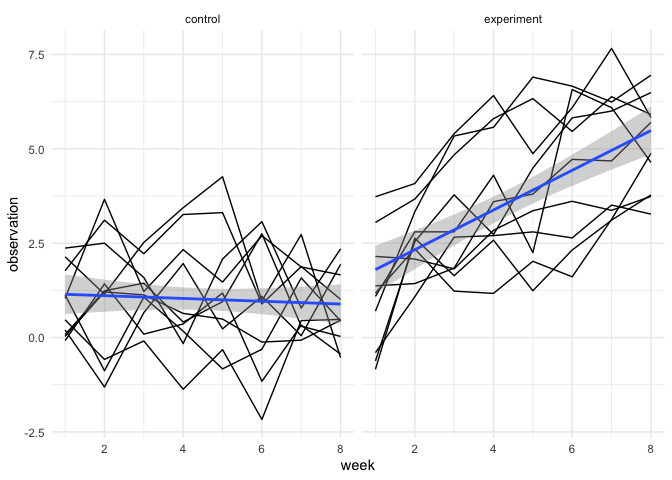

p8105\_hw5\_to2345
================

# Problem 1

For numeric variables, you should fill in missing values with the mean
of non-missing values For character variables, you should fill in
missing values with “virginica”

``` r
fill_na = function(x) {
  output = vector(length = length(x))
  for (i in 1:length(x)) {
    if (is.numeric(x[i])) {
      mean_i = mean(x[!is.na(x)])
      if (!is.na(x[i])) {
        output[i] = x[i]
      } else {
        output[i] = mean_i
      }
    } else if (is.character(x[i])) {
      if (!is.na(x[i])) {
        output[i] = x[i]
      } else {
        output[i] = "virginica"
      }
    }
  }
  output
}

iris_filled = map(iris_with_missing, fill_na) %>%
  as.data.frame()
```

# Problem 2

``` r
filenames = list.files("data")

study_data = 
  tibble(
    filenames = list.files("data"),
    path = str_c("./data/", filenames)
  ) %>% 
  mutate(
    data = map(path, read_csv)
  ) %>% 
  unnest() %>% 
  select(-path) %>% 
  pivot_longer(
    week_1:week_8,
    names_to = "week",
    values_to = "obs"
  ) %>% 
  mutate(
    arm = substr(filenames, 1, 3),
    arm = recode(arm, "con" = "control",
                      "exp" = "experiment"),
    subject_id = substr(filenames, 5, 6),
    subject_id = as.numeric(subject_id),
    week = substr(week, 6, 7),
    week = as.numeric(week)
  ) %>% 
  select(-filenames)
```

Here is the spaghetti plot showing observations on each subject over
time

``` r
study_data %>% 
  ggplot(
    aes(
      x = week,
      y = obs,
      group = subject_id
    )
  ) +
  geom_line() + 
  stat_smooth(
    aes(group = 1),
    method = "lm"
    ) +
  facet_grid(. ~arm) +
  theme_minimal() +
  ylab("observation")
```

<!-- -->

Comment: From the spaghetti plot, we can clearly see that the weekly
observation for the experiment group increases as time increases;
however, the observed data on the control arm did not show improvement
in the outcome and slight decrease is observed.
